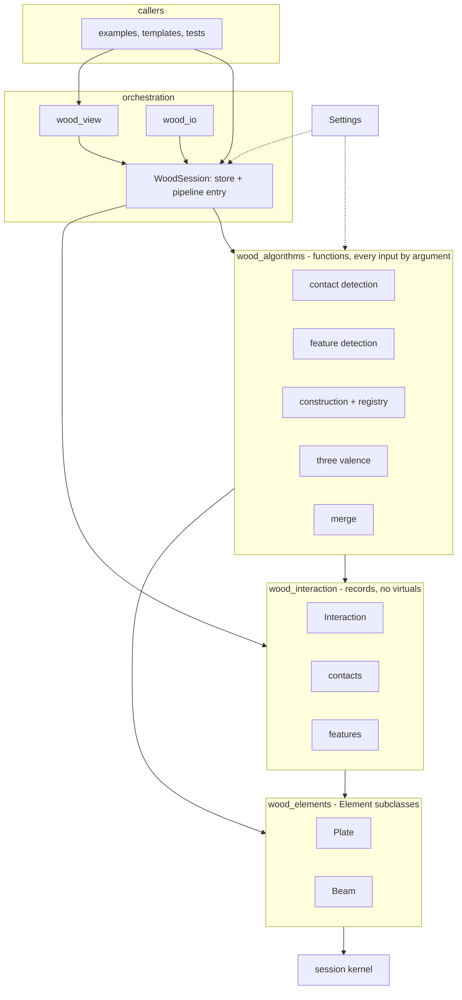

# Architecture

## Layers

- `wood_elements` knows the kernel. `wood_interaction` knows elements. `wood_algorithms` knows both and takes every input by argument, `Settings` included. `wood_session` orchestrates and stores; `wood_view` and `wood_io` sit beside it. Examples and templates sit on top.
- Composition throughout: an interaction is three lists, a contact or a feature is an envelope with a variant. Inheritance only for the element classes, because the kernel registry dispatches on `element_type`.
- One fact once on the edge side, with one deliberate exception: a `FeaturePlate` keeps its pair and its contact next to the edge and the interaction that also hold them. `WoodSession::consistent` checks they agree and the round trip asserts it.

## The review

--8<-- "src/docs.md:review"
