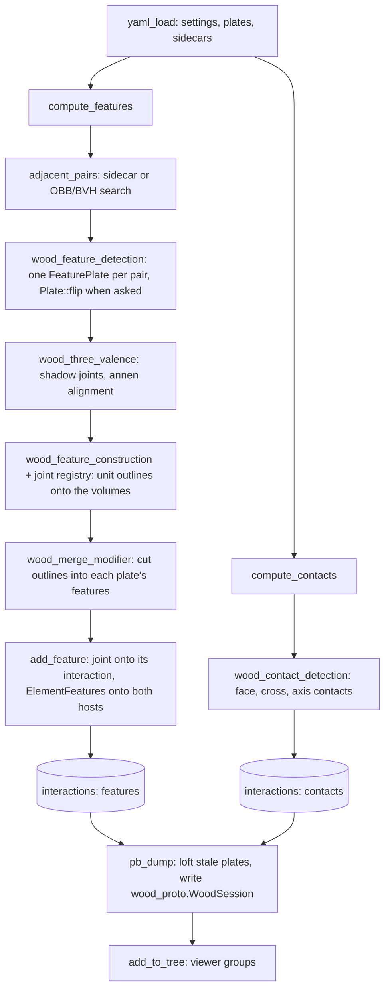
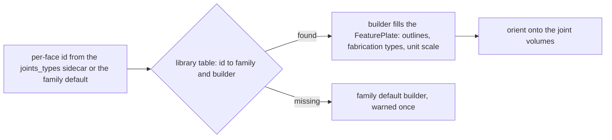

# Pipeline

- `WoodSession::yaml_load` reads the dataset yml into the scene's `settings` and the dataset paths, the obj into plates, and the four sidecars onto the scene (`adjacency`, `three_valence`) and the plates (insertion vectors, feature types).
- `compute_contacts` stores one `ContactFace` per overlapping face pair on the pair's interaction; `compute_cross_contacts`, `compute_line_contacts` and `compute_axis_contacts` add `ContactCross` and `ContactAxis` the same way.
- `compute_features` runs the solver: pairs, detection, three-valence links, construction through the joint registry, the merge, then every joint onto its interaction and its two hosts. When a joint wants the other face of the second plate first, `Plate::flip` swaps outlines and planes and resets every cache; removing that step changes eight datasets, so it is part of the method.
- Beams take the same shape: `compute_axis_contacts` finds the closest axis segments, `compute_beam_features` cuts four volume rectangles per pair through `wood_feature_detection_beam`.

## The joint registry

Families are id ranges of ten: 1-9 `ss_e_ip`, 10-19 `ss_e_op`, 20-29 `ts_e_p`, 30-39 `cr_c_ip`, 40-49 `tt_e_p`, 50-59 `ss_e_r`, 60-69 `b`. The table in `wood_feature_solver.cpp` is the only place ids are defined.

## Regression

Every dataset run writes `<name>.pb_coords.txt` and `<name>.pb_meta.txt` beside its `.pb`, every plate's merged outlines. `main_all_datasets` runs all 44 through `tools/run_guarded.sh`; a refactor is proven by a byte-identical diff of those files.
