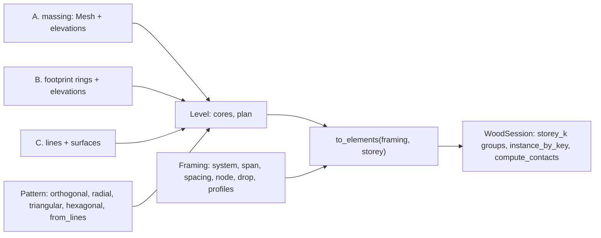

# Templates {#templates}

Generators under `src/templates/`, one folder per family (`grid/`, `reciprocal/`, `shells/`, `folding/`, `cross/`), that turn a surface, a mesh or a building outline into wood elements. Each has one example under `examples/`, a CMake target of the same name, that builds it with its defaults and writes `data/output/pb/live.pb` for the viewer; every screenshot below is that file rendered by session_viewer with the default grey. The code of the example follows each picture.

| Template | Header | Example | Elements |
|---|---|---|---|
| Translation shell | `shells/translation_shell.h` | `templates_translation_shell` | one chamfered plate per swept quad |
| Reflex fold | `folding/reflex_fold.h` | `templates_reflex_fold` | one plate per fold |
| Chevron | `shells/chevron.h` | `templates_chevron` | four plates per face of an Annen surface |
| Diamond mesh | `folding/diamond_mesh.h` | `templates_diamond_mesh` | one plate per triangle of a rhombus pattern |
| VDA mesh | `cross/vda_mesh.h` | `templates_vda_mesh` | one plate per face plus connector plates across every interior edge |
| Reciprocal move | `reciprocal/reciprocal_move.h` | `templates_reciprocal_move` | one beam plate per mesh edge, shifted past its neighbours |
| Reciprocal rotation | `reciprocal/reciprocal_rotation.h` | `templates_reciprocal_rotation` | one beam plate per mesh edge, rotated about its midpoint |
| Lamella gridshell | `shells/lamella_gridshell.h` | `templates_gridshell` | asymptotic or iso lamellas traced on a NURBS surface as Bowerbird does, boards as slabs of each lamella's rectifying developable (Schling 2022) in two layers, a hexagonal stud on the surface normal at every crossing |
| Grid | `grid/grid.h` | `1_elements_*`, `templates_grid_{footprint,solid,lines,reference,framing}` | columns, heads, girders, beams, purlins, braces, decks and walls of a multistorey building |

## translation_shell

A cross section polyline swept along a profile polyline by accumulating the profile's displacement steps: a quad mesh, then `Mesh::miter_contours` gives every quad a bottom and a top outline at the plate thickness, and the corners sharper than the chamfer angle are chamfered. `TranslationShell` holds the mesh and the plates in `elements`.

\include{lineno} templates_translation_shell.cpp

## reflex_fold

The profile folded along the cross section: each profile row is projected onto the perpendicular bisector plane at each cross-section point, so the strips alternate in a reflex fold. One plate per fold with its own bottom and top chamfer.

\include{lineno} templates_reflex_fold.cpp

## chevron

The Annen shell: one of the 23 NURBS surfaces in `data/annen_surfaces.json` divided into chevron strips, eight outlines per face folded into four plates, with the insertion vectors, joint types, three-valence groups and adjacency the solver reads. `wood_chevron::annen_surfaces` loads the surfaces, `Chevron` builds the mesh and the plates.

\include{lineno} templates_chevron.cpp

## diamond_mesh

A NURBS surface split into a rhombus pattern: triangle pairs that share alternating edge-midpoint vertices, six triangles per cell on the first row and four after, welded into one mesh. `Mesh::miter_contours` gives every triangle its bottom and top outline and the corners sharper than the chamfer angle are chamfered. The default surface is a bicubic arch, 3000 by 5000 with a rise of 1500.

\include{lineno} templates_diamond_mesh.cpp

## vda_mesh

Any mesh into plates and connectors: every face gets a bottom and top outline per face position, its sides cut back by the bisector planes between it and its neighbours so the plates meet in mitres; every interior edge gets a row of connector rectangles across it, two per subdivision, on the planes perpendicular to the edge. `VdaMesh` keeps the outlines in `f_polylines` and `e_polylines` as bottom, top pairs; the example turns each pair into a `Plate`. The default mesh is a fifteen-face hexagonal dome.

\include{lineno} templates_vda_mesh.cpp

## reciprocal_move

A nexorade by translation: the edges of a quad or hexagonal mesh on a surface become beams, the even edges of every face moved sideways in the face plane by the shift, so each beam bears on the next; every end is cut flush against the beam it lands on. The boundary is a frame of straight beams with one tilt per boundary curve, mirrored sections across every mitre and butt corners (`reciprocal_boundary.h`). `SURFACE` and `GRID` pick the case, `reciprocal_surface.h` holds the test surfaces and the meshes on them. One plate per beam.

\include{lineno} templates_reciprocal_move.cpp

## reciprocal_rotation

A nexorade by rotation: every mesh edge is stretched about its midpoint and turned about the edge normal, so the beams round each vertex form a pinwheel; each end then stops at the first side face it would cross. The same boundary frame as the move template. At home on quads, since on hexagons the rotated beams can cross each other.

\include{lineno} templates_reciprocal_rotation.cpp

## lamella_gridshell

A two-directional, two-layer lamella gridshell on a NURBS surface, after the asymptotic gridshells of Eike Schling (Schling, Wang, Hoyer, Pottmann, *Designing asymptotic geodesic hybrid gridshells*, CAD 2022) with the tracing of Thomas Oberbichler's Bowerbird. A lamella is a curve on the surface (`CurveOnSurface`): a cubic `NurbsCurve` in the parameter plane through the points of a trace, evaluated on the surface for its points, tangents (the parameter derivative mapped by dS/du and dS/dv) and normals. The trace is Bowerbird's `Pathfinder`: fourth-order Runge-Kutta steps of `step` mm through the parameter plane, at every stage the direction of the `Path` closer by |dot| in space to the last step, both ways from a seed until the domain boundary clips the step. A `Path` is the u and v iso-curves (`Path::isocurves()`) or the two directions of one normal curvature (`Path::normal_curvature(value)`, 0 the asymptotic curves), found as `FindNormalCurvature` does: the principal curvatures and directions from the shape operator of the second partials (`compute_curvature`), then Euler's formula cos 2a = (2 kn - k1 - k2) / (k1 - k2) turns the k1 direction by +a and -a. Seeds are input, `(u, v, 0)` points; `compute_seeds` spaces them along a segment and `compute_seed_line` gives the segment through the middle of the domain across a family. The first family takes the path's first direction at the middle of the domain and every seed the direction closer to the one the previous seed took, so a family never flips sides where the principal directions change sign; the second family takes the other. Nodes are the crossings of the two families' traces in the parameter plane refined by Newton onto the curves.

Along each lamella `compute_darboux` gives the Darboux frame (t, u = n x t, n) and the three invariants of a curve on a surface (Schling Sec. 2.1): normal curvature and geodesic torsion by Euler's formula from the principal curvatures and the angle p of t against the k1 direction, kn = k1 cos^2 p + k2 sin^2 p and tg = (k2 - k1) / 2 sin 2p (Eq. 3), and the geodesic curvature as the curve's curvature vector on u. A flat slat bent along a curve is the curve's rectifying developable, and standing normal to the surface it can only follow an asymptotic curve, where its rulings are r = tg t + kg n in the Darboux frame (Eq. 4): the normal only where the geodesic torsion vanishes. So a board on an asymptotic lamella is a slab of that developable, its stations every `sample` mm plus one at every node on the exact surface point, its section the rectangle `profile_rectangle(thickness, height)` lifted `spacing / 2` along the ruling n + tg / kg t (heights measured along the normal, as Schling's far edge c + w / (r . n) r) and shifted `(gap + thickness) / 2` across. The lean tg / kg is regularised to kg tg / (kg^2 + tg^2 / (4 r^2)) with r = `ruling` (tan 45 degrees): exact where it is small, never past r, and zero through an inflection of the lamella, where the developable degenerates (Schling warns against small curvature); within half a `block` of every node the ruling is the normal itself, blended in over `blend`, because the physical node forces the strip through the straight node axis (Schling Sec. 3.4). Iso-curve and constant-normal-curvature boards stand on the normal and are not developable. A board is a `BeamCurved` with the ruling as its station direction: its axis the chord-length cubic through the stations, each station at its chord-length parameter, one cubic rail through each section corner interpolated at those same parameters, so a ruling between two rails at one parameter is a station's edge, a ruled face between neighbouring rails and a planar cap at each end, one closed BRep solid, continuous through every node.

At every crossing a `Column` stud runs along the exact surface normal through the gaps of both layers, `overrun` past each outer face, its section a hexagon of three flat pairs `gap` apart, one pair along each lamella, so the four boards touch it along their rulings at the node. The example builds five scenes: a 10 m cubic saddle z = x^2 - y^2 (1 + s x) on its asymptotic curves, a 6 m one on its iso-curves, an 8 m hyperbolic paraboloid z = x y, whose asymptotic curves are straight lines, all exact bicubic Bezier patches; half of a catenoid r = c cosh(z / c) with c = 2 m as a NURBS fit of a minimal surface (a cubic B-spline profile through nine samples of cosh, two exact rational 90 degree arcs), both families seeded along its bottom rim; and the saddle again on curves of constant normal curvature 0.02 1/m (`Path::normal_curvature`), whose printed range 0.0198 to 0.0201 1/m validates Euler's formula. `Path::flat` stops a trace where the Gaussian curvature rises above -flat, at a flat point; a two-family net cannot surround one (the monkey saddle needs a singular node with six edges, Schling Sec. 3.4), so no scene shows it. For each scene it prints the range of normal curvature and the largest geodesic curvature and torsion along the lamellas, how far the rulings lean from the normal and how many stations were regularised, the twist, the unrolled deviation of the centreline, the tilt of the BRep faces off the sections and the rail error at the stations, how the studs fit their boards at the node, the twist of the strips against the straight studs at the stud ends, and the largest overlap. It fails unless every board is a valid six-face BRep solid, every lamella keeps its path's normal curvature within 5e-3 1/m (a bending radius of 200 m), every stud fits its four boards at the node within 0.1 mm, nothing overlaps and every board loads back from the file as a `BeamCurved`.

\include{lineno} templates_gridshell.cpp

## grid

`src/templates/grid/grid.h` builds a multistorey timber building from a rough shape in a few lines. Three structs a user meets, `wood_grid::Pattern`, `wood_grid::Framing` and `wood_grid::Building`, and the work behind them in three stages, one file each: `grid_levels.cpp` turns the input into level plans, `grid_joints.cpp` holds the joint rules, `grid.cpp` builds the elements; `grid_plan.h/.cpp` is the plan geometry and the records they share.

- `Pattern`: the plan lines a building is drawn on, in parallel families. `orthogonal(xs, ys, skew)`, `radial(radii, sectors, sweep)`, `triangular(side, nx, ny)`, `hexagonal(side, nx, ny)` and `from_lines(lines, families)`; `transformed(xform)` moves it under the building. `compute_bays(length, spacing)` lays Branch3D's whole bays plus a remainder over a length.
- `Framing`: how every level is framed and jointed. `system` 0 point supported, 1 post and beam, 2 purlin on girder; `span` the family the girders run on, -1 every line a beam; `spacing` of the purlin stations; `node` 0 head, 1 flush, 2 through; `drop` of the girder top; `deck`, `wall`, `head`, `reach`, `capital`, `panel`, `taper`, `facade`; and `Profiles`, a section per role (column, girder, beam, purlin, brace) from `wood_profile.h`: rectangle, round, W, HSS, double, slab band, T. A perimeter member is the girder, beam or purlin its line would carry inside.
- `Building`: the levels. `from_solid(massing, elevations, pattern, cores)` slices a closed mesh (workflow A; a BRep goes in as its `mesh()`), `from_footprint(rings, elevations, pattern, cores)` repeats a footprint at every level (workflow B), `from_lines(lines, surfaces)` reads drawn members and surfaces (workflow C). Every level holds its datum, its core rings and a `plan`, a kernel `Mesh::from_arrangement` of the pattern inside the section rings, whose faces are bays, edges member lines and vertices column points, with a double attribute per meaning a user may change before building. `to_elements(framing, storey)` gives the storey's elements in world space with their joints resolved, `to_session(session, framing)` adds every storey under a `storey_k` group.

Cores are never in the arrangement: a core ring makes pinwheel walls over the storey, a hole in every deck, no column inside it or within its wall band, and every member or purlin station crossing it is split at the wall's outer faces. A footprint ring, hole or courtyard must cross a pattern line to become a boundary of the plan.

The plan attributes a user may set before `to_elements`, all doubles; a face, edge or vertex without one takes the rule's value:

| On | Attribute | Meaning |
|---|---|---|
| face | `system`, `span` | the `Framing` field of that name for this bay |
| face | `floor` | 1 under a deck |
| edge | `role` | 0 none, 1 girder, 2 beam, 3 purlin, 4 brace |
| edge | `family`, `boundary`, `wall`, `line` | pattern family, 1 on the perimeter, 1 facade and 2 core wall, the source line id |
| vertex | `column` | 0 none, 1 a column, 2 a transfer nothing below carries |
| vertex | `boundary`, `line_a`, `line_b` | 1 on the perimeter; the two lines that made it, its identity across levels |

Joints are small rules in `grid_joints.cpp`, not per-case code. At every plan vertex the members are ranked (perimeter, girder, beam, purlin, brace); the highest runs through and the rest butt into its side, or into the column face under nodes 1 and 2; a member with anything straight across the node runs through it, so only a pure corner (an L of two perimeter members, a Y of three equal beams) is mitred on the bisector; a through member with nothing beyond it stops at the farthest corner of what butts into it, or over the column's far face under node 0. A member's height layer says whether a cut is made at all: girders drop by `drop`, a purlin over a stacked girder is not cut but rests on it. Decks are one Clipper difference per bay: the bay pushed out to the outer faces of the perimeter members and columns, minus the columns rising through it (node 2), the core walls, and the decks built before it, so a re-entrant corner belongs to one deck alone; `panel` splits a deck into strips across its span.

Column heads (`node` 0) take their shape from what they carry. Where members only rest on the head (one member, or two running straight on) the head is the column section extruded. Where it carries cut member ends or the deck itself (point supported) it flares to `reach`, by `Framing::capital`: 0 conical, a frustum from the column section; 1 stepped, a capital to halfway under a drop panel (a second element, `drop_panel`). A head is cut back at the deck edge and at a core wall. Every cut is a `Plane` in the element's `cuts`, applied by `Mesh::cut_by_plane` when the solid is built, so every element touches its neighbours face to face and none overlap; `templates_grid_framing` proves it by cutting every pair of overlapping elements against each other and failing on any volume left.

### 1_elements_flat

One bay over one storey, post and beam with the girders on the x sides: four columns, four conical heads, two girders and two beams mitred at the corners, a deck on the member tops. `compute_contacts(0)` pairs every element with every other and finds the 20 contacts the description lists.

\include{lineno} 1_elements_flat.cpp

### 1_elements_tree

The same bay three times side by side, each under its own branch of the tree, so `compute_contacts(1)` pairs elements only inside a branch. `INSTANCES` keeps one definition each of column, head, girder, beam and deck, placed by instances.

\include{lineno} 1_elements_tree.cpp

### templates_grid_footprint

Workflow B, nine buildings side by side over three storeys, one group each: an L with uneven bays, purlins on girders and facade walls; a grid whose y lines lean 30 degrees with flush columns; a radial plan with girders on the rays; triangular and hexagonal cells with every line a beam mitred at the nodes; five hand-drawn axes clipped to a five-sided footprint; a courtyard ring with columns through the levels; Branch3D's pentagon with girders hung 8 in and purlins at 10 ft; its institutional U with two cores as pinwheel walls.

\include{lineno} templates_grid_footprint.cpp

### templates_grid_solid

Workflow A, six massings sliced at their levels: a box; a pentagonal prism whose diagonal side cuts every girder, purlin and deck obliquely; a tapered loft whose perimeter columns lean to follow the moving section within `taper`; a podium with a tower, the tower ring added to the roof plan so every tower column stands on a podium column or girder; a block with an atrium through every level; a cylinder whose facet corners fall on the sixteen rays.

\include{lineno} templates_grid_solid.cpp

### templates_grid_lines

Workflow C, line by line: the crea dataset compas_grid ships, read from `data/crea/<INPUT>_input.pb`, every column, beam, floor, facade and core quad as drawn, the vertical quads as the walls compas_grid drops, every line a beam ending on the head tops and its neighbours' sides; and a braced frame drawn as lines and floor quads, every brace cut by the column faces, the deck top at its foot and the beam bottom at its head.

\include{lineno} templates_grid_lines.cpp

### templates_grid_reference

The reference configurations side by side: Branch3D's 60 ft square in its three structural methods (plate on columns with stepped heads under CLT strips, post and beam, purlin on girder with the girders hung 8 in), its residential L with a core, and the four FAST+EPP timber bay variants with the datum at the framing top, so the members overlay the reference: columns flush with the datum, girders cut by the column faces, purlins cut by the girder sides, CLT strips over the outer column faces. FAST+EPP v3 draws no beam on its short sides; here they carry beams.

\include{lineno} templates_grid_reference.cpp

### templates_grid_framing

The joints and sections, fifteen bays side by side: heads that are the column section where the girders run straight over them and conical at the corners, then conical and stepped under a point supported deck in strips; columns flush with the datum and running through the levels with the decks notched round them; purlins flush with, hung from and stacked over their girders; the seven profiles as girders with a matching column. The example ends with the clash check and fails on any overlap.

\include{lineno} templates_grid_framing.cpp
