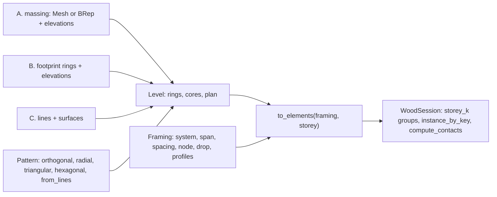

# Templates {#templates}

Generators under `src/templates/`, one folder per family (`grid/`, `reciprocal/`, `shells/`, `folding/`, `cross/`), that turn a surface, a mesh or a building outline into wood elements. Each has one example under `examples/`, a CMake target of the same name, that builds it with its defaults and writes `data/output/pb/live.pb` for the viewer; every screenshot below is that file rendered by session_viewer with the default grey. The code of the example follows each picture.

| Template | Header | Example | Elements |
|---|---|---|---|
| Translation shell | `shells/translation_shell.h` | `templates_translation_shell` | one chamfered plate per swept quad |
| Reflex fold | `folding/reflex_fold.h` | `templates_reflex_fold` | one plate per fold |
| Chevron | `shells/chevron.h` | `templates_chevron` | four plates per face of an Annen surface |
| Diamond mesh | `folding/diamond_mesh.h` | `templates_diamond_mesh` | one plate per triangle of a rhombus pattern |
| VDA mesh | `cross/vda_mesh.h` | `templates_vda_mesh` | one plate per face plus connector plates across every interior edge |
| Reciprocal move | `reciprocal/reciprocal_move.h` | `templates_reciprocal_move` | one beam plate per mesh edge, shifted past its neighbours |
| Reciprocal rotation | `reciprocal/reciprocal_rotation.h` | `templates_reciprocal_rotation` | one beam plate per mesh edge, rotated about its midpoint |
| Grid | `grid/grid.h` | `1_elements_*`, `templates_grid_*` | columns, heads, girders, beams, purlins, braces, decks and walls of a multistorey building |

## translation_shell

A cross section polyline swept along a profile polyline by accumulating the profile's displacement steps: a quad mesh, then `Mesh::miter_contours` gives every quad a bottom and a top outline at the plate thickness, and the corners sharper than the chamfer angle are chamfered. `TranslationShell` holds the mesh and the plates in `elements`.

\include{lineno} templates_translation_shell.cpp

## reflex_fold

The profile folded along the cross section: each profile row is projected onto the perpendicular bisector plane at each cross-section point, so the strips alternate in a reflex fold. One plate per fold with its own bottom and top chamfer.

\include{lineno} templates_reflex_fold.cpp

## chevron

The Annen shell: one of the 23 NURBS surfaces in `data/annen_surfaces.json` divided into chevron strips, eight outlines per face folded into four plates, with the insertion vectors, joint types, three-valence groups and adjacency the solver reads. `wood_chevron::annen_surfaces` loads the surfaces, `Chevron` builds the mesh and the plates.

\include{lineno} templates_chevron.cpp

## diamond_mesh

A NURBS surface split into a rhombus pattern: triangle pairs that share alternating edge-midpoint vertices, six triangles per cell on the first row and four after, welded into one mesh. `Mesh::miter_contours` gives every triangle its bottom and top outline and the corners sharper than the chamfer angle are chamfered. The default surface is a bicubic arch, 3000 by 5000 with a rise of 1500.

\include{lineno} templates_diamond_mesh.cpp

## vda_mesh

Any mesh into plates and connectors: every face gets a bottom and top outline per face position, its sides cut back by the bisector planes between it and its neighbours so the plates meet in mitres; every interior edge gets a row of connector rectangles across it, two per subdivision, on the planes perpendicular to the edge. `VdaMesh` keeps the outlines in `f_polylines` and `e_polylines` as bottom, top pairs; the example turns each pair into a `Plate`. The default mesh is a fifteen-face hexagonal dome.

\include{lineno} templates_vda_mesh.cpp

## reciprocal_move

A nexorade by translation: the edges of a quad or hexagonal mesh on a surface become beams, the even edges of every face moved sideways in the face plane by the shift, so each beam bears on the next; every end is cut flush against the beam it lands on. The boundary is a frame of straight beams with one tilt per boundary curve, mirrored sections across every mitre and butt corners (`reciprocal_boundary.h`). `SURFACE` and `GRID` pick the case, `reciprocal_surface.h` holds the test surfaces and the meshes on them. One plate per beam.

\include{lineno} templates_reciprocal_move.cpp

## reciprocal_rotation

A nexorade by rotation: every mesh edge is stretched about its midpoint and turned about the edge normal, so the beams round each vertex form a pinwheel; each end then stops at the first side face it would cross. The same boundary frame as the move template. At home on quads, since on hexagons the rotated beams can cross each other.

\include{lineno} templates_reciprocal_rotation.cpp

## grid

`src/templates/grid/grid.h` builds a multistorey timber building from a rough shape in a few lines. The work is split in three stages, one file each: `grid_levels.cpp` turns the input into level plans, `grid_joints.cpp` holds the joint rules, `grid.cpp` builds the elements; `grid_plan.h` is the plan geometry they share. Three structs, `wood_grid::Pattern`, `wood_grid::Framing` and `wood_grid::Building`:

- `Pattern`: the plan lines a building is drawn on, in parallel families. `orthogonal(xs, ys, skew)`, `radial(radii, sectors, sweep)`, `triangular(side, nx, ny)`, `hexagonal(side, nx, ny)` and `from_lines(lines, families)`; `transformed(xform)` moves it under the building. `compute_bays(length, spacing)` lays Branch3D's whole bays plus a remainder over a length.
- `Framing`: how every level is framed and jointed. `system` 0 point supported, 1 post and beam, 2 purlin on girder; `span` the family the girders run on, -1 every line a beam; `spacing` of the purlin stations; `node` 0 head, 1 flush, 2 through; `drop` of the girder top; `deck`, `wall`, `head`, `reach`, `capital`, `panel`, `taper`, `facade`; and `Profiles`, a section per role (column, girder, beam, purlin, edge girder, edge beam, brace) from `wood_profile.h`: rectangle, round, W, HSS, double, slab band, T.
- `Building`: the levels. `from_solid(massing, elevations, pattern, cores)` slices a closed mesh (workflow A), `from_footprint(rings, elevations, pattern, cores)` repeats a footprint at every level (workflow B), `from_lines(lines, surfaces)` reads drawn members and surfaces (workflow C). Every level holds its section rings, its cores and a `plan`, a kernel `Mesh` arrangement whose faces are bays, edges member lines and vertices column points, with a double attribute per meaning (system, span, role, width, depth, drop, column, through, ...) a user may change before building. `to_elements(framing, storey)` gives the storey's elements in world space with their joints resolved, `to_session(session, framing)` adds every storey under a `storey_k` group.

A section of a massing is resampled on the pattern: every point where a pattern line crosses the section becomes a corner and the corners of a faceted curve between them are dropped while the chord stays within `merge` of them, so a curved face gives columns on the pattern lines whatever its facet; corners turning more than 30 degrees are kept.

The plan attributes a user may set before `to_elements`, all doubles; a face, edge or vertex without one takes the rule's value:

| On | Attribute | Meaning |
|---|---|---|
| face | `system`, `span`, `spacing`, `thickness` | the `Framing` field of that name for this bay (`thickness` the deck's) |
| face | `floor`, `core` | 1 under a deck; 1 inside a core |
| edge | `role` | 0 none, 1 girder, 2 beam, 3 purlin, 4 edge girder, 5 edge beam |
| edge | `width`, `depth` | the member scaled to them, 0 its profile's own |
| edge | `drop` | the girder top below the datum, else the framing's |
| edge | `family`, `boundary`, `wall`, `line` | pattern family, 1 on the perimeter, 1 facade and 2 core wall, the source line id |
| vertex | `column` | 0 none, 1 a column, 2 a transfer nothing below carries |
| vertex | `through` | index of the member that runs through among the members at the vertex counter-clockwise from x |
| vertex | `boundary`, `line_a`, `line_b` | 1 on the perimeter; the two lines that made it, its identity across levels |

Joints are small rules in `grid_joints.cpp`, not per-case code: at every plan vertex the members are ranked (edge girder, edge beam, girder, beam, purlin, brace), the highest runs through and the rest butt into it, into the column face (nodes 1 and 2) or into the core wall's outer face; a member with anything straight across the node runs through it, so only a pure corner (an L of two equal members, a Y of three) is mitred; ends that overhang their supports past each other are mitred; the deck is pushed out to the outer faces of the boundary members, notched round the columns rising through it and holed over the cores; a head on the perimeter is cut back to the deck edge.

Column heads (`node` 0) take their shape from what they carry. Where members only rest on the head (one member, or two running straight on) the head is the column section extruded. Where it carries cut member ends (butts, mitres) or the deck itself (point supported) it flares to `reach`, by `Framing::capital`: 0 conical, a frustum from the column section; 1 stepped, a capital to halfway under a drop panel (a second element, `drop_panel`). Every head stays inside the deck outline. In the examples: stepped in `templates_grid_point_supported`; column-section heads where a girder passes straight over in `templates_grid_radial` (the middle ring) and `templates_grid_triangular` (the interior x lines); conical everywhere else under node 0 (`1_elements_*`, `templates_grid`, hex, irregular, the solid prism, taper and curved, crea, Branch square `SYSTEM` 0). Every cut is a `Plane` in the element's `cuts`, applied by `Mesh::cut_by_plane` when the solid is built, so every element touches its neighbours face to face and none overlap.

### 1_elements_flat

One bay over one storey, post and beam with the girders on the x sides: four columns, four heads, two edge girders running through, two edge beams butting into their sides, a deck on the member tops. `compute_contacts(0)` pairs every element with every other and finds the 20 contacts the description lists.

\include{lineno} 1_elements_flat.cpp

### 1_elements_tree

The same bay three times side by side, each under its own branch of the tree, so `compute_contacts(1)` pairs elements only inside a branch. `INSTANCES` keeps one definition each of column, head, edge girder, edge beam and deck, placed by instances.

\include{lineno} 1_elements_tree.cpp

### templates_grid

Workflow B on a three storey orthogonal building: uneven bays, an L-shaped footprint, purlin on girder floors with the girders on the x lines and purlin stations across every bay, facade walls under the perimeter members; every element under the `storey_k` group it caps or stands in.

\include{lineno} templates_grid.cpp

### templates_grid_skewed

Four by three bays whose y lines lean 30 degrees, every bounded cell a bay over two storeys; girders on the x lines, purlin stations parallel to the leaning cross lines, columns flush with the datum so every member butts obliquely into a column face and the decks rest over all.

\include{lineno} templates_grid_skewed.cpp

### templates_grid_radial

A radial pattern with an empty footprint, every bounded cell a bay: two rings of twelve sectors round an atrium over two storeys, girders on the rays running through the ring nodes, the inner and outer chords as edge beams mitred at the ring corners, heads shaped by the lines that meet at each node.

\include{lineno} templates_grid_radial.cpp

### templates_grid_triangular

Three families of lines at 0, 60 and 120 degrees over four by three rhombi, every bounded triangle a bay; girders on the x lines with the decks spanning between them and edge members round the boundary. `SPAN` -1 turns every side into a beam meeting its neighbours in mitres on six-sided heads.

\include{lineno} templates_grid_triangular.cpp

### templates_grid_hex

A hexagonal pattern over two storeys, every line a beam: three-valent interior nodes where three equal beams meet in V mitres on hexagonal heads, edge beams round the boundary, six hexagonal decks per level.

\include{lineno} templates_grid_hex.cpp

### templates_grid_irregular

Five hand-drawn axes at odd angles through `Pattern::from_lines`, clipped to a five-sided footprint over two storeys, every line a beam: the crossings become mitred nodes of four beams on heads shaped by their directions, the interior beams butt obliquely into the edge beams on the footprint.

\include{lineno} templates_grid_irregular.cpp

### templates_grid_courtyard

An outer ring with a clockwise hole over three storeys of 30 ft bays: girders on the x lines, columns through the levels with the decks notched round them, edge members and facade walls on the outer ring and on the courtyard ring alike, no deck over the courtyard.

\include{lineno} templates_grid_courtyard.cpp

### templates_grid_pentagon

Branch3D's pentagon preset: an orthogonal 30 ft grid clipped by a diagonal side, girders running y hung 8 in below the datum, purlin rows on the cross lines and stations at 10 ft spaced over the unclipped cells; the edge member on the diagonal runs through and every girder, purlin and deck meeting it ends on an oblique cut.

\include{lineno} templates_grid_pentagon.cpp

### templates_grid_solid_box

Workflow A on the simplest massing, a box sliced at three storeys: every section the same rectangle filled with the same 6 m pattern, girders on the y lines with the decks spanning between them, columns flush with the datum. The result equals the footprint workflow of the same rectangle.

\include{lineno} templates_grid_solid_box.cpp

### templates_grid_solid_prism

A pentagon with one diagonal side lofted straight up and sliced at three storeys, the orthogonal pattern clipped by every section, girders on the x lines and purlin stations across the bays, heads under the members; the diagonal edge member runs through with every girder, purlin and deck meeting it on an oblique cut.

\include{lineno} templates_grid_solid_prism.cpp

### templates_grid_solid_taper

A loft between two rectangles sliced at four storeys, every level's section filled with the same orthogonal pattern: the interior columns vertical, the perimeter columns inclined to follow the moving section within the `taper` angle, decks and edge members on each level's own section.

\include{lineno} templates_grid_solid_taper.cpp

### templates_grid_solid_setback

A two storey podium with a four storey tower standing on it, one closed shell sliced at every elevation. At the podium roof the section just below is the podium and just above the tower; the plan fills their union so the terrace deck covers the podium ring, and the tower ring is added as lines to the roof plan so every tower column stands on a vertex with a podium column or girder below, no transfer.

\include{lineno} templates_grid_solid_setback.cpp

### templates_grid_solid_atrium

A square block with a centred atrium lofted between an outer and an inner ring, sliced at five storeys: every section comes back as an outer ring with a hole, the pattern crossing at the centre falls in the hole and gets no column, the atrium ring joins the arrangement so edge members and columns surround it, columns through the levels with every deck notched round them.

\include{lineno} templates_grid_solid_atrium.cpp

### templates_grid_solid_curved

A BRep cylinder meshed at 10 degree facets and sliced at four storeys, every section resampled so its corners are where the sixteen radial rays cross it: girders on the rays running through the ring nodes, the chords as purlin rows with stations between them, edge members mitred at the facet corners, heads shaped by the lines at each node.

\include{lineno} templates_grid_solid_curved.cpp

### templates_grid_braced

Workflow C, line by line: columns, beams and diagonal braces drawn as 3D lines and the floors as quads, two by two bays over two storeys with a brace in every end bay. The horizontal lines make each level's plan, the vertical lines its column points, the floor quads its decks, the tilted lines its braces; every beam is cut by the column faces, every brace by the column faces, the deck top at its foot and the beam bottom at its head.

\include{lineno} templates_grid_braced.cpp

### templates_grid_crea

Workflow C on the crea dataset compas_grid ships, read from `data/crea/<INPUT>_input.pb`: every column, beam, floor, facade and core quad as drawn; the vertical lines as column points, the horizontal lines and floor edges as the plan of their level, the vertical quads as the facade and core walls compas_grid drops. Every line a beam ending on the head tops and its neighbours' sides, decks on the beams, walls between the column faces.

\include{lineno} templates_grid_crea.cpp

### templates_grid_framings

The three purlin on girder joints side by side, one bay each, by `DROPS`: flush, the purlin cut by the girder side over its full depth; hung, the girder top 8 in lower and the purlin bearing on the part of its side above it; stacked, the girder a whole purlin depth lower and the purlin running over it.

\include{lineno} templates_grid_framings.cpp

### templates_grid_point_supported

Branch3D's point supported plate: an L footprint over a tight column grid of 11.5 by 15 ft with two cores, no beams at all, every column ending in a stepped head under the deck (a capital under a drop panel, `CAPITAL` 0 for a conical one), the CLT in strips as wide as the column spacing along the y lines so their joints fall on the column lines, core walls in pinwheels with deck holes.

\include{lineno} templates_grid_point_supported.cpp

### templates_grid_profiles

The profile library: seven purlin on girder bays in a row, one per girder profile (rectangle, round, W, HSS with its hole, double as two members with the same cuts, slab band, T) with a matching column, flush columns the girders and edge purlins frame into, purlin stations hung flush with the girders; every solid closed with its volume the profile area times its length, no clash.

\include{lineno} templates_grid_profiles.cpp

### templates_grid_branch_square

Branch3D's 60 ft square over 15 ft bays in its three structural methods by `SYSTEM`: plate on columns with heads under the CLT strips and no members, post and beam with girders on the x lines, purlin on girder with the girders running y hung 8 in and purlin rows at 10 ft; under the two framed methods the columns run through the two storeys with the decks notched round them.

\include{lineno} templates_grid_branch_square.cpp

### templates_grid_branch_residential

Branch3D's residential L by `VARIANT`: the residential preset over 30 ft bays with girders running y hung 8 in, purlin rows on the cross lines and stations at 10 ft and one core; or the topology T2 post and beam over 25 by 15 ft bays with Branch's stair and lift cores. Columns through the levels, cores as pinwheel walls with deck holes, every girder and purlin reaching a core cut at its outer face, no column inside, on or against a core wall.

\include{lineno} templates_grid_branch_residential.cpp

### templates_grid_branch_office

Branch3D's office preset: a 150 by 180 ft rectangle with a stair core and a lift core, four framings by `VARIANT` over 30 ft column lines, columns through the levels with the decks notched round them, cores as pinwheel walls with deck holes and every girder and purlin reaching them cut at their outer faces.

\include{lineno} templates_grid_branch_office.cpp

### templates_grid_branch_institutional

Branch3D's institutional preset: a U footprint over 30 ft bays with two cores, one of them notching the inner corner of the courtyard, girders running y hung 8 in, purlin rows on the cross lines and stations at 10 ft, columns through the levels, core walls in pinwheels with the members that reach them cut at their outer faces.

\include{lineno} templates_grid_branch_institutional.cpp

### templates_grid_fastepp

The four FAST+EPP timber bay variants, one storey each, the datum at the framing top so the members overlay the reference to the millimetre: columns flush with the datum, girders along the short side cut by the column faces, edge purlins on the column lines, interior purlins at the tool's spacing cut by the girder sides, CLT strips over the outer column faces; v3 has no purlins and no beam on its short sides, two overrides on the plan edges.

\include{lineno} templates_grid_fastepp.cpp
