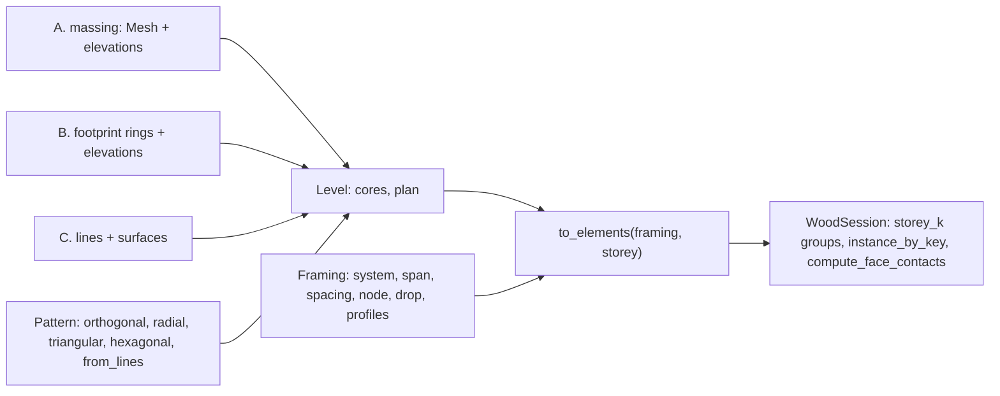
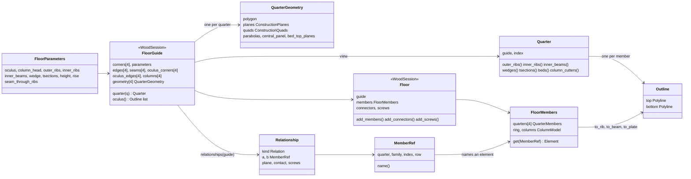

# Templates {#templates}

Generators under `src/templates/`, one folder per family (`grid/`, `reciprocal/`, `shells/`, `folding/`, `cross/`), that turn a surface, a mesh or a building outline into wood elements. Each has one example under `examples/`, a CMake target of the same name, that builds it with its defaults and writes `data/output/pb/live.pb` for the viewer; every screenshot below is that file rendered by session_viewer with the default grey. The code of the example follows each picture.

| Template | Header | Example | Elements |
|---|---|---|---|
| Translation shell | `shells/translation_shell.h` | `templates_shells_1_translation_shell` | one chamfered plate per swept quad |
| Reflex fold | `folding/reflex_fold.h` | `templates_folding_1_reflex_fold` | one plate per fold |
| Chevron | `shells/chevron.h` | `templates_folding_2_chevron` | four plates per face of an Annen surface |
| Diamond mesh | `folding/diamond_mesh.h` | `templates_folding_3_diamond_mesh` | one plate per triangle of a rhombus pattern |
| VDA mesh | `cross/vda_mesh.h` | `templates_cross_1_vda_mesh` | one plate per face plus connector plates across every interior edge |
| Reciprocal move | `reciprocal/reciprocal_move.h` | `templates_reciprocal_2_move` | one beam plate per mesh edge, shifted past its neighbours |
| Reciprocal rotation | `reciprocal/reciprocal_rotation.h` | `templates_reciprocal_1_rotation` | one beam plate per mesh edge, rotated about its midpoint |
| Lamella gridshell | `shells/lamella_gridshell.h` | `templates_shells_2_gridshell` | two upright boards per lamella on iso or asymptotic curves, in two layers, a hexagonal stud at every crossing |
| Grid | `grid/grid.h` | `1_elements_*`, `templates_grid_{footprint,solid,lines,reference,framing}` | columns, heads, girders, beams, purlins, braces, decks and walls of a multistorey building |
| Floor | `floor/floor.h` | `templates_floor_{1..8}_*` | the vaulted timber floor bay of compas_tf: outer and inner ribs, seam and oculus beams, wedge blocks, t-sections, beds, the oculus ring, columns on supports and their connectors |

## translation_shell

A cross section polyline swept along a profile polyline by accumulating the profile's displacement steps: a quad mesh, then `Mesh::miter_contours` gives every quad a bottom and a top outline at the plate thickness, and the corners sharper than the chamfer angle are chamfered. `TranslationShell` holds the mesh and the plates in `elements`.


\include{lineno} templates_shells_1_translation_shell.cpp

## reflex_fold

The profile folded along the cross section: each profile row is projected onto the perpendicular bisector plane at each cross-section point, so the strips alternate in a reflex fold. One plate per fold with its own bottom and top chamfer.


\include{lineno} templates_folding_1_reflex_fold.cpp

## chevron

The Annen shell: one of the 23 NURBS surfaces in `data/annen_surfaces.json` divided into chevron strips, eight outlines per face folded into four plates, with the insertion vectors, joint types, three-valence groups and adjacency the solver reads. `wood_chevron::annen_surfaces` loads the surfaces, `Chevron` builds the mesh and the plates.


\include{lineno} templates_folding_2_chevron.cpp

## diamond_mesh

A NURBS surface split into a rhombus pattern: triangle pairs that share alternating edge-midpoint vertices, six triangles per cell on the first row and four after, welded into one mesh. `Mesh::miter_contours` gives every triangle its bottom and top outline and the corners sharper than the chamfer angle are chamfered. The default surface is a bicubic arch, 3000 by 5000 with a rise of 1500.


\include{lineno} templates_folding_3_diamond_mesh.cpp

## vda_mesh

Any mesh into plates and connectors: every face gets a bottom and top outline per face position, its sides cut back by the bisector planes between it and its neighbours so the plates meet in mitres; every interior edge gets a row of connector rectangles across it, two per subdivision, on the planes perpendicular to the edge. `VdaMesh` keeps the outlines in `f_polylines` and `e_polylines` as bottom, top pairs; the example turns each pair into a `Plate`. The default mesh is a fifteen-face hexagonal dome.


\include{lineno} templates_cross_1_vda_mesh.cpp

## reciprocal_move

A nexorade by translation: the edges of a quad or hexagonal mesh on a surface become beams, the even edges of every face moved sideways in the face plane by the shift, so each beam bears on the next; every end is cut flush against the beam it lands on. The boundary is a frame of straight beams with one tilt per boundary curve, mirrored sections across every mitre and butt corners (`reciprocal_boundary.h`). `SURFACE` and `GRID` pick the case, `reciprocal_surface.h` holds the test surfaces and the meshes on them. One plate per beam.


\include{lineno} templates_reciprocal_2_move.cpp

## reciprocal_rotation

A nexorade by rotation: every mesh edge is stretched about its midpoint and turned about the edge normal, so the beams round each vertex form a pinwheel; each end then stops at the first side face it would cross. The same boundary frame as the move template. At home on quads, since on hexagons the rotated beams can cross each other.


\include{lineno} templates_reciprocal_1_rotation.cpp

## lamella_gridshell

A two-directional, two-layer lamella gridshell on a NURBS surface, after the asymptotic gridshells of Eike Schling. `curves` picks the two lamella families: 0 the u and v iso-curves, on any surface; 1 the asymptotic curves, where the normal curvature II(d, d) is zero, on a surface of negative Gaussian curvature. Each family is traced in (u, v) with fixed RK4 steps of `step` mm, as Bowerbird does, from seeds at even arc lengths along a spine of the other family through the middle of the domain, until it reaches the surface edge; the crossings are found segment against segment in (u, v). The first family is the top layer, `spacing / 2` up the local surface normal, the second the bottom layer, as far down.

Every lamella is two upright boards, `height` along the local normal and `thickness` across, `gap` apart: each board is a `Beam` on the lamella centreline with a `profile_rectangle(thickness, height)` section moved up and across in the section frame, and the local normal as its up direction at every station, so every section is the rectangle the local normal and the normal cross the tangent span, and the board sides are ruled by the surface normals. The boards run straight for a gap either side of every crossing and past each end, and follow the curve between. At every crossing a `Column` stud runs along the normal through the gaps of both layers, `overrun` past each outer face. Its section is a hexagon of three flat pairs, all `gap` across: one pair against the top boards, one against the bottom boards and one across the long corners, so the stud touches all four boards and cuts none; a 60 degree crossing gives the regular hexagon. `spacing` must be at least `height`, or the layers overlap.

Along an asymptotic curve the normal curvature is zero, so a board standing on the normal bends only about its weak axis and unrolls to a straight strip: the point of the system. The example builds a 10 m saddle in asymptotic mode and a 6 m one in iso mode beside it, and prints for each the largest normal curvature along the lamellas, the largest distance of an unrolled lamella from a straight line and the largest tilt of a board section from the normal; both first numbers are about zero for the asymptotic shell and large for the iso one. It then finds the face contacts, fails unless every stud touches its four boards, and cuts every two convex pieces (a board segment, a stud) of different elements by each other, failing on any volume left.


\include{lineno} templates_shells_2_gridshell.cpp

## grid

`src/templates/grid/grid.h` builds a multistorey timber building from a rough shape in a few lines. Three structs a user meets, `wood_grid::Pattern`, `wood_grid::Framing` and `wood_grid::Building`, and the work behind them in three stages, one file each: `grid_levels.cpp` turns the input into level plans, `grid_joints.cpp` holds the joint rules, `grid.cpp` builds the elements; `grid_plan.h/.cpp` is the plan geometry and the records they share.

- `Pattern`: the plan lines a building is drawn on, in parallel families. `orthogonal(xs, ys, skew)`, `radial(radii, sectors, sweep)`, `triangular(side, nx, ny)`, `hexagonal(side, nx, ny)` and `from_lines(lines, families)`; `transformed(xform)` moves it under the building. `compute_bays(length, spacing)` lays Branch3D's whole bays plus a remainder over a length.
- `Framing`: how every level is framed and jointed. `system` 0 point supported, 1 post and beam, 2 purlin on girder; `span` the family the girders run on, -1 every line a beam; `spacing` of the purlin stations; `node` 0 head, 1 flush, 2 through; `drop` of the girder top; `deck`, `wall`, `head`, `reach`, `capital`, `panel`, `taper`, `facade`; and `Profiles`, a section per role (column, girder, beam, purlin, brace) from `wood_profile.h`: rectangle, round, W, HSS, double, slab band, T. A perimeter member is the girder, beam or purlin its line would carry inside.
- `Building`: the levels. `from_solid(massing, elevations, pattern, cores)` slices a closed mesh (workflow A; a BRep goes in as its `mesh()`), `from_footprint(rings, elevations, pattern, cores)` repeats a footprint at every level (workflow B), `from_lines(lines, surfaces)` reads drawn members and surfaces (workflow C). Every level holds its datum, its core rings and a `plan`, a kernel `Mesh::from_arrangement` of the pattern inside the section rings, whose faces are bays, edges member lines and vertices column points, with a double attribute per meaning a user may change before building. `to_elements(framing, storey)` gives the storey's elements in world space with their joints resolved, `to_session(session, framing)` adds every storey under a `storey_k` group.

Cores are never in the arrangement: a core ring makes pinwheel walls over the storey, a hole in every deck, no column inside it or within its wall band, and every member or purlin station crossing it is split at the wall's outer faces. A footprint ring, hole or courtyard must cross a pattern line to become a boundary of the plan.

The plan attributes a user may set before `to_elements`, all doubles; a face, edge or vertex without one takes the rule's value:

| On | Attribute | Meaning |
|---|---|---|
| face | `system`, `span` | the `Framing` field of that name for this bay |
| face | `floor` | 1 under a deck |
| edge | `role` | 0 none, 1 girder, 2 beam, 3 purlin, 4 brace |
| edge | `family`, `boundary`, `wall`, `line` | pattern family, 1 on the perimeter, 1 facade and 2 core wall, the source line id |
| vertex | `column` | 0 none, 1 a column, 2 a transfer nothing below carries |
| vertex | `boundary`, `line_a`, `line_b` | 1 on the perimeter; the two lines that made it, its identity across levels |


```mermaid
flowchart LR
    A["A. massing: Mesh + elevations"] --> L["Level: cores, plan"]
    B["B. footprint rings + elevations"] --> L
    C["C. lines + surfaces"] --> L
    P["Pattern: orthogonal, radial, triangular, hexagonal, from_lines"] --> L
    L --> E["to_elements(framing, storey)"]
    F["Framing: system, span, spacing, node, drop, profiles"] --> E
    E --> S["WoodSession: storey_k groups, instance_by_key, compute_face_contacts"]
```

Joints are small rules in `grid_joints.cpp`, not per-case code. At every plan vertex the members are ranked (perimeter, girder, beam, purlin, brace); the highest runs through and the rest butt into its side, or into the column face under nodes 1 and 2; a member with anything straight across the node runs through it, so only a pure corner (an L of two perimeter members, a Y of three equal beams) is mitred on the bisector; a through member with nothing beyond it stops at the farthest corner of what butts into it, or over the column's far face under node 0. A member's height layer says whether a cut is made at all: girders drop by `drop`, a purlin over a stacked girder is not cut but rests on it. Decks are one Clipper difference per bay: the bay pushed out to the outer faces of the perimeter members and columns, minus the columns rising through it (node 2), the core walls, and the decks built before it, so a re-entrant corner belongs to one deck alone; `panel` splits a deck into strips across its span.

Column heads (`node` 0) take their shape from what they carry. Where members arrive the head is a convex pyramid exactly as deep as they are: one side per plan direction, the side under a member its sloped end face that the member rests on, every other side on the column face, and a sloped chamfer between every two neighbouring members, as compas_grid's column head. Under post and beam the deck sits in the bay between the members, its top flush with theirs and its corners cut by the heads. Where only the deck arrives (point supported) the head flares up to `reach`, by `Framing::capital`: 0 conical, a frustum from the column section; 1 stepped, a capital to halfway under a drop panel (a second element, `drop_panel`), cut back at the deck edge. Every head is cut back at a core wall. Every cut is a `Plane` in the element's `cuts`, applied by `Mesh::cut_by_plane` when the solid is built, so every element touches its neighbours face to face and none overlap; `templates_grid_5_framing` proves it by cutting every pair of overlapping elements against each other and failing on any volume left.

### 3_elements_tree

A two storey L of five bays - three by two with the far corner bay left open - with a beam on every grid line, so the heads meet every case: two beams at the outer corners, three on the edges, four inside and at the re-entrant corner. Each storey is a branch of the tree with a group per kind of element, and `compute_face_contacts(0)` pairs across the storeys, every column standing on the head below. `INSTANCES` keeps one definition each of column, head, beam and deck, placed by instances.


\include{lineno} 3_elements_tree.cpp

### templates_grid_1_footprint

Workflow B, nine buildings side by side over three storeys, one group each: an L with uneven bays, purlins on girders and facade walls; a grid whose y lines lean 30 degrees with flush columns; a radial plan with girders on the rays; triangular and hexagonal cells with every line a beam mitred at the nodes; five hand-drawn axes clipped to a five-sided footprint; a courtyard ring with columns through the levels; Branch3D's pentagon with girders hung 8 in and purlins at 10 ft; its institutional U with two cores as pinwheel walls.


\include{lineno} templates_grid_1_footprint.cpp

### templates_grid_2_solid

Workflow A, six massings sliced at their levels: a box; a pentagonal prism whose diagonal side cuts every girder, purlin and deck obliquely; a tapered loft whose perimeter columns lean to follow the moving section within `taper`; a podium with a tower, the tower ring added to the roof plan so every tower column stands on a podium column or girder; a block with an atrium through every level; a cylinder whose facet corners fall on the sixteen rays.


\include{lineno} templates_grid_2_solid.cpp

### templates_grid_3_lines

Workflow C, line by line: the crea dataset compas_grid ships, read from `data/crea/<INPUT>_input.pb`, every column, beam, floor, facade and core quad as drawn, the vertical quads as the walls compas_grid drops, every line a beam ending on the head tops and its neighbours' sides; and a braced frame drawn as lines and floor quads, every brace cut by the column faces, the deck top at its foot and the beam bottom at its head.


\include{lineno} templates_grid_3_lines.cpp

### templates_grid_4_reference

The reference configurations side by side: Branch3D's 60 ft square in its three structural methods (plate on columns with stepped heads under CLT strips, post and beam, purlin on girder with the girders hung 8 in), its residential L with a core, and the four FAST+EPP timber bay variants with the datum at the framing top, so the members overlay the reference: columns flush with the datum, girders cut by the column faces, purlins cut by the girder sides, CLT strips over the outer column faces. FAST+EPP v3 draws no beam on its short sides; here they carry beams.


\include{lineno} templates_grid_4_reference.cpp

### templates_grid_5_framing

The joints and sections, fifteen bays side by side: heads that are the column section where the girders run straight over them and conical at the corners, then conical and stepped under a point supported deck in strips; columns flush with the datum and running through the levels with the decks notched round them; purlins flush with, hung from and stacked over their girders; the seven profiles as girders with a matching column. The example ends with the clash check and fails on any overlap.


\include{lineno} templates_grid_5_framing.cpp

## floor

`src/templates/floor/floor.h` is the timber vaulted floor bay of compas_tf (`compas_tf/floor_guide.py` and its `example_model_*` scripts) as a parametric model, designed in `docs/floor_parametric_model.md`. Two classes, both a `WoodSession`. `wood_floor::FloorGuide` is the geometry: the four bay corners counter-clockwise at the floor datum and `FloorGuide::Parameters` (the oculus distance and every thickness, offset, depth and angle, each with a default), from which it computes once the bay edges, seams, oculus, columns and every quarter's planes, quads and parabolas, and draws them into itself; example 1 writes it. `wood_floor::Floor` is the model: built from a guide step by step (`add_column`, `add_columns`, `add_quarters`, `add_oculus`, `add_members`, `add_connectors`, `add_screws`), it holds the members, connectors and screws, and a scene of several templates takes it in with `merge` or `graft`. Both trees are grouped by quarter first, `quarter_0` … `quarter_3`, and `get_branch("quarter_0")` takes one quarter out as a `WoodSession` of its own, the wood elements, joints, settings and plate adjacency kept:

```cpp
wood_floor::Floor floor(wood_floor::FloorGuide::rectangle(3000.0, 2400.0));
floor.add_connectors();
floor.add_screws();
floor.pb_dump(pb_path("live"));

WoodSession scene("building");
scene.graft(floor, scene.add_group("level_1"));

WoodSession quarter = floor.get_branch("quarter_0");
```

### Floor data structures

Four layers, each built from the one before; only the first two hold geometry of their own, the last two are a scene.


```mermaid
classDiagram
    direction LR
    class FloorParameters {
        oculus, column_head, outer_ribs, inner_ribs
        inner_beams, wedge, tsections, height, rise
        seam_through_ribs
    }
    class FloorGuide {
        <<WoodSession>>
        corners[4], parameters
        edges[4], seams[4], oculus_corners[4]
        oculus_edges[4], columns[4]
        geometry[4] QuarterGeometry
        quarter(q) Quarter
        oculus() Outline list
    }
    class QuarterGeometry {
        polygon
        planes ConstructionPlanes
        quads ConstructionQuads
        parabolas, central_panel, bed_top_planes
    }
    class Quarter {
        guide, index
        outer_ribs() inner_ribs() inner_beams()
        wedges() tsections() beds() column_cutters()
    }
    class Outline {
        top Polyline
        bottom Polyline
    }
    class Floor {
        <<WoodSession>>
        guide
        members FloorMembers
        connectors, screws
        add_members() add_connectors() add_screws()
    }
    class FloorMembers {
        quarters[4] QuarterMembers
        ring, columns ColumnModel
        get(MemberRef) Element
    }
    class Relationship {
        kind Relation
        a, b MemberRef
        plane, contact, screws
    }
    class MemberRef {
        quarter, family, index, row
        name()
    }
    FloorParameters --> FloorGuide
    FloorGuide --> QuarterGeometry : one per quarter
    FloorGuide --> Quarter : view
    Quarter --> Outline : one per member
    FloorGuide --> Floor
    Floor --> FloorMembers
    FloorMembers --> Outline : to_rib, to_beam, to_plate
    FloorGuide --> Relationship : relationships(guide)
    Relationship --> MemberRef
    MemberRef --> FloorMembers : names an element
```

- **Guide.** `FloorGuide` computes everything once, from the corners and `FloorParameters`: the shared entities (`edges`, `seams`, `oculus_corners`, `oculus_edges`, `columns`) and one `QuarterGeometry` per quarter, whose `planes` hold the two face planes of every member and whose `quads` its plan footprint at the floor datum, index i of a family being member i. It draws them into itself under the member names below.
- **Outlines.** `guide.quarter(q)` is a view that builds a quarter's members as `Outline`s, a pair of closed polylines a member is lofted between, at the floor datum; `guide.oculus()` gives the ring's four beams, four bottom wedges and the central plate. No element exists yet.
- **Elements.** `Floor` turns every outline into an element lifted to `bay_height`: ribs and inner beams `BeamVariable` (`to_rib`, `to_beam`), every other member a `Plate` (`to_plate`), and per corner a `Support` and a `Column` carved by its head cuts. `FloorMembers` keeps them by quarter and family as `Member`s, the element and the thickness its connectors are sized by.
- **Relations.** `relationships(guide)` lists what two members share, as rules of the design, not as a search: a `Relationship` holds its `Relation` kind, the two members as `MemberRef`s, the plane they meet on, the contact polygon and, for a screw kind, the screw axes. `add_connectors` and `add_screws` make one `JointBeam` per relationship, which cuts its holes into both members as "drill" features.

Every member has one name, the same in the guide, the outline list and the scene, and `MemberRef::name()` gives it:

| Family | Count per quarter | Element | Name |
|---|---|---|---|
| `outer_ribs` | 2 | `BeamVariable` | `outer_ribs_<i>_<q>` |
| `inner_ribs` | 2 | `BeamVariable` | `inner_ribs_<i>_<q>` |
| `inner_beams` | 3: seam, oculus edge, seam | `BeamVariable` | `inner_beams_<i>_<q>` |
| `wedges` | 3 at the column head | `Plate` | `wedges_<i>_<q>` |
| `tsections` | 6 beside the ribs | `Plate` | `tsections_<i>_<q>` |
| `beds` | 3 rows | `Plate` | `beds_<row>_<i>_<q>` |
| ring | 1 beam and 1 bottom wedge | `BeamVariable`, `Plate` | `oculus_<q>`, `oculus_<q + 4>` |
| column | 1 support, 1 column | `Support`, `Column` | `support_<q>`, `column_<q>` |
| central plate | 1 for the floor | `Plate` | `oculus_8` |

The scene tree is grouped by quarter first: `quarter_<q>` holds one group per family, `column_<q>`, `oculus_<q>` and `connectors_<q>` with its connectors and screws; the central plate sits in `oculus`. The four quarters are the same up to placement on a square bay, so one quarter, one column and the oculus describe every part: `get_branch("quarter_0")` takes quarter 0 with its column, ring part and connectors as a `WoodSession` of its own.

The constructor computes every shared entity once (the bay edges with their rib bands, the four seams, the oculus corners and edges, the four column corners with their carved fans and cutter levels) and every quarter's geometry once; `guide.quarter(q)` is a view that only builds that quarter's member outlines, in place at its own corner, so a rectangle is the mirror tiling of compas_tf's quarter and the square is exactly compas_tf's turned quarter. The ring is built from the four quarters' own oculus edges. The guide refuses a plan whose ring would leave a quarter's oculus beam uncovered.

Three rules generalise what compas_tf's square left implicit: rule A for the central panel (the inner ribs swept along one direction solved so the central bed is one planar-faced cylinder between them; on the square it is compas_tf's chamfer direction), rib end faces cut in their end planes on each rib face, and the central panel's layers as offsets in its own cross-section, exactly `tsections` thick on every plan. Every outer rib's straight run-in is solved so both outer ribs of a corner end on their fan planes at one level, the shallower of their two ends, and the middle column cutter level is that level; on a rectangle rule A then sweeps the inner ribs within half a degree of the chamfer and every rib meets the head within 0.2 mm of the level.

Connectors come from `relationships(floor)`, 48 rows with the seams through the ribs (4 seam wedges, 4 oculus wedges, 8 column plates, 4 cross laps, 24 block dowel sets, 4 supports; tied, 4 ties more) with their contact polygons read off the members' outlines on the shared planes; `add_connectors` makes one `JointBeam` per row through the factories, `verify_contacts` checks every one against the kernel's contact search, `require_contact` throws naming a relation that does not touch. Every connector node and every part and dowel nested under it is BRG blue, RGB 38 / 149 / 233 (`CONNECTOR_COLOR`). Each connector lives in its quarter: `quarter_q > connectors_q`. The six head cutters of every column are solid cuts of the column itself, shown as its cut features, not elements of the scene. Every member also carries a "drill" feature per hole a joint makes in it, dowels, screws and the support screws alike: the two circles of the hole's radius where it enters and leaves the member, named by the joint and the diameter, so each member can be pre-drilled from its own features. `FloorGuide::check()` returns a `FloorReport` of the relations compas_tf relied on silently (seam and oculus identities, rule A's closure and shear, end-face planarity, beds on flanges, rib bottoms against the cutter level, wedge seats, column offsets, the ring's overlap and coverage); `check_breps` counts the exact bores of the cut members and connector parts against the dowel stretches, `check_screws` the screws' clearances. Every wedge is cut horizontally flush with the floor top, the tilted oculus wedges too. Every inner and ring beam's soffit is `FloorGuide::soffit`, the deepest end of a rib that ends on one, so every rib end meets its beam in full; the oculus bottom wedges and plate sit on it. By default (`FloorGuide::Parameters::seam_through_ribs`, true) the two seam beams of every seam run on through the outer rib band to the bay's outer face with the wedge between them flush with that face, each outer rib ends on its beam's far face, two horizontal screws per rib run along it, 20 mm below its top and 20 mm above its bottom at its end and 15 mm either side of its axis, from the beam's open seam face through the beam into the rib end, drilled before the wedge goes in (the screw check lets them cross that wedge), and no ties are made; false ties the outer ribs where they meet at every seam instead, as example 8 shows with `SEAM_THROUGH_RIBS`.

| Example | What it builds |
|---|---|
| `templates_floor_1_floorguide` | quarter 0 of the guide: its plan, and per member `<family>_i_q` (named as the floor's element) its plan quad, two face planes and, for a rib, its soffit, t-section and bed parabolas, one colour per family |
| `templates_floor_2_column_model` | one column on its Sherpa support, carved by its six head cutters |
| `templates_floor_3_columns_model` | the four columns at the bay corners |
| `templates_floor_4_quarters` | the four quarters in place |
| `templates_floor_5_oculus` | the oculus ring, its bottom wedges and plate |
| `templates_floor_6_contacts_floor` | the quarters, the ring and the eight wedge connectors |
| `templates_floor_7_contacts_cantilevers` | the whole square bay with columns and every connector, BReps with exact bores |
| `templates_floor_8_rectangle` | the 6000 x 4800 bay, every connector, BReps and the report |
