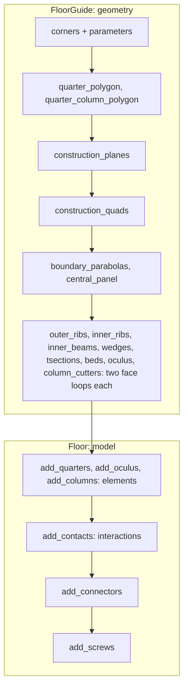

# Floor {#templates_floor}

[TOC]

The vaulted timber floor is supported by four columns. The column heads are integrated into the columns and connect the four quarter components. The central oculus interlocks all four components.

Two classes build the floor:
- `wood_floor::FloorGuide` (`src/templates/floor/floor_guide.h`) - geometric guidelines - @subpage templates_floor_guide
- `wood_floor::Floor` (`src/templates/floor/floor.h`) - elements, contacts and connectors - @subpage templates_floor_model

## How to read the pictures

Every step picture shows quarter 0 only; the other three quarters are built by the same code at their own corners. Black labels are the names used in the code.

In the **step pictures** (the chapters), colour shows the role of each line:

- ■ **blue**: what this step creates
- ■ **pink**: the new value the step introduces, named in the text
- ■ **yellow**: a second result of the same step, when there is one
- ■ **dark grey**: what the step takes from earlier steps; dashed lines are construction helpers
- ■ **light grey**: the rest of the floor, only for orientation

In the **overview pictures** (whole members), colour shows the member family instead: ■ outer ribs, ■ inner ribs, ■ inner beams, ■ wedges, ■ t-sections, ■ beds, ■ oculus ring, ■ column, ■ connectors.

## Data structures

Each member has one name everywhere, from `MemberRef::name()`.

| Family | Count per quarter | Element | Name |
|---|---|---|---|
| `outer_ribs` | 2 | `BeamVariable` | `outer_ribs_<i>_<q>` |
| `inner_ribs` | 2 | `BeamVariable` | `inner_ribs_<i>_<q>` |
| `inner_beams` | 3: seam, oculus edge, seam | `BeamVariable` | `inner_beams_<i>_<q>` |
| `wedges` | 3 at the column head | `Plate` | `wedges_<i>_<q>` |
| `tsections` | 6 beside the ribs | `Plate` | `tsections_<i>_<q>` |
| `beds` | 3 rows | `Plate` | `beds_<row>_<i>_<q>` |
| ring | 1 beam and 1 bottom wedge | `BeamVariable`, `Plate` | `oculus_<q>`, `oculus_<q + 4>` |
| column | 1 support, 1 column | `Support`, `Column` | `support_<q>`, `column_<q>` |
| central plate | 1 for the floor | `Plate` | `oculus_8` |

## Examples

| Example | What it builds |
|---|---|
| [templates_floor_1_floorguide](https://github.com/petrasvestartas/wood/blob/44f9aa85952d32a9264125f4e9940e55b05a4512/examples/templates_floor_1_floorguide.cpp) | the guide: quarter 0's plan and every member's quads, faces and parabolas under its name, chapters 1 to 5 |
| [templates_floor_2_column_model](https://github.com/petrasvestartas/wood/blob/44f9aa85952d32a9264125f4e9940e55b05a4512/examples/templates_floor_2_column_model.cpp) | one column on its support, carved by its six head cutters |
| [templates_floor_3_columns_model](https://github.com/petrasvestartas/wood/blob/44f9aa85952d32a9264125f4e9940e55b05a4512/examples/templates_floor_3_columns_model.cpp) | the four columns at the bay corners |
| [templates_floor_4_quarters](https://github.com/petrasvestartas/wood/blob/44f9aa85952d32a9264125f4e9940e55b05a4512/examples/templates_floor_4_quarters.cpp) | the four quarters in place |
| [templates_floor_5_oculus](https://github.com/petrasvestartas/wood/blob/44f9aa85952d32a9264125f4e9940e55b05a4512/examples/templates_floor_5_oculus.cpp) | the oculus ring, its bottom wedges and plate |
| [templates_floor_6_contacts_floor](https://github.com/petrasvestartas/wood/blob/44f9aa85952d32a9264125f4e9940e55b05a4512/examples/templates_floor_6_contacts_floor.cpp) | the quarters, the ring and the eight wedge connectors |
| [templates_floor_7_contacts_cantilevers](https://github.com/petrasvestartas/wood/blob/44f9aa85952d32a9264125f4e9940e55b05a4512/examples/templates_floor_7_contacts_cantilevers.cpp) | the whole square bay with columns, every connector and screw, BReps with exact bores |
| [templates_floor_8_rectangle](https://github.com/petrasvestartas/wood/blob/44f9aa85952d32a9264125f4e9940e55b05a4512/examples/templates_floor_8_rectangle.cpp) | the floor on a 6000 x 4800 bay with every connector and screw, BReps |
