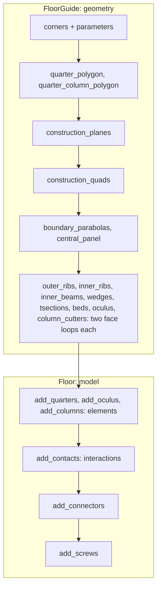

# Floor {#templates_floor}

[TOC]

The vaulted timber floor is supported by four columns. The column heads are integrated into the columns and connect the four quarter components. The central oculus interlocks all four components.

Two classes build the floor:
- @subpage templates_floor_guide - API `wood_floor::FloorGuide` (`src/templates/floor/floor_guide.h`)
- @subpage templates_floor_model - API `wood_floor::Floor` (`src/templates/floor/floor.h`)

## Examples

| Example | What it builds |
|---|---|
| [templates_floor_1_floorguide](https://github.com/petrasvestartas/wood/blob/44f9aa85952d32a9264125f4e9940e55b05a4512/examples/templates_floor_1_floorguide.cpp) | the guide: quarter 0's plan and every member's quads, faces and parabolas under its name, chapters 1 to 5 |
| [templates_floor_2_column_model](https://github.com/petrasvestartas/wood/blob/44f9aa85952d32a9264125f4e9940e55b05a4512/examples/templates_floor_2_column_model.cpp) | one column on its support, carved by its six head cutters |
| [templates_floor_3_columns_model](https://github.com/petrasvestartas/wood/blob/44f9aa85952d32a9264125f4e9940e55b05a4512/examples/templates_floor_3_columns_model.cpp) | the four columns at the bay corners |
| [templates_floor_4_quarters](https://github.com/petrasvestartas/wood/blob/44f9aa85952d32a9264125f4e9940e55b05a4512/examples/templates_floor_4_quarters.cpp) | the four quarters in place |
| [templates_floor_5_oculus](https://github.com/petrasvestartas/wood/blob/44f9aa85952d32a9264125f4e9940e55b05a4512/examples/templates_floor_5_oculus.cpp) | the oculus ring, its bottom wedges and plate |
| [templates_floor_6_contacts_floor](https://github.com/petrasvestartas/wood/blob/44f9aa85952d32a9264125f4e9940e55b05a4512/examples/templates_floor_6_contacts_floor.cpp) | the quarters, the ring and the eight wedge connectors |
| [templates_floor_7_contacts_cantilevers](https://github.com/petrasvestartas/wood/blob/44f9aa85952d32a9264125f4e9940e55b05a4512/examples/templates_floor_7_contacts_cantilevers.cpp) | the whole square bay with columns, every connector and screw, BReps with exact bores |
| [templates_floor_8_rectangle](https://github.com/petrasvestartas/wood/blob/44f9aa85952d32a9264125f4e9940e55b05a4512/examples/templates_floor_8_rectangle.cpp) | the floor on a 6000 x 4800 bay with every connector and screw, BReps |
