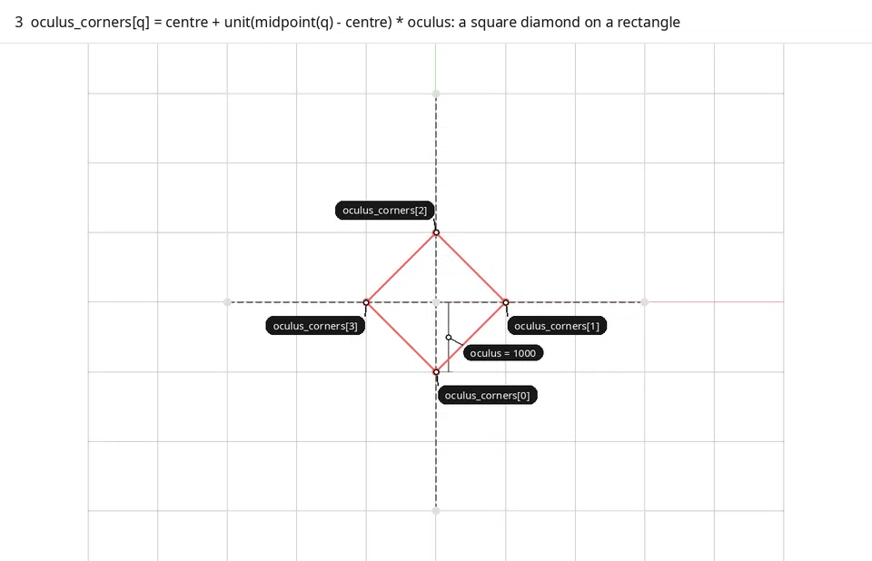
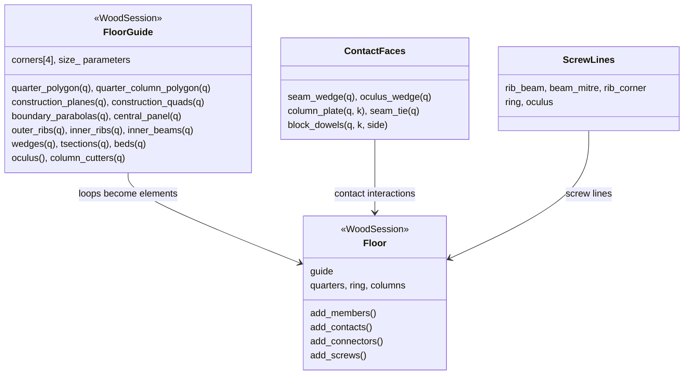

# Floor {#templates_floor}

The vaulted timber floor bay of compas_tf: a bay on four columns, cut by four seams into four quarters of parabolic ribs, beams, column blocks, t-sections and beds around a central oculus. Two `WoodSession` classes build it: `wood_floor::FloorGuide` (`src/templates/floor/floor_guide.h`, a port of compas_tf's `floor_guide.py`) computes the geometry, and `wood_floor::Floor` (`src/templates/floor/floor.h`) builds the elements, their contacts, the connectors and the screws from it.

One chapter per stage, in code order, one picture per step on the default 6000 x 6000 mm bay. Start with page 0: what FloorGuide computes and what Floor builds, in pictures. Chapters 1 to 11 are the earlier film; their names predate the port.

0. @subpage templates_floor_00_vocabulary (FloorGuide and Floor: what the guide computes, step by step, and what the floor builds from it, one picture each)
1. @subpage templates_floor_01_bay (the corners, the centre, the seams and the oculus, the bay edges with their rib bands, and the four column corners)
2. @subpage templates_floor_02_quarter_planes (every member's two faces in quarter 0: outer ribs, seam and oculus beams, inner ribs, the wedge fan and the t-sections)
3. @subpage templates_floor_03_parabolas (the plan quads, the run-in solve that levels both outer ribs at the column, the final wedge faces and the rib parabolas with their layers)
4. @subpage templates_floor_04_central_panel (the sweep that makes the central bed panel buildable, its traces, and the bed tops the wedges stand on)
5. @subpage templates_floor_05_rib_outlines (the rib outlines, the middle cutter level, the soffit, and how the guide draws itself)
6. @subpage templates_floor_06_outlines (every other member's outline, the oculus ring and the six column cutters)
7. @subpage templates_floor_07_elements (outlines into beams and plates, the lift to the floor, the scene tree, the columns and get_branch)
8. @subpage templates_floor_08_relationships (what every two members share, by the rules of the design, and the check against the kernel's contact search)
9. @subpage templates_floor_09_connectors (wedges, column plates, cross laps, ties and dowels, and how each cuts and drills its members)
10. @subpage templates_floor_10_screws (the five screw kinds, their levels and aim, and the screw check)
11. @subpage templates_floor_11_checks (the floor report, the BRep check and the eight examples)

**Reading the pictures.** Each colour marks one role, the same in picture, key and text:

| Colour | Role |
|---|---|
| ■ blue `#2196EA` | what the step builds |
| ■ pink `#E8478B` | the variable or value the step introduces |
| ■ yellow `#F2CC0C` | a second result, set apart from the first |
| ■ grey `#737373` | what the step reads from earlier steps; dashed, a construction helper |
| ■ light grey `#DADADA` | context, solid, with `#B8B8B8` edges |

Member families use `FAMILY_COLORS`: outer ribs, inner ribs, inner beams, wedges, t-sections, beds, oculus ring light pink, column dark grey, connectors BRG blue. Black plates are code names; quarter 0 stands for all four, since every quarter runs the same code at its own corner.

## Data structures

FloorGuide holds the corners, the parameters as its own fields and the geometry they make, every member as two face loops; Floor builds the elements, their contact interactions, the connectors and the screws from it. Page 0 shows every step in a picture.

Each member has one name everywhere, from `MemberRef::name()`.

| Family | Count per quarter | Element | Name |
|---|---|---|---|
| `outer_ribs` | 2 | `BeamVariable` | `outer_ribs_<i>_<q>` |
| `inner_ribs` | 2 | `BeamVariable` | `inner_ribs_<i>_<q>` |
| `inner_beams` | 3: seam, oculus edge, seam | `BeamVariable` | `inner_beams_<i>_<q>` |
| `wedges` | 3 at the column head | `Plate` | `wedges_<i>_<q>` |
| `tsections` | 6 beside the ribs | `Plate` | `tsections_<i>_<q>` |
| `beds` | 3 rows | `Plate` | `beds_<row>_<i>_<q>` |
| ring | 1 beam and 1 bottom wedge | `BeamVariable`, `Plate` | `oculus_<q>`, `oculus_<q + 4>` |
| column | 1 support, 1 column | `Support`, `Column` | `support_<q>`, `column_<q>` |
| central plate | 1 for the floor | `Plate` | `oculus_8` |

## Examples

| Example | What it builds |
|---|---|
| [templates_floor_1_floorguide](https://github.com/petrasvestartas/wood/blob/44f9aa85952d32a9264125f4e9940e55b05a4512/examples/templates_floor_1_floorguide.cpp) | the guide: quarter 0's plan and every member's quads, faces and parabolas under its name, chapters 1 to 5 |
| [templates_floor_2_column_model](https://github.com/petrasvestartas/wood/blob/44f9aa85952d32a9264125f4e9940e55b05a4512/examples/templates_floor_2_column_model.cpp) | one column on its support, carved by its six head cutters |
| [templates_floor_3_columns_model](https://github.com/petrasvestartas/wood/blob/44f9aa85952d32a9264125f4e9940e55b05a4512/examples/templates_floor_3_columns_model.cpp) | the four columns at the bay corners |
| [templates_floor_4_quarters](https://github.com/petrasvestartas/wood/blob/44f9aa85952d32a9264125f4e9940e55b05a4512/examples/templates_floor_4_quarters.cpp) | the four quarters in place |
| [templates_floor_5_oculus](https://github.com/petrasvestartas/wood/blob/44f9aa85952d32a9264125f4e9940e55b05a4512/examples/templates_floor_5_oculus.cpp) | the oculus ring, its bottom wedges and plate |
| [templates_floor_6_contacts_floor](https://github.com/petrasvestartas/wood/blob/44f9aa85952d32a9264125f4e9940e55b05a4512/examples/templates_floor_6_contacts_floor.cpp) | the quarters, the ring and the eight wedge connectors |
| [templates_floor_7_contacts_cantilevers](https://github.com/petrasvestartas/wood/blob/44f9aa85952d32a9264125f4e9940e55b05a4512/examples/templates_floor_7_contacts_cantilevers.cpp) | the whole square bay with columns, every connector and screw, BReps with exact bores |
| [templates_floor_8_rectangle](https://github.com/petrasvestartas/wood/blob/44f9aa85952d32a9264125f4e9940e55b05a4512/examples/templates_floor_8_rectangle.cpp) | the tied variant on a 6000 x 4800 bay (`seam_through_ribs` false: the outer ribs end on the seam plane and are tied), every connector and screw, BReps |
