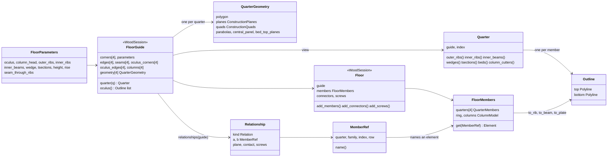

# Floor {#templates_floor}

`src/templates/floor/floor.h` builds the vaulted timber floor bay of compas_tf as a parametric model: a square or rectangular bay on four columns, cut by four seams into four quarters around a central oculus. Each quarter is a vault of parabolic ribs with beams, wedge blocks, t-sections and bed plates, and a ring of beams closes the oculus. The algorithm is 3D modelling with planes: every member is the space between planes the guide computes, cut along curves it draws.

Two classes, both a `WoodSession`, so each draws itself and can be written, merged and grafted like any session:

- `wood_floor::FloorGuide` is the geometry. From the four bay corners and `FloorGuide::Parameters` it computes every plane, quad, parabola and level the members are cut from, chapters 1 to 5.
- `wood_floor::Floor` is the model built from a guide, step by step: the member outlines and elements, chapters 6 and 7, then the relationships, connectors and screws, chapters 8 to 10.

```cpp
const wood_floor::FloorGuide guide = wood_floor::FloorGuide::rectangle(3000.0, 3000.0);
wood_floor::Floor floor(guide);
floor.add_members();
floor.add_connectors();
floor.add_screws();
WoodSession quarter = floor.get_branch("quarter_0");
```


The chapters below take the algorithm one step at a time, in the order the code runs, one picture per step on the default square bay of 6000 x 6000 mm. Each step names the function and lines that perform it and every variable it introduces with its default value. Each chapter opens with a film of its own steps.

1. @subpage templates_floor_01_bay (the corners, the centre, the seams and the oculus, the bay edges with their rib bands, and the four column corners)
2. @subpage templates_floor_02_quarter_planes (every member's two faces in quarter 0: outer ribs, seam and oculus beams, inner ribs, the wedge fan and the t-sections)
3. @subpage templates_floor_03_parabolas (the plan quads, the run-in solve that levels both outer ribs at the column, the final wedge faces and the rib parabolas with their layers)
4. @subpage templates_floor_04_central_panel (the sweep that makes the central bed panel buildable, its traces, and the bed tops the wedges stand on)
5. @subpage templates_floor_05_rib_outlines (the rib outlines, the middle cutter level, the soffit, and how the guide draws itself)
6. @subpage templates_floor_06_outlines (every other member's outline, the oculus ring and the six column cutters)
7. @subpage templates_floor_07_elements (outlines into beams and plates, the lift to the floor, the scene tree, the columns and get_branch)
8. @subpage templates_floor_08_relationships (what every two members share, by the rules of the design, and the check against the kernel's contact search)
9. @subpage templates_floor_09_connectors (wedges, column plates, cross laps, ties and dowels, and how each cuts and drills its members)
10. @subpage templates_floor_10_screws (the five screw kinds, their levels and aim, and the screw check)
11. @subpage templates_floor_11_checks (the floor report, the BRep check and the eight examples)

**Reading the pictures.** Black name plates are names in the code; each plate's leader ends in a ring on the point it names. Grey is what earlier steps built, red the variable a step introduces, dashed lines construction helpers. Every family has its colour, in `FAMILY_COLORS`: outer ribs orange, inner ribs amber, inner beams green, wedges purple, t-sections light green, beds blue; the oculus ring is pink, the column grey, connectors BRG blue. Plans are seen from above at the floor's level, elevations along the x or y axis, and 3D steps look at quarter 0 from its column corner. Quarter 0 stands for all four: every quarter is computed by the same code at its own corner.

## Data structures

Four layers, each built from the one before; only the first two hold geometry of their own, the last two are a scene.



Every member has one name, the same in the guide's drawing, the outline lists and the scene; `MemberRef::name()` gives it.

| Family | Count per quarter | Element | Name |
|---|---|---|---|
| `outer_ribs` | 2 | `BeamVariable` | `outer_ribs_<i>_<q>` |
| `inner_ribs` | 2 | `BeamVariable` | `inner_ribs_<i>_<q>` |
| `inner_beams` | 3: seam, oculus edge, seam | `BeamVariable` | `inner_beams_<i>_<q>` |
| `wedges` | 3 at the column head | `Plate` | `wedges_<i>_<q>` |
| `tsections` | 6 beside the ribs | `Plate` | `tsections_<i>_<q>` |
| `beds` | 3 rows | `Plate` | `beds_<row>_<i>_<q>` |
| ring | 1 beam and 1 bottom wedge | `BeamVariable`, `Plate` | `oculus_<q>`, `oculus_<q + 4>` |
| column | 1 support, 1 column | `Support`, `Column` | `support_<q>`, `column_<q>` |
| central plate | 1 for the floor | `Plate` | `oculus_8` |

## Examples

| Example | What it builds |
|---|---|
| `templates_floor_1_floorguide` | the guide: quarter 0's plan and every member's quads, faces and parabolas under its name, chapters 1 to 5 |
| `templates_floor_2_column_model` | one column on its support, carved by its six head cutters |
| `templates_floor_3_columns_model` | the four columns at the bay corners |
| `templates_floor_4_quarters` | the four quarters in place |
| `templates_floor_5_oculus` | the oculus ring, its bottom wedges and plate |
| `templates_floor_6_contacts_floor` | the quarters, the ring and the eight wedge connectors |
| `templates_floor_7_contacts_cantilevers` | the whole square bay with columns, every connector and screw, BReps with exact bores |
| `templates_floor_8_rectangle` | the tied variant on a 6000 x 4800 bay (`seam_through_ribs` false: the outer ribs end on the seam plane and are tied), every connector and screw, BReps |

## How the pictures are made

Every picture is made from the code, not drawn. `docs/floor/main.cpp` builds the guide and the floors once and calls one chapter file per chapter, `docs/floor/chapter_*.cpp`; each writes a scene per step with its caption, labels and camera. `docs/floor/render.py` renders every scene with session_viewer's headless renderer, places the labels, and writes the pictures and the films beside this page, in `docs/templates/floor/`.

Placing the labels is the point-feature labelling problem. Every label has candidate plates on rings of growing radius around its point in 24 directions. A candidate is allowed only inside the picture and clear of every other plate and every other labelled point. Among the allowed ones a label takes the cheapest: the leader's length, the drawing the plate covers, read off the rendered picture, and every leader that crosses another leader or plate. A greedy pass places the most crowded labels first, then passes re-place each label against all the others until none moves. The script fails if a label finds no allowed place, or if two labels name points closer than 14 pixels, so no picture is written with overlapping names.

To make them again after a change:

```bash
cmake --build build --target docs_floor_movie --parallel 6 && ./build/docs_floor_movie
python3 docs/floor/render.py
```
