# 0. Vocabulary {#templates_floor_00_vocabulary}

Every class of `floor.h`, one picture each, in the order the floor is built. The chapters after this page use these names.

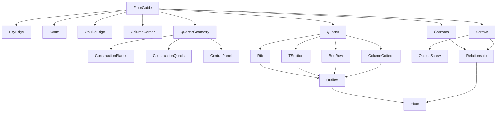
```mermaid
flowchart TD
    FloorGuide --> BayEdge & Seam & OculusEdge & ColumnCorner
    FloorGuide --> QuarterGeometry
    QuarterGeometry --> ConstructionPlanes & ConstructionQuads & CentralPanel
    FloorGuide --> Quarter
    Quarter --> Rib & TSection & BedRow & ColumnCutters
    Rib & TSection & BedRow & ColumnCutters --> Outline
    FloorGuide --> Contacts & Screws
    Screws --> OculusScrew
    Contacts & Screws --> Relationship
    Outline & Relationship --> Floor
```

## FloorGuide

■ the class ■ the seams, dashed

The guide is the first thing you make: four corners and the parameters as its fields; `compute()` turns them into every part on this page and draws them.

Code: [`FloorGuide`](https://github.com/petrasvestartas/wood/blob/75225ff780b6cf052999a265701fd37a14e116e4/src/templates/floor/floor.h#L76)

## BayEdge

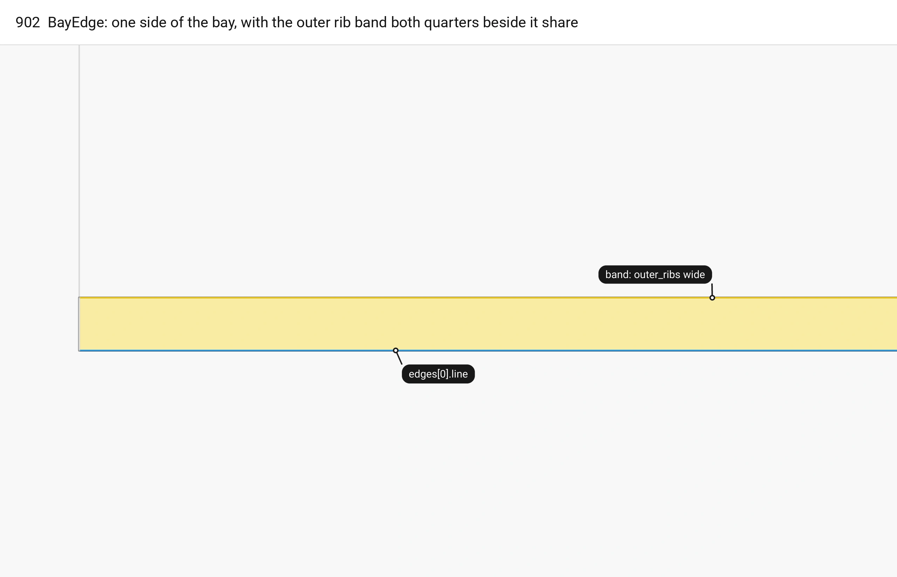

■ the class ■ its band

One side of the bay. Its band is the strip of outer rib that the two quarters on either side of the edge midpoint share.

Code: [`BayEdge`](https://github.com/petrasvestartas/wood/blob/75225ff780b6cf052999a265701fd37a14e116e4/src/templates/floor/floor.h#L163)

## Seam

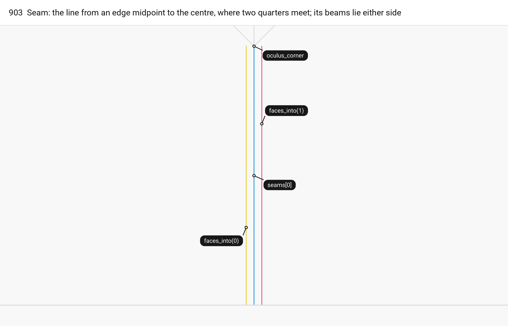

■ the class ■ faces_into(0) ■ faces_into(1)

The line from an edge midpoint to the centre, where two quarters meet. Each quarter reads its own seam beam face from it.

Code: [`Seam`](https://github.com/petrasvestartas/wood/blob/75225ff780b6cf052999a265701fd37a14e116e4/src/templates/floor/floor.h#L174)

## OculusEdge

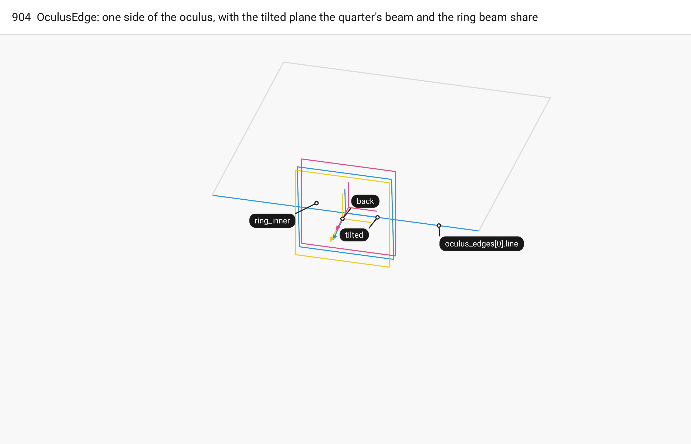

■ the class and its tilted plane ■ back ■ ring_inner

One side of the central hole. Its tilted plane is where a quarter's oculus beam meets a ring beam.

Code: [`OculusEdge`](https://github.com/petrasvestartas/wood/blob/75225ff780b6cf052999a265701fd37a14e116e4/src/templates/floor/floor.h#L193)

## ColumnCorner

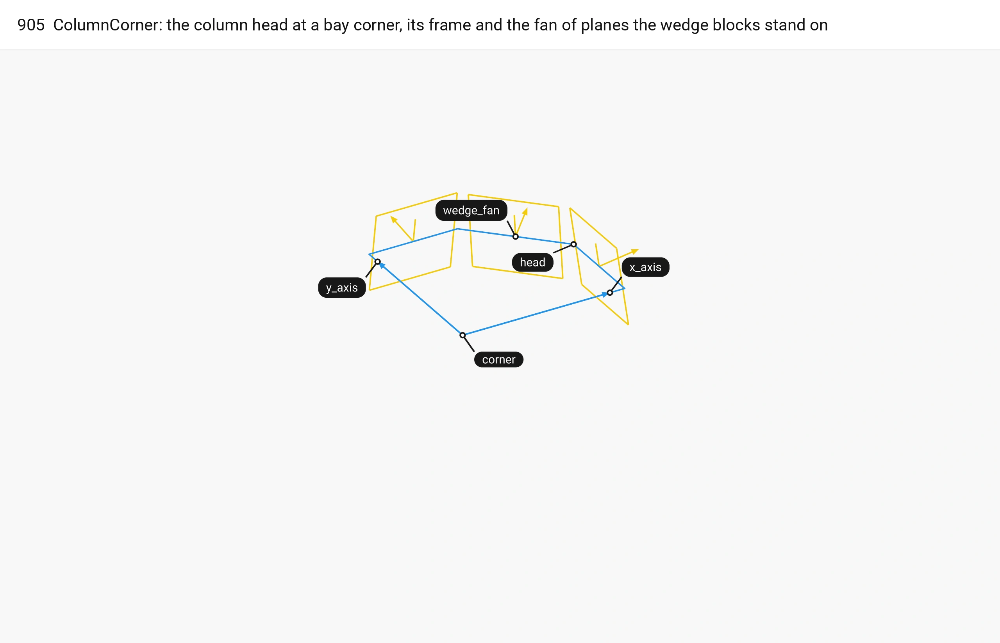

■ the class: head and frame ■ wedge_fan

The column head at one bay corner, with its frame and the fan of planes the column blocks stand on.

Code: [`ColumnCorner`](https://github.com/petrasvestartas/wood/blob/75225ff780b6cf052999a265701fd37a14e116e4/src/templates/floor/floor.h#L205)

## ConstructionPlanes

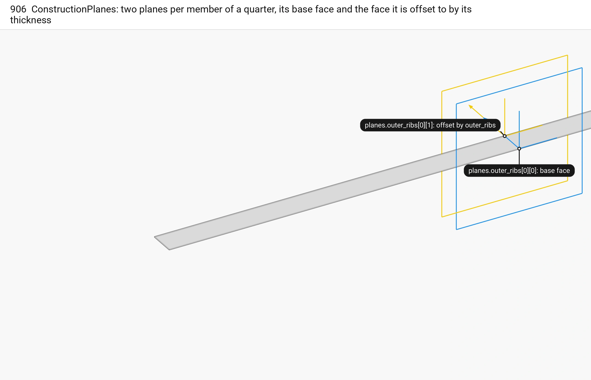

■ base face ■ the class: the face offset by the thickness ■ the member footprint

Two planes per member of a quarter: the face it starts from and the face it is offset to. Every member is cut from these planes.

Code: [`ConstructionPlanes`](https://github.com/petrasvestartas/wood/blob/75225ff780b6cf052999a265701fd37a14e116e4/src/templates/floor/floor.h#L234)

## ConstructionQuads

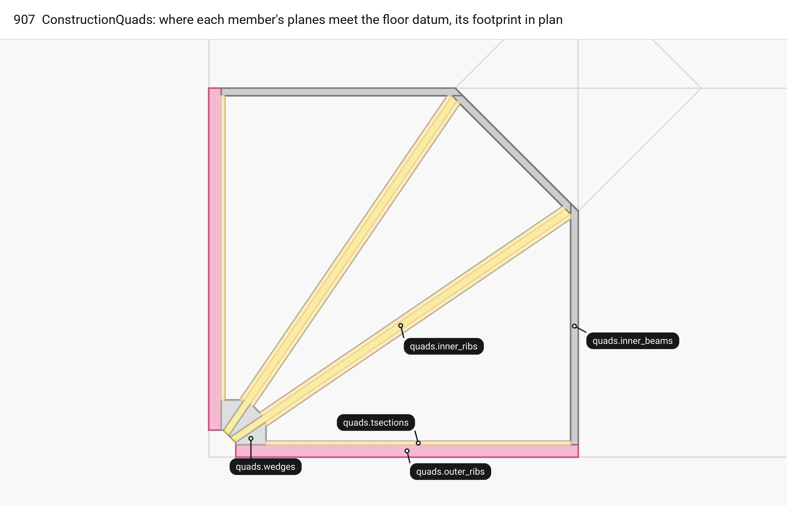

family colours

Where each member's four planes meet the floor datum: its footprint in plan.

Code: [`ConstructionQuads`](https://github.com/petrasvestartas/wood/blob/75225ff780b6cf052999a265701fd37a14e116e4/src/templates/floor/floor.h#L252)

## CentralPanel

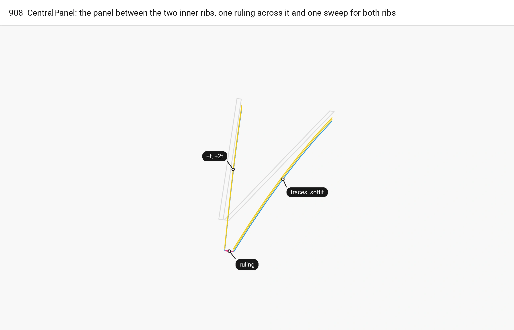

■ the class: soffit traces ■ +t and +2t layers ■ the ruling

The panel between the two inner ribs. One ruling crosses it and one sweep serves both ribs, so its bed plates stay buildable.

Code: [`CentralPanel`](https://github.com/petrasvestartas/wood/blob/75225ff780b6cf052999a265701fd37a14e116e4/src/templates/floor/floor.h#L271)

## QuarterGeometry

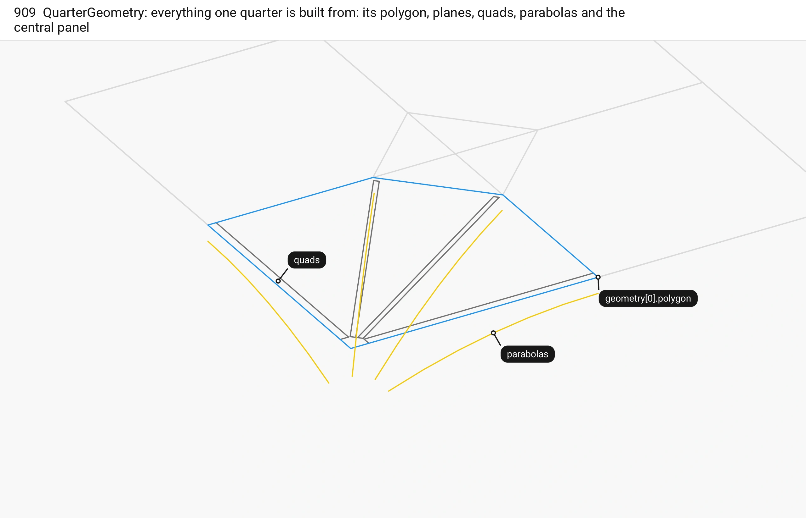

■ the class: the quarter polygon ■ the rib parabolas ■ rib quads

Everything one quarter is built from: polygon, planes, quads, run-ins, parabolas, central panel and bed planes. The guide holds four of them.

Code: [`QuarterGeometry`](https://github.com/petrasvestartas/wood/blob/75225ff780b6cf052999a265701fd37a14e116e4/src/templates/floor/floor.h#L306)

## Outline

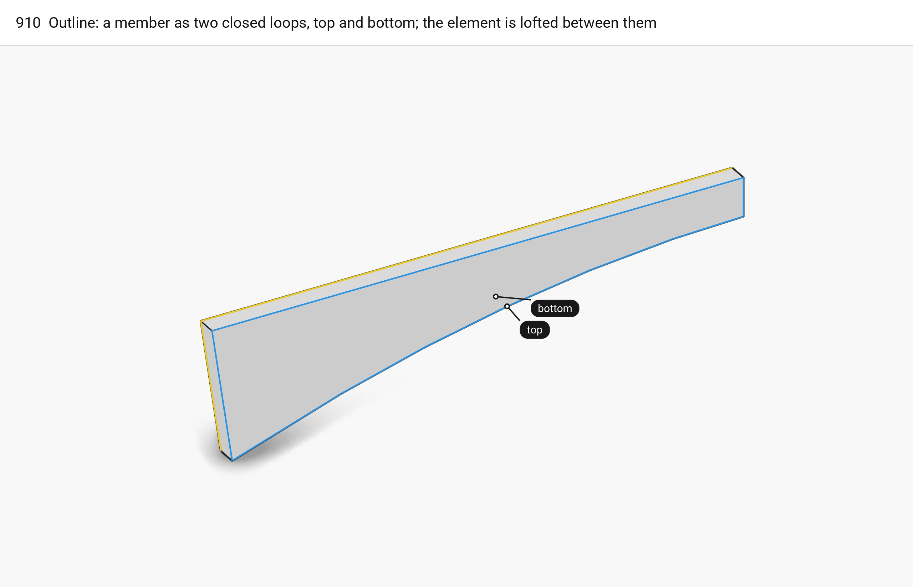

■ the class: top ■ bottom

A member as two closed loops. The element is lofted between them.

Code: [`Outline`](https://github.com/petrasvestartas/wood/blob/75225ff780b6cf052999a265701fd37a14e116e4/src/templates/floor/floor.h#L347)

## Quarter

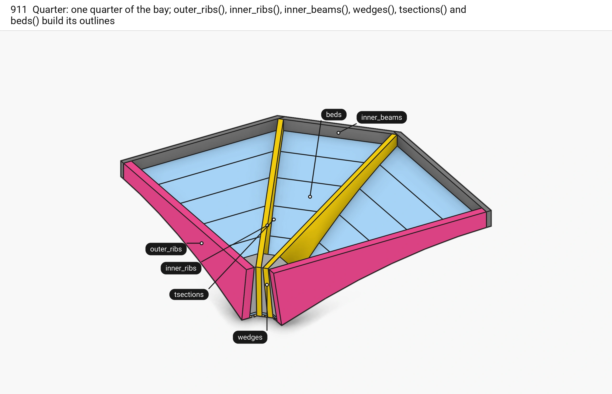

family colours

A view of one quarter of the guide. It builds that quarter's member outlines: outer ribs, inner ribs, inner beams, column blocks, t-sections and beds.

Code: [`Quarter`](https://github.com/petrasvestartas/wood/blob/75225ff780b6cf052999a265701fd37a14e116e4/src/templates/floor/floor.h#L375)

## Rib

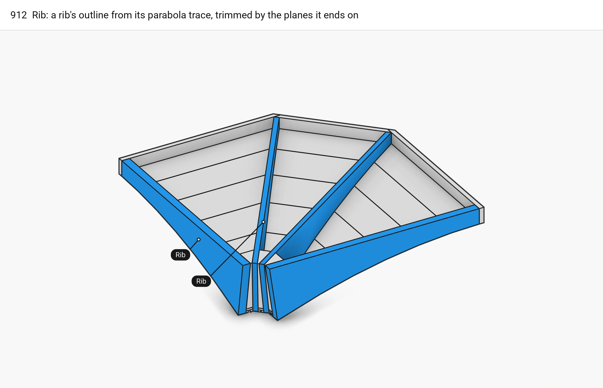

■ the class ■ the rest of the quarter

A rib's outline: its parabola trace, trimmed by the planes it ends on, on both faces of the rib.

Code: [`Rib`](https://github.com/petrasvestartas/wood/blob/75225ff780b6cf052999a265701fd37a14e116e4/src/templates/floor/floor.h#L415)

## TSection

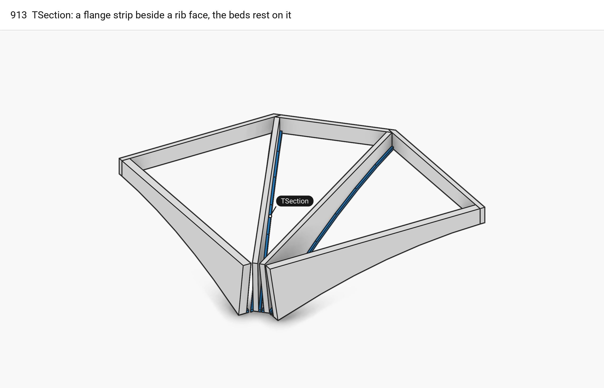

■ the class ■ the ribs and beams

A flange strip beside a rib face. The beds rest on it.

Code: [`TSection`](https://github.com/petrasvestartas/wood/blob/75225ff780b6cf052999a265701fd37a14e116e4/src/templates/floor/floor.h#L435)

## BedRow

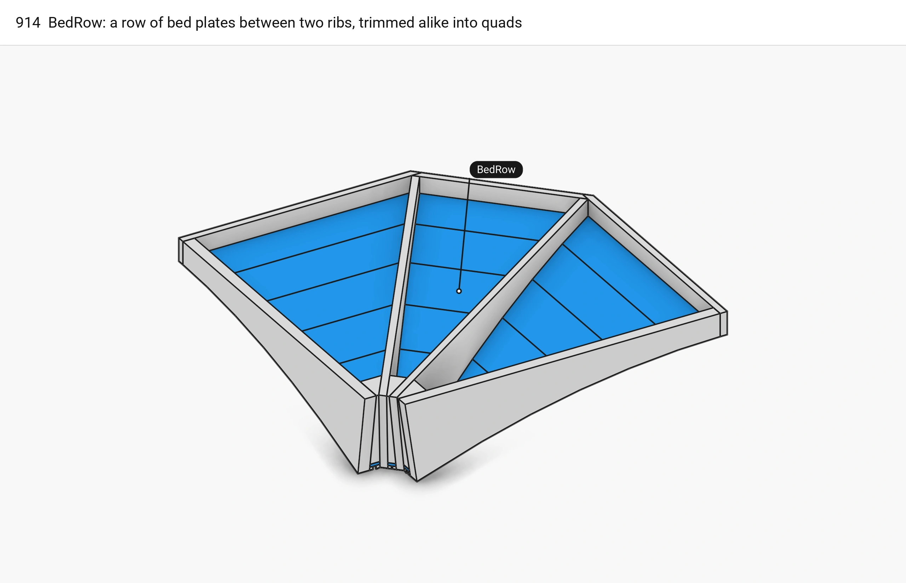

■ the class

A row of bed plates between two ribs, trimmed alike so every plate stays a quad.

Code: [`BedRow`](https://github.com/petrasvestartas/wood/blob/75225ff780b6cf052999a265701fd37a14e116e4/src/templates/floor/floor.h#L447)

## ColumnCutters

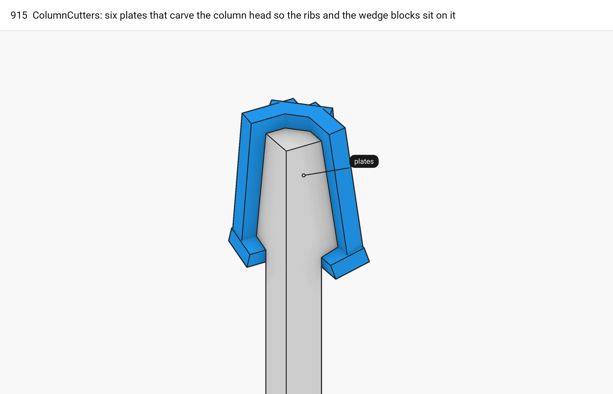

■ the class ■ the column

Six plates that carve the column head so the ribs and the column blocks sit on it.

Code: [`ColumnCutters`](https://github.com/petrasvestartas/wood/blob/75225ff780b6cf052999a265701fd37a14e116e4/src/templates/floor/floor.h#L459)

## Ring

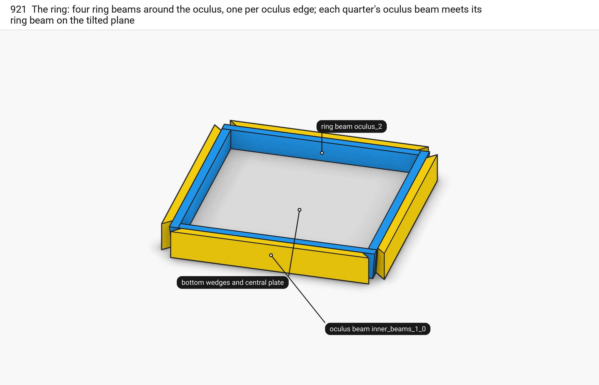

■ the class: ring beams ■ the quarters' oculus beams ■ bottom wedges and central plate

The ring is not a class: it is the family `ring`, the four ring beams `FloorGuide::oculus()` makes around the hole, one per oculus edge. They are neither t-sections nor the quarters' inner beams: each quarter's oculus beam (`inner_beams[1]`) sits outside its ring beam and meets it on the tilted plane, where the oculus wedge goes.

## Relationship

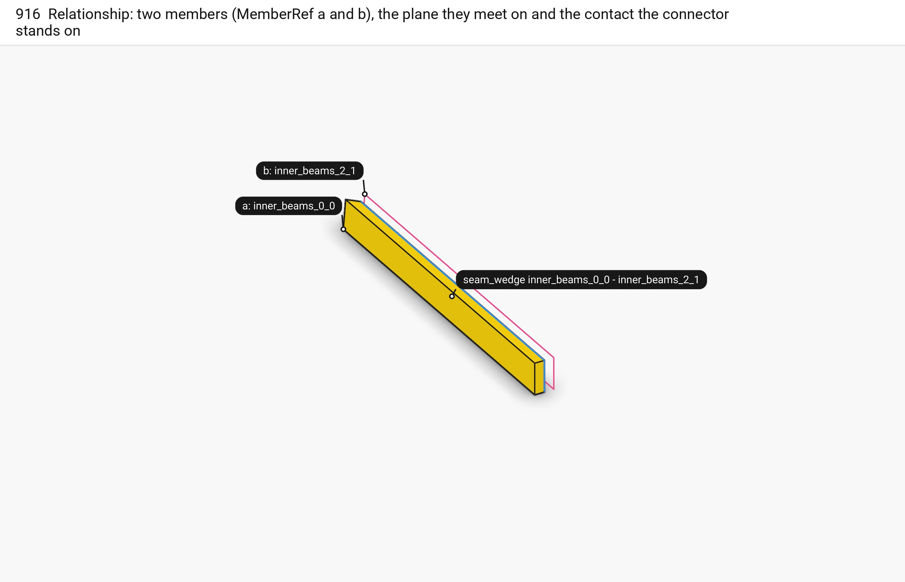

■ member a ■ member b, its loops ■ the class: the contact

Two members, named by `MemberRef`, the plane they meet on, and the contact the connector stands on.

Code: [`Relationship`](https://github.com/petrasvestartas/wood/blob/75225ff780b6cf052999a265701fd37a14e116e4/src/templates/floor/floor.h#L497)

## Contacts

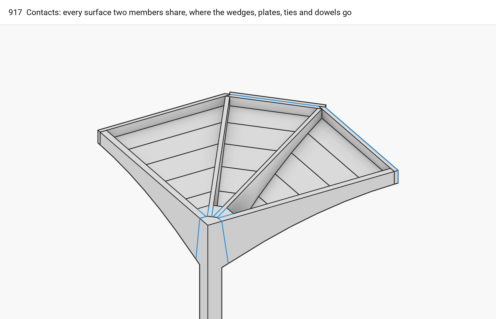

■ the class: the contacts ■ the members

Finds every surface two members share: where the wedges, column plates, ties and dowels go.

Code: [`Contacts`](https://github.com/petrasvestartas/wood/blob/75225ff780b6cf052999a265701fd37a14e116e4/src/templates/floor/floor.h#L521)

## Screws

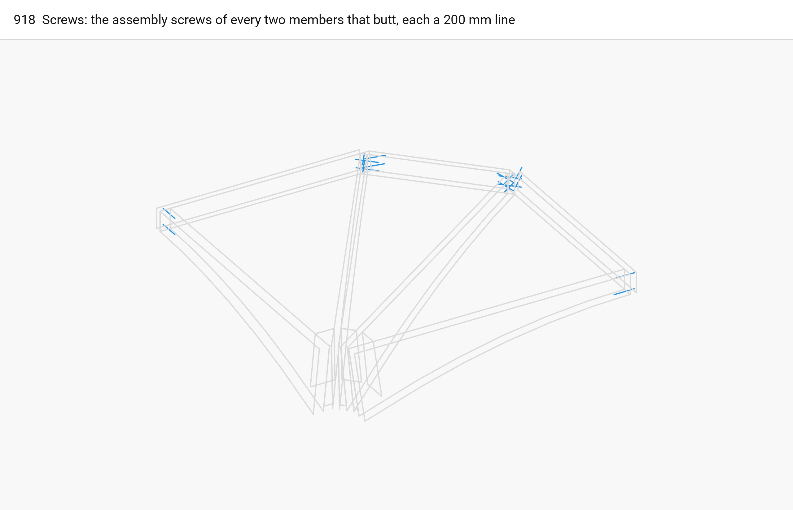

■ the class: the screws ■ the members' loops

Finds where the assembly screws go between members that butt, each a 200 mm line.

Code: [`Screws`](https://github.com/petrasvestartas/wood/blob/75225ff780b6cf052999a265701fd37a14e116e4/src/templates/floor/floor.h#L556)

## OculusScrew

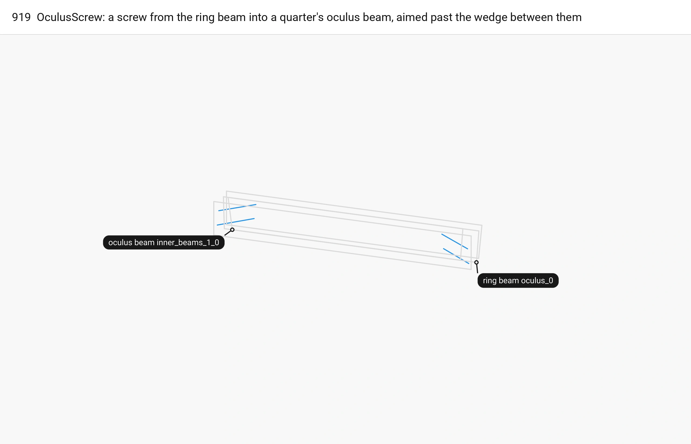

■ the class: the screws ■ ring beam and oculus beam

Aims a screw from a ring beam into a quarter's oculus beam, past the wedge between them.

Code: [`OculusScrew`](https://github.com/petrasvestartas/wood/blob/75225ff780b6cf052999a265701fd37a14e116e4/src/templates/floor/floor.h#L601)

## Floor

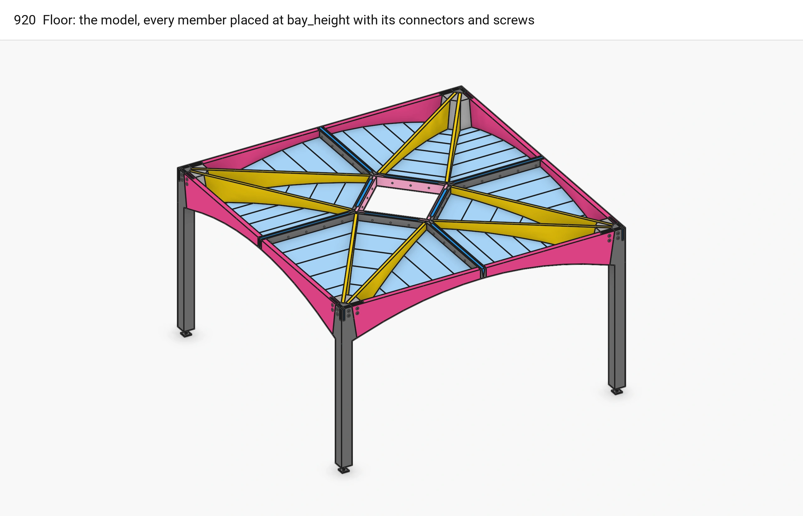

family colours, the connectors in ■ blue

The model: every member placed at `bay_height`, then the connectors and the screws added.

Code: [`Floor`](https://github.com/petrasvestartas/wood/blob/75225ff780b6cf052999a265701fd37a14e116e4/src/templates/floor/floor.h#L671)
