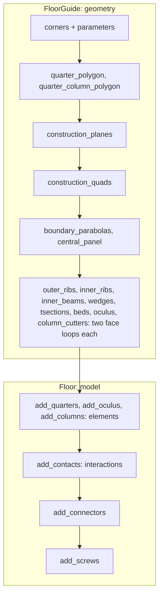

# FloorGuide and Floor {#templates_floor_00_vocabulary}

The floor is two classes. **`FloorGuide`** (`floor_guide.h`) computes geometry only: planes, quads, parabolas and every member as two face loops. **`Floor`** (`floor.h`) builds the model from it: elements, the contact interactions between them, connectors and screws.

## FloorGuide: the geometry

### FloorGuide

■ corners, oculus points ■ seams, dashed

The guide is made from four corners and the parameters (`size_outer_ribs`, `size_wedge`, `height`, `rise` ...); `compute()` runs every method below for each quarter and draws the result.

Code: [`FloorGuide`](https://github.com/petrasvestartas/wood/blob/fb0e0986bd4dfdde98bb038926f4f202aac7dadb/src/templates/floor/floor_guide.h#L67)

### quarter_polygon

■ quarter 0 ■ the other quarters

The bay is split into four quarters; quarter q is the one at `corners[q]`. Every FloorGuide method takes q and computes that quarter alone, so a rectangular bay gets four different quarters; the pictures below show q = 0. The quarter's five lines carry all its planes: the bay edges, the two seams, the oculus edge.

Code: [`quarter_polygon`](https://github.com/petrasvestartas/wood/blob/fb0e0986bd4dfdde98bb038926f4f202aac7dadb/src/templates/floor/floor_guide.h#L117)

### quarter_column_polygon

■ the column head ■ column_frame

The column head at the quarter's corner, where the ribs start; `column_frame` gives its axes.

Code: [`quarter_column_polygon`](https://github.com/petrasvestartas/wood/blob/fb0e0986bd4dfdde98bb038926f4f202aac7dadb/src/templates/floor/floor_guide.h#L120)

### construction_planes

■ base face ■ offset face ■ the member's footprint

A plane pair for every member: its base face on one of the polygon's lines, and the face offset by the member's size. Every member is cut from these planes.

Code: [`construction_planes`](https://github.com/petrasvestartas/wood/blob/fb0e0986bd4dfdde98bb038926f4f202aac7dadb/src/templates/floor/floor_guide.h#L133)

### construction_quads

family colours

Where each member's four planes meet the floor datum: its footprint in plan.

Code: [`construction_quads`](https://github.com/petrasvestartas/wood/blob/fb0e0986bd4dfdde98bb038926f4f202aac7dadb/src/templates/floor/floor_guide.h#L136)

### boundary_parabolas

■ the parabolas ■ their +t and +2t layers ■ rib quads

A parabola under each rib axis, from `-height` at the column to `-static_h` at the seam. The inner ones are the outer ones projected onto the inner ribs.

Code: [`boundary_parabolas`](https://github.com/petrasvestartas/wood/blob/fb0e0986bd4dfdde98bb038926f4f202aac7dadb/src/templates/floor/floor_guide.h#L146)

### central_panel

■ soffit traces ■ layers ■ ruling

Between the two inner ribs, one ruling crosses the panel and one sweep serves both ribs (rule A), so the central beds stay flat quads.

Code: [`central_panel`](https://github.com/petrasvestartas/wood/blob/fb0e0986bd4dfdde98bb038926f4f202aac7dadb/src/templates/floor/floor_guide.h#L149)

### Two face loops

■ [0]: top ■ [1]: bottom

Every member method below returns each member as `std::array<Polyline, 2>`: its two face loops, lofted by `loft`. The guide stops here; the Floor turns loops into elements.

Code: [`loft`](https://github.com/petrasvestartas/wood/blob/fb0e0986bd4dfdde98bb038926f4f202aac7dadb/src/templates/floor/floor_guide.h#L198)

### outer_ribs, inner_ribs

■ the ribs ■ the rest of the quarter

Each rib's parabola trimmed by the planes it ends on, on both of its faces.

Code: [`outer_ribs`](https://github.com/petrasvestartas/wood/blob/fb0e0986bd4dfdde98bb038926f4f202aac7dadb/src/templates/floor/floor_guide.h#L171)

### tsections

■ the t-sections ■ ribs and beams

Flange strips beside the rib faces; the beds rest on them.

Code: [`tsections`](https://github.com/petrasvestartas/wood/blob/fb0e0986bd4dfdde98bb038926f4f202aac7dadb/src/templates/floor/floor_guide.h#L168)

### beds

■ the beds

Three rows of bed plates between the ribs, each row trimmed alike so every plate stays a quad.

Code: [`beds`](https://github.com/petrasvestartas/wood/blob/fb0e0986bd4dfdde98bb038926f4f202aac7dadb/src/templates/floor/floor_guide.h#L165)

### wedges, inner_beams

■ column blocks and inner beams

The three column blocks at the head, and the three beams on the seams and the oculus edge.

Code: [`wedges`](https://github.com/petrasvestartas/wood/blob/fb0e0986bd4dfdde98bb038926f4f202aac7dadb/src/templates/floor/floor_guide.h#L177)

### oculus()

■ ring beams ■ the quarters' oculus beams ■ bottom wedges and central plate

Four ring beams around the hole, one per oculus edge, each meeting its quarter's oculus beam on the tilted plane.

Code: [`oculus`](https://github.com/petrasvestartas/wood/blob/fb0e0986bd4dfdde98bb038926f4f202aac7dadb/src/templates/floor/floor_guide.h#L183)

### column_cutters

■ the cutters ■ the column

Six plates that carve the column head so the ribs and the column blocks sit on it.

Code: [`column_cutters`](https://github.com/petrasvestartas/wood/blob/fb0e0986bd4dfdde98bb038926f4f202aac7dadb/src/templates/floor/floor_guide.h#L189)

## Floor: the model

### add_quarters(), add_oculus(), add_columns()

■ BeamVariable ■ Plate ■ Column, Support

The loops become elements: ribs, inner beams and ring beams are `BeamVariable`, t-sections, beds, blocks and the oculus plates `Plate`, and each column a `Column` on its `Support`, named `outer_ribs_<i>_<q>`, `beds_<row>_<i>_<q>` ...

Code: [`add_quarters`](https://github.com/petrasvestartas/wood/blob/fb0e0986bd4dfdde98bb038926f4f202aac7dadb/src/templates/floor/floor.h#L173)

### add_contacts()

■ contact polygons

For every two members the design joins, the session's contact search (`compute_face_contact`) finds the face they share, and `add_interaction` stores it on the session's edge between them as an `InteractionContactFace` named by its kind and place (`seam_wedge_0`, `column_plate_0_1`, `block_dowels_0_1_0` ...).

Code: [`add_contacts`](https://github.com/petrasvestartas/wood/blob/fb0e0986bd4dfdde98bb038926f4f202aac7dadb/src/templates/floor/floor.h#L185)

### add_interaction(a, b, contact)

■ member a ■ member b ■ the contact

One of them: the two seam beams of seam 0 and the face they share.

Code: [`add_interaction`](https://github.com/petrasvestartas/wood/blob/fb0e0986bd4dfdde98bb038926f4f202aac7dadb/src/templates/floor/floor.h#L19)

### add_connectors()

■ connector parts ■ members

Each contact interaction gets the connector of its kind: seam and oculus wedges, column plates with their cross lap, dowels.

Code: [`add_connectors`](https://github.com/petrasvestartas/wood/blob/fb0e0986bd4dfdde98bb038926f4f202aac7dadb/src/templates/floor/floor.h#L188)

### add_screws()

■ screw lines ■ member loops

`ScrewLines` finds the 200 mm screw lines between members that butt; `JointBeam::screws` pre-drills them into both members.

Code: [`add_screws`](https://github.com/petrasvestartas/wood/blob/fb0e0986bd4dfdde98bb038926f4f202aac7dadb/src/templates/floor/floor.h#L191)

### Floor

family colours, connectors in blue

The finished model: every member at `bay_height`, its contacts, connectors and screws.

Code: [`Floor`](https://github.com/petrasvestartas/wood/blob/fb0e0986bd4dfdde98bb038926f4f202aac7dadb/src/templates/floor/floor.h#L150)
