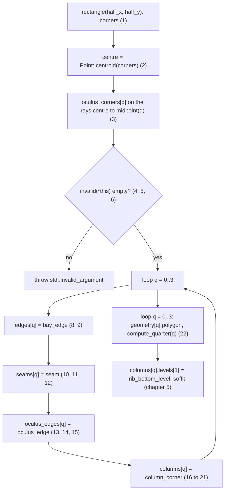

# Floor 01: Bay, seams, oculus and column corners {#templates_floor_01_bay}

This chapter covers the part of the `FloorGuide` constructor (`src/templates/floor/floor.cpp:403-425`) that runs before any quarter geometry exists. From the four corners and `FloorParameters` it computes the centre, the oculus corners and the validity gate `geometry::invalid` (`floor_plan.cpp:110-139`). It then builds the shared entities every quarter reads, in one loop over `q`: `edges[q]` (`bay_edge`), `seams[q]` (`seam`), `oculus_edges[q]` (`oculus_edge`) and `columns[q]` (`column_corner`), all in `floor.cpp:69-143`. The chapter ends where the second loop stores each quarter pentagon `geometry[q].polygon` and calls `compute_quarter`. Chapter 2 starts from those polygons and the shared entities. Every value is for the default bay `FloorGuide::rectangle(3000, 3000)`, a 6000 x 6000 mm square with corner 0 at (-3000, -3000).


The constructor, in the order it runs, with the frames of this chapter:



Frame 7 shows the helpers `level`, `edge_plane`, `plane_plane_plane` and `line_plane` that the rest of the chapter and every later chapter call.

## 1. Bay corners


`FloorGuide::rectangle(half_x, half_y)` builds four corners counter-clockwise at z 0 and passes them to the constructor. `half_x` and `half_y` are half spans, so `rectangle(3000, 3000)` is a 6000 x 6000 bay centred on the origin. The constructor initialises the `WoodSession` base as `WoodSession("floor_guide")` and copies `corners` and `parameters` into const members, so neither can change after construction. Corner `k` starts edge `k`, which runs to corner `k + 1`.

```cpp
FloorGuide FloorGuide::rectangle(double half_x, double half_y, const FloorParameters& parameters) {
    return FloorGuide({Point(-half_x, -half_y, 0.0), Point(half_x, -half_y, 0.0), Point(half_x, half_y, 0.0), Point(-half_x, half_y, 0.0)}, parameters);
}
```

| Variable | Value | Meaning |
|---|---|---|
| `half_x` | 3000 | Half span along x |
| `half_y` | 3000 | Half span along y |
| `corners[0..3]` | (-3000, -3000, 0), (3000, -3000, 0), (3000, 3000, 0), (-3000, 3000, 0) | Bay corners, counter-clockwise at z 0 |
| `parameters` | defaults of `FloorParameters`, `floor.h:40-55` | oculus 1000, column_head 220, column_head_chamfer 120, outer_ribs 100, inner_ribs 60, inner_beams 60, wedge 240, tsections 27, height 650, rise 453, wedge_plane_angle -10, oculus_plane_angle 5, column_head_depth 730, bay_height 3500, middle_wedge_factor 1.25, seam_through_ribs true |

Code: `FloorGuide::rectangle`, floor_plan.cpp:22-24; constructor initialiser, floor.cpp:403.

## 2. Centre and edge midpoints


`centre` is `Point::centroid` of the four corners: the mean of their coordinates, the vertex centroid. It is not the area centroid. For any quadrilateral the vertex centroid is where the two bimedians (midpoint 0 to midpoint 2, midpoint 1 to midpoint 3) cross and bisect each other. `midpoint(k)` is the centre of the line from `corners[k % 4]` to `corners[(k + 1) % 4]`. It is a method recomputed on every call, not stored; `BayEdge` keeps its own copy in step 8. Both run before the validity check.

```cpp
centre = Point::centroid({corners[0], corners[1], corners[2], corners[3]});
Point FloorGuide::midpoint(size_t k) const {
    return Line::from_points(corners[k % 4], corners[(k + 1) % 4]).center();
}
```

| Variable | Value | Meaning |
|---|---|---|
| `centre` | (0, 0, 0) | Vertex centroid of the four corners; every seam ends here |
| `midpoint(0)` | (0, -3000, 0) | Middle of edge 0 |
| `midpoint(1)` | (3000, 0, 0) | Middle of edge 1 |
| `midpoint(2)` | (0, 3000, 0) | Middle of edge 2 |
| `midpoint(3)` | (-3000, 0, 0) | Middle of edge 3 |

Code: `FloorGuide::FloorGuide`, floor.cpp:405; `FloorGuide::midpoint`, floor_plan.cpp:26-28.

## 3. Oculus corners on the centre-to-midpoint rays


For each `q`, the oculus corner is the point at distance `oculus` from the centre on the ray towards `midpoint(q)`: the direction `midpoint(q) - centre` is normalised and scaled by `parameters.oculus`. On a rectangle the four rays are the two half axes in both directions, so the four corners always form a square diamond, whatever the spans. Oculus corner `q` lies on seam `q` (step 10).

```cpp
for (size_t q = 0; q < 4; q++)
    oculus_corners[q] = centre + (midpoint(q) - centre).normalized() * parameters.oculus;
```

| Variable | Value | Meaning |
|---|---|---|
| `oculus` | 1000 | Distance of every oculus corner from the centre |
| `oculus_corners[0]` | (0, -1000, 0) | On seam 0 |
| `oculus_corners[1]` | (1000, 0, 0) | On seam 1 |
| `oculus_corners[2]` | (0, 1000, 0) | On seam 2 |
| `oculus_corners[3]` | (-1000, 0, 0) | On seam 3 |

Code: `FloorGuide::FloorGuide`, floor.cpp:407-408.

## 4. Validity A: z 0, left turns, no repeats


`geometry::invalid(guide)` returns an empty string for a valid guide or the reason it is not; the constructor throws `std::invalid_argument("invalid floor guide: " + why)` on a non-empty reason. Its first loop computes, per corner `k`, `after = corners[k+1] - corners[k]`, `before = corners[k+3] - corners[k]` and `turn = after.cross(corners[k+2] - corners[k+1])[2]`, the z of the cross product of edge `k` and edge `k + 1`. It fails in this order: `|corners[k][2]| > 0`, then `turn <= 0` (a right turn or a straight corner; the message names corner `(k + 1) % 4`, where the turn is), then a zero-length `after` or `before`. Because the turn test runs first, a repeated corner almost always gives `turn = 0` and is reported as "not counter-clockwise and convex". The "repeats its neighbour" message fires only when `corners[3]` equals `corners[0]` and the turn at corner 1 is positive. In the frame the four edge arrows are the four `after` vectors, each with its turn arc at the corner it ends on, and `before` at corner 0 is the arrow drawn inside the bay, pointing from corner 0 towards corner 3.

```cpp
const Vector after = corners[(k + 1) % 4] - corners[k];
const Vector before = corners[(k + 3) % 4] - corners[k];
const double turn = after.cross(corners[(k + 2) % 4] - corners[(k + 1) % 4])[2];
if (std::abs(corners[k][2]) > 0.0) return fmt::format("corner {} is not at z 0", k);
if (turn <= 0.0) return fmt::format("the corners are not counter-clockwise and convex at corner {}", (k + 1) % 4);
if (after.magnitude() <= 0.0 || before.magnitude() <= 0.0) return fmt::format("corner {} repeats its neighbour", k);
```

| Check | Fails when | Message |
|---|---|---|
| z 0 | `std::abs(corners[k][2]) > 0` | `corner k is not at z 0` |
| left turn | `turn <= 0` | `the corners are not counter-clockwise and convex at corner (k+1)%4` |
| no repeat | `after` or `before` has magnitude 0 | `corner k repeats its neighbour` |

| Variable | Value | Meaning |
|---|---|---|
| `after` (local) | edge 0: (6000, 0, 0) | Edge vector from corner k to corner k + 1 |
| `before` (local) | at corner 0: (0, 6000, 0) | Edge vector from corner k to corner k - 1 |
| `turn` (local) | 6000 x 6000 = 3.6e7 at every corner | z of the cross product of consecutive edges, positive for a left turn |

Code: `geometry::invalid`, floor_plan.cpp:110-126; thrown in `FloorGuide::FloorGuide`, floor.cpp:410-413.

## 5. Validity B: oculus corner inside its seam


In the same loop, `along` is the projection of `oculus_corners[k] - centre` onto the unit direction from the centre to `midpoint(k)`. The check fails unless `0 < along < |midpoint(k) - centre|`, an open interval. Because step 3 placed each oculus corner on exactly that ray, `along` equals `oculus` whenever `oculus > 0`; the check therefore says that `oculus` must be positive and shorter than the distance from the centre to every edge midpoint. On the 6000 x 4800 bay of `rectangle(3000, 2400)` that distance is 2400 on edges 0 and 2.

```cpp
const double along = (guide.oculus_corners[k] - guide.centre).dot((guide.midpoint(k) - guide.centre).normalized());
if (along <= 0.0 || along >= (guide.midpoint(k) - guide.centre).magnitude())
    return fmt::format("oculus corner {} is not between the centre and the midpoint of edge {}", k, k);
```

| Variable | Value | Meaning |
|---|---|---|
| `along` (local) | 1000 | Distance of the oculus corner from the centre along seam k |
| `\|midpoint(k) - centre\|` | 3000 | Upper bound of the open interval |

Code: `geometry::invalid`, floor_plan.cpp:128-131.

## 6. Validity C: ring covers the oculus beam face


The second loop compares two angles at every oculus corner `k`. `oculus_corner_angle(k)` is the unsigned angle in degrees between `oculus_corners[k+3] - oculus_corners[k]` and `oculus_corners[k+1] - oculus_corners[k]`, the interior angle of the diamond. `oculus_seam_angle(k)` is the unsigned angle between `midpoint(k) - centre` (the seam direction, outward) and `oculus_corners[k+1] - oculus_corners[k]`, the oculus edge of quarter `k + 1`. Both use `Vector::angle(other, false)`: no sign, degrees by default. The guide is rejected when `sin(oculus_corner_angle(k)) < sin(oculus_seam_angle(k))` at any `k`; the ring beam would then leave quarter `k + 1`'s oculus beam face uncovered (rule R7, `floor.h:154`). On any rectangle the diamond is a square, so the angles are 90 and 135 and this check always passes. `FloorGuide::check()` measures the same coverage later as `ring_uncovered_mm2` (chapter 11).

```cpp
double FloorGuide::oculus_corner_angle(size_t k) const {
    return (oculus_corners[(k + 3) % 4] - oculus_corners[k % 4]).angle(oculus_corners[(k + 1) % 4] - oculus_corners[k % 4], false);
}
double FloorGuide::oculus_seam_angle(size_t k) const {
    return (midpoint(k) - centre).angle(oculus_corners[(k + 1) % 4] - oculus_corners[k % 4], false);
}
if (std::sin(guide.oculus_corner_angle(k) * M_PI / 180.0) < std::sin(guide.oculus_seam_angle(k) * M_PI / 180.0))
    return fmt::format("the ring beam leaves quarter {}'s oculus beam face uncovered at oculus corner {}: ...", (k + 1) % 4, k, ...);
```

| Variable | Value | Meaning |
|---|---|---|
| `oculus_corner_angle(k)` | 90 | Interior angle of the oculus diamond at corner k, degrees |
| `oculus_seam_angle(k)` | 135 | Angle between seam k (outward) and the oculus edge towards corner k + 1, degrees |
| `sin` comparison | 1.000 >= 0.707 | Passes at every k |

Code: `geometry::invalid`, floor_plan.cpp:134-138; `oculus_corner_angle`, `oculus_seam_angle`, floor_plan.cpp:34-40.

## 7. Geometry primitives


Every plane and corner in the floor is made by a few helpers in `floor_geometry.cpp`. `level(z)` is the world xy plane moved up by `z`; `level(0.0)` is the floor datum, where every quarter member is built before the lift. `edge_plane(edge, normal_z)` is the plane through the edge's centre with normal `edge.to_direction().cross(normal_z)`. With `normal_z = -Z` it is vertical and its normal is the left-hand normal of the edge, which points into a counter-clockwise outline. `plane_plane_plane(a, b, c)` returns the one point three planes share through `Intersection::plane_plane_plane`, or `std::nullopt` when its 3 x 3 solve is not rank 3 with a pivot product above 1e-12 (two planes parallel, or all three through one line). `line_plane(line, plane)` intersects the infinite line with the plane and returns `std::nullopt` when `|n . direction| <= TOLERANCE = 1e-9`. `edge(polygon, i)` is the side from point `i` to point `i + 1`, wrapping to the first. In the frame, `plane_plane_plane(level(0.0), edge_plane(edges[0].line, -Z), edge_plane(edges[3].line, -Z))` gives `corners[0]`, the rule every plan quad corner follows in chapter 3, and `line_plane(seams[0].line, oculus_edges[0].tilted)` gives `oculus_corners[0]`.

```cpp
Plane level(double z) { return Plane::xy_plane() + Vector(0.0, 0.0, z); }
Plane edge_plane(const Line& edge, const Vector& normal_z) {
    return Plane::from_point_normal(edge.center(), edge.to_direction().cross(normal_z));
}
std::optional<Point> line_plane(const Line& line, const Plane& plane) {
    Point point;
    if (std::abs(plane.z_axis().dot(line.to_direction())) <= TOLERANCE || !Intersection::line_plane(line, plane, point, false))
        return std::nullopt;
    return point;
}
```

| Variable | Value | Meaning |
|---|---|---|
| `level(0.0)` | z = 0, normal (0, 0, 1) | Floor datum |
| `TOLERANCE` | 1e-9 | Below this `\|n . d\|` a line counts as parallel to a plane |
| `edge_plane(edges[0].line, -Z)` | origin (0, -3000, 0), normal (0, 1, 0) | (1, 0, 0) x (0, 0, -1) = (0, 1, 0), into the bay |
| `plane_plane_plane(...)` in the frame | (-3000, -3000, 0) | `corners[0]` |
| `line_plane(...)` in the frame | (0, -1000, 0) | `oculus_corners[0]` |

Code: `level`, `edge_plane`, floor_geometry.cpp:19-25; `line_plane`, 41-49; `plane_plane_plane`, 51-59; `edge`, 65-67; `TOLERANCE`, 8.

## 8. Bay edge line and band[0]


The first loop of the constructor builds, for one `q` at a time, `edges[q]`, `seams[q]`, `oculus_edges[q]` and `columns[q]`, then moves to `q + 1`. `bay_edge(guide, k)` sets `edge.line` from `corners[k]` to `corners[(k + 1) % 4]` and `edge.midpoint = guide.midpoint(k)`. `band[0]` is `Plane::from_point_normal(midpoint, line.to_direction().cross(-Z))`: the vertical plane on the edge with its origin at the midpoint and the left-hand normal, which points into the bay because the corners are counter-clockwise. It is the same plane `edge_plane(line, -Z)` would give. The two quarters on either side of the midpoint share it; chapter 2 re-origins it per quarter. In the frame the plane is drawn as a sheet `height` deep below the edge.

```cpp
edge.line = Line::from_points(guide.corners[k], guide.corners[(k + 1) % 4]);
edge.midpoint = guide.midpoint(k);
edge.band = pair(Plane::from_point_normal(edge.midpoint, edge.line.to_direction().cross(-Vector::z_axis())), guide.parameters.outer_ribs);
```

| Variable | Value | Meaning |
|---|---|---|
| `edges[0].line` | (-3000, -3000, 0) to (3000, -3000, 0) | Bay edge 0, corner 0 to corner 1 |
| `edges[0].midpoint` | (0, -3000, 0) | Where the two quarters' outer ribs on this edge meet |
| `edges[k].band[0]` | edge 0: origin (0, -3000, 0), normal (0, 1, 0); edge 1: (3000, 0, 0), (-1, 0, 0); edge 2: (0, 3000, 0), (0, -1, 0); edge 3: (-3000, 0, 0), (1, 0, 0) | Outer face of the outer rib band, normal into the bay |

Code: `bay_edge`, floor.cpp:69-77; loop, floor.cpp:415-420.

## 9. band[1]: offset by outer_ribs


`pair(plane, distance)` returns `{plane, plane.translate_by_normal(distance)}`. With `distance = outer_ribs` the second plane is `band[0]` moved 100 mm along its normal, into the bay. The two planes bound the outer rib band on edge `k`. In the frame the inner corners of the four bands are `plane_plane_plane(level(0.0), edges[k].band[1], edges[k-1].band[1])`, and the strip between `band[0]` and `band[1]` is hatched.

```cpp
static std::array<Plane, 2> pair(const Plane& plane, double distance) {
    return {plane, plane.translate_by_normal(distance)};
}
```

| Variable | Value | Meaning |
|---|---|---|
| `outer_ribs` | 100 | Outer rib thickness, the band width |
| `edges[0].band[1]` | origin (0, -2900, 0), normal (0, 1, 0) | Inner face of the band on edge 0 |
| `edges[1].band[1]` | x = 2900 | Inner face on edge 1 |
| `edges[2].band[1]` | y = 2900 | Inner face on edge 2 |
| `edges[3].band[1]` | x = -2900 | Inner face on edge 3 |

Code: `pair`, floor.cpp:15-17; used in `bay_edge`, floor.cpp:74.

## 10. Seams


`seam(guide, k, centre, oculus_corner)` fills a `Seam`. `index = k` names the quarter on the beam-0 side; quarter `k + 1` is on the beam-2 side. `line` runs from `midpoint(k)` to the centre. `oculus_corner = oculus_corners[k]` is where both seam beams of this seam end; from there to the centre the line carries no beam (dashed in the frame). `thickness = parameters.inner_beams` is the offset every quarter reads in step 12. `plane` is set last from `plane_into(k)` (step 11).

```cpp
result.index = k;
result.line = Line::from_points(guide.midpoint(k), centre);
result.oculus_corner = oculus_corner;
result.thickness = guide.parameters.inner_beams;
result.plane = result.plane_into(k);
```

| Variable | Value | Meaning |
|---|---|---|
| `seams[k].index` | k | Quarter on the beam-0 side |
| `seams[0].line` | (0, -3000, 0) to (0, 0, 0) | Midpoint 0 to the centre |
| `seams[0].oculus_corner` | (0, -1000, 0) | End of both seam beams |
| `seams[k].thickness` | 60 (`inner_beams`) | Seam beam thickness |

Code: `seam`, floor.cpp:80-90; called floor.cpp:417.

## 11. Seam plane into its own quarter


`Seam::plane_into(quarter)` with `quarter % 4 == index` is `edge_plane(Line::from_points(midpoint, oculus_corner), -Z)` where `midpoint = line.start()`. It is vertical through the half seam from the edge midpoint to the oculus corner, its origin is that half seam's centre, and its normal is the left-hand normal of the direction midpoint to oculus corner, which points into quarter `index`. The result is stored as `seams[k].plane`.

```cpp
Plane Seam::plane_into(size_t quarter) const {
    const Point& midpoint = line.start();
    return quarter % 4 == index ? edge_plane(Line::from_points(midpoint, oculus_corner), -Vector::z_axis())
                                : edge_plane(Line::from_points(oculus_corner, midpoint), -Vector::z_axis());
}
```

| Variable | Value | Meaning |
|---|---|---|
| `seams[0].plane` | origin (0, -2000, 0), normal (-1, 0, 0) | Into quarter 0 |
| `seams[1].plane` | origin (2000, 0, 0), normal (0, -1, 0) | Into quarter 1 |
| `seams[2].plane` | origin (0, 2000, 0), normal (1, 0, 0) | Into quarter 2 |
| `seams[3].plane` | origin (-2000, 0, 0), normal (0, 1, 0) | Into quarter 3 |

Code: `Seam::plane_into`, floor.cpp:392-397; assigned floor.cpp:87; `edge_plane`, floor_geometry.cpp:23-25.

## 12. plane_into the other quarter and faces_into


For any `quarter % 4 != index`, `plane_into` reverses the half seam, oculus corner to midpoint. The plane, its origin and its trace are the same and only the normal flips, so it points into that quarter; the code only asks for quarter `index + 1`. `faces_into(quarter) = pair(plane_into(quarter), thickness)`: the seam plane and its copy 60 mm into that quarter, the two faces of that quarter's seam beam. `construction_planes` reads `seams[q].faces_into(q)` as inner beam 0 and `seams[(q + 3) % 4].faces_into(q)` as inner beam 2 (`floor.cpp:191`). The two beams of one seam therefore stand back to back on the shared seam plane, x in [-60, 0] for quarter 0 and [0, 60] for quarter 1 on seam 0.

```cpp
std::array<Plane, 2> Seam::faces_into(size_t quarter) const {
    return pair(plane_into(quarter), thickness);
}
```

| Variable | Value | Meaning |
|---|---|---|
| `seams[0].faces_into(0)` | {x = 0, normal (-1, 0, 0), origin (0, -2000, 0); x = -60, origin (-60, -2000, 0)} | Quarter 0's beam on seam 0 |
| `seams[0].faces_into(1)` | {x = 0, normal (1, 0, 0), origin (0, -2000, 0); x = 60, origin (60, -2000, 0)} | Quarter 1's beam on seam 0 |
| `seams[3].faces_into(0)` | {y = 0, normal (0, -1, 0), origin (-2000, 0, 0); y = -60} | Quarter 0's beam on seam 3 |

Code: `Seam::plane_into` else branch, floor.cpp:396; `Seam::faces_into`, floor.cpp:399-401; read in `construction_planes`, floor.cpp:191.

## 13. Oculus edge and its vertical plane


`oculus_edge(corner, previous, parameters)` is called with `oculus_corners[q]` and `oculus_corners[(q + 3) % 4]`, so `edge.line` runs from oculus corner `q` to oculus corner `q - 1`: the third edge of quarter `q`'s pentagon. The local `plane = edge_plane(edge.line, -Z)` is vertical through the edge centre. Its normal is the left-hand normal of that direction, which here points away from the centre, into quarter `q`. This plane is not stored; `tilted`, `back` and `ring_inner` are made from it in steps 14 and 15.

```cpp
edge.line = Line::from_points(corner, previous);
const Plane plane = edge_plane(edge.line, -Vector::z_axis());
```

| Variable | Value | Meaning |
|---|---|---|
| `oculus_edges[0].line` | (0, -1000, 0) to (-1000, 0, 0), direction (-1, 1, 0)/sqrt 2 | Oculus edge of quarter 0 |
| `plane` (local) | origin (-500, -500, 0), normal (-1, -1, 0)/sqrt 2 | Vertical plane on the edge, 707.1 from the centre |

Code: `oculus_edge`, floor.cpp:93-97; called floor.cpp:418.

## 14. tilted: rotate by -oculus_plane_angle


`tilted = rotate(plane, -oculus_plane_angle * pi / 180, line.to_direction(), line.center())`. `rotate` transforms the plane by `Xform::rotation_around_line` about the line through the edge centre along the edge direction, by -5 degrees (right-hand rule about the edge direction). The edge lies on the rotation axis, so the plane's top trace stays on the oculus edge at z 0 and its origin does not move. The normal becomes `n cos 5 - Z sin 5`: it tips downward. A point of the plane at depth `h` below the datum therefore lies `h tan 5 = 0.0875 h` towards the centre, 56.9 mm at `h = height = 650` as drawn. The quarter's oculus beam face and the ring beam share this bearing plane (`floor.h:90, 199`). The frame looks along the edge, from oculus corner 0 towards oculus corner 3, with the centre to the right.

```cpp
edge.tilted = rotate(plane, -parameters.oculus_plane_angle * M_PI / 180.0, edge.line.to_direction(), edge.line.center());
Plane rotate(const Plane& plane, double radians, const Vector& axis, const Point& point) {
    return plane.transformed(Xform::rotation_around_line(Line::from_points(point, point + axis), radians));
}
```

| Variable | Value | Meaning |
|---|---|---|
| `oculus_plane_angle` | 5 | Lean in degrees; negated and converted to radians before rotating |
| `oculus_edges[0].tilted` | origin (-500, -500, 0), normal (-0.7044, -0.7044, -0.0872) | Oculus bearing plane, leaned 5 degrees about the edge |
| offset at depth h | h tan 5 = 0.0875 h | Horizontal move of the plane towards the centre |

Code: `oculus_edge`, floor.cpp:98; `rotate`, floor_geometry.cpp:15-17.

## 15. back and ring_inner


`back = plane.translate_by_normal(inner_beams)`: the vertical edge plane moved 60 mm along its normal, into the quarter, away from the centre. It is the back face of the quarter's oculus beam; `construction_planes` uses `{tilted, back}` as inner beam 1. `ring_inner = back.translate_by_normal(-inner_beams * 2.0)`: `back` moved 120 mm back, so it sits 60 mm inside the edge, towards the centre. Its normal is unchanged and still points away from the centre. The ring beam lies between `tilted` and `ring_inner`, so it is `inner_beams` wide at the datum.

```cpp
edge.back = plane.translate_by_normal(parameters.inner_beams);
edge.ring_inner = edge.back.translate_by_normal(-parameters.inner_beams * 2.0);
```

| Variable | Value | Meaning |
|---|---|---|
| `inner_beams` | 60 | Offset of both planes from the edge |
| `oculus_edges[0].back` | origin (-542.43, -542.43, 0), normal (-1, -1, 0)/sqrt 2; 767.1 from the centre | Oculus beam back face |
| `oculus_edges[0].ring_inner` | origin (-457.57, -457.57, 0), normal (-1, -1, 0)/sqrt 2; 647.1 from the centre | Inner face of the ring beam |

Code: `oculus_edge`, floor.cpp:99-100.

## 16. Column corner frame


`corner_frame(guide, k)` takes `after = unit(corners[k+1] - corners[k])` and `before = unit(corners[k+3] - corners[k])`. When `|corner_angle(k) - 90| <= RIGHT_ANGLE`, with `RIGHT_ANGLE = 1e-9` degrees, it returns `{after, before}` unchanged, so a rectangle keeps its exact edge directions. Otherwise it takes `bisector = unit(after + before)` and returns the bisector rotated about Z by -45 and +45 degrees (`Xform::rotation(Z, -45, true)` and `(Z, 45, true)`): an orthogonal frame symmetric about the bisector, so the square column does not follow a skew corner. At a right corner both branches give the same axes; the frame draws the bisector dashed. `column_corner` stores the result as `x_axis` and `y_axis`.

```cpp
if (std::abs(guide.corner_angle(k) - 90.0) <= RIGHT_ANGLE)
    return {after, before};
const Vector bisector = (after + before).normalized();
return {bisector.transformed(Xform::rotation(Vector::z_axis(), -45.0, true)), bisector.transformed(Xform::rotation(Vector::z_axis(), 45.0, true))};
```

| Variable | Value | Meaning |
|---|---|---|
| `RIGHT_ANGLE` | 1e-9 | Degrees off 90 within which a corner counts as right |
| `corner_angle(k)` | 90 | Interior bay angle at corner k |
| `columns[k].x_axis` | k0 (1, 0, 0); k1 (0, 1, 0); k2 (-1, 0, 0); k3 (0, -1, 0) | Frame x, along the edge after the corner |
| `columns[k].y_axis` | k0 (0, 1, 0); k1 (-1, 0, 0); k2 (0, -1, 0); k3 (1, 0, 0) | Frame y, along the edge before the corner, reversed |

Code: `corner_frame`, floor.cpp:106-119; `RIGHT_ANGLE`, floor.cpp:10; `corner_angle`, floor_plan.cpp:30-32; stored floor.cpp:126-128.

## 17. Head polygon and chamfer_direction


`column_corner` builds the head polygon in the corner frame: the corner, `corner + x * column_head`, `corner + x * column_head + y * column_head_chamfer`, `corner + x * column_head_chamfer + y * column_head` and `corner + y * column_head`. That is the 220 x 220 shaft square at the corner with its inner corner cut by a chamfer between two points 120 along the two inner shaft faces: a pentagon at z 0. `chamfer_direction = unit(head[3] - head[2])`; `column_seats` reads it in chapter 2, and recomputes the chamfer length 141.42 from `head`. `column_corner` leaves `wedge_fan`, `column_offset` and `wedge_seat` unset; `compute_quarter` fills them later. The `Column` element built in chapter 7 has a capitel ("head") square of `column_head + column_head_chamfer = 340`, `column_head_depth` deep, which is larger than this head polygon.

```cpp
column.head = {column.corner, column.corner + x * head, column.corner + x * head + y * chamfer, column.corner + x * chamfer + y * head, column.corner + y * head};
column.chamfer_direction = (column.head[3] - column.head[2]).normalized();
```

| Variable | Value | Meaning |
|---|---|---|
| `column_head` | 220 | Side of the shaft square and of the head polygon |
| `column_head_chamfer` | 120 | Position of the chamfer vertices along the shaft faces |
| `columns[0].head` | (-3000, -3000), (-2780, -3000), (-2780, -2880), (-2880, -2780), (-3000, -2780) | Corner, two shaft corners, two chamfer vertices |
| `columns[0].chamfer_direction` | (-1, 1, 0)/sqrt 2 | Unit vector along the chamfer; the chamfer is 141.42 long |

Code: `column_corner`, floor.cpp:130-135; capitel in `to_column`, floor_elements.cpp:78-91.

## 18. Head side planes


`sides = {edge_plane(edge(head, 0), -Z), edge_plane(edge(head, 4), -Z)}`. `edge(head, 0)` is head[0] to head[1], on bay edge `k`; `edge(head, 4)` is head[4] to head[0], the wrap-around side on bay edge `k - 1`. Each plane is vertical through its side's centre with the left-hand normal, which points into the bay. At a right corner they lie in the same planes as `band[0]` of bay edges `k` and `k - 1`, with their origins at the head side centres.

```cpp
column.sides = {edge_plane(edge(column.head, 0), -Vector::z_axis()), edge_plane(edge(column.head, 4), -Vector::z_axis())};
```

| Variable | Value | Meaning |
|---|---|---|
| `columns[0].sides[0]` | origin (-2890, -3000, 0), normal (0, 1, 0) | Head side on bay edge 0 |
| `columns[0].sides[1]` | origin (-3000, -2890, 0), normal (1, 0, 0) | Head side on bay edge 3 |

Code: `column_corner`, floor.cpp:136; `edge`, floor_geometry.cpp:65-67.

## 19. Initial cutter levels


`levels = {0.0, 0.0, -column_head_depth}`: the datum, a middle level and the bottom of the carved head. The middle level is a placeholder 0 here. After all four `compute_quarter` calls, the constructor overwrites it with `rib_bottom_level(quarter(q))`: the minimum of 0 and the z of point 2 of the top and bottom outlines of both outer ribs, their bottom corners on the fan plane, -694.79 on the default bay (chapter 5). The frame draws `levels[1]` dashed at that final value. The six column cutters of chapter 6 run between these three levels.

```cpp
column.levels = {0.0, 0.0, -guide.parameters.column_head_depth};
for (size_t q = 0; q < 4; q++)
    columns[q].levels[1] = rib_bottom_level(quarter(q));   // after the quarters, floor.cpp:427-428
```

| Variable | Value | Meaning |
|---|---|---|
| `column_head_depth` | 730 | Depth of the carved head |
| `columns[k].levels[0]` | 0 | The datum |
| `columns[k].levels[1]` | 0 here; -694.79 after `rib_bottom_level` | Middle cutter level, at the outer rib bottoms |
| `columns[k].levels[2]` | -730 | Bottom of the carved head |

Code: `column_corner`, floor.cpp:137; overwritten floor.cpp:427-428; `rib_bottom_level`, floor.cpp:378-386.

## 20. axis_point and support_plane


`axis_point = corner + (x + y) * (column_head * 0.5)`: the centre of the 220 square shaft, half a column head along both frame axes from the corner. `support_plane = Plane::from_frame(axis_point, x, y, Z)`: a horizontal frame at the axis point with the corner frame's axes. `to_support` builds the `Support` element from it without the lift the floor members get, so z 0 of `support_plane` is the slab, not the floor datum; the frame is drawn there, with the 220 shaft square dashed around the axis point. `relationships` also reads it as the plane of the support row, unlifted.

```cpp
column.axis_point = column.corner + (x + y) * (head * 0.5);
column.support_plane = Plane::from_frame(column.axis_point, x, y, Vector::z_axis());
```

| Variable | Value | Meaning |
|---|---|---|
| `columns[0].axis_point` | (-2890, -2890, 0) | Column axis at z 0 |
| `columns[0].support_plane` | origin (-2890, -2890, 0), x (1, 0, 0), y (0, 1, 0), z (0, 0, 1) | Support frame on the slab |

Code: `column_corner`, floor.cpp:138-139; `to_support`, floor_elements.cpp:74-76; floor_relations.cpp:167.

## 21. Column axes


`axis = Line::from_points(axis_point, axis_point + Z * bay_height)`: the vertical column axis over one storey. Read with the support at the slab, it rises from z 0 to z 3500, the floor datum after the members are lifted by `Xform::translation(0, 0, bay_height)` (`floor_models.cpp:128`). `to_column` does not use this line; it builds its own axis from the support's column foot up to z = `bay_height` (`floor_elements.cpp:83`).

```cpp
column.axis = Line::from_points(column.axis_point, column.axis_point + Vector::z_axis() * guide.parameters.bay_height);
```

| Variable | Value | Meaning |
|---|---|---|
| `bay_height` | 3500 | Axis length, one storey |
| `columns[0].axis` | (-2890, -2890, 0) to (-2890, -2890, 3500) | Column axis |

Code: `column_corner`, floor.cpp:140.

## 22. Quarter polygon and compute_quarter order


The second loop of the constructor stores, for each `q`, `geometry[q].polygon = {corners[q], edges[q].midpoint, oculus_corners[q], oculus_corners[(q + 3) % 4], edges[(q + 3) % 4].midpoint}`. This pentagon is bounded by half of bay edge `q`, seam `q`, oculus edge `q`, seam `q - 1` and half of bay edge `q - 1`, counter-clockwise. `compute_quarter(*this, q)` runs right after, in the same iteration, so quarter `q` is complete before quarter `q + 1`'s polygon is stored. `construction_planes` re-origins the outer rib planes at the centres of polygon edges 0 and 4 (chapter 2). `columns[q].levels[1]` and `soffit` are set only after all four quarters.

```cpp
for (size_t q = 0; q < 4; q++) {
    geometry[q].polygon = {corners[q], edges[q].midpoint, oculus_corners[q], oculus_corners[(q + 3) % 4], edges[(q + 3) % 4].midpoint};
    compute_quarter(*this, q);
}
```

`compute_quarter` runs nine calls in a fixed order; `construction_quads` runs twice, because `block_planes` replaces the wedges' far faces the first quads were built on:


| Variable | Value | Meaning |
|---|---|---|
| `geometry[0].polygon` | (-3000, -3000), (0, -3000), (0, -1000), (-1000, 0), (-3000, 0) | Quarter 0 pentagon, counter-clockwise |
| `geometry[1].polygon` | (3000, -3000), (3000, 0), (1000, 0), (0, -1000), (0, -3000) | Quarter 1 pentagon |

Code: `FloorGuide::FloorGuide`, floor.cpp:422-425; `compute_quarter`, floor.cpp:360-375.
