# Floor 01: Bay, seams, oculus and column corners {#templates_floor_01_bay}

[TOC]

This chapter covers the part of `FloorGuide::compute` that checks the four corners and builds the shared `edges`, `seams`, `oculus_edges` and `columns` every quarter reads. Every value is for the default bay `FloorGuide::rectangle(3000, 3000)`, a 6000 x 6000 mm square with corner 0 at (-3000, -3000).

Example: [templates_floor_1_floorguide.cpp](https://github.com/petrasvestartas/wood/blob/44f9aa85952d32a9264125f4e9940e55b05a4512/examples/templates_floor_1_floorguide.cpp) builds this default guide and draws its quarter 0.

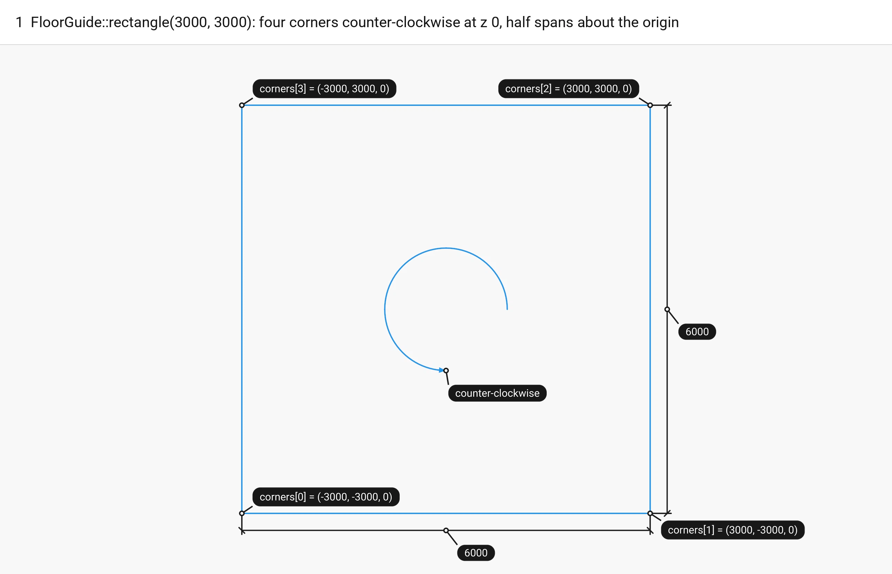

■ built what the step builds   ■ variable the value it introduces or measures   ■ result a second thing it builds   ■ input what it reads from earlier steps, dashed for a helper   ■ context everything else

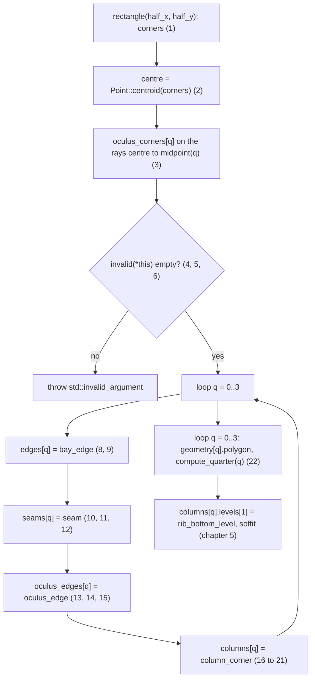
```mermaid
flowchart TD
    A["rectangle(half_x, half_y): corners (1)"] --> B["centre = Point::centroid(corners) (2)"]
    B --> C["oculus_corners[q] on the rays centre to midpoint(q) (3)"]
    C --> D{"invalid(*this) empty? (4, 5, 6)"}
    D -- no --> X["throw std::invalid_argument"]
    D -- yes --> E["loop q = 0..3"]
    E --> F["edges[q] = bay_edge (8, 9)"]
    F --> G["seams[q] = seam (10, 11, 12)"]
    G --> H["oculus_edges[q] = oculus_edge (13, 14, 15)"]
    H --> I["columns[q] = column_corner (16 to 21)"]
    I --> E
    E --> J["loop q = 0..3: geometry[q].polygon, compute_quarter(q) (22)"]
    J --> K["columns[q].levels[1] = rib_bottom_level, soffit (chapter 5)"]
```

## 1. Bay corners

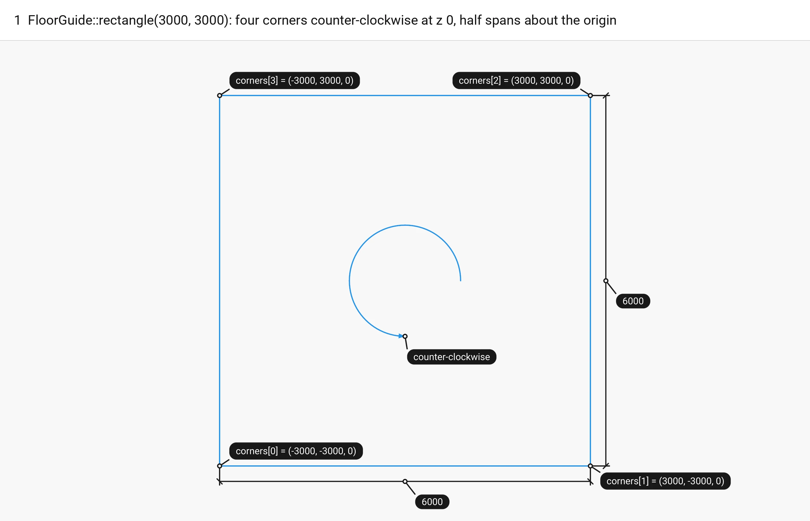

■ built `corners[0..3]`, counter-clockwise   ■ variable the spans `2 half_x = 6000`, `2 half_y = 6000`

`FloorGuide::rectangle(half_x, half_y)` builds four corners counter-clockwise at z 0 around the origin, which the guide keeps with its parameter fields at their defaults, then computes; corner `k` starts edge `k`. To change a parameter, set the field and call `compute()` again.

Code: `FloorGuide::rectangle`, [floor_plan.cpp:22-24](https://github.com/petrasvestartas/wood/blob/79d4d5c74fdbb4c7b474b2df14efe7f6c7b72e2f/src/templates/floor/floor_plan.cpp#L22-L24); constructor initialiser, [floor.cpp:422](https://github.com/petrasvestartas/wood/blob/79d4d5c74fdbb4c7b474b2df14efe7f6c7b72e2f/src/templates/floor/floor.cpp#L422).

## 2. Centre and edge midpoints

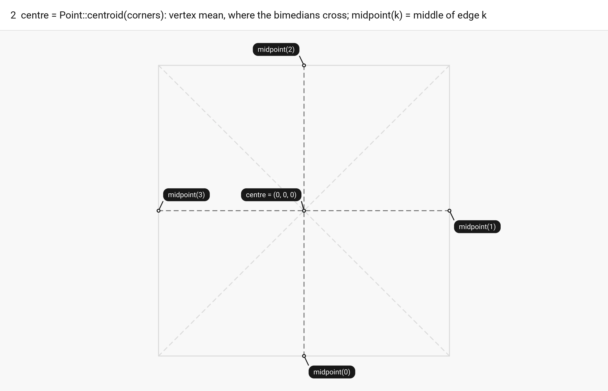

■ built `centre`   ■ result `midpoint(0..3)`   ■ input the bimedians, dashed   ■ context bay edges and diagonals

`centre` is the vertex centroid of the four corners (not the area centroid), where the bimedians cross, and `midpoint(k)` is the centre of edge `k`, recomputed on every call rather than stored.

Code: `FloorGuide::compute`, [floor.cpp:431](https://github.com/petrasvestartas/wood/blob/79d4d5c74fdbb4c7b474b2df14efe7f6c7b72e2f/src/templates/floor/floor.cpp#L431); `FloorGuide::midpoint`, [floor_plan.cpp:26-28](https://github.com/petrasvestartas/wood/blob/79d4d5c74fdbb4c7b474b2df14efe7f6c7b72e2f/src/templates/floor/floor_plan.cpp#L26-L28).

## 3. Oculus corners on the centre-to-midpoint rays

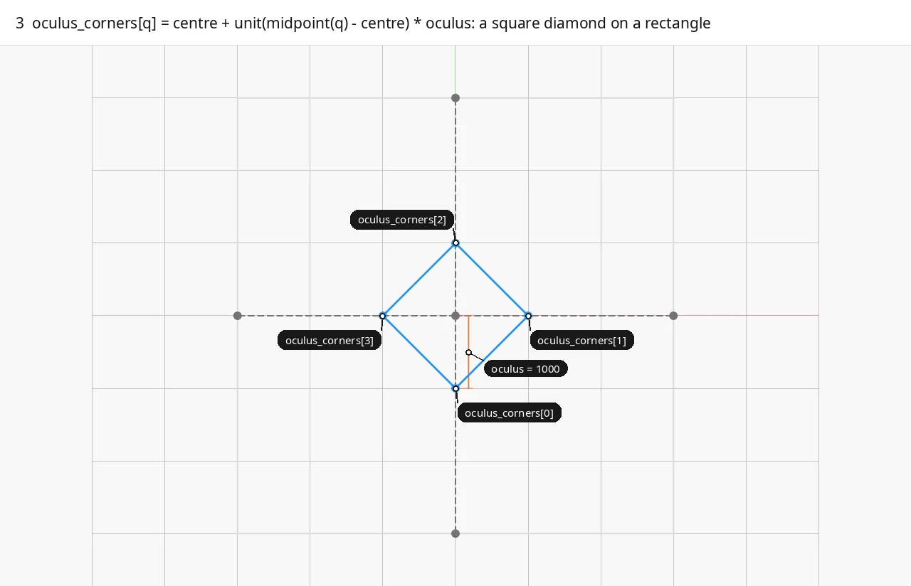

■ built `oculus_corners[0..3]`, the diamond   ■ variable `oculus_radius = 1000`   ■ input `centre`, `midpoint(q)` and the rays between them, dashed   ■ context bay edges

Each `oculus_corners[q]` lies `oculus_radius` from `centre` on the ray towards `midpoint(q)`, so on any rectangle the four form a square diamond and oculus corner `q` lies on seam `q`.

Code: `FloorGuide::compute`, [floor.cpp:433-434](https://github.com/petrasvestartas/wood/blob/79d4d5c74fdbb4c7b474b2df14efe7f6c7b72e2f/src/templates/floor/floor.cpp#L433-L434).

## 4. Validity A: z 0, left turns, no repeats

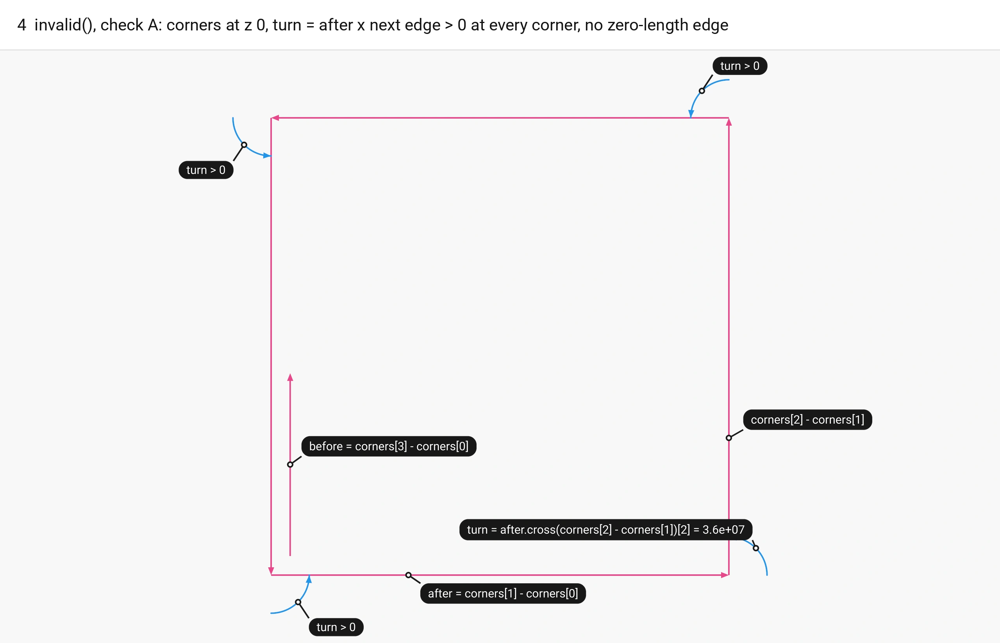

■ built `turn` at every corner   ■ variable the four `after` vectors and `before` at corner 0   ■ context bay edges

`geometry::invalid` returns why a guide is invalid and `compute` then throws `std::invalid_argument`; per corner it fails, in this order, when the corner is off z 0, when `turn` (z of edge `k` cross edge `k + 1`) is `<= 0`, or when `after` or `before` has zero length. Because the turn test runs first, a repeated corner is almost always reported as "not counter-clockwise and convex".

Code: `geometry::invalid`, [floor_plan.cpp:110-129](https://github.com/petrasvestartas/wood/blob/79d4d5c74fdbb4c7b474b2df14efe7f6c7b72e2f/src/templates/floor/floor_plan.cpp#L110-L129); thrown in `FloorGuide::FloorGuide`, [floor.cpp:436-439](https://github.com/petrasvestartas/wood/blob/79d4d5c74fdbb4c7b474b2df14efe7f6c7b72e2f/src/templates/floor/floor.cpp#L436-L439).

## 5. Validity B: oculus corner inside its seam

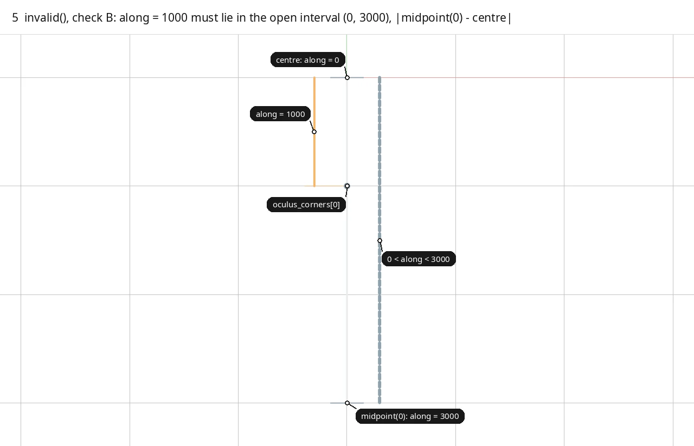

■ variable `along = 1000`   ■ input the open interval `(0, 3000)` from `centre` to `midpoint(0)`, dashed, and `oculus_corners[0]`   ■ context seam 0

`along`, the distance of `oculus_corners[k]` from `centre` along seam `k`, must lie strictly between 0 and `|midpoint(k) - centre|`, so `oculus_radius` must be positive and shorter than the distance from the centre to every edge midpoint (2400 on edges 0 and 2 of `rectangle(3000, 2400)`).

Code: `geometry::invalid`, [floor_plan.cpp:131-134](https://github.com/petrasvestartas/wood/blob/79d4d5c74fdbb4c7b474b2df14efe7f6c7b72e2f/src/templates/floor/floor_plan.cpp#L131-L134).

## 6. Validity C: ring covers the oculus beam face

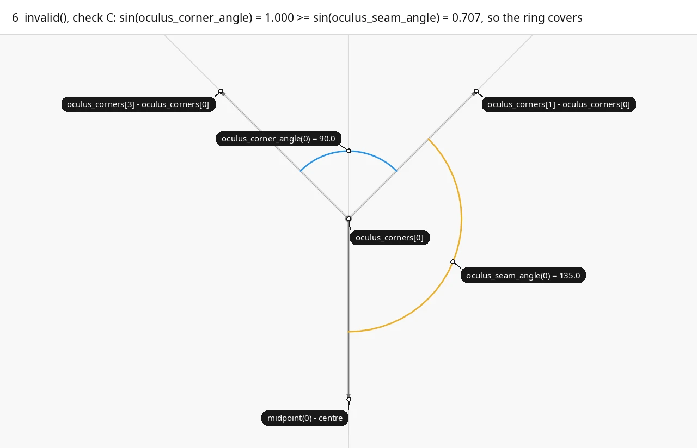

■ built `oculus_corner_angle(0) = 90`   ■ result `oculus_seam_angle(0) = 135`   ■ input `oculus_corners[0]` and the three vectors from it   ■ context oculus diamond and seam 0

The guide is rejected when `sin(oculus_corner_angle(k)) < sin(oculus_seam_angle(k))` at any oculus corner, because the ring beam would then leave quarter `k + 1`'s oculus beam face uncovered (rule R7). On any rectangle the angles are 90 and 135, so this check always passes.

Code: `geometry::invalid`, [floor_plan.cpp:137-141](https://github.com/petrasvestartas/wood/blob/79d4d5c74fdbb4c7b474b2df14efe7f6c7b72e2f/src/templates/floor/floor_plan.cpp#L137-L141); `oculus_corner_angle`, `oculus_seam_angle`, [floor_plan.cpp:34-40](https://github.com/petrasvestartas/wood/blob/79d4d5c74fdbb4c7b474b2df14efe7f6c7b72e2f/src/templates/floor/floor_plan.cpp#L34-L40).

## 7. Geometry primitives

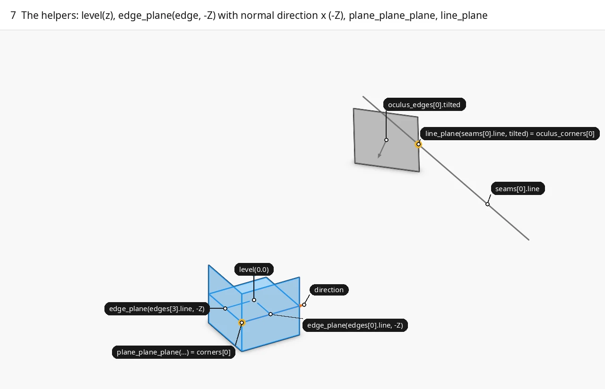

■ built `level(0.0)`, `edge_plane(edges[0].line, -Z)`, `edge_plane(edges[3].line, -Z)`   ■ result the points `plane_plane_plane` and `line_plane` return   ■ variable the edge direction   ■ input `seams[0].line`, `oculus_edges[0].tilted`

`level(z)`, `edge_plane`, `plane_plane_plane` and `line_plane` build every plane and corner of the floor; `edge_plane(edge, -Z)` is vertical with its normal pointing into a counter-clockwise outline, and the last two return `std::nullopt` on parallel input.

Code: `level`, `edge_plane`, [floor_geometry.cpp:19-25](https://github.com/petrasvestartas/wood/blob/79d4d5c74fdbb4c7b474b2df14efe7f6c7b72e2f/src/templates/floor/floor_geometry.cpp#L19-L25); `line_plane`, 41-49; `plane_plane_plane`, 51-59; `edge`, 65-67; `TOLERANCE`, 8.

## 8. Bay edge line and band[0]

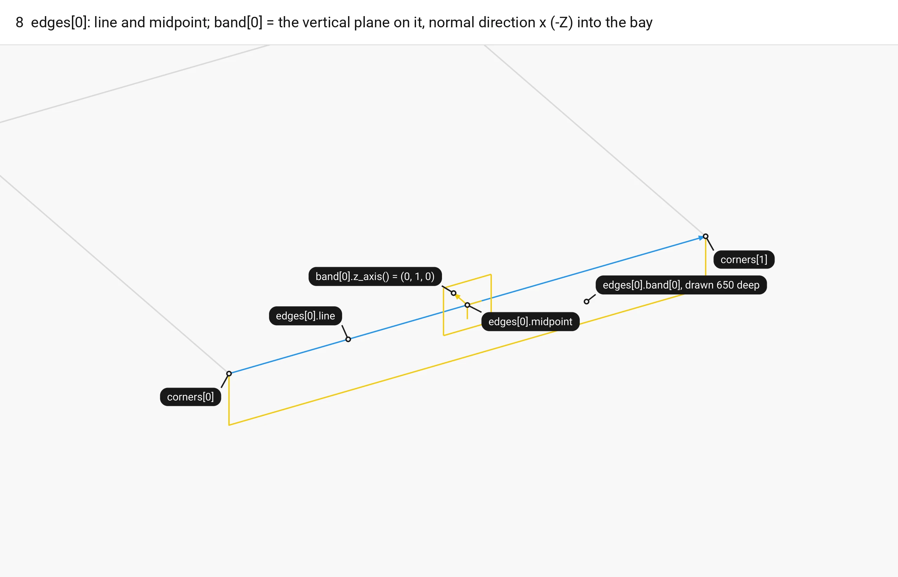

■ built `edges[0].line`, `edges[0].midpoint`   ■ result `edges[0].band[0]`, drawn `height` deep   ■ context bay edges

`bay_edge` sets `edges[k].line` from `corners[k]` to `corners[k + 1]`, its `midpoint`, and `band[0]`, the vertical plane on the edge at the midpoint with its normal into the bay, shared by the two quarters beside it.

Code: `bay_edge`, [floor.cpp:69-77](https://github.com/petrasvestartas/wood/blob/79d4d5c74fdbb4c7b474b2df14efe7f6c7b72e2f/src/templates/floor/floor.cpp#L69-L77); loop, [floor.cpp:441-446](https://github.com/petrasvestartas/wood/blob/79d4d5c74fdbb4c7b474b2df14efe7f6c7b72e2f/src/templates/floor/floor.cpp#L441-L446).

## 9. band[1]: offset by outer_ribs

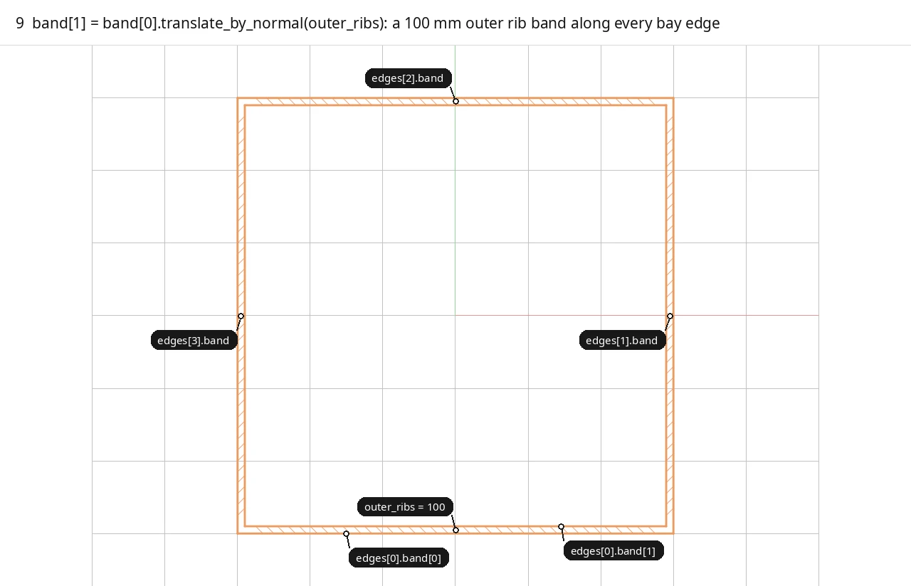

■ built `edges[k].band[1]`   ■ variable `outer_ribs = 100`, the hatched band   ■ input `edges[k].band[0]`

`band[1]` is `band[0]` moved `outer_ribs` along its normal into the bay, so the two planes bound the outer rib band on edge `k`.

Code: `pair`, [floor.cpp:15-17](https://github.com/petrasvestartas/wood/blob/79d4d5c74fdbb4c7b474b2df14efe7f6c7b72e2f/src/templates/floor/floor.cpp#L15-L17); used in `bay_edge`, [floor.cpp:74](https://github.com/petrasvestartas/wood/blob/79d4d5c74fdbb4c7b474b2df14efe7f6c7b72e2f/src/templates/floor/floor.cpp#L74).

## 10. Seams

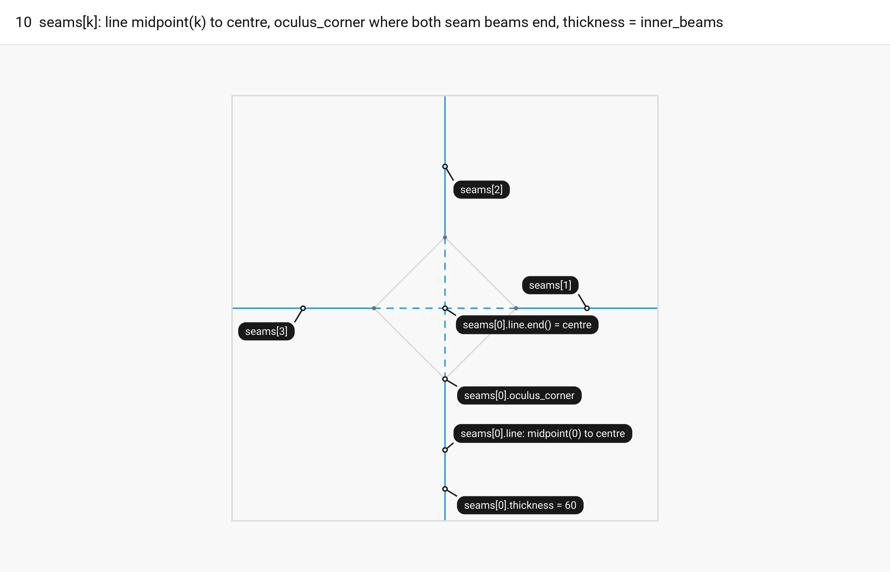

■ built `seams[0..3].line`, solid where the seam beams run, dashed from the oculus corner to the centre   ■ input `seams[k].oculus_corner` = `oculus_corners[k]`   ■ context bay edges and oculus diamond

`seams[k].line` runs from `midpoint(k)` to the centre, both seam beams end at its `oculus_corner`, `thickness = inner_beams`, and quarter `k` sits on the beam-0 side, quarter `k + 1` on the beam-2 side.

Code: `seam`, [floor.cpp:80-90](https://github.com/petrasvestartas/wood/blob/79d4d5c74fdbb4c7b474b2df14efe7f6c7b72e2f/src/templates/floor/floor.cpp#L80-L90); called [floor.cpp:443](https://github.com/petrasvestartas/wood/blob/79d4d5c74fdbb4c7b474b2df14efe7f6c7b72e2f/src/templates/floor/floor.cpp#L443).

## 11. Seam plane into its own quarter

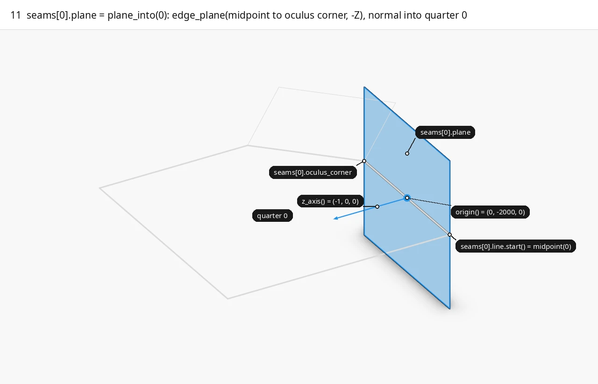

■ built `seams[0].plane` and its origin   ■ input the half seam, `midpoint(0)` to `seams[0].oculus_corner`   ■ context quarter 0 and oculus diamond

`seams[k].plane = plane_into(k)` is the vertical plane through the half seam from the edge midpoint to the oculus corner, with its normal pointing into quarter `k`.

Code: `Seam::plane_into`, [floor.cpp:411-416](https://github.com/petrasvestartas/wood/blob/79d4d5c74fdbb4c7b474b2df14efe7f6c7b72e2f/src/templates/floor/floor.cpp#L411-L416); assigned [floor.cpp:87](https://github.com/petrasvestartas/wood/blob/79d4d5c74fdbb4c7b474b2df14efe7f6c7b72e2f/src/templates/floor/floor.cpp#L87); `edge_plane`, [floor_geometry.cpp:23-25](https://github.com/petrasvestartas/wood/blob/79d4d5c74fdbb4c7b474b2df14efe7f6c7b72e2f/src/templates/floor/floor_geometry.cpp#L23-L25).

## 12. plane_into the other quarter and faces_into

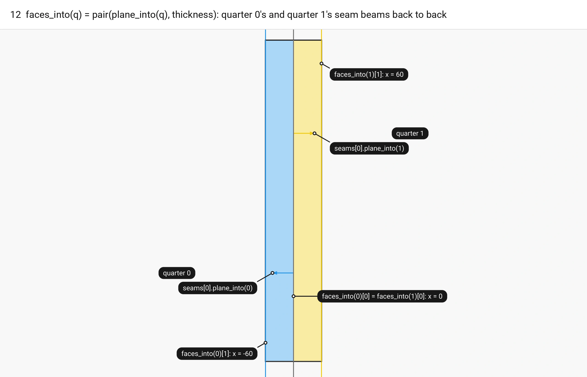

■ built `seams[0].faces_into(0)`, quarter 0's beam   ■ result `seams[0].faces_into(1)`, quarter 1's beam   ■ input the shared seam plane, x = 0

For the other quarter `plane_into` flips only the normal, and `faces_into(quarter)` pairs that plane with its copy `thickness` into the quarter, so the two beams of one seam stand back to back on the shared seam plane.

Code: `Seam::plane_into` else branch, [floor.cpp:415](https://github.com/petrasvestartas/wood/blob/79d4d5c74fdbb4c7b474b2df14efe7f6c7b72e2f/src/templates/floor/floor.cpp#L415); `Seam::faces_into`, [floor.cpp:418-420](https://github.com/petrasvestartas/wood/blob/79d4d5c74fdbb4c7b474b2df14efe7f6c7b72e2f/src/templates/floor/floor.cpp#L418-L420); read in `construction_planes`, [floor.cpp:190](https://github.com/petrasvestartas/wood/blob/79d4d5c74fdbb4c7b474b2df14efe7f6c7b72e2f/src/templates/floor/floor.cpp#L190).

## 13. Oculus edge and its vertical plane

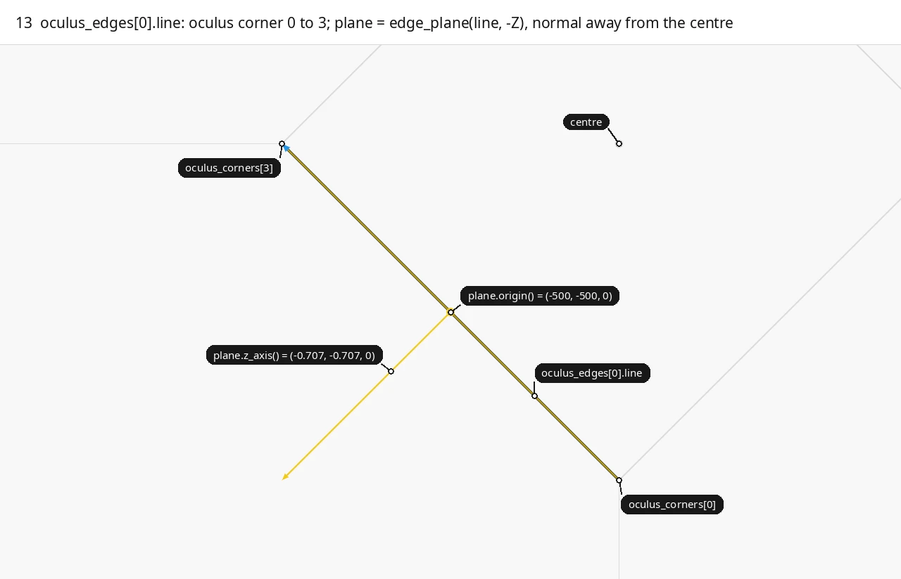

■ built `oculus_edges[0].line`   ■ result `plane` (local) and its origin   ■ context oculus diamond, quarter 0 and centre

`oculus_edges[q].line` runs from oculus corner `q` to oculus corner `q - 1`, and a local vertical `plane` through it, normal pointing away from the centre into quarter `q`, is the base for `tilted`, `back` and `ring_inner`.

Code: `oculus_edge`, [floor.cpp:93-97](https://github.com/petrasvestartas/wood/blob/79d4d5c74fdbb4c7b474b2df14efe7f6c7b72e2f/src/templates/floor/floor.cpp#L93-L97); called [floor.cpp:444](https://github.com/petrasvestartas/wood/blob/79d4d5c74fdbb4c7b474b2df14efe7f6c7b72e2f/src/templates/floor/floor.cpp#L444).

## 14. tilted: rotate by -oculus_plane_angle

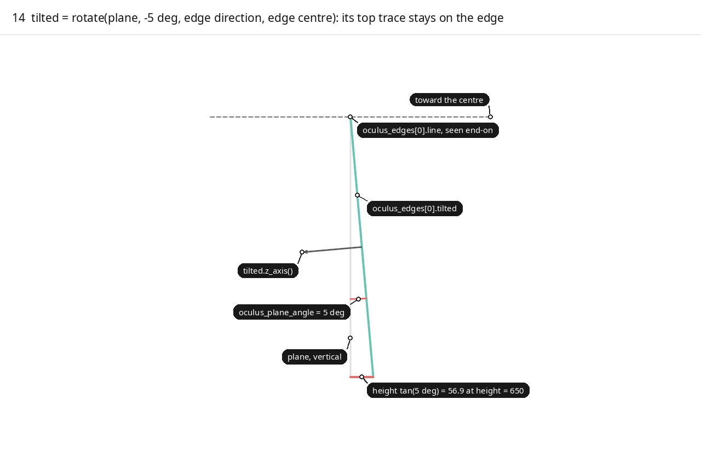

■ built `oculus_edges[0].tilted` and `tilted.z_axis()`   ■ variable `oculus_plane_angle = 5` and the offset `height tan 5 = 56.9`   ■ input the vertical `plane`, and the direction toward the centre, dashed

`tilted` rotates that plane by `-oculus_plane_angle` about the edge, so its datum trace stays on the oculus edge while its normal tips down and the face leans `h tan 5` towards the centre at depth `h`. The quarter's oculus beam face and the ring beam share this bearing plane.

Code: `oculus_edge`, [floor.cpp:98](https://github.com/petrasvestartas/wood/blob/79d4d5c74fdbb4c7b474b2df14efe7f6c7b72e2f/src/templates/floor/floor.cpp#L98); `rotate`, [floor_geometry.cpp:15-17](https://github.com/petrasvestartas/wood/blob/79d4d5c74fdbb4c7b474b2df14efe7f6c7b72e2f/src/templates/floor/floor_geometry.cpp#L15-L17).

## 15. back and ring_inner

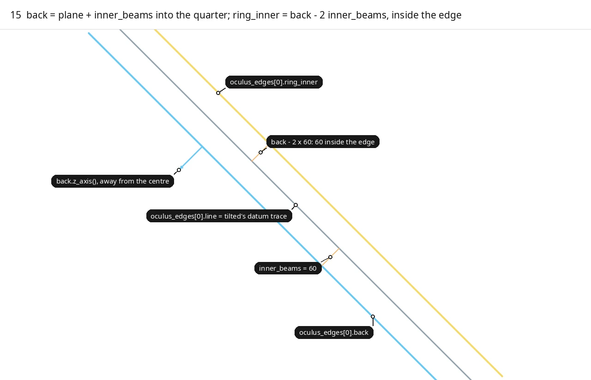

■ built `oculus_edges[0].back` and its normal   ■ result `oculus_edges[0].ring_inner`   ■ variable `inner_beams = 60` offsets   ■ input `oculus_edges[0].line`, tilted's datum trace

`back`, the oculus beam's back face, is the vertical edge plane moved `inner_beams` away from the centre, and `ring_inner` sits `inner_beams` inside the edge towards the centre, so the ring beam lies between `tilted` and `ring_inner`.

Code: `oculus_edge`, [floor.cpp:99-100](https://github.com/petrasvestartas/wood/blob/79d4d5c74fdbb4c7b474b2df14efe7f6c7b72e2f/src/templates/floor/floor.cpp#L99-L100).

## 16. Column corner frame

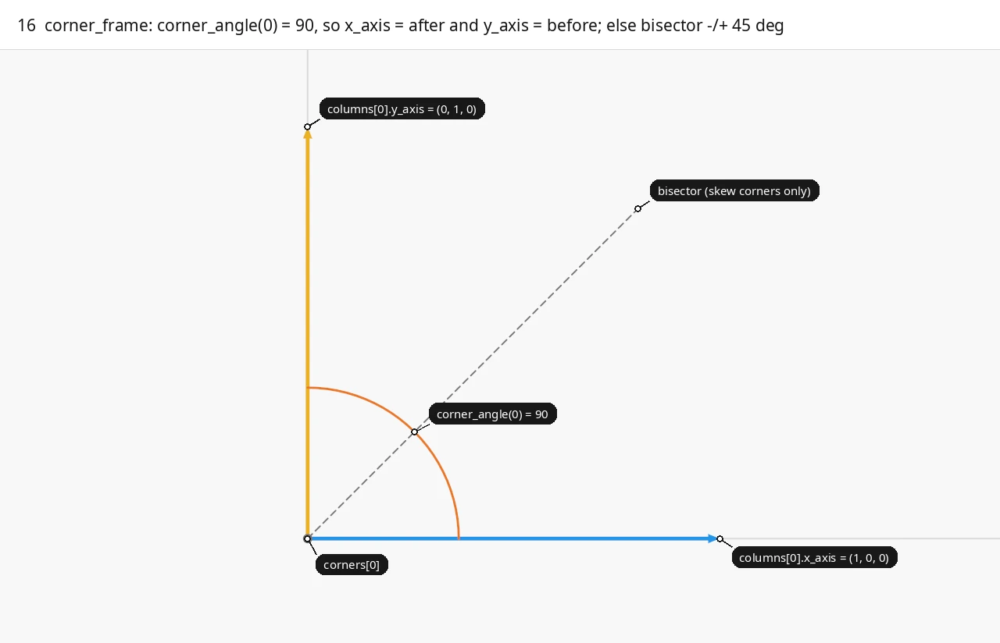

■ built `columns[0].x_axis`   ■ result `columns[0].y_axis`   ■ variable `corner_angle(0) = 90`   ■ input `corners[0]` and the bisector, dashed   ■ context bay edges 0 and 3

At a right corner (within `RIGHT_ANGLE` = 1e-9 degrees) `corner_frame` keeps the two edge directions as `x_axis` and `y_axis`. At a skewed corner it rotates the bisector by -45 and +45 degrees instead, so the square column stays symmetric about the bisector rather than following the skew.

Code: `corner_frame`, [floor.cpp:106-119](https://github.com/petrasvestartas/wood/blob/79d4d5c74fdbb4c7b474b2df14efe7f6c7b72e2f/src/templates/floor/floor.cpp#L106-L119); `RIGHT_ANGLE`, [floor.cpp:10](https://github.com/petrasvestartas/wood/blob/79d4d5c74fdbb4c7b474b2df14efe7f6c7b72e2f/src/templates/floor/floor.cpp#L10); `corner_angle`, [floor_plan.cpp:30-32](https://github.com/petrasvestartas/wood/blob/79d4d5c74fdbb4c7b474b2df14efe7f6c7b72e2f/src/templates/floor/floor_plan.cpp#L30-L32); stored [floor.cpp:126-128](https://github.com/petrasvestartas/wood/blob/79d4d5c74fdbb4c7b474b2df14efe7f6c7b72e2f/src/templates/floor/floor.cpp#L126-L128).

## 17. Head polygon and chamfer_direction

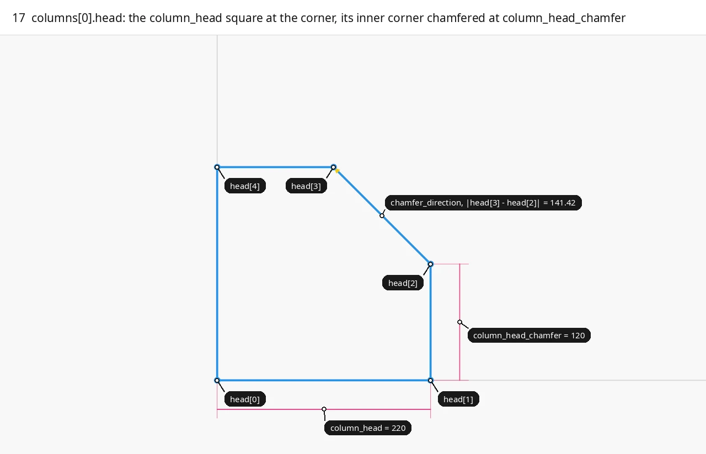

■ built `columns[0].head`   ■ result `chamfer_direction`   ■ variable `column_head = 220`, `column_head_chamfer = 120`   ■ context bay edges 0 and 3

`head` is the `column_head` shaft square at the corner with its inner corner chamfered between points `column_head_chamfer` along the two shaft faces, a pentagon at z 0, and `chamfer_direction` is the unit vector from `head[2]` to `head[3]`. The `Column` element of chapter 7 has a larger capitel, `column_head + column_head_chamfer` square.

Code: `column_corner`, [floor.cpp:130-135](https://github.com/petrasvestartas/wood/blob/79d4d5c74fdbb4c7b474b2df14efe7f6c7b72e2f/src/templates/floor/floor.cpp#L130-L135); capitel in `to_column`, [floor_elements.cpp:78-91](https://github.com/petrasvestartas/wood/blob/79d4d5c74fdbb4c7b474b2df14efe7f6c7b72e2f/src/templates/floor/floor_elements.cpp#L78-L91).

## 18. Head side planes

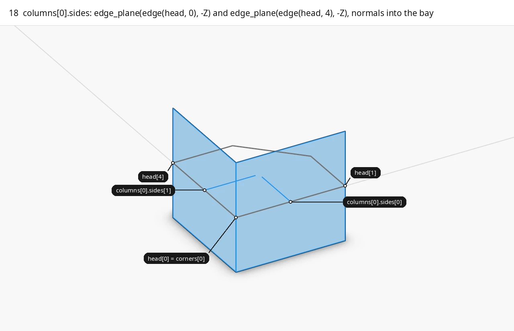

■ built `columns[0].sides[0]`, `columns[0].sides[1]`   ■ input `columns[0].head`   ■ context bay edges 0 and 3

`sides` are the vertical planes on head sides 0 (on bay edge `k`) and 4 (on bay edge `k - 1`), normals into the bay, which at a right corner lie in the `band[0]` planes of those edges.

Code: `column_corner`, [floor.cpp:136](https://github.com/petrasvestartas/wood/blob/79d4d5c74fdbb4c7b474b2df14efe7f6c7b72e2f/src/templates/floor/floor.cpp#L136); `edge`, [floor_geometry.cpp:65-67](https://github.com/petrasvestartas/wood/blob/79d4d5c74fdbb4c7b474b2df14efe7f6c7b72e2f/src/templates/floor/floor_geometry.cpp#L65-L67).

## 19. Initial cutter levels

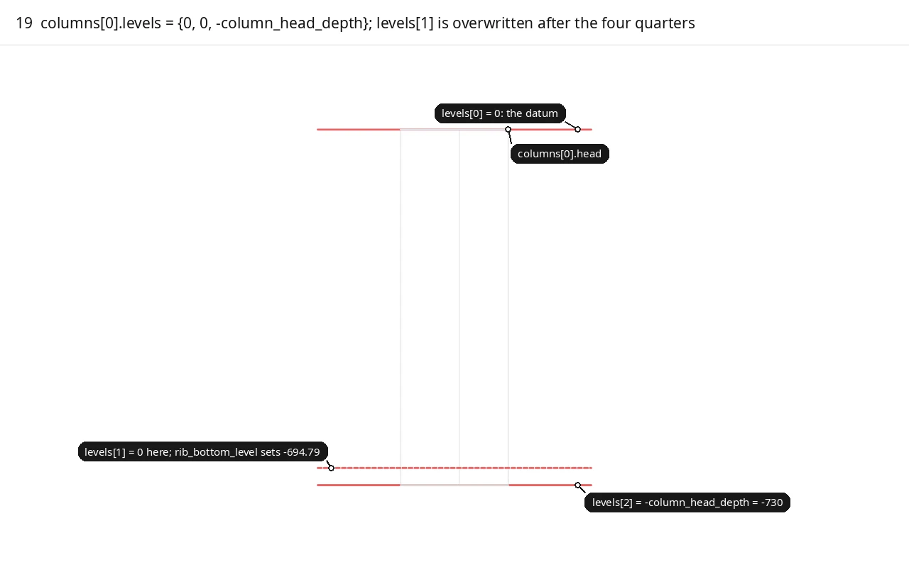

■ built `columns[0].levels[0..2]`, `levels[1]` dashed   ■ input `columns[0].head` at the datum   ■ context the carved head down to `column_head_depth`

`levels = {0, 0, -column_head_depth}` bound the six column cutters; the middle 0 is a placeholder `compute` later overwrites with `rib_bottom_level`, -694.79 on the default bay, drawn dashed.

Code: `column_corner`, [floor.cpp:137](https://github.com/petrasvestartas/wood/blob/79d4d5c74fdbb4c7b474b2df14efe7f6c7b72e2f/src/templates/floor/floor.cpp#L137); overwritten [floor.cpp:458-459](https://github.com/petrasvestartas/wood/blob/79d4d5c74fdbb4c7b474b2df14efe7f6c7b72e2f/src/templates/floor/floor.cpp#L458-L459); `rib_bottom_level`, [floor.cpp:376-384](https://github.com/petrasvestartas/wood/blob/79d4d5c74fdbb4c7b474b2df14efe7f6c7b72e2f/src/templates/floor/floor.cpp#L376-L384).

## 20. axis_point and support_plane

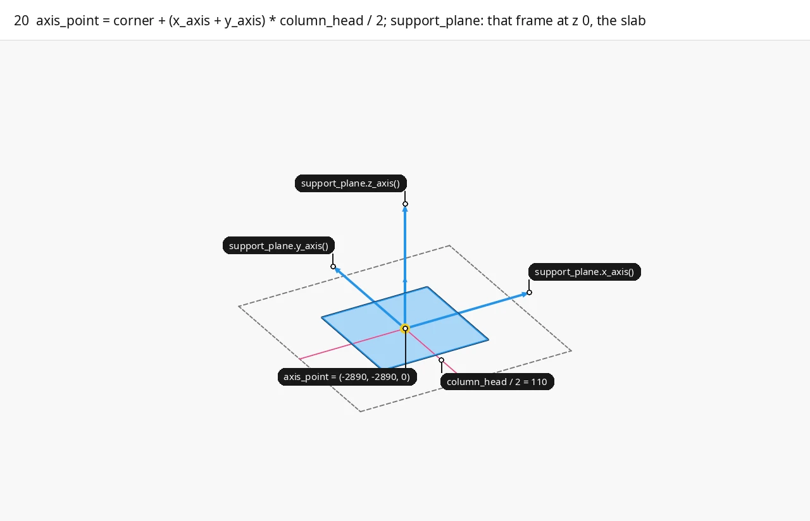

■ built `columns[0].support_plane` and its axes   ■ result `columns[0].axis_point`   ■ variable `column_head / 2 = 110`   ■ input the 220 shaft square, dashed

`axis_point` is the shaft centre, half a `column_head` along both frame axes from the corner, and `support_plane` is a horizontal frame there on the slab, not lifted to the floor datum.

Code: `column_corner`, [floor.cpp:138-139](https://github.com/petrasvestartas/wood/blob/79d4d5c74fdbb4c7b474b2df14efe7f6c7b72e2f/src/templates/floor/floor.cpp#L138-L139); `to_support`, [floor_elements.cpp:74-76](https://github.com/petrasvestartas/wood/blob/79d4d5c74fdbb4c7b474b2df14efe7f6c7b72e2f/src/templates/floor/floor_elements.cpp#L74-L76); [floor_relations.cpp:167](https://github.com/petrasvestartas/wood/blob/79d4d5c74fdbb4c7b474b2df14efe7f6c7b72e2f/src/templates/floor/floor_relations.cpp#L167).

## 21. Column axes

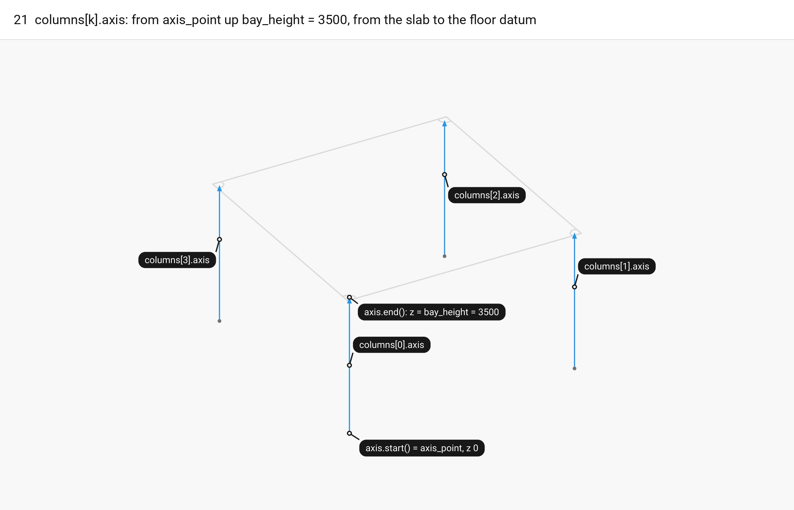

■ built `columns[0..3].axis`   ■ input `axis_point` at z 0   ■ context bay edges and column heads

`axis` is the vertical column axis from `axis_point` up `bay_height` (one storey); `to_column` builds its own axis and does not use it.

Code: `column_corner`, [floor.cpp:140](https://github.com/petrasvestartas/wood/blob/79d4d5c74fdbb4c7b474b2df14efe7f6c7b72e2f/src/templates/floor/floor.cpp#L140).

## 22. Quarter polygon and compute_quarter order

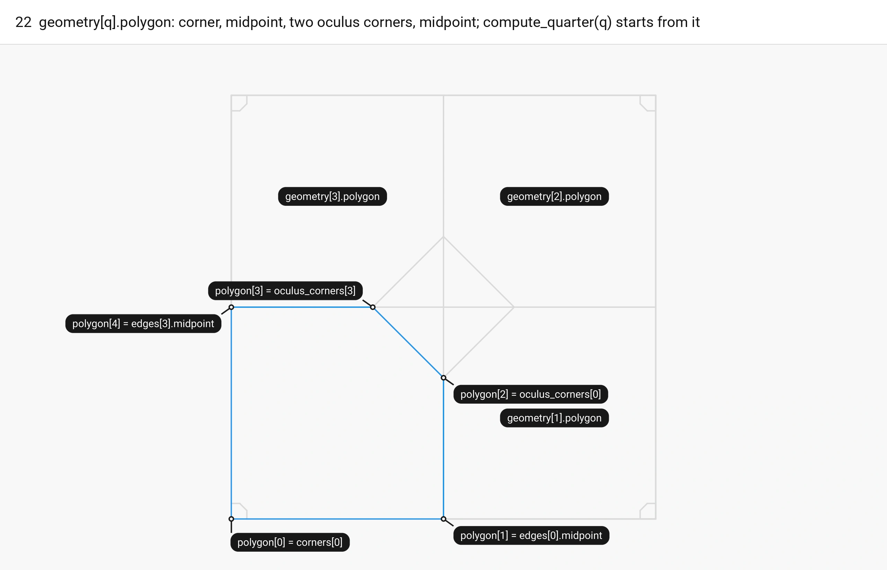

■ built `geometry[0].polygon`   ■ input its vertices `corners[0]`, `edges[0].midpoint`, `oculus_corners[0]`, `oculus_corners[3]`, `edges[3].midpoint`   ■ context quarters 1 to 3, column heads and bay edges

The second loop stores each counter-clockwise quarter pentagon `geometry[q].polygon` and runs `compute_quarter(q)` at once, so quarter `q` is complete before quarter `q + 1` starts; `columns[q].levels[1]` and `soffit` are set only after all four.

Code: `FloorGuide::compute`, [floor.cpp:453-456](https://github.com/petrasvestartas/wood/blob/79d4d5c74fdbb4c7b474b2df14efe7f6c7b72e2f/src/templates/floor/floor.cpp#L453-L456); `compute_quarter`, [floor.cpp:359-373](https://github.com/petrasvestartas/wood/blob/79d4d5c74fdbb4c7b474b2df14efe7f6c7b72e2f/src/templates/floor/floor.cpp#L359-L373).
