# Floor 02: Quarter planes {#templates_floor_02_quarter_planes}

This chapter computes the member planes of one quarter. `compute_quarter` (`src/templates/floor/floor.cpp:360-375`) calls `construction_planes` (`floor.cpp:180-215`) and then `column_seats` (`floor.cpp:162-173`). It reads what chapter 1 built: the bay edges with their bands, the seams, the oculus edges and the column head polygons. It writes `ConstructionPlanes cp` into `guide.geometry[q].planes`, and `wedge_fan`, `column_offset` and `wedge_seat` into `guide.columns[q]`. Chapter 3 reads these planes in `construction_quads`, `run_ins` and `block_planes`. Every plane except the oculus beam's is stored as a pair `{plane, plane.translate_by_normal(distance)}` made by `pair()` (`floor.cpp:15-17`): `[0]` is the base face and `[1]` is the face offset from it. All values below are for quarter 0 of the default bay, `FloorGuide::rectangle(3000, 3000)` (half sizes, so a 6000 x 6000 bay). Quarter 0 has its column corner at (-3000, -3000) and its oculus edge from (0, -1000) to (-1000, 0).

Example: [templates_floor_1_floorguide.cpp](https://github.com/petrasvestartas/wood/blob/44f9aa85952d32a9264125f4e9940e55b05a4512/examples/templates_floor_1_floorguide.cpp) draws quarter 0 of the square guide with every member's two face planes `face_0` and `face_1`, the `cp` pairs this chapter computes, grouped by family.

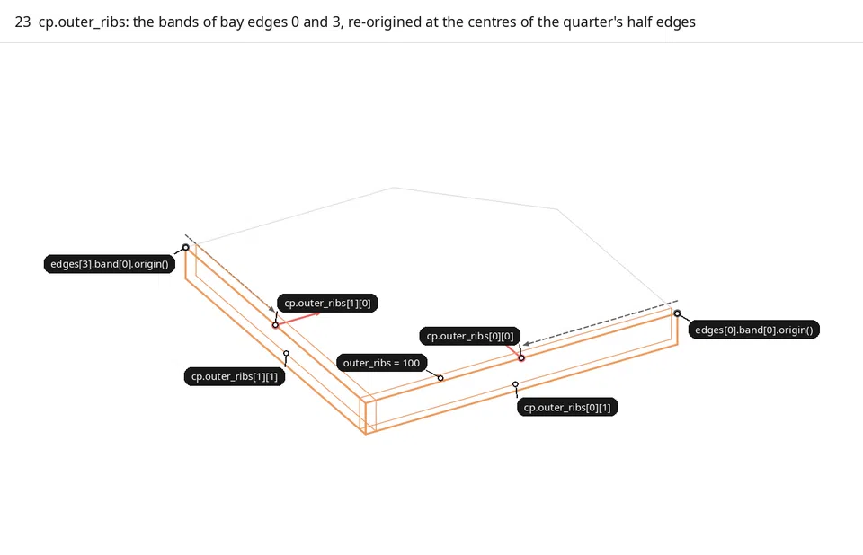

<span style="color:#2196EA">■ built</span> what the step builds   <span style="color:#EBB121">■ result</span> a second result   <span style="color:#EB7721">■ variable</span> the variable it introduces   <span style="color:#455B6B">■ input</span> what it reads, dashed for a helper   <span style="color:#8C969E">■ context</span> context

```cpp
static void compute_quarter(FloorGuide& guide, size_t q) {
    geometry.planes = construction_planes(guide, q, column);   // frames 23-32
    column_seats(column, guide, q, geometry.planes);           // frames 33-34
    geometry.quads = construction_quads(geometry.planes);      // chapter 3
    ...
}
```

## 23. Outer rib planes, re-origined

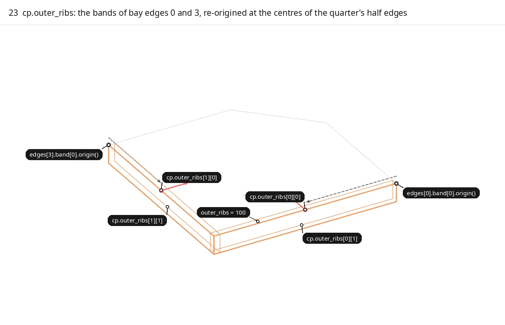

<span style="color:#2196EA">■ built</span> `cp.outer_ribs[0]`, `cp.outer_ribs[1]`, their new origins and normals   <span style="color:#EB7721">■ variable</span> `outer_ribs = 100`   <span style="color:#455B6B">■ input</span> `edges[0].band[0].origin()`, `edges[3].band[0].origin()` and the re-origin move   <span style="color:#8C969E">■ context</span> quarter 0

Chapter 1 gave each bay edge `k` a band. `bay_edge` makes `edges[k].band = pair(Plane::from_point_normal(edge.midpoint, line.to_direction() x (-z)), outer_ribs)`: the vertical plane on the edge, with its normal pointing into the bay and its origin at the edge midpoint. Two quarters share that band. `construction_planes` takes <span style="color:#455B6B">`band[0]`</span> of edge `q` and of edge `q - 1` (for quarter 0, edges 0 and 3). `reoriginated()` moves the origin of each to the centre of the quarter's own half edge, <span style="color:#2196EA">`edge(polygon, 0).center()`</span> and <span style="color:#2196EA">`edge(polygon, 4).center()`</span>. The axes are copied unchanged, so the <span style="color:#2196EA">normal</span> keeps the same bits (`Plane::from_frame` with the old axes). `pair(..., outer_ribs)` then adds the second face <span style="color:#EB7721">100 mm</span> inside the bay. In the frame each face of <span style="color:#2196EA">`cp.outer_ribs`</span> is drawn as a 300 mm deep sheet hanging from its datum trace. The <span style="color:#455B6B">dashed arrow</span>, drawn 120 mm above the datum so it clears the sheet's top edge, runs from the <span style="color:#455B6B">shared band origin</span> to the <span style="color:#2196EA">new origin</span>.

```cpp
const Plane outer0 = reoriginated(guide.edges[q].band[0], edge(polygon, 0).center());
const Plane outer1 = reoriginated(guide.edges[(q + 3) % 4].band[0], edge(polygon, 4).center());
cp.outer_ribs = {pair(outer0, parameters.outer_ribs), pair(outer1, parameters.outer_ribs)};
```

| Variable | Value | Meaning |
|---|---|---|
| `outer_ribs` | 100 | Outer rib thickness, the band offset |
| `polygon` | (-3000,-3000), (0,-3000), (0,-1000), (-1000,0), (-3000,0) | `guide.geometry[0].polygon`: corner 0, midpoint 0, oculus corners 0 and 3, midpoint 3 |
| `edges[0].band[0].origin()` | (0, -3000, 0) | Shared band origin, the midpoint of edge 0 |
| `edges[3].band[0].origin()` | (-3000, 0, 0) | Shared band origin, the midpoint of edge 3 |
| `edge(polygon, 0).center()`, `edge(polygon, 4).center()` | (-1500, -3000, 0), (-3000, -1500, 0) | The half-edge centres the bands are re-origined to |
| `cp.outer_ribs[0][0]` | y = -3000, normal (0, 1, 0), origin (-1500, -3000, 0) | Outer face of outer rib 0, on bay edge 0 |
| `cp.outer_ribs[0][1]` | y = -2900 | Inner face of outer rib 0 |
| `cp.outer_ribs[1][0]` | x = -3000, normal (1, 0, 0), origin (-3000, -1500, 0) | Outer face of outer rib 1, on bay edge 3 |
| `cp.outer_ribs[1][1]` | x = -2900 | Inner face of outer rib 1 |

Code: `construction_planes`, [floor.cpp:186-188](https://github.com/petrasvestartas/wood/blob/44f9aa85952d32a9264125f4e9940e55b05a4512/src/templates/floor/floor.cpp#L186-L188); `reoriginated` [floor.cpp:20-22](https://github.com/petrasvestartas/wood/blob/44f9aa85952d32a9264125f4e9940e55b05a4512/src/templates/floor/floor.cpp#L20-L22); `pair` [floor.cpp:15-17](https://github.com/petrasvestartas/wood/blob/44f9aa85952d32a9264125f4e9940e55b05a4512/src/templates/floor/floor.cpp#L15-L17); `bay_edge` [floor.cpp:69-77](https://github.com/petrasvestartas/wood/blob/44f9aa85952d32a9264125f4e9940e55b05a4512/src/templates/floor/floor.cpp#L69-L77).

## 24. Seam beam planes into the quarter

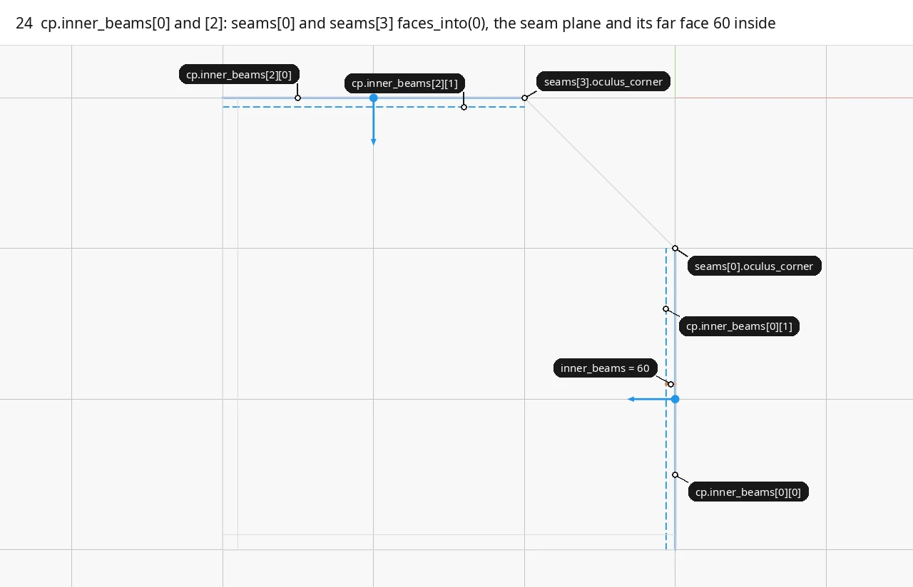

<span style="color:#2196EA">■ built</span> `cp.inner_beams[0]`, `cp.inner_beams[2]`: seam plane and normal solid, far face dashed   <span style="color:#EB7721">■ variable</span> `inner_beams = 60`   <span style="color:#8C969E">■ context</span> quarter 0, `cp.outer_ribs`

Each seam stores its line from the edge midpoint to the centre, its `oculus_corner` and `thickness = inner_beams`. <span style="color:#2196EA">`Seam::plane_into(quarter)`</span> is `edge_plane` over the half seam with `normal_z = -z`. `edge_plane` is the vertical plane through the line centre with normal `direction x normal_z`. The half seam runs midpoint to oculus corner when `quarter % 4 == index` and oculus corner to midpoint otherwise. The reversed direction flips the normal, so the <span style="color:#2196EA">normal</span> always points into the asking quarter. <span style="color:#2196EA">`faces_into(quarter)`</span> is `pair(plane_into(quarter), thickness)`, its far face <span style="color:#EB7721">`inner_beams`</span> = 60 behind. Quarter 0 reads `seams[0]` as <span style="color:#2196EA">beam 0</span> and `seams[3]` as <span style="color:#2196EA">beam 2</span>. The <span style="color:#2196EA">origins</span> sit at the centre of the half seam, (0, -2000) and (-2000, 0).

```cpp
Plane Seam::plane_into(size_t quarter) const {
    const Point& midpoint = line.start();
    return quarter % 4 == index ? edge_plane(Line::from_points(midpoint, oculus_corner), -Vector::z_axis())
                                : edge_plane(Line::from_points(oculus_corner, midpoint), -Vector::z_axis());
}
cp.inner_beams = {guide.seams[q].faces_into(q), {oculus.tilted, oculus.back}, guide.seams[(q + 3) % 4].faces_into(q)};
```

| Variable | Value | Meaning |
|---|---|---|
| `inner_beams` | 60 | Seam beam thickness, `Seam::thickness` |
| `seams[0].oculus_corner`, `seams[3].oculus_corner` | (0, -1000, 0), (-1000, 0, 0) | Where each half seam ends |
| `cp.inner_beams[0][0]` | x = 0, normal (-1, 0, 0), origin (0, -2000, 0) | Seam plane of `seams[0]`, normal into quarter 0 |
| `cp.inner_beams[0][1]` | x = -60 | Far face of seam beam 0 |
| `cp.inner_beams[2][0]` | y = 0, normal (0, -1, 0), origin (-2000, 0, 0) | Seam plane of `seams[3]`, normal into quarter 0 |
| `cp.inner_beams[2][1]` | y = -60 | Far face of seam beam 2 |

Code: `construction_planes`, [floor.cpp:191](https://github.com/petrasvestartas/wood/blob/44f9aa85952d32a9264125f4e9940e55b05a4512/src/templates/floor/floor.cpp#L191); `Seam::plane_into` [floor.cpp:392-397](https://github.com/petrasvestartas/wood/blob/44f9aa85952d32a9264125f4e9940e55b05a4512/src/templates/floor/floor.cpp#L392-L397); `Seam::faces_into` [floor.cpp:399-401](https://github.com/petrasvestartas/wood/blob/44f9aa85952d32a9264125f4e9940e55b05a4512/src/templates/floor/floor.cpp#L399-L401); `seam` [floor.cpp:80-90](https://github.com/petrasvestartas/wood/blob/44f9aa85952d32a9264125f4e9940e55b05a4512/src/templates/floor/floor.cpp#L80-L90); `edge_plane` [floor_geometry.cpp:23-25](https://github.com/petrasvestartas/wood/blob/44f9aa85952d32a9264125f4e9940e55b05a4512/src/templates/floor/floor_geometry.cpp#L23-L25).

## 25. Oculus beam planes

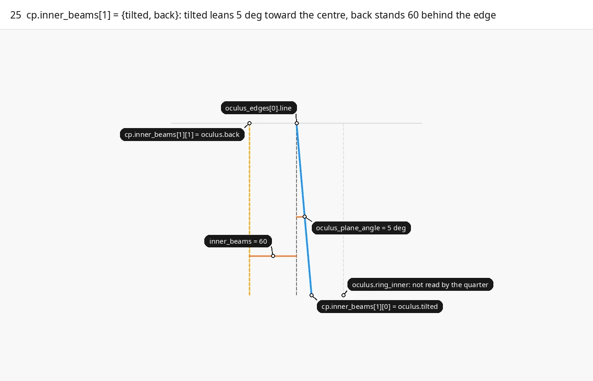

<span style="color:#2196EA">■ built</span> `cp.inner_beams[1][0]` = `oculus.tilted`   <span style="color:#EBB121">■ result</span> `cp.inner_beams[1][1]` = `oculus.back`   <span style="color:#EB7721">■ variable</span> `oculus_plane_angle = 5`, `inner_beams = 60`   <span style="color:#455B6B">■ input</span> `edge_plane(line, -z)` dashed   <span style="color:#8C969E">■ context</span> `oculus.ring_inner`, the datum

The frame is a section seen along oculus edge 0. `oculus_edge` (chapter 1) builds the vertical edge plane <span style="color:#455B6B">`edge_plane(line, -z)`</span> over the line from `oculus_corners[q]` to `oculus_corners[q - 1]`, with its normal into the quarter. <span style="color:#2196EA">`tilted`</span> is that plane turned by <span style="color:#EB7721">`-oculus_plane_angle`</span> (converted to radians) about the edge direction, through the edge centre: `rotate` is `Xform::rotation_around_line`. The top trace of <span style="color:#2196EA">`tilted`</span> stays on the edge at z 0. Below the datum it moves toward the centre by `h * tan(5 deg)`, 19.2 mm at a depth of 220. <span style="color:#EBB121">`back`</span> is the vertical edge plane moved <span style="color:#EB7721">`inner_beams`</span> along its normal, 60 mm toward the column corner. `oculus_edge` also makes <span style="color:#8C969E">`ring_inner`</span> = `back` moved by `-2 * inner_beams`, which is 60 mm inside the edge toward the centre. The quarter does not read <span style="color:#8C969E">`ring_inner`</span>; only `FloorGuide::oculus()` does, for the ring beams, the bottom wedges and the central plate (`floor_members.cpp:234-262`). `cp.inner_beams[1]` = {<span style="color:#2196EA">`oculus.tilted`</span>, <span style="color:#EBB121">`oculus.back`</span>}. Unlike every other pair, `[1]` here is not `[0]` offset: it is a vertical plane, while `[0]` leans.

```cpp
const Plane plane = edge_plane(edge.line, -Vector::z_axis());
edge.tilted = rotate(plane, -parameters.oculus_plane_angle * M_PI / 180.0, edge.line.to_direction(), edge.line.center());
edge.back = plane.translate_by_normal(parameters.inner_beams);
edge.ring_inner = edge.back.translate_by_normal(-parameters.inner_beams * 2.0);
```

| Variable | Value | Meaning |
|---|---|---|
| `oculus_plane_angle` | 5 | Lean of the bearing plane, degrees |
| `inner_beams` | 60 | Offset of the back face |
| `oculus_edges[0].line` | (0, -1000, 0) to (-1000, 0, 0), centre (-500, -500, 0) | Oculus edge 0, `oculus_corners[0]` to `oculus_corners[3]` |
| `cp.inner_beams[1][0]` = `oculus.tilted` | origin (-500, -500, 0), normal (-0.7044, -0.7044, -0.0872) | Bearing plane the quarter's oculus beam and the ring beam share |
| `cp.inner_beams[1][1]` = `oculus.back` | origin (-542.43, -542.43, 0), normal (-0.7071, -0.7071, 0); x + y = -1084.853 | Vertical back face of the oculus beam |
| `oculus.ring_inner` | x + y = -915.147 | The ring's inner plane, not read by the quarter |

Code: `construction_planes`, [floor.cpp:190-191](https://github.com/petrasvestartas/wood/blob/44f9aa85952d32a9264125f4e9940e55b05a4512/src/templates/floor/floor.cpp#L190-L191); `oculus_edge` [floor.cpp:93-103](https://github.com/petrasvestartas/wood/blob/44f9aa85952d32a9264125f4e9940e55b05a4512/src/templates/floor/floor.cpp#L93-L103); `rotate` [floor_geometry.cpp:15-17](https://github.com/petrasvestartas/wood/blob/44f9aa85952d32a9264125f4e9940e55b05a4512/src/templates/floor/floor_geometry.cpp#L15-L17).

## 26. p0 and p1

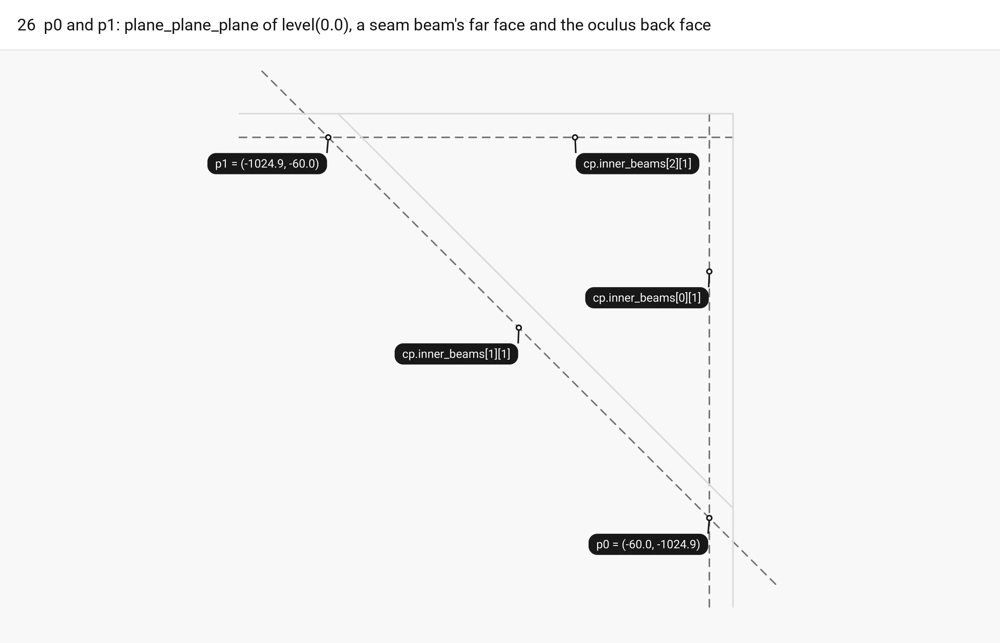

<span style="color:#2196EA">■ built</span> `p0`, `p1`   <span style="color:#455B6B">■ input</span> `cp.inner_beams[0][1]`, `cp.inner_beams[1][1]`, `cp.inner_beams[2][1]`   <span style="color:#8C969E">■ context</span> `oculus_edges[0].line`, `cp.inner_beams[0][0]`, `cp.inner_beams[2][0]`

`xy = level(0.0)` is the datum plane. <span style="color:#2196EA">`p0`</span> = `plane_plane_plane(xy,` <span style="color:#455B6B">`cp.inner_beams[0][1]`</span>, <span style="color:#455B6B">`cp.inner_beams[1][1]`</span>`)` is where the far face of seam beam 0 meets the oculus back face at z 0. <span style="color:#2196EA">`p1`</span> = `plane_plane_plane(xy,` <span style="color:#455B6B">`cp.inner_beams[1][1]`</span>, <span style="color:#455B6B">`cp.inner_beams[2][1]`</span>`)` is the same corner on the side of seam beam 2. Both are inner corners of the inner beam frame on the quarter side, and they are the far ends of the two inner ribs (frame 28). <span style="color:#2196EA">p0</span> lies on the far faces <span style="color:#455B6B">`[0][1]`</span> and <span style="color:#455B6B">`[1][1]`</span>, not where the base planes <span style="color:#8C969E">`[0][0]`</span> and `[1][0]` meet.

```cpp
const Plane xy = level(0.0);
const Point p0 = plane_plane_plane(xy, cp.inner_beams[0][1], cp.inner_beams[1][1]).value();
const Point p1 = plane_plane_plane(xy, cp.inner_beams[1][1], cp.inner_beams[2][1]).value();
```

| Variable | Value | Meaning |
|---|---|---|
| `xy` | z = 0 | The datum, `level(0.0)` |
| `p0` | (-60, -1024.853, 0) | Seam beam 0 far face, oculus back face and datum |
| `p1` | (-1024.853, -60, 0) | Oculus back face, seam beam 2 far face and datum |

Code: `construction_planes`, [floor.cpp:193-195](https://github.com/petrasvestartas/wood/blob/44f9aa85952d32a9264125f4e9940e55b05a4512/src/templates/floor/floor.cpp#L193-L195); `plane_plane_plane` [floor_geometry.cpp:51-59](https://github.com/petrasvestartas/wood/blob/44f9aa85952d32a9264125f4e9940e55b05a4512/src/templates/floor/floor_geometry.cpp#L51-L59).

## 27. p2 = head[2], p3 = head[3]

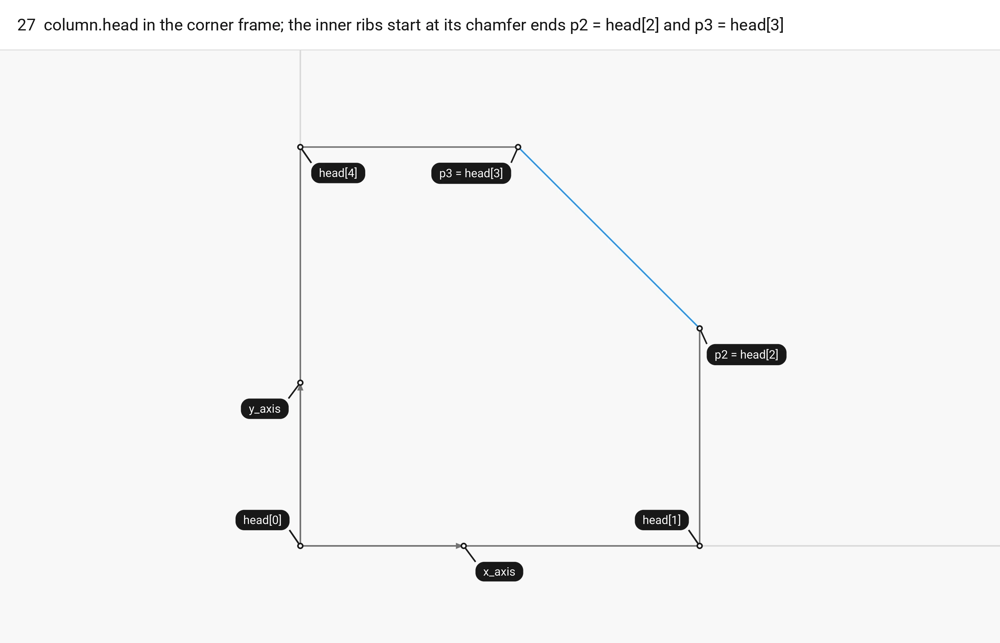

<span style="color:#2196EA">■ built</span> `p2 = head[2]`, `p3 = head[3]` and the chamfer between them   <span style="color:#455B6B">■ input</span> `column.head`, `column.x_axis`, `column.y_axis`   <span style="color:#8C969E">■ context</span> bay edges 0 and 3

`column_corner` (chapter 1) builds the head polygon in the corner frame. At a right corner (`|corner_angle - 90| <= RIGHT_ANGLE`, 1e-9 degrees) `corner_frame` keeps the edge directions: <span style="color:#455B6B">`x_axis`</span> runs along the <span style="color:#8C969E">edge</span> to corner k + 1 and <span style="color:#455B6B">`y_axis`</span> along the edge to corner k - 1. The <span style="color:#455B6B">head</span> is `{corner, corner + x*column_head, corner + x*column_head + y*column_head_chamfer, corner + x*column_head_chamfer + y*column_head, corner + y*column_head}`. Its edge from head[2] to head[3] is the <span style="color:#2196EA">chamfer</span>, and <span style="color:#2196EA">`chamfer_direction`</span> = `unit(head[3] - head[2])`. For the inner ribs `construction_planes` reads only the two chamfer vertices, <span style="color:#2196EA">`p2 = column.head[2]`</span> and <span style="color:#2196EA">`p3 = column.head[3]`</span>, as their column ends. `wedge_fan` (frame 29) reads the head edges 1 to 3.

```cpp
column.head = {column.corner, column.corner + x * head, column.corner + x * head + y * chamfer,
               column.corner + x * chamfer + y * head, column.corner + y * head};
const Point p2 = column.head[2];
const Point p3 = column.head[3];
```

| Variable | Value | Meaning |
|---|---|---|
| `column_head` | 220 | Side of the shaft square and of the head polygon |
| `column_head_chamfer` | 120 | Where the chamfer vertices sit on the shaft faces |
| `RIGHT_ANGLE` | 1e-9 | Degrees off 90 within which `corner_frame` keeps the edge directions |
| `column.x_axis`, `column.y_axis` | (1, 0, 0), (0, 1, 0) | Corner frame at corner 0 |
| `column.head` | (-3000,-3000), (-2780,-3000), (-2780,-2880), (-2880,-2780), (-3000,-2780) | The five head points |
| `p2` = `head[2]` | (-2780, -2880, 0) | Chamfer vertex on the shaft face x = corner + 220 |
| `p3` = `head[3]` | (-2880, -2780, 0) | Chamfer vertex on the shaft face y = corner + 220 |
| `column.chamfer_direction` | (-0.7071, 0.7071, 0) | unit(head[3] - head[2]) |

Code: `construction_planes`, [floor.cpp:196-197](https://github.com/petrasvestartas/wood/blob/44f9aa85952d32a9264125f4e9940e55b05a4512/src/templates/floor/floor.cpp#L196-L197); `column_corner` [floor.cpp:122-143](https://github.com/petrasvestartas/wood/blob/44f9aa85952d32a9264125f4e9940e55b05a4512/src/templates/floor/floor.cpp#L122-L143); `corner_frame` [floor.cpp:106-119](https://github.com/petrasvestartas/wood/blob/44f9aa85952d32a9264125f4e9940e55b05a4512/src/templates/floor/floor.cpp#L106-L119).

## 28. Inner rib planes and their normals

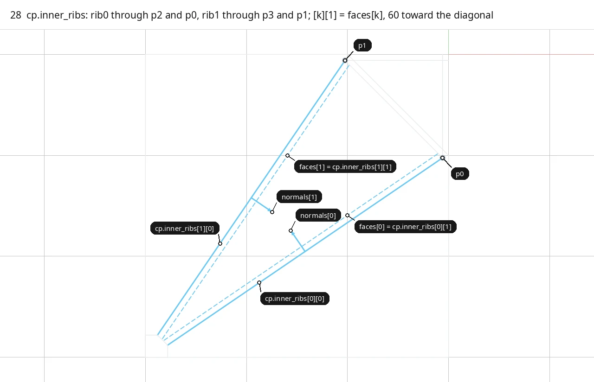

<span style="color:#2196EA">■ built</span> `cp.inner_ribs[0]`, `cp.inner_ribs[1]`: outer face solid, central face dashed, `normals[k]`   <span style="color:#455B6B">■ input</span> `p0`, `p1`   <span style="color:#8C969E">■ context</span> quarter 0, `column.head`, the inner beams' far faces

<span style="color:#2196EA">`rib0`</span> is `Plane::from_point_normal` at the midpoint of p2 and <span style="color:#455B6B">p0</span>, with normal `(p0 - p2) x (-z)`. That is the vertical plane through p2 and <span style="color:#455B6B">p0</span>, with its <span style="color:#2196EA">normal</span> on the left of the direction p2 to p0, which points toward the quarter diagonal. <span style="color:#2196EA">`rib1`</span> is the vertical plane through p3 and <span style="color:#455B6B">p1</span>, with normal `(p1 - p3) x (+z)`, on the right of its direction and also toward the diagonal. `cp.inner_ribs[k] = pair(rib_k, inner_ribs)`. <span style="color:#2196EA">`[k][0]`</span> is the outer face through the two points and faces its side bed panel. <span style="color:#2196EA">`[k][1]`</span> is moved 60 mm toward the diagonal and is the <span style="color:#2196EA">central face</span>. Later, `central_panel` (`floor_panel.cpp:143-146`) starts from these: <span style="color:#2196EA">`faces`</span> = `{cp.inner_ribs[0][1], cp.inner_ribs[1][1]}` and <span style="color:#2196EA">`normals`</span> = `{faces[0].z_axis(), faces[1].z_axis()}`. Nothing is intersected yet.

```cpp
const Plane rib0 = Plane::from_point_normal(p2 + (p0 - p2) * 0.5, (p0 - p2).cross(-Vector::z_axis()));
const Plane rib1 = Plane::from_point_normal(p3 + (p1 - p3) * 0.5, (p1 - p3).cross(Vector::z_axis()));
cp.inner_ribs = {pair(rib0, parameters.inner_ribs), pair(rib1, parameters.inner_ribs)};
```

| Variable | Value | Meaning |
|---|---|---|
| `inner_ribs` | 60 | Inner rib thickness |
| `cp.inner_ribs[0][0]` = `rib0` | origin (-1420, -1952.426, 0), normal (-0.5635, 0.8261, 0) | Outer face of rib 0 through p2 and p0; 34.296 deg to x, 3292.41 long |
| `cp.inner_ribs[0][1]` = `faces[0]` | origin (-1453.808, -1902.858, 0) | Central face of rib 0 |
| `cp.inner_ribs[1][0]` = `rib1` | origin (-1952.426, -1420, 0), normal (0.8261, -0.5635, 0) | Outer face of rib 1 through p3 and p1 |
| `cp.inner_ribs[1][1]` = `faces[1]` | origin (-1902.858, -1453.808, 0) | Central face of rib 1 |
| `normals[0]`, `normals[1]` | (-0.5635, 0.8261, 0), (0.8261, -0.5635, 0) | Horizontal unit normals, both toward the diagonal |

Code: `construction_planes`, [floor.cpp:198-200](https://github.com/petrasvestartas/wood/blob/44f9aa85952d32a9264125f4e9940e55b05a4512/src/templates/floor/floor.cpp#L198-L200); `central_panel` [floor_panel.cpp:143-146](https://github.com/petrasvestartas/wood/blob/44f9aa85952d32a9264125f4e9940e55b05a4512/src/templates/floor/floor_panel.cpp#L143-L146).

## 29. Wedge fan: tilted chamfer plane

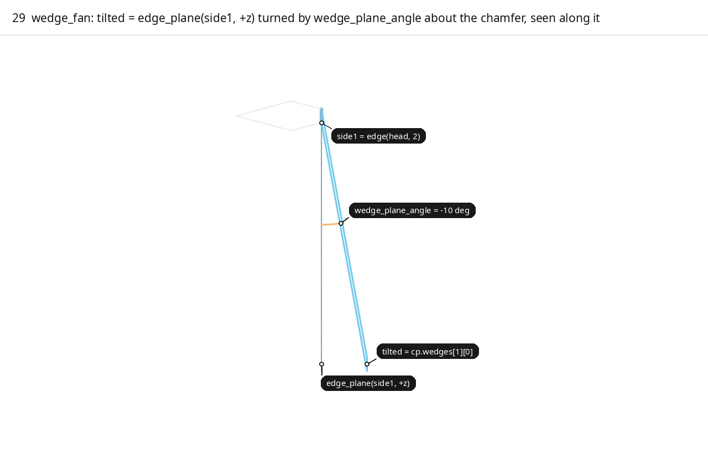

<span style="color:#2196EA">■ built</span> `tilted` = `cp.wedges[1][0]`   <span style="color:#EB7721">■ variable</span> `wedge_plane_angle = -10`   <span style="color:#455B6B">■ input</span> `side1 = edge(head, 2)`, `edge_plane(side1, +z)` dashed   <span style="color:#8C969E">■ context</span> `column.head`

`wedge_fan` (called from `construction_planes` at floor.cpp:202) names three head edges: `side0 = edge(head, 1)` (head[1] to head[2]), <span style="color:#455B6B">`side1 = edge(head, 2)`</span> (the chamfer) and `side2 = edge(head, 3)` (head[3] to head[4]). <span style="color:#455B6B">`edge_plane(side1, +z)`</span> is the vertical plane on the chamfer with normal `side1 x z`, which points away from the corner into the bay. <span style="color:#2196EA">`tilted`</span> is that plane turned by <span style="color:#EB7721">`wedge_plane_angle`</span> (-10 deg, converted to radians) about the chamfer direction through the chamfer centre. Its normal gains a +z component, so below the datum the plane moves away from the column: at -730 it is 128.7 mm further into the bay in plan. The frame looks along the chamfer. <span style="color:#2196EA">`tilted`</span> becomes <span style="color:#2196EA">`cp.wedges[1][0]`</span>, the face of the middle wedge block.

```cpp
const Line side1 = edge(column.head, 2);
const Plane tilted = rotate(edge_plane(side1, Vector::z_axis()), parameters.wedge_plane_angle * M_PI / 180.0, side1.to_direction(), side1.center());
```

| Variable | Value | Meaning |
|---|---|---|
| `wedge_plane_angle` | -10 | Lean of the chamfer fan plane, degrees |
| `side0` | (-2780, -3000) to (-2780, -2880) | `edge(head, 1)`, head[1] to head[2] |
| `side1` | (-2780, -2880) to (-2880, -2780) | The chamfer, `edge(head, 2)` |
| `side2` | (-2880, -2780) to (-3000, -2780) | `edge(head, 3)`, head[3] to head[4] |
| `edge_plane(side1, +z)` | origin (-2830, -2830, 0), normal (0.7071, 0.7071, 0) | The vertical plane on the chamfer before the turn |
| `tilted` | origin (-2830, -2830, 0), normal (0.6964, 0.6964, 0.1736) | Middle fan plane, later `cp.wedges[1][0]` |

Code: `wedge_fan`, [floor.cpp:146-152](https://github.com/petrasvestartas/wood/blob/44f9aa85952d32a9264125f4e9940e55b05a4512/src/templates/floor/floor.cpp#L146-L152).

## 30. Wedge fan: crease lines

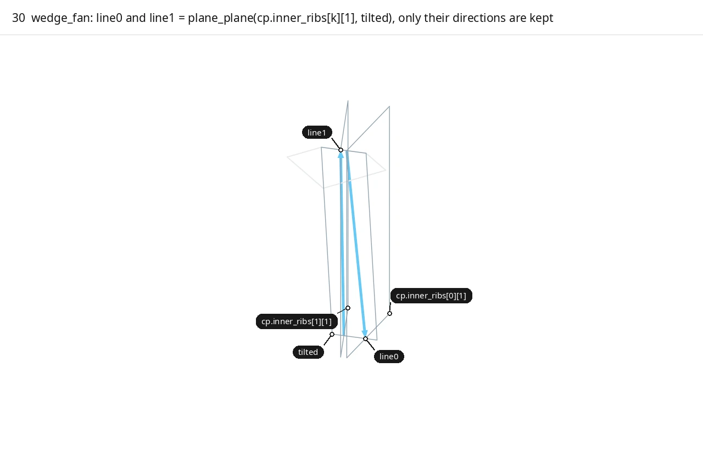

<span style="color:#2196EA">■ built</span> `line0`, `line1`   <span style="color:#455B6B">■ input</span> `tilted`, `cp.inner_ribs[0][1]`, `cp.inner_ribs[1][1]`   <span style="color:#8C969E">■ context</span> `column.head`

<span style="color:#2196EA">`line0`</span> = `plane_plane(`<span style="color:#455B6B">`cp.inner_ribs[0][1]`</span>, <span style="color:#455B6B">`tilted`</span>`)` and <span style="color:#2196EA">`line1`</span> = `plane_plane(`<span style="color:#455B6B">`cp.inner_ribs[1][1]`</span>, <span style="color:#455B6B">`tilted`</span>`)` are the lines where the <span style="color:#455B6B">tilted plane</span> meets the two <span style="color:#455B6B">central faces</span>. The crease is with the central face `[k][1]`, not with the outer face. `plane_plane` turns each line to point along `cross(n0, n1)` (floor_geometry.cpp:38), so <span style="color:#2196EA">`line0`</span> points down and <span style="color:#2196EA">`line1`</span> points up. Only their directions are used in the next step, and their positions are not stored.

```cpp
const Line line0 = plane_plane(cp.inner_ribs[0][1], tilted).value();
const Line line1 = plane_plane(cp.inner_ribs[1][1], tilted).value();
```

| Variable | Value | Meaning |
|---|---|---|
| `line0.to_direction()` | (0.1459, 0.0995, -0.9843) | Crease of `tilted` with rib 0's central face |
| `line1.to_direction()` | (-0.0995, -0.1459, 0.9843) | Crease of `tilted` with rib 1's central face |

Code: `wedge_fan`, [floor.cpp:153-154](https://github.com/petrasvestartas/wood/blob/44f9aa85952d32a9264125f4e9940e55b05a4512/src/templates/floor/floor.cpp#L153-L154); `plane_plane` [floor_geometry.cpp:31-39](https://github.com/petrasvestartas/wood/blob/44f9aa85952d32a9264125f4e9940e55b05a4512/src/templates/floor/floor_geometry.cpp#L31-L39).

## 31. Side fan planes and provisional far faces

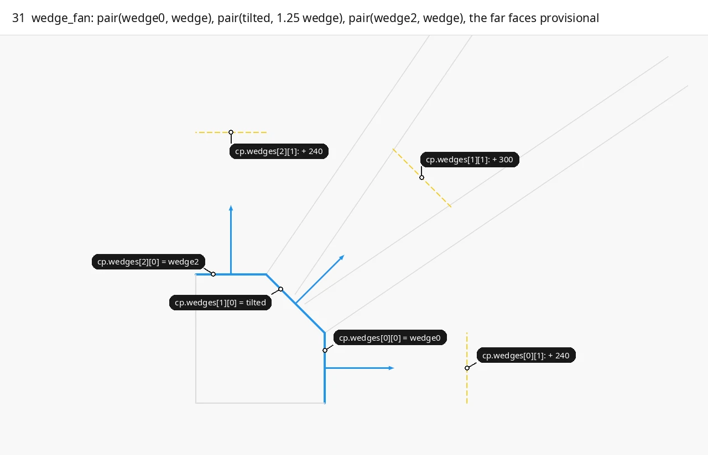

<span style="color:#2196EA">■ built</span> `wedge0`, `tilted`, `wedge2` = `cp.wedges[i][0]` and their normals   <span style="color:#EBB121">■ result</span> `cp.wedges[i][1]`, the provisional far faces   <span style="color:#8C969E">■ context</span> the shaft faces of `column.head`, `cp.inner_ribs`

<span style="color:#2196EA">`wedge0`</span> = `Plane::from_point_normal(side0.center(), line0.to_direction() x side0.to_direction())` contains the head edge from head[1] to head[2] and runs parallel to `line0`. It leans 8.43 deg off vertical, and its datum trace is x = -2780. <span style="color:#2196EA">`wedge2`</span> = `from_point_normal(side2.center(), (-line1.to_direction()) x side2.to_direction())` contains head[3] to head[4] and runs parallel to `line1`. `wedge_fan` returns `{pair(wedge0, wedge), pair(tilted, wedge * middle_wedge_factor), pair(wedge2, wedge)}`: <span style="color:#2196EA">`wedge0`</span>, <span style="color:#2196EA">`tilted`</span> and <span style="color:#2196EA">`wedge2`</span> with their <span style="color:#EBB121">far faces</span>. `construction_planes` stores it in `column.wedge_fan` and copies it into `cp.wedges`. Each far face <span style="color:#EBB121">`[i][1]`</span> here is <span style="color:#EBB121">provisional</span>. After `run_ins`, `block_planes` (floor.cpp:315-323) replaces it with the fan plane offset by `run_in[0]`, `1.25 * mean(run_in)` and `run_in[1]`, and `construction_quads` runs a second time. On the square bay `run_in = {240, 240}`, so the final far faces equal these. On `FloorGuide::rectangle(3000, 2400)` the shorter run-in solves to 187.667 and the far faces end at 240 / 267.292 / 187.667, so there the provisional faces are not the final ones. The frame shows the datum traces: the <span style="color:#2196EA">fan planes</span> solid on the three head edges they contain with their <span style="color:#2196EA">normals</span> as arrows, and the <span style="color:#EBB121">provisional far faces</span> dashed; of the head only the <span style="color:#8C969E">two shaft faces</span> are drawn, beside the <span style="color:#8C969E">inner rib faces</span>.

```cpp
const Plane wedge0 = Plane::from_point_normal(side0.center(), line0.to_direction().cross(side0.to_direction()));
const Plane wedge2 = Plane::from_point_normal(side2.center(), (-line1.to_direction()).cross(side2.to_direction()));
return {pair(wedge0, parameters.wedge), pair(tilted, parameters.wedge * parameters.middle_wedge_factor), pair(wedge2, parameters.wedge)};
```

| Variable | Value | Meaning |
|---|---|---|
| `wedge` | 240 | Provisional side block thickness |
| `middle_wedge_factor` | 1.25 | Middle block in wedge thicknesses: 300 |
| `cp.wedges[0][0]` = `wedge0` | origin (-2780, -2940, 0), normal (0.9892, 0, 0.1466); trace x = -2780 | Fan plane of side block 0 |
| `cp.wedges[0][1]` | origin (-2542.59, -2940, 35.20); trace x = -2537.377 | Provisional far face, 240 along the normal |
| `cp.wedges[1][1]` | origin (-2621.09, -2621.09, 52.09); trace x + y = -5229.19 | Provisional far face of the middle block, 300 along the normal, 304.6 from the chamfer in plan |
| `cp.wedges[2][0]` = `wedge2` | origin (-2940, -2780, 0), normal (0, 0.9892, 0.1466); trace y = -2780 | Fan plane of side block 2 |
| `cp.wedges[2][1]` | origin (-2940, -2542.59, 35.20); trace y = -2537.377 | Provisional far face, 240 along the normal |
| `column.wedge_fan` | = `cp.wedges` | The same three pairs, kept on the column |

Code: `wedge_fan`, [floor.cpp:155-158](https://github.com/petrasvestartas/wood/blob/44f9aa85952d32a9264125f4e9940e55b05a4512/src/templates/floor/floor.cpp#L155-L158); stored at [floor.cpp:202-203](https://github.com/petrasvestartas/wood/blob/44f9aa85952d32a9264125f4e9940e55b05a4512/src/templates/floor/floor.cpp#L202-L203); replaced by `block_planes` [floor.cpp:315-323](https://github.com/petrasvestartas/wood/blob/44f9aa85952d32a9264125f4e9940e55b05a4512/src/templates/floor/floor.cpp#L315-L323), [370](https://github.com/petrasvestartas/wood/blob/44f9aa85952d32a9264125f4e9940e55b05a4512/src/templates/floor/floor.cpp#L370).

## 32. T-section planes

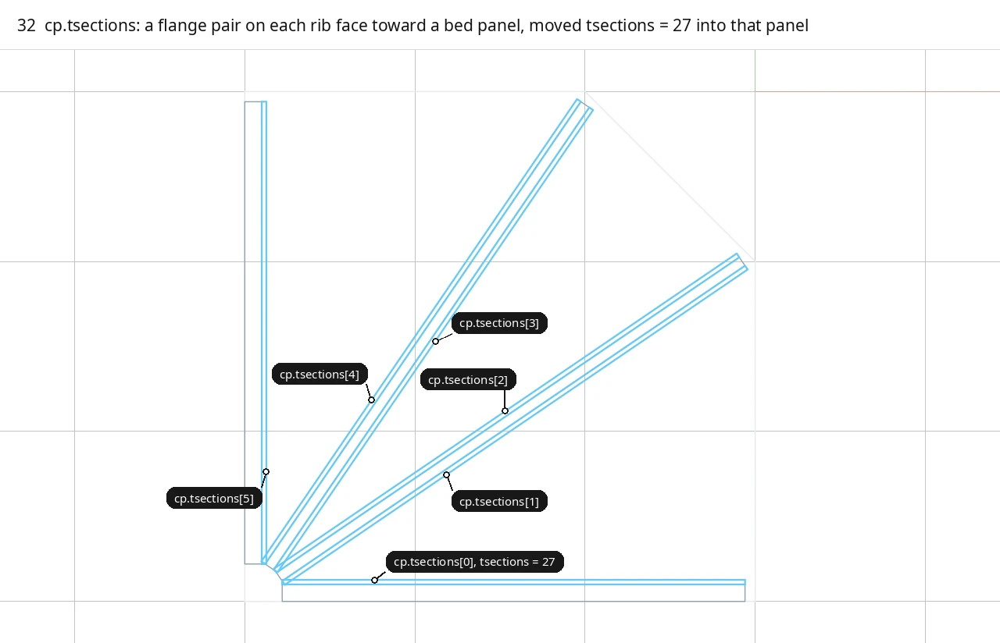

<span style="color:#2196EA">■ built</span> `cp.tsections[0]` to `cp.tsections[5]`   <span style="color:#455B6B">■ input</span> `cp.outer_ribs`, `cp.inner_ribs`   <span style="color:#8C969E">■ context</span> quarter 0

<span style="color:#2196EA">`cp.tsections`</span> holds six flange pairs, one on each <span style="color:#455B6B">rib face</span> that faces a bed panel, in t-section order. Each pair starts on the rib face. The sign of `tsections` moves the second plane into the bed panel beside that face: `+` where the face normal already points into the panel, `-` where it points into the rib. Flanges 0 and 1 lie in side bed panel 0, 2 and 3 in the central panel, and 4 and 5 in side bed panel 2. The frame draws each <span style="color:#2196EA">pair</span> as a 27 mm strip over the rib's length from the column end to p0 or p1, beside the <span style="color:#455B6B">ribs</span> they start on.

```cpp
cp.tsections = {
    pair(cp.outer_ribs[0][1], parameters.tsections),  pair(cp.inner_ribs[0][0], -parameters.tsections),
    pair(cp.inner_ribs[0][1], parameters.tsections),  pair(cp.inner_ribs[1][1], parameters.tsections),
    pair(cp.inner_ribs[1][0], -parameters.tsections), pair(cp.outer_ribs[1][1], parameters.tsections),
};
```

| Variable | Value | Meaning |
|---|---|---|
| `tsections` | 27 | Flange thickness and bed layer thickness |
| `cp.tsections[0]` | y = -2900 to y = -2873 | On outer rib 0's inner face, side panel 0 |
| `cp.tsections[1]` | inner_ribs[0][0] to origin (-1404.79, -1974.73) | On rib 0's outer face, side panel 0 |
| `cp.tsections[2]` | inner_ribs[0][1] to origin (-1469.02, -1880.55) | On rib 0's central face, central panel |
| `cp.tsections[3]` | inner_ribs[1][1] to origin (-1880.55, -1469.02) | On rib 1's central face, central panel |
| `cp.tsections[4]` | inner_ribs[1][0] to origin (-1974.73, -1404.79) | On rib 1's outer face, side panel 2 |
| `cp.tsections[5]` | x = -2900 to x = -2873 | On outer rib 1's inner face, side panel 2 |

Code: `construction_planes`, [floor.cpp:205-212](https://github.com/petrasvestartas/wood/blob/44f9aa85952d32a9264125f4e9940e55b05a4512/src/templates/floor/floor.cpp#L205-L212).

## 33. column_seats: column_offset

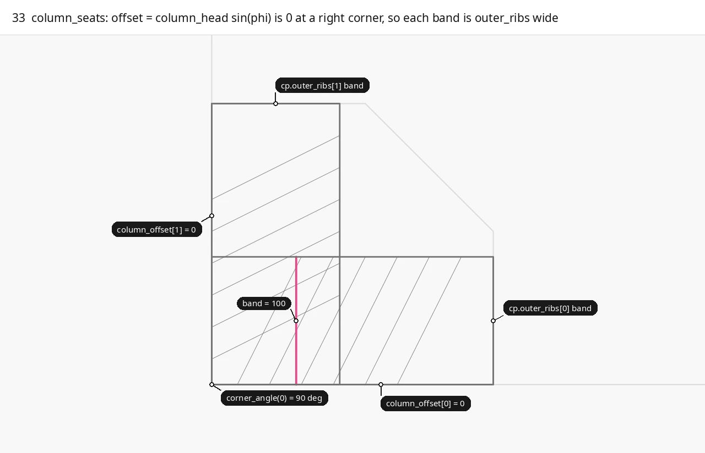

<span style="color:#EB7721">■ variable</span> `band = 100`   <span style="color:#455B6B">■ input</span> the `cp.outer_ribs[0]` and `cp.outer_ribs[1]` bands over the head   <span style="color:#8C969E">■ context</span> bay edges 0 and 3, `column.head`

`compute_quarter` calls `column_seats` right after `construction_planes`. `phi = (corner_angle(k) - 90) / 2`, in radians. `offset = column_head * sin(phi)` is the signed distance of the column's outer face from the bay edge. It is positive where the outer rib band overhangs the column face and negative where the column stands outside the bay edge. <span style="color:#EB7721">`band`</span> = `(outer_ribs - offset) / cos(phi)` is the band width measured along the head side, across the <span style="color:#455B6B">outer rib band</span>. <span style="color:#EB7721">`band`</span> is a local variable and is not stored. `column.column_offset = {offset, offset}`. At a right corner `phi = 0`, so the offset is 0 and the <span style="color:#EB7721">band</span> is exactly `outer_ribs`: the <span style="color:#8C969E">shaft faces</span> lie on the <span style="color:#8C969E">bay edges</span>, as the frame shows. Nothing downstream reads `column_offset`. `FloorReport` copies it into `column_offset_mm` for information, and `ok()` does not check it. A skewed corner, where `phi` is not 0, is not drawn because the default bay has none.

```cpp
const double phi = (guide.corner_angle(k) - 90.0) * 0.5 * M_PI / 180.0;
const double offset = guide.parameters.column_head * std::sin(phi);
const double band = (guide.parameters.outer_ribs - offset) / std::cos(phi);
column.column_offset = {offset, offset};
```

| Variable | Value | Meaning |
|---|---|---|
| `corner_angle(0)` | 90 deg | Interior angle at corner 0 |
| `phi` | 0 | Half the corner's deviation from 90 deg, radians |
| `column_head` | 220 | Shaft side |
| `outer_ribs` | 100 | Band thickness |
| `band` (local) | 100 | Band width along the head side |
| `column.column_offset` | {0, 0} | Signed overhang per bay edge, mm |
| `report.column_offset_mm[0]` | 0.000 / 0.000 | The same, copied by `measure_quarter` |

Code: `column_seats`, [floor.cpp:162-167](https://github.com/petrasvestartas/wood/blob/44f9aa85952d32a9264125f4e9940e55b05a4512/src/templates/floor/floor.cpp#L162-L167) (called at 367); `report.column_offset_mm` [floor_report.cpp:157](https://github.com/petrasvestartas/wood/blob/44f9aa85952d32a9264125f4e9940e55b05a4512/src/templates/floor/floor_report.cpp#L157).

## 34. column_seats: wedge_seat

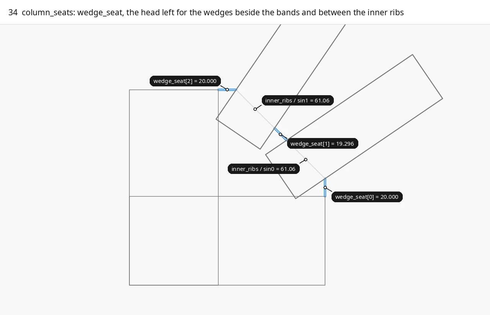

<span style="color:#2196EA">■ built</span> `column.wedge_seat[0]`, `[1]`, `[2]`   <span style="color:#455B6B">■ input</span> the outer rib bands, `cp.inner_ribs[0]`, `cp.inner_ribs[1]`   <span style="color:#8C969E">■ context</span> `column.head`

The second half of `column_seats` measures what is left of the head for the three wedge blocks. `chamfer_length = |head[3] - head[2]|`. `sin0 = |cp.inner_ribs[0][0].z_axis() . chamfer_direction|` is the sine of the angle between rib 0 and the chamfer, and `sin1` is the same for rib 1. `inner_ribs / sin_k` is the length that rib k takes along the chamfer. The frame finds the same length as `plane_plane_plane(level(0),` <span style="color:#455B6B">`cp.inner_ribs[k][1]`</span>`, chamfer plane)` and measures it from p2 or p3. <span style="color:#2196EA">`column.wedge_seat`</span> = `{column_head_chamfer - band, chamfer_length - inner_ribs/sin0 - inner_ribs/sin1, column_head_chamfer - band}`. The <span style="color:#2196EA">side seats</span> are the part of each head side beyond the <span style="color:#455B6B">100 mm band</span>. The <span style="color:#2196EA">middle seat</span> is the part of the chamfer between the two <span style="color:#455B6B">inner ribs</span>. Like `column_offset`, the value is informational: `FloorReport` copies it to `wedge_seat_mm`, and no member or check reads it.

```cpp
const double chamfer_length = (column.head[3] - column.head[2]).magnitude();
const double sin0 = std::abs(cp.inner_ribs[0][0].z_axis().dot(column.chamfer_direction));
const double sin1 = std::abs(cp.inner_ribs[1][0].z_axis().dot(column.chamfer_direction));
column.wedge_seat = {guide.parameters.column_head_chamfer - band,
                     chamfer_length - guide.parameters.inner_ribs / sin0 - guide.parameters.inner_ribs / sin1,
                     guide.parameters.column_head_chamfer - band};
```

| Variable | Value | Meaning |
|---|---|---|
| `column_head_chamfer` | 120 | Head side length to the chamfer vertex |
| `inner_ribs` | 60 | Inner rib thickness |
| `chamfer_length` | 141.421 | Length of the chamfer |
| `sin0`, `sin1` | 0.98260, 0.98260 | Sine of each inner rib's angle with the chamfer |
| `inner_ribs / sin0` | 61.06 | Chamfer length each inner rib takes |
| `column.wedge_seat` | {20.000, 19.296, 20.000} | Seats of side 0, chamfer and side 1, mm |
| `report.wedge_seat_mm[0]` | 20.000 / 19.296 / 20.000 | The same, copied by `measure_quarter` |

Code: `column_seats`, [floor.cpp:169-172](https://github.com/petrasvestartas/wood/blob/44f9aa85952d32a9264125f4e9940e55b05a4512/src/templates/floor/floor.cpp#L169-L172) (called at 367); `report.wedge_seat_mm` [floor_report.cpp:156](https://github.com/petrasvestartas/wood/blob/44f9aa85952d32a9264125f4e9940e55b05a4512/src/templates/floor/floor_report.cpp#L156).
