# Floor 03: Construction quads, run-in and parabolas {#templates_floor_03_parabolas}

`compute_quarter` turns chapter 2's planes into the plan quads `geometry.quads`, the run-ins `geometry.run_in`, the final block far faces and the four `geometry.parabolas` that chapter 4 reads. Pictures show quarter 0 of the 6000 x 6000 bay `FloorGuide::rectangle(3000.0, 3000.0)`, except frames 43 and 44, which use the 3000 x 2400 bay `FloorGuide::rectangle(3000.0, 2400.0)` because only there does the run-in solve change anything.

Examples: [templates_floor_1_floorguide.cpp](https://github.com/petrasvestartas/wood/blob/44f9aa85952d32a9264125f4e9940e55b05a4512/examples/templates_floor_1_floorguide.cpp) draws this chapter on the square bay; [templates_floor_8_rectangle.cpp](https://github.com/petrasvestartas/wood/blob/44f9aa85952d32a9264125f4e9940e55b05a4512/examples/templates_floor_8_rectangle.cpp) builds the 3000 x 2400 bay, whose run-in solves to 187.667.

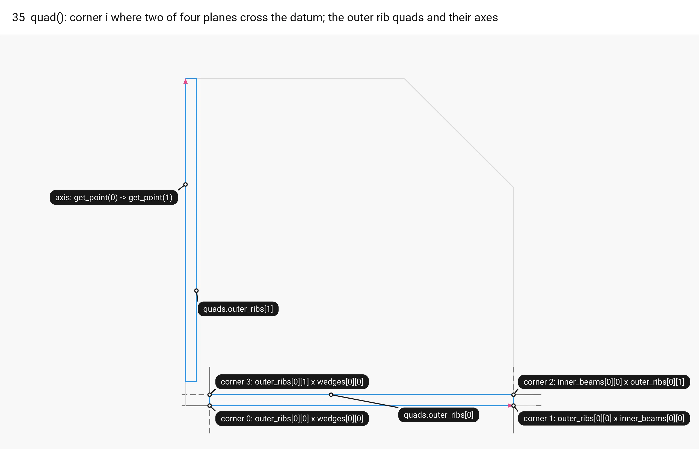

The call order in `compute_quarter` (floor.cpp:366-374):

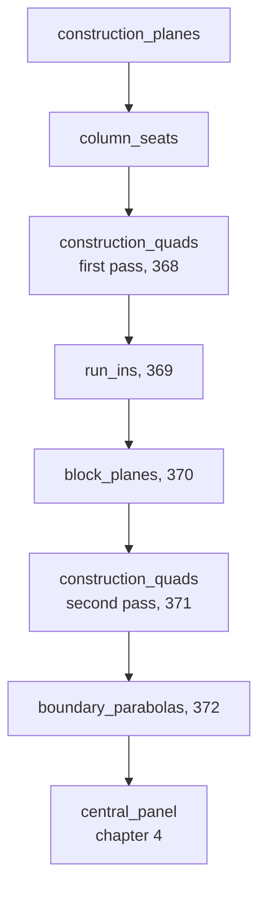

## 35. quad() rule and outer rib quads (first pass)

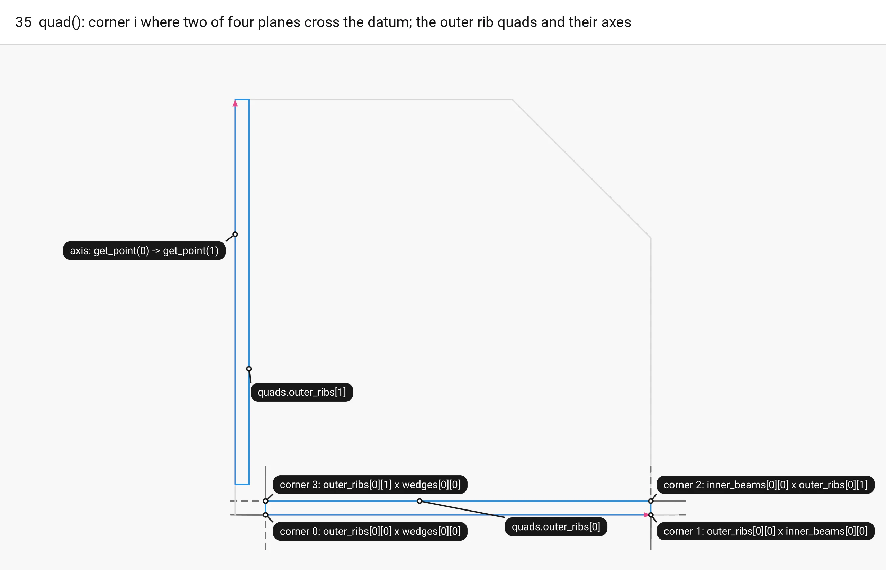

■ built `quads.outer_ribs[0]`, `quads.outer_ribs[1]` and the corners of [0]   ■ variable the rib axis `get_point(0)` -> `get_point(1)`   ■ input datum traces of the four planes of `quads.outer_ribs[0]`, dashed   ■ context quarter 0 polygon

`quad(planes)` cuts neighbouring plane pairs with the datum `level(0.0)` (corner 0 = `planes[0]` x `planes[3]`, then 0x1, 1x2, 2x3), where `planes[0]`, `planes[2]` are the member's faces and `planes[1]`, `planes[3]` its end planes. Two parallel planes in one array throw `std::bad_optional_access`. Outer rib k uses the bay-edge face, seam plane, inner face and fan plane, so `get_point(0)` -> `get_point(1)` is the rib axis `outer_parabola` uses in frame 40.

Code: `quad`, `quads`, `construction_quads`, [floor.cpp:25-46](https://github.com/petrasvestartas/wood/blob/16f3ab0a2386bf39ac7f7123c0a20d03e73ab1a5/src/templates/floor/floor.cpp#L25-L46), [218-225](https://github.com/petrasvestartas/wood/blob/16f3ab0a2386bf39ac7f7123c0a20d03e73ab1a5/src/templates/floor/floor.cpp#L218-L225) (called at 368).

## 36. Inner beam quads

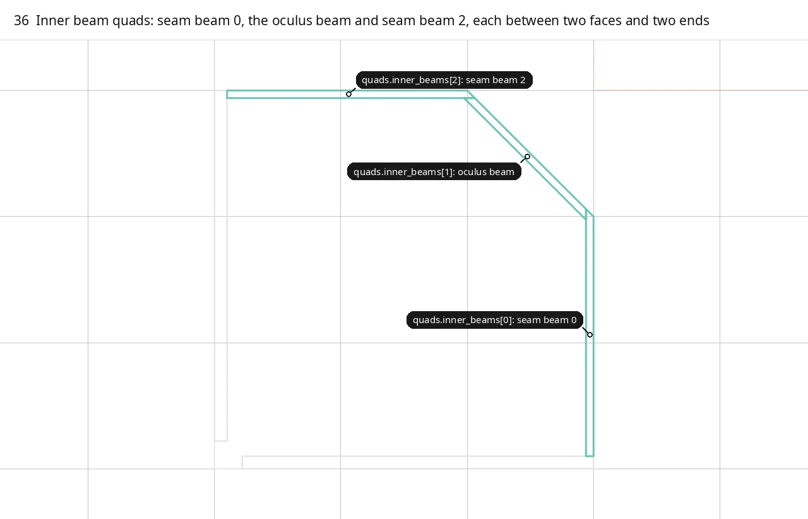

■ built `quads.inner_beams[0]`, `[1]`, `[2]`   ■ context quarter 0 polygon, outer rib quads

The seam beams lie between a seam plane and its offset by `inner_beams` = 60, the oculus beam between `oculus.tilted` and `oculus.back`; none reads a wedge plane, so the second pass (frame 45) leaves them unchanged.

Code: `construction_quads`, [floor.cpp:226-230](https://github.com/petrasvestartas/wood/blob/16f3ab0a2386bf39ac7f7123c0a20d03e73ab1a5/src/templates/floor/floor.cpp#L226-L230).

## 37. Inner rib quads

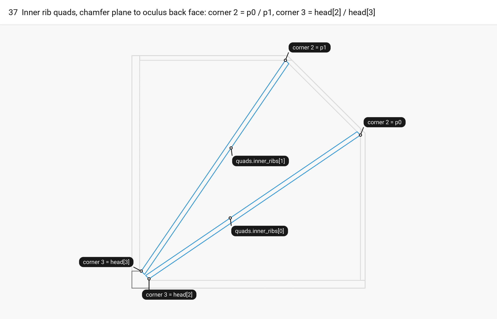

■ built `quads.inner_ribs[0]`, `quads.inner_ribs[1]`   ■ variable corner 2 = `p0` / `p1`, corner 3 = `head[2]` / `head[3]`   ■ input column head `columns[0].head`   ■ context quarter 0 polygon, outer rib and inner beam quads

Inner rib k runs between its central face `inner_ribs[k][1]` and outer face `inner_ribs[k][0]`, from the tilted chamfer plane `wedges[1][0]` to the oculus back face `inner_beams[1][1]`, so by construction corner 2 is exactly `p0` (`p1`) and corner 3 exactly `head[2]` (`head[3]`).

Code: `construction_quads`, [floor.cpp:231-234](https://github.com/petrasvestartas/wood/blob/16f3ab0a2386bf39ac7f7123c0a20d03e73ab1a5/src/templates/floor/floor.cpp#L231-L234).

## 38. Wedge quads (provisional)

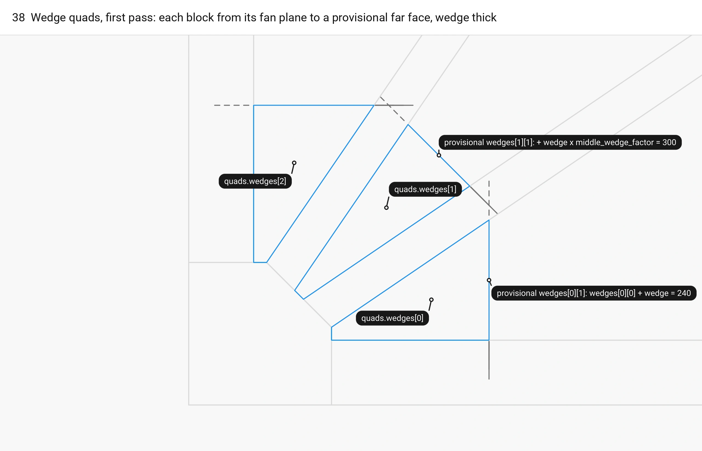

■ built `quads.wedges[0]`, `[1]`, `[2]`, first pass   ■ input provisional far faces `wedges[i][1]`, dashed   ■ context outer and inner rib quads, column head

Block i lies between its two neighbouring rib faces, from fan plane `wedges[i][0]` to the provisional far face `wedges[i][1]` from `wedge_fan` (240, 300, 240 along the fan normals); nothing reads these quads and the second pass overwrites them.

Code: `construction_quads`, [floor.cpp:235-239](https://github.com/petrasvestartas/wood/blob/16f3ab0a2386bf39ac7f7123c0a20d03e73ab1a5/src/templates/floor/floor.cpp#L235-L239); provisional far faces `wedge_fan`, [floor.cpp:158](https://github.com/petrasvestartas/wood/blob/16f3ab0a2386bf39ac7f7123c0a20d03e73ab1a5/src/templates/floor/floor.cpp#L158).

## 39. T-section quads

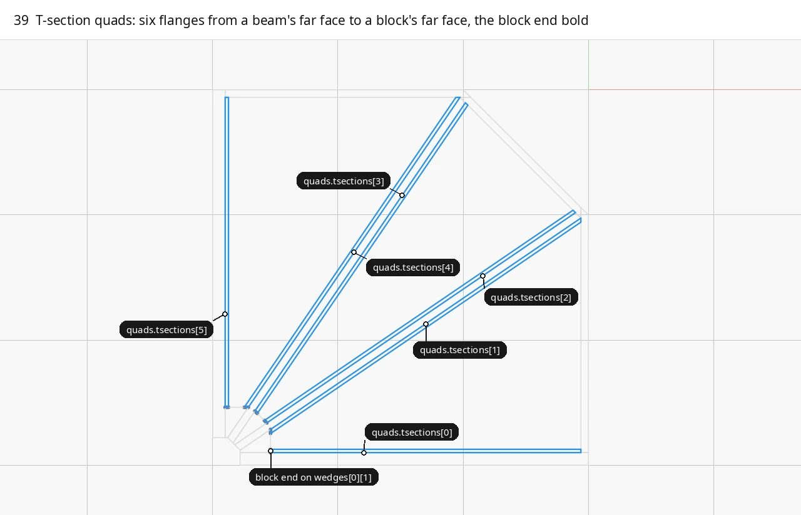

■ built `quads.tsections[0..5]`   ■ input block end, side 3-0 on the provisional `wedges[i][1]`, bold   ■ context rib, beam and first-pass wedge quads

Each flange is `tsections` = 27 wide and runs from a beam far face to its block's far face `wedges[i][1]`, so it depends on the provisional far faces and the second pass rebuilds it.

Code: `construction_quads`, [floor.cpp:240-247](https://github.com/petrasvestartas/wood/blob/16f3ab0a2386bf39ac7f7123c0a20d03e73ab1a5/src/templates/floor/floor.cpp#L240-L247).

## 40. Outer parabola at the trial run-in

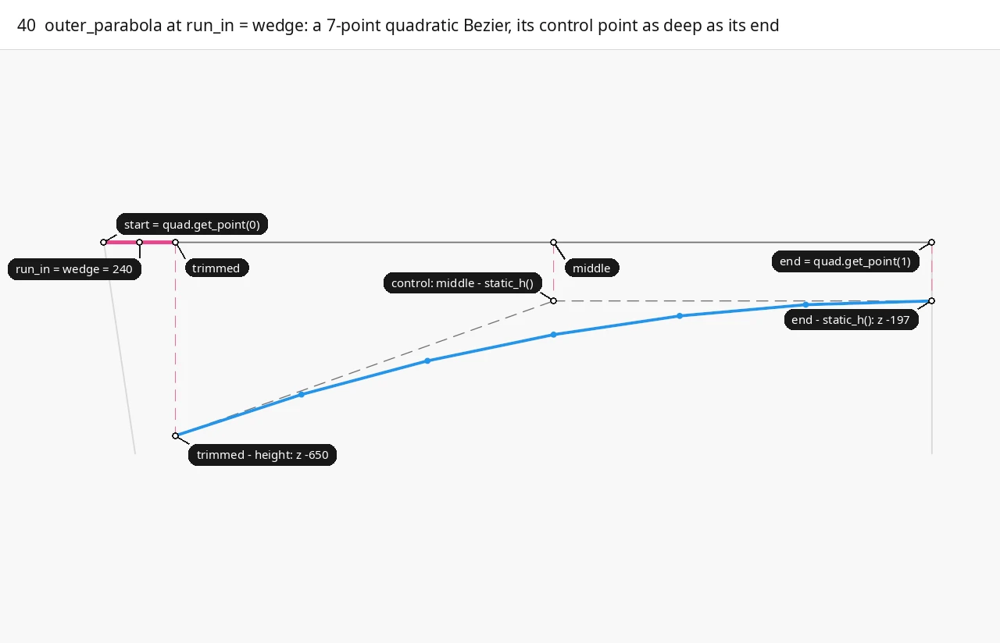

■ built soffit `outer_parabola(quads.outer_ribs[0], 240)` and its 7 points   ■ variable `run_in` = `wedge` = 240; the depths `height` and `static_h()`, dashed   ■ input rib axis `start` -> `end`, control polygon, dashed   ■ context fan plane and seam plane traces

`outer_parabola(quad, run_in)` steps `run_in` along the rib axis and returns a 7-point quadratic Bezier from depth `-height` (650) there to `-static_h()` (197) at the seam, with the control point midway in plan at the seam depth, so the seam tangent is horizontal. `run_ins` first evaluates it at the trial `run_in = wedge` = 240.

Code: `outer_parabola`, [floor.cpp:253-261](https://github.com/petrasvestartas/wood/blob/16f3ab0a2386bf39ac7f7123c0a20d03e73ab1a5/src/templates/floor/floor.cpp#L253-L261); `Polyline::quadratic_points`, [session_cpp polyline.cpp:264-281](https://github.com/petrasvestartas/session_cpp/blob/2c02829d07674c1a5a04f03519611f7ad1f1655c/src/polyline.cpp#L264-L281).

## 41. fan_end: first chord extended onto the fan plane

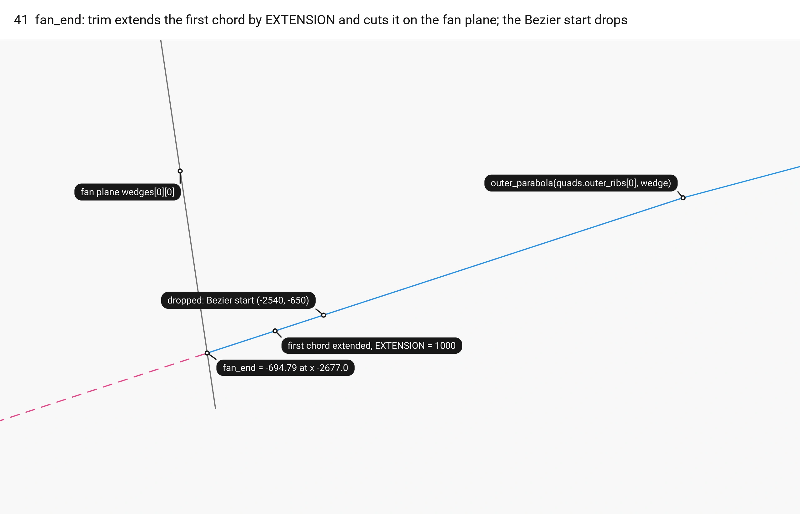

■ built `trim(outer_parabola(quads.outer_ribs[0], 240), fan, seam)`   ■ variable first chord extended by `EXTENSION`, dashed; `fan_end` = -694.79   ■ input soffit of frame 40, fan plane `wedges[0][0]`   ■ context dropped Bezier start

`fan_end` extends both end chords by `EXTENSION` = 1000, cuts by the fan and seam planes with `trim`, and returns the z where the soffit meets the fan plane: -694.7934 for outer rib 0 at run-in 240. The curve is not re-evaluated, so below the Bezier start the soffit is the straight extension of its first chord.

Code: `fan_end`, [floor.cpp:264-271](https://github.com/petrasvestartas/wood/blob/16f3ab0a2386bf39ac7f7123c0a20d03e73ab1a5/src/templates/floor/floor.cpp#L264-L271); `trim`, [floor_geometry.cpp:69-80](https://github.com/petrasvestartas/wood/blob/16f3ab0a2386bf39ac7f7123c0a20d03e73ab1a5/src/templates/floor/floor_geometry.cpp#L69-L80); `Polyline::cut_by_plane`, [polyline.cpp:860-900](https://github.com/petrasvestartas/session_cpp/blob/2c02829d07674c1a5a04f03519611f7ad1f1655c/src/polyline.cpp#L860-L900).

## 42. run_ins: the corner's shared level

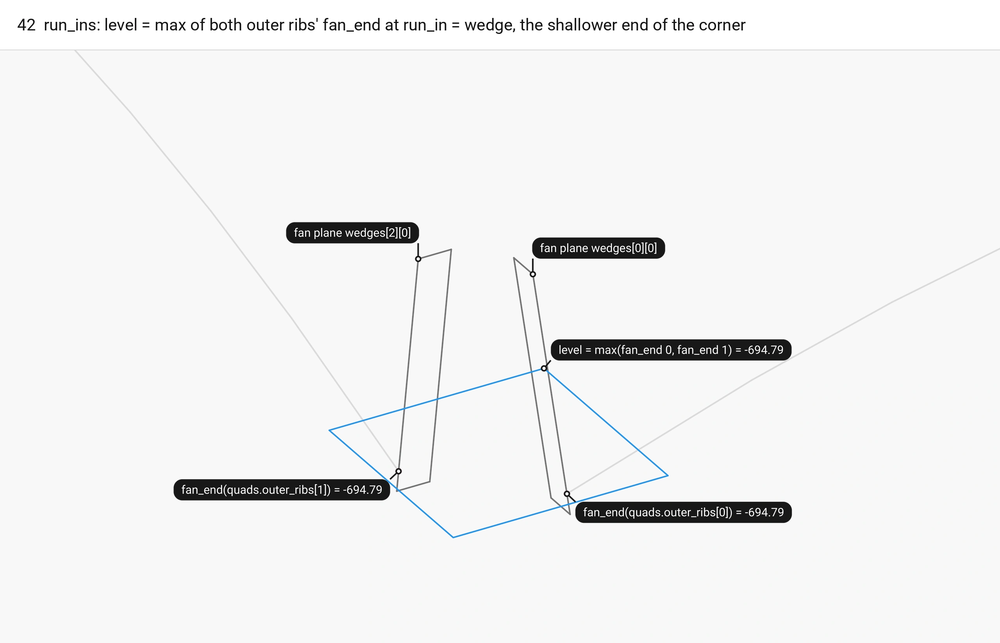

■ built `level` = max of both ends = -694.7934   ■ variable `fan_end` of both outer ribs at `wedge`   ■ input end faces on the fan planes `cp.wedges[0][0]`, `cp.wedges[2][0]`   ■ context trimmed soffits

`run_ins` takes the shallower `fan_end` of both outer ribs at `wedge` as `level` and solves each rib's run-in onto it (frame 43), so both soffits meet the column at one level; on the square both ends are -694.7934 and both keep 240.

Code: `run_ins`, [floor.cpp:305-312](https://github.com/petrasvestartas/wood/blob/16f3ab0a2386bf39ac7f7123c0a20d03e73ab1a5/src/templates/floor/floor.cpp#L305-L312) (called at 369).

## 43. run_in_to_level: secant (3000x2400)

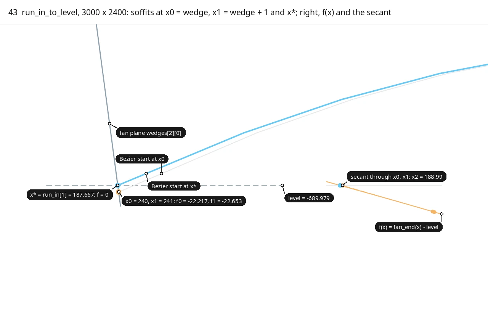

■ built soffit at the root x* = 187.667, its Bezier start and its end on the fan plane, x* on the graph   ■ variable f(x), the iterates `x0`, `x1` and their ends, the first secant line (dashed) and `x2`   ■ input fan plane `wedges[2][0]`, `level` (dashed)   ■ context soffits at `x0`, `x1` and their Bezier starts, graph axis

`run_in_to_level` solves f(x) = `fan_end(quad, x) - level` = 0 by secant from `x0 = wedge`, `x1 = x0 + 1`, returning once `|f| <= RUN_IN_TOLERANCE` (1e-11). It throws `std::runtime_error` if an iterate leaves (0, `axis`) or after `RUN_IN_STEPS` = 50 steps. On the 3000 x 2400 bay outer rib 1's run-in shrinks from 240 to 187.667 to reach rib 0's level -689.979.

| Iterate | x | f(x) = fan_end - level |
|---|---|---|
| `x0 = wedge` | 240 | -22.217 |
| `x1 = x0 + 1` | 241 | -22.653 |
| first `x2` | 188.99 | (secant line hits zero here) |
| root | 187.667 | within 1e-11 |

Code: `run_in_to_level`, [floor.cpp:274-302](https://github.com/petrasvestartas/wood/blob/16f3ab0a2386bf39ac7f7123c0a20d03e73ab1a5/src/templates/floor/floor.cpp#L274-L302) (called at 311); constants [floor.cpp:11-12](https://github.com/petrasvestartas/wood/blob/16f3ab0a2386bf39ac7f7123c0a20d03e73ab1a5/src/templates/floor/floor.cpp#L11-L12).

## 44. block_planes: final far faces

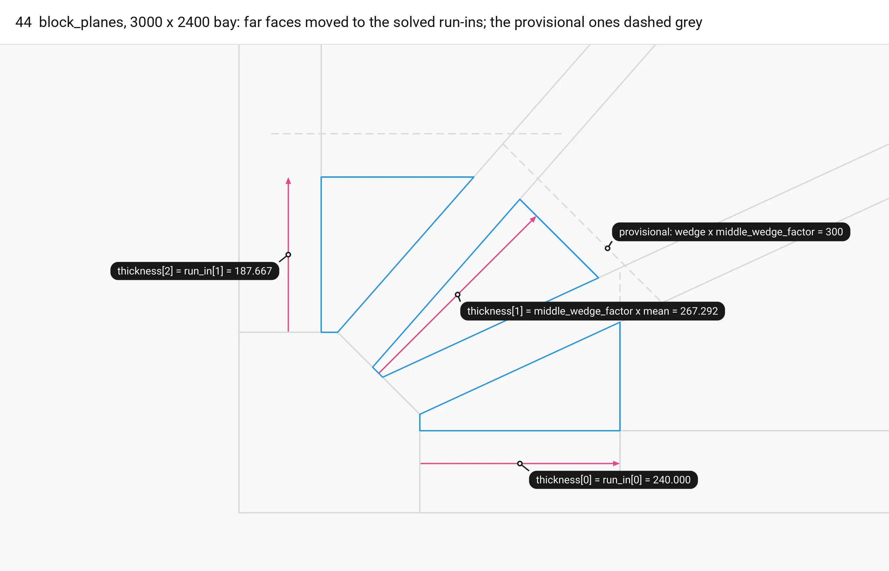

■ built final `quads.wedges` and their far faces `cp.wedges[i][1]`   ■ variable `thickness[i]` along each fan normal   ■ context provisional far faces (dashed), rib quads, column head

`block_planes` sets each far face `cp.wedges[i][1]` (and `column.wedge_fan[i][1]`) to its fan plane moved by `thickness = {run_in[0], middle_wedge_factor * mean run-in, run_in[1]}`, so a side block is as thick as its rib's run-in. On the 3000 x 2400 bay the middle face moves from 300 to 267.292 and side block 2's from 240 to 187.667; on the square nothing changes.

Code: `block_planes`, [floor.cpp:315-323](https://github.com/petrasvestartas/wood/blob/16f3ab0a2386bf39ac7f7123c0a20d03e73ab1a5/src/templates/floor/floor.cpp#L315-L323) (called at 370).

## 45. Construction quads, second pass

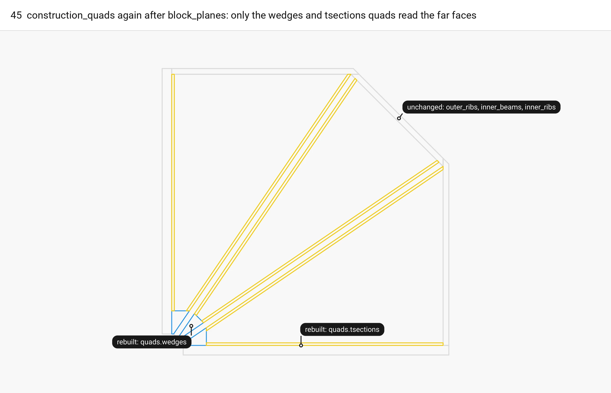

■ built `quads.wedges`, rebuilt   ■ result `quads.tsections`, rebuilt   ■ context `outer_ribs`, `inner_beams`, `inner_ribs` quads, unchanged

`construction_quads` runs again because `cp.wedges[i][1]` changed, which rebuilds only `quads.wedges` and `quads.tsections`; the rib and beam quads, including the outer rib quads the run-ins were solved on, come out identical.

Code: `compute_quarter`, [floor.cpp:371](https://github.com/petrasvestartas/wood/blob/16f3ab0a2386bf39ac7f7123c0a20d03e73ab1a5/src/templates/floor/floor.cpp#L371); `construction_quads`, [floor.cpp:218-250](https://github.com/petrasvestartas/wood/blob/16f3ab0a2386bf39ac7f7123c0a20d03e73ab1a5/src/templates/floor/floor.cpp#L218-L250).

## 46. boundary_parabolas at the solved run-in

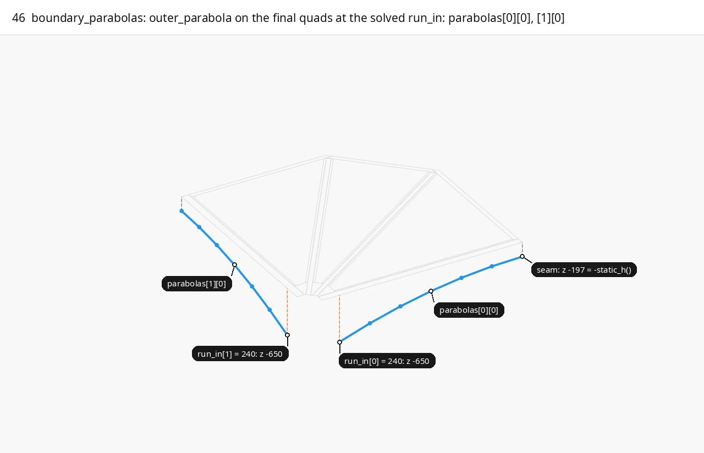

■ built `parabolas[0][0]`, `parabolas[1][0]` and their 7 points   ■ variable run-in station `run_in[k]` at -height, dashed   ■ input seam station at -static_h(), dashed   ■ context quarter 0 quads

`boundary_parabolas` stores `parabolas[k] = {soffit, +t, +2t}`: the untrimmed 7-point `outer_parabola` at the solved run-in and its two offsets. Chapter 5 trims the soffit by the fan plane and by `Quarter::rib_seam_ends`, which is the seam beam's far face `cp.inner_beams[0][1]` when `seam_through_ribs` is true (the default) and the seam plane `cp.inner_beams[0][0]` otherwise.

Code: `boundary_parabolas`, [floor.cpp:326-333](https://github.com/petrasvestartas/wood/blob/16f3ab0a2386bf39ac7f7123c0a20d03e73ab1a5/src/templates/floor/floor.cpp#L326-L333) (called at 372).

## 47. Layers by offset_polyline

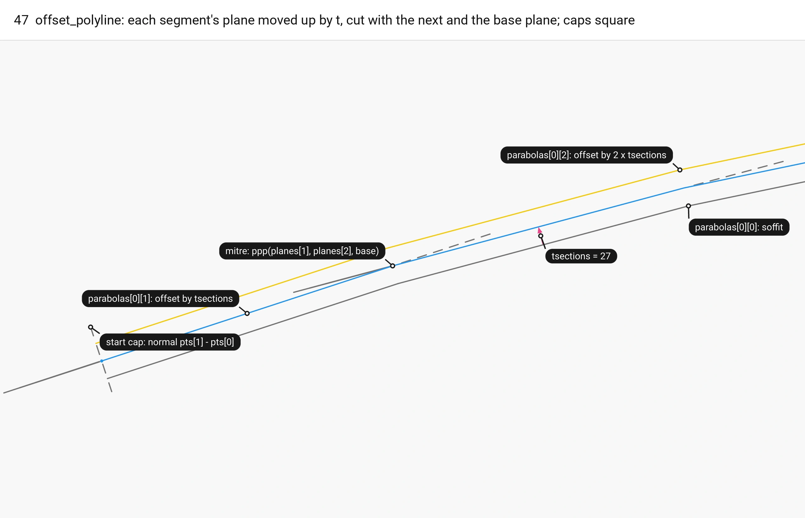

■ built `parabolas[0][1]`, the +t layer, its start and mitre points   ■ result `parabolas[0][2]`, the +2t layer   ■ variable `tsections` = 27   ■ input soffit `parabolas[0][0]`, segment planes moved by t and the start cap, dashed

`offset_polyline` moves each segment's plane up by `distance` and intersects neighbours, with end caps and a vertical base plane, giving mitred points that offset the polyline rather than the Bezier. The +2t layer is offset 54 straight from the soffit; members read +t as the t-section top and bed underside, +2t as the bed top.

Code: `offset_polyline`, [floor_geometry.cpp:127-152](https://github.com/petrasvestartas/wood/blob/16f3ab0a2386bf39ac7f7123c0a20d03e73ab1a5/src/templates/floor/floor_geometry.cpp#L127-L152) (called at [floor.cpp:332](https://github.com/petrasvestartas/wood/blob/16f3ab0a2386bf39ac7f7123c0a20d03e73ab1a5/src/templates/floor/floor.cpp#L332)).

## 48. Shadow parabolas on the inner ribs

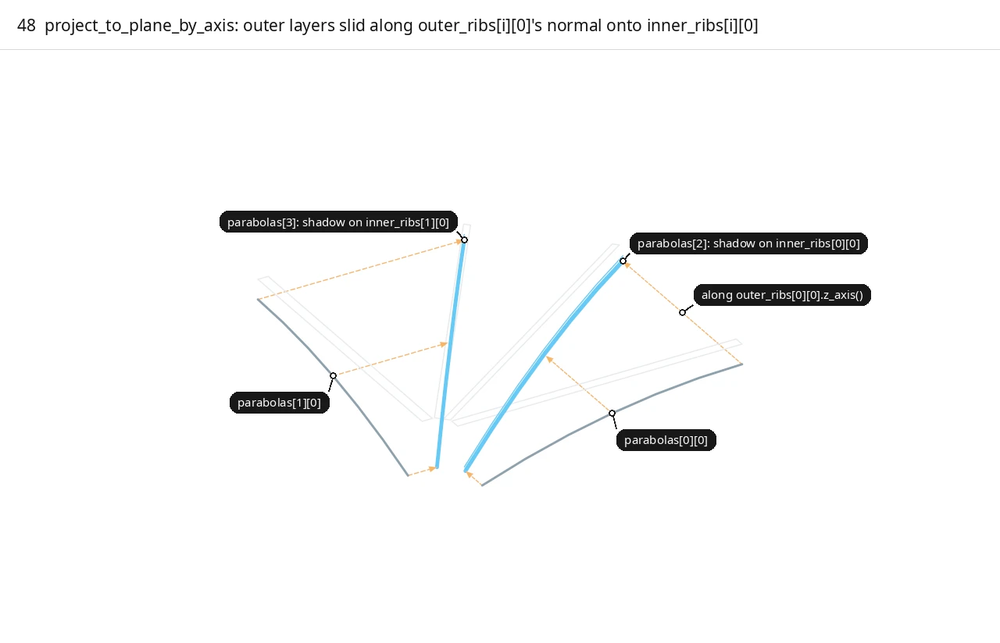

■ built shadows `parabolas[2]`, `parabolas[3]`, all three layers   ■ variable projection direction `outer_ribs[i][0].z_axis()`, dashed   ■ input soffits `parabolas[0][0]`, `parabolas[1][0]`   ■ context outer and inner rib quads

All three layers of `parabolas[i]` are projected along the outer rib's normal `cp.outer_ribs[i][0].z_axis()` onto inner rib i's outer face `cp.inner_ribs[i][0]` and stored untrimmed as `parabolas[2 + i]`, which `central_panel` in chapter 4 reads as its two shadows.

Code: `boundary_parabolas`, [floor.cpp:335-339](https://github.com/petrasvestartas/wood/blob/16f3ab0a2386bf39ac7f7123c0a20d03e73ab1a5/src/templates/floor/floor.cpp#L335-L339); `Xform::project_to_plane_by_axis`, [session_cpp xform.cpp:612-638](https://github.com/petrasvestartas/session_cpp/blob/2c02829d07674c1a5a04f03519611f7ad1f1655c/src/xform.cpp#L612-L638).
