# Floor 04: Central panel (rule A) and bed tops {#templates_floor_04_central_panel}

`central_panel` finds one horizontal direction `rib_sweep` that moves both inner ribs' soffit shadows onto their central faces so one horizontal ruling `u` joins them (rule A), and builds the soffit, +t and +2t traces there; `bed_top_planes` then fits the plane each of the three wedge blocks stands on. Values are for quarter 0 of `FloorGuide::rectangle(3000, 3000)` in guide coordinates.

Examples: [templates_floor_4_quarters.cpp](https://github.com/petrasvestartas/wood/blob/44f9aa85952d32a9264125f4e9940e55b05a4512/examples/templates_floor_4_quarters.cpp) builds the members cut from these outputs; [templates_floor_8_rectangle.cpp](https://github.com/petrasvestartas/wood/blob/44f9aa85952d32a9264125f4e9940e55b05a4512/examples/templates_floor_8_rectangle.cpp) shows rule A turning `rib_sweep` away from the reference on the 3000 x 2400 bay.

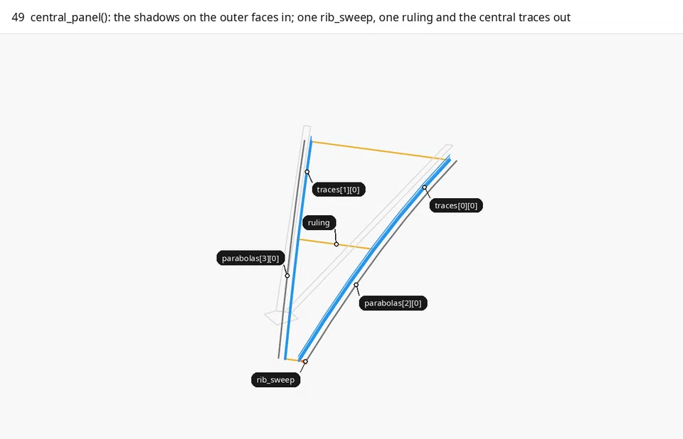

■ built what each step builds   ■ variable the variable or value it introduces   ■ result a second result, set apart   ■ input what it reads, dashed when a helper   ■ context context

## 49. Central panel: inputs and outputs

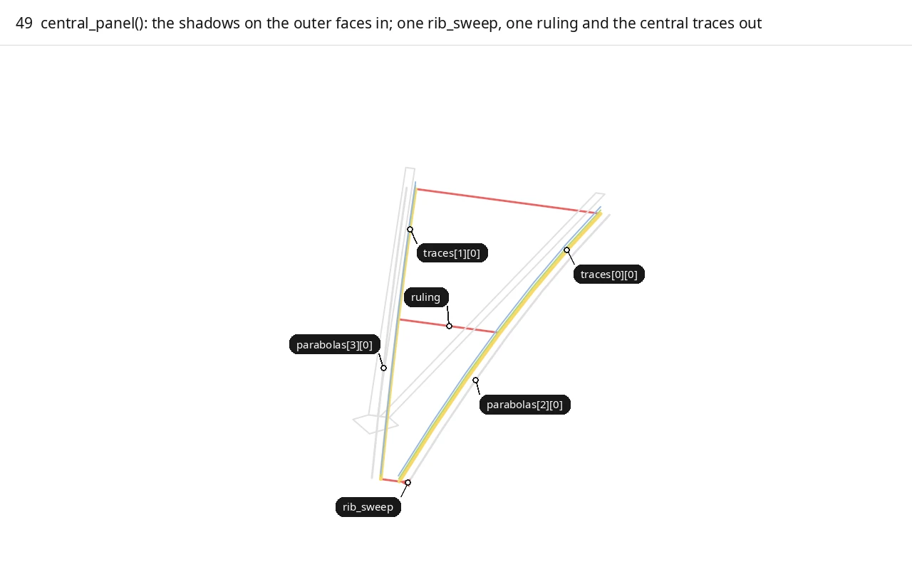

■ built `traces[k][0..2]`, the soffit thick   ■ result `ruling`, three same-index chords   ■ variable `rib_sweep`   ■ input `shadows[k] = parabolas[2 + k][0]`   ■ context inner rib quads, column head

`central_panel` moves the shadows `parabolas[2 + k][0]` through the 60 mm inner ribs along one horizontal `rib_sweep` chosen so every same-index chord is parallel, making the panel a cylinder with horizontal generators along `ruling`. It returns the soffit, +t and +2t layers (`tsections = 27`) as `traces`, plus `obliqueness` and `residual`.

Code: `central_panel`, [floor_panel.cpp:143-163](https://github.com/petrasvestartas/wood/blob/16f3ab0a2386bf39ac7f7123c0a20d03e73ab1a5/src/templates/floor/floor_panel.cpp#L143-L163); called from `compute_quarter`, [floor.cpp:373](https://github.com/petrasvestartas/wood/blob/16f3ab0a2386bf39ac7f7123c0a20d03e73ab1a5/src/templates/floor/floor.cpp#L373).

## 50. Reference direction

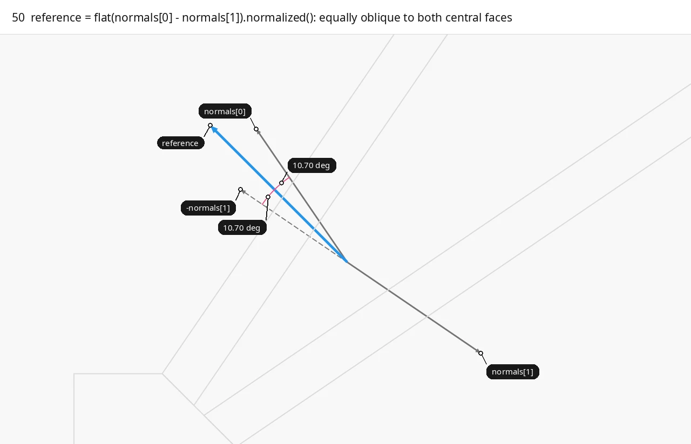

■ built `reference`   ■ variable angle to `normals[0]` and `-normals[1]`, 10.70 deg   ■ input `normals[0]`, `normals[1]`, `-normals[1]` dashed   ■ context inner rib quads, column head

`reference = flat(normals[0] - normals[1]).normalized()` is the horizontal bisector of `normals[0]` and `-normals[1]`, the 0 degree direction of the scan and the fallback when no root is found. Since `normals[0] . r > 0` and `normals[1] . r < 0`, rib 0 moves along +r and rib 1 along -r, both toward the panel.

Code: `central_panel`, [floor_panel.cpp:148](https://github.com/petrasvestartas/wood/blob/16f3ab0a2386bf39ac7f7123c0a20d03e73ab1a5/src/templates/floor/floor_panel.cpp#L148); `flat`, [floor_panel.cpp:13-16](https://github.com/petrasvestartas/wood/blob/16f3ab0a2386bf39ac7f7123c0a20d03e73ab1a5/src/templates/floor/floor_panel.cpp#L13-L16).

## 51. Scan fan of trial sweeps

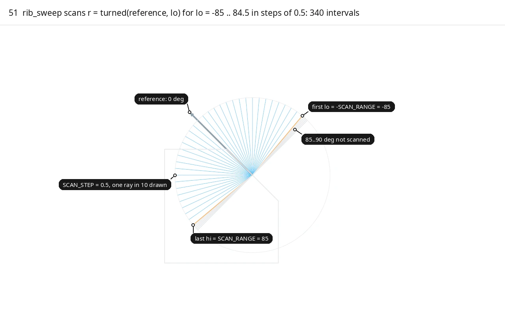

■ built trial sweeps `r = turned(reference, lo)`, one in ten   ■ variable `SCAN_RANGE = 85`, the first and last ray   ■ input `reference`, 0 deg   ■ context column head, scan circle, 85..90 deg not scanned

`rib_sweep` tries `r = turned(reference, lo)` for `lo` from -85 to 84.5 in `SCAN_STEP = 0.5` degree steps (340 intervals), stopping 5 degrees short of 90, where a second root has both ribs shifting the same way.

Code: `turned`, [floor_panel.cpp:18-25](https://github.com/petrasvestartas/wood/blob/16f3ab0a2386bf39ac7f7123c0a20d03e73ab1a5/src/templates/floor/floor_panel.cpp#L18-L25); `rib_sweep` loop, [floor_panel.cpp:100-101](https://github.com/petrasvestartas/wood/blob/16f3ab0a2386bf39ac7f7123c0a20d03e73ab1a5/src/templates/floor/floor_panel.cpp#L100-L101).

## 52. Skip grazing and crossing intervals

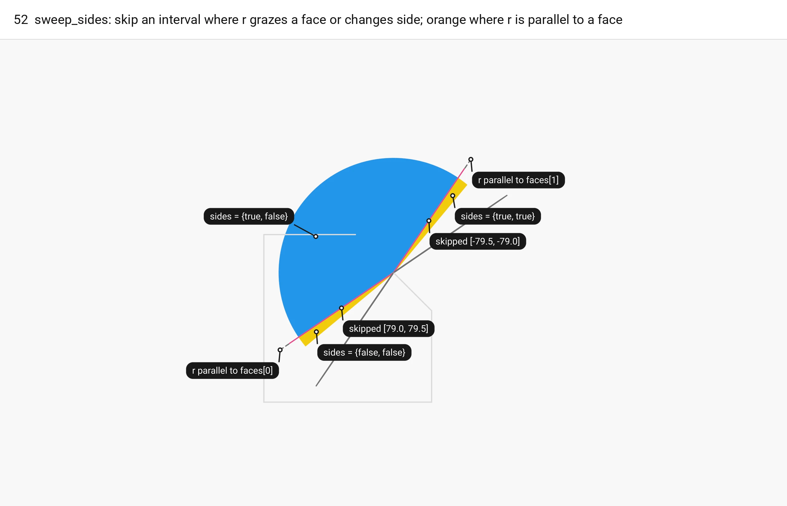

■ built scanned, `sides = {true, false}`   ■ result scanned, `sides = {true, true}` and `{false, false}`   ■ variable skipped intervals [-79.5, -79.0], [79.0, 79.5]   ■ input face directions of `faces[0]`, `faces[1]`, dashed   ■ context column head

An interval is skipped when either end has `|normals[k] . r| <= GRAZING` (1e-3) or the shift signs `sides` differ between its ends: r then passes parallel to a rib face, where `a[k]` runs through infinity and the closure changes sign without a real root. All other intervals are scanned, including the outer ones where both ribs shift the same way.

Code: `sweep_sides`, [floor_panel.cpp:63-70](https://github.com/petrasvestartas/wood/blob/16f3ab0a2386bf39ac7f7123c0a20d03e73ab1a5/src/templates/floor/floor_panel.cpp#L63-L70); skip test, [floor_panel.cpp:102-106](https://github.com/petrasvestartas/wood/blob/16f3ab0a2386bf39ac7f7123c0a20d03e73ab1a5/src/templates/floor/floor_panel.cpp#L102-L106).

## 53. shifts: a = t/(n.r)

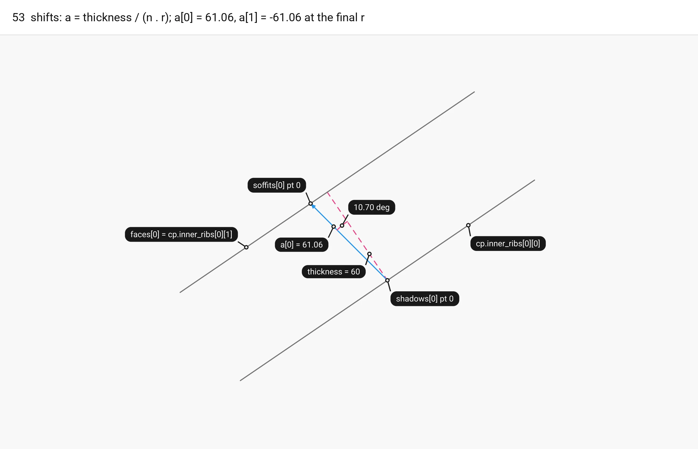

■ built `a[0]` along r, to `soffits[0]` pt 0   ■ variable `thickness = 60`, dashed, and the angle from `normals[0]` to r   ■ input `shadows[0]` pt 0, `cp.inner_ribs[0][0]`, `faces[0]`

`shifts` returns `a[k] = thickness / (normals[k] . r)`, the signed distance along r that carries an outer-face point onto the central face, larger than 60 when r is oblique (61.06 and -61.06 at the final r).

Code: `shifts`, [floor_panel.cpp:47-50](https://github.com/petrasvestartas/wood/blob/16f3ab0a2386bf39ac7f7123c0a20d03e73ab1a5/src/templates/floor/floor_panel.cpp#L47-L50), used at 55.

## 54. closure: start chord vs vertex chord

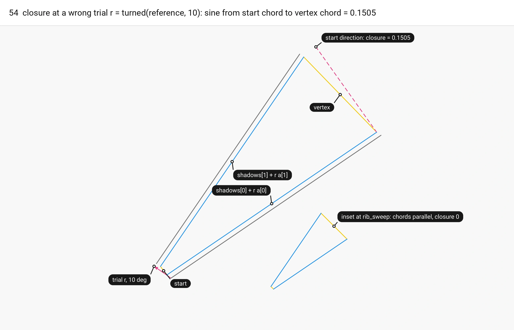

■ built `shadows[k] + r a[k]`, and the soffits in the inset   ■ result chords `start` and `vertex`   ■ variable trial r at +10 deg, and `closure`: the start direction dashed   ■ input `shadows[k]`

`closure` moves both shadows by `r * a[k]` and returns the signed plan sine `cross(start, vertex).z / (|start| |vertex|)` from the index-0 chord `start` to the index-6 chord `vertex`. The shadows are straight in plan with evenly spaced points, so when the end chords are parallel all seven are.

Code: `closure`, [floor_panel.cpp:52-61](https://github.com/petrasvestartas/wood/blob/16f3ab0a2386bf39ac7f7123c0a20d03e73ab1a5/src/templates/floor/floor_panel.cpp#L52-L61).

## 55. Sign-change brackets

An interval is dropped when `f_lo` and `f_hi` have the same sign and neither is exactly 0; on the square `closure(0)` is exactly 0, so [-0.5, 0] and [0, 0.5] both bracket the same root.

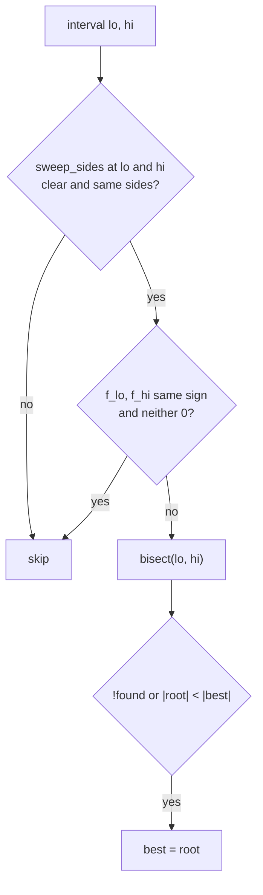
```mermaid
flowchart TD
    A["interval lo, hi"] --> B{"sweep_sides at lo and hi<br/>clear and same sides?"}
    B -- no --> X["skip"]
    B -- yes --> C{"f_lo, f_hi same sign<br/>and neither 0?"}
    C -- yes --> X
    C -- no --> D["bisect(lo, hi)"] --> E{"!found or |root| < |best|"}
    E -- yes --> F["best = root"]
```

Code: `rib_sweep` bracket test, [floor_panel.cpp:108-112](https://github.com/petrasvestartas/wood/blob/16f3ab0a2386bf39ac7f7123c0a20d03e73ab1a5/src/templates/floor/floor_panel.cpp#L108-L112).

## 56. Bisection

`bisect` halves a bracket at most `BISECTIONS = 200` times, returning early when `f_mid == 0` or `mid` equals an end in floating point; zero counts as non-positive, so both brackets converge onto 0 degrees.

Code: `bisect`, [floor_panel.cpp:72-92](https://github.com/petrasvestartas/wood/blob/16f3ab0a2386bf39ac7f7123c0a20d03e73ab1a5/src/templates/floor/floor_panel.cpp#L72-L92).

## 57. Root nearest the reference: rib_sweep

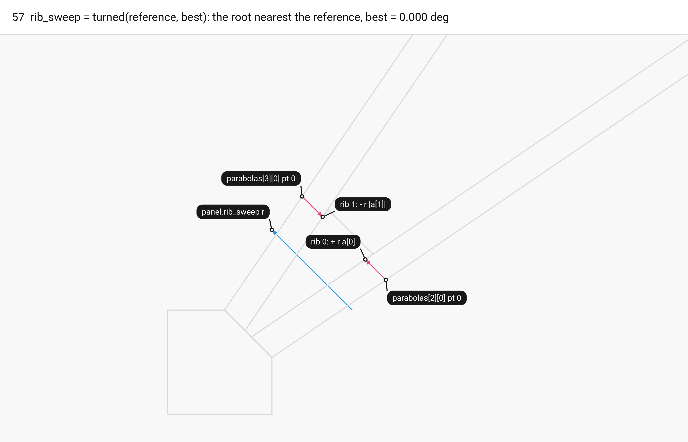

■ built `panel.rib_sweep` r   ■ variable +r `a[0]` on rib 0, -r `|a[1]|` on rib 1   ■ context inner rib quads, middle wedge quad, column head

`rib_sweep` returns the closure root nearest the reference, or the reference itself when no bracket held one, and `central_panel` stores it as `panel.rib_sweep`. On the square it is the reference; on the 3000 x 2400 bay it turns away and the obliquenesses become 20.703 and 3.338 degrees.

Code: `rib_sweep`, [floor_panel.cpp:94-123](https://github.com/petrasvestartas/wood/blob/16f3ab0a2386bf39ac7f7123c0a20d03e73ab1a5/src/templates/floor/floor_panel.cpp#L94-L123); stored at [floor_panel.cpp:151](https://github.com/petrasvestartas/wood/blob/16f3ab0a2386bf39ac7f7123c0a20d03e73ab1a5/src/templates/floor/floor_panel.cpp#L151).

## 58. along(): soffits on the central faces

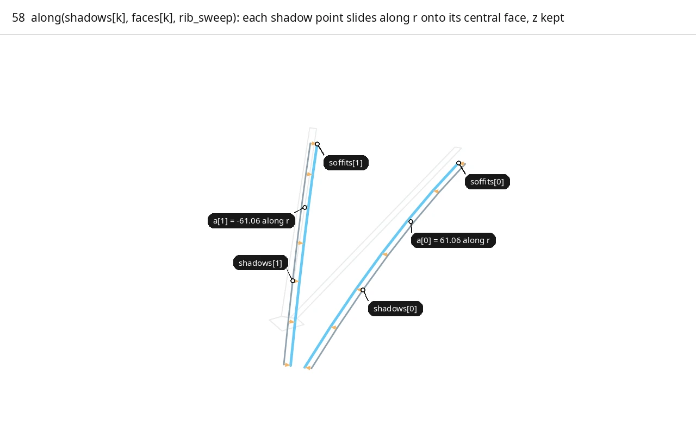

■ built `soffits[k]`   ■ variable moves `a[k] = 61.06` along r   ■ input `shadows[k]`   ■ context inner rib quads, column head

`soffits[k] = along(shadows[k], faces[k], panel.rib_sweep)` projects each shadow along r onto its central face, keeping z, and survives only as `panel.traces[k][0]`. `Quarter::inner_ribs` does not read it: it trims the shadow first and projects along `rib_sweep` itself.

Code: `along`, [floor_panel.cpp:27-30](https://github.com/petrasvestartas/wood/blob/16f3ab0a2386bf39ac7f7123c0a20d03e73ab1a5/src/templates/floor/floor_panel.cpp#L27-L30); `central_panel`, [floor_panel.cpp:152](https://github.com/petrasvestartas/wood/blob/16f3ab0a2386bf39ac7f7123c0a20d03e73ab1a5/src/templates/floor/floor_panel.cpp#L152).

## 59. Ruling u

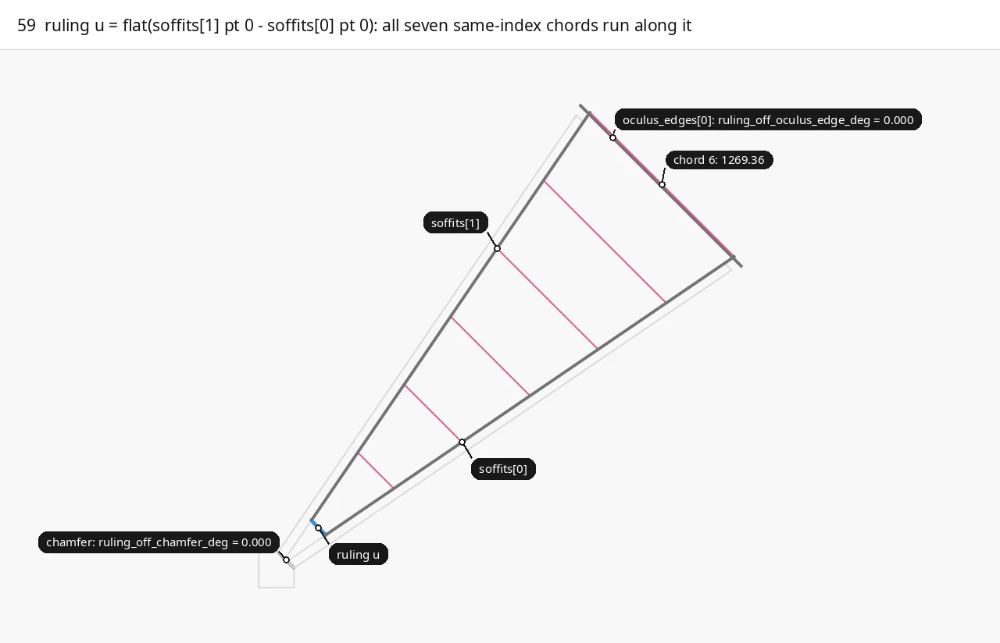

■ built `panel.ruling` u, chord 0   ■ variable chords 1..6, up to 1269.363 long at index 6   ■ input `soffits[k]`, chamfer, `oculus_edges[0]`   ■ context inner rib quads, column head

`panel.ruling` is the plan direction of the index-0 chord between the soffits; at the closure root every same-index chord is parallel to it and horizontal, so the soffit is a cylinder along u. The report's angles from u to the chamfer and oculus edge (0.000 deg here, -0.839 to the chamfer on 3000 x 2400) are not read by `FloorReport::ok`.

Code: `central_panel`, [floor_panel.cpp:153](https://github.com/petrasvestartas/wood/blob/16f3ab0a2386bf39ac7f7123c0a20d03e73ab1a5/src/templates/floor/floor_panel.cpp#L153); `measure_quarter`, [floor_report.cpp:151-152](https://github.com/petrasvestartas/wood/blob/16f3ab0a2386bf39ac7f7123c0a20d03e73ab1a5/src/templates/floor/floor_report.cpp#L151-L152); `plan_angle`, [floor_report.cpp:18-25](https://github.com/petrasvestartas/wood/blob/16f3ab0a2386bf39ac7f7123c0a20d03e73ab1a5/src/templates/floor/floor_report.cpp#L18-L25).

## 60. Obliqueness and shear

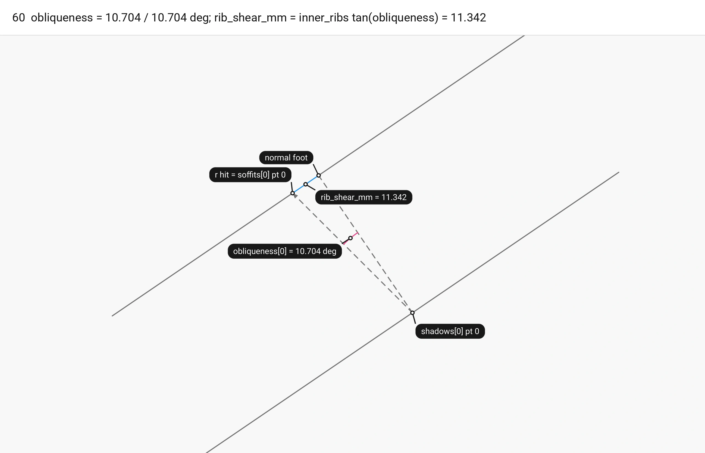

■ built `rib_shear_mm`, normal foot to r hit   ■ variable `obliqueness[0]`   ■ input outer face, `faces[0]`, the normal and r, dashed

`panel.obliqueness[k]` is the angle between the sweep and rib k's normal (10.704 deg each), and the report's `rib_shear_mm = inner_ribs * tan(obliqueness)` (11.342 mm) is how far the central trace slides against the outer one; `ok()` reads neither.

Code: `central_panel`, [floor_panel.cpp:155-156](https://github.com/petrasvestartas/wood/blob/16f3ab0a2386bf39ac7f7123c0a20d03e73ab1a5/src/templates/floor/floor_panel.cpp#L155-L156); `measure_quarter`, [floor_report.cpp:163-164](https://github.com/petrasvestartas/wood/blob/16f3ab0a2386bf39ac7f7123c0a20d03e73ab1a5/src/templates/floor/floor_report.cpp#L163-L164).

## 61. Residual

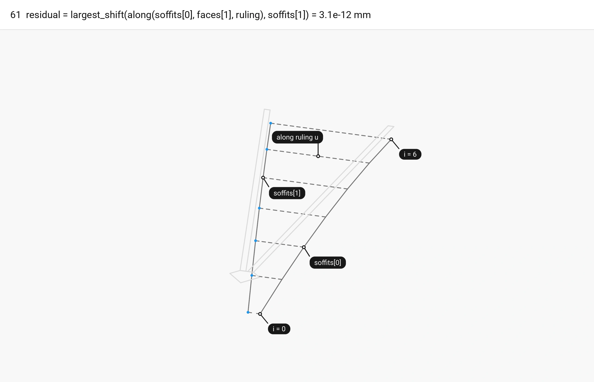

■ built `along(soffits[0], faces[1], ruling)`, landed points   ■ input `soffits[0]`, `soffits[1]`, moves along u dashed   ■ context inner rib quads, column head

`panel.residual` slides rib 0's soffit along u onto rib 1's central face and takes the largest same-index miss against `soffits[1]` (3.103e-12 mm). `FloorReport::ok` fails when this `closure_residual_mm` exceeds its tolerance (default 1e-6).

Code: `largest_shift`, [floor_panel.cpp:32-41](https://github.com/petrasvestartas/wood/blob/16f3ab0a2386bf39ac7f7123c0a20d03e73ab1a5/src/templates/floor/floor_panel.cpp#L32-L41); `central_panel`, [floor_panel.cpp:158](https://github.com/petrasvestartas/wood/blob/16f3ab0a2386bf39ac7f7123c0a20d03e73ab1a5/src/templates/floor/floor_panel.cpp#L158); `FloorReport::ok`, [floor_report.cpp:188-195](https://github.com/petrasvestartas/wood/blob/16f3ab0a2386bf39ac7f7123c0a20d03e73ab1a5/src/templates/floor/floor_report.cpp#L188-L195).

## 62. Panel cross-section

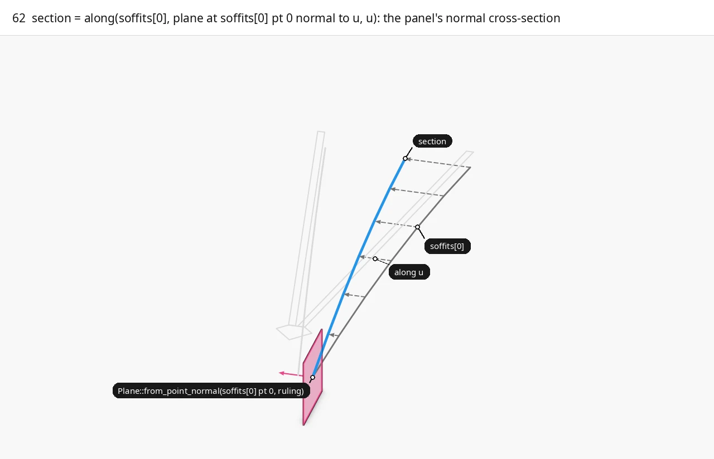

■ built `section`   ■ variable plane at `soffits[0]` pt 0 normal to u   ■ input `soffits[0]`, moves along u dashed   ■ context `soffits[1]`, inner rib quads, column head

`section_layers` projects rib 0's soffit along u onto the vertical plane through its first point with normal u (x - y = 89.955), so `section` is the true normal cross-section of the panel.

Code: `section_layers`, [floor_panel.cpp:129-132](https://github.com/petrasvestartas/wood/blob/16f3ab0a2386bf39ac7f7123c0a20d03e73ab1a5/src/templates/floor/floor_panel.cpp#L129-L132), called at 160.

## 63. Section offsets t and 2t

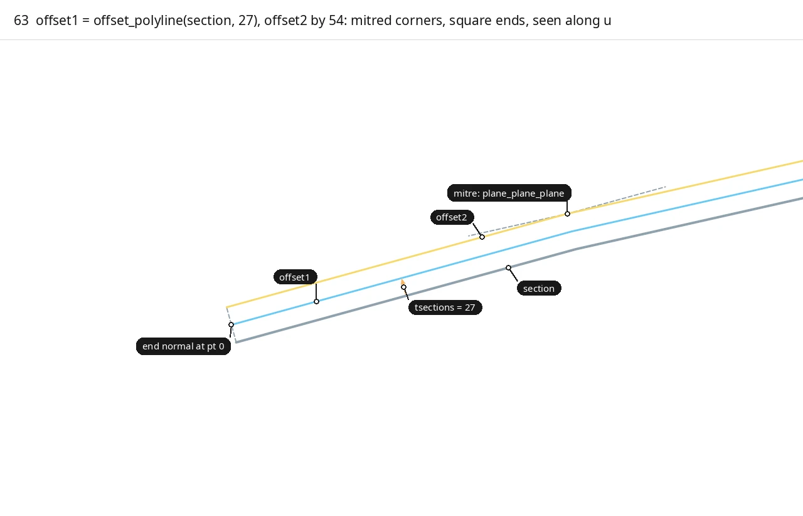

■ built `offset1`   ■ result `offset2`   ■ variable `tsections = 27`   ■ input `section`, the mitre and the end normal dashed

`offset_polyline` offsets `section` by `tsections` and `2 * tsections` in its own vertical plane, mitred at inner vertices, so `offset1` and `offset2` are 27 and 54 mm thick perpendicular to the soffit. Unlike the outer ribs' `parabolas[k][1..2]`, they are not offset inside each rib face.

Code: `section_layers`, [floor_panel.cpp:133-134](https://github.com/petrasvestartas/wood/blob/16f3ab0a2386bf39ac7f7123c0a20d03e73ab1a5/src/templates/floor/floor_panel.cpp#L133-L134); `offset_polyline`, [floor_geometry.cpp:127-152](https://github.com/petrasvestartas/wood/blob/16f3ab0a2386bf39ac7f7123c0a20d03e73ab1a5/src/templates/floor/floor_geometry.cpp#L127-L152).

## 64. Layers back on both central faces: traces

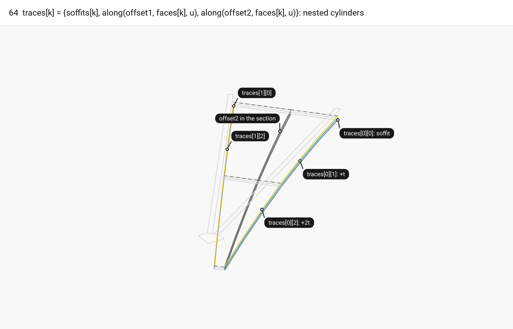

■ built `traces[k][1]`, +t   ■ result `traces[k][2]`, +2t   ■ input `traces[k][0]` soffit, the section curves, moves along u dashed   ■ context same-index chords, inner rib quads, column head

`traces[k] = {soffits[k], along(offset1, faces[k], ruling), along(offset2, faces[k], ruling)}` moves the offsets back along u onto each central face: three nested cylinders bounding the soffit, the +t top of the central t-sections and the +2t top of the central bed.

Code: `section_layers`, [floor_panel.cpp:135-140](https://github.com/petrasvestartas/wood/blob/16f3ab0a2386bf39ac7f7123c0a20d03e73ab1a5/src/templates/floor/floor_panel.cpp#L135-L140); stored at [floor_panel.cpp:160](https://github.com/petrasvestartas/wood/blob/16f3ab0a2386bf39ac7f7123c0a20d03e73ab1a5/src/templates/floor/floor_panel.cpp#L160).

## 65. Where the panel is consumed

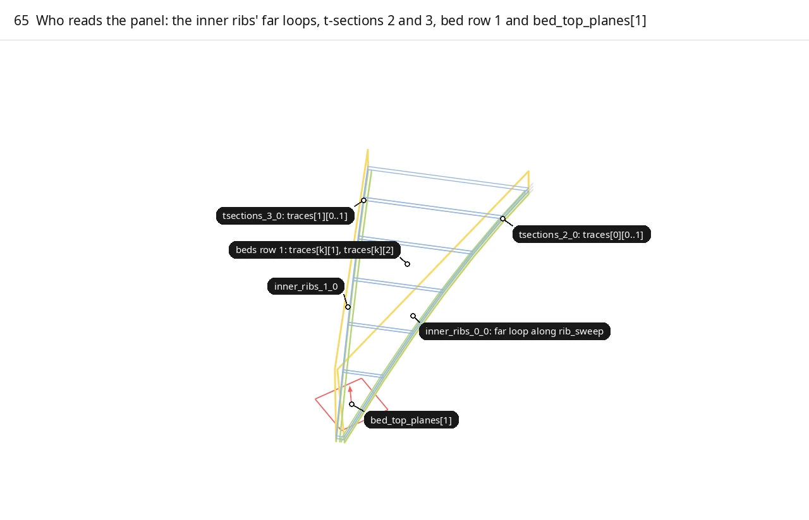

■ inner_ribs `inner_ribs_0_0`, `inner_ribs_1_0` far loops   ■ tsections t-sections 2 and 3   ■ beds bed row 1   ■ built `bed_top_planes[1]`   ■ context `panel.traces`

`traces` feed `bed_top_planes[1]`, central t-sections 2 and 3 and bed row 1; `rib_sweep` feeds the inner ribs' far loops and all four t-sections 1 to 4; `ruling`, `residual` and `obliqueness` feed `measure_quarter` (chapter 11).

Code: `compute_quarter`, [floor.cpp:372-374](https://github.com/petrasvestartas/wood/blob/16f3ab0a2386bf39ac7f7123c0a20d03e73ab1a5/src/templates/floor/floor.cpp#L372-L374); [floor_members.cpp:77-86](https://github.com/petrasvestartas/wood/blob/16f3ab0a2386bf39ac7f7123c0a20d03e73ab1a5/src/templates/floor/floor_members.cpp#L77-L86), [161-185](https://github.com/petrasvestartas/wood/blob/16f3ab0a2386bf39ac7f7123c0a20d03e73ab1a5/src/templates/floor/floor_members.cpp#L161-L185), [215-226](https://github.com/petrasvestartas/wood/blob/16f3ab0a2386bf39ac7f7123c0a20d03e73ab1a5/src/templates/floor/floor_members.cpp#L215-L226).

## 66. Bed top: side projections

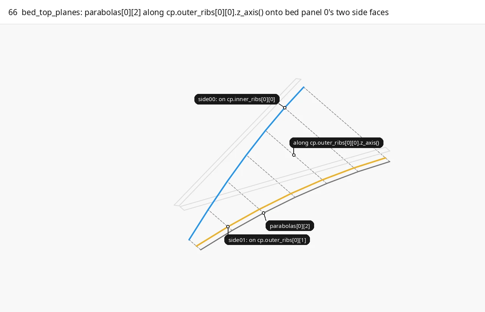

■ built `side00` on `cp.inner_ribs[0][0]`   ■ result `side01` on `cp.outer_ribs[0][1]`   ■ input `parabolas[0][2]`, moves along `cp.outer_ribs[0][0].z_axis()` dashed   ■ context outer and inner rib 0 quads

`side00`/`side01` (and `side20`/`side21`) project the outer rib's +2t layer `parabolas[k][2]` along that rib's normal onto both side faces of bed panel 0 (and 2), the inner rib's outer face and `cp.outer_ribs[k][1]`.

Code: `bed_top_planes`, [floor.cpp:347-350](https://github.com/petrasvestartas/wood/blob/16f3ab0a2386bf39ac7f7123c0a20d03e73ab1a5/src/templates/floor/floor.cpp#L347-L350), called at 374.

## 67. panel_top_plane for side beds

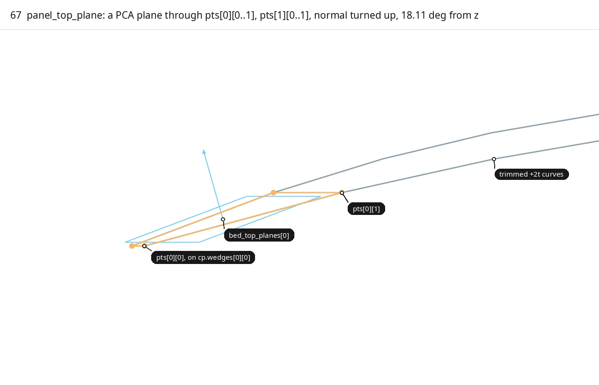

■ built `bed_top_planes[0]`   ■ variable `pts[0][0..1]`, `pts[1][0..1]`, the deepest quad   ■ input the trimmed +2t curves

`panel_top_plane` trims both face curves by the beam far face `cp.inner_beams[0][1]` and the fan plane `cp.wedges[0][0]` (`[2][1]`, `[2][0]` for block 2), orders them deepest end first, and PCA-fits an up-facing plane to their two deepest points each. The four points need not be coplanar, so `bed_top_planes[0]` is a fitted plane, not a quad's plane.

Code: `panel_top_plane`, [floor.cpp:48-62](https://github.com/petrasvestartas/wood/blob/16f3ab0a2386bf39ac7f7123c0a20d03e73ab1a5/src/templates/floor/floor.cpp#L48-L62), used at 353 and 355; `trim`, [floor_geometry.cpp:69-80](https://github.com/petrasvestartas/wood/blob/16f3ab0a2386bf39ac7f7123c0a20d03e73ab1a5/src/templates/floor/floor_geometry.cpp#L69-L80); `Plane::from_points_pca`, [session_cpp/src/plane.cpp:224-243](https://github.com/petrasvestartas/session_cpp/blob/2c02829d07674c1a5a04f03519611f7ad1f1655c/src/plane.cpp#L224-L243).

## 68. panel_top_plane for the central bed

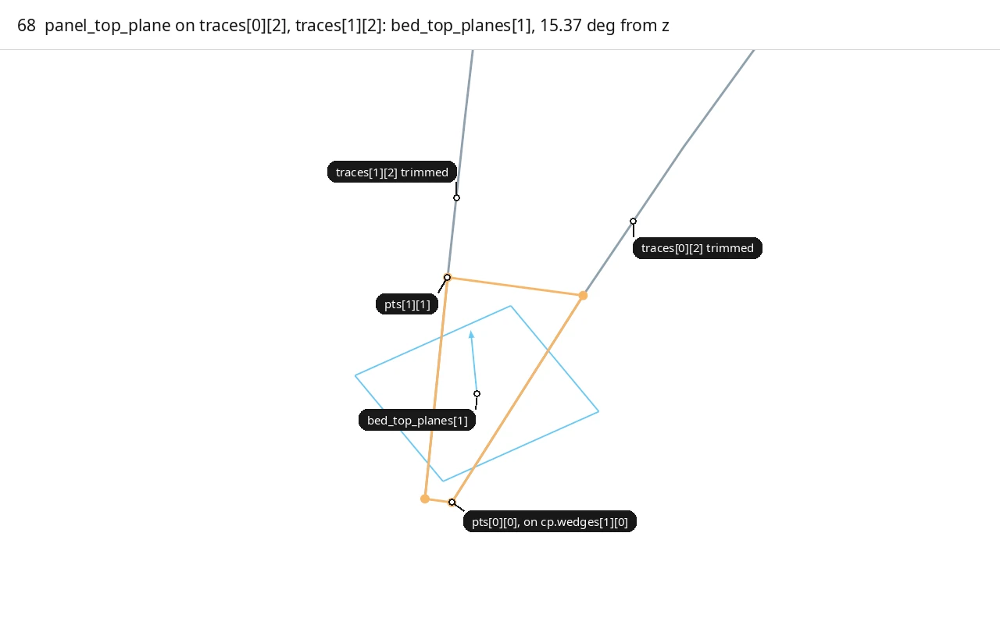

■ built `bed_top_planes[1]`   ■ variable `pts[0][0..1]`, `pts[1][0..1]`, the deepest quad   ■ input `traces[0][2]`, `traces[1][2]` trimmed, the quad side `pts[0][0]` to `pts[1][0]` dashed

The same fit on `traces[0][2]` and `traces[1][2]`, trimmed by the oculus beam's back face `cp.inner_beams[1][1]` and the tilted middle fan plane `cp.wedges[1][0]`, gives `bed_top_planes[1]`, the bottom of the middle wedge block `wedges_1_0`.

Code: `bed_top_planes`, [floor.cpp:354](https://github.com/petrasvestartas/wood/blob/16f3ab0a2386bf39ac7f7123c0a20d03e73ab1a5/src/templates/floor/floor.cpp#L354); `panel_top_plane`, [floor.cpp:48-62](https://github.com/petrasvestartas/wood/blob/16f3ab0a2386bf39ac7f7123c0a20d03e73ab1a5/src/templates/floor/floor.cpp#L48-L62).
