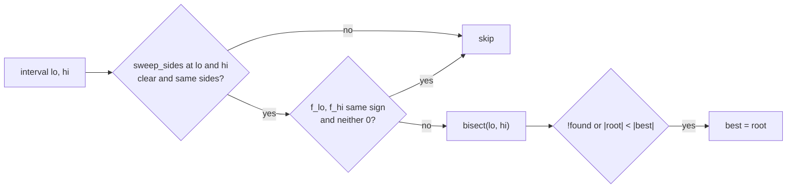

# Floor 04: Central panel (rule A) and bed tops {#templates_floor_04_central_panel}

This chapter covers the last two calls of `compute_quarter` (floor.cpp:373-374). First `central_panel` (floor_panel.cpp:143-163) finds one horizontal direction `rib_sweep` along which both inner ribs are swept from their outer face to their central face, so that one horizontal ruling `u` joins the two central soffit traces (rule A). It then builds the soffit, +t and +2t traces on both central faces. Then `bed_top_planes` (floor.cpp:344-357) fits the plane each of the three wedge blocks stands on. The planes come from chapter 2: the inner ribs' faces `cp.inner_ribs[k]`, and for the bed tops `cp.outer_ribs`, `cp.inner_beams` and `cp.wedges`. The curves come from chapter 3: the shadows `parabolas[2][0]` and `parabolas[3][0]`, and the outer rib layers `parabolas[0..1][2]`. The output, `geometry.central_panel` and `geometry.bed_top_planes`, is read by the inner rib, t-section, bed and wedge outlines of chapters 5 and 6, and by the report of chapter 11.

All values are for quarter 0 of the default square bay, `FloorGuide::rectangle(3000, 3000)`, in guide coordinates (datum z 0; the pictures lift them by `bay_height`).

Example: [templates_floor_4_quarters.cpp](https://github.com/petrasvestartas/wood/blob/44f9aa85952d32a9264125f4e9940e55b05a4512/examples/templates_floor_4_quarters.cpp) builds the four quarters, whose inner ribs, central t-sections, central bed row and middle wedge are cut from this chapter's `central_panel` and `bed_top_planes`; [templates_floor_8_rectangle.cpp](https://github.com/petrasvestartas/wood/blob/44f9aa85952d32a9264125f4e9940e55b05a4512/examples/templates_floor_8_rectangle.cpp) builds the same on the 3000 x 2400 bay, where rule A turns `rib_sweep` away from the reference.


<span style="color:#2196EA">■ built</span> what each step builds   <span style="color:#E8478B">■ variable</span> the variable or value it introduces   <span style="color:#F2CC0C">■ result</span> a second result, set apart   <span style="color:#737373">■ input</span> what it reads, dashed when a helper   <span style="color:#A3A3A3">■ context</span> context

## 49. Central panel: inputs and outputs


<span style="color:#2196EA">■ built</span> `traces[k][0..2]`, the soffit thick   <span style="color:#F2CC0C">■ result</span> `ruling`, three same-index chords   <span style="color:#E8478B">■ variable</span> `rib_sweep`   <span style="color:#737373">■ input</span> `shadows[k] = parabolas[2 + k][0]`   <span style="color:#A3A3A3">■ context</span> inner rib quads, column head

`central_panel` reads the two central faces `faces[k] = cp.inner_ribs[k][1]`, their normals `normals[k] = faces[k].z_axis()`, and the two shadows <span style="color:#737373">`shadows[k] = parabolas[2 + k][0]`</span>. A shadow is outer rib k's soffit parabola projected along that rib's normal onto inner rib k's outer face `cp.inner_ribs[k][0]` (chapter 3). Each <span style="color:#737373">shadow</span> has to be moved through its 60 mm inner rib onto the central face. Rule A moves both along one common horizontal direction <span style="color:#E8478B">`rib_sweep`</span>, chosen so that the chord between the two moved traces at the column end is parallel to the chord at the seam end. Every same-index chord is then parallel, so the panel between the ribs is a cylinder with horizontal generators along <span style="color:#F2CC0C">`ruling`</span>. The function records how oblique the sweep is to each rib (`obliqueness`) and how far one ruling misses (`residual`). It then offsets that cylinder by `tsections` and `2 * tsections` in its own cross-section and returns the three layers per rib as <span style="color:#2196EA">`traces`</span>.

```cpp
const std::array<Plane, 2> faces = {cp.inner_ribs[0][1], cp.inner_ribs[1][1]};
const std::array<Vector, 2> normals = {faces[0].z_axis(), faces[1].z_axis()};
const std::array<Polyline, 2> shadows = {parabolas[2][0], parabolas[3][0]};
const Vector reference = flat(normals[0] - normals[1]).normalized();
```

| Variable | Value | Meaning |
|---|---|---|
| `inner_ribs` | 60 | Inner rib thickness, the normal distance from `cp.inner_ribs[k][0]` to `faces[k]` |
| `tsections` | 27 | Layer thickness of the +t and +2t traces |
| `faces[k]` | `cp.inner_ribs[k][1]` | Vertical central face of inner rib k, `cp.inner_ribs[k][0]` moved 60 along its normal |
| `shadows[k]` | `parabolas[2 + k][0]`; `shadows[0]` pt0 (-2540, -2716.311, -650) ... pt6 (0, -983.931, -197) | Outer rib k's soffit on inner rib k's outer face, 7 points |
| `central_panel.rib_sweep` | (-0.7071, 0.7071, 0) | Horizontal sweep of both inner ribs |
| `central_panel.ruling` | (-0.7071, 0.7071, 0) | Horizontal ruling of the panel |
| `central_panel.traces[k][0..2]` | `traces[0][0]` (-2583.178, -2673.133, -650) ... (-43.178, -940.753, -197); `traces[0][2]` starts (-2595.213, -2681.341, -597.932) | Soffit, +t and +2t on rib k's central face |
| `central_panel.obliqueness` | {10.704, 10.704} | Degrees between the sweep and each rib normal |
| `central_panel.residual` | 3.1e-12 | Rule A miss in mm, rounding noise |

Code: `central_panel`, [floor_panel.cpp:143-163](https://github.com/petrasvestartas/wood/blob/16f3ab0a2386bf39ac7f7123c0a20d03e73ab1a5/src/templates/floor/floor_panel.cpp#L143-L163); called from `compute_quarter`, [floor.cpp:373](https://github.com/petrasvestartas/wood/blob/16f3ab0a2386bf39ac7f7123c0a20d03e73ab1a5/src/templates/floor/floor.cpp#L373).

## 50. Reference direction


<span style="color:#2196EA">■ built</span> `reference`   <span style="color:#E8478B">■ variable</span> angle to `normals[0]` and `-normals[1]`, 10.70 deg   <span style="color:#737373">■ input</span> `normals[0]`, `normals[1]`, `-normals[1]` dashed   <span style="color:#A3A3A3">■ context</span> inner rib quads, column head

<span style="color:#2196EA">`reference = flat(normals[0] - normals[1]).normalized()`</span>. `flat` sets z to 0 (floor_panel.cpp:13-16). The result is the horizontal bisector of <span style="color:#737373">`normals[0]`</span> and <span style="color:#737373">`-normals[1]`</span>. It makes <span style="color:#E8478B">the same angle</span> with both, so it is equally oblique to both central faces, and it gives `normals[0] . r > 0` and `normals[1] . r < 0`: rib 0 is moved along +r and rib 1 along -r, both toward the panel. The <span style="color:#2196EA">reference</span> is the 0 degree direction of the scan in frames 51 to 54, and `rib_sweep` falls back to it when the scan finds no root.

| Variable | Value | Meaning |
|---|---|---|
| `normals[k]` | (-0.5635, 0.8261, 0) and (0.8261, -0.5635, 0) | `cp.inner_ribs[k][1].z_axis()`, unit and horizontal, pointing from the outer to the central face |
| `reference` | (-0.707107, 0.707107, 0) | Unit plan vector, 0 degrees of the scan; equal to `column.chamfer_direction` on the square |
| angle to `normals[0]` and to `-normals[1]` | 10.70 deg each | The reference is equally oblique to both faces |

Code: `central_panel`, [floor_panel.cpp:148](https://github.com/petrasvestartas/wood/blob/16f3ab0a2386bf39ac7f7123c0a20d03e73ab1a5/src/templates/floor/floor_panel.cpp#L148); `flat`, [floor_panel.cpp:13-16](https://github.com/petrasvestartas/wood/blob/16f3ab0a2386bf39ac7f7123c0a20d03e73ab1a5/src/templates/floor/floor_panel.cpp#L13-L16).

## 51. Scan fan of trial sweeps


<span style="color:#2196EA">■ built</span> trial sweeps `r = turned(reference, lo)`, one in ten   <span style="color:#E8478B">■ variable</span> `SCAN_RANGE = 85`, the first and last ray   <span style="color:#737373">■ input</span> `reference`, 0 deg   <span style="color:#A3A3A3">■ context</span> column head, scan circle, 85..90 deg not scanned

`rib_sweep` tries horizontal sweeps <span style="color:#2196EA">`r = turned(reference, degrees)`</span>. `turned` flattens and normalises the <span style="color:#737373">reference</span> and rotates it about z by `degrees`, counter-clockwise when positive (floor_panel.cpp:18-25). The loop runs `lo` from <span style="color:#E8478B">`-SCAN_RANGE`</span> while <span style="color:#E8478B">`lo < SCAN_RANGE`</span> in steps of `SCAN_STEP`, with `hi = lo + SCAN_STEP`. That gives 340 intervals, `lo` = -85.0 ... 84.5. The range stops <span style="color:#A3A3A3">5 degrees short of 90</span>, where a second root lies: there both ribs shift the same way (floor_panel.cpp:9). The picture draws one ray in ten.

```cpp
for (double lo = -SCAN_RANGE; lo < SCAN_RANGE; lo += SCAN_STEP) {
    const double hi = lo + SCAN_STEP;
```

| Variable | Value | Meaning |
|---|---|---|
| `SCAN_STEP` | 0.5 | Degrees between neighbouring trial directions |
| `SCAN_RANGE` | 85.0 | Degrees either side of the reference |
| `lo`, `hi` | -85.0 ... 84.5, `lo + 0.5` | Bounding angles of one interval, 340 intervals |

Code: `turned`, [floor_panel.cpp:18-25](https://github.com/petrasvestartas/wood/blob/16f3ab0a2386bf39ac7f7123c0a20d03e73ab1a5/src/templates/floor/floor_panel.cpp#L18-L25); `rib_sweep` loop, [floor_panel.cpp:100-101](https://github.com/petrasvestartas/wood/blob/16f3ab0a2386bf39ac7f7123c0a20d03e73ab1a5/src/templates/floor/floor_panel.cpp#L100-L101).

## 52. Skip grazing and crossing intervals


<span style="color:#2196EA">■ built</span> scanned, `sides = {true, false}`   <span style="color:#F2CC0C">■ result</span> scanned, `sides = {true, true}` and `{false, false}`   <span style="color:#E8478B">■ variable</span> skipped intervals [-79.5, -79.0], [79.0, 79.5]   <span style="color:#737373">■ input</span> face directions of `faces[0]`, `faces[1]`, dashed   <span style="color:#A3A3A3">■ context</span> column head

At both ends of an interval `sweep_sides` sets `r = turned(reference, degrees)` and `sides = {normals[0] . r > 0, normals[1] . r > 0}`. It returns false when either `|normals[k] . r| <= GRAZING`. The interval is skipped if either end returns false or if `sides_lo != sides_hi`. A side change means r passes <span style="color:#737373">parallel to a rib face</span> inside the interval: there `a[k] = thickness / (normals[k] . r)` runs through infinity and the closure of frame 54 changes sign without a real root. Only <span style="color:#E8478B">two intervals are skipped</span>. <span style="color:#2196EA">All other intervals are scanned</span>, including <span style="color:#F2CC0C">the outer ones where both ribs shift the same way</span>.

```cpp
if (!sweep_sides(normals, reference, lo, sides_lo) || !sweep_sides(normals, reference, hi, sides_hi) || sides_lo != sides_hi)
    continue;
```

| Variable | Value | Meaning |
|---|---|---|
| `GRAZING` | 1e-3 | Smallest `|n . r|` accepted |
| skipped intervals | [-79.5, -79.0] and [79.0, 79.5] | `normals[1] . r = 0` at about -79.30, `normals[0] . r = 0` at about +79.30 (= 90 - 10.70) |
| `sides` | {true, true} on -85 .. -79.5; {true, false} on -79.0 .. 79.0; {false, false} on 79.5 .. 85 | Shift-sign pattern of the scanned intervals |

Code: `sweep_sides`, [floor_panel.cpp:63-70](https://github.com/petrasvestartas/wood/blob/16f3ab0a2386bf39ac7f7123c0a20d03e73ab1a5/src/templates/floor/floor_panel.cpp#L63-L70); skip test, [floor_panel.cpp:102-106](https://github.com/petrasvestartas/wood/blob/16f3ab0a2386bf39ac7f7123c0a20d03e73ab1a5/src/templates/floor/floor_panel.cpp#L102-L106).

## 53. shifts: a = t/(n.r)


<span style="color:#2196EA">■ built</span> `a[0]` along r, to `soffits[0]` pt 0   <span style="color:#E8478B">■ variable</span> `thickness = 60`, dashed, and the angle from `normals[0]` to r   <span style="color:#737373">■ input</span> `shadows[0]` pt 0, `cp.inner_ribs[0][0]`, `faces[0]`

For a horizontal r, <span style="color:#737373">a point of the outer face</span> moved by <span style="color:#2196EA">`a`</span> along r reaches <span style="color:#737373">the central face</span>, which lies <span style="color:#E8478B">`thickness`</span> further along `normals[k]`, when `a (normals[k] . r) = thickness`. `shifts` returns this closed-form line-plane intersection for both ribs. Near the reference <span style="color:#2196EA">`a[0] > 0`</span> and `a[1] < 0`: rib 0 moves along +r and rib 1 along -r, both toward the panel. When r is not along the normal, <span style="color:#2196EA">`|a|`</span> is 60 divided by the cosine of <span style="color:#E8478B">the angle between them</span>, so larger than 60.

```cpp
return {thickness / normals[0].dot(r), thickness / normals[1].dot(r)};
```

| Variable | Value | Meaning |
|---|---|---|
| `thickness` | 60.0 (`parameters.inner_ribs`) | Normal distance from `cp.inner_ribs[k][0]` to `faces[k]` |
| `a[0]`, `a[1]` | 61.0626, -61.0626 at the final r (60 / 0.982600) | Signed shift along r per rib |
| `shadows[0]` pt 0 | (-2540, -2716.311, -650) | The point shown |

Code: `shifts`, [floor_panel.cpp:47-50](https://github.com/petrasvestartas/wood/blob/16f3ab0a2386bf39ac7f7123c0a20d03e73ab1a5/src/templates/floor/floor_panel.cpp#L47-L50), used at 55.

## 54. closure: start chord vs vertex chord


<span style="color:#2196EA">■ built</span> `shadows[k] + r a[k]`, and the soffits in the inset   <span style="color:#F2CC0C">■ result</span> chords `start` and `vertex`   <span style="color:#E8478B">■ variable</span> trial r at +10 deg, and `closure`: the start direction dashed   <span style="color:#737373">■ input</span> `shadows[k]`

For one <span style="color:#E8478B">trial r</span>, `closure` moves both <span style="color:#737373">shadows</span> by <span style="color:#2196EA">`r * a[k]`</span>. It forms the plan chord from rib 0's moved point to rib 1's moved point at index 0, <span style="color:#F2CC0C">`start`</span>, and at the last index `n = point_count() - 1 = 6`, <span style="color:#F2CC0C">`vertex`</span>. It returns <span style="color:#E8478B">`cross(start, vertex).z / (|start| |vertex|)`</span>: the signed sine of the plan angle from `start` to `vertex`, positive counter-clockwise. The shadows are straight in plan with evenly spaced points (chapter 3's Bezier keeps its control point halfway along the axis and is sampled at even t), and both moved traces are translates of them, so every same-index chord is an affine blend of the two end chords. When the end chords are parallel, all seven are. The picture shows <span style="color:#E8478B">a wrong trial at +10 degrees</span>, where the chords are not parallel, and an inset at the final `rib_sweep`, where they are.

```cpp
const Vector start = flat((shadows[1].get_point(0) + r * a[1]) - (shadows[0].get_point(0) + r * a[0]));
const Vector vertex = flat((shadows[1].get_point(n) + r * a[1]) - (shadows[0].get_point(n) + r * a[0]));

return start.cross(vertex)[2] / (start.magnitude() * vertex.magnitude());
```

| Variable | Value | Meaning |
|---|---|---|
| `n` | 6 | Last point index of a shadow |
| `start` | (-89.955, 89.955, 0), length 127.216, at the final r | Index-0 chord |
| `vertex` | (-897.575, 897.575, 0), length 1269.363, at the final r | Index-6 chord |
| `closure(r)` | -0.1505 at -10 deg, 0 at 0, +0.1505 at +10, +0.808 at +60 | Rule A residual function |

Code: `closure`, [floor_panel.cpp:52-61](https://github.com/petrasvestartas/wood/blob/16f3ab0a2386bf39ac7f7123c0a20d03e73ab1a5/src/templates/floor/floor_panel.cpp#L52-L61).

## 55. Sign-change brackets

For each interval that passed frame 52, `rib_sweep` evaluates `f_lo` and `f_hi`. It drops the interval when both have the same sign and neither is exactly 0. What remains are brackets of a parallel-chord root. On the square `closure(0)` is exactly 0, so two neighbouring intervals both pass and both bracket the same root. The outer side intervals carry no sign change, so they give no bracket.

```cpp
if ((f_lo > 0.0) == (f_hi > 0.0) && f_lo != 0.0 && f_hi != 0.0)
    continue;
```

| Angle range, deg | `closure` | Result |
|---|---|---|
| -85 .. -79.5 | +0.62 falling to +0.066 | scanned, no sign change |
| -79.5 .. -79.0 | sign change through infinity (`normals[1] . r = 0`) | skipped in frame 52, false zero |
| -79.0 .. -0.5 | negative, about -0.81 near -60 | scanned, no sign change |
| -0.5 .. 0.0 | `f_lo` = -7.538e-3, `f_hi` = 0 exactly | bracket |
| 0.0 .. 0.5 | `f_lo` = 0 exactly, `f_hi` = +7.538e-3 | bracket |
| 0.5 .. 79.0 | positive, about +0.81 near +60 | scanned, no sign change |
| 79.0 .. 79.5 | sign change through infinity (`normals[0] . r = 0`) | skipped in frame 52, false zero |
| 79.5 .. 85 | -0.066 falling to -0.62 | scanned, no sign change |



Code: `rib_sweep` bracket test, [floor_panel.cpp:108-112](https://github.com/petrasvestartas/wood/blob/16f3ab0a2386bf39ac7f7123c0a20d03e73ab1a5/src/templates/floor/floor_panel.cpp#L108-L112).

## 56. Bisection

`bisect` starts with `f_lo = closure(turned(reference, lo))`. While `i < BISECTIONS` and `lo != hi` it takes `mid = 0.5 (lo + hi)` and `f_mid`. It returns `mid` at once if `f_mid == 0` or if `mid` equals `lo` or `hi` in floating point. If `f_mid` has the sign of `f_lo`, then `lo = mid` and `f_lo = f_mid`; otherwise `hi = mid`. After the loop it returns `0.5 (lo + hi)`. Zero counts as non-positive, so for the bracket [0, 0.5] with `f_lo = 0` every step sets `hi = mid`. Both brackets converge onto 0 degrees, the first from below and the second from above.

| Step | `lo` | `hi` | `mid` | sign of `f_mid` | Kept half |
|---|---|---|---|---|---|
| start | -0.5 (`f_lo` < 0) | 0.0 | | | |
| 1 | -0.5 | 0.0 | -0.25 | negative, as `f_lo` | [-0.25, 0] |
| 2 | -0.25 | 0.0 | -0.125 | negative | [-0.125, 0] |
| 3 | -0.125 | 0.0 | -0.0625 | negative | [-0.0625, 0] |
| 4 | -0.0625 | 0.0 | -0.03125 | negative | [-0.03125, 0] |
| ... | | | | | until `f_mid == 0`, `mid` equals an end, or 200 steps |

| Variable | Value | Meaning |
|---|---|---|
| `BISECTIONS` | 200 | Maximum halvings of the bracket |
| `root` | 0 deg from both brackets | Angle of a closure zero in the bracket |

Code: `bisect`, [floor_panel.cpp:72-92](https://github.com/petrasvestartas/wood/blob/16f3ab0a2386bf39ac7f7123c0a20d03e73ab1a5/src/templates/floor/floor_panel.cpp#L72-L92).

## 57. Root nearest the reference: rib_sweep


<span style="color:#2196EA">■ built</span> `panel.rib_sweep` r   <span style="color:#E8478B">■ variable</span> +r `a[0]` on rib 0, -r `|a[1]|` on rib 1   <span style="color:#A3A3A3">■ context</span> inner rib quads, middle wedge quad, column head

Each bracket's root replaces `best` when no root was found yet or when `|root| < |best|`. `rib_sweep` returns `turned(reference, found ? best : 0.0)`: the closure zero nearest the reference, or the reference itself when no bracket was found. `central_panel` stores it as <span style="color:#2196EA">`panel.rib_sweep`</span>. It is the one horizontal direction along which both inner ribs are swept from the outer to the central face: <span style="color:#E8478B">+r for rib 0 (`a[0] > 0`)</span> and <span style="color:#E8478B">-r for rib 1 (`a[1] < 0`)</span>. On the square the root is the reference itself. On the 3000 x 2400 bay the root moves away from it, and the two obliquenesses become 20.703 and 3.338 degrees.

```cpp
if (!found || std::abs(root) < std::abs(best))
    best = root;
...
return turned(reference, found ? best : 0.0);
```

| Variable | Value | Meaning |
|---|---|---|
| `best` | 0 deg | Root of smallest absolute angle |
| `found` | true | Whether any bracket held a root |
| `panel.rib_sweep` (r) | (-0.707107, 0.707107, 0) in quarter 0; the reference rotated with the quarter in q1..q3 | Common sweep of both inner ribs |

Code: `rib_sweep`, [floor_panel.cpp:94-123](https://github.com/petrasvestartas/wood/blob/16f3ab0a2386bf39ac7f7123c0a20d03e73ab1a5/src/templates/floor/floor_panel.cpp#L94-L123); stored at [floor_panel.cpp:151](https://github.com/petrasvestartas/wood/blob/16f3ab0a2386bf39ac7f7123c0a20d03e73ab1a5/src/templates/floor/floor_panel.cpp#L151).

## 58. along(): soffits on the central faces


<span style="color:#2196EA">■ built</span> `soffits[k]`   <span style="color:#E8478B">■ variable</span> moves `a[k] = 61.06` along r   <span style="color:#737373">■ input</span> `shadows[k]`   <span style="color:#A3A3A3">■ context</span> inner rib quads, column head

<span style="color:#2196EA">`soffits[k] = along(shadows[k], faces[k], panel.rib_sweep)`</span>. `along` applies `Xform::project_to_plane_by_axis(plane, axis)` to every point: an oblique projection along r onto the central face. This is the same displacement <span style="color:#E8478B">`r * a[k]`</span> that `closure` used. r is horizontal, so every point keeps its z and <span style="color:#E8478B">moves 61.06 mm</span> in plan. <span style="color:#2196EA">`soffits`</span> is a local variable. It is kept only as <span style="color:#2196EA">`panel.traces[k][0]`</span> (frame 64). The inner rib members do not read it: `Quarter::inner_ribs` trims <span style="color:#737373">the shadow</span> first and projects the trimmed points along `rib_sweep` itself (floor_members.cpp:35-55, 77-86).

```cpp
const std::array<Polyline, 2> soffits = {along(shadows[0], faces[0], panel.rib_sweep), along(shadows[1], faces[1], panel.rib_sweep)};
```

| Variable | Value | Meaning |
|---|---|---|
| `soffits[0]` | pt0 (-2583.178, -2673.133, -650) ... pt6 (-43.178, -940.753, -197) | Rib 0's central-face soffit |
| `soffits[1]` | pt0 (-2673.133, -2583.178, -650) ... pt6 (-940.753, -43.178, -197) | Rib 1's central-face soffit |

Code: `along`, [floor_panel.cpp:27-30](https://github.com/petrasvestartas/wood/blob/16f3ab0a2386bf39ac7f7123c0a20d03e73ab1a5/src/templates/floor/floor_panel.cpp#L27-L30); `central_panel`, [floor_panel.cpp:152](https://github.com/petrasvestartas/wood/blob/16f3ab0a2386bf39ac7f7123c0a20d03e73ab1a5/src/templates/floor/floor_panel.cpp#L152).

## 59. Ruling u


<span style="color:#2196EA">■ built</span> `panel.ruling` u, chord 0   <span style="color:#E8478B">■ variable</span> chords 1..6, up to 1269.363 long at index 6   <span style="color:#737373">■ input</span> `soffits[k]`, chamfer, `oculus_edges[0]`   <span style="color:#A3A3A3">■ context</span> inner rib quads, column head

<span style="color:#2196EA">`panel.ruling = flat(soffits[1].get_point(0) - soffits[0].get_point(0)).normalized()`</span>: the plan direction of the index-0 chord between <span style="color:#737373">the soffits</span>. At the closure root <span style="color:#E8478B">every same-index chord</span> is parallel to it and horizontal, because the two points of a chord share their z. The panel soffit is therefore a cylinder with horizontal generators along <span style="color:#2196EA">u</span>. <span style="color:#E8478B">The chord length</span> grows linearly with the index. The report measures u against <span style="color:#737373">the chamfer</span> and <span style="color:#737373">the oculus edge</span> with `plan_angle`. This measure folds the first vector to the side of the second and returns a signed plan angle in [-90, 90]. Neither angle is read by `FloorReport::ok`.

```cpp
panel.ruling = flat(soffits[1].get_point(0) - soffits[0].get_point(0)).normalized();
```

| Variable | Value | Meaning |
|---|---|---|
| `panel.ruling` (u) | (-0.707107, 0.707107, 0) | Horizontal ruling direction; equal to `rib_sweep`, the chamfer and the oculus edge here |
| chord lengths | 127.216 at index 0 ... 1269.363 at index 6 | Ruling span between the central faces |
| `report.ruling_off_chamfer_deg[0]` | 0.000 (-0.839 on 3000 x 2400) | `plan_angle(column.chamfer_direction, panel.ruling)` |
| `report.ruling_off_oculus_edge_deg[0]` | 0.000 | `plan_angle(oculus_edges[0].line.to_direction(), panel.ruling)`; the edge runs from oculus corner 0 to oculus corner 3 |

Code: `central_panel`, [floor_panel.cpp:153](https://github.com/petrasvestartas/wood/blob/16f3ab0a2386bf39ac7f7123c0a20d03e73ab1a5/src/templates/floor/floor_panel.cpp#L153); `measure_quarter`, [floor_report.cpp:151-152](https://github.com/petrasvestartas/wood/blob/16f3ab0a2386bf39ac7f7123c0a20d03e73ab1a5/src/templates/floor/floor_report.cpp#L151-L152); `plan_angle`, [floor_report.cpp:18-25](https://github.com/petrasvestartas/wood/blob/16f3ab0a2386bf39ac7f7123c0a20d03e73ab1a5/src/templates/floor/floor_report.cpp#L18-L25).

## 60. Obliqueness and shear


<span style="color:#2196EA">■ built</span> `rib_shear_mm`, normal foot to r hit   <span style="color:#E8478B">■ variable</span> `obliqueness[0]`   <span style="color:#737373">■ input</span> outer face, `faces[0]`, the normal and r, dashed

<span style="color:#E8478B">`panel.obliqueness[k] = acos(clamp(|normals[k] . rib_sweep|, 0, 1))`</span> in degrees: the angle between <span style="color:#737373">the sweep</span> and <span style="color:#737373">rib k's normal</span>. A point of <span style="color:#737373">the outer face</span> moved along r reaches <span style="color:#737373">the central face</span> beside <span style="color:#2196EA">the foot of its normal</span>, displaced along the face by <span style="color:#2196EA">`inner_ribs * tan(obliqueness)`</span>. The report records this as <span style="color:#2196EA">`rib_shear_mm`</span>: the slide of each rib's central trace against its outer trace. Both values are informational, and `ok()` does not read them.

```cpp
panel.obliqueness[k] = std::acos(std::clamp(std::abs(normals[k].dot(panel.rib_sweep)), 0.0, 1.0)) * 180.0 / M_PI;
```

| Variable | Value | Meaning |
|---|---|---|
| `panel.obliqueness[0]`, `[1]` | 10.704471, 10.704471 (20.703 / 3.338 on 3000 x 2400) | Degrees between r and each rib normal |
| `report.rib_shear_mm[0][k]` | 11.342 / 11.342 | `inner_ribs * tan(obliqueness)`, along-rib shear in mm |

Code: `central_panel`, [floor_panel.cpp:155-156](https://github.com/petrasvestartas/wood/blob/16f3ab0a2386bf39ac7f7123c0a20d03e73ab1a5/src/templates/floor/floor_panel.cpp#L155-L156); `measure_quarter`, [floor_report.cpp:163-164](https://github.com/petrasvestartas/wood/blob/16f3ab0a2386bf39ac7f7123c0a20d03e73ab1a5/src/templates/floor/floor_report.cpp#L163-L164).

## 61. Residual


<span style="color:#2196EA">■ built</span> `along(soffits[0], faces[1], ruling)`, landed points   <span style="color:#737373">■ input</span> `soffits[0]`, `soffits[1]`, moves along u dashed   <span style="color:#A3A3A3">■ context</span> inner rib quads, column head

<span style="color:#2196EA">`along(soffits[0], faces[1], panel.ruling)`</span> slides each of <span style="color:#737373">rib 0's soffit points</span> horizontally <span style="color:#737373">along u</span> onto rib 1's central face. `largest_shift` returns the largest distance between same-index points of <span style="color:#2196EA">the result</span> and <span style="color:#737373">`soffits[1]`</span>. The ruling is taken from the index-0 chord only, while this check measures all seven points in 3D. Zero means one horizontal ruling carries every vertex of rib 0's central soffit onto rib 1's. `FloorReport::ok` fails when `closure_residual_mm` exceeds its tolerance (default 1e-6).

```cpp
panel.residual = largest_shift(along(soffits[0], faces[1], panel.ruling), soffits[1]);
```

| Variable | Value | Meaning |
|---|---|---|
| `panel.residual` | 3.103e-12 in each quarter | Worst same-index miss, mm |
| `report.closure_residual_mm[q]` | 3.103e-12 | Copy of `panel.residual`, read by `ok()` |

Code: `largest_shift`, [floor_panel.cpp:32-41](https://github.com/petrasvestartas/wood/blob/16f3ab0a2386bf39ac7f7123c0a20d03e73ab1a5/src/templates/floor/floor_panel.cpp#L32-L41); `central_panel`, [floor_panel.cpp:158](https://github.com/petrasvestartas/wood/blob/16f3ab0a2386bf39ac7f7123c0a20d03e73ab1a5/src/templates/floor/floor_panel.cpp#L158); `FloorReport::ok`, [floor_report.cpp:188-195](https://github.com/petrasvestartas/wood/blob/16f3ab0a2386bf39ac7f7123c0a20d03e73ab1a5/src/templates/floor/floor_report.cpp#L188-L195).

## 62. Panel cross-section


<span style="color:#2196EA">■ built</span> `section`   <span style="color:#E8478B">■ variable</span> plane at `soffits[0]` pt 0 normal to u   <span style="color:#737373">■ input</span> `soffits[0]`, moves along u dashed   <span style="color:#A3A3A3">■ context</span> `soffits[1]`, inner rib quads, column head

`section_layers` first projects <span style="color:#737373">rib 0's soffit</span> <span style="color:#737373">along u</span> onto <span style="color:#E8478B">the vertical plane through its first point with normal u</span>. That plane is perpendicular to every generator of the cylinder, so <span style="color:#2196EA">`section`</span> is the true normal cross-section of the panel. The plane is <span style="color:#E8478B">x - y = 89.955</span> in quarter 0. Its points keep their z and move horizontally along u.

```cpp
const Polyline section = along(soffits[0], Plane::from_point_normal(soffits[0].get_point(0), ruling), ruling);
```

| Variable | Value | Meaning |
|---|---|---|
| `section` | pt0 (-2583.178, -2673.133, -650), pt3 (-1515.083, -1605.038, -310.250), pt6 (-446.988, -536.943, -197); plan length 3021 | The soffit in the plane x - y = 89.955 |

Code: `section_layers`, [floor_panel.cpp:129-132](https://github.com/petrasvestartas/wood/blob/16f3ab0a2386bf39ac7f7123c0a20d03e73ab1a5/src/templates/floor/floor_panel.cpp#L129-L132), called at 160.

## 63. Section offsets t and 2t


<span style="color:#2196EA">■ built</span> `offset1`   <span style="color:#F2CC0C">■ result</span> `offset2`   <span style="color:#E8478B">■ variable</span> `tsections = 27`   <span style="color:#737373">■ input</span> `section`, the mitre and the end normal dashed

<span style="color:#2196EA">`offset1 = offset_polyline(section, tsections)`</span> and <span style="color:#F2CC0C">`offset2 = offset_polyline(section, 2 * tsections)`</span>. `offset_polyline` builds a chain of planes. It starts with a plane through `pts[0]` with normal `pts[1] - pts[0]`. Each segment adds a plane through its midpoint with normal `x.cross(z.cross(x))`, the segment's in-plane up normal, moved by <span style="color:#E8478B">`distance`</span> along that normal. The chain ends with a plane through `pts[n-1]` with normal `pts[n-2] - pts[n-1]`. A base plane through `pts[0]` has normal `z.cross(pts[n-1] - pts[0])`, which is <span style="color:#737373">the section's</span> own vertical plane. Each result point is `plane_plane_plane` of two consecutive planes and the base. That gives <span style="color:#737373">a mitre</span> at every inner vertex, and at each end a point on <span style="color:#737373">the end normal</span>. Because the base is the normal cross-section, the layers are <span style="color:#E8478B">27</span> and 54 mm thick perpendicular to the soffit. They are not offset inside each rib face, which is how the outer ribs' `parabolas[k][1..2]` are made.

```cpp
const Polyline offset1 = offset_polyline(section, tsections);
const Polyline offset2 = offset_polyline(section, 2.0 * tsections);
```

| Variable | Value | Meaning |
|---|---|---|
| `tsections` | 27.0 | Layer thickness; `offset1` by t, `offset2` by 2t |
| `offset1` | pt0 (-2588.239, -2678.194, -623.966) ... pt6 (-447.465, -537.420, -170.008) | +t line in the section |
| `offset2` | pt0 (-2593.299, -2683.254, -597.932) ... pt6 (-447.942, -537.897, -143.017) | +2t line in the section |
| vertical gaps | 26.034 / 52.068 at pt0; 26.992 / 53.983 at pt6 | z gap from `section`, below 27 / 54 where the soffit slopes |

Code: `section_layers`, [floor_panel.cpp:133-134](https://github.com/petrasvestartas/wood/blob/16f3ab0a2386bf39ac7f7123c0a20d03e73ab1a5/src/templates/floor/floor_panel.cpp#L133-L134); `offset_polyline`, [floor_geometry.cpp:127-152](https://github.com/petrasvestartas/wood/blob/16f3ab0a2386bf39ac7f7123c0a20d03e73ab1a5/src/templates/floor/floor_geometry.cpp#L127-L152).

## 64. Layers back on both central faces: traces


<span style="color:#2196EA">■ built</span> `traces[k][1]`, +t   <span style="color:#F2CC0C">■ result</span> `traces[k][2]`, +2t   <span style="color:#737373">■ input</span> `traces[k][0]` soffit, the section curves, moves along u dashed   <span style="color:#A3A3A3">■ context</span> same-index chords, inner rib quads, column head

<span style="color:#737373">The offsets are moved back along u</span> onto each central face: `traces[k] = {soffits[k], along(offset1, faces[k], ruling), along(offset2, faces[k], ruling)}`. The moves are horizontal, so z is kept. The three layers bound three nested cylinders with the same generator u: <span style="color:#737373">the soffit</span>, <span style="color:#2196EA">the +t top of the central t-sections</span>, and <span style="color:#F2CC0C">the +2t top of the central bed</span>. `central_panel` stores them as `panel.traces`.

```cpp
for (size_t k = 0; k < 2; k++)
    traces[k] = {soffits[k], along(offset1, faces[k], ruling), along(offset2, faces[k], ruling)};
```

| Variable | Value | Meaning |
|---|---|---|
| `panel.traces[k][0]` | = `soffits[k]` (frame 58) | Soffit on rib k's central face |
| `panel.traces[k][1]` | rib 0 pt0 (-2589.195, -2677.237, -623.966) ... pt6 (-43.745, -941.139, -170.008); rib 1 mirrored | +t trace |
| `panel.traces[k][2]` | rib 0 pt0 (-2595.213, -2681.341, -597.932) ... pt6 (-44.312, -941.526, -143.017); rib 1 mirrored | +2t trace |

Code: `section_layers`, [floor_panel.cpp:135-140](https://github.com/petrasvestartas/wood/blob/16f3ab0a2386bf39ac7f7123c0a20d03e73ab1a5/src/templates/floor/floor_panel.cpp#L135-L140); stored at [floor_panel.cpp:160](https://github.com/petrasvestartas/wood/blob/16f3ab0a2386bf39ac7f7123c0a20d03e73ab1a5/src/templates/floor/floor_panel.cpp#L160).

## 65. Where the panel is consumed


<span style="color:#F2CC0C">■ inner_ribs</span> `inner_ribs_0_0`, `inner_ribs_1_0` far loops   <span style="color:#F5D890">■ tsections</span> t-sections 2 and 3   <span style="color:#A6D3F6">■ beds</span> bed row 1   <span style="color:#2196EA">■ built</span> `bed_top_planes[1]`   <span style="color:#A3A3A3">■ context</span> `panel.traces`

`compute_quarter` calls `central_panel` after `boundary_parabolas` and before <span style="color:#2196EA">`bed_top_planes`</span>. <span style="color:#A3A3A3">The panel's outputs</span> are read in these places:

| Reader | Reads | Code |
|---|---|---|
| `bed_top_planes` (central bed, frame 68) | `traces[0][2]`, `traces[1][2]` | floor.cpp:354 |
| `Quarter::inner_ribs`: each rib's far loop, the trimmed shadow projected onto its central face | `rib_sweep` | floor_members.cpp:77-86 |
| `Quarter::tsections`: `outer_tsection` for ts[1] and ts[4] | `rib_sweep` | floor_members.cpp:172, 183 |
| `Quarter::tsections`: central t-sections 2 and 3 | `traces[k][0]`, `traces[k][1]`, projections along `rib_sweep` and `ruling` | floor_members.cpp:173-182 |
| `Quarter::beds`: bed row 1, between the inner ribs | `traces[k][1]` (bottom), `traces[k][2]` (top) | floor_members.cpp:225 |
| `measure_quarter` (chapter 11) | `ruling`, `residual`, `obliqueness` | floor_report.cpp:151-153, 163-164 |

Code: `compute_quarter`, [floor.cpp:372-374](https://github.com/petrasvestartas/wood/blob/16f3ab0a2386bf39ac7f7123c0a20d03e73ab1a5/src/templates/floor/floor.cpp#L372-L374); [floor_members.cpp:77-86](https://github.com/petrasvestartas/wood/blob/16f3ab0a2386bf39ac7f7123c0a20d03e73ab1a5/src/templates/floor/floor_members.cpp#L77-L86), [161-185](https://github.com/petrasvestartas/wood/blob/16f3ab0a2386bf39ac7f7123c0a20d03e73ab1a5/src/templates/floor/floor_members.cpp#L161-L185), [215-226](https://github.com/petrasvestartas/wood/blob/16f3ab0a2386bf39ac7f7123c0a20d03e73ab1a5/src/templates/floor/floor_members.cpp#L215-L226).

## 66. Bed top: side projections


<span style="color:#2196EA">■ built</span> `side00` on `cp.inner_ribs[0][0]`   <span style="color:#F2CC0C">■ result</span> `side01` on `cp.outer_ribs[0][1]`   <span style="color:#737373">■ input</span> `parabolas[0][2]`, moves along `cp.outer_ribs[0][0].z_axis()` dashed   <span style="color:#A3A3A3">■ context</span> outer and inner rib 0 quads

`bed_top_planes` first builds four projections along the outer rib normals. <span style="color:#2196EA">`side00`</span> maps onto `cp.inner_ribs[0][0]` and <span style="color:#F2CC0C">`side01`</span> onto `cp.outer_ribs[0][1]`, both along <span style="color:#737373">`cp.outer_ribs[0][0].z_axis()`</span>. `side20` maps onto `cp.inner_ribs[1][0]` and `side21` onto `cp.outer_ribs[1][1]`, both along `cp.outer_ribs[1][0].z_axis()`. Applied to the outer rib's +2t layer <span style="color:#737373">`parabolas[k][2]`</span>, they put the bed-top line of side bed panel 0 (or 2) on both of its side faces. Every point moves along the outer rib's normal, +y for rib 0 in quarter 0, so its x and z are kept.

```cpp
const Xform side00 = Xform::project_to_plane_by_axis(cp.inner_ribs[0][0], cp.outer_ribs[0][0].z_axis());
const Xform side01 = Xform::project_to_plane_by_axis(cp.outer_ribs[0][1], cp.outer_ribs[0][0].z_axis());
```

| Variable | Value | Meaning |
|---|---|---|
| `side00`, `side01` | onto inner rib 0's outer face and y = -2900 | Projections onto the side faces of bed panel 0 |
| `side20`, `side21` | onto inner rib 1's outer face and x = -2900 | Projections onto the side faces of bed panel 2 |

Code: `bed_top_planes`, [floor.cpp:347-350](https://github.com/petrasvestartas/wood/blob/16f3ab0a2386bf39ac7f7123c0a20d03e73ab1a5/src/templates/floor/floor.cpp#L347-L350), called at 374.

## 67. panel_top_plane for side beds


<span style="color:#2196EA">■ built</span> `bed_top_planes[0]`   <span style="color:#E8478B">■ variable</span> `pts[0][0..1]`, `pts[1][0..1]`, the deepest quad   <span style="color:#737373">■ input</span> the trimmed +2t curves

`panel_top_plane` trims <span style="color:#737373">each of the two face curves</span> with `trim`. `trim` extends both end segments by 1000 mm and cuts by `cut_plane0`, the beam far face `cp.inner_beams[0][1]` (or `[2][1]`), and by `cut_plane1`, the fan plane `cp.wedges[0][0]` (or `[2][0]`). If the first point of the first curve is higher than its last, both point lists are reversed, so index 0 is the deepest end, on the fan plane. The four points <span style="color:#E8478B">`pts[0][0]`</span>, <span style="color:#E8478B">`pts[0][1]`</span>, <span style="color:#E8478B">`pts[1][0]`</span>, <span style="color:#E8478B">`pts[1][1]`</span> are fitted by `Plane::from_points_pca`. The normal is flipped if it points down, and <span style="color:#2196EA">the plane</span> is rebuilt with `Plane::from_point_normal` at the PCA centroid. It is <span style="color:#2196EA">a fitted plane</span>, not the plane of <span style="color:#E8478B">a quad</span>: the four points need not be coplanar.

```cpp
const Plane plane = Plane::from_points_pca({pts[0][0], pts[0][1], pts[1][0], pts[1][1]});
const Vector normal = plane.z_axis()[2] < 0.0 ? -plane.z_axis() : plane.z_axis();

return Plane::from_point_normal(plane.origin(), normal);
```

| Variable | Value | Meaning |
|---|---|---|
| `pts[0][0]`, `pts[0][1]` | (-2685.029, -2815.226, -640.607), (-2132.047, -2438.070, -459.799) | Deepest two points on inner rib 0's outer face |
| `pts[1][0]`, `pts[1][1]` | (-2685.029, -2900, -640.607), (-2132.047, -2900, -459.799) | Deepest two points on y = -2900 |
| `plane`, `normal` | PCA fit of the four points; its `z_axis()`, negated when its z is below 0 | Intermediate fit and its up normal |
| `bed_top_planes[0]` | origin (-2408.538, -2763.324, -550.203), normal (-0.3108, 0, 0.9505), 18.11 deg from z | Plane side block 0 stands on |
| `bed_top_planes[2]` | origin (-2763.324, -2408.538, -550.203), normal (0, -0.3108, 0.9505) | Plane side block 2 stands on |

Code: `panel_top_plane`, [floor.cpp:48-62](https://github.com/petrasvestartas/wood/blob/16f3ab0a2386bf39ac7f7123c0a20d03e73ab1a5/src/templates/floor/floor.cpp#L48-L62), used at 353 and 355; `trim`, [floor_geometry.cpp:69-80](https://github.com/petrasvestartas/wood/blob/16f3ab0a2386bf39ac7f7123c0a20d03e73ab1a5/src/templates/floor/floor_geometry.cpp#L69-L80); `Plane::from_points_pca`, [session_cpp/src/plane.cpp:224-243](https://github.com/petrasvestartas/session_cpp/blob/2c02829d07674c1a5a04f03519611f7ad1f1655c/src/plane.cpp#L224-L243).

## 68. panel_top_plane for the central bed


<span style="color:#2196EA">■ built</span> `bed_top_planes[1]`   <span style="color:#E8478B">■ variable</span> `pts[0][0..1]`, `pts[1][0..1]`, the deepest quad   <span style="color:#737373">■ input</span> `traces[0][2]`, `traces[1][2]` trimmed, the quad side `pts[0][0]` to `pts[1][0]` dashed

The same fit runs on <span style="color:#737373">`{central_panel.traces[0][2], central_panel.traces[1][2]}`</span>, trimmed by `cut_plane0 = cp.inner_beams[1][1]`, the oculus beam's back face, and `cut_plane1 = cp.wedges[1][0]`, the tilted middle fan plane. <span style="color:#E8478B">The two deepest points of each trace</span> are fitted by PCA and the normal is turned up. The middle wedge block `wedges_1_0` stands on this plane: `Quarter::wedges` lofts it with <span style="color:#2196EA">`bed_top_planes[1]`</span> as its bottom (floor_members.cpp:121).

```cpp
panel_top_plane({panel.traces[0][2], panel.traces[1][2]}, cp.inner_beams[1][1], cp.wedges[1][0]),
```

| Variable | Value | Meaning |
|---|---|---|
| `pts[0][0]`, `pts[0][1]` | (-2728.093, -2771.970, -641.379), (-2170.849, -2391.909, -459.178) | Deepest two points of `traces[0][2]` after trimming |
| `pts[1][0]`, `pts[1][1]` | (-2771.970, -2728.093, -641.379), (-2391.909, -2170.849, -459.178) | Deepest two points of `traces[1][2]` after trimming |
| `bed_top_planes[1]` | origin (-2515.705, -2515.705, -550.279), normal (-0.1874, -0.1874, 0.9642), 15.37 deg from z | Plane the middle block stands on |

Code: `bed_top_planes`, [floor.cpp:354](https://github.com/petrasvestartas/wood/blob/16f3ab0a2386bf39ac7f7123c0a20d03e73ab1a5/src/templates/floor/floor.cpp#L354); `panel_top_plane`, [floor.cpp:48-62](https://github.com/petrasvestartas/wood/blob/16f3ab0a2386bf39ac7f7123c0a20d03e73ab1a5/src/templates/floor/floor.cpp#L48-L62).
