# Floor 05: Rib outlines, levels and the guide's drawing {#templates_floor_05_rib_outlines}

[TOC]

This chapter closes each rib's soffit trace into a member outline with `rib()` and `rib_loop()`, then runs the last three passes of `FloorGuide::compute`: `rib_bottom_level`, the common beam `soffit` and `draw()`. It reads the parabolas, planes and `central_panel.rib_sweep` from chapter 04 and gives the next chapters the rib outlines, `levels[1]` and `soffit`.

Examples: [templates_floor_1_floorguide.cpp](https://github.com/petrasvestartas/wood/blob/44f9aa85952d32a9264125f4e9940e55b05a4512/examples/templates_floor_1_floorguide.cpp) (the finished guide, quarter 0) and [templates_floor_4_quarters.cpp](https://github.com/petrasvestartas/wood/blob/44f9aa85952d32a9264125f4e9940e55b05a4512/examples/templates_floor_4_quarters.cpp) (these outlines as variable beams).

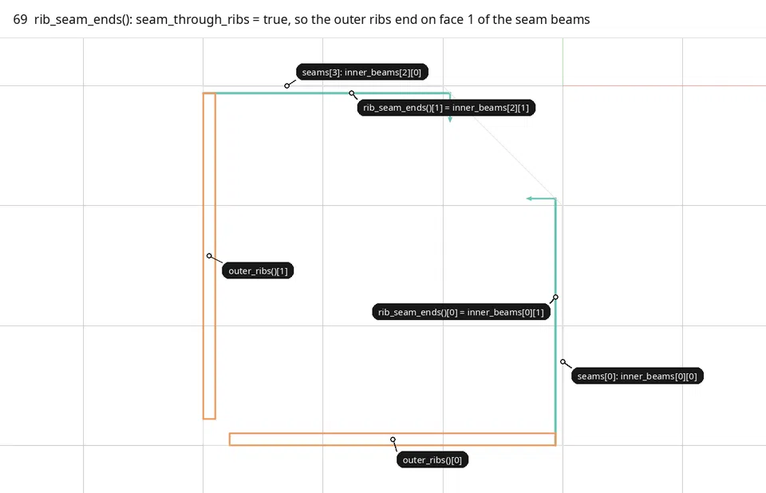

Every call of `outer_ribs()` or `inner_ribs()` runs these steps; nothing is cached.

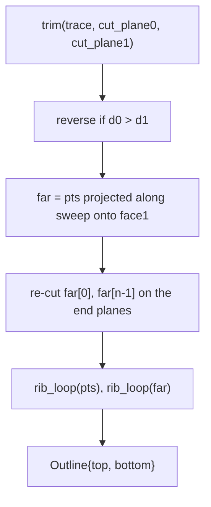

## 69. rib_seam_ends

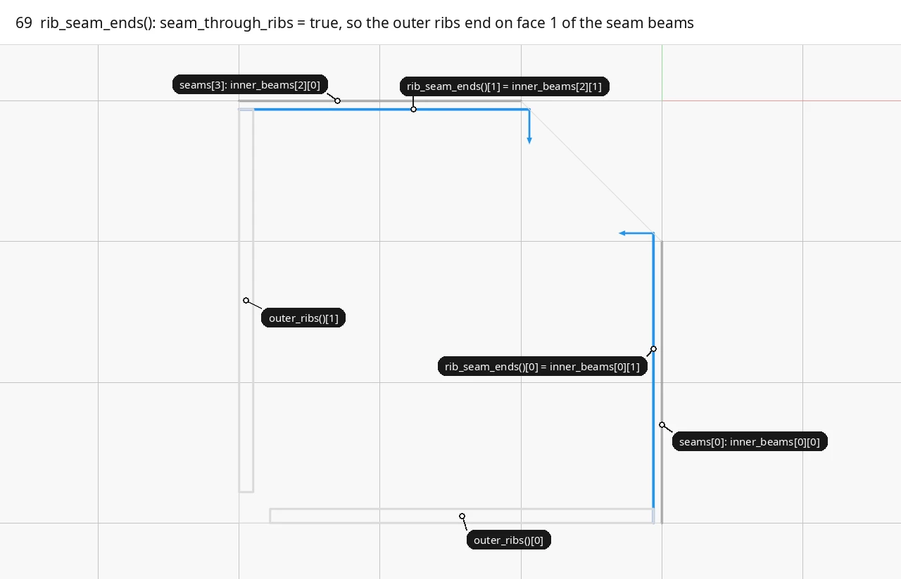
■ built `rib_seam_ends()[0]`, `rib_seam_ends()[1]`   ■ input `seams[k]`: `inner_beams[0][0]`, `inner_beams[2][0]`   ■ context quarter 0, `outer_ribs()[0]`, `outer_ribs()[1]`

`Quarter::rib_seam_ends()` picks the plane each outer rib ends on: with the default `seam_through_ribs = true` it is face 1 of the seam beam, so the rib stops 60 mm short of the seam. With `seam_through_ribs = false` (the tied variant) it is face 0, the seam plane itself.

Code: `Quarter::rib_seam_ends`, [floor_members.cpp:69-75](https://github.com/petrasvestartas/wood/blob/79d4d5c74fdbb4c7b474b2df14efe7f6c7b72e2f/src/templates/floor/floor_members.cpp#L69-L75).

## 70. rib(): trim and orient

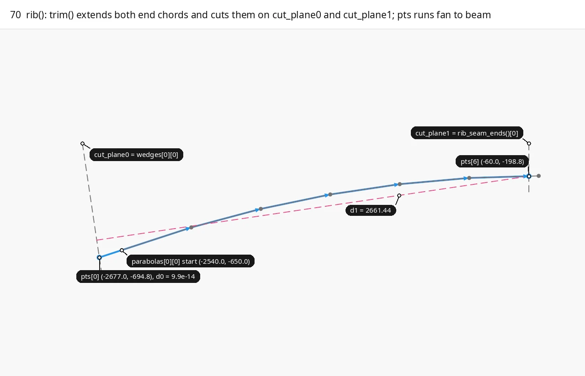
■ built `pts`, `pts[0]`, `pts[6]`   ■ variable `EXTENSION`: the first chord run on to the fan, `d1`   ■ input `trace` = `parabolas[0][0]`, `cut_plane0` = `wedges[0][0]`, `cut_plane1` = `rib_seam_ends()[0]`

`trim` extends both end chords by `EXTENSION` = 1000 mm and cuts them on `cut_plane0` and `cut_plane1`, so outer rib 0 is 694.8 deep at the column, not `height` = 650. The points are reversed if `d0 > d1`, so `pts[0]` is always on the fan plane; in the default bay this never fires.

Code: `rib`, [floor_members.cpp:37-42](https://github.com/petrasvestartas/wood/blob/79d4d5c74fdbb4c7b474b2df14efe7f6c7b72e2f/src/templates/floor/floor_members.cpp#L37-L42); `trim`, [floor_geometry.cpp:69-80](https://github.com/petrasvestartas/wood/blob/79d4d5c74fdbb4c7b474b2df14efe7f6c7b72e2f/src/templates/floor/floor_geometry.cpp#L69-L80).

## 71. rib(): sweep to the second face

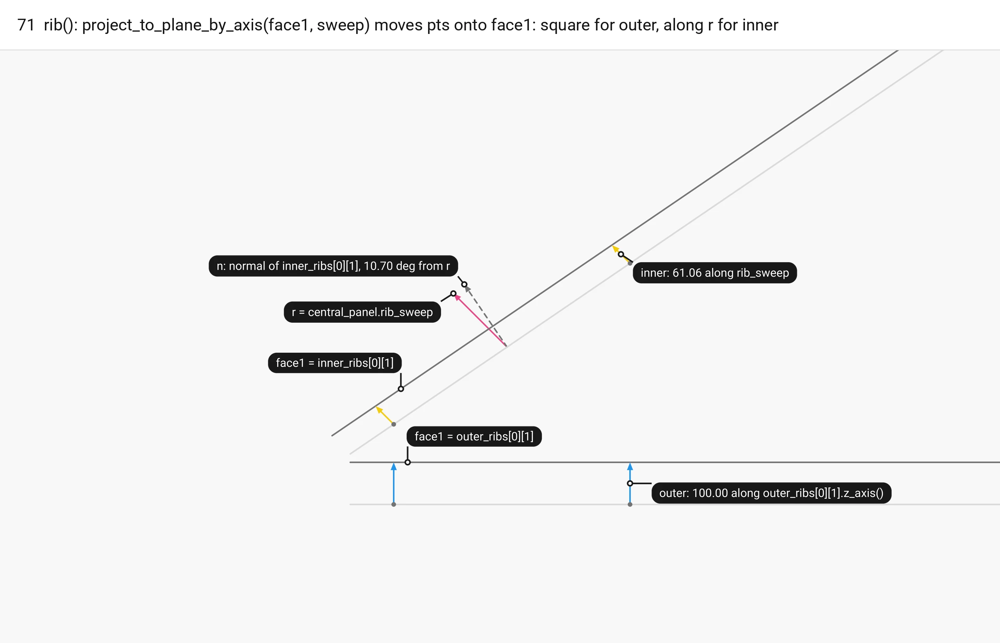
■ built outer rib 0: `pts` to `far` along `outer_ribs[0][1].z_axis()`   ■ result inner rib 0: `pts` to `far` along r   ■ variable r = `central_panel.rib_sweep`   ■ input `pts`, `face1` = `outer_ribs[0][1]`, `inner_ribs[0][1]`, n (dashed)   ■ context base face datum edges

`far` is `pts` projected along `sweep` onto `face1`: square to the rib (100 mm) for an outer rib, and along the shared `central_panel.rib_sweep` r for both inner ribs. r is 10.70 degrees off the inner rib normal, so each point moves 61.06 mm and the two face loops are sheared 11.34 mm along the rib (`rib_shear_mm`).

Code: `rib`, [floor_members.cpp:44-48](https://github.com/petrasvestartas/wood/blob/79d4d5c74fdbb4c7b474b2df14efe7f6c7b72e2f/src/templates/floor/floor_members.cpp#L44-L48).

## 72. rib(): re-cut far end facets

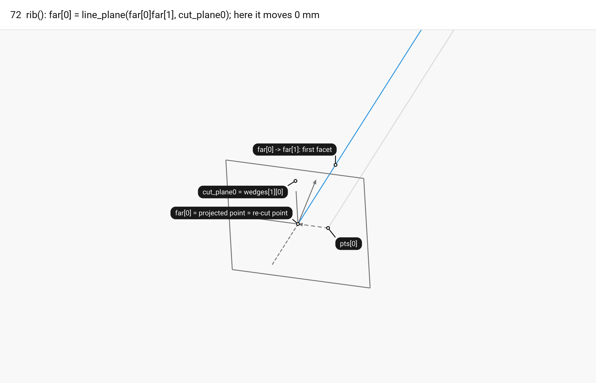
■ built `far[0] -> far[1]`, the first facet   ■ variable `far[0]`, the re-cut point   ■ input `cut_plane0` = `wedges[1][0]`, the projection and the facet run on (dashed)   ■ context `pts[0] -> pts[1]`

`far[0]` and `far[n-1]` are re-cut with `line_plane` on `cut_plane0` and `cut_plane1`, so the end facets of the second face reach the end planes. In the default bay no sweep has a component along an end-plane normal, so both points come back unchanged; the step matters only in skewed bays.

Code: `rib`, [floor_members.cpp:50-52](https://github.com/petrasvestartas/wood/blob/79d4d5c74fdbb4c7b474b2df14efe7f6c7b72e2f/src/templates/floor/floor_members.cpp#L50-L52).

## 73. rib_loop: rib_plane and p0

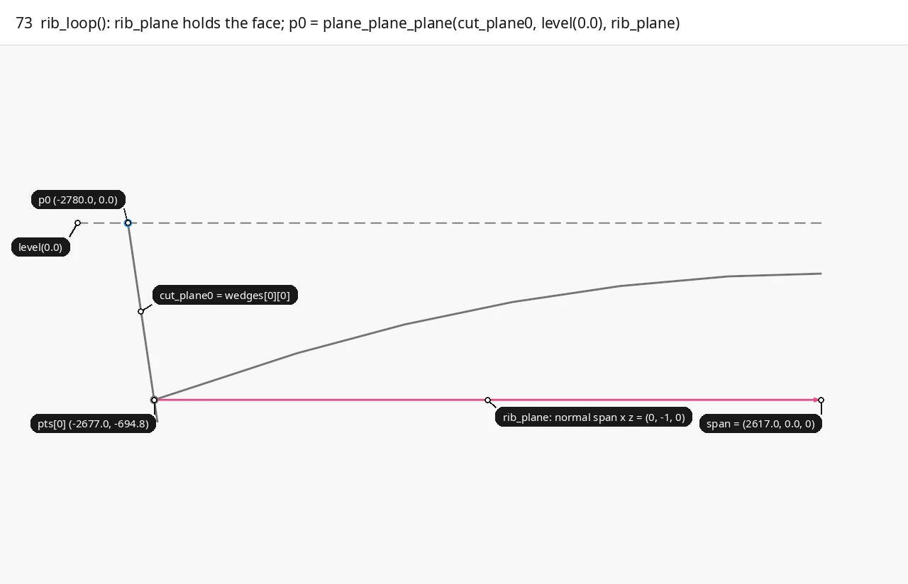
■ built `p0`   ■ variable `span`   ■ input `pts`, `cut_plane0` = `wedges[0][0]`, `level(0.0)` (dashed)

`rib_loop` runs on `pts` and on `far` and sets `p0 = plane_plane_plane(cut_plane0, level(0.0), rib_plane)`, the top corner of the column end, which lies 103 mm nearer the column than `pts[0]` because the fan plane leans 8.4 degrees.

Code: `rib_loop`, [floor_members.cpp:19-21](https://github.com/petrasvestartas/wood/blob/79d4d5c74fdbb4c7b474b2df14efe7f6c7b72e2f/src/templates/floor/floor_members.cpp#L19-L21).

## 74. rib_loop: p1 and the closed 10-point loop

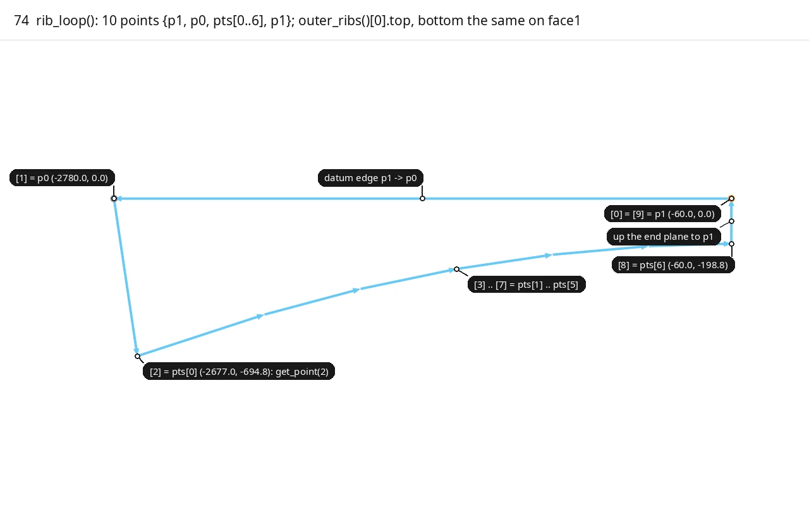
■ built `outer_ribs()[0].top`, the 10-point loop   ■ variable `p1`   ■ input `p0`

`p1` is the trace's last point dropped to the datum (slid onto `cut_plane1` for inner ribs), and the loop is `{p1, p0, pts[0], ..., pts[n-1], p1}`, 10 points. `rib` returns `Outline{top, bottom}` with vertex i of one loop facing vertex i of the other; `to_rib` reads vertices 2 to 8 as the soffit stations.

Code: `rib_loop`, [floor_members.cpp:22-31](https://github.com/petrasvestartas/wood/blob/79d4d5c74fdbb4c7b474b2df14efe7f6c7b72e2f/src/templates/floor/floor_members.cpp#L22-L31); `rib`, [floor_members.cpp:54](https://github.com/petrasvestartas/wood/blob/79d4d5c74fdbb4c7b474b2df14efe7f6c7b72e2f/src/templates/floor/floor_members.cpp#L54); `to_rib`, [floor_elements.cpp:29-56](https://github.com/petrasvestartas/wood/blob/79d4d5c74fdbb4c7b474b2df14efe7f6c7b72e2f/src/templates/floor/floor_elements.cpp#L29-L56).

## 75. Outer rib outlines

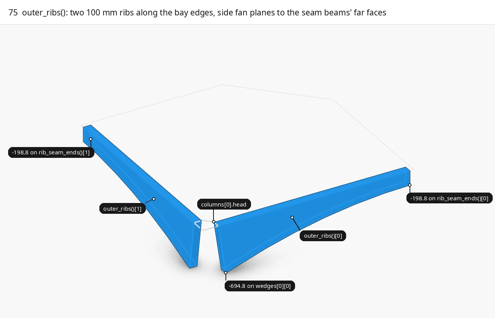
■ built `outer_ribs()[0]`, `outer_ribs()[1]`   ■ context quarter 0, `columns[0].head`

`Quarter::outer_ribs()` builds two 100 mm bands from `parabolas[0][0]` and `parabolas[1][0]`, each running from its side fan plane at the column head to the seam beam's far face, 694.8 deep at the column and 198.8 at the seam end.

Code: `Quarter::outer_ribs`, [floor_members.cpp:57-67](https://github.com/petrasvestartas/wood/blob/79d4d5c74fdbb4c7b474b2df14efe7f6c7b72e2f/src/templates/floor/floor_members.cpp#L57-L67).

## 76. Inner rib outlines

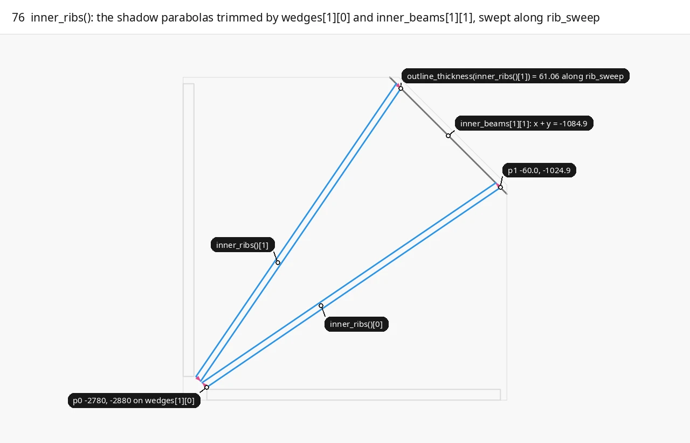
■ built `inner_ribs()[0]`, `inner_ribs()[1]`   ■ variable `outline_thickness` = 61.06 along r, at both ends   ■ input `inner_beams[1][1]`   ■ context quarter 0, `outer_ribs()`

`Quarter::inner_ribs()` traces the shadow parabolas `parabolas[2 + k][0]` from the chamfer fan plane `wedges[1][0]` to the oculus beam back face `inner_beams[1][1]` (x + y = -1084.9), with the same z profile as the outer ribs. Swept along r rather than square, each strip is 61.06 mm wide along r.

Code: `Quarter::inner_ribs`, [floor_members.cpp:77-87](https://github.com/petrasvestartas/wood/blob/79d4d5c74fdbb4c7b474b2df14efe7f6c7b72e2f/src/templates/floor/floor_members.cpp#L77-L87).

## 77. rib_bottom_level -> levels[1]

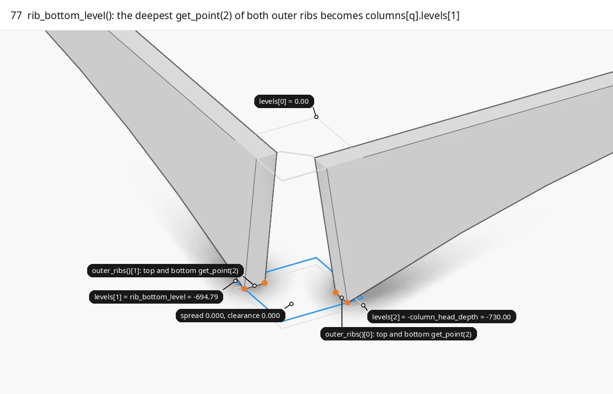
■ built `levels[1]` = `rib_bottom_level`   ■ variable `top.get_point(2)`, `bottom.get_point(2)` of each outer rib   ■ input `outer_ribs()`   ■ context `levels[0]`, `levels[2]`, `columns[0].head`

`columns[q].levels[1] = rib_bottom_level(quarter(q))` is the deepest outer rib soffit corner on the fan plane (-694.7934), the middle level of `column_cutters()`. The minimum starts at 0, so a rib bottom above the datum gives 0; the report checks `rib_bottom_clearance_mm` and `rib_level_spread_mm` do not affect `ok()`.

Code: `rib_bottom_level`, [floor.cpp:375-384](https://github.com/petrasvestartas/wood/blob/79d4d5c74fdbb4c7b474b2df14efe7f6c7b72e2f/src/templates/floor/floor.cpp#L375-L384), written at [floor.cpp:458-459](https://github.com/petrasvestartas/wood/blob/79d4d5c74fdbb4c7b474b2df14efe7f6c7b72e2f/src/templates/floor/floor.cpp#L458-L459); report [floor_report.cpp:97-106](https://github.com/petrasvestartas/wood/blob/79d4d5c74fdbb4c7b474b2df14efe7f6c7b72e2f/src/templates/floor/floor_report.cpp#L97-L106), [165](https://github.com/petrasvestartas/wood/blob/79d4d5c74fdbb4c7b474b2df14efe7f6c7b72e2f/src/templates/floor/floor_report.cpp#L165).

## 78. soffit: -static_h and outer end_level

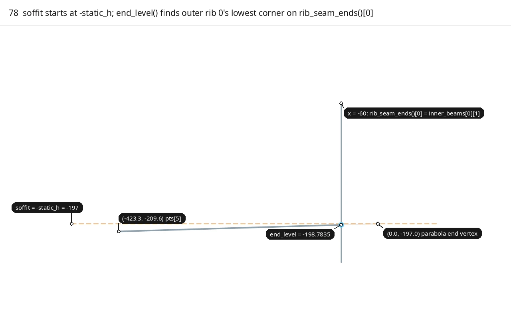
■ built `end_level` = -198.7835   ■ variable `soffit` = `-static_h` = -197   ■ input `rib_seam_ends()[0]`, the last chord of `outer_ribs()[0]`   ■ context the parabola's last chord and end vertex

The common `soffit` starts at `-static_h()` = -197 and is lowered by `end_level`, the lowest outline point within 1e-6 of the end plane: outer ribs stop 60 mm before the parabola vertex, on its last chord, so `end_level` = -198.7835. If no point lies on the plane, `end_level` silently returns 0.

Code: `FloorGuide::compute`, [floor.cpp:461-469](https://github.com/petrasvestartas/wood/blob/79d4d5c74fdbb4c7b474b2df14efe7f6c7b72e2f/src/templates/floor/floor.cpp#L461-L469); `end_level`, [floor_geometry.cpp:168-178](https://github.com/petrasvestartas/wood/blob/79d4d5c74fdbb4c7b474b2df14efe7f6c7b72e2f/src/templates/floor/floor_geometry.cpp#L168-L178); `signed_distance`, [floor_geometry.cpp:164-166](https://github.com/petrasvestartas/wood/blob/79d4d5c74fdbb4c7b474b2df14efe7f6c7b72e2f/src/templates/floor/floor_geometry.cpp#L164-L166).

## 79. Inner end_level and the final soffit

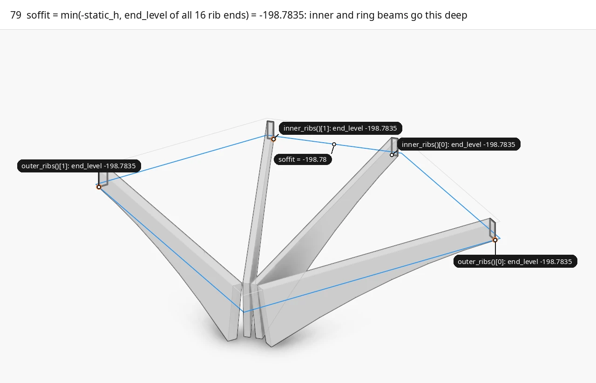
■ built `soffit` = -198.7835   ■ variable `end_level` of each rib end   ■ input end faces of `outer_ribs()[k]`, `inner_ribs()[k]`   ■ context quarter 0, the rib base loops

Inner ribs end at x = -60 with the outer z profile, so their `end_level` on `inner_beams[1][1]` is also -198.7835; `soffit` is the minimum of all sixteen end levels, and every seam beam, oculus beam and ring is built down to it.

Code: `FloorGuide::compute`, [floor.cpp:461-470](https://github.com/petrasvestartas/wood/blob/79d4d5c74fdbb4c7b474b2df14efe7f6c7b72e2f/src/templates/floor/floor.cpp#L461-L470); `Quarter::inner_ribs`, [floor_members.cpp:77-87](https://github.com/petrasvestartas/wood/blob/79d4d5c74fdbb4c7b474b2df14efe7f6c7b72e2f/src/templates/floor/floor_members.cpp#L77-L87).

## 80. Guide drawing: plan groups

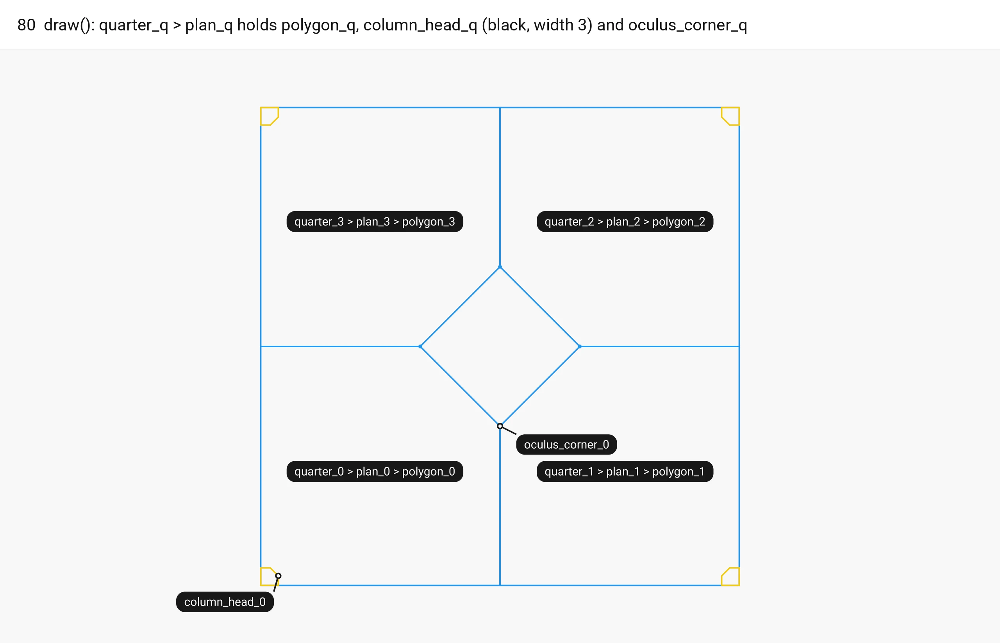
■ built `polygon_q`, `oculus_corner_q`   ■ result `column_head_q`

`draw()` runs last and computes nothing new: for each quarter it adds the group `quarter_q` with `plan_q`, holding `polygon_q`, `column_head_q` and `oculus_corner_q`.

Code: `FloorGuide::draw`, [floor_plan.cpp:50-70](https://github.com/petrasvestartas/wood/blob/79d4d5c74fdbb4c7b474b2df14efe7f6c7b72e2f/src/templates/floor/floor_plan.cpp#L50-L70); `add_group`, [floor_models.cpp:128-133](https://github.com/petrasvestartas/wood/blob/79d4d5c74fdbb4c7b474b2df14efe7f6c7b72e2f/src/templates/floor/floor_models.cpp#L128-L133).

## 81. Guide drawing: member families (example 1)

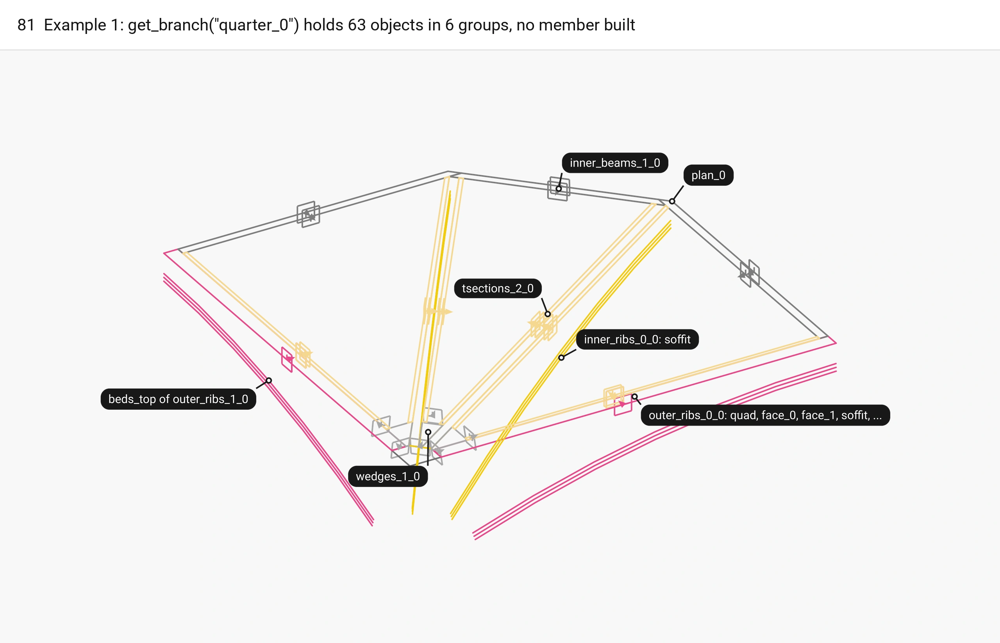
■ outer_ribs `outer_ribs_0`   ■ inner_ribs `inner_ribs_0`   ■ inner_beams `inner_beams_0`   ■ wedges `wedges_0`   ■ tsections `tsections_0`   ■ column `column_head_0`   ■ context `polygon_0`

Each member of the five families gets a group `<name>_i_q` with its plan `quad` and planes `face_0`, `face_1`; rib groups also get `soffit`, `tsections_top` and `beds_top`, and the beds are not drawn. Example 1's `get_branch("quarter_0")` holds 63 objects in 6 groups.

Code: `FloorGuide::draw`, [floor_plan.cpp:72-104](https://github.com/petrasvestartas/wood/blob/79d4d5c74fdbb4c7b474b2df14efe7f6c7b72e2f/src/templates/floor/floor_plan.cpp#L72-L104); example [templates_floor_1_floorguide.cpp:10-13](https://github.com/petrasvestartas/wood/blob/79d4d5c74fdbb4c7b474b2df14efe7f6c7b72e2f/examples/templates_floor_1_floorguide.cpp#L10-L13).
