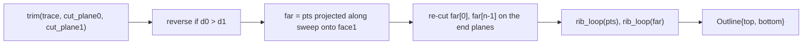
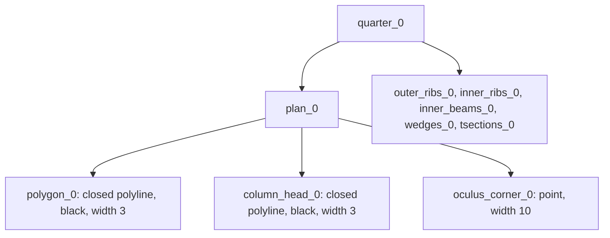

# Floor 05: Rib outlines, levels and the guide's drawing {#templates_floor_05_rib_outlines}

This chapter turns each rib's soffit trace into a closed member outline, then runs the last three passes of the `FloorGuide` constructor. The outline is built by the static `rib()` and `rib_loop()` in `floor_members.cpp`, called from `Quarter::outer_ribs()` and `Quarter::inner_ribs()`. The constructor passes, in `floor.cpp`, are `rib_bottom_level` into `columns[q].levels[1]`, the common beam `soffit`, and `draw()`.
From chapter 04 it takes the four parabolas `parabolas[k][0]`, the planes in `geometry[q].planes` and `central_panel.rib_sweep`. To the next chapters it gives the rib outlines (which `to_rib` turns into elements), the middle column cutter level `levels[1]` and the `soffit` level that every inner beam and ring beam goes down to.

The steps run in this order for every call of `outer_ribs()` or `inner_ribs()`. Nothing is cached: the constructor calls `outer_ribs()` twice per quarter, once in `rib_bottom_level` and once for the soffit, and `inner_ribs()` once.

## 69. rib_seam_ends

Before the outer ribs can be trimmed, `Quarter::rib_seam_ends()` picks the plane each one ends on at its seam. It sets `face = parameters().seam_through_ribs ? 1 : 0` and returns `{cp.inner_beams[0][face], cp.inner_beams[2][face]}`. Face 0 of a seam beam is the seam plane itself (`Seam::faces_into(q)[0]`). Face 1 is that plane offset by `inner_beams` = 60 into the quarter. With the default `seam_through_ribs = true`, the seam beams run on through the outer rib band to the bay edge, so each outer rib stops 60 mm short of the seam, on the far face of the seam beam. Both end planes keep the normal of their seam plane, which points into the quarter, away from the seam: `pair` offsets face 1 along it, so x = -60 has normal (-1, 0, 0) and y = -60 has (0, -1, 0) in quarter 0. With `seam_through_ribs = false` (the tied variant) the ribs run to the seam plane itself.

| Variable | Value | Meaning |
|---|---|---|
| `seam_through_ribs` | true | Selects face 1 (beam far face) instead of face 0 (seam plane) |
| `inner_beams` | 60.0 | Seam beam thickness, the offset of face 1 |
| `face` | 1 | Index into each `cp.inner_beams` pair |
| `rib_seam_ends()[0]` | `cp.inner_beams[0][1]`: x = -60, normal (-1, 0, 0) | End plane of outer rib 0 |
| `rib_seam_ends()[1]` | `cp.inner_beams[2][1]`: y = -60, normal (0, -1, 0) | End plane of outer rib 1 |

Code: `Quarter::rib_seam_ends`, floor_members.cpp:69-75.

## 70. rib(): trim and orient

`rib()` starts with `pts = trim(trace, cut_plane0, cut_plane1).get_points()`. `trim` (floor_geometry.cpp:73-82) pushes the first and the last point of the 7-point Bezier outward along their end chords by `EXTENSION` = 1000 mm. It then cuts the polyline by `cut_plane0` and then by `cut_plane1` with `Polyline::cut_by_plane`, each time keeping the side that holds the point at half the polyline's length. For outer rib 0 the trace starts at the run-in point (-2540, -3000, -650). Its first chord, extended, meets the tilted side fan plane `wedges[0][0]` at (-2677.0, -3000, -694.8). So the Bezier start point is dropped, and the rib is 694.8 deep at the column, not `height` = 650. At the other end the extension goes past x = 0, and the cut on x = -60 brings the end back inside the last chord, at (-60, -3000, -198.8). The point count stays 7.
`rib()` then orients the trace. `d0` and `d1` are the unsigned distances of `pts.front()` and `pts.back()` from `cut_plane0`, and if `d0 > d1` the points are reversed. After this, `pts[0]` is always on the fan plane and `pts[n-1]` on the beam plane. In the default bay every trace already runs from the column to the seam, so the reversal never fires.

| Variable | Value | Meaning |
|---|---|---|
| `trace` | `parabolas[0][0]`, `[1][0]` (outer); `parabolas[2][0]`, `[3][0]` (inner, the shadows) | The soffit trace on the rib's base face |
| `cut_plane0` | outer: `wedges[0][0]` / `wedges[2][0]`; inner: `wedges[1][0]` | The column fan plane; `wedges[0][0]` has normal (0.989, 0, 0.147) |
| `cut_plane1` | outer: `rib_seam_ends()[k]`; inner: `inner_beams[1][1]` | The beam plane the rib ends on |
| `EXTENSION` | 1000.0 | How far `trim` pushes both end points out before cutting |
| `pts` (outer rib 0) | (-2677.0, -694.8) (-2116.7, -511.6) (-1693.3, -398.3) (-1270.0, -310.3) (-846.7, -247.3) (-423.3, -209.6) (-60.0, -198.8), all at y = -3000 | Trimmed soffit, given as (x, z) |
| `pts` (inner rib 0) | (-2677.0, -2809.7, -694.8) ... (-60.0, -1024.9, -198.8) | Trimmed shadow parabola on `inner_ribs[0][0]` |
| `d0` | 3.7e-14 | Distance of `pts.front()` from `cut_plane0` (outer rib 0) |
| `d1` | 2661.44 | Distance of `pts.back()` from `cut_plane0` (outer rib 0) |

Code: `rib`, floor_members.cpp:37-42; `trim`, floor_geometry.cpp:73-82.

## 71. rib(): sweep to the second face

The second face of the rib is reached by projection. `projection = Xform::project_to_plane_by_axis(face1, sweep)` moves every point of `pts` along `sweep` until it lands on `face1`, and the result is `far`. For an outer rib, `sweep` is the normal of its own second face, `cp.outer_ribs[k][1].z_axis()`, so `far` is `pts` moved 100 mm square to the rib, onto y = -2900 for rib 0. Both inner ribs use the one sweep of the central panel, `central_panel.rib_sweep` = r (rule A, chapter 04). That sweep is 10.70 degrees off each inner rib's normal, so each point moves `inner_ribs / |n . r|` = 60 / cos 10.70 deg = 61.06 mm along r, which is (-43.18, +43.18, 0). Each far point is therefore its base point shifted along the rib as well as across it: in plan the inner rib's two face loops are sheared against each other, `inner_ribs * tan 10.70` = 11.34 mm along the rib (`rib_shear_mm`). The frame shows the first two stations of outer rib 0 and inner rib 0 at the column end.

| Variable | Value | Meaning |
|---|---|---|
| `projection` | `Xform::project_to_plane_by_axis(face1, sweep)` | Moves a point along `sweep` onto `face1` |
| `face1` | `cp.outer_ribs[k][1]` or `cp.inner_ribs[k][1]` | The rib's second face |
| `sweep` | outer 0: (0, 1, 0), outer 1: (1, 0, 0); inner: `rib_sweep` = (-0.70711, 0.70711, 0) | Projection direction |
| `outer_ribs` | 100.0 | Outer rib thickness, the outer sweep distance |
| `inner_ribs` | 60.0 | Inner rib thickness, measured along the normal |
| `central_panel.obliqueness[k]` | 10.70 deg | Angle between r and the inner rib normal |
| `far` (outer rib 0) | (-2677.0, -2900, -694.8) ... (-60.0, -2900, -198.8) | The trace on face y = -2900 |
| `far` (inner rib 0) | (-2720.2, -2766.6, -694.8) ... (-103.2, -981.7, -198.8) | The trace on the central face `inner_ribs[0][1]` |

Code: `rib`, floor_members.cpp:44-48.

## 72. rib(): re-cut far end facets

A point projected along `sweep` need not lie on a tilted end plane. To fix this, `rib()` replaces the two end points of `far`: `far[0] = line_plane(Line(far[0], far[1]), cut_plane0)` and `far[n-1] = line_plane(Line(far[n-2], far[n-1]), cut_plane1)`. This runs the first and last facets of the second face on to the end planes (R4 in the comment on `rib`). In the default bay no sweep has a component along either of its end-plane normals. For outer rib 0, (0, 1, 0) against the fan normal (0.989, 0, 0.147) and against the end plane normal (-1, 0, 0); for the inner ribs, r against the chamfer fan normal (0.696, 0.696, 0.174) and against the oculus back face normal (-0.707, -0.707, 0): all give a dot product of 0. So both re-cuts return the projected points unchanged, and the step matters only in skewed bays. The frame shows the column end of inner rib 0: the projected point and the re-cut point are the same.

| Variable | Value | Meaning |
|---|---|---|
| `n` | 7 | `far.size()` |
| `far[0]` | outer 0: (-2677.0, -2900, -694.8); inner 0: (-2720.2, -2766.6, -694.8) | Far end on the fan plane, unchanged here |
| `far[n-1]` | outer 0: (-60, -2900, -198.8); inner 0: (-103.2, -981.7, -198.8) | Far end on the beam plane, unchanged here |

Code: `rib`, floor_members.cpp:50-52.

## 73. rib_loop: rib_plane and p0

`rib_loop(pts, cut_plane0, cut_plane1, inner)` closes one face trace into a loop. It runs once on `pts` and once on `far`. First it takes `span`, the plan vector from the first to the last trace point (z set to 0). It builds `rib_plane = Plane::from_point_normal(pts.front(), span x (0, 0, 1))`, the vertical plane that holds this face's trace. Then `p0 = plane_plane_plane(cut_plane0, level(0.0), rib_plane)`: the point where the fan plane, the datum z = 0 and the face's vertical plane meet. This is the top corner of the rib's column end. The side fan plane `wedges[0][0]` stands on the head edge x = -2780 at the datum and leans 8.4 degrees from vertical (normal (0.989, 0, 0.147)), parallel to the crease of the chamfer plane, tilted by `wedge_plane_angle`, with inner rib 0's central face (floor.cpp:146-159). So `p0` lies 103 mm nearer the column than the soffit end `pts[0]`.

| Variable | Value | Meaning |
|---|---|---|
| `span` | outer 0 base face: (2617.0, 0, 0) | Plan chord of the face trace |
| `rib_plane` | outer 0: y = -3000 (base), y = -2900 (far), normal (0, -1, 0) | Vertical plane of the face |
| `p0` | outer 0: (-2780, -3000, 0) base, (-2780, -2900, 0) far; inner 0: (-2780, -2880, 0) base, (-2823.2, -2836.8, 0) far | Top corner of the column end |
| `wedge_plane_angle` | -10.0 deg | Lean of the chamfer fan plane; the side fan planes follow its crease with the inner ribs' central faces |

Code: `rib_loop`, floor_members.cpp:19-21.

## 74. rib_loop: p1 and the closed 10-point loop

`p1` starts as the trace's last point dropped to the datum, `(pts.back().x, pts.back().y, 0)`. For an inner rib (`inner = true`) it is replaced by `line_plane(Line(p0, p1), cut_plane1)`, which slides it along the face's datum edge onto the end plane. For the inner ribs `cut_plane1` is the vertical back face `inner_beams[1][1]` and `pts.back()` already lies on it, so in this guide the slide returns the same point. The loop is `{p1, p0, pts[0], ..., pts[n-1], p1}`: along the datum from the beam end to the column end, down the fan plane to the soffit, along the soffit, and up the end plane back to `p1`. With 7 trace points that is 10 points, the last one repeating the first. `rib` returns `Outline{rib_loop(pts, ...), rib_loop(far, ...)}`: `top` is the base face loop and `bottom` the swept face loop, with vertex i of one facing vertex i of the other. `get_point(2)` of either loop is the soffit corner on the fan plane, which is what the next steps read. Later `to_rib` (floor_elements.cpp:29-56) reads vertices 2 to 8 as the 7 soffit stations, and vertices 1 (`p0`) and 0 (`p1`) as the tops of the first and last station.

| Variable | Value | Meaning |
|---|---|---|
| `inner` | false (outer ribs), true (inner ribs) | Whether `p1` slides onto `cut_plane1` |
| `p1` | outer 0: (-60, -3000, 0); inner 0: (-60, -1024.9, 0) base, (-103.2, -981.7, 0) far | Top corner at the beam end |
| `outer_ribs()[0].top` | (-60,-3000,0) (-2780,-3000,0) (-2676.996,-3000,-694.793) (-2116.667,-3000,-511.583) (-1693.333,-3000,-398.333) (-1270,-3000,-310.25) (-846.667,-3000,-247.333) (-423.333,-3000,-209.583) (-60,-3000,-198.783) (-60,-3000,0) | Base face loop of outer rib 0 |
| `outer_ribs()[0].bottom` | the same x and z at y = -2900 | Second face loop |
| `inner_ribs()[0].top` | (-60,-1024.9,0) (-2780,-2880,0) (-2677.0,-2809.7,-694.8) ... | Base face loop of inner rib 0 |
| `inner_ribs()[0].bottom` | (-103.2,-981.7,0) (-2823.2,-2836.8,0) (-2720.2,-2766.6,-694.8) ... | Central face loop of inner rib 0 |

Code: `rib_loop`, floor_members.cpp:22-31; `rib`, floor_members.cpp:54; `to_rib`, floor_elements.cpp:29-56.

## 75. Outer rib outlines

`Quarter::outer_ribs()` makes the two calls. Rib 0 is `rib(parabolas[0][0], cp.outer_ribs[0][1], cp.outer_ribs[0][1].z_axis(), cp.wedges[0][0], ends[0], false)`. Rib 1 is the same with `parabolas[1][0]`, `outer_ribs[1][1]`, `wedges[2][0]` and `ends[1]`, where `ends = rib_seam_ends()`. Each rib is a 100 mm band inside its bay edge. It runs from its side fan plane at the column head (x = -2780 at the top, -2677 at the soffit) to the seam beam's far face (x = -60 or y = -60). The soffit follows the Bezier, extended in straight lines at both ends: 694.8 deep at the column and 198.8 deep at the seam end. The depth at the column is not `height` = 650: that is the depth at the run-in point, 240 mm from the fan plane's datum trace. The seam end is not at `static_h` = 197 either, because the rib stops 60 mm before the parabola's end vertex, on its last chord.

| Variable | Value | Meaning |
|---|---|---|
| `ends` | `rib_seam_ends()`: x = -60, y = -60 | The end plane of each outer rib |
| `outer_ribs()[0]` | y in [-3000, -2900], x from -2780 (top) / -2677 (soffit) to -60 | Outer rib 0 outline |
| `outer_ribs()[1]` | x in [-3000, -2900], y from -2780 / -2677 to -60 | Outer rib 1, the mirror |
| `height` | 650.0 | Rib depth at the parabola start (the run-in point) |
| `rise` | 453.0 | Parabola rise; `static_h()` = `height - rise` = 197.0 |
| `run_in` | 240, 240 | The run-in of both ribs (equal to `wedge` on the square bay) |

Code: `Quarter::outer_ribs`, floor_members.cpp:57-67.

## 76. Inner rib outlines

`Quarter::inner_ribs()` calls `rib(parabolas[2 + k][0], cp.inner_ribs[k][1], central_panel.rib_sweep, cp.wedges[1][0], cp.inner_beams[1][1], true)` for k = 0, 1. The trace is the shadow of outer parabola k, projected along the outer rib's normal onto the inner rib's base face (chapter 03). So the inner rib has the same z profile as its outer rib at every x (rib 0) or y (rib 1). Both inner ribs start on the middle (chamfer) fan plane `wedges[1][0]`. Rib 0's base face starts at `p0` = (-2780, -2880, 0), which is the chamfer vertex `head[2]`. Both ribs end on the oculus beam's back face `inner_beams[1][1]`, the plane x + y = -1084.9. The second face is reached along the shared sweep r, not square to the rib. So each strip is 61.06 mm wide measured along r, and its two face loops are sheared against each other along the rib.

| Variable | Value | Meaning |
|---|---|---|
| `inner_ribs()[0]` | from (-2780, -2880, 0) at the chamfer to (-60, -1024.9, 0) at the oculus beam | Inner rib 0 base-face top edge |
| `inner_ribs()[1]` | from (-2880, -2780, 0) to (-1024.9, -60, 0) | Inner rib 1, the mirror about x = y |
| `outline_thickness(inner_ribs()[k])` | 61.06 | Distance between the two loops' area centroids, 60 / cos 10.70 deg |
| `inner_ribs` | 60.0 | Inner rib thickness along the normal |
| `cp.inner_beams[1][1]` | x + y = -1084.9 | Oculus beam back face, the end plane of both inner ribs |

Code: `Quarter::inner_ribs`, floor_members.cpp:77-87.

## 77. rib_bottom_level -> levels[1]

When `compute_quarter` has run for all four quarters, the constructor sets `columns[q].levels[1] = rib_bottom_level(quarter(q))` for each q. These are the first outline calls in the constructor. `rib_bottom_level` builds `quarter.outer_ribs()` and returns the minimum of 0, `rib.top.get_point(2)[2]` and `rib.bottom.get_point(2)[2]` over both outer ribs. This is the deepest outer rib soffit corner on its fan plane, on either face. `column_corner` had left `levels = {0, 0, -column_head_depth}`, so the 0 in `levels[1]` is a placeholder until this pass. `levels[1]` becomes the middle level of `column_cutters()`: the bottom of the three cutter quads on the fan planes and the top of the three below them. The minimum starts at 0, so a rib whose bottom lay above the datum would give 0 rather than its own level.
The report reads these points again. `rib_bottom_clearance_mm[q][k]` is `min(top[2].z, bottom[2].z)` of outer rib k minus `levels[1]`. It is 0 or more by construction, because `levels[1]` is the minimum of those same corners. `rib_level_spread_mm[q]` is the highest less the lowest of the eight values on both faces of both outer and both inner ribs. Neither check affects `ok()`.

| Variable | Value | Meaning |
|---|---|---|
| `columns[q].levels` | {0, -694.7934, -730} | Datum, rib-bottom level, `-column_head_depth` |
| `column_head_depth` | 730.0 | Gives `levels[2]` |
| `rib_bottom_clearance_mm[q][k]` | 0.000 / 0.000 (on 3000 x 2400 `levels[1]` is -689.979) | Outer rib k's bottom above `levels[1]` |
| `rib_level_spread_mm[q]` | 0.000 (square), 0.307 on 3000 x 2400 | Range of the eight rib face bottoms at the head |
| `wedge` | 240.0 | Starting run-in of the solver that levels both outer ribs (chapter 03) |

Code: `rib_bottom_level`, floor.cpp:377-386, written at floor.cpp:427-428; report floor_report.cpp:97-106, 165.

## 78. soffit: -static_h and outer end_level

The constructor starts the common beam soffit at `soffit = -parameters.static_h()` = -197, the depth of every parabola's end vertex at the seam. It then lowers it with `end_level`. `end_level(outline, end)` loops over every point of `outline.top` and `outline.bottom`. It keeps those whose `signed_distance(point, end) = (point - origin) . z_axis` is within 1e-6 of zero, and returns the smallest z among them, starting from 0. For outer rib k the end plane is `rib_seam_ends()[k]`. The rib's last soffit point lies on x = -60, which cuts the last chord (-423.333, -209.583) -> (0, -197) 60 mm before the parabola's end vertex. On that chord the soffit is still 1.78 mm below its end height, so `end_level` = -198.7835. The rib is cut short of the vertex; it is not extended past it. If no point of an outline lay on the plane, `end_level` would silently return 0 and not lower the soffit.

| Variable | Value | Meaning |
|---|---|---|
| `soffit` (initial) | -197.0 | `-static_h()` = -(`height` - `rise`) |
| `end_level(outer[k], rib_seam_ends()[k])` | -198.7835 | Deepest corner of outer rib k on its end plane |
| `1e-6` (literal in `end_level`) | 1e-6 | Distance within which a point counts as on the end plane |

Code: `FloorGuide::FloorGuide`, floor.cpp:430-438; `end_level`, floor_geometry.cpp:125-135; `signed_distance`, floor_geometry.cpp:121-123.

## 79. Inner end_level and the final soffit

For the inner ribs the end plane is the oculus beam's back face, `geometry[q].planes.inner_beams[1][1]`. Rib 0's base face was built through the corner where the seam beam face x = -60 meets that back face (floor.cpp:194-198), so its trace ends at x = -60, like the outer rib's. It has the same z profile as the outer trace, so `end_level(inner[k], inner_beams[1][1])` is also -198.7835. Both loops of the inner rib reach the face: the base face end at (-60, -1024.853) and the central face end at (-103.178, -981.675). The constructor loops over the four quarters and k = 0, 1 and takes `soffit = min(soffit, end_level(outer[k], ...), end_level(inner[k], ...))`, sixteen end levels in all. The seam beams, the oculus beams and the ring are all built down to this level, so every rib end bears on its beam over its full height.

| Variable | Value | Meaning |
|---|---|---|
| `end_level(inner[k], inner_beams[1][1])` | -198.7835 | Deepest inner rib corner on the oculus back face |
| `soffit` | -198.7835 | z of every inner beam and ring beam soffit |

Code: `FloorGuide::FloorGuide`, floor.cpp:430-439; `Quarter::inner_ribs`, floor_members.cpp:77-87.

## 80. Guide drawing: plan groups

`draw()` runs last in the constructor (floor.cpp:441), after `levels[1]` and `soffit`. It computes nothing new: it records the existing guide geometry into the guide's own session tree. For each quarter q it adds the group `quarter_q` at the root and `plan_q` under it. Into `plan_q` it puts the closed polyline `polygon_q` (black, width 3), the closed column head `column_head_q` (black, width 3) and the point `oculus_corner_q` (width 10).

| Variable | Value | Meaning |
|---|---|---|
| `quarter_q` | 4 groups at the root | One per quarter |
| `plan_q` | 3 objects | `polygon_q`, `column_head_q`, `oculus_corner_q` |

Code: `FloorGuide::draw`, floor_plan.cpp:50-70; `add_group`, floor_models.cpp:117-122.

## 81. Guide drawing: member families (example 1)

For the five families `outer_ribs`, `inner_ribs`, `inner_beams`, `wedges` and `tsections`, `draw()` adds the group `<name>_q` under `quarter_q`. For each member i it adds a group `<name>_i_q`, named as the Floor will later name that member's element. Each member group gets the closed plan quad `quad` (family colour, width 2) and the planes `face_0` and `face_1` (`planes[i][0]` and `planes[i][1]`, line colour set to the family colour). The rib groups also get three polylines from `parabolas[parabola + i]`, where `parabola` is the `DrawnFamily` field: `soffit` (width 2), `tsections_top` and `beds_top` (width 1). `parabola` is 0 for `outer_ribs` and 2 for `inner_ribs`, which are the shadows. The other families have `parabola` = -1 and draw no parabola. The beds are not drawn. Example 1 (`templates_floor_1_floorguide`) builds `FloorGuide::rectangle(3000, 3000)` and takes `get_branch("quarter_0")`. No member is built.

| Family | Members | Objects per member | Objects |
|---|---|---|---|
| plan_0 | - | - | 3 (2 polylines, 1 point) |
| outer_ribs | 2 | quad, face_0, face_1, soffit, tsections_top, beds_top | 12 |
| inner_ribs | 2 | the same | 12 |
| inner_beams | 3 | quad, face_0, face_1 | 9 |
| wedges | 3 | quad, face_0, face_1 | 9 |
| tsections | 6 | quad, face_0, face_1 | 18 |
| total | | | 63: 30 polylines, 32 planes, 1 point, in 6 groups |

| Variable | Value | Meaning |
|---|---|---|
| `FAMILY_COLORS` | outer_ribs (0.85, 0.33, 0.10), inner_ribs (0.93, 0.69, 0.13), inner_beams (0.13, 0.55, 0.45), wedges (0.49, 0.18, 0.56), tsections (0.47, 0.67, 0.19) | Colour of each family, floor.h |
| `DrawnFamily::parabola` | 0, 2, -1, -1, -1 | First parabola index per family, -1 for none |
| `session` (example 1) | 63 objects in 6 groups | `get_branch("quarter_0").lookup.size()`, test floor_elements.cpp:600 |

Code: `FloorGuide::draw`, floor_plan.cpp:72-104; example templates_floor_1_floorguide.cpp:10-13.
