# Floor 06: Beam, wedge, flange, bed, oculus and cutter outlines {#templates_floor_06_outlines}

This chapter builds the outlines of every quarter member other than the ribs, plus the oculus and the column cutters. The functions are `Quarter::inner_beams`, `Quarter::wedges`, `Quarter::tsections`, `Quarter::beds`, `FloorGuide::oculus` and `Quarter::column_cutters` in `floor_members.cpp`, together with the helper `geometry::loft_planes` in `floor_geometry.cpp`. Their inputs come from the earlier chapters: the construction planes `cp`, the parabolas and their `+t` / `+2t` offsets, the central panel traces, `bed_top_planes`, `guide.soffit` and the column levels. Each one returns `Outline{top, bottom}` pairs at the datum z 0. Chapter 07 turns those pairs into elements with `to_beam` and `to_plate`, and into the column's solid cuts.

Example: [templates_floor_4_quarters.cpp](https://github.com/petrasvestartas/wood/blob/0c9f4e49b3ac503e917b90c037f43f827533d641/examples/templates_floor_4_quarters.cpp) builds the four quarters, every inner beam, wedge, t-section and bed made from these outlines, [templates_floor_5_oculus.cpp](https://github.com/petrasvestartas/wood/blob/0c9f4e49b3ac503e917b90c037f43f827533d641/examples/templates_floor_5_oculus.cpp) builds the oculus ring, its bottom wedges and the central plate, and [templates_floor_2_column_model.cpp](https://github.com/petrasvestartas/wood/blob/0c9f4e49b3ac503e917b90c037f43f827533d641/examples/templates_floor_2_column_model.cpp) carves column 0's head with quarter 0's six column cutters.

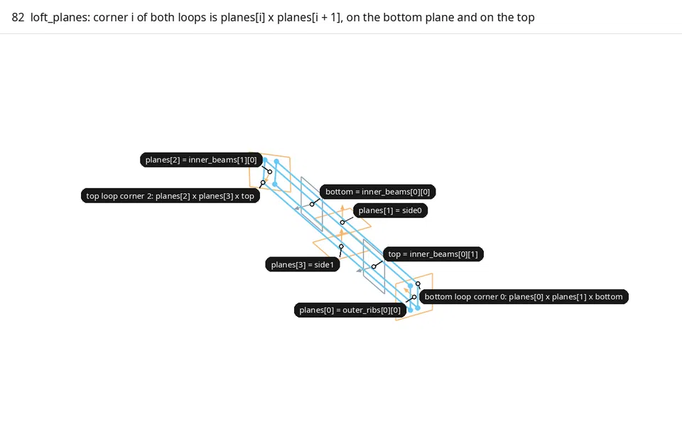

<span style="color:#2196EA">■ built</span> what each step builds   <span style="color:#EB7721">■ variable</span> the variable or value it introduces   <span style="color:#EBB121">■ result</span> a second result, set apart   <span style="color:#455B6B">■ input</span> what it reads from earlier steps, dashed for helpers   <span style="color:#8C969E">■ context</span> everything else

## 82. loft_planes helper


<span style="color:#2196EA">■ built</span> `Outline{top, bottom}` loops and their corners   <span style="color:#EB7721">■ variable</span> `planes[0..3]`, the ring   <span style="color:#455B6B">■ input</span> `bottom = inner_beams[0][0]`, `top = inner_beams[0][1]`   <span style="color:#8C969E">■ context</span> lines joining facing corners

`loft_planes(planes, bottom, top, flip)` takes `n` side planes in ring order and two cap planes. For each `i` it calls `plane_plane_plane(planes[i], planes[(i + 1) % n], bottom)` and the same call with `top`. A corner whose solve returns `nullopt` is skipped without any error, so a degenerate ring returns a loop with fewer corners. The solve returns `nullopt` when the kernel's 3x3 system is not full rank: two of the planes are parallel, or all three share one line. Both corner lists are closed into polylines and returned as <span style="color:#2196EA">`Outline{top loop, bottom loop}`</span>, so corner `i` of one loop faces corner `i` of the other. `flip = true` swaps the two loops. The frame shows the call that builds seam beam 0: ring <span style="color:#EB7721">`{outer_ribs[0][0], side0, inner_beams[1][0], side1}`</span>, bottom <span style="color:#455B6B">`inner_beams[0][0]`</span>, top <span style="color:#455B6B">`inner_beams[0][1]`</span>. Every inner beam, wedge block and oculus piece is built with this function.

| Variable | Value | Meaning |
|---|---|---|
| `planes` | 4 planes for every caller here | Side planes in ring order; face `i` lies between corners `i - 1` and `i` |
| `bottom`, `top` | seam beam 0: x = 0 and x = -60 | The two cap planes the loops lie on |
| `flip` | `false` (`true` only for the ring beams) | Swaps `Outline.top` and `Outline.bottom` |
| `Outline.top` | closed loop on `top` | First outline (floor.h:30) |
| `Outline.bottom` | closed loop on `bottom` | Second outline, vertex `i` facing vertex `i` of `top` (floor.h:31) |

```cpp
// floor_geometry.cpp:210-233
Outline loft_planes(const std::vector<Plane>& planes, const Plane& bottom, const Plane& top, bool flip) {

    const size_t n = planes.size();
    std::vector<Point> pts_bottom;
    std::vector<Point> pts_top;

    for (size_t i = 0; i < n; i++) {
        const std::optional<Point> rb = plane_plane_plane(planes[i], planes[(i + 1) % n], bottom);
        const std::optional<Point> rt = plane_plane_plane(planes[i], planes[(i + 1) % n], top);

        if (rb)
            pts_bottom.push_back(*rb);

        if (rt)
            pts_top.push_back(*rt);
    }

    Outline outline{Polyline(pts_top).closed(), Polyline(pts_bottom).closed()};

    if (flip)
        std::swap(outline.top, outline.bottom);

    return outline;
}
```

Code: `geometry::loft_planes`, [floor_geometry.cpp:210-233](https://github.com/petrasvestartas/wood/blob/0c9f4e49b3ac503e917b90c037f43f827533d641/src/templates/floor/floor_geometry.cpp#L210-L233)

## 83. inner_beams: levels and face choice

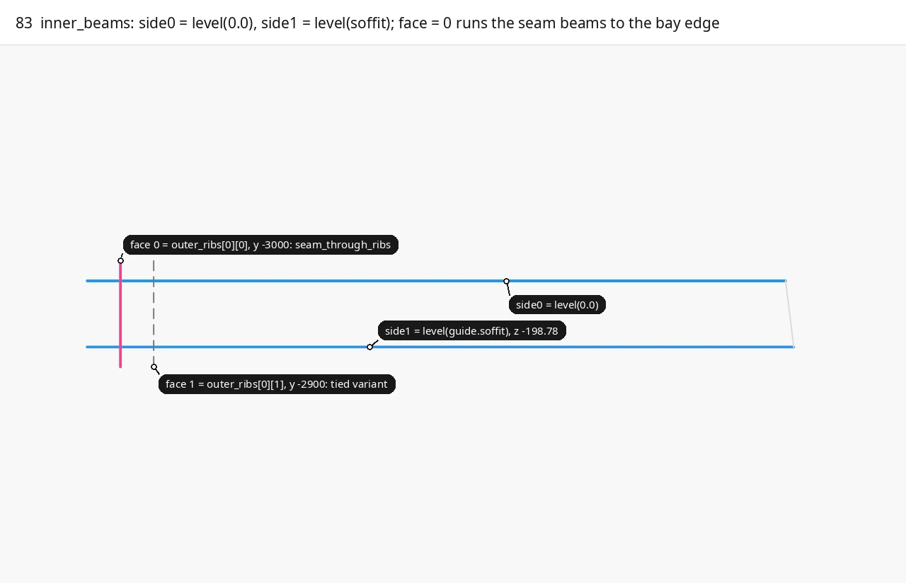

<span style="color:#2196EA">■ built</span> `side0 = level(0.0)`, `side1 = level(guide.soffit)`   <span style="color:#EB7721">■ variable</span> `face = 0`: `outer_ribs[0][0]`   <span style="color:#455B6B">■ input</span> `outer_ribs[0][1]`, the tied variant (dashed)   <span style="color:#8C969E">■ context</span> `inner_beams[1][0]`, the oculus end

`Quarter::inner_beams` starts with two levels: <span style="color:#2196EA">`side0 = level(0.0)`</span>, the beam top, and <span style="color:#2196EA">`side1 = level(guide.soffit)`</span>, the beam soffit. `guide.soffit` is the deepest rib end found after the rib outlines (chapter 05), so every rib end lands fully on its beam. <span style="color:#EB7721">`face = seam_through_ribs ? 0 : 1`</span> picks which outer rib plane closes the seam beams at the bay end. With the default `seam_through_ribs = true`, the beams run through the rib band to the bay edge <span style="color:#EB7721">`outer_ribs[k][0]`</span> (y = -3000). In the tied variant they stop on the rib's inner face <span style="color:#455B6B">`outer_ribs[k][1]`</span> (y = -2900). This is the inverse of `rib_seam_ends`, which makes the outer ribs end on the beams' far faces in the default case.

| Variable | Value | Meaning |
|---|---|---|
| `side0` | z = 0 | Beam top, the datum |
| `side1` | z = -198.7835 | Beam soffit, `level(guide.soffit)` |
| `face` | 0 | Index into `cp.outer_ribs[k]`: 0 = bay edge, 1 = rib inner face |
| `seam_through_ribs` | `true` | Default parameter that selects `face = 0` |

```cpp
// floor_members.cpp:96-98
const Plane side0 = level(0.0);
const Plane side1 = level(guide.soffit);
const size_t face = parameters().seam_through_ribs ? 0 : 1;
```

Code: `Quarter::inner_beams`, [floor_members.cpp:93-98](https://github.com/petrasvestartas/wood/blob/0c9f4e49b3ac503e917b90c037f43f827533d641/src/templates/floor/floor_members.cpp#L93-L98)

## 84. Seam beam 0

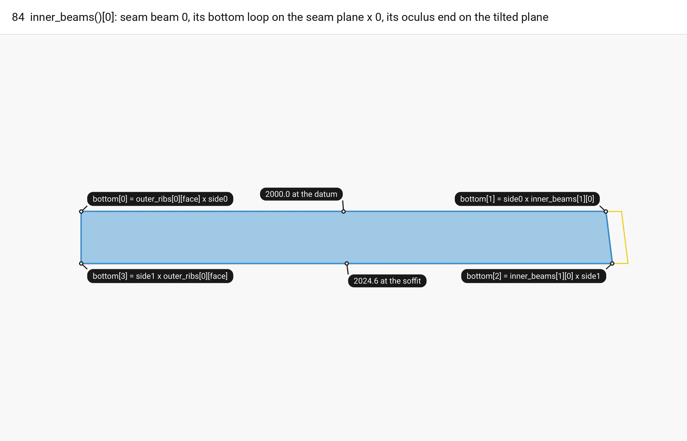

<span style="color:#2196EA">■ built</span> `inner_beams()[0].bottom` on x = 0   <span style="color:#EBB121">■ result</span> `inner_beams()[0].top` on x = -60   <span style="color:#EB7721">■ variable</span> the corners `bottom[0..3]`

Seam beam 0 is `loft_planes({cp.outer_ribs[0][face], side0, cp.inner_beams[1][0], side1}, cp.inner_beams[0][0], cp.inner_beams[0][1])`. The ring runs bay edge, datum, the oculus edge's tilted bearing plane, soffit. <span style="color:#EB7721">The corners</span> are therefore (edge, datum), (datum, tilted), (tilted, soffit) and (soffit, edge). <span style="color:#2196EA">The bottom loop</span> lies on the seam plane x = 0 and <span style="color:#EBB121">the top loop</span> on the beam's far face x = -60. The result is a loft outline, not a box: the oculus end is cut on the plane tilted by 5 degrees, so the face is 2000 long at the datum and 2024.6 long at the soffit. Its soffit corner sits at y = -975.4, 24.6 mm nearer the centre than its top corner at y = -1000.

| Variable | Value | Meaning |
|---|---|---|
| `inner_beams()[0].bottom` | (0,-3000,0) (0,-1000,0) (0,-975.4,-198.8) (0,-3000,-198.8) | Loop on the seam plane `cp.inner_beams[0][0]` |
| `inner_beams()[0].top` | (-60,-3000,0) (-60,-940,0) (-60,-915.4,-198.8) (-60,-3000,-198.8) | Loop on the far face `cp.inner_beams[0][1]`, 2060 long at the datum |
| `oculus_plane_angle` | 5.0 deg | Lean of `cp.inner_beams[1][0]` = `oculus_edges[0].tilted` (floor.cpp:98) |

```cpp
// floor_members.cpp:101
loft_planes({cp.outer_ribs[0][face], side0, cp.inner_beams[1][0], side1}, cp.inner_beams[0][0], cp.inner_beams[0][1]),
```

Code: `Quarter::inner_beams`, [floor_members.cpp:101](https://github.com/petrasvestartas/wood/blob/0c9f4e49b3ac503e917b90c037f43f827533d641/src/templates/floor/floor_members.cpp#L101)

## 85. Oculus beam

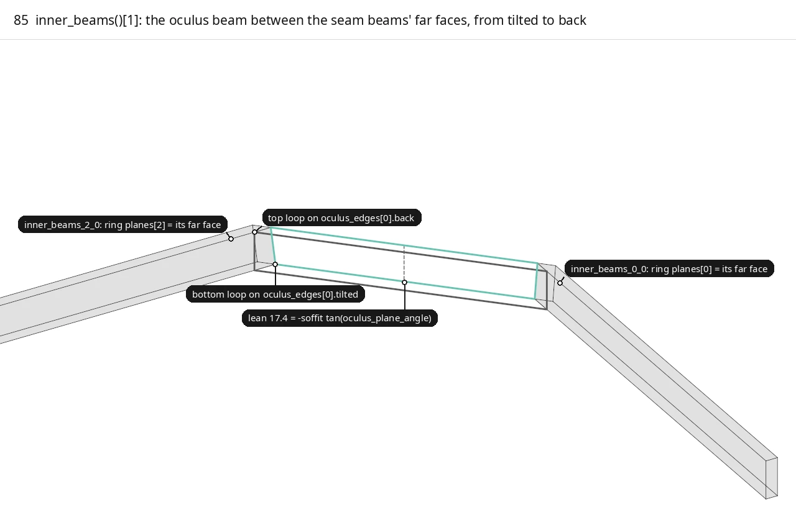

<span style="color:#2196EA">■ built</span> bottom loop on `oculus_edges[0].tilted`   <span style="color:#EBB121">■ result</span> top loop on `oculus_edges[0].back`   <span style="color:#EB7721">■ variable</span> lean 17.4 = `-soffit tan(oculus_plane_angle)`   <span style="color:#455B6B">■ input</span> `inner_beams_0_0`, `inner_beams_2_0` and the drop from the edge centre (dashed)   <span style="color:#8C969E">■ context</span> lines joining facing corners

The oculus beam is `loft_planes({cp.inner_beams[0][1], side0, cp.inner_beams[2][1], side1}, cp.inner_beams[1][0], cp.inner_beams[1][1])`. Its ring is <span style="color:#455B6B">seam beam 0's far face</span>, datum, <span style="color:#455B6B">seam beam 2's far face</span>, soffit, so it fits between the two seam beams. The bottom loop lies on <span style="color:#2196EA">`oculus_edges[0].tilted`</span>, the bearing plane it shares with ring beam 0. The top loop lies on the vertical back face <span style="color:#EBB121">`oculus_edges[0].back`</span>, 60 mm into the quarter, which is also where the inner ribs end. `tilted` is the vertical edge plane turned by `-oculus_plane_angle` about the oculus edge through its centre (floor.cpp:98). Its trace stays on the edge at z 0. Below the datum it moves toward the centre by <span style="color:#EB7721">`-soffit * tan(5 deg)` = 17.4 mm</span> at the soffit, measured square to the edge (24.6 mm along each seam).

| Variable | Value | Meaning |
|---|---|---|
| `inner_beams()[1].top` | (-60,-1024.9,0) (-1024.9,-60,0) (-1024.9,-60,-198.8) (-60,-1024.9,-198.8) | Loop on the back face x + y = -1084.9 |
| `inner_beams()[1].bottom` | (-60,-940,0) (-940,-60,0) (-915.4,-60,-198.8) (-60,-915.4,-198.8) | Loop on the tilted plane |
| `inner_beams` | 60.0 | Offset of `back` from the edge plane |
| lean | 17.4 | Horizontal shift of `tilted` from z 0 to the soffit, square to the edge |

```cpp
// floor_members.cpp:102
loft_planes({cp.inner_beams[0][1], side0, cp.inner_beams[2][1], side1}, cp.inner_beams[1][0], cp.inner_beams[1][1]),

// floor.cpp:96-100
edge.line = Line::from_points(corner, previous);
const Plane plane = edge_plane(edge.line, -Vector::z_axis());
edge.tilted = rotate(plane, -parameters.oculus_plane_angle * M_PI / 180.0, edge.line.to_direction(), edge.line.center());
edge.back = plane.translate_by_normal(parameters.inner_beams);
edge.ring_inner = edge.back.translate_by_normal(-parameters.inner_beams * 2.0);
```

Code: `Quarter::inner_beams`, [floor_members.cpp:102](https://github.com/petrasvestartas/wood/blob/0c9f4e49b3ac503e917b90c037f43f827533d641/src/templates/floor/floor_members.cpp#L102); planes `oculus_edge`, [floor.cpp:92-103](https://github.com/petrasvestartas/wood/blob/0c9f4e49b3ac503e917b90c037f43f827533d641/src/templates/floor/floor.cpp#L92-L103)

## 86. Seam beam 2

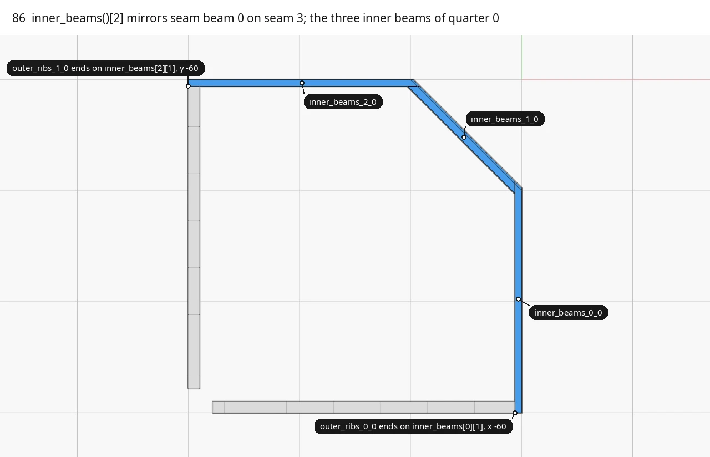

<span style="color:#2196EA">■ built</span> `inner_beams_0_0`, `inner_beams_1_0`, `inner_beams_2_0`   <span style="color:#8C969E">■ context</span> the outer ribs of quarter 0

Seam beam 2 mirrors seam beam 0 on seam 3: `loft_planes({cp.outer_ribs[1][face], side0, cp.inner_beams[1][0], side1}, cp.inner_beams[2][0], cp.inner_beams[2][1])`. Its bottom loop lies on the seam plane y = 0 and its top loop on y = -60. The frame shows <span style="color:#2196EA">all three inner beams of quarter 0</span> in plan, with seam beam 0 on x in [-60, 0] and seam beam 2 on y in [-60, 0]. With `seam_through_ribs` <span style="color:#8C969E">the two outer ribs</span> end on the beams' far faces x = -60 and y = -60.

| Variable | Value | Meaning |
|---|---|---|
| `inner_beams()[2].top` | (-3000,-60,0) (-940,-60,0) (-915.4,-60,-198.8) (-3000,-60,-198.8) | Loop on the far face y = -60 |
| `inner_beams()[2].bottom` | (-3000,0,0) (-1000,0,0) (-975.4,0,-198.8) (-3000,0,-198.8) | Loop on the seam plane y = 0 |
| element names | `inner_beams_0_0`, `inner_beams_1_0`, `inner_beams_2_0` | Seam beam 0, oculus beam, seam beam 2 |

```cpp
// floor_members.cpp:103
loft_planes({cp.outer_ribs[1][face], side0, cp.inner_beams[1][0], side1}, cp.inner_beams[2][0], cp.inner_beams[2][1]),
```

Code: `Quarter::inner_beams`, [floor_members.cpp:103](https://github.com/petrasvestartas/wood/blob/0c9f4e49b3ac503e917b90c037f43f827533d641/src/templates/floor/floor_members.cpp#L103)

## 87. Wedges: bounding rib faces and bed planes

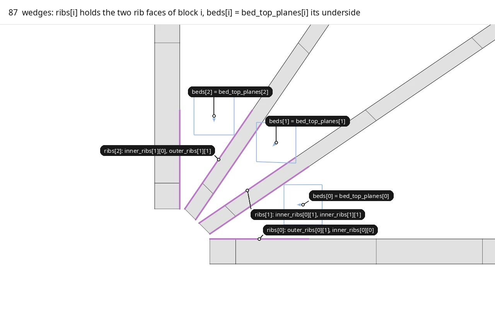

<span style="color:#2196EA">■ built</span> `ribs[0..2]`, the two faces of each block   <span style="color:#455B6B">■ input</span> `beds[i] = bed_top_planes[i]`   <span style="color:#8C969E">■ context</span> the outer and inner ribs

`Quarter::wedges` sets `top = level(0.0)` and <span style="color:#2196EA">`ribs[i]`</span>, the two rib faces that bound block `i`. Block 0 lies in outer panel 0 between <span style="color:#2196EA">`outer_ribs[0][1]`</span> and <span style="color:#2196EA">`inner_ribs[0][0]`</span>. Block 1 lies between the two central faces <span style="color:#2196EA">`inner_ribs[0][1]`</span> and <span style="color:#2196EA">`inner_ribs[1][1]`</span>. Block 2 lies in outer panel 1 between <span style="color:#2196EA">`inner_ribs[1][0]`</span> and <span style="color:#2196EA">`outer_ribs[1][1]`</span>. The underside of each block is <span style="color:#455B6B">`beds[i] = geometry().bed_top_planes[i]`</span>. `panel_top_plane` builds each of these planes as `Plane::from_points_pca` through four points: the first two points of each `+2t` side curve after trimming by the beam face and the fan plane, ordered deepest first. The normal is then flipped up and the plane rebuilt at the PCA centroid. Each block therefore stands on the top of the bed row in its panel.

| Variable | Value | Meaning |
|---|---|---|
| `top` | z = 0 | Datum, the top side of every block |
| `ribs[0]` | `{outer_ribs[0][1], inner_ribs[0][0]}` | Faces of block 0 |
| `ribs[1]` | `{inner_ribs[0][1], inner_ribs[1][1]}` | Faces of block 1 |
| `ribs[2]` | `{inner_ribs[1][0], outer_ribs[1][1]}` | Faces of block 2 |
| `beds` | `geometry().bed_top_planes` | The three bed planes, `beds[i]` under block `i` |
| `bed_top_planes[0]` | o(-2408.5,-2763.3,-550.2) n(-0.31078,0,0.95048) | Outer panel 0 bed top |
| `bed_top_planes[1]` | o(-2515.7,-2515.7,-550.3) n(-0.18743,-0.18743,0.96423) | Central panel bed top |
| `bed_top_planes[2]` | o(-2763.3,-2408.5,-550.2) n(0,-0.31078,0.95048) | Outer panel 1 bed top |

```cpp
// floor_members.cpp:110-116
const std::vector<Plane>& beds = geometry().bed_top_planes;
const Plane top = level(0.0);
const std::array<std::array<Plane, 2>, 3> ribs = {{
    {cp.outer_ribs[0][1], cp.inner_ribs[0][0]},
    {cp.inner_ribs[0][1], cp.inner_ribs[1][1]},
    {cp.inner_ribs[1][0], cp.outer_ribs[1][1]},
}};

// floor.cpp:58-61
const Plane plane = Plane::from_points_pca({pts[0][0], pts[0][1], pts[1][0], pts[1][1]});
const Vector normal = plane.z_axis()[2] < 0.0 ? -plane.z_axis() : plane.z_axis();

return Plane::from_point_normal(plane.origin(), normal);
```

Code: `Quarter::wedges`, [floor_members.cpp:107-116](https://github.com/petrasvestartas/wood/blob/0c9f4e49b3ac503e917b90c037f43f827533d641/src/templates/floor/floor_members.cpp#L107-L116); `panel_top_plane` and `bed_top_planes`, [floor.cpp:48-62](https://github.com/petrasvestartas/wood/blob/0c9f4e49b3ac503e917b90c037f43f827533d641/src/templates/floor/floor.cpp#L48-L62), [344-357](https://github.com/petrasvestartas/wood/blob/0c9f4e49b3ac503e917b90c037f43f827533d641/src/templates/floor/floor.cpp#L344-L357)

## 88. Wedges: loft between fan and far face

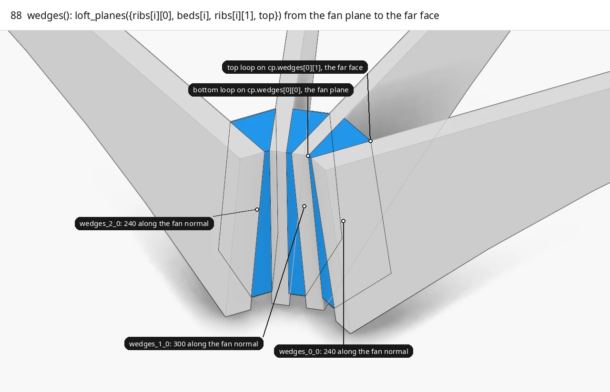

<span style="color:#2196EA">■ built</span> `wedges_0_0`, `wedges_1_0`, `wedges_2_0`   <span style="color:#8C969E">■ context</span> the outer and inner ribs

Each block is <span style="color:#2196EA">`loft_planes({ribs[i][0], beds[i], ribs[i][1], top}, cp.wedges[i][0], cp.wedges[i][1])`</span>. Its corners are (rib 0, bed), (bed, rib 1), (rib 1, datum) and (datum, rib 0). The bottom loop lies on the fan plane `cp.wedges[i][0]` against the column head. The top loop lies on the far face `cp.wedges[i][1]`. The far faces come from `block_planes`: the fan plane moved along its normal by `run_in[0]`, `middle_wedge_factor * mean(run_in)` and `run_in[1]`. The `pair(..., wedge)` far faces made earlier in `wedge_fan` are placeholders until `block_planes` replaces them. On the square bay both run-ins stay at 240, so the blocks are 240, 300 and 240 thick. The blocks lean because the fan planes lean.

| Variable | Value | Meaning |
|---|---|---|
| `wedges()[0].bottom` | (-2685.0,-2900,-640.6) (-2685.0,-2815.2,-640.6) (-2780,-2880,0) (-2780,-2900,0) | Side block 0 on the fan plane |
| `wedges()[0].top` | (-2453.6,-2900,-564.9) (-2453.6,-2657.4,-564.9) (-2537.4,-2714.5,0) (-2537.4,-2900,0) | Side block 0 on its far face |
| `wedges()[1].bottom` | (-2728.1,-2772.0,-641.4) (-2772.0,-2728.1,-641.4) (-2836.8,-2823.2,0) (-2823.2,-2836.8,0) | Middle block on the tilted chamfer plane |
| `wedges()[1].top` | (-2483.8,-2605.4,-561.5) (-2605.4,-2483.8,-561.5) (-2662.1,-2567.1,0) (-2567.1,-2662.1,0) | Middle block on its far face |
| `wedges()[2]` | mirror of block 0 | Side block 1 |
| `run_in[0]`, `run_in[1]` | 240, 240 | Side block thicknesses along the fan normal |
| `middle_wedge_factor` | 1.25 | Middle block = 1.25 x mean run-in = 300 |
| `wedge` | 240.0 | Initial run-in guess of the solver |

```cpp
// floor_members.cpp:120-121
for (size_t i = 0; i < 3; i++)
    wedges.push_back(loft_planes({ribs[i][0], beds[i], ribs[i][1], top}, cp.wedges[i][0], cp.wedges[i][1]));

// floor.cpp:317-322
const std::array<double, 3> thickness = {run_in[0], parameters.middle_wedge_factor * (0.5 * (run_in[0] + run_in[1])), run_in[1]};

for (size_t i = 0; i < 3; i++) {
    column.wedge_fan[i][1] = column.wedge_fan[i][0].translate_by_normal(thickness[i]);
    cp.wedges[i][1] = column.wedge_fan[i][1];
}
```

Code: `Quarter::wedges`, [floor_members.cpp:118-123](https://github.com/petrasvestartas/wood/blob/0c9f4e49b3ac503e917b90c037f43f827533d641/src/templates/floor/floor_members.cpp#L118-L123); `block_planes`, [floor.cpp:314-323](https://github.com/petrasvestartas/wood/blob/0c9f4e49b3ac503e917b90c037f43f827533d641/src/templates/floor/floor.cpp#L314-L323)

## 89. tsection: trim four traces

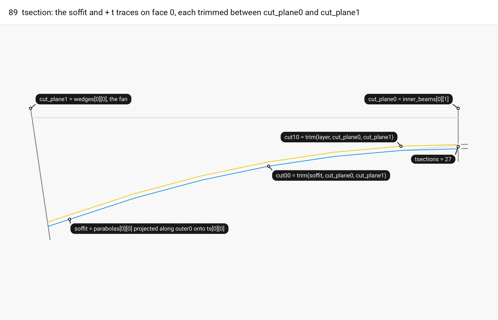

<span style="color:#2196EA">■ built</span> `cut00`, the soffit trimmed   <span style="color:#EBB121">■ result</span> `cut10`, the `+t` trimmed   <span style="color:#EB7721">■ variable</span> `tsections = 27`   <span style="color:#455B6B">■ input</span> the untrimmed traces (dashed), `cut_plane0`, `cut_plane1`   <span style="color:#8C969E">■ context</span> outer rib 0's bottom loop

`tsection(soffit, layer, cut_plane0, cut_plane1, projection10, projection11)` makes one flange plate. It trims four traces between the same two planes: <span style="color:#455B6B">`cut_plane0`</span>, the beam face the flange ends on, and <span style="color:#455B6B">`cut_plane1`</span>, the fan plane. <span style="color:#2196EA">`cut00`</span> is the soffit on face 0 and <span style="color:#EBB121">`cut10`</span> the `+t` layer on face 0. `cut01` and `cut11` are the same two traces after `projection10` and `projection11` carry them onto face 1. Each trace is trimmed after it is projected, so its ends lie exactly on the cut planes on both faces. `trim` first pushes both end segments out by `EXTENSION` = 1000 along their own direction and then calls `cut_by_plane` twice. As a result the parabola's start point at the run-in (x -2540, z -650) is dropped, and the soffit reaches the fan plane along its extended first chord at z -694.8. The frame shows t-section 0 on face y = -2900: <span style="color:#455B6B">the untrimmed traces dashed</span>, the trimmed ones solid, <span style="color:#EB7721">27 apart</span>.

| Variable | Value | Meaning |
|---|---|---|
| `cut00` | (-2677.0,-694.8) ... (-60,-198.8) in (x, z) on y = -2900 | Soffit on face 0, trimmed, 7 points |
| `cut10` | (-2681.0,-667.7) ... (-60,-171.8) | `+t` on face 0, trimmed, 7 points |
| `cut01`, `cut11` | same traces on face 1 (y = -2873 for t-section 0) | After `projection10` / `projection11` |
| `cut_plane0` | `inner_beams[0][1]` / `[2][1]` (outer panels), `inner_beams[1][1]` (central) | Beam face the flange ends on |
| `cut_plane1` | `wedges[0][0]` / `[1][0]` / `[2][0]` | Fan plane |
| `EXTENSION` | 1000.0 | End-segment push-out in `trim` (floor_geometry.cpp:9) |

```cpp
// floor_members.cpp:133-136
const std::vector<Point> cut00 = trim(soffit, cut_plane0, cut_plane1).get_points();
const std::vector<Point> cut01 = trim(soffit.transformed(projection10), cut_plane0, cut_plane1).get_points();
const std::vector<Point> cut10 = trim(layer, cut_plane0, cut_plane1).get_points();
const std::vector<Point> cut11 = trim(layer.transformed(projection11), cut_plane0, cut_plane1).get_points();

// floor_geometry.cpp:78-81
pts[0] = pts[0] + (pts[0] - pts[1]).normalized() * EXTENSION;
pts[n - 1] = pts[n - 1] + (pts[n - 1] - pts[n - 2]).normalized() * EXTENSION;

return cut(Polyline(pts), plane0, plane1);
```

Code: `tsection`, [floor_members.cpp:130-136](https://github.com/petrasvestartas/wood/blob/0c9f4e49b3ac503e917b90c037f43f827533d641/src/templates/floor/floor_members.cpp#L130-L136); `trim`, [floor_geometry.cpp:73-82](https://github.com/petrasvestartas/wood/blob/0c9f4e49b3ac503e917b90c037f43f827533d641/src/templates/floor/floor_geometry.cpp#L73-L82)

## 90. tsection: the 15-point loop

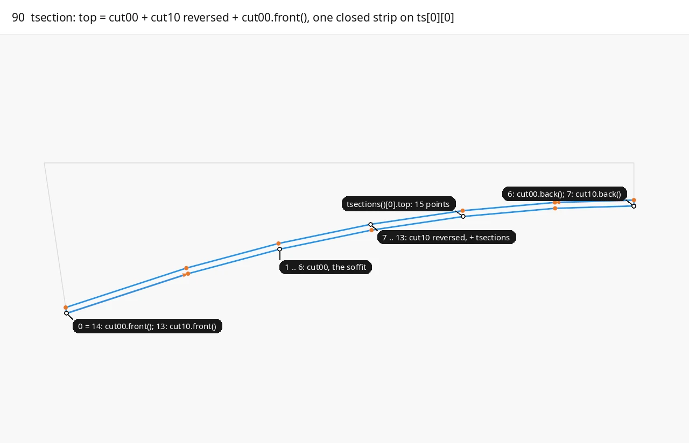

<span style="color:#2196EA">■ built</span> `tsections()[0].top`, 15 points   <span style="color:#EB7721">■ variable</span> the point order 0 .. 14 and its direction   <span style="color:#8C969E">■ context</span> outer rib 0's bottom loop

<span style="color:#2196EA">The top loop</span> is `cut00`, then `cut10` in reverse, then `cut00.front()` again. On face 0 that is one closed strip: along the soffit from the fan to the beam face (<span style="color:#EB7721">points 0 to 6</span>), up the beam face by `tsections` (<span style="color:#EB7721">6 to 7</span>), back along `+t` (<span style="color:#EB7721">7 to 13</span>), and down the fan plane to the start (<span style="color:#EB7721">13 to 14</span>). The bottom loop is built the same way from `cut01` and `cut11` on face 1. The outline is `{Polyline(top), Polyline(bottom)}`, a 27 mm plate lying flat against the rib face.

| Variable | Value | Meaning |
|---|---|---|
| `tsections()[0].top` | (-2677.0,-694.8) ... (-60,-198.8) (-60,-171.8) ... (-2681.0,-667.7) (-2677.0,-694.8), 15 points | Loop on `ts[0][0]` = `outer_ribs[0][1]`, y = -2900 |
| `tsections()[0].bottom` | same in (x, z), y = -2873 | Loop on `ts[0][1]` |
| `outline_thickness` | 27.0 | Distance between the two loops' area centroids |

```cpp
// floor_members.cpp:138-146
std::vector<Point> top = cut00;
top.insert(top.end(), cut10.rbegin(), cut10.rend());
top.push_back(cut00.front());

std::vector<Point> bottom = cut01;
bottom.insert(bottom.end(), cut11.rbegin(), cut11.rend());
bottom.push_back(cut01.front());

return {Polyline(top), Polyline(bottom)};
```

Code: `tsection`, [floor_members.cpp:138-146](https://github.com/petrasvestartas/wood/blob/0c9f4e49b3ac503e917b90c037f43f827533d641/src/templates/floor/floor_members.cpp#L138-L146)

## 91. outer_tsection projections

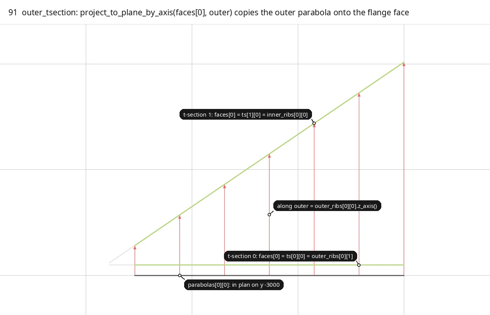

<span style="color:#2196EA">■ built</span> the soffit on `ts[0][0]` and on `ts[1][0]`   <span style="color:#EB7721">■ variable</span> `outer = outer_ribs[0][0].z_axis()`   <span style="color:#455B6B">■ input</span> `parabolas[0][0]` in plan   <span style="color:#8C969E">■ context</span> the two flange face traces

`outer_tsection(parabola, faces, outer, sweep, cut_plane0, cut_plane1)` makes a flange beside an outer panel rib face. <span style="color:#2196EA">`projection = project_to_plane_by_axis(faces[0], outer)`</span> slides the outer parabola's soffit <span style="color:#455B6B">`parabola[0]`</span> and `+t` `parabola[1]` <span style="color:#EB7721">along the outer rib normal</span> onto face 0. `tsection` then gets `projection10 = project_to_plane_by_axis(faces[1], sweep)` for the soffit and `projection11 = project_to_plane_by_axis(faces[1], outer)` for the `+t`. Every direction used here is horizontal, so z does not change. For t-section 0, face 0 is y = -2900. For t-section 1, face 0 is `inner_ribs[0][0]`, and the projected soffit there equals the shadow parabola `parabolas[2][0]`.

| Variable | Value | Meaning |
|---|---|---|
| `outer` | (0,1,0) for rib 0, (1,0,0) for rib 1 | `outer_ribs[k][0].z_axis()`, the outer rib normal |
| `sweep` | `outer` for t-sections 0 and 5, `panel.rib_sweep` for 1 and 4 | Direction the soffit takes to face 1 |
| `projection` | onto `faces[0]` along `outer` | Copies the outer parabola onto the flange face |
| `projection10` | onto `faces[1]` along `sweep` | Soffit to face 1 |
| `projection11` | onto `faces[1]` along `outer` | `+t` to face 1 |

```cpp
// floor_members.cpp:152-158
const Xform projection = Xform::project_to_plane_by_axis(faces[0], outer);

return tsection(
    parabola[0].transformed(projection), parabola[1].transformed(projection), cut_plane0, cut_plane1,
    Xform::project_to_plane_by_axis(faces[1], sweep),
    Xform::project_to_plane_by_axis(faces[1], outer)
);
```

Code: `outer_tsection`, [floor_members.cpp:149-159](https://github.com/petrasvestartas/wood/blob/0c9f4e49b3ac503e917b90c037f43f827533d641/src/templates/floor/floor_members.cpp#L149-L159)

## 92. Flanges 0 and 5

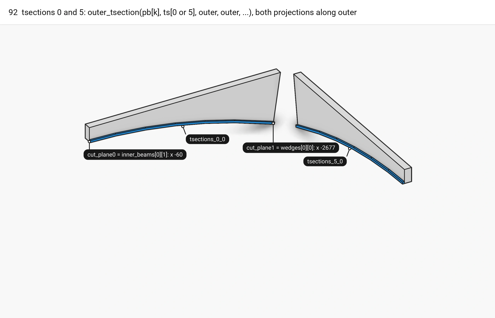

<span style="color:#2196EA">■ built</span> `tsections_0_0`, `tsections_5_0`   <span style="color:#8C969E">■ context</span> the outer ribs

<span style="color:#2196EA">T-section 0 is</span> `outer_tsection(pb[0], ts[0], outer0, outer0, cp.inner_beams[0][1], cp.wedges[0][0])`, with `ts[0] = pair(outer_ribs[0][1], +tsections)`. Both projections run along the outer normal, so the plate is a straight 27 mm extrusion of the trimmed strip from y = -2900 to y = -2873. It runs from the fan plane at x = -2677 to the seam beam face x = -60. <span style="color:#2196EA">T-section 5 is</span> the mirror on outer rib 1: `outer_tsection(pb[1], ts[5], outer1, outer1, cp.inner_beams[2][1], cp.wedges[2][0])`. The frame looks from the bay centre, so the flanges on the panel sides of the ribs are in view.

| Variable | Value | Meaning |
|---|---|---|
| `ts[0]` | `pair(outer_ribs[0][1], 27)`: y = -2900 and -2873 | Faces of t-section 0 |
| `ts[5]` | `pair(outer_ribs[1][1], 27)`: x = -2900 and -2873 | Faces of t-section 5 |
| `ts` | `cp.tsections` | The six flange face pairs (floor.cpp:205-212) |
| `pb` | `geometry().parabolas` | `pb[0]`, `pb[1]`: the outer parabolas with their `+t` and `+2t` |
| `outer0`, `outer1` | (0,1,0), (1,0,0) | `cp.outer_ribs[0][0].z_axis()`, `cp.outer_ribs[1][0].z_axis()` |
| `tsections` | 27.0 | Flange thickness and layer step |
| `tsections()[0]` | x from -2677 to -60 | Flange of outer rib 0 |

```cpp
// floor_members.cpp:171
outer_tsection(pb[0], ts[0], outer0, outer0, cp.inner_beams[0][1], cp.wedges[0][0]),

// floor_members.cpp:184
outer_tsection(pb[1], ts[5], outer1, outer1, cp.inner_beams[2][1], cp.wedges[2][0]),

// floor.cpp:205-212
cp.tsections = {
    pair(cp.outer_ribs[0][1], parameters.tsections),
    pair(cp.inner_ribs[0][0], -parameters.tsections),
    pair(cp.inner_ribs[0][1], parameters.tsections),
    pair(cp.inner_ribs[1][1], parameters.tsections),
    pair(cp.inner_ribs[1][0], -parameters.tsections),
    pair(cp.outer_ribs[1][1], parameters.tsections),
};
```

Code: `Quarter::tsections`, [floor_members.cpp:161-171](https://github.com/petrasvestartas/wood/blob/0c9f4e49b3ac503e917b90c037f43f827533d641/src/templates/floor/floor_members.cpp#L161-L171), [184](https://github.com/petrasvestartas/wood/blob/0c9f4e49b3ac503e917b90c037f43f827533d641/src/templates/floor/floor_members.cpp#L184); planes `construction_planes`, [floor.cpp:205-212](https://github.com/petrasvestartas/wood/blob/0c9f4e49b3ac503e917b90c037f43f827533d641/src/templates/floor/floor.cpp#L205-L212)

## 93. Flanges 1 and 4

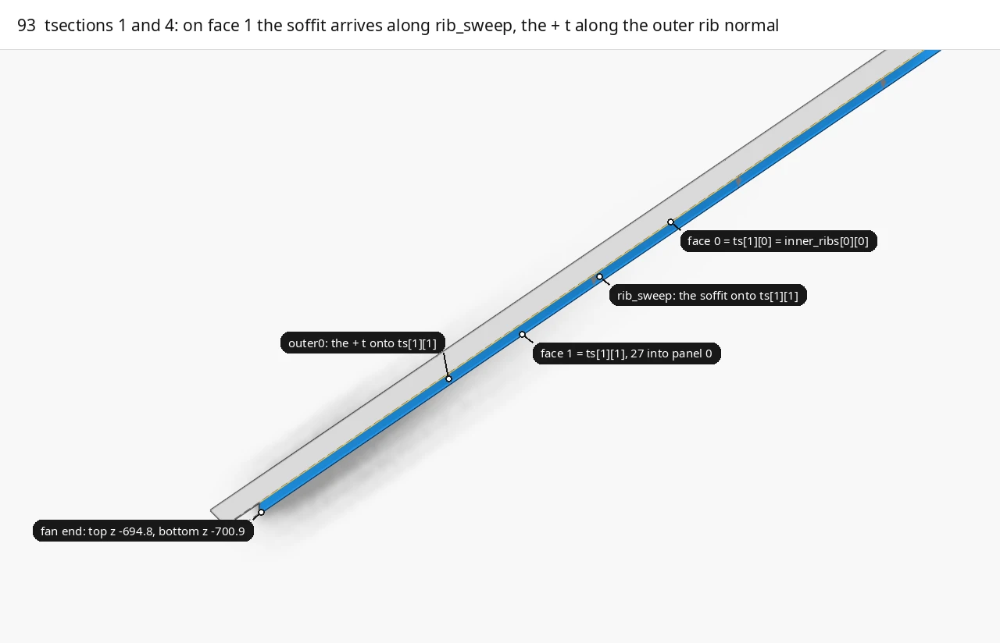

<span style="color:#2196EA">■ built</span> `tsections()[1].bottom` on `ts[1][1]`   <span style="color:#EBB121">■ result</span> `tsections()[1].top` on `ts[1][0]`   <span style="color:#EB7721">■ variable</span> `panel.rib_sweep`, the soffit's direction   <span style="color:#455B6B">■ input</span> `outer0`, the `+t`'s direction, and faces `ts[1][0]`, `ts[1][1]` (dashed)   <span style="color:#8C969E">■ context</span> inner rib 0

T-section 1 is `outer_tsection(pb[0], ts[1], outer0, panel.rib_sweep, cp.inner_beams[0][1], cp.wedges[0][0])`, with `ts[1] = pair(inner_ribs[0][0], -tsections)`. The flange lies against inner rib 0's outer face, inside outer panel 0. Face 0 carries the outer parabola projected along `outer0`, which is the shadow parabola. On face 1 the soffit arrives along <span style="color:#EB7721">`rib_sweep`</span> (orange arrows in the frame) and the `+t` along <span style="color:#455B6B">`outer0`</span> (slate arrows). Because the two directions differ, <span style="color:#2196EA">the bottom loop</span> is not a parallel copy of <span style="color:#EBB121">the top loop</span>. After trimming, its fan end lies at z -700.9 instead of -694.8, and its seam end at (-60,-1057.5,-199.4), 0.6 mm below the soffit. T-section 4 mirrors it with `pb[1]`, `ts[4]`, `outer1`, `inner_beams[2][1]` and `wedges[2][0]`.

| Variable | Value | Meaning |
|---|---|---|
| `ts[1]` | `pair(inner_ribs[0][0], -27)` | Faces of t-section 1, the second 27 into panel 0 |
| `tsections()[1].top` | (-2677.0,-2809.7,-694.8) ... (-60,-1024.9,-198.8) (-60,-1024.9,-171.8) ... | Loop on `inner_ribs[0][0]` |
| `tsections()[1].bottom` | (-2676.1,-2841.8,-700.9) ... (-60,-1057.5,-199.4) (-60,-1057.5,-171.8) ... | Loop on `ts[1][1]` |
| `panel.rib_sweep` | from chapter 04 | Soffit direction to face 1 |

```cpp
// floor_members.cpp:172
outer_tsection(pb[0], ts[1], outer0, panel.rib_sweep, cp.inner_beams[0][1], cp.wedges[0][0]),

// floor_members.cpp:183
outer_tsection(pb[1], ts[4], outer1, panel.rib_sweep, cp.inner_beams[2][1], cp.wedges[2][0]),
```

Code: `Quarter::tsections`, [floor_members.cpp:172](https://github.com/petrasvestartas/wood/blob/0c9f4e49b3ac503e917b90c037f43f827533d641/src/templates/floor/floor_members.cpp#L172), [183](https://github.com/petrasvestartas/wood/blob/0c9f4e49b3ac503e917b90c037f43f827533d641/src/templates/floor/floor_members.cpp#L183)

## 94. Flanges 2 and 3

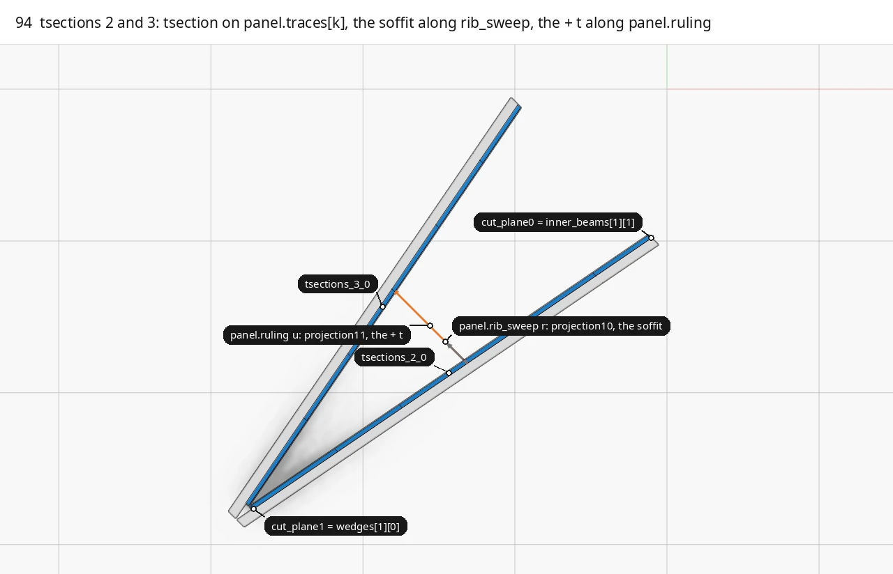

<span style="color:#2196EA">■ built</span> `tsections_2_0`, `tsections_3_0`   <span style="color:#EB7721">■ variable</span> `panel.ruling` u, the `+t`'s direction   <span style="color:#455B6B">■ input</span> `panel.rib_sweep` r, the soffit's direction   <span style="color:#8C969E">■ context</span> the inner ribs

<span style="color:#2196EA">T-sections 2 and 3</span> do not use `outer_tsection`. They call `tsection` directly on the central panel traces: `tsection(panel.traces[0][0], panel.traces[0][1], cp.inner_beams[1][1], cp.wedges[1][0], project_to_plane_by_axis(ts[2][1], panel.rib_sweep), project_to_plane_by_axis(ts[2][1], panel.ruling))`, with `ts[2] = pair(inner_ribs[0][1], +tsections)`. Face 0 carries the central panel's soffit and `+t` on inner rib 0's central face. The soffit is carried to face 1 along <span style="color:#455B6B">`rib_sweep`</span>, and the `+t` along <span style="color:#EB7721">the ruling `u`</span>. Both are cut between the oculus beam back face and the middle fan plane. T-section 3 does the same for inner rib 1 with `panel.traces[1]` and `ts[3]`.

| Variable | Value | Meaning |
|---|---|---|
| `ts[2]` | `pair(inner_ribs[0][1], 27)` | Faces of t-section 2 |
| `ts[3]` | `pair(inner_ribs[1][1], 27)` | Faces of t-section 3 |
| `panel.ruling` | (-0.70711, 0.70711, 0) | Central panel ruling `u`, direction of `projection11` |
| `tsections()[2].top` | (-2720.2,-2766.6,-694.8) ... (-103.2,-981.7,-198.8) (-103.2,-981.7,-171.8) ... | Loop on `inner_ribs[0][1]` |
| `tsections()[2].bottom` | (-2739.6,-2747.1,-694.8) ... (-122.6,-962.2,-198.8) ... | Loop on `ts[2][1]`, 27 into the central panel |

```cpp
// floor_members.cpp:173-182
tsection(
    panel.traces[0][0], panel.traces[0][1], cp.inner_beams[1][1], cp.wedges[1][0],
    Xform::project_to_plane_by_axis(ts[2][1], panel.rib_sweep),
    Xform::project_to_plane_by_axis(ts[2][1], panel.ruling)
),
tsection(
    panel.traces[1][0], panel.traces[1][1], cp.inner_beams[1][1], cp.wedges[1][0],
    Xform::project_to_plane_by_axis(ts[3][1], panel.rib_sweep),
    Xform::project_to_plane_by_axis(ts[3][1], panel.ruling)
),
```

Code: `Quarter::tsections`, [floor_members.cpp:173-182](https://github.com/petrasvestartas/wood/blob/0c9f4e49b3ac503e917b90c037f43f827533d641/src/templates/floor/floor_members.cpp#L173-L182)

## 95. bed_row: trim layers on both side faces

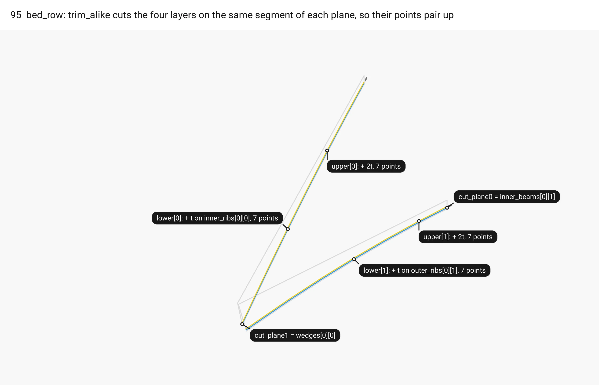

<span style="color:#2196EA">■ built</span> `lower[0]`, `lower[1]`: `+t` trimmed   <span style="color:#EBB121">■ result</span> `upper[0]`, `upper[1]`: `+2t` trimmed   <span style="color:#455B6B">■ input</span> the untrimmed layers (dashed)   <span style="color:#8C969E">■ context</span> outer rib 0 and inner rib 0

`bed_row(lower_faces, upper_faces, cut_plane0, cut_plane1)` trims four polylines between the beam face and the fan plane. <span style="color:#2196EA">`lower[s]`</span> is the `+t` layer and <span style="color:#EBB121">`upper[s]`</span> the `+2t` layer, each on the panel's side face `s` = 0, 1. All four trimmed point lists must have the same length. Otherwise the function throws `std::runtime_error("a bed row's layers are cut on different facets: ...")` and names the four counts. Equal counts mean every facet gives one plate that reaches both sides. The frame shows row 0: side 0 is `inner_ribs[0][0]`, side 1 is `outer_ribs[0][1]`.

| Variable | Value | Meaning |
|---|---|---|
| `lower[0]`, `lower[1]` | 7 points each; row 0 side 0: (-2681.0,-2812.5,-667.7) ... (-60,-1024.9,-171.8) | `+t` on the two side faces, the flange tops |
| `upper[0]`, `upper[1]` | 7 points each; row 0 side 0: (-2685.0,-2815.2,-640.6) ... (-60,-1024.9,-144.8) | `+2t` on the two side faces |
| `cut_plane0` | `inner_beams[0][1]` (row 0) | Beam face |
| `cut_plane1` | `wedges[0][0]` (row 0) | Fan plane |

```cpp
// floor_members.cpp:191-195
const std::array<std::vector<Point>, 2> lower = {trim(lower_faces[0], cut_plane0, cut_plane1).get_points(), trim(lower_faces[1], cut_plane0, cut_plane1).get_points()};
const std::array<std::vector<Point>, 2> upper = {trim(upper_faces[0], cut_plane0, cut_plane1).get_points(), trim(upper_faces[1], cut_plane0, cut_plane1).get_points()};

if (lower[1].size() != lower[0].size() || upper[0].size() != lower[0].size() || upper[1].size() != lower[0].size())
    throw std::runtime_error(fmt::format("a bed row's layers are cut on different facets: {} / {} lower and {} / {} upper points", lower[0].size(), lower[1].size(), upper[0].size(), upper[1].size()));
```

Code: `bed_row`, [floor_members.cpp:188-195](https://github.com/petrasvestartas/wood/blob/0c9f4e49b3ac503e917b90c037f43f827533d641/src/templates/floor/floor_members.cpp#L188-L195)

## 96. bed_row: one plate per facet

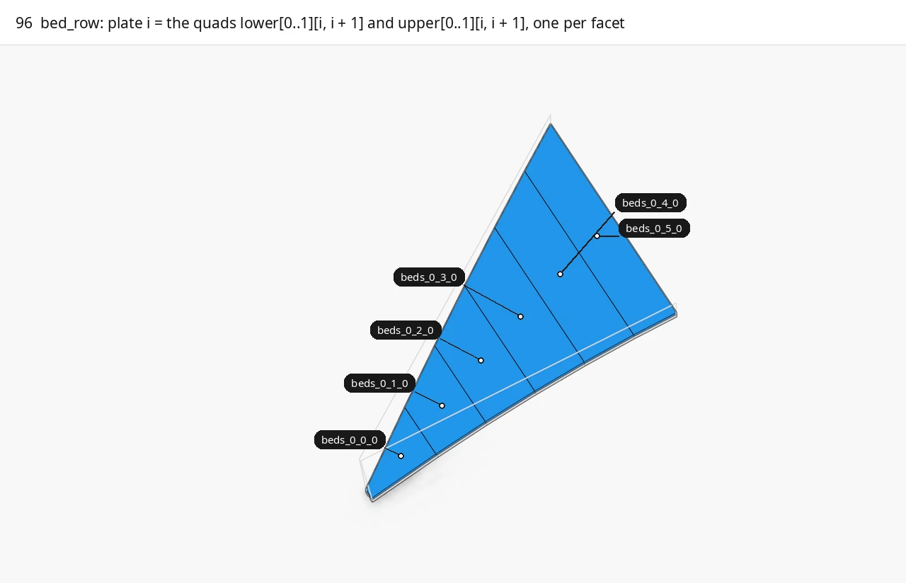

<span style="color:#2196EA">■ built</span> `beds_0_0_0` .. `beds_0_5_0`   <span style="color:#8C969E">■ context</span> the ribs, `tsections_0_0` and `tsections_1_0`

For each facet `i`, the bottom quad is `{lower[0][i], lower[0][i + 1], lower[1][i + 1], lower[1][i]}`, closed, and the top quad is the same four indices taken from `upper`. Each plate is pushed as `{top, bottom}`: a 27 mm plank spanning the panel from side face to side face. Its underside is <span style="color:#8C969E">the flange top</span> (`+t`) and its top is the `+2t` layer. Seven trimmed points give <span style="color:#2196EA">six plates</span>, stepping up the parabola from the column to the seam beam.

| Variable | Value | Meaning |
|---|---|---|
| plates per row | 6 | One per facet of 7 trimmed points |
| `beds()[0][0].top` | (-2685.0,-2815.2,-640.6) (-2132.0,-2438.1,-459.8) (-2132.0,-2900,-459.8) (-2685.0,-2900,-640.6) | First plate of row 0 |
| element names | `beds_0_0_0` .. `beds_0_5_0` | `beds_{row}_{index}_{quarter}` (MemberRef::name) |

```cpp
// floor_members.cpp:199-203
for (size_t i = 0; i + 1 < lower[0].size(); i++) {
    const Polyline bottom({lower[0][i], lower[0][i + 1], lower[1][i + 1], lower[1][i], lower[0][i]});
    const Polyline top({upper[0][i], upper[0][i + 1], upper[1][i + 1], upper[1][i], upper[0][i]});
    plates.push_back({top, bottom});
}
```

Code: `bed_row`, [floor_members.cpp:197-205](https://github.com/petrasvestartas/wood/blob/0c9f4e49b3ac503e917b90c037f43f827533d641/src/templates/floor/floor_members.cpp#L197-L205)

## 97. outer_bed_row projections

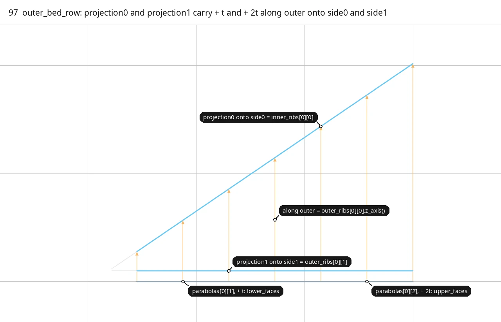

<span style="color:#2196EA">■ built</span> the `+t` on `side0` and on `side1`   <span style="color:#EB7721">■ variable</span> `outer` = (0,1,0)   <span style="color:#455B6B">■ input</span> `parabolas[0][1]` (`+t`) and `parabolas[0][2]` (`+2t`)   <span style="color:#8C969E">■ context</span> the two side face traces

`outer_bed_row(parabola, side0, side1, outer, cut_plane0, cut_plane1)` makes <span style="color:#2196EA">`projection0 = project_to_plane_by_axis(side0, outer)`</span> and <span style="color:#2196EA">`projection1 = project_to_plane_by_axis(side1, outer)`</span>. It projects the outer parabola's `+t` (<span style="color:#455B6B">`parabola[1]`</span>) and `+2t` (<span style="color:#455B6B">`parabola[2]`</span>) onto both sides <span style="color:#EB7721">along the outer rib normal</span>. It then passes them to `bed_row` as `lower_faces = {+t on side0, +t on side1}` and `upper_faces = {+2t on side0, +2t on side1}`. In plan both layers lie on y = -3000, because `offset_polyline` offsets inside the parabola's vertical plane.

| Variable | Value | Meaning |
|---|---|---|
| `side0`, `side1` (row 0) | `inner_ribs[0][0]`, `outer_ribs[0][1]` | The panel's two side faces |
| `outer` (row 0) | (0,1,0) | `outer_ribs[0][0].z_axis()` |
| `projection0` | onto `side0` along `outer` | `project_to_plane_by_axis(side0, outer)` |
| `projection1` | onto `side1` along `outer` | `project_to_plane_by_axis(side1, outer)` |
| `lower_faces` | `parabolas[0][1]` on both sides | `+t` |
| `upper_faces` | `parabolas[0][2]` on both sides | `+2t` |

```cpp
// floor_members.cpp:211-214
const Xform projection0 = Xform::project_to_plane_by_axis(side0, outer);
const Xform projection1 = Xform::project_to_plane_by_axis(side1, outer);

return bed_row({parabola[1].transformed(projection0), parabola[1].transformed(projection1)}, {parabola[2].transformed(projection0), parabola[2].transformed(projection1)}, cut_plane0, cut_plane1);
```

Code: `outer_bed_row`, [floor_members.cpp:208-215](https://github.com/petrasvestartas/wood/blob/0c9f4e49b3ac503e917b90c037f43f827533d641/src/templates/floor/floor_members.cpp#L208-L215)

## 98. Three bed rows

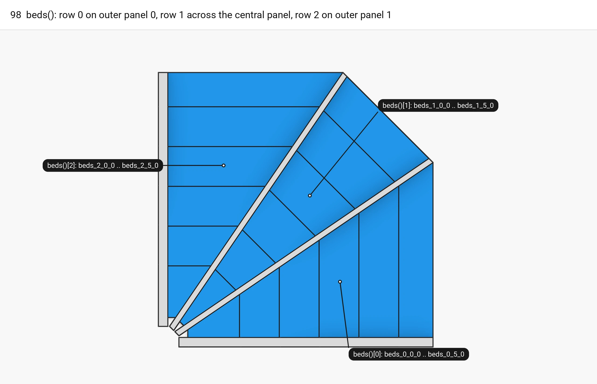

<span style="color:#2196EA">■ built</span> `beds()[0]`, `beds()[1]`, `beds()[2]`   <span style="color:#8C969E">■ context</span> the outer and inner ribs

`Quarter::beds` returns <span style="color:#2196EA">three rows</span>. Row 0 is `outer_bed_row(pb[0], cp.inner_ribs[0][0], cp.outer_ribs[0][1], outer_ribs[0][0].z_axis(), cp.inner_beams[0][1], cp.wedges[0][0])`. Row 1 is `bed_row({traces[0][1], traces[1][1]}, {traces[0][2], traces[1][2]}, cp.inner_beams[1][1], cp.wedges[1][0])`. It reads the central panel traces on the two central faces directly and runs from the middle fan plane to the oculus beam back face. Row 2 mirrors row 0 with `pb[1]`, `inner_ribs[1][0]`, `outer_ribs[1][1]`, `inner_beams[2][1]` and `wedges[2][0]`. On the square bay that is <span style="color:#2196EA">18 plates per quarter</span>.

| Variable | Value | Meaning |
|---|---|---|
| `beds()[0]` | 6 plates; last plate top at x = -60, z = -144.76 | Outer panel 0 |
| `beds()[1]` | 6 plates; `beds()[1][0].top` (-2728.1,-2772.0,-641.4) (-2170.8,-2391.9,-459.2) (-2391.9,-2170.8,-459.2) (-2772.0,-2728.1,-641.4) | Central panel |
| `beds()[2]` | 6 plates, mirror of row 0 | Outer panel 1 |

```cpp
// floor_members.cpp:223-227
return {
    outer_bed_row(pb[0], cp.inner_ribs[0][0], cp.outer_ribs[0][1], cp.outer_ribs[0][0].z_axis(), cp.inner_beams[0][1], cp.wedges[0][0]),
    bed_row({panel.traces[0][1], panel.traces[1][1]}, {panel.traces[0][2], panel.traces[1][2]}, cp.inner_beams[1][1], cp.wedges[1][0]),
    outer_bed_row(pb[1], cp.inner_ribs[1][0], cp.outer_ribs[1][1], cp.outer_ribs[1][0].z_axis(), cp.inner_beams[2][1], cp.wedges[2][0]),
};
```

Code: `Quarter::beds`, [floor_members.cpp:217-228](https://github.com/petrasvestartas/wood/blob/0c9f4e49b3ac503e917b90c037f43f827533d641/src/templates/floor/floor_members.cpp#L217-L228)

## 99. Oculus levels side0..side3

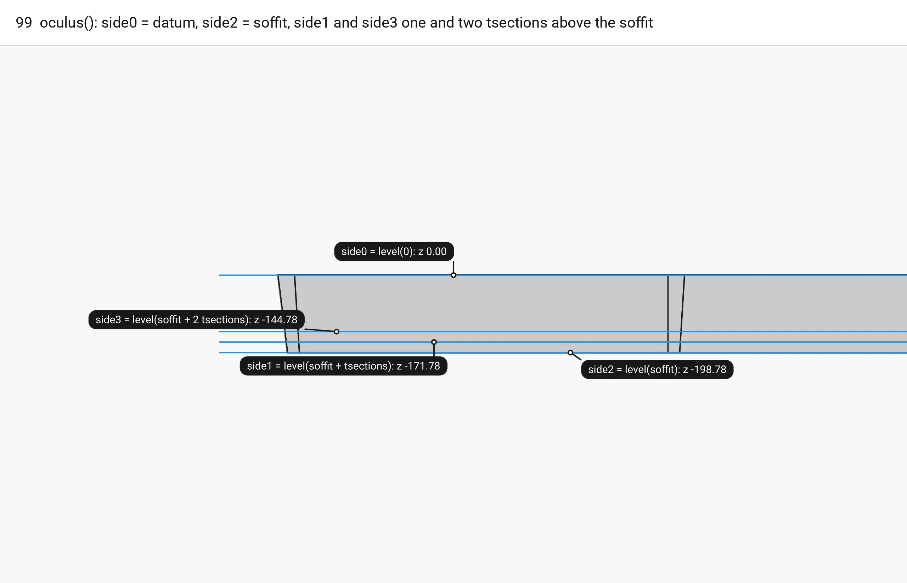

<span style="color:#2196EA">■ built</span> `side0`, `side1`, `side2`, `side3`   <span style="color:#8C969E">■ context</span> the ring beams

`FloorGuide::oculus` builds the ring for the whole floor, not per quarter. It first sets four horizontal planes. <span style="color:#2196EA">`side0 = level(0)`</span> is the datum. <span style="color:#2196EA">`side1 = level(soffit + tsections)`</span> is the top of the bottom wedges and the underside of the central plate. <span style="color:#2196EA">`side2 = level(soffit)`</span> is the ring soffit. <span style="color:#2196EA">`side3 = level(soffit + 2 * tsections)`</span> is the top of the central plate.

| Variable | Value | Meaning |
|---|---|---|
| `side0` | 0 | Datum, ring beam top |
| `side1` | -171.78 | `soffit + tsections` |
| `side2` | -198.78 | `soffit`, ring beam and bottom wedge bottom |
| `side3` | -144.78 | `soffit + 2 * tsections`, central plate top |
| `tsections` | 27.0 | Layer step |

```cpp
// floor_members.cpp:236-239
const Plane side0 = level(0.0);
const Plane side1 = level(soffit + parameters.tsections);
const Plane side2 = level(soffit);
const Plane side3 = level(soffit + parameters.tsections * 2.0);
```

Code: `FloorGuide::oculus`, [floor_members.cpp:234-239](https://github.com/petrasvestartas/wood/blob/0c9f4e49b3ac503e917b90c037f43f827533d641/src/templates/floor/floor_members.cpp#L234-L239)

## 100. Oculus planes tilted[q], inner[q]

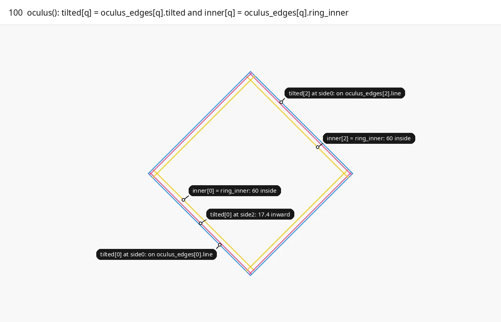

<span style="color:#2196EA">■ built</span> `tilted[q]` at `side0`, on the edge   <span style="color:#EB7721">■ variable</span> `tilted[q]` at `side2`, 17.4 inward   <span style="color:#EBB121">■ result</span> `inner[q] = ring_inner`, 60 inside

For each `OculusEdge` `q`, <span style="color:#2196EA">`tilted[q] = edge.tilted`</span> and <span style="color:#EBB121">`inner[q] = edge.ring_inner`</span>. `tilted` is the vertical edge plane turned by `-oculus_plane_angle` about the edge line through its centre. At z 0 it lies on the edge, and <span style="color:#EB7721">at the soffit it lies 17.4 mm toward the centre</span>. `ring_inner` is the back face moved back by `2 * inner_beams`, so it stands vertically 60 mm inside the edge, toward the centre. The oculus is the diamond through (0,-1000), (1000,0), (0,1000) and (-1000,0).

| Variable | Value | Meaning |
|---|---|---|
| `tilted[0]` | o(-500,-500,0) n(-0.70442,-0.70442,-0.08716); x + y = -1000 at z 0, -975.4 at the soffit | Edge 0 bearing plane |
| `inner[0]` | x + y = -915.1, n(-0.70711,-0.70711,0) | Ring inner plane of edge 0 |
| `oculus` | 1000.0 | Oculus corner distance from the centre |
| `oculus_plane_angle` | 5.0 deg | Lean of `tilted` |
| `inner_beams` | 60.0 | Ring width at the datum |

```cpp
// floor_members.cpp:244-247
for (const OculusEdge& edge : oculus_edges) {
    tilted.push_back(edge.tilted);
    inner.push_back(edge.ring_inner);
}

// floor.cpp:97-100
const Plane plane = edge_plane(edge.line, -Vector::z_axis());
edge.tilted = rotate(plane, -parameters.oculus_plane_angle * M_PI / 180.0, edge.line.to_direction(), edge.line.center());
edge.back = plane.translate_by_normal(parameters.inner_beams);
edge.ring_inner = edge.back.translate_by_normal(-parameters.inner_beams * 2.0);
```

Code: `FloorGuide::oculus`, [floor_members.cpp:241-247](https://github.com/petrasvestartas/wood/blob/0c9f4e49b3ac503e917b90c037f43f827533d641/src/templates/floor/floor_members.cpp#L241-L247); `oculus_edge`, [floor.cpp:92-103](https://github.com/petrasvestartas/wood/blob/0c9f4e49b3ac503e917b90c037f43f827533d641/src/templates/floor/floor.cpp#L92-L103)

## 101. Ring beams: pinwheel

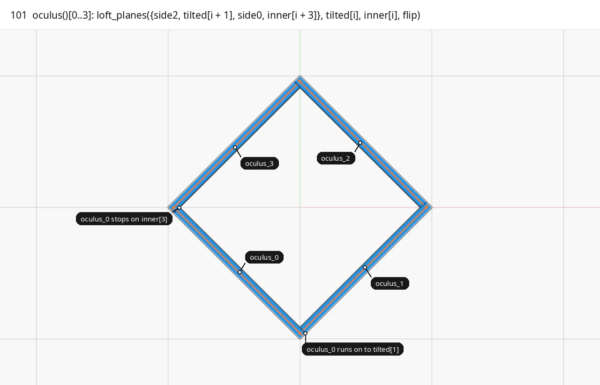

<span style="color:#2196EA">■ built</span> `oculus_0` .. `oculus_3`   <span style="color:#EB7721">■ variable</span> each beam's run on to `tilted[(i + 1) % 4]`   <span style="color:#8C969E">■ context</span> the oculus edges

Ring beam `i` is `loft_planes({side2, tilted[(i + 1) % 4], side0, inner[(i + 3) % 4]}, tilted[i], inner[i], true)`. The beam lies between its own tilted plane and ring-inner plane, from the soffit up to the datum. At its oculus-corner-`i` end it runs through the corner and ends on the next edge's tilted plane <span style="color:#EB7721">`tilted[(i + 1) % 4]`</span>. At its other end it stops on the previous edge's inner plane. All four beams do the same, so they close as a pinwheel with no mitres <span style="color:#EB7721">(arrows in the frame)</span>. `flip = true` puts the loop on `tilted[i]` first, as `Outline.top`, so `top` is the face the ring beam shares with the quarter's oculus beam. The ring beams become <span style="color:#2196EA">`oculus_0` .. `oculus_3`</span> (`to_beam(outline, {1, 0}, {2, 3})`).

| Variable | Value | Meaning |
|---|---|---|
| `oculus()[0].top` | (0,-975.4,-198.8) (0,-1000,0) (-957.6,-42.4,0) (-945.3,-30.1,-198.8) | Loop on `tilted[0]` |
| `oculus()[0].bottom` | (30.1,-945.3,-198.8) (42.4,-957.6,0) (-915.1,0,0) (-915.1,0,-198.8) | Loop on `inner[0]` |
| `oculus()[1..3]` | rotated copies | Ring beams 1 to 3, 60 wide at the datum |
| `flip` | `true` | Tilted loop first |

```cpp
// floor_members.cpp:251-252
for (size_t i = 0; i < 4; i++)
    plates.push_back(loft_planes({side2, tilted[(i + 1) % 4], side0, inner[(i + 3) % 4]}, tilted[i], inner[i], true));
```

Code: `FloorGuide::oculus`, [floor_members.cpp:249-252](https://github.com/petrasvestartas/wood/blob/0c9f4e49b3ac503e917b90c037f43f827533d641/src/templates/floor/floor_members.cpp#L249-L252)

## 102. Bottom wedges: ledge strips

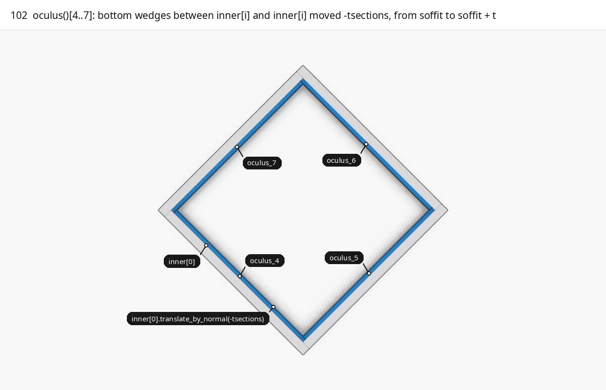

<span style="color:#2196EA">■ built</span> `oculus_4` .. `oculus_7`   <span style="color:#8C969E">■ context</span> the ring beams

For each `i`, `sides = {inner[i], inner[(i + 1) % 4], inner[i].translate_by_normal(-tsections), inner[(i + 3) % 4].translate_by_normal(-tsections)}`, lofted with `loft_planes(sides, side2, side1)`. The `-tsections` offset moves toward the centre. The result is a ledge strip 27 mm wide and 27 mm thick along ring beam `i`'s inner face, from the soffit to soffit + t. Like the ring beams, the strips run in a pinwheel. They are not under the ring beams but inside the ring, and together they carry the central plate. They are <span style="color:#2196EA">`oculus_4` .. `oculus_7`</span>, made with `to_plate`.

| Variable | Value | Meaning |
|---|---|---|
| `sides` | `inner[i]`, `inner[(i + 1) % 4]`, then `inner[i]` and `inner[(i + 3) % 4]` moved by -27 | The strip's four side planes in ring order |
| `oculus()[4].top` | (0,-915.1,-171.8) (19.1,-896.1,-171.8) (-877.0,0,-171.8) (-896.1,-19.1,-171.8) | Bottom wedge 0 on `side1` |
| `oculus()[4].bottom` | the same at -198.8 | On `side2` |
| `oculus()[5..7]` | rotated copies | Bottom wedges 1 to 3 |
| `tsections` | 27.0 | Strip width (offset) and thickness |

```cpp
// floor_members.cpp:254-257
for (size_t i = 0; i < 4; i++) {
    const std::vector<Plane> sides = {inner[i], inner[(i + 1) % 4], inner[i].translate_by_normal(-parameters.tsections), inner[(i + 3) % 4].translate_by_normal(-parameters.tsections)};
    plates.push_back(loft_planes(sides, side2, side1));
}
```

Code: `FloorGuide::oculus`, [floor_members.cpp:254-257](https://github.com/petrasvestartas/wood/blob/0c9f4e49b3ac503e917b90c037f43f827533d641/src/templates/floor/floor_members.cpp#L254-L257)

## 103. Central plate

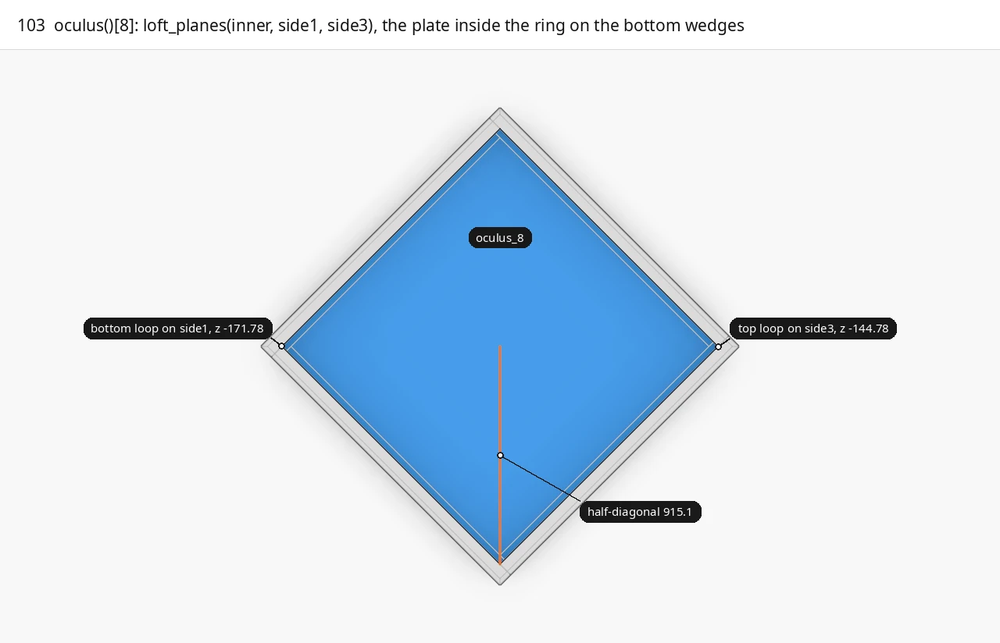

<span style="color:#2196EA">■ built</span> `oculus_8`   <span style="color:#EB7721">■ variable</span> half-diagonal 915.1   <span style="color:#8C969E">■ context</span> the ring beams and bottom wedges

`loft_planes(inner, side1, side3)` gives the square bounded by the four ring-inner planes, between soffit + t and soffit + 2t. It fills the ring and rests on <span style="color:#8C969E">the bottom wedges</span>. It is <span style="color:#2196EA">`oculus_8`</span>, the only member of no quarter, kept in the `oculus` group. Its top is `soffit + 2 * tsections` = -144.78. The beds' `+2t` layer ends at -144.76 on the beam faces, so the two differ by about 0.02 mm. Nothing in the construction ties them together.

| Variable | Value | Meaning |
|---|---|---|
| `oculus()[8].top` | (0,-915.1,-144.8) (915.1,0,-144.8) (0,915.1,-144.8) (-915.1,0,-144.8) | Loop on `side3` |
| `oculus()[8].bottom` | the same at -171.8 | Loop on `side1` |
| half-diagonal | 915.1 | Centre to plate corner along a seam |

```cpp
// floor_members.cpp:259
plates.push_back(loft_planes(inner, side1, side3));
```

Code: `FloorGuide::oculus`, [floor_members.cpp:259-261](https://github.com/petrasvestartas/wood/blob/0c9f4e49b3ac503e917b90c037f43f827533d641/src/templates/floor/floor_members.cpp#L259-L261)

## 104. column_cutters: fan_top

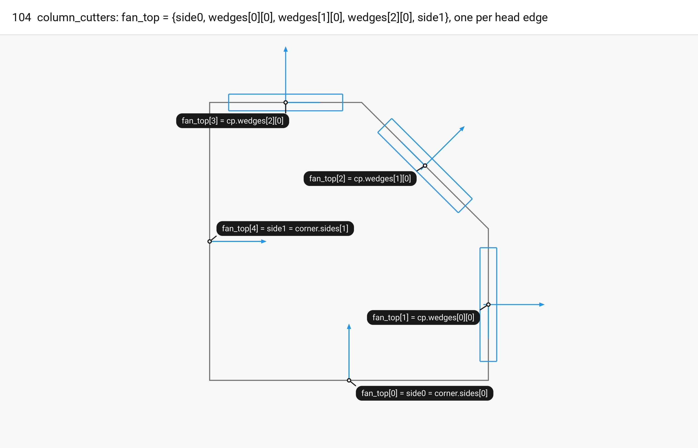

<span style="color:#2196EA">■ built</span> `fan_top[0..4]`   <span style="color:#455B6B">■ input</span> `edge(head, k)`, the head edges

`Quarter::column_cutters` carves the column head at the quarter's corner. It first sets three levels, `xy0`, `xy1` and `xy2` = `level(corner.levels[0..2])`, and reads `side0` and `side1` = `corner.sides`, the vertical planes on the head edges along the bay boundary with normals into the bay. <span style="color:#2196EA">`fan_top = {side0, wedges[0][0], wedges[1][0], wedges[2][0], side1}`</span> is the chain of planes the carved head face follows from the datum down to the rib-bottom level. At the datum each of the five planes passes through one head edge, <span style="color:#455B6B">`edge(head, k)`</span> for k = 0..4: the two side planes stand on edges 0 and 4, and the three fan planes pass through edges 1, 2 and 3. `levels[1]` is not known when `column_corner` runs (it writes 0 there as a placeholder). The `FloorGuide` constructor sets it to `rib_bottom_level` after all four quarters are computed.

| Variable | Value | Meaning |
|---|---|---|
| `xy0`, `xy1`, `xy2` | z = 0, -694.79, -730 | `level(levels[0])`, `level(levels[1])`, `level(levels[2])` |
| `levels[1]` | -694.79 | `rib_bottom_level`: the deeper outer rib bottom on its fan plane |
| `levels[2]` | -730 | `-column_head_depth` |
| `side0` / `side1` | y = -3000 / x = -3000 | Head boundary planes `edge_plane(edge(head, 0 / 4), -z)` |
| `head` | (-3000,-3000) (-2780,-3000) (-2780,-2880) (-2880,-2780) (-3000,-2780) | Head polygon of column 0, named `column` in `column_cutters` |
| `fan_top` | `{side0, wedges[0][0], wedges[1][0], wedges[2][0], side1}` | Five planes, one per head edge 0 to 4 |

```cpp
// floor_members.cpp:297-302
const Plane xy0 = level(corner.levels[0]);
const Plane xy1 = level(corner.levels[1]);
const Plane xy2 = level(corner.levels[2]);
const Plane side0 = corner.sides[0];
const Plane side1 = corner.sides[1];
const std::vector<Plane> fan_top = {side0, cp.wedges[0][0], cp.wedges[1][0], cp.wedges[2][0], side1};

// floor.cpp:136-137
column.sides = {edge_plane(edge(column.head, 0), -Vector::z_axis()), edge_plane(edge(column.head, 4), -Vector::z_axis())};
column.levels = {0.0, 0.0, -guide.parameters.column_head_depth};
```

Code: `Quarter::column_cutters`, [floor_members.cpp:291-302](https://github.com/petrasvestartas/wood/blob/0c9f4e49b3ac503e917b90c037f43f827533d641/src/templates/floor/floor_members.cpp#L291-L302); `column_corner`, [floor.cpp:134-137](https://github.com/petrasvestartas/wood/blob/0c9f4e49b3ac503e917b90c037f43f827533d641/src/templates/floor/floor.cpp#L134-L137); levels[1] [floor.cpp:377-386](https://github.com/petrasvestartas/wood/blob/0c9f4e49b3ac503e917b90c037f43f827533d641/src/templates/floor/floor.cpp#L377-L386), [427-428](https://github.com/petrasvestartas/wood/blob/0c9f4e49b3ac503e917b90c037f43f827533d641/src/templates/floor/floor.cpp#L427-L428)

## 105. column_cutters: fan_bottom

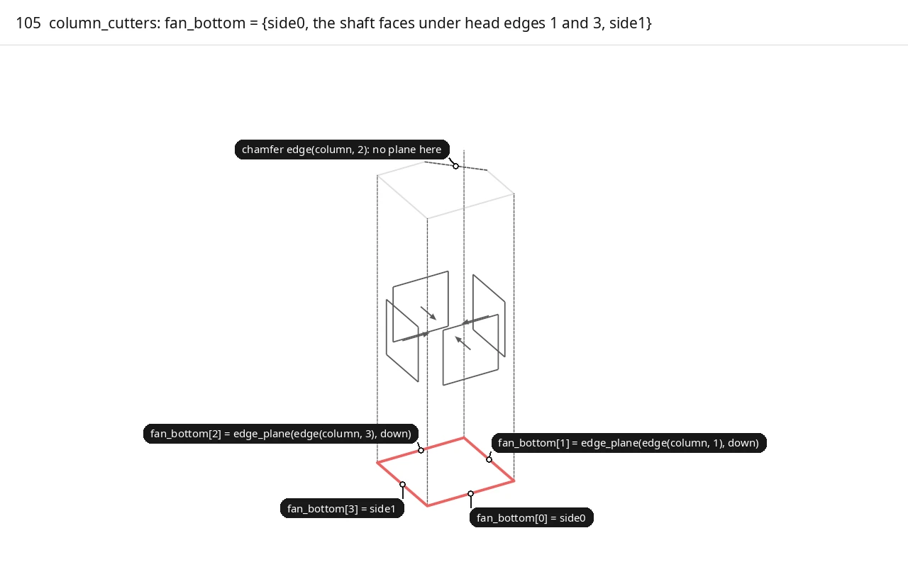

<span style="color:#2196EA">■ built</span> `fan_bottom[0..3]`   <span style="color:#EB7721">■ variable</span> the shaft square, `column_head` = 220, at `levels[2]`   <span style="color:#455B6B">■ input</span> chamfer `edge(column, 2)` and the drops to `levels[2]` (dashed)   <span style="color:#8C969E">■ context</span> the head edges

<span style="color:#2196EA">`fan_bottom = {side0, edge_plane(edge(column, 1), down), edge_plane(edge(column, 3), down), side1}`</span>. Edge 1 runs from `head[1]` to `head[2]` on x = -2780, and edge 3 from `head[3]` to `head[4]` on y = -2780. These two planes are the faces of <span style="color:#EB7721">the square shaft</span>. <span style="color:#455B6B">The chamfer edge 2</span> has no plane in this list. Below the rib-bottom level, the carve therefore returns from the chamfered head to the square shaft corner (-2780, -2780).

| Variable | Value | Meaning |
|---|---|---|
| `fan_bottom` | `{side0, x = -2780, y = -2780, side1}` | Four planes: the side planes and the two shaft faces |
| `down` | (0,0,-1) | `normal_z` of the shaft-face `edge_plane` calls |
| `edge_plane(edge(column, 1), down)` | x = -2780, n(-1,0,0) | Shaft face under head edge 1 |
| `edge_plane(edge(column, 3), down)` | y = -2780, n(0,-1,0) | Shaft face under head edge 3 |
| `column_head` | 220.0 | Shaft side |
| `column_head_chamfer` | 120.0 | Position of the chamfer vertices on the shaft faces |

```cpp
// floor_members.cpp:303
const std::vector<Plane> fan_bottom = {side0, edge_plane(geometry::edge(column, 1), down), edge_plane(geometry::edge(column, 3), down), side1};
```

Code: `Quarter::column_cutters`, [floor_members.cpp:303](https://github.com/petrasvestartas/wood/blob/0c9f4e49b3ac503e917b90c037f43f827533d641/src/templates/floor/floor_members.cpp#L303)

## 106. Cutter corners p0, p1, p2

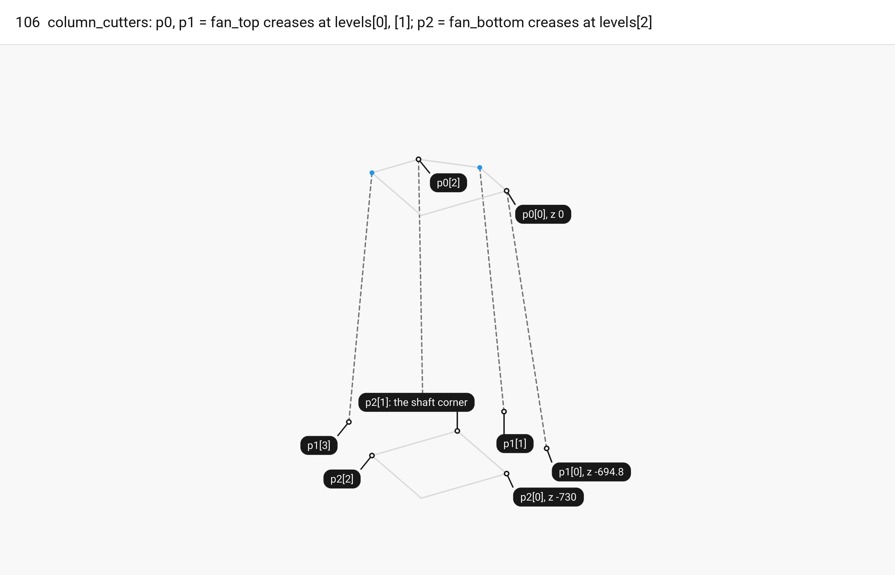

<span style="color:#2196EA">■ built</span> `p0`, `p1`: the top fan creases   <span style="color:#EBB121">■ result</span> `p2`: the bottom fan creases   <span style="color:#455B6B">■ input</span> the crease lines `fan_top[i]` x `fan_top[i + 1]` (dashed)   <span style="color:#8C969E">■ context</span> the head and the shaft square

For `i` = 0..3, <span style="color:#2196EA">`p0[i] = plane_plane_plane(xy0, fan_top[i], fan_top[i + 1])`</span> and <span style="color:#2196EA">`p1[i]`</span> is the same on `xy1`. These are the creases of the top fan at the datum and at the rib-bottom level. For `i` = 0..2, <span style="color:#EBB121">`p2[i] = plane_plane_plane(xy2, fan_bottom[i], fan_bottom[i + 1])`</span> at -730. <span style="color:#EBB121">`p2[1]`</span> is the shaft corner. Every solve is unwrapped with `.value()`, so a parallel pair would throw `std::bad_optional_access`. The frame labels eight of the eleven points. The table lists all of them.

| Variable | Value | Meaning |
|---|---|---|
| `p0` | (-2780,-3000,0) (-2780,-2880,0) (-2880,-2780,0) (-3000,-2780,0) | Top fan creases at the datum, the head corners 1 to 4 |
| `p1` | (-2677.0,-3000,-694.8) (-2677.0,-2809.7,-694.8) (-2809.7,-2677.0,-694.8) (-3000,-2677.0,-694.8) | Top fan creases at `levels[1]` |
| `p2` | (-2780,-3000,-730) (-2780,-2780,-730) (-3000,-2780,-730) | Bottom fan creases at `levels[2]` |

```cpp
// floor_members.cpp:309-315
for (size_t i = 0; i + 1 < fan_top.size(); i++) {
    p0.push_back(plane_plane_plane(xy0, fan_top[i], fan_top[i + 1]).value());
    p1.push_back(plane_plane_plane(xy1, fan_top[i], fan_top[i + 1]).value());
}

for (size_t i = 0; i + 1 < fan_bottom.size(); i++)
    p2.push_back(plane_plane_plane(xy2, fan_bottom[i], fan_bottom[i + 1]).value());
```

Code: `Quarter::column_cutters`, [floor_members.cpp:305-315](https://github.com/petrasvestartas/wood/blob/0c9f4e49b3ac503e917b90c037f43f827533d641/src/templates/floor/floor_members.cpp#L305-L315)

## 107. Six cutter quads

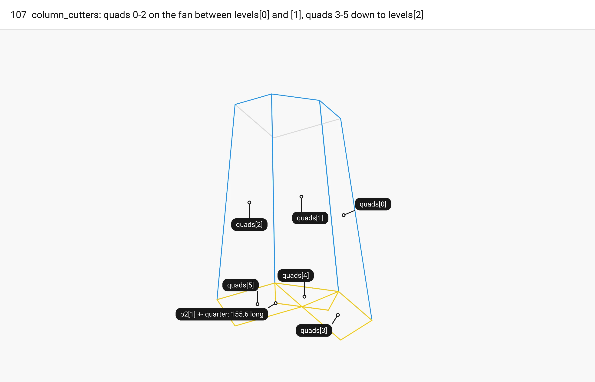

<span style="color:#2196EA">■ built</span> `quads[0..2]` on the fan   <span style="color:#EBB121">■ result</span> `quads[3..5]` down to `levels[2]`   <span style="color:#EB7721">■ variable</span> `p2[1] +- quarter`, 155.6 long   <span style="color:#8C969E">■ context</span> the head

<span style="color:#EB7721">`quarter = (p2[2] - p2[0]) * 0.25`</span>. <span style="color:#2196EA">Quads 0 to 2</span> are the three top fan faces between the datum and the rib-bottom level, `{p0[i], p0[i + 1], p1[i + 1], p1[i]}`. Only these three lie on the fan planes. <span style="color:#EBB121">Quad 3</span> = `{p1[0], p1[1], p2[1], p2[0]}` slopes from fan face 0's lower edge down to the shaft face x = -2780. <span style="color:#EBB121">Quad 4</span> = `{p1[1], p1[2], p2[1] + quarter, p2[1] - quarter}` slopes from the chamfer face's lower edge down to <span style="color:#EB7721">a 155.6 mm segment</span> centred on the shaft corner. <span style="color:#EBB121">Quad 5</span> = `{p1[2], p1[3], p2[2], p2[1]}` mirrors quad 3 onto y = -2780.

| Variable | Value | Meaning |
|---|---|---|
| `quarter` | (-55, 55, 0) | Half-width vector of quad 4's bottom edge |
| quad 4 bottom edge | (-2835,-2725,-730) to (-2725,-2835,-730), 155.6 long | `p2[1] +- quarter` |
| `quads[0..2]` | on `wedges[0][0]`, `wedges[1][0]`, `wedges[2][0]` | Top quads, between `levels[0]` and `levels[1]` |
| `quads[3..5]` | from `levels[1]` to `levels[2]` | Bottom quads |

```cpp
// floor_members.cpp:317-325
const Vector quarter = (p2[2] - p2[0]) * 0.25;
const std::vector<std::vector<Point>> quads = {
    {p0[0], p0[1], p1[1], p1[0]},
    {p0[1], p0[2], p1[2], p1[1]},
    {p0[2], p0[3], p1[3], p1[2]},
    {p1[0], p1[1], p2[1], p2[0]},
    {p1[1], p1[2], p2[1] + quarter, p2[1] - quarter},
    {p1[2], p1[3], p2[2], p2[1]},
};
```

Code: `Quarter::column_cutters`, [floor_members.cpp:317-325](https://github.com/petrasvestartas/wood/blob/0c9f4e49b3ac503e917b90c037f43f827533d641/src/templates/floor/floor_members.cpp#L317-L325)

## 108. stretch: edges lengthened

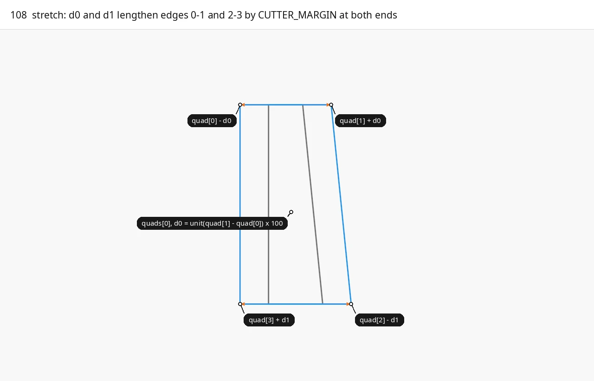

<span style="color:#2196EA">■ built</span> quad 0 lengthened   <span style="color:#EB7721">■ variable</span> `d0`, `d1`: `CUTTER_MARGIN` = 100   <span style="color:#455B6B">■ input</span> `quads[0]` before stretch

`stretch(quad, top)` grows each quad in its own plane before it is thickened. The first half sets <span style="color:#EB7721">`d0 = unit(quad[1] - quad[0]) * CUTTER_MARGIN`</span> and <span style="color:#EB7721">`d1 = unit(quad[3] - quad[2]) * CUTTER_MARGIN`</span>. <span style="color:#2196EA">Edge 0-1 is lengthened</span> by 100 mm at both ends (`quad[0] -= d0`, `quad[1] += d0`), and edge 2-3 likewise with `d1` (`quad[2] -= d1`, `quad[3] += d1`). This makes the cutter overshoot the side planes and the neighbouring fan faces, so no sliver of the head is left between two cutters. The frame looks square <span style="color:#455B6B">onto quad 0</span>.

| Variable | Value | Meaning |
|---|---|---|
| `CUTTER_MARGIN` | 100.0 | Overshoot, and also the cutter thickness (floor_members.cpp:10) |
| `d0` | 100 along `quad[1] - quad[0]` | Lengthens edge 0-1 |
| `d1` | 100 along `quad[3] - quad[2]` | Lengthens edge 2-3 |
| quad 0 after this step | (-2780,-3100,0) (-2780,-2780,0) (-2677.0,-2709.7,-694.8) (-2677.0,-3100,-694.8) | Edges lengthened, not yet moved apart |

```cpp
// floor_members.cpp:271-276
const Vector d0 = (quad[1] - quad[0]).normalized() * CUTTER_MARGIN;
const Vector d1 = (quad[3] - quad[2]).normalized() * CUTTER_MARGIN;
quad[0] = quad[0] - d0;
quad[1] = quad[1] + d0;
quad[2] = quad[2] - d1;
quad[3] = quad[3] + d1;
```

Code: `stretch`, [floor_members.cpp:268-276](https://github.com/petrasvestartas/wood/blob/0c9f4e49b3ac503e917b90c037f43f827533d641/src/templates/floor/floor_members.cpp#L268-L276)

## 109. stretch: edges pushed apart

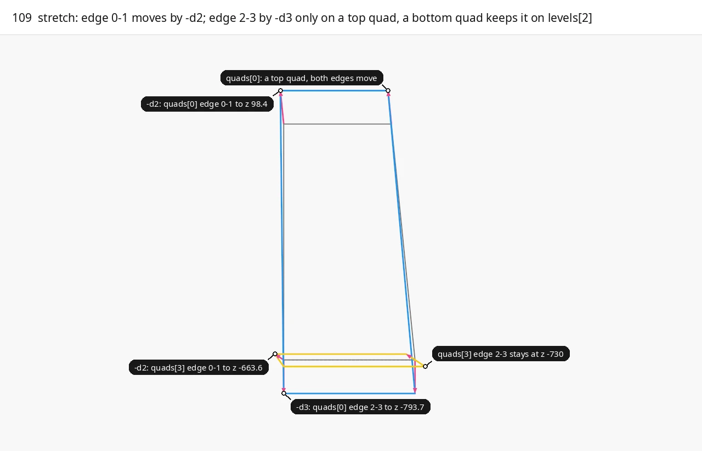

<span style="color:#2196EA">■ built</span> `quads[0]` stretched, a top quad   <span style="color:#EBB121">■ result</span> `quads[3]` stretched, a bottom quad   <span style="color:#EB7721">■ variable</span> the moves `-d2`, `-d3`   <span style="color:#455B6B">■ input</span> the two quads lengthened, `quads[3]` dashed

The second half reads <span style="color:#EB7721">`d2 = unit(quad[2] - quad[1]) * 100`</span> and <span style="color:#EB7721">`d3 = unit(quad[0] - quad[3]) * 100`</span>, both from the lengthened quad before either edge moves. Edge 0-1 always moves by `-d2`, away from edge 2-3: <span style="color:#2196EA">for a top quad</span> that is up past the datum. Edge 2-3 moves by `-d3`, away from edge 0-1 (down past the rib-bottom level), only when `top` is true, which is `i < 3`. <span style="color:#EBB121">A bottom quad</span> keeps edge 2-3 on -730, so the carve never goes deeper than `column_head_depth`. The doc comment of `stretch` (line 268) calls this move "inwards". In the code and in the numbers every edge that moves goes outward, away from the opposite edge: a top quad grows on all four sides, a bottom quad on three.

| Variable | Value | Meaning |
|---|---|---|
| `d2` | 100 along `quad[2] - quad[1]` | Edge 0-1 moves by `-d2` |
| `d3` | 100 along `quad[0] - quad[3]` | Edge 2-3 moves by `-d3`, top quads only |
| `top` | `i < 3` | Whether edge 2-3 moves |
| `quads[0]` stretched | (-2794.6,-3110,98.4) (-2794.6,-2790,98.4) (-2662.3,-2709.7,-793.7) (-2662.3,-3100,-793.7) | Top quad, grown on all sides |
| `quads[3]` stretched | (-2585.7,-3126.4,-663.6) (-2585.7,-2736.1,-663.6) (-2780,-2680,-730) (-2780,-3100,-730) | Bottom quad, edge 2-3 kept at -730 |

```cpp
// floor_members.cpp:278-286
const Vector d2 = (quad[2] - quad[1]).normalized() * CUTTER_MARGIN;
const Vector d3 = (quad[0] - quad[3]).normalized() * CUTTER_MARGIN;
quad[0] = quad[0] - d2;
quad[1] = quad[1] - d2;

if (top) {
    quad[2] = quad[2] - d3;
    quad[3] = quad[3] - d3;
}
```

Code: `stretch`, [floor_members.cpp:278-289](https://github.com/petrasvestartas/wood/blob/0c9f4e49b3ac503e917b90c037f43f827533d641/src/templates/floor/floor_members.cpp#L278-L289)

## 110. Cutter plates thickened

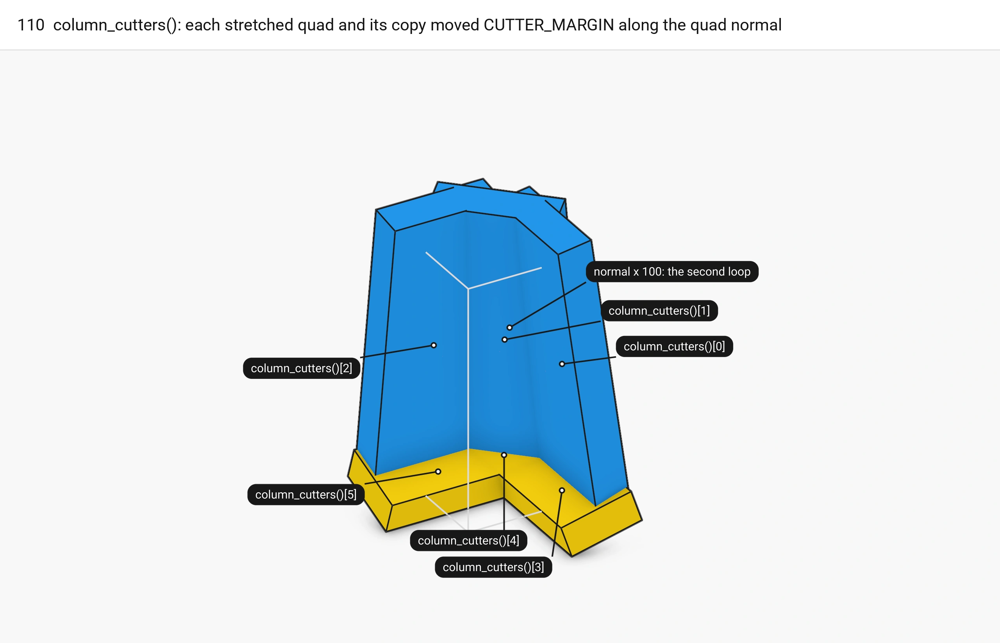

<span style="color:#2196EA">■ built</span> `column_cutters()[0..2]`, the top cutters   <span style="color:#EBB121">■ result</span> `column_cutters()[3..5]`, the bottom cutters   <span style="color:#EB7721">■ variable</span> `normal`, `CUTTER_MARGIN` = 100   <span style="color:#8C969E">■ context</span> the capitel box 340 x 340 x 730

For each stretched quad, <span style="color:#EB7721">`normal = (quad[2] - quad[1]) x (quad[1] - quad[0])`</span>, normalised and scaled by `CUTTER_MARGIN`. The outline is `{top, top translated by normal}` with `top = Polyline(quad).closed()`. That is <span style="color:#2196EA">a 100 mm slab</span> whose first face lies on the carved surface and which extends toward the bay, into the space the wedge blocks and ribs occupy. `column_cuts` later turns each outline into `to_plate(...)->element_geometry_mesh()` lifted by `bay_height`, as a `SolidCut` with `SolidOperation::difference`. `add_column_model` adds the support joint first and then pushes those six cuts onto `model.column->solid_cuts`. The frame draws <span style="color:#8C969E">the capitel box</span>, 340 x 340 x 730 (`column_head + column_head_chamfer` square, `column_head_depth` deep), in grey.

| Variable | Value | Meaning |
|---|---|---|
| `normal` of cutter 0 | (98.9,0,14.7) | 100 x the normal of `wedges[0][0]` |
| `normal` of cutter 3 | (32.3,0,-94.6) | Bottom slab under fan face 0 |
| `column_cutters()` count | 6 per quarter | One per quad |
| `outline_thickness` | 100.0 | `CUTTER_MARGIN` |

```cpp
// floor_members.cpp:329-334
for (size_t i = 0; i < quads.size(); i++) {
    const std::vector<Point> quad = stretch(quads[i], i < 3);
    const Vector normal = (quad[2] - quad[1]).cross(quad[1] - quad[0]).normalized() * CUTTER_MARGIN;
    const Polyline top = Polyline(quad).closed();
    plates.push_back({top, top.transformed(Xform::translation(normal[0], normal[1], normal[2]))});
}

// floor_elements.cpp:94-102
const Xform lift = Xform::translation(0.0, 0.0, quarter.parameters().bay_height);
std::vector<wood_session::SolidCut> cuts;

for (const Outline& outline : quarter.column_cutters()) {
    wood_session::SolidCut cut;
    cut.mesh = to_plate(outline, "column_cutter")->element_geometry_mesh().transformed(lift);
    cut.operation = wood_session::SolidOperation::difference;
    cuts.push_back(cut);
}
```

Code: `Quarter::column_cutters`, [floor_members.cpp:327-336](https://github.com/petrasvestartas/wood/blob/0c9f4e49b3ac503e917b90c037f43f827533d641/src/templates/floor/floor_members.cpp#L327-L336); `column_cuts`, [floor_elements.cpp:92-105](https://github.com/petrasvestartas/wood/blob/0c9f4e49b3ac503e917b90c037f43f827533d641/src/templates/floor/floor_elements.cpp#L92-L105); [floor_models.cpp:186-193](https://github.com/petrasvestartas/wood/blob/0c9f4e49b3ac503e917b90c037f43f827533d641/src/templates/floor/floor_models.cpp#L186-L193)
