# Floor 7: Members and columns {#templates_floor_07_elements}

[TOC]

<em>Step 7 of @ref templates_floor_model · previous: @ref templates_floor_guide · next: @ref templates_floor_08_contacts</em>

`Floor(guide, name)` builds the whole floor in its constructor.
This page covers its first three steps, `add_quarters`, `add_oculus` and `add_columns`; page 8 covers `add_contacts`.
`add_quarters` makes the six member families of every quarter: `beds`, `tsections`, `outer_ribs`, `inner_ribs`, `wedges` and `inner_beams`.
`add_oculus` makes the ring around the hole.
`add_columns` makes a column on its support at every corner.
The guide draws every loop at the datum, z 0.
`bay_height` (3500) is the storey, the floor top above the slab and the column top.
Every member is lifted from the datum to `bay_height`.
The pictures show quarter 0 of the default 6000 x 6000 bay.

Example: [templates_floor_2_column_model.cpp](https://github.com/petrasvestartas/wood/blob/main/examples/templates_floor_2_column_model.cpp) reads one column back from the floor with `get_branch("column_0")`; [templates_floor_7_contacts_cantilevers.cpp](https://github.com/petrasvestartas/wood/blob/main/examples/templates_floor_7_contacts_cantilevers.cpp) builds the whole floor.

## 201. Floor(guide)

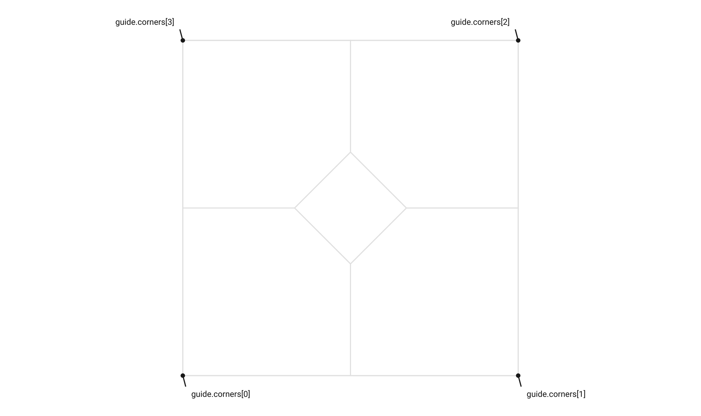

<span style="color:#737373">■ input</span> `guide.corners`   <span style="color:#A3A3A3">■ context</span> the bay edges, seams and oculus of the guide

`Floor(guide, name)` is a `WoodSession`, named `floor` by default.
It keeps its own copy of the guide.
It builds the whole floor in its constructor.

Code: `Floor::Floor`, [floor.cpp](https://github.com/petrasvestartas/wood/blob/main/src/templates/floor/floor.cpp); [floor.h](https://github.com/petrasvestartas/wood/blob/main/src/templates/floor/floor.h).

## 202. The constructor

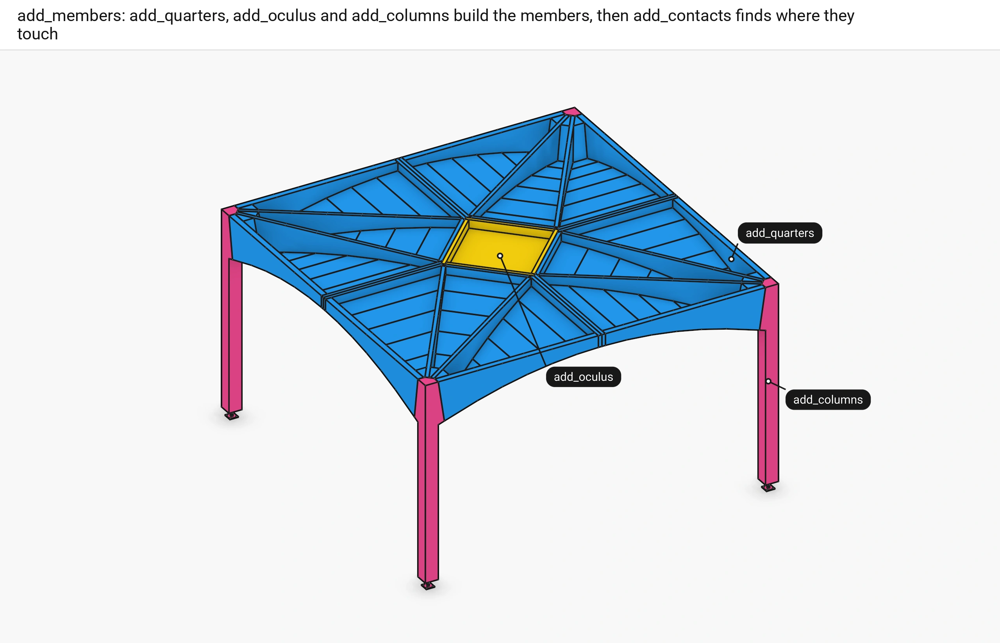

<span style="color:#2196EA">■ add_quarters</span> the quarters' members   <span style="color:#F2CC0C">■ add_oculus</span> the ring and the oculus plates   <span style="color:#E8478B">■ add_columns</span> the columns and their supports

The constructor calls six private steps in order: `add_quarters`, `add_oculus`, `add_columns`, `add_contacts`, `compute_connectors` and `add_connectors`.

```cpp
Floor::Floor(const FloorGuide& guide, const std::string& name)
    : WoodSession(name),
      guide(guide) {

    // quarters: every quarter's members, lifted to bay_height and grouped by family
    add_quarters();

    // oculus: the four ring beams, the bottom wedges and the central plate
    add_oculus();

    // columns: the column at every corner, its head carved by the guide's cutters
    add_columns();

    // contacts: per quarter an interaction between every two members that touch, named by its kind and place
    const std::array<QuarterContacts, 4> contacts = add_contacts();

    // connectors: per quarter its wedges, column plates with their cross lap, centred and headed pins, all built on uncut members
    const std::array<QuarterConnectors, 4> connectors = compute_connectors(contacts);
    add_connectors(connectors, contacts);
}
```

Code: `Floor::Floor`, [floor.cpp](https://github.com/petrasvestartas/wood/blob/main/src/templates/floor/floor.cpp).

## 203. quarter_group

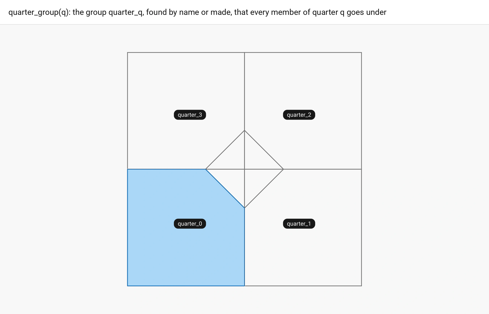

<span style="color:#2196EA">■ built</span> `quarter_0`   <span style="color:#737373">■ input</span> the other quarters' polygons

`quarter_group(q)` returns the session's group `quarter_q`, found by its name or made the first time, and every member of quarter q goes in a group under it.

Code: `Floor::quarter_group`, [floor.cpp](https://github.com/petrasvestartas/wood/blob/main/src/templates/floor/floor.cpp); `Session::group_named`, [session_cpp session.cpp:1145-1155](https://github.com/petrasvestartas/session_cpp/blob/22aba8a5262db321692f89d27f73c334772c9c5d/src/session.cpp#L1145-L1155).

## 204. The lift to the floor

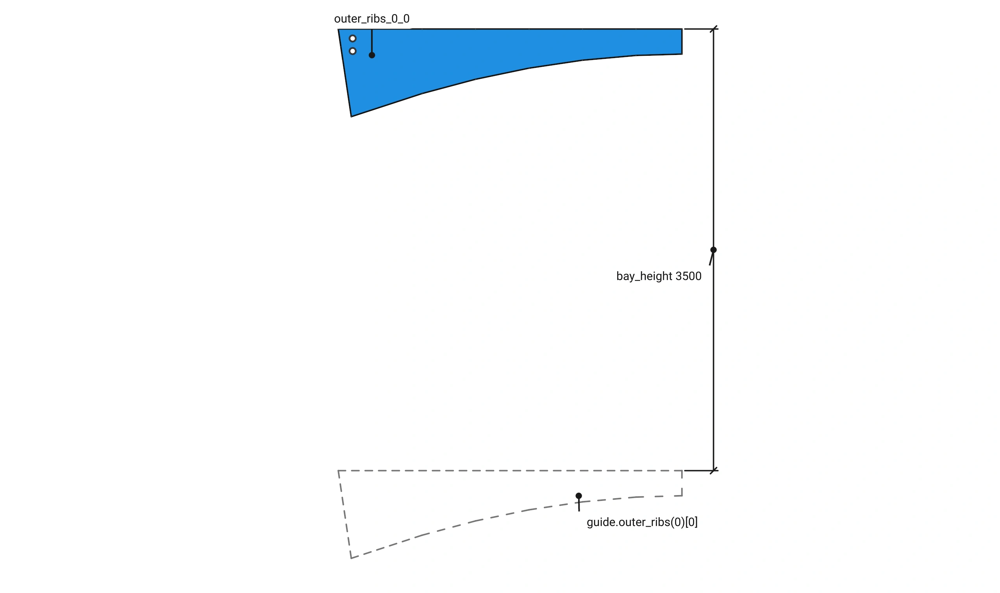

<span style="color:#2196EA">■ built</span> `outer_ribs_0_0` at the floor   <span style="color:#737373">■ input</span> its loops at the datum, dashed

The guide's loops all lie at the datum, z 0.
Each new element is made with its name, moved up by `bay_height` (3500) with `place(lift)` and added under its group.
The lift is applied in `add_quarters`, in `add_oculus` and to the column cutters in `add_column`.

```cpp
const Xform lift = Xform::translation(0.0, 0.0, guide.bay_height);
```

Code: `Floor::add_quarters`, `Floor::add_oculus`, `Floor::add_column`, [floor.cpp](https://github.com/petrasvestartas/wood/blob/main/src/templates/floor/floor.cpp).

## 205. A bed row

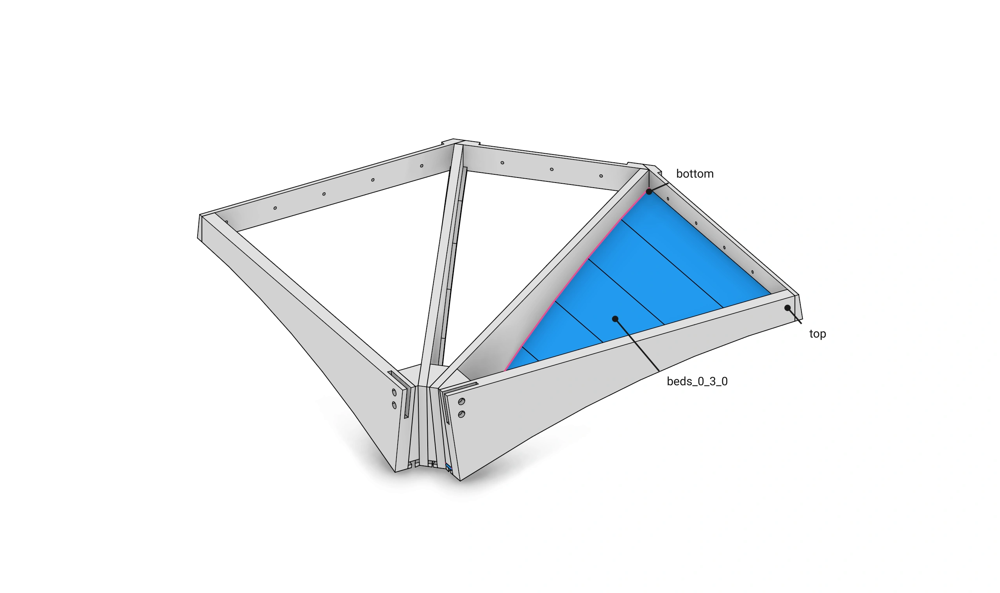

<span style="color:#2196EA">■ built</span> the plates of bed row 0   <span style="color:#737373">■ input</span> `bottom`, the two bottom rails   <span style="color:#E8478B">■ variable</span> `top`, the two top rails   <span style="color:#A3A3A3">■ context</span> the rest of quarter 0

`add_quarters` starts with the beds: `guide.bed_rails(q)` gives each row's two bottom and two top rails, and `Plate::row_between(bottom, top)` lofts one plate per rail segment, its bottom quad and its top quad.

Code: `Floor::add_quarters`, [floor.cpp](https://github.com/petrasvestartas/wood/blob/main/src/templates/floor/floor.cpp); `Plate::row_between`, [wood_element_plate.cpp](https://github.com/petrasvestartas/wood/blob/main/src/joinery_solver/wood_elements/wood_element_plate.cpp); `FloorGuide::bed_rails`, [floor_guide.cpp](https://github.com/petrasvestartas/wood/blob/main/src/templates/floor/floor_guide.cpp).

## 206. The three bed rows

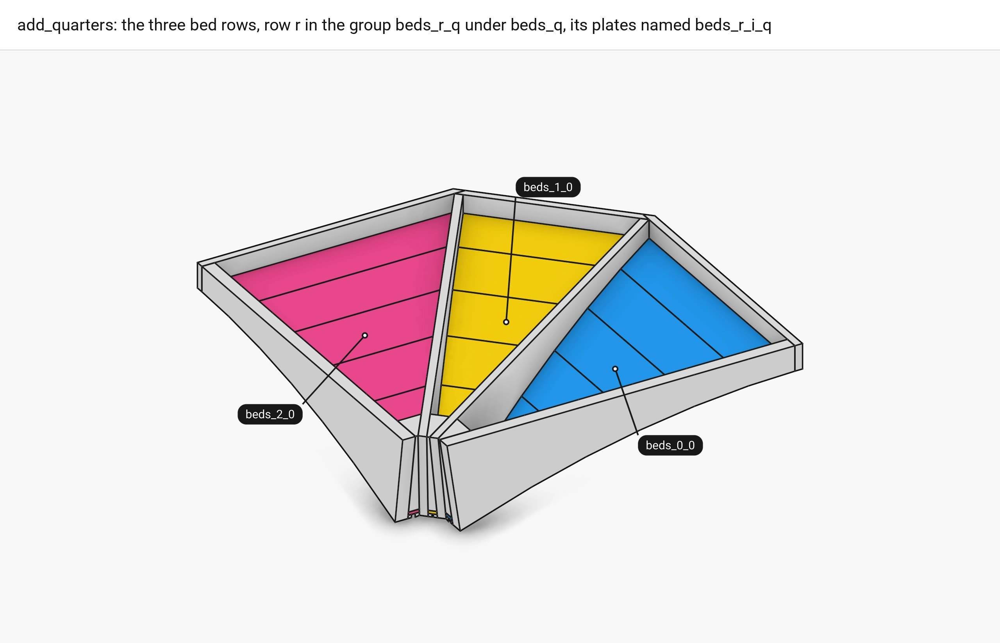

<span style="color:#2196EA">■ row 0</span>   <span style="color:#F2CC0C">■ row 1</span>   <span style="color:#E8478B">■ row 2</span>   <span style="color:#A3A3A3">■ context</span> the rest of quarter 0

Row r goes in the group `beds_r_q` under `beds_q`, its plates named `beds_r_i_q`.

Code: `Floor::add_quarters`, [floor.cpp](https://github.com/petrasvestartas/wood/blob/main/src/templates/floor/floor.cpp).

## 207. tsections

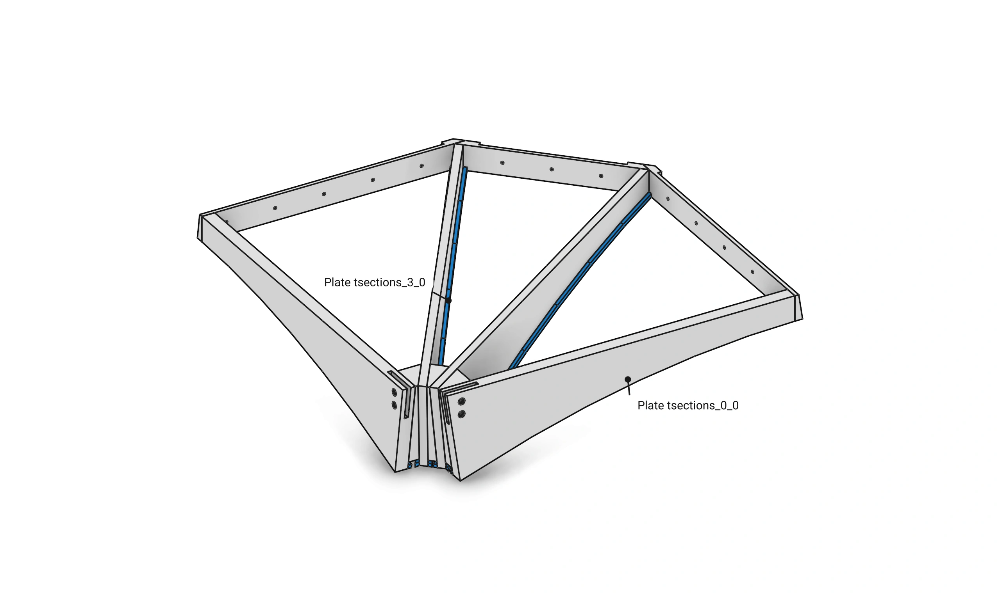

<span style="color:#2196EA">■ built</span> the six t-section plates   <span style="color:#A3A3A3">■ context</span> quarter 0 without its beds

Each `tsections` loop pair becomes `Plate(loops[1], loops[0])`, a flange strip beside a rib face named `tsections_i_q`; the beds rest on them.

Code: `Floor::add_quarters`, [floor.cpp](https://github.com/petrasvestartas/wood/blob/main/src/templates/floor/floor.cpp).

## 208. rib(): the two loops

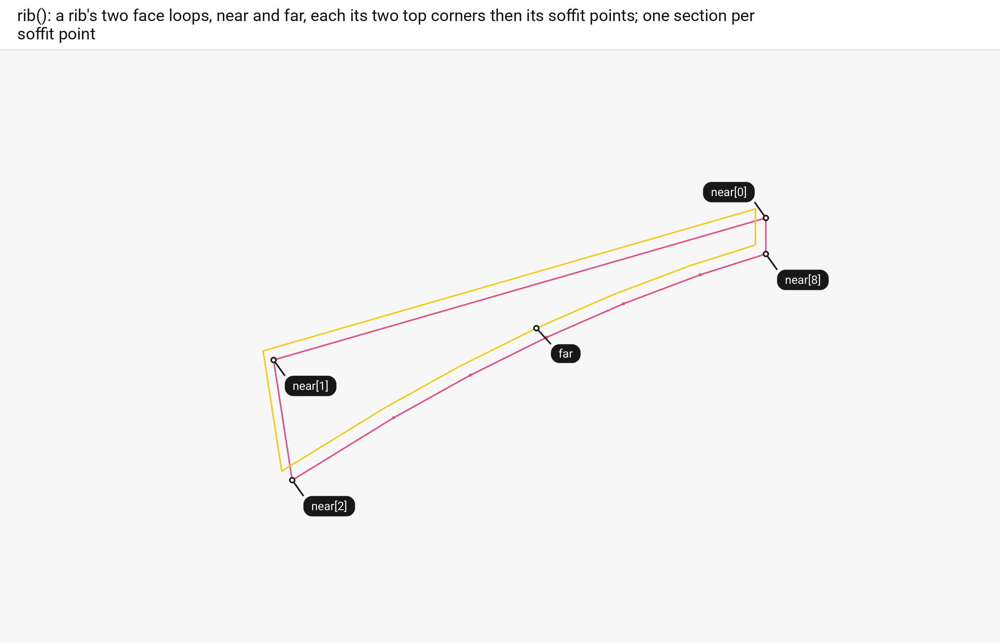

<span style="color:#E8478B">■ near</span> `loops[0]`, its soffit points dotted   <span style="color:#F2CC0C">■ far</span> `loops[1]`

The soffit is the rib's curved underside.
A rib's two face loops each list the two top corners `near[0]` and `near[1]`, then the soffit points from `near[2]`.
`rib()` makes one section per soffit point.

Code: `Floor::rib`, [floor.cpp](https://github.com/petrasvestartas/wood/blob/main/src/templates/floor/floor.cpp).

## 209. rib(): the sections

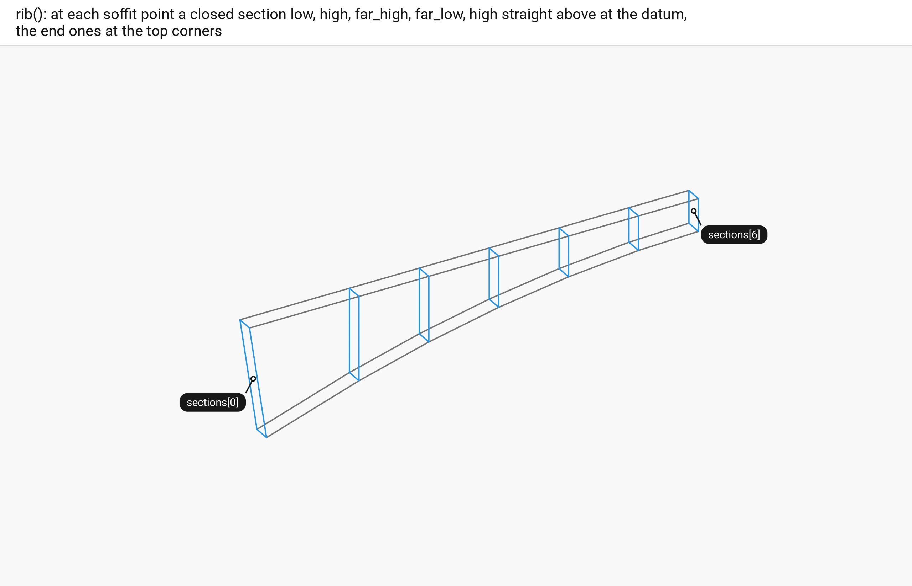

<span style="color:#2196EA">■ built</span> `sections`   <span style="color:#737373">■ input</span> the two loops

At each soffit point the section is the closed quad low, high, far_high, far_low, high straight above it at the datum, the first and last sections up to the top corners so the rib ends in its end planes.

Code: `Floor::rib`, [floor.cpp](https://github.com/petrasvestartas/wood/blob/main/src/templates/floor/floor.cpp).

## 210. rib(): the axis

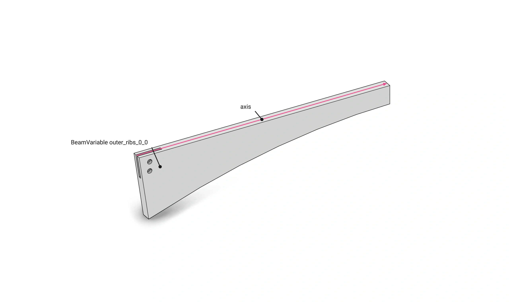

<span style="color:#E8478B">■ variable</span> `axis`   <span style="color:#A3A3A3">■ context</span> the rib it makes

The axis runs from the middle of the two loops' corners `[1]` to the middle of their corners `[0]`, and `BeamVariable(axis, sections)` is the rib.

Code: `Floor::rib`, [floor.cpp](https://github.com/petrasvestartas/wood/blob/main/src/templates/floor/floor.cpp).

## 211. outer_ribs

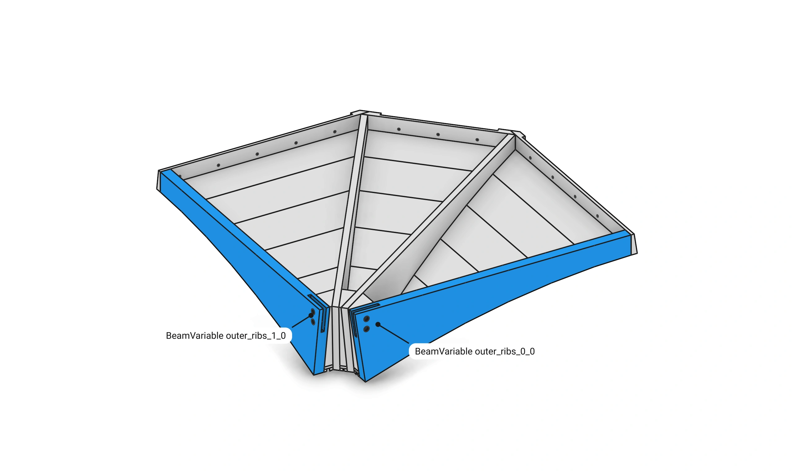

<span style="color:#2196EA">■ built</span> the two outer ribs   <span style="color:#A3A3A3">■ context</span> the rest of quarter 0

The two `outer_ribs` loop pairs become `rib()` beams named `outer_ribs_i_q`.

Code: `Floor::add_quarters`, [floor.cpp](https://github.com/petrasvestartas/wood/blob/main/src/templates/floor/floor.cpp).

## 212. inner_ribs

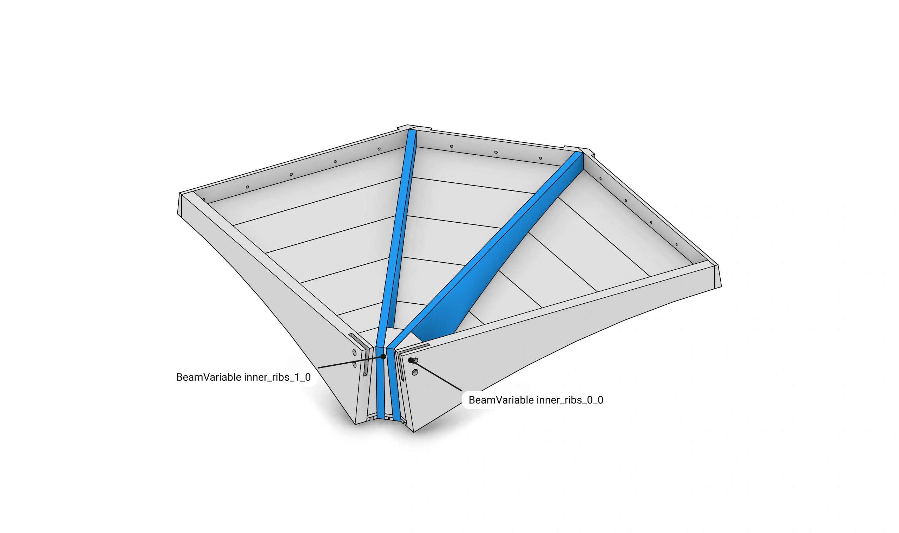

<span style="color:#2196EA">■ built</span> the two inner ribs   <span style="color:#A3A3A3">■ context</span> the rest of quarter 0

The two `inner_ribs` loop pairs become `rib()` beams named `inner_ribs_i_q`.

Code: `Floor::add_quarters`, [floor.cpp](https://github.com/petrasvestartas/wood/blob/main/src/templates/floor/floor.cpp).

## 213. wedges

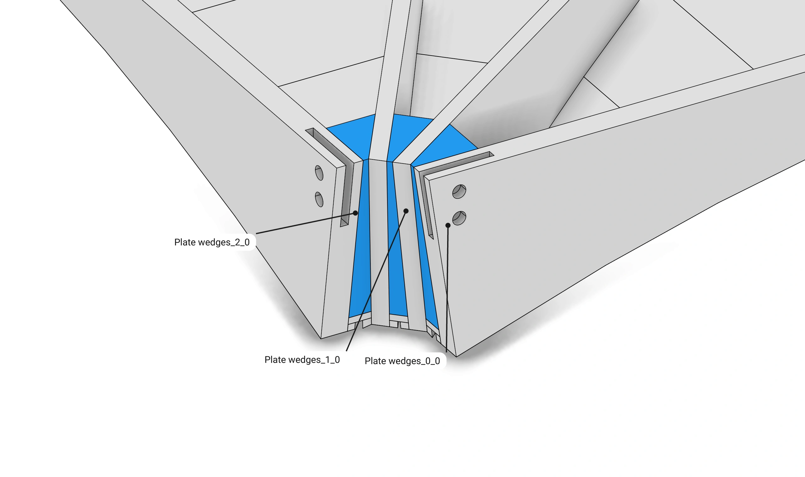

<span style="color:#2196EA">■ built</span> the three column blocks   <span style="color:#A3A3A3">■ context</span> the rest of quarter 0

The three `wedges` loop pairs, the blocks on the column head, become `Plate(loops[1], loops[0])` named `wedges_i_q`.

Code: `Floor::add_quarters`, [floor.cpp](https://github.com/petrasvestartas/wood/blob/main/src/templates/floor/floor.cpp).

## 214. beam(): the end sections

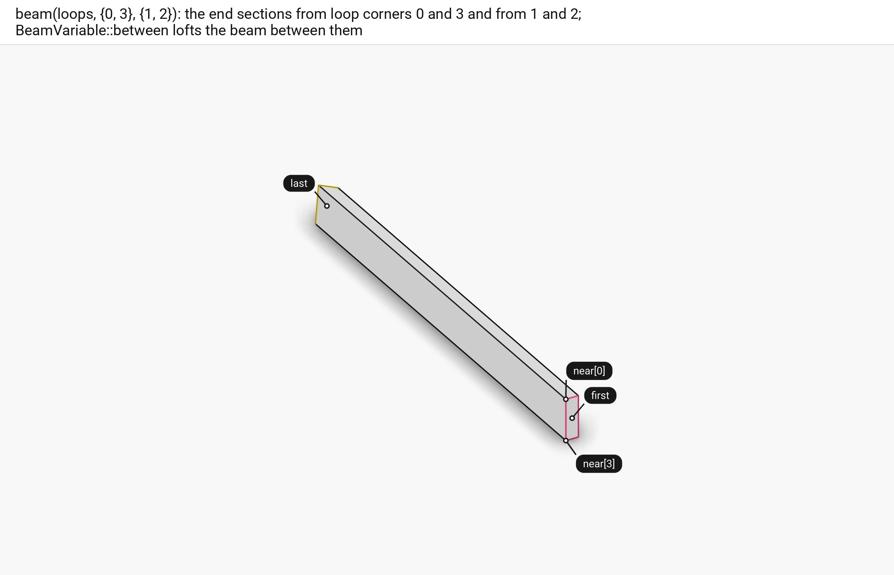

<span style="color:#E8478B">■ first</span> from loop corners 0 and 3   <span style="color:#F2CC0C">■ last</span> from loop corners 1 and 2   <span style="color:#A3A3A3">■ context</span> the beam

`beam(loops, {0, 3}, {1, 2})` takes the end sections from corners 0 and 3 and from corners 1 and 2 of both loops, and `BeamVariable::between(first, last)` lofts the beam between them.

Code: `Floor::beam`, [floor.cpp](https://github.com/petrasvestartas/wood/blob/main/src/templates/floor/floor.cpp); `BeamVariable::between`, [wood_element_beam_variable.cpp](https://github.com/petrasvestartas/wood/blob/main/src/joinery_solver/wood_elements/wood_element_beam_variable.cpp).

## 215. inner_beams

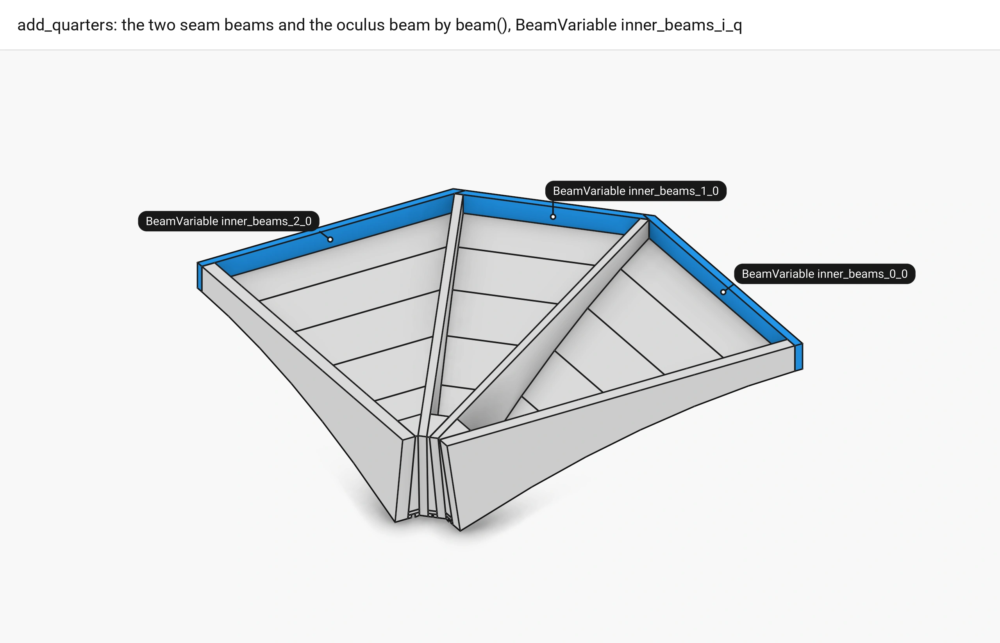

<span style="color:#2196EA">■ built</span> the two seam beams and the oculus beam   <span style="color:#A3A3A3">■ context</span> the rest of quarter 0

The three `inner_beams` loop pairs, seam 0, the oculus edge and seam 1, become `beam()` beams named `inner_beams_i_q`.

Code: `Floor::add_quarters`, [floor.cpp](https://github.com/petrasvestartas/wood/blob/main/src/templates/floor/floor.cpp).

## 216. The four quarters

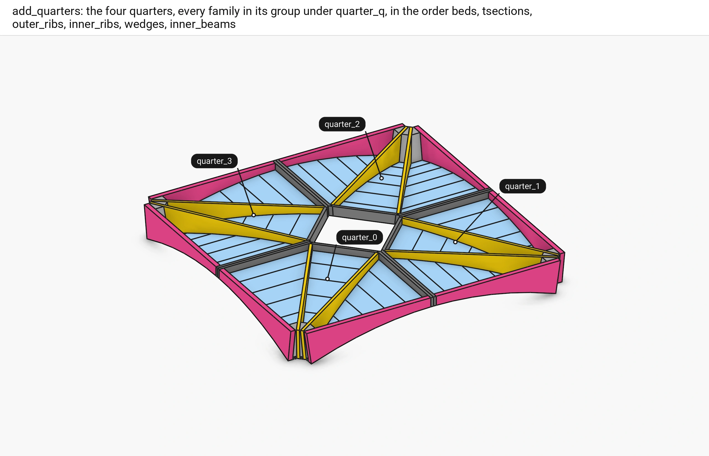

<span style="color:#E8478B">■ outer_ribs</span>   <span style="color:#F2CC0C">■ inner_ribs</span>   <span style="color:#7C7C7C">■ inner_beams</span>   <span style="color:#A8A8A8">■ wedges</span>   <span style="color:#F5D890">■ tsections</span>   <span style="color:#A6D3F6">■ beds</span>

`add_quarters` runs the same code for every quarter at its own corner, the families in the order beds, tsections, outer_ribs, inner_ribs, wedges, inner_beams, each in its group under `quarter_q`.

Code: `Floor::add_quarters`, [floor.cpp](https://github.com/petrasvestartas/wood/blob/main/src/templates/floor/floor.cpp).

## 217. add_oculus: the ring beams

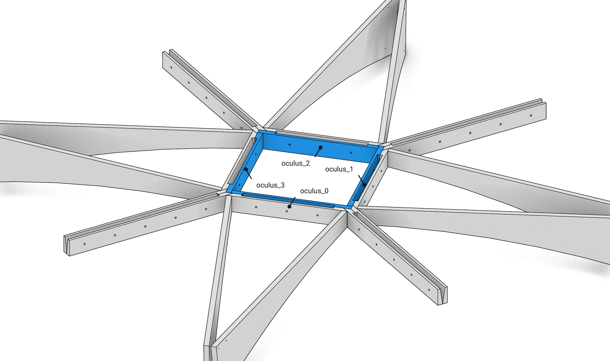

<span style="color:#2196EA">■ built</span> `oculus_0` to `oculus_3`   <span style="color:#A3A3A3">■ context</span> the quarters' inner beams and ribs

`guide.oculus()` gives nine loop pairs; the first four become ring beams by `beam(loops, {1, 0}, {2, 3})`, each named `oculus_q` in the group `ring_beams` under `oculus`.

Code: `Floor::add_oculus`, [floor.cpp](https://github.com/petrasvestartas/wood/blob/main/src/templates/floor/floor.cpp); `FloorGuide::oculus`, [floor_guide.cpp](https://github.com/petrasvestartas/wood/blob/main/src/templates/floor/floor_guide.cpp).

## 218. add_oculus: the bottom wedges

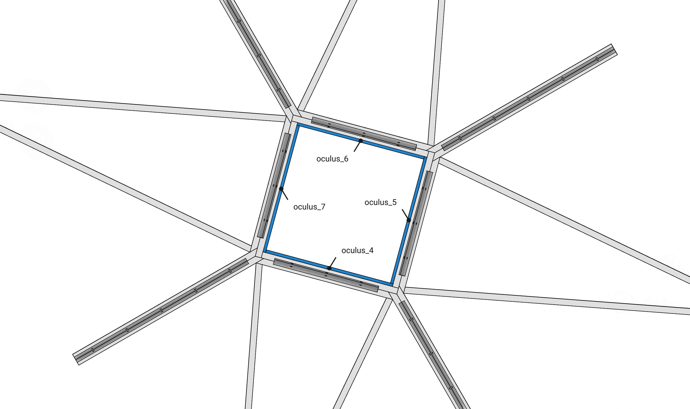

<span style="color:#2196EA">■ built</span> `oculus_4` to `oculus_7`   <span style="color:#A3A3A3">■ context</span> the ring and the quarters' members, seen from below

Loops 4 to 7 are the bottom wedges the ring beams sit on, plates named `oculus_4` to `oculus_7` in the group `bottom_wedges` under `oculus`.

Code: `Floor::add_oculus`, [floor.cpp](https://github.com/petrasvestartas/wood/blob/main/src/templates/floor/floor.cpp).

## 219. add_oculus: the central plate

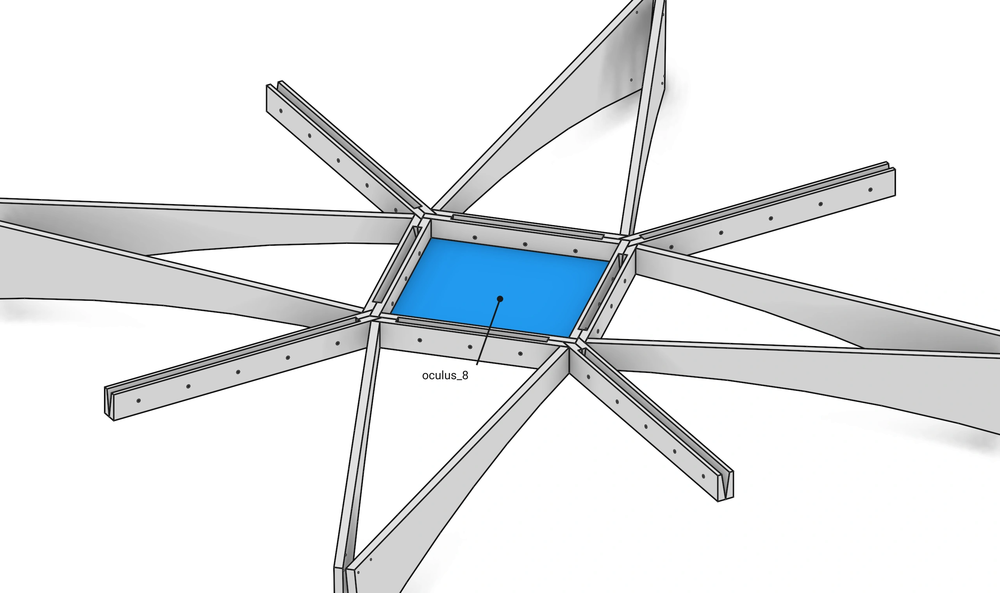

<span style="color:#2196EA">■ built</span> `oculus_8`   <span style="color:#A3A3A3">■ context</span> the ring and the quarters' members

Loop 8 is the central plate `oculus_8`, in the group `central_plate` under `oculus`.

Code: `Floor::add_oculus`, [floor.cpp](https://github.com/petrasvestartas/wood/blob/main/src/templates/floor/floor.cpp).

## 220. add_column

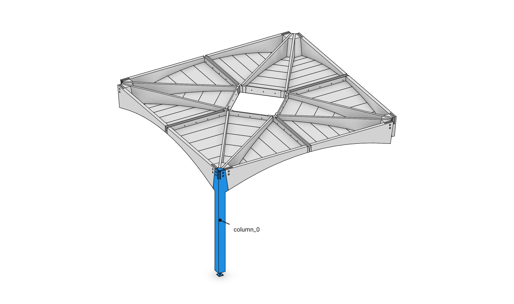

<span style="color:#2196EA">■ built</span> `column_0` and its support   <span style="color:#A3A3A3">■ context</span> the quarters

`Floor::add_column(corner)` builds the column at one corner straight into the floor, in the group `column_<corner>` of `quarter_<corner>`: the shaft, its two head blocks, the support with its seat, and the six cutters, each put on the shaft with `add_interaction`.

```cpp
const std::string name = fmt::format("column_{}", corner);
const std::shared_ptr<TreeNode> group = group_named(name, quarter_group(corner));
```

`floor.get_branch("column_0")` reads one column back as a session of its own.

Code: `Floor::add_column`, [floor.cpp](https://github.com/petrasvestartas/wood/blob/main/src/templates/floor/floor.cpp).

## 221. The support

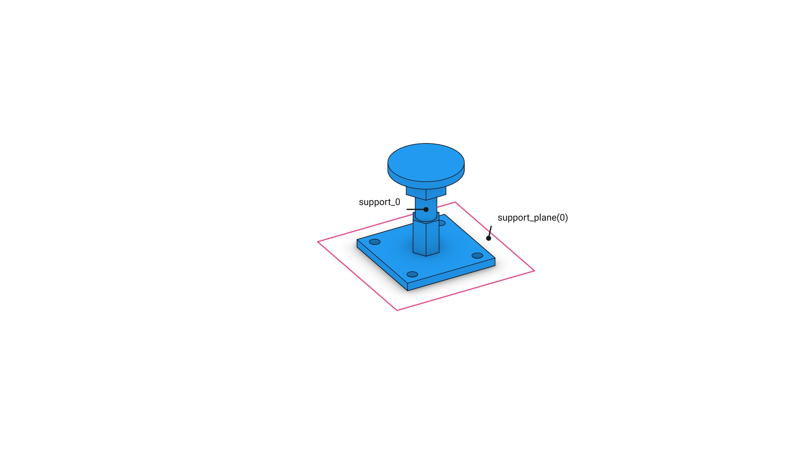

<span style="color:#2196EA">■ built</span> `support_0`   <span style="color:#E8478B">■ variable</span> `support_plane(0)`

A `Support` stands on `guide.support_plane(corner)`, its base plate on the slab under the column, named `support_<corner>`.

```cpp
const std::shared_ptr<Support> support = std::make_shared<Support>(guide.support_plane(corner), "support");
support->name = fmt::format("support_{}", corner);
```

Code: `Floor::add_column`, [floor.cpp](https://github.com/petrasvestartas/wood/blob/main/src/templates/floor/floor.cpp); `FloorGuide::support_plane`, [floor_guide.cpp](https://github.com/petrasvestartas/wood/blob/main/src/templates/floor/floor_guide.cpp).

## 222. The column axis

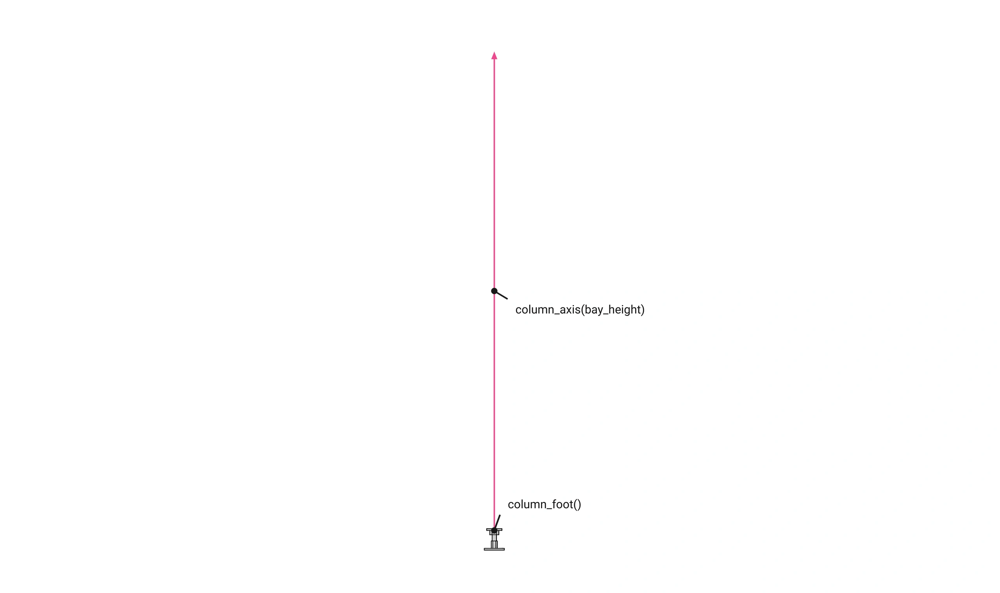

<span style="color:#E8478B">■ variable</span> `column_axis(bay_height)`   <span style="color:#A3A3A3">■ context</span> the support

The axis runs from the support's head plate, less its recess, straight up to the floor top at `bay_height`.

```cpp
const Line axis = support->column_axis(guide.bay_height);
```

Code: `Support::column_axis`, [wood_element_support.cpp](https://github.com/petrasvestartas/wood/blob/main/src/joinery_solver/wood_elements/wood_element_support.cpp).

## 223. Column::square

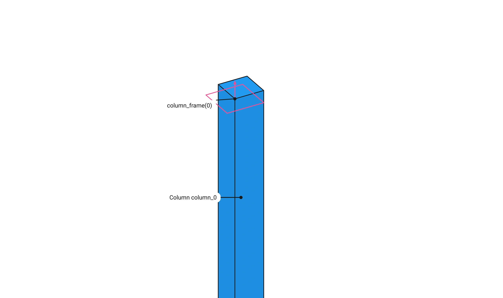

<span style="color:#2196EA">■ built</span> `column_0`, the shaft   <span style="color:#E8478B">■ variable</span> `column_frame(0)`

The shaft is the 220 square `size_column_head` swept up the axis, its sides along the corner frame's x and y.

```cpp
const Plane frame = guide.column_frame(corner);
const std::shared_ptr<Column> shaft = Column::square(
    axis,
    frame,
    guide.size_column_head,
    name
);
```

Code: `Column::square`, [wood_element_column.cpp](https://github.com/petrasvestartas/wood/blob/main/src/joinery_solver/wood_elements/wood_element_column.cpp); `FloorGuide::column_frame`, [floor_guide.cpp](https://github.com/petrasvestartas/wood/blob/main/src/templates/floor/floor_guide.cpp).

## 224. head_blocks

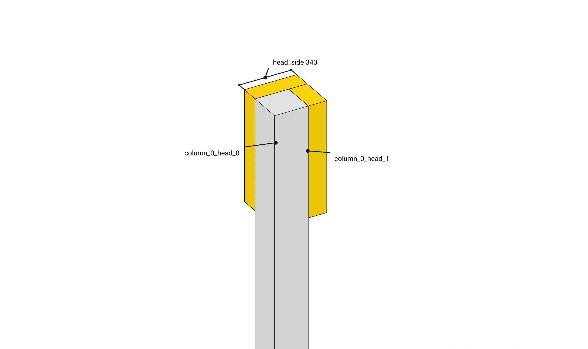

<span style="color:#F2CC0C">■ result</span> `column_0_head_0`, `column_0_head_1`   <span style="color:#A3A3A3">■ context</span> the shaft

`Column::head_blocks` makes two hidden blocks over the top `column_head_depth` (730), one beyond each bay side of the shaft, widening the head to a 340 square, `size_column_head + size_column_head_chamfer`.

```cpp
const double head_width = guide.size_column_head + guide.size_column_head_chamfer;
```

Code: `Column::head_blocks`, [wood_element_column.cpp](https://github.com/petrasvestartas/wood/blob/main/src/joinery_solver/wood_elements/wood_element_column.cpp).

## 225. The head glued on

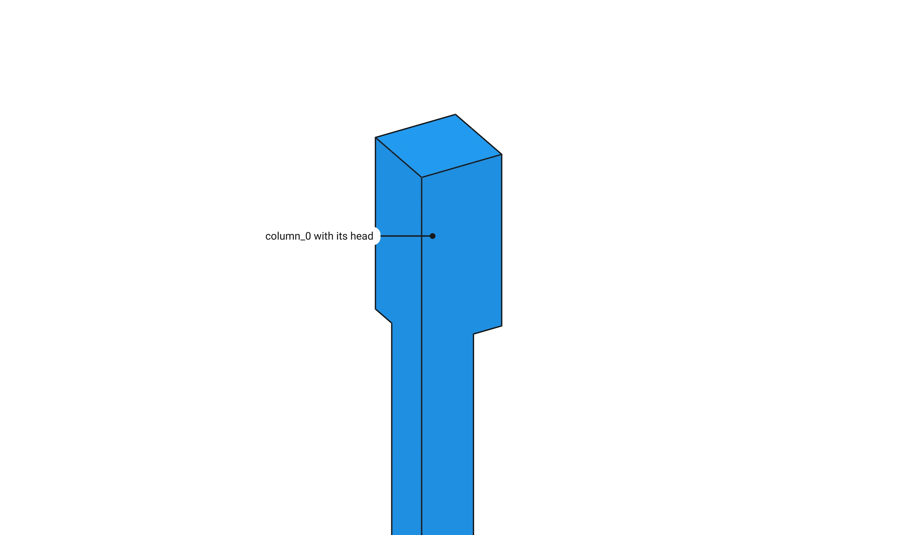

<span style="color:#2196EA">■ built</span> `column_0` with its head

The shaft is added first.
Each block is then added and glued on with a `SolidOperation::add` interaction, so the column's stock is the shaft and both blocks.

```cpp
add(shaft, group);

// the head: blocks glued on as wide as the chamfer reaches, as deep as the carved head
const double head_width = guide.size_column_head + guide.size_column_head_chamfer;

for (const std::shared_ptr<Block>& block : shaft->head_blocks(head_width, guide.column_head_depth)) {
    add(block, group);
    const std::shared_ptr<InteractionFeatureSolid> glue = std::make_shared<InteractionFeatureSolid>(block->element_geometry_mesh(), SolidOperation::add);
    add_interaction(block, shaft, glue);
}
```

Code: `Floor::add_column`, [floor.cpp](https://github.com/petrasvestartas/wood/blob/main/src/templates/floor/floor.cpp).

## 226. Joint::support

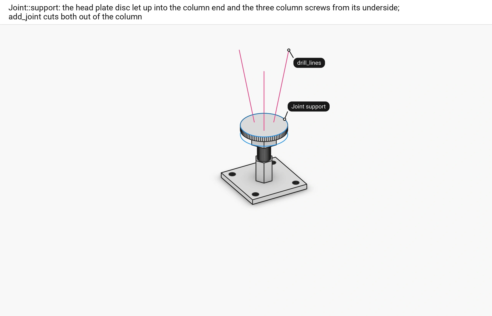

<span style="color:#2196EA">■ built</span> the head plate disc of the joint   <span style="color:#E8478B">■ variable</span> `drill_lines`, the three column pins   <span style="color:#A3A3A3">■ context</span> the support

The support is added, and its seat, `Joint::support`, lets the head plate up into the column end and drills its three pins into the shaft.

```cpp
add(support, group);
const std::shared_ptr<Joint> seat = Joint::support(*support, *shaft);
add(seat, group);
add_interaction(seat, shaft, seat->interaction(0));
```

Code: `Joint::support`, [wood_element_joint.cpp](https://github.com/petrasvestartas/wood/blob/main/src/joinery_solver/wood_elements/wood_element_joint.cpp).

## 227. The cutters

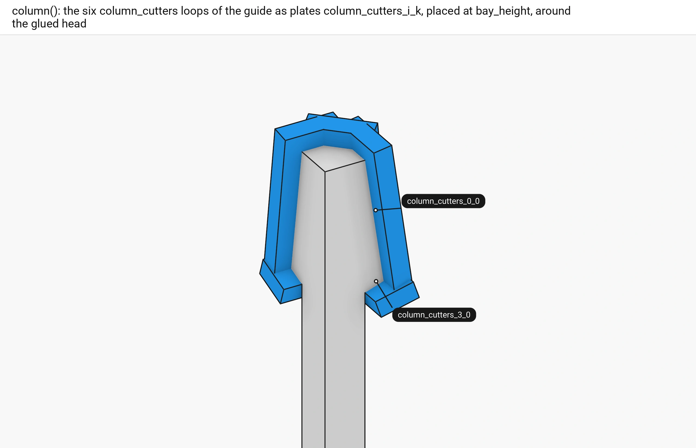

<span style="color:#2196EA">■ built</span> the six cutter plates   <span style="color:#A3A3A3">■ context</span> the glued column

The six loop pairs of `guide.column_cutters(corner)` become plates `column_cutters_<i>_<corner>`, lifted to `bay_height`.

```cpp
const std::array<std::array<Polyline, 2>, 6>& loops = guide.column_cutters(corner);
std::vector<std::shared_ptr<Plate>> cutters;

for (size_t i = 0; i < loops.size(); i++) {
    cutters.push_back(std::make_shared<Plate>(loops[i][1], loops[i][0], fmt::format("column_cutters_{}_{}", i, corner)));
    cutters.back()->place(Xform::translation(0.0, 0.0, guide.bay_height));
}
```

Code: `FloorGuide::column_cutters`, [floor_guide.cpp](https://github.com/petrasvestartas/wood/blob/main/src/templates/floor/floor_guide.cpp).

## 228. The carved head

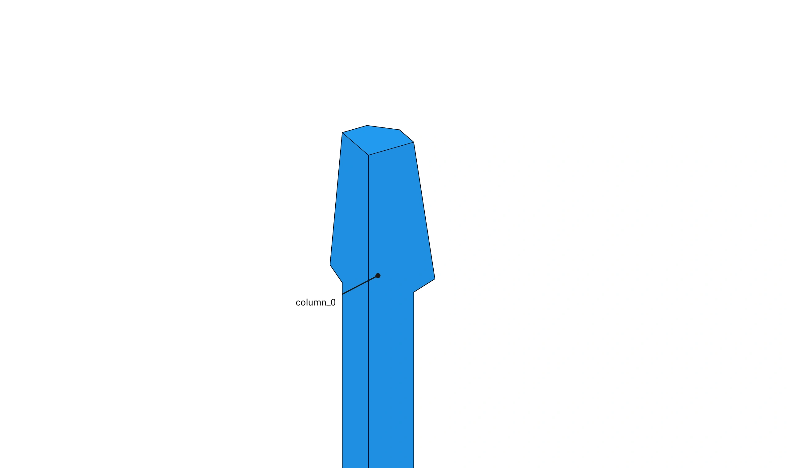

<span style="color:#2196EA">■ built</span> `column_0`

Each cutter is added hidden and taken away with a `SolidOperation::subtract` interaction, leaving the inclined faces the ribs and the column blocks bear on.

```cpp
for (const std::shared_ptr<Plate>& cutter : cutters) {
    cutter->is_visible = false;
    add(cutter, group);
    const std::shared_ptr<InteractionFeatureSolid> cut = std::make_shared<InteractionFeatureSolid>(cutter->element_geometry_mesh(), SolidOperation::subtract);
    add_interaction(cutter, shaft, cut);
}
```

Code: `Floor::add_column`, [floor.cpp](https://github.com/petrasvestartas/wood/blob/main/src/templates/floor/floor.cpp).

## 229. add_columns

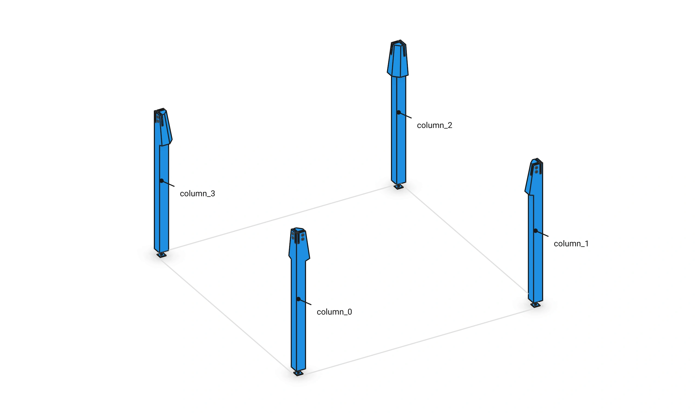

<span style="color:#2196EA">■ built</span> the four columns and their supports   <span style="color:#A3A3A3">■ context</span> the bay edges on the slab

`add_columns` runs `add_column` at every corner, `column_k` on `support_k` in `quarter_k`.

Code: `Floor::add_columns`, [floor.cpp](https://github.com/petrasvestartas/wood/blob/main/src/templates/floor/floor.cpp).
