# Floor 07: Elements and the scene {#templates_floor_07_elements}

This chapter turns the outlines of chapters 5 and 6 into scene elements. `Floor::add_members` in `src/templates/floor/floor_models.cpp` calls `add_quarters`, `add_oculus` and `add_columns`. They convert every `Outline` with `to_rib`, `to_beam` or `to_plate` (`floor_elements.cpp`), lift it from the datum z 0 to `bay_height`, name it and add it to a group of the `Floor`'s own tree. The input is the finished `FloorGuide`: its quarter views, `oculus()`, `column_cutters()`, `columns[q]` and `soffit`. The output is `Floor::members`, a `FloorMembers` of placed elements, each with the thickness the connectors of chapters 8 to 10 are sized by. The pictures show the default 6000 x 6000 bay, `FloorGuide::rectangle(3000, 3000)`.

Example: [templates_floor_4_quarters.cpp](https://github.com/petrasvestartas/wood/blob/44f9aa85952d32a9264125f4e9940e55b05a4512/examples/templates_floor_4_quarters.cpp) builds every quarter member of the floor with `Floor::add_quarters()`, and [templates_floor_5_oculus.cpp](https://github.com/petrasvestartas/wood/blob/44f9aa85952d32a9264125f4e9940e55b05a4512/examples/templates_floor_5_oculus.cpp) builds the oculus ring and plates with `Floor::add_oculus()`.

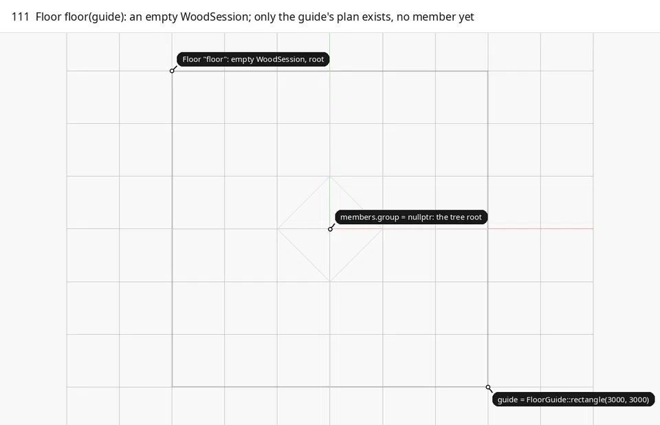

■ built what the step builds   ■ variable the variable it introduces or measures   ■ result a second result   ■ input what it reads from earlier steps, dashed for a helper   ■ context context; the frames that tell the member families apart colour each family in its own colour and give their own key.

## 111. Empty Floor session

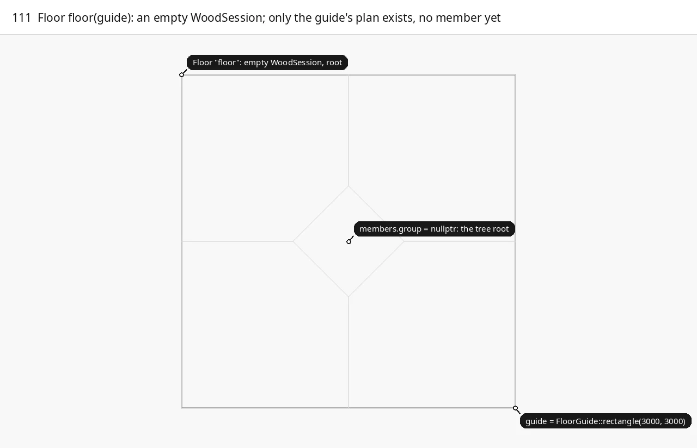

■ input `guide.edges`, the bay edges of the guide   ■ context the four quarter polygons

`Floor(guide, name)` is itself a `wood_session::WoodSession`, named `name` (`"floor"` by default). It copies the guide into the const member `guide` and starts with an empty `FloorMembers members`. No geometry is computed here: the `FloorGuide` constructor has already computed every plane, quad, parabola and level (floor.cpp:403-442). `members.group` is a null `shared_ptr`. The floor's top-level groups, `quarter_0` to `quarter_3` and `oculus`, are later passed this null parent, and `child_named` and `Session::add` read a null parent as the tree root, so they hang directly under the root. Every other group goes inside one of them.

| Variable | Value | Meaning |
|---|---|---|
| `name` | `"floor"` | Session name. |
| `guide` | `FloorGuide::rectangle(3000, 3000)`: corners (-3000,-3000,0), (3000,-3000,0), (3000,3000,0), (-3000,3000,0), counter-clockwise | Copy of the guide every member is built from. |
| `members` | empty | Placed members by quarter and family, the ring and the column models. |
| `members.group` | `nullptr` | Parent of the floor's groups; null means the tree root. |

Code: `Floor::Floor`, [floor_models.cpp:408-409](https://github.com/petrasvestartas/wood/blob/16f3ab0a2386bf39ac7f7123c0a20d03e73ab1a5/src/templates/floor/floor_models.cpp#L408-L409); [floor.h:520-556](https://github.com/petrasvestartas/wood/blob/16f3ab0a2386bf39ac7f7123c0a20d03e73ab1a5/src/templates/floor/floor.h#L520-L556).

## 112. add_members order

`add_members` calls three functions in a fixed order. Each one finds or creates its groups by name, so the order of the calls fixes the order of the children in the tree.

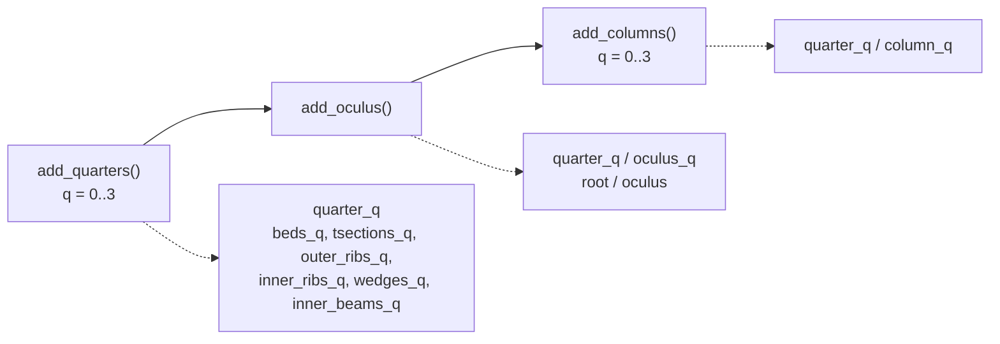
```mermaid
flowchart LR
    A["add_quarters()<br/>q = 0..3"] --> B["add_oculus()"]
    B --> C["add_columns()<br/>q = 0..3"]
    A -.-> A1["quarter_q<br/>beds_q, tsections_q, outer_ribs_q,<br/>inner_ribs_q, wedges_q, inner_beams_q"]
    B -.-> B1["quarter_q / oculus_q<br/>root / oculus"]
    C -.-> C1["quarter_q / column_q"]
```

Inside each `quarter_q` the six family groups come first, then `oculus_q`, then `column_q`. The `connectors_q` groups come later, from `add_connectors` (chapter 9), and are not part of `add_members`.

| Variable | Value | Meaning |
|---|---|---|
| `members.quarters` | 4 `QuarterMembers` | Filled by `add_quarters`. |
| `members.ring`, `members.oculus` | 4 ring beam `Member`s; the root `oculus` node | Filled by `add_oculus`. |
| `members.columns` | 4 `ColumnModel`s | Filled by `add_columns`. |

Code: `Floor::add_members`, [floor_models.cpp:437-442](https://github.com/petrasvestartas/wood/blob/16f3ab0a2386bf39ac7f7123c0a20d03e73ab1a5/src/templates/floor/floor_models.cpp#L437-L442).

## 113. quarter_q groups (find or create)

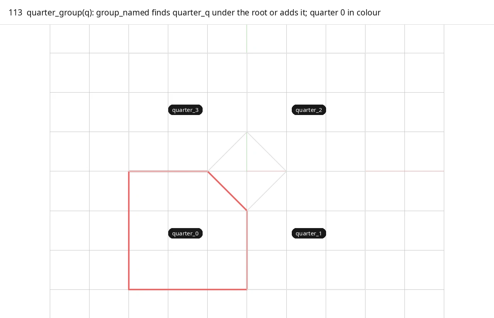

■ built `quarter_0`, the plan of the group found or made   ■ context `quarter_1` .. `quarter_3` and the bay edges

For q = 0..3, `add_quarters` calls `quarter_group(*this, members.group, q)`, which calls `group_named(session, parent, "quarter_q")`. `group_named` first calls `child_named`: it takes `parent`, or `tree.root()` when `parent` is null, and scans that node's children for a `TreeNode` named exactly `quarter_q`. If one is found it is returned. If none is found, `add_group` makes `std::make_shared<TreeNode>(name)` and attaches it with `Session::add(node, parent)`, which appends it after the parent's other children. The same call therefore creates `quarter_q` the first time and finds it every later time: in `add_oculus_model`, `add_column` and the connector groups. The tree layout is decided by names only.

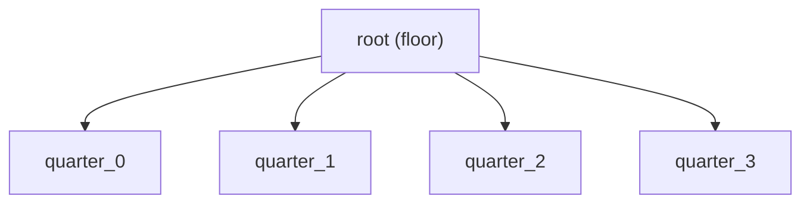
```mermaid
flowchart TD
    R["root (floor)"] --> Q0["quarter_0"]
    R --> Q1["quarter_1"]
    R --> Q2["quarter_2"]
    R --> Q3["quarter_3"]
```

| Variable | Value | Meaning |
|---|---|---|
| `q` | 0..3 | Quarter index, counter-clockwise from corner 0. |
| `quarter_q` | `quarter_0` .. `quarter_3` | Group node per quarter under the root, created in order 0..3. |
| quarter 0 polygon | (-3000,-3000), (0,-3000), (0,-1000), (-1000,0), (-3000,0) | The plan of the quarter the group holds. |

Code: `Floor::add_quarters`, `quarter_group`, `group_named`, `child_named`, `add_group`, [floor_models.cpp:425-429](https://github.com/petrasvestartas/wood/blob/16f3ab0a2386bf39ac7f7123c0a20d03e73ab1a5/src/templates/floor/floor_models.cpp#L425-L429), [87-89](https://github.com/petrasvestartas/wood/blob/16f3ab0a2386bf39ac7f7123c0a20d03e73ab1a5/src/templates/floor/floor_models.cpp#L87-L89), [79-84](https://github.com/petrasvestartas/wood/blob/16f3ab0a2386bf39ac7f7123c0a20d03e73ab1a5/src/templates/floor/floor_models.cpp#L79-L84), [64-76](https://github.com/petrasvestartas/wood/blob/16f3ab0a2386bf39ac7f7123c0a20d03e73ab1a5/src/templates/floor/floor_models.cpp#L64-L76), [129-135](https://github.com/petrasvestartas/wood/blob/16f3ab0a2386bf39ac7f7123c0a20d03e73ab1a5/src/templates/floor/floor_models.cpp#L129-L135); [session.cpp:1103-1113](https://github.com/petrasvestartas/session_cpp/blob/2c02829d07674c1a5a04f03519611f7ad1f1655c/src/session.cpp#L1103-L1113).

## 114. Lift to bay_height and beds_q

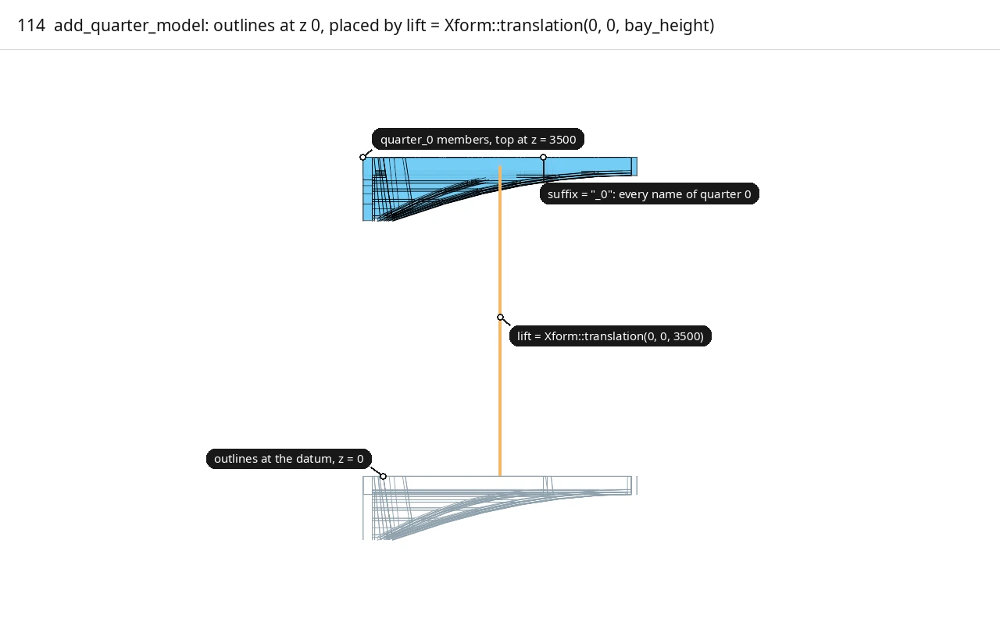

■ built quarter 0 members placed at `bay_height`   ■ variable `lift = Xform::translation(0, 0, 3500)`   ■ input quarter 0 outlines at z 0

Every outline of a `Quarter` view is built at the floor datum z 0, with the members hanging below it. `add_quarter_model` first makes `lift = Xform::translation(0, 0, parameters().bay_height)`, the name suffix `"_{view.index}"` and `beds = view.beds()`, the three rows of bed outlines. It then adds the group `beds_q` under `quarter_q` before any member is built, and records `quarter.group = quarter_q`. After that it builds the families in this order: beds, tsections, outer_ribs, inner_ribs, wedges, inner_beams. In the picture the outlines are drawn at the real z 0 and the placed members above them, their top at z 3500. The lift is applied only through `place()`: the helpers `lifted` and `above` (floor_geometry.cpp:165-196) are not called here. The relationships of chapter 8 use them to lift contacts to the floor and to clip a contact at a level (floor_relations.cpp:102).

| Variable | Value | Meaning |
|---|---|---|
| `lift` | `Xform::translation(0, 0, 3500)` | Translation every quarter member is placed by. |
| `suffix` | `"_0"` for quarter 0 | Ends every group and element name of the quarter. |
| `beds` | 3 rows | Bed outlines: outer row 0, central row, outer row 1. |
| `bed_group` | `beds_0` | Group node `beds_q` under `quarter_q`. |
| `bay_height` | 3500 | Storey height: floor top and column top. |

Code: `add_quarter_model`, [floor_models.cpp:137-163](https://github.com/petrasvestartas/wood/blob/16f3ab0a2386bf39ac7f7123c0a20d03e73ab1a5/src/templates/floor/floor_models.cpp#L137-L163) (set-up 128-133).

## 115. outline_thickness

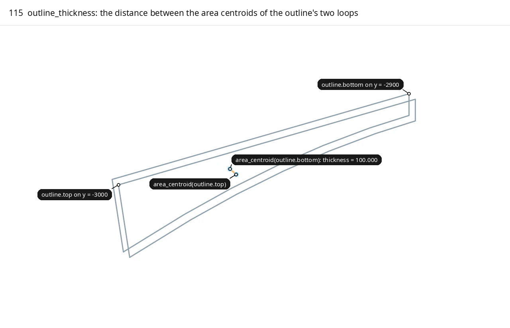

■ built `area_centroid` of each loop   ■ variable `thickness`, the distance between them   ■ input `outline.top` and `outline.bottom` of outer rib 0

Each `Member` stores `thickness = outline_thickness(outline)`, computed before the element is built. `outline_thickness` returns `|area_centroid(outline.top) - area_centroid(outline.bottom)|`. `area_centroid` drops the closing point (`open_points`), takes the normalised Newell normal, fans triangles from `points[0]` and sums each triangle's centroid weighted by its signed area along that normal, so it returns the true area centroid, not the vertex mean. For two parallel loops facing each other this distance is the face offset. For tilted loops it is the distance between the centroids, at least the face offset. The connectors read this value later through `FloorMembers::thickness` (frame 141).

| Variable | Value | Meaning |
|---|---|---|
| `Member::thickness` | outer rib 100.000; oculus inner beam between 60 and 90; middle wedge more than 300 | Distance between the two loops' area centroids. |
| `outline.top` / `outline.bottom` of outer rib 0 | on y = -3000 / y = -2900 | The two rib faces. |
| `outer_ribs` / `inner_ribs` / `inner_beams` / `tsections` | 100 / 60 / 60 / 27 | Face offsets the loops were built with. |

Code: `outline_thickness`, [floor_elements.cpp:107-109](https://github.com/petrasvestartas/wood/blob/16f3ab0a2386bf39ac7f7123c0a20d03e73ab1a5/src/templates/floor/floor_elements.cpp#L107-L109); `area_centroid`, [floor_geometry.cpp:180-195](https://github.com/petrasvestartas/wood/blob/16f3ab0a2386bf39ac7f7123c0a20d03e73ab1a5/src/templates/floor/floor_geometry.cpp#L180-L195).

## 116. to_members dispatch

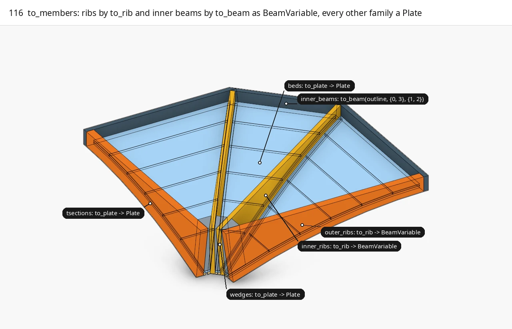

■ outer_ribs `outer_ribs`   ■ inner_ribs `inner_ribs`   ■ inner_beams `inner_beams`   ■ wedges `wedges`   ■ tsections `tsections`   ■ beds `beds`

`to_members(family, outlines)` takes `name = FAMILY_NAMES[family]` and builds one `Member` per outline, in outline order. `outer_ribs` and `inner_ribs` become `to_rib(outline, name)`. `inner_beams` become `to_beam(outline, {0, 3}, {1, 2}, name)`. Every other family (wedges, tsections, beds) becomes `to_plate(outline, name)`, which is `Plate(outline.bottom, outline.top, name)`. The constructor's `name` is only the element's first name; `add_named` overwrites it in frame 118.

| Family | Built by | Element type | Count per quarter |
|---|---|---|---|
| `outer_ribs` | `to_rib` | `BeamVariable` | 2 |
| `inner_ribs` | `to_rib` | `BeamVariable` | 2 |
| `inner_beams` | `to_beam(outline, {0, 3}, {1, 2})` | `BeamVariable` | 3 |
| `wedges` | `to_plate` | `Plate` | 3 |
| `tsections` | `to_plate` | `Plate` | 6 |
| `beds` | `to_plate` | `Plate` | 3 rows |

| Variable | Value | Meaning |
|---|---|---|
| `family` | a `Family` | Which family the outlines are. |
| `name` | `FAMILY_NAMES[family]`, e.g. `"outer_ribs"` | The element's first name. |
| `members` | `std::vector<Member>` | One per outline, each with `element` and `thickness`. |

Code: `to_members`, [floor_models.cpp:9-29](https://github.com/petrasvestartas/wood/blob/16f3ab0a2386bf39ac7f7123c0a20d03e73ab1a5/src/templates/floor/floor_models.cpp#L9-L29); [floor.h:291-313](https://github.com/petrasvestartas/wood/blob/16f3ab0a2386bf39ac7f7123c0a20d03e73ab1a5/src/templates/floor/floor.h#L291-L313).

## 117. Bed plates

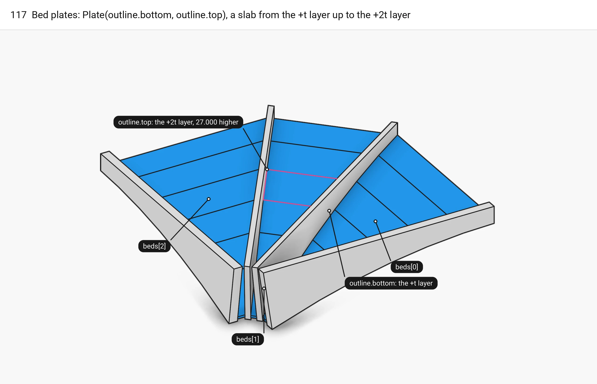

■ built `quarter.beds`, the bed plates   ■ variable `outline.top`, the +2t layer, `tsections` = 27 higher   ■ input `outline.bottom`, the +t layer   ■ context the ribs

For each bed row, `to_members(Family::beds, beds[row])` turns every bed outline into `Plate(outline.bottom, outline.top, "beds")`. The outlines come from `bed_row`: it trims the +t traces (`lower`) and the +2t traces (`upper`) on the panel's two side planes with `trim_alike`, which pushes both end points out by `EXTENSION` and cuts all four traces by the oculus or seam beam face and the fan plane on the same segment, so the four keep the same point count, on a skewed bay too. It then makes one quad pair per trimmed segment i: `bottom = {lower[0][i], lower[0][i+1], lower[1][i+1], lower[1][i], lower[0][i]}` and `top` the same on `upper`. For the two outer rows the traces are `parabolas[k][1]` and `[k][2]` projected along the outer rib normal onto `cp.inner_ribs[k][0]` and `cp.outer_ribs[k][1]`. For the central row they are `central_panel.traces[*][1]` and `[*][2]`. Each plate is therefore a slab from the flange top (+t) to the bed top (+2t). The `Plate` constructor reverses both loops when needed, so that the bottom normal points away from the top.

| Variable | Value | Meaning |
|---|---|---|
| `quarter.beds[row][i]` | central bed plates 27.000 thick | Plate per bed segment. |
| `lower` / `upper` | +t / +2t traces, two each | The plate's bottom and top layer on the panel's two sides. |
| `tsections` | 27 | Layer offset t: bed bottom at +t, top at +2t over the soffit. |

Code: `to_plate`, [floor_elements.cpp:70-72](https://github.com/petrasvestartas/wood/blob/16f3ab0a2386bf39ac7f7123c0a20d03e73ab1a5/src/templates/floor/floor_elements.cpp#L70-L72); `bed_row`, `outer_bed_row`, `Quarter::beds`, [floor_members.cpp:189-226](https://github.com/petrasvestartas/wood/blob/16f3ab0a2386bf39ac7f7123c0a20d03e73ab1a5/src/templates/floor/floor_members.cpp#L189-L226); [floor_models.cpp:146-149](https://github.com/petrasvestartas/wood/blob/16f3ab0a2386bf39ac7f7123c0a20d03e73ab1a5/src/templates/floor/floor_models.cpp#L146-L149).

## 118. add_family: groups, names, place()

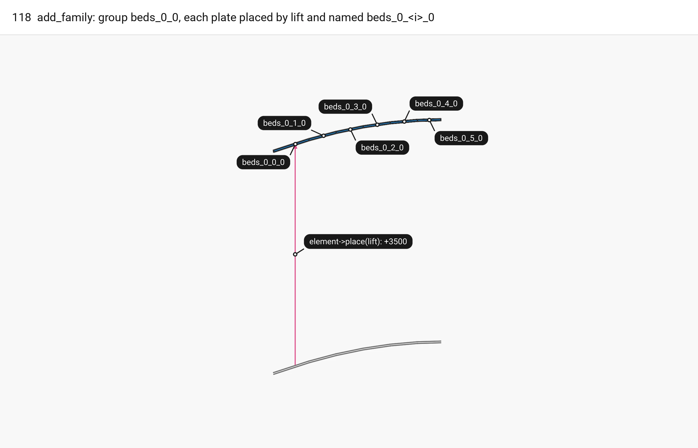

■ built `beds_0_i_0`, row 0 placed and named   ■ variable `lift`, +3500   ■ input bed row 0 outlines at z 0

`add_family(session, members, lift, prefix, suffix, parent)` first adds a group named `prefix + suffix` under `parent`. For each member i, `add_placed` calls `element->place(lift)`, which bakes the translation into the element: its mesh, its features and, for a `Plate` or `BeamVariable`, its own outlines or axis and sections. No node xform is stored. The name is formatted in `add_family` as `fmt::format("{}_{}{}", prefix, i, suffix)`. `add_named` then sets `element->name` to it and calls `session.add(element, node)`. For the beds the prefix is `"beds_{row}"` and the parent is `bed_group`, which gives `beds_q / beds_{row}_q / beds_{row}_{i}_q`. Every other family uses its `FAMILY_NAMES` entry directly under `quarter_q`, e.g. `outer_ribs_0 / outer_ribs_1_0`.

| Variable | Value | Meaning |
|---|---|---|
| `lift` | `translation(0, 0, 3500)` | Xform baked into the element by `place()`. |
| `beds_{row}_q` group | `beds_0_0`, `beds_1_0`, `beds_2_0` in quarter 0 | One group per bed row inside `beds_q`. |
| element name | `<prefix>_<i><suffix>`, e.g. `beds_1_3_0` = row 1, plate 3, quarter 0 | Set by `add_named`. |

Code: `add_family`, `add_placed`, `add_named`, [floor_models.cpp:46-52](https://github.com/petrasvestartas/wood/blob/16f3ab0a2386bf39ac7f7123c0a20d03e73ab1a5/src/templates/floor/floor_models.cpp#L46-L52), [39-43](https://github.com/petrasvestartas/wood/blob/16f3ab0a2386bf39ac7f7123c0a20d03e73ab1a5/src/templates/floor/floor_models.cpp#L39-L43), [32-36](https://github.com/petrasvestartas/wood/blob/16f3ab0a2386bf39ac7f7123c0a20d03e73ab1a5/src/templates/floor/floor_models.cpp#L32-L36); [element.cpp:464-482](https://github.com/petrasvestartas/session_cpp/blob/2c02829d07674c1a5a04f03519611f7ad1f1655c/src/element.cpp#L464-L482).

## 119. T-section plates

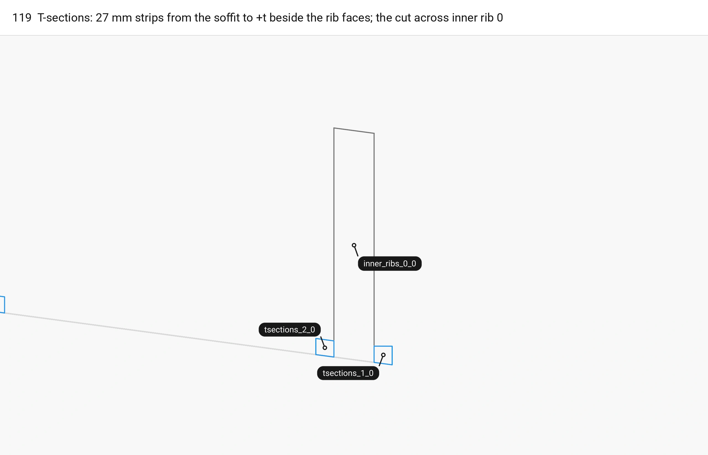

■ built the t-section strips, `tsections_1_0` and `tsections_2_0` named   ■ input `inner_ribs_0_0`, the rib the two strips lie beside   ■ context the other ribs

`view.tsections()` returns six outlines beside the rib faces, in this order: outer rib 0, inner rib 0 outer face, inner rib 0 central face, inner rib 1 central face, inner rib 1 outer face, outer rib 1. For flanges 0, 1, 4 and 5 the outer parabola and its +t layer are first projected along the outer rib normal onto `ts[k][0]`; flanges 2 and 3 read `central_panel.traces[r][0]` and `[r][1]`, which already lie on the central faces. Each outline's `top` lies on the flange's first plane `ts[k][0]`: `cut00` (the soffit trace trimmed between the seam or oculus beam face and the fan plane), then `cut10` (the trimmed +t trace) reversed, then `cut00.front()` to close it. Its `bottom` is the soffit trace and the +t trace projected onto `ts[k][1]`, each with its own projection, then trimmed. The projections differ: flanges 0 and 5 project both traces along the outer rib normal; flanges 1 and 4 project the soffit along `central_panel.rib_sweep` and the +t trace along the outer rib normal; flanges 2 and 3 project the soffit along `rib_sweep` and the +t trace along `central_panel.ruling`. `to_plate` makes `Plate(bottom, top, "tsections")`, and `add_family` adds `tsections_0_q` .. `tsections_5_q` under `tsections_q`, lifted by 3500. The picture cuts the lifted outlines with a vertical plane across the quarter. The plane passes through the point 0.35 of the way from column 0's `axis_point` to the bay centre, with its normal along that diagonal, and each loop's two crossings come from `Intersection::polyline_plane`. The other ribs are context. At 27 mm a strip is too small to read across the whole quarter, so the picture frames inner rib 0 with the two strips beside its faces, `tsections_1_0` on its outer face and `tsections_2_0` on its central face.

| Variable | Value | Meaning |
|---|---|---|
| `quarter.tsections` | 6 per quarter | Flange plates, each the strip between soffit and +t beside a rib face. |
| `cut00`, `cut10` | trimmed soffit and +t traces on `ts[k][0]` | The two long edges of the top loop. |
| `cut01`, `cut11` | the same traces projected onto `ts[k][1]` and trimmed | The two long edges of the bottom loop. |
| `tsections` | 27 | Flange plane offset and layer thickness. |

Code: `tsection`, `outer_tsection`, `Quarter::tsections`, [floor_members.cpp:131-186](https://github.com/petrasvestartas/wood/blob/16f3ab0a2386bf39ac7f7123c0a20d03e73ab1a5/src/templates/floor/floor_members.cpp#L131-L186); [floor_models.cpp:151-152](https://github.com/petrasvestartas/wood/blob/16f3ab0a2386bf39ac7f7123c0a20d03e73ab1a5/src/templates/floor/floor_models.cpp#L151-L152).

## 120. to_rib: loops and stations

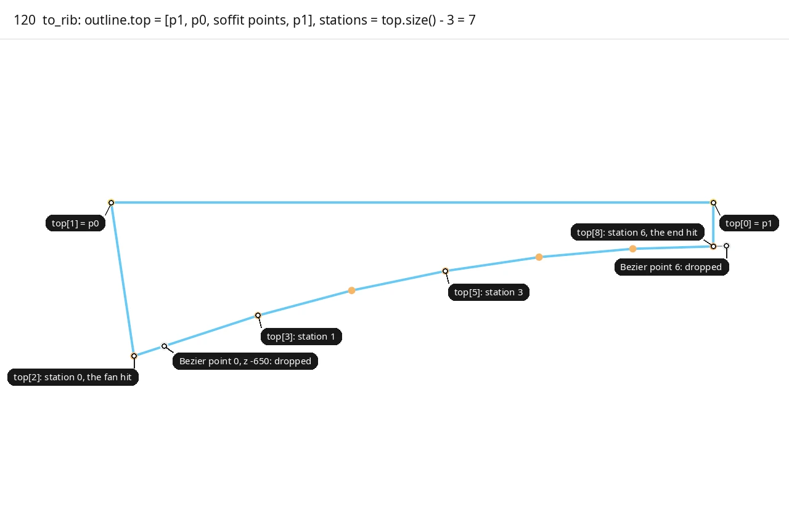

■ built `top`, the first-face loop   ■ variable the `stations`, the 7 soffit points   ■ result `p1` = `top[0]` and `p0` = `top[1]`   ■ input the first chord and the last facet extended by `trim`, dashed   ■ context the two Bezier points `trim` drops

A rib outline comes from `rib()`. It trims the soffit trace with `trim`, which pushes the first and last points out by `EXTENSION` = 1000 along their end facets and then cuts by `cut_plane0` (the fan plane) and `cut_plane1`. It reverses `pts` if needed so that `pts[0]` is on `cut_plane0`. `rib_loop` builds `[p1, p0, pts..., p1]`: `p0 = plane_plane_plane(cut_plane0, level(0), rib_plane)`, with `rib_plane` the vertical plane through `pts.front()` along the trace's plan span, and `p1 = (pts.back().x, pts.back().y, 0)`. For an inner rib `p1` is moved along `p0 -> p1` onto `cut_plane1`. `top` is this loop on the first face. `bottom` is the same loop of `far`, the points projected along `sweep` onto `face1`, with `far[0]` and `far[n-1]` cut again on the end planes along their end facets. `to_rib` then sets `stations = top.size() - 3`, the number of soffit points. For outer rib 0 these are the fan hit, Bezier points 1 to 5 and the end hit. The 7-point Bezier's start point (z -650, at the end of the run-in) lies between the fan hit and point 1 on the extended first chord, and its last point (on the seam plane x = 0) lies beyond `cut_plane1` (x = -60), so `trim` drops both. That is why the rib is 694.8 deep at the fan plane, not 650.

| Variable | Value | Meaning |
|---|---|---|
| `top` | `[p1, p0, pts..., p1]`, 10 points | First-face loop. |
| `bottom` | the same on the second face | Second-face loop, vertex i facing vertex i of `top`. |
| `p0` | fan plane x datum x rib plane | `top[1]`, the fan end at z 0. |
| `p1` | (-60, -3000, 0) for outer rib 0 | `top[0]`, the far end at z 0. |
| `stations` | 7 | One section per soffit point. |
| `EXTENSION` | 1000 | How far `trim` pushes both end points out. |

Code: `to_rib`, [floor_elements.cpp:29-34](https://github.com/petrasvestartas/wood/blob/16f3ab0a2386bf39ac7f7123c0a20d03e73ab1a5/src/templates/floor/floor_elements.cpp#L29-L34); `rib_loop`, `rib`, [floor_members.cpp:17-55](https://github.com/petrasvestartas/wood/blob/16f3ab0a2386bf39ac7f7123c0a20d03e73ab1a5/src/templates/floor/floor_members.cpp#L17-L55); `trim`, [floor_geometry.cpp:69-80](https://github.com/petrasvestartas/wood/blob/16f3ab0a2386bf39ac7f7123c0a20d03e73ab1a5/src/templates/floor/floor_geometry.cpp#L69-L80).

## 121. to_rib: interior sections

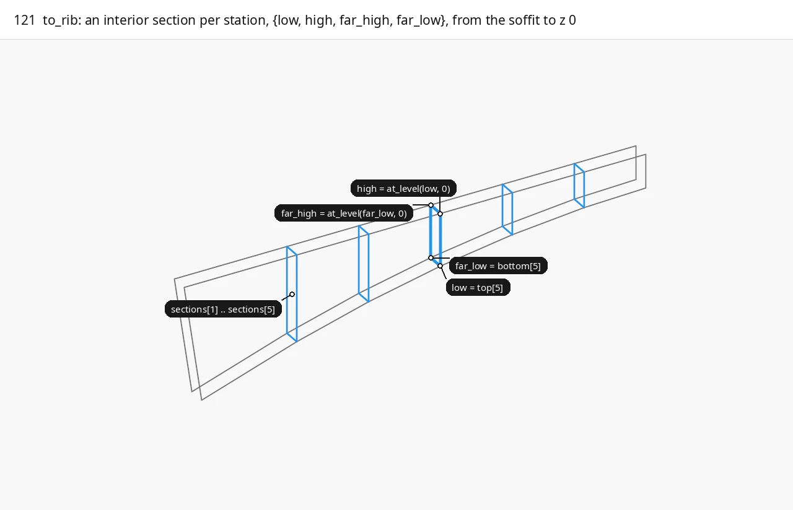

■ built the interior `sections[1]` .. `sections[5]`, the middle one bold   ■ input `top` and `bottom`, the two loops of outer rib 0

For each station i, `low = top[2+i]` is the first-face soffit point and `far_low = bottom[2+i]` its twin on the second face. `high = at_level(low, 0)` and `far_high = at_level(far_low, 0)` set z to 0. The section is `Polyline({low, high, far_high, far_low}).closed()`. Its two long sides are vertical and parallel, so the quad is planar. It runs from the soffit up to the floor top, across the rib. The interior sections are i = 1 to `stations - 2`, five for an outer rib.

| Variable | Value | Meaning |
|---|---|---|
| `low`, `far_low` | `top[2+i]`, `bottom[2+i]` | The soffit point on each face. |
| `high`, `far_high` | `at_level(low, 0)`, `at_level(far_low, 0)` | The same points at z 0. |
| `sections[i]`, 0 < i < `stations - 1` | outer rib: 100 wide, soffit z = -197 - 453(1-t)^2 for t = 1/6..5/6, about -511.6 to -209.6; inner rib: 60/cos(10.704 deg) = 61.06 wide, sheared 11.342 | Closed quad: soffit point, its datum point, far datum point, far soffit point. |

Code: `at_level`, `to_rib`, [floor_elements.cpp:11-13](https://github.com/petrasvestartas/wood/blob/16f3ab0a2386bf39ac7f7123c0a20d03e73ab1a5/src/templates/floor/floor_elements.cpp#L11-L13), [36-41](https://github.com/petrasvestartas/wood/blob/16f3ab0a2386bf39ac7f7123c0a20d03e73ab1a5/src/templates/floor/floor_elements.cpp#L36-L41), [50](https://github.com/petrasvestartas/wood/blob/16f3ab0a2386bf39ac7f7123c0a20d03e73ab1a5/src/templates/floor/floor_elements.cpp#L50).

## 122. to_rib: end sections in the end planes

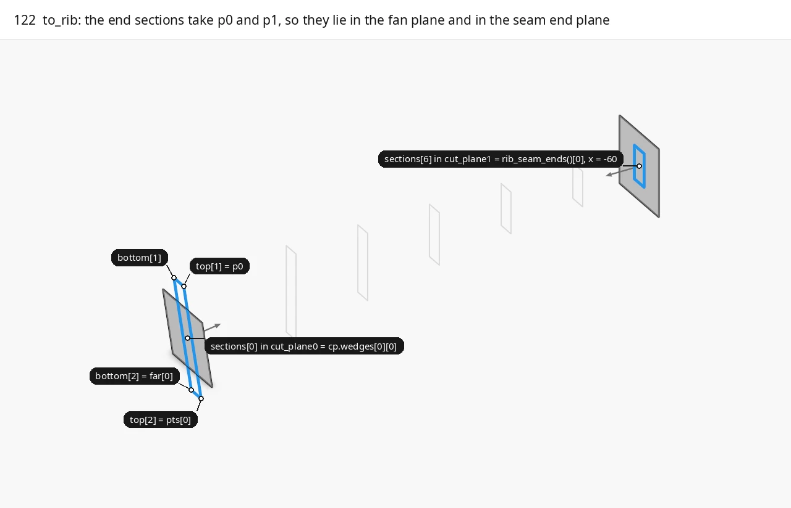

■ built `sections[0]` and `sections[6]`, the two end caps   ■ input `cut_plane0` = `cp.wedges[0][0]` and `cut_plane1` = `rib_seam_ends()[0]`   ■ context the interior sections

At the first station `high` and `far_high` are `top[1]` and `bottom[1]`, the two `p0` corners on `cut_plane0`. `pts[0]` and `far[0]` were also cut on `cut_plane0`, so the whole first section lies in the tilted fan plane. At the last station they are `top[0]` and `bottom[0]`, the `p1` corners. For an outer rib, `p1` is the end point raised straight up to z 0. `cut_plane1` is the vertical far face of the seam beam, so the last cap lies in it. For an inner rib `p1` is moved onto `cut_plane1 = cp.inner_beams[1][1]`, the oculus beam's vertical back face. Both caps therefore lie on the planes the rib ends on.

| Variable | Value | Meaning |
|---|---|---|
| `sections[0]` | in `cp.wedges[0][0]` (outer rib 0), `cp.wedges[2][0]` (outer rib 1), `cp.wedges[1][0]` (inner ribs); bottom at `columns[q].levels[1]` = -694.8 | Fan-end cap in `cut_plane0`. |
| `sections[stations-1]` | outer rib 0 of quarter 0 on x = -60 | Far-end cap in `cut_plane1`: `rib_seam_ends()` = `cp.inner_beams[0 or 2][1]` with `seam_through_ribs`; `cp.inner_beams[1][1]` for inner ribs. |
| `seam_through_ribs` | true | Selects the seam beam's far face as the outer rib end plane. |
| `wedge_plane_angle` | -10 deg | Tilt of the middle fan plane the inner ribs start on. |

Code: `to_rib`, [floor_elements.cpp:42-48](https://github.com/petrasvestartas/wood/blob/16f3ab0a2386bf39ac7f7123c0a20d03e73ab1a5/src/templates/floor/floor_elements.cpp#L42-L48); `rib`, `rib_seam_ends`, [floor_members.cpp:21-25](https://github.com/petrasvestartas/wood/blob/16f3ab0a2386bf39ac7f7123c0a20d03e73ab1a5/src/templates/floor/floor_members.cpp#L21-L25), [51-52](https://github.com/petrasvestartas/wood/blob/16f3ab0a2386bf39ac7f7123c0a20d03e73ab1a5/src/templates/floor/floor_members.cpp#L51-L52), [69-75](https://github.com/petrasvestartas/wood/blob/16f3ab0a2386bf39ac7f7123c0a20d03e73ab1a5/src/templates/floor/floor_members.cpp#L69-L75).

## 123. to_rib: axis

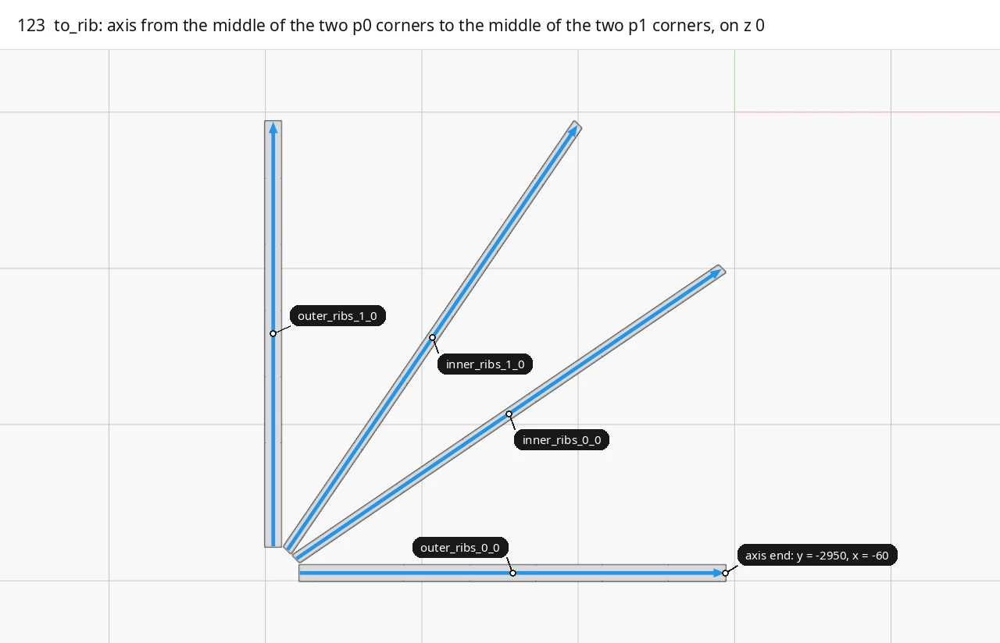

■ built the `axis` of each rib   ■ context the four ribs

`axis = Line::from_points(centre of top[1]-bottom[1], centre of top[0]-bottom[0])`. It runs from the midpoint of the two `p0` corners at the fan end to the midpoint of the two `p1` corners at the far end: on z 0 before the lift, halfway through the rib's thickness, pointing from the column to the seam or the oculus beam. The contact search uses it to tell end faces from side faces.

| Variable | Value | Meaning |
|---|---|---|
| `axis` | outer rib 0 of quarter 0: y = -2950, z 0 (3500 after the lift), ending at x = -60 | Straight reference line of the variable beam on its top face. |

Code: `to_rib`, [floor_elements.cpp:53](https://github.com/petrasvestartas/wood/blob/16f3ab0a2386bf39ac7f7123c0a20d03e73ab1a5/src/templates/floor/floor_elements.cpp#L53); [wood_element_beam_variable.h:13](https://github.com/petrasvestartas/wood/blob/16f3ab0a2386bf39ac7f7123c0a20d03e73ab1a5/src/joinery_solver/wood_elements/wood_element_beam_variable.h#L13).

## 124. Outer ribs as BeamVariable

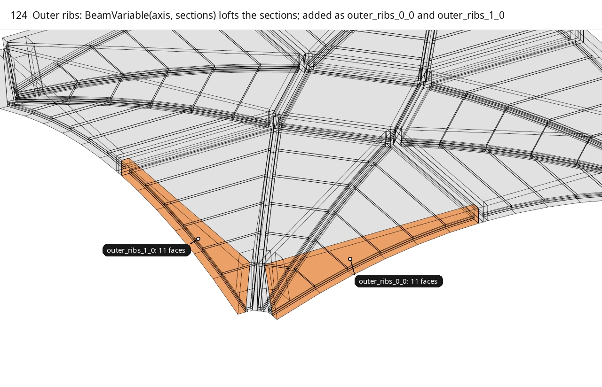

■ built `outer_ribs_0_0` and `outer_ribs_1_0`   ■ context the rest of the floor

`std::make_shared<BeamVariable>(axis, sections, name)` lofts the closed sections in order. Its mesh has one face per cap and one face per side strip whose quads share a plane (the two rib faces and the top), while each soffit quad is its own face: 11 faces for 7 stations. `Quarter::outer_ribs` builds rib 0 from `parabolas[0][0]` between `cp.wedges[0][0]` and `rib_seam_ends()[0]`, and rib 1 from `parabolas[1][0]` between `cp.wedges[2][0]` and `rib_seam_ends()[1]`. Each is swept along `cp.outer_ribs[k][1].z_axis()` onto `cp.outer_ribs[k][1]`. `add_family` lifts both by 3500 and adds `outer_ribs_0_q` and `outer_ribs_1_q` under `outer_ribs_q`.

| Variable | Value | Meaning |
|---|---|---|
| `quarter.outer_ribs` | rib 0 of quarter 0 in y [-3000, -2900], rib 1 in x [-3000, -2900], top at z 3500 | Two variable beams along the two bay edges. |
| mesh faces | 11 | Checked in tests/floor_elements.cpp:73-75. |
| `outer_ribs` | 100 | Rib thickness, the band offset. |
| `height` / `rise` | 650 / 453, `static_h = height - rise` = 197 | Depth at the parabola start, and the rise to the seam. |

Code: `to_rib`, [floor_elements.cpp:55](https://github.com/petrasvestartas/wood/blob/16f3ab0a2386bf39ac7f7123c0a20d03e73ab1a5/src/templates/floor/floor_elements.cpp#L55); `Quarter::outer_ribs`, [floor_members.cpp:57-67](https://github.com/petrasvestartas/wood/blob/16f3ab0a2386bf39ac7f7123c0a20d03e73ab1a5/src/templates/floor/floor_members.cpp#L57-L67); [floor_models.cpp:153-154](https://github.com/petrasvestartas/wood/blob/16f3ab0a2386bf39ac7f7123c0a20d03e73ab1a5/src/templates/floor/floor_models.cpp#L153-L154).

## 125. Inner ribs as BeamVariable

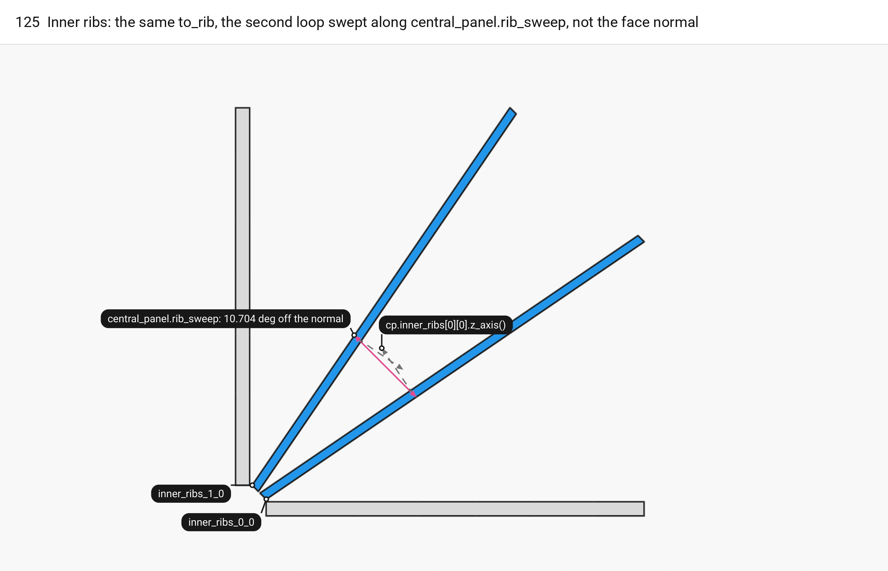

■ built `inner_ribs_0_0` and `inner_ribs_1_0`   ■ variable `central_panel.rib_sweep`, each the way its points move   ■ input `cp.inner_ribs[i][0].z_axis()`, the face normal, dashed   ■ context the outer ribs

Each inner rib comes from a shadow parabola, `parabolas[2]` or `[3]`: the outer parabola projected along the outer rib normal onto the inner rib's outer face `cp.inner_ribs[i][0]`. `rib()` trims it between the middle fan plane `cp.wedges[1][0]` and the oculus beam back face `cp.inner_beams[1][1]`. Its second loop is swept along the shared `central_panel.rib_sweep` onto `cp.inner_ribs[i][1]`, not along the face normal. `rib_sweep` is horizontal, so each far point keeps its z and moves 61.06 in plan. Each interior section is therefore a rectangle 61.06 wide in a vertical plane along `rib_sweep`, 10.704 deg off square to the rib, and its far corners sit 11.342 further along the rib than its near ones. `to_rib` builds the same sections and caps as for an outer rib, and `add_family` places `inner_ribs_0_q` and `inner_ribs_1_q` under `inner_ribs_q`. The one sweep vector points from face 0 to face 1 of inner rib 0. Inner rib 1's far points move the other way along it, by -61.06 (chapter 4). The picture draws each rib's arrow the way its points actually move, beside the dashed normal of its first face `cp.inner_ribs[i][0]`.

| Variable | Value | Meaning |
|---|---|---|
| `quarter.inner_ribs` | 2 | Variable beams from the column head to the oculus beam. |
| `central_panel.rib_sweep` | 10.704 deg off each inner rib's normal | The one sweep of both inner ribs. |
| section width / shear | 61.06 / 11.342 | 60/cos(10.704 deg), and the shift of the central face along the rib. |
| `inner_ribs` | 60 | Inner rib thickness. |

Code: `Quarter::inner_ribs`, [floor_members.cpp:77-87](https://github.com/petrasvestartas/wood/blob/16f3ab0a2386bf39ac7f7123c0a20d03e73ab1a5/src/templates/floor/floor_members.cpp#L77-L87); [floor_models.cpp:155-156](https://github.com/petrasvestartas/wood/blob/16f3ab0a2386bf39ac7f7123c0a20d03e73ab1a5/src/templates/floor/floor_models.cpp#L155-L156); [floor.cpp:335-339](https://github.com/petrasvestartas/wood/blob/16f3ab0a2386bf39ac7f7123c0a20d03e73ab1a5/src/templates/floor/floor.cpp#L335-L339).

## 126. Wedge block plates

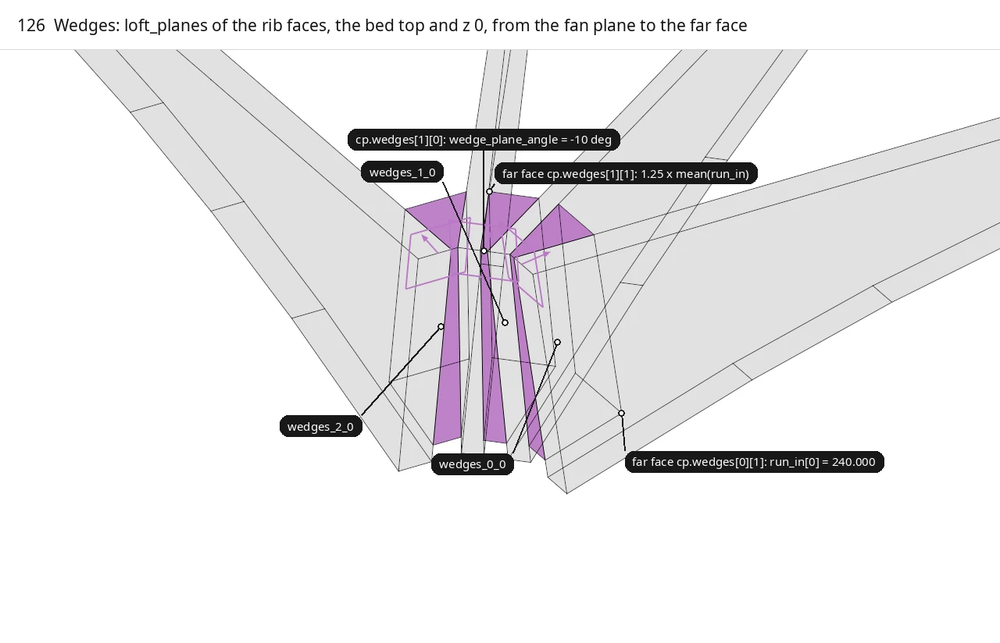

■ built `wedges_0_0` .. `wedges_2_0`   ■ input the fan planes `cp.wedges[i][0]`   ■ context the ribs

Each wedge outline is `loft_planes({ribs[i][0], bed_top_planes[i], ribs[i][1], level(0)}, cp.wedges[i][0], cp.wedges[i][1])`. Loop vertex k is `plane_plane_plane(planes[k], planes[k+1], end plane)`, so the loop corners are rib face 0 x bed top, bed top x rib face 1, rib face 1 x datum and datum x rib face 0. `outline.bottom` lies on the fan plane `cp.wedges[i][0]` and `outline.top` on the far face `cp.wedges[i][1]`. `to_plate` makes `Plate(bottom, top, "wedges")`. The blocks fill outer rib 0 to inner rib 0, inner rib 0 to inner rib 1 (the middle block on the tilted fan plane) and inner rib 1 to outer rib 1, each standing on its bed top plane and reaching z 0. The far faces are the ones `block_planes` set: the fan plane offset by `run_in[0]`, by `middle_wedge_factor * mean(run_in)` and by `run_in[1]`.

| Variable | Value | Meaning |
|---|---|---|
| `quarter.wedges` | 3 blocks; offsets 240 / 300 / 240 on the square | Block plates at the column head. |
| `ribs[i]` | `{outer_ribs[0][1], inner_ribs[0][0]}`, `{inner_ribs[0][1], inner_ribs[1][1]}`, `{inner_ribs[1][0], outer_ribs[1][1]}` | The two rib faces each block lies between. |
| `wedge` | 240 | Start value of the run-in solve; equals the side block offset on the square. |
| `middle_wedge_factor` | 1.25 | Middle block offset = factor x mean(run_in). |

Code: `Quarter::wedges`, [floor_members.cpp:107-124](https://github.com/petrasvestartas/wood/blob/16f3ab0a2386bf39ac7f7123c0a20d03e73ab1a5/src/templates/floor/floor_members.cpp#L107-L124); `loft_planes`, [floor_geometry.cpp:273-296](https://github.com/petrasvestartas/wood/blob/16f3ab0a2386bf39ac7f7123c0a20d03e73ab1a5/src/templates/floor/floor_geometry.cpp#L273-L296); [floor_models.cpp:157-158](https://github.com/petrasvestartas/wood/blob/16f3ab0a2386bf39ac7f7123c0a20d03e73ab1a5/src/templates/floor/floor_models.cpp#L157-L158).

## 127. to_beam: two caps and axis

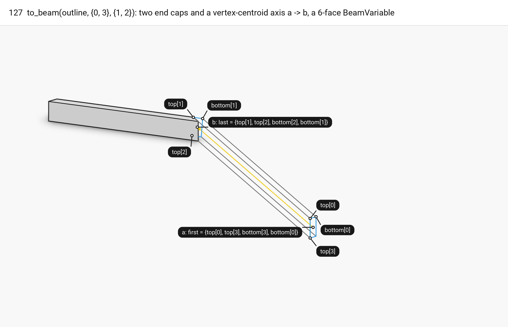

■ built `first` and `last`, the two end caps   ■ result the `axis` from `a` to `b`   ■ input `top` and `bottom` of seam beam 0   ■ context `inner_beams_1_0`

An inner beam outline is `loft_planes(ring, base face, far face)`: `bottom` on the base face, `top` on the far face, vertex k where ring planes k and k+1 meet. For seam beam 0 the ring is `{cp.outer_ribs[0][0]` (face 0 with `seam_through_ribs`), `level(0)`, `cp.inner_beams[1][0]` (the tilted oculus bearing plane), `level(guide.soffit)}`. So vertex 0 is the outer face at z 0, 1 the bearing plane at z 0, 2 the bearing plane at the soffit and 3 the outer face at the soffit. Because the bearing plane leans 5 deg, vertex 2 of the bottom loop is at (0, -975.4), 24.6 nearer the centre than vertex 1 at (0, -1000): the outline is not a box. `to_beam(outline, {0, 3}, {1, 2})` takes `first = {top[0], top[3], bottom[3], bottom[0]}`, the cap on the outer face, and `last = {top[1], top[2], bottom[2], bottom[1]}`, the cap on the bearing plane. `a` and `b` are `Point::centroid` of each cap's four corners (vertex means), the axis is `Line::from_points(a, b)`, and `BeamVariable(axis, {first, last}, name)` lofts the two caps into a 6-face solid. The oculus beam (index 1) ends on the seam beams' far faces `cp.inner_beams[0][1]` and `[2][1]`. `add_family` places `inner_beams_0_q` (seam q), `inner_beams_1_q` (oculus edge) and `inner_beams_2_q` (seam q-1) under `inner_beams_q`.

| Variable | Value | Meaning |
|---|---|---|
| `first` | seam beam 0, quarter 0: plane y = -3000, x in [-60, 0], z in [-198.783, 0] | Start cap in ring plane 0. |
| `last` | on the 5 deg tilted bearing plane through x + y = -1000 at z 0 | End cap in ring plane 2. |
| `a`, `b` | vertex centroids of `first` and `last` | Axis ends. |
| `quarter.inner_beams` | top z 3500, soffit z 3301.217 | Seam 0, oculus edge, seam 1. |
| `soffit` | -198.783 | The deepest rib end on a beam; every beam's bottom. |
| `inner_beams` | 60 | Beam thickness. |
| `oculus_plane_angle` | 5 deg | Lean of the bearing plane. |

Code: `to_beam`, [floor_elements.cpp:58-68](https://github.com/petrasvestartas/wood/blob/16f3ab0a2386bf39ac7f7123c0a20d03e73ab1a5/src/templates/floor/floor_elements.cpp#L58-L68); `Quarter::inner_beams`, [floor_members.cpp:93-105](https://github.com/petrasvestartas/wood/blob/16f3ab0a2386bf39ac7f7123c0a20d03e73ab1a5/src/templates/floor/floor_members.cpp#L93-L105); [floor_models.cpp:21](https://github.com/petrasvestartas/wood/blob/16f3ab0a2386bf39ac7f7123c0a20d03e73ab1a5/src/templates/floor/floor_models.cpp#L21), [159-160](https://github.com/petrasvestartas/wood/blob/16f3ab0a2386bf39ac7f7123c0a20d03e73ab1a5/src/templates/floor/floor_models.cpp#L159-L160).

## 128. Oculus set-up

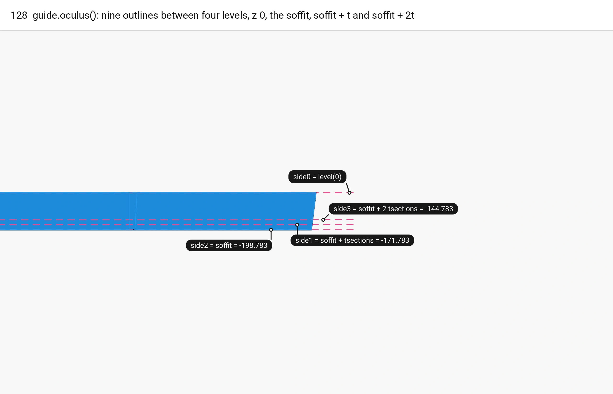

■ built the nine `guide.oculus()` outlines   ■ variable the four levels `side0` .. `side3`, dashed

`add_oculus_model` makes `lift = Xform::translation(0, 0, guide.parameters.bay_height)` and calls `guide.oculus()`, which returns nine outlines at the datum: 0 to 3 the ring beams, 4 to 7 the bottom wedges and 8 the central plate. They are lofted between four levels and, per oculus edge, two planes: `tilted` (the edge plane leaned by `oculus_plane_angle` about the edge) and `ring_inner` (the back face offset back by twice `inner_beams`, so `inner_beams` inside the edge toward the centre).

| Variable | Value | Meaning |
|---|---|---|
| `outlines` | 9 | Oculus outlines at the datum. |
| `side0` | `level(0)` | Floor top. |
| `side2` | `level(soffit)`, -198.783 | Ring beam and bottom wedge bottom. |
| `side1` | `level(soffit + tsections)`, -171.783 | Bottom wedge top, central plate bottom. |
| `side3` | `level(soffit + 2 tsections)`, -144.783 | Central plate top. |
| `tilted[i]`, `inner[i]` | `oculus_edges[i].tilted`, `oculus_edges[i].ring_inner` | The side planes of the ring. |
| `bay_height` | 3500 | Lift. |
| `tsections` | 27 | Bottom wedge and central plate thickness. |

Code: `add_oculus_model`, [floor_models.cpp:165-169](https://github.com/petrasvestartas/wood/blob/16f3ab0a2386bf39ac7f7123c0a20d03e73ab1a5/src/templates/floor/floor_models.cpp#L165-L169); `FloorGuide::oculus`, [floor_members.cpp:232-260](https://github.com/petrasvestartas/wood/blob/16f3ab0a2386bf39ac7f7123c0a20d03e73ab1a5/src/templates/floor/floor_members.cpp#L232-L260); `oculus_edge`, [floor.cpp:93-103](https://github.com/petrasvestartas/wood/blob/16f3ab0a2386bf39ac7f7123c0a20d03e73ab1a5/src/templates/floor/floor.cpp#L93-L103).

## 129. Ring beams as BeamVariable

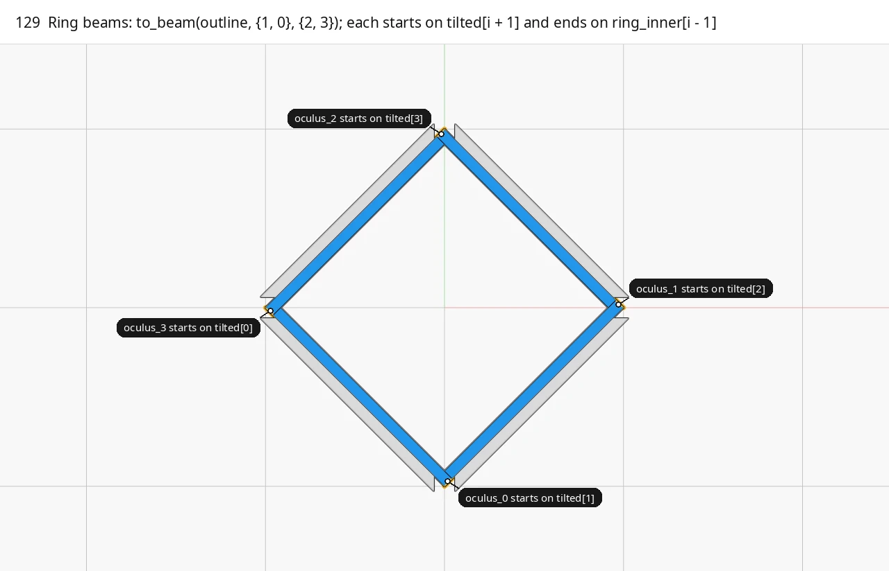

■ built the ring beams `oculus_0` .. `oculus_3`   ■ result each start cap, on `tilted[i + 1]`   ■ context the oculus beams `inner_beams_1_q`

Ring beam i is `loft_planes({side2, tilted[i+1], side0, inner[i+3]}, tilted[i], inner[i], flip = true)`, indices modulo 4. After the flip `outline.top` lies on `tilted[i]`, the bearing plane the quarter's oculus beam also uses, and `outline.bottom` on `ring_inner[i]`. The vertices are 0 = soffit x `tilted[i+1]`, 1 = `tilted[i+1]` x z 0, 2 = z 0 x `inner[i-1]`, 3 = `inner[i-1]` x soffit. `to_beam(outline, {1, 0}, {2, 3}, "oculus")` therefore starts with the cap on the next edge's tilted plane and ends with the cap on the previous edge's inner plane. Each beam butts the next one in turn, a pinwheel with no overlap.

| Variable | Value | Meaning |
|---|---|---|
| ring beam i | ring beam 0 along (0,-1000) -> (-1000,0), 60 wide at the datum; overlap 0 mm2 | Variable beam along oculus edge i, from the soffit to z 0. |
| start cap | `{top[1], top[0], bottom[0], bottom[1]}` on `tilted[i+1]` | First section. |
| end cap | `{top[2], top[3], bottom[3], bottom[2]}` on `inner[i-1]` | Last section. |
| `inner_beams` | 60 | Ring width at the datum (`ring_inner` = back offset by -2 x `inner_beams`). |
| `oculus_plane_angle` | 5 deg | Tilt of the bearing plane. |

Code: `add_oculus_model`, [floor_models.cpp:172](https://github.com/petrasvestartas/wood/blob/16f3ab0a2386bf39ac7f7123c0a20d03e73ab1a5/src/templates/floor/floor_models.cpp#L172); [floor_members.cpp:249-250](https://github.com/petrasvestartas/wood/blob/16f3ab0a2386bf39ac7f7123c0a20d03e73ab1a5/src/templates/floor/floor_members.cpp#L249-L250); `loft_planes`, [floor_geometry.cpp:273-296](https://github.com/petrasvestartas/wood/blob/16f3ab0a2386bf39ac7f7123c0a20d03e73ab1a5/src/templates/floor/floor_geometry.cpp#L273-L296).

## 130. Bottom wedge plates

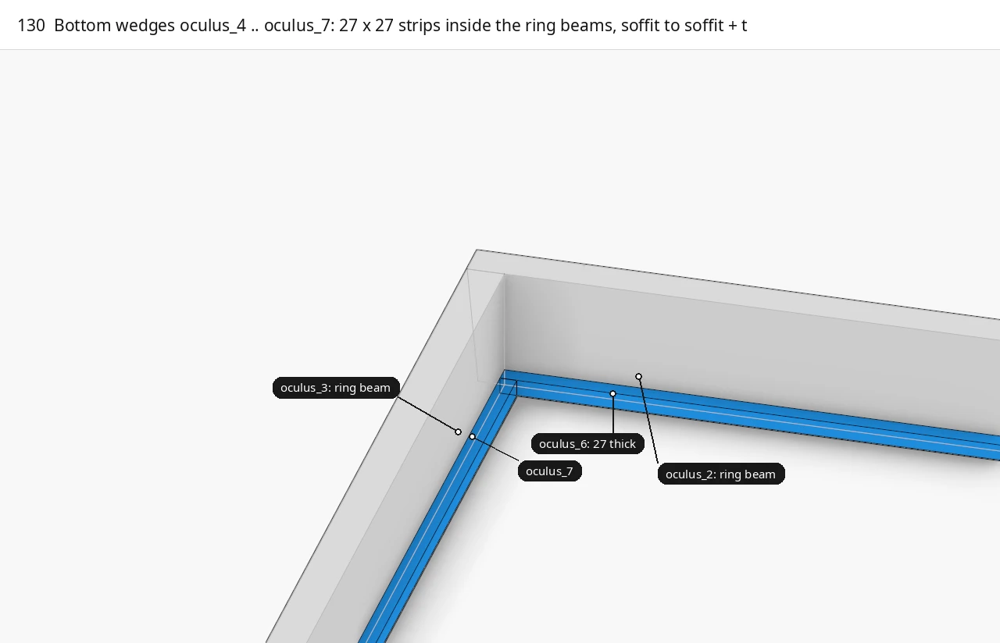

■ built the bottom wedges `oculus_4` .. `oculus_7`   ■ context the ring beams

For k = 0..3 (outline 4 + k) the side ring is `{inner[k], inner[k+1], inner[k] offset by -tsections, inner[k+3] offset by -tsections}`, lofted between `side2` (the soffit, bottom) and `side1` (soffit + 27, top). This gives a 27-wide strip along the inside of ring beam k, from `inner[k+1]` to the offset `inner[k-1]`, so the four strips also form a pinwheel. They are not under the ring beams: they sit inside the ring, along each `ring_inner` face. `to_plate` makes `Plate(bottom, top, "oculus")`. These strips are the ledge the central plate rests on. The picture frames the far corner of the ring, where `oculus_6` and `oculus_7` meet inside ring beams `oculus_2` and `oculus_3`.

| Variable | Value | Meaning |
|---|---|---|
| `oculus_4` .. `oculus_7` | 27 x 27 section, z -198.783 .. -171.783 before the lift | Four ledge plates inside the ring. |
| `tsections` | 27 | Strip width and thickness. |

Code: `add_oculus_model`, [floor_models.cpp:172](https://github.com/petrasvestartas/wood/blob/16f3ab0a2386bf39ac7f7123c0a20d03e73ab1a5/src/templates/floor/floor_models.cpp#L172); [floor_members.cpp:252-255](https://github.com/petrasvestartas/wood/blob/16f3ab0a2386bf39ac7f7123c0a20d03e73ab1a5/src/templates/floor/floor_members.cpp#L252-L255).

## 131. Central plate oculus_8

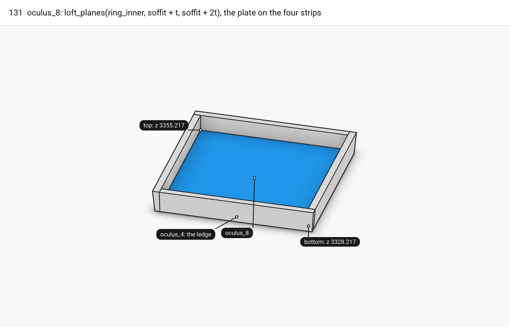

■ built `oculus_8`   ■ input the ledge `oculus_4` .. `oculus_7`   ■ context the ring beams

The last outline is `loft_planes(inner, side1, side3)`: a quad bounded by the four `ring_inner` planes, bottom at soffit + 27 and top at soffit + 54. It fills the opening and rests on the four bottom wedges. `to_plate` makes `Plate(bottom, top, "oculus")`.

| Variable | Value | Meaning |
|---|---|---|
| `oculus_8` | z -171.783 .. -144.783 before the lift, 3328.217 .. 3355.217 after | The central plate, the one member of no quarter. |

Code: `add_oculus_model`, [floor_models.cpp:172](https://github.com/petrasvestartas/wood/blob/16f3ab0a2386bf39ac7f7123c0a20d03e73ab1a5/src/templates/floor/floor_models.cpp#L172); [floor_members.cpp:257](https://github.com/petrasvestartas/wood/blob/16f3ab0a2386bf39ac7f7123c0a20d03e73ab1a5/src/templates/floor/floor_members.cpp#L257).

## 132. Oculus grouping

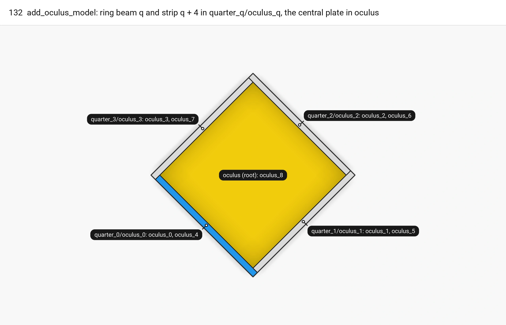

■ built `quarter_0/oculus_0`: `oculus_0`, `oculus_4`   ■ result `oculus` at the root: `oculus_8`   ■ context `quarter_1/oculus_1` .. `quarter_3/oculus_3`

For i < 8 the host is `group_named(quarter_group(group, i % 4), "oculus_{i%4}")`. Ring beam q and bottom wedge 4 + q therefore both go into `quarter_q / oculus_q`; that group is created at i = q, after the quarter's six family groups. Outline 8 goes into a group `"oculus"` directly under `group` (the root), created after `quarter_3`. Every element is placed by `lift` and named `oculus_i`. Only the four ring beams are returned, as `Member{element, outline_thickness(outline)}`. `add_oculus` stores them in `members.ring` and finds the root `oculus` node for `members.oculus`.

| Variable | Value | Meaning |
|---|---|---|
| `quarter_q/oculus_q` | `quarter_0/oculus_0` = {`oculus_0`, `oculus_4`} | Ring beam q and bottom wedge q + 4. |
| `oculus` | root group | Holds `oculus_8`. |
| `members.ring` | 4 | Ring beam `Member`s, read by `Family::ring` references. |
| `members.oculus` | the root `oculus` node | Found by `group_named(*this, members.group, "oculus")`. |

Code: `add_oculus_model`, [floor_models.cpp:173-180](https://github.com/petrasvestartas/wood/blob/16f3ab0a2386bf39ac7f7123c0a20d03e73ab1a5/src/templates/floor/floor_models.cpp#L173-L180); `Floor::add_oculus`, 407-411.

## 133. column_q group and names

`add_columns` calls `add_column(q)` for q = 0..3. `add_column` resizes `members.columns` to 4 if it is smaller, finds or creates `group_named(quarter_group(members.group, corner % 4), "column_{corner%4}")`, at this point the last child of `quarter_q`, and stores `add_column_model(*this, guide, corner % 4, group)` in `members.columns[corner % 4]`. `add_column_model` uses the suffix `"_{corner%4}"`, names the support `support_q` and the column `column_q`, and adds both under `column_q` with `session.add`, in that order. Then it adds the support joint (frame 136) to the same group; that joint keeps the name `"support"`. The tree of quarter 0 after `add_members`:

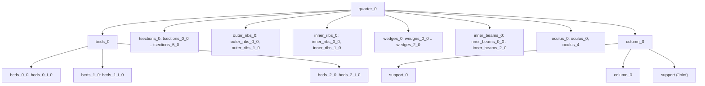
```mermaid
flowchart TD
    Q["quarter_0"] --> B["beds_0"]
    B --> B0["beds_0_0: beds_0_i_0"]
    B --> B1["beds_1_0: beds_1_i_0"]
    B --> B2["beds_2_0: beds_2_i_0"]
    Q --> T["tsections_0: tsections_0_0 .. tsections_5_0"]
    Q --> OR["outer_ribs_0: outer_ribs_0_0, outer_ribs_1_0"]
    Q --> IR["inner_ribs_0: inner_ribs_0_0, inner_ribs_1_0"]
    Q --> W["wedges_0: wedges_0_0 .. wedges_2_0"]
    Q --> IB["inner_beams_0: inner_beams_0_0 .. inner_beams_2_0"]
    Q --> O["oculus_0: oculus_0, oculus_4"]
    Q --> C["column_0"]
    C --> S["support_0"]
    C --> CC["column_0"]
    C --> J["support (Joint)"]
```

| Variable | Value | Meaning |
|---|---|---|
| `corner` | 0..3 | Column corner index, wrapped by `% 4`. |
| `quarter_q/column_q` | `quarter_0/column_0` | Group of support, column and support joint. |
| `support_q`, `column_q` | `support_0`, `column_0` | Scene elements under `column_q`. |

Code: `Floor::add_column`, `Floor::add_columns`, [floor_models.cpp:411-423](https://github.com/petrasvestartas/wood/blob/16f3ab0a2386bf39ac7f7123c0a20d03e73ab1a5/src/templates/floor/floor_models.cpp#L411-L423); `add_column_model`, 176-188.

## 134. Support and column foot

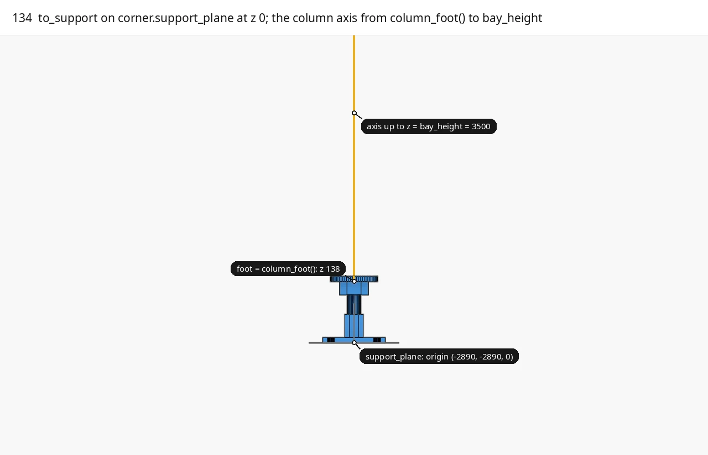

■ built `model.support`, `support_0`   ■ variable `foot = column_foot()`, 138 above the slab   ■ result the column axis up to `bay_height`   ■ input `support_plane`

`add_column_model` sets `model.group` and then `model.support = to_support(guide.columns[corner])`, which is `wood_session::Support(corner.support_plane, "support")`. `support_plane = Plane::from_frame(axis_point, x_axis, y_axis, z)`, with `axis_point = corner + (x_axis + y_axis) * column_head / 2`: the centre of the column square on the slab at z 0. The support is not lifted: it stands on the slab. It keeps its manufacturer defaults. `to_column` reads `foot = support.column_foot() = support.at(height - head_plate_recess)`, the point on the support axis 150 - 12 = 138 above the slab, and runs the column axis from `foot` to `(foot.x, foot.y, bay_height)`, so the column top is the floor top.

| Variable | Value | Meaning |
|---|---|---|
| `model.support` | corner 0: origin (-2890, -2890, 0), x (1,0,0), y (0,1,0); 500477.198 mm3 | Support under the column axis. |
| `axis_point` | (-2890, -2890, 0) | Half a `column_head` along both corner axes. |
| `foot` | (-2890, -2890, 138) | Where the column end stands. |
| `axis` | (-2890,-2890,138) -> (-2890,-2890,3500) | Column centreline. |
| `Support::height` / `head_plate_recess` | 150 / 12 | Base plate underside to head plate top; how deep the head plate is let into the column. |
| `column_head` | 220 | Shaft side. |
| `bay_height` | 3500 | Axis top. |

Code: `to_support`, [floor_elements.cpp:74-76](https://github.com/petrasvestartas/wood/blob/16f3ab0a2386bf39ac7f7123c0a20d03e73ab1a5/src/templates/floor/floor_elements.cpp#L74-L76); `column_corner`, [floor.cpp:130-140](https://github.com/petrasvestartas/wood/blob/16f3ab0a2386bf39ac7f7123c0a20d03e73ab1a5/src/templates/floor/floor.cpp#L130-L140); `to_column`, [floor_elements.cpp:80-83](https://github.com/petrasvestartas/wood/blob/16f3ab0a2386bf39ac7f7123c0a20d03e73ab1a5/src/templates/floor/floor_elements.cpp#L80-L83); `Support::column_foot`, [wood_element_support.cpp:124-126](https://github.com/petrasvestartas/wood/blob/16f3ab0a2386bf39ac7f7123c0a20d03e73ab1a5/src/joinery_solver/wood_elements/wood_element_support.cpp#L124-L126); [floor_models.cpp:191-193](https://github.com/petrasvestartas/wood/blob/16f3ab0a2386bf39ac7f7123c0a20d03e73ab1a5/src/templates/floor/floor_models.cpp#L191-L193).

## 135. Shaft and capitel

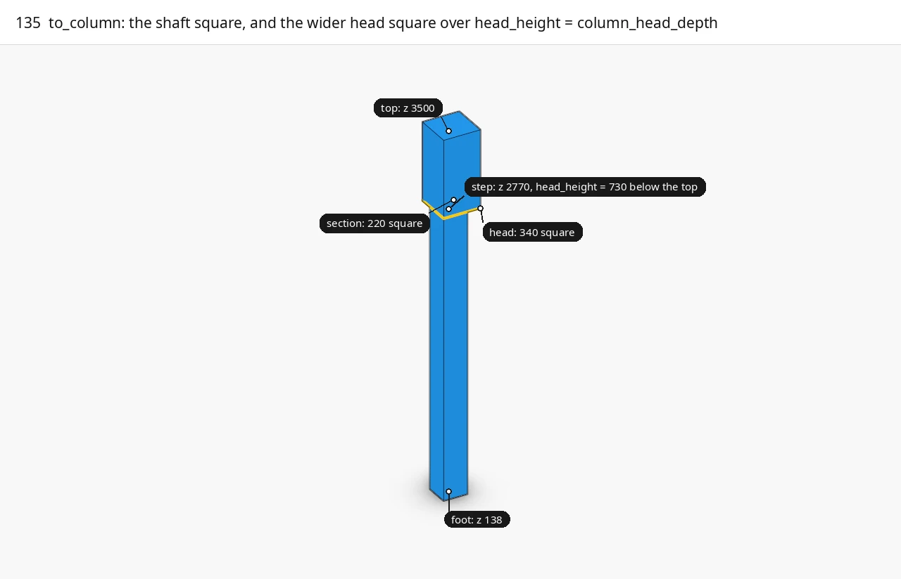

■ built the `Column` before its cuts   ■ variable `section`, the 220 shaft square   ■ result `column->head`, the 340 capitel square

`square(corner, s, z)` is the closed quad `o, o + x*s, o + x*s + y*s, o + y*s` at height z, with `o` the bay corner and x, y the corner frame. The 220 shaft square is centred on the axis. `Column(axis, square(corner, 220, foot z), "column")` is the shaft. `column->head = square(corner, 340, foot z)` grows from the same bay corner, so the capitel is 120 wider toward the inside of the bay only, and `head_height = column_head_depth`. Because `has_head` holds (`head_height` is above 0 and below the axis length, and both squares have the same point count), the `Column` lofts four stations: the section at the base, the section at axis length - `head_height`, the head at that height and the head at the top.

| Variable | Value | Meaning |
|---|---|---|
| `section` | (-3000,-3000) .. (-2780,-2780) | The 220 shaft square. |
| `head` | (-3000,-3000) .. (-2660,-2660) | The 340 capitel square, `column_head + column_head_chamfer`. |
| `head_height` | 730: step at z 2770, top z 3500 | Capitel depth. |
| `column_head_chamfer` | 120 | How much wider the head is. |
| `column_head_depth` | 730 | Capitel and carved head depth. |

Code: `square`, `to_column`, [floor_elements.cpp:16-23](https://github.com/petrasvestartas/wood/blob/16f3ab0a2386bf39ac7f7123c0a20d03e73ab1a5/src/templates/floor/floor_elements.cpp#L16-L23), [85-87](https://github.com/petrasvestartas/wood/blob/16f3ab0a2386bf39ac7f7123c0a20d03e73ab1a5/src/templates/floor/floor_elements.cpp#L85-L87); [wood_element_column.cpp:143-154](https://github.com/petrasvestartas/wood/blob/16f3ab0a2386bf39ac7f7123c0a20d03e73ab1a5/src/joinery_solver/wood_elements/wood_element_column.cpp#L143-L154).

## 136. Support joint

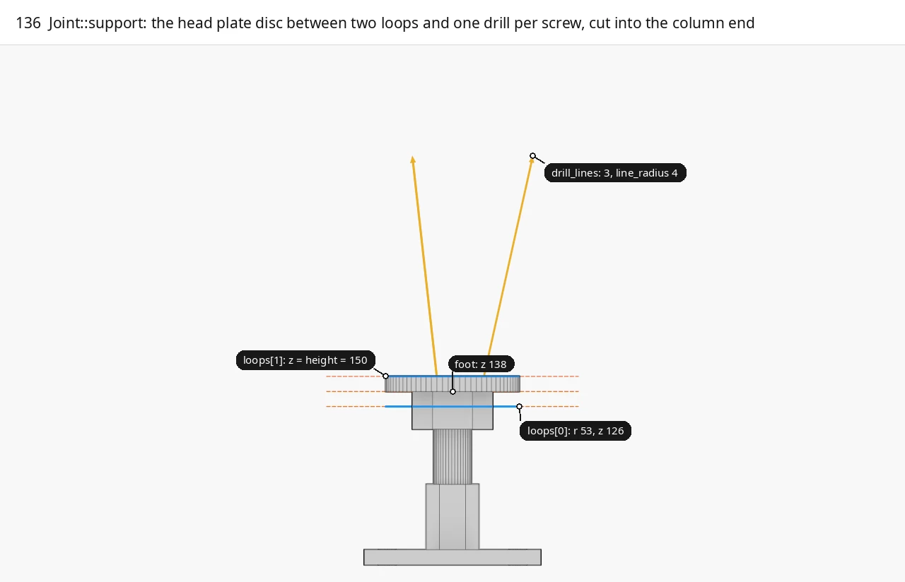

■ built `loops`, the head plate disc   ■ result `drill_lines`, one per screw   ■ variable the levels z 126, 138 (the foot) and 150, dashed   ■ input `support_0`

`Joint::support(support, column)` builds a `Joint` named `"support"`. Its two loops are faceted circles of radius `head_plate_diameter / 2` = 53 about the support axis, at z = `height - head_plate_thickness - head_plate_recess` = 126 and z = `height` = 150. With the column foot at 138, the disc between them cuts a pocket 12 deep into the column end. It has one drill line per screw of `support.screws()`, each started `head_plate_thickness` behind the screw's start along the screw, with `line_radius = screw_diameter / 2` = 4 and `targets = {column guid}`. `session.add` puts it in `column_q`. `add_joint` finds neither a `JointPlate` nor a `JointBeam`, so `add_cutter_joint` runs: `add_solid_cut` makes a `SolidCut` of `cut_mesh(joint.body_mesh(), joint.cuts)` with the drills and operation difference, `store_solid_cut` converts it into the column's frame and pushes it onto `column->solid_cuts`, `host_drills` writes drill features, `refresh_target` invalidates the column, and an `InteractionFeaturePlateBeam` edge from the joint to the column is added.

| Variable | Value | Meaning |
|---|---|---|
| `loops` | r 53, z 126 and z 150 | The head plate disc. |
| `drill_lines` | 3 | One per screw, from 12 behind its start to its end. |
| `line_radius` | 4 | Drill radius. |
| removed volume | 132465.171 mm3 | Pocket and three screw holes. |
| `head_plate_diameter` / `head_plate_thickness` / `head_plate_recess` | 106 / 12 / 12 | Disc size. |
| `screw_count` / `screw_diameter` | 3 / 8 | The drills. |

Code: `add_column_model`, [floor_models.cpp:197-199](https://github.com/petrasvestartas/wood/blob/16f3ab0a2386bf39ac7f7123c0a20d03e73ab1a5/src/templates/floor/floor_models.cpp#L197-L199); `Joint::support`, [wood_element_joint.cpp:78-93](https://github.com/petrasvestartas/wood/blob/16f3ab0a2386bf39ac7f7123c0a20d03e73ab1a5/src/joinery_solver/wood_elements/wood_element_joint.cpp#L78-L93); [wood_session.cpp:1097-1103](https://github.com/petrasvestartas/wood/blob/16f3ab0a2386bf39ac7f7123c0a20d03e73ab1a5/src/joinery_solver/wood_session.cpp#L1097-L1103), [1118-1137](https://github.com/petrasvestartas/wood/blob/16f3ab0a2386bf39ac7f7123c0a20d03e73ab1a5/src/joinery_solver/wood_session.cpp#L1118-L1137), [1233-1258](https://github.com/petrasvestartas/wood/blob/16f3ab0a2386bf39ac7f7123c0a20d03e73ab1a5/src/joinery_solver/wood_session.cpp#L1233-L1258), [1268-1280](https://github.com/petrasvestartas/wood/blob/16f3ab0a2386bf39ac7f7123c0a20d03e73ab1a5/src/joinery_solver/wood_session.cpp#L1268-L1280), [1306-1322](https://github.com/petrasvestartas/wood/blob/16f3ab0a2386bf39ac7f7123c0a20d03e73ab1a5/src/joinery_solver/wood_session.cpp#L1306-L1322), [1336-1350](https://github.com/petrasvestartas/wood/blob/16f3ab0a2386bf39ac7f7123c0a20d03e73ab1a5/src/joinery_solver/wood_session.cpp#L1336-L1350).

## 137. Column head carving (example 2)

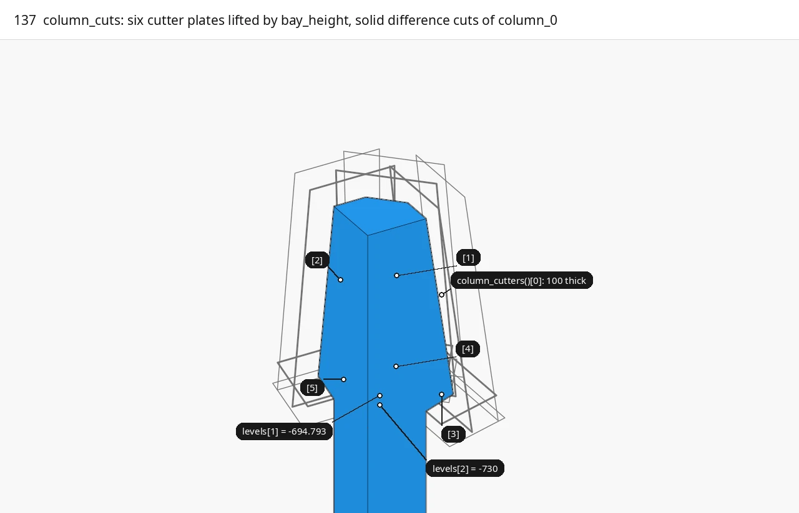

■ built `column_0`, carved   ■ input the six `column_cutters()` lifted by `bay_height`

`column_cuts(guide.quarter(corner))` loops over the six outlines of `Quarter::column_cutters`. That function intersects three levels (`levels[0]` = 0, `levels[1]` = the rib bottom level, `levels[2]` = -`column_head_depth`) with two plane fans: at the top `{sides[0], cp.wedges[0][0], cp.wedges[1][0], cp.wedges[2][0], sides[1]}` gives the corner rows `p0` (at `levels[0]`) and `p1` (at `levels[1]`); at the bottom `{sides[0], edge plane of head edge 1, edge plane of head edge 3, sides[1]}` gives `p2` at `levels[2]`. Quads 0 to 2 lie in the three fan planes between `levels[0]` and `levels[1]`. Quads 3 to 5 run from the `p1` corners down to the `p2` corners on the shaft faces, and quad 4 is narrowed to `p2[1] +- (p2[2] - p2[0]) / 4` about the shaft corner `p2[1]`. `stretch` moves the quad corners by `CUTTER_MARGIN` = 100 in the quad's plane: sides 0-1 and 2-3 grow at both ends, side 0-1 moves away from side 2-3, and for quads 0 to 2 side 2-3 also moves away from side 0-1. The second loop is the quad moved 100 along its normal. Each outline becomes `to_plate(outline, "column_cutter")->element_geometry_mesh()` moved by `translation(0, 0, bay_height)`, a `SolidCut` with `SolidOperation::difference`. `add_column_model` pushes all six onto `column->solid_cuts` after the support cut and calls `invalidate_geometry()`. The cutters are features of the column, not scene elements. Example 2 (`templates_floor_2_column_model`) builds exactly this one column model.

| Variable | Value | Meaning |
|---|---|---|
| `levels` | 0, -694.8, -730 | Datum, rib bottom level, `-column_head_depth`. |
| `column->solid_cuts` | support cut + 6 head cuts | Cut features of the column. |
| head cuts | remove 34771221.351 mm3 | Volume the six cuts take from the column. |
| `CUTTER_MARGIN` | 100 | Overshoot and slab thickness of each cutter. |
| `column_head_depth` | 730 | Lowest cutter level, z 2770 after the lift. |

Code: `column_cuts`, [floor_elements.cpp:92-105](https://github.com/petrasvestartas/wood/blob/16f3ab0a2386bf39ac7f7123c0a20d03e73ab1a5/src/templates/floor/floor_elements.cpp#L92-L105); `stretch`, `Quarter::column_cutters`, [floor_members.cpp:267-340](https://github.com/petrasvestartas/wood/blob/16f3ab0a2386bf39ac7f7123c0a20d03e73ab1a5/src/templates/floor/floor_members.cpp#L267-L340); `add_column_model`, [floor_models.cpp:201-204](https://github.com/petrasvestartas/wood/blob/16f3ab0a2386bf39ac7f7123c0a20d03e73ab1a5/src/templates/floor/floor_models.cpp#L201-L204); [examples/templates_floor_2_column_model.cpp:10-12](https://github.com/petrasvestartas/wood/blob/16f3ab0a2386bf39ac7f7123c0a20d03e73ab1a5/examples/templates_floor_2_column_model.cpp#L10-L12).

## 138. Four columns (example 3)

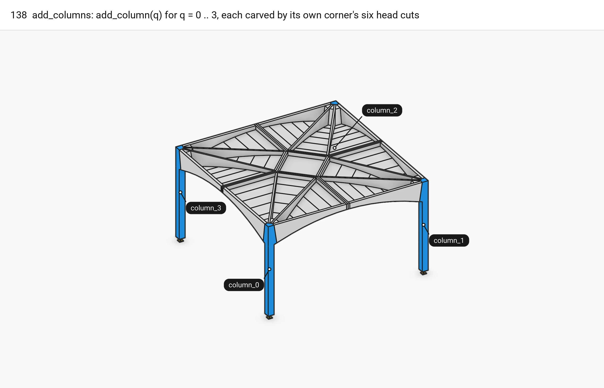

■ built `column_0` .. `column_3`   ■ result `support_0` .. `support_3`   ■ context the floor

`add_columns` calls `add_column(q)` for q = 0..3, each into `column_q` under `quarter_q`, each column carved by its own corner's six head cuts and standing on its support. Example 3 (`templates_floor_3_columns_model`) builds this.

| Variable | Value | Meaning |
|---|---|---|
| `members.columns` | 4 `ColumnModel`s | Support, carved column and group per corner. |

Code: `Floor::add_columns`, [floor_models.cpp:419-423](https://github.com/petrasvestartas/wood/blob/16f3ab0a2386bf39ac7f7123c0a20d03e73ab1a5/src/templates/floor/floor_models.cpp#L419-L423); [examples/templates_floor_3_columns_model.cpp:10-12](https://github.com/petrasvestartas/wood/blob/16f3ab0a2386bf39ac7f7123c0a20d03e73ab1a5/examples/templates_floor_3_columns_model.cpp#L10-L12).

## 139. The floor: quarters and oculus (examples 4, 5)

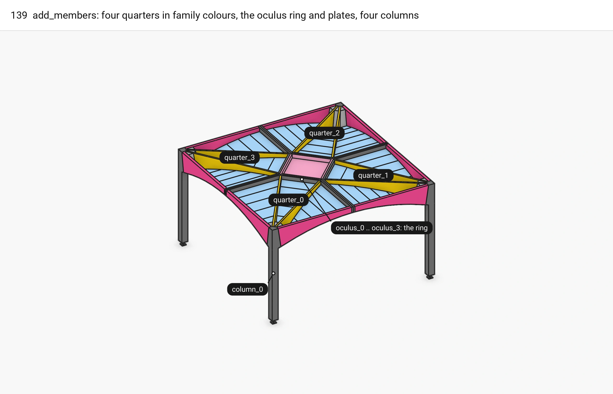

■ outer_ribs `outer_ribs`   ■ inner_ribs `inner_ribs`   ■ inner_beams `inner_beams`   ■ wedges `wedges`   ■ tsections `tsections`   ■ beds `beds`   ■ oculus `oculus_0` .. `oculus_8`   ■ columns `column_0` .. `column_3`, `support_0` .. `support_3`

`add_quarters` builds, per quarter, beds (3 rows), tsections (6), outer_ribs (2), inner_ribs (2), wedges (3) and inner_beams (3), all lifted by `bay_height`: example 4 (`templates_floor_4_quarters`). `add_oculus` lifts the nine `oculus()` outlines: 0 to 3 become ring beams, 4 to 8 plates: example 5 (`templates_floor_5_oculus`). With the columns and their supports this is everything `add_members` adds.

| Variable | Value | Meaning |
|---|---|---|
| `members.quarters` | 4 x (3 bed rows + 6 + 2 + 2 + 3 + 3) | Every quarter member in the scene. |
| `members.ring` | 4 | Ring beams with their `outline_thickness`. |
| `bay_height` | 3500 | Lift of every quarter and oculus member. |

Code: `add_quarter_model`, `add_oculus_model`, [floor_models.cpp:137-181](https://github.com/petrasvestartas/wood/blob/16f3ab0a2386bf39ac7f7123c0a20d03e73ab1a5/src/templates/floor/floor_models.cpp#L137-L181), [425-435](https://github.com/petrasvestartas/wood/blob/16f3ab0a2386bf39ac7f7123c0a20d03e73ab1a5/src/templates/floor/floor_models.cpp#L425-L435); [examples/templates_floor_4_quarters.cpp:10-12](https://github.com/petrasvestartas/wood/blob/16f3ab0a2386bf39ac7f7123c0a20d03e73ab1a5/examples/templates_floor_4_quarters.cpp#L10-L12), [templates_floor_5_oculus.cpp:10-12](https://github.com/petrasvestartas/wood/blob/16f3ab0a2386bf39ac7f7123c0a20d03e73ab1a5/examples/templates_floor_5_oculus.cpp#L10-L12).

## 140. add_floor free path

`add_floor(session, guide, group)` does what `Floor::add_quarters` and `Floor::add_oculus` do, under any parent group. It sets `members.group = group`, calls `add_quarter_model(session, guide.quarter(q), quarter_group(session, group, q))` for q = 0..3, then `add_oculus_model(session, guide, group)`, and sets `members.oculus = group_named(session, group, "oculus")`. The free `add_columns(session, guide, members)` resizes `members.columns` to 4 unconditionally and fills column q under `quarter_q/column_q` of `members.group`. A scene can graft a floor under its own group this way:

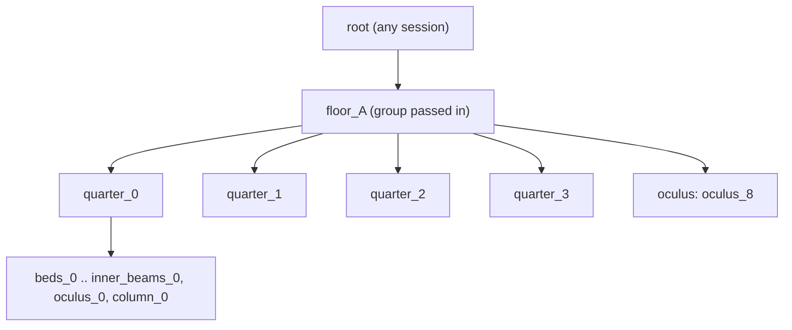
```mermaid
flowchart TD
    R["root (any session)"] --> F["floor_A (group passed in)"]
    F --> Q0["quarter_0"]
    F --> Q1["quarter_1"]
    F --> Q2["quarter_2"]
    F --> Q3["quarter_3"]
    F --> O["oculus: oculus_8"]
    Q0 --> X["beds_0 .. inner_beams_0, oculus_0, column_0"]
```

| Variable | Value | Meaning |
|---|---|---|
| `group` | any node; null = the root | Parent of the floor's groups. |
| result | `FloorMembers` | Same members and tree layout as `Floor::add_members`, under `group`. |

Code: `add_floor`, `add_columns`, [floor_models.cpp:209-229](https://github.com/petrasvestartas/wood/blob/16f3ab0a2386bf39ac7f7123c0a20d03e73ab1a5/src/templates/floor/floor_models.cpp#L209-L229).

## 141. Member lookup

A `MemberRef {quarter, family, index, row}` resolves to a placed element. `FloorMembers::get` reads `members.ring[index]` for `Family::ring`, `members.columns[index].column` for `Family::column` and `members.columns[index].support` for `Family::support`. Every other family needs a quarter 0 to 3, and `quarter_member` picks that quarter's vector by family (`beds[row]` for a bed, which needs `row >= 0`), with a bounds check; anything out of range gives `nullptr`. `thickness(ref)` returns the stored `Member::thickness`, or 0 for a column, a support or a reference out of range. `add_connectors` reads both members and their sizing thickness this way.

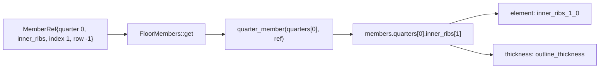
```mermaid
flowchart LR
    R["MemberRef{quarter 0, inner_ribs, index 1, row -1}"] --> G["FloorMembers::get"]
    G --> QM["quarter_member(quarters[0], ref)"]
    QM --> M["members.quarters[0].inner_ribs[1]"]
    M --> E["element: inner_ribs_1_0"]
    M --> T["thickness: outline_thickness"]
```

| Variable | Value | Meaning |
|---|---|---|
| `ref` | `MemberRef`, `row` -1 except for beds | The member asked for. |
| `get(ref)` | placed element or `nullptr` | The scene element. |
| `thickness(ref)` | `Member::thickness`; 0 for a column or a support | What the connectors on it are sized by. |

Code: `quarter_member`, `FloorMembers::get`, `FloorMembers::thickness`, [floor_models.cpp:232-282](https://github.com/petrasvestartas/wood/blob/16f3ab0a2386bf39ac7f7123c0a20d03e73ab1a5/src/templates/floor/floor_models.cpp#L232-L282); [floor.h:321-330](https://github.com/petrasvestartas/wood/blob/16f3ab0a2386bf39ac7f7123c0a20d03e73ab1a5/src/templates/floor/floor.h#L321-L330), [381-396](https://github.com/petrasvestartas/wood/blob/16f3ab0a2386bf39ac7f7123c0a20d03e73ab1a5/src/templates/floor/floor.h#L381-L396).

## 142. get_branch: copy one subtree

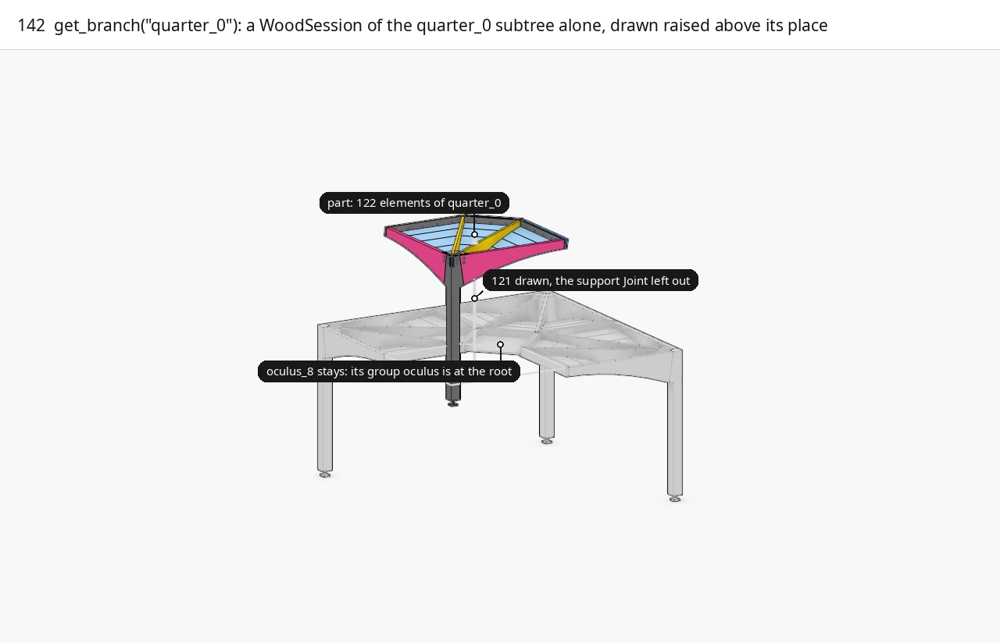

■ outer_ribs   ■ inner_ribs   ■ inner_beams   ■ wedges   ■ tsections   ■ beds   ■ oculus `oculus_0`, `oculus_4`   ■ columns `column_0`, `support_0`   ■ connectors and screws   ■ context the rest of the floor, the `quarter_0` polygon and the raise of 3000, dashed

`WoodSession::get_branch(name)` first calls `Session::get_branch(name)`. That takes the first node with that name (`Tree::get_node_by_name`) and throws `std::invalid_argument` when there is none or it is dead. It records the child-index path from the root, copies the whole session, walks the same path in the copy and makes a new `Session` named after the node. It adds the instance definitions the branch needs, then grafts the node's children under the new root. Graph edges whose two ends both live in the branch are copied with their interactions, and the descendants' xforms are copied too. The product of the xforms from the node up to the root is pushed onto the branch's top-level children. `WoodSession::get_branch` assigns this to the `Session` base of a fresh `WoodSession`. A screw row can join members of two quarters: ring screw row 3 is grouped under `quarter_3` and drills `oculus_3` and `oculus_0`. So that `pre_drill_lines` reads the same holes in the branch as in the floor, every pre-drill connector from outside the branch that names one of its members as a target is copied in too, at the branch's root and at its world placement. The picture draws `get_branch("quarter_0")` of the connected floor raised 3000 above its place, seen from 15 deg above so it stands clear of the floor behind it. `oculus_8` is not in it, because its group `oculus` hangs at the root, not under `quarter_0`.

| Variable | Value | Meaning |
|---|---|---|
| `name` | `"quarter_0"` | Name of the branch root node. |
| `part` | after `add_members`, `add_connectors`, `add_screws`: 122 elements, 119 drills, 25 connectors, one of them the ring screw of quarter 3 | `WoodSession` of the named subtree and the pre-drill connectors that drill its members. |
| `path` | child indices from the root | How the node is found again in the copy. |

Code: `WoodSession::get_branch`, [wood_session.cpp:968-984](https://github.com/petrasvestartas/wood/blob/16f3ab0a2386bf39ac7f7123c0a20d03e73ab1a5/src/joinery_solver/wood_session.cpp#L968-L984); `Session::get_branch`, [session.cpp:2195-2241](https://github.com/petrasvestartas/session_cpp/blob/2c02829d07674c1a5a04f03519611f7ad1f1655c/src/session.cpp#L2195-L2241).

## 143. get_branch: plate remap, adjacency, three_valence

The rest of `WoodSession::get_branch` keeps the plate-joinery data consistent with the smaller session. `part.settings` is copied, then `append_plate_lists(part, plate_guids(*this), adjacency, three_valence)` carries the lists over; `WoodSession::graft` and `merge` call the same function for both sessions they join, so a merge renumbers by guid too. `plate_guids(scene)` lists the guid of every `world_elements<Plate>()` in order, the index space the plate detection works in; it runs on the whole session (`before`) and on the branch (`after`). `moved[i]` is the position of `before[i]` in `after`, or -1 when plate i is not in the branch. `kept(index)` is true when the index is in range and `moved[index] >= 0`. An `adjacency` pair is copied only if both plates are kept, rewritten as `{moved[first], moved[second]}`. A `three_valence` row from row 1 on is kept only if every index in it is kept, rewritten through `moved`; row 0 is a header and is copied unchanged, once, just before the first surviving row (never when no row survives). `add_members` never writes `adjacency` or `three_valence`, so for the floor these hold only what a plate joinery pipeline put there. Both lists are written to the protobuf, fields 102 and 103 of `wood_proto.WoodSession`, so a branch keeps them through `pb_dump` and `pb_load`.

| Step | Input | Output |
|---|---|---|
| `before` | plate guids of the whole floor, indices 0..n-1 | the old index space |
| `after` | plate guids of the branch, indices 0..m-1 | the new index space |
| `moved[i]` | `before[i]` | its index in `after`, or -1 |
| `adjacency` | `{a, b}` | `{moved[a], moved[b]}` if both kept, else dropped |
| `three_valence[0]` | header row | copied once, before the first kept row |
| `three_valence[r]`, r >= 1 | `{i, j, ...}` | `{moved[i], moved[j], ...}` if all kept, else dropped |

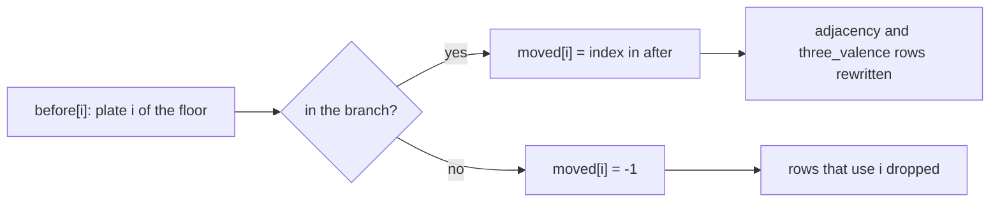
```mermaid
flowchart LR
    B["before[i]: plate i of the floor"] --> M{"in the branch?"}
    M -- yes --> K["moved[i] = index in after"]
    M -- no --> D["moved[i] = -1"]
    K --> A["adjacency and three_valence rows rewritten"]
    D --> X["rows that use i dropped"]
```

| Variable | Value | Meaning |
|---|---|---|
| `moved` | old plate index -> new index, -1 if dropped | The remap. |
| `part.adjacency` | plate pairs wholly inside the branch, renumbered | Filtered adjacency. |
| `part.three_valence` | header row plus groups wholly inside the branch | Filtered three-valence groups. |

Code: `plate_guids`, `append_plate_lists`, [wood_session.cpp:905-948](https://github.com/petrasvestartas/wood/blob/16f3ab0a2386bf39ac7f7123c0a20d03e73ab1a5/src/joinery_solver/wood_session.cpp#L905-L948); `WoodSession::get_branch`, [968-984](https://github.com/petrasvestartas/wood/blob/16f3ab0a2386bf39ac7f7123c0a20d03e73ab1a5/src/joinery_solver/wood_session.cpp#L968-L984); `WoodSession::graft`, [950-966](https://github.com/petrasvestartas/wood/blob/16f3ab0a2386bf39ac7f7123c0a20d03e73ab1a5/src/joinery_solver/wood_session.cpp#L950-L966).
