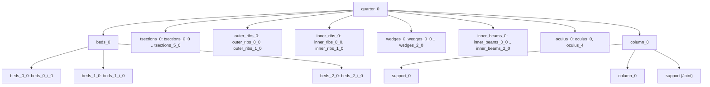

# Floor 07: Elements and the scene {#templates_floor_07_elements}

`Floor::add_members` turns the outlines of chapters 5 and 6 into named elements, lifts them to `bay_height` and groups them in the `Floor`'s own tree, each with the thickness the connectors of chapters 8 to 10 are sized by. The pictures show the default 6000 x 6000 bay, `FloorGuide::rectangle(3000, 3000)`.

Example: [templates_floor_4_quarters.cpp](https://github.com/petrasvestartas/wood/blob/44f9aa85952d32a9264125f4e9940e55b05a4512/examples/templates_floor_4_quarters.cpp) builds every quarter member of the floor with `Floor::add_quarters()`, and [templates_floor_5_oculus.cpp](https://github.com/petrasvestartas/wood/blob/44f9aa85952d32a9264125f4e9940e55b05a4512/examples/templates_floor_5_oculus.cpp) builds the oculus ring and plates with `Floor::add_oculus()`.

■ built what the step builds   ■ variable the variable it introduces or measures   ■ result a second result   ■ input what it reads from earlier steps, dashed for a helper   ■ context context; the frames that tell the member families apart colour each family in its own colour and give their own key.

## 111. Empty Floor session

■ input `guide.edges`, the bay edges of the guide   ■ context the four quarter polygons

`Floor(guide, name)` is a `WoodSession` (named `"floor"` by default) that copies the guide and starts with empty `members`; its null `members.group` makes the top-level groups hang under the tree root.

Code: `Floor::Floor`, [floor_models.cpp:408-409](https://github.com/petrasvestartas/wood/blob/16f3ab0a2386bf39ac7f7123c0a20d03e73ab1a5/src/templates/floor/floor_models.cpp#L408-L409); [floor.h:520-556](https://github.com/petrasvestartas/wood/blob/16f3ab0a2386bf39ac7f7123c0a20d03e73ab1a5/src/templates/floor/floor.h#L520-L556).

## 112. add_members order

`add_members` calls `add_quarters`, `add_oculus` and `add_columns` in that fixed order, so inside each `quarter_q` the six family groups come first, then `oculus_q`, then `column_q`; `connectors_q` comes later, from `add_connectors`.

Code: `Floor::add_members`, [floor_models.cpp:437-442](https://github.com/petrasvestartas/wood/blob/16f3ab0a2386bf39ac7f7123c0a20d03e73ab1a5/src/templates/floor/floor_models.cpp#L437-L442).

## 113. quarter_q groups (find or create)

■ built `quarter_0`, the plan of the group found or made   ■ context `quarter_1` .. `quarter_3` and the bay edges

`quarter_group` calls `group_named`, which returns the child named `quarter_q` of the parent (the root when null) or creates and appends it, so the tree layout is decided by names only.

Code: `Floor::add_quarters`, `quarter_group`, `group_named`, `child_named`, `add_group`, [floor_models.cpp:425-429](https://github.com/petrasvestartas/wood/blob/16f3ab0a2386bf39ac7f7123c0a20d03e73ab1a5/src/templates/floor/floor_models.cpp#L425-L429), [87-89](https://github.com/petrasvestartas/wood/blob/16f3ab0a2386bf39ac7f7123c0a20d03e73ab1a5/src/templates/floor/floor_models.cpp#L87-L89), [79-84](https://github.com/petrasvestartas/wood/blob/16f3ab0a2386bf39ac7f7123c0a20d03e73ab1a5/src/templates/floor/floor_models.cpp#L79-L84), [64-76](https://github.com/petrasvestartas/wood/blob/16f3ab0a2386bf39ac7f7123c0a20d03e73ab1a5/src/templates/floor/floor_models.cpp#L64-L76), [129-135](https://github.com/petrasvestartas/wood/blob/16f3ab0a2386bf39ac7f7123c0a20d03e73ab1a5/src/templates/floor/floor_models.cpp#L129-L135); [session.cpp:1103-1113](https://github.com/petrasvestartas/session_cpp/blob/2c02829d07674c1a5a04f03519611f7ad1f1655c/src/session.cpp#L1103-L1113).

## 114. Lift to bay_height and beds_q

■ built quarter 0 members placed at `bay_height`   ■ variable `lift = Xform::translation(0, 0, 3500)`   ■ input quarter 0 outlines at z 0

`add_quarter_model` builds every quarter outline at datum z 0 and places it with `lift = Xform::translation(0, 0, bay_height)` (3500) through `place()`, adding `beds_q` first, then beds, tsections, outer_ribs, inner_ribs, wedges and inner_beams.

Code: `add_quarter_model`, [floor_models.cpp:137-163](https://github.com/petrasvestartas/wood/blob/16f3ab0a2386bf39ac7f7123c0a20d03e73ab1a5/src/templates/floor/floor_models.cpp#L137-L163) (set-up 128-133).

## 115. outline_thickness

■ built `area_centroid` of each loop   ■ variable `thickness`, the distance between them   ■ input `outline.top` and `outline.bottom` of outer rib 0

Each `Member` stores `thickness = outline_thickness(outline)`, the distance between the area centroids of `outline.top` and `outline.bottom`, which the connectors read later (frame 141); for tilted loops it is at least the face offset.

Code: `outline_thickness`, [floor_elements.cpp:107-109](https://github.com/petrasvestartas/wood/blob/16f3ab0a2386bf39ac7f7123c0a20d03e73ab1a5/src/templates/floor/floor_elements.cpp#L107-L109); `area_centroid`, [floor_geometry.cpp:180-195](https://github.com/petrasvestartas/wood/blob/16f3ab0a2386bf39ac7f7123c0a20d03e73ab1a5/src/templates/floor/floor_geometry.cpp#L180-L195).

## 116. to_members dispatch

■ outer_ribs `outer_ribs`   ■ inner_ribs `inner_ribs`   ■ inner_beams `inner_beams`   ■ wedges `wedges`   ■ tsections `tsections`   ■ beds `beds`

`to_members` builds one `Member` per outline: `outer_ribs` and `inner_ribs` with `to_rib`, `inner_beams` with `to_beam(outline, {0, 3}, {1, 2})` (all `BeamVariable`), and wedges, tsections and beds with `to_plate`.

Code: `to_members`, [floor_models.cpp:9-29](https://github.com/petrasvestartas/wood/blob/16f3ab0a2386bf39ac7f7123c0a20d03e73ab1a5/src/templates/floor/floor_models.cpp#L9-L29); [floor.h:291-313](https://github.com/petrasvestartas/wood/blob/16f3ab0a2386bf39ac7f7123c0a20d03e73ab1a5/src/templates/floor/floor.h#L291-L313).

## 117. Bed plates

■ built `quarter.beds`, the bed plates   ■ variable `outline.top`, the +2t layer, `tsections` = 27 higher   ■ input `outline.bottom`, the +t layer   ■ context the ribs

Each bed outline becomes `Plate(outline.bottom, outline.top, "beds")`, a slab from the flange top (+t) to the bed top (+2t); `trim_alike` cuts the four traces to the same point count, on a skewed bay too.

Code: `to_plate`, [floor_elements.cpp:70-72](https://github.com/petrasvestartas/wood/blob/16f3ab0a2386bf39ac7f7123c0a20d03e73ab1a5/src/templates/floor/floor_elements.cpp#L70-L72); `bed_row`, `outer_bed_row`, `Quarter::beds`, [floor_members.cpp:189-226](https://github.com/petrasvestartas/wood/blob/16f3ab0a2386bf39ac7f7123c0a20d03e73ab1a5/src/templates/floor/floor_members.cpp#L189-L226); [floor_models.cpp:146-149](https://github.com/petrasvestartas/wood/blob/16f3ab0a2386bf39ac7f7123c0a20d03e73ab1a5/src/templates/floor/floor_models.cpp#L146-L149).

## 118. add_family: groups, names, place()

■ built `beds_0_i_0`, row 0 placed and named   ■ variable `lift`, +3500   ■ input bed row 0 outlines at z 0

`add_family` adds the group `prefix + suffix`, bakes `lift` into each element with `place()` (no node xform) and names it `{prefix}_{i}{suffix}`, giving `beds_q / beds_{row}_q / beds_{row}_{i}_q` for beds and e.g. `outer_ribs_0 / outer_ribs_1_0` otherwise.

Code: `add_family`, `add_placed`, `add_named`, [floor_models.cpp:46-52](https://github.com/petrasvestartas/wood/blob/16f3ab0a2386bf39ac7f7123c0a20d03e73ab1a5/src/templates/floor/floor_models.cpp#L46-L52), [39-43](https://github.com/petrasvestartas/wood/blob/16f3ab0a2386bf39ac7f7123c0a20d03e73ab1a5/src/templates/floor/floor_models.cpp#L39-L43), [32-36](https://github.com/petrasvestartas/wood/blob/16f3ab0a2386bf39ac7f7123c0a20d03e73ab1a5/src/templates/floor/floor_models.cpp#L32-L36); [element.cpp:464-482](https://github.com/petrasvestartas/session_cpp/blob/2c02829d07674c1a5a04f03519611f7ad1f1655c/src/element.cpp#L464-L482).

## 119. T-section plates

■ built the t-section strips, `tsections_1_0` and `tsections_2_0` named   ■ input `inner_ribs_0_0`, the rib the two strips lie beside   ■ context the other ribs

`view.tsections()` returns six 27 mm flange strips between the soffit and the +t trace beside the rib faces, each made `Plate(bottom, top, "tsections")` and added as `tsections_0_q` .. `tsections_5_q`.

Code: `tsection`, `outer_tsection`, `Quarter::tsections`, [floor_members.cpp:131-186](https://github.com/petrasvestartas/wood/blob/16f3ab0a2386bf39ac7f7123c0a20d03e73ab1a5/src/templates/floor/floor_members.cpp#L131-L186); [floor_models.cpp:151-152](https://github.com/petrasvestartas/wood/blob/16f3ab0a2386bf39ac7f7123c0a20d03e73ab1a5/src/templates/floor/floor_models.cpp#L151-L152).

## 120. to_rib: loops and stations

■ built `top`, the first-face loop   ■ variable the `stations`, the 7 soffit points   ■ result `p1` = `top[0]` and `p0` = `top[1]`   ■ input the first chord and the last facet extended by `trim`, dashed   ■ context the two Bezier points `trim` drops

`rib()` trims the soffit trace between the fan plane and `cut_plane1`, and `rib_loop` builds `top = [p1, p0, pts..., p1]` with `stations = top.size() - 3` soffit points. `trim` drops the Bezier's start and last points, so outer rib 0 is 694.8 deep at the fan plane, not 650.

Code: `to_rib`, [floor_elements.cpp:29-34](https://github.com/petrasvestartas/wood/blob/16f3ab0a2386bf39ac7f7123c0a20d03e73ab1a5/src/templates/floor/floor_elements.cpp#L29-L34); `rib_loop`, `rib`, [floor_members.cpp:17-55](https://github.com/petrasvestartas/wood/blob/16f3ab0a2386bf39ac7f7123c0a20d03e73ab1a5/src/templates/floor/floor_members.cpp#L17-L55); `trim`, [floor_geometry.cpp:69-80](https://github.com/petrasvestartas/wood/blob/16f3ab0a2386bf39ac7f7123c0a20d03e73ab1a5/src/templates/floor/floor_geometry.cpp#L69-L80).

## 121. to_rib: interior sections

■ built the interior `sections[1]` .. `sections[5]`, the middle one bold   ■ input `top` and `bottom`, the two loops of outer rib 0

Each section is the planar quad `{low, high, far_high, far_low}` from the soffit point on both faces up to z 0; the interior ones are i = 1 to `stations - 2`.

Code: `at_level`, `to_rib`, [floor_elements.cpp:11-13](https://github.com/petrasvestartas/wood/blob/16f3ab0a2386bf39ac7f7123c0a20d03e73ab1a5/src/templates/floor/floor_elements.cpp#L11-L13), [36-41](https://github.com/petrasvestartas/wood/blob/16f3ab0a2386bf39ac7f7123c0a20d03e73ab1a5/src/templates/floor/floor_elements.cpp#L36-L41), [50](https://github.com/petrasvestartas/wood/blob/16f3ab0a2386bf39ac7f7123c0a20d03e73ab1a5/src/templates/floor/floor_elements.cpp#L50).

## 122. to_rib: end sections in the end planes

■ built `sections[0]` and `sections[6]`, the two end caps   ■ input `cut_plane0` = `cp.wedges[0][0]` and `cut_plane1` = `rib_seam_ends()[0]`   ■ context the interior sections

The first section lies in the fan plane `cut_plane0` and the last in `cut_plane1` (the seam beam's far face for an outer rib, the oculus beam's back face for an inner rib), so both caps lie on the planes the rib ends on.

Code: `to_rib`, [floor_elements.cpp:42-48](https://github.com/petrasvestartas/wood/blob/16f3ab0a2386bf39ac7f7123c0a20d03e73ab1a5/src/templates/floor/floor_elements.cpp#L42-L48); `rib`, `rib_seam_ends`, [floor_members.cpp:21-25](https://github.com/petrasvestartas/wood/blob/16f3ab0a2386bf39ac7f7123c0a20d03e73ab1a5/src/templates/floor/floor_members.cpp#L21-L25), [51-52](https://github.com/petrasvestartas/wood/blob/16f3ab0a2386bf39ac7f7123c0a20d03e73ab1a5/src/templates/floor/floor_members.cpp#L51-L52), [69-75](https://github.com/petrasvestartas/wood/blob/16f3ab0a2386bf39ac7f7123c0a20d03e73ab1a5/src/templates/floor/floor_members.cpp#L69-L75).

## 123. to_rib: axis

■ built the `axis` of each rib   ■ context the four ribs

`axis = Line::from_points(centre of top[1]-bottom[1], centre of top[0]-bottom[0])`. It runs from the midpoint of the two `p0` corners at the fan end to the midpoint of the two `p1` corners at the far end: on z 0 before the lift, halfway through the rib's thickness, pointing from the column to the seam or the oculus beam. The contact search uses it to tell end faces from side faces.

`axis` runs from the midpoint of the two `p0` corners to that of the two `p1` corners, on z 0 halfway through the rib; the contact search uses it to tell end faces from side faces.

Code: `to_rib`, [floor_elements.cpp:53](https://github.com/petrasvestartas/wood/blob/16f3ab0a2386bf39ac7f7123c0a20d03e73ab1a5/src/templates/floor/floor_elements.cpp#L53); [wood_element_beam_variable.h:13](https://github.com/petrasvestartas/wood/blob/16f3ab0a2386bf39ac7f7123c0a20d03e73ab1a5/src/joinery_solver/wood_elements/wood_element_beam_variable.h#L13).

## 124. Outer ribs as BeamVariable

■ built `outer_ribs_0_0` and `outer_ribs_1_0`   ■ context the rest of the floor

`BeamVariable(axis, sections, name)` lofts the sections into an 11-face mesh for 7 stations, and `add_family` lifts the two ribs along the bay edges by 3500 as `outer_ribs_0_q` and `outer_ribs_1_q`.

Code: `to_rib`, [floor_elements.cpp:55](https://github.com/petrasvestartas/wood/blob/16f3ab0a2386bf39ac7f7123c0a20d03e73ab1a5/src/templates/floor/floor_elements.cpp#L55); `Quarter::outer_ribs`, [floor_members.cpp:57-67](https://github.com/petrasvestartas/wood/blob/16f3ab0a2386bf39ac7f7123c0a20d03e73ab1a5/src/templates/floor/floor_members.cpp#L57-L67); [floor_models.cpp:153-154](https://github.com/petrasvestartas/wood/blob/16f3ab0a2386bf39ac7f7123c0a20d03e73ab1a5/src/templates/floor/floor_models.cpp#L153-L154).

## 125. Inner ribs as BeamVariable

■ built `inner_ribs_0_0` and `inner_ribs_1_0`   ■ variable `central_panel.rib_sweep`, each the way its points move   ■ input `cp.inner_ribs[i][0].z_axis()`, the face normal, dashed   ■ context the outer ribs

Each inner rib's second loop is swept along the shared horizontal `central_panel.rib_sweep`, not the face normal, so its sections are 61.06 wide, 10.704 deg off square and sheared 11.342. Inner rib 1's far points move the other way along it, by -61.06.

Code: `Quarter::inner_ribs`, [floor_members.cpp:77-87](https://github.com/petrasvestartas/wood/blob/16f3ab0a2386bf39ac7f7123c0a20d03e73ab1a5/src/templates/floor/floor_members.cpp#L77-L87); [floor_models.cpp:155-156](https://github.com/petrasvestartas/wood/blob/16f3ab0a2386bf39ac7f7123c0a20d03e73ab1a5/src/templates/floor/floor_models.cpp#L155-L156); [floor.cpp:335-339](https://github.com/petrasvestartas/wood/blob/16f3ab0a2386bf39ac7f7123c0a20d03e73ab1a5/src/templates/floor/floor.cpp#L335-L339).

## 126. Wedge block plates

■ built `wedges_0_0` .. `wedges_2_0`   ■ input the fan planes `cp.wedges[i][0]`   ■ context the ribs

Each wedge block is `loft_planes` of its two rib faces, its bed top plane and the datum, `bottom` on the fan plane `cp.wedges[i][0]` and `top` on the far face, giving three plates at the column head (offsets 240 / 300 / 240 on the square).

Code: `Quarter::wedges`, [floor_members.cpp:107-124](https://github.com/petrasvestartas/wood/blob/16f3ab0a2386bf39ac7f7123c0a20d03e73ab1a5/src/templates/floor/floor_members.cpp#L107-L124); `loft_planes`, [floor_geometry.cpp:273-296](https://github.com/petrasvestartas/wood/blob/16f3ab0a2386bf39ac7f7123c0a20d03e73ab1a5/src/templates/floor/floor_geometry.cpp#L273-L296); [floor_models.cpp:157-158](https://github.com/petrasvestartas/wood/blob/16f3ab0a2386bf39ac7f7123c0a20d03e73ab1a5/src/templates/floor/floor_models.cpp#L157-L158).

## 127. to_beam: two caps and axis

■ built `first` and `last`, the two end caps   ■ result the `axis` from `a` to `b`   ■ input `top` and `bottom` of seam beam 0   ■ context `inner_beams_1_0`

`to_beam(outline, {0, 3}, {1, 2})` takes the cap on the outer face as `first` and the cap on the 5 deg bearing plane as `last`, joins their vertex centroids as `axis` and lofts a 6-face `BeamVariable`. The leaning bearing plane makes the outline no box: bottom vertex 2 sits 24.6 nearer the centre than vertex 1.

Code: `to_beam`, [floor_elements.cpp:58-68](https://github.com/petrasvestartas/wood/blob/16f3ab0a2386bf39ac7f7123c0a20d03e73ab1a5/src/templates/floor/floor_elements.cpp#L58-L68); `Quarter::inner_beams`, [floor_members.cpp:93-105](https://github.com/petrasvestartas/wood/blob/16f3ab0a2386bf39ac7f7123c0a20d03e73ab1a5/src/templates/floor/floor_members.cpp#L93-L105); [floor_models.cpp:21](https://github.com/petrasvestartas/wood/blob/16f3ab0a2386bf39ac7f7123c0a20d03e73ab1a5/src/templates/floor/floor_models.cpp#L21), [159-160](https://github.com/petrasvestartas/wood/blob/16f3ab0a2386bf39ac7f7123c0a20d03e73ab1a5/src/templates/floor/floor_models.cpp#L159-L160).

## 128. Oculus set-up

■ built the nine `guide.oculus()` outlines   ■ variable the four levels `side0` .. `side3`, dashed

`guide.oculus()` returns nine datum outlines (0-3 ring beams, 4-7 bottom wedges, 8 central plate) lofted between four levels and, per edge, the `tilted` and `ring_inner` planes.

| Level | Value | Meaning |
|---|---|---|
| `side0` | `level(0)` | Floor top. |
| `side1` | `level(soffit + tsections)`, -171.783 | Bottom wedge top, central plate bottom. |
| `side2` | `level(soffit)`, -198.783 | Ring beam and bottom wedge bottom. |
| `side3` | `level(soffit + 2 tsections)`, -144.783 | Central plate top. |

Code: `add_oculus_model`, [floor_models.cpp:165-169](https://github.com/petrasvestartas/wood/blob/16f3ab0a2386bf39ac7f7123c0a20d03e73ab1a5/src/templates/floor/floor_models.cpp#L165-L169); `FloorGuide::oculus`, [floor_members.cpp:232-260](https://github.com/petrasvestartas/wood/blob/16f3ab0a2386bf39ac7f7123c0a20d03e73ab1a5/src/templates/floor/floor_members.cpp#L232-L260); `oculus_edge`, [floor.cpp:93-103](https://github.com/petrasvestartas/wood/blob/16f3ab0a2386bf39ac7f7123c0a20d03e73ab1a5/src/templates/floor/floor.cpp#L93-L103).

## 129. Ring beams as BeamVariable

■ built the ring beams `oculus_0` .. `oculus_3`   ■ result each start cap, on `tilted[i + 1]`   ■ context the oculus beams `inner_beams_1_q`

Ring beam i is `loft_planes({side2, tilted[i+1], side0, inner[i+3]}, tilted[i], inner[i], flip = true)`, indices modulo 4. After the flip `outline.top` lies on `tilted[i]`, the bearing plane the quarter's oculus beam also uses, and `outline.bottom` on `ring_inner[i]`. The vertices are 0 = soffit x `tilted[i+1]`, 1 = `tilted[i+1]` x z 0, 2 = z 0 x `inner[i-1]`, 3 = `inner[i-1]` x soffit. `to_beam(outline, {1, 0}, {2, 3}, "oculus")` therefore starts with the cap on the next edge's tilted plane and ends with the cap on the previous edge's inner plane. Each beam butts the next one in turn, a pinwheel with no overlap.

Ring beam i is a flipped `loft_planes` whose start cap lies on the next edge's `tilted[i+1]` and end cap on `inner[i-1]`, so each beam butts the next in a pinwheel with no overlap.

Code: `add_oculus_model`, [floor_models.cpp:172](https://github.com/petrasvestartas/wood/blob/16f3ab0a2386bf39ac7f7123c0a20d03e73ab1a5/src/templates/floor/floor_models.cpp#L172); [floor_members.cpp:249-250](https://github.com/petrasvestartas/wood/blob/16f3ab0a2386bf39ac7f7123c0a20d03e73ab1a5/src/templates/floor/floor_members.cpp#L249-L250); `loft_planes`, [floor_geometry.cpp:273-296](https://github.com/petrasvestartas/wood/blob/16f3ab0a2386bf39ac7f7123c0a20d03e73ab1a5/src/templates/floor/floor_geometry.cpp#L273-L296).

## 130. Bottom wedge plates

■ built the bottom wedges `oculus_4` .. `oculus_7`   ■ context the ring beams

Outlines 4 to 7 are 27 x 27 strips along the inside of each `ring_inner` face, from the soffit to soffit + 27, forming the pinwheel ledge the central plate rests on.

Code: `add_oculus_model`, [floor_models.cpp:172](https://github.com/petrasvestartas/wood/blob/16f3ab0a2386bf39ac7f7123c0a20d03e73ab1a5/src/templates/floor/floor_models.cpp#L172); [floor_members.cpp:252-255](https://github.com/petrasvestartas/wood/blob/16f3ab0a2386bf39ac7f7123c0a20d03e73ab1a5/src/templates/floor/floor_members.cpp#L252-L255).

## 131. Central plate oculus_8

■ built `oculus_8`   ■ input the ledge `oculus_4` .. `oculus_7`   ■ context the ring beams

`oculus_8` is `loft_planes(inner, side1, side3)`, a 27 thick plate bounded by the four `ring_inner` planes that fills the opening and rests on the bottom wedges.

Code: `add_oculus_model`, [floor_models.cpp:172](https://github.com/petrasvestartas/wood/blob/16f3ab0a2386bf39ac7f7123c0a20d03e73ab1a5/src/templates/floor/floor_models.cpp#L172); [floor_members.cpp:257](https://github.com/petrasvestartas/wood/blob/16f3ab0a2386bf39ac7f7123c0a20d03e73ab1a5/src/templates/floor/floor_members.cpp#L257).

## 132. Oculus grouping

■ built `quarter_0/oculus_0`: `oculus_0`, `oculus_4`   ■ result `oculus` at the root: `oculus_8`   ■ context `quarter_1/oculus_1` .. `quarter_3/oculus_3`

Ring beam q and bottom wedge 4 + q go into `quarter_q / oculus_q` and `oculus_8` into a root group `oculus`; only the four ring beams are returned, as `members.ring`.

Code: `add_oculus_model`, [floor_models.cpp:173-180](https://github.com/petrasvestartas/wood/blob/16f3ab0a2386bf39ac7f7123c0a20d03e73ab1a5/src/templates/floor/floor_models.cpp#L173-L180); `Floor::add_oculus`, 407-411.

## 133. column_q group and names

`add_column(q)` finds or creates `quarter_q / column_q` and adds `support_q`, `column_q` and the support joint (named `"support"`) in that order. The tree of quarter 0 after `add_members`:

Code: `Floor::add_column`, `Floor::add_columns`, [floor_models.cpp:411-423](https://github.com/petrasvestartas/wood/blob/16f3ab0a2386bf39ac7f7123c0a20d03e73ab1a5/src/templates/floor/floor_models.cpp#L411-L423); `add_column_model`, 176-188.

## 134. Support and column foot

■ built `model.support`, `support_0`   ■ variable `foot = column_foot()`, 138 above the slab   ■ result the column axis up to `bay_height`   ■ input `support_plane`

`to_support` stands a `Support` on the slab at the centre of the column square, and the column axis runs from `foot = support.column_foot()`, 138 above the slab, up to `bay_height`, so the column top is the floor top.

Code: `to_support`, [floor_elements.cpp:74-76](https://github.com/petrasvestartas/wood/blob/16f3ab0a2386bf39ac7f7123c0a20d03e73ab1a5/src/templates/floor/floor_elements.cpp#L74-L76); `column_corner`, [floor.cpp:130-140](https://github.com/petrasvestartas/wood/blob/16f3ab0a2386bf39ac7f7123c0a20d03e73ab1a5/src/templates/floor/floor.cpp#L130-L140); `to_column`, [floor_elements.cpp:80-83](https://github.com/petrasvestartas/wood/blob/16f3ab0a2386bf39ac7f7123c0a20d03e73ab1a5/src/templates/floor/floor_elements.cpp#L80-L83); `Support::column_foot`, [wood_element_support.cpp:124-126](https://github.com/petrasvestartas/wood/blob/16f3ab0a2386bf39ac7f7123c0a20d03e73ab1a5/src/joinery_solver/wood_elements/wood_element_support.cpp#L124-L126); [floor_models.cpp:191-193](https://github.com/petrasvestartas/wood/blob/16f3ab0a2386bf39ac7f7123c0a20d03e73ab1a5/src/templates/floor/floor_models.cpp#L191-L193).

## 135. Shaft and capitel

■ built the `Column` before its cuts   ■ variable `section`, the 220 shaft square   ■ result `column->head`, the 340 capitel square

The `Column` is the 220 shaft square with a 340 capitel `head` grown from the same bay corner, 120 wider toward the bay only and `column_head_depth` = 730 deep, lofted through four stations.

Code: `square`, `to_column`, [floor_elements.cpp:16-23](https://github.com/petrasvestartas/wood/blob/16f3ab0a2386bf39ac7f7123c0a20d03e73ab1a5/src/templates/floor/floor_elements.cpp#L16-L23), [85-87](https://github.com/petrasvestartas/wood/blob/16f3ab0a2386bf39ac7f7123c0a20d03e73ab1a5/src/templates/floor/floor_elements.cpp#L85-L87); [wood_element_column.cpp:143-154](https://github.com/petrasvestartas/wood/blob/16f3ab0a2386bf39ac7f7123c0a20d03e73ab1a5/src/joinery_solver/wood_elements/wood_element_column.cpp#L143-L154).

## 136. Support joint

■ built `loops`, the head plate disc   ■ result `drill_lines`, one per screw   ■ variable the levels z 126, 138 (the foot) and 150, dashed   ■ input `support_0`

`Joint::support` cuts a head plate disc (r 53, z 126 to 150) 12 deep into the column end plus one drill per screw, and `add_cutter_joint` stores it as a `SolidCut` on the column with an interaction edge.

Code: `add_column_model`, [floor_models.cpp:197-199](https://github.com/petrasvestartas/wood/blob/16f3ab0a2386bf39ac7f7123c0a20d03e73ab1a5/src/templates/floor/floor_models.cpp#L197-L199); `Joint::support`, [wood_element_joint.cpp:78-93](https://github.com/petrasvestartas/wood/blob/16f3ab0a2386bf39ac7f7123c0a20d03e73ab1a5/src/joinery_solver/wood_elements/wood_element_joint.cpp#L78-L93); [wood_session.cpp:1097-1103](https://github.com/petrasvestartas/wood/blob/16f3ab0a2386bf39ac7f7123c0a20d03e73ab1a5/src/joinery_solver/wood_session.cpp#L1097-L1103), [1118-1137](https://github.com/petrasvestartas/wood/blob/16f3ab0a2386bf39ac7f7123c0a20d03e73ab1a5/src/joinery_solver/wood_session.cpp#L1118-L1137), [1233-1258](https://github.com/petrasvestartas/wood/blob/16f3ab0a2386bf39ac7f7123c0a20d03e73ab1a5/src/joinery_solver/wood_session.cpp#L1233-L1258), [1268-1280](https://github.com/petrasvestartas/wood/blob/16f3ab0a2386bf39ac7f7123c0a20d03e73ab1a5/src/joinery_solver/wood_session.cpp#L1268-L1280), [1306-1322](https://github.com/petrasvestartas/wood/blob/16f3ab0a2386bf39ac7f7123c0a20d03e73ab1a5/src/joinery_solver/wood_session.cpp#L1306-L1322), [1336-1350](https://github.com/petrasvestartas/wood/blob/16f3ab0a2386bf39ac7f7123c0a20d03e73ab1a5/src/joinery_solver/wood_session.cpp#L1336-L1350).

## 137. Column head carving (example 2)

■ built `column_0`, carved   ■ input the six `column_cutters()` lifted by `bay_height`

`column_cuts` turns the six `Quarter::column_cutters` quads, stretched and thickened by `CUTTER_MARGIN` = 100, into lifted `SolidCut` differences: features of the column, not scene elements. Example 2 builds this one column model.

Code: `column_cuts`, [floor_elements.cpp:92-105](https://github.com/petrasvestartas/wood/blob/16f3ab0a2386bf39ac7f7123c0a20d03e73ab1a5/src/templates/floor/floor_elements.cpp#L92-L105); `stretch`, `Quarter::column_cutters`, [floor_members.cpp:267-340](https://github.com/petrasvestartas/wood/blob/16f3ab0a2386bf39ac7f7123c0a20d03e73ab1a5/src/templates/floor/floor_members.cpp#L267-L340); `add_column_model`, [floor_models.cpp:201-204](https://github.com/petrasvestartas/wood/blob/16f3ab0a2386bf39ac7f7123c0a20d03e73ab1a5/src/templates/floor/floor_models.cpp#L201-L204); [examples/templates_floor_2_column_model.cpp:10-12](https://github.com/petrasvestartas/wood/blob/16f3ab0a2386bf39ac7f7123c0a20d03e73ab1a5/examples/templates_floor_2_column_model.cpp#L10-L12).

## 138. Four columns (example 3)

■ built `column_0` .. `column_3`   ■ result `support_0` .. `support_3`   ■ context the floor

`add_columns` adds the four carved columns on their supports, one per `quarter_q / column_q`; example 3 builds this.

Code: `Floor::add_columns`, [floor_models.cpp:419-423](https://github.com/petrasvestartas/wood/blob/16f3ab0a2386bf39ac7f7123c0a20d03e73ab1a5/src/templates/floor/floor_models.cpp#L419-L423); [examples/templates_floor_3_columns_model.cpp:10-12](https://github.com/petrasvestartas/wood/blob/16f3ab0a2386bf39ac7f7123c0a20d03e73ab1a5/examples/templates_floor_3_columns_model.cpp#L10-L12).

## 139. The floor: quarters and oculus (examples 4, 5)

■ outer_ribs `outer_ribs`   ■ inner_ribs `inner_ribs`   ■ inner_beams `inner_beams`   ■ wedges `wedges`   ■ tsections `tsections`   ■ beds `beds`   ■ oculus `oculus_0` .. `oculus_8`   ■ columns `column_0` .. `column_3`, `support_0` .. `support_3`

`add_quarters` (example 4), `add_oculus` (example 5) and the columns are everything `add_members` adds, all lifted by `bay_height`.

Code: `add_quarter_model`, `add_oculus_model`, [floor_models.cpp:137-181](https://github.com/petrasvestartas/wood/blob/16f3ab0a2386bf39ac7f7123c0a20d03e73ab1a5/src/templates/floor/floor_models.cpp#L137-L181), [425-435](https://github.com/petrasvestartas/wood/blob/16f3ab0a2386bf39ac7f7123c0a20d03e73ab1a5/src/templates/floor/floor_models.cpp#L425-L435); [examples/templates_floor_4_quarters.cpp:10-12](https://github.com/petrasvestartas/wood/blob/16f3ab0a2386bf39ac7f7123c0a20d03e73ab1a5/examples/templates_floor_4_quarters.cpp#L10-L12), [templates_floor_5_oculus.cpp:10-12](https://github.com/petrasvestartas/wood/blob/16f3ab0a2386bf39ac7f7123c0a20d03e73ab1a5/examples/templates_floor_5_oculus.cpp#L10-L12).

## 140. add_floor free path

The free `add_floor(session, guide, group)` and `add_columns(session, guide, members)` build the same members and tree under any parent group, so a scene can graft a floor under its own group.

Code: `add_floor`, `add_columns`, [floor_models.cpp:209-229](https://github.com/petrasvestartas/wood/blob/16f3ab0a2386bf39ac7f7123c0a20d03e73ab1a5/src/templates/floor/floor_models.cpp#L209-L229).

## 141. Member lookup

`FloorMembers::get(MemberRef)` resolves a reference to a placed element, or `nullptr` when out of range, and `thickness(ref)` returns the stored `Member::thickness` (0 for a column or support) that `add_connectors` sizes by.

Code: `quarter_member`, `FloorMembers::get`, `FloorMembers::thickness`, [floor_models.cpp:232-282](https://github.com/petrasvestartas/wood/blob/16f3ab0a2386bf39ac7f7123c0a20d03e73ab1a5/src/templates/floor/floor_models.cpp#L232-L282); [floor.h:321-330](https://github.com/petrasvestartas/wood/blob/16f3ab0a2386bf39ac7f7123c0a20d03e73ab1a5/src/templates/floor/floor.h#L321-L330), [381-396](https://github.com/petrasvestartas/wood/blob/16f3ab0a2386bf39ac7f7123c0a20d03e73ab1a5/src/templates/floor/floor.h#L381-L396).

## 142. get_branch: copy one subtree

■ outer_ribs   ■ inner_ribs   ■ inner_beams   ■ wedges   ■ tsections   ■ beds   ■ oculus `oculus_0`, `oculus_4`   ■ columns `column_0`, `support_0`   ■ connectors and screws   ■ context the rest of the floor, the `quarter_0` polygon and the raise of 3000, dashed

`WoodSession::get_branch(name)` copies the first node of that name and its subtree into a new `WoodSession`, throwing `std::invalid_argument` when there is none. Outside pre-drill connectors that target its members are copied in too, so `pre_drill_lines` reads the same holes; `oculus_8` is absent because its group hangs at the root.

Code: `WoodSession::get_branch`, [wood_session.cpp:968-984](https://github.com/petrasvestartas/wood/blob/16f3ab0a2386bf39ac7f7123c0a20d03e73ab1a5/src/joinery_solver/wood_session.cpp#L968-L984); `Session::get_branch`, [session.cpp:2195-2241](https://github.com/petrasvestartas/session_cpp/blob/2c02829d07674c1a5a04f03519611f7ad1f1655c/src/session.cpp#L2195-L2241).

## 143. get_branch: plate remap, adjacency, three_valence

`append_plate_lists` renumbers `adjacency` and `three_valence` by plate guid into the branch, dropping any pair or row that uses a plate outside it and keeping the header row once; both lists survive `pb_dump` and `pb_load`.

Code: `plate_guids`, `append_plate_lists`, [wood_session.cpp:905-948](https://github.com/petrasvestartas/wood/blob/16f3ab0a2386bf39ac7f7123c0a20d03e73ab1a5/src/joinery_solver/wood_session.cpp#L905-L948); `WoodSession::get_branch`, [968-984](https://github.com/petrasvestartas/wood/blob/16f3ab0a2386bf39ac7f7123c0a20d03e73ab1a5/src/joinery_solver/wood_session.cpp#L968-L984); `WoodSession::graft`, [950-966](https://github.com/petrasvestartas/wood/blob/16f3ab0a2386bf39ac7f7123c0a20d03e73ab1a5/src/joinery_solver/wood_session.cpp#L950-L966).
