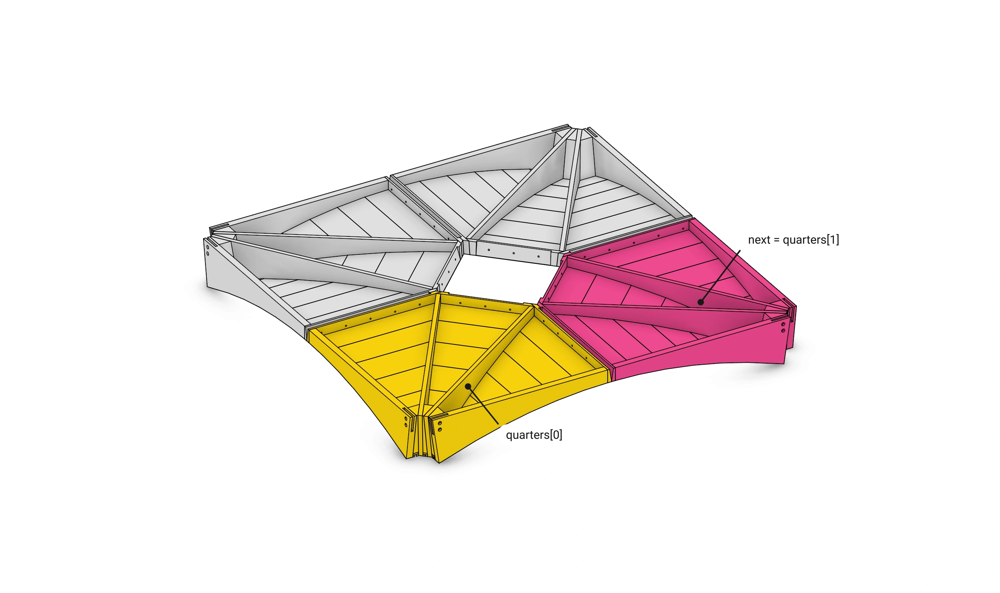
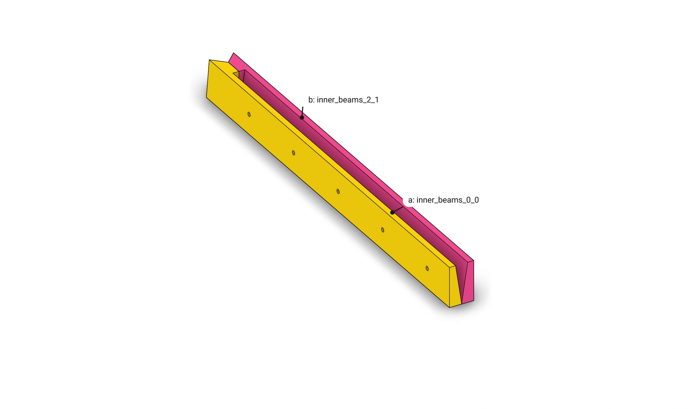
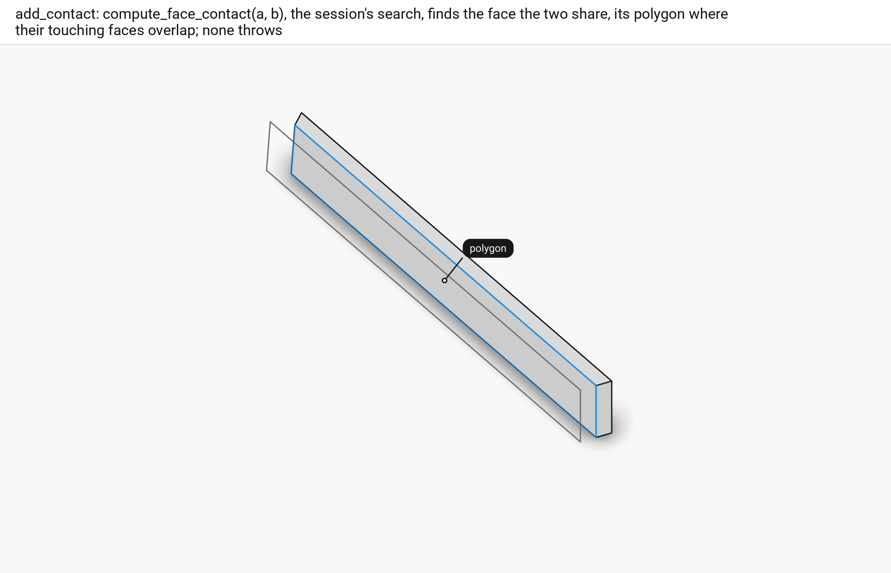
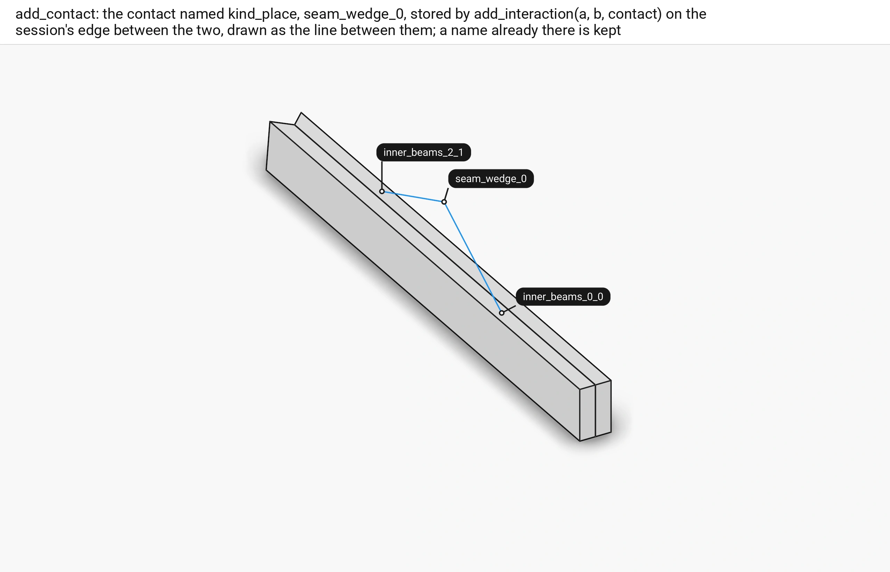
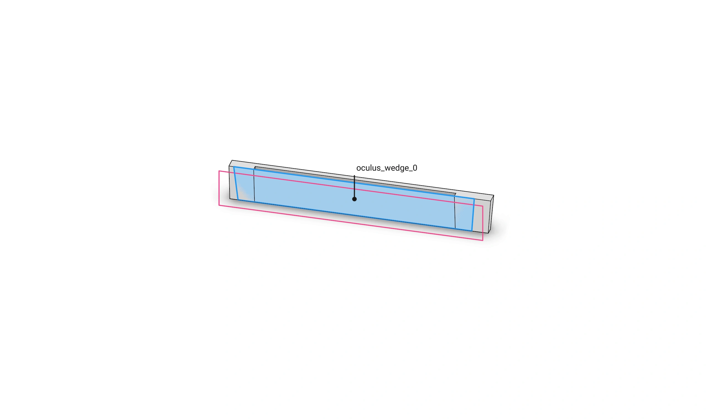
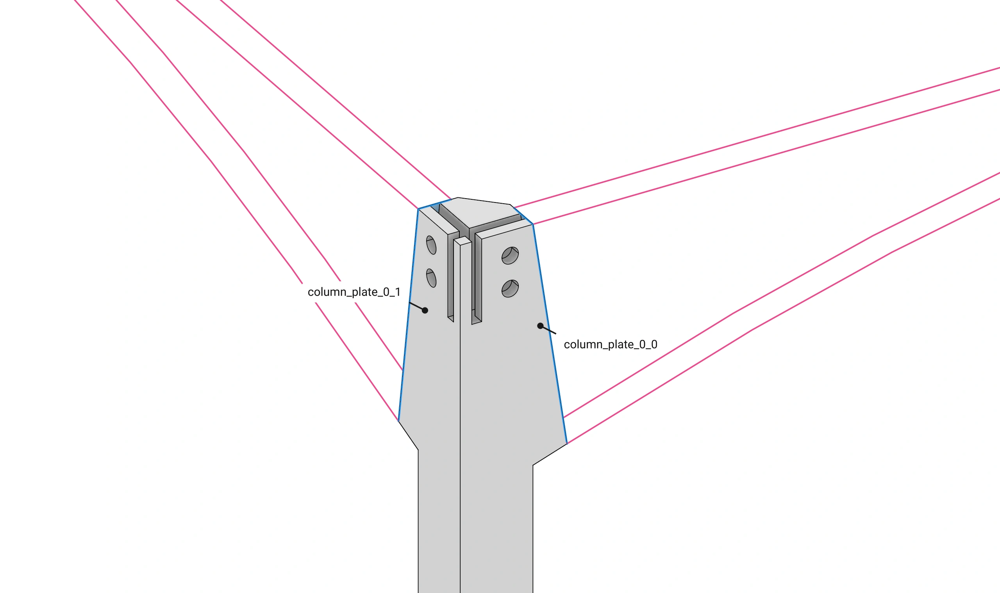
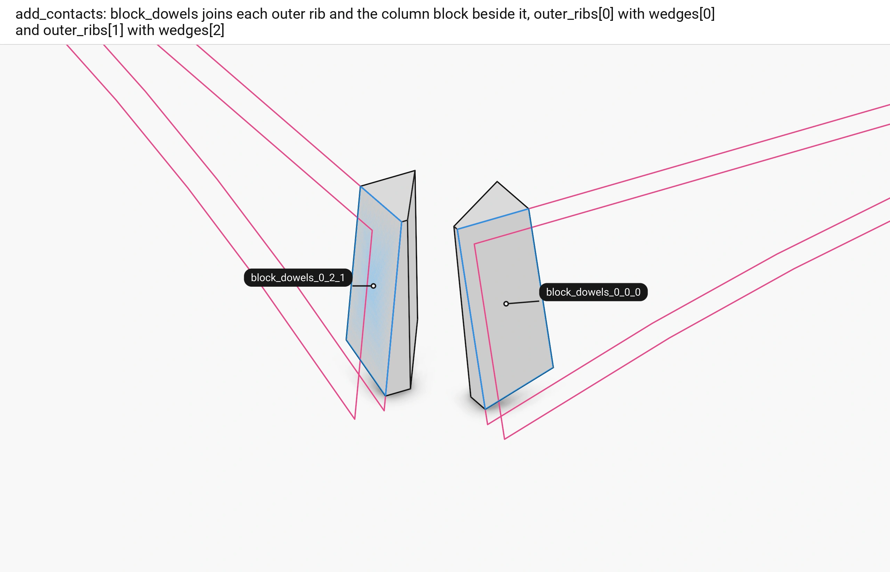
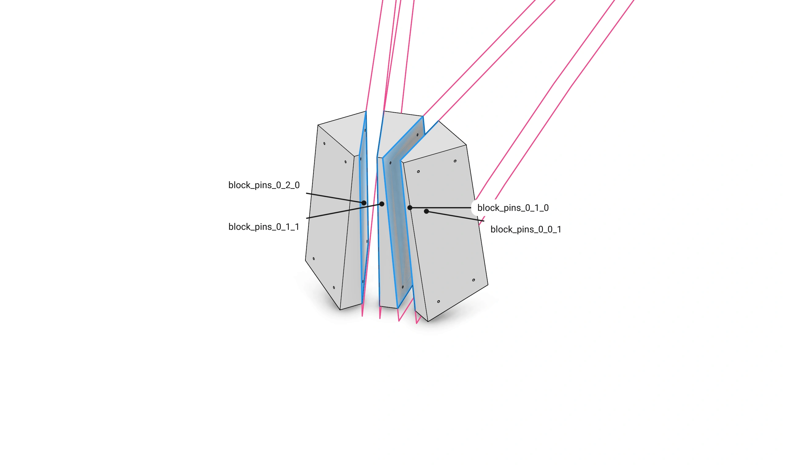
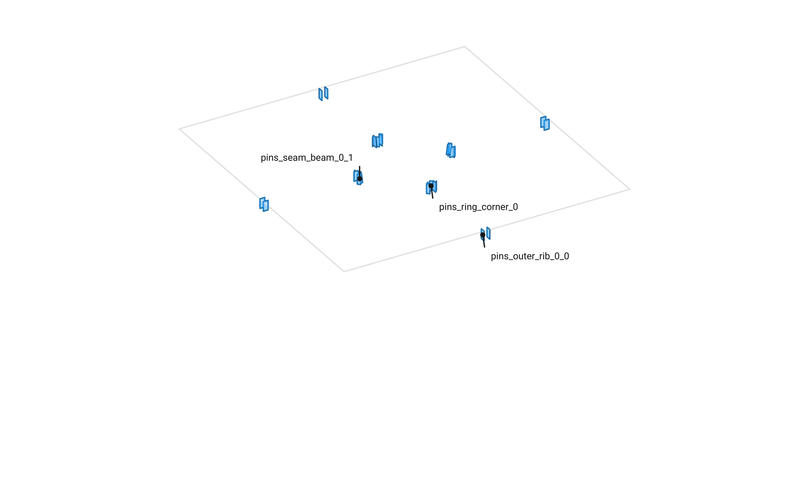

# Floor 8: Contacts {#templates_floor_08_contacts}

[TOC]

<em>Step 8 of @ref templates_floor_model · previous: @ref templates_floor_07_elements · next: @ref templates_floor_09_connectors</em>

`Floor::add_contacts` is called by the constructor after `add_columns`.
It finds where the members the design joins touch.
For each pair it asks the session's contact search for the face they share.
It stores that face as a contact interaction on the session's edge between the two, named by its kind and place.
It returns the contacts per quarter as `QuarterContacts`, a fixed array per kind.
Page 9 makes a connector from each wedge, column plate and block pin contact.
The butt-joint and ring corner contacts get their pins on page 10.

Example: [templates_floor_7_contacts_cantilevers.cpp](https://github.com/petrasvestartas/wood/blob/main/examples/templates_floor_7_contacts_cantilevers.cpp) builds the whole floor, its contacts among it.

## 231. add_contacts



<span style="color:#F2CC0C">■ quarter 0</span>   <span style="color:#E8478B">■ next, quarter 1</span>   <span style="color:#A3A3A3">■ context</span> the other quarters

`add_contacts` goes quarter by quarter, joining members inside quarter q and with the next quarter, `(q + 1) % 4`.

Code: `Floor::add_contacts`, [floor.cpp](https://github.com/petrasvestartas/wood/blob/main/src/templates/floor/floor.cpp).

## 232. seam_wedge: the pair



<span style="color:#F2CC0C">■ a</span> `inner_beams_0_0`   <span style="color:#E8478B">■ b</span> `inner_beams_2_1`

A seam is joined by `seam_wedge_q`: seam beam 0 of quarter q, `inner_beams_0_q`, with seam beam 2 of the next quarter, `inner_beams_2_<next>`.

Code: `Floor::add_contacts`, [floor.cpp](https://github.com/petrasvestartas/wood/blob/main/src/templates/floor/floor.cpp).

## 233. compute_face_contact



<span style="color:#2196EA">■ built</span> `polygon`, the face the two share   <span style="color:#737373">■ input</span> a, by its loops   <span style="color:#A3A3A3">■ context</span> b

`add_contact` asks `compute_face_contact(a, b)`, the session's face contact search, for the faces the two share.
`compute_face_contact` keeps the largest, its polygon where they overlap.
A pair that does not touch throws, naming the contact.

Code: `Floor::add_contact`, [floor.cpp](https://github.com/petrasvestartas/wood/blob/main/src/templates/floor/floor.cpp); `WoodSession::compute_face_contact`, [wood_session.cpp](https://github.com/petrasvestartas/wood/blob/main/src/joinery_solver/wood_session.cpp).

## 234. add_interaction



<span style="color:#2196EA">■ built</span> the session's edge between the two members   <span style="color:#A3A3A3">■ context</span> the two seam beams

The contact is named by its kind and place, here `seam_wedge_0`.
`add_interaction(a, b, contact)` stores it on the edge between the two.
A contact that coincides with one already on the edge, by geometry, reuses the stored one.
`add_contacts` runs once, from the constructor.

Code: `Floor::add_contact`, [floor.cpp](https://github.com/petrasvestartas/wood/blob/main/src/templates/floor/floor.cpp); `WoodSession::add_interaction`, [wood_session.cpp](https://github.com/petrasvestartas/wood/blob/main/src/joinery_solver/wood_session.cpp).

## 235. oculus_wedge



<span style="color:#2196EA">■ built</span> `oculus_wedge_0`   <span style="color:#E8478B">■ variable</span> the oculus beam, by its loops   <span style="color:#A3A3A3">■ context</span> the ring beam

The oculus beam `inner_beams_1_q` and its ring beam `oculus_q` touch on the tilted oculus plane: `oculus_wedge_q`.

Code: `Floor::add_contacts`, [floor.cpp](https://github.com/petrasvestartas/wood/blob/main/src/templates/floor/floor.cpp).

## 236. column_plate



<span style="color:#2196EA">■ built</span> `column_plate_0_0`, `column_plate_0_1`   <span style="color:#E8478B">■ variable</span> the outer ribs, by their loops   <span style="color:#A3A3A3">■ context</span> the column

Once the columns are in the floor, column q and each outer rib k touch on the carved head: `column_plate_q_k`.
The contact `column_plate_q_k` and the `Plate` of page 9 share this name.

Code: `Floor::add_contacts`, [floor.cpp](https://github.com/petrasvestartas/wood/blob/main/src/templates/floor/floor.cpp).

## 237. block_pins: the outer ribs



<span style="color:#2196EA">■ built</span> the two contacts   <span style="color:#E8478B">■ variable</span> the outer ribs, by their loops   <span style="color:#A3A3A3">■ context</span> the column blocks

Each outer rib touches the column block beside it.
`outer_ribs_0_q` and `wedges_0_q` make `block_pins_q_0_0`.
`outer_ribs_1_q` and `wedges_2_q` make `block_pins_q_2_1`.

Code: `Floor::add_contacts`, [floor.cpp](https://github.com/petrasvestartas/wood/blob/main/src/templates/floor/floor.cpp).

## 238. block_pins: the inner ribs



<span style="color:#2196EA">■ built</span> the four contacts   <span style="color:#E8478B">■ variable</span> the inner ribs, by their loops   <span style="color:#A3A3A3">■ context</span> the column blocks

Each inner rib runs between two blocks and touches both, four more contacts named by block and side, six `block_pins` per quarter in all.

Code: `Floor::add_contacts`, [floor.cpp](https://github.com/petrasvestartas/wood/blob/main/src/templates/floor/floor.cpp).

## 239. The pin contacts



<span style="color:#2196EA">■ built</span> the butt-joint and ring corner contacts   <span style="color:#A3A3A3">■ context</span> the columns and the bay edges

Three butt joints on each side k of a quarter are held by pins, the member the pins pass through first.
`pins_outer_rib_q_k` is the seam beam and the outer rib ending on it.
`pins_seam_beam_q_k` is the seam beam and the oculus beam.
`pins_inner_rib_q_k` is the oculus beam and inner rib k.
`pins_ring_corner_q` is ring beam q against the next, at the oculus corner they share.
That is 24 butt-joint contacts and 4 ring corners.
The pictures will show them.

```cpp
for (size_t k = 0; k < 2; k++) {
    const std::string seam_beam = fmt::format("inner_beams_{}_{}", SEAM_BEAMS[k], q);
    const std::string oculus_beam = fmt::format("inner_beams_1_{}", q);
    contacts[q].outer_rib_seam_beam[k] = add_contact(fmt::format("pins_outer_rib_{}_{}", q, k), seam_beam, fmt::format("outer_ribs_{}_{}", k, q));
    contacts[q].seam_beam_oculus_beam[k] = add_contact(fmt::format("pins_seam_beam_{}_{}", q, k), seam_beam, oculus_beam);
    contacts[q].oculus_beam_inner_rib[k] = add_contact(fmt::format("pins_inner_rib_{}_{}", q, k), oculus_beam, fmt::format("inner_ribs_{}_{}", k, q));
}

// ring corner: ring beam q against the next, at the oculus corner they share
const Contact ring_corner = add_contact(fmt::format("pins_ring_corner_{}", q), fmt::format("oculus_{}", q), fmt::format("oculus_{}", (q + 1) % 4));
contacts[q].ring_corner = ring_corner;
```

Code: `Floor::add_contacts`, [floor.cpp](https://github.com/petrasvestartas/wood/blob/main/src/templates/floor/floor.cpp).

## 240. Every contact


<span style="color:#2196EA">■ built</span> every contact polygon   <span style="color:#A3A3A3">■ context</span> the columns and the bay edges

The default floor has 68 contacts, 17 per quarter.
They are 4 `seam_wedge`, 4 `oculus_wedge`, 8 `column_plate`, 24 `block_pins`, 24 butt-joint pin contacts and 4 `pins_ring_corner`.

Code: `Floor::add_contacts`, [floor.cpp](https://github.com/petrasvestartas/wood/blob/main/src/templates/floor/floor.cpp).
