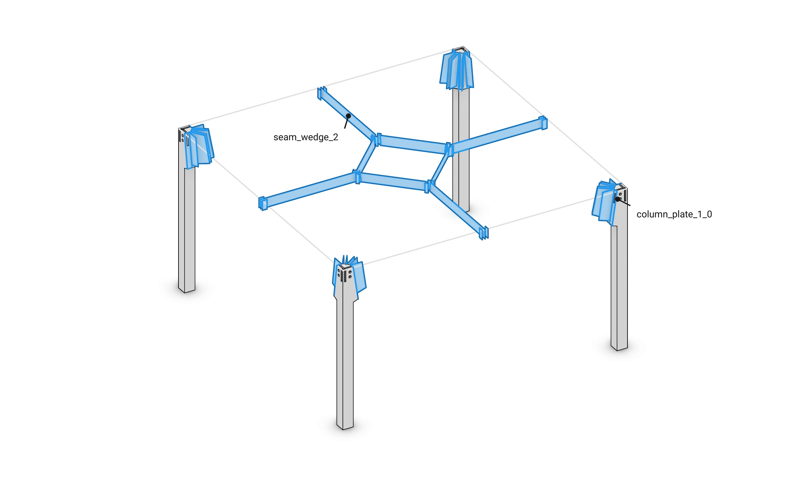

# Floor 8: Contacts {#templates_floor_08_contacts}

[TOC]

<em>Step 8 of @ref templates_floor_model · previous: @ref templates_floor_07_elements · next: @ref templates_floor_09_connectors</em>

`Floor::add_contacts`, the last call of `add_members`, finds where the members the design joins touch: for each pair it asks the session's contact search for the face they share and stores it as a contact interaction on the session's edge between them, named by its kind and place, and returns them per quarter as `QuarterContacts`, a fixed array per kind. Chapter 9 makes a connector from each of these contacts.

Example: [templates_floor_7_contacts_cantilevers.cpp](https://github.com/petrasvestartas/wood/blob/main/examples/templates_floor_7_contacts_cantilevers.cpp) builds the whole floor, its contacts among it.

## 231. add_contacts

■ quarters[0]   ■ next, `quarters[1]`   ■ context the other quarters

`add_contacts` goes quarter by quarter, joining members inside quarter q and with the next quarter, `(q + 1) % 4`; a quarter not yet built is skipped.

Code: `Floor::add_contacts`, [floor.cpp](https://github.com/petrasvestartas/wood/blob/main/src/templates/floor/floor.cpp).

## 232. seam_wedge: the pair

■ a `inner_beams_0_0`   ■ b `inner_beams_2_1`

A seam is joined by `seam_wedge`: seam beam 0 of quarter q, `inner_beams[0]`, with seam beam 2 of the next quarter, `next.inner_beams[2]`.

Code: `Floor::add_contacts`, [floor.cpp](https://github.com/petrasvestartas/wood/blob/main/src/templates/floor/floor.cpp).

## 233. compute_face_contact

■ built `polygon`, the face the two share   ■ input a, by its loops   ■ context b

`add_contact` asks `compute_face_contact(a, b)`, the session's face contact search, for the faces the two share and keeps the first, its polygon where they overlap; a pair that does not touch throws, naming the contact.

Code: `Floor::add_contact`, [floor.cpp](https://github.com/petrasvestartas/wood/blob/main/src/templates/floor/floor.cpp); `WoodSession::compute_face_contact`, [wood_session.cpp](https://github.com/petrasvestartas/wood/blob/main/src/joinery_solver/wood_session.cpp).

## 234. add_interaction

■ built the session's edge between the two members   ■ context the two seam beams

The contact is named by its kind and place, here `seam_wedge_0`, and stored by `add_interaction(a, b, contact)` on the edge between the two; a contact of that name already on the edge is kept, so calling `add_contacts` again adds nothing.

Code: `Floor::add_contact`, [floor.cpp](https://github.com/petrasvestartas/wood/blob/main/src/templates/floor/floor.cpp); `WoodSession::add_interaction`, [wood_session.cpp](https://github.com/petrasvestartas/wood/blob/main/src/joinery_solver/wood_session.cpp).

## 235. oculus_wedge

■ built `oculus_wedge_0`   ■ variable the oculus beam, by its loops   ■ context the ring beam

The oculus beam `inner_beams[1]` and its ring beam `ring[q]` touch on the tilted oculus plane: `oculus_wedge_q`.

Code: `Floor::add_contacts`, [floor.cpp](https://github.com/petrasvestartas/wood/blob/main/src/templates/floor/floor.cpp).

## 236. column_plate

■ built `column_plate_0_0`, `column_plate_0_1`   ■ variable the outer ribs, by their loops   ■ context the column

Once the columns are in the floor, column q and each outer rib k touch on the carved head: `column_plate_q_k`.

Code: `Floor::add_contacts`, [floor.cpp](https://github.com/petrasvestartas/wood/blob/main/src/templates/floor/floor.cpp), [230-231](https://github.com/petrasvestartas/wood/blob/main/src/templates/floor/floor.cpp).

## 237. block_pins: the outer ribs

■ built the two contacts   ■ variable the outer ribs, by their loops   ■ context the column blocks

Each outer rib touches the column block beside it: `outer_ribs[0]` and `wedges[0]` make `block_pins_q_0_0`, `outer_ribs[1]` and `wedges[2]` make `block_pins_q_2_1`.

Code: `Floor::add_contacts`, [floor.cpp](https://github.com/petrasvestartas/wood/blob/main/src/templates/floor/floor.cpp).

## 238. block_pins: the inner ribs

■ built the four contacts   ■ variable the inner ribs, by their loops   ■ context the column blocks

Each inner rib runs between two blocks and touches both, four more contacts named by block and side, six `block_pins` per quarter in all.

Code: `Floor::add_contacts`, [floor.cpp](https://github.com/petrasvestartas/wood/blob/main/src/templates/floor/floor.cpp).

## 239. Every contact

■ built every contact polygon   ■ context the columns and the bay edges

The default floor has 40 contacts: 4 `seam_wedge`, 4 `oculus_wedge`, 8 `column_plate` and 24 `block_pins`.

Code: `Floor::add_contacts`, [floor.cpp](https://github.com/petrasvestartas/wood/blob/main/src/templates/floor/floor.cpp).
