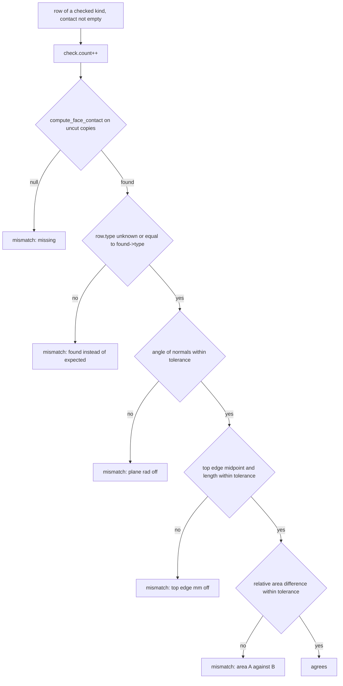

# Floor 8: Relationships {#templates_floor_08_relationships}

[TOC]

<em>Step 8 of @ref templates_floor_model · previous: @ref templates_floor_07_elements · next: @ref templates_floor_09_connectors</em>

`relationships(guide)` in `src/templates/floor/floor_relations.cpp` lists every pair of members that share something by the rules of the design: the kind, the two `MemberRef`s, the plane they meet on and the contact polygon, read only from the guide lifted to `bay_height`. The next chapter turns each row into a `JointBeam` through `connector_of`.

Example: [templates_floor_6_contacts_floor.cpp](https://github.com/petrasvestartas/wood/blob/44f9aa85952d32a9264125f4e9940e55b05a4512/examples/templates_floor_6_contacts_floor.cpp) puts a wedge on every seam_wedge and oculus_wedge row, and [templates_floor_7_contacts_cantilevers.cpp](https://github.com/petrasvestartas/wood/blob/44f9aa85952d32a9264125f4e9940e55b05a4512/examples/templates_floor_7_contacts_cantilevers.cpp) builds the connector of every row this chapter lists on the whole bay.

■ built what the step builds   ■ result a second thing it builds   ■ variable the value it introduces or measures   ■ input what it reads, dashed for a helper   ■ context the rest; frames 144 and 162 show the member families in their own colours

## 144. MemberRef names

■ inner_beams `inner_beams_0_0`, `inner_beams_2_1`   ■ ring `oculus_0`   ■ column, support `column_0`, `support_0`   ■ outer_ribs `outer_ribs_1_0`   ■ wedges `wedges_2_0`   ■ context every other member, the bay edges and quarters

A row names its two members by `MemberRef{quarter, family, index, row}` (from `quarter_member`, or `shared_member` with quarter -1 for a ring beam, column or support), and `MemberRef::name()` returns the scene name the models give, so a name always resolves to one element.

Code: `MemberRef::name`, [floor_relations.cpp:19-34](https://github.com/petrasvestartas/wood/blob/79d4d5c74fdbb4c7b474b2df14efe7f6c7b72e2f/src/templates/floor/floor_relations.cpp#L19-L34); `shared_member`, [floor_relations.cpp:11-13](https://github.com/petrasvestartas/wood/blob/79d4d5c74fdbb4c7b474b2df14efe7f6c7b72e2f/src/templates/floor/floor_relations.cpp#L11-L13); `quarter_member`, [floor_geometry.cpp:265-267](https://github.com/petrasvestartas/wood/blob/79d4d5c74fdbb4c7b474b2df14efe7f6c7b72e2f/src/templates/floor/floor_geometry.cpp#L265-L267); `struct MemberRef`, [floor.h:315-323](https://github.com/petrasvestartas/wood/blob/79d4d5c74fdbb4c7b474b2df14efe7f6c7b72e2f/src/templates/floor/floor.h#L315-L323).

## 145. Relationship record and defaults

A `Relationship` is a plain record whose factories set only the fields their kind fixes; the rest keep their defaults: the xy `plane` at the origin, an empty `contact`, `type` = `ContactType::unknown` (-1), no `screws`, `through` or `end`. `Relation` lists 12 kinds in the order `relation_name` uses: support, column_plate, cross_lap, seam_tie, seam_wedge, oculus_wedge, block_dowels, then the five screw kinds.

Code: `struct Relationship`, [floor.h:326-343](https://github.com/petrasvestartas/wood/blob/79d4d5c74fdbb4c7b474b2df14efe7f6c7b72e2f/src/templates/floor/floor.h#L326-L343); `enum class Relation`, [floor.h:309](https://github.com/petrasvestartas/wood/blob/79d4d5c74fdbb4c7b474b2df14efe7f6c7b72e2f/src/templates/floor/floor.h#L309); `relation_name`, [floor_relations.cpp:40-45](https://github.com/petrasvestartas/wood/blob/79d4d5c74fdbb4c7b474b2df14efe7f6c7b72e2f/src/templates/floor/floor_relations.cpp#L40-L45); `screw_row`, [floor_screws.cpp:178-193](https://github.com/petrasvestartas/wood/blob/79d4d5c74fdbb4c7b474b2df14efe7f6c7b72e2f/src/templates/floor/floor_screws.cpp#L178-L193).

## 146. seam_wedge: members

■ built `row.a` = `inner_beams_0_0`   ■ result `row.b` = `inner_beams_2_1`   ■ input `seams[0].line`, `seams[0].oculus_corner`   ■ context the other members of quarters 0 and 1, the bay edges

For each seam q, `seam_wedge(guide, q)` pairs `inner_beams[0]` of quarter q with `inner_beams[2]` of quarter q + 1, the two beams that lie along seam q from either side.

Code: `seam_wedge`, [floor_relations.cpp:56-62](https://github.com/petrasvestartas/wood/blob/79d4d5c74fdbb4c7b474b2df14efe7f6c7b72e2f/src/templates/floor/floor_relations.cpp#L56-L62); loop at [floor_relations.cpp:177-178](https://github.com/petrasvestartas/wood/blob/79d4d5c74fdbb4c7b474b2df14efe7f6c7b72e2f/src/templates/floor/floor_relations.cpp#L177-L178); `construction_planes`, [floor.cpp:190](https://github.com/petrasvestartas/wood/blob/79d4d5c74fdbb4c7b474b2df14efe7f6c7b72e2f/src/templates/floor/floor.cpp#L190).

## 147. seam_wedge: plane

■ built `row.plane` (q = 0), normal into quarter 0   ■ input `seams[0].line`   ■ context `inner_beams_0_0`, `inner_beams_2_1`

`row.plane = lifted(guide.seams[q].plane_into(q), bay_height)`. Because the quarter asked for is the seam's own index, `plane_into` takes its first branch and returns `edge_plane(Line(midpoint, oculus_corner), -z)`: a vertical plane through the half seam from the edge midpoint to the oculus corner, its origin at that half seam's midpoint and its normal = line direction x (-z). For q = 0 that is (0, 1, 0) x (0, 0, -1) = (-1, 0, 0), into quarter 0. `lifted` translates the plane by (0, 0, `bay_height`).

`row.plane` is the seam plane `seams[q].plane_into(q)` lifted by `bay_height`: vertical through the half seam from the edge midpoint to the oculus corner, normal into quarter q ((-1, 0, 0) for q = 0).

Code: `seam_wedge`, [floor_relations.cpp:58](https://github.com/petrasvestartas/wood/blob/79d4d5c74fdbb4c7b474b2df14efe7f6c7b72e2f/src/templates/floor/floor_relations.cpp#L58), [63](https://github.com/petrasvestartas/wood/blob/79d4d5c74fdbb4c7b474b2df14efe7f6c7b72e2f/src/templates/floor/floor_relations.cpp#L63); `Seam::plane_into`, [floor.cpp:411-416](https://github.com/petrasvestartas/wood/blob/79d4d5c74fdbb4c7b474b2df14efe7f6c7b72e2f/src/templates/floor/floor.cpp#L411-L416); `edge_plane`, [floor_geometry.cpp:23-25](https://github.com/petrasvestartas/wood/blob/79d4d5c74fdbb4c7b474b2df14efe7f6c7b72e2f/src/templates/floor/floor_geometry.cpp#L23-L25); `lifted(Plane)`, [floor_geometry.cpp:212-214](https://github.com/petrasvestartas/wood/blob/79d4d5c74fdbb4c7b474b2df14efe7f6c7b72e2f/src/templates/floor/floor_geometry.cpp#L212-L214).

## 148. seam_wedge: contact

■ built `row.contact` (q = 0)   ■ input the four side planes `outer_ribs[0][0]`, `level(0)`, `inner_beams[1][0]`, `level(guide.soffit)`, dashed

`row.contact = lifted(overlap(guide.quarter(q).inner_beams()[0].bottom, guide.quarter(q + 1).inner_beams()[2].bottom, seams[q].plane_into(q)), lift)`: where the end faces of the two seam beams overlap on the seam plane. `overlap(a, b, plane)` intersects the two loops in the plane with the kernel's `Polyline::boolean_op`; when the result has a's area it returns a unchanged, otherwise it orients the result like a and starts it at the vertex nearest a's first. On the square the two loops are mirror images and coincide, so the contact is beam 0's loop; on a skewed bay the two beams end at different places along the seam and only the part both touch is contact. With `seam_through_ribs` set, inner beam 0 is `loft_planes(``{cp.outer_ribs[0][0], level(0), cp.inner_beams[1][0], level(guide.soffit)}``, cp.inner_beams[0][0], cp.inner_beams[0][1])`: four side planes, the bottom plane is the seam plane and the top plane its offset by `inner_beams`. `loft_planes` intersects each consecutive pair of side planes with the bottom plane, so the `bottom` loop is a quad in the seam plane: corner 0 = bay edge plane x datum, 1 = datum x tilted oculus plane, 2 = tilted plane x soffit level, 3 = soffit level x bay edge plane. `lifted` moves the points up by `bay_height` and closes the loop again. The oculus plane leans 5 degrees, so corner 2 lies 198.7835 x tan 5 deg x sqrt 2 = 24.595 mm further along the seam toward the centre than corner 1.

`row.contact` is the `overlap` of the two seam beams' end loops on the seam plane, lifted: on the square the loops coincide (a trapezoid of 400,011.5 mm2), on a skewed bay only the part both beams touch is kept.

Code: `seam_wedge`, [floor_relations.cpp:64](https://github.com/petrasvestartas/wood/blob/79d4d5c74fdbb4c7b474b2df14efe7f6c7b72e2f/src/templates/floor/floor_relations.cpp#L64); `overlap`, [floor_geometry.cpp:220-238](https://github.com/petrasvestartas/wood/blob/79d4d5c74fdbb4c7b474b2df14efe7f6c7b72e2f/src/templates/floor/floor_geometry.cpp#L220-L238); `Quarter::inner_beams`, [floor_members.cpp:93-105](https://github.com/petrasvestartas/wood/blob/79d4d5c74fdbb4c7b474b2df14efe7f6c7b72e2f/src/templates/floor/floor_members.cpp#L93-L105); `loft_planes`, [floor_geometry.cpp:273-296](https://github.com/petrasvestartas/wood/blob/79d4d5c74fdbb4c7b474b2df14efe7f6c7b72e2f/src/templates/floor/floor_geometry.cpp#L273-L296); `open_points`, [floor_geometry.cpp:154-162](https://github.com/petrasvestartas/wood/blob/79d4d5c74fdbb4c7b474b2df14efe7f6c7b72e2f/src/templates/floor/floor_geometry.cpp#L154-L162); soffit, [floor.cpp:461-469](https://github.com/petrasvestartas/wood/blob/79d4d5c74fdbb4c7b474b2df14efe7f6c7b72e2f/src/templates/floor/floor.cpp#L461-L469).

## 149. seam_wedge: type and end plane

■ built `row.end` = `lifted(edges[0].band[0], bay_height)`, normal into the bay   ■ context `row.contact`, `inner_beams_0_0`, `inner_beams_2_1`, `outer_ribs_0_0`, `outer_ribs_1_1`

The row sets `type = side_side`, and when `seam_through_ribs` is true also `row.end`, the bay edge plane `edges[q].band[0]` lifted, so `connector_of` runs the wedge through the rib band to the bay's outer face.

Code: `seam_wedge`, [floor_relations.cpp:65-71](https://github.com/petrasvestartas/wood/blob/79d4d5c74fdbb4c7b474b2df14efe7f6c7b72e2f/src/templates/floor/floor_relations.cpp#L65-L71); `bay_edge`, [floor.cpp:69-76](https://github.com/petrasvestartas/wood/blob/79d4d5c74fdbb4c7b474b2df14efe7f6c7b72e2f/src/templates/floor/floor.cpp#L69-L76); `connector_of`, [floor_models.cpp:326-334](https://github.com/petrasvestartas/wood/blob/79d4d5c74fdbb4c7b474b2df14efe7f6c7b72e2f/src/templates/floor/floor_models.cpp#L326-L334).

## 150. oculus_wedge: members and plane

■ built `row.a` = `inner_beams_1_0`   ■ result `row.b` = `oculus_0`   ■ variable `row.plane` = `oculus_edges[0].tilted`, leaned `oculus_plane_angle` = 5 deg   ■ input `edge_plane(oculus_edges[0].line, -z)`, dashed

`oculus_wedge(guide, q)` pairs the quarter's oculus beam `inner_beams[1]` with ring beam q on `oculus_edges[q].tilted`, the vertical edge plane leaned `oculus_plane_angle` (5 deg) about the edge toward the centre; `type = side_side`, `end` unset.

Code: `oculus_wedge`, [floor_relations.cpp:75-88](https://github.com/petrasvestartas/wood/blob/79d4d5c74fdbb4c7b474b2df14efe7f6c7b72e2f/src/templates/floor/floor_relations.cpp#L75-L88), loop at 180-181; `oculus_edge`, [floor.cpp:93-104](https://github.com/petrasvestartas/wood/blob/79d4d5c74fdbb4c7b474b2df14efe7f6c7b72e2f/src/templates/floor/floor.cpp#L93-L104); `rotate`, [floor_geometry.cpp:15-17](https://github.com/petrasvestartas/wood/blob/79d4d5c74fdbb4c7b474b2df14efe7f6c7b72e2f/src/templates/floor/floor_geometry.cpp#L15-L17).

## 151. oculus_wedge: contact

■ built `row.contact` (q = 0)   ■ variable `oculus_edges[0].back`, `inner_beams` = 60 behind the edge   ■ input `oculus_edges[0].line`   ■ context `inner_beams_0_0`, `inner_beams_2_0`, `oculus_0`

`row.contact = lifted(open_points(guide.quarter(q).inner_beams()[1].bottom), lift)`. Inner beam 1 is `loft_planes({cp.inner_beams[0][1], level(0), cp.inner_beams[2][1], level(soffit)}, cp.inner_beams[1][0], cp.inner_beams[1][1])` with `cp.inner_beams[1] = {oculus.tilted, oculus.back}`. Its `bottom` loop lies on the tilted plane and is cut by the far faces of the two seam beams (x = -60 and y = -60 in quarter 0), the datum and the soffit: corner 0 = x = -60 x datum, 1 = datum x y = -60, 2 = y = -60 x soffit, 3 = soffit x x = -60. The top edge lies on the oculus edge line x + y = -1000 itself. The two corners at the soffit sit 24.595 mm nearer the centre along each seam face than the two at the datum. The back face `oculus_edges[0].back` is the vertical edge plane offset by `inner_beams` into the quarter, x + y = -1084.853.

`row.contact` is the oculus beam's `bottom` loop on the tilted plane, cut by the far faces of the two seam beams, the datum and the soffit, then lifted (244,862.3 mm2 for q = 0).

Code: `oculus_wedge`, [floor_relations.cpp:83](https://github.com/petrasvestartas/wood/blob/79d4d5c74fdbb4c7b474b2df14efe7f6c7b72e2f/src/templates/floor/floor_relations.cpp#L83); `Quarter::inner_beams`, [floor_members.cpp:102](https://github.com/petrasvestartas/wood/blob/79d4d5c74fdbb4c7b474b2df14efe7f6c7b72e2f/src/templates/floor/floor_members.cpp#L102); `construction_planes`, [floor.cpp:190](https://github.com/petrasvestartas/wood/blob/79d4d5c74fdbb4c7b474b2df14efe7f6c7b72e2f/src/templates/floor/floor.cpp#L190).

## 152. column_plate: fan side plane

■ built `row.plane` for k = 0 and 1, `wedge_fan[0][0]` and `wedge_fan[2][0]` at the floor top   ■ context column head 0, the outer rib quads of quarter 0

`column_plate(guide, q, k)` pairs column q with outer rib k on the fan side plane `columns[q].wedge_fan[k == 0 ? 0 : 2][0]`, which leans 8.43 degrees off vertical; `type` stays unknown (the kernel's search reports `end_end`).

Code: `column_plate`, [floor_relations.cpp:91-106](https://github.com/petrasvestartas/wood/blob/79d4d5c74fdbb4c7b474b2df14efe7f6c7b72e2f/src/templates/floor/floor_relations.cpp#L91-L106), loop at 183-185; `wedge_fan`, [floor.cpp:146-159](https://github.com/petrasvestartas/wood/blob/79d4d5c74fdbb4c7b474b2df14efe7f6c7b72e2f/src/templates/floor/floor.cpp#L146-L159).

## 153. column_plate: rib end face

■ built `row.contact` (q = 0, k = 0)   ■ variable `columns[0].levels[1]` = -694.7934   ■ context `column_0`, `outer_ribs_0_0`

`row.contact` is the `overlap` of the rib's end face on the fan plane, across the 100 mm band, with the column's carved face `column_face`, lifted: on the square the whole quad lies in the face (70,238.7 mm2), on a skewed bay the face clips it.

Code: `column_plate`, [floor_relations.cpp:94-96](https://github.com/petrasvestartas/wood/blob/79d4d5c74fdbb4c7b474b2df14efe7f6c7b72e2f/src/templates/floor/floor_relations.cpp#L94-L96), [102](https://github.com/petrasvestartas/wood/blob/79d4d5c74fdbb4c7b474b2df14efe7f6c7b72e2f/src/templates/floor/floor_relations.cpp#L102); `overlap`, [floor_geometry.cpp:220-238](https://github.com/petrasvestartas/wood/blob/79d4d5c74fdbb4c7b474b2df14efe7f6c7b72e2f/src/templates/floor/floor_geometry.cpp#L220-L238); `Quarter::column_face`, [floor_members.cpp:289-303](https://github.com/petrasvestartas/wood/blob/79d4d5c74fdbb4c7b474b2df14efe7f6c7b72e2f/src/templates/floor/floor_members.cpp#L289-L303); `rib_loop` and `rib`, [floor_members.cpp:17-55](https://github.com/petrasvestartas/wood/blob/79d4d5c74fdbb4c7b474b2df14efe7f6c7b72e2f/src/templates/floor/floor_members.cpp#L17-L55); `rib_bottom_level`, [floor.cpp:376-384](https://github.com/petrasvestartas/wood/blob/79d4d5c74fdbb4c7b474b2df14efe7f6c7b72e2f/src/templates/floor/floor.cpp#L376-L384), [458-459](https://github.com/petrasvestartas/wood/blob/79d4d5c74fdbb4c7b474b2df14efe7f6c7b72e2f/src/templates/floor/floor.cpp#L458-L459).

## 154. cross_lap: no geometry

■ built `row.a` = `outer_ribs_0_0`   ■ result `row.b` = `outer_ribs_1_0`   ■ input the two fan plane traces where the plates will cross, dashed   ■ context `column_0`, the two `column_plate` contacts

`cross_lap(q)` only names the two outer ribs of corner q, which do not touch, so plane, contact and type keep their defaults and `verify_contacts` skips the row. `add_connectors` later builds the cross lap from the corner's two column plate connectors and throws when the corner does not hold exactly two.

Code: `cross_lap`, [floor_relations.cpp:109-118](https://github.com/petrasvestartas/wood/blob/79d4d5c74fdbb4c7b474b2df14efe7f6c7b72e2f/src/templates/floor/floor_relations.cpp#L109-L118), loop at 187-188; `add_connectors`, [floor_models.cpp:371-377](https://github.com/petrasvestartas/wood/blob/79d4d5c74fdbb4c7b474b2df14efe7f6c7b72e2f/src/templates/floor/floor_models.cpp#L371-L377), [383-384](https://github.com/petrasvestartas/wood/blob/79d4d5c74fdbb4c7b474b2df14efe7f6c7b72e2f/src/templates/floor/floor_models.cpp#L383-L384).

## 155. seam_tie (not on the default)

■ built `row.contact` of seam_tie row 0 on the tied bay   ■ context the loops of `outer_ribs_0_0`, `outer_ribs_1_1`, `inner_beams_0_0`, `inner_beams_2_1` at seam 0, default bay above, tied bay below

Seam tie rows are made only when `seam_through_ribs` is false, so the default bay has none; then outer rib 0 of quarter q meets outer rib 1 of quarter q + 1 end to end on the seam plane, `type = end_end` (the tied bay is drawn below the default one).

Code: `seam_tie`, [floor_relations.cpp:121-138](https://github.com/petrasvestartas/wood/blob/79d4d5c74fdbb4c7b474b2df14efe7f6c7b72e2f/src/templates/floor/floor_relations.cpp#L121-L138), loop at 190-191; `Quarter::rib_seam_ends`, [floor_members.cpp:69-75](https://github.com/petrasvestartas/wood/blob/79d4d5c74fdbb4c7b474b2df14efe7f6c7b72e2f/src/templates/floor/floor_members.cpp#L69-L75).

## 156. block_dowels: rib plane table

■ built band faces `outer_ribs[0][1]`, `outer_ribs[1][1]`   ■ result inner rib faces `inner_ribs[0][0]`, `[0][1]`, `[1][0]`, `[1][1]`   ■ input block footprints `wedges_0_0`, `wedges_1_0`, `wedges_2_0`   ■ context column head 0

`block_dowels` takes the two rib faces each wedge block sits between from a table of construction planes (block 0: band face and inner rib 0; block 1: the two inner ribs; block 2: inner rib 1 and band face) and lifts `ribs[k][side]` as `row.plane`.

Code: `block_dowels`, [floor_relations.cpp:141-153](https://github.com/petrasvestartas/wood/blob/79d4d5c74fdbb4c7b474b2df14efe7f6c7b72e2f/src/templates/floor/floor_relations.cpp#L141-L153); `construction_planes`, [floor.cpp:192-199](https://github.com/petrasvestartas/wood/blob/79d4d5c74fdbb4c7b474b2df14efe7f6c7b72e2f/src/templates/floor/floor.cpp#L192-L199); `Quarter::wedges`, [floor_members.cpp:107-124](https://github.com/petrasvestartas/wood/blob/79d4d5c74fdbb4c7b474b2df14efe7f6c7b72e2f/src/templates/floor/floor_members.cpp#L107-L124).

## 157. block_dowels: block face contact

■ built side 0 `row.contact` on `outer_ribs[0][1]`   ■ result side 1 `row.contact` on `inner_ribs[0][0]`   ■ input `Outline.bottom` of block 0 on the fan plane   ■ context `wedges_0_0`

The contact is the block's quad on that rib face, between the datum and the bed top plane and between the fan plane and the far face, taken from the block's `loft_planes` loops and lifted; `type` stays unknown.

Code: `block_dowels`, [floor_relations.cpp:144-146](https://github.com/petrasvestartas/wood/blob/79d4d5c74fdbb4c7b474b2df14efe7f6c7b72e2f/src/templates/floor/floor_relations.cpp#L144-L146), [154-155](https://github.com/petrasvestartas/wood/blob/79d4d5c74fdbb4c7b474b2df14efe7f6c7b72e2f/src/templates/floor/floor_relations.cpp#L154-L155); `Quarter::wedges`, [floor_members.cpp:107-124](https://github.com/petrasvestartas/wood/blob/79d4d5c74fdbb4c7b474b2df14efe7f6c7b72e2f/src/templates/floor/floor_members.cpp#L107-L124); `loft_planes`, [floor_geometry.cpp:273-296](https://github.com/petrasvestartas/wood/blob/79d4d5c74fdbb4c7b474b2df14efe7f6c7b72e2f/src/templates/floor/floor_geometry.cpp#L273-L296).

## 158. block_dowels: six rows

■ built the six `block_dowels` contacts of quarter 0, numbered 1 to 6   ■ context the outer ribs, inner ribs and wedges of quarter 0

Each quarter pushes six `block_dowels` rows in a fixed order, `a` the rib and `b = wedges[k]`, covering every block-to-rib face pair once (24 rows in all, indices 20-43).

Code: `relationships` (block loop), [floor_relations.cpp:193-200](https://github.com/petrasvestartas/wood/blob/79d4d5c74fdbb4c7b474b2df14efe7f6c7b72e2f/src/templates/floor/floor_relations.cpp#L193-L200); `block_dowels`, [floor_relations.cpp:151-152](https://github.com/petrasvestartas/wood/blob/79d4d5c74fdbb4c7b474b2df14efe7f6c7b72e2f/src/templates/floor/floor_relations.cpp#L151-L152).

## 159. support row

■ built `row.plane` x axis   ■ result `row.plane` y axis   ■ input `support_0` .. `support_3`, `columns[q].axis` dashed   ■ context `row.plane` z axis, the bay edges

`support(guide, q)` pairs support q with column q on `columns[q].support_plane`, a frame on the slab at z 0 that is not lifted (x toward corner q + 1, y toward corner q - 1); contact empty, type unknown.

Code: `support`, [floor_relations.cpp:161-171](https://github.com/petrasvestartas/wood/blob/79d4d5c74fdbb4c7b474b2df14efe7f6c7b72e2f/src/templates/floor/floor_relations.cpp#L161-L171), loop at 202-203; `corner_frame`, [floor.cpp:106-119](https://github.com/petrasvestartas/wood/blob/79d4d5c74fdbb4c7b474b2df14efe7f6c7b72e2f/src/templates/floor/floor.cpp#L106-L119); `column_corner`, [floor.cpp:138-139](https://github.com/petrasvestartas/wood/blob/79d4d5c74fdbb4c7b474b2df14efe7f6c7b72e2f/src/templates/floor/floor.cpp#L138-L139).

## 160. Screw rows and counts

Last come the rows of `screw_relationships(guide)` (chapter 10), each carrying its screw axes in `screws`: 48 design rows plus 36 screw rows give 84 on the default bay, asserted by `check_relationships`.

Code: `relationships`, [floor_relations.cpp:205-206](https://github.com/petrasvestartas/wood/blob/79d4d5c74fdbb4c7b474b2df14efe7f6c7b72e2f/src/templates/floor/floor_relations.cpp#L205-L206); `screw_relationships`, [floor_screws.cpp:326-350](https://github.com/petrasvestartas/wood/blob/79d4d5c74fdbb4c7b474b2df14efe7f6c7b72e2f/src/templates/floor/floor_screws.cpp#L326-L350).

## 161. Filter, text, area()

`relationships(guide, kind)` keeps one kind's rows in order, `text()` is `{kind} {a.name()} - {b.name()}`, and `area()` is `polygon_area(contact)`, now the true area (before, every contact read 0.5, so the area checks could not fire).

Code: `relationships(guide, kind)`, [floor_relations.cpp:211-220](https://github.com/petrasvestartas/wood/blob/79d4d5c74fdbb4c7b474b2df14efe7f6c7b72e2f/src/templates/floor/floor_relations.cpp#L211-L220); `relation_name`, `text`, `area`, [floor_relations.cpp:36-49](https://github.com/petrasvestartas/wood/blob/79d4d5c74fdbb4c7b474b2df14efe7f6c7b72e2f/src/templates/floor/floor_relations.cpp#L36-L49); `polygon_area`, [floor_geometry.cpp:197-206](https://github.com/petrasvestartas/wood/blob/79d4d5c74fdbb4c7b474b2df14efe7f6c7b72e2f/src/templates/floor/floor_geometry.cpp#L197-L206).

## 162. Members resolve in the scene

■ outer_ribs   ■ inner_ribs   ■ inner_beams   ■ wedges   ■ tsections   ■ beds   ■ ring `oculus_0` .. `oculus_3`   ■ columns `column_q`, `support_q`

`add_floor` places the members the references resolve against: the quarters by `add_quarter_model`, the ring by `add_oculus_model`, columns and supports by `add_column_model`, all lifted by `bay_height`. Until `add_columns` runs, `get()` returns null for a column or support and `pair()` throws on every column_plate and support row.

Code: `add_quarter_model`, [floor_models.cpp:137-163](https://github.com/petrasvestartas/wood/blob/79d4d5c74fdbb4c7b474b2df14efe7f6c7b72e2f/src/templates/floor/floor_models.cpp#L137-L163); `add_oculus_model`, [floor_models.cpp:165-181](https://github.com/petrasvestartas/wood/blob/79d4d5c74fdbb4c7b474b2df14efe7f6c7b72e2f/src/templates/floor/floor_models.cpp#L165-L181); `add_column_model`, [floor_models.cpp:187-207](https://github.com/petrasvestartas/wood/blob/79d4d5c74fdbb4c7b474b2df14efe7f6c7b72e2f/src/templates/floor/floor_models.cpp#L187-L207); `add_floor`, `add_columns`, [floor_models.cpp:209-229](https://github.com/petrasvestartas/wood/blob/79d4d5c74fdbb4c7b474b2df14efe7f6c7b72e2f/src/templates/floor/floor_models.cpp#L209-L229); `Floor::add_members`, [floor_models.cpp:419-442](https://github.com/petrasvestartas/wood/blob/79d4d5c74fdbb4c7b474b2df14efe7f6c7b72e2f/src/templates/floor/floor_models.cpp#L419-L442).

## 163. get, thickness, pair

■ variable `members.thickness(row.a)` = 67.08, from `area_centroid(bottom)` to `area_centroid(top)`   ■ input `outline.top`, `outline.bottom` of `inner_beams_0_0`   ■ context `row.b` = `inner_beams_2_1`

`get(ref)` finds a member's element and `thickness(ref)` its `outline_thickness` (67.08 for seam beam 0, not 60, because its top and bottom loops end at different points of the oculus edge; 0 for a column or support). `pair(row)` returns both elements or throws when either is missing, and `connector_of` wraps `row.contact` as an `InteractionContactFace` without a search, never reading `row.plane`.

Code: `FloorMembers::get`, [floor_models.cpp:252-269](https://github.com/petrasvestartas/wood/blob/79d4d5c74fdbb4c7b474b2df14efe7f6c7b72e2f/src/templates/floor/floor_models.cpp#L252-L269); `thickness`, [floor_models.cpp:271-282](https://github.com/petrasvestartas/wood/blob/79d4d5c74fdbb4c7b474b2df14efe7f6c7b72e2f/src/templates/floor/floor_models.cpp#L271-L282); `pair`, [floor_models.cpp:288-297](https://github.com/petrasvestartas/wood/blob/79d4d5c74fdbb4c7b474b2df14efe7f6c7b72e2f/src/templates/floor/floor_models.cpp#L288-L297); `outline_thickness`, [floor_elements.cpp:107-109](https://github.com/petrasvestartas/wood/blob/79d4d5c74fdbb4c7b474b2df14efe7f6c7b72e2f/src/templates/floor/floor_elements.cpp#L107-L109); `connector_of`, [floor_models.cpp:326-330](https://github.com/petrasvestartas/wood/blob/79d4d5c74fdbb4c7b474b2df14efe7f6c7b72e2f/src/templates/floor/floor_models.cpp#L326-L330).

## 164. uncut copies

■ input `outer_ribs_0_0` in the connected floor, with its cuts   ■ built `uncut(outer_ribs_0_0)`, drawn 450 aside   ■ result `uncut(column_0)`, keeping its head   black outlines: the drill and cutter features of every element shown

The contact search runs on `uncut` copies: ribs, beams and plates lose all their cuts, while a `Column` keeps its carved head and loses only connector cuts (those with a `joint_guid`), because the column plate contact lies on that head.

Code: `uncut`, [floor_models.cpp:106-123](https://github.com/petrasvestartas/wood/blob/79d4d5c74fdbb4c7b474b2df14efe7f6c7b72e2f/src/templates/floor/floor_models.cpp#L106-L123); head cuts, [floor_models.cpp:201-204](https://github.com/petrasvestartas/wood/blob/79d4d5c74fdbb4c7b474b2df14efe7f6c7b72e2f/src/templates/floor/floor_models.cpp#L201-L204).

## 165. verify_contacts: search

■ input `row.contact` of quarter 0's checked rows, as built   ■ built `found->polygon` from `compute_face_contact(uncut(a), uncut(b))`   ■ context quarter 0's polygon

`verify_contacts` runs `compute_face_contact(uncut(a), uncut(b))` for every row with a non-empty contact of a checked kind (by default seam_wedge, oculus_wedge, column_plate, seam_tie and block_dowels: 40 rows) and records `missing` when nothing is found.

Code: `verify_contacts`, [floor_verify.cpp:87-104](https://github.com/petrasvestartas/wood/blob/79d4d5c74fdbb4c7b474b2df14efe7f6c7b72e2f/src/templates/floor/floor_verify.cpp#L87-L104); declaration, [floor.h:452](https://github.com/petrasvestartas/wood/blob/79d4d5c74fdbb4c7b474b2df14efe7f6c7b72e2f/src/templates/floor/floor.h#L452).

## 166. disagreement: normal and top edge

■ input `row.contact`, `row.plane.z_axis()`   ■ built `found.polygon` and its normal `compute_newell(theirs)`   ■ variable the found top edge, its midpoint and length

`disagreement` compares the found polygon with the row's: first the angle between its normal and `row.plane` (sign ignored), then the midpoint and length of each polygon's highest edge, reporting the first check above the tolerance.

Code: `disagreement`, [floor_verify.cpp:61-84](https://github.com/petrasvestartas/wood/blob/79d4d5c74fdbb4c7b474b2df14efe7f6c7b72e2f/src/templates/floor/floor_verify.cpp#L61-L84); `top_edge`, [floor_verify.cpp:13-33](https://github.com/petrasvestartas/wood/blob/79d4d5c74fdbb4c7b474b2df14efe7f6c7b72e2f/src/templates/floor/floor_verify.cpp#L13-L33).

## 167. Type and area checks

Before that, a row with a set `type` (seam_wedge, oculus_wedge, seam_tie) must match the found type; last, the relative area difference must be within the tolerance, a check that works now that `polygon_area` is a true area.

Code: `verify_contacts`, [floor_verify.cpp:106-109](https://github.com/petrasvestartas/wood/blob/79d4d5c74fdbb4c7b474b2df14efe7f6c7b72e2f/src/templates/floor/floor_verify.cpp#L106-L109); `type_name`, [floor_verify.cpp:36-45](https://github.com/petrasvestartas/wood/blob/79d4d5c74fdbb4c7b474b2df14efe7f6c7b72e2f/src/templates/floor/floor_verify.cpp#L36-L45); `disagreement`, [floor_verify.cpp:71-73](https://github.com/petrasvestartas/wood/blob/79d4d5c74fdbb4c7b474b2df14efe7f6c7b72e2f/src/templates/floor/floor_verify.cpp#L71-L73), [81-82](https://github.com/petrasvestartas/wood/blob/79d4d5c74fdbb4c7b474b2df14efe7f6c7b72e2f/src/templates/floor/floor_verify.cpp#L81-L82).

## 168. ContactCheck and require_contact

■ input `a` = `outer_ribs_0_0`, `b` = `outer_ribs_0_2`   ■ variable `require_contact(session, a, b, end_end, "no such seam")` throws   ■ context the bay edges and quarters

`ContactCheck::ok()` is true when nothing was recorded and `str()` reads `40 of 40 contacts verified by the kernel's search` on the default bay. `require_contact` checks one pair and throws when there is no contact or, unless `expected` is unknown, the type differs; the test calls it on two ribs at opposite corners that do not touch.

Code: `ContactCheck::ok`, `ContactCheck::str`, [floor_verify.cpp:120-132](https://github.com/petrasvestartas/wood/blob/79d4d5c74fdbb4c7b474b2df14efe7f6c7b72e2f/src/templates/floor/floor_verify.cpp#L120-L132); `require_contact`, [floor_verify.cpp:47-58](https://github.com/petrasvestartas/wood/blob/79d4d5c74fdbb4c7b474b2df14efe7f6c7b72e2f/src/templates/floor/floor_verify.cpp#L47-L58); test, [tests/floor_elements.cpp:452-460](https://github.com/petrasvestartas/wood/blob/79d4d5c74fdbb4c7b474b2df14efe7f6c7b72e2f/tests/floor_elements.cpp#L452-L460).
