# Floor 08: Relationships {#templates_floor_08_relationships}

`relationships(guide)` in `src/templates/floor/floor_relations.cpp` lists, by the rules of the design, every pair of members that share something: the kind of relation, the two members as `MemberRef`s, the plane they meet on, and the contact polygon read off their outlines. It reads only the guide: the outlines and construction planes from the earlier chapters, lifted from the datum z 0 to `bay_height`. The members built in chapter 07 are needed only by the checks at the end (`FloorMembers::get`, `pair`, `verify_contacts`). The next chapter, connectors, turns each row into a `JointBeam` through `connector_of`.

Example: [templates_floor_6_contacts_floor.cpp](https://github.com/petrasvestartas/wood/blob/44f9aa85952d32a9264125f4e9940e55b05a4512/examples/templates_floor_6_contacts_floor.cpp) puts a wedge on every seam_wedge and oculus_wedge row, and [templates_floor_7_contacts_cantilevers.cpp](https://github.com/petrasvestartas/wood/blob/44f9aa85952d32a9264125f4e9940e55b05a4512/examples/templates_floor_7_contacts_cantilevers.cpp) builds the connector of every row this chapter lists on the whole bay.

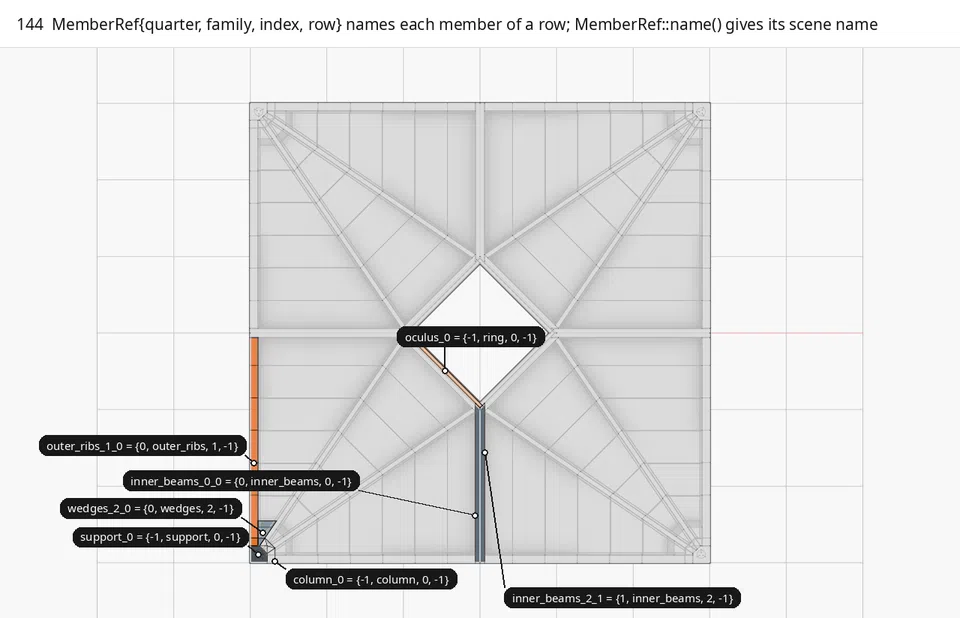

■ built what the step builds   ■ result a second thing it builds   ■ variable the value it introduces or measures   ■ input what it reads, dashed for a helper   ■ context the rest; frames 144 and 162 show the member families in their own colours

## 144. MemberRef names

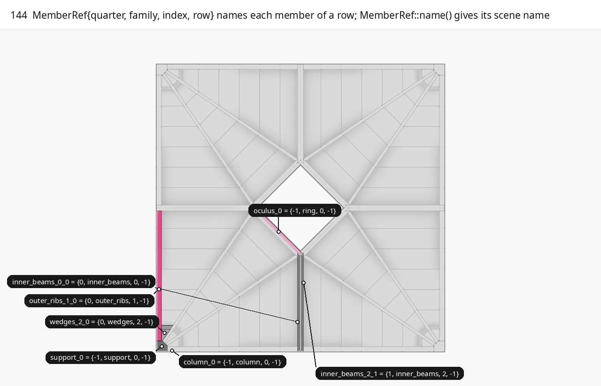

■ inner_beams `inner_beams_0_0`, `inner_beams_2_1`   ■ ring `oculus_0`   ■ column, support `column_0`, `support_0`   ■ outer_ribs `outer_ribs_1_0`   ■ wedges `wedges_2_0`   ■ context every other member, the bay edges and quarters

A row does not hold elements. It names its two members by `MemberRef{quarter, family, index, row}`. `geometry::quarter_member(q, family, i)` gives `{q, family, i, -1}` for a quarter member. The file-local `shared_member(family, i)` gives `{-1, family, i, -1}` for a ring beam, a column or a support. `MemberRef::name()` returns the scene name the models give the same member: `oculus_{index}` for the ring, `column_{index}` and `support_{index}` for a column corner, `beds_{row}_{index}_{quarter}` for a bed plate, and `{FAMILY_NAMES[family]}_{index}_{quarter}` for every other family. `add_family` names quarter members `{prefix}_{i}_{q}`, the ring is named `oculus_{i}` and the column models `column_{q}` and `support_{q}`, so a name always resolves to one element in the scene.

| Variable | Value | Meaning |
|---|---|---|
| `MemberRef::quarter` | 0..3, or -1 | The quarter, -1 for the ring, a column or a support |
| `MemberRef::family` | `Family` | outer_ribs, inner_ribs, inner_beams, wedges, tsections, beds, ring, column, support |
| `MemberRef::index` | | Index in the family, or in the bed row |
| `MemberRef::row` | -1 | The bed row, -1 for every other family |
| `quarter_member(0, inner_beams, 0)` | `{0, inner_beams, 0, -1}` | `inner_beams_0_0` |
| `quarter_member(1, inner_beams, 2)` | `{1, inner_beams, 2, -1}` | `inner_beams_2_1` |
| `shared_member(ring, 0)` | `{-1, ring, 0, -1}` | `oculus_0` |
| `shared_member(column, 0)`, `shared_member(support, 0)` | `{-1, column, 0, -1}`, `{-1, support, 0, -1}` | `column_0`, `support_0` |

Code: `MemberRef::name`, [floor_relations.cpp:19-34](https://github.com/petrasvestartas/wood/blob/16f3ab0a2386bf39ac7f7123c0a20d03e73ab1a5/src/templates/floor/floor_relations.cpp#L19-L34); `shared_member`, [floor_relations.cpp:11-13](https://github.com/petrasvestartas/wood/blob/16f3ab0a2386bf39ac7f7123c0a20d03e73ab1a5/src/templates/floor/floor_relations.cpp#L11-L13); `quarter_member`, [floor_geometry.cpp:265-267](https://github.com/petrasvestartas/wood/blob/16f3ab0a2386bf39ac7f7123c0a20d03e73ab1a5/src/templates/floor/floor_geometry.cpp#L265-L267); `struct MemberRef`, [floor.h:322-330](https://github.com/petrasvestartas/wood/blob/16f3ab0a2386bf39ac7f7123c0a20d03e73ab1a5/src/templates/floor/floor.h#L322-L330).

## 145. Relationship record and defaults

A `Relationship` is a plain record. Each factory sets only the fields its kind fixes, so the rest keep their defaults: `kind` = `Relation::support`, `plane` = a default `Plane` (origin (0, 0, 0), normal (0, 0, 1)), `contact` = an empty polyline, `type` = `ContactType::unknown` (-1), `seam_or_corner` = 0, `screws` and `through` empty, `end` = `std::nullopt`. The table shows which field each factory sets ("set") and which it leaves at the default ("-").

| Field | seam_wedge | oculus_wedge | column_plate | cross_lap | seam_tie | block_dowels | support | screw rows |
|---|---|---|---|---|---|---|---|---|
| `kind` | set | set | set | set | set | set | set | set |
| `a`, `b` | set | set | set | set | set | set | set | set |
| `plane` | seam plane | tilted plane | fan side plane | - | seam plane | rib face | `support_plane`, not lifted | set |
| `contact` | set | set | set | - | set | set | - | set |
| `type` | `side_side` | `side_side` | - | - | `end_end` | - | - | - |
| `seam_or_corner` | q | q | q | q | q | q | q | q |
| `screws` | - | - | - | - | - | - | - | set |
| `through` | - | - | - | - | - | - | - | `screw_rib_corner` only, when a screw passes the seam beam end |
| `end` | bay outer face, when `seam_through_ribs` | - | - | - | - | - | - | - |

`Relation` lists 12 kinds in this order: support, column_plate, cross_lap, seam_tie, seam_wedge, oculus_wedge, block_dowels, then the five `SCREW_RELATIONS` screw_rib_beam, screw_beam_mitre, screw_rib_corner, screw_ring, screw_oculus. `relation_name` indexes a 12-string array in that order.

| Variable | Value | Meaning |
|---|---|---|
| `plane` default | origin (0, 0, 0), normal (0, 0, 1) | What cross_lap keeps |
| `contact` default | 0 points | What cross_lap and support keep |
| `type` default | `unknown` (-1) | column_plate, cross_lap, block_dowels, support and the screw rows keep it |
| `ContactType` | unknown -1, side_side 0, side_top 1, top_top 2, end_side 3, end_end 4, end_top 5 | The enum the type check compares |
| `end` default | `std::nullopt` | Set only on a seam wedge with `seam_through_ribs` |

Code: `struct Relationship`, [floor.h:333-350](https://github.com/petrasvestartas/wood/blob/16f3ab0a2386bf39ac7f7123c0a20d03e73ab1a5/src/templates/floor/floor.h#L333-L350); `enum class Relation`, [floor.h:316](https://github.com/petrasvestartas/wood/blob/16f3ab0a2386bf39ac7f7123c0a20d03e73ab1a5/src/templates/floor/floor.h#L316); `relation_name`, [floor_relations.cpp:40-45](https://github.com/petrasvestartas/wood/blob/16f3ab0a2386bf39ac7f7123c0a20d03e73ab1a5/src/templates/floor/floor_relations.cpp#L40-L45); `screw_row`, [floor_screws.cpp:178-193](https://github.com/petrasvestartas/wood/blob/16f3ab0a2386bf39ac7f7123c0a20d03e73ab1a5/src/templates/floor/floor_screws.cpp#L178-L193).

## 146. seam_wedge: members

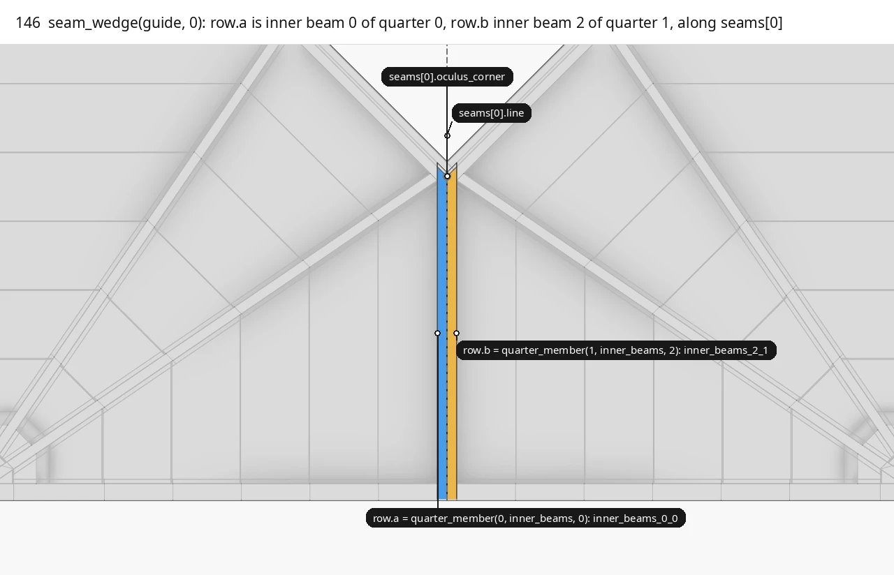

■ built `row.a` = `inner_beams_0_0`   ■ result `row.b` = `inner_beams_2_1`   ■ input `seams[0].line`, `seams[0].oculus_corner`   ■ context the other members of quarters 0 and 1, the bay edges

`relationships()` first loops q = 0..3 and pushes `seam_wedge(guide, q)`. The row sets `kind = Relation::seam_wedge`, `a = quarter_member(q, inner_beams, 0)` and `b = quarter_member((q + 1) % 4, inner_beams, 2)`. Both beams lie along seam q: quarter q builds its `inner_beams[0]` faces from `seams[q].faces_into(q)`, and quarter q + 1 builds its `inner_beams[2]` faces from `seams[(q + 1 + 3) % 4].faces_into(q + 1)`, which is the same seam seen from the other side. On the square, seam beam 0 of quarter 0 lies between x = -60 and x = 0 and seam beam 2 of quarter 1 between x = 0 and x = 60.

| Variable | Value | Meaning |
|---|---|---|
| `row.kind` | `Relation::seam_wedge` | The two seam beams of one seam |
| `row.a` | `inner_beams_0_0` (q = 0) | Inner beam 0 of quarter q |
| `row.b` | `inner_beams_2_1` (q = 0) | Inner beam 2 of quarter q + 1 |
| `seams[0].line` | (0, -3000) to (0, 0) | Edge midpoint to centre |
| `seams[0].oculus_corner` | (0, -1000) | Where the seam beams end; `oculus` = 1000 from the centre |

Code: `seam_wedge`, [floor_relations.cpp:56-62](https://github.com/petrasvestartas/wood/blob/16f3ab0a2386bf39ac7f7123c0a20d03e73ab1a5/src/templates/floor/floor_relations.cpp#L56-L62); loop at [floor_relations.cpp:177-178](https://github.com/petrasvestartas/wood/blob/16f3ab0a2386bf39ac7f7123c0a20d03e73ab1a5/src/templates/floor/floor_relations.cpp#L177-L178); `construction_planes`, [floor.cpp:191](https://github.com/petrasvestartas/wood/blob/16f3ab0a2386bf39ac7f7123c0a20d03e73ab1a5/src/templates/floor/floor.cpp#L191).

## 147. seam_wedge: plane

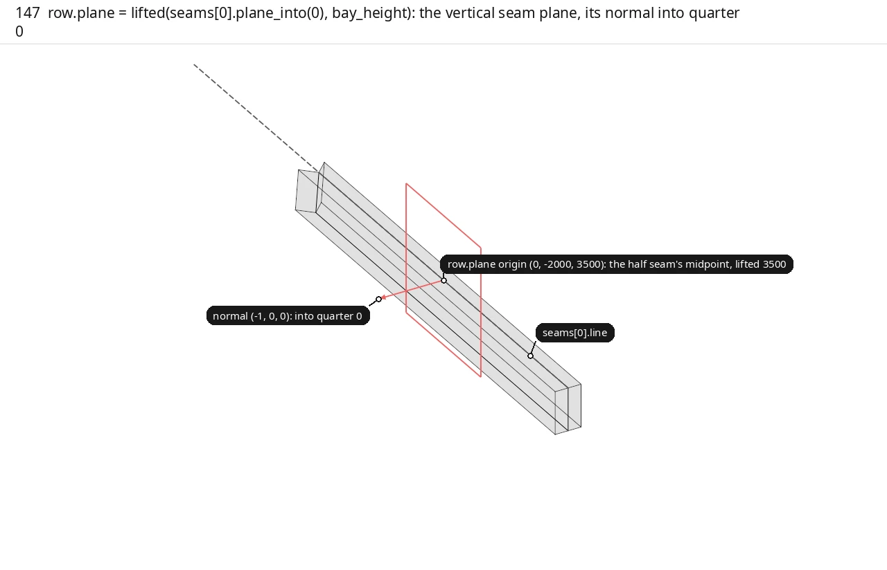

■ built `row.plane` (q = 0), normal into quarter 0   ■ input `seams[0].line`   ■ context `inner_beams_0_0`, `inner_beams_2_1`

`row.plane = lifted(guide.seams[q].plane_into(q), bay_height)`. Because the quarter asked for is the seam's own index, `plane_into` takes its first branch and returns `edge_plane(Line(midpoint, oculus_corner), -z)`: a vertical plane through the half seam from the edge midpoint to the oculus corner, its origin at that half seam's midpoint and its normal = line direction x (-z). For q = 0 that is (0, 1, 0) x (0, 0, -1) = (-1, 0, 0), into quarter 0. `lifted` translates the plane by (0, 0, `bay_height`).

| Variable | Value | Meaning |
|---|---|---|
| `lift` | 3500 | `guide.parameters.bay_height` |
| `row.plane` (q = 0) | origin (0, -2000, 3500), normal (-1, 0, 0) | Seam plane at floor level, normal into quarter q |
| `row.plane` (q = 1, 2, 3) | (2000, 0, 3500) n (0, -1, 0); (0, 2000, 3500) n (1, 0, 0); (-2000, 0, 3500) n (0, 1, 0) | The other three seams |
| `oculus` | 1000 | Places the oculus corner, the end of the half seam |

Code: `seam_wedge`, [floor_relations.cpp:58](https://github.com/petrasvestartas/wood/blob/16f3ab0a2386bf39ac7f7123c0a20d03e73ab1a5/src/templates/floor/floor_relations.cpp#L58), [63](https://github.com/petrasvestartas/wood/blob/16f3ab0a2386bf39ac7f7123c0a20d03e73ab1a5/src/templates/floor/floor_relations.cpp#L63); `Seam::plane_into`, [floor.cpp:413-418](https://github.com/petrasvestartas/wood/blob/16f3ab0a2386bf39ac7f7123c0a20d03e73ab1a5/src/templates/floor/floor.cpp#L413-L418); `edge_plane`, [floor_geometry.cpp:23-25](https://github.com/petrasvestartas/wood/blob/16f3ab0a2386bf39ac7f7123c0a20d03e73ab1a5/src/templates/floor/floor_geometry.cpp#L23-L25); `lifted(Plane)`, [floor_geometry.cpp:212-214](https://github.com/petrasvestartas/wood/blob/16f3ab0a2386bf39ac7f7123c0a20d03e73ab1a5/src/templates/floor/floor_geometry.cpp#L212-L214).

## 148. seam_wedge: contact

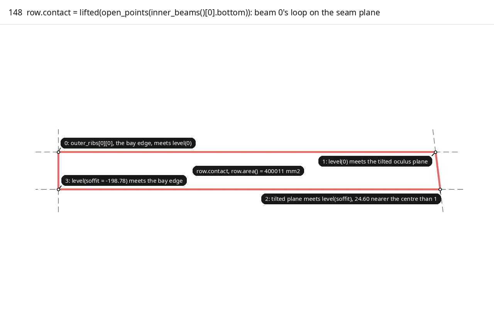

■ built `row.contact` (q = 0)   ■ input the four side planes `outer_ribs[0][0]`, `level(0)`, `inner_beams[1][0]`, `level(guide.soffit)`, dashed

`row.contact = lifted(overlap(guide.quarter(q).inner_beams()[0].bottom, guide.quarter(q + 1).inner_beams()[2].bottom, seams[q].plane_into(q)), lift)`: where the end faces of the two seam beams overlap on the seam plane. `overlap(a, b, plane)` intersects the two loops in the plane with the kernel's `Polyline::boolean_op`; when the result has a's area it returns a unchanged, otherwise it orients the result like a and starts it at the vertex nearest a's first. On the square the two loops are mirror images and coincide, so the contact is beam 0's loop; on a skewed bay the two beams end at different places along the seam and only the part both touch is contact. With `seam_through_ribs` set, inner beam 0 is `loft_planes(``{cp.outer_ribs[0][0], level(0), cp.inner_beams[1][0], level(guide.soffit)}``, cp.inner_beams[0][0], cp.inner_beams[0][1])`: four side planes, the bottom plane is the seam plane and the top plane its offset by `inner_beams`. `loft_planes` intersects each consecutive pair of side planes with the bottom plane, so the `bottom` loop is a quad in the seam plane: corner 0 = bay edge plane x datum, 1 = datum x tilted oculus plane, 2 = tilted plane x soffit level, 3 = soffit level x bay edge plane. `lifted` moves the points up by `bay_height` and closes the loop again. The oculus plane leans 5 degrees, so corner 2 lies 198.7835 x tan 5 deg x sqrt 2 = 24.595 mm further along the seam toward the centre than corner 1.

| Variable | Value | Meaning |
|---|---|---|
| `row.contact` (q = 0) | (0, -3000, 3500), (0, -1000, 3500), (0, -975.405, 3301.217), (0, -3000, 3301.217) | Closed trapezoid in the seam plane |
| `row.area()` | 400,011.5 mm2 | (2000 + 2024.595) / 2 x 198.7835 |
| `guide.soffit` | -198.7835 | Starts at -`static_h()` = -197, lowered to the deepest rib end on a beam |
| `static_h()` | 197 | `height` 650 - `rise` 453 |
| `oculus_plane_angle` | 5 deg | Lean of the oculus end |
| `seam_through_ribs` | true | Picks `outer_ribs[0][0]`, the bay edge, as the beam's outer end (face 1, the band's inner face, when false) |

Code: `seam_wedge`, [floor_relations.cpp:64](https://github.com/petrasvestartas/wood/blob/16f3ab0a2386bf39ac7f7123c0a20d03e73ab1a5/src/templates/floor/floor_relations.cpp#L64); `overlap`, [floor_geometry.cpp:220-238](https://github.com/petrasvestartas/wood/blob/16f3ab0a2386bf39ac7f7123c0a20d03e73ab1a5/src/templates/floor/floor_geometry.cpp#L220-L238); `Quarter::inner_beams`, [floor_members.cpp:93-105](https://github.com/petrasvestartas/wood/blob/16f3ab0a2386bf39ac7f7123c0a20d03e73ab1a5/src/templates/floor/floor_members.cpp#L93-L105); `loft_planes`, [floor_geometry.cpp:273-296](https://github.com/petrasvestartas/wood/blob/16f3ab0a2386bf39ac7f7123c0a20d03e73ab1a5/src/templates/floor/floor_geometry.cpp#L273-L296); `open_points`, [floor_geometry.cpp:154-162](https://github.com/petrasvestartas/wood/blob/16f3ab0a2386bf39ac7f7123c0a20d03e73ab1a5/src/templates/floor/floor_geometry.cpp#L154-L162); soffit, [floor.cpp:456-464](https://github.com/petrasvestartas/wood/blob/16f3ab0a2386bf39ac7f7123c0a20d03e73ab1a5/src/templates/floor/floor.cpp#L456-L464).

## 149. seam_wedge: type and end plane

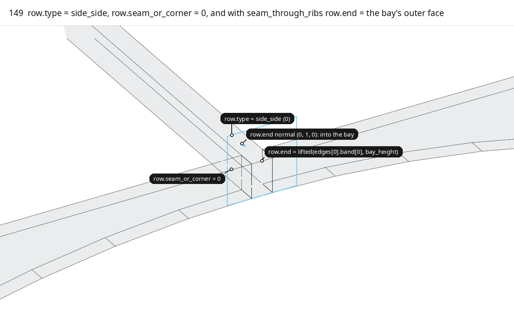

■ built `row.end` = `lifted(edges[0].band[0], bay_height)`, normal into the bay   ■ context `row.contact`, `inner_beams_0_0`, `inner_beams_2_1`, `outer_ribs_0_0`, `outer_ribs_1_1`

The row then sets `type = ContactType::side_side` and `seam_or_corner = q`. When `parameters.seam_through_ribs` is true it also sets `row.end = lifted(guide.edges[q].band[0], lift)`. `band[0]` is `Plane::from_point_normal(edge midpoint, line direction x (-z))`, the bay edge plane with its normal into the bay; `band[1]`, its offset by `outer_ribs`, is not used here. `connector_of` passes `row.end` to `JointBeam::wedge`, so the wedge runs on through the rib band to the bay's outer face.

| Variable | Value | Meaning |
|---|---|---|
| `row.type` | `side_side` (0) | The contact class the kernel's search must report |
| `row.seam_or_corner` | q | The seam index |
| `row.end` (q = 0) | origin (0, -3000, 3500), normal (0, 1, 0) | The bay's outer face the wedge runs to |
| `seam_through_ribs` | true | Whether `end` is set |
| `outer_ribs` | 100 | Offset of `band[1]`; not used for `end` |

Code: `seam_wedge`, [floor_relations.cpp:65-71](https://github.com/petrasvestartas/wood/blob/16f3ab0a2386bf39ac7f7123c0a20d03e73ab1a5/src/templates/floor/floor_relations.cpp#L65-L71); `bay_edge`, [floor.cpp:69-76](https://github.com/petrasvestartas/wood/blob/16f3ab0a2386bf39ac7f7123c0a20d03e73ab1a5/src/templates/floor/floor.cpp#L69-L76); `connector_of`, [floor_models.cpp:326-334](https://github.com/petrasvestartas/wood/blob/16f3ab0a2386bf39ac7f7123c0a20d03e73ab1a5/src/templates/floor/floor_models.cpp#L326-L334).

## 150. oculus_wedge: members and plane

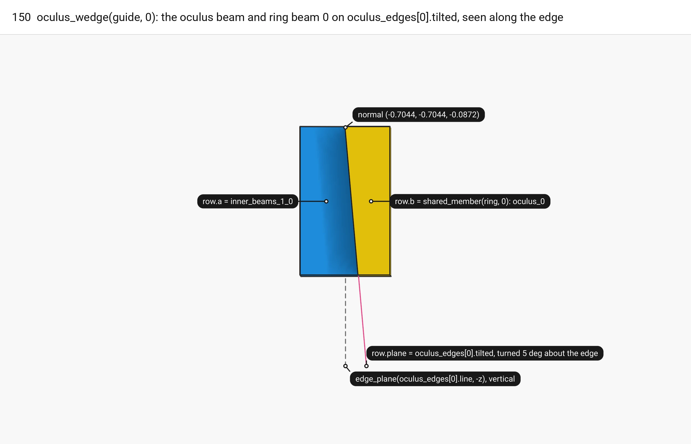

■ built `row.a` = `inner_beams_1_0`   ■ result `row.b` = `oculus_0`   ■ variable `row.plane` = `oculus_edges[0].tilted`, leaned `oculus_plane_angle` = 5 deg   ■ input `edge_plane(oculus_edges[0].line, -z)`, dashed

The second loop pushes `oculus_wedge(guide, q)` for q = 0..3: `a = quarter_member(q, inner_beams, 1)`, the quarter's oculus beam, and `b = shared_member(ring, q)`, ring beam q. `row.plane = lifted(guide.oculus_edges[q].tilted, lift)`. Oculus edge q runs from oculus corner q to oculus corner q - 1. Its `edge_plane(edge, -z)` is vertical, normal (-1, -1, 0)/sqrt 2 for q = 0, away from the centre into the quarter. `tilted` is that plane rotated by -`oculus_plane_angle` about the edge line through the edge centre, so its trace at the datum stays on the edge and below the datum it moves h x tan 5 deg toward the centre. The picture looks along the edge: the dashed grey line is the vertical edge plane, the pink line the tilted one. The row sets `type = side_side` and `seam_or_corner = q`; `end` stays unset.

| Variable | Value | Meaning |
|---|---|---|
| `row.a` / `row.b` (q = 0) | `inner_beams_1_0` / `oculus_0` | Oculus beam and ring beam |
| `row.plane` (q = 0) | origin (-500, -500, 3500), normal (-0.70442, -0.70442, -0.08716) | Tilted bearing plane at floor level |
| `row.type` | `side_side` (0) | |
| `oculus_plane_angle` | 5 deg | Rotation of the edge plane about the edge |
| `oculus` | 1000 | Oculus corners (0, -1000), (1000, 0), (0, 1000), (-1000, 0) |

Code: `oculus_wedge`, [floor_relations.cpp:75-88](https://github.com/petrasvestartas/wood/blob/16f3ab0a2386bf39ac7f7123c0a20d03e73ab1a5/src/templates/floor/floor_relations.cpp#L75-L88), loop at 180-181; `oculus_edge`, [floor.cpp:93-104](https://github.com/petrasvestartas/wood/blob/16f3ab0a2386bf39ac7f7123c0a20d03e73ab1a5/src/templates/floor/floor.cpp#L93-L104); `rotate`, [floor_geometry.cpp:15-17](https://github.com/petrasvestartas/wood/blob/16f3ab0a2386bf39ac7f7123c0a20d03e73ab1a5/src/templates/floor/floor_geometry.cpp#L15-L17).

## 151. oculus_wedge: contact

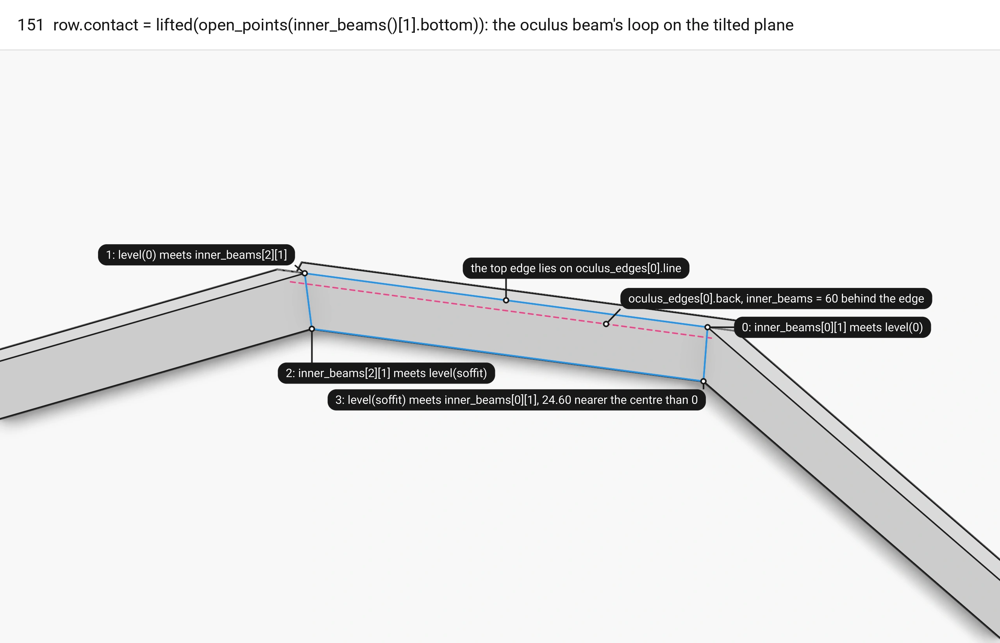

■ built `row.contact` (q = 0)   ■ variable `oculus_edges[0].back`, `inner_beams` = 60 behind the edge   ■ input `oculus_edges[0].line`   ■ context `inner_beams_0_0`, `inner_beams_2_0`, `oculus_0`

`row.contact = lifted(open_points(guide.quarter(q).inner_beams()[1].bottom), lift)`. Inner beam 1 is `loft_planes({cp.inner_beams[0][1], level(0), cp.inner_beams[2][1], level(soffit)}, cp.inner_beams[1][0], cp.inner_beams[1][1])` with `cp.inner_beams[1] = {oculus.tilted, oculus.back}`. Its `bottom` loop lies on the tilted plane and is cut by the far faces of the two seam beams (x = -60 and y = -60 in quarter 0), the datum and the soffit: corner 0 = x = -60 x datum, 1 = datum x y = -60, 2 = y = -60 x soffit, 3 = soffit x x = -60. The top edge lies on the oculus edge line x + y = -1000 itself. The two corners at the soffit sit 24.595 mm nearer the centre along each seam face than the two at the datum. The back face `oculus_edges[0].back` is the vertical edge plane offset by `inner_beams` into the quarter, x + y = -1084.853.

| Variable | Value | Meaning |
|---|---|---|
| `row.contact` (q = 0) | (-60, -940, 3500), (-940, -60, 3500), (-915.405, -60, 3301.217), (-60, -915.405, 3301.217) | Trapezoid on the tilted plane |
| `row.area()` | 244,862.3 mm2 | |
| `inner_beams` | 60 | Seam beam thickness: the x = -60 and y = -60 sides |
| `guide.soffit` | -198.7835 | Bottom level |

Code: `oculus_wedge`, [floor_relations.cpp:83](https://github.com/petrasvestartas/wood/blob/16f3ab0a2386bf39ac7f7123c0a20d03e73ab1a5/src/templates/floor/floor_relations.cpp#L83); `Quarter::inner_beams`, [floor_members.cpp:102](https://github.com/petrasvestartas/wood/blob/16f3ab0a2386bf39ac7f7123c0a20d03e73ab1a5/src/templates/floor/floor_members.cpp#L102); `construction_planes`, [floor.cpp:191](https://github.com/petrasvestartas/wood/blob/16f3ab0a2386bf39ac7f7123c0a20d03e73ab1a5/src/templates/floor/floor.cpp#L191).

## 152. column_plate: fan side plane

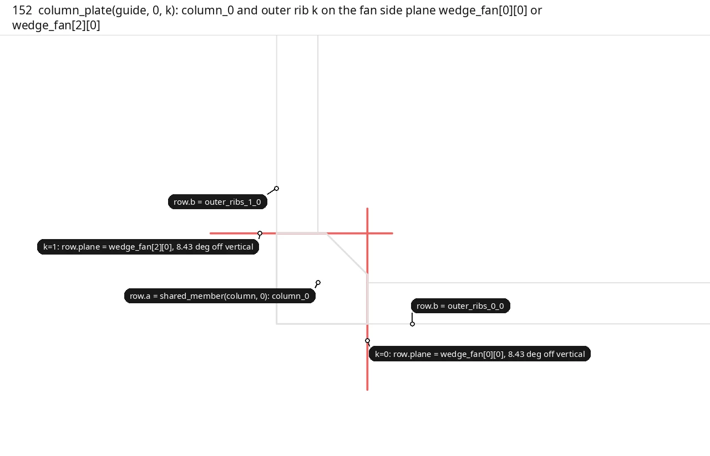

■ built `row.plane` for k = 0 and 1, `wedge_fan[0][0]` and `wedge_fan[2][0]` at the floor top   ■ context column head 0, the outer rib quads of quarter 0

The third loop pushes `column_plate(guide, q, k)` for q = 0..3 and k = 0, 1: `a = shared_member(column, q)`, `b = quarter_member(q, outer_ribs, k)`, and `row.plane = lifted(guide.columns[q].wedge_fan[k == 0 ? 0 : 2][0], lift)`, the side 0 or side 1 fan plane. `wedge0` passes through the centre of head edge 1 with normal `line0.direction x side0.direction`, where `line0 = plane_plane(cp.inner_ribs[0][1], tilted)` is the crease of inner rib 0's central face with the chamfer plane; `tilted` is `edge_plane(head edge 2, +z)` turned by `wedge_plane_angle` about that edge. `wedge2` is built the same way on head edge 3 with `-line1`. The fan plane leans atan(0.14665 / 0.98919) = 8.43 degrees off vertical. `type` stays unknown and `seam_or_corner = q`.

| Variable | Value | Meaning |
|---|---|---|
| `row.a` / `row.b` (q = 0) | `column_0` / `outer_ribs_0_0`, `column_0` / `outer_ribs_1_0` | Column and outer rib |
| `row.plane` (q = 0, k = 0) | origin (-2780, -2940, 3500), normal (0.98919, 0, 0.14665) | `wedge_fan[0][0]` lifted |
| `row.plane` (q = 0, k = 1) | origin (-2940, -2780, 3500), normal (0, 0.98919, 0.14665) | `wedge_fan[2][0]` lifted |
| `row.type` | `unknown` (-1) | Not fixed by the design; the kernel's search reports `end_end` (4) |
| `column_head`, `column_head_chamfer` | 220, 120 | The head polygon whose edges 1 to 3 carry the fan planes |
| `wedge_plane_angle` | -10 deg | Lean of the chamfer plane that sets the creases |

Code: `column_plate`, [floor_relations.cpp:91-106](https://github.com/petrasvestartas/wood/blob/16f3ab0a2386bf39ac7f7123c0a20d03e73ab1a5/src/templates/floor/floor_relations.cpp#L91-L106), loop at 183-185; `wedge_fan`, [floor.cpp:146-159](https://github.com/petrasvestartas/wood/blob/16f3ab0a2386bf39ac7f7123c0a20d03e73ab1a5/src/templates/floor/floor.cpp#L146-L159).

## 153. column_plate: rib end face

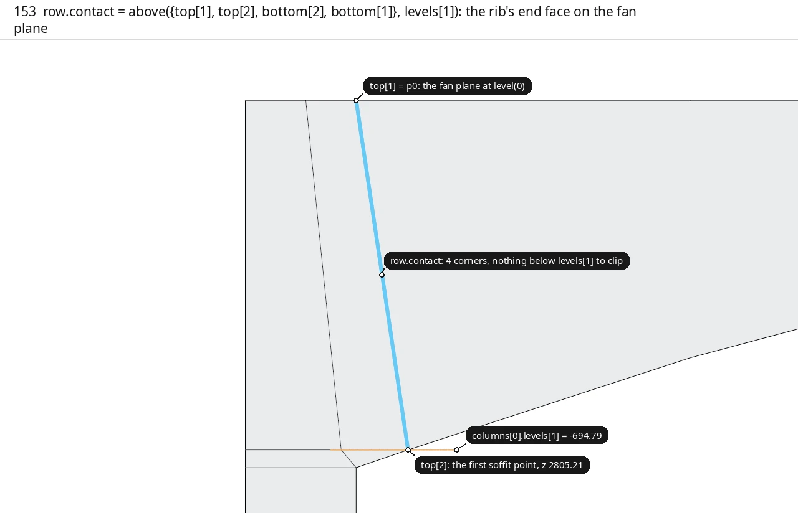

■ built `row.contact` (q = 0, k = 0)   ■ variable `columns[0].levels[1]` = -694.7934   ■ context `column_0`, `outer_ribs_0_0`

`rib = guide.quarter(q).outer_ribs()[k]`. Its first end plane is the fan plane, and `rib_loop` returns the loop `{p1, p0, soffit points..., p1}`: index 1 is `p0`, the fan plane's point at the datum, and index 2 the first soffit point, on the fan plane. `top` is the loop on the bay edge face (y = -3000 for k = 0) and `bottom` the loop on the band's inner face (y = -2900). The quad `{top[1], top[2], bottom[2], bottom[1]}` is therefore the rib's end face on the fan plane, across the 100 mm band. The contact is where that face meets the column: `overlap(quad, column_face(k == 0 ? 0 : 2), wedge_fan[...][0])`, the same `overlap` as the seam wedge's. `Quarter::column_face(i)` is the column's carved face on fan plane i, between the datum and `columns[q].levels[1]`, the face the head cutters leave (chapter 6). `levels[1]` starts at 0 and is set after the four quarters by `rib_bottom_level`: the lowest of 0 and the z of point 2 of both loops of both outer ribs. On the square both ribs end at -694.7934, exactly the face's lower edge, and the band lies inside the face, so the overlap is the whole quad; on a skewed bay the face clips what reaches past it. Then the result is lifted.

| Variable | Value | Meaning |
|---|---|---|
| `row.contact` (q = 0, k = 0) | (-2780, -3000, 3500), (-2676.996, -3000, 2805.207), (-2676.996, -2900, 2805.207), (-2780, -2900, 3500) | Rib end face on the column |
| `row.area()` | 70,238.7 mm2 | |
| `columns[0].levels[1]` | -694.7934 (z 2805.207 lifted) | Middle cutter level |
| `wedge` | 240 | Run-in seed; the solved `run_in` is 240 on both ribs |
| `outer_ribs` | 100 | Band width, the quad's width |

Code: `column_plate`, [floor_relations.cpp:94-96](https://github.com/petrasvestartas/wood/blob/16f3ab0a2386bf39ac7f7123c0a20d03e73ab1a5/src/templates/floor/floor_relations.cpp#L94-L96), [102](https://github.com/petrasvestartas/wood/blob/16f3ab0a2386bf39ac7f7123c0a20d03e73ab1a5/src/templates/floor/floor_relations.cpp#L102); `overlap`, [floor_geometry.cpp:220-238](https://github.com/petrasvestartas/wood/blob/16f3ab0a2386bf39ac7f7123c0a20d03e73ab1a5/src/templates/floor/floor_geometry.cpp#L220-L238); `Quarter::column_face`, [floor_members.cpp:289-303](https://github.com/petrasvestartas/wood/blob/16f3ab0a2386bf39ac7f7123c0a20d03e73ab1a5/src/templates/floor/floor_members.cpp#L289-L303); `rib_loop` and `rib`, [floor_members.cpp:17-55](https://github.com/petrasvestartas/wood/blob/16f3ab0a2386bf39ac7f7123c0a20d03e73ab1a5/src/templates/floor/floor_members.cpp#L17-L55); `rib_bottom_level`, [floor.cpp:378-386](https://github.com/petrasvestartas/wood/blob/16f3ab0a2386bf39ac7f7123c0a20d03e73ab1a5/src/templates/floor/floor.cpp#L378-L386), [453-454](https://github.com/petrasvestartas/wood/blob/16f3ab0a2386bf39ac7f7123c0a20d03e73ab1a5/src/templates/floor/floor.cpp#L453-L454).

## 154. cross_lap: no geometry

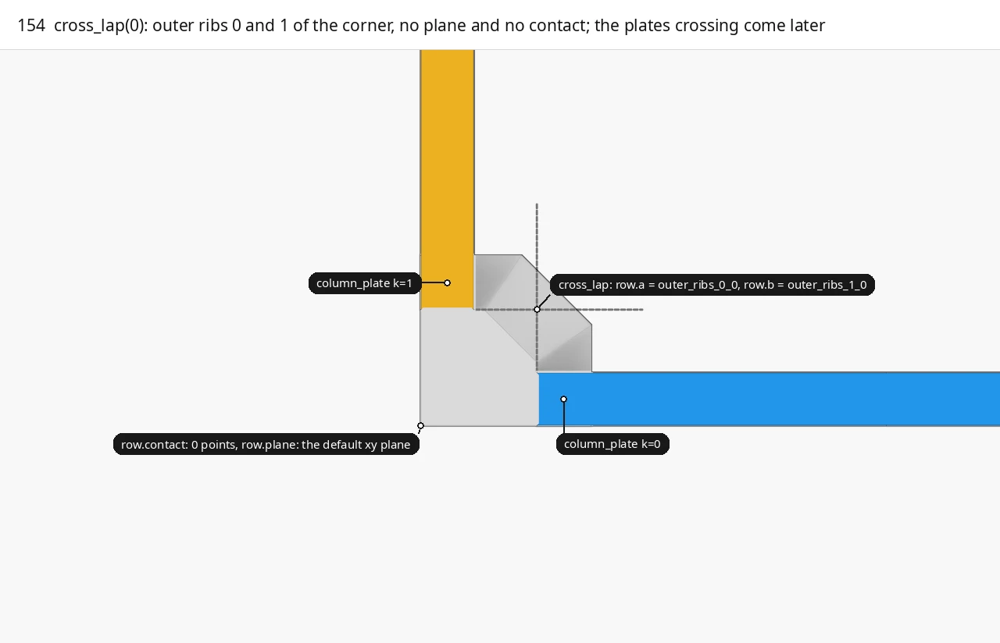

■ built `row.a` = `outer_ribs_0_0`   ■ result `row.b` = `outer_ribs_1_0`   ■ input the two fan plane traces where the plates will cross, dashed   ■ context `column_0`, the two `column_plate` contacts

The fourth loop pushes `cross_lap(q)` for q = 0..3: `a = quarter_member(q, outer_ribs, 0)`, `b = quarter_member(q, outer_ribs, 1)`, `seam_or_corner = q`. Nothing else is set, so the plane stays the default xy plane at the origin, the contact stays empty and the type unknown. The two ribs do not touch: rib 0 starts at x of about -2780, rib 1 lies in x -3000..-2900. `add_connectors` builds the cross lap later from the corner's two column plate connectors, which it collects with `plates_of_corner`, calls `JointBeam::cross_lap(plates[0], plates[1])` and throws when the corner does not hold exactly two plates. The dashed grey lines in the picture are the two fan plane traces crossing inside the column; they show where those plates will cross, not a field of the row. `verify_contacts` skips the row because its contact is empty.

| Variable | Value | Meaning |
|---|---|---|
| `row.a` / `row.b` (q = 0) | `outer_ribs_0_0` / `outer_ribs_1_0` | The two outer ribs of corner q |
| `row.plane` | origin (0, 0, 0), normal (0, 0, 1) | Unset default |
| `row.contact` | 0 points | Empty |
| `row.type` | `unknown` (-1) | |

Code: `cross_lap`, [floor_relations.cpp:109-118](https://github.com/petrasvestartas/wood/blob/16f3ab0a2386bf39ac7f7123c0a20d03e73ab1a5/src/templates/floor/floor_relations.cpp#L109-L118), loop at 187-188; `add_connectors`, [floor_models.cpp:371-377](https://github.com/petrasvestartas/wood/blob/16f3ab0a2386bf39ac7f7123c0a20d03e73ab1a5/src/templates/floor/floor_models.cpp#L371-L377), [383-384](https://github.com/petrasvestartas/wood/blob/16f3ab0a2386bf39ac7f7123c0a20d03e73ab1a5/src/templates/floor/floor_models.cpp#L383-L384).

## 155. seam_tie (not on the default)

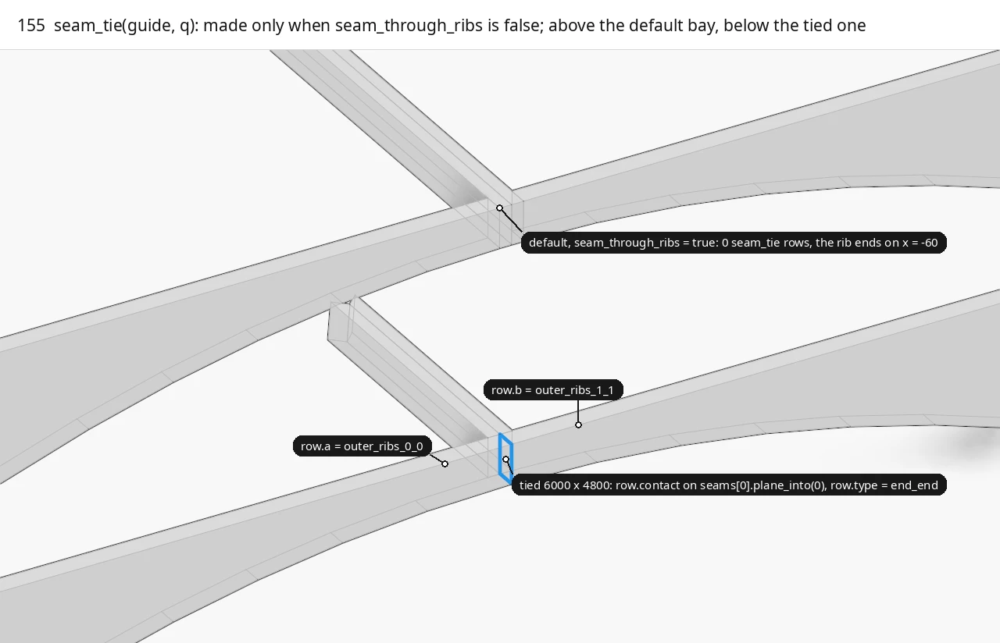

■ built `row.contact` of seam_tie row 0 on the tied bay   ■ context the loops of `outer_ribs_0_0`, `outer_ribs_1_1`, `inner_beams_0_0`, `inner_beams_2_1` at seam 0, default bay above, tied bay below

The fifth loop runs `for (q = 0; q < 4 && !parameters.seam_through_ribs; q++)`, so the default bay makes no tie rows. The picture shows seam 0 twice: above, the default square, where the outer ribs end on the seam beams' far faces x = -60 and no tie exists; below, the tied 6000 x 4800 bay (`seam_through_ribs = false`, moved for the picture), where the ribs meet end to end on the seam plane. There `a = quarter_member(q, outer_ribs, 0)`, `b = quarter_member((q + 1) % 4, outer_ribs, 1)`, `row.plane = lifted(seams[q].plane_into(q))`, and `row.contact = lifted({top[0], top[n-2], bottom[n-2], bottom[0]})`: `p1`, the seam end at the datum, and the last soffit point of each loop, which is rib 0's seam end face. `type = end_end`. `rib_seam_ends` picks the face the rib ends on: face 0, the seam plane, when `seam_through_ribs` is false, face 1, the seam beam's far face, when it is true.

| Variable | Value | Meaning |
|---|---|---|
| seam_tie rows | 0 with `seam_through_ribs` true | The default bay |
| `row.contact` (false variant) | (0, -3000, 3500), (0, -3000, 3303), (0, -2900, 3303), (0, -2900, 3500) | Rib end on the seam plane (probe on a 6000 x 6000 bay with ties) |
| `row.type` | `end_end` (4) | |
| `seam_through_ribs` | true | false turns the ties on |

Code: `seam_tie`, [floor_relations.cpp:121-138](https://github.com/petrasvestartas/wood/blob/16f3ab0a2386bf39ac7f7123c0a20d03e73ab1a5/src/templates/floor/floor_relations.cpp#L121-L138), loop at 190-191; `Quarter::rib_seam_ends`, [floor_members.cpp:69-75](https://github.com/petrasvestartas/wood/blob/16f3ab0a2386bf39ac7f7123c0a20d03e73ab1a5/src/templates/floor/floor_members.cpp#L69-L75).

## 156. block_dowels: rib plane table

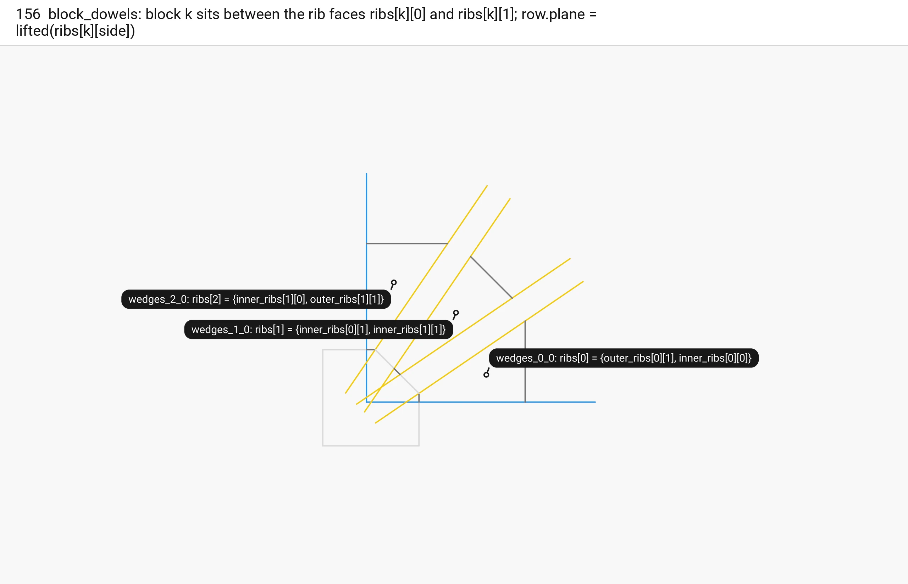

■ built band faces `outer_ribs[0][1]`, `outer_ribs[1][1]`   ■ result inner rib faces `inner_ribs[0][0]`, `[0][1]`, `[1][0]`, `[1][1]`   ■ input block footprints `wedges_0_0`, `wedges_1_0`, `wedges_2_0`   ■ context column head 0

`block_dowels(guide, q, k, side, rib)` builds a table of the two rib faces each wedge block sits between, from the quarter's construction planes `cp = guide.geometry[q].planes`: block 0 between `{``cp.outer_ribs[0][1]``, ``cp.inner_ribs[0][0]``}`, block 1 between `{``cp.inner_ribs[0][1]``, ``cp.inner_ribs[1][1]``}`, block 2 between `{``cp.inner_ribs[1][0]``, ``cp.outer_ribs[1][1]``}`. `Quarter::wedges()` lofts the blocks from the same table. `row.plane = lifted(ribs[k][side], lift)`. `outer_ribs[i][1]` is the band's inner face, 100 mm in from the bay edge. `inner_ribs[0][0]` passes through the midpoint of column head point `head[2]` and beam corner `p0` = datum x `inner_beams[0][1]` x `inner_beams[1][1]` = (-60, -1024.853), with normal (p0 - head[2]) x (-z); `inner_ribs[1][0]` uses `head[3]` and `p1` with x (+z); `inner_ribs[i][1]` is that face offset by `inner_ribs`. In the picture the band faces are blue, the inner rib faces yellow and the block footprints grey.

| Variable | Value | Meaning |
|---|---|---|
| `ribs[0]` | `{outer_ribs[0][1], inner_ribs[0][0]}` | Faces of block 0 |
| `ribs[1]` | `{inner_ribs[0][1], inner_ribs[1][1]}` | Faces of block 1 |
| `ribs[2]` | `{inner_ribs[1][0], outer_ribs[1][1]}` | Faces of block 2 |
| `outer_ribs[0][1]` (q = 0) | origin (-1500, -2900, 3500), normal (0, 1, 0) | Band face of edge 0, lifted |
| `outer_ribs[1][1]` | origin (-2900, -1500, 3500), normal (1, 0, 0) | Band face of edge 3 |
| `inner_ribs[0][0]` / `[0][1]` | origin (-1420, -1952.426, 3500) / (-1453.808, -1902.858, 3500), normal (-0.56346, 0.82614, 0) | Inner rib 0's outer and central face |
| `inner_ribs[1][0]` / `[1][1]` | origin (-1952.426, -1420, 3500) / (-1902.858, -1453.808, 3500), normal (0.82614, -0.56346, 0) | Inner rib 1's outer and central face |
| `outer_ribs`, `inner_ribs` | 100, 60 | Band offset and inner rib thickness |

Code: `block_dowels`, [floor_relations.cpp:141-153](https://github.com/petrasvestartas/wood/blob/16f3ab0a2386bf39ac7f7123c0a20d03e73ab1a5/src/templates/floor/floor_relations.cpp#L141-L153); `construction_planes`, [floor.cpp:193-200](https://github.com/petrasvestartas/wood/blob/16f3ab0a2386bf39ac7f7123c0a20d03e73ab1a5/src/templates/floor/floor.cpp#L193-L200); `Quarter::wedges`, [floor_members.cpp:107-124](https://github.com/petrasvestartas/wood/blob/16f3ab0a2386bf39ac7f7123c0a20d03e73ab1a5/src/templates/floor/floor_members.cpp#L107-L124).

## 157. block_dowels: block face contact

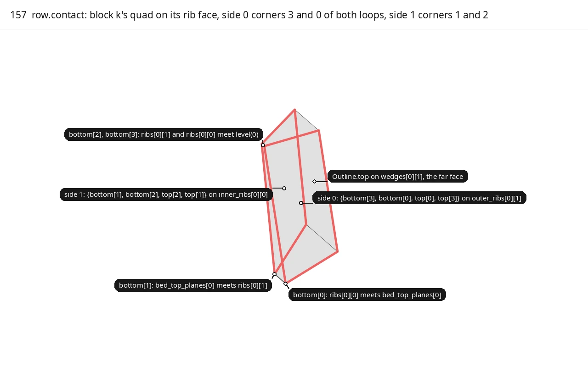

■ built side 0 `row.contact` on `outer_ribs[0][1]`   ■ result side 1 `row.contact` on `inner_ribs[0][0]`   ■ input `Outline.bottom` of block 0 on the fan plane   ■ context `wedges_0_0`

`block = guide.quarter(q).wedges()[k] = loft_planes({ribs[k][0], bed_top_planes[k], ribs[k][1], level(0)}, cp.wedges[k][0], cp.wedges[k][1])`. Corner i of each loop is side plane i x side plane i + 1 on that loop's plane: 0 = rib 0 x bed top, 1 = bed top x rib 1, 2 = rib 1 x datum, 3 = datum x rib 0. Corners 3 and 0 therefore lie on `ribs[k][0]`, corners 1 and 2 on `ribs[k][1]`. `Outline.bottom` lies on the fan plane `wedges[k][0]`, `Outline.top` on the far face `wedges[k][1]`. Side 0 takes `{bottom[3], bottom[0], top[0], top[3]}` and side 1 `{bottom[1], bottom[2], top[2], top[1]}`: the block's quad on that rib face, between the datum and the bed top plane and between the fan plane and the far face. The quad is lifted; `type` stays unknown and `seam_or_corner = q`.

| Variable | Value | Meaning |
|---|---|---|
| `row.contact` q0 block 0 side 0 | (-2780, -2900, 3500), (-2685.029, -2900, 2859.393), (-2453.623, -2900, 2935.056), (-2537.377, -2900, 3500) | Block 0 on the outer band, 146,247.3 mm2 |
| `row.contact` q0 block 1 side 0 | (-2823.178, -2836.822, 3500), (-2728.093, -2771.970, 2858.621), (-2483.811, -2605.361, 2938.493), (-2567.055, -2662.136, 3500) | Block 1 on inner rib 0's central face, 186,461.0 mm2 |
| `row.contact` q0 block 2 side 1 | (-2900, -2685.029, 2859.393), (-2900, -2780, 3500), (-2900, -2537.377, 3500), (-2900, -2453.623, 2935.056) | Block 2 on the outer band of side 1 |
| `wedge`, `middle_wedge_factor` | 240, 1.25 | Block widths: `run_in` (240) for the side blocks, 1.25 x their mean (300) for the middle one |
| `tsections` | 27 | Bed layers that set `bed_top_planes` |

Code: `block_dowels`, [floor_relations.cpp:144-146](https://github.com/petrasvestartas/wood/blob/16f3ab0a2386bf39ac7f7123c0a20d03e73ab1a5/src/templates/floor/floor_relations.cpp#L144-L146), [154-155](https://github.com/petrasvestartas/wood/blob/16f3ab0a2386bf39ac7f7123c0a20d03e73ab1a5/src/templates/floor/floor_relations.cpp#L154-L155); `Quarter::wedges`, [floor_members.cpp:107-124](https://github.com/petrasvestartas/wood/blob/16f3ab0a2386bf39ac7f7123c0a20d03e73ab1a5/src/templates/floor/floor_members.cpp#L107-L124); `loft_planes`, [floor_geometry.cpp:273-296](https://github.com/petrasvestartas/wood/blob/16f3ab0a2386bf39ac7f7123c0a20d03e73ab1a5/src/templates/floor/floor_geometry.cpp#L273-L296).

## 158. block_dowels: six rows

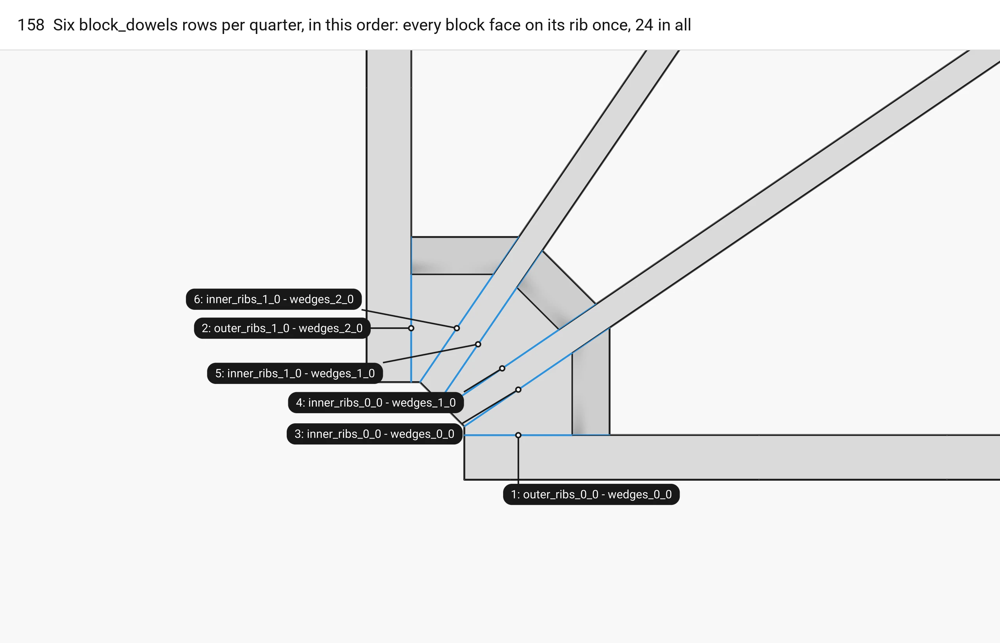

■ built the six `block_dowels` contacts of quarter 0, numbered 1 to 6   ■ context the outer ribs, inner ribs and wedges of quarter 0

Per quarter, `block_dowels` is called six times in a fixed order, as (k, side, rib): (0, 0, `outer_ribs_0`), (2, 1, `outer_ribs_1`), (0, 1, `inner_ribs_0`), (1, 0, `inner_ribs_0`), (1, 1, `inner_ribs_1`), (2, 0, `inner_ribs_1`). `row.a` is the rib passed in and `row.b = quarter_member(q, wedges, k)`. That covers every block-to-rib face pair once: each block has two faces, and each inner rib carries two blocks, one on each face. The picture numbers the six contacts 1 to 6 in that order.

| Variable | Value | Meaning |
|---|---|---|
| rows per quarter | 6 | 24 in all, row indices 20-43 |
| `text()` of the q0 rows | `block_dowels outer_ribs_0_0 - wedges_0_0`, `... outer_ribs_1_0 - wedges_2_0`, `... inner_ribs_0_0 - wedges_0_0`, `... inner_ribs_0_0 - wedges_1_0`, `... inner_ribs_1_0 - wedges_1_0`, `... inner_ribs_1_0 - wedges_2_0` | In push order |

Code: `relationships` (block loop), [floor_relations.cpp:193-200](https://github.com/petrasvestartas/wood/blob/16f3ab0a2386bf39ac7f7123c0a20d03e73ab1a5/src/templates/floor/floor_relations.cpp#L193-L200); `block_dowels`, [floor_relations.cpp:151-152](https://github.com/petrasvestartas/wood/blob/16f3ab0a2386bf39ac7f7123c0a20d03e73ab1a5/src/templates/floor/floor_relations.cpp#L151-L152).

## 159. support row

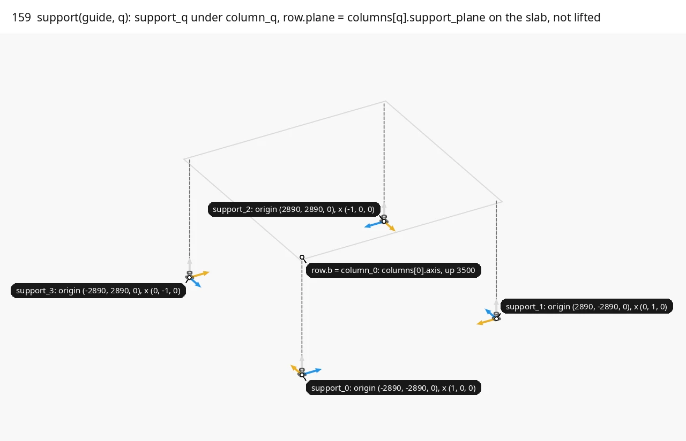

■ built `row.plane` x axis   ■ result `row.plane` y axis   ■ input `support_0` .. `support_3`, `columns[q].axis` dashed   ■ context `row.plane` z axis, the bay edges

The next loop pushes `support(guide, q)`: `a = shared_member(support, q)`, `b = shared_member(column, q)`, `row.plane = guide.columns[q].support_plane`, `seam_or_corner = q`. This plane is not lifted: it is `Plane::from_frame(axis_point, x, y, z)` on the slab at z 0, with `axis_point = corner + (x + y) x column_head / 2`. At a right corner `corner_frame` gives x = `after`, toward corner q + 1, and y = `before`, toward corner q - 1. The contact stays empty and the type unknown. The picture draws each plane's x axis blue, its y axis yellow and its z axis grey, each support and column axis grey, the axis dashed.

| Variable | Value | Meaning |
|---|---|---|
| `row.a` / `row.b` (q = 0) | `support_0` / `column_0` | |
| `row.plane` q0 | origin (-2890, -2890, 0), x (1, 0, 0), y (0, 1, 0) | Support frame on the slab |
| `row.plane` q1, q2, q3 | (2890, -2890, 0) x (0, 1, 0); (2890, 2890, 0) x (-1, 0, 0); (-2890, 2890, 0) x (0, -1, 0) | |
| `column_head` | 220 | Axis offset 110 along x and y |

Code: `support`, [floor_relations.cpp:161-171](https://github.com/petrasvestartas/wood/blob/16f3ab0a2386bf39ac7f7123c0a20d03e73ab1a5/src/templates/floor/floor_relations.cpp#L161-L171), loop at 202-203; `corner_frame`, [floor.cpp:106-119](https://github.com/petrasvestartas/wood/blob/16f3ab0a2386bf39ac7f7123c0a20d03e73ab1a5/src/templates/floor/floor.cpp#L106-L119); `column_corner`, [floor.cpp:138-139](https://github.com/petrasvestartas/wood/blob/16f3ab0a2386bf39ac7f7123c0a20d03e73ab1a5/src/templates/floor/floor.cpp#L138-L139).

## 160. Screw rows and counts

Last, `relationships()` appends every row of `screw_relationships(guide)`: per quarter 2 screw_rib_beam, 2 screw_beam_mitre and 2 screw_rib_corner rows, then 4 screw_ring rows and 8 screw_oculus rows. Every screw row carries its screw axes in `screws`; screw_rib_corner adds the seam beam to `through` only when a screw passes the seam beam end. The screw rows are explained in chapter 10.

| Kind | Rows | Row indices |
|---|---|---|
| seam_wedge | 4 | 0-3 |
| oculus_wedge | 4 | 4-7 |
| column_plate | 8 | 8-15 |
| cross_lap | 4 | 16-19 |
| seam_tie | 0 | none with `seam_through_ribs` |
| block_dowels | 24 | 20-43 |
| support | 4 | 44-47 |
| screw_rib_beam, screw_beam_mitre, screw_rib_corner | 8 + 8 + 8 | 48-71, two of each per quarter in quarter order |
| screw_ring | 4 | 72-75 |
| screw_oculus | 8 | 76-83 |
| total | 84 = 48 + 36 | Asserted by `check_relationships` in tests/floor_elements.cpp |

Code: `relationships`, [floor_relations.cpp:205-206](https://github.com/petrasvestartas/wood/blob/16f3ab0a2386bf39ac7f7123c0a20d03e73ab1a5/src/templates/floor/floor_relations.cpp#L205-L206); `screw_relationships`, [floor_screws.cpp:326-350](https://github.com/petrasvestartas/wood/blob/16f3ab0a2386bf39ac7f7123c0a20d03e73ab1a5/src/templates/floor/floor_screws.cpp#L326-L350).

## 161. Filter, text, area()

`relationships(guide, kind)` rebuilds the full list and keeps the rows of that kind in the same order. `relation_name(kind)` indexes the 12 names in `Relation` order. `text()` is `"{kind} {a.name()} - {b.name()}"`. `area()` is `polygon_area(contact)`, which now sums the cross products of the triangle fan from the first point and returns half the magnitude, the true area of a planar polygon, and 0 for fewer than three points. The version before this change returned `0.5 * compute_newell(points).magnitude()`; `compute_newell` returns a normalised vector, so every contact read 0.5 and the area checks that use it could not fire. `check_contact_areas` in tests/floor_elements.cpp now guards it with a tilted 100 x 50 rectangle (5000 mm2). The same function feeds `boolean_area` in floor_report.cpp, so `ring_overlap_mm2` and `ring_uncovered_mm2` are real areas again too.

| q0 row | `text()` | `area()` mm2 |
|---|---|---|
| 0 | seam_wedge inner_beams_0_0 - inner_beams_2_1 | 400,011.5 |
| 4 | oculus_wedge inner_beams_1_0 - oculus_0 | 244,862.3 |
| 8 | column_plate column_0 - outer_ribs_0_0 | 70,238.7 |
| 9 | column_plate column_0 - outer_ribs_1_0 | as row 8, the mirror image on the square |
| 16 | cross_lap outer_ribs_0_0 - outer_ribs_1_0 | 0, empty contact |
| 20 | block_dowels outer_ribs_0_0 - wedges_0_0 | 146,247.3 |
| 21 | block_dowels outer_ribs_1_0 - wedges_2_0 | as row 20, mirror image |
| 23 | block_dowels inner_ribs_0_0 - wedges_1_0 | 186,461.0 |
| 24 | block_dowels inner_ribs_1_0 - wedges_1_0 | as row 23, mirror image |
| 44 | support support_0 - column_0 | 0, empty contact |

Code: `relationships(guide, kind)`, [floor_relations.cpp:211-220](https://github.com/petrasvestartas/wood/blob/16f3ab0a2386bf39ac7f7123c0a20d03e73ab1a5/src/templates/floor/floor_relations.cpp#L211-L220); `relation_name`, `text`, `area`, [floor_relations.cpp:36-49](https://github.com/petrasvestartas/wood/blob/16f3ab0a2386bf39ac7f7123c0a20d03e73ab1a5/src/templates/floor/floor_relations.cpp#L36-L49); `polygon_area`, [floor_geometry.cpp:197-206](https://github.com/petrasvestartas/wood/blob/16f3ab0a2386bf39ac7f7123c0a20d03e73ab1a5/src/templates/floor/floor_geometry.cpp#L197-L206).

## 162. Members resolve in the scene

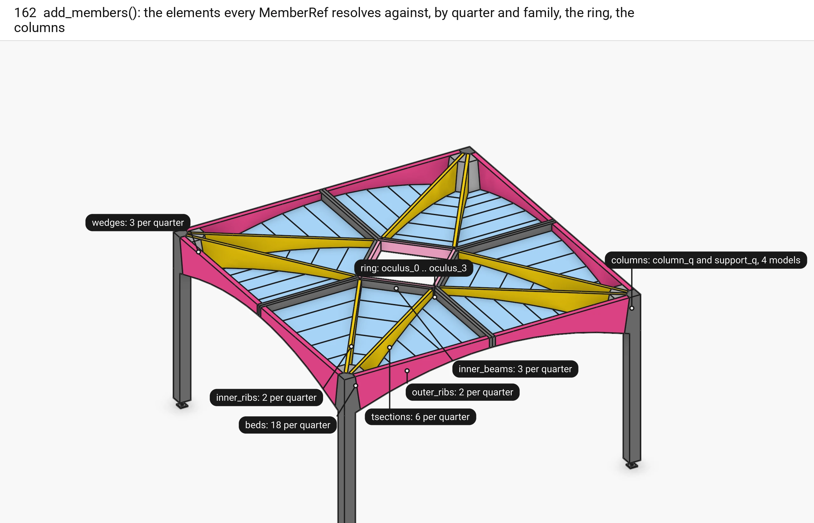

■ outer_ribs   ■ inner_ribs   ■ inner_beams   ■ wedges   ■ tsections   ■ beds   ■ ring `oculus_0` .. `oculus_3`   ■ columns `column_q`, `support_q`

The references resolve against the members a `Floor` places. `add_floor` builds the four `QuarterMembers` with `add_quarter_model`: beds by row, tsections, outer_ribs, inner_ribs, wedges and inner_beams, each lifted by `bay_height` and named `{prefix}_{i}_{q}`. It then builds the ring with `add_oculus_model`, where only the first four oculus outlines become ring `Member`s with their `outline_thickness`. `add_columns` fills `members.columns[q]` with `add_column_model`: `support_q`, `column_q`, the support joint, and the head cuts pushed into `column->solid_cuts`. Until `add_columns` runs, `columns` is empty, so `get()` returns null for a column or support and `pair()` throws on every column_plate and support row. `Floor::add_members()` does the same through its own `add_quarters`, `add_oculus` and `add_columns`, which call the same three model functions.

| Variable | Value | Meaning |
|---|---|---|
| `FloorMembers::quarters[q]` | 2 outer_ribs, 2 inner_ribs, 3 inner_beams, 3 wedges, 6 tsections, 3 bed rows | One quarter |
| `FloorMembers::ring` | 4 | `oculus_0` .. `oculus_3` |
| `FloorMembers::columns` | 4 | `column_q` and `support_q` |
| `bay_height` | 3500 | Lift of every placed member |

Code: `add_quarter_model`, [floor_models.cpp:137-163](https://github.com/petrasvestartas/wood/blob/16f3ab0a2386bf39ac7f7123c0a20d03e73ab1a5/src/templates/floor/floor_models.cpp#L137-L163); `add_oculus_model`, [floor_models.cpp:165-181](https://github.com/petrasvestartas/wood/blob/16f3ab0a2386bf39ac7f7123c0a20d03e73ab1a5/src/templates/floor/floor_models.cpp#L165-L181); `add_column_model`, [floor_models.cpp:187-207](https://github.com/petrasvestartas/wood/blob/16f3ab0a2386bf39ac7f7123c0a20d03e73ab1a5/src/templates/floor/floor_models.cpp#L187-L207); `add_floor`, `add_columns`, [floor_models.cpp:209-229](https://github.com/petrasvestartas/wood/blob/16f3ab0a2386bf39ac7f7123c0a20d03e73ab1a5/src/templates/floor/floor_models.cpp#L209-L229); `Floor::add_members`, [floor_models.cpp:419-442](https://github.com/petrasvestartas/wood/blob/16f3ab0a2386bf39ac7f7123c0a20d03e73ab1a5/src/templates/floor/floor_models.cpp#L419-L442).

## 163. get, thickness, pair

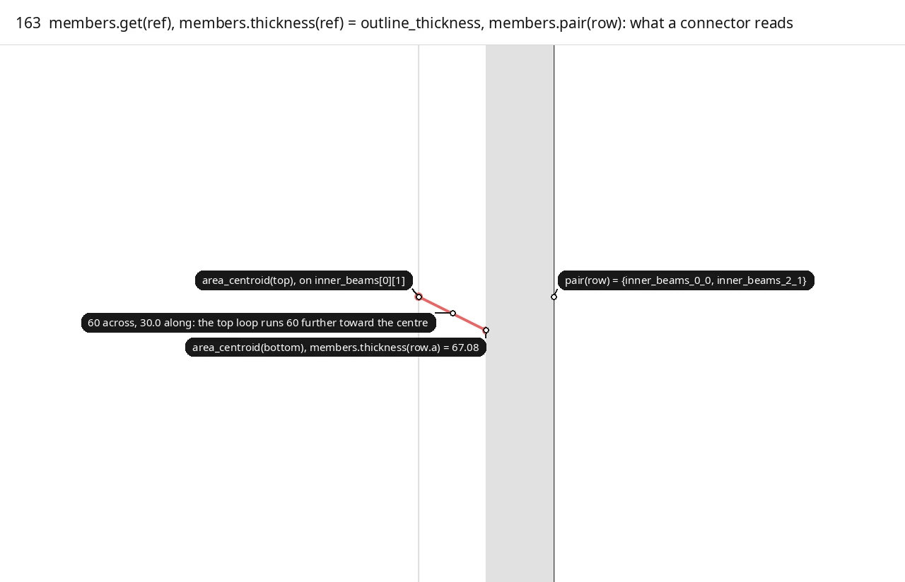

■ variable `members.thickness(row.a)` = 67.08, from `area_centroid(bottom)` to `area_centroid(top)`   ■ input `outline.top`, `outline.bottom` of `inner_beams_0_0`   ■ context `row.b` = `inner_beams_2_1`

`FloorMembers::get(ref)` returns `ring[index].element` for the ring, `columns[index].column` for a column and `columns[index].support` for a support. For any other family it needs quarter 0..3 and picks the family vector (the bed row for beds), returning null when the family or index is out of range. `thickness(ref)` returns the member's `Member::thickness`, which is `outline_thickness` = |`area_centroid(top)` - `area_centroid(bottom)`|, and 0 for a column or support, whose quarter is -1. For seam beam 0 that distance is 67.08, not 60: its top loop on x = -60 meets the oculus edge x + y = -1000 at y = -940, 60 mm nearer the centre than the bottom loop on x = 0 (y = -1000), so its centroid sits about 30 mm nearer the centre, and sqrt(60^2 + 30^2) = 67.08. `pair(row)` returns `{get(a), get(b)}` and throws `"the floor members do not hold both members of <text>"` when either is null. `connector_of` takes the pair, wraps the constructed contact as `InteractionContactFace(-1, -1, row.type, row.contact)` without any search, and reads `kind`, `type`, `contact`, `end`, `screws` and `through`, never `row.plane`.

| Variable | Value | Meaning |
|---|---|---|
| `thickness` q0 | inner_beams_0_0 67.082, inner_beams_1_0 68.656, oculus_0 51.323, outer_ribs_k_0 100.000, inner_ribs_k_0 61.063, wedges_0_0 / wedges_2_0 258.684, wedges_1_0 301.820, column and support 0 | Connector sizing thickness |
| `pair(row)` | `{inner_beams_0_0, inner_beams_2_1}` for the seam wedge of q = 0 | The two scene elements |
| `contact` in `connector_of` | `InteractionContactFace(-1, -1, row.type, row.contact)` | The constructed polygon, closed, in world coordinates |

Code: `FloorMembers::get`, [floor_models.cpp:252-269](https://github.com/petrasvestartas/wood/blob/16f3ab0a2386bf39ac7f7123c0a20d03e73ab1a5/src/templates/floor/floor_models.cpp#L252-L269); `thickness`, [floor_models.cpp:271-282](https://github.com/petrasvestartas/wood/blob/16f3ab0a2386bf39ac7f7123c0a20d03e73ab1a5/src/templates/floor/floor_models.cpp#L271-L282); `pair`, [floor_models.cpp:288-297](https://github.com/petrasvestartas/wood/blob/16f3ab0a2386bf39ac7f7123c0a20d03e73ab1a5/src/templates/floor/floor_models.cpp#L288-L297); `outline_thickness`, [floor_elements.cpp:107-109](https://github.com/petrasvestartas/wood/blob/16f3ab0a2386bf39ac7f7123c0a20d03e73ab1a5/src/templates/floor/floor_elements.cpp#L107-L109); `connector_of`, [floor_models.cpp:326-330](https://github.com/petrasvestartas/wood/blob/16f3ab0a2386bf39ac7f7123c0a20d03e73ab1a5/src/templates/floor/floor_models.cpp#L326-L330).

## 164. uncut copies

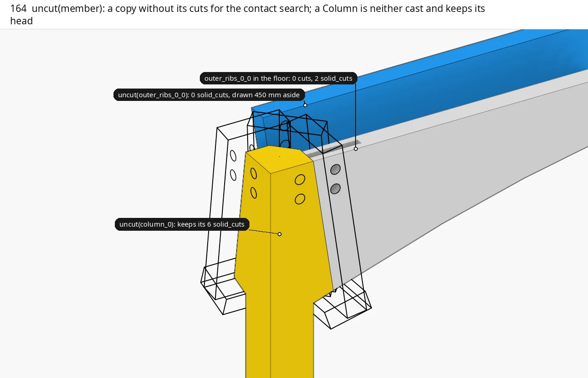

■ input `outer_ribs_0_0` in the connected floor, with its cuts   ■ built `uncut(outer_ribs_0_0)`, drawn 450 aside   ■ result `uncut(column_0)`, keeping its head   black outlines: the drill and cutter features of every element shown

The contact search runs on copies of the members as they were before any connector cut them. `uncut(member)` clones the element. For a `BeamVariable` it clears `cuts` and `solid_cuts`, for a `Plate` it clears `solid_cuts`, then it calls `invalidate_geometry`. A `Column` keeps the solid cuts `add_column_model` pushed, the carved head, and loses only the cuts a connector stored: a connector's cut carries the connector's guid in `joint_guid`, the head cuts carry none. The column plate contact the kernel finds (`end_end`) lies on that carved fan face, so the head must stay; the plate pockets the column plate connectors cut into it must go, as they go from the ribs. The picture shows outer rib 0 of the connected floor with its cut features, its uncut copy beside it, and the column's uncut copy with its head.

| Variable | Value | Meaning |
|---|---|---|
| `uncut(BeamVariable)` | `cuts` and `solid_cuts` cleared | Ribs and beams |
| `uncut(Plate)` | `solid_cuts` cleared | Wedges, t-sections, beds |
| `uncut(Column)` | connector cuts cleared, `joint_guid` not empty | Keeps its head cuts |

Code: `uncut`, [floor_models.cpp:106-123](https://github.com/petrasvestartas/wood/blob/16f3ab0a2386bf39ac7f7123c0a20d03e73ab1a5/src/templates/floor/floor_models.cpp#L106-L123); head cuts, [floor_models.cpp:201-204](https://github.com/petrasvestartas/wood/blob/16f3ab0a2386bf39ac7f7123c0a20d03e73ab1a5/src/templates/floor/floor_models.cpp#L201-L204).

## 165. verify_contacts: search

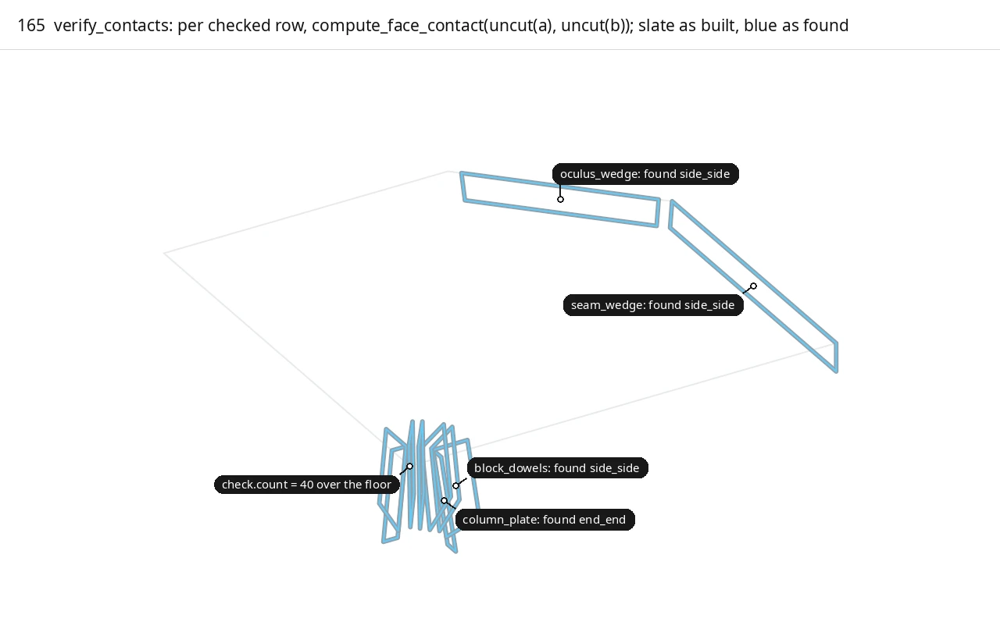

■ input `row.contact` of quarter 0's checked rows, as built   ■ built `found->polygon` from `compute_face_contact(uncut(a), uncut(b))`   ■ context quarter 0's polygon

`verify_contacts(session, guide, members, tolerance, kinds)` loops over `relationships(guide)`. It skips a row whose `contact.point_count()` is 0 or whose kind is not in `kinds`; the default kinds are seam_wedge, oculus_wedge, column_plate, seam_tie and block_dowels. Otherwise it increments `check.count`, takes `members.pair(row)` (which throws if a member is missing) and runs `session.compute_face_contact(uncut(a), uncut(b))`. A null result records `{row.text(), "missing"}` and goes on to the next row. The picture draws quarter 0's checked contacts as built in grey and the polygons the search found in blue over them.

| Variable | Value | Meaning |
|---|---|---|
| `kinds` | {seam_wedge, oculus_wedge, column_plate, seam_tie, block_dowels} | Default of the declaration in floor.h |
| `tolerance` | 1e-6 | Radians, mm and relative area share it |
| `check.count` | 40 = 4 + 4 + 8 + 0 + 24 | Contacts checked on the default bay |
| `found` | `InteractionContactFace` | Its `polygon` is the boolean intersection of the two face outlines in face a's plane |

Code: `verify_contacts`, [floor_verify.cpp:87-104](https://github.com/petrasvestartas/wood/blob/16f3ab0a2386bf39ac7f7123c0a20d03e73ab1a5/src/templates/floor/floor_verify.cpp#L87-L104); declaration, [floor.h:459](https://github.com/petrasvestartas/wood/blob/16f3ab0a2386bf39ac7f7123c0a20d03e73ab1a5/src/templates/floor/floor.h#L459).

## 166. disagreement: normal and top edge

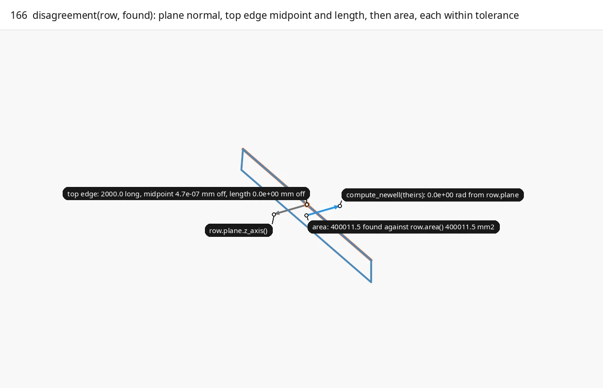

■ input `row.contact`, `row.plane.z_axis()`   ■ built `found.polygon` and its normal `compute_newell(theirs)`   ■ variable the found top edge, its midpoint and length

For a found contact of the right type, `disagreement(row, found, tolerance)` compares the two polygons. `mine = open_points(row.contact)`, `theirs = open_points(found.polygon)`. The normal is `compute_newell(theirs).normalized()` and `angle = acos(clamp(|normal . row.plane.z_axis()|, 0, 1))`, so the sign of the normal does not matter; above the tolerance it returns `"plane {angle} rad off"`. `top_edge` then picks, in each polygon, the edge with the highest mean z, the longest among edges within 1e-6 of that height. The midpoints of the two top edges and their lengths are compared; if either difference is above the tolerance it returns `"top edge {midpoint} mm off, {theirs - mine} mm longer"`. The checks run in this order and the first one that fails is the one reported.

| Variable | Value | Meaning |
|---|---|---|
| `angle` | within 1e-6 for all 40 | Radians between the found polygon's normal and `row.plane` |
| top edge, seam wedge q0 | (0, -3000, 3500) to (0, -1000, 3500), length 2000, midpoint (0, -2000, 3500) | The datum edge |
| top edge, oculus wedge q0 | (-60, -940, 3500) to (-940, -60, 3500), length 1244.5, midpoint (-500, -500, 3500) | |
| top edge, column plate q0 k0 | (-2780, -2900, 3500) to (-2780, -3000, 3500), length 100 | The closing edge of the quad |

Code: `disagreement`, [floor_verify.cpp:61-84](https://github.com/petrasvestartas/wood/blob/16f3ab0a2386bf39ac7f7123c0a20d03e73ab1a5/src/templates/floor/floor_verify.cpp#L61-L84); `top_edge`, [floor_verify.cpp:13-33](https://github.com/petrasvestartas/wood/blob/16f3ab0a2386bf39ac7f7123c0a20d03e73ab1a5/src/templates/floor/floor_verify.cpp#L13-L33).

## 167. Type and area checks

Before `disagreement`, `verify_contacts` compares types: if `row.type != unknown` and `found->type != row.type`, it records `"<found> instead of <expected>"` through `type_name` and moves on. Only seam_wedge and oculus_wedge (side_side) and seam_tie (end_end) set a type, so the column plates and block dowels are never compared by type. The last check in `disagreement` is the area: `area = |polygon_area(found.polygon) - row.area()| / max(row.area(), 1e-300)`, and above the tolerance it returns `"area A against B"`. With `polygon_area` now a true area this compares the real areas within 1e-6 relative; before the change both sides were 0.5 and the check could not fire.

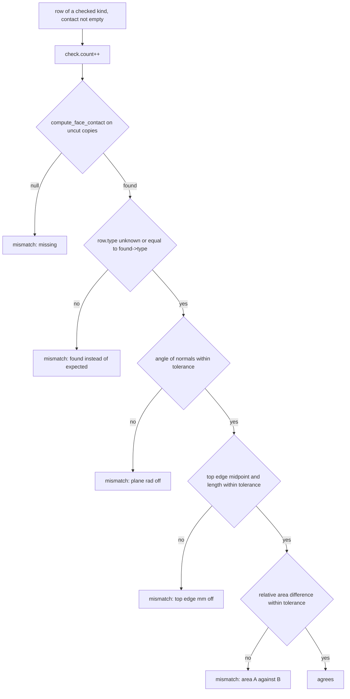
```mermaid
flowchart TD
    R[row of a checked kind, contact not empty] --> C[check.count++]
    C --> F{compute_face_contact on uncut copies}
    F -- null --> M1[mismatch: missing]
    F -- found --> T{row.type unknown or equal to found->type}
    T -- no --> M2[mismatch: found instead of expected]
    T -- yes --> P{angle of normals within tolerance}
    P -- no --> M3[mismatch: plane rad off]
    P -- yes --> E{top edge midpoint and length within tolerance}
    E -- no --> M4[mismatch: top edge mm off]
    E -- yes --> A{relative area difference within tolerance}
    A -- no --> M5[mismatch: area A against B]
    A -- yes --> OK[agrees]
```

| Kind | `row.type` | `found->type` | Compared |
|---|---|---|---|
| seam_wedge | side_side (0) | side_side (0) | yes |
| oculus_wedge | side_side (0) | side_side (0) | yes |
| column_plate | unknown (-1) | end_end (4) | no |
| block_dowels | unknown (-1) | side_side (0) | no |
| seam_tie | end_end (4) | not made on the default bay | yes, when made |

| Variable | Value | Meaning |
|---|---|---|
| type mismatches | none on the default bay | |
| `area` | relative difference of the found and constructed areas | Compared against `tolerance` 1e-6 |

Code: `verify_contacts`, [floor_verify.cpp:106-109](https://github.com/petrasvestartas/wood/blob/16f3ab0a2386bf39ac7f7123c0a20d03e73ab1a5/src/templates/floor/floor_verify.cpp#L106-L109); `type_name`, [floor_verify.cpp:36-45](https://github.com/petrasvestartas/wood/blob/16f3ab0a2386bf39ac7f7123c0a20d03e73ab1a5/src/templates/floor/floor_verify.cpp#L36-L45); `disagreement`, [floor_verify.cpp:71-73](https://github.com/petrasvestartas/wood/blob/16f3ab0a2386bf39ac7f7123c0a20d03e73ab1a5/src/templates/floor/floor_verify.cpp#L71-L73), [81-82](https://github.com/petrasvestartas/wood/blob/16f3ab0a2386bf39ac7f7123c0a20d03e73ab1a5/src/templates/floor/floor_verify.cpp#L81-L82).

## 168. ContactCheck and require_contact

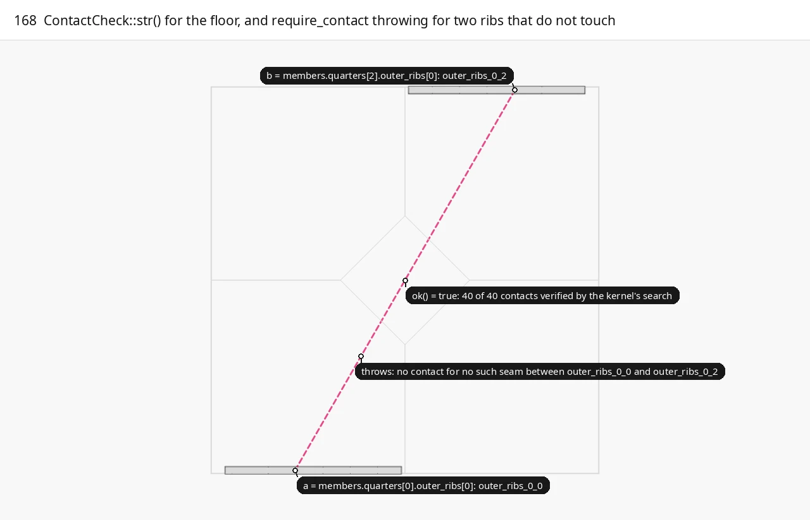

■ input `a` = `outer_ribs_0_0`, `b` = `outer_ribs_0_2`   ■ variable `require_contact(session, a, b, end_end, "no such seam")` throws   ■ context the bay edges and quarters

Every non-empty disagreement is pushed as `{row.text(), what}`. `ContactCheck::ok()` is `mismatches.empty()`, and `str()` is `"<count - mismatches> of <count> contacts verified by the kernel's search"` followed by one `"\n  mismatch: <relation>: <what>"` line per mismatch. `require_contact(session, a, b, expected, relation)` is the single-pair form: it runs `compute_face_contact(uncut(*a), uncut(*b))`, throws `"no contact for <relation> between <a> and <b>"` when there is none, throws `"the contact for <relation> between <a> and <b> is <found>, not <expected>"` when `expected` is not unknown and the type differs, and otherwise returns the contact. The test calls it on `outer_ribs_0_0` and `outer_ribs_0_2`, at opposite corners, with `end_end` and the relation name `"no such seam"`, and checks that the message contains that name.

| Variable | Value | Meaning |
|---|---|---|
| `check.ok()` | true | No mismatch |
| `check.str()` | "40 of 40 contacts verified by the kernel's search" | Summary on the default bay |
| `require_contact(..., end_end, "no such seam")` | throws "no contact for no such seam between outer_ribs_0_0 and outer_ribs_0_2" | The two ribs do not touch |
| `expected` | a `ContactType`, `unknown` to skip the type check | |

Code: `ContactCheck::ok`, `ContactCheck::str`, [floor_verify.cpp:120-132](https://github.com/petrasvestartas/wood/blob/16f3ab0a2386bf39ac7f7123c0a20d03e73ab1a5/src/templates/floor/floor_verify.cpp#L120-L132); `require_contact`, [floor_verify.cpp:47-58](https://github.com/petrasvestartas/wood/blob/16f3ab0a2386bf39ac7f7123c0a20d03e73ab1a5/src/templates/floor/floor_verify.cpp#L47-L58); test, [tests/floor_elements.cpp:447-455](https://github.com/petrasvestartas/wood/blob/16f3ab0a2386bf39ac7f7123c0a20d03e73ab1a5/tests/floor_elements.cpp#L447-L455).
