# Floor 09: Connectors {#templates_floor_09_connectors}

This chapter turns the contact relationships of chapter 08 into connectors. `wood_floor::add_connectors` (src/templates/floor/floor_models.cpp) walks `relationships(guide)`, builds one `JointBeam` per row through the factories in src/joinery_solver/wood_elements/wood_element_joint_beam.cpp, names it, and hands it to `WoodSession::add_connector` (src/joinery_solver/wood_session.cpp), which nests its parts and dowels and stores its cuts in the members. It takes the members `add_members()` placed and the `Relationship` rows. It gives chapter 10 the cut members and the connectors that the screws are checked against. `add_screws()` uses the same function for the screw kinds.

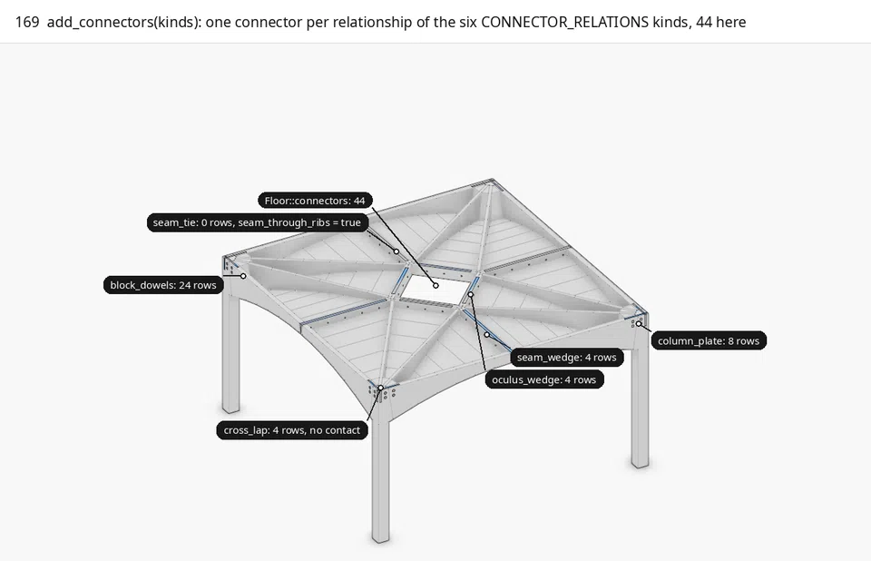

All values below are for the default bay, `FloorGuide::rectangle(3000, 3000)` with the default `FloorParameters`, unless a section says otherwise. Sections 184 to 186 draw the tied 3000 x 2400 bay, because the default bay makes no ties.

## 169. add_connectors entry

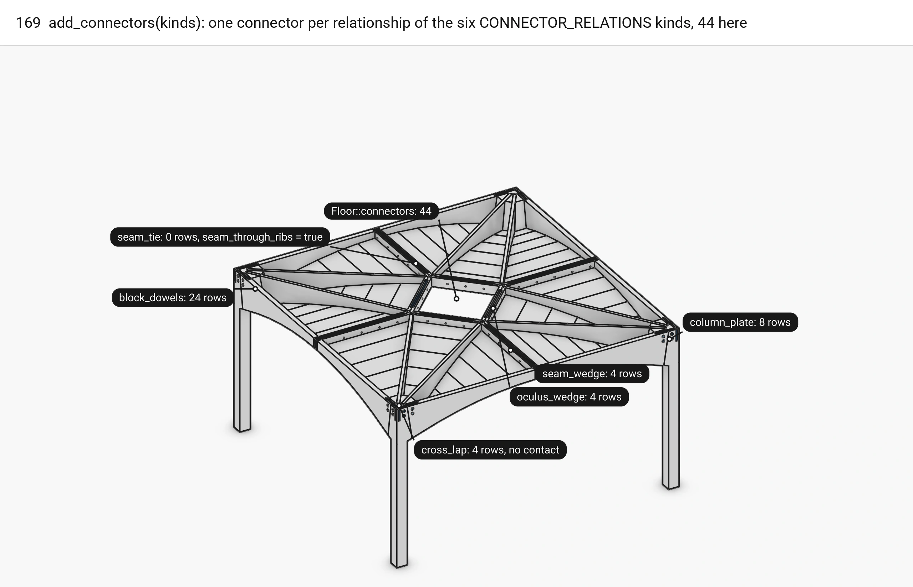

`Floor::add_connectors(kinds)` calls `wood_floor::add_connectors(*this, guide, members, kinds)` and appends the result to `Floor::connectors`. The default `kinds` is `CONNECTOR_RELATIONS`: seam_wedge, oculus_wedge, column_plate, cross_lap, seam_tie and block_dowels. `Floor::add_screws()` calls the same function with the five `SCREW_RELATIONS` and appends to `Floor::screws` (chapter 10). Every member, the columns included, must already be in the scene from `add_members()`, because `FloorMembers::pair` throws when an element is missing. On the default bay the call makes 44 connectors: 4 seam wedges, 4 oculus wedges, 8 column plates, 4 cross laps, 0 ties and 24 block dowels. The picture shows the members grey and the 44 connectors the call makes in `CONNECTOR_COLOR`.

| Variable | Value | Meaning |
|---|---|---|
| `kinds` | `CONNECTOR_RELATIONS` | Which `Relation` kinds get a connector |
| `Floor::connectors` | 44 | 4 + 4 + 8 + 4 + 0 + 24 connectors |
| `Floor::screws` | 36 | The screw connectors of `add_screws()` |

Code: `Floor::add_connectors`, `Floor::add_screws`, src/templates/floor/floor_models.cpp:413-430; src/templates/floor/floor.h:316, 444.

## 170. Walk and filter

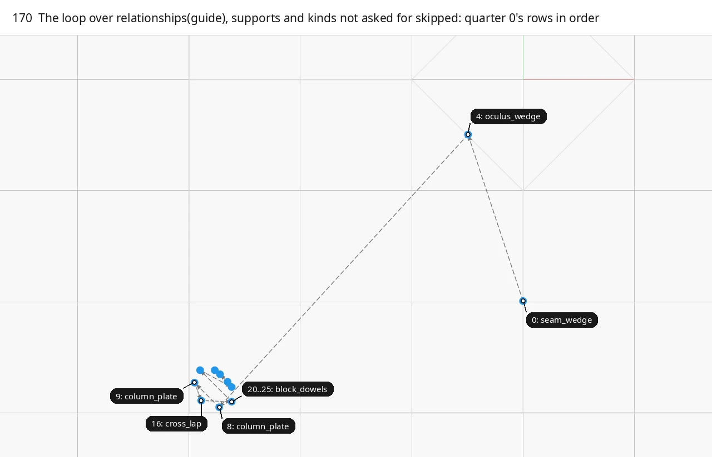

`add_connectors` makes three containers: `by_prefix`, the connectors made so far per name prefix, used only for numbering; `plates_of_corner`, the column-plate connectors per corner; and `connectors`, the result. It loops over `relationships(guide)` in its order: the seam wedges of seams 0 to 3, the oculus wedges, the column plates (corner q, rib k = 0, 1), the cross laps, the ties, six block dowels per quarter, the supports, then the screw rows. A row of kind `support`, or of a kind not in `kinds`, is skipped. `seam_through_ribs` defaults to true, so `relationships()` makes no seam_tie rows at all. The picture shows quarter 0's rows at their contacts, joined in walk order, with their index among the 44 connectors.

| Variable | Value | Meaning |
|---|---|---|
| `by_prefix` | map, empty at the start | Connectors made so far per prefix; its size is the next index |
| `plates_of_corner` | map, empty at the start | Column-plate connectors per corner |
| `connectors` | 44 | The returned list, in `relationships()` order |
| `FloorParameters::seam_through_ribs` | true | Suppresses the seam_tie rows |

Code: `wood_floor::add_connectors`, src/templates/floor/floor_models.cpp:348-356; `relationships`, src/templates/floor/floor_relations.cpp:173-209.

## 171. Wedge sizing

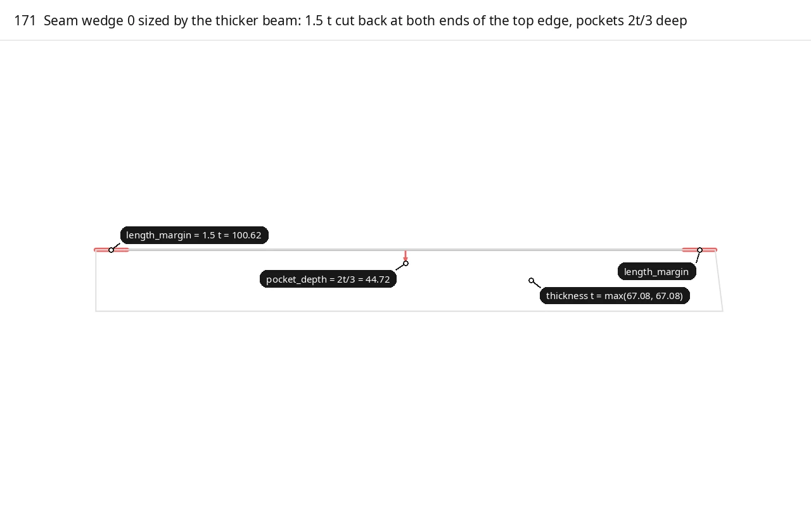

For a seam_wedge or oculus_wedge row, `connector_of` takes `thickness = max(members.thickness(row.a), members.thickness(row.b))` and calls `JointBeam::wedge(*pair[0], *pair[1], contact, 1.5 * thickness, 2 * thickness / 3, row.end)`. So the wedge stops 1.5 thicknesses short of each end of the contact's top edge, and its pockets are two thirds of a thickness deep. Every other wedge argument keeps its default. `members.thickness` is `outline_thickness`, the distance between the area centroids of the member outline's two loops. For a seam beam that is 67.08, not the 60 mm beam thickness, because the two loops' centroids are also offset along the beam. The screw module repeats the 1.5 factor as `WEDGE_MARGIN` (floor_screws.cpp:19).

| Variable | Value | Meaning |
|---|---|---|
| `thickness` | seam 67.082; oculus 68.656 | The larger of the two member thicknesses |
| `length_margin` | seam 100.62; oculus 102.98 | `1.5 * thickness`, cut back at both ends |
| `pocket_depth` | seam 44.72; oculus 45.77 | `2 * thickness / 3` |

Code: `connector_of`, src/templates/floor/floor_models.cpp:320-323.

## 172. Wedge frame

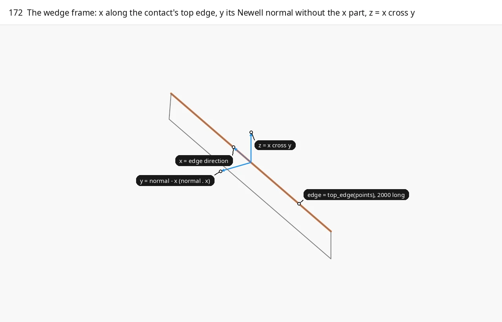

`points = merge_collinear(contact.polygon)` drops the closing point and every corner collinear with its neighbours. `top_edge(points)` returns the longest edge whose midpoint is at or above the mean height of the corners, start to end in the polygon's winding; when no edge qualifies it takes the longest edge. `normal` is the Newell normal of `points`. The frame is `x` along the edge, `y = normal - x (normal . x)` normalized, and `z = x cross y`. On seam 0 the contact is inner beam 0's loop on the seam plane x = 0, so the frame is axis-aligned.

| Variable | Value | Meaning |
|---|---|---|
| `edge` | (0, -3000, 3500) to (0, -1000, 3500), 2000 long | The contact's top edge |
| `normal` | (-1, 0, 0) | Newell normal of the contact |
| `axes` | x (0, 1, 0), y (-1, 0, 0), z (0, 0, 1) | The wedge frame |

Code: `JointBeam::wedge`, `merge_collinear`, `top_edge`, src/joinery_solver/wood_elements/wood_element_joint_beam.cpp:57-123, 216-221.

## 173. Wedge stations onto the end plane

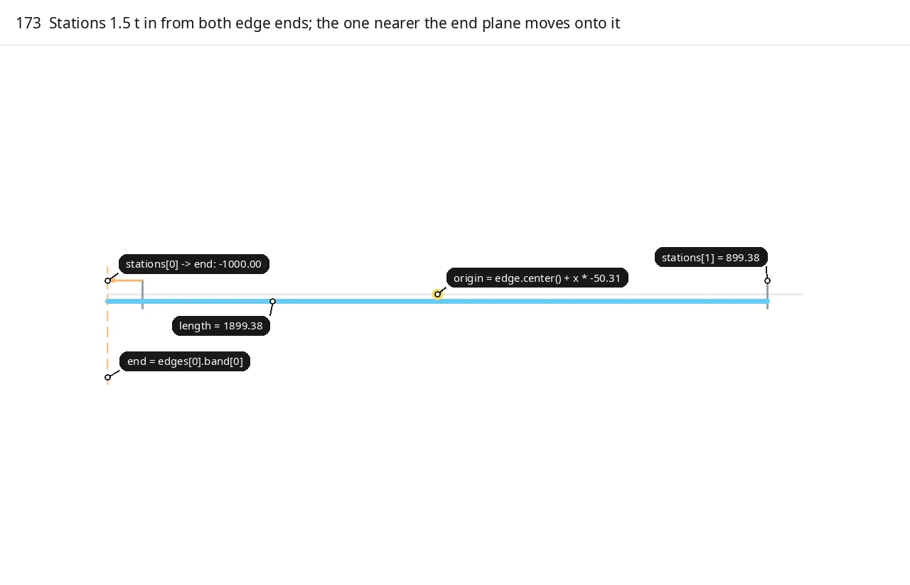

The two stations are positions along `x` measured from `edge.center()`: `{-L/2 + length_margin, L/2 - length_margin}` with L the edge length. When an end plane is given, the line from `edge.center()` along `x` is intersected with it (`Intersection::line_plane`), and the station nearer the hit is replaced by it. The seam wedges get `row.end = edges[q].band[0]`, the bay's outer face, because the seam beams run through the rib band; the oculus wedges get no end plane. Then `origin = edge.center() + x * mean(stations)`, and `length = stations[1] - stations[0]` with an end plane, else `edge.length() - 2 * length_margin`, at least 1e-6 in both cases.

| Variable | Value | Meaning |
|---|---|---|
| `end` | seam: `edges[q].band[0]`; oculus: none | The plane the nearer end lands on |
| `stations` | seam [-1000 (on the end plane), 899.38]; oculus [-519.27, 519.27] | Wedge end positions along x from the edge centre |
| `origin` | seam 0: (0, -2050.31, 3500) | Wedge centre on the top edge |
| `length` | seam 1899.38 (y -3000 to -1100.62); oculus 1038.54 | Wedge length |

Code: `JointBeam::wedge`, src/joinery_solver/wood_elements/wood_element_joint_beam.cpp:222-236.

## 174. Wedge profile clipped flush

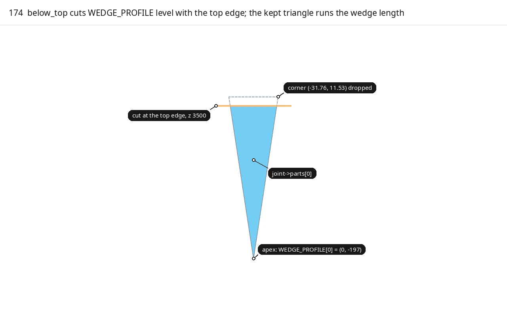

`WEDGE_PROFILE` is a triangle in the frame's (y, z) plane: the apex (0, -197) and the top corners (-31.75593, 11.530606) and (31.75593, 11.530606), so its corners stand 11.53 above the top edge. `below_top` measures each corner's height from the origin as `y * axes[1].z + z * axes[2].z`, keeps the corners at or below 0, and adds the point where each side crosses 0. This is a horizontal cut at the level of the top edge, also when the frame is tilted. The two top corners are replaced by the crossings at y = -30 and 30, so the kept triangle is 60 wide at the top. `frame_point` places the kept corners at frame x = -length/2 and +length/2, and the single part is that loop pair: a straight prism.

| Variable | Value | Meaning |
|---|---|---|
| `profile` | `WEDGE_PROFILE` | Cross-section in frame (y, z) |
| `joint->parts[0]` | seam: triangle 60 wide at z 3500, apex z 3303, y -3000 to -1100.62 | The wedge prism, its two end loops |

Code: `below_top`, `JointBeam::wedge`, src/joinery_solver/wood_elements/wood_element_joint_beam.cpp:156-174, 243-250; `WEDGE_PROFILE`, wood_element_joint_beam.h:15.

## 175. Wedge dowels

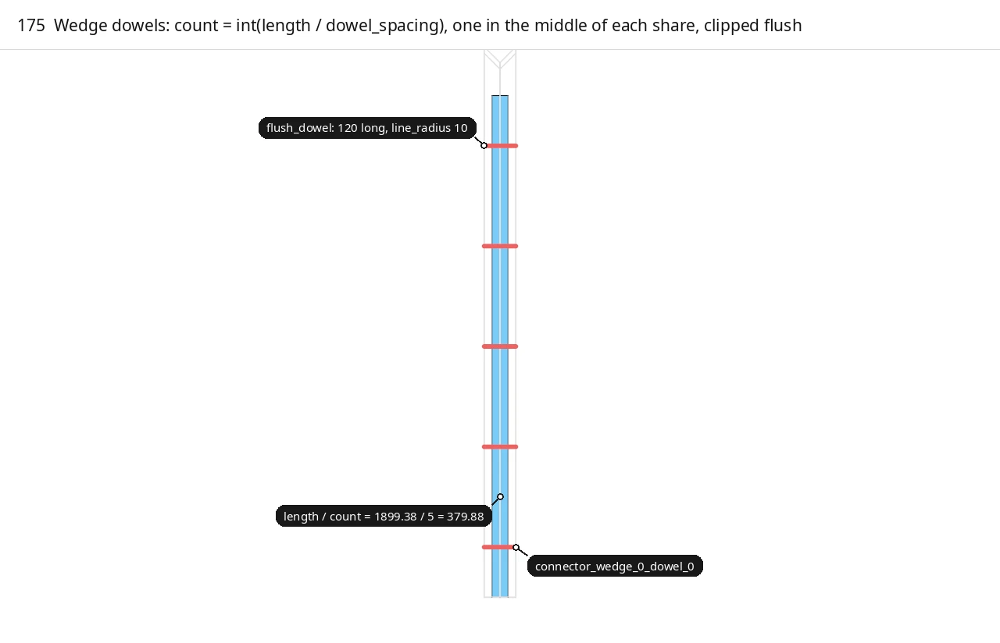

`count = max(int(length / dowel_spacing), 1)`, and dowel i sits at station `-length/2 + (i + 0.5) * length / count`, the middle of its share. At each station the two frame points (station, -dowel_offset[0], dowel_offset[1]) and (station, +dowel_offset[0], dowel_offset[1]) give a direction, which is made horizontal (`flat`). A line `dowel_offset[0]` long on each side of their midpoint is clipped by `flush_dowel`: it runs from where its axis first enters member a or b to where it last leaves one, read from `inside_stretches` of their `element_geometry_mesh()`. On seam 0 that takes the 160 mm line to 120 mm, x +60 to -60.

| Variable | Value | Meaning |
|---|---|---|
| `dowel_spacing` | 320 | Sets `count` |
| `count` | seam 5; oculus 3 | Number of dowels |
| `length / count` | 379.88 | Spacing of the dowels |
| `dowel_offset` | {80, -100} | Half length before the clip; depth below the top edge in frame z |
| `joint->drill_lines` | seam 0: y -2810.06, -2430.19, -2050.31, -1670.44, -1290.56 at z 3400, x +60 to -60 | The dowel axes |
| `dowel_radius` | 10 | Stored as `line_radius`: d20 |
| `dowel_sides` | 8 | Facets: `chord_tolerance = sides_tolerance(10, 8)` = 0.7612 |
| `overshoot` | 20 | Stored as `drill_overshoot`: hole run-on where a dowel leaves a target |

Code: `JointBeam::wedge`, `flush_dowel`, `sides_tolerance`, src/joinery_solver/wood_elements/wood_element_joint_beam.cpp:131-153, 252-265.

## 176. Wedge pockets

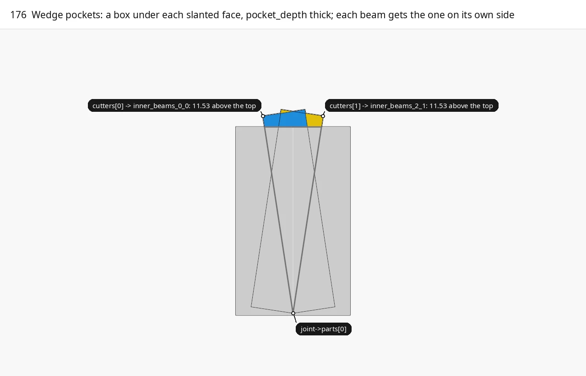

`wedge_pocket(p0, p1)` takes the unclipped profile side from the apex to one top corner. Its face rectangle spans the wedge length by the side's slant length (210.93). The side's normal is turned away from the profile's middle, and the deep loop is the face moved `pocket_depth` against that normal, toward and past the middle, so the box crosses the contact plane. Because the box uses the unclipped corners, it stands 11.53 above the top. `pockets[0]` lies under apex to `profile[1]`, `pockets[1]` under apex to `profile[2]`. For a and then b, a member whose `model_geometry_mesh()` centroid lies on the positive side of the contact normal gets `pockets[1]`, otherwise `pockets[0]`: one cutter list per target, in `targets` order. On seam 0 the normal is (-1, 0, 0) and a, inner_beams_0_0, lies at x < 0, so a gets `pockets[1]` and b gets `pockets[0]`.

| Variable | Value | Meaning |
|---|---|---|
| `pocket_depth` | 44.72 (seam) | Box thickness normal to the slanted face |
| `joint->targets` | {inner_beams_0_0, inner_beams_2_1} | {a.guid, b.guid} |
| `joint->cutters[0]` | inner_beams_0_0: face x -31.76 at z 3511.53 to 0 at z 3303, deep side x +12.46 to +44.21 | The box under the world x < 0 face |
| `joint->cutters[1]` | inner_beams_2_1: the mirror box | The box under the world x > 0 face |

Code: `wedge_pocket`, `JointBeam::wedge`, src/joinery_solver/wood_elements/wood_element_joint_beam.cpp:177-211, 267-277.

## 177. Oculus wedge (example 6)

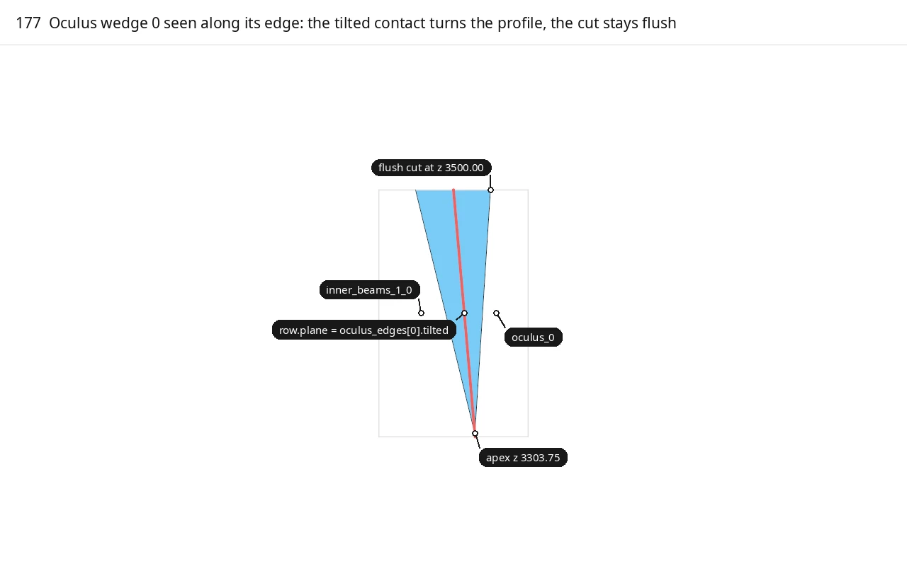

For quarter q the oculus_wedge row has a = inner beam 1 of q and b = ring beam q. Its plane is `oculus_edges[q].tilted`, lifted, and its contact is beam 1's bottom loop on that plane, lifted; it has no end plane. The wedge factory runs as in sections 172 to 176. The contact normal leans by `oculus_plane_angle`, so the frame's y and z tilt and the profile turns with them. `below_top` still cuts it horizontally at the top edge's level, flush at 3500, and the apex ends at 3303.75 instead of 3303. The dowels stay horizontal through the `flat` projection. The picture is turned about a vertical axis so the view looks along oculus edge 0. Example 6 (`templates_floor_6_contacts_floor`) adds only these eight wedges; its description says red, but the code paints connectors `CONNECTOR_COLOR`, brg_blue.

| Variable | Value | Meaning |
|---|---|---|
| `oculus_plane_angle` | 5 degrees | Tilts the contact and so the frame |
| `row.plane` | origin (-500, -500, 3500), normal (-0.7044, -0.7044, -0.0872) | The tilted bearing plane |
| `row.contact` | (-60, -940, 3500), (-940, -60, 3500), (-915.4, -60, 3301.22), (-60, -915.4, 3301.22) | Oculus beam face |
| `connector_wedge_4` | length 1038.54, 3 dowels, targets {inner_beams_1_0, oculus_0} | Quarter 0's oculus wedge |
| `Floor::connectors` (example 6) | 8 | 4 seam wedges and 4 oculus wedges |

Code: `oculus_wedge`, src/templates/floor/floor_relations.cpp:75-88; `connector_of`, src/templates/floor/floor_models.cpp:320-323; examples/templates_floor_6_contacts_floor.cpp:10-13.

## 178. Plate frame

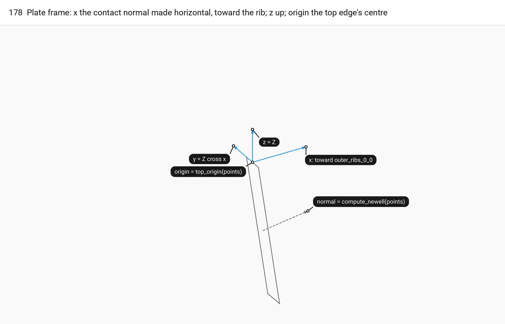

`connector_of` calls `rectangle_plate(column, rib, contact, members.thickness(row.b))`, so the dowel length is the rib's thickness. `rectangle_plate` takes the raw contact points without the closing point, with no `merge_collinear`, and computes their Newell normal. `x` is that normal with its z set to 0; if that vanishes it is `inward`, the direction from the contact centroid to the rib's mesh centroid with z set to 0. `x` is normalized and flipped if it points away from `inward`. Then `y = Z cross x` and `z` is world Z. The origin is `top_origin(points)`: the centre of the bounding box of the corners within max(1, 0.02 * height) of the contact's top.

| Variable | Value | Meaning |
|---|---|---|
| `axes` | rib 0: x (1, 0, 0), y (0, 1, 0), z (0, 0, 1) | Plate frame |
| `origin` | (-2780, -2950, 3500) | Centre of the contact's top edge |
| `dowel_length` | 100 | `members.thickness(row.b)` |

Code: `JointBeam::rectangle_plate`, `top_origin`, src/joinery_solver/wood_elements/wood_element_joint_beam.cpp:283-305, 321-344; `connector_of`, src/templates/floor/floor_models.cpp:325-326.

## 179. Plate part and pocket

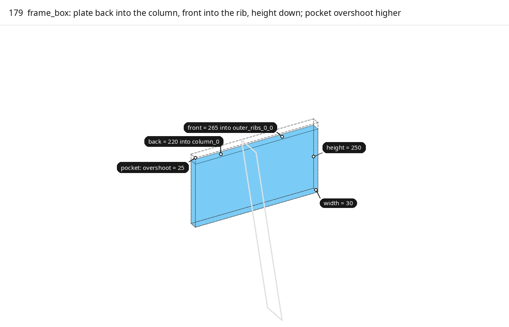

`frame_box(origin, axes, x0, x1, width, z0, z1)` builds a box from x0 to x1 and z0 to z1 in the frame, `width` wide across y, as the loop pair at y = -width/2 and +width/2. The part is `frame_box(-back, front, width, -height, 0)`: back into the column, front into the rib, hanging `height` below the top edge. The cutter is the same box with z1 = `overshoot`, so it rises above the top. Both targets get that one box, `{{pocket}, {pocket}}`, so the column and the rib get identical slots.

| Variable | Value | Meaning |
|---|---|---|
| `width` | 30 | Plate thickness |
| `back` | 220 | Into the column |
| `front` | 265 | Into the rib |
| `height` | 250 | Depth below the top edge |
| `overshoot` | 25 | The pocket rises this far above the top |
| `joint->parts[0]` | connector_0: x -3000 to -2515, y -2965 to -2935, z 3250 to 3500 | The steel plate box |
| `joint->cutters` | the same box up to z 3525, for both targets | `{{pocket}, {pocket}}` |
| `joint->targets` | {column_0, outer_ribs_0_0} | {column, rib} |

Code: `frame_box`, `JointBeam::rectangle_plate`, src/joinery_solver/wood_elements/wood_element_joint_beam.cpp:308-318, 346-353.

## 180. Plate dowels

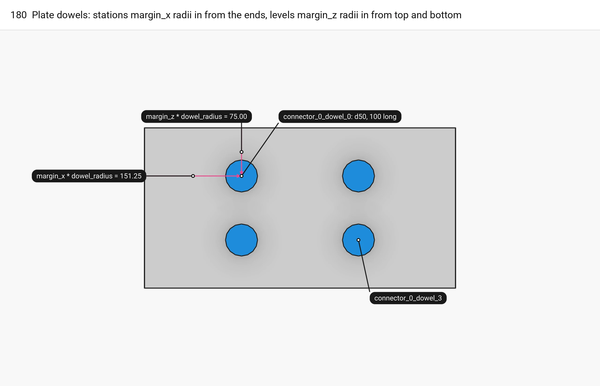

The dowel stations along x are `-back + margin_x * dowel_radius` and `front - margin_x * dowel_radius`; the levels are `-margin_z * dowel_radius` and `-height + margin_z * dowel_radius`. At each of the four combinations a line across frame y from `-dowel_length/2` to `+dowel_length/2` is clipped by `flush_dowel` to the column and the rib. The dowels are numbered station by station: 0 and 1 at the column end, 2 and 3 at the rib end.

| Variable | Value | Meaning |
|---|---|---|
| `dowel_radius` | 25 | Stored as `line_radius`: d50 |
| `margin_x` | 6.05 | Radii in from the plate ends: 151.25 |
| `margin_z` | 3.0 | Radii in from top and bottom: 75 |
| `dowel_sides` | 16 | Facets of `chord_tolerance` |
| `joint->drill_lines` | connector_0: x -2848.75 and -2666.25, z 3425 and 3325, y -3000 to -2900 (100) | Four dowel axes |
| `drill_overshoot` | 25 | Hole run-on |

Code: `JointBeam::rectangle_plate`, `flush_dowel`, src/joinery_solver/wood_elements/wood_element_joint_beam.cpp:355-363.

## 181. plates_of_corner

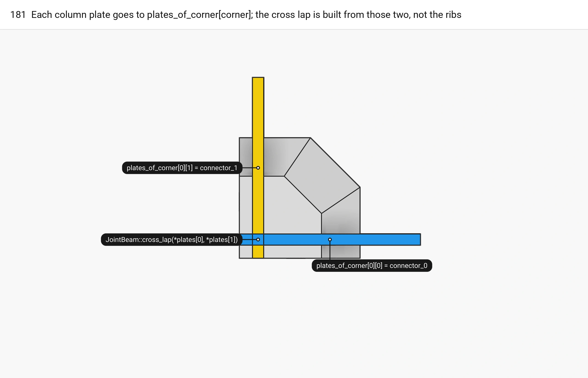

After each column_plate connector is named, added and appended, it is pushed to `plates_of_corner[row.seam_or_corner]`. A cross_lap row has a = outer rib 0 and b = outer rib 1 of corner q, the default plane and an empty contact, and it does not go through `connector_of`. `add_connectors` reads `plates_of_corner[q]`, throws unless it holds exactly two plates, and calls `JointBeam::cross_lap(*plates[0], *plates[1])`. Its targets are the two plate connectors, not the ribs. `plates_of_corner` is local to one call, so column_plate and cross_lap must be asked for in the same `add_connectors` call; `relationships()` lists the plates before the laps.

| Variable | Value | Meaning |
|---|---|---|
| `plates_of_corner[0]` | {connector_0, connector_1} | The plates on rib 0 and rib 1 of corner 0 |

Code: `wood_floor::add_connectors`, src/templates/floor/floor_models.cpp:358-374; `cross_lap`, src/templates/floor/floor_relations.cpp:109-118.

## 182. Cross lap frames and lap level

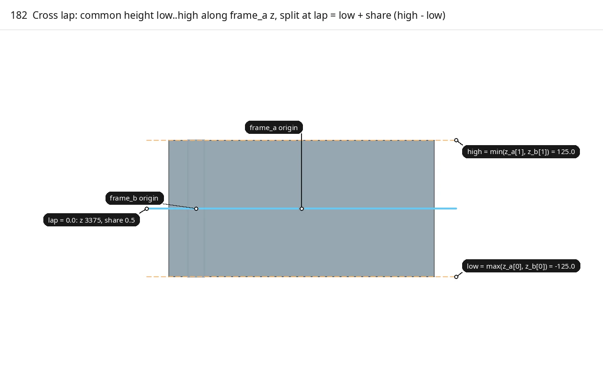

`cross_lap` throws unless each connector has exactly one part. `box_frame(part)` needs two four-corner loops; its origin is the centroid of the eight corners, x is `near[1] - near[0]`, z is `near[3] - near[0]`, and y runs from the first loop's centroid to the second's. For loops made by `frame_box` these are the plate's own frame axes. `z_a` and `z_b` are the extents of each plate's corners along frame_a's z. `low` is the larger lower end and `high` the smaller upper end; it throws if `high <= low`. `lap = low + share * (high - low)`.

| Variable | Value | Meaning |
|---|---|---|
| `frame_a` | origin (-2757.5, -2950, 3375), x +X, y +Y, z +Z | Plate on rib 0 |
| `frame_b` | origin (-2950, -2757.5, 3375), x +Y, y -X, z +Z | Plate on rib 1 |
| `low`, `high` | -125, 125 | The common height in frame_a z: world z 3250 to 3500 |
| `share` | 0.5 | Where the lap splits the common height |
| `lap` | 0 (world z 3375) | The split level in frame_a z |

Code: `JointBeam::cross_lap`, `box_frame`, `extent`, `box_corners`, src/joinery_solver/wood_elements/wood_element_joint_beam.cpp:531-572, 575-593.

## 183. Cross lap slots

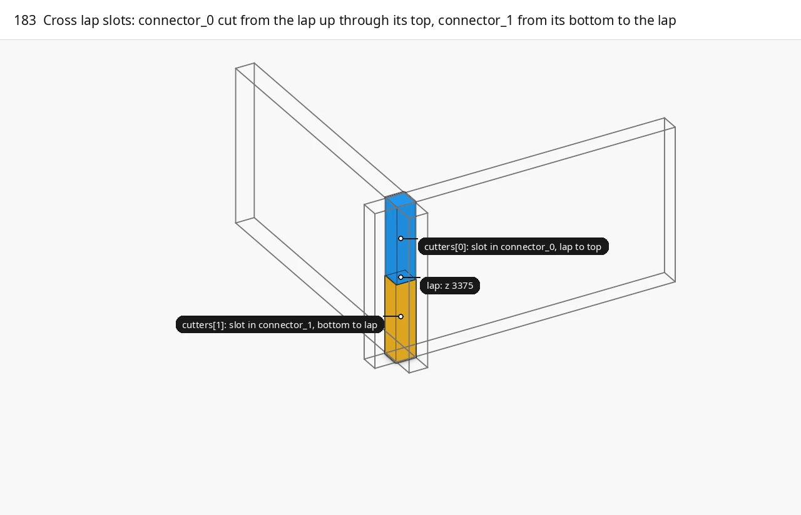

`across_a` is the extent of b's corners along frame_a x, where b passes through a, and `across_b` the reverse. Each slot width is the part's own thickness, twice its largest extent along its own y, plus `2 * margin`. a's cutter is `frame_box(frame_a, across_a, width_a, lap, z_a[1] + margin)`: from the lap level up through the top. b's cutter is `frame_box(frame_b, across_b, width_b, z_b_own[0] - margin, lap_b)`: from below the bottom up to the lap, where `lap_b` is `lap` re-expressed in frame_b. The joint has no parts and no drill lines, and `drill_overshoot` stays 0. `cross_lap` never sets `is_visible`, so it keeps the `Joint()` default, false.

| Variable | Value | Meaning |
|---|---|---|
| `margin` | 1.0 | Slot clearance and run-through |
| `cutters[0]` | x -2965 to -2935, y -2966 to -2934 (32 wide), z 3375 to 3501 | Slot in connector_0 |
| `cutters[1]` | y -2965 to -2935, x -2966 to -2934, z 3249 to 3375 | Slot in connector_1 |
| `targets` | {connector_0, connector_1} | The two plate connectors |

Code: `JointBeam::cross_lap`, src/joinery_solver/wood_elements/wood_element_joint_beam.cpp:594-610; `Joint::Joint`, wood_element_joint.cpp:10-12.

## 184. Tie frame

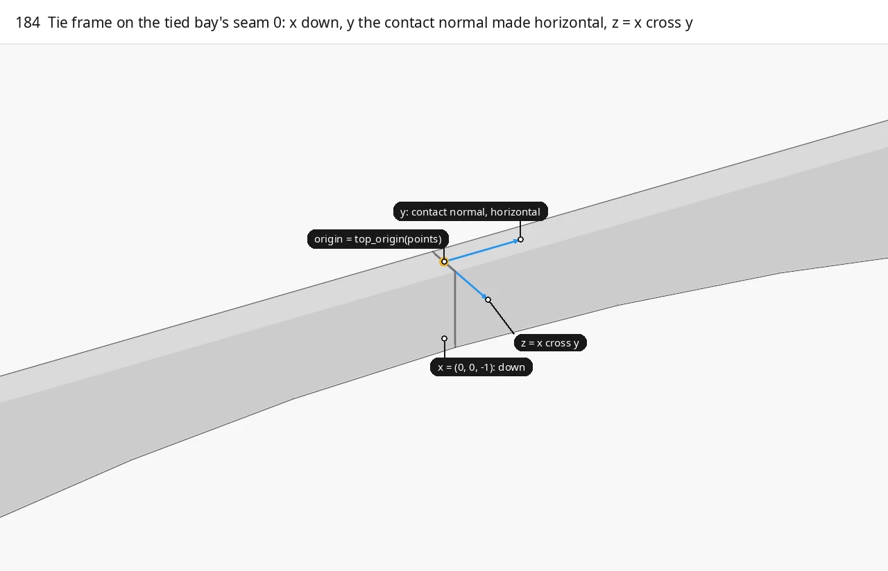

A seam_tie row exists only when `seam_through_ribs` is false: outer rib 0 of q and outer rib 1 of q + 1 then meet end to end on the seam plane. The frames use the tied 3000 x 2400 bay of the film, whose seam 0 meets edge 0 at y = -2400, so its y values are 600 larger than the square-bay values in the tables. `connector_of` calls `tie(a, b, contact)` with every default. `tie` takes the raw contact points without the closing point. The frame is x = (0, 0, -1), down; y = the contact's Newell normal made horizontal, across the seam; z = x cross y, across the rib. The contact winds counter-clockwise seen from +x, so y = +X, opposite to `row.plane`'s normal. `origin = top_origin(points)`, `half = length/2` and `neck = half - head_length`.

| Variable | Value | Meaning |
|---|---|---|
| `axes` | x (0, 0, -1), y (1, 0, 0), z (0, -1, 0) | Tie frame |
| `origin` | (0, -2950, 3500) on the square with `seam_through_ribs` false; (0, -2350, 3500) on the tied bay | Top-edge centre of the contact |
| `length` | 800 | Key length across the seam |
| `head_length` | 200 | Each head |
| `half`, `neck` | 400, 200 | Half length and neck end |

Code: `JointBeam::tie`, `top_origin`, src/joinery_solver/wood_elements/wood_element_joint_beam.cpp:374-392; `connector_of`, src/templates/floor/floor_models.cpp:328-329; `seam_tie`, src/templates/floor/floor_relations.cpp:121-138.

## 185. Tie key

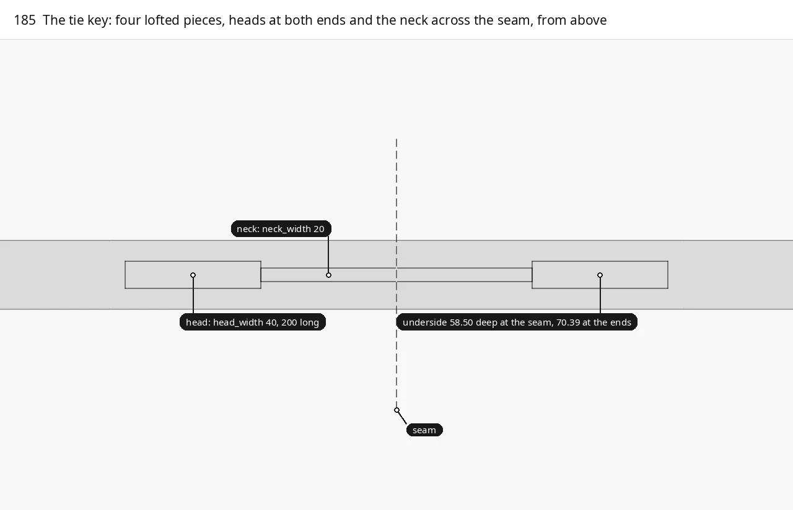

The key has four pieces along frame y: a head over [-half, -neck] `head_width` wide, the neck over [-neck, 0] and [0, neck] `neck_width` wide, and a head over [neck, half]. Each piece is lofted between two `tie_section` rectangles. A section reaches from `top` down (frame x) to `top + depth + (end_depth - depth) * |y| / half`, and its width runs across frame z. So the key's underside deepens linearly from `depth` at the seam to `end_depth` at its two ends, while its top stays flat, `top` below the contact's top edge.

| Variable | Value | Meaning |
|---|---|---|
| `top` | 138.5 | Key top below the edge: z 3361.5 |
| `head_width` | 40 | Head width across frame z |
| `neck_width` | 20 | Neck width across frame z |
| `depth` | 58.5 | Key depth at the seam: bottom z 3303 |
| `end_depth` | 58.5 + 302 / 25.4 = 70.39 | Key depth at the ends: bottom z 3291.11 |
| `joint->parts` | 4 loop pairs | Heads world y -2970 to -2930, neck -2960 to -2940 (square bay) |

Code: `tie_section`, `JointBeam::tie`, src/joinery_solver/wood_elements/wood_element_joint_beam.cpp:369-371, 394-400.

## 186. Tie pockets

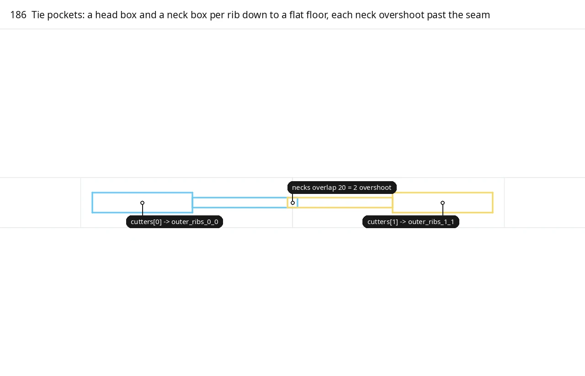

The pocket floor is `top + pocket_depth`, flat. The negative set is a head box over [-half, -neck] and a neck box over [-neck, +overshoot]; the positive set is [neck, half] and [-overshoot, neck]. All boxes run from `top` down to the floor. A member whose `model_geometry_mesh()` centroid lies on the -y side of the origin gets the negative set, otherwise the positive set. Each neck pocket therefore runs `overshoot` past the seam into the other member's side, and the two neck pockets overlap by `2 * overshoot`.

| Variable | Value | Meaning |
|---|---|---|
| `pocket_depth` | 80 | Flat floor below `top`: z 3281.5 |
| `overshoot` | 10 | Neck pocket run past the seam |
| `joint->cutters` | outer_ribs_0_0: head -400 to -200 and neck -200 to +10 along frame y | Two boxes per target |

Code: `JointBeam::tie`, src/joinery_solver/wood_elements/wood_element_joint_beam.cpp:402-416.

## 187. Dowels: frame and inset

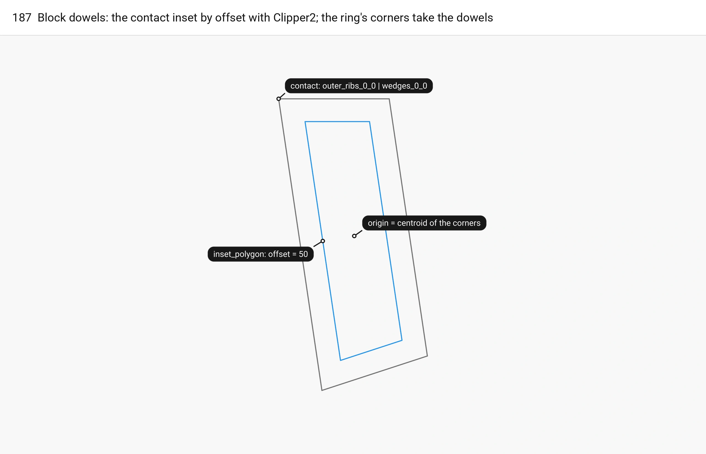

A block_dowels row joins a rib (a) and a wedge block (b) on the rib's face plane; the contact is the block's face on it. `JointBeam::dowels` takes `points = merge_collinear(contact.polygon)` and `origin` = their centroid. The normal is the Newell normal, flipped to point toward b's mesh centroid, the block. x is the `top_edge` direction and y = normal cross x. `inset_polygon` expresses the points in (x, y) on a 1/1000 mm grid, shrinks them by `offset` with Clipper2 `InflatePaths` (miter join) and keeps the largest ring. A ring of fewer than 3 points makes `dowels()` return null, and `connector_of` then throws "the inset leaves no room for the dowels of ...".

| Variable | Value | Meaning |
|---|---|---|
| `offset` | 50 | Inset from the contact edges |
| `normal` | outer rib 0 block: (0, 1, 0) | Toward the block |
| `ring` | 4 corners, 50 inside each edge | The inset contact in frame coordinates |

Code: `JointBeam::dowels`, `inset_polygon`, src/joinery_solver/wood_elements/wood_element_joint_beam.cpp:419-441, 467-481; `connector_of`, src/templates/floor/floor_models.cpp:340-345.

## 188. Dowels: axes at the inset corners

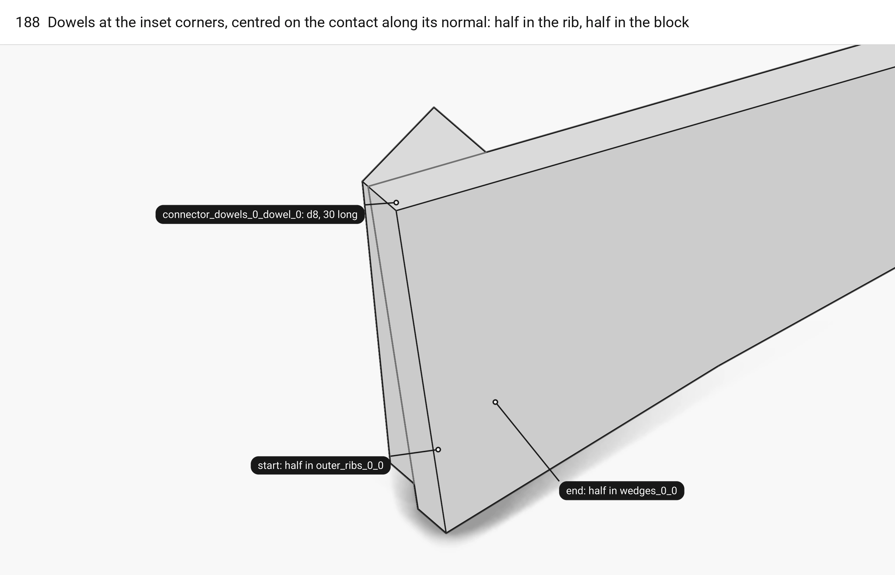

`extreme_corners` keeps every corner of a ring of 4 or fewer points; for a longer ring it takes, for each diagonal (-,-), (+,-), (+,+), (-,+), the untaken corner that reaches furthest along it. At each corner a dowel line `length` long is centred on the contact along the normal, so half of it goes into a and half into b. The cutters are `{{}, {}}`: no solid cutter, only holes. In the picture the rib and the block are drawn as their outline edges and the contact dark, so the dowels show crossing it: each starts in the rib and ends in the block.

| Variable | Value | Meaning |
|---|---|---|
| `radius` | 4 | d8 |
| `length` | 30 | 15 into each member |
| `overshoot` | 10 | Hole run-on |
| `dowel_sides` | 16 | Facets |
| `joint->drill_lines` | connector_dowels_0: (x, z) (-2722.04, 3450), (-2644.26, 2925.33), (-2509.27, 2969.47), (-2580.51, 3450), y -2915 to -2885 | Four dowels |

Code: `extreme_corners`, `JointBeam::dowels`, src/joinery_solver/wood_elements/wood_element_joint_beam.cpp:444-464, 483-499.

## 189. Screws factory

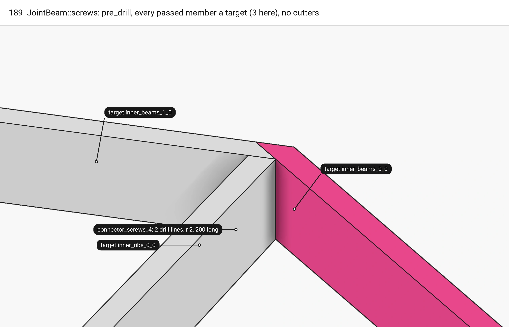

This branch runs for a row that carries screw axes, which only the `SCREW_RELATIONS` rows that `add_screws()` asks for do; it is checked after the wedge, plate and tie kinds. `connector_of` first resolves `members.pair(row)` and builds an `InteractionContactFace` it does not use here. It passes a, b and then `members.get(ref)` for every `row.through` member to `JointBeam::screws(passed, row.screws)`. The factory returns null when there are no lines or fewer than 2 members, and `connector_of` does not check for that. Otherwise it makes a `JointBeam` named "screws" with `is_visible` and `pre_drill` true and every passed member a target, and turns each line into a drill line from its start, the head, along its direction, `length` long. There are no parts, no cutters and no `drill_overshoot`. A rib_corner row adds its seam beam to `through` when a screw head lies in the seam beam end, which gives 3 targets at every default corner; the picture shows quarter 0's first one.

| Variable | Value | Meaning |
|---|---|---|
| `radius` | 2.0 | Screw radius, d4 |
| `length` | 200.0 | Screw length |
| `sides` | 16 | `chord_tolerance = sides_tolerance(2, 16)` |
| `connector_screws_0` | targets {outer_ribs_0_0, inner_beams_0_0}, 2 screws x 0 to -200 at y -2965, z 3480 and 3321.22 | The first screw connector (rib_beam) |
| rib_corner connector | targets {inner_beams_1_q, inner_ribs_k_q, the seam beam} | Three targets |

Code: `connector_of`, src/templates/floor/floor_models.cpp:331-338; `JointBeam::screws`, src/joinery_solver/wood_elements/wood_element_joint_beam.cpp:502-528; `rib_corner`, src/templates/floor/floor_screws.cpp:258-281.

## 190. Naming

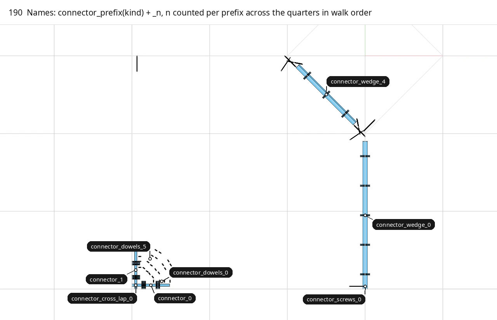

`connector_prefix(kind)` gives the name prefix, and `add_named` overwrites the factory's `joint->name` ("wedge", "rectangle_plate", "cross_lap", "tie", "dowels", "screws") with `<prefix>_<n>`, where n = `by_prefix[prefix].size()`. It does this before `add_connector`, so the nested children inherit the name. The numbering runs across the quarters in `relationships()` order, so the oculus wedges continue after the seam wedges. `by_prefix` lives for one call only: `add_screws()` restarts at 0, and splitting kinds of one prefix across two calls would repeat names.

| Kind | Prefix | Names on the default bay |
|---|---|---|
| seam_wedge | `connector_wedge` | connector_wedge_0 .. 3 |
| oculus_wedge | `connector_wedge` | connector_wedge_4 .. 7 |
| column_plate | `connector` | connector_{2q + k}: connector_0 .. 7 |
| cross_lap | `connector_cross_lap` | connector_cross_lap_0 .. 3 |
| seam_tie | `outer_rib_connector` | none (tied bay: outer_rib_connector_0 .. 3) |
| block_dowels | `connector_dowels` | connector_dowels_{6q + j}: 0 .. 23 |
| the five screw kinds | `connector_screws` | connector_screws_0 .. 35 |

The name plates in this film are placed by docs/floor/render.py, not by the floor code. `place()` solves the point-feature labelling problem: each plate has candidate positions on rings of growing radius in 24 directions around its point; a candidate is allowed only inside the picture and clear of every other plate and every other labelled point; among the allowed ones the plate takes the cheapest by leader length, the drawing it covers and the leaders it crosses. Centred plates go first, then the most crowded labels; then every label is placed again against all the others, for up to six passes, until nothing moves. A label with no allowed place, or two labels whose points are less than 14 px apart, fails the render.

Code: `connector_prefix`, `add_named`, src/templates/floor/floor_models.cpp:92-97, 289-307, 370.

## 191. connectors_q grouping

`connector_group` is evaluated as an argument of `add_named`. It returns `group_named(quarter_group(members.group, row.seam_or_corner), "connectors_<q>")` and makes both groups the first time. A `Floor` adds its members with `members.group` null, so the quarter groups sit at the tree root. A seam wedge or tie of seam q joins quarters q and q + 1 but goes under quarter_q; the screws go under the same connectors_q.

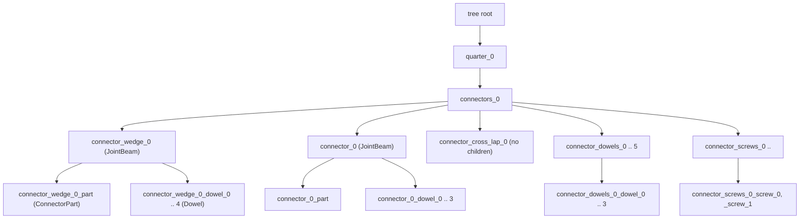
```mermaid
graph TD
    root["tree root"] --> q0["quarter_0"]
    q0 --> c0["connectors_0"]
    c0 --> w0["connector_wedge_0 (JointBeam)"]
    w0 --> w0p["connector_wedge_0_part (ConnectorPart)"]
    w0 --> w0d["connector_wedge_0_dowel_0 .. 4 (Dowel)"]
    c0 --> p0["connector_0 (JointBeam)"]
    p0 --> p0p["connector_0_part"]
    p0 --> p0d["connector_0_dowel_0 .. 3"]
    c0 --> x0["connector_cross_lap_0 (no children)"]
    c0 --> d0["connector_dowels_0 .. 5"]
    d0 --> d0d["connector_dowels_0_dowel_0 .. 3"]
    c0 --> s0["connector_screws_0 .."]
    s0 --> s0s["connector_screws_0_screw_0, _screw_1"]
```

| Variable | Value | Meaning |
|---|---|---|
| `group` | quarter_q / connectors_q | The tree node the connector goes under |

Code: `connector_group`, `quarter_group`, `group_named`, src/templates/floor/floor_models.cpp:79-89, 310-312, 370.

## 192. add_connector dispatch

`add_connector` throws on null, adds the connector under the group (`add(connector, group)`) and calls `add_joint(connector)`. `add_joint` does not add an element that is already there. A `JointBeam` that `is_connector()`, one with parts, cutters or `pre_drill`, goes to `add_connector_joint`; the cross lap goes there too, since it has cutters. A `pre_drill` connector branches to `add_pre_drill_joint`. Every other connector runs `nest_children` once, then sections 194 to 197 for each target in `targets` order.

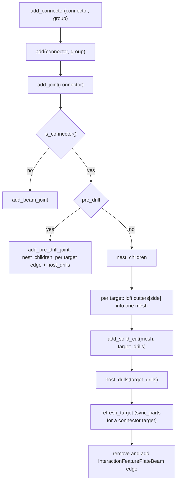
```mermaid
graph TD
    A["add_connector(connector, group)"] --> B["add(connector, group)"]
    B --> C["add_joint(connector)"]
    C --> D{"is_connector()"}
    D -- "no" --> E["add_beam_joint"]
    D -- "yes" --> F{"pre_drill"}
    F -- "yes" --> G["add_pre_drill_joint: nest_children, per target edge + host_drills"]
    F -- "no" --> H["nest_children"]
    H --> I["per target: loft cutters[side] into one mesh"]
    I --> J["add_solid_cut(mesh, target_drills)"]
    J --> K["host_drills(target_drills)"]
    K --> L["refresh_target (sync_parts for a connector target)"]
    L --> M["remove and add InteractionFeaturePlateBeam edge"]
```

| Variable | Value | Meaning |
|---|---|---|
| `node` | the connector's tree node | Returned by `add_connector` for painting |

Code: `WoodSession::add_connector`, `WoodSession::add_joint`, src/joinery_solver/wood_session.cpp:1260-1285; `add_connector_joint`, wood_session.cpp:1112-1139; `JointBeam::is_connector`, wood_element_joint_beam.cpp:616-618.

## 193. nest_children

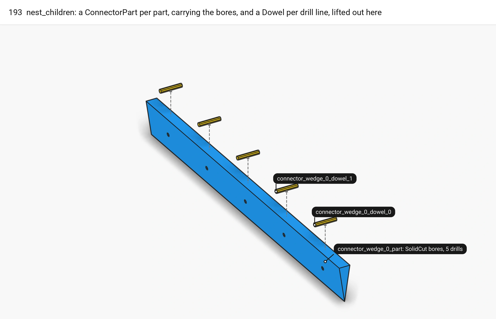

`nest_children` runs once per connector node: it returns if the node already has children. `children()` makes one `ConnectorPart` per part, named `<name>_part`, or `<name>_part_<i>` when there are several. Each part copies its loops, `line_radius` and `chord_tolerance`, and gets `solid_cuts = part_cuts(i)`: the connector's stored `solid_cuts` plus one SolidCut of bores holding every drill line that has an inside stretch in that part's lofted mesh. Then one `Dowel` per drill line follows, named `<name>_dowel_<i>`, or `<name>_screw_<i>` when `pre_drill`. All of them are added under the connector node. In the picture the dowels are lifted out of the wedge.

| Variable | Value | Meaning |
|---|---|---|
| `children` | connector_wedge_0: _part + _dowel_0 .. 4; connector_0: _part + _dowel_0 .. 3; connector_dowels_k: _dowel_0 .. 3; tie: _part_0 .. 3; cross lap: none | ConnectorPart and Dowel nodes |

Code: `nest_children`, src/joinery_solver/wood_session.cpp:1045-1054; `JointBeam::children`, `JointBeam::part_cuts`, wood_element_joint_beam.cpp:624-641, 650-663; `ConnectorPart::ConnectorPart`, wood_element_connector_part.cpp:13-21.

## 194. Cutter solid stored in the target

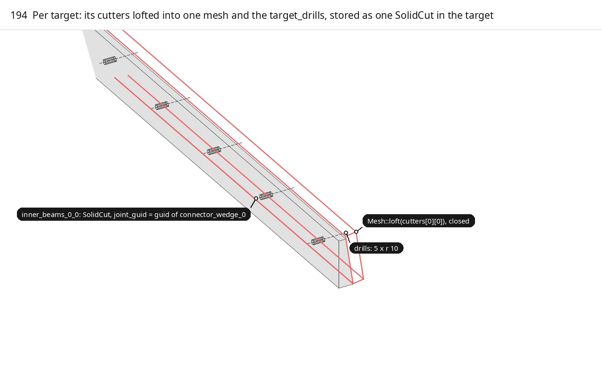

For target side s, every loop pair in `cutters[s]` is lofted closed (`Mesh::loft`) and appended into one mesh; a dowels connector has empty cutter lists, so its mesh is empty and it only drills. `add_solid_cut` builds a SolidCut with that mesh; `add_drills` sets the drill radius and tolerance from the joint, and its drills are then replaced by the `target_drills` of section 195. `store_solid_cut` needs a target that holds solid cuts: a Plate, Beam, Column, BeamVariable, Block, or a `JointBeam` connector, which is how a cross lap cuts the plates. It throws "Missing closed cutter solid" when the mesh is empty and there are no drills, or has faces but is not closed. It sets `joint_guid`, transforms the cut by `inverse(world_xform(target)) * world_xform(joint)` into the target's frame, and replaces a cut with the same `joint_guid`, else appends.

| Variable | Value | Meaning |
|---|---|---|
| `mesh` | wedge 1 box; plate 1 box; cross lap 1 slot; tie 2 boxes; dowels empty | This target's cutter boxes in one mesh |
| target `solid_cuts` | inner_beams_0_0: pocket (6 faces) + 5 drills r 10; outer_ribs_0_0 from connector_dowels_0: 0 faces + 4 drills r 4; connector_0: slot, 0 drills | One difference cut per connector per target |

Code: `add_connector_joint`, src/joinery_solver/wood_session.cpp:1121-1131; `store_solid_cut`, `add_drills`, `add_solid_cut`, wood_session.cpp:1168-1201, 1218-1225; `get_solid_cuts`, wood_session.cpp:43-64.

## 195. target_drills: blind or overshoot

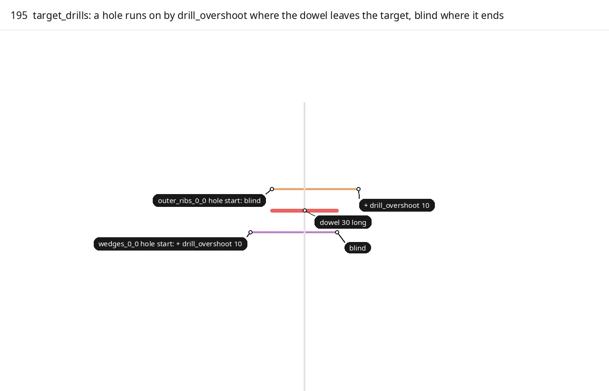

When `drill_overshoot <= 0` the drill lines are returned unchanged; for the cross lap that is an empty list. Otherwise each dowel end is tested 1 mm beyond itself with `is_inside` against `planar_faces` of the target's current `element_geometry_mesh()`. If that point is inside the target, the hole stops at the dowel end, blind; otherwise it runs on by `drill_overshoot`. So each member of a block dowel gets its own hole: the rib's starts blind at the dowel start, inside the rib, and runs on 10 past the dowel's far end, 25 past the contact face into the block; the block's mirrors it.

| Variable | Value | Meaning |
|---|---|---|
| `drill_overshoot` | wedge 20, plate 25, dowels 10, cross lap 0 | Run-on length |
| `drills` on inner_beams_0_0 (connector_wedge_0) | x +80 to -80, both ends run on | Hole axes of a through dowel |
| `drills` on outer_ribs_0_0 (connector_dowels_0) | y -2915 (blind) to -2875 | The rib's hole |
| `drills` on wedges_0_0 (connector_dowels_0) | y -2925 to -2885 (blind) | The block's hole |

Code: `target_drills`, src/joinery_solver/wood_session.cpp:1001-1017.

## 196. host_drills: drill features (wedges_1_0)

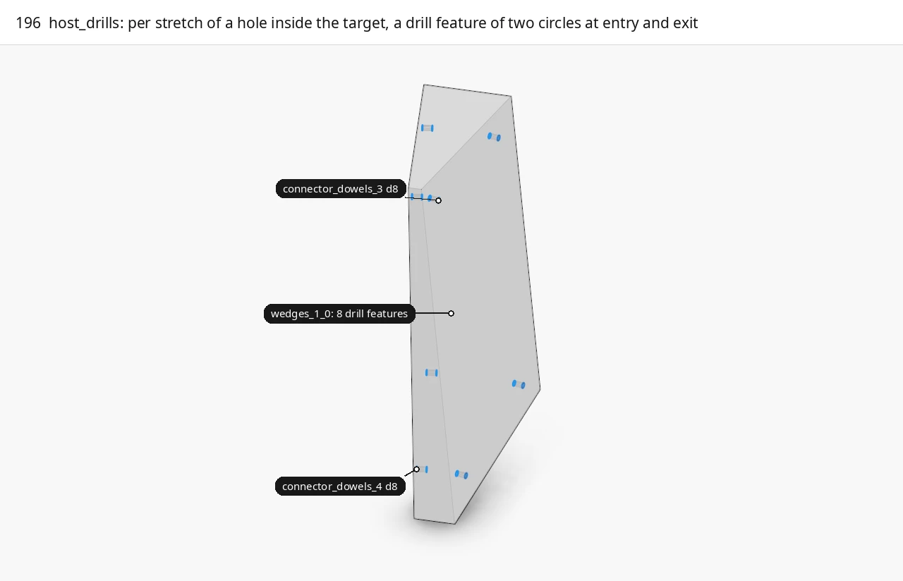

`add_connector_joint` calls `host_drills` with the `target_drills` again. It first drops the target's old "drill" features whose guid starts with this joint's guid. Each line is moved to world by `world_xform(joint)` and intersected with the target's world mesh by `inside_stretches`; each stretch is clipped to [0, line length] and skipped below 1e-6. Each remaining stretch becomes an `ElementFeature` "drill" with two `DRILL_SIDES` circles of the radius at the entry and the exit, normal to the line, named `"<joint.name> d<2r>"`, with guid `<joint guid>/<line i>/<stretch>`. The middle block wedges_1_0 gets 8: four dowels from each of its two block_dowels connectors.

| Variable | Value | Meaning |
|---|---|---|
| `DRILL_SIDES` | 16 | Circle segments |
| drill features | wedges_1_0: 8; connector_wedge_0 d20: 5 on each seam beam; connector_0 d50: 4 on column_0, only dowels 2 and 3 on outer_ribs_0_0 | Entry and exit circles per hole |

Code: `host_drills`, src/joinery_solver/wood_session.cpp:13, 1057-1092, 1134.

## 197. refresh and sync_parts

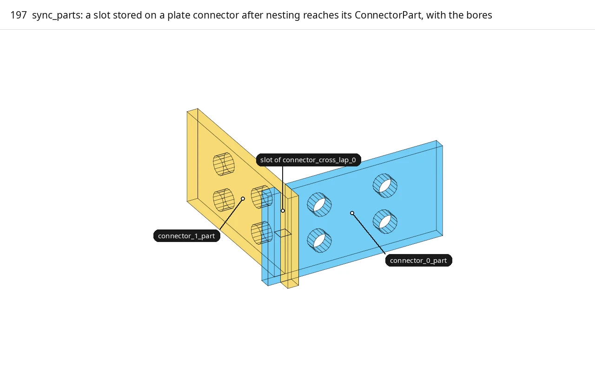

`refresh_target` invalidates the target's cached geometry. When the target is itself a connector, as the cross lap's plates are, `sync_parts` gives each of its `ConnectorPart` children `part_cuts(index)` again. That is how the slot, stored on connector_0 after its part was nested in section 193, reaches the part that draws it. The joint-target edge is then removed and added again as an `InteractionFeaturePlateBeam`. A `pre_drill` connector skips all cutting: `add_pre_drill_joint` nests its screws, sets each edge and hosts drill features from its drill lines unchanged.

| Variable | Value | Meaning |
|---|---|---|
| connector_0_part `solid_cuts` | upper slot z 3375 to 3501 + 4 d50 bores | Slot and dowel bores |
| connector_1_part `solid_cuts` | lower slot z 3249 to 3375 + 4 bores | Slot and dowel bores |

Code: `refresh_target`, `sync_parts`, `add_pre_drill_joint`, src/joinery_solver/wood_session.cpp:1020-1042, 1095-1109, 1135-1137.

## 198. Paint and append

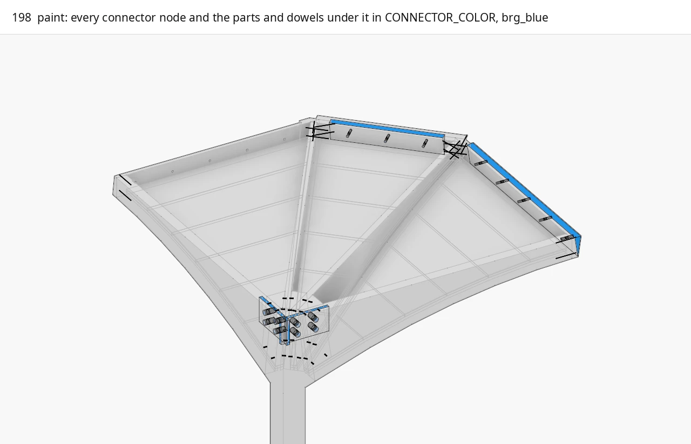

`add_named` passes the node `add_connector` returns to `paint`, which gives it and every descendant, the parts and dowels nested in section 193, `set_node_color(CONNECTOR_COLOR)`. The hidden cross lap node is painted too. The connector is then pushed to `by_prefix[prefix]`, which advances the numbering, and `add_connectors` pushes it to `connectors`; a column plate is finally pushed to `plates_of_corner`.

| Variable | Value | Meaning |
|---|---|---|
| `CONNECTOR_COLOR` | brg_blue, RGB (38, 149, 233) / 255 | Colour of every connector node and its children |

Code: `paint`, `add_named`, src/templates/floor/floor_models.cpp:55-61, 92-97, 370-374; src/templates/floor/floor.h:441.

## 199. The connector node draws nothing

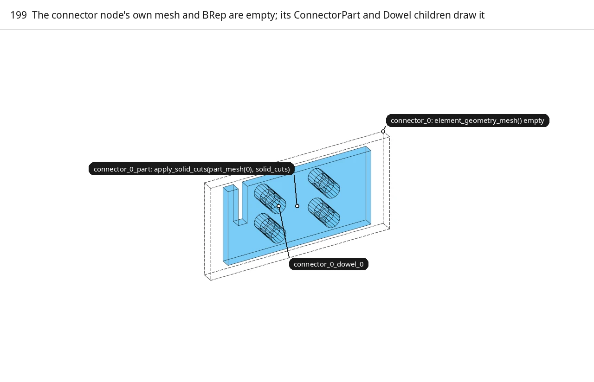

For a connector, `JointBeam::element_geometry_mesh()` and `element_geometry_brep()` return an empty Mesh and an empty BRep, so the connector node itself draws nothing. Each `ConnectorPart` draws `apply_solid_cuts(part_mesh(0), solid_cuts)`: its lofted part minus the bores and any cross-lap slot. Its BRep is `part_brep(0)`: `brep_between_loops` when there are no cuts, else `solid_cuts_brep`. The `Dowel` children draw the drill-line cylinders. The cross lap has no children and shows only through the plates' slots.

| Variable | Value | Meaning |
|---|---|---|
| ConnectorPart mesh | connector_0_part: the 485 x 30 x 250 box minus the upper slot and 4 d50 bores | Lofted part minus its cuts |
| connector mesh | empty | The JointBeam node draws nothing |

Code: `JointBeam::element_geometry_mesh`, `JointBeam::element_geometry_brep`, `JointBeam::part_brep`, src/joinery_solver/wood_elements/wood_element_joint_beam.cpp:643-648, 665-685; `ConnectorPart::element_geometry_mesh`, wood_element_connector_part.cpp:23-37.
