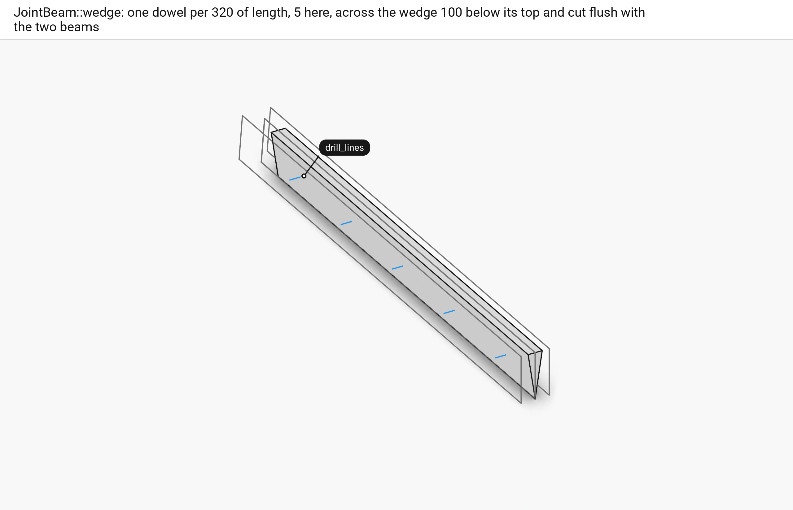
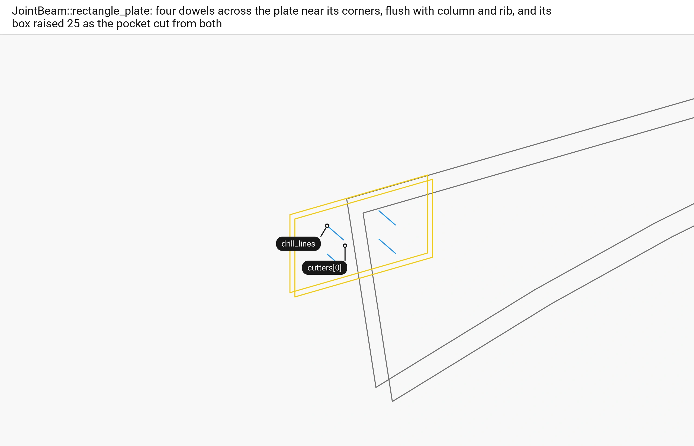
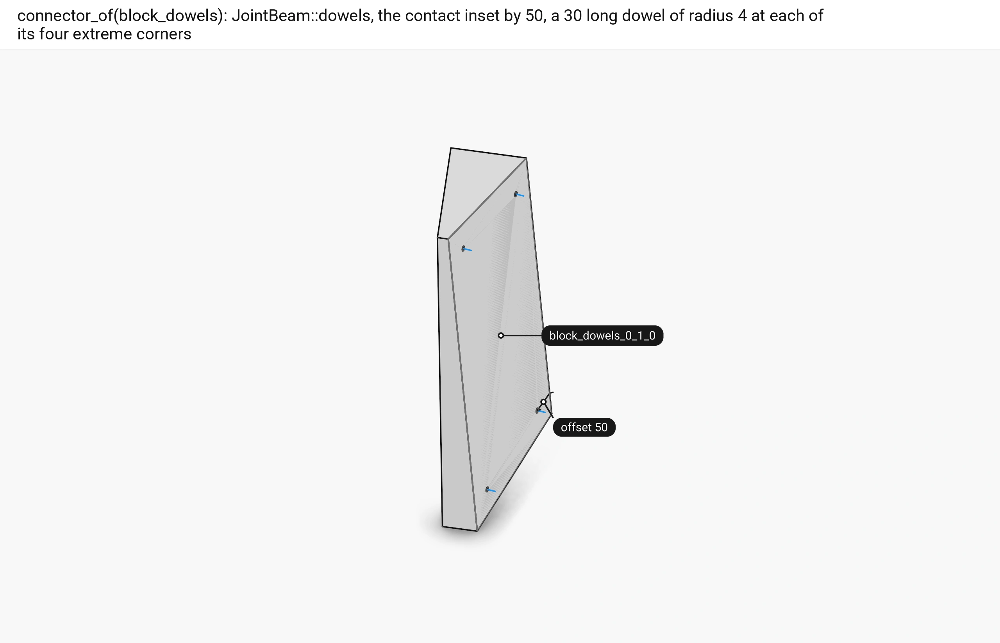
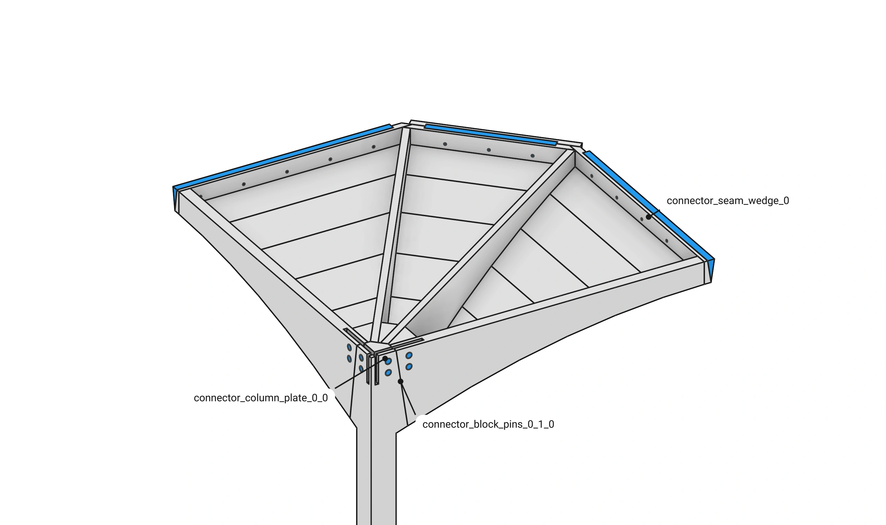

# Floor 9: Connectors {#templates_floor_09_connectors}

[TOC]

<em>Step 9 of @ref templates_floor_model · previous: @ref templates_floor_08_contacts · next: @ref templates_floor_10_screws</em>

`Floor::add_connectors` makes one `JointBeam` connector per contact interaction: a wedge on every seam and oculus contact, a rectangle plate on every column-to-rib contact with a cross lap between the two plates of a column, and four dowels on every block-to-rib contact. Each is added by `add_connector`, which nests its parts and dowels under it and cuts its pockets and holes out of both members.

Example: [templates_floor_7_contacts_cantilevers.cpp](https://github.com/petrasvestartas/wood/blob/5f7f317df711a163eda3c416cb426e5cd8663dd6/examples/templates_floor_7_contacts_cantilevers.cpp) builds every connector.

## 251. add_connectors

■ seam_wedge, block_dowels   ■ oculus_wedge   ■ column_plate   ■ context quarter 0's members, by their loops

`add_connectors` reads every contact interaction from the session's edges, sorts them by kind and name, and builds every connector before it adds any, so a contact that cannot take one throws with nothing added; the place in a contact's name, `block_dowels_0_1_0` for one, gives the quarter and the indices `connector_of` reads.

Code: `Floor::add_connectors`, [floor.cpp:264-304](https://github.com/petrasvestartas/wood/blob/5f7f317df711a163eda3c416cb426e5cd8663dd6/src/templates/floor/floor.cpp#L264-L304).

## 252. The seam wedge's size and end

■ variable `end`, the bay's outer face   ■ context the two seam beams

`connector_of(seam_wedge)` sizes the wedge by the thicker of the two seam beams, `size` (67), and gives it the bay's outer face, `construction_planes(q).outer_ribs[0][0]` lifted to the floor, as its end plane.

Code: `Floor::connector_of`, [floor.cpp:326-330](https://github.com/petrasvestartas/wood/blob/5f7f317df711a163eda3c416cb426e5cd8663dd6/src/templates/floor/floor.cpp#L326-L330); `FloorGuide::thickness`, [floor_guide.cpp:872-874](https://github.com/petrasvestartas/wood/blob/5f7f317df711a163eda3c416cb426e5cd8663dd6/src/templates/floor/floor_guide.cpp#L872-L874).

## 253. The wedge's frame and length

■ input the contact, its `top_edge` dashed and the end plane   ■ variable the two ends of the wedge

`JointBeam::wedge` lays x along the contact's top edge and y along its normal made square to x; it stops `length_margin = 1.5 size` (101) in from both ends of the edge, the end nearer the end plane moved onto it, so the wedge runs out to the bay's outer face.

Code: `JointBeam::wedge`, [wood_element_joint_beam.cpp:216-236](https://github.com/petrasvestartas/wood/blob/5f7f317df711a163eda3c416cb426e5cd8663dd6/src/joinery_solver/wood_elements/wood_element_joint_beam.cpp#L216-L236); `top_edge`, [wood_element_joint_beam.cpp:98-123](https://github.com/petrasvestartas/wood/blob/5f7f317df711a163eda3c416cb426e5cd8663dd6/src/joinery_solver/wood_elements/wood_element_joint_beam.cpp#L98-L123).

## 254. The wedge part

■ built `parts[0]`   ■ variable its `profile`   ■ input the two seam beams' loops, end on

The `WEDGE_PROFILE` triangle, apex 197 below the top edge, is cut level with the edge by `below_top` and swept from end to end: the wedge part.

Code: `JointBeam::wedge`, [wood_element_joint_beam.cpp:238-250](https://github.com/petrasvestartas/wood/blob/5f7f317df711a163eda3c416cb426e5cd8663dd6/src/joinery_solver/wood_elements/wood_element_joint_beam.cpp#L238-L250); `below_top`, [wood_element_joint_beam.cpp:156-174](https://github.com/petrasvestartas/wood/blob/5f7f317df711a163eda3c416cb426e5cd8663dd6/src/joinery_solver/wood_elements/wood_element_joint_beam.cpp#L156-L174); `WEDGE_PROFILE`, [wood_element_joint_beam.h:17](https://github.com/petrasvestartas/wood/blob/5f7f317df711a163eda3c416cb426e5cd8663dd6/src/joinery_solver/wood_elements/wood_element_joint_beam.h#L17).

## 255. The wedge's dowels

■ built `drill_lines`   ■ context the wedge part   ■ input the beams' loops

One dowel of radius 10 for every 320 of length, five here, runs across the wedge 100 below its top, cut by `flush_dowel` to end flush with the two beams.

Code: `JointBeam::wedge`, [wood_element_joint_beam.cpp:252-265](https://github.com/petrasvestartas/wood/blob/5f7f317df711a163eda3c416cb426e5cd8663dd6/src/joinery_solver/wood_elements/wood_element_joint_beam.cpp#L252-L265); `flush_dowel`, [wood_element_joint_beam.cpp:136-153](https://github.com/petrasvestartas/wood/blob/5f7f317df711a163eda3c416cb426e5cd8663dd6/src/joinery_solver/wood_elements/wood_element_joint_beam.cpp#L136-L153).

## 256. The wedge's pockets

■ result `cutters[0]`, `cutters[1]`   ■ context the wedge part   ■ input the beams' loops, end on

Under each slanted face of the wedge `wedge_pocket` makes a box `pocket_depth = 2/3 size` (45) deep, and each beam gets the pocket on its own side.

Code: `JointBeam::wedge`, [wood_element_joint_beam.cpp:267-277](https://github.com/petrasvestartas/wood/blob/5f7f317df711a163eda3c416cb426e5cd8663dd6/src/joinery_solver/wood_elements/wood_element_joint_beam.cpp#L267-L277); `wedge_pocket`, [wood_element_joint_beam.cpp:177-211](https://github.com/petrasvestartas/wood/blob/5f7f317df711a163eda3c416cb426e5cd8663dd6/src/joinery_solver/wood_elements/wood_element_joint_beam.cpp#L177-L211).

## 257. The wedge cut into the beams

■ built the two seam beams, cut

`add_connector` nests the wedge part and its dowels under the connector and cuts the pockets and the dowel holes out of both beams as solid features.

Code: `Floor::add_named_connector`, [floor.cpp:359-367](https://github.com/petrasvestartas/wood/blob/5f7f317df711a163eda3c416cb426e5cd8663dd6/src/templates/floor/floor.cpp#L359-L367); `WoodSession::add_connector`, [wood_session.cpp:1530-1539](https://github.com/petrasvestartas/wood/blob/5f7f317df711a163eda3c416cb426e5cd8663dd6/src/joinery_solver/wood_session.cpp#L1530-L1539); `add_connector_joint`, [wood_session.cpp:1315-1341](https://github.com/petrasvestartas/wood/blob/5f7f317df711a163eda3c416cb426e5cd8663dd6/src/joinery_solver/wood_session.cpp#L1315-L1341).

## 258. The oculus wedge

■ built the wedge part and dowels   ■ context the oculus beam and the ring beam

`connector_of(oculus_wedge)` puts the same wedge on the oculus beam and its ring beam, sized by the thicker of the two, with no end plane, so both ends stop 1.5 size short.

Code: `Floor::connector_of`, [floor.cpp:332-335](https://github.com/petrasvestartas/wood/blob/5f7f317df711a163eda3c416cb426e5cd8663dd6/src/templates/floor/floor.cpp#L332-L335).

## 259. The column plate's frame

■ built `column_plate_0_0`   ■ variable the frame's `x` and `z`   ■ context the column   ■ input the outer rib's loops

`connector_of(column_plate)` calls `JointBeam::rectangle_plate(column, rib, contact, dowel_length)` with the rib's thickness as the dowel length; its frame sits at the middle of the contact's top, x the contact normal made horizontal and turned towards the rib, z up.

Code: `Floor::connector_of`, [floor.cpp:337-338](https://github.com/petrasvestartas/wood/blob/5f7f317df711a163eda3c416cb426e5cd8663dd6/src/templates/floor/floor.cpp#L337-L338); `JointBeam::rectangle_plate`, [wood_element_joint_beam.cpp:321-344](https://github.com/petrasvestartas/wood/blob/5f7f317df711a163eda3c416cb426e5cd8663dd6/src/joinery_solver/wood_elements/wood_element_joint_beam.cpp#L321-L344); `top_origin`, [wood_element_joint_beam.cpp:283-305](https://github.com/petrasvestartas/wood/blob/5f7f317df711a163eda3c416cb426e5cd8663dd6/src/joinery_solver/wood_elements/wood_element_joint_beam.cpp#L283-L305).

## 260. The plate

■ built `parts[0]`   ■ input the outer rib's loops

The plate is a box 220 back into the column and 265 forward into the rib, 30 wide and 250 down from the top.

Code: `JointBeam::rectangle_plate`, [wood_element_joint_beam.cpp:346-350](https://github.com/petrasvestartas/wood/blob/5f7f317df711a163eda3c416cb426e5cd8663dd6/src/joinery_solver/wood_elements/wood_element_joint_beam.cpp#L346-L350); `frame_box`, [wood_element_joint_beam.cpp:308-318](https://github.com/petrasvestartas/wood/blob/5f7f317df711a163eda3c416cb426e5cd8663dd6/src/joinery_solver/wood_elements/wood_element_joint_beam.cpp#L308-L318).

## 261. The plate's dowels and pocket

■ built `drill_lines`   ■ result `cutters[0]`, the pocket   ■ input the outer rib's loops

Four dowels of radius 25 cross the plate near its corners, flush with column and rib, and the plate's box raised 25 above the top is the pocket cut out of both.

Code: `JointBeam::rectangle_plate`, [wood_element_joint_beam.cpp:352-363](https://github.com/petrasvestartas/wood/blob/5f7f317df711a163eda3c416cb426e5cd8663dd6/src/joinery_solver/wood_elements/wood_element_joint_beam.cpp#L352-L363).

## 262. The cross lap

■ a `connector_0_part`   ■ b `connector_1_part`   ■ context the column

The two plates of a column cross inside its head, so `add_connectors` adds `JointBeam::cross_lap(a, b)`, which slots a from the top down and b from the bottom up, each half way, and cuts the slots out of the plate parts.

Code: `Floor::add_connectors`, [floor.cpp:302-308](https://github.com/petrasvestartas/wood/blob/5f7f317df711a163eda3c416cb426e5cd8663dd6/src/templates/floor/floor.cpp#L302-L308); `JointBeam::cross_lap`, [wood_element_joint_beam.cpp:575-610](https://github.com/petrasvestartas/wood/blob/5f7f317df711a163eda3c416cb426e5cd8663dd6/src/joinery_solver/wood_elements/wood_element_joint_beam.cpp#L575-L610).

## 263. The block dowels

■ built `drill_lines`   ■ input the contact `block_dowels_0_1_0`   ■ context the middle column block

`connector_of(block_dowels)` calls `JointBeam::dowels`: the contact polygon inset by 50, a dowel of radius 4 and length 30 across the contact at each of the inset's four extreme corners; an inset with nothing left throws.

Code: `Floor::connector_of`, [floor.cpp:340-345](https://github.com/petrasvestartas/wood/blob/5f7f317df711a163eda3c416cb426e5cd8663dd6/src/templates/floor/floor.cpp#L340-L345); `JointBeam::dowels`, [wood_element_joint_beam.cpp:467-499](https://github.com/petrasvestartas/wood/blob/5f7f317df711a163eda3c416cb426e5cd8663dd6/src/joinery_solver/wood_elements/wood_element_joint_beam.cpp#L467-L499); `inset_polygon`, `extreme_corners`, [wood_element_joint_beam.cpp:419-464](https://github.com/petrasvestartas/wood/blob/5f7f317df711a163eda3c416cb426e5cd8663dd6/src/joinery_solver/wood_elements/wood_element_joint_beam.cpp#L419-L464).

## 264. Names and groups

■ built quarter 0's connector parts and dowels   ■ context quarter 0's members

`add_named_connector` names each connector by its `connector_prefix`, `connector_<kind>` (`connector_seam_wedge`, `connector_oculus_wedge`, `connector_column_plate`, `connector_block_dowels`) or `connector_cross_lap`, and a number counted on from `next_number`, so connectors from later calls never repeat a name, and adds it in `connectors_q` of `quarter_q` in `CONNECTOR_COLOR`.

Code: `Floor::add_named_connector`, [floor.cpp:359-367](https://github.com/petrasvestartas/wood/blob/5f7f317df711a163eda3c416cb426e5cd8663dd6/src/templates/floor/floor.cpp#L359-L367); `Floor::connector_prefix`, [floor.cpp:348-357](https://github.com/petrasvestartas/wood/blob/5f7f317df711a163eda3c416cb426e5cd8663dd6/src/templates/floor/floor.cpp#L348-L357); `WoodSession::next_number`, [wood_session.cpp:1473-1485](https://github.com/petrasvestartas/wood/blob/5f7f317df711a163eda3c416cb426e5cd8663dd6/src/joinery_solver/wood_session.cpp#L1473-L1485).

## 265. Every connector

■ built every connector part and dowel   ■ context the members, cut

The default floor gets 44 connectors: 8 wedges, 8 column plates with their 4 cross laps and 24 dowel sets.

Code: `Floor::add_connectors`, [floor.cpp:310-319](https://github.com/petrasvestartas/wood/blob/5f7f317df711a163eda3c416cb426e5cd8663dd6/src/templates/floor/floor.cpp#L310-L319).
