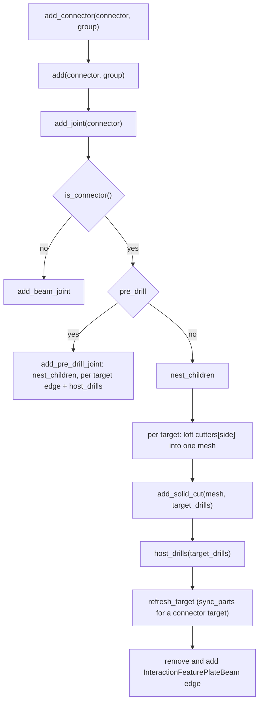

# Floor 9: Connectors {#templates_floor_09_connectors}

[TOC]

<em>Step 9 of @ref templates_floor_model · previous: @ref templates_floor_08_relationships · next: @ref templates_floor_10_screws</em>

`wood_floor::add_connectors` turns each `Relationship` row of chapter 08 into a `JointBeam` connector and hands it to `WoodSession::add_connector`, which nests its parts and dowels and cuts its members. Chapter 10 checks the screws against these cut members and connectors.

Example: [templates_floor_7_contacts_cantilevers.cpp](https://github.com/petrasvestartas/wood/blob/44f9aa85952d32a9264125f4e9940e55b05a4512/examples/templates_floor_7_contacts_cantilevers.cpp) makes every connector of this chapter on the default square bay, and [templates_floor_8_rectangle.cpp](https://github.com/petrasvestartas/wood/blob/44f9aa85952d32a9264125f4e9940e55b05a4512/examples/templates_floor_8_rectangle.cpp) does the same on the 3000 x 2400 bay with `seam_through_ribs` false, which makes the tie keys of sections 184 to 186.

Values are for `FloorGuide::rectangle(3000, 3000)` with the default parameters; sections 184 to 186 draw the tied 3000 x 2400 bay.

## 169. add_connectors entry

■ built `Floor::connectors`, the 44 connectors   ■ context the bay's members

`Floor::add_connectors(kinds)` builds every connector of the `CONNECTOR_RELATIONS` kinds before adding any and appends them to `Floor::connectors`: 44 on the default bay (4 seam wedges, 4 oculus wedges, 8 column plates, 4 cross laps, 0 ties, 24 block dowels). Every member, the columns included, must already be added by `add_members()`, else `FloorMembers::pair` throws with nothing added or cut; `Floor::add_screws()` calls the same function with the five `SCREW_RELATIONS`.

Code: `Floor::add_connectors`, `Floor::add_screws`, [src/templates/floor/floor_models.cpp:444-453](https://github.com/petrasvestartas/wood/blob/79d4d5c74fdbb4c7b474b2df14efe7f6c7b72e2f/src/templates/floor/floor_models.cpp#L444-L453); [src/templates/floor/floor.h:312](https://github.com/petrasvestartas/wood/blob/79d4d5c74fdbb4c7b474b2df14efe7f6c7b72e2f/src/templates/floor/floor.h#L312), [446](https://github.com/petrasvestartas/wood/blob/79d4d5c74fdbb4c7b474b2df14efe7f6c7b72e2f/src/templates/floor/floor.h#L446).

## 170. Walk and filter

■ built quarter 0's `connectors` rows, with their index   ■ input `relationships(guide)` walk order   ■ context the four quarters

The first pass walks `relationships(guide)` in order, skips `support` rows and kinds not in `kinds`, and keeps every connector in `built`; the second pass names, adds and appends each to `connectors`. With the default `seam_through_ribs` true there are no seam_tie rows.

Code: `wood_floor::add_connectors`, [src/templates/floor/floor_models.cpp:359-402](https://github.com/petrasvestartas/wood/blob/79d4d5c74fdbb4c7b474b2df14efe7f6c7b72e2f/src/templates/floor/floor_models.cpp#L359-L402); `relationships`, [src/templates/floor/floor_relations.cpp:173-209](https://github.com/petrasvestartas/wood/blob/79d4d5c74fdbb4c7b474b2df14efe7f6c7b72e2f/src/templates/floor/floor_relations.cpp#L173-L209).

## 171. Wedge sizing

■ variable `length_margin` at both ends, `pocket_depth`   ■ input `edge`, the contact's top edge   ■ context `row.contact` of seam 0

The wedge stops `length_margin = 1.5 * thickness` short of each end of the contact's top edge and cuts pockets `pocket_depth = 2 * thickness / 3` deep, where `thickness` is the larger `outline_thickness` of the two members (67.08 for a seam beam, not 60).

Code: `connector_of`, [src/templates/floor/floor_models.cpp:331-334](https://github.com/petrasvestartas/wood/blob/79d4d5c74fdbb4c7b474b2df14efe7f6c7b72e2f/src/templates/floor/floor_models.cpp#L331-L334).

## 172. Wedge frame

■ built `axes` x, y, z   ■ variable `edge = top_edge(points)`   ■ input `row.contact`, the `points`

The frame takes `x` along `edge = top_edge(points)`, the longest edge at or above the mean corner height, `y` as the contact's Newell normal made perpendicular to `x`, and `z = x cross y`.

Code: `JointBeam::wedge`, `merge_collinear`, `top_edge`, [src/joinery_solver/wood_elements/wood_element_joint_beam.cpp:57-123](https://github.com/petrasvestartas/wood/blob/79d4d5c74fdbb4c7b474b2df14efe7f6c7b72e2f/src/joinery_solver/wood_elements/wood_element_joint_beam.cpp#L57-L123), [216-221](https://github.com/petrasvestartas/wood/blob/79d4d5c74fdbb4c7b474b2df14efe7f6c7b72e2f/src/joinery_solver/wood_elements/wood_element_joint_beam.cpp#L216-L221).

## 173. Wedge stations onto the end plane

■ built `length`, stations[0] to stations[1]   ■ result `origin`   ■ variable `end = edges[0].band[0]` and the station moved onto it   ■ input the two `length_margin` stations   ■ context `edge`

Two stations sit `length_margin` in from the edge ends and give `origin` and `length`; a seam wedge moves the nearer one onto `row.end = edges[q].band[0]`, the bay's outer face, while an oculus wedge has no end plane.

Code: `JointBeam::wedge`, [src/joinery_solver/wood_elements/wood_element_joint_beam.cpp:222-236](https://github.com/petrasvestartas/wood/blob/79d4d5c74fdbb4c7b474b2df14efe7f6c7b72e2f/src/joinery_solver/wood_elements/wood_element_joint_beam.cpp#L222-L236).

## 174. Wedge profile clipped flush

■ built `joint->parts[0]`   ■ variable the `below_top` cut at the top edge   ■ input `WEDGE_PROFILE`

`below_top` cuts the `WEDGE_PROFILE` triangle horizontally at the top edge, also on a tilted frame, leaving it 60 wide at the top, and the part is that triangle extruded along `length` as one straight prism.

Code: `below_top`, `JointBeam::wedge`, [src/joinery_solver/wood_elements/wood_element_joint_beam.cpp:156-174](https://github.com/petrasvestartas/wood/blob/79d4d5c74fdbb4c7b474b2df14efe7f6c7b72e2f/src/joinery_solver/wood_elements/wood_element_joint_beam.cpp#L156-L174), [243-250](https://github.com/petrasvestartas/wood/blob/79d4d5c74fdbb4c7b474b2df14efe7f6c7b72e2f/src/joinery_solver/wood_elements/wood_element_joint_beam.cpp#L243-L250); `WEDGE_PROFILE`, [wood_element_joint_beam.h:15](https://github.com/petrasvestartas/wood/blob/79d4d5c74fdbb4c7b474b2df14efe7f6c7b72e2f/src/joinery_solver/wood_elements/wood_element_joint_beam.h#L15).

## 175. Wedge dowels

■ built `joint->drill_lines`, 5 dowels   ■ input `connector_wedge_0_part`   ■ context inner_beams_0_0, inner_beams_2_1

`count = max(int(length / dowel_spacing), 1)` horizontal d20 dowels (5 on a seam, 3 on the oculus) sit in the middle of equal shares, each clipped by `flush_dowel` to where it enters and leaves the two members.

Code: `JointBeam::wedge`, `flush_dowel`, `sides_tolerance`, [src/joinery_solver/wood_elements/wood_element_joint_beam.cpp:131-153](https://github.com/petrasvestartas/wood/blob/79d4d5c74fdbb4c7b474b2df14efe7f6c7b72e2f/src/joinery_solver/wood_elements/wood_element_joint_beam.cpp#L131-L153), [252-265](https://github.com/petrasvestartas/wood/blob/79d4d5c74fdbb4c7b474b2df14efe7f6c7b72e2f/src/joinery_solver/wood_elements/wood_element_joint_beam.cpp#L252-L265).

## 176. Wedge pockets

■ built `cutters[0]`, inner_beams_0_0's pocket   ■ result `cutters[1]`, inner_beams_2_1's pocket   ■ input `joint->parts[0]`   ■ context the two seam beams

Each member gets a box `pocket_depth` thick under one slanted wedge side, crossing the contact plane; the member whose centroid lies on the positive side of the contact normal gets `pockets[1]`, the other `pockets[0]`.

Code: `wedge_pocket`, `JointBeam::wedge`, [src/joinery_solver/wood_elements/wood_element_joint_beam.cpp:177-211](https://github.com/petrasvestartas/wood/blob/79d4d5c74fdbb4c7b474b2df14efe7f6c7b72e2f/src/joinery_solver/wood_elements/wood_element_joint_beam.cpp#L177-L211), [267-277](https://github.com/petrasvestartas/wood/blob/79d4d5c74fdbb4c7b474b2df14efe7f6c7b72e2f/src/joinery_solver/wood_elements/wood_element_joint_beam.cpp#L267-L277).

## 177. Oculus wedge (example 6)

■ built `connector_wedge_4_part`   ■ variable `row.contact` on `oculus_edges[0].tilted`   ■ context inner_beams_1_0, oculus_0

The oculus wedge joins inner beam 1 and ring beam q on the `oculus_edges[q].tilted` plane, so its frame leans by `oculus_plane_angle`, yet `below_top` still cuts it flush at 3500 and its dowels stay horizontal. Example 6 adds only these eight wedges, painted `CONNECTOR_COLOR` (brg_blue), not red as its description says.

Code: `oculus_wedge`, [src/templates/floor/floor_relations.cpp:75-88](https://github.com/petrasvestartas/wood/blob/79d4d5c74fdbb4c7b474b2df14efe7f6c7b72e2f/src/templates/floor/floor_relations.cpp#L75-L88); `connector_of`, [src/templates/floor/floor_models.cpp:331-334](https://github.com/petrasvestartas/wood/blob/79d4d5c74fdbb4c7b474b2df14efe7f6c7b72e2f/src/templates/floor/floor_models.cpp#L331-L334); [examples/templates_floor_6_contacts_floor.cpp:10-13](https://github.com/petrasvestartas/wood/blob/79d4d5c74fdbb4c7b474b2df14efe7f6c7b72e2f/examples/templates_floor_6_contacts_floor.cpp#L10-L13).

## 178. Plate frame

■ built `axes` x, y, z   ■ result `origin = top_origin(points)`   ■ input `row.contact` and its Newell `normal`, dashed

`rectangle_plate` sets `x` to the contact's Newell normal made horizontal and turned toward the rib, `z` to world Z, `y = Z cross x`, and the origin at the centre of the contact's top edge; the dowel length is the rib's thickness.

Code: `JointBeam::rectangle_plate`, `top_origin`, [src/joinery_solver/wood_elements/wood_element_joint_beam.cpp:283-305](https://github.com/petrasvestartas/wood/blob/79d4d5c74fdbb4c7b474b2df14efe7f6c7b72e2f/src/joinery_solver/wood_elements/wood_element_joint_beam.cpp#L283-L305), [321-344](https://github.com/petrasvestartas/wood/blob/79d4d5c74fdbb4c7b474b2df14efe7f6c7b72e2f/src/joinery_solver/wood_elements/wood_element_joint_beam.cpp#L321-L344); `connector_of`, [src/templates/floor/floor_models.cpp:336-337](https://github.com/petrasvestartas/wood/blob/79d4d5c74fdbb4c7b474b2df14efe7f6c7b72e2f/src/templates/floor/floor_models.cpp#L336-L337).

## 179. Plate part and pocket

■ built `joint->parts[0]`, the plate   ■ result `joint->cutters`, the pocket, dashed   ■ input `row.contact`

The plate is a 30-wide box reaching `back` 220 into the column and `front` 265 into the rib, `height` 250 below the top, and column and rib get the same pocket, which rises `overshoot` 25 above the top.

Code: `frame_box`, `JointBeam::rectangle_plate`, [src/joinery_solver/wood_elements/wood_element_joint_beam.cpp:308-318](https://github.com/petrasvestartas/wood/blob/79d4d5c74fdbb4c7b474b2df14efe7f6c7b72e2f/src/joinery_solver/wood_elements/wood_element_joint_beam.cpp#L308-L318), [346-353](https://github.com/petrasvestartas/wood/blob/79d4d5c74fdbb4c7b474b2df14efe7f6c7b72e2f/src/joinery_solver/wood_elements/wood_element_joint_beam.cpp#L346-L353).

## 180. Plate dowels

■ built `joint->drill_lines`, 4 d50 dowels   ■ variable `margin_x`, `margin_z` times `dowel_radius`   ■ input `connector_0_part`

Four d50 dowels sit `margin_x * dowel_radius` in from the plate ends and `margin_z * dowel_radius` in from top and bottom, clipped by `flush_dowel` to the column and the rib: 0 and 1 at the column end, 2 and 3 at the rib end.

Code: `JointBeam::rectangle_plate`, `flush_dowel`, [src/joinery_solver/wood_elements/wood_element_joint_beam.cpp:355-363](https://github.com/petrasvestartas/wood/blob/79d4d5c74fdbb4c7b474b2df14efe7f6c7b72e2f/src/joinery_solver/wood_elements/wood_element_joint_beam.cpp#L355-L363).

## 181. plates_of_corner

■ built `plates_of_corner[0][0]` = connector_0   ■ result `plates_of_corner[0][1]` = connector_1   ■ context column_0

Each column plate is kept in `plates_of_corner[q]`, and the cross lap of corner q is built from those two plates, not the ribs, throwing unless there are exactly two. So column_plate and cross_lap must be asked for in the same `add_connectors` call, and the plates are added before the lap that slots them.

Code: `wood_floor::add_connectors`, [src/templates/floor/floor_models.cpp:369-384](https://github.com/petrasvestartas/wood/blob/79d4d5c74fdbb4c7b474b2df14efe7f6c7b72e2f/src/templates/floor/floor_models.cpp#L369-L384); `cross_lap`, [src/templates/floor/floor_relations.cpp:109-118](https://github.com/petrasvestartas/wood/blob/79d4d5c74fdbb4c7b474b2df14efe7f6c7b72e2f/src/templates/floor/floor_relations.cpp#L109-L118).

## 182. Cross lap frames and lap level

■ built `lap`   ■ variable `low`, `high`, dashed   ■ input connector_0, connector_1 and the `frame_a`, `frame_b` origins

`cross_lap` reads each one-part plate's frame with `box_frame`, takes their common height [`low`, `high`] along frame_a z, and splits it at `lap = low + share * (high - low)`, mid-height for `share` 0.5. It throws if a plate has more than one part or if `high <= low`.

Code: `JointBeam::cross_lap`, `box_frame`, `extent`, `box_corners`, [src/joinery_solver/wood_elements/wood_element_joint_beam.cpp:531-572](https://github.com/petrasvestartas/wood/blob/79d4d5c74fdbb4c7b474b2df14efe7f6c7b72e2f/src/joinery_solver/wood_elements/wood_element_joint_beam.cpp#L531-L572), [575-593](https://github.com/petrasvestartas/wood/blob/79d4d5c74fdbb4c7b474b2df14efe7f6c7b72e2f/src/joinery_solver/wood_elements/wood_element_joint_beam.cpp#L575-L593).

## 183. Cross lap slots

■ built `cutters[0]`, the slot in connector_0   ■ result `cutters[1]`, the slot in connector_1   ■ input the two plates

Plate a gets a slot from `lap` up through its top and plate b one from below its bottom up to `lap`, each the plate thickness plus `2 * margin` wide; the joint has no parts or drill lines and stays hidden (`is_visible` false).

Code: `JointBeam::cross_lap`, [src/joinery_solver/wood_elements/wood_element_joint_beam.cpp:594-610](https://github.com/petrasvestartas/wood/blob/79d4d5c74fdbb4c7b474b2df14efe7f6c7b72e2f/src/joinery_solver/wood_elements/wood_element_joint_beam.cpp#L594-L610); `Joint::Joint`, [wood_element_joint.cpp:10-12](https://github.com/petrasvestartas/wood/blob/79d4d5c74fdbb4c7b474b2df14efe7f6c7b72e2f/src/joinery_solver/wood_elements/wood_element_joint.cpp#L10-L12).

## 184. Tie frame

■ built `axes` x, y, z   ■ result `origin = top_origin(points)`   ■ input `row.contact`   ■ context outer_ribs_0_0, outer_ribs_1_1

A seam_tie row exists only when `seam_through_ribs` is false, where outer rib 0 of q and outer rib 1 of q + 1 meet end to end on the seam plane. The tie frame has `x` down, `y` the contact's Newell normal made horizontal across the seam (+X, opposite to `row.plane`'s normal), and `z = x cross y` across the rib.

Code: `JointBeam::tie`, `top_origin`, [src/joinery_solver/wood_elements/wood_element_joint_beam.cpp:374-392](https://github.com/petrasvestartas/wood/blob/79d4d5c74fdbb4c7b474b2df14efe7f6c7b72e2f/src/joinery_solver/wood_elements/wood_element_joint_beam.cpp#L374-L392); `connector_of`, [src/templates/floor/floor_models.cpp:339-340](https://github.com/petrasvestartas/wood/blob/79d4d5c74fdbb4c7b474b2df14efe7f6c7b72e2f/src/templates/floor/floor_models.cpp#L339-L340); `seam_tie`, [src/templates/floor/floor_relations.cpp:121-138](https://github.com/petrasvestartas/wood/blob/79d4d5c74fdbb4c7b474b2df14efe7f6c7b72e2f/src/templates/floor/floor_relations.cpp#L121-L138).

## 185. Tie key

■ built `joint->parts`, the four pieces   ■ input the seam, dashed   ■ context the two outer ribs

The key is four lofted pieces along frame y, a 40-wide head, two 20-wide neck halves and a second head, with a flat top `top` below the edge and an underside that deepens from `depth` at the seam to `end_depth` at the ends.

Code: `tie_section`, `JointBeam::tie`, [src/joinery_solver/wood_elements/wood_element_joint_beam.cpp:369-371](https://github.com/petrasvestartas/wood/blob/79d4d5c74fdbb4c7b474b2df14efe7f6c7b72e2f/src/joinery_solver/wood_elements/wood_element_joint_beam.cpp#L369-L371), [394-400](https://github.com/petrasvestartas/wood/blob/79d4d5c74fdbb4c7b474b2df14efe7f6c7b72e2f/src/joinery_solver/wood_elements/wood_element_joint_beam.cpp#L394-L400).

## 186. Tie pockets

■ built `cutters[0]`, outer_ribs_0_0's negative set   ■ result `cutters[1]`, outer_ribs_1_1's positive set   ■ context the two outer ribs

Each rib gets a flat-floored head and neck pocket down to `top + pocket_depth`, the member on the -y side the negative set and the other the positive set; each neck pocket runs `overshoot` past the seam, so the two overlap by `2 * overshoot`.

Code: `JointBeam::tie`, [src/joinery_solver/wood_elements/wood_element_joint_beam.cpp:402-416](https://github.com/petrasvestartas/wood/blob/79d4d5c74fdbb4c7b474b2df14efe7f6c7b72e2f/src/joinery_solver/wood_elements/wood_element_joint_beam.cpp#L402-L416).

## 187. Dowels: frame and inset

■ built `ring`, inset by `offset`   ■ result `origin`   ■ input `row.contact`

A block_dowels row joins a rib (a) and a wedge block (b), and `JointBeam::dowels` frames the block's face at its centroid, normal toward the block, then insets it by `offset` 50 with Clipper2. If the inset ring has fewer than 3 points, `connector_of` throws "the inset leaves no room for the dowels of ...".

Code: `JointBeam::dowels`, `inset_polygon`, [src/joinery_solver/wood_elements/wood_element_joint_beam.cpp:419-441](https://github.com/petrasvestartas/wood/blob/79d4d5c74fdbb4c7b474b2df14efe7f6c7b72e2f/src/joinery_solver/wood_elements/wood_element_joint_beam.cpp#L419-L441), [467-481](https://github.com/petrasvestartas/wood/blob/79d4d5c74fdbb4c7b474b2df14efe7f6c7b72e2f/src/joinery_solver/wood_elements/wood_element_joint_beam.cpp#L467-L481); `connector_of`, [src/templates/floor/floor_models.cpp:351-356](https://github.com/petrasvestartas/wood/blob/79d4d5c74fdbb4c7b474b2df14efe7f6c7b72e2f/src/templates/floor/floor_models.cpp#L351-L356).

## 188. Dowels: axes at the inset corners

■ built `joint->drill_lines`, 4 dowels   ■ input `row.contact`   ■ context the rib and the block

At each of up to four extreme corners of the inset ring a d8 dowel `length` 30 long is centred on the contact along the normal, half in the rib and half in the block; there are no solid cutters, only holes.

Code: `extreme_corners`, `JointBeam::dowels`, [src/joinery_solver/wood_elements/wood_element_joint_beam.cpp:444-464](https://github.com/petrasvestartas/wood/blob/79d4d5c74fdbb4c7b474b2df14efe7f6c7b72e2f/src/joinery_solver/wood_elements/wood_element_joint_beam.cpp#L444-L464), [483-499](https://github.com/petrasvestartas/wood/blob/79d4d5c74fdbb4c7b474b2df14efe7f6c7b72e2f/src/joinery_solver/wood_elements/wood_element_joint_beam.cpp#L483-L499).

## 189. Screws factory

■ built the screw connector's `drill_lines`   ■ variable `row.through`, the seam beam   ■ input `row.a`, `row.b`

For the `SCREW_RELATIONS` rows of `add_screws()`, `JointBeam::screws` makes a visible `pre_drill` connector targeting a, b and every `row.through` member, with one drill line per screw from its head and no parts or cutters. A rib_corner row adds its seam beam as a third target; the factory returns null with no lines or fewer than 2 members, which `connector_of` does not check.

Code: `connector_of`, [src/templates/floor/floor_models.cpp:342-349](https://github.com/petrasvestartas/wood/blob/79d4d5c74fdbb4c7b474b2df14efe7f6c7b72e2f/src/templates/floor/floor_models.cpp#L342-L349); `JointBeam::screws`, [src/joinery_solver/wood_elements/wood_element_joint_beam.cpp:502-528](https://github.com/petrasvestartas/wood/blob/79d4d5c74fdbb4c7b474b2df14efe7f6c7b72e2f/src/joinery_solver/wood_elements/wood_element_joint_beam.cpp#L502-L528); `rib_corner`, [src/templates/floor/floor_screws.cpp:259-286](https://github.com/petrasvestartas/wood/blob/79d4d5c74fdbb4c7b474b2df14efe7f6c7b72e2f/src/templates/floor/floor_screws.cpp#L259-L286).

## 190. Naming

■ built quarter 0's connectors and screws, `<prefix>_<n>`   ■ context the four quarters

The second pass renames each connector `<prefix>_<n>` before adding it, so its children inherit the name, and each prefix counts on from the highest number already in the scene, also across calls.

| Kind | Prefix | Names on the default bay |
|---|---|---|
| seam_wedge, oculus_wedge | `connector_wedge` | connector_wedge_0 .. 3, then 4 .. 7 |
| column_plate | `connector` | connector_{2q + k}: connector_0 .. 7 |
| block_dowels | `connector_dowels` | connector_dowels_{6q + j}: 0 .. 23 |
| the five screw kinds | `connector_screws` | connector_screws_0 .. 35 |

Code: `next_number`, [src/templates/floor/floor_models.cpp:91-104](https://github.com/petrasvestartas/wood/blob/79d4d5c74fdbb4c7b474b2df14efe7f6c7b72e2f/src/templates/floor/floor_models.cpp#L91-L104); `connector_prefix`, [300-318](https://github.com/petrasvestartas/wood/blob/79d4d5c74fdbb4c7b474b2df14efe7f6c7b72e2f/src/templates/floor/floor_models.cpp#L300-L318); naming, [387-396](https://github.com/petrasvestartas/wood/blob/79d4d5c74fdbb4c7b474b2df14efe7f6c7b72e2f/src/templates/floor/floor_models.cpp#L387-L396).

## 191. connectors_q grouping

`connector_group` puts each connector, screws included, under `quarter_q/connectors_q`, made on first use; a seam wedge or tie joining quarters q and q + 1 goes under quarter q.

Code: `connector_group`, `quarter_group`, `group_named`, [src/templates/floor/floor_models.cpp:79-89](https://github.com/petrasvestartas/wood/blob/79d4d5c74fdbb4c7b474b2df14efe7f6c7b72e2f/src/templates/floor/floor_models.cpp#L79-L89), [321-323](https://github.com/petrasvestartas/wood/blob/79d4d5c74fdbb4c7b474b2df14efe7f6c7b72e2f/src/templates/floor/floor_models.cpp#L321-L323), [397](https://github.com/petrasvestartas/wood/blob/79d4d5c74fdbb4c7b474b2df14efe7f6c7b72e2f/src/templates/floor/floor_models.cpp#L397).

## 192. add_connector dispatch

`add_connector` adds the connector under its group and calls `add_joint`, which sends a `JointBeam` with parts, cutters or `pre_drill` (the cross lap included) to `add_connector_joint`: nest the children once, then sections 194 to 197 per target.

Code: `WoodSession::add_connector`, `WoodSession::add_joint`, [src/joinery_solver/wood_session.cpp:1325-1350](https://github.com/petrasvestartas/wood/blob/79d4d5c74fdbb4c7b474b2df14efe7f6c7b72e2f/src/joinery_solver/wood_session.cpp#L1325-L1350); `add_connector_joint`, [wood_session.cpp:1177-1204](https://github.com/petrasvestartas/wood/blob/79d4d5c74fdbb4c7b474b2df14efe7f6c7b72e2f/src/joinery_solver/wood_session.cpp#L1177-L1204); `JointBeam::is_connector`, [wood_element_joint_beam.cpp:616-618](https://github.com/petrasvestartas/wood/blob/79d4d5c74fdbb4c7b474b2df14efe7f6c7b72e2f/src/joinery_solver/wood_elements/wood_element_joint_beam.cpp#L616-L618).

## 193. nest_children

■ built `connector_wedge_0_part`, the ConnectorPart   ■ result `connector_wedge_0_dowel_0 .. 4`, the Dowels, lifted   ■ input the lift from each drill line, dashed

`nest_children` adds, once per connector, one `ConnectorPart` per part with its bores as `solid_cuts` and one `Dowel` per drill line, named `<name>_dowel_<i>`, or `<name>_screw_<i>` when `pre_drill`.

Code: `nest_children`, [src/joinery_solver/wood_session.cpp:1106-1115](https://github.com/petrasvestartas/wood/blob/79d4d5c74fdbb4c7b474b2df14efe7f6c7b72e2f/src/joinery_solver/wood_session.cpp#L1106-L1115); `JointBeam::children`, `JointBeam::part_cuts`, [wood_element_joint_beam.cpp:624-641](https://github.com/petrasvestartas/wood/blob/79d4d5c74fdbb4c7b474b2df14efe7f6c7b72e2f/src/joinery_solver/wood_elements/wood_element_joint_beam.cpp#L624-L641), [650-663](https://github.com/petrasvestartas/wood/blob/79d4d5c74fdbb4c7b474b2df14efe7f6c7b72e2f/src/joinery_solver/wood_elements/wood_element_joint_beam.cpp#L650-L663); `ConnectorPart::ConnectorPart`, [wood_element_connector_part.cpp:13-21](https://github.com/petrasvestartas/wood/blob/79d4d5c74fdbb4c7b474b2df14efe7f6c7b72e2f/src/joinery_solver/wood_elements/wood_element_connector_part.cpp#L13-L21).

## 194. Cutter solid stored in the target

■ built `Mesh::loft(cutters[0][0])`, the cut's mesh   ■ result the cut's `drills`, dashed   ■ context inner_beams_0_0

Each target's cutter loops are lofted into one closed mesh and stored with the drills as a SolidCut in the target's frame, replacing any cut with the same `joint_guid`; a dowels connector has an empty mesh and only drills. It throws "Missing closed cutter solid" when the mesh is open, or empty with no drills.

Code: `add_connector_joint`, [src/joinery_solver/wood_session.cpp:1186-1196](https://github.com/petrasvestartas/wood/blob/79d4d5c74fdbb4c7b474b2df14efe7f6c7b72e2f/src/joinery_solver/wood_session.cpp#L1186-L1196); `store_solid_cut`, `add_drills`, `add_solid_cut`, [wood_session.cpp:1233-1266](https://github.com/petrasvestartas/wood/blob/79d4d5c74fdbb4c7b474b2df14efe7f6c7b72e2f/src/joinery_solver/wood_session.cpp#L1233-L1266), [1283-1290](https://github.com/petrasvestartas/wood/blob/79d4d5c74fdbb4c7b474b2df14efe7f6c7b72e2f/src/joinery_solver/wood_session.cpp#L1283-L1290); `get_solid_cuts`, [wood_session.cpp:43-64](https://github.com/petrasvestartas/wood/blob/79d4d5c74fdbb4c7b474b2df14efe7f6c7b72e2f/src/joinery_solver/wood_session.cpp#L43-L64).

## 195. target_drills: blind or overshoot

■ built outer_ribs_0_0's hole   ■ result wedges_0_0's hole   ■ input the dowel, `drill_lines[0]`   ■ context `row.contact`

Each dowel end is tested 1 mm beyond itself against the target's mesh, in the target's frame: inside gives a blind hole stopping at the dowel end, outside runs on by `drill_overshoot`. With `drill_overshoot <= 0`, as on the cross lap, the lines come back unchanged.

Code: `target_drills`, [src/joinery_solver/wood_session.cpp:1054-1078](https://github.com/petrasvestartas/wood/blob/79d4d5c74fdbb4c7b474b2df14efe7f6c7b72e2f/src/joinery_solver/wood_session.cpp#L1054-L1078).

## 196. host_drills: drill features (wedges_1_0)

■ built the drill features' entry and exit circles   ■ context wedges_1_0

`host_drills` replaces the target's old drill features of this joint with one `ElementFeature` "drill" per stretch of a drill line inside the target, drawn as `DRILL_SIDES` entry and exit circles; wedges_1_0 gets 8.

Code: `host_drills`, [src/joinery_solver/wood_session.cpp:13](https://github.com/petrasvestartas/wood/blob/79d4d5c74fdbb4c7b474b2df14efe7f6c7b72e2f/src/joinery_solver/wood_session.cpp#L13), [1118-1157](https://github.com/petrasvestartas/wood/blob/79d4d5c74fdbb4c7b474b2df14efe7f6c7b72e2f/src/joinery_solver/wood_session.cpp#L1118-L1157), [1199](https://github.com/petrasvestartas/wood/blob/79d4d5c74fdbb4c7b474b2df14efe7f6c7b72e2f/src/joinery_solver/wood_session.cpp#L1199).

## 197. refresh and sync_parts

■ built `connector_0_part`   ■ result `connector_1_part`

`refresh_target` drops the target's cached geometry, and for a connector target `sync_parts` hands its parts their cuts again, which is how the cross lap's slots reach the plate parts. A `pre_drill` connector skips all cutting: `add_pre_drill_joint` nests its screws and hosts drill features from its lines unchanged.

Code: `refresh_target`, `sync_parts`, `add_pre_drill_joint`, [src/joinery_solver/wood_session.cpp:1081-1103](https://github.com/petrasvestartas/wood/blob/79d4d5c74fdbb4c7b474b2df14efe7f6c7b72e2f/src/joinery_solver/wood_session.cpp#L1081-L1103), [1160-1174](https://github.com/petrasvestartas/wood/blob/79d4d5c74fdbb4c7b474b2df14efe7f6c7b72e2f/src/joinery_solver/wood_session.cpp#L1160-L1174), [1200-1202](https://github.com/petrasvestartas/wood/blob/79d4d5c74fdbb4c7b474b2df14efe7f6c7b72e2f/src/joinery_solver/wood_session.cpp#L1200-L1202).

## 198. Paint and append

■ built quarter 0's connector nodes and their children, `CONNECTOR_COLOR`   ■ context quarter 0's members

`paint` colours each connector node and all its children `CONNECTOR_COLOR` (brg_blue, `#2196EA`), the hidden cross lap included, and the connector is appended to `connectors`.

Code: `paint`, [src/templates/floor/floor_models.cpp:55-61](https://github.com/petrasvestartas/wood/blob/79d4d5c74fdbb4c7b474b2df14efe7f6c7b72e2f/src/templates/floor/floor_models.cpp#L55-L61), [396-398](https://github.com/petrasvestartas/wood/blob/79d4d5c74fdbb4c7b474b2df14efe7f6c7b72e2f/src/templates/floor/floor_models.cpp#L396-L398); [src/templates/floor/floor.h:443](https://github.com/petrasvestartas/wood/blob/79d4d5c74fdbb4c7b474b2df14efe7f6c7b72e2f/src/templates/floor/floor.h#L443).

## 199. The connector node draws nothing

■ built `connector_0_part` and `connector_0_dowel_0 .. 3`   ■ variable connector_0's own `element_geometry_mesh()`, empty, dashed

The `JointBeam` node returns an empty mesh and BRep, so only its children draw: each `ConnectorPart` its part minus bores and slots, each `Dowel` its cylinder, and the childless cross lap shows only as slots in the plates.

Code: `JointBeam::element_geometry_mesh`, `JointBeam::element_geometry_brep`, `JointBeam::part_brep`, [src/joinery_solver/wood_elements/wood_element_joint_beam.cpp:643-648](https://github.com/petrasvestartas/wood/blob/79d4d5c74fdbb4c7b474b2df14efe7f6c7b72e2f/src/joinery_solver/wood_elements/wood_element_joint_beam.cpp#L643-L648), [665-685](https://github.com/petrasvestartas/wood/blob/79d4d5c74fdbb4c7b474b2df14efe7f6c7b72e2f/src/joinery_solver/wood_elements/wood_element_joint_beam.cpp#L665-L685); `ConnectorPart::element_geometry_mesh`, [wood_element_connector_part.cpp:23-37](https://github.com/petrasvestartas/wood/blob/79d4d5c74fdbb4c7b474b2df14efe7f6c7b72e2f/src/joinery_solver/wood_elements/wood_element_connector_part.cpp#L23-L37).
