# Floor 9: Connectors {#templates_floor_09_connectors}

[TOC]

<em>Step 9 of @ref templates_floor_model · previous: @ref templates_floor_08_contacts · next: @ref templates_floor_10_pins</em>

`Floor::compute_connectors` and `Floor::add_connectors` are private steps called by the constructor.
`compute_connectors` makes one joint element per contact.
Every seam and oculus contact gets a wedge.
Every column contact gets a column plate let into the column and its rib, with a `cr_c_ip` half lap between the two plates of a column.
Every block-to-rib contact gets centred pins.
Every butt joint gets headed pins, pre-drilled into both members; page 10 shows them.
`add_connectors` adds each with `add` and puts it on its members with `add_interaction`.
`add_interaction` nests its parts and pins under it and cuts its pockets and holes.

Example: [templates_floor_7_contacts_cantilevers.cpp](https://github.com/petrasvestartas/wood/blob/main/examples/templates_floor_7_contacts_cantilevers.cpp) builds every connector.

## 251. add_connectors

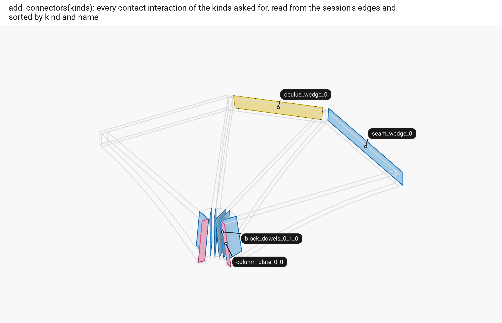

■ seam_wedge, block_pins   ■ oculus_wedge   ■ column_plate   ■ context quarter 0's members, by their loops

`compute_connectors` builds every quarter's connectors from its `QuarterContacts`, one part of the function per kind.
It builds them all before `add_connectors` adds any, so each is built on uncut members.
`add_connectors` then adds them kind by kind, quarter by quarter, the cross laps last.

Code: `Floor::add_connectors`, [floor.cpp](https://github.com/petrasvestartas/wood/blob/main/src/templates/floor/floor.cpp).

## 252. The seam wedge's size and end

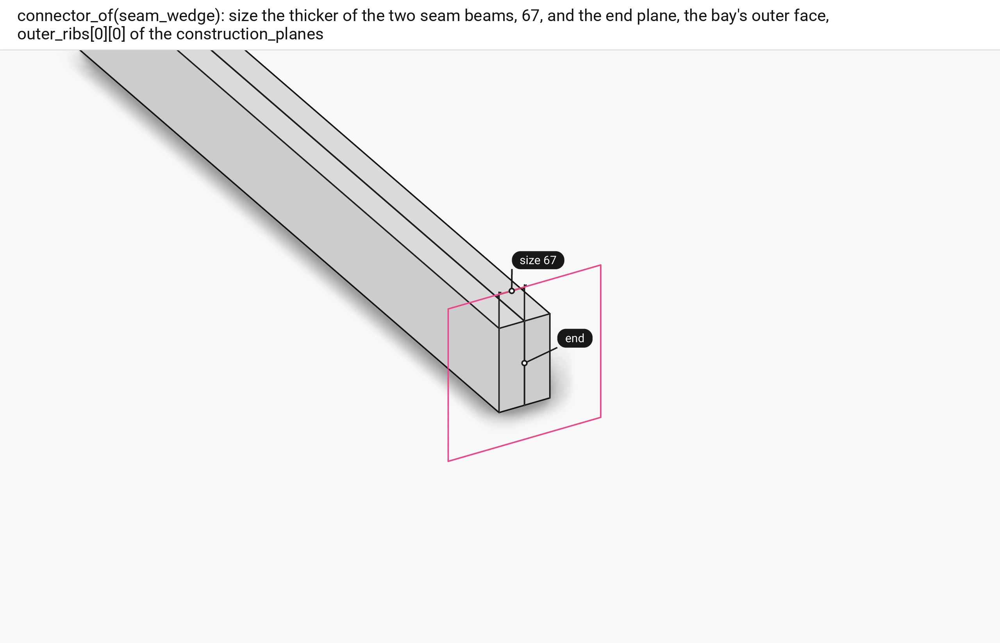

■ variable `end`, the bay's outer face   ■ context the two seam beams

The seam-wedge part of `compute_connectors` sizes the wedge by `guide.size_inner_beams`, `size` (60).
Its end plane is the bay's outer face, `construction_planes(q).outer_ribs[0][0]` lifted to the floor.

Code: `Floor::compute_connectors`, [floor.cpp](https://github.com/petrasvestartas/wood/blob/main/src/templates/floor/floor.cpp).

## 253. The wedge's frame and length

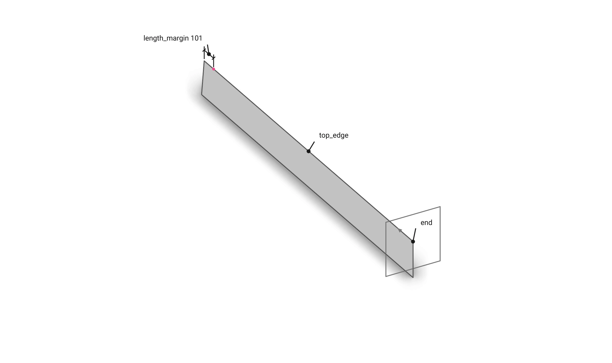

■ input the contact, its `top_edge` dashed and the end plane   ■ variable the two ends of the wedge

`JointBeam::wedge` lays x along the contact's top edge and y along its normal made square to x; it stops `length_margin = 1.5 size` (90) in from both ends of the edge, the end nearer the end plane moved onto it, so the wedge runs out to the bay's outer face.

Code: `JointBeam::wedge`, [wood_element_joint_beam.cpp](https://github.com/petrasvestartas/wood/blob/main/src/joinery_solver/wood_elements/wood_element_joint_beam.cpp); `top_edge`, [wood_element_joint_beam.cpp](https://github.com/petrasvestartas/wood/blob/main/src/joinery_solver/wood_elements/wood_element_joint_beam.cpp).

## 254. The wedge part

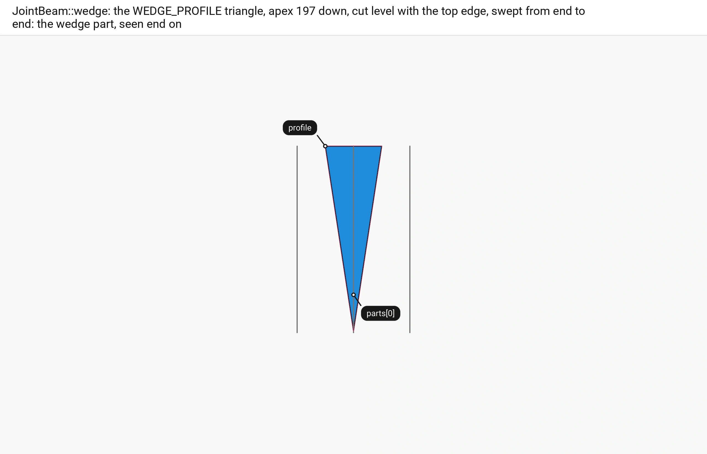

■ built `parts[0]`   ■ variable its `profile`   ■ input the two seam beams' loops, end on

The `WEDGE_PROFILE` triangle, apex 197 below the top edge, is cut level with the edge by `below_top` and swept from end to end: the wedge part.

Code: `JointBeam::wedge`, [wood_element_joint_beam.cpp](https://github.com/petrasvestartas/wood/blob/main/src/joinery_solver/wood_elements/wood_element_joint_beam.cpp); `below_top`, [wood_element_joint_beam.cpp](https://github.com/petrasvestartas/wood/blob/main/src/joinery_solver/wood_elements/wood_element_joint_beam.cpp); `WEDGE_PROFILE`, [wood_element_joint_beam.h](https://github.com/petrasvestartas/wood/blob/main/src/joinery_solver/wood_elements/wood_element_joint_beam.h).

## 255. The wedge's pins

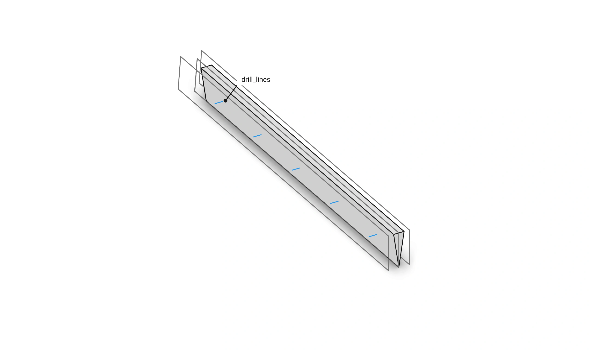

■ built `drill_lines`   ■ context the wedge part   ■ input the beams' loops

One pin of radius 10 stands every `pin_spacing` (320) of length.
Each runs across the wedge 100 below its top, cut by `flush_pin` to end flush with the two beams.

Code: `JointBeam::wedge`, [wood_element_joint_beam.cpp](https://github.com/petrasvestartas/wood/blob/main/src/joinery_solver/wood_elements/wood_element_joint_beam.cpp); `flush_pin`, [wood_element_joint_beam.cpp](https://github.com/petrasvestartas/wood/blob/main/src/joinery_solver/wood_elements/wood_element_joint_beam.cpp).

## 256. The wedge's pockets

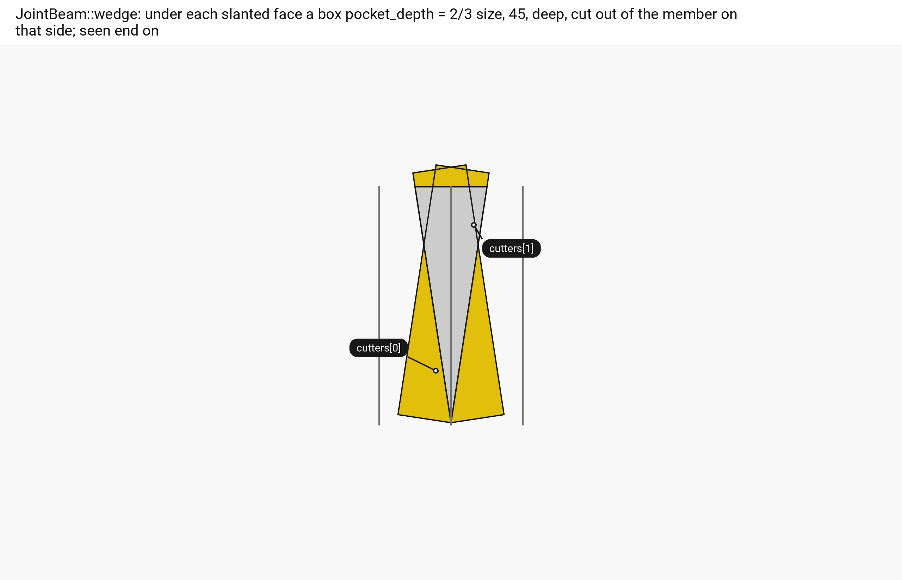

■ result `cutters[0]`, `cutters[1]`   ■ context the wedge part   ■ input the beams' loops, end on

Under each slanted face of the wedge `wedge_pocket` makes a box `pocket_depth = 2/3 size` (40) deep, and each beam gets the pocket on its own side.

Code: `JointBeam::wedge`, [wood_element_joint_beam.cpp](https://github.com/petrasvestartas/wood/blob/main/src/joinery_solver/wood_elements/wood_element_joint_beam.cpp); `wedge_pocket`, [wood_element_joint_beam.cpp](https://github.com/petrasvestartas/wood/blob/main/src/joinery_solver/wood_elements/wood_element_joint_beam.cpp).

## 257. The wedge cut into the beams

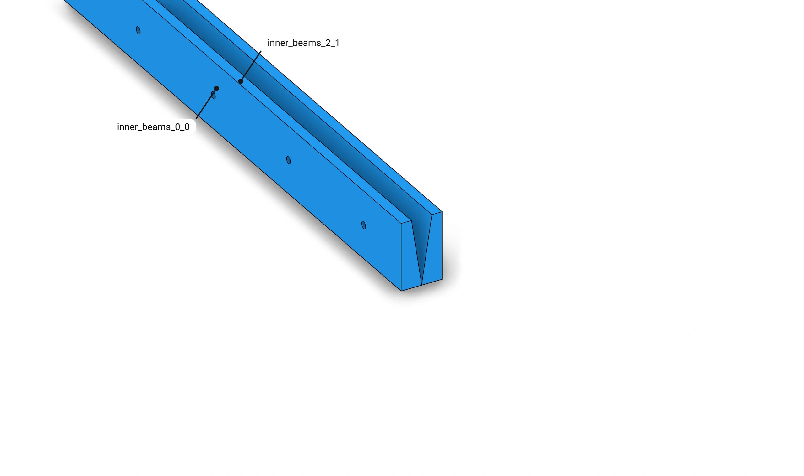

■ built the two seam beams, cut

`add_interaction(wedge, beam, wedge->interaction(i))` nests the wedge part and its pins under the connector and cuts the pocket and the pin holes out of that beam as solid features.

Code: `Floor::add_connectors`, [floor.cpp](https://github.com/petrasvestartas/wood/blob/main/src/templates/floor/floor.cpp); `WoodSession::add_interaction`, [wood_session.cpp](https://github.com/petrasvestartas/wood/blob/main/src/joinery_solver/wood_session.cpp).

## 258. The oculus wedge

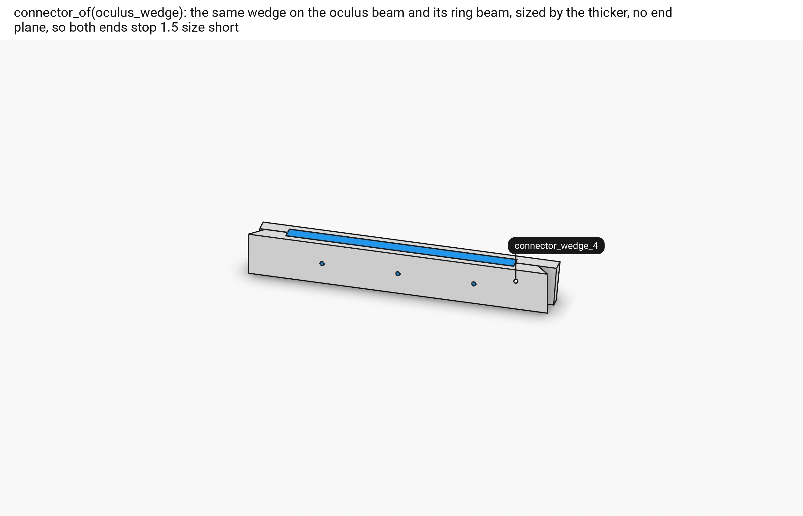

■ built the wedge part and pins   ■ context the oculus beam and the ring beam

The oculus-wedge part of `compute_connectors` puts the same wedge on the oculus beam and its ring beam.
It is sized by the thicker of the two, measured by `FloorGuide::thickness`.
It has no end plane, so both ends stop 1.5 size short.

Code: `Floor::compute_connectors`, [floor.cpp](https://github.com/petrasvestartas/wood/blob/main/src/templates/floor/floor.cpp); `FloorGuide::thickness`, [floor_guide.cpp](https://github.com/petrasvestartas/wood/blob/main/src/templates/floor/floor_guide.cpp).

## 259. The column plate's frame

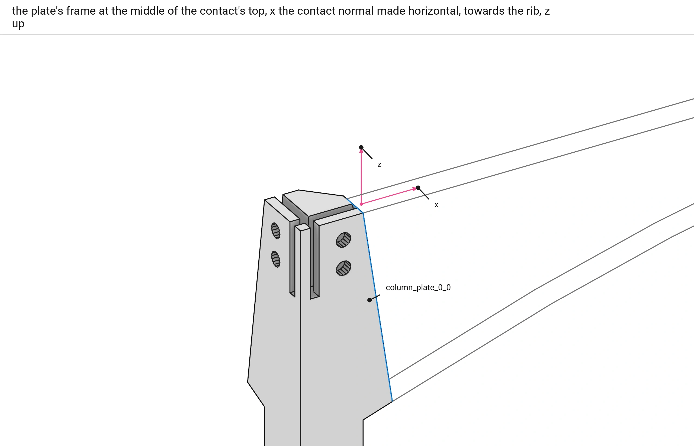

■ built `column_plate_0_0`   ■ variable the frame's `x` and `z`   ■ context the column   ■ input the outer rib's loops

The column plate's frame sits at the middle of the contact's top: x the contact normal made horizontal and turned towards the rib, z up. `JointBeam::let_in_plate` and `JointBeam::rectangle_plate` both build on it.

Code: `Floor::compute_connectors`, [floor.cpp](https://github.com/petrasvestartas/wood/blob/main/src/templates/floor/floor.cpp); `JointBeam::let_in_plate`, `plate_frame`, `top_origin`, [wood_element_joint_beam.cpp](https://github.com/petrasvestartas/wood/blob/main/src/joinery_solver/wood_elements/wood_element_joint_beam.cpp).

## 260. The plate

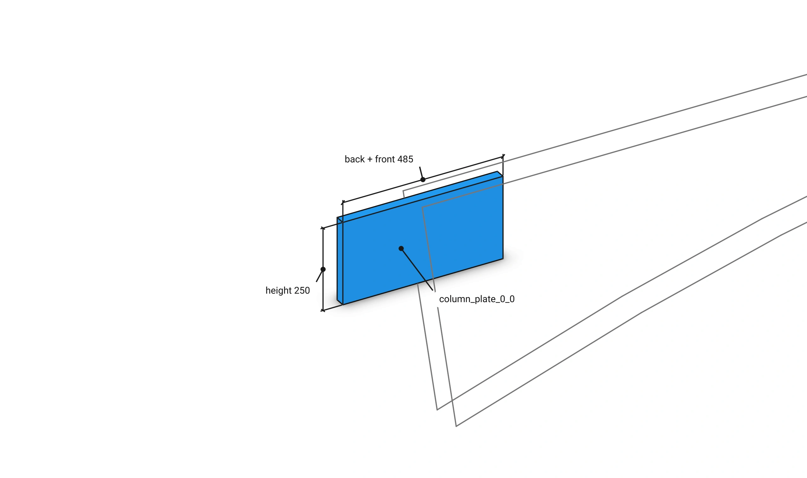

■ built `column_plate_0_0`   ■ input the outer rib's loops

`JointBeam::let_in_plate(rib, contact)` makes the plate, a `Plate` named after its contact: 220 back into the column, 265 forward into the rib, 30 wide and 250 down from the top.

Code: `JointBeam::let_in_plate`, `frame_box`, [wood_element_joint_beam.cpp](https://github.com/petrasvestartas/wood/blob/main/src/joinery_solver/wood_elements/wood_element_joint_beam.cpp).

## 261. The plate's pins and pocket

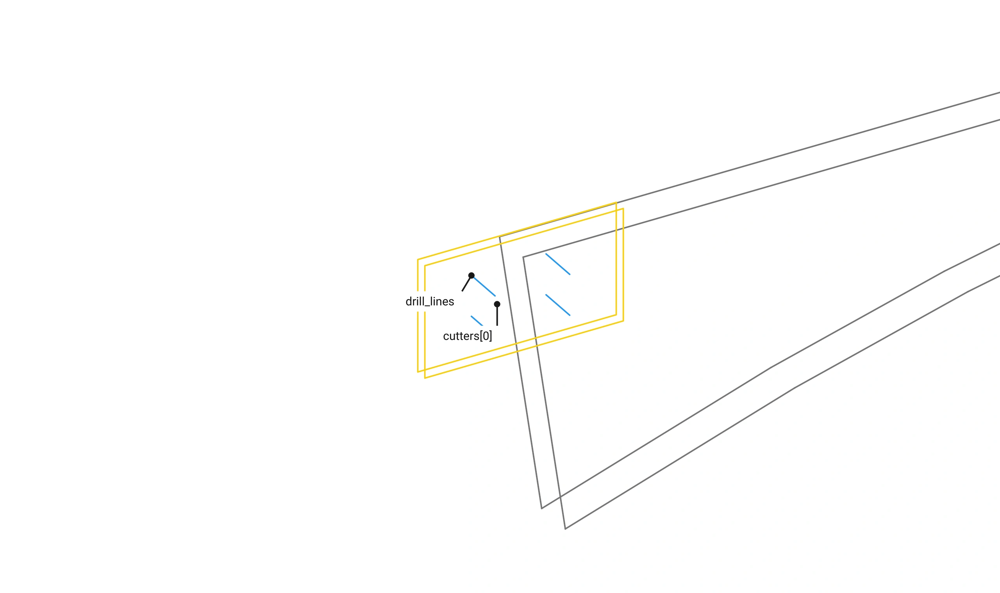

■ built `drill_lines`   ■ result `cutters[0]`, the pocket   ■ input the outer rib's loops

`JointBeam::rectangle_plate(column, rib, plate, contact)` lets the plate in.
The plate's box raised 25 above its top is the pocket cut out of column and rib.
Four pins of radius 25 cross near its corners: two in the column and two in the rib.
Each pin is flush with its own member and bored through it and the plate.
`Floor::add_connectors` adds it with one `add_interaction` per target: the column, the rib, the plate.

Code: `JointBeam::rectangle_plate`, [wood_element_joint_beam.cpp](https://github.com/petrasvestartas/wood/blob/main/src/joinery_solver/wood_elements/wood_element_joint_beam.cpp); `Floor::add_connectors`, [floor.cpp](https://github.com/petrasvestartas/wood/blob/main/src/templates/floor/floor.cpp).

## 262. The cross lap

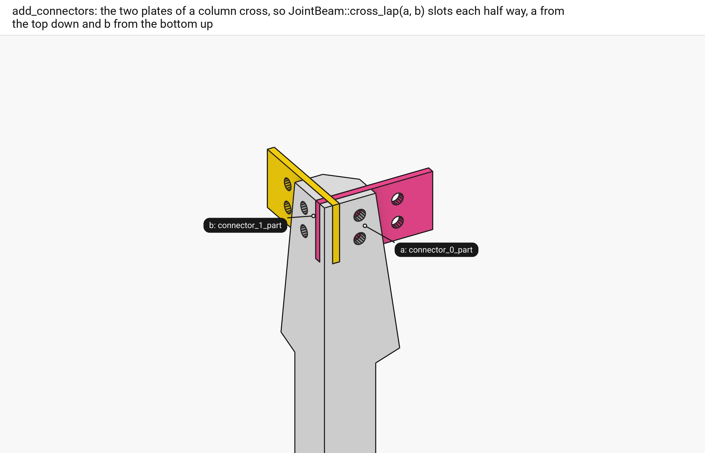

■ a `column_plate_0_0`   ■ b `column_plate_0_1`   ■ context the column

The two plates of a column cross inside its head. `compute_cross_contact(plates[0], plates[1])` finds the crossing; `JointPlate::cr_c_ip_0()`, oriented on it, is the half lap. `add_connectors` adds it last, and each `add_interaction(lap, plate, lap->interaction(i))` merges the lap into that plate's outlines.

Code: `Floor::compute_connectors`, `Floor::add_connectors`, [floor.cpp](https://github.com/petrasvestartas/wood/blob/main/src/templates/floor/floor.cpp); `WoodSession::compute_cross_contact`, [wood_session.cpp](https://github.com/petrasvestartas/wood/blob/main/src/joinery_solver/wood_session.cpp); `JointPlate::cr_c_ip_0`, [wood_element_joint_plate.h](https://github.com/petrasvestartas/wood/blob/main/src/joinery_solver/wood_elements/wood_element_joint_plate.h).

## 263. The block pins

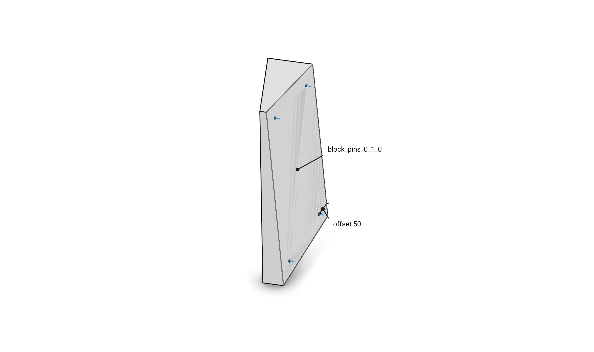

■ built `drill_lines`   ■ input the contact `block_pins_0_1_0`   ■ context the middle column block

The block-pins part of `compute_connectors` calls `JointBeam::centred_pins`.
The contact polygon is inset by 50.
A pin of radius 4 and length 30 crosses the contact at each of the inset's four extreme corners.
An inset with nothing left throws.

Code: `Floor::compute_connectors`, [floor.cpp](https://github.com/petrasvestartas/wood/blob/main/src/templates/floor/floor.cpp); `JointBeam::centred_pins`, [wood_element_joint_beam.cpp](https://github.com/petrasvestartas/wood/blob/main/src/joinery_solver/wood_elements/wood_element_joint_beam.cpp); `inset_polygon`, `extreme_corners`, [wood_element_joint_beam.cpp](https://github.com/petrasvestartas/wood/blob/main/src/joinery_solver/wood_elements/wood_element_joint_beam.cpp).

## 264. Names and groups

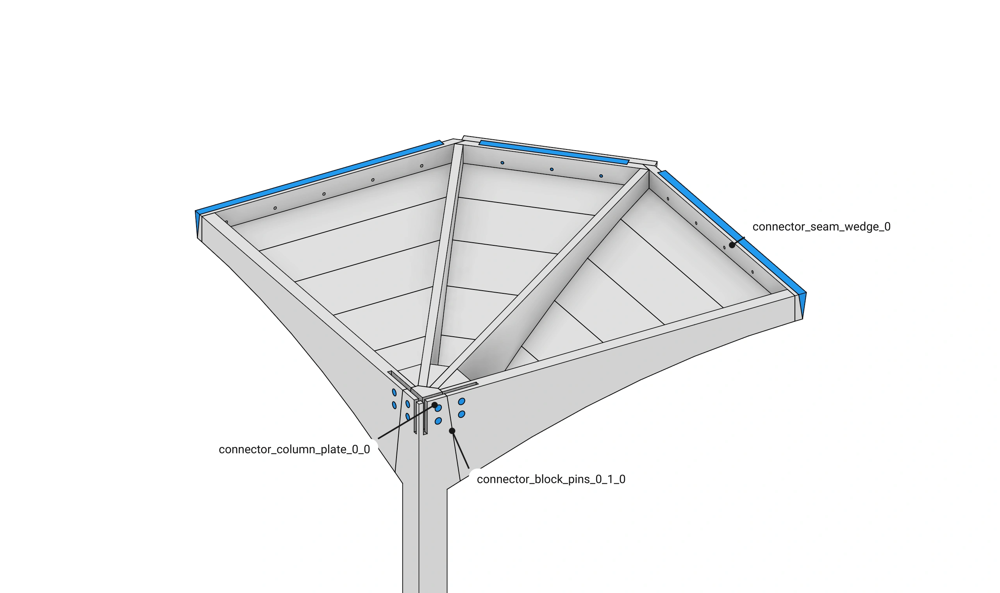

■ built quarter 0's connector parts and pins   ■ context quarter 0's members

Each connector is named after its contact where its factory makes it, `connector_<contact name>`.
Examples are `connector_seam_wedge_0`, `connector_column_plate_0_1`, `connector_block_pins_0_2_1` and `connector_pins_outer_rib_0_0`.
The cross lap, made from two plates, is `connector_cross_lap_<q>`.
`add_connectors` adds each in `connectors_q` of `quarter_q`, in `JointBeam::CONNECTOR_COLOR`.
The oculus wedges `connector_oculus_wedge_<q>` and the ring corner pins `connector_pins_ring_corner_<q>` go in `connectors` of `oculus`.

Code: `Floor::add_connectors`, [floor.cpp](https://github.com/petrasvestartas/wood/blob/main/src/templates/floor/floor.cpp); `connector_name`, [wood_element_joint_beam.cpp](https://github.com/petrasvestartas/wood/blob/main/src/joinery_solver/wood_elements/wood_element_joint_beam.cpp).

## 265. Every connector

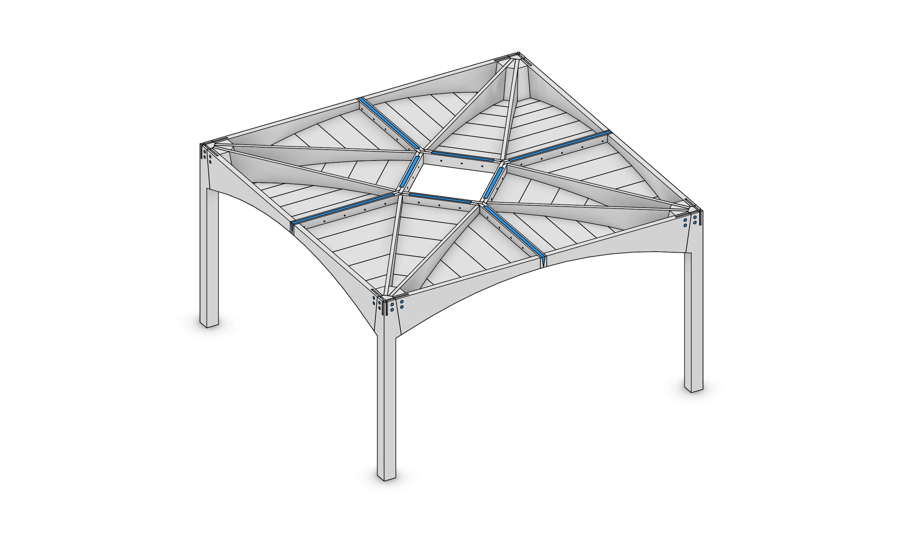

■ built every connector part and pin   ■ context the members, cut

The default floor gets 4 seam wedges and 4 oculus wedges.
It gets 8 column `Plate`s with their 8 plate joints, and 4 cross laps (`JointPlate`).
It gets 24 block pin sets.
The 28 headed pin connectors are on page 10.

Code: `Floor::add_connectors`, [floor.cpp](https://github.com/petrasvestartas/wood/blob/main/src/templates/floor/floor.cpp).
