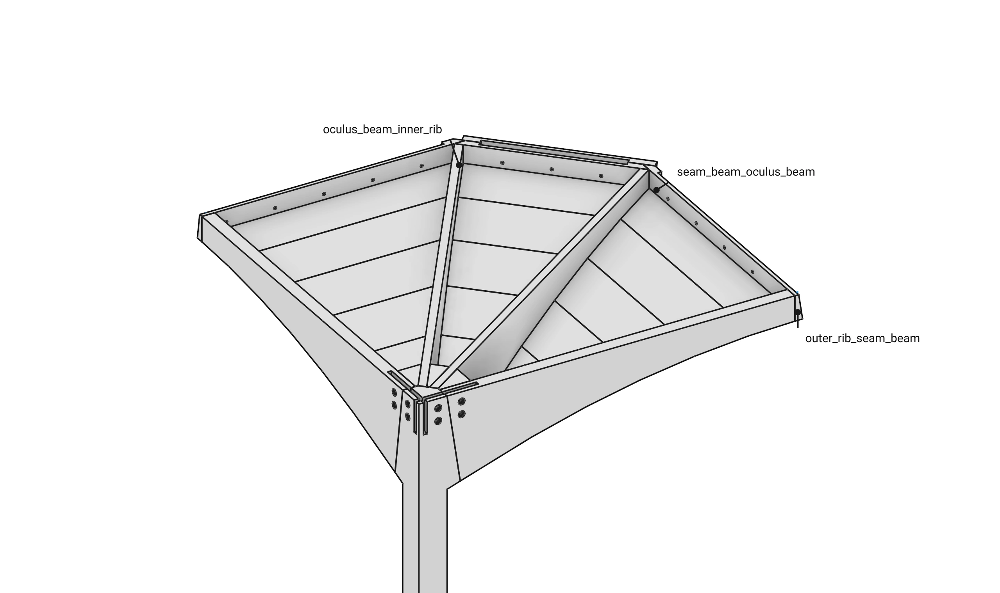
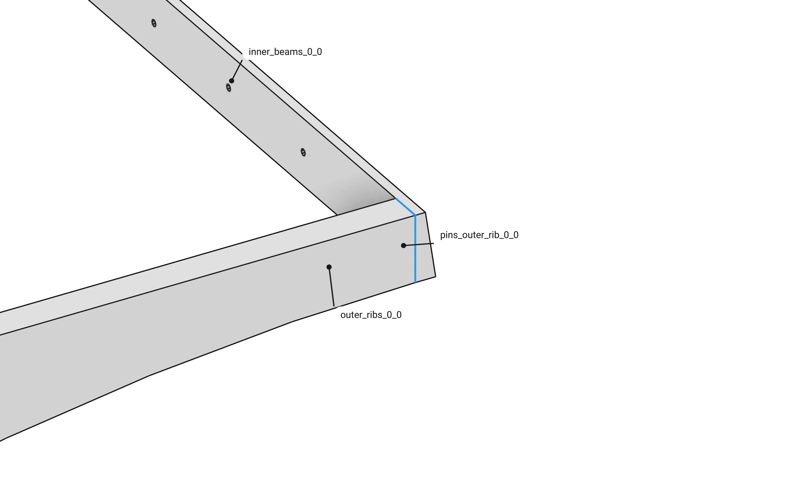
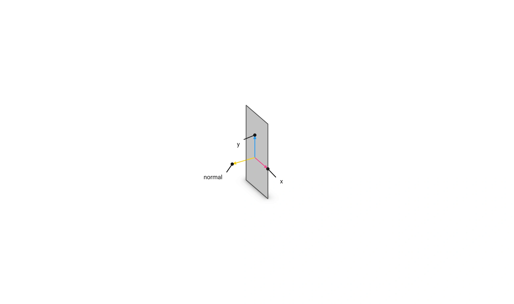
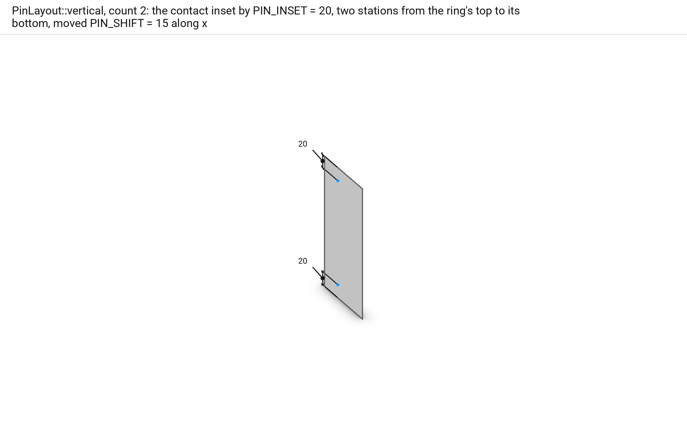
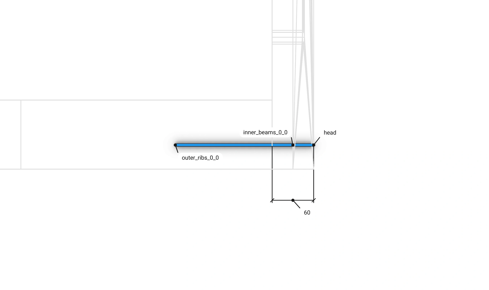
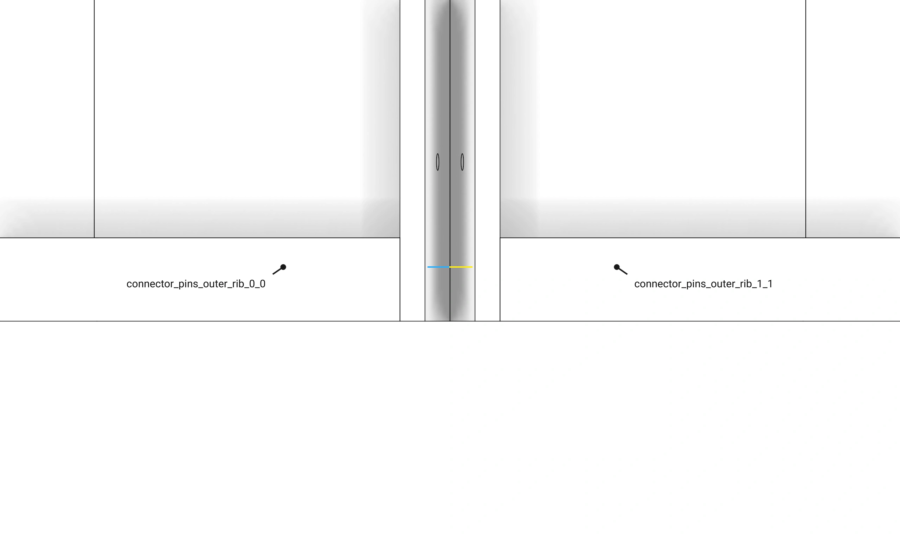
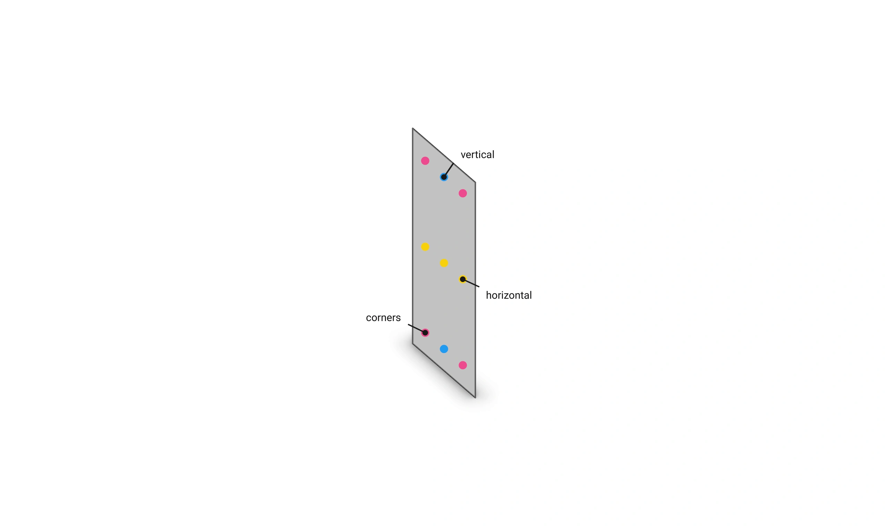
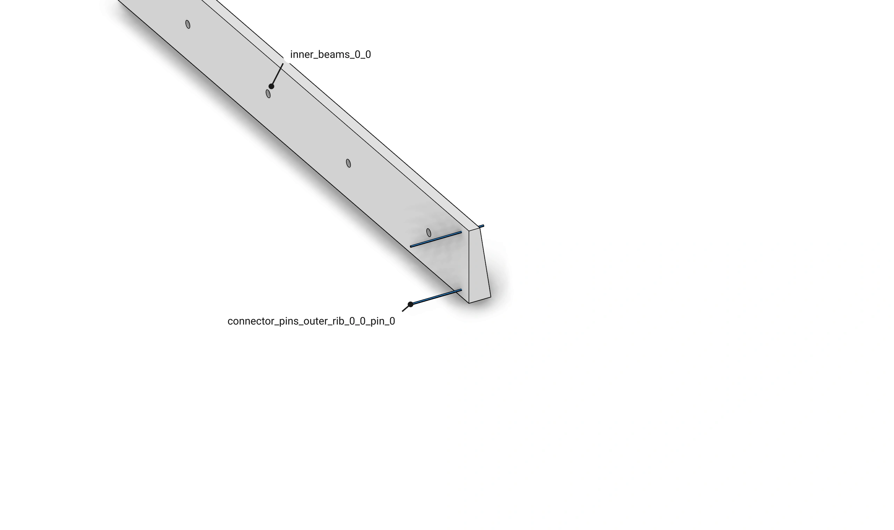
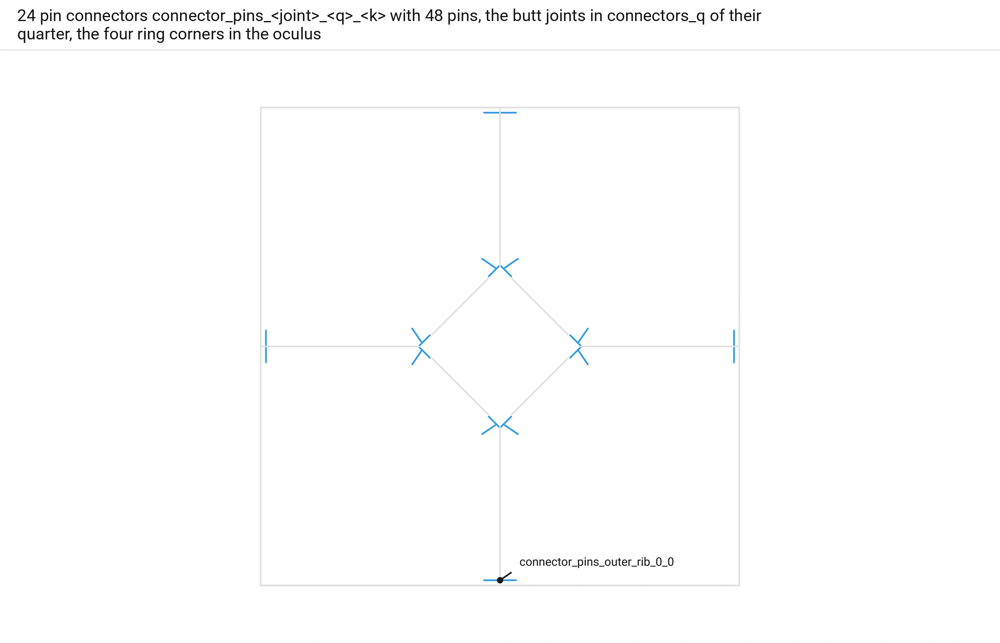

# Floor 10: Pins {#templates_floor_10_pins}

[TOC]

<em>Step 10 of @ref templates_floor_model · previous: @ref templates_floor_09_connectors · next: @ref templates_floor_11_examples</em>

Where one member butts into another, `Floor::compute_connectors` lays two pins across their contact with `JointBeam::headed_pins`.
`add_connectors` adds them, and their holes are pre-drilled into both members.
Per side of a quarter there are three butt joints: the outer rib on its seam beam, the seam beam on the oculus beam and the oculus beam on the inner rib.
At each of the four ring corners, ring beam q butts on the next.
Every pin is a `Pin`, a 200 mm cylinder from its head.
The pins run level along the axis of the member that ends on the contact, from the far face of the other; `headed_pins` chooses which member that is.
Both members read the same drill lines.

Example: [templates_floor_7_contacts_cantilevers.cpp](https://github.com/petrasvestartas/wood/blob/main/examples/templates_floor_7_contacts_cantilevers.cpp) builds the floor with its pins.

## 301. Pins



<span style="color:#2196EA">■ built</span> the pin connectors of quarter 0   <span style="color:#A3A3A3">■ context</span> quarter 0's members

Per quarter there are two `outer_rib_seam_beam`, two `seam_beam_oculus_beam` and two `oculus_beam_inner_rib` connectors and one `ring_corner`.
Each holds two pins.
That is 7 connectors and 14 pins per quarter, 28 connectors and 56 pins in the floor.

Code: `Floor::compute_connectors`, [floor.cpp](https://github.com/petrasvestartas/wood/blob/main/src/templates/floor/floor.cpp); `QuarterConnectors`, [floor.h](https://github.com/petrasvestartas/wood/blob/main/src/templates/floor/floor.h).

## 302. The contact



<span style="color:#737373">■ input</span> the contact `pins_outer_rib_0_0`   <span style="color:#A3A3A3">■ context</span> the seam beam and the outer rib

`add_contacts` stores `pins_outer_rib_0_0` with the seam beam first, the member the pins pass through, then the outer rib.
`headed_pins` turns the contact's normal to point into the member that ends on it, here the rib.

Code: `Floor::add_contacts`, [floor.cpp](https://github.com/petrasvestartas/wood/blob/main/src/templates/floor/floor.cpp); `JointBeam::headed_pins`, [wood_element_joint_beam.cpp](https://github.com/petrasvestartas/wood/blob/main/src/joinery_solver/wood_elements/wood_element_joint_beam.cpp).

## 303. The axes



<span style="color:#E8478B">■ variable</span> `x` and `y`   <span style="color:#737373">■ input</span> the contact

x runs level along the contact, z cross the normal.
y runs up it.
So vertical means up however narrow the face.

Code: `JointBeam::headed_pins`, [wood_element_joint_beam.cpp](https://github.com/petrasvestartas/wood/blob/main/src/joinery_solver/wood_elements/wood_element_joint_beam.cpp).

## 304. The stations



<span style="color:#E8478B">■ variable</span> the two stations   <span style="color:#737373">■ input</span> the inset contact

`PinLayout::vertical` with two pins insets the contact by `PIN_INSET` = 20.
One station stands at the inset contact's top and one at its bottom.
For `pins_outer_rib` and `pins_seam_beam` both are moved by `PIN_SHIFT` = 15 along x.

Code: `JointBeam::headed_pins`, [wood_element_joint_beam.cpp](https://github.com/petrasvestartas/wood/blob/main/src/joinery_solver/wood_elements/wood_element_joint_beam.cpp); `Floor::compute_connectors`, [floor.cpp](https://github.com/petrasvestartas/wood/blob/main/src/templates/floor/floor.cpp).

## 305. The head



<span style="color:#F2CC0C">■ result</span> the pin head   <span style="color:#E8478B">■ variable</span> the pin's direction   <span style="color:#A3A3A3">■ context</span> the two members

`pin_head` goes back from the station along the pin's direction, the level axis of the member that ends on the contact.
It puts the head where the line leaves the other member's stock.
The pin runs 200 from there into the member that ends.

Code: `pin_head`, `JointBeam::headed_pins`, [wood_element_joint_beam.cpp](https://github.com/petrasvestartas/wood/blob/main/src/joinery_solver/wood_elements/wood_element_joint_beam.cpp).

## 306. Two quarters at a seam



<span style="color:#2196EA">■ built</span> the two quarters' pins   <span style="color:#A3A3A3">■ context</span> the seam beams

Only `outer_rib_seam_beam` and `seam_beam_oculus_beam` are shifted.
The two quarters' contacts at a seam face opposite ways, so the same `PIN_SHIFT` along each puts their pins either side: the heads stand 30 apart.
The inner rib and ring corner pins have no shift.

```cpp
quarter_connectors.outer_rib_seam_beam[k] = JointBeam::headed_pins(
    *outer.a,
    *outer.b,
    *outer.face,
    PinLayout::vertical,
    2,
    PIN_INSET,
    PIN_SHIFT,
    PIN_RADIUS,
    PIN_LENGTH
);
```

Code: `Floor::compute_connectors`, [floor.cpp](https://github.com/petrasvestartas/wood/blob/main/src/templates/floor/floor.cpp).

## 307. The layouts



<span style="color:#E8478B">■ variable</span> the stations of each layout   <span style="color:#737373">■ input</span> the contact

`PinLayout` on the same contact: `corners` at the inset contact's extreme corners, `vertical` a column up it, `horizontal` a row along it.
The floor uses `vertical`.

Code: `PinLayout`, [wood_element_joint_beam.h](https://github.com/petrasvestartas/wood/blob/main/src/joinery_solver/wood_elements/wood_element_joint_beam.h); `JointBeam::headed_pins`, [wood_element_joint_beam.cpp](https://github.com/petrasvestartas/wood/blob/main/src/joinery_solver/wood_elements/wood_element_joint_beam.cpp).

## 308. The Pin children



<span style="color:#2196EA">■ built</span> the `Pin` children   <span style="color:#A3A3A3">■ context</span> the two members

A pin connector nests one `Pin` per line, named `connector_pins_outer_rib_0_0_pin_i`.
Its holes are pre-drilled into both members, a Ø4 hole (radius 2) each.

Code: `JointBeam::children`, [wood_element_joint_beam.cpp](https://github.com/petrasvestartas/wood/blob/main/src/joinery_solver/wood_elements/wood_element_joint_beam.cpp); `Pin`, [wood_element_pin.h](https://github.com/petrasvestartas/wood/blob/main/src/joinery_solver/wood_elements/wood_element_pin.h).

## 309. Every pin



<span style="color:#2196EA">■ built</span> every pin   <span style="color:#A3A3A3">■ context</span> the members

28 pin connectors `connector_pins_<joint>_<place>` hold 56 pins.
The butt joints are in `connectors_q` of their quarter.
The four ring corners are in `connectors` of `oculus`.

Code: `Floor::add_connectors`, [floor.cpp](https://github.com/petrasvestartas/wood/blob/main/src/templates/floor/floor.cpp).
