# Floor 10: Screws {#templates_floor_10_screws}

`Floor::add_screws` adds the 72 assembly screws, 36 rows of two, after every other connector, reading only the guide; each is a horizontal 200 mm line built in a slice below the datum, lifted by `bay_height` and turned into a pre-drill `JointBeam`, and `check_screws` then measures them. Values are for `FloorGuide::rectangle(3000, 3000)` with `seam_through_ribs = true`, except frame 213, which uses the tied 6000 x 4800 bay.

Example: [templates_floor_7_contacts_cantilevers.cpp](https://github.com/petrasvestartas/wood/blob/44f9aa85952d32a9264125f4e9940e55b05a4512/examples/templates_floor_7_contacts_cantilevers.cpp) builds the square bay with every connector and calls `add_screws`, the 72 screws of this chapter; [templates_floor_8_rectangle.cpp](https://github.com/petrasvestartas/wood/blob/44f9aa85952d32a9264125f4e9940e55b05a4512/examples/templates_floor_8_rectangle.cpp) does the same on the tied 6000 x 4800 bay of frame 213.

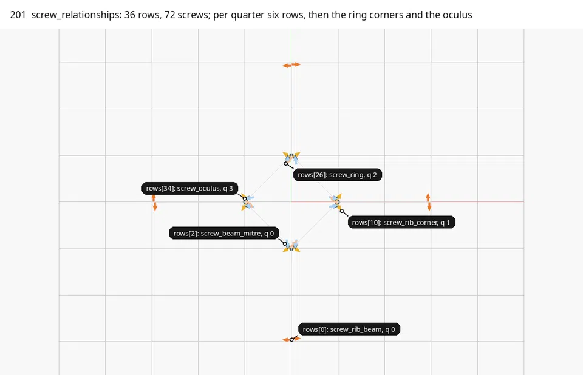

■ built what the step builds   ■ variable the value it introduces or measures   ■ result a second result   ■ input what it reads, dashed for a helper   ■ context the rest; member families in their own colours where a frame tells them apart

## 200. add_screws entry

`Floor::add_screws` calls `add_connectors` with `SCREW_RELATIONS`, which builds one `JointBeam::screws` connector per screw row and adds it as `connector_screws_<i>` under `connectors_q` of its quarter.

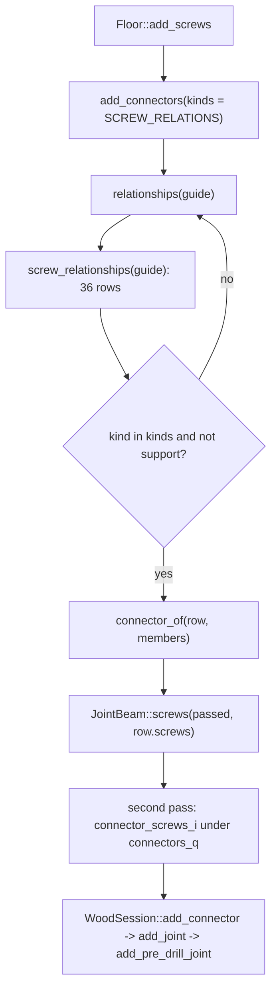
```mermaid
flowchart TD
    A["Floor::add_screws"] --> B["add_connectors(kinds = SCREW_RELATIONS)"]
    B --> C["relationships(guide)"]
    C --> D["screw_relationships(guide): 36 rows"]
    D --> E{"kind in kinds and not support?"}
    E -- yes --> F["connector_of(row, members)"]
    F --> G["JointBeam::screws(passed, row.screws)"]
    G --> H["second pass: connector_screws_i under connectors_q"]
    H --> I["WoodSession::add_connector -> add_joint -> add_pre_drill_joint"]
    E -- no --> C
```

Code: `Floor::add_screws`, [floor_models.cpp:450-453](https://github.com/petrasvestartas/wood/blob/79d4d5c74fdbb4c7b474b2df14efe7f6c7b72e2f/src/templates/floor/floor_models.cpp#L450-L453); `add_connectors`, [floor_models.cpp:359-402](https://github.com/petrasvestartas/wood/blob/79d4d5c74fdbb4c7b474b2df14efe7f6c7b72e2f/src/templates/floor/floor_models.cpp#L359-L402); `connector_of`, [floor_models.cpp:326-357](https://github.com/petrasvestartas/wood/blob/79d4d5c74fdbb4c7b474b2df14efe7f6c7b72e2f/src/templates/floor/floor_models.cpp#L326-L357); `next_number`, [floor_models.cpp:91-104](https://github.com/petrasvestartas/wood/blob/79d4d5c74fdbb4c7b474b2df14efe7f6c7b72e2f/src/templates/floor/floor_models.cpp#L91-L104).

## 201. Screw row order

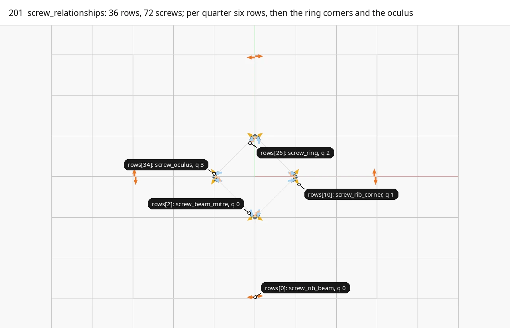

■ screw_rib_beam along an outer rib   ■ screw_beam_mitre along an inner beam   ■ screw_rib_corner along an inner rib   ■ screw_ring along the oculus ring   ■ screw_oculus into the oculus beam   ■ context bay edges and quarters

Per quarter `screw_relationships` appends two `rib_beam`, two `beam_mitre` and two `rib_corner` rows, then four `ring` and eight `oculus` rows: 36 rows of two screws.

Code: `geometry::screw_relationships`, [floor_screws.cpp:326-350](https://github.com/petrasvestartas/wood/blob/79d4d5c74fdbb4c7b474b2df14efe7f6c7b72e2f/src/templates/floor/floor_screws.cpp#L326-L350); `relationships`, [floor_relations.cpp:205-206](https://github.com/petrasvestartas/wood/blob/79d4d5c74fdbb4c7b474b2df14efe7f6c7b72e2f/src/templates/floor/floor_relations.cpp#L205-L206).

## 202. Screw levels

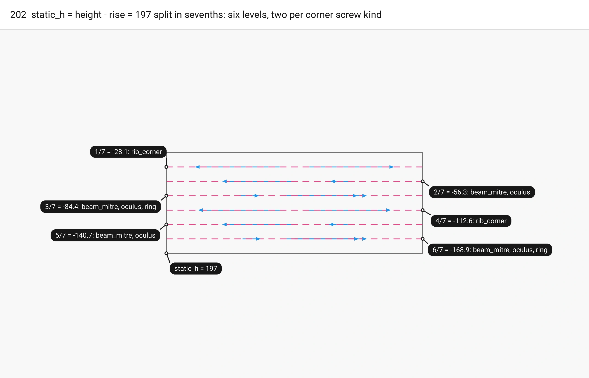

■ built the screws at oculus corner 0   ■ variable `corner_level(1..6, 197)`, the six levels   ■ input `static_h()` = 197, the joint depth

Every screw lies in a slice `level(z)` at `corner_level(levels, depth) = -depth * levels / CORNER_LEVELS`, a seventh of the joint depth `static_h()`, and each corner kind takes two of the six levels to keep crossing screws apart. Only `rib_corner` enforces this (frame 218); every other spacing is tested only by `check_screws`, 8 mm between axes.

| Variable | Value | Meaning |
|---|---|---|
| `static_h()` | 197 | Joint depth at the seams and the oculus |
| `CORNER_LEVELS` | 7 | Divisions of the depth |
| `corner_level(1..6, 197)` | -28.143, -56.286, -84.429, -112.571, -140.714, -168.857 | The six levels below the datum; world 3471.857 to 3331.143 |
| level sets | `MITRE_LEVELS` {2, 5} / {3, 6}, `RIB_CORNER_LEVELS` {1, 4}, `RING_LEVELS` {3, 6}, `OCULUS_LEVELS` {3, 6} / {2, 5} | Sevenths per kind, per `k` where two are given |

Code: `FloorGuide::static_h`, [floor_plan.cpp:14-16](https://github.com/petrasvestartas/wood/blob/79d4d5c74fdbb4c7b474b2df14efe7f6c7b72e2f/src/templates/floor/floor_plan.cpp#L14-L16); constants, [floor_screws.cpp:10-24](https://github.com/petrasvestartas/wood/blob/79d4d5c74fdbb4c7b474b2df14efe7f6c7b72e2f/src/templates/floor/floor_screws.cpp#L10-L24); `corner_level`, [floor_screws.cpp:68-70](https://github.com/petrasvestartas/wood/blob/79d4d5c74fdbb4c7b474b2df14efe7f6c7b72e2f/src/templates/floor/floor_screws.cpp#L68-L70).

## 203. Faces the screws read

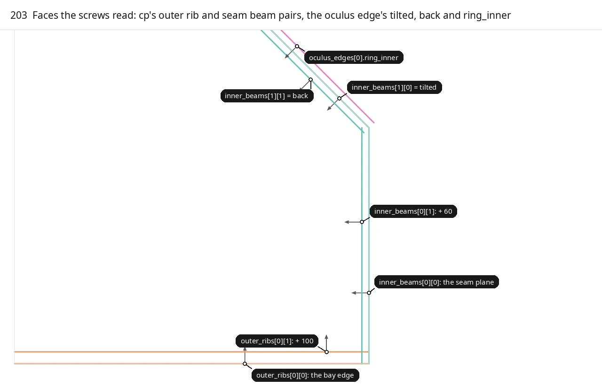

■ built `cp.outer_ribs[0]`, `cp.inner_beams[0]`, `cp.inner_beams[1]`   ■ result `oculus_edges[0].ring_inner`   ■ input the face normals   ■ context quarter 0's polygon

Every screw rule reads face pairs from `cp = guide.geometry[q].planes`: `cp.outer_ribs[k]` (bay edge and rib inner face), `cp.inner_beams[0]` and `[2]` (seam plane and seam beam inner face), `cp.inner_beams[1]` (the oculus beam's tilted and back faces) and `ring_inner`, 120 behind the back face.

Code: `pair`, [floor.cpp:15-17](https://github.com/petrasvestartas/wood/blob/79d4d5c74fdbb4c7b474b2df14efe7f6c7b72e2f/src/templates/floor/floor.cpp#L15-L17); `bay_edge`, [floor.cpp:69-77](https://github.com/petrasvestartas/wood/blob/79d4d5c74fdbb4c7b474b2df14efe7f6c7b72e2f/src/templates/floor/floor.cpp#L69-L77); `oculus_edge`, [floor.cpp:93-103](https://github.com/petrasvestartas/wood/blob/79d4d5c74fdbb4c7b474b2df14efe7f6c7b72e2f/src/templates/floor/floor.cpp#L93-L103); `construction_planes`, [floor.cpp:180-190](https://github.com/petrasvestartas/wood/blob/79d4d5c74fdbb4c7b474b2df14efe7f6c7b72e2f/src/templates/floor/floor.cpp#L180-L190); `Seam::faces_into`, [floor.cpp:418-420](https://github.com/petrasvestartas/wood/blob/79d4d5c74fdbb4c7b474b2df14efe7f6c7b72e2f/src/templates/floor/floor.cpp#L418-L420); soffit, [floor.cpp:461-470](https://github.com/petrasvestartas/wood/blob/79d4d5c74fdbb4c7b474b2df14efe7f6c7b72e2f/src/templates/floor/floor.cpp#L461-L470).

## 204. trace and axis

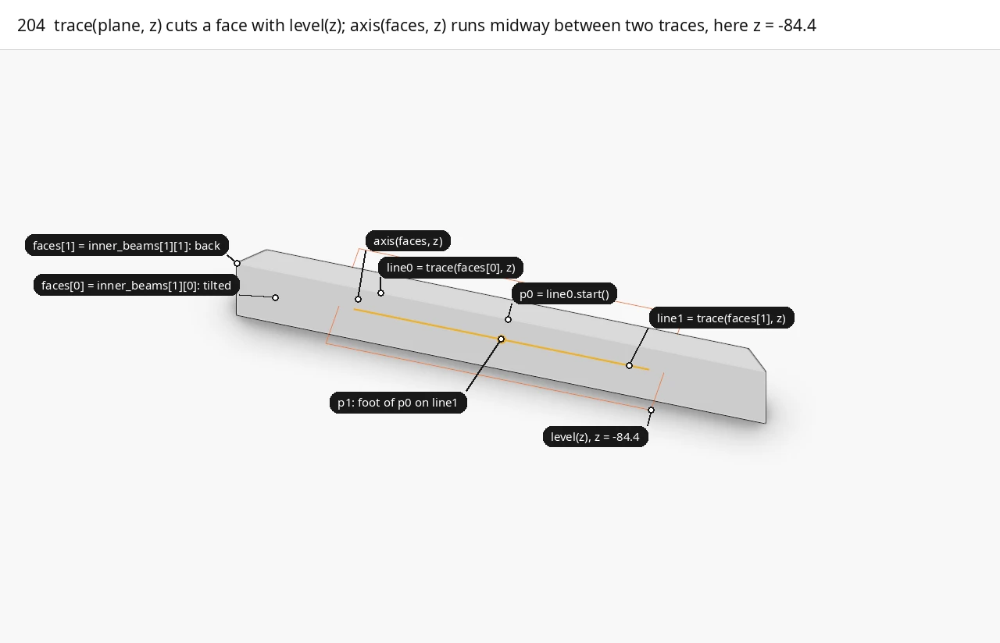

■ built `axis(faces, z)`   ■ result `line0`, `line1` and `p0`, `p1`   ■ variable `level(z)`, z = -84.429   ■ input `p0` to `p1`, a helper   ■ context the oculus beam

`trace(plane, z)` intersects a member face with `level(z)`, the world XY plane moved to `z`, by `plane_plane`, which orients the line along `cross(n_plane, n_level)`. `axis(faces, z)` traces both faces at `z` into `line0` and `line1`. It takes `p0 = line0.start()`, the start of the line `plane_plane` returns (no chosen point on the face), and projects it onto `line1`: `p1 = line1.start() + d * ((p0 - line1.start()) . d)` with `d` the unit direction of `line1`. It returns the line through the midpoint of `p0` and `p1` with `line0`'s direction, the mid-line of the member's section at that level. On the oculus beam the tilted face moves `|z| tan 5 deg` towards the centre per level, so the axis drifts sideways from level to level; the frame shows the slice at 3/7.

`axis(faces, z)` traces both faces of a member at level `z` and returns the line midway between the traces, the mid-line of the section; on the oculus beam it drifts with `z` because the tilted face leans 5 deg.

Code: `trace`, [floor_screws.cpp:40-42](https://github.com/petrasvestartas/wood/blob/79d4d5c74fdbb4c7b474b2df14efe7f6c7b72e2f/src/templates/floor/floor_screws.cpp#L40-L42); `axis`, [floor_screws.cpp:45-55](https://github.com/petrasvestartas/wood/blob/79d4d5c74fdbb4c7b474b2df14efe7f6c7b72e2f/src/templates/floor/floor_screws.cpp#L45-L55); `plane_plane`, [floor_geometry.cpp:31-39](https://github.com/petrasvestartas/wood/blob/79d4d5c74fdbb4c7b474b2df14efe7f6c7b72e2f/src/templates/floor/floor_geometry.cpp#L31-L39); `level`, [floor_geometry.cpp:19-21](https://github.com/petrasvestartas/wood/blob/79d4d5c74fdbb4c7b474b2df14efe7f6c7b72e2f/src/templates/floor/floor_geometry.cpp#L19-L21).

## 205. body and depth

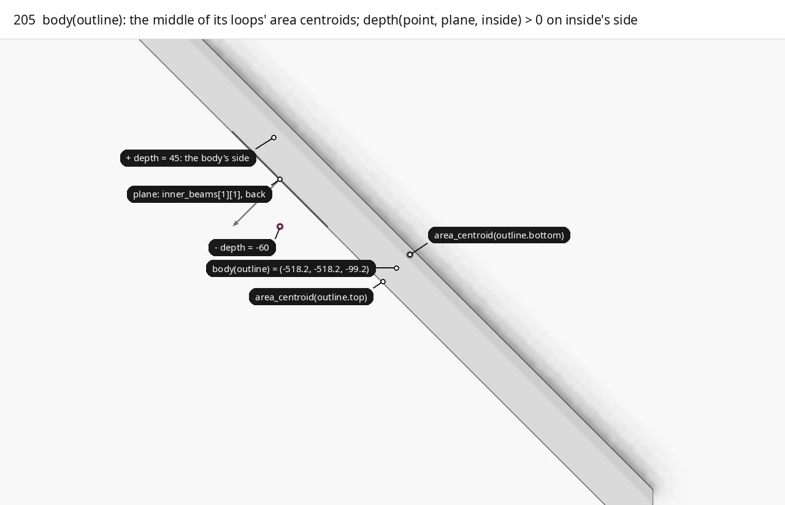

■ built `body(outline)`   ■ variable `depth` at a point on each side   ■ input the two `area_centroid` points and the back face `inner_beams[1][1]`   ■ context the oculus beam

`body(outline)` is the midpoint of the area centroids of the outline's two loops, a point inside the member. `depth(point, plane, inside)` is `signed_distance(point, plane)`, negated when `inside` has a negative signed distance, so a positive value means the point lies on the inside point's side of the face. Every keep-inside test of the screw rules is a `depth` against a body. The frame shows, in plan, the oculus beam's two loop centroids (its tilted-face and back-face loops), its body between them, and the back face with a point on each side.

`body(outline)` is the midpoint of the two loop centroids, a point inside the member, and `depth(point, plane, inside)` is the signed distance to the plane, positive on the inside point's side.

Code: `body`, [floor_screws.cpp:58-60](https://github.com/petrasvestartas/wood/blob/79d4d5c74fdbb4c7b474b2df14efe7f6c7b72e2f/src/templates/floor/floor_screws.cpp#L58-L60); `depth`, [floor_screws.cpp:63-65](https://github.com/petrasvestartas/wood/blob/79d4d5c74fdbb4c7b474b2df14efe7f6c7b72e2f/src/templates/floor/floor_screws.cpp#L63-L65); `area_centroid`, [floor_geometry.cpp:180-195](https://github.com/petrasvestartas/wood/blob/79d4d5c74fdbb4c7b474b2df14efe7f6c7b72e2f/src/templates/floor/floor_geometry.cpp#L180-L195); `signed_distance`, [floor_geometry.cpp:164-166](https://github.com/petrasvestartas/wood/blob/79d4d5c74fdbb4c7b474b2df14efe7f6c7b72e2f/src/templates/floor/floor_geometry.cpp#L164-L166).

## 206. along_axis

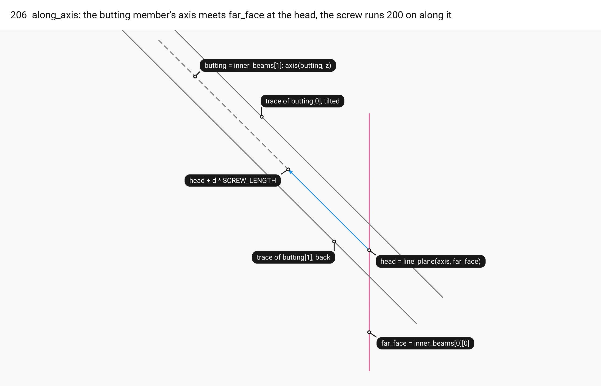

■ built the screw `head -> head + d * SCREW_LENGTH` and its `head`   ■ variable `far_face` = `inner_beams[0][0]`, the seam plane   ■ input `butting`'s traces, tilted and back, and `axis(butting, z)`, a helper

`along_axis(butting, far_face, butting_body, z)` puts the head where the butting member's axis meets the side member's far face and runs the screw 200 mm along that axis towards `butting_body`.

Code: `along_axis`, [floor_screws.cpp:77-87](https://github.com/petrasvestartas/wood/blob/79d4d5c74fdbb4c7b474b2df14efe7f6c7b72e2f/src/templates/floor/floor_screws.cpp#L77-L87).

## 207. from_seam_face

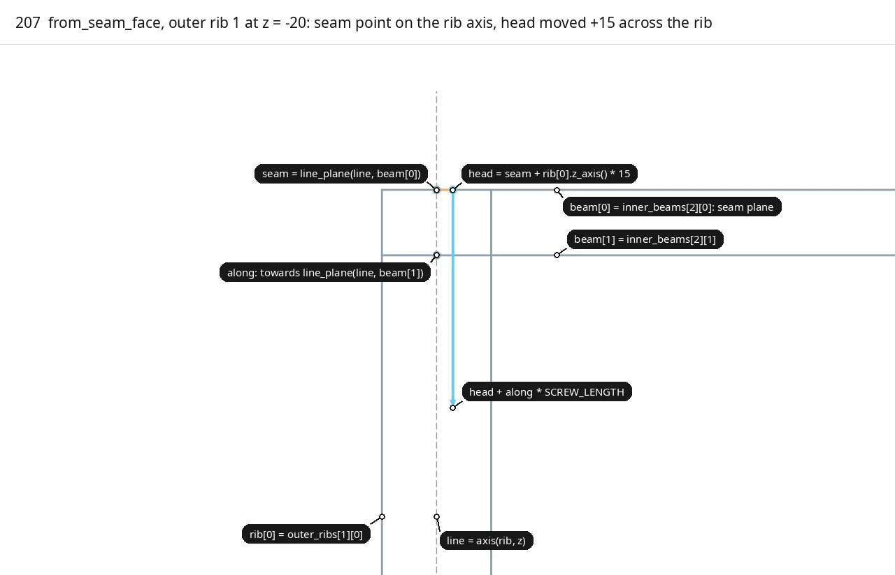

■ built the screw and its `head`   ■ variable `offset` = +15, from `seam` to `head`   ■ input `rib` and `beam` faces, `line = axis(rib, z)`, `seam` and `line_plane(line, beam[1])`

`from_seam_face(rib, beam, z, offset)` moves the rib axis `offset` across the rib, puts the head where it meets the seam plane `beam[0]`, and runs the screw 200 mm parallel to the rib axis into the rib end. Moving the axis, not the seam point, keeps the head on the seam plane when a skewed bay meets the seam at an angle.

Code: `from_seam_face`, [floor_screws.cpp:90-98](https://github.com/petrasvestartas/wood/blob/79d4d5c74fdbb4c7b474b2df14efe7f6c7b72e2f/src/templates/floor/floor_screws.cpp#L90-L98).

## 208. rib_beam: which seam beam

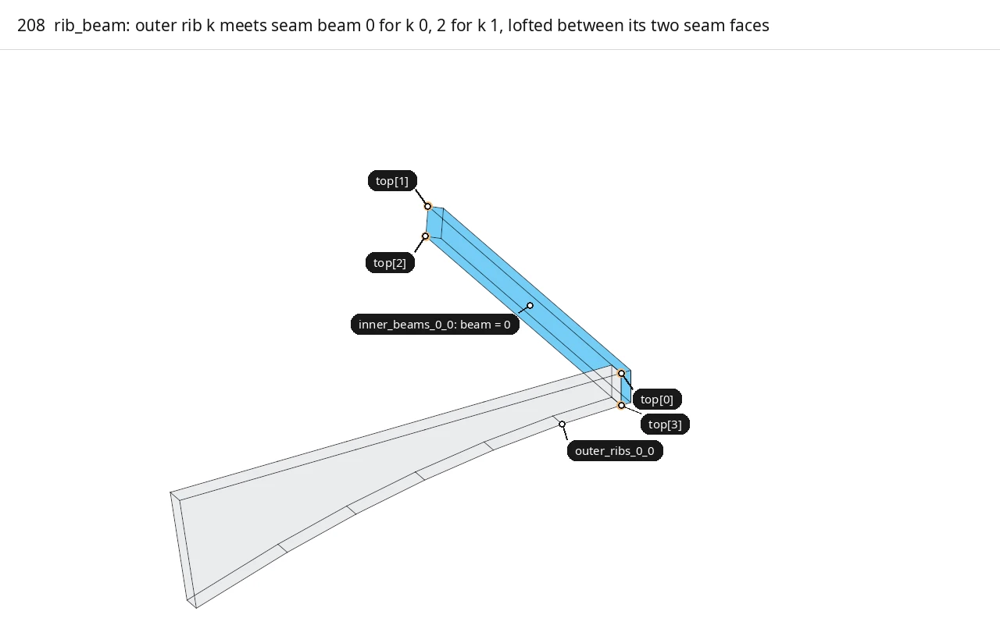

■ built `inner_beams_0_0`, `beam = 0`   ■ variable its `top[0..3]` corners   ■ context outer rib 0

`rib_beam(guide, q, k)` screws outer rib `k` to the seam beam on its side, `beam = 0` for `k = 0` and `beam = 2` for `k = 1`.

Code: `rib_beam`, [floor_screws.cpp:210-218](https://github.com/petrasvestartas/wood/blob/79d4d5c74fdbb4c7b474b2df14efe7f6c7b72e2f/src/templates/floor/floor_screws.cpp#L210-L218); `Quarter::inner_beams`, [floor_members.cpp:93-105](https://github.com/petrasvestartas/wood/blob/79d4d5c74fdbb4c7b474b2df14efe7f6c7b72e2f/src/templates/floor/floor_members.cpp#L93-L105); `loft_planes`, [floor_geometry.cpp:273-296](https://github.com/petrasvestartas/wood/blob/79d4d5c74fdbb4c7b474b2df14efe7f6c7b72e2f/src/templates/floor/floor_geometry.cpp#L273-L296).

## 209. rib_beam: levels

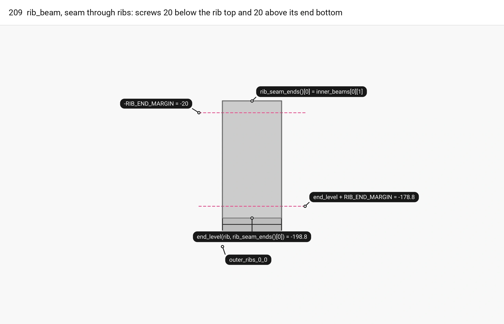

■ variable the two screw levels, `-RIB_END_MARGIN` and `end_level + RIB_END_MARGIN`   ■ input the rib's end face on `rib_seam_ends()[0]`   ■ context outer rib 0

With `seam_through_ribs` the two levels are `-RIB_END_MARGIN` and `end_level + RIB_END_MARGIN`, 20 below the rib top and 20 above its end bottom: -20 and -178.783.

Code: `rib_beam`, [floor_screws.cpp:219-225](https://github.com/petrasvestartas/wood/blob/79d4d5c74fdbb4c7b474b2df14efe7f6c7b72e2f/src/templates/floor/floor_screws.cpp#L219-L225); `end_level`, [floor_geometry.cpp:168-178](https://github.com/petrasvestartas/wood/blob/79d4d5c74fdbb4c7b474b2df14efe7f6c7b72e2f/src/templates/floor/floor_geometry.cpp#L168-L178); `Quarter::rib_seam_ends`, [floor_members.cpp:69-75](https://github.com/petrasvestartas/wood/blob/79d4d5c74fdbb4c7b474b2df14efe7f6c7b72e2f/src/templates/floor/floor_members.cpp#L69-L75).

## 210. rib_beam: axis meets the seam plane

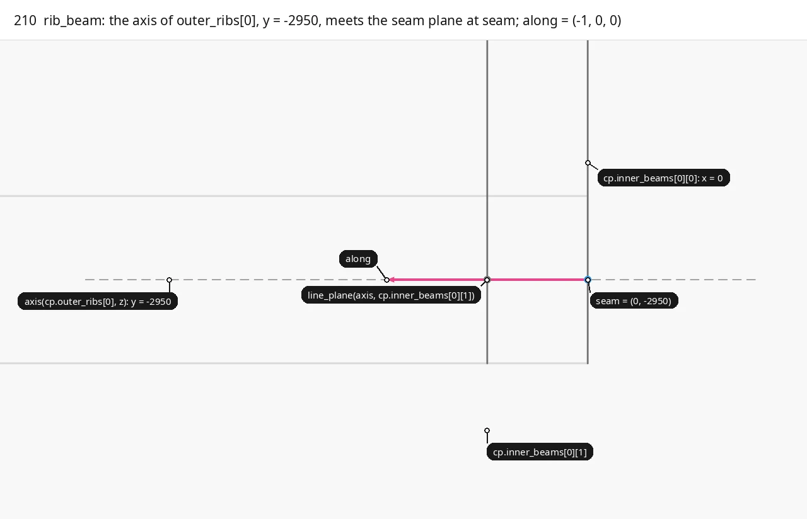

■ built `seam` = (0, -2950)   ■ variable `along` = (-1, 0, 0)   ■ input the axis of `cp.outer_ribs[0]`, the faces `cp.inner_beams[0][0]` and `[1]`, the point on `[1]`   ■ context outer rib 0's faces

At each level `seam` is where the rib axis meets the seam plane, and `along` is the unit vector from there into the beam towards the rib.

Code: `rib_beam`, [floor_screws.cpp:225-226](https://github.com/petrasvestartas/wood/blob/79d4d5c74fdbb4c7b474b2df14efe7f6c7b72e2f/src/templates/floor/floor_screws.cpp#L225-L226); `from_seam_face`, [floor_screws.cpp:92-94](https://github.com/petrasvestartas/wood/blob/79d4d5c74fdbb4c7b474b2df14efe7f6c7b72e2f/src/templates/floor/floor_screws.cpp#L92-L94).

## 211. rib_beam: heads 30 apart

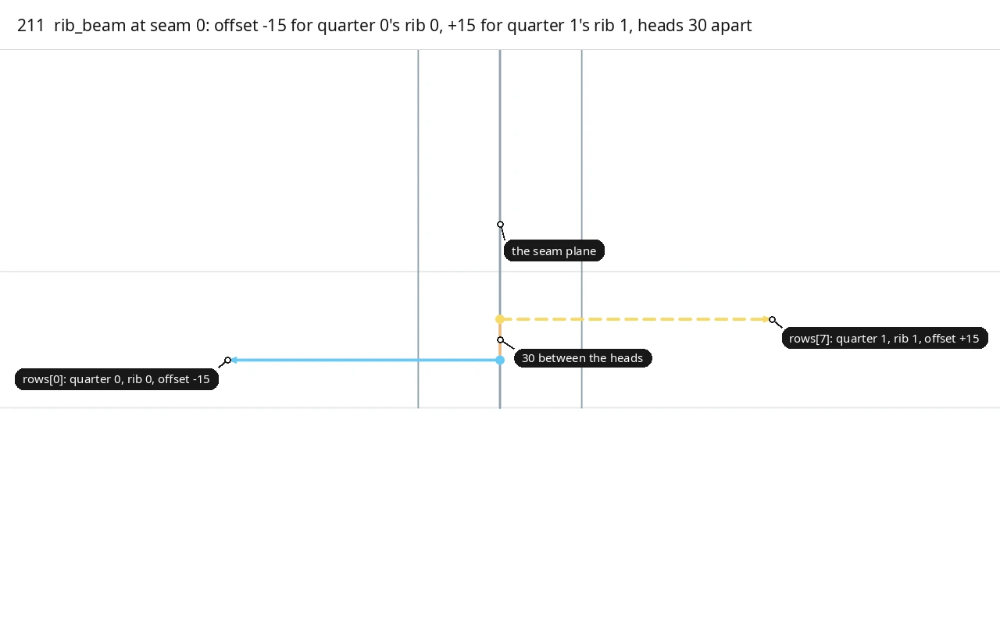

■ built `rows[0]`: quarter 0's rib 0, offset -15   ■ result `rows[7]`: quarter 1's rib 1, offset +15, dashed   ■ variable the head gap, 30   ■ input the seam plane and the seam beams' inner faces   ■ context outer rib 0's faces

The head is `seam` moved -15 for `k = 0` and +15 for `k = 1` along the rib face normal, so two ribs on one seam have heads 30 mm apart; each screw runs 60 mm through the seam beam and 140 mm into the rib.

Code: `from_seam_face`, [floor_screws.cpp:95-97](https://github.com/petrasvestartas/wood/blob/79d4d5c74fdbb4c7b474b2df14efe7f6c7b72e2f/src/templates/floor/floor_screws.cpp#L95-L97); `rib_beam`, [floor_screws.cpp:226](https://github.com/petrasvestartas/wood/blob/79d4d5c74fdbb4c7b474b2df14efe7f6c7b72e2f/src/templates/floor/floor_screws.cpp#L226).

## 212. rib_beam: contact

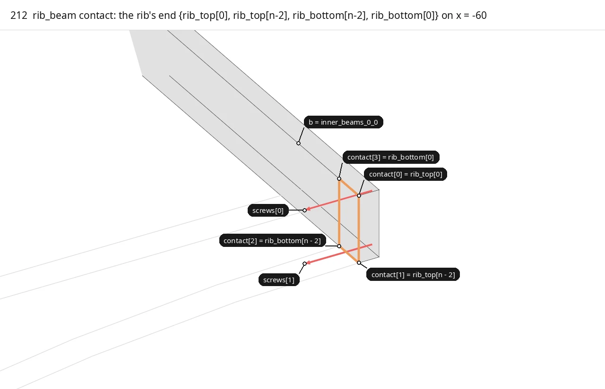

■ built the contact, the rib's end   ■ input `screws[0]`, `screws[1]`   ■ context seam beam 0 and outer rib 0

The contact is the rib's end face on the seam beam's inner face, with `a` outer rib `k` and `b` the seam beam.

Code: `rib_beam`, [floor_screws.cpp:220-228](https://github.com/petrasvestartas/wood/blob/79d4d5c74fdbb4c7b474b2df14efe7f6c7b72e2f/src/templates/floor/floor_screws.cpp#L220-L228); `rib_loop`, [floor_members.cpp:17-32](https://github.com/petrasvestartas/wood/blob/79d4d5c74fdbb4c7b474b2df14efe7f6c7b72e2f/src/templates/floor/floor_members.cpp#L17-L32).

## 213. rib_beam: tied variant

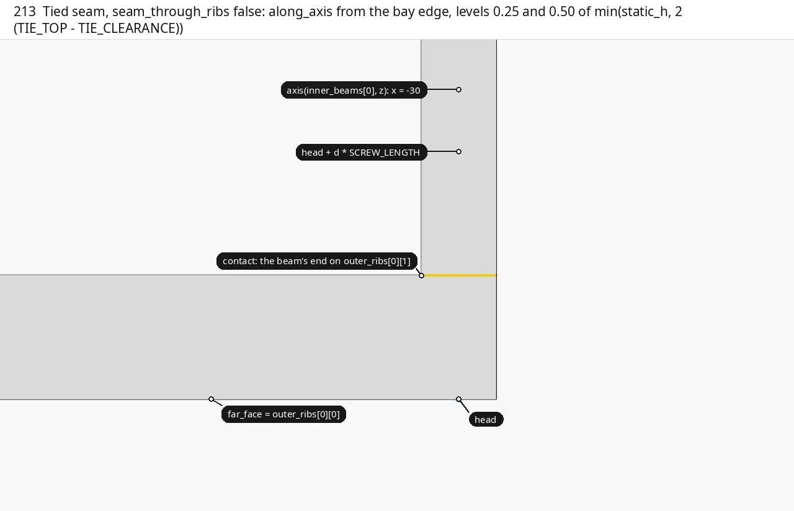

■ built the screws and their `head`   ■ result the contact, the beam's end on `outer_ribs[0][1]`   ■ input `axis(inner_beams[0], z)`, a helper   ■ context outer rib 0 and seam beam 0

When `seam_through_ribs` is false the seam beam ends on the rib, so `along_axis` heads on the bay edge plane and runs 100 mm through the rib and 100 mm into the beam, at `RIB_BEAM_LEVELS` {0.25, 0.5} of `depth = min(static_h, 2 (TIE_TOP - TIE_CLEARANCE))`. That limit keeps the lower screw `TIE_CLEARANCE` above the tie key; the contact is the beam end clipped to the rib by `overlap`.

Code: `rib_beam`, [floor_screws.cpp:231-238](https://github.com/petrasvestartas/wood/blob/79d4d5c74fdbb4c7b474b2df14efe7f6c7b72e2f/src/templates/floor/floor_screws.cpp#L231-L238); `TIE_TOP`, `TIE_CLEARANCE`, [floor.h](https://github.com/petrasvestartas/wood/blob/16f3ab0a2386bf39ac7f7123c0a20d03e73ab1a5/src/templates/floor/floor.h), [floor_screws.cpp:14](https://github.com/petrasvestartas/wood/blob/79d4d5c74fdbb4c7b474b2df14efe7f6c7b72e2f/src/templates/floor/floor_screws.cpp#L14).

## 214. screw_row lift

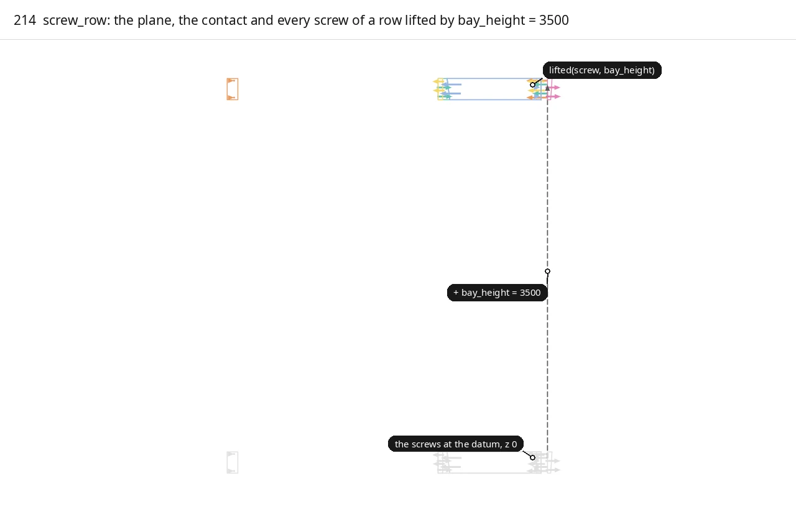

■ built quarter 0's rows lifted, `row.contact` and `row.screws`   ■ variable `bay_height` = 3500   ■ input the same rows at the datum, z 0

`screw_row` builds the `Relationship` and lifts its plane, contact and screws by `bay_height` = 3500 from the datum to the floor top.

Code: `screw_row`, [floor_screws.cpp:178-193](https://github.com/petrasvestartas/wood/blob/79d4d5c74fdbb4c7b474b2df14efe7f6c7b72e2f/src/templates/floor/floor_screws.cpp#L178-L193); `lifted`, [floor_geometry.cpp:208-218](https://github.com/petrasvestartas/wood/blob/79d4d5c74fdbb4c7b474b2df14efe7f6c7b72e2f/src/templates/floor/floor_geometry.cpp#L208-L218).

## 215. beam_mitre: contact

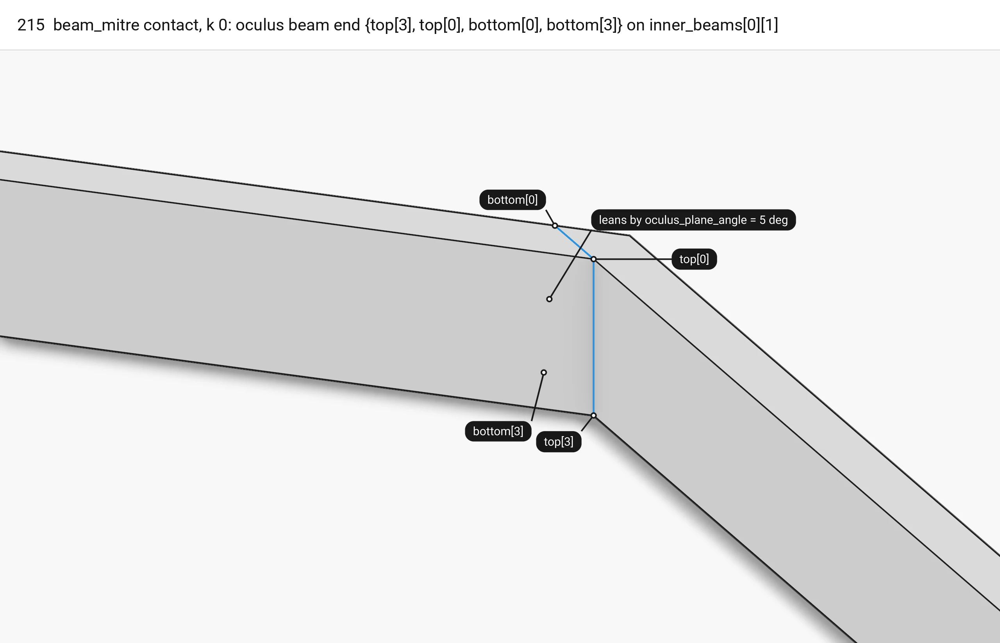

■ built the contact k 0, `{top[3], top[0], bottom[0], bottom[3]}`   ■ context seam beam 0 and the oculus beam

`beam_mitre(guide, q, k)` takes as contact the oculus beam's end on seam beam 0 (`k = 0`) or 2 (`k = 1`), which leans by `oculus_plane_angle`.

Code: `beam_mitre`, [floor_screws.cpp:242-249](https://github.com/petrasvestartas/wood/blob/79d4d5c74fdbb4c7b474b2df14efe7f6c7b72e2f/src/templates/floor/floor_screws.cpp#L242-L249); `Quarter::inner_beams`, [floor_members.cpp:102](https://github.com/petrasvestartas/wood/blob/79d4d5c74fdbb4c7b474b2df14efe7f6c7b72e2f/src/templates/floor/floor_members.cpp#L102).

## 216. beam_mitre: screws

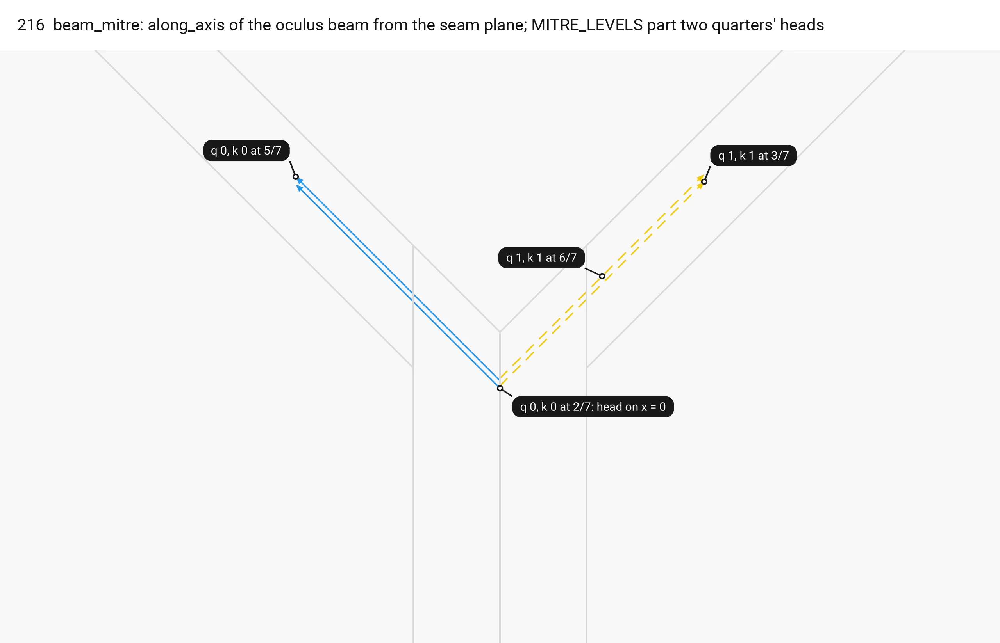

■ built quarter 0's k 0   ■ result quarter 1's k 1, dashed   ■ context the seam and oculus beam quads

At `MITRE_LEVELS[k]` `along_axis` runs each screw from the seam plane along the oculus beam's axis, 84.85 mm through the seam beam at 45 deg in plan, then into the oculus beam. Quarter 0's k 0 and quarter 1's k 1 would share a head at oculus corner 0, so they take level pairs one seventh apart.

Code: `beam_mitre`, [floor_screws.cpp:252-255](https://github.com/petrasvestartas/wood/blob/79d4d5c74fdbb4c7b474b2df14efe7f6c7b72e2f/src/templates/floor/floor_screws.cpp#L252-L255).

## 217. corner_faces

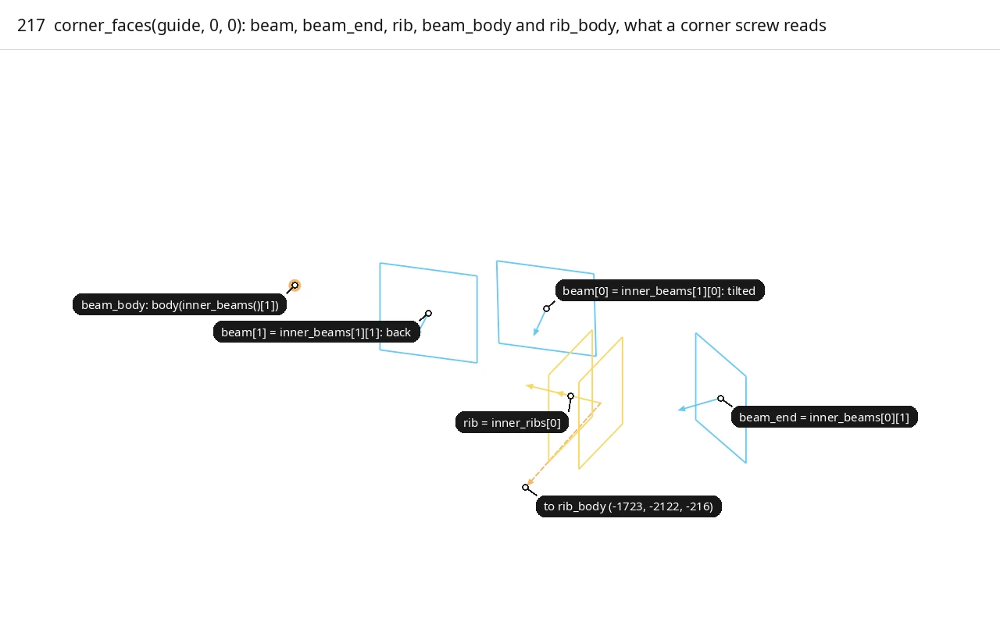

■ built `beam` (tilted, back) and `beam_end`   ■ result `rib = cp.inner_ribs[0]`   ■ variable `beam_body` and the way to `rib_body`

`corner_faces(guide, q, k)` gathers what a corner screw reads: the oculus beam's tilted and back faces `beam`, the seam beam's inner face `beam_end`, inner rib `k`'s faces `rib`, and `beam_body`, `rib_body`.

Code: `CornerFaces`, [floor_screws.cpp:27-33](https://github.com/petrasvestartas/wood/blob/79d4d5c74fdbb4c7b474b2df14efe7f6c7b72e2f/src/templates/floor/floor_screws.cpp#L27-L33); `corner_faces`, [floor_screws.cpp:196-207](https://github.com/petrasvestartas/wood/blob/79d4d5c74fdbb4c7b474b2df14efe7f6c7b72e2f/src/templates/floor/floor_screws.cpp#L196-L207).

## 218. rib_corner screws

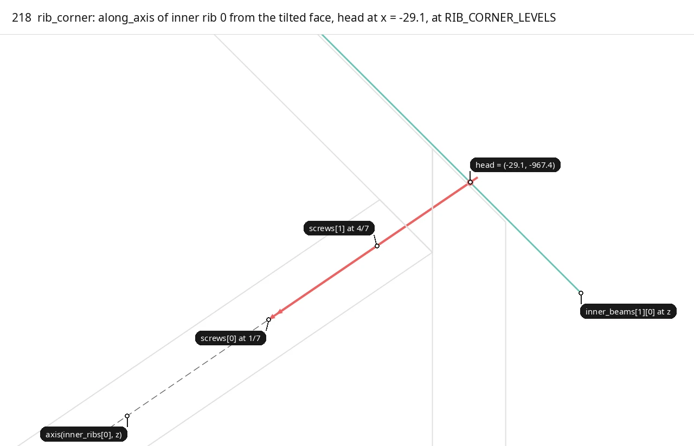

■ built the two screws and their `head`   ■ input `inner_beams[1][0]`, the tilted face, and `axis(inner_ribs[0], z)`, a helper   ■ context the beam and rib quads

At `RIB_CORNER_LEVELS` {1, 4} `along_axis` heads where the inner rib's axis leaves the oculus beam's tilted face and runs through the oculus beam into the rib end. If a head lies closer to the seam plane than half `SCREW_SPACING`, `rib_corner` throws `std::runtime_error` ("the bay is too narrow for the corner screws"), on default sizes below about 6000 x 3480.

Code: `rib_corner`, [floor_screws.cpp:259-286](https://github.com/petrasvestartas/wood/blob/79d4d5c74fdbb4c7b474b2df14efe7f6c7b72e2f/src/templates/floor/floor_screws.cpp#L259-L286).

## 219. rib_corner: through the seam beam

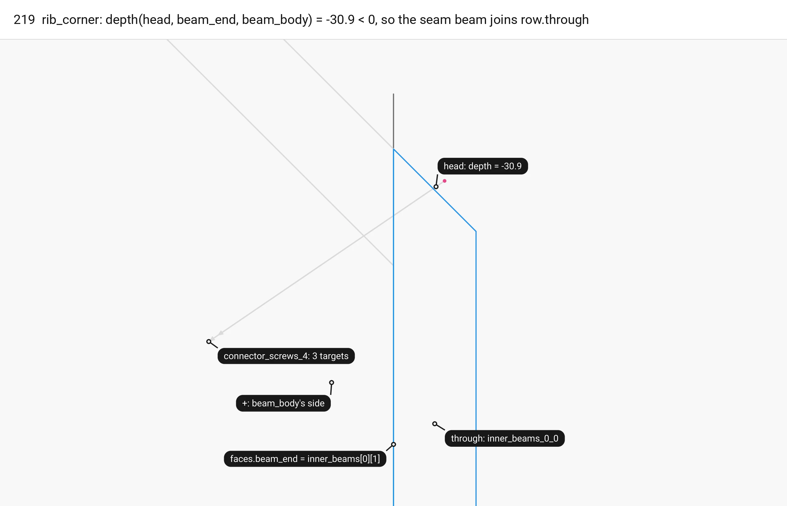

■ built `inner_beams_0_0`, pushed to `row.through`   ■ variable the heads, `depth(head, beam_end, beam_body)`   ■ input `faces.beam_end`   ■ context the oculus beam and the screws

When a head lies inside the seam beam, `depth(head, faces.beam_end, faces.beam_body) < 0`, the seam beam joins `row.through`, so every default `rib_corner` connector has three targets.

Code: `rib_corner`, [floor_screws.cpp:268-285](https://github.com/petrasvestartas/wood/blob/79d4d5c74fdbb4c7b474b2df14efe7f6c7b72e2f/src/templates/floor/floor_screws.cpp#L268-L285); `connector_of`, [floor_models.cpp:342-349](https://github.com/petrasvestartas/wood/blob/79d4d5c74fdbb4c7b474b2df14efe7f6c7b72e2f/src/templates/floor/floor_models.cpp#L342-L349).

## 220. rib_corner: contact clipped at soffit

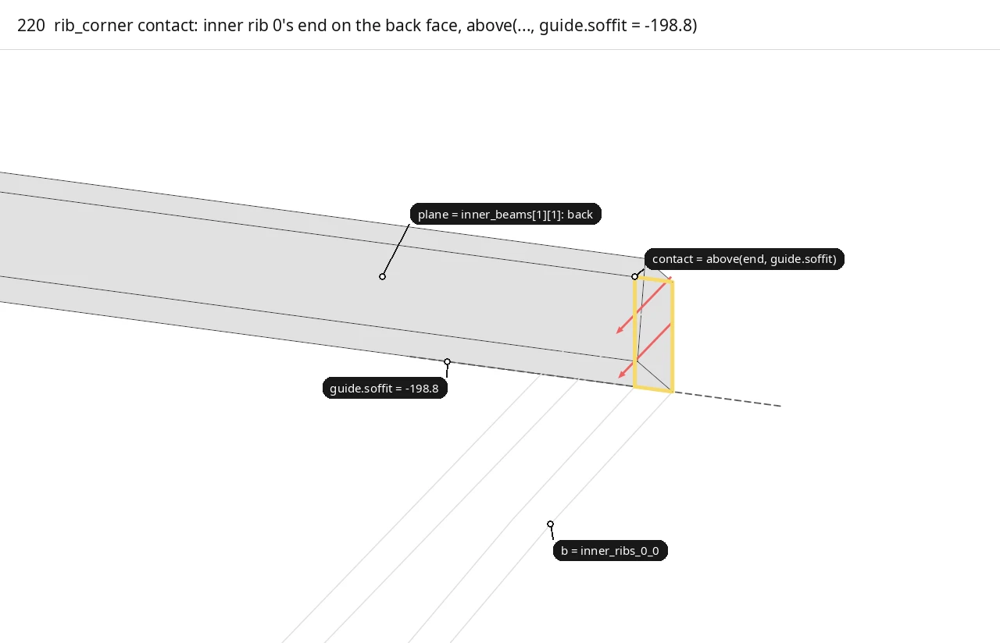

■ built the contact, `above(end, guide.soffit)`   ■ variable `guide.soffit` = -198.783   ■ input the screws   ■ context the oculus beam and inner rib 0

The contact is inner rib `k`'s end on the back face, clipped by `above` to `z >= guide.soffit`, which on the default bay clips nothing.

Code: `rib_corner`, [floor_screws.cpp:279-280](https://github.com/petrasvestartas/wood/blob/79d4d5c74fdbb4c7b474b2df14efe7f6c7b72e2f/src/templates/floor/floor_screws.cpp#L279-L280); `above`, [floor_geometry.cpp:240-259](https://github.com/petrasvestartas/wood/blob/79d4d5c74fdbb4c7b474b2df14efe7f6c7b72e2f/src/templates/floor/floor_geometry.cpp#L240-L259); soffit, [floor.cpp:461-470](https://github.com/petrasvestartas/wood/blob/79d4d5c74fdbb4c7b474b2df14efe7f6c7b72e2f/src/templates/floor/floor.cpp#L461-L470).

## 221. ring screws

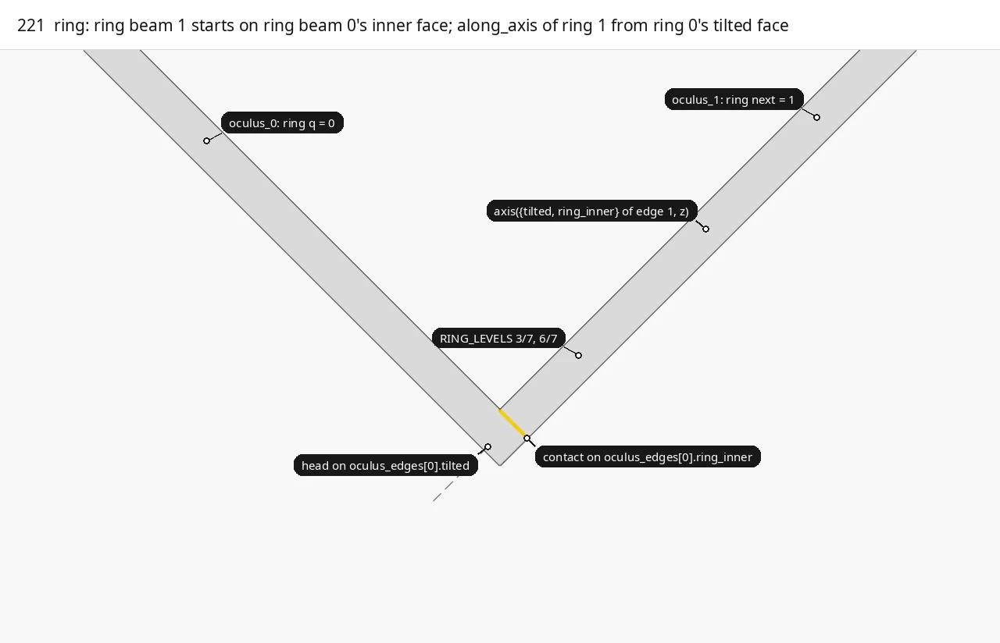

■ built the screws through ring 0 into ring 1   ■ result the contact on `oculus_edges[0].ring_inner`   ■ input the far face `oculus_edges[0].tilted` and ring 1's axis, a helper   ■ context the four ring beams

The four ring beams form a pinwheel: at oculus corner `q`, `ring` runs two screws at `RING_LEVELS` {3, 6} through ring `q` into ring `next = (q + 1) % 4`, which butts on `ring_inner[q]`.

Code: `ring`, [floor_screws.cpp:289-301](https://github.com/petrasvestartas/wood/blob/79d4d5c74fdbb4c7b474b2df14efe7f6c7b72e2f/src/templates/floor/floor_screws.cpp#L289-L301); `FloorGuide::oculus`, [floor_members.cpp:249-250](https://github.com/petrasvestartas/wood/blob/79d4d5c74fdbb4c7b474b2df14efe7f6c7b72e2f/src/templates/floor/floor_members.cpp#L249-L250).

## 222. oculus: RingFaces and wedge_start

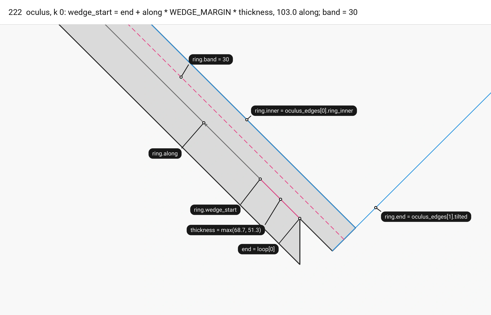

■ built `ring.inner` and `ring.end`   ■ result `ring.wedge_start`   ■ variable `WEDGE_MARGIN * thickness` = 103.0 and `ring.band` = 30   ■ input `end = loop[0]`, the loop's edge and `ring.along`   ■ context ring beam 0 and the oculus beam

`oculus` sets up `RingFaces` per end: `ring.inner`, `ring.end`, `ring.body`, `ring.along` away from the corner, `ring.wedge_start` where the oculus wedge starts, and `ring.band = 0.5 * inner_beams` = 30, the band holding the wedge's pocket.

Code: `RingFaces`, [floor_screws.cpp:101-108](https://github.com/petrasvestartas/wood/blob/79d4d5c74fdbb4c7b474b2df14efe7f6c7b72e2f/src/templates/floor/floor_screws.cpp#L101-L108); `oculus`, [floor_screws.cpp:304-317](https://github.com/petrasvestartas/wood/blob/79d4d5c74fdbb4c7b474b2df14efe7f6c7b72e2f/src/templates/floor/floor_screws.cpp#L304-L317); `outline_thickness`, [floor_elements.cpp:107-109](https://github.com/petrasvestartas/wood/blob/79d4d5c74fdbb4c7b474b2df14efe7f6c7b72e2f/src/templates/floor/floor_elements.cpp#L107-L109).

## 223. oculus_screw: start and across

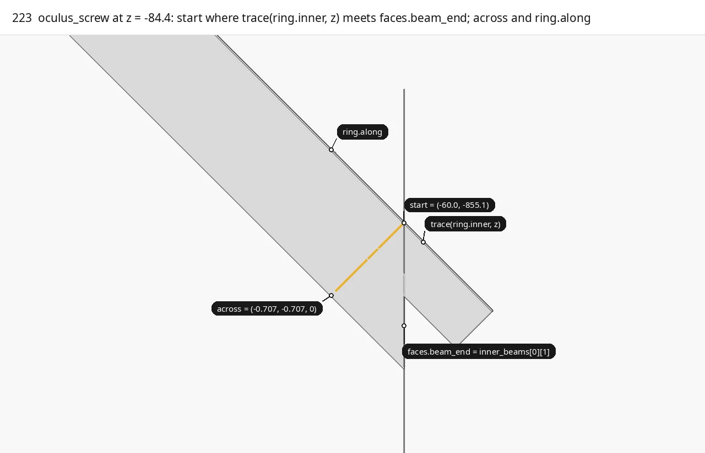

■ built `start`   ■ result `across`   ■ input `trace(ring.inner, z)`, `faces.beam_end` and `ring.along`   ■ context ring beam 0 and the oculus beam

`start` is where `trace(ring.inner, z)` meets `faces.beam_end`, the zero of the head offset, and `across` is the horizontal direction square to the contact edge, from the ring into the quarter.

Code: `oculus_screw`, [floor_screws.cpp:157-163](https://github.com/petrasvestartas/wood/blob/79d4d5c74fdbb4c7b474b2df14efe7f6c7b72e2f/src/templates/floor/floor_screws.cpp#L157-L163).

## 224. Aim: offset and angle

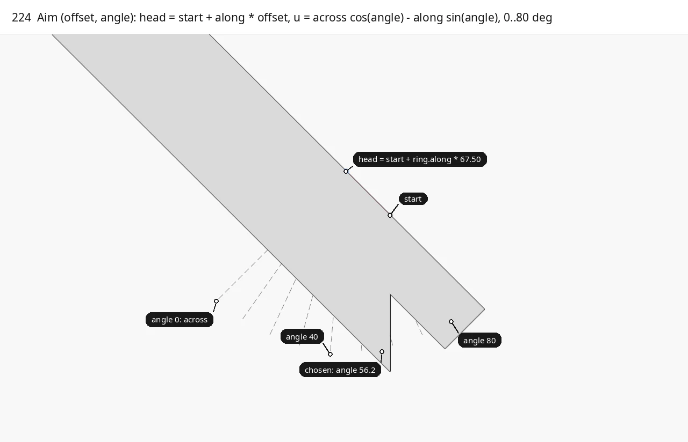

■ built the chosen screw and its `head`   ■ variable `offset` = 67.5, from `start` to `head`   ■ input `start` and the rays `u` at 0 to 80 deg, helpers   ■ context ring beam 0 and the oculus beam

An `Aim` `(offset, angle)` gives `head = start + ring.along * offset` and `u = across * cos(angle) - ring.along * sin(angle)`; angle 0 is square to the contact, a positive angle toes the screw back towards the corner.

Code: `Aim`, [floor_screws.cpp:132-136](https://github.com/petrasvestartas/wood/blob/79d4d5c74fdbb4c7b474b2df14efe7f6c7b72e2f/src/templates/floor/floor_screws.cpp#L132-L136); `best_aim`, [floor_screws.cpp:145-146](https://github.com/petrasvestartas/wood/blob/79d4d5c74fdbb4c7b474b2df14efe7f6c7b72e2f/src/templates/floor/floor_screws.cpp#L145-L146).

## 225. oculus_clearance: side of the contact

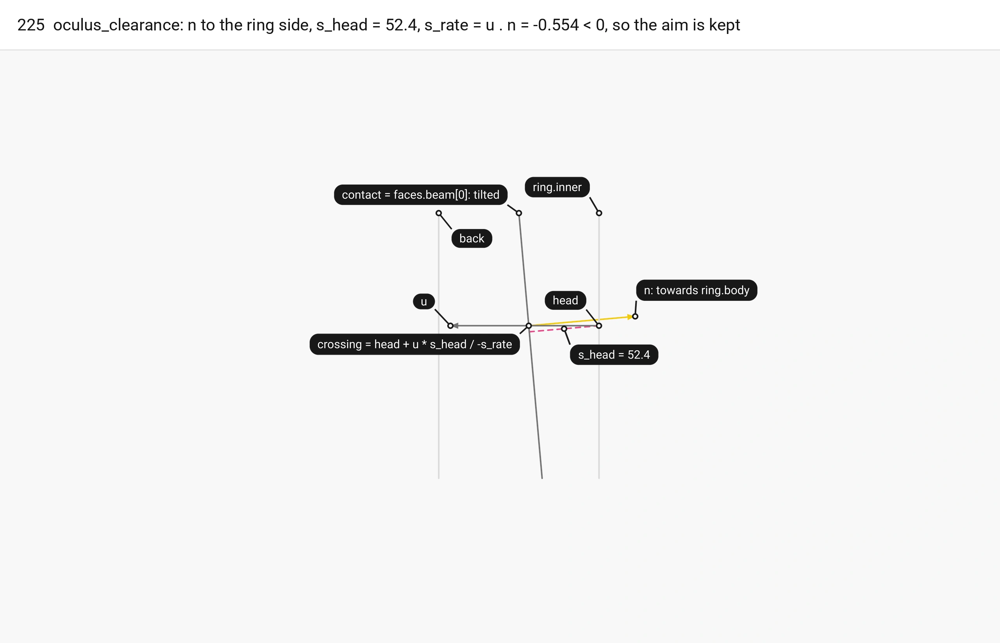

■ built `crossing`   ■ result `n`, towards the ring   ■ variable `s_head`, dashed from the head to the contact   ■ input the contact `faces.beam[0]`, the screw `u` and its `head`   ■ context back and `ring.inner`

`oculus_clearance` scores an aim against the tilted face with normal `n` turned to the ring: `s_head` is the head's height above it, `s_rate = u . n`, and `s_rate >= 0` scores -1e300.

Code: `oculus_clearance`, [floor_screws.cpp:111-119](https://github.com/petrasvestartas/wood/blob/79d4d5c74fdbb4c7b474b2df14efe7f6c7b72e2f/src/templates/floor/floor_screws.cpp#L111-L119).

## 226. oculus_clearance: test points and maximin

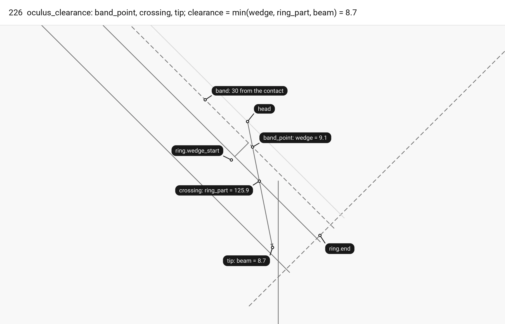

■ built `band_point`, `crossing`, `tip`   ■ input the contact, back and `beam_end` faces, the band and `ring.end` as helpers, `ring.wedge_start`, the screw   ■ context `ring.inner`

The clearance is the smallest of three margins, `wedge` (band entry short of `ring.wedge_start`), `ring_part` (head and crossing inside ring `q`'s end) and `beam` (tip inside the oculus beam), and the search maximises it.

Code: `oculus_clearance`, [floor_screws.cpp:121-128](https://github.com/petrasvestartas/wood/blob/79d4d5c74fdbb4c7b474b2df14efe7f6c7b72e2f/src/templates/floor/floor_screws.cpp#L121-L128).

## 227. Coarse and fine grid search

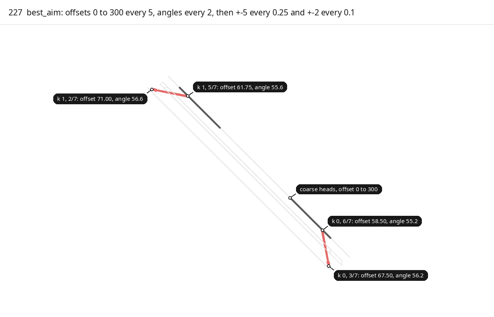

■ built the four chosen screws   ■ variable the 61 coarse heads, offsets 0 to 300 every `COARSE_STEP`   ■ context ring beam 0 and the oculus beam

`best_aim` searches a coarse grid (offsets 0 to 300 every 5 mm, angles 0 to 80 every 2 deg), then a fine one around the best (+-5 every 0.25 mm, +-2 every 0.1 deg). It never checks that the best clearance is positive, so a rejected or negative aim still becomes a screw that only `check_screws` reports.

Code: `best_aim`, [floor_screws.cpp:139-154](https://github.com/petrasvestartas/wood/blob/79d4d5c74fdbb4c7b474b2df14efe7f6c7b72e2f/src/templates/floor/floor_screws.cpp#L139-L154); `oculus_screw`, [floor_screws.cpp:165-170](https://github.com/petrasvestartas/wood/blob/79d4d5c74fdbb4c7b474b2df14efe7f6c7b72e2f/src/templates/floor/floor_screws.cpp#L165-L170).

## 228. oculus row: contact

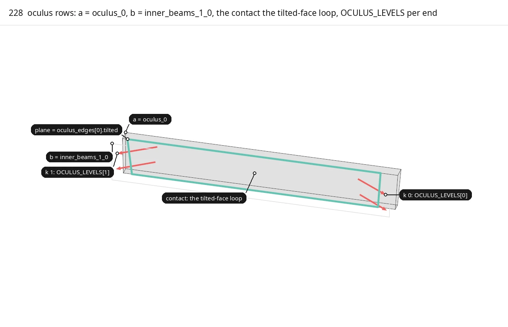

■ built the contact, the tilted-face loop   ■ input the screws of k 0 and k 1   ■ context ring beam 0 and the oculus beam

Both ends share one contact, the oculus beam's whole tilted-face loop, with `a` ring beam `q` and `b` the oculus beam.

Code: `oculus`, [floor_screws.cpp:320-323](https://github.com/petrasvestartas/wood/blob/79d4d5c74fdbb4c7b474b2df14efe7f6c7b72e2f/src/templates/floor/floor_screws.cpp#L320-L323).

## 229. Pre-drill joint and pre_drill_lines

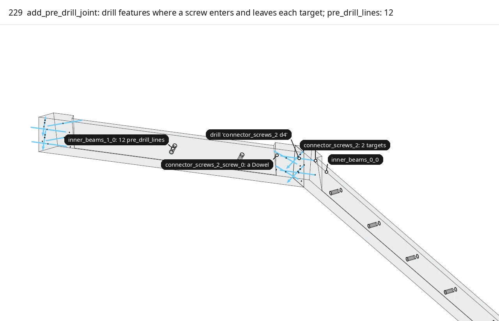

■ built `pre_drill_lines(inner_beams_1_0)`   ■ context seam beam 0 and the oculus beam, with their drill features

`JointBeam::screws` makes a pre-drill connector with one 200 mm, radius 2 drill line per screw, and `add_pre_drill_joint` hosts a `drill` feature on each target where a line passes through it, without cutting solids. `WoodSession::pre_drill_lines(guid)` returns every drill line through one member, in world coordinates.

Code: `JointBeam::screws`, [wood_element_joint_beam.cpp:502-528](https://github.com/petrasvestartas/wood/blob/79d4d5c74fdbb4c7b474b2df14efe7f6c7b72e2f/src/joinery_solver/wood_elements/wood_element_joint_beam.cpp#L502-L528); `JointBeam::children`, [wood_element_joint_beam.cpp:650-663](https://github.com/petrasvestartas/wood/blob/79d4d5c74fdbb4c7b474b2df14efe7f6c7b72e2f/src/joinery_solver/wood_elements/wood_element_joint_beam.cpp#L650-L663); `add_pre_drill_joint`, [wood_session.cpp:1160-1174](https://github.com/petrasvestartas/wood/blob/79d4d5c74fdbb4c7b474b2df14efe7f6c7b72e2f/src/joinery_solver/wood_session.cpp#L1160-L1174); `host_drills`, [wood_session.cpp:1118-1157](https://github.com/petrasvestartas/wood/blob/79d4d5c74fdbb4c7b474b2df14efe7f6c7b72e2f/src/joinery_solver/wood_session.cpp#L1118-L1157); `pre_drill_lines`, [wood_session.cpp:986-1000](https://github.com/petrasvestartas/wood/blob/79d4d5c74fdbb4c7b474b2df14efe7f6c7b72e2f/src/joinery_solver/wood_session.cpp#L986-L1000).

## 230. check_screws: keep-outs

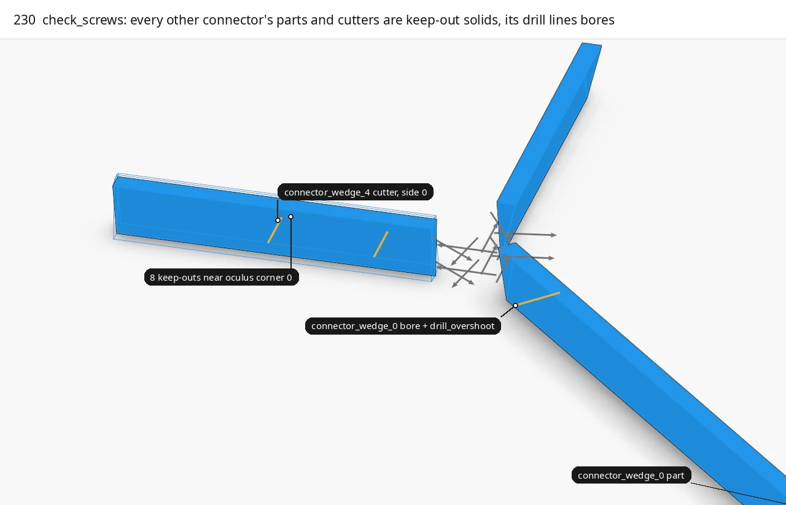

■ built the parts and cutters, keep-out solids   ■ result bores run on by `drill_overshoot`   ■ input the screws at oculus corner 0

`check_screws` collects keep-outs from every other `JointBeam`: bores extended by `drill_overshoot`, part meshes, and cutters that count only inside their target's uncut solid.

Code: `collect`, [floor_screw_check.cpp:137-163](https://github.com/petrasvestartas/wood/blob/79d4d5c74fdbb4c7b474b2df14efe7f6c7b72e2f/src/templates/floor/floor_screw_check.cpp#L137-L163); `keep_out`, [floor_screw_check.cpp:89-103](https://github.com/petrasvestartas/wood/blob/79d4d5c74fdbb4c7b474b2df14efe7f6c7b72e2f/src/templates/floor/floor_screw_check.cpp#L89-L103).

## 231. check_screws: counts and drilled_from

`check_screws` pairs connectors with screw rows by position and throws `std::invalid_argument` when their counts differ. For `screw_rib_beam` with `seam_through_ribs`, `drilled_from` is the seam beam, so its keep-out solids are skipped (drilled before the wedge goes in); bores are still checked.

Code: `check_screws`, [floor_screw_check.cpp:221-232](https://github.com/petrasvestartas/wood/blob/79d4d5c74fdbb4c7b474b2df14efe7f6c7b72e2f/src/templates/floor/floor_screw_check.cpp#L221-L232); `check_screw`, [floor_screw_check.cpp:202-204](https://github.com/petrasvestartas/wood/blob/79d4d5c74fdbb4c7b474b2df14efe7f6c7b72e2f/src/templates/floor/floor_screw_check.cpp#L202-L204).

## 232. check_screws: held length

`held()` sums each screw's length inside each target; a screw is a misfit if target 0 or 1 holds under 1e-6 or the total is off its length by more than 1e-3.

Code: `held`, [floor_screw_check.cpp:166-179](https://github.com/petrasvestartas/wood/blob/79d4d5c74fdbb4c7b474b2df14efe7f6c7b72e2f/src/templates/floor/floor_screw_check.cpp#L166-L179); `check_screw`, [floor_screw_check.cpp:182-192](https://github.com/petrasvestartas/wood/blob/79d4d5c74fdbb4c7b474b2df14efe7f6c7b72e2f/src/templates/floor/floor_screw_check.cpp#L182-L192).

## 233. check_screws: bores, pockets, spacing

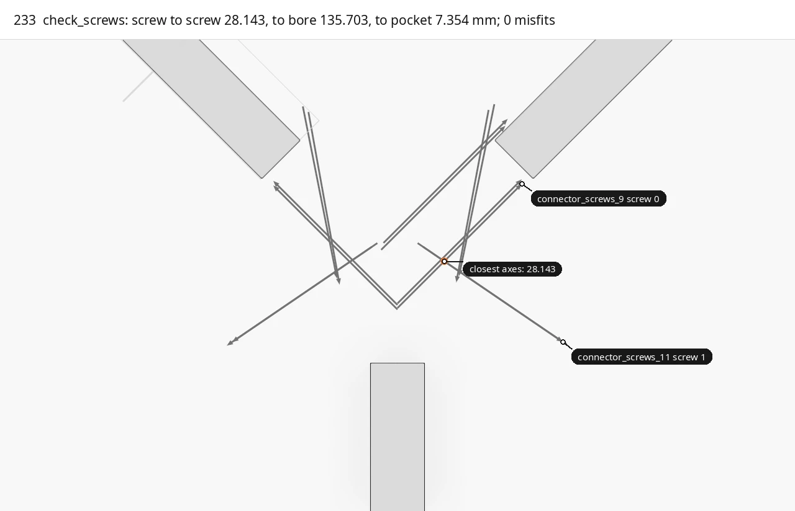

■ variable the closest axes, 28.143   ■ input the screws at oculus corner 0   ■ context the keep-outs

Every screw must clear bores and pockets and keep its axis `SCREW_SPACING` = 8 from every other; the closest pair is 28.143, one seventh of `static_h`, with no misfits.

Code: `segment_distance`, [floor_screw_check.cpp:28-51](https://github.com/petrasvestartas/wood/blob/79d4d5c74fdbb4c7b474b2df14efe7f6c7b72e2f/src/templates/floor/floor_screw_check.cpp#L28-L51); `solid_clearance`, [floor_screw_check.cpp:106-130](https://github.com/petrasvestartas/wood/blob/79d4d5c74fdbb4c7b474b2df14efe7f6c7b72e2f/src/templates/floor/floor_screw_check.cpp#L106-L130); `check_screw`, [floor_screw_check.cpp:194-211](https://github.com/petrasvestartas/wood/blob/79d4d5c74fdbb4c7b474b2df14efe7f6c7b72e2f/src/templates/floor/floor_screw_check.cpp#L194-L211); `check_screws`, [floor_screw_check.cpp:243-250](https://github.com/petrasvestartas/wood/blob/79d4d5c74fdbb4c7b474b2df14efe7f6c7b72e2f/src/templates/floor/floor_screw_check.cpp#L243-L250).
