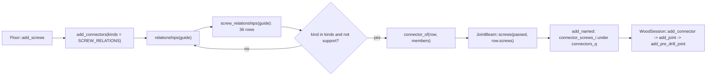
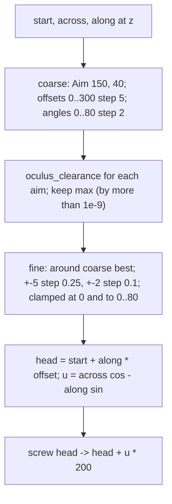
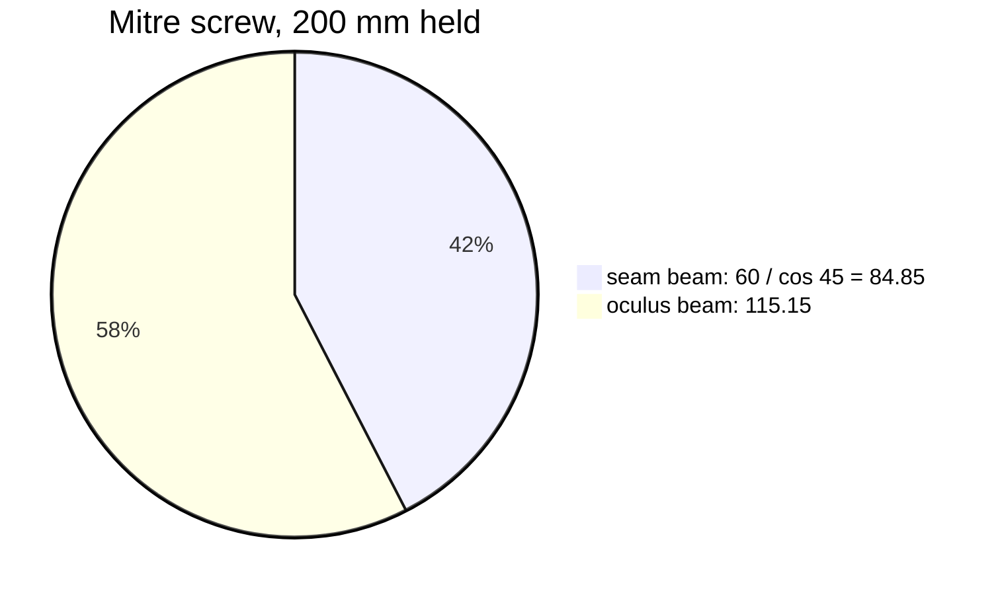

# Floor 10: Screws {#templates_floor_10_screws}

`Floor::add_screws` (`src/templates/floor/floor_models.cpp:426-430`) adds the assembly screws after every other connector, so nothing built in chapter 9 changes. The screw axes come from `geometry::screw_relationships` (`floor_screws.cpp:321-345`), which reads only the guide: the construction planes of chapter 2, the member outlines of chapters 5 and 6 and `guide.soffit`. Every screw is a horizontal 200 mm line built in a slice at a level below the datum, lifted by `bay_height`, and turned into a pre-drill `JointBeam` that the members read as drill features. The chapter ends with `check_screws`, which measures the 72 screws against each other and the other connectors; chapter 11 checks the finished floor. Every value below is for the default bay `FloorGuide::rectangle(3000, 3000)` with `seam_through_ribs = true`, except frame 213, which uses the tied 6000 x 4800 bay.

Example: [templates_floor_7_contacts_cantilevers.cpp](https://github.com/petrasvestartas/wood/blob/0c9f4e49b3ac503e917b90c037f43f827533d641/examples/templates_floor_7_contacts_cantilevers.cpp) builds the square bay with every connector and calls `add_screws`, the 72 screws of this chapter; [templates_floor_8_rectangle.cpp](https://github.com/petrasvestartas/wood/blob/0c9f4e49b3ac503e917b90c037f43f827533d641/examples/templates_floor_8_rectangle.cpp) does the same on the tied 6000 x 4800 bay of frame 213.

■ built what the step builds   ■ variable the value it introduces or measures   ■ result a second result   ■ input what it reads, dashed for a helper   ■ context the rest; member families in their own colours where a frame tells them apart

## 200. add_screws entry

`Floor::add_screws` calls the free `add_connectors(*this, guide, members, {SCREW_RELATIONS})` and appends what it returns to `Floor::screws`. `add_connectors` walks `relationships(guide)`, which recomputes every row of the floor, the aim searches of the oculus screws included. It skips `support` rows and every row whose kind is not in `SCREW_RELATIONS`. For each screw row, `connector_of` sees non-empty `row.screws` and calls `JointBeam::screws(passed, row.screws)`, where `passed` holds the two members `a` and `b` and then every member in `row.through`. `add_named` names the connector `connector_screws_<i>`, where `i` counts the screw connectors of this call, adds it with `WoodSession::add_connector` under `connectors_q` of its quarter and paints it `CONNECTOR_COLOR`.

| Variable | Value | Meaning |
|---|---|---|
| `SCREW_RELATIONS` | `screw_rib_beam, screw_beam_mitre, screw_rib_corner, screw_ring, screw_oculus` | The five kinds `add_screws` asks for, in `relationships()` order |
| `Floor::screws` | 36 connectors, 72 screws | One `JointBeam` per screw row (`tests/floor_elements.cpp:1206`) |
| `passed` | 2 members, 3 for every `rib_corner` row | `a`, `b`, then `row.through` |
| connector name | `connector_screws_0` to `connector_screws_35` | `connector_prefix` for a screw kind, numbered in row order |

Code: `Floor::add_screws`, [floor_models.cpp:426-430](https://github.com/petrasvestartas/wood/blob/0c9f4e49b3ac503e917b90c037f43f827533d641/src/templates/floor/floor_models.cpp#L426-L430); `add_connectors`, [floor_models.cpp:348-378](https://github.com/petrasvestartas/wood/blob/0c9f4e49b3ac503e917b90c037f43f827533d641/src/templates/floor/floor_models.cpp#L348-L378); `connector_of`, [floor_models.cpp:315-346](https://github.com/petrasvestartas/wood/blob/0c9f4e49b3ac503e917b90c037f43f827533d641/src/templates/floor/floor_models.cpp#L315-L346); `add_named`, [floor_models.cpp:92-97](https://github.com/petrasvestartas/wood/blob/0c9f4e49b3ac503e917b90c037f43f827533d641/src/templates/floor/floor_models.cpp#L92-L97).

## 201. Screw row order

■ screw_rib_beam along an outer rib   ■ screw_beam_mitre along an inner beam   ■ screw_rib_corner along an inner rib   ■ screw_ring along the oculus ring   ■ screw_oculus into the oculus beam   ■ context bay edges and quarters

`relationships()` appends the rows of `screw_relationships` after every other row. `screw_relationships` first calls `rings = guide.oculus()`, which returns nine outlines (four ring beams, four bottom wedges, the central plate); only `rings[0..3]` are read. For each quarter `q = 0..3` it appends `rib_beam(q, 0)`, `rib_beam(q, 1)`, `beam_mitre(q, 0)`, `beam_mitre(q, 1)`, `rib_corner(q, 0)` and `rib_corner(q, 1)`. Then it appends `ring(q)` for `q = 0..3` and `oculus(q, k)` for `q = 0..3`, `k = 0..1`. The frame colours each screw by its kind and names one row of each kind by its index, `rows[0]`, `rows[2]`, `rows[10]`, `rows[26]` and `rows[34]`, each in a different quarter or corner so the names do not crowd.

| Variable | Value | Meaning |
|---|---|---|
| `rows[6q .. 6q + 5]` | rib_beam k 0, k 1, beam_mitre k 0, k 1, rib_corner k 0, k 1 | The six rows of quarter `q` |
| `rows[24 + q]` | ring at oculus corner `q` | Four ring rows |
| `rows[28 + 2q + k]` | oculus of quarter `q`, end `k` | Eight oculus rows |
| row count | 8 rib_beam, 8 beam_mitre, 8 rib_corner, 4 ring, 8 oculus = 36 | Each row holds 2 screws (`tests/floor_elements.cpp:261`) |
| `rings` | 9 outlines, 4 read | `guide.oculus()` |

Code: `geometry::screw_relationships`, [floor_screws.cpp:321-345](https://github.com/petrasvestartas/wood/blob/0c9f4e49b3ac503e917b90c037f43f827533d641/src/templates/floor/floor_screws.cpp#L321-L345); `relationships`, [floor_relations.cpp:205-206](https://github.com/petrasvestartas/wood/blob/0c9f4e49b3ac503e917b90c037f43f827533d641/src/templates/floor/floor_relations.cpp#L205-L206).

## 202. Screw levels

■ built the screws at oculus corner 0   ■ variable `corner_level(1..6, 197)`, the six levels   ■ input `static_h()` = 197, the joint depth

Every screw is built in one horizontal slice `level(z)` with `z` at or below the datum, and lifted later. The joint depth at the seams and the oculus is `static_h() = height - rise`. `corner_level(levels, depth) = -depth * levels / CORNER_LEVELS` splits it into sevenths, which gives six levels. Each corner kind takes two of them: `MITRE_LEVELS` {2, 5} for k 0 and {3, 6} for k 1, `RIB_CORNER_LEVELS` {1, 4}, `RING_LEVELS` {3, 6}, `OCULUS_LEVELS` {3, 6} for k 0 and {2, 5} for k 1. The constants' comments say these sets keep the screws that cross at one corner apart; the code does not enforce it, and only `check_screws` later tests an 8 mm axis spacing. The rib-beam screws use other levels (frames 209 and 213). The frame groups the screws of oculus corner 0 by the seventh they sit at and names the kinds on each level.

| Variable | Value | Meaning |
|---|---|---|
| `height` | 650 | Rib depth where the parabola starts |
| `rise` | 453 | Parabola rise to the seam |
| `static_h()` | 197 | Joint depth at the seams and the oculus |
| `CORNER_LEVELS` | 7 | Divisions of the depth |
| `corner_level(1..6, 197)` | -28.143, -56.286, -84.429, -112.571, -140.714, -168.857 | The six levels below the datum; world 3471.857 to 3331.143 |
| level sets | `MITRE_LEVELS` {2, 5} / {3, 6}, `RIB_CORNER_LEVELS` {1, 4}, `RING_LEVELS` {3, 6}, `OCULUS_LEVELS` {3, 6} / {2, 5} | Sevenths per kind, per `k` where two are given |
| `SCREW_LENGTH` | 200 | Every screw |

Code: `FloorParameters::static_h`, [floor_plan.cpp:14-16](https://github.com/petrasvestartas/wood/blob/0c9f4e49b3ac503e917b90c037f43f827533d641/src/templates/floor/floor_plan.cpp#L14-L16); constants, [floor_screws.cpp:10-23](https://github.com/petrasvestartas/wood/blob/0c9f4e49b3ac503e917b90c037f43f827533d641/src/templates/floor/floor_screws.cpp#L10-L23); `corner_level`, [floor_screws.cpp:67-69](https://github.com/petrasvestartas/wood/blob/0c9f4e49b3ac503e917b90c037f43f827533d641/src/templates/floor/floor_screws.cpp#L67-L69).

## 203. Faces the screws read

■ built `cp.outer_ribs[0]`, `cp.inner_beams[0]`, `cp.inner_beams[1]`   ■ result `oculus_edges[0].ring_inner`   ■ input the face normals   ■ context quarter 0's polygon

Every screw rule reads face pairs from `cp = guide.geometry[q].planes`. `pair(plane, d)` returns the plane and its copy moved `d` along its normal. `cp.outer_ribs[k]` pairs the bay edge's band plane, normal into the bay, with its offset by `outer_ribs`. `cp.inner_beams` is `{seams[q].faces_into(q), {oculus.tilted, oculus.back}, seams[q - 1].faces_into(q)}`: `[0][0]` is the seam plane, `[0][1]` the seam beam's inner face 60 into the quarter, `[1][0]` the tilted oculus face, `[1][1]` the back face. `oculus_edge` leans the edge plane by `oculus_plane_angle` about the edge to get `tilted`, moves the edge plane 60 into the quarter to get `back`, and moves `back` back by 120 to get `ring_inner`. `guide.soffit` is the minimum of `-static_h` and every rib end level on its beam.

| Variable | Value | Meaning |
|---|---|---|
| `cp.outer_ribs[0]` (q 0) | y = -3000, normal (0, 1, 0); y = -2900 | Bay edge and the rib's inner face |
| `cp.inner_beams[0]` (q 0) | x = 0, normal (-1, 0, 0); x = -60 | Seam plane and seam beam inner face |
| `cp.inner_beams[1]` (q 0) | tilted through (-500, -500, 0); back x + y = -1084.853 | Tilted and back face of the oculus beam |
| `oculus_edges[0].ring_inner` | x + y = -915.147 | Ring beam 0's inner face |
| `guide.soffit` | -198.783 | Beam soffit level |
| `outer_ribs`, `inner_beams` | 100, 60 | Band and beam thicknesses |
| `oculus_plane_angle` | 5 deg | Lean of `tilted` |
| `oculus` | 1000 | Oculus corner distance from the centre: corner 0 at (0, -1000) |

Code: `pair`, [floor.cpp:15-17](https://github.com/petrasvestartas/wood/blob/0c9f4e49b3ac503e917b90c037f43f827533d641/src/templates/floor/floor.cpp#L15-L17); `bay_edge`, [floor.cpp:69-77](https://github.com/petrasvestartas/wood/blob/0c9f4e49b3ac503e917b90c037f43f827533d641/src/templates/floor/floor.cpp#L69-L77); `oculus_edge`, [floor.cpp:93-103](https://github.com/petrasvestartas/wood/blob/0c9f4e49b3ac503e917b90c037f43f827533d641/src/templates/floor/floor.cpp#L93-L103); `construction_planes`, [floor.cpp:180-191](https://github.com/petrasvestartas/wood/blob/0c9f4e49b3ac503e917b90c037f43f827533d641/src/templates/floor/floor.cpp#L180-L191); `Seam::faces_into`, [floor.cpp:399-401](https://github.com/petrasvestartas/wood/blob/0c9f4e49b3ac503e917b90c037f43f827533d641/src/templates/floor/floor.cpp#L399-L401); soffit, [floor.cpp:430-439](https://github.com/petrasvestartas/wood/blob/0c9f4e49b3ac503e917b90c037f43f827533d641/src/templates/floor/floor.cpp#L430-L439).

## 204. trace and axis

■ built `axis(faces, z)`   ■ result `line0`, `line1` and `p0`, `p1`   ■ variable `level(z)`, z = -84.429   ■ input `p0` to `p1`, a helper   ■ context the oculus beam

`trace(plane, z)` intersects a member face with `level(z)`, the world XY plane moved to `z`, by `plane_plane`, which orients the line along `cross(n_plane, n_level)`. `axis(faces, z)` traces both faces at `z` into `line0` and `line1`. It takes `p0 = line0.start()`, the start of the line `plane_plane` returns (no chosen point on the face), and projects it onto `line1`: `p1 = line1.start() + d * ((p0 - line1.start()) . d)` with `d` the unit direction of `line1`. It returns the line through the midpoint of `p0` and `p1` with `line0`'s direction, the mid-line of the member's section at that level. On the oculus beam the tilted face moves `|z| tan 5 deg` towards the centre per level, so the axis drifts sideways from level to level; the frame shows the slice at 3/7.

| Variable | Value | Meaning |
|---|---|---|
| `z` | -84.429 (3/7) | The slice the frame shows |
| `line0` | x + y = -989.55 at that z | `trace(tilted, z)` |
| `line1` | x + y = -1084.853 | `trace(back, z)` |
| `p0`, `p1` | `line0.start()`, its foot on `line1` | The two ends of the section's width |
| axis | x + y = -1037.20 | Midway between the two traces |
| axis of outer rib 0, q 0 | y = -2950 | The same rule on a vertical pair |

Code: `trace`, [floor_screws.cpp:39-41](https://github.com/petrasvestartas/wood/blob/0c9f4e49b3ac503e917b90c037f43f827533d641/src/templates/floor/floor_screws.cpp#L39-L41); `axis`, [floor_screws.cpp:44-54](https://github.com/petrasvestartas/wood/blob/0c9f4e49b3ac503e917b90c037f43f827533d641/src/templates/floor/floor_screws.cpp#L44-L54); `plane_plane`, [floor_geometry.cpp:31-39](https://github.com/petrasvestartas/wood/blob/0c9f4e49b3ac503e917b90c037f43f827533d641/src/templates/floor/floor_geometry.cpp#L31-L39); `level`, [floor_geometry.cpp:19-21](https://github.com/petrasvestartas/wood/blob/0c9f4e49b3ac503e917b90c037f43f827533d641/src/templates/floor/floor_geometry.cpp#L19-L21).

## 205. body and depth

■ built `body(outline)`   ■ variable `depth` at a point on each side   ■ input the two `area_centroid` points and the back face `inner_beams[1][1]`   ■ context the oculus beam

`body(outline)` is the midpoint of the area centroids of the outline's two loops, a point inside the member. `depth(point, plane, inside)` is `signed_distance(point, plane)`, negated when `inside` has a negative signed distance, so a positive value means the point lies on the inside point's side of the face. Every keep-inside test of the screw rules is a `depth` against a body. The frame shows, in plan, the oculus beam's two loop centroids (its tilted-face and back-face loops), its body between them, and the back face with a point on each side.

| Variable | Value | Meaning |
|---|---|---|
| `body(oculus beam, q 0)` | about (-518.153, -518.153, -99.157) | Inside `inner_beams[1]` |
| `body(ring 0)` | about (-457.574, -493.864, -99.178) | Inside ring beam 0 |
| `depth(...) > 0` | | The point is on the body's side of the face |

Code: `body`, [floor_screws.cpp:57-59](https://github.com/petrasvestartas/wood/blob/0c9f4e49b3ac503e917b90c037f43f827533d641/src/templates/floor/floor_screws.cpp#L57-L59); `depth`, [floor_screws.cpp:62-64](https://github.com/petrasvestartas/wood/blob/0c9f4e49b3ac503e917b90c037f43f827533d641/src/templates/floor/floor_screws.cpp#L62-L64); `area_centroid`, [floor_geometry.cpp:137-152](https://github.com/petrasvestartas/wood/blob/0c9f4e49b3ac503e917b90c037f43f827533d641/src/templates/floor/floor_geometry.cpp#L137-L152); `signed_distance`, [floor_geometry.cpp:121-123](https://github.com/petrasvestartas/wood/blob/0c9f4e49b3ac503e917b90c037f43f827533d641/src/templates/floor/floor_geometry.cpp#L121-L123).

## 206. along_axis

■ built the screw `head -> head + d * SCREW_LENGTH` and its `head`   ■ variable `far_face` = `inner_beams[0][0]`, the seam plane   ■ input `butting`'s traces, tilted and back, and `axis(butting, z)`, a helper

`along_axis(butting, far_face, butting_body, z)` is used where one member's end butts on the side of another. It takes `axis(butting, z)`, the butting member's mid-line, and intersects it with `far_face`, the side member's face away from the joint, by `line_plane`: that is the head. The direction `d` is the axis direction, flipped when it points away from `butting_body`. The screw is `head -> head + d * SCREW_LENGTH`: first through the side member, then along the middle of the butting member. The frame shows it at the beam mitre of quarter 0, k 0, at level 2/7, where the oculus beam butts on seam beam 0 and the far face is the seam plane.

| Variable | Value | Meaning |
|---|---|---|
| `butting` | `cp.inner_beams[1]` | The oculus beam's faces |
| `far_face` | `cp.inner_beams[0][0]`, x = 0 | The seam plane |
| `head` | (0, -1038.944, 3443.714) | World, after the lift |
| `d` | (-0.7071, 0.7071, 0) | The axis direction, turned towards `butting_body` |
| tip | (-141.421, -897.523, 3443.714) | `head + d * 200` |
| `SCREW_LENGTH` | 200 | |

Code: `along_axis`, [floor_screws.cpp:76-86](https://github.com/petrasvestartas/wood/blob/0c9f4e49b3ac503e917b90c037f43f827533d641/src/templates/floor/floor_screws.cpp#L76-L86).

## 207. from_seam_face

■ built the screw and its `head`   ■ variable `offset` = +15, from `seam` to `head`   ■ input `rib` and `beam` faces, `line = axis(rib, z)`, `seam` and `line_plane(line, beam[1])`

`from_seam_face(rib, beam, z, offset)` takes `line = axis(rib, z)` and `seam = line_plane(line, beam[0])`, the rib axis on the seam plane. `along` is the unit vector from `seam` to `line_plane(line, beam[1])`: from the seam plane through the seam beam towards the rib end. `head = seam + rib[0].z_axis() * offset` moves the head off the axis across the rib. The screw is `head -> head + along * 200`, parallel to the rib axis, drilled from the seam beam's seam face before the wedge goes in. The frame shows outer rib 1 of quarter 0 on seam beam 2 (seam 3, y = 0), where `offset` is +15.

| Variable | Value | Meaning |
|---|---|---|
| `rib` | `cp.outer_ribs[1]`: x = -3000, x = -2900 | Outer rib 1's faces |
| `beam` | `cp.inner_beams[2]`: y = 0, y = -60 | Seam beam 2's faces |
| `line` | x = -2950 | `axis(rib, z)` |
| `seam` | (-2950, 0, -20) | Rib axis on the seam plane |
| `along` | (0, -1, 0) | Into the beam towards the rib |
| `offset` | `SEAM_SCREW_OFFSET` = +15 for k 1, -15 for k 0 | Across the rib, along `rib[0]`'s normal |
| screw | (-2935, 0, 3480) -> (-2935, -200, 3480) | World |

Code: `from_seam_face`, [floor_screws.cpp:89-97](https://github.com/petrasvestartas/wood/blob/0c9f4e49b3ac503e917b90c037f43f827533d641/src/templates/floor/floor_screws.cpp#L89-L97).

## 208. rib_beam: which seam beam

■ built `inner_beams_0_0`, `beam = 0`   ■ variable its `top[0..3]` corners   ■ context outer rib 0

`rib_beam(guide, q, k)` takes `beam = 0` for `k = 0` and `beam = 2` for `k = 1`: the seam beam on the rib's side. It reads `guide.quarter(q).inner_beams()[beam]` and that outline's top and bottom loops. The seam beam is `loft_planes({cp.outer_ribs[k][face], level(0), cp.inner_beams[1][0], level(soffit)}, bottom = cp.inner_beams[beam][0], top = cp.inner_beams[beam][1])` with `face = 0` when `seam_through_ribs`, else 1. Corner `i` of a loop is `planes[i]`, `planes[i + 1]` and the loop's plane meeting in one point.

| Variable | Value | Meaning |
|---|---|---|
| `beam` | 0 for k 0, 2 for k 1 | Index of the seam beam |
| `top` (q 0, beam 0) | (-60, -3000, 0), (-60, -940, 0), (-60, -915.405, -198.783), (-60, -3000, -198.783) | The loop on x = -60 |
| `bottom` | the same on x = 0 | The loop on the seam plane |
| `seam_through_ribs` | true | The beam runs to the bay's outer face |

Code: `rib_beam`, [floor_screws.cpp:209-217](https://github.com/petrasvestartas/wood/blob/0c9f4e49b3ac503e917b90c037f43f827533d641/src/templates/floor/floor_screws.cpp#L209-L217); `Quarter::inner_beams`, [floor_members.cpp:93-105](https://github.com/petrasvestartas/wood/blob/0c9f4e49b3ac503e917b90c037f43f827533d641/src/templates/floor/floor_members.cpp#L93-L105); `loft_planes`, [floor_geometry.cpp:210-233](https://github.com/petrasvestartas/wood/blob/0c9f4e49b3ac503e917b90c037f43f827533d641/src/templates/floor/floor_geometry.cpp#L210-L233).

## 209. rib_beam: levels

■ variable the two screw levels, `-RIB_END_MARGIN` and `end_level + RIB_END_MARGIN`   ■ input the rib's end face on `rib_seam_ends()[0]`   ■ context outer rib 0

With `seam_through_ribs`, outer rib `k` ends on `rib_seam_ends()[k] = cp.inner_beams[beam][1]`, the seam beam's inner face. The upper screw level is `-RIB_END_MARGIN`. The lower one is `end_level(rib, rib_seam_ends()[k]) + RIB_END_MARGIN`, where `end_level` is the lowest `z` among the rib outline's corners that lie on that plane within 1e-6, starting from 0. The frame looks along -x at the rib's end face on x = -60.

| Variable | Value | Meaning |
|---|---|---|
| `RIB_END_MARGIN` | 20 | Margin below the rib top and above its end bottom |
| `end_level` | -198.783 | Rib bottom at its end on the beam |
| levels | -20 and -178.783 | World 3480 and 3321.217 |

Code: `rib_beam`, [floor_screws.cpp:218-224](https://github.com/petrasvestartas/wood/blob/0c9f4e49b3ac503e917b90c037f43f827533d641/src/templates/floor/floor_screws.cpp#L218-L224); `end_level`, [floor_geometry.cpp:125-135](https://github.com/petrasvestartas/wood/blob/0c9f4e49b3ac503e917b90c037f43f827533d641/src/templates/floor/floor_geometry.cpp#L125-L135); `Quarter::rib_seam_ends`, [floor_members.cpp:69-75](https://github.com/petrasvestartas/wood/blob/0c9f4e49b3ac503e917b90c037f43f827533d641/src/templates/floor/floor_members.cpp#L69-L75).

## 210. rib_beam: axis meets the seam plane

■ built `seam` = (0, -2950)   ■ variable `along` = (-1, 0, 0)   ■ input the axis of `cp.outer_ribs[0]`, the faces `cp.inner_beams[0][0]` and `[1]`, the point on `[1]`   ■ context outer rib 0's faces

At each level `from_seam_face` takes the axis of `cp.outer_ribs[k]`, y = -2950 for outer rib 0 of quarter 0. It intersects that axis with the seam plane `cp.inner_beams[beam][0]` (x = 0) to get `seam`. It intersects it with the beam's inner face `[1]` (x = -60), and the unit vector from `seam` to that point is `along`, -x.

| Variable | Value | Meaning |
|---|---|---|
| `seam` | (0, -2950, z) | Rib axis on the seam plane |
| `along` | (-1, 0, 0) | Into the beam towards the rib |

Code: `rib_beam`, [floor_screws.cpp:224-225](https://github.com/petrasvestartas/wood/blob/0c9f4e49b3ac503e917b90c037f43f827533d641/src/templates/floor/floor_screws.cpp#L224-L225); `from_seam_face`, [floor_screws.cpp:91-93](https://github.com/petrasvestartas/wood/blob/0c9f4e49b3ac503e917b90c037f43f827533d641/src/templates/floor/floor_screws.cpp#L91-L93).

## 211. rib_beam: heads 30 apart

■ built `rows[0]`: quarter 0's rib 0, offset -15   ■ result `rows[7]`: quarter 1's rib 1, offset +15, dashed   ■ variable the head gap, 30   ■ input the seam plane and the seam beams' inner faces   ■ context outer rib 0's faces

`head = seam + rib[0].z_axis() * offset`, with `rib[0] = cp.outer_ribs[k][0]` (normal (0, 1, 0) on the y = -3000 edge) and `offset = -15` for `k = 0`, `+15` for `k = 1`. The screw is `head -> head + along * 200`: 60 mm through the seam beam, then 140 mm into the rib end. The other rib on seam 0 is quarter 1's rib 1, which takes `+15` on the same edge plane, so the two ribs' heads on the shared seam plane are 30 mm apart.

| Variable | Value | Meaning |
|---|---|---|
| `SEAM_SCREW_OFFSET` | 15 | Half the head gap |
| `rows[0]`, q 0 rib 0 | (0, -2965, 3480) -> (-200, -2965, 3480); (0, -2965, 3321.217) -> (-200, -2965, 3321.217) | World |
| `rows[7]`, q 1 rib 1 | (0, -2935, 3480) -> (200, -2935, 3480); (0, -2935, 3321.217) -> (200, -2935, 3321.217) | World |
| head gap | 30 | On the seam plane |

Code: `from_seam_face`, [floor_screws.cpp:94-96](https://github.com/petrasvestartas/wood/blob/0c9f4e49b3ac503e917b90c037f43f827533d641/src/templates/floor/floor_screws.cpp#L94-L96); `rib_beam`, [floor_screws.cpp:225](https://github.com/petrasvestartas/wood/blob/0c9f4e49b3ac503e917b90c037f43f827533d641/src/templates/floor/floor_screws.cpp#L225).

## 212. rib_beam: contact

■ built the contact, the rib's end   ■ input `screws[0]`, `screws[1]`   ■ context seam beam 0 and outer rib 0

The contact is the rib's end face `{rib_top[0], rib_top[n - 2], rib_bottom[n - 2], rib_bottom[0]}`. In `rib_loop` a loop is `{p1, p0, pts..., p1}`, so point 0 is the datum corner at the seam end and point `n - 2 = pts.back()` is the soffit trace's end on that end plane. The plane is `cp.inner_beams[beam][1]`, `a` is outer rib `k` and `b` the seam beam. `screw_row` lifts all of it (frame 214).

| Variable | Value | Meaning |
|---|---|---|
| contact | (-60, -3000, 0), (-60, -3000, -198.783), (-60, -2900, -198.783), (-60, -2900, 0) | Before the lift: 100 x 198.8 |
| plane | x = -60, normal (-1, 0, 0) | `cp.inner_beams[0][1]` |
| `a`, `b` | `outer_ribs_0_0`, `inner_beams_0_0` | |

Code: `rib_beam`, [floor_screws.cpp:219-227](https://github.com/petrasvestartas/wood/blob/0c9f4e49b3ac503e917b90c037f43f827533d641/src/templates/floor/floor_screws.cpp#L219-L227); `rib_loop`, [floor_members.cpp:17-32](https://github.com/petrasvestartas/wood/blob/0c9f4e49b3ac503e917b90c037f43f827533d641/src/templates/floor/floor_members.cpp#L17-L32).

## 213. rib_beam: tied variant

■ built the screws and their `head`   ■ result the contact, the beam's end on `outer_ribs[0][1]`   ■ input `axis(inner_beams[0], z)`, a helper   ■ context outer rib 0 and seam beam 0

When `seam_through_ribs` is false the seam beam ends on the rib's inner face. For each fraction in `RIB_BEAM_LEVELS` `rib_beam` calls `along_axis(cp.inner_beams[beam], cp.outer_ribs[k][0], body(outline), -static_h * fraction)`. The head is where the seam beam's axis (x = -30) meets the bay edge plane `cp.outer_ribs[k][0]`, and the screw runs 100 mm through the rib and 100 mm into the beam. The contact is the beam's end `{top[3], top[0], bottom[0], bottom[3]}`, clipped by `Polyline::boolean_op` to the rib's bottom loop on `cp.outer_ribs[k][1]`, or the whole end when the boolean returns nothing. The frame uses the tied 6000 x 4800 bay, where the edge is y = -2400.

| Variable | Value | Meaning |
|---|---|---|
| `RIB_BEAM_LEVELS` | {0.25, 0.5} | Fractions of `static_h` |
| levels | -49.25, -98.5 | World 3450.75, 3401.5 |
| screws, q 0 rib 0 (tied bay) | (-30, -2400, z) -> (-30, -2200, z) | 100 through the rib, 100 into the beam |
| plane | `cp.outer_ribs[k][1]` | The rib's inner face |

Code: `rib_beam`, [floor_screws.cpp:230-237](https://github.com/petrasvestartas/wood/blob/0c9f4e49b3ac503e917b90c037f43f827533d641/src/templates/floor/floor_screws.cpp#L230-L237).

## 214. screw_row lift

■ built quarter 0's rows lifted, `row.contact` and `row.screws`   ■ variable `bay_height` = 3500   ■ input the same rows at the datum, z 0

Every screw rule ends in `screw_row`, which builds a `Relationship` with `kind`, `a`, `b` and `seam_or_corner = q`. It moves the plane, the contact and every screw up by `guide.parameters.bay_height` with `lifted()`, so the row sits at the floor top instead of at the datum; the contact becomes a closed polyline. The frame shows quarter 0's rows at z 0 and lifted to the floor.

| Variable | Value | Meaning |
|---|---|---|
| `bay_height` | 3500 | The lift |
| `row.plane`, `row.contact`, `row.screws` | lifted | World coordinates |

Code: `screw_row`, [floor_screws.cpp:177-192](https://github.com/petrasvestartas/wood/blob/0c9f4e49b3ac503e917b90c037f43f827533d641/src/templates/floor/floor_screws.cpp#L177-L192); `lifted`, [floor_geometry.cpp:165-175](https://github.com/petrasvestartas/wood/blob/0c9f4e49b3ac503e917b90c037f43f827533d641/src/templates/floor/floor_geometry.cpp#L165-L175).

## 215. beam_mitre: contact

■ built the contact k 0, `{top[3], top[0], bottom[0], bottom[3]}`   ■ context seam beam 0 and the oculus beam

`beam_mitre(guide, q, k)` takes `seam = 0` for `k = 0`, else 2, and the oculus beam's outline `inner_beams()[1]`. That outline is lofted from `{cp.inner_beams[0][1], level(0), cp.inner_beams[2][1], level(soffit)}` with its bottom loop on the tilted face and its top loop on the back face. For `k = 0` the contact is its end on seam beam 0's inner face, `{top[3], top[0], bottom[0], bottom[3]}`; for `k = 1` it is `{top[1], top[2], bottom[2], bottom[1]}` on seam beam 2. The end leans because the tilted face leans by `oculus_plane_angle`.

| Variable | Value | Meaning |
|---|---|---|
| contact k 0 (q 0) | (-60, -1024.853, -198.783), (-60, -1024.853, 0), (-60, -940, 0), (-60, -915.405, -198.783) | Before the lift |
| plane | `cp.inner_beams[seam][1]` | x = -60 for k 0 |
| `a`, `b` | seam beam, `inner_beams_1_q` | |

Code: `beam_mitre`, [floor_screws.cpp:241-248](https://github.com/petrasvestartas/wood/blob/0c9f4e49b3ac503e917b90c037f43f827533d641/src/templates/floor/floor_screws.cpp#L241-L248); `Quarter::inner_beams`, [floor_members.cpp:102](https://github.com/petrasvestartas/wood/blob/0c9f4e49b3ac503e917b90c037f43f827533d641/src/templates/floor/floor_members.cpp#L102).

## 216. beam_mitre: screws

■ built quarter 0's k 0   ■ result quarter 1's k 1, dashed   ■ context the seam and oculus beam quads

For each level in `MITRE_LEVELS[k]` `beam_mitre` calls `along_axis(cp.inner_beams[1], cp.inner_beams[seam][0], body(outline), corner_level(levels, static_h))`. The head is where the oculus beam's axis, midway between the tilted and back traces and so drifting with `z`, meets the seam plane. The screw crosses the 60 mm seam beam at 45 deg in plan, 84.85 mm, and runs on into the oculus beam. Quarter 0's k 0 and quarter 1's k 1 meet at oculus corner 0, and their heads would land on one point of the seam plane, so they take different level pairs: in plan the heads are 1.7 mm apart, in height one seventh. The frame draws quarter 0's k 0 solid and quarter 1's k 1 dashed.

| Variable | Value | Meaning |
|---|---|---|
| `MITRE_LEVELS` | {{2, 5}, {3, 6}} | Sevenths per k |
| q 0 k 0 | (0, -1038.944, 3443.714) -> (-141.421, -897.523, 3443.714); (0, -1033.721, 3359.286) -> (-141.421, -892.300, 3359.286) | World |
| q 1 k 1 | (0, -1037.203, 3415.571) -> (141.421, -895.782, 3415.571); (0, -1031.980, 3331.143) -> (141.421, -890.559, 3331.143) | World, by the quarter's symmetry |

Code: `beam_mitre`, [floor_screws.cpp:251-254](https://github.com/petrasvestartas/wood/blob/0c9f4e49b3ac503e917b90c037f43f827533d641/src/templates/floor/floor_screws.cpp#L251-L254).

## 217. corner_faces

■ built `beam` (tilted, back) and `beam_end`   ■ result `rib = cp.inner_ribs[0]`   ■ variable `beam_body` and the way to `rib_body`

`corner_faces(guide, q, k)` collects what a corner screw reads at end `k` of quarter `q`. `beam = cp.inner_beams[1]` is the oculus beam's tilted face, which it shares with the ring, and its back face. `beam_end = cp.inner_beams[k == 0 ? 0 : 2][1]` is the seam beam's inner face, where the oculus beam ends. `rib = cp.inner_ribs[k]`. `beam_body` and `rib_body` are `body()` of the oculus beam and of inner rib `k`.

| Variable | Value | Meaning |
|---|---|---|
| `beam[0]` | origin (-500, -500, 0), normal about (-0.7044, -0.7044, -0.0872) | Tilted face |
| `beam[1]` | origin (-542.426, -542.426, 0), normal (-0.7071, -0.7071, 0) | Back face |
| `beam_end` (k 0) | x = -60 | Seam beam 0's inner face |
| `rib` | `cp.inner_ribs[0]` | Inner rib 0's two faces |
| `beam_body`, `rib_body` | `body(inner_beams()[1])`, `body(inner_ribs()[k])` | Inside points |

Code: `CornerFaces`, [floor_screws.cpp:26-32](https://github.com/petrasvestartas/wood/blob/0c9f4e49b3ac503e917b90c037f43f827533d641/src/templates/floor/floor_screws.cpp#L26-L32); `corner_faces`, [floor_screws.cpp:195-206](https://github.com/petrasvestartas/wood/blob/0c9f4e49b3ac503e917b90c037f43f827533d641/src/templates/floor/floor_screws.cpp#L195-L206).

## 218. rib_corner screws

■ built the two screws and their `head`   ■ input `inner_beams[1][0]`, the tilted face, and `axis(inner_ribs[0], z)`, a helper   ■ context the beam and rib quads

For each level in `RIB_CORNER_LEVELS` `rib_corner` calls `along_axis(cp.inner_ribs[k], cp.inner_beams[1][0], faces.rib_body, corner_level(levels, static_h))`. The head is where the inner rib's axis comes out of the oculus beam's tilted face. The screw runs along the rib axis through the oculus beam and into the rib end, which butts on the back face.

| Variable | Value | Meaning |
|---|---|---|
| `RIB_CORNER_LEVELS` | {1, 4} | Sevenths |
| q 0 k 0 | (-29.072, -967.446, 3471.857) -> (-194.301, -1080.138, 3471.857); (-22.862, -963.210, 3387.429) -> (-188.090, -1075.902, 3387.429) | World |
| direction | about -145.7 deg in plan | Along inner rib 0 |

Code: `rib_corner`, [floor_screws.cpp:258-272](https://github.com/petrasvestartas/wood/blob/0c9f4e49b3ac503e917b90c037f43f827533d641/src/templates/floor/floor_screws.cpp#L258-L272).

## 219. rib_corner: through the seam beam

■ built `inner_beams_0_0`, pushed to `row.through`   ■ variable the heads, `depth(head, beam_end, beam_body)`   ■ input `faces.beam_end`   ■ context the oculus beam and the screws

After each screw `rib_corner` tests `depth(head, faces.beam_end, faces.beam_body) < 0`. It is true when the head lies on the far side of the seam beam's inner face from the oculus beam's body, so inside the seam beam's end. If any of the two screws does this, `quarter_member(q, inner_beams, seam)` is pushed to `row.through`, and `connector_of` passes three members to `JointBeam::screws`. At quarter 0, k 0 the heads lie at x = -29.072 and -22.862, inside the seam beam (x 0 to -60), and every default corner is the same by symmetry, so every `rib_corner` connector has three targets, not two.

| Variable | Value | Meaning |
|---|---|---|
| `depth(head, beam_end, beam_body)` | -30.928 and -37.138 | Both heads inside the seam beam |
| `through_seam` | true | |
| `row.through` | `inner_beams_0_0` for k 0 | Seam beam |
| `connector_screws_4.targets` | 3 | Oculus beam, inner rib 0, seam beam 0 |

Code: `rib_corner`, [floor_screws.cpp:267-280](https://github.com/petrasvestartas/wood/blob/0c9f4e49b3ac503e917b90c037f43f827533d641/src/templates/floor/floor_screws.cpp#L267-L280); `connector_of`, [floor_models.cpp:331-338](https://github.com/petrasvestartas/wood/blob/0c9f4e49b3ac503e917b90c037f43f827533d641/src/templates/floor/floor_models.cpp#L331-L338).

## 220. rib_corner: contact clipped at soffit

■ built the contact, `above(end, guide.soffit)`   ■ variable `guide.soffit` = -198.783   ■ input the screws   ■ context the oculus beam and inner rib 0

The contact is inner rib `k`'s end face on the back face, `{top[0], top[n - 2], bottom[n - 2], bottom[0]}`, passed through `above(..., guide.soffit)`. `above` keeps the points with `z >= soffit` and inserts the crossing point on every edge that crosses that level. `a` is the oculus beam, `b` inner rib `k`, the plane `cp.inner_beams[1][1]`. On the default bay the soffit equals the rib's end bottom, so `above` clips nothing.

| Variable | Value | Meaning |
|---|---|---|
| contact q 0 k 0 | (-60, -1024.853, 0), (-60, -1024.853, -198.783), (-103.178, -981.675, -198.783), (-103.178, -981.675, 0) | Before the lift |
| `guide.soffit` | -198.783 | Minimum of `-static_h` and every rib end level |
| plane | `cp.inner_beams[1][1]` | Back face |

Code: `rib_corner`, [floor_screws.cpp:274-275](https://github.com/petrasvestartas/wood/blob/0c9f4e49b3ac503e917b90c037f43f827533d641/src/templates/floor/floor_screws.cpp#L274-L275); `above`, [floor_geometry.cpp:177-196](https://github.com/petrasvestartas/wood/blob/0c9f4e49b3ac503e917b90c037f43f827533d641/src/templates/floor/floor_geometry.cpp#L177-L196); soffit, [floor.cpp:430-439](https://github.com/petrasvestartas/wood/blob/0c9f4e49b3ac503e917b90c037f43f827533d641/src/templates/floor/floor.cpp#L430-L439).

## 221. ring screws

■ built the screws through ring 0 into ring 1   ■ result the contact on `oculus_edges[0].ring_inner`   ■ input the far face `oculus_edges[0].tilted` and ring 1's axis, a helper   ■ context the four ring beams

Ring beam `i` is lofted with `flip`, so its top lies on `tilted[i]` and its bottom on `ring_inner[i]`. It runs lengthwise from `ring_inner[i - 1]` to `tilted[i + 1]`, so the four ring beams form a pinwheel. At oculus corner `q`, with `next = (q + 1) % 4`, ring beam `next` butts on ring `q`'s inner face `ring_inner[q]`. `ring` calls `along_axis` with ring `next`'s faces `{oculus_edges[next].tilted, oculus_edges[next].ring_inner}`, far face `oculus_edges[q].tilted` and `body(oculus[next])`, at `RING_LEVELS`: each screw runs through ring `q` into ring `next`. The contact is `{top[2], top[3], bottom[3], bottom[2]}` of `oculus[next]`, whose corners 2 and 3 lie on `ring_inner[q]`.

| Variable | Value | Meaning |
|---|---|---|
| `next` | (q + 1) % 4 | The ring beam that starts on ring `q` |
| `RING_LEVELS` | {3, 6} | Sevenths |
| ring 0 into 1 | (-18.602, -970.952, 3415.571) -> (122.820, -829.531, 3415.571); (-15.990, -963.118, 3331.143) -> (125.431, -821.696, 3331.143) | World |
| plane | `oculus_edges[q].ring_inner` | |
| `a`, `b` | `MemberRef{-1, ring, q}`, `MemberRef{-1, ring, next}` | `oculus_q`, `oculus_next` |

Code: `ring`, [floor_screws.cpp:284-296](https://github.com/petrasvestartas/wood/blob/0c9f4e49b3ac503e917b90c037f43f827533d641/src/templates/floor/floor_screws.cpp#L284-L296); `FloorGuide::oculus`, [floor_members.cpp:251-252](https://github.com/petrasvestartas/wood/blob/0c9f4e49b3ac503e917b90c037f43f827533d641/src/templates/floor/floor_members.cpp#L251-L252).

## 222. oculus: RingFaces and wedge_start

■ built `ring.inner` and `ring.end`   ■ result `ring.wedge_start`   ■ variable `WEDGE_MARGIN * thickness` = 103.0 and `ring.band` = 30   ■ input `end = loop[0]`, the loop's edge and `ring.along`   ■ context ring beam 0 and the oculus beam

`oculus(guide, q, k, rings)` takes `loop = outline.bottom` of the oculus beam, its tilted-face loop. `thickness = max(outline_thickness(oculus beam), outline_thickness(oculus[q]))`, where `outline_thickness` is the distance between the two loop centroids. `ring.inner = oculus_edges[q].ring_inner`; `ring.end` is ring `q`'s end plane at this corner, `oculus_edges[q + 1].tilted` for k 0 and `oculus_edges[q - 1].ring_inner` for k 1; `ring.body = body(oculus[q])`. `end = loop[0]` for k 0, `loop[1]` for k 1, and `ring.along` is the unit vector from `end` to the loop's other corner at the datum, away from this corner. `ring.wedge_start = end + along * WEDGE_MARGIN * thickness` marks where the oculus wedge starts, and `ring.band = 0.5 * inner_beams` is the band beside the contact in which the wedge's pocket lies.

| Variable | Value | Meaning |
|---|---|---|
| `loop` | the oculus beam's bottom loop | On the tilted face |
| `ring.inner` | `oculus_edges[0].ring_inner` | Where the heads sit |
| `ring.end` (q 0 k 0) | `oculus_edges[1].tilted` | Ring 0's end at this corner |
| `ring.body` | `body(oculus[0])` | Inside ring beam 0 |
| `thickness` | max(68.656, 51.323) = 68.656 | Oculus beam, ring beam |
| `end` (q 0 k 0) | (-60, -940, 0) | `loop[0]` |
| `ring.along` | (-0.7071, 0.7071, 0) | Away from the corner |
| `WEDGE_MARGIN` | 1.5 | The same margin as the wedge factory call (floor_models.cpp:322) |
| `ring.wedge_start` | (-132.821, -867.179, 0), 102.984 along | |
| `ring.band` | 30 | Half of `inner_beams` |

Code: `RingFaces`, [floor_screws.cpp:100-107](https://github.com/petrasvestartas/wood/blob/0c9f4e49b3ac503e917b90c037f43f827533d641/src/templates/floor/floor_screws.cpp#L100-L107); `oculus`, [floor_screws.cpp:299-312](https://github.com/petrasvestartas/wood/blob/0c9f4e49b3ac503e917b90c037f43f827533d641/src/templates/floor/floor_screws.cpp#L299-L312); `outline_thickness`, [floor_elements.cpp:107-109](https://github.com/petrasvestartas/wood/blob/0c9f4e49b3ac503e917b90c037f43f827533d641/src/templates/floor/floor_elements.cpp#L107-L109).

## 223. oculus_screw: start and across

■ built `start`   ■ result `across`   ■ input `trace(ring.inner, z)`, `faces.beam_end` and `ring.along`   ■ context ring beam 0 and the oculus beam

At level `z` `oculus_screw` traces `ring.inner` and intersects that trace with `faces.beam_end` to get `start`, the zero of the head offset. `across = beam_body - ring.body`, flattened to z 0, with its component along `ring.along` removed and normalised: the horizontal direction square to the contact edge, from the ring into the quarter.

| Variable | Value | Meaning |
|---|---|---|
| `OCULUS_LEVELS` | {{3, 6}, {2, 5}} | Sevenths per k |
| `start` q 0 k 0 | (-60, -855.147, z) | On x = -60 |
| `start` q 0 k 1 | (-855.147, -60, z) | On y = -60 |
| `across` | (-0.7071, -0.7071, 0) | Into the quarter |

Code: `oculus_screw`, [floor_screws.cpp:156-162](https://github.com/petrasvestartas/wood/blob/0c9f4e49b3ac503e917b90c037f43f827533d641/src/templates/floor/floor_screws.cpp#L156-L162).

## 224. Aim: offset and angle

■ built the chosen screw and its `head`   ■ variable `offset` = 67.5, from `start` to `head`   ■ input `start` and the rays `u` at 0 to 80 deg, helpers   ■ context ring beam 0 and the oculus beam

An `Aim` is `(offset, angle)`. `head = start + ring.along * offset` slides the head along the ring's inner face away from the corner. `u = across * cos(angle) - ring.along * sin(angle)`: angle 0 is square to the contact, and a positive angle toes the screw back towards the corner. The candidate screw is `head + u * t` for `t` in [0, 200]. The frame draws the rays from 0 to 80 deg every 10 deg from the chosen head, and the chosen screw.

| Variable | Value | Meaning |
|---|---|---|
| `head` | `start + ring.along * offset` | The candidate's head |
| `u` | `across * cos(angle) - ring.along * sin(angle)` | The candidate's unit direction |
| `offset` | mm along `ring.along` from `start` | `Aim::offset` |
| `angle` | degrees from `across` towards the corner, 0 to 80 | `Aim::angle` |
| `clearance` | -1e300 until scored | `Aim::clearance` |
| chosen q 0 k 0 at 3/7 | offset 67.5, angle 56.2 | From frame 227 |

Code: `Aim`, [floor_screws.cpp:131-135](https://github.com/petrasvestartas/wood/blob/0c9f4e49b3ac503e917b90c037f43f827533d641/src/templates/floor/floor_screws.cpp#L131-L135); `best_aim`, [floor_screws.cpp:144-145](https://github.com/petrasvestartas/wood/blob/0c9f4e49b3ac503e917b90c037f43f827533d641/src/templates/floor/floor_screws.cpp#L144-L145).

## 225. oculus_clearance: side of the contact

■ built `crossing`   ■ result `n`, towards the ring   ■ variable `s_head`, dashed from the head to the contact   ■ input the contact `faces.beam[0]`, the screw `u` and its `head`   ■ context back and `ring.inner`

`oculus_clearance(head, u, faces, ring)` scores one aim. The contact is `faces.beam[0]`, the tilted face; `n` is its normal, flipped if needed so it points towards `ring.body`, the ring side. `s_head = (head - contact.origin()) . n` is the head's height above the contact, and `s_rate = u . n` how fast the screw approaches it. If `s_rate >= 0` the screw does not approach the contact plane and the aim scores -1e300. The frame is a section square to the oculus edge, seen along it (the front view turned 45 deg about z), so the tilted face shows its 5 deg lean; the values of `s_head` and `s_rate` for the chosen screw are in its caption.

| Variable | Value | Meaning |
|---|---|---|
| `contact` | `faces.beam[0]` | Tilted face |
| `n` | the contact normal turned to the ring | |
| `s_head` | `(head - contact.origin()) . n` | Head's distance from the contact |
| `s_rate` | `u . n` | Negative when the screw approaches |
| rejected | -1e300 | Score when `s_rate >= 0` |

Code: `oculus_clearance`, [floor_screws.cpp:110-118](https://github.com/petrasvestartas/wood/blob/0c9f4e49b3ac503e917b90c037f43f827533d641/src/templates/floor/floor_screws.cpp#L110-L118).

## 226. oculus_clearance: test points and maximin

■ built `band_point`, `crossing`, `tip`   ■ input the contact, back and `beam_end` faces, the band and `ring.end` as helpers, `ring.wedge_start`, the screw   ■ context `ring.inner`

Three points lie on the candidate. `band_point = head + u * max((s_head - band) / -s_rate, 0)` is where the screw enters the band within 30 mm of the contact, `crossing = head + u * (s_head / -s_rate)` where it crosses the contact plane, and `tip = head + u * SCREW_LENGTH`. Three margins follow. `wedge = (wedge_start - band_point) . along` is how far the band entry stays short of the wedge start. `ring_part = min(depth(head, ring.end, ring.body), depth(crossing, ring.end, ring.body))` keeps the head and the crossing inside ring `q`'s end plane. `beam` is the smallest depth of the tip inside the oculus beam's back face, tilted face and `beam_end`, measured towards `beam_body`. The clearance is the smallest of the three, and the search maximises it: a maximin. The frame writes the three margins of the chosen screw on its points.

| Variable | Value | Meaning |
|---|---|---|
| `band_point` | `head + u * max((s_head - band) / -s_rate, 0)` | Entry into the pocket band |
| `crossing` | `head + u * s_head / -s_rate` | On the contact plane |
| `tip` | `head + u * 200` | |
| `wedge` | `(ring.wedge_start - band_point) . ring.along` | Short of the wedge |
| `ring_part` | min of two depths on `ring.end` | Inside ring `q`'s end |
| `beam` | min of three tip depths | Tip inside the oculus beam |
| clearance | `min(wedge, ring_part, beam)` | mm the worst constraint is kept |

Code: `oculus_clearance`, [floor_screws.cpp:120-127](https://github.com/petrasvestartas/wood/blob/0c9f4e49b3ac503e917b90c037f43f827533d641/src/templates/floor/floor_screws.cpp#L120-L127).

## 227. Coarse and fine grid search

■ built the four chosen screws   ■ variable the 61 coarse heads, offsets 0 to 300 every `COARSE_STEP`   ■ context ring beam 0 and the oculus beam

`oculus_screw` searches twice with `best_aim`. The coarse pass starts from `Aim{150, 40, -1e300}` with spans 150 and 40: offsets run from `max(0, 0)` to 300 every `COARSE_STEP` 5 mm, angles from 0 to `min(80, 80)` every `COARSE_ANGLE` 2 deg, 61 x 41 aims. It keeps the aim with the largest clearance; a new aim must beat the best by more than 1e-9, so the first of equal aims stays. The fine pass resets the clearance to -1e300 and searches around the coarse best, offsets +-5 every `SEARCH_STEP` 0.25 and angles +-2 every `ANGLE_STEP` 0.1. Offsets are clamped at 0 and angles to [0, 80]; the fine offsets are not clamped at 300. The winning aim gives `head = start + along * offset` and `u`, and the screw runs from the ring's inner face through the ring and across the contact into the oculus beam, toed back towards the corner. The frame draws the 61 coarse head positions along the ring's inner face at both ends of quarter 0 and the four chosen screws with their offset and angle.

Two things the code does not check. If every aim is rejected, `best_aim` returns its centre with clearance -1e300, and `oculus_screw` builds the screw from it anyway. And it never tests that the best clearance is positive: a negative maximin still becomes a screw, and only `check_screws` (frames 230 to 233) would report it. The grid is also stepped by repeated addition, so the 0.1 deg angles carry a floating-point drift; the frame's printed angles are rounded.

| Variable | Value | Meaning |
|---|---|---|
| `COARSE_STEP`, `COARSE_ANGLE` | 5 mm, 2 deg | Coarse grid |
| `SEARCH_STEP`, `ANGLE_STEP` | 0.25 mm, 0.1 deg | Fine grid |
| coarse centre | `Aim{150, 40, -1e300}`, spans 150 and 40 | |
| q 0 k 0 aims | 67.5 mm, 56.2 deg at 3/7; 58.5 mm, 55.2 deg at 6/7 | |
| q 0 k 0 screws | (-107.730, -807.417, 3415.571) -> (-68.883, -1003.609, 3415.571); (-101.366, -813.781, 3331.143) -> (-65.949, -1010.621, 3331.143) | World |

Code: `best_aim`, [floor_screws.cpp:138-153](https://github.com/petrasvestartas/wood/blob/0c9f4e49b3ac503e917b90c037f43f827533d641/src/templates/floor/floor_screws.cpp#L138-L153); `oculus_screw`, [floor_screws.cpp:164-169](https://github.com/petrasvestartas/wood/blob/0c9f4e49b3ac503e917b90c037f43f827533d641/src/templates/floor/floor_screws.cpp#L164-L169).

## 228. oculus row: contact

■ built the contact, the tilted-face loop   ■ input the screws of k 0 and k 1   ■ context ring beam 0 and the oculus beam

`oculus` makes two screws per end `k`, at `OCULUS_LEVELS[k]`. The contact is the oculus beam's whole tilted-face loop without its closing point, the same for both ends. The plane is `oculus_edges[q].tilted`, `a` ring beam `q` (`MemberRef{-1, ring, q, -1}`) and `b` the oculus beam of quarter `q`.

| Variable | Value | Meaning |
|---|---|---|
| contact q 0 | (-60, -940, 0), (-940, -60, 0), (-915.405, -60, -198.783), (-60, -915.405, -198.783) | Before the lift |
| plane | `oculus_edges[0].tilted` | |
| `a`, `b` | `oculus_0`, `inner_beams_1_0` | |

Code: `oculus`, [floor_screws.cpp:315-318](https://github.com/petrasvestartas/wood/blob/0c9f4e49b3ac503e917b90c037f43f827533d641/src/templates/floor/floor_screws.cpp#L315-L318).

## 229. Pre-drill joint and pre_drill_lines

■ built `pre_drill_lines(inner_beams_1_0)`   ■ context seam beam 0 and the oculus beam, with their drill features

`JointBeam::screws` makes a connector with `pre_drill = true`, one target per passed member and one drill line per screw from its head, 200 long, radius 2. `WoodSession::add_connector` adds the node and calls `add_joint`; a connector `JointBeam` goes to `add_connector_joint`, which sends a pre-drill connector to `add_pre_drill_joint`. That nests the children, one `Dowel` per drill line named `<name>_screw_<i>`, and for every target removes any earlier interaction, adds an `InteractionFeaturePlateBeam` edge and calls `host_drills`. `host_drills` drops this joint's earlier drill features on the target, finds each stretch of each world drill line inside the target's world solid, clipped to [0, length], skips stretches under 1e-6, and hosts a `drill` feature per stretch: two 16-gon circles of radius 2 where the hole enters and leaves, named `<joint> d4`, guid `<joint guid>/<i>/<stretch>`. Member solids are not cut. `WoodSession::pre_drill_lines(guid)` gathers, for one member, the drill lines of every pre-drill `JointBeam` whose targets include it, in world coordinates; every member of a joint reads the same stored lines.

| Variable | Value | Meaning |
|---|---|---|
| `line_radius` | 2 | Default of `JointBeam::screws` |
| `DRILL_SIDES` | 16 | Circle segments (wood_session.cpp:13) |
| drill feature name | `connector_screws_2 d4` for the mitre q 0 k 0 | `<joint> d<diameter>` |
| `pre_drill_lines(inner_beams_1_0)` | 12 by the rows: two mitres, two rib corners, two oculus ends, 2 screws each | The frame prints the count it reads |

Code: `JointBeam::screws`, [wood_element_joint_beam.cpp:502-528](https://github.com/petrasvestartas/wood/blob/0c9f4e49b3ac503e917b90c037f43f827533d641/src/joinery_solver/wood_elements/wood_element_joint_beam.cpp#L502-L528); `JointBeam::children`, [wood_element_joint_beam.cpp:650-663](https://github.com/petrasvestartas/wood/blob/0c9f4e49b3ac503e917b90c037f43f827533d641/src/joinery_solver/wood_elements/wood_element_joint_beam.cpp#L650-L663); `add_pre_drill_joint`, [wood_session.cpp:1095-1109](https://github.com/petrasvestartas/wood/blob/0c9f4e49b3ac503e917b90c037f43f827533d641/src/joinery_solver/wood_session.cpp#L1095-L1109); `host_drills`, [wood_session.cpp:1057-1092](https://github.com/petrasvestartas/wood/blob/0c9f4e49b3ac503e917b90c037f43f827533d641/src/joinery_solver/wood_session.cpp#L1057-L1092); `pre_drill_lines`, [wood_session.cpp:933-947](https://github.com/petrasvestartas/wood/blob/0c9f4e49b3ac503e917b90c037f43f827533d641/src/joinery_solver/wood_session.cpp#L933-L947).

## 230. check_screws: keep-outs

■ built the parts and cutters, keep-out solids   ■ result bores run on by `drill_overshoot`   ■ input the screws at oculus corner 0

`check_screws` first collects what the screws must avoid. It goes over every `JointBeam` in the session that is neither `pre_drill` nor a `ConnectorPart`. Each drill line is extended at both ends by `drill_overshoot` and kept with `line_radius` as a bore. Each part mesh becomes a keep-out: its triangles, its planar faces and its box inflated by `NEAR`. Each cutter of side `s`, up to the number of targets, is lofted into a keep-out that only counts inside its target's uncut solid (`within`). Every keep-out records its connector's targets. The frame draws the parts and cutters near oculus corner 0 as wireframes, any bore there run on by `drill_overshoot`, and the screws they are checked against.

| Variable | Value | Meaning |
|---|---|---|
| `NEAR` | 30 | Box inflation, mm |
| bores | drill line +- `drill_overshoot`, `line_radius` | Other connectors' holes |
| solids | parts, and cutters `within` their target | Pockets and connector parts |

Code: `collect`, [floor_screw_check.cpp:138-164](https://github.com/petrasvestartas/wood/blob/0c9f4e49b3ac503e917b90c037f43f827533d641/src/templates/floor/floor_screw_check.cpp#L138-L164); `keep_out`, [floor_screw_check.cpp:90-104](https://github.com/petrasvestartas/wood/blob/0c9f4e49b3ac503e917b90c037f43f827533d641/src/templates/floor/floor_screw_check.cpp#L90-L104).

## 231. check_screws: counts and drilled_from

`check_screws` walks `relationships(guide)` in order beside the screw connectors and adds each connector's number of drill lines to `counts[row.kind]`. It pairs the two by position, so it assumes `screws` holds the connectors in row order, as `add_screws` makes them. When the row is `screw_rib_beam` and `seam_through_ribs` is true, `drilled_from` is that connector's `targets[1]`, the seam beam: those screws are drilled from the seam face before the wedge goes in. For them `check_screw` skips every keep-out solid whose connector targets the seam beam; bores are still checked.

| Kind | Rows | Screws | `drilled_from` |
|---|---|---|---|
| `screw_rib_beam` | 8 | 16 | the seam beam, `targets[1]` |
| `screw_beam_mitre` | 8 | 16 | none |
| `screw_rib_corner` | 8 | 16 | none |
| `screw_ring` | 4 | 8 | none |
| `screw_oculus` | 8 | 16 | none |
| all | 36 | 72 | |

Code: `check_screws`, [floor_screw_check.cpp:222-228](https://github.com/petrasvestartas/wood/blob/0c9f4e49b3ac503e917b90c037f43f827533d641/src/templates/floor/floor_screw_check.cpp#L222-L228); `check_screw`, [floor_screw_check.cpp:203-205](https://github.com/petrasvestartas/wood/blob/0c9f4e49b3ac503e917b90c037f43f827533d641/src/templates/floor/floor_screw_check.cpp#L203-L205).

## 232. check_screws: held length

For each target `held()` sums the stretches of the screw inside the member's uncut mesh, clipped to [0, length]. `check_screw` records `embedded_min_mm`, the smallest total over all targets, and `member_min_mm`, the smaller of targets 0 and 1. A screw is a misfit if target 0 or target 1 holds less than 1e-6, or if the total differs from the screw length by more than 1e-3. A mitre screw shows the split: it crosses the 60 mm seam beam at 45 deg and runs on in the oculus beam.

| Variable | Value | Meaning |
|---|---|---|
| `embedded_min_mm` | 200 | The test requires 200 +- 1e-3 (`tests/floor_elements.cpp:1207`) |
| `member_min_mm` | the smaller of targets 0 and 1 | |
| misfit | target 0 or 1 under 1e-6, or total off by more than 1e-3 | |

Code: `held`, [floor_screw_check.cpp:167-180](https://github.com/petrasvestartas/wood/blob/0c9f4e49b3ac503e917b90c037f43f827533d641/src/templates/floor/floor_screw_check.cpp#L167-L180); `check_screw`, [floor_screw_check.cpp:183-193](https://github.com/petrasvestartas/wood/blob/0c9f4e49b3ac503e917b90c037f43f827533d641/src/templates/floor/floor_screw_check.cpp#L183-L193).

## 233. check_screws: bores, pockets, spacing

■ variable the closest axes, 28.143   ■ input the screws at oculus corner 0   ■ context the keep-outs

Bore clearance is `segment_distance(screw, bore)` minus both radii. Pocket clearance first rejects a solid whose inflated box misses the screw's box, then samples the screw at `ceil(length / SAMPLE_STEP)` steps and takes the distance to the solid's triangles, negated when the point is inside, minus the radius; a cutter only counts the samples inside its target. Any negative value is a misfit. Last, every pair of screws must have axes at least `SCREW_SPACING` apart. The frame finds the closest pair at oculus corner 0 with `Intersection::line_line_parameters`, writes its distance at the middle of that gap and prints what `check_screws` reports over the whole floor in the caption. The reported value equals one seventh of `static_h`, the step between two corner levels.

| Variable | Value | Meaning |
|---|---|---|
| `SCREW_SPACING` | 8 | Minimum axis distance |
| `SAMPLE_STEP` | 0.25 | Pocket sampling |
| `screw_screw_mm` | 28.143, 197 / 7 | Closest two axes (`tests/floor_elements.cpp:1267`) |
| `misfits` | none | The test requires none (`tests/floor_elements.cpp:1207`) |

Code: `segment_distance`, [floor_screw_check.cpp:29-52](https://github.com/petrasvestartas/wood/blob/0c9f4e49b3ac503e917b90c037f43f827533d641/src/templates/floor/floor_screw_check.cpp#L29-L52); `solid_clearance`, [floor_screw_check.cpp:107-131](https://github.com/petrasvestartas/wood/blob/0c9f4e49b3ac503e917b90c037f43f827533d641/src/templates/floor/floor_screw_check.cpp#L107-L131); `check_screw`, [floor_screw_check.cpp:195-212](https://github.com/petrasvestartas/wood/blob/0c9f4e49b3ac503e917b90c037f43f827533d641/src/templates/floor/floor_screw_check.cpp#L195-L212); `check_screws`, [floor_screw_check.cpp:239-246](https://github.com/petrasvestartas/wood/blob/0c9f4e49b3ac503e917b90c037f43f827533d641/src/templates/floor/floor_screw_check.cpp#L239-L246).
