# Floor 10: Screws {#templates_floor_10_screws}

[TOC]

<em>Step 10 of @ref templates_floor_model · previous: @ref templates_floor_09_connectors · next: @ref templates_floor_11_examples</em>

`Floor::add_screws` adds the assembly screws after every other connector, so nothing before them changes: per quarter two screw connectors where the outer ribs end on the seam beams, two at the mitres of the seam and oculus beams and two where the inner ribs end on the oculus beam, two screws each. Every screw is a 200 mm line from its head, found from the guide's planes at a level below the datum and lifted to the floor, and `JointBeam::screws` pre-drills it into every member it passes. The oculus ring has none.

Example: [templates_floor_7_contacts_cantilevers.cpp](https://github.com/petrasvestartas/wood/blob/5f7f317df711a163eda3c416cb426e5cd8663dd6/examples/templates_floor_7_contacts_cantilevers.cpp) adds them after the connectors.

## 301. add_screws

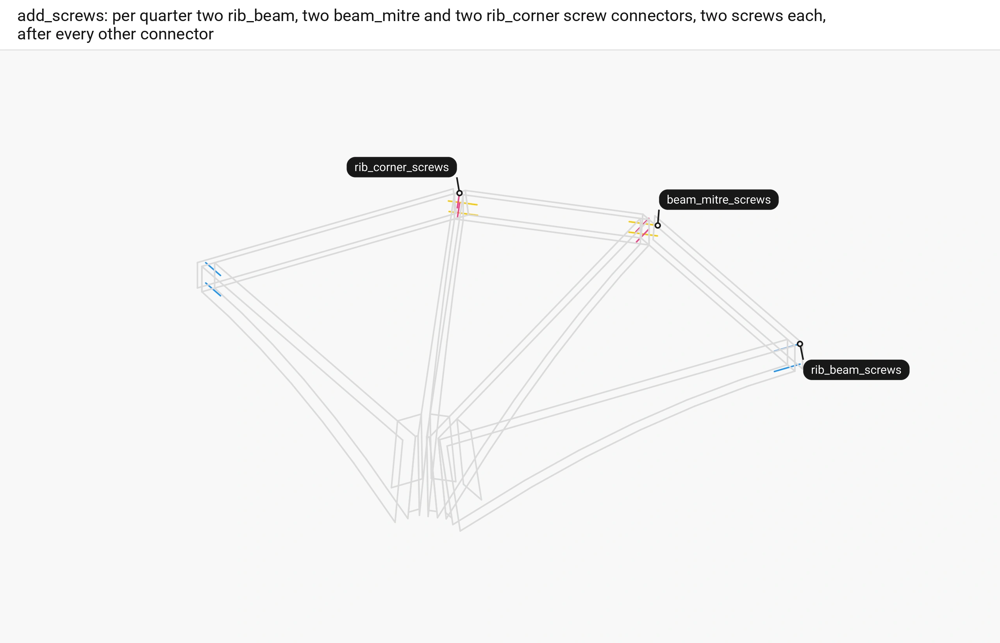

■ rib_beam_screws   ■ beam_mitre_screws   ■ rib_corner_screws   ■ context quarter 0's members, by their loops

For each quarter and k 0 and 1, `add_screws` asks `rib_beam_screws`, `beam_mitre_screws` and `rib_corner_screws` for two lines each and builds every screw connector before it adds any, so a bay too narrow for them throws with nothing added.

Code: `Floor::add_screws`, [floor.cpp:373-396](https://github.com/petrasvestartas/wood/blob/5f7f317df711a163eda3c416cb426e5cd8663dd6/src/templates/floor/floor.cpp#L373-L396).

## 302. axis

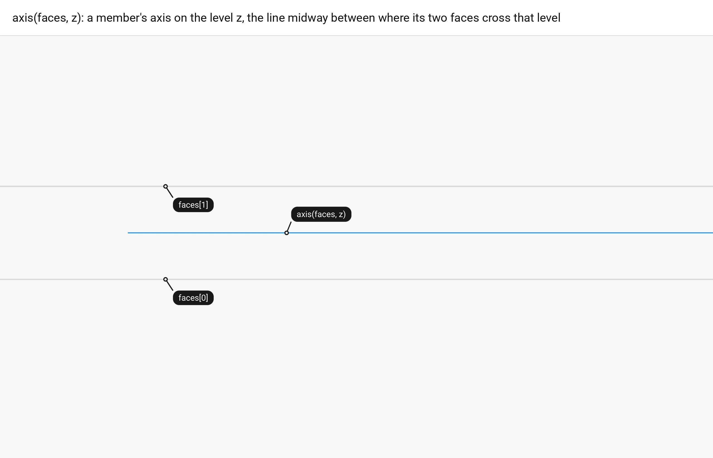

■ built `axis(faces, z)`   ■ input `faces[0]`, `faces[1]`, where outer rib 0's two face planes cross the level, dashed   ■ context the rib's loops

Every screw starts from a member's axis on a level z: `axis(faces, z)` is the line midway between where the member's two face planes cross the plane z.

Code: `Floor::axis`, [floor.cpp:498-507](https://github.com/petrasvestartas/wood/blob/5f7f317df711a163eda3c416cb426e5cd8663dd6/src/templates/floor/floor.cpp#L498-L507).

## 303. rib_beam_screws: the levels

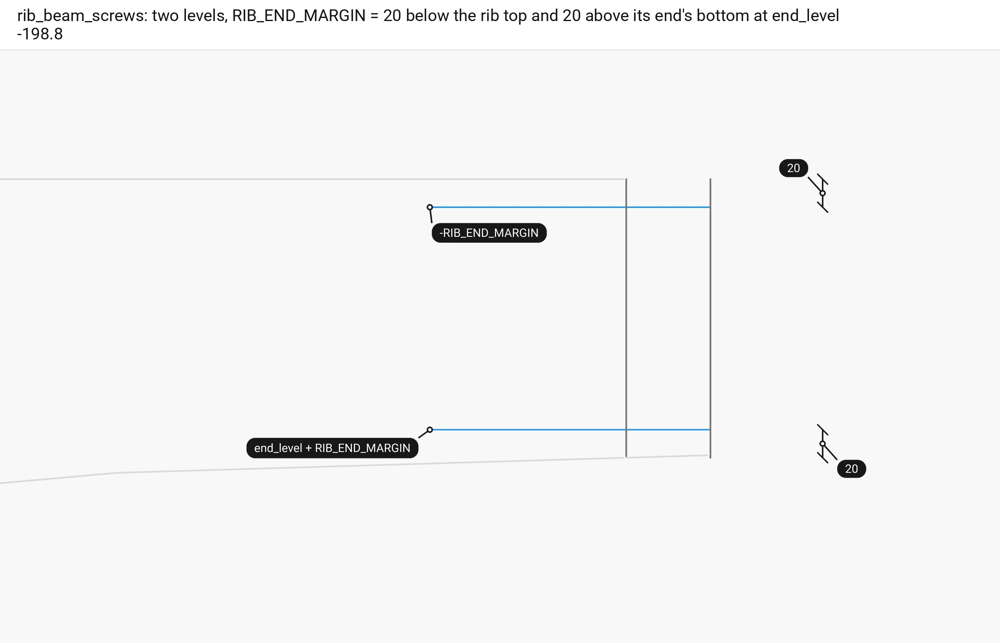

■ built the two screws   ■ input the seam beam's loops   ■ context outer rib 0's loops

An outer rib takes two screws at its seam end, `RIB_END_MARGIN` (20) below its top and 20 above its bottom there, `end_level` (-198.8) on the rib's end plane `rib_seam_ends`.

Code: `Floor::rib_beam_screws`, [floor.cpp:419-430](https://github.com/petrasvestartas/wood/blob/5f7f317df711a163eda3c416cb426e5cd8663dd6/src/templates/floor/floor.cpp#L419-L430); `FloorGuide::end_level`, [floor_guide.cpp:880-890](https://github.com/petrasvestartas/wood/blob/5f7f317df711a163eda3c416cb426e5cd8663dd6/src/templates/floor/floor_guide.cpp#L880-L890); `RIB_END_MARGIN`, [floor.h:48](https://github.com/petrasvestartas/wood/blob/5f7f317df711a163eda3c416cb426e5cd8663dd6/src/templates/floor/floor.h#L48).

## 304. from_seam_face

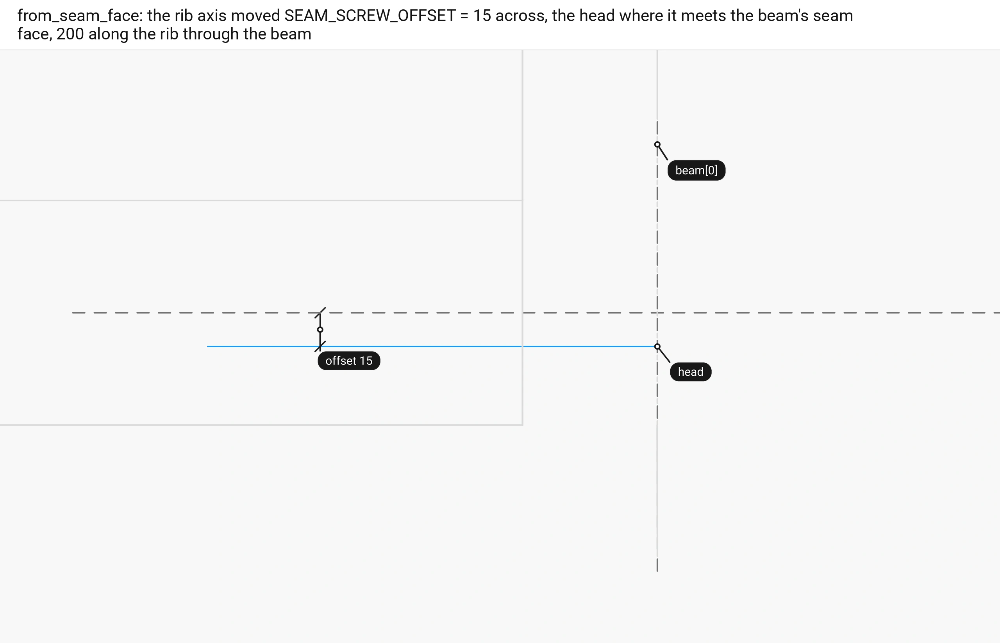

■ built the screw   ■ variable `head`   ■ input the rib's axis and the beam's seam face `beam[0]`, dashed   ■ context the rib and the beam

`from_seam_face` moves the rib's axis `SEAM_SCREW_OFFSET` (15) across the rib, puts the head where it meets the beam's seam face, and runs the screw `SCREW_LENGTH` (200) along the rib through the beam into the rib end.

Code: `Floor::from_seam_face`, [floor.cpp:488-496](https://github.com/petrasvestartas/wood/blob/5f7f317df711a163eda3c416cb426e5cd8663dd6/src/templates/floor/floor.cpp#L488-L496); `SEAM_SCREW_OFFSET`, `SCREW_LENGTH`, [floor.h:46-49](https://github.com/petrasvestartas/wood/blob/5f7f317df711a163eda3c416cb426e5cd8663dd6/src/templates/floor/floor.h#L46-L49).

## 305. Two quarters at a seam

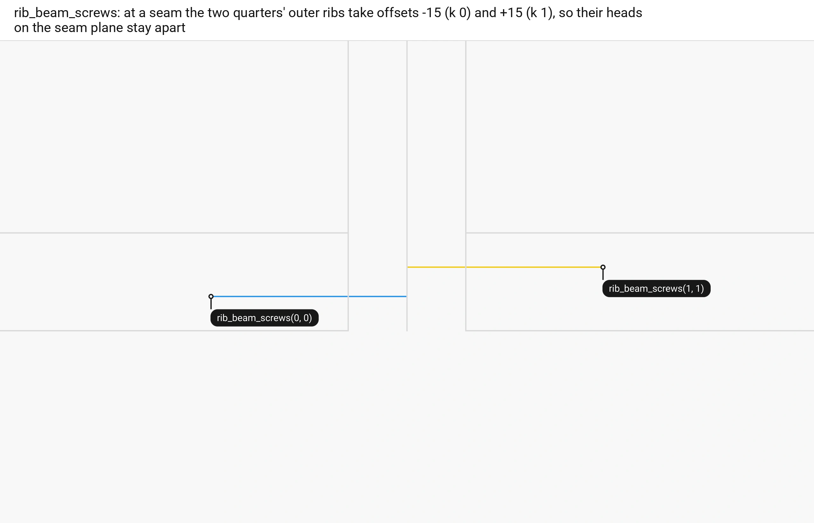

■ built `rib_beam_screws(0, 0)`   ■ result `rib_beam_screws(1, 1)`   ■ context the members at seam 0

The two quarters' outer ribs meet at a seam from opposite sides, so k 0 takes the offset -15 and k 1 +15, and their heads on the seam plane stay 30 apart.

Code: `Floor::rib_beam_screws`, [floor.cpp:426-427](https://github.com/petrasvestartas/wood/blob/5f7f317df711a163eda3c416cb426e5cd8663dd6/src/templates/floor/floor.cpp#L426-L427).

## 306. corner_level

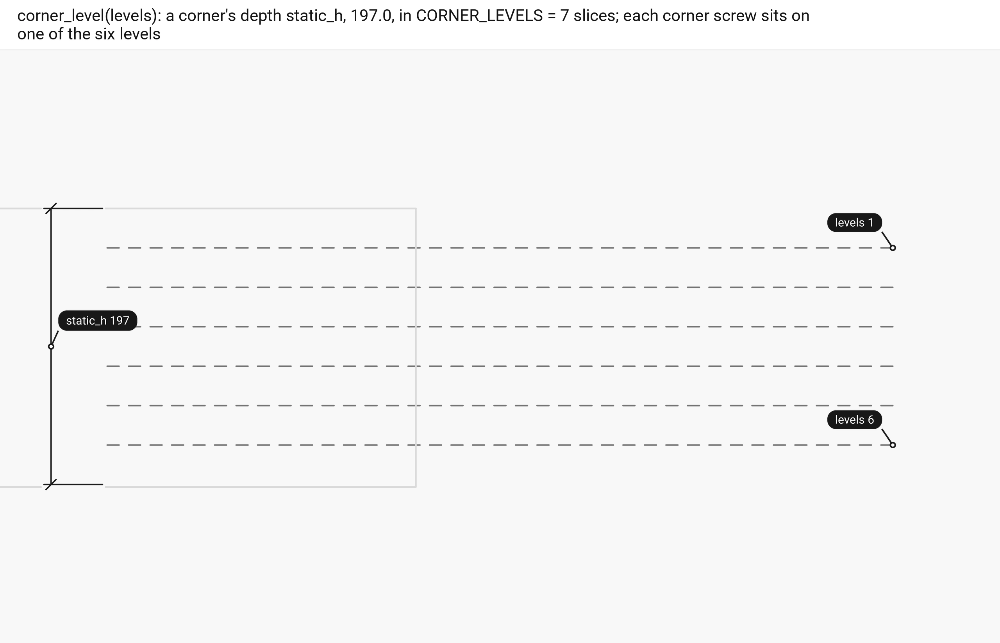

■ input the six levels, dashed   ■ context the oculus beam's loops, end on

At the oculus corners a screw's level is `corner_level(levels)`, the corner's depth `static_h` (197) in `CORNER_LEVELS` (7) slices, `levels` sevenths down from the datum; each kind of corner screw takes two of the six levels so crossing screws stay apart.

Code: `Floor::corner_level`, [floor.cpp:513-515](https://github.com/petrasvestartas/wood/blob/5f7f317df711a163eda3c416cb426e5cd8663dd6/src/templates/floor/floor.cpp#L513-L515); `FloorGuide::static_h`, [floor_guide.cpp:92-94](https://github.com/petrasvestartas/wood/blob/5f7f317df711a163eda3c416cb426e5cd8663dd6/src/templates/floor/floor_guide.cpp#L92-L94); `CORNER_LEVELS`, [floor.h:50](https://github.com/petrasvestartas/wood/blob/5f7f317df711a163eda3c416cb426e5cd8663dd6/src/templates/floor/floor.h#L50).

## 307. along_axis

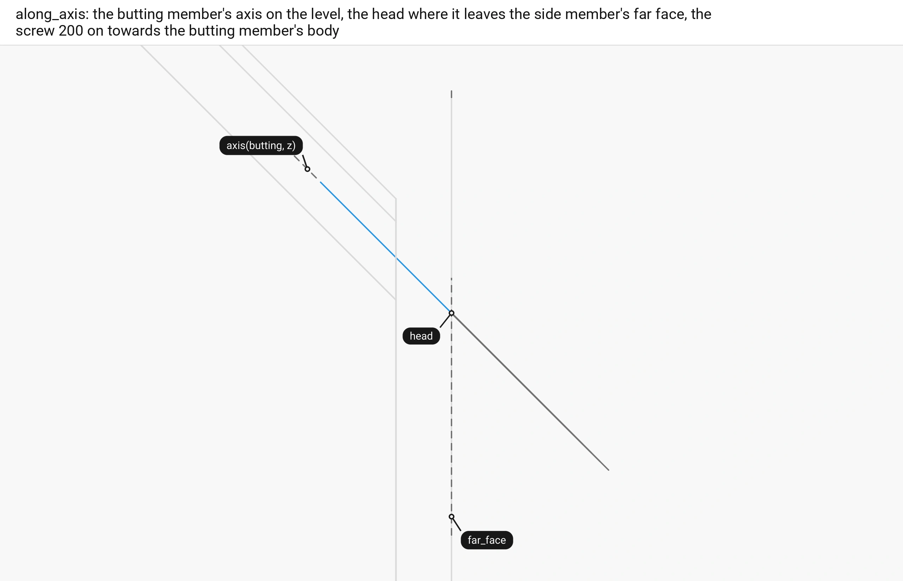

■ built the screw   ■ variable `head`   ■ input `axis(butting, z)` and `far_face`, dashed   ■ context the seam beam and the oculus beam

`along_axis` takes the butting member's axis on the level, puts the head where it leaves the side member's far face, and runs the screw 200 on towards the butting member's body.

Code: `Floor::along_axis`, [floor.cpp:476-486](https://github.com/petrasvestartas/wood/blob/5f7f317df711a163eda3c416cb426e5cd8663dd6/src/templates/floor/floor.cpp#L476-L486); `FloorGuide::body`, [floor_guide.cpp:876-878](https://github.com/petrasvestartas/wood/blob/5f7f317df711a163eda3c416cb426e5cd8663dd6/src/templates/floor/floor_guide.cpp#L876-L878).

## 308. beam_mitre_screws

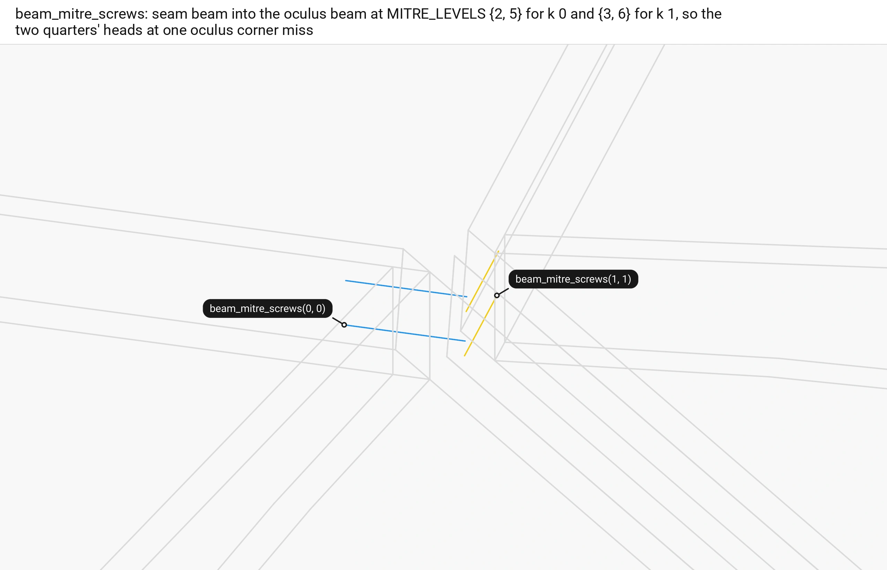

■ built `beam_mitre_screws(0, 0)`   ■ result `beam_mitre_screws(1, 1)`   ■ context the members at oculus corner 0

`beam_mitre_screws(q, k)` screws seam beam k through into the oculus beam by `along_axis` from the seam plane at `MITRE_LEVELS[k]`, {2, 5} for k 0 and {3, 6} for k 1, so the two quarters' heads at one oculus corner miss each other.

Code: `Floor::beam_mitre_screws`, [floor.cpp:432-443](https://github.com/petrasvestartas/wood/blob/5f7f317df711a163eda3c416cb426e5cd8663dd6/src/templates/floor/floor.cpp#L432-L443); `MITRE_LEVELS`, [floor.h:51](https://github.com/petrasvestartas/wood/blob/5f7f317df711a163eda3c416cb426e5cd8663dd6/src/templates/floor/floor.h#L51).

## 309. rib_corner_screws

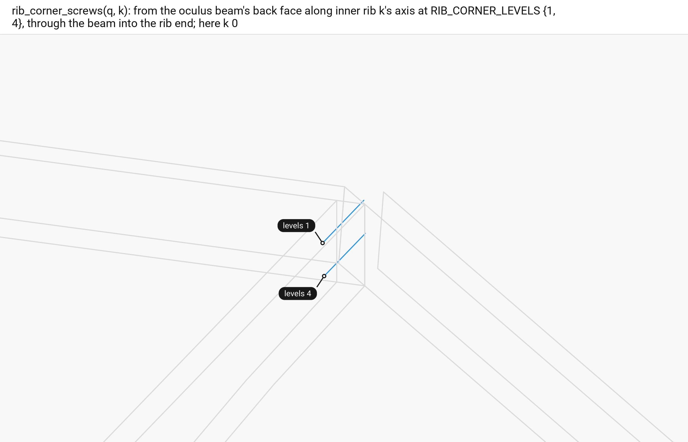

■ built the two screws of inner rib 0   ■ context the oculus beam, a seam beam and the rib

`rib_corner_screws(q, k)` screws the oculus beam into inner rib k by `along_axis` from the beam's back face along the rib's axis, at `RIB_CORNER_LEVELS` {1, 4}, apart from the mitre screws they cross.

Code: `Floor::rib_corner_screws`, [floor.cpp:445-461](https://github.com/petrasvestartas/wood/blob/5f7f317df711a163eda3c416cb426e5cd8663dd6/src/templates/floor/floor.cpp#L445-L461); `RIB_CORNER_LEVELS`, [floor.h:52](https://github.com/petrasvestartas/wood/blob/5f7f317df711a163eda3c416cb426e5cd8663dd6/src/templates/floor/floor.h#L52).

## 310. A bay too narrow

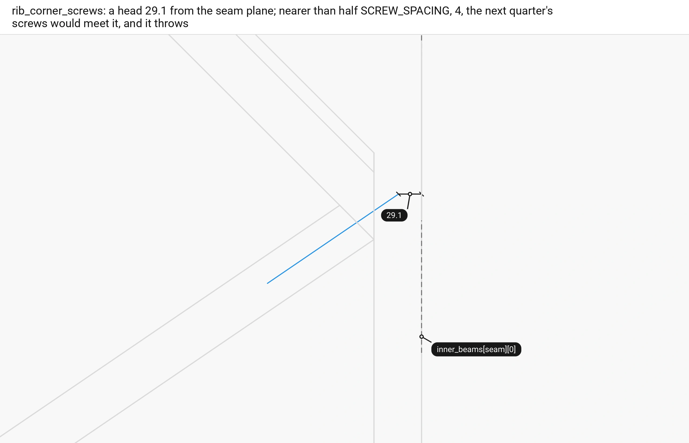

■ built a corner screw   ■ input the seam plane `inner_beams[seam][0]`, dashed   ■ context the beams and the rib

A corner screw's head here lies 29.1 from the seam plane; nearer than half `SCREW_SPACING` (4) the next quarter's screws would meet it, and `rib_corner_screws` throws that the bay is too narrow for the corner screws.

Code: `Floor::rib_corner_screws`, [floor.cpp:454-457](https://github.com/petrasvestartas/wood/blob/5f7f317df711a163eda3c416cb426e5cd8663dd6/src/templates/floor/floor.cpp#L454-L457); `SCREW_SPACING`, [floor.h:47](https://github.com/petrasvestartas/wood/blob/5f7f317df711a163eda3c416cb426e5cd8663dd6/src/templates/floor/floor.h#L47).

## 311. passes_seam_beam

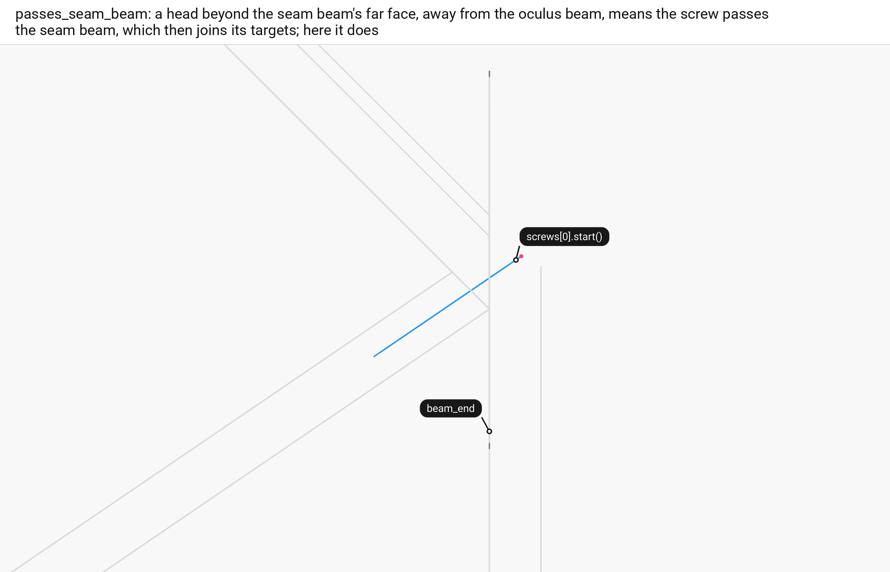

■ built the corner screws   ■ variable their heads   ■ input `beam_end`, the seam beam's far face, dashed   ■ context the beams and the rib

A corner screw whose head lies beyond the seam beam's far face, away from the oculus beam, passes through the seam beam too, and `add_screws` makes the seam beam a third target; here it does.

Code: `Floor::passes_seam_beam`, [floor.cpp:463-474](https://github.com/petrasvestartas/wood/blob/5f7f317df711a163eda3c416cb426e5cd8663dd6/src/templates/floor/floor.cpp#L463-L474); `Floor::add_screws`, [floor.cpp:387-395](https://github.com/petrasvestartas/wood/blob/5f7f317df711a163eda3c416cb426e5cd8663dd6/src/templates/floor/floor.cpp#L387-L395).

## 312. screws_of

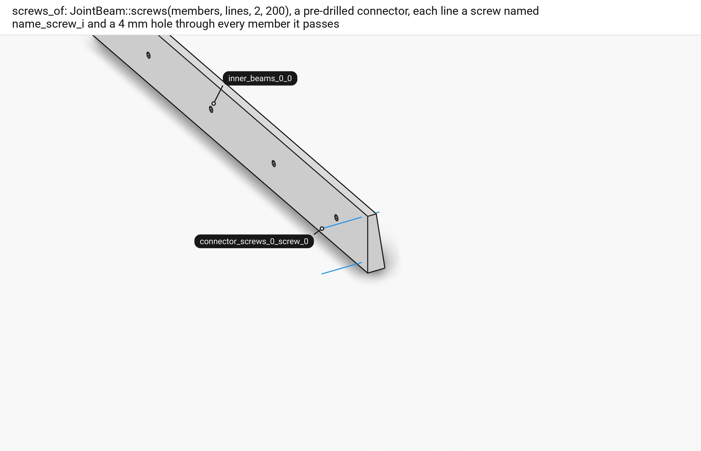

■ built `drill_lines`, the screws   ■ context `inner_beams_0_0`, drilled

`screws_of` makes `JointBeam::screws(members, lines, 2, 200)`: a pre-drilled connector, each line a screw named `connector_screws_n_screw_i`, a 4 mm hole through every member it passes and no other cut.

Code: `Floor::screws_of`, [floor.cpp:410-417](https://github.com/petrasvestartas/wood/blob/5f7f317df711a163eda3c416cb426e5cd8663dd6/src/templates/floor/floor.cpp#L410-L417); `JointBeam::screws`, [wood_element_joint_beam.cpp:506-528](https://github.com/petrasvestartas/wood/blob/5f7f317df711a163eda3c416cb426e5cd8663dd6/src/joinery_solver/wood_elements/wood_element_joint_beam.cpp#L506-L528); `add_pre_drill_joint`, [wood_session.cpp:1298-1312](https://github.com/petrasvestartas/wood/blob/5f7f317df711a163eda3c416cb426e5cd8663dd6/src/joinery_solver/wood_session.cpp#L1298-L1312).

## 313. Every screw

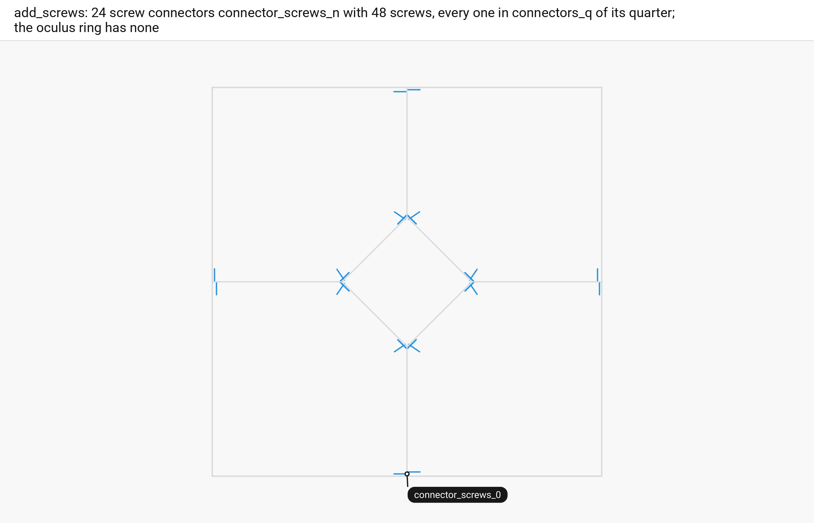

■ built every screw   ■ context the bay, the seams and the oculus in plan

`add_named_connector` names them `connector_screws_n` in `connectors_q` of their quarter: 24 screw connectors with 48 screws on the default floor, none at the oculus ring.

Code: `Floor::add_screws`, [floor.cpp:398-407](https://github.com/petrasvestartas/wood/blob/5f7f317df711a163eda3c416cb426e5cd8663dd6/src/templates/floor/floor.cpp#L398-L407).
