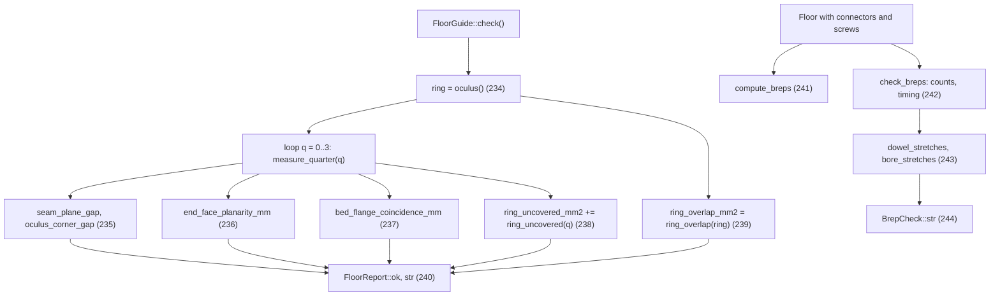

# Floor 11: Checks and examples {#templates_floor_11_checks}

`FloorGuide::check()` measures the relations the design relies on and returns a `FloorReport`, while `compute_breps` and `check_breps` build exact-bore BReps of a `Floor` and count them against the bores the dowels and screws need. Values are for `FloorGuide::rectangle(3000, 3000)` unless a section says otherwise.

Example: [templates_floor_7_contacts_cantilevers.cpp](https://github.com/petrasvestartas/wood/blob/44f9aa85952d32a9264125f4e9940e55b05a4512/examples/templates_floor_7_contacts_cantilevers.cpp) and [templates_floor_8_rectangle.cpp](https://github.com/petrasvestartas/wood/blob/44f9aa85952d32a9264125f4e9940e55b05a4512/examples/templates_floor_8_rectangle.cpp) build the complete connected floor on the square bay and on the tied 6000 x 4800 bay.

No example calls `check()` or `check_breps()`; only the tests call `check()`.

## 234. check(): the oculus ring it measures

■ built `ring[0..3].top` on `tilted`   ■ result `ring[0..3].bottom` on `ring_inner`   ■ input `oculus_edges[0..3].line`

`check()` measures only the four ring beams `ring[0..3]` of `oculus()`, each lofted from its outer face on `tilted` to its inner face on `ring_inner`, 60 wide at the datum and 42.6 at the soffit.

Code: `FloorGuide::oculus`, [floor_members.cpp:232-260](https://github.com/petrasvestartas/wood/blob/16f3ab0a2386bf39ac7f7123c0a20d03e73ab1a5/src/templates/floor/floor_members.cpp#L232-L260); `loft_planes`, [floor_geometry.cpp:273-296](https://github.com/petrasvestartas/wood/blob/16f3ab0a2386bf39ac7f7123c0a20d03e73ab1a5/src/templates/floor/floor_geometry.cpp#L273-L296); `oculus_edge`, [floor.cpp:93-103](https://github.com/petrasvestartas/wood/blob/16f3ab0a2386bf39ac7f7123c0a20d03e73ab1a5/src/templates/floor/floor.cpp#L93-L103).

## 235. seam_plane_gap and oculus_corner_gap

■ built `quarter(1).inner_beams()[2]`   ■ variable `seam_plane_gap[0]` corners, `oculus_corner_gap[0]` at `polygon[2]`   ■ input `quarter(0).inner_beams()[0]`, seam plane `planes.inner_beams[0][0]` (dashed), `oculus_corners[0]`   ■ context quarter polygons 0 and 1

`seam_plane_gap[q]` is the largest distance of quarter `next`'s seam beam face corners from quarter `q`'s seam plane, and `oculus_corner_gap[q]` the distance between the two quarters' copies of oculus corner `q`; both are 0 by construction and `ok()` requires both. The corner gap checks polygon indexing only, not that the quarter polygons tile the bay.

Code: `measure_quarter`, [floor_report.cpp:145-150](https://github.com/petrasvestartas/wood/blob/16f3ab0a2386bf39ac7f7123c0a20d03e73ab1a5/src/templates/floor/floor_report.cpp#L145-L150); `Seam::plane_into`, [floor.cpp:413-418](https://github.com/petrasvestartas/wood/blob/16f3ab0a2386bf39ac7f7123c0a20d03e73ab1a5/src/templates/floor/floor.cpp#L413-L418).

## 236. end_face_planarity

■ built column end plane `cp.wedges[0][0]`   ■ result seam end plane `rib_seam_ends()[0]`   ■ variable the eight end corners, `end_face_planarity_mm[0]`   ■ input `outer_ribs()[0]`

`end_face_planarity_mm[q]` is the farthest end corner of the quarter's four ribs from the plane that end should lie on (5.258e-13 on the square), so every end face is flat and seated. With `seam_through_ribs` (the default) the outer ribs end on the seam beams' far faces, otherwise on the seam planes.

Code: `end_face_offset`, `end_face_planarity`, [floor_report.cpp:47-76](https://github.com/petrasvestartas/wood/blob/16f3ab0a2386bf39ac7f7123c0a20d03e73ab1a5/src/templates/floor/floor_report.cpp#L47-L76); `rib_loop`, [floor_members.cpp:17-32](https://github.com/petrasvestartas/wood/blob/16f3ab0a2386bf39ac7f7123c0a20d03e73ab1a5/src/templates/floor/floor_members.cpp#L17-L32); `Quarter::rib_seam_ends`, [floor_members.cpp:69-75](https://github.com/petrasvestartas/wood/blob/16f3ab0a2386bf39ac7f7123c0a20d03e73ab1a5/src/templates/floor/floor_members.cpp#L69-L75).

## 237. bed_flange_coincidence

■ built the middle bed of row 0   ■ variable `under[0..3]`   ■ input `tsections[1]`, `tsections[0]`   ■ context the other beds of row 0

`bed_flange_coincidence_mm[q]` is the worst distance of a bed plate's underside corners `under[0..3]` from the top loop of the t-sections beside it; 0 means every bed sits on its flanges.

Code: `bed_flange_coincidence`, [floor_report.cpp:79-94](https://github.com/petrasvestartas/wood/blob/16f3ab0a2386bf39ac7f7123c0a20d03e73ab1a5/src/templates/floor/floor_report.cpp#L79-L94); `distance`, [floor_report.cpp:13-15](https://github.com/petrasvestartas/wood/blob/16f3ab0a2386bf39ac7f7123c0a20d03e73ab1a5/src/templates/floor/floor_report.cpp#L13-L15); `bed_row`, [floor_members.cpp:189-204](https://github.com/petrasvestartas/wood/blob/16f3ab0a2386bf39ac7f7123c0a20d03e73ab1a5/src/templates/floor/floor_members.cpp#L189-L204).

## 238. ring_uncovered

■ built `a = quarter(0).inner_beams()[1].bottom`   ■ variable uncovered pieces, `ring_uncovered_mm2` (none on the square)   ■ input `b = ring[0].top`

`ring_uncovered_mm2` sums, over the four quarters, the area of the quarter oculus beam's face that lies outside its ring beam's face on the tilted plane; 0 means full bearing. `geometry::invalid` already refuses any guide with `sin(oculus_corner_angle(k)) < sin(oculus_seam_angle(k))`, so the constructor throws before this can fail.

Code: `ring_uncovered`, [floor_report.cpp:133-136](https://github.com/petrasvestartas/wood/blob/16f3ab0a2386bf39ac7f7123c0a20d03e73ab1a5/src/templates/floor/floor_report.cpp#L133-L136); `boolean_area`, [floor_report.cpp:32-40](https://github.com/petrasvestartas/wood/blob/16f3ab0a2386bf39ac7f7123c0a20d03e73ab1a5/src/templates/floor/floor_report.cpp#L32-L40); `geometry::invalid`, [floor_plan.cpp:110-142](https://github.com/petrasvestartas/wood/blob/16f3ab0a2386bf39ac7f7123c0a20d03e73ab1a5/src/templates/floor/floor_plan.cpp#L110-L142).

## 239. ring_overlap

■ built `footprints[0..3]`   ■ variable pairwise overlaps, `ring_overlap_mm2` (none on the square)   ■ context oculus edges (dashed)

`ring_overlap_mm2` sums the plan overlaps of the six pairs of ring beam footprints (convex hulls of both loops at z 0); neighbours touch only on a `ring_inner` plane, so it is 0.

Code: `ring_overlap`, [floor_report.cpp:109-131](https://github.com/petrasvestartas/wood/blob/16f3ab0a2386bf39ac7f7123c0a20d03e73ab1a5/src/templates/floor/floor_report.cpp#L109-L131).

## 240. FloorReport::ok and str

`ok(tolerance)` fails when any of the five per-quarter identities or either ring area exceeds `tolerance`, applied to mm and mm2 alike; every other field is reported only. `str()` opens with `floor report: ok` or `floor report: FAILING` from `ok()` at its default 1e-6, then three lines per quarter and one ring line.

Code: `FloorReport::ok`, [floor_report.cpp:188-195](https://github.com/petrasvestartas/wood/blob/16f3ab0a2386bf39ac7f7123c0a20d03e73ab1a5/src/templates/floor/floor_report.cpp#L188-L195); `FloorReport::str`, [floor_report.cpp:197-210](https://github.com/petrasvestartas/wood/blob/16f3ab0a2386bf39ac7f7123c0a20d03e73ab1a5/src/templates/floor/floor_report.cpp#L197-L210); `measure_quarter`, [floor_report.cpp:139-167](https://github.com/petrasvestartas/wood/blob/16f3ab0a2386bf39ac7f7123c0a20d03e73ab1a5/src/templates/floor/floor_report.cpp#L139-L167).

## 241. compute_breps (example 7)

■ built `model_geometry_brep()` of `wedges_1_0`, bores exact   ■ input `model_geometry_mesh()`, bores faceted

`compute_breps(session)` calls `compute_geometry_brep()` on every connector child and cut member, so each bore is an exact cylinder in `model_geometry_brep()` while `model_geometry_mesh()` keeps it faceted. Example 7 builds the square floor with members, connectors and screws and calls it when `BREPS` is true.

Code: `compute_breps`, [floor_brep_check.cpp:120-125](https://github.com/petrasvestartas/wood/blob/16f3ab0a2386bf39ac7f7123c0a20d03e73ab1a5/src/templates/floor/floor_brep_check.cpp#L120-L125); `is_connector_child`, `is_cut_member`, [floor_brep_check.cpp:16-25](https://github.com/petrasvestartas/wood/blob/16f3ab0a2386bf39ac7f7123c0a20d03e73ab1a5/src/templates/floor/floor_brep_check.cpp#L16-L25); `solid_cuts_brep`, [wood_element_solid_cut.cpp:40-58](https://github.com/petrasvestartas/wood/blob/16f3ab0a2386bf39ac7f7123c0a20d03e73ab1a5/src/joinery_solver/wood_elements/wood_element_solid_cut.cpp#L40-L58); `main`, [templates_floor_7_contacts_cantilevers.cpp:10-23](https://github.com/petrasvestartas/wood/blob/16f3ab0a2386bf39ac7f7123c0a20d03e73ab1a5/examples/templates_floor_7_contacts_cantilevers.cpp#L10-L23).

## 242. check_breps: parts, connectors, members, timing

■ built exact members, `check.exact`, `check.bores`   ■ variable faceted members, `check.faceted`   ■ result connector parts and dowels, `check.part_bores`   ■ context uncut members

`check_breps(session)` walks the elements once, counting exact bores in connector parts (`part_bores`) and cut members (`bores`); a cut member with no exact bore goes into `faceted`, either because `drilled_brep` failed or it had no drills.

Code: `check_breps`, [floor_brep_check.cpp:84-118](https://github.com/petrasvestartas/wood/blob/16f3ab0a2386bf39ac7f7123c0a20d03e73ab1a5/src/templates/floor/floor_brep_check.cpp#L84-L118); `count_bores`, [floor_brep_check.cpp:27-36](https://github.com/petrasvestartas/wood/blob/16f3ab0a2386bf39ac7f7123c0a20d03e73ab1a5/src/templates/floor/floor_brep_check.cpp#L27-L36).

## 243. dowel_stretches and bore_stretches

■ built stretch in `wedges_0_0`   ■ result stretch in `outer_ribs_0_0`   ■ input `drill_axes()[0]` (headed)   ■ context the two target solids

`dowel_stretches` counts, independently of the BReps, every stretch of a drill axis inside a target solid or connector part that overlaps the drill's own span; each is one cylinder the BReps should contain.

Code: `dowel_stretches`, [floor_brep_check.cpp:52-78](https://github.com/petrasvestartas/wood/blob/16f3ab0a2386bf39ac7f7123c0a20d03e73ab1a5/src/templates/floor/floor_brep_check.cpp#L52-L78); `bore_stretches`, [floor_brep_check.cpp:39-49](https://github.com/petrasvestartas/wood/blob/16f3ab0a2386bf39ac7f7123c0a20d03e73ab1a5/src/templates/floor/floor_brep_check.cpp#L39-L49); `merged_drills`, [wood_brep_drill.cpp:786](https://github.com/petrasvestartas/wood/blob/16f3ab0a2386bf39ac7f7123c0a20d03e73ab1a5/src/joinery_solver/wood_algorithms/wood_brep_drill.cpp#L786); `inside_stretches`, [wood_brep_drill.cpp:984](https://github.com/petrasvestartas/wood/blob/16f3ab0a2386bf39ac7f7123c0a20d03e73ab1a5/src/joinery_solver/wood_algorithms/wood_brep_drill.cpp#L984).

## 244. BrepCheck::str

`BrepCheck::str()` writes the counters in two lines, then one line per faceted member; every stretch became an exact bore when `stretches == bores + part_bores`.

Code: `BrepCheck::str`, [floor_brep_check.cpp:127-136](https://github.com/petrasvestartas/wood/blob/16f3ab0a2386bf39ac7f7123c0a20d03e73ab1a5/src/templates/floor/floor_brep_check.cpp#L127-L136).

## 245. Example 8: tied 6000 x 4800 bay

■ built `quads.outer_ribs` of all four quarters   ■ variable `seam_tie` contacts, `SEAM_THROUGH_RIBS = false`   ■ input `oculus_edges[0..3].line`, `seams[0..3].line` (dashed)   ■ context bay edges, quarter polygons

Example 8 builds the same model on `rectangle(3000, 2400)` with `seam_through_ribs = false`, so the outer ribs end on the seam plane, the seam beams stop at the outer rib band, and a `seam_tie` joins outer ribs end to end at each seam. The shorter ribs along y get the shorter run-in (240 / 187.667 in quarter 0).

Code: `main`, [templates_floor_8_rectangle.cpp:13-28](https://github.com/petrasvestartas/wood/blob/16f3ab0a2386bf39ac7f7123c0a20d03e73ab1a5/examples/templates_floor_8_rectangle.cpp#L13-L28); `seam_tie`, [floor_relations.cpp:120-138](https://github.com/petrasvestartas/wood/blob/16f3ab0a2386bf39ac7f7123c0a20d03e73ab1a5/src/templates/floor/floor_relations.cpp#L120-L138).
