# Floor 11: Checks and examples {#templates_floor_11_checks}

This chapter covers the checks that run after the model is built. `FloorGuide::check()` (`src/templates/floor/floor_report.cpp:173-186`) measures the relations the design relies on in the guide's outlines and returns a `FloorReport`. `compute_breps` and `check_breps` (`src/templates/floor/floor_brep_check.cpp:84-125`) turn the cut members and connector parts of a `Floor` into BReps with exact bores and count them against the bores the dowels and screws need. `check()` reads the guide of chapters 1 to 6. `compute_breps` and `check_breps` read the `Floor` of chapters 7 to 10, with every member, connector and screw. The chapter ends with the two examples that build the complete model: example 7 on the square bay and example 8 on the tied 6000 x 4800 bay. Every value is for the default bay `FloorGuide::rectangle(3000, 3000)` unless a section says otherwise.

Example: [templates_floor_7_contacts_cantilevers.cpp](https://github.com/petrasvestartas/wood/blob/44f9aa85952d32a9264125f4e9940e55b05a4512/examples/templates_floor_7_contacts_cantilevers.cpp) and [templates_floor_8_rectangle.cpp](https://github.com/petrasvestartas/wood/blob/44f9aa85952d32a9264125f4e9940e55b05a4512/examples/templates_floor_8_rectangle.cpp) build the complete connected floor this chapter checks, on the square bay and on the tied 6000 x 4800 bay, with `compute_breps` writing every dowel and screw bore as an exact cylinder.

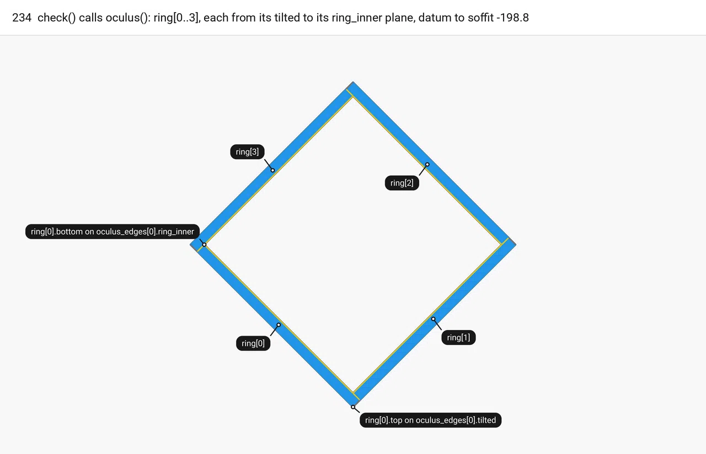

The order the checks run in, with the frames of this chapter:

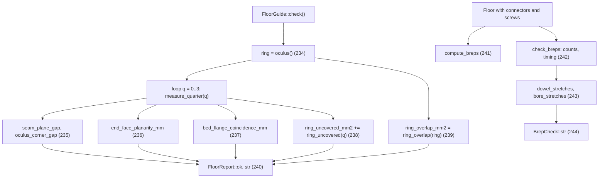

No example calls `check()`, `FloorReport::str()` or `check_breps()`; `grep` finds no caller of `check_breps` in `wood_research`. The tests call `check()` (`tests/floor_elements.cpp:388, 938-940, 1053, 1129-1130`). `docs/floor_parametric_model.md:1183-1187` says every floor example prints `check().str()` and `check_breps(session).str()`. That document is out of date.

## 234. check(): the oculus ring it measures

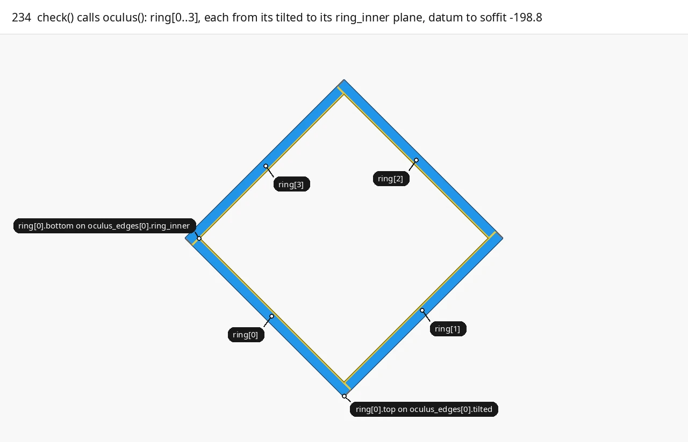

<span style="color:#2196EA">■ built</span> `ring[0..3].top` on `tilted`   <span style="color:#F2CC0C">■ result</span> `ring[0..3].bottom` on `ring_inner`   <span style="color:#737373">■ input</span> `oculus_edges[0..3].line`

`check()` calls `oculus()` once and keeps the result as `ring` (`floor_report.cpp:176`). Only <span style="color:#2196EA">`ring[0..3]`</span>, the four ring beams, are measured. Outlines 4 to 8 are the bottom wedges and the central plate, and `check()` does not read them. Ring beam `i` is `loft_planes` over four side planes between two loop planes. Each corner is `plane_plane_plane` of two consecutive side planes and one loop plane:

```cpp
plates.push_back(loft_planes({side2, tilted[(i + 1) % 4], side0, inner[(i + 3) % 4]}, tilted[i], inner[i], true));
```

`side0 = level(0)` is the datum and `side2 = level(soffit)`. The beam starts on the previous beam's `ring_inner` plane and ends on the next beam's `tilted` plane, flush with that beam's outer face, so the four beams form a pinwheel. `flip = true` swaps the two loops. <span style="color:#2196EA">`ring[i].top`</span> is the loop on `oculus_edges[i].tilted`, the outer face the quarter's oculus beam bears on. <span style="color:#F2CC0C">`ring[i].bottom`</span> is the loop on `oculus_edges[i].ring_inner`. `tilted` is the oculus edge's vertical plane rotated by `-oculus_plane_angle` about the edge line through its centre. Its trace at the datum is <span style="color:#737373">the edge itself</span>, and below the datum it moves `|z| tan(5 deg)` toward the centre. `back` is the edge plane offset `inner_beams` into the quarter, and `ring_inner = back` offset by `-2 inner_beams`, which puts it `inner_beams` inside the edge (`floor.cpp:93-103`). The ring beam is therefore 60 wide at the datum and `60 - 198.783 tan(5 deg) = 42.6` wide at the soffit. In the picture, the two loops of each beam are drawn in plan.

| Variable | Value | Meaning |
|---|---|---|
| `ring` | 9 outlines | `oculus()`: 4 ring beams, 4 bottom wedges, the central plate; `check()` reads `ring[0..3]` |
| `ring[i].top` | loop of 4 corners | Ring beam `i`'s outer face, on `oculus_edges[i].tilted`, from the datum down to `soffit` |
| `ring[i].bottom` | loop of 4 corners | Ring beam `i`'s inner face, on `oculus_edges[i].ring_inner` |
| `side0`, `side2` | `level(0)`, `level(soffit)` | The datum and the soffit level the beam spans |
| `soffit` | -198.783 | The level of every beam soffit (chapter 5) |
| `inner_beams` | 60 | Ring width at the datum: `back` is +60, `ring_inner` is `back` - 120 |
| `oculus_plane_angle` | 5 | Degrees the bearing plane `tilted` leans about the oculus edge |
| `oculus` | 1000 | Distance of each oculus corner from the centre |

Code: `FloorGuide::oculus`, [floor_members.cpp:232-260](https://github.com/petrasvestartas/wood/blob/16f3ab0a2386bf39ac7f7123c0a20d03e73ab1a5/src/templates/floor/floor_members.cpp#L232-L260); `loft_planes`, [floor_geometry.cpp:273-296](https://github.com/petrasvestartas/wood/blob/16f3ab0a2386bf39ac7f7123c0a20d03e73ab1a5/src/templates/floor/floor_geometry.cpp#L273-L296); `oculus_edge`, [floor.cpp:93-103](https://github.com/petrasvestartas/wood/blob/16f3ab0a2386bf39ac7f7123c0a20d03e73ab1a5/src/templates/floor/floor.cpp#L93-L103).

## 235. seam_plane_gap and oculus_corner_gap

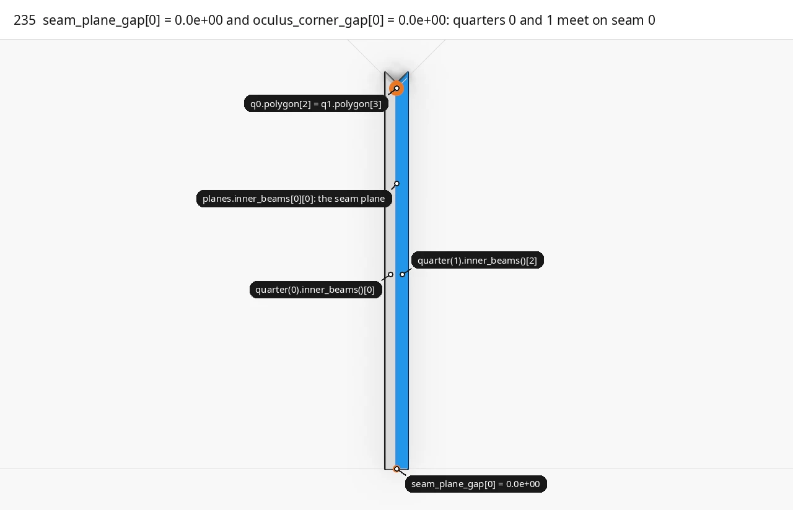

<span style="color:#2196EA">■ built</span> `quarter(1).inner_beams()[2]`   <span style="color:#E8478B">■ variable</span> `seam_plane_gap[0]` corners, `oculus_corner_gap[0]` at `polygon[2]`   <span style="color:#737373">■ input</span> `quarter(0).inner_beams()[0]`, seam plane `planes.inner_beams[0][0]` (dashed), `oculus_corners[0]`   <span style="color:#A3A3A3">■ context</span> quarter polygons 0 and 1

Both measures are taken in `measure_quarter` for quarter `q` and its neighbour `next = (q + 1) % 4`. <span style="color:#E8478B">`seam_plane_gap[q]`</span> checks that the two seam beams of seam `q` meet on one plane. For quarter `next`, `cp.inner_beams[2]` is `seams[(next + 3) % 4].faces_into(next) = seams[q].faces_into(next)` (`floor.cpp:191`). The loop <span style="color:#2196EA">`inner_beams()[2].bottom`</span> is therefore on `seams[q].plane_into(next)`. For every corner of that loop, the step takes the absolute `signed_distance` to quarter `q`'s <span style="color:#737373">`planes.inner_beams[0][0] = seams[q].plane_into(q)`</span> and keeps the largest:

```cpp
for (const Point& point : open_points(guide.quarter(next).inner_beams()[2].bottom))
    report.seam_plane_gap[q] = std::max(report.seam_plane_gap[q], std::abs(signed_distance(point, geometry.planes.inner_beams[0][0])));
```

`plane_into` makes both planes with `edge_plane` from the same seam segment, midpoint to oculus corner. Only the direction is reversed, so the planes coincide with opposite normals. <span style="color:#737373">Quarter 0's beam 0</span> lies 60 into quarter 0, x from -60 to 0, and <span style="color:#2196EA">quarter 1's beam 2</span> lies 60 into quarter 1, x from 0 to 60. The four <span style="color:#E8478B">measured corners</span> on the square are (0, -3000, 0), (0, -1000, 0), (0, -975.4, -198.783) and (0, -3000, -198.783). The soffit corner on the oculus side is 24.6 nearer the centre because the tilted plane leans.

<span style="color:#E8478B">`oculus_corner_gap[q]`</span> is `(geometry.polygon[2] - guide.geometry[next].polygon[3]).magnitude()`. The quarter polygon is `{corners[q], edges[q].midpoint, oculus_corners[q], oculus_corners[(q + 3) % 4], edges[(q + 3) % 4].midpoint}` (`floor.cpp:423`). `polygon[2]` of `q` and `polygon[3]` of `q + 1` are both the stored point <span style="color:#737373">`oculus_corners[q]`</span>. The measure checks the polygon indexing. It does not test that the quarter polygons tile the bay. Both values are 0 by construction, and `ok()` requires both.

| Variable | Value | Meaning |
|---|---|---|
| `next` | `(q + 1) % 4` | The quarter on the beam-2 side of seam `q` |
| `report.seam_plane_gap[q]` | 0.000e+00 | Largest distance of quarter `next`'s seam beam face corners from quarter `q`'s seam plane, mm |
| `report.oculus_corner_gap[q]` | 0.000e+00 | Distance between the two quarters' copies of oculus corner `q`, mm |
| `planes.inner_beams[0][0]` | `seams[q].plane_into(q)` | Quarter `q`'s seam plane, normal into `q` |
| `inner_beams` | 60 | `Seam::thickness`, the offset of each seam beam into its quarter |

Code: `measure_quarter`, [floor_report.cpp:145-150](https://github.com/petrasvestartas/wood/blob/16f3ab0a2386bf39ac7f7123c0a20d03e73ab1a5/src/templates/floor/floor_report.cpp#L145-L150); `Seam::plane_into`, [floor.cpp:413-418](https://github.com/petrasvestartas/wood/blob/16f3ab0a2386bf39ac7f7123c0a20d03e73ab1a5/src/templates/floor/floor.cpp#L413-L418).

## 236. end_face_planarity

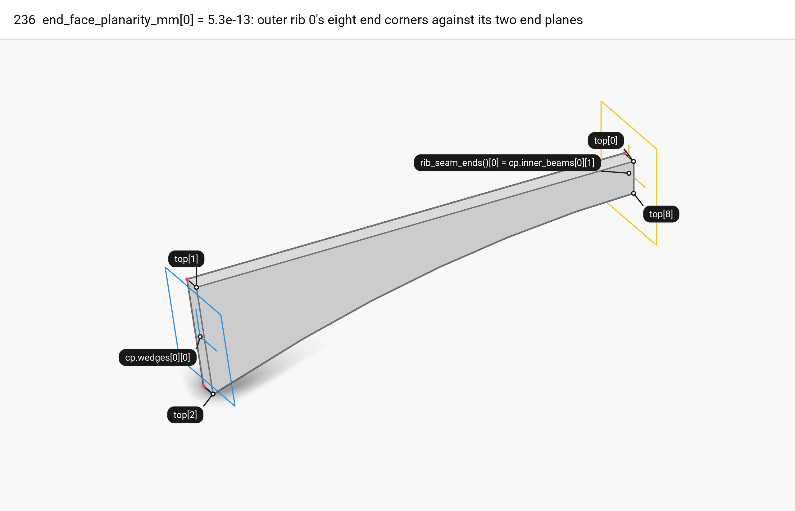

<span style="color:#2196EA">■ built</span> column end plane `cp.wedges[0][0]`   <span style="color:#F2CC0C">■ result</span> seam end plane `rib_seam_ends()[0]`   <span style="color:#E8478B">■ variable</span> the eight end corners, `end_face_planarity_mm[0]`   <span style="color:#737373">■ input</span> `outer_ribs()[0]`

<span style="color:#E8478B">`end_face_planarity_mm[q]`</span> is the farthest end-face corner of the quarter's four ribs from the plane that end should lie on. A rib loop is `{p1, p0, pts..., p1}` (`floor_members.cpp:27-29`). Index 1 is `p0` at the datum on the column end plane. Index 2 is the first soffit point at the column end. Index `n - 2` is the last soffit point, and index 0 is `p1` at the datum on the far end. `end_face_offset` takes the largest `|signed_distance|` of <span style="color:#E8478B">`top[1], top[2], bottom[2], bottom[1]`</span> to `cut_plane0` and of <span style="color:#E8478B">`top[0], top[n - 2], bottom[n - 2], bottom[0]`</span> to `cut_plane1`:

```cpp
end_face_offset(outer[0], cp.wedges[0][0], quarter.rib_seam_ends()[0]),
end_face_offset(outer[1], cp.wedges[2][0], quarter.rib_seam_ends()[1]),
end_face_offset(inner[0], cp.wedges[1][0], cp.inner_beams[1][1]),
end_face_offset(inner[1], cp.wedges[1][0], cp.inner_beams[1][1]),
```

The outer ribs end on the <span style="color:#2196EA">side fan planes</span> at the column and on <span style="color:#F2CC0C">`rib_seam_ends()`</span> at the seam. With `seam_through_ribs` (the default), <span style="color:#F2CC0C">`rib_seam_ends()`</span> returns the seam beams' far faces <span style="color:#F2CC0C">`{cp.inner_beams[0][1], cp.inner_beams[2][1]}`</span>, x = -60 for outer rib 0. With `seam_through_ribs = false`, it returns the seam planes `[0][0]` and `[2][0]`. The inner ribs end on the middle fan plane and on the oculus beam's back face. The result is a floating-point residue, so every end face is flat and seated on its plane. The picture shows <span style="color:#737373">outer rib 0</span> with its two end planes, <span style="color:#2196EA">`cp.wedges[0][0]`</span> and <span style="color:#F2CC0C">`rib_seam_ends()[0]`</span>, and <span style="color:#E8478B">the eight corners</span>.

| Variable | Value | Meaning |
|---|---|---|
| `report.end_face_planarity_mm[q]` | 5.258e-13 | Worst rib end corner off its end plane over the four ribs, mm |
| `top[1], top[2], bottom[2], bottom[1]` | 4 corners | The column end face of a rib |
| `top[0], top[n-2], bottom[n-2], bottom[0]` | 4 corners | The far end face of a rib |
| `rib_seam_ends()` | `{cp.inner_beams[0][1], cp.inner_beams[2][1]}` | The outer ribs' seam end planes; face 1 when `seam_through_ribs`, face 0 otherwise |
| `seam_through_ribs` | true | Seam beams run through the rib band; the outer ribs end on their far faces |

Code: `end_face_offset`, `end_face_planarity`, [floor_report.cpp:47-76](https://github.com/petrasvestartas/wood/blob/16f3ab0a2386bf39ac7f7123c0a20d03e73ab1a5/src/templates/floor/floor_report.cpp#L47-L76); `rib_loop`, [floor_members.cpp:17-32](https://github.com/petrasvestartas/wood/blob/16f3ab0a2386bf39ac7f7123c0a20d03e73ab1a5/src/templates/floor/floor_members.cpp#L17-L32); `Quarter::rib_seam_ends`, [floor_members.cpp:69-75](https://github.com/petrasvestartas/wood/blob/16f3ab0a2386bf39ac7f7123c0a20d03e73ab1a5/src/templates/floor/floor_members.cpp#L69-L75).

## 237. bed_flange_coincidence

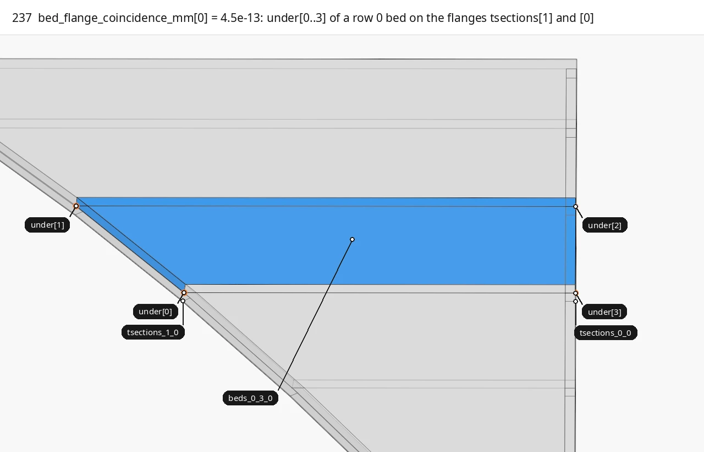

<span style="color:#2196EA">■ built</span> the middle bed of row 0   <span style="color:#E8478B">■ variable</span> `under[0..3]`   <span style="color:#737373">■ input</span> `tsections[1]`, `tsections[0]`   <span style="color:#A3A3A3">■ context</span> the other beds of row 0

<span style="color:#E8478B">`bed_flange_coincidence_mm[q]`</span> checks that every bed plate's underside sits on the t-sections beside it. A bed's bottom loop is `{lower[0][i], lower[0][i + 1], lower[1][i + 1], lower[1][i]}` (`floor_members.cpp:200`): two corners on the row's side plane 0 and two on side plane 1. The step takes these corners as <span style="color:#E8478B">`under[0..3]`</span>. Each corner's distance to the closed top loop of its t-section comes from `Closest::polyline_point`. The rows pair with the flanges as `beside = {{1, 0}, {2, 3}, {4, 5}}`:

```cpp
worst = std::max({worst, distance(under[0], flanges[beside[row][0]].top), distance(under[1], flanges[beside[row][0]].top)});
worst = std::max({worst, distance(under[2], flanges[beside[row][1]].top), distance(under[3], flanges[beside[row][1]].top)});
```

Row 0 lies between <span style="color:#737373">`tsections[1]`</span>, on inner rib 0's outer face, and <span style="color:#737373">`tsections[0]`</span>, on outer rib 0. Row 1 lies between `tsections[2]` and `[3]` on the two central faces. Row 2 lies between `tsections[4]` and `[5]`. A t-section's top loop is its trimmed soffit trace followed by its reversed `+t` trace, closed (`floor_members.cpp:138-140`). Zero means every bed corner lies on that closed flange outline. By construction it lies on the `+t` trace, because the bed and the flange take the same `parabolas[k][1]` or `central_panel.traces[k][1]` and trim it by the same two planes. In the picture, the camera looks along outer rib 0 at <span style="color:#2196EA">the middle bed of row 0</span>. Each flange name sits on the corner of the flange's top loop nearest the bed corner but not on it: the soffit corner of the same station, about `tsections` = 27 from it.

| Variable | Value | Meaning |
|---|---|---|
| `report.bed_flange_coincidence_mm[q]` | 0.000e+00 | Worst bed underside corner off the top loop of its flange, mm |
| `under` | 4 corners (+ closing point) | A bed's bottom loop: `under[0..1]` on side plane 0, `under[2..3]` on side plane 1 |
| `beside` | `{{1, 0}, {2, 3}, {4, 5}}` | Per row, the t-section index for side 0 and for side 1 |
| `tsections` | 27 | Flange depth (soffit to `+t`) and bed thickness (`+t` to `+2t`) |

Code: `bed_flange_coincidence`, [floor_report.cpp:79-94](https://github.com/petrasvestartas/wood/blob/16f3ab0a2386bf39ac7f7123c0a20d03e73ab1a5/src/templates/floor/floor_report.cpp#L79-L94); `distance`, [floor_report.cpp:13-15](https://github.com/petrasvestartas/wood/blob/16f3ab0a2386bf39ac7f7123c0a20d03e73ab1a5/src/templates/floor/floor_report.cpp#L13-L15); `bed_row`, [floor_members.cpp:189-204](https://github.com/petrasvestartas/wood/blob/16f3ab0a2386bf39ac7f7123c0a20d03e73ab1a5/src/templates/floor/floor_members.cpp#L189-L204).

## 238. ring_uncovered

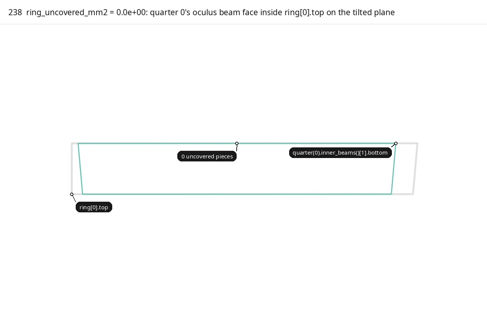

<span style="color:#2196EA">■ built</span> `a = quarter(0).inner_beams()[1].bottom`   <span style="color:#E8478B">■ variable</span> uncovered pieces, `ring_uncovered_mm2` (none on the square)   <span style="color:#737373">■ input</span> `b = ring[0].top`

<span style="color:#E8478B">`ring_uncovered_mm2`</span> checks that each quarter's oculus beam bears on its ring beam over its full face. Quarter `q`'s <span style="color:#2196EA">`inner_beams()[1]`</span> is lofted between `cp.inner_beams[1] = {oculus.tilted, oculus.back}` (`floor.cpp:191`), so its <span style="color:#2196EA">`.bottom`</span> loop lies on `oculus_edges[q].tilted`, the plane <span style="color:#737373">`ring[q].top`</span> lies on. `boolean_area` runs `Polyline::boolean_op(a, b, tilted, 2)`, the part of `a` outside `b`, and sums `polygon_area` over the pieces. `check()` adds this over the four quarters:

```cpp
return boolean_area(guide.quarter(q).inner_beams()[1].bottom, ring_beam.top, guide.oculus_edges[q].tilted, 2);
```

On quarter 0, <span style="color:#2196EA">the quarter beam's face</span> runs between the seam beams' far faces x = -60 and y = -60, from (-60, -940) to (-940, -60) at the datum. <span style="color:#737373">The ring face</span> runs on past both ends, from `ring_inner` of edge 3 to `tilted` of edge 1, so nothing is left <span style="color:#E8478B">outside it</span>. The guide guarantees this before `check()` runs. `geometry::invalid` refuses any guide with `sin(oculus_corner_angle(k)) < sin(oculus_seam_angle(k))` (`floor_plan.cpp:134-136`), and the constructor throws. On the square the two angles are 90 and 45 degrees. `polygon_area` (`floor_geometry.cpp:154-163`) sums the cross products of a triangle fan, which gives the true area. The committed version took the magnitude of `compute_newell`, which returns a unit vector, so every piece counted 0.5 mm2 and the sum only told whether a piece existed. The picture looks face on at the tilted plane of oculus edge 0.

| Variable | Value | Meaning |
|---|---|---|
| `report.ring_uncovered_mm2` | 0.000e+00 | Sum over `q` of the quarter beam face area outside its ring beam face, mm2 |
| `a` | `quarter(q).inner_beams()[1].bottom` | The quarter oculus beam's face on the tilted plane |
| `b` | `ring[q].top` | The ring beam's outer face on the same plane |
| `clip_type` | 2 | `a` minus `b` |
| `oculus_corner_angle(0)`, `oculus_seam_angle(0)` | 90, 45 | The angles the `invalid()` precondition compares |

Code: `ring_uncovered`, [floor_report.cpp:133-136](https://github.com/petrasvestartas/wood/blob/16f3ab0a2386bf39ac7f7123c0a20d03e73ab1a5/src/templates/floor/floor_report.cpp#L133-L136); `boolean_area`, [floor_report.cpp:32-40](https://github.com/petrasvestartas/wood/blob/16f3ab0a2386bf39ac7f7123c0a20d03e73ab1a5/src/templates/floor/floor_report.cpp#L32-L40); `geometry::invalid`, [floor_plan.cpp:110-142](https://github.com/petrasvestartas/wood/blob/16f3ab0a2386bf39ac7f7123c0a20d03e73ab1a5/src/templates/floor/floor_plan.cpp#L110-L142).

## 239. ring_overlap

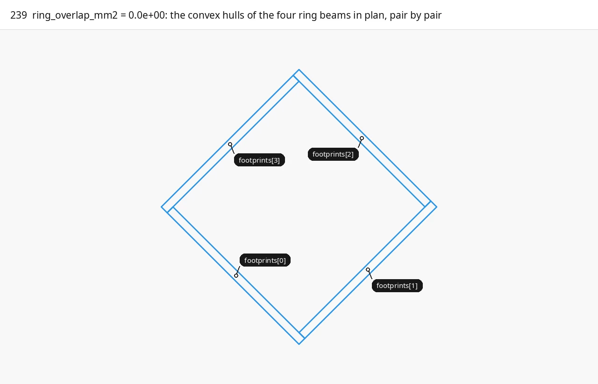

<span style="color:#2196EA">■ built</span> `footprints[0..3]`   <span style="color:#E8478B">■ variable</span> pairwise overlaps, `ring_overlap_mm2` (none on the square)   <span style="color:#A3A3A3">■ context</span> oculus edges (dashed)

<span style="color:#E8478B">`ring_overlap_mm2`</span> checks that the four ring beams do not overlap in plan. For each ring beam, the open points of its two loops are collected, set to z 0 and wrapped by `ConvexHull::hull_2d` into a <span style="color:#2196EA">closed footprint</span>. For the six pairs `i < j`, `boolean_area(footprints[i], footprints[j], level(0.0), 0)` takes their intersection, and the areas are summed:

```cpp
for (size_t i = 0; i < 4; i++)
    for (size_t j = i + 1; j < 4; j++)
        overlap += boolean_area(footprints[i], footprints[j], level(0.0), 0);
```

Beam `i + 1` starts on beam `i`'s vertical `ring_inner` plane and lies on the other side of it, so two neighbouring footprints touch only on that plane and their <span style="color:#E8478B">intersection</span> has no area. Opposite beams lie on opposite sides of the oculus and do not meet. The sum is 0, and `ok()` requires it to stay within the tolerance. Because the footprint is a convex hull of both loops, the leaning outer face counts at its widest, the datum trace.

| Variable | Value | Meaning |
|---|---|---|
| `footprints[i]` | closed convex polygon | Ring beam `i`'s plan footprint: hull of both loops at z 0 |
| `report.ring_overlap_mm2` | 0.000e+00 | Sum of the pairwise plan overlaps of the four footprints, mm2 |
| `clip_type` | 0 | The intersection of the two polygons |

Code: `ring_overlap`, [floor_report.cpp:109-131](https://github.com/petrasvestartas/wood/blob/16f3ab0a2386bf39ac7f7123c0a20d03e73ab1a5/src/templates/floor/floor_report.cpp#L109-L131).

## 240. FloorReport::ok and str

`ok(tolerance)` is the structural gate. It fails when any of the five per-quarter identities exceeds `tolerance` in any quarter. It then requires both ring areas to be within the same `tolerance`, which it applies to mm2 as well as mm:

```cpp
for (size_t q = 0; q < 4; q++)
    if (seam_plane_gap[q] > tolerance || oculus_corner_gap[q] > tolerance || closure_residual_mm[q] > tolerance || end_face_planarity_mm[q] > tolerance || bed_flange_coincidence_mm[q] > tolerance)
        return false;

return ring_overlap_mm2 <= tolerance && ring_uncovered_mm2 <= tolerance;
```

Every other field is reported only. The tests call `ok(1e-6)` on the square and `ok(1e-9)` on 3000 x 2400. Values on the square, the same in every quarter:

| Field | Gated by `ok()` | Value (square) | Meaning |
|---|---|---|---|
| `seam_plane_gap[q]` | yes | 0.000e+00 | Frame 235 |
| `oculus_corner_gap[q]` | yes | 0.000e+00 | Frame 235 |
| `closure_residual_mm[q]` | yes | 3.103e-12 | `central_panel.residual`, the rule A closure (chapter 4) |
| `end_face_planarity_mm[q]` | yes | 5.258e-13 | Frame 236 |
| `bed_flange_coincidence_mm[q]` | yes | 0.000e+00 | Frame 237 |
| `ring_uncovered_mm2` | yes | 0.000e+00 | Frame 238 |
| `ring_overlap_mm2` | yes | 0.000e+00 | Frame 239 |
| `ruling_off_chamfer_deg[q]` | no | 0.000 (-0.839 on 3000 x 2400) | `plan_angle(column.chamfer_direction, panel.ruling)`, in [-90, 90] |
| `ruling_off_oculus_edge_deg[q]` | no | 0.000 | `plan_angle(oculus_edges[q].line.to_direction(), panel.ruling)` |
| `rib_sweep_obliqueness_deg[q][k]` | no | 10.704 / 10.704 | `panel.obliqueness[k]`, the sweep against inner rib `k`'s normal |
| `rib_shear_mm[q][k]` | no | 11.342 / 11.342 | `inner_ribs * tan(obliqueness_k)` |
| `rib_bottom_clearance_mm[q][k]` | no | 0.000 / 0.000 | Outer rib `k`'s lowest column-end corner minus `columns[q].levels[1]`; 0 by construction |
| `rib_level_spread_mm[q]` | no | 0.000 (0.307 on 3000 x 2400) | Highest minus lowest of the eight rib face bottoms at the column end |
| `wedge_seat_mm[q]` | no | 20.000 / 19.296 / 20.000 | `column.wedge_seat`, the head seats beside the rib bands |
| `column_offset_mm[q]` | no | 0.000 / 0.000 | `column.column_offset`, the column face against each bay edge |

`str()` opens with `floor report: ok` or `floor report: FAILING`, from `ok()` at its default tolerance 1e-6. Each quarter then gets three lines (the identities in scientific notation; ruling, sweep and shear; bottoms, spread, seats and offsets), and one ring line closes the text. The format, filled with the square's values for quarter 0:

```
floor report: ok
  quarter 0: seam gap 0.000e+00, oculus corner gap 0.000e+00, closure 3.103e-12, end faces 5.258e-13, beds on flanges 0.000e+00 mm
    ruling 0.000 deg off the chamfer, 0.000 off the oculus edge; rib sweep 10.704 / 10.704 deg oblique, shear 11.342 / 11.342 mm
    rib bottoms 0.000 / 0.000 mm above the cutter level, the eight rib bottoms at the head span 0.000 mm; seats 20.000 / 19.296 / 20.000 mm; column offset 0.000 / 0.000 mm
  ...
  ring: beams overlap 0.000e+00 mm2, quarter beam faces uncovered 0.000e+00 mm2
```

| Variable | Value | Meaning |
|---|---|---|
| `tolerance` | 1e-6 | Threshold in mm for the identities and in mm2 for the ring areas |
| `ok()` | true | All seven gated relations hold on the square |

Code: `FloorReport::ok`, [floor_report.cpp:188-195](https://github.com/petrasvestartas/wood/blob/16f3ab0a2386bf39ac7f7123c0a20d03e73ab1a5/src/templates/floor/floor_report.cpp#L188-L195); `FloorReport::str`, [floor_report.cpp:197-210](https://github.com/petrasvestartas/wood/blob/16f3ab0a2386bf39ac7f7123c0a20d03e73ab1a5/src/templates/floor/floor_report.cpp#L197-L210); `measure_quarter`, [floor_report.cpp:139-167](https://github.com/petrasvestartas/wood/blob/16f3ab0a2386bf39ac7f7123c0a20d03e73ab1a5/src/templates/floor/floor_report.cpp#L139-L167).

## 241. compute_breps (example 7)

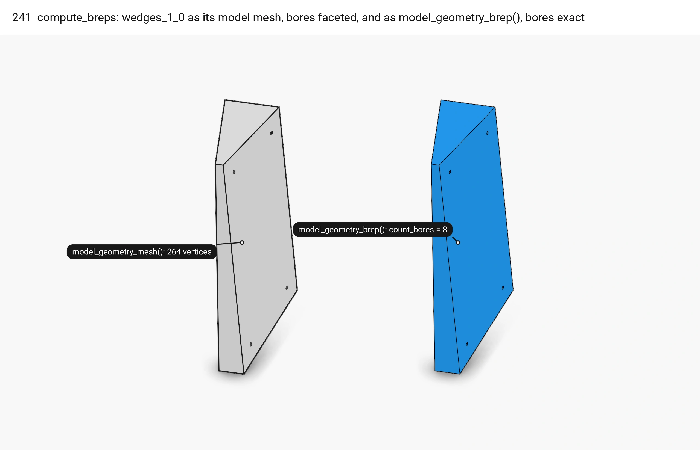

<span style="color:#2196EA">■ built</span> `model_geometry_brep()` of `wedges_1_0`, bores exact   <span style="color:#737373">■ input</span> `model_geometry_mesh()`, bores faceted

`compute_breps(session)` walks `session.objects.elements` and calls `compute_geometry_brep()` on every connector child (a `Dowel` or a `ConnectorPart`) and on every cut member. A cut member is an element that is not a `Joint` and whose `model_geometry_mesh()` vertex count differs from its `element_geometry_mesh()`:

```cpp
for (const std::shared_ptr<Element>& element : *session.objects.elements)
    if (is_connector_child(element) || is_cut_member(element))
        element->compute_geometry_brep();
```

`Element::compute_geometry_brep` runs the type's `compute_geometry_brep_impl`, which for a `Plate` or a `BeamVariable` stores <span style="color:#2196EA">`model_geometry_brep()`</span> as the element's geometry. With solid cuts, that BRep is `solid_cuts_brep(mesh, solid_cuts)`. It collects every cut's drill lines with their `drill_radius` and runs `drilled_brep` on the mesh with the pockets cut and the drills not cut (`apply_solid_cuts(mesh, cuts, false)`), so each bore is an exact cylinder surface. If that fails, it falls back to a planar BRep of the mesh with the drills cut as meshes, and then to `mesh_brep`. <span style="color:#737373">`model_geometry_mesh()`</span> keeps the meshed version: `apply_solid_cuts` with `drills = true` subtracts each drill as `drill_mesh`, a faceted cylinder. The picture shows the central wedge block `wedges_1_0` of the connected floor in both forms, <span style="color:#737373">the mesh</span> to the left and <span style="color:#2196EA">the BRep</span>, with its `count_bores`, to the right.

Example 7 (`templates_floor_7_contacts_cantilevers.cpp`) builds `Floor(FloorGuide::rectangle(3000, 3000))`, then calls `add_members()`, `add_connectors()` and `add_screws()`, then `compute_breps(floor)` when `BREPS` is true, and writes the scene. It calls neither `check()` nor `check_breps()`. The floor_elements test run gives 80 connectors on the square, 72 screws in 36 of them.

| Variable | Value | Meaning |
|---|---|---|
| `BREPS` | true | Example constant that turns on `compute_breps` (examples 7 and 8) |
| `is_connector_child(element)` | `Dowel` or `ConnectorPart` | A child a connector nests under itself |
| `is_cut_member(element)` | not a `Joint`, model mesh vertex count != element mesh vertex count | A member a joint has cut |
| `drills` | every `SolidCut::drills` line with its `drill_radius` | The bores `drilled_brep` makes exact |

Code: `compute_breps`, [floor_brep_check.cpp:120-125](https://github.com/petrasvestartas/wood/blob/16f3ab0a2386bf39ac7f7123c0a20d03e73ab1a5/src/templates/floor/floor_brep_check.cpp#L120-L125); `is_connector_child`, `is_cut_member`, [floor_brep_check.cpp:16-25](https://github.com/petrasvestartas/wood/blob/16f3ab0a2386bf39ac7f7123c0a20d03e73ab1a5/src/templates/floor/floor_brep_check.cpp#L16-L25); `solid_cuts_brep`, [wood_element_solid_cut.cpp:40-58](https://github.com/petrasvestartas/wood/blob/16f3ab0a2386bf39ac7f7123c0a20d03e73ab1a5/src/joinery_solver/wood_elements/wood_element_solid_cut.cpp#L40-L58); `main`, [templates_floor_7_contacts_cantilevers.cpp:10-23](https://github.com/petrasvestartas/wood/blob/16f3ab0a2386bf39ac7f7123c0a20d03e73ab1a5/examples/templates_floor_7_contacts_cantilevers.cpp#L10-L23).

## 242. check_breps: parts, connectors, members, timing

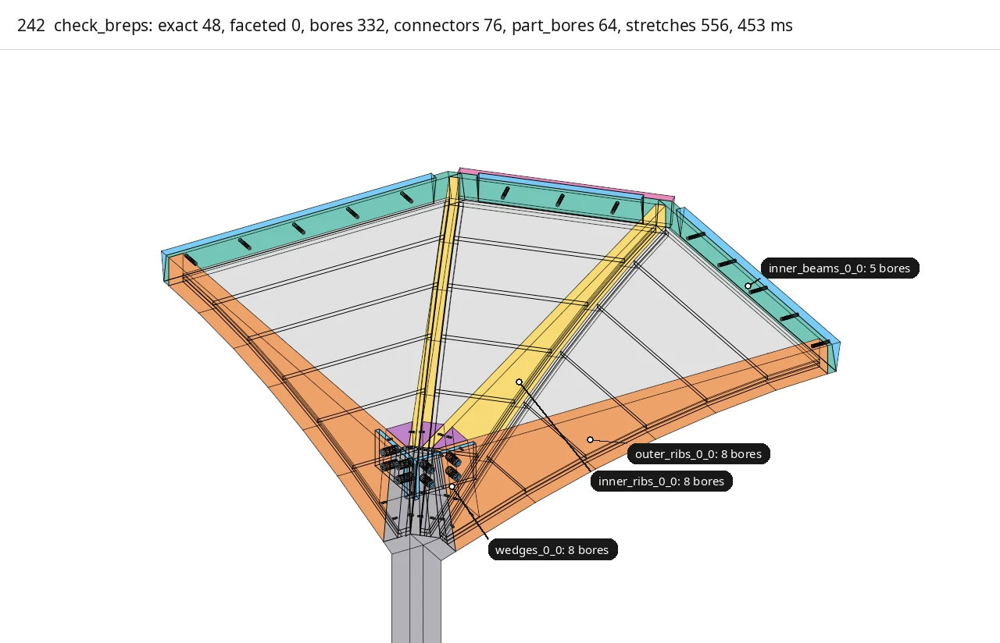

<span style="color:#2196EA">■ built</span> exact members, `check.exact`, `check.bores`   <span style="color:#E8478B">■ variable</span> faceted members, `check.faceted`   <span style="color:#F2CC0C">■ result</span> connector parts and dowels, `check.part_bores`   <span style="color:#A3A3A3">■ context</span> uncut members

`check_breps(session)` starts a `steady_clock` timer and walks `session.objects.elements` once. Each element falls into one of three branches:

```cpp
if (is_connector_child(element)) {
    if (std::dynamic_pointer_cast<wood_session::ConnectorPart>(element))
        check.part_bores += count_bores(element->model_geometry_brep());
    continue;
}
if (const std::shared_ptr<wood_session::JointBeam> connector = std::dynamic_pointer_cast<wood_session::JointBeam>(element)) {
    check.connectors += !connector->parts.empty() || !connector->drill_lines.empty();
    continue;
}
```

A connector child adds its part's exact bores to <span style="color:#F2CC0C">`part_bores`</span>; a `Dowel` adds nothing. A `JointBeam` adds 1 to `connectors` when it has parts or drill lines, so screw connectors, whose screws are drill lines, count too. No `JointBeam` reaches the member branch. Every remaining element that `is_cut_member` accepts adds `count_bores(model_geometry_brep())` to <span style="color:#2196EA">`bores`</span>. It counts as <span style="color:#2196EA">`exact`</span> when that number is above 0; otherwise its name goes into <span style="color:#E8478B">`faceted`</span>. `count_bores` counts the rational NURBS surfaces of a BRep, which are the cylinders `add_bore` makes. A member ends up faceted when `drilled_brep` returned nothing (a non-planar face, a drill too near an edge or another drill, a crossing too oblique, a failed volume check) or when it had no drills at all. `ms` is the loop's time, including the BReps it builds lazily, and excludes `dowel_stretches`, which runs after it. This page does not run `check_breps`, so it gives no counts; the frame's caption prints the counts for the whole connected floor when the film is made. The picture draws quarter 0 the way the loop sorts it: <span style="color:#2196EA">exact members</span>, <span style="color:#E8478B">faceted members</span>, <span style="color:#A3A3A3">uncut members</span>, and <span style="color:#F2CC0C">the parts and dowels of every connector on them</span>.

| Variable | Value | Meaning |
|---|---|---|
| `check.part_bores` | in the caption | Exact bores in the connector parts |
| `check.connectors` | in the caption, at most the floor's JointBeams | Connectors with a part or a drill line |
| `check.bores` | in the caption | Exact bores in the cut members |
| `check.exact` | in the caption | Cut members with at least one exact bore |
| `check.faceted` | in the caption | Names of the cut members without an exact bore |
| `check.ms` | in the caption | Time of the element loop, ms |

Code: `check_breps`, [floor_brep_check.cpp:84-118](https://github.com/petrasvestartas/wood/blob/16f3ab0a2386bf39ac7f7123c0a20d03e73ab1a5/src/templates/floor/floor_brep_check.cpp#L84-L118); `count_bores`, [floor_brep_check.cpp:27-36](https://github.com/petrasvestartas/wood/blob/16f3ab0a2386bf39ac7f7123c0a20d03e73ab1a5/src/templates/floor/floor_brep_check.cpp#L27-L36).

## 243. dowel_stretches and bore_stretches

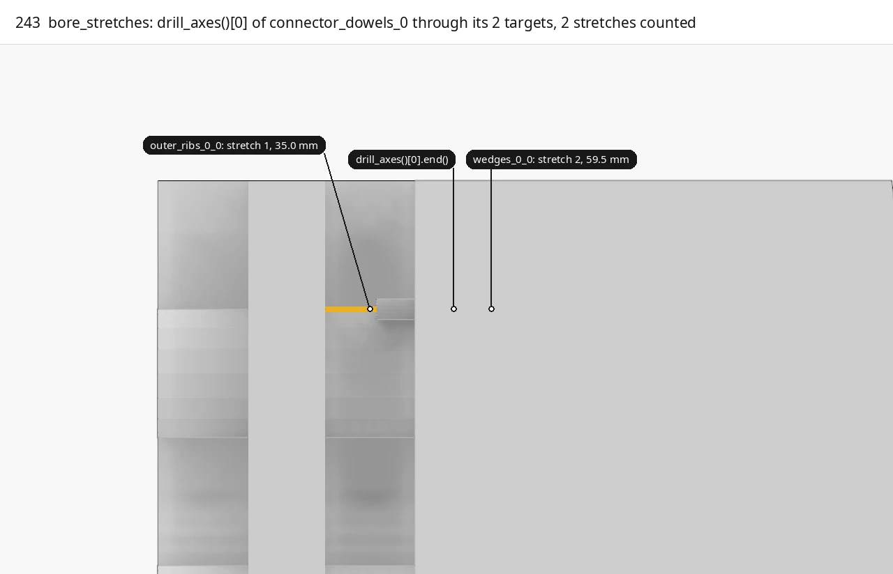

<span style="color:#2196EA">■ built</span> stretch in `wedges_0_0`   <span style="color:#F2CC0C">■ result</span> stretch in `outer_ribs_0_0`   <span style="color:#737373">■ input</span> `drill_axes()[0]` (headed)   <span style="color:#A3A3A3">■ context</span> the two target solids

`check.stretches = dowel_stretches(session)` counts the bores the dowels and screws need, independently of the BReps. For every `Joint` from `get_elements<Joint>()`, the step builds `own`, its `drill_axes()` with radius `line_radius`. `own` is appended to `drills[target]` for every guid in `joint->targets`. For a `JointBeam`, each part `part_mesh(i)` is cut by the connector's `solid_cuts` without drills, and `bore_stretches(part, own)` is added at once. Then each target's solid, its `element_geometry_mesh()` cut by its own solid cuts without drills (or the raw mesh when it has none), goes through `bore_stretches` with all the drills that pass it:

```cpp
for (const wood_session::Drill& drill : wood_session::merged_drills(drills))
    for (const std::array<double, 2>& stretch : wood_session::inside_stretches(solid, drill.axis))
        if (stretch[1] > 1e-6 && stretch[0] < drill.axis.length() - 1e-6)
            stretches++;
```

`merged_drills` joins drills of equal radius on one axis whose spans meet or overlap, within `AXIS = 1e-4`, into one. `inside_stretches` intersects the infinite line with the solid's planar faces, sorts the crossings by their distance `t` from the line's start along its unit direction, and returns `[t_i, t_i+1]` for every crossing whose face normal points against the line, where the line enters the solid. A stretch counts when it overlaps the drill's own span, `t1 > 1e-6` and `t0 < length - 1e-6`. Each counted stretch is one cylinder the BReps should contain. The picture takes <span style="color:#737373">the first drill axis</span> of the block dowels between `wedges_0_0` and `outer_ribs_0_0` (`floor_relations.cpp:194`). It draws, thick, the stretch `bore_stretches` counts in each of the two target solids, <span style="color:#2196EA">the one in `wedges_0_0`</span> and <span style="color:#F2CC0C">the one in `outer_ribs_0_0`</span>, numbered in the order of `targets`. `get_elements<Joint>()` also returns the `Dowel` and `ConnectorPart` children, but they add nothing: a `Dowel` has its axis as `drill_lines` and no `targets`, and a `ConnectorPart` has one part and no `drill_lines`, so `own` is empty (`wood_element_dowel.cpp:13-23`, `wood_element_connector_part.cpp:13-21`, `JointBeam::children`, `wood_element_joint_beam.cpp:650-662`). The out-of-date documentation gives 396 stretches on the square, which this page has not re-run.

| Variable | Value | Meaning |
|---|---|---|
| `own` | `drill_axes()` with `line_radius` | One joint's drills |
| `drills` | map guid -> drills | Every drill that passes each target |
| `AXIS` | 1e-4 | `merged_drills` tolerance for one axis and touching spans |
| `stretch` | `[t0, t1]`, mm | A stretch of the infinite drill line inside the solid |
| `check.stretches` | in frame 242's caption | Bores asked for over members and parts |

Code: `dowel_stretches`, [floor_brep_check.cpp:52-78](https://github.com/petrasvestartas/wood/blob/16f3ab0a2386bf39ac7f7123c0a20d03e73ab1a5/src/templates/floor/floor_brep_check.cpp#L52-L78); `bore_stretches`, [floor_brep_check.cpp:39-49](https://github.com/petrasvestartas/wood/blob/16f3ab0a2386bf39ac7f7123c0a20d03e73ab1a5/src/templates/floor/floor_brep_check.cpp#L39-L49); `merged_drills`, [wood_brep_drill.cpp:786](https://github.com/petrasvestartas/wood/blob/16f3ab0a2386bf39ac7f7123c0a20d03e73ab1a5/src/joinery_solver/wood_algorithms/wood_brep_drill.cpp#L786); `inside_stretches`, [wood_brep_drill.cpp:984](https://github.com/petrasvestartas/wood/blob/16f3ab0a2386bf39ac7f7123c0a20d03e73ab1a5/src/joinery_solver/wood_algorithms/wood_brep_drill.cpp#L984).

## 244. BrepCheck::str

`BrepCheck::str()` writes the counters in two lines, then one line per faceted member. The second line puts the bores asked for next to the bores found. Every stretch became an exact bore when `stretches == bores + part_bores`:

| Line | Text | From |
|---|---|---|
| 1 | `BReps of the cut elements: {exact} with {bores} exact bores, {faceted.size()} faceted, and of {connectors} connectors with {part_bores} exact bores through their parts, in {ms} ms` | the element loop, frame 242 |
| 2 | `Every dowel bores every element it passes: {stretches} dowel stretches through members and parts, {bores + part_bores} exact bores found` | `dowel_stretches`, frame 243, against the loop |
| 3+ | `  faceted: {name}` | one per entry of `faceted` |

How the element loop sorts each element before `str()` reports it:

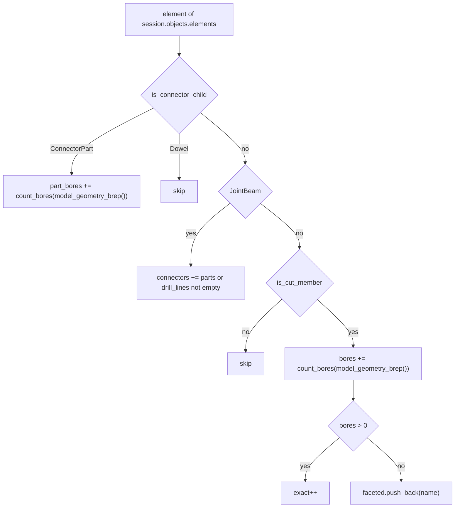

| Variable | Value | Meaning |
|---|---|---|
| `bores + part_bores` | in frame 242's caption | Exact bores found |
| `stretches` | in frame 242's caption | Exact bores asked for |

Code: `BrepCheck::str`, [floor_brep_check.cpp:127-136](https://github.com/petrasvestartas/wood/blob/16f3ab0a2386bf39ac7f7123c0a20d03e73ab1a5/src/templates/floor/floor_brep_check.cpp#L127-L136).

## 245. Example 8: tied 6000 x 4800 bay

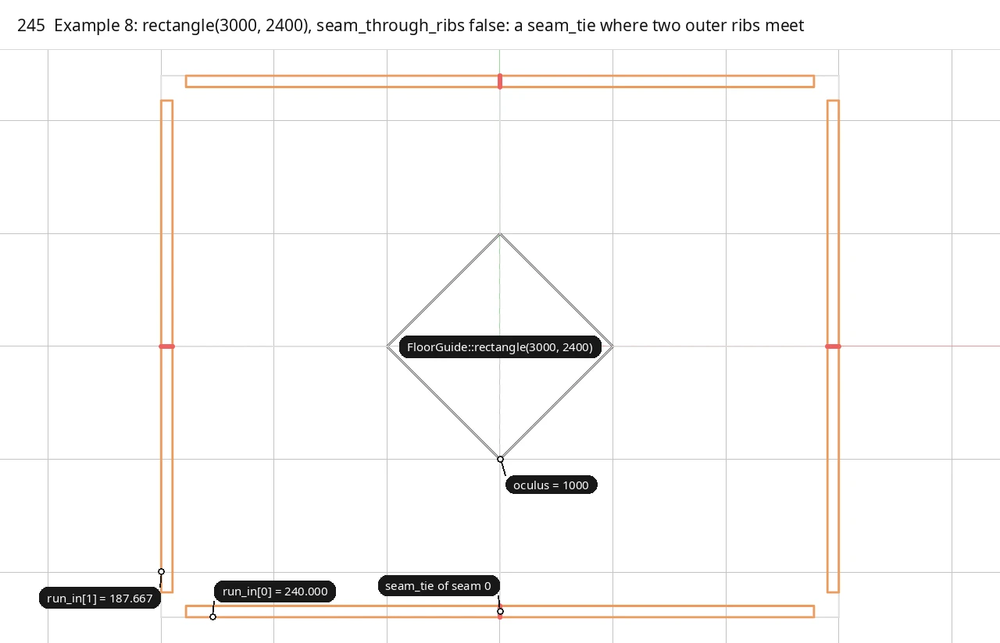

<span style="color:#2196EA">■ built</span> `quads.outer_ribs` of all four quarters   <span style="color:#E8478B">■ variable</span> `seam_tie` contacts, `SEAM_THROUGH_RIBS = false`   <span style="color:#737373">■ input</span> `oculus_edges[0..3].line`, `seams[0..3].line` (dashed)   <span style="color:#A3A3A3">■ context</span> bay edges, quarter polygons

Example 8 (`templates_floor_8_rectangle.cpp`) builds the same model as example 7 on `FloorGuide::rectangle(HALF_X, HALF_Y, parameters)` = `rectangle(3000, 2400)`, with <span style="color:#E8478B">`parameters.seam_through_ribs = SEAM_THROUGH_RIBS = false`</span>. It then calls `add_members()`, `add_connectors()`, `add_screws()` and, with `BREPS`, `compute_breps`. It calls neither `check()` nor `check_breps()`. With `seam_through_ribs` false, `rib_seam_ends()` returns the seam planes, so the outer ribs end on the seam plane. The seam beams stop at the outer rib band: `Quarter::inner_beams` starts beams 0 and 2 on `cp.outer_ribs[0][1]` and `cp.outer_ribs[1][1]`, the outer ribs' inner faces, instead of face 0 on the bay edge (`floor_members.cpp:93-104`). `relationships()` adds a <span style="color:#E8478B">`seam_tie`</span> per seam (`floor_relations.cpp:190-191`): outer rib 0 of `q` and outer rib 1 of `q + 1` meet end to end, and <span style="color:#E8478B">the contact is rib 0's seam end face</span>. The oculus corners still lie `oculus = 1000` from the centre along <span style="color:#737373">each seam</span>, so <span style="color:#737373">the oculus</span> is a square diamond on the rectangle. The shorter ribs along y get the shorter run-in from the run-in solve of chapter 3. The tests assert the run-in, `levels[1]` and spread values below on the seam-through 3000 x 2400 guide. They carry over because `run_ins` and `rib_bottom_level` read only the fan planes, the seam planes and the column-end corners, none of which depends on `rib_seam_ends`. The picture draws <span style="color:#2196EA">the outer ribs of all four quarters</span>, end to end at <span style="color:#E8478B">the four seam ties</span>, and labels quarter 0's run-ins from the tied guide itself.

| Variable | Value | Meaning |
|---|---|---|
| `HALF_X`, `HALF_Y` | 3000, 2400 | Half spans: the bay is 6000 x 4800 |
| `SEAM_THROUGH_RIBS` | false | Outer ribs end on the seam plane and seam ties are made |
| `BREPS` | true | Write the BReps |
| `geometry[0].run_in` | 240 / 187.667 | Quarter 0's run-ins: outer rib 0 along x, outer rib 1 along y |
| `columns[q].levels[1]` | -689.979 | The middle cutter level, the outer rib bottoms at the column |
| `rib_level_spread_mm` | 0.307 | The eight rib bottoms at the head on 3000 x 2400 |
| wedge blocks | 240 / 267.292 / 187.667 | Side 0, middle (1.25 x mean run-in), side 1 |
| connectors | 84 | On the tied 3000 x 2400, 72 screws in 36 of them (floor_elements run) |

Code: `main`, [templates_floor_8_rectangle.cpp:13-28](https://github.com/petrasvestartas/wood/blob/16f3ab0a2386bf39ac7f7123c0a20d03e73ab1a5/examples/templates_floor_8_rectangle.cpp#L13-L28); `seam_tie`, [floor_relations.cpp:120-138](https://github.com/petrasvestartas/wood/blob/16f3ab0a2386bf39ac7f7123c0a20d03e73ab1a5/src/templates/floor/floor_relations.cpp#L120-L138).
