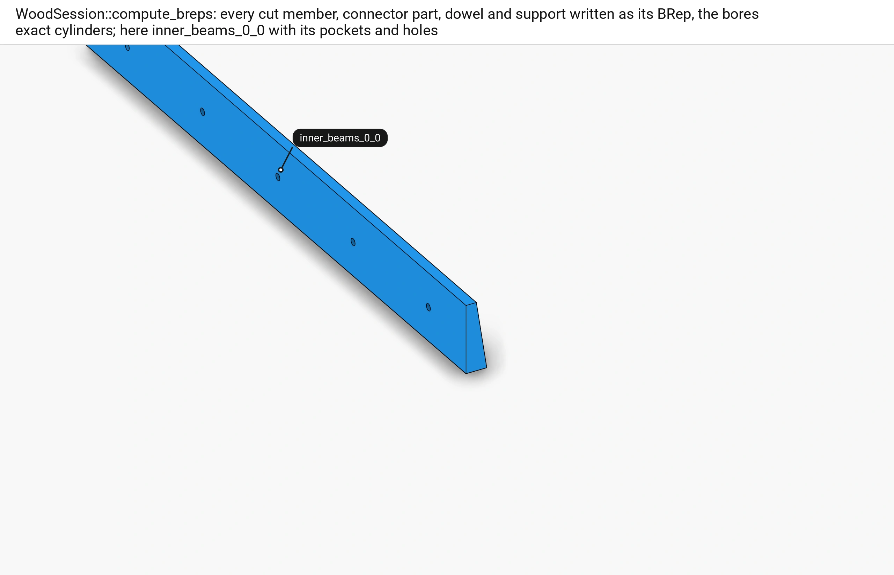
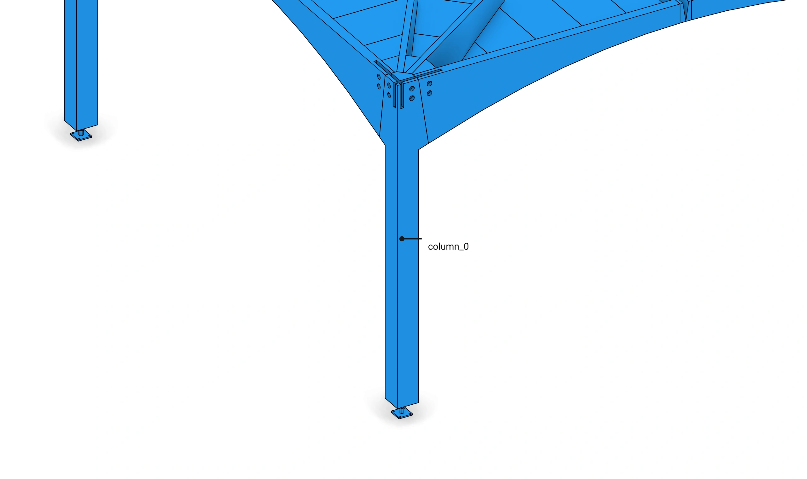
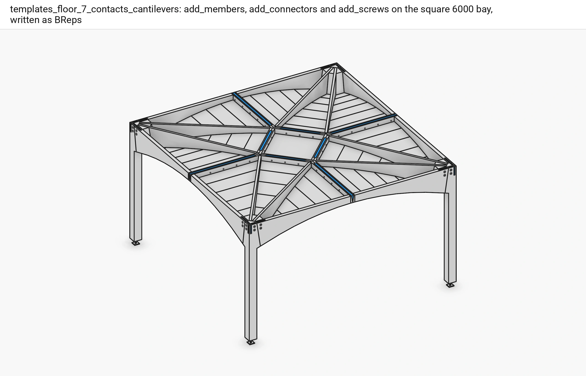
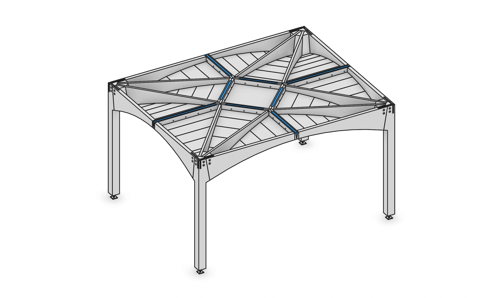

# Floor 11: BReps and the examples {#templates_floor_11_examples}

[TOC]

<em>Step 11 of @ref templates_floor_model · previous: @ref templates_floor_10_screws</em>

A finished floor can be written with exact solids: `compute_breps` turns every cut member and every round part into a BRep. The examples under `examples/` build one column and the whole floor; `tests/floor_elements.cpp` checks what each step must hold, from the contact counts to the screw levels and the bays too narrow for the corner screws.

## 351. compute_breps

■ built `inner_beams_0_0` as a BRep

`WoodSession::compute_breps` writes every cut member, connector part, dowel and support as its BRep instead of its mesh, the bores exact cylinders; here the seam beam with its wedge pocket and its dowel and screw holes.

Code: `WoodSession::compute_breps`, [wood_session.cpp:1487-1496](https://github.com/petrasvestartas/wood/blob/5f7f317df711a163eda3c416cb426e5cd8663dd6/src/joinery_solver/wood_session.cpp#L1487-L1496).

## 352. Example: one column

■ built `column_0` and `support_0`

[templates_floor_2_column_model.cpp](https://github.com/petrasvestartas/wood/blob/5f7f317df711a163eda3c416cb426e5cd8663dd6/examples/templates_floor_2_column_model.cpp): `Floor(guide)` and `add_column(0)`, one column on its support with its glued and carved head.

Code: [templates_floor_2_column_model.cpp:8-21](https://github.com/petrasvestartas/wood/blob/5f7f317df711a163eda3c416cb426e5cd8663dd6/examples/templates_floor_2_column_model.cpp#L8-L21).

## 357. Example: the square floor

■ built the connector parts   ■ context the members, cut

[templates_floor_7_contacts_cantilevers.cpp](https://github.com/petrasvestartas/wood/blob/5f7f317df711a163eda3c416cb426e5cd8663dd6/examples/templates_floor_7_contacts_cantilevers.cpp): `add_members`, `add_connectors` and `add_screws` on the 6000 x 6000 bay, then `compute_breps`.

Code: [templates_floor_7_contacts_cantilevers.cpp:10-29](https://github.com/petrasvestartas/wood/blob/5f7f317df711a163eda3c416cb426e5cd8663dd6/examples/templates_floor_7_contacts_cantilevers.cpp#L10-L29).

## 358. Example: a rectangular bay

■ built the connector parts   ■ context the members, cut

[templates_floor_8_rectangle.cpp](https://github.com/petrasvestartas/wood/blob/5f7f317df711a163eda3c416cb426e5cd8663dd6/examples/templates_floor_8_rectangle.cpp): the same on a 6000 x 4800 bay, where each quarter has its own shape.

Code: [templates_floor_8_rectangle.cpp:12-31](https://github.com/petrasvestartas/wood/blob/5f7f317df711a163eda3c416cb426e5cd8663dd6/examples/templates_floor_8_rectangle.cpp#L12-L31).
