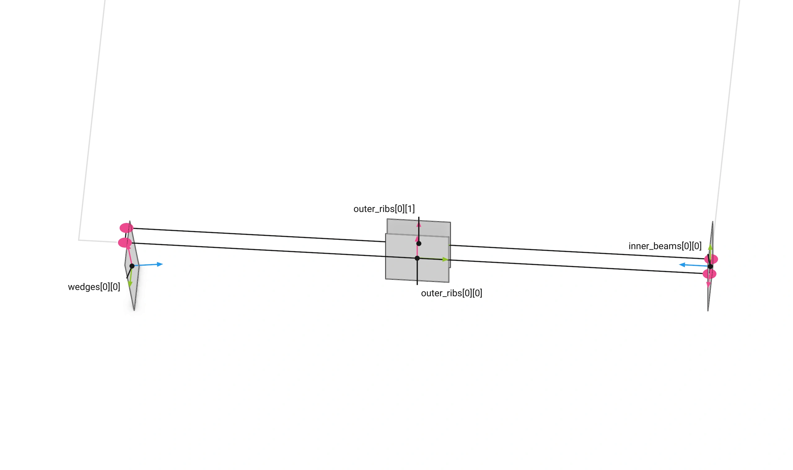
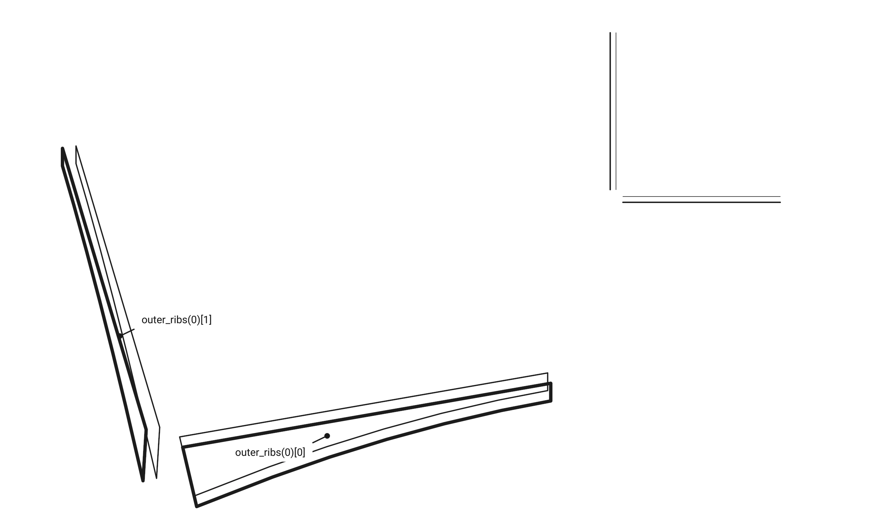
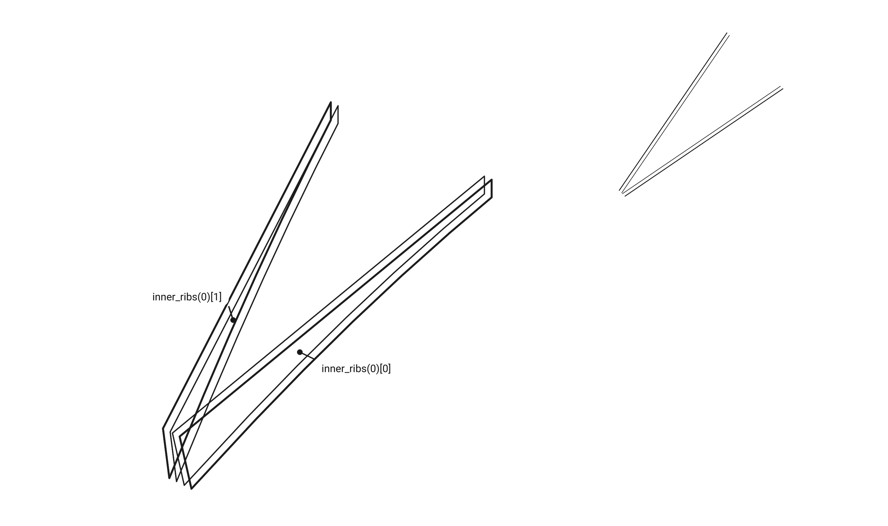
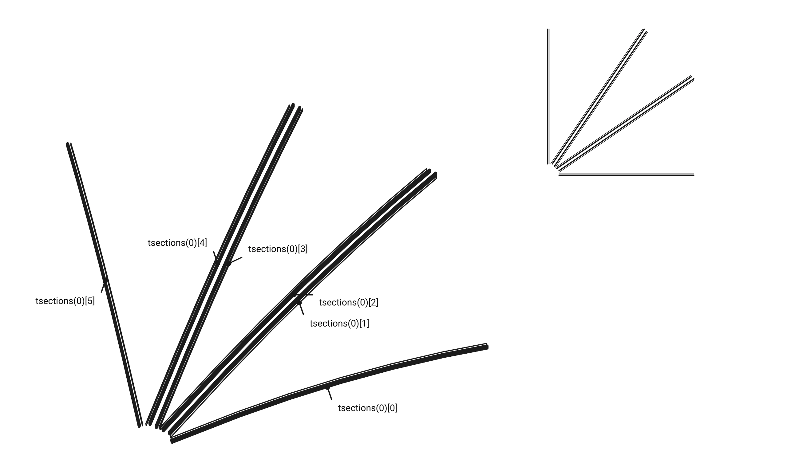
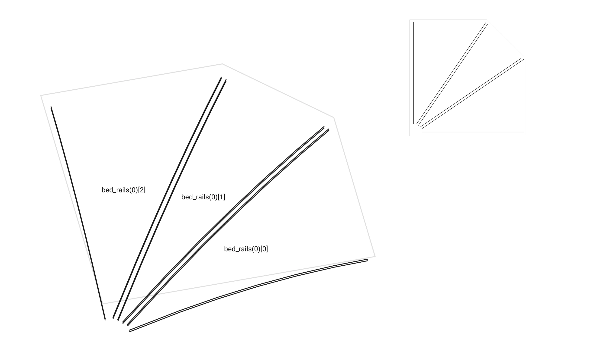
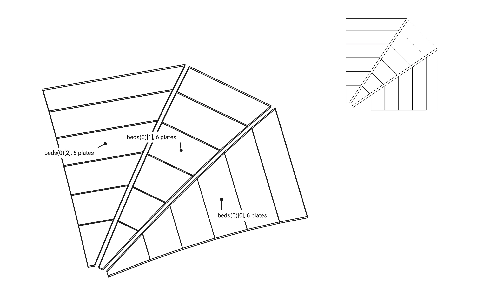
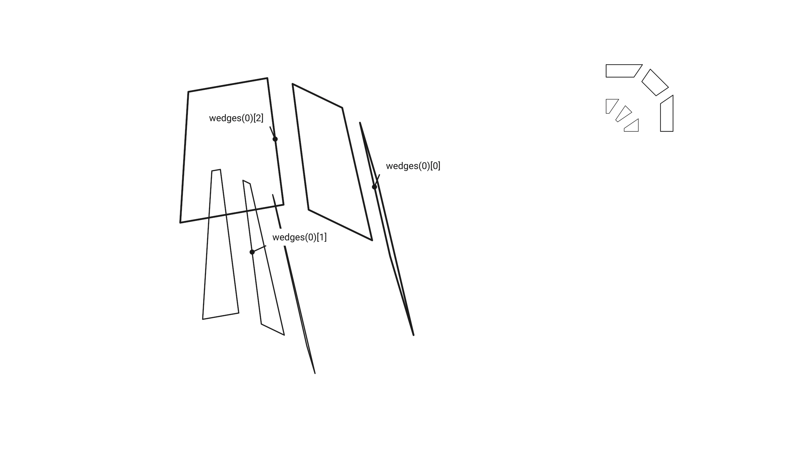
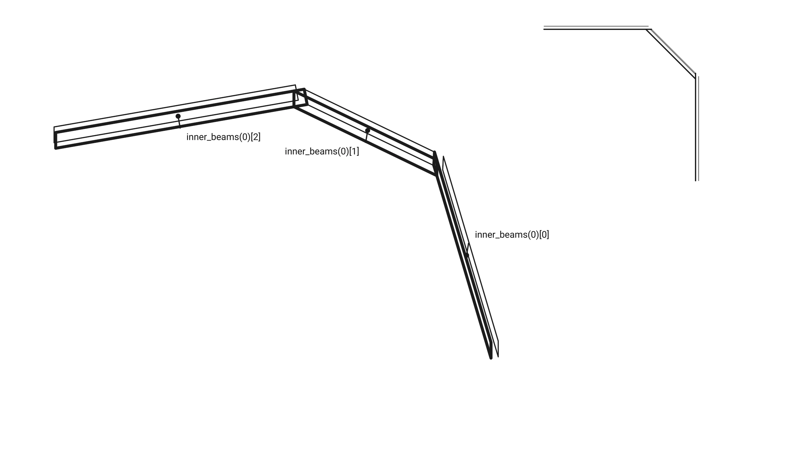
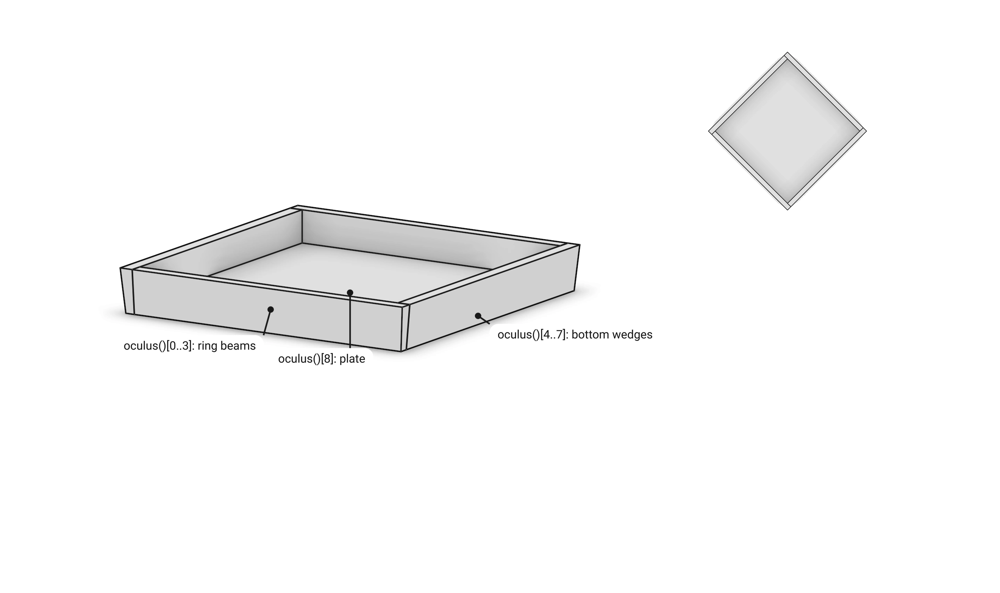
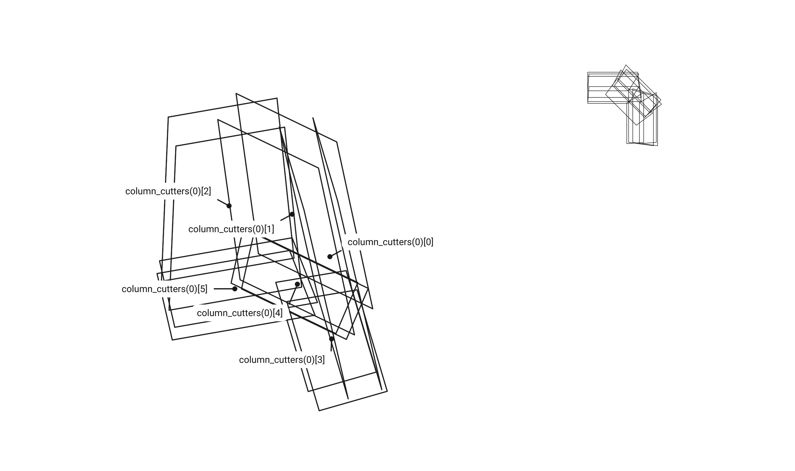

# Part 1. FloorGuide: the geometry {#templates_floor_guide}

[TOC]

FloorGuide computes the geometry the members are built from. It builds no member.

Four corners make a guide (`examples/templates_floor_1_floorguide.cpp`):

```cpp
    wood_floor::FloorGuide guide({
        Point(-3000.0, -3000.0, 0.0),
        Point(3000.0, -3000.0, 0.0),
        Point(3000.0, 3000.0, 0.0),
        Point(-3000.0, 3000.0, 0.0),
    });
```

The constructor is the whole computation, one block per result:

```cpp
    FloorGuide::FloorGuide(const std::array<Point, 4>& corners, double size_oculus = 1000.0, ...)
        : WoodSession("floor_guide"), corners(corners), size_oculus(size_oculus), ... {

        centre = ...;                      // the centre
        oculus_points[q] = ...;            // the oculus points
        _construction_planes[q] = ...;     // a plane pair per member, the column blocks sized by the rib starts
        _construction_quads[q] = ...;      // each member's footprint
        _boundary_parabolas[q] = ...;      // the rib curves
        _central_panel[q] = ...;           // the panel between the inner ribs
        _bed_top_planes[q] = ...;          // the column blocks' undersides
        _outer_ribs[q] = ...;              // the outer ribs, each as its two face loops
        _inner_ribs[q] = ...;              // the inner ribs
        _rib_bottom = ...;                 // the column cutter level
        soffit = ...;                      // the beam soffit
        _tsections[q] = ...;               // the t-sections
        _bed_rails[q] = ...;               // the bed rails
        _beds[q] = ...;                    // the beds
        _wedges[q] = ...;                  // the column blocks
        _inner_beams[q] = ...;             // the inner beams
        _oculus = ...;                     // the oculus ring
        _column_cutters[q] = ...;          // the column cutters
        draw();
    }
```

<details>
<summary><b>Tables</b></summary>

Per quarter: a plane pair and a floor quad per member, and the central panel.

```cpp
class ConstructionPlanes {
public:
    std::array<std::array<Plane, 2>, 2> outer_ribs; // Along the two bay edges, the band offset inwards by outer_ribs.
    std::array<std::array<Plane, 2>, 3> inner_beams; // Along the two seams and the oculus edge; the oculus one tilted by the oculus plane angle.
    std::array<std::array<Plane, 2>, 2> inner_ribs; // From the column head chamfer to the inner beam corners.
    std::array<std::array<Plane, 2>, 3> wedges; // The column head fan: side 0, the middle one tilted by wedge_plane_angle, side 1.
    std::array<std::array<Plane, 2>, 6> tsections; // Beside the ribs, tsections thick: outer rib 0, inner rib 0 outer and central face, inner rib 1 central and outer face, outer rib 1.
};
```

```cpp
class ConstructionQuads {
public:
    std::array<Polyline, 2> outer_ribs;
    std::array<Polyline, 3> inner_beams; // Seam 0, oculus edge, seam 1.
    std::array<Polyline, 2> inner_ribs;
    std::array<Polyline, 3> wedges;
    std::array<Polyline, 6> tsections;
};
```

```cpp
class CentralPanel {
public:
    Vector ruling; // u: the panel's horizontal ruling, along which rib 0's central trace projects onto rib 1's.
    Vector rib_sweep; // r: the horizontal direction both inner ribs are swept along from their outer to their central face.
    std::array<std::array<Polyline, 3>, 2> traces; // Per inner rib, its central face's soffit, +t and +2t, offset in the panel's own cross-section.
};
```

</details>

## Parameters

The oculus: `size_oculus` and `size_inner_beams`.


The column head in plan: the head, its chamfer, the wedges, the ribs and the t-sections.


Outer rib 0 and column 0 in elevation: `bay_height`, `height`, `rise`, `column_head_depth`, and the two leaning planes seen edge-on, `wedge_plane_angle` and `oculus_plane_angle`.


Every parameter is a constructor argument with its default, kept as a read-only field of `FloorGuide`. Sizes are in mm, angles in degrees.

```cpp
FloorGuide(
    const std::array<Point, 4>& corners,
    double size_oculus = 1000.0,              // Distance of every oculus point from the centre along its seam: a square diamond on a rectangular bay.
    double size_column_head = 220.0,          // Side of the square column shaft and of the head polygon at the corner.
    double size_column_head_chamfer = 120.0,  // Where the chamfer vertices sit on the shaft faces; also the capitel width.
    double size_outer_ribs = 100.0,           // Outer rib thickness.
    double size_inner_ribs = 60.0,            // Inner rib thickness.
    double size_inner_beams = 60.0,           // Seam and oculus beam thickness; also the ring beam width at the datum.
    double size_wedge = 240.0,                // Side wedge block thickness; the middle block is middle_wedge_factor times it.
    double size_tsections = 27.0,             // Flange plane offset and bed layer thickness.
    double height = 650.0,                    // Rib depth where the parabola starts, a wedge thickness past the column face.
    double rise = 453.0,                      // Parabola rise from there to the seam.
    double wedge_plane_angle = -10.0,         // Degrees the chamfer fan plane leans about its top edge.
    double oculus_plane_angle = 5.0,          // Degrees the oculus bearing plane leans about its top edge.
    double column_head_depth = 730.0,         // Depth of the carved head and of the capitel.
    double bay_height = 3500.0,               // Storey: the floor top above the slab, the column top.
    double middle_wedge_factor = 1.25);       // The middle block in wedge thicknesses.
```

## The constructor, step by step

One section per constructor block, in order.

<details open>
<summary><b>Centre</b></summary>

The vertex average of the four corners.

```cpp
// centre of the floor, the average of the four corners
const Point middle = compute_centre();
centre = middle;
```


<details>
<summary>compute_centre()</summary>


```cpp
Point FloorGuide::compute_centre() const {
    return Point::centroid({corners[0], corners[1], corners[2], corners[3]});
}
```


</details>

</details>

<details>
<summary><b>Oculus points</b></summary>

`size_oculus` from the centre towards each edge midpoint: the corners of the hole, each on its seam.

```cpp
// oculus points, size_oculus from the centre towards each edge midpoint
const std::array<Point, 4> hole = compute_oculus_points();
oculus_points = hole;
```


<details>
<summary>compute_oculus_points()</summary>


```cpp
std::array<Point, 4> FloorGuide::compute_oculus_points() const {

    std::array<Point, 4> points;

    for (size_t q = 0; q < 4; q++)
        points[q] = centre + (midpoint(q) - centre).normalized() * size_oculus;

    return points;
}
Point FloorGuide::midpoint(size_t k) const {
    return Point::mid_point(corners[k % 4], corners[(k + 1) % 4]);
}
```


</details>

</details>

<details>
<summary><b>Construction planes</b></summary>

A pair of planes per member, its two faces; `pair(plane, size)` is the plane and its copy moved by the size.

```cpp
// construction planes, a pair per member; each column block as thick as its rib's start, chosen so both outer ribs of a column end at one depth
for (size_t q = 0; q < 4; q++) {
    const ConstructionPlanes planes = compute_construction_planes(q);
    _construction_planes[q] = planes;
}
```


<details>
<summary>0. The quarter and its column head</summary>

The polygons every plane stands on.

```cpp
std::vector<Point> FloorGuide::quarter_polygon(size_t q) const {
    return {corners[q], midpoint(q), oculus_points[q], oculus_points[(q + 3) % 4], midpoint(q + 3)};
}
std::vector<Point> FloorGuide::quarter_column_polygon(size_t q) const {

    const Plane frame = column_frame(q);
    const Point& corner = frame.origin();
    const Vector x = frame.x_axis();
    const Vector y = frame.y_axis();

    return {corner, corner + x * size_column_head, corner + x * size_column_head + y * size_column_head_chamfer, corner + x * size_column_head_chamfer + y * size_column_head, corner + y * size_column_head};
}
Plane FloorGuide::column_frame(size_t q) const {

    const Point& corner = corners[q];
    const Vector after = (corners[(q + 1) % 4] - corner).normalized();
    const Vector before = (corners[(q + 3) % 4] - corner).normalized();

    if (std::abs(corner_angle(q) - 90.0) <= RIGHT_ANGLE)
        return Plane::from_frame(corner, after, before, Vector::z_axis());

    const Vector bisector = (after + before).normalized();

    return Plane::from_frame(corner, bisector.transformed(Xform::rotation(Vector::z_axis(), -45.0, true)), bisector.transformed(Xform::rotation(Vector::z_axis(), 45.0, true)), Vector::z_axis());
}
ConstructionPlanes FloorGuide::compute_construction_planes(size_t q) const {

    const std::vector<Point> polygon = quarter_polygon(q);
    const std::vector<Point> head = quarter_column_polygon(q);
    const Vector down = -Vector::z_axis();
    ConstructionPlanes cp;

    ...
```


</details>

<details>
<summary>1. Outer ribs: the bay edges</summary>


```cpp
// 1. outer ribs: the bay edge's plane, normal into the bay, its origin at the quarter's half edge
const Plane edge0 = Plane::from_line(Line::from_points(corners[q], corners[(q + 1) % 4]), down);
const Plane edge1 = Plane::from_line(Line::from_points(corners[(q + 3) % 4], corners[q]), down);
cp.outer_ribs = {
    pair(edge0.moved_to(Point::mid_point(polygon[0], polygon[1])), size_outer_ribs),
    pair(edge1.moved_to(Point::mid_point(polygon[4], polygon[0])), size_outer_ribs),
};
```


</details>

<details>
<summary>2. Inner beams: the seams and the oculus edge</summary>


```cpp
// 2. inner beams on the polygon's seam and oculus lines; the oculus one tilted by oculus_plane_angle about its line
const Line oculus_line = Line::from_points(polygon[2], polygon[3]);
const Plane oculus_plane = Plane::from_line(oculus_line, down);
const Plane tilted = oculus_plane.transformed(Xform::rotation_around_line(oculus_line, -oculus_plane_angle, true));
cp.inner_beams = {
    pair(Plane::from_line(Line::from_points(polygon[1], polygon[2]), down), size_inner_beams),
    {tilted, oculus_plane.translate_by_normal(size_inner_beams)},
    pair(Plane::from_line(Line::from_points(polygon[3], polygon[4]), down), size_inner_beams),
};
```


</details>

<details>
<summary>3. Inner ribs: column head to beam corners</summary>


```cpp
// 3. inner ribs from the column head's chamfer points to the inner beam corners
const Plane xy = Plane::xy_plane_at(0.0);
const Point p0 = Intersection::plane_plane_plane(xy, cp.inner_beams[0][1], cp.inner_beams[1][1]).value();
const Point p1 = Intersection::plane_plane_plane(xy, cp.inner_beams[1][1], cp.inner_beams[2][1]).value();
const Point p2 = head[2];
const Point p3 = head[3];
cp.inner_ribs = {
    pair(Plane::from_line(Line::from_points(p2, p0), down), size_inner_ribs),
    pair(Plane::from_line(Line::from_points(p3, p1), Vector::z_axis()), size_inner_ribs),
};
```


</details>

<details>
<summary>4. Wedges: the column head fan, sized by the rib starts</summary>


```cpp
// 4. wedges: the chamfer plane tilted by wedge_plane_angle about its top edge, the two side planes leaning with it along the inner ribs
const Line side0 = Line::from_points(head[1], head[2]);
const Line side1 = Line::from_points(head[2], head[3]);
const Line side2 = Line::from_points(head[3], head[4]);
const Plane chamfer = Plane::from_line(side1, Vector::z_axis()).transformed(Xform::rotation_around_line(side1, wedge_plane_angle, true));
const Line line0 = Intersection::plane_plane(chamfer, cp.inner_ribs[0][1]).value();
const Line line1 = Intersection::plane_plane(chamfer, cp.inner_ribs[1][1]).value();
const Plane wedge0 = Plane::from_line(side0, -line0.to_direction());
const Plane wedge2 = Plane::from_line(side2, line1.to_direction());

// the near faces first, as the rib starts read them; each side block then as thick as its rib's start, the middle one middle_wedge_factor times their mean
cp.wedges = {pair(wedge0, 0.0), pair(chamfer, 0.0), pair(wedge2, 0.0)};
const std::array<double, 2> starts = compute_rib_starts(cp);
cp.wedges = {pair(wedge0, starts[0]), pair(chamfer, middle_wedge_factor * (0.5 * (starts[0] + starts[1]))), pair(wedge2, starts[1])};
```


</details>

<details>
<summary>5. T-sections beside the ribs</summary>


```cpp
// 5. t-sections beside the ribs
cp.tsections = {
    pair(cp.outer_ribs[0][1], size_tsections),
    pair(cp.inner_ribs[0][0], -size_tsections),
    pair(cp.inner_ribs[0][1], size_tsections),
    pair(cp.inner_ribs[1][1], size_tsections),
    pair(cp.inner_ribs[1][0], -size_tsections),
    pair(cp.outer_ribs[1][1], size_tsections),
};
```


</details>

</details>

<details>
<summary><b>Rib starts</b></summary>

Both outer ribs of a column must end at one depth. Start at `size_wedge`, take the shallower end as the level, move the other rib's start until its end reaches it.

```cpp
// rib starts, how far from the column each outer rib's parabola starts so both outer ribs of a column end at one depth
for (size_t q = 0; q < 4; q++) {
    const std::array<double, 2> starts = compute_rib_starts(_construction_planes[q]);
    _rib_starts[q] = starts;
}
```


<details>
<summary>compute_rib_starts(cp)</summary>


```cpp
std::array<double, 2> FloorGuide::compute_rib_starts(const ConstructionPlanes& cp) const {

    const std::array<Line, 2> axes = {outer_rib_axis(cp, 0), outer_rib_axis(cp, 1)};
    const std::array<Plane, 2> fans = {cp.wedges[0][0], cp.wedges[2][0]};
    const std::array<Plane, 2> seams = {cp.inner_beams[0][0], cp.inner_beams[2][0]};
    const double level = std::max(fan_end(axes[0], size_wedge, fans[0], seams[0]), fan_end(axes[1], size_wedge, fans[1], seams[1]));

    return {rib_start_at_level(axes[0], fans[0], seams[0], level), rib_start_at_level(axes[1], fans[1], seams[1], level)};
}
Line FloorGuide::outer_rib_axis(const ConstructionPlanes& cp, size_t k) {

    const Plane xy = Plane::xy_plane_at(0.0);
    const Plane& face = cp.outer_ribs[k][0];

    return Line::from_points(Intersection::plane_plane_plane(xy, cp.wedges[2 * k][0], face).value(), Intersection::plane_plane_plane(xy, face, cp.inner_beams[2 * k][0]).value());
}
```


</details>

<details>
<summary>fan_end: where the curve meets the fan plane</summary>


```cpp
double FloorGuide::fan_end(const Line& axis, double distance, const Plane& fan, const Plane& seam) const {

    const std::vector<Point> pts = outer_parabola(axis, distance).trimmed(fan, seam, EXTENSION).get_points();
    const double d0 = std::abs(fan.signed_distance(pts.front()));
    const double d1 = std::abs(fan.signed_distance(pts.back()));

    return d0 > d1 ? pts.back()[2] : pts.front()[2];
}
Polyline FloorGuide::outer_parabola(const Line& axis, double distance) const {

    const Point start = axis.start();
    const Point end = axis.end();
    const Point trimmed = start + (end - start).normalized() * distance;
    const Point middle = Point::mid_point(trimmed, end);

    return Polyline::quadratic_points(trimmed + Vector(0.0, 0.0, -height), middle + Vector(0.0, 0.0, -static_h()), end + Vector(0.0, 0.0, -static_h()));
}
```


</details>

<details>
<summary>rib_start_at_level: the secant search</summary>


```cpp
double FloorGuide::rib_start_at_level(const Line& axis, const Plane& fan, const Plane& seam, double level) const {

    const double length = axis.length();
    double x0 = size_wedge;
    double f0 = fan_end(axis, x0, fan, seam) - level;

    if (std::abs(f0) <= RIB_START_TOLERANCE)
        return x0;

    double x1 = x0 + 1.0;
    double f1 = fan_end(axis, x1, fan, seam) - level;

    for (size_t i = 0; i < RIB_START_STEPS; i++) {
        if (std::abs(f1) <= RIB_START_TOLERANCE)
            return x1;

        const double x2 = x1 - f1 * (x1 - x0) / (f1 - f0);

        if (x2 <= 0.0 || x2 >= length)
            throw std::runtime_error(fmt::format("an outer rib's start for the column level {:.3f} leaves its axis: {:.3f} of {:.3f} mm", level, x2, length));

        x0 = x1;
        f0 = f1;
        x1 = x2;
        f1 = fan_end(axis, x1, fan, seam) - level;
    }

    throw std::runtime_error(fmt::format("an outer rib's start for the column level {:.3f} did not converge: {:.3e} mm off", level, f1));
}
```


</details>

</details>

<details>
<summary><b>Construction quads</b></summary>

Each member's footprint on the floor, where four of its planes cross.

```cpp
// construction quads, each member's footprint on the floor where four of its planes cross
for (size_t q = 0; q < 4; q++) {
    const ConstructionQuads quads = compute_construction_quads(q);
    _construction_quads[q] = quads;
}
```


<details>
<summary>compute_construction_quads(q), the outer ribs shown</summary>

Outer rib 0: its two faces, the fan plane it starts on and the seam plane it ends on; their crossings on the floor are its corners.

```cpp
ConstructionQuads FloorGuide::compute_construction_quads(size_t q) const {

    const ConstructionPlanes& cp = _construction_planes[q];

    // the four planes of each member's quad, its corners 3-0, 0-1, 1-2 and 2-3 on the datum
    const auto quad_of = [](const std::array<Plane, 4>& planes) {
        return Polyline::from_planes({planes[3], planes[0], planes[1], planes[2]}, Plane::xy_plane_at(0.0));
    };

    ConstructionQuads quad;
    quad.outer_ribs = {
        quad_of({cp.outer_ribs[0][0], cp.inner_beams[0][0], cp.outer_ribs[0][1], cp.wedges[0][0]}),
        quad_of({cp.outer_ribs[1][0], cp.inner_beams[2][0], cp.outer_ribs[1][1], cp.wedges[2][0]}),
    };
    ...
}
```



</details>

</details>

<details>
<summary><b>Boundary parabolas</b></summary>

The curved underside of each rib, and the same curve +`size_tsections` and +2·`size_tsections` up; the inner ribs' are the outer ones projected onto them.

```cpp
// boundary parabolas, the curved underside of each rib and the same curve +size_tsections and +2 size_tsections up
for (size_t q = 0; q < 4; q++) {
    const std::array<std::array<Polyline, 3>, 4> parabolas = compute_boundary_parabolas(q);
    _boundary_parabolas[q] = parabolas;
}
```


<details>
<summary>compute_boundary_parabolas(q)</summary>


```cpp
std::array<std::array<Polyline, 3>, 4> FloorGuide::compute_boundary_parabolas(size_t q) const {

    const ConstructionPlanes& cp = _construction_planes[q];
    const std::array<double, 2>& starts = _rib_starts[q];
    std::array<std::array<Polyline, 3>, 4> parabolas;

    for (size_t k = 0; k < 2; k++) {
        const Polyline parabola = outer_parabola(outer_rib_axis(cp, k), starts[k]);
        parabolas[k] = {parabola, parabola.offset_toward(size_tsections, Vector::z_axis()), parabola.offset_toward(2.0 * size_tsections, Vector::z_axis())};
    }

    // the inner parabolas are projections of the outer ones onto the inner ribs' outer faces
    for (size_t i = 0; i < 2; i++) {
        const Xform projection = Xform::project_to_plane_by_axis(cp.inner_ribs[i][0], cp.outer_ribs[i][0].z_axis());
        const std::array<Polyline, 3>& outer = parabolas[i];
        parabolas[2 + i] = {outer[0].transformed(projection), outer[1].transformed(projection), outer[2].transformed(projection)};
    }

    return parabolas;
}
```


</details>

<details>
<summary>outer_parabola: from -height at the start to -static_h at the seam</summary>


```cpp
Polyline FloorGuide::outer_parabola(const Line& axis, double distance) const {

    const Point start = axis.start();
    const Point end = axis.end();
    const Point trimmed = start + (end - start).normalized() * distance;
    const Point middle = Point::mid_point(trimmed, end);

    return Polyline::quadratic_points(trimmed + Vector(0.0, 0.0, -height), middle + Vector(0.0, 0.0, -static_h()), end + Vector(0.0, 0.0, -static_h()));
}
```


</details>

</details>

<details>
<summary><b>Central panel</b></summary>

The surface between the two inner ribs: one sweep for both ribs, so the central beds stay flat quads.

```cpp
// central panel, the ruled surface between the two inner ribs and its traces on their faces
for (size_t q = 0; q < 4; q++) {
    const CentralPanel panel = compute_central_panel(q);
    _central_panel[q] = panel;
}
```


<details>
<summary>compute_central_panel(q)</summary>


```cpp
CentralPanel FloorGuide::compute_central_panel(size_t q) const {

    const ConstructionPlanes& cp = _construction_planes[q];
    const std::array<Plane, 2> faces = {cp.inner_ribs[0][1], cp.inner_ribs[1][1]};
    const std::array<Vector, 2> normals = {faces[0].z_axis(), faces[1].z_axis()};
    const std::array<Polyline, 2> shadows = {_boundary_parabolas[q][2][0], _boundary_parabolas[q][3][0]};
    const Vector reference = (normals[0] - normals[1]).flattened().normalized();

    CentralPanel panel;
    panel.rib_sweep = rib_sweep(shadows, normals, size_inner_ribs, reference);
    const std::array<Polyline, 2> soffits = {shadows[0].transformed(Xform::project_to_plane_by_axis(faces[0], panel.rib_sweep)), shadows[1].transformed(Xform::project_to_plane_by_axis(faces[1], panel.rib_sweep))};
    panel.ruling = (soffits[1].get_point(0) - soffits[0].get_point(0)).flattened().normalized();

    // the layers: the soffit's offsets by size_tsections and twice that in the panel's own cross-section, projected along the ruling onto both central faces
    const Polyline section = soffits[0].transformed(Xform::project_to_plane_by_axis(Plane::from_point_normal(soffits[0].get_point(0), panel.ruling), panel.ruling));
    const Polyline layer1 = section.offset_toward(size_tsections, Vector::z_axis());
    const Polyline layer2 = section.offset_toward(2.0 * size_tsections, Vector::z_axis());

    for (size_t k = 0; k < 2; k++)
        panel.traces[k] = {soffits[k], layer1.transformed(Xform::project_to_plane_by_axis(faces[k], panel.ruling)), layer2.transformed(Xform::project_to_plane_by_axis(faces[k], panel.ruling))};

    return panel;
}
```


</details>

<details>
<summary>rib_sweep: the sweep search</summary>


```cpp
Vector FloorGuide::rib_sweep(const std::array<Polyline, 2>& shadows, const std::array<Vector, 2>& normals, double thickness, const Vector& reference) {

    double best = 0.0;
    bool found = false;

    for (double lo = -SCAN_RANGE; lo < SCAN_RANGE; lo += SCAN_STEP) {
        const double hi = lo + SCAN_STEP;
        std::array<bool, 2> sides_lo;
        std::array<bool, 2> sides_hi;

        if (!sweep_sides(normals, reference, lo, sides_lo) || !sweep_sides(normals, reference, hi, sides_hi) || sides_lo != sides_hi)
            continue;

        const double f_lo = closure(shadows, normals, thickness, turned(reference, lo));
        const double f_hi = closure(shadows, normals, thickness, turned(reference, hi));

        if ((f_lo > 0.0) == (f_hi > 0.0) && f_lo != 0.0 && f_hi != 0.0)
            continue;

        const double root = bisect(shadows, normals, thickness, reference, lo, hi);

        if (!found || std::abs(root) < std::abs(best))
            best = root;

        found = true;
    }

    return turned(reference, found ? best : 0.0);
}
bool FloorGuide::sweep_sides(const std::array<Vector, 2>& normals, const Vector& reference, double degrees, std::array<bool, 2>& sides) {

    const Vector r = turned(reference, degrees);
    sides = {normals[0].dot(r) > 0.0, normals[1].dot(r) > 0.0};

    return std::abs(normals[0].dot(r)) > GRAZING && std::abs(normals[1].dot(r)) > GRAZING;
}
double FloorGuide::bisect(const std::array<Polyline, 2>& shadows, const std::array<Vector, 2>& normals, double thickness, const Vector& reference, double lo, double hi) {

    double f_lo = closure(shadows, normals, thickness, turned(reference, lo));

    for (size_t i = 0; i < BISECTIONS && lo != hi; i++) {
        const double mid = 0.5 * (lo + hi);
        const double f_mid = closure(shadows, normals, thickness, turned(reference, mid));

        if (f_mid == 0.0 || mid == lo || mid == hi)
            return mid;

        if ((f_mid > 0.0) == (f_lo > 0.0)) {
            lo = mid;
            f_lo = f_mid;
        } else
            hi = mid;
    }

    return 0.5 * (lo + hi);
}
Vector FloorGuide::turned(const Vector& reference, double degrees) {

    return reference.flattened().normalized().transformed(Xform::rotation_z(degrees, true));
}
```


</details>

<details>
<summary>closure: zero when the two swept traces are parallel</summary>


```cpp
double FloorGuide::closure(const std::array<Polyline, 2>& shadows, const std::array<Vector, 2>& normals, double thickness, const Vector& r) {

    // each rib's outer face trace moves thickness / (n . r) along r to reach its central face
    const std::array<double, 2> shift = {thickness / normals[0].dot(r), thickness / normals[1].dot(r)};
    const size_t n = shadows[0].point_count() - 1;
    const Vector start = ((shadows[1].get_point(0) + r * shift[1]) - (shadows[0].get_point(0) + r * shift[0])).flattened();
    const Vector vertex = ((shadows[1].get_point(n) + r * shift[1]) - (shadows[0].get_point(n) + r * shift[0])).flattened();

    return start.cross(vertex)[2] / (start.magnitude() * vertex.magnitude());
}
```


</details>

</details>

<details>
<summary><b>Bed top planes</b></summary>

The underside of each column block: the plane through the four lowest points of its bed row.

```cpp
// bed top planes, the underside of each column block where it sits on its bed row: beside rib 0, in the central panel, beside rib 1
for (size_t q = 0; q < 4; q++) {
    const std::array<Plane, 3> bed_planes = compute_bed_top_planes(q);
    _bed_top_planes[q] = bed_planes;
}
```


<details>
<summary>compute_bed_top_planes(q)</summary>


```cpp
std::array<Plane, 3> FloorGuide::compute_bed_top_planes(size_t q) const {

    const ConstructionPlanes& cp = _construction_planes[q];
    const std::array<std::array<Polyline, 3>, 4>& parabolas = _boundary_parabolas[q];
    const CentralPanel& panel = _central_panel[q];

    // the plane through a panel's deepest quad, its top layer on the two side planes trimmed by the panel planes, normal up
    const auto fitted = [](const std::array<Polyline, 2>& faces, const Plane& cut_plane0, const Plane& cut_plane1) {
        std::array<std::vector<Point>, 2> pts = {faces[0].trimmed(cut_plane0, cut_plane1, EXTENSION).get_points(), faces[1].trimmed(cut_plane0, cut_plane1, EXTENSION).get_points()};

        if (pts[0].front()[2] > pts[0].back()[2]) {
            std::reverse(pts[0].begin(), pts[0].end());
            std::reverse(pts[1].begin(), pts[1].end());
        }

        const Plane plane = Plane::from_points_pca({pts[0][0], pts[0][1], pts[1][0], pts[1][1]});

        return Plane::from_point_normal(plane.origin(), plane.z_axis()[2] < 0.0 ? -plane.z_axis() : plane.z_axis());
    };

    const Xform side00 = Xform::project_to_plane_by_axis(cp.inner_ribs[0][0], cp.outer_ribs[0][0].z_axis());
    const Xform side01 = Xform::project_to_plane_by_axis(cp.outer_ribs[0][1], cp.outer_ribs[0][0].z_axis());
    const Xform side20 = Xform::project_to_plane_by_axis(cp.inner_ribs[1][0], cp.outer_ribs[1][0].z_axis());
    const Xform side21 = Xform::project_to_plane_by_axis(cp.outer_ribs[1][1], cp.outer_ribs[1][0].z_axis());

    return {
        fitted({parabolas[0][2].transformed(side00), parabolas[0][2].transformed(side01)}, cp.inner_beams[0][1], cp.wedges[0][0]),
        fitted({panel.traces[0][2], panel.traces[1][2]}, cp.inner_beams[1][1], cp.wedges[1][0]),
        fitted({parabolas[1][2].transformed(side20), parabolas[1][2].transformed(side21)}, cp.inner_beams[2][1], cp.wedges[2][0]),
    };
}
```


</details>

</details>

<details>
<summary><b>Outer ribs</b></summary>

Two face loops: the trace trimmed on the first face, projected onto the second.

```cpp
// outer ribs, each its parabola trimmed by its end planes on its first face and swept to its second
for (size_t q = 0; q < 4; q++) {
    const std::array<std::array<Polyline, 2>, 2> ribs = compute_outer_ribs(q);
    _outer_ribs[q] = ribs;
}
```



<details>
<summary>compute_outer_ribs(q)</summary>


```cpp
std::array<std::array<Polyline, 2>, 2> FloorGuide::compute_outer_ribs(size_t q) const {

    const ConstructionPlanes& cp = construction_planes(q);
    const std::array<std::array<Polyline, 3>, 4>& parabolas = boundary_parabolas(q);
    const std::array<Plane, 2> ends = rib_seam_ends(q);

    return {
        rib(parabolas[0][0], cp.outer_ribs[0][1], cp.outer_ribs[0][1].z_axis(), cp.wedges[0][0], ends[0], false),
        rib(parabolas[1][0], cp.outer_ribs[1][1], cp.outer_ribs[1][1].z_axis(), cp.wedges[2][0], ends[1], false),
    };
}
```


</details>

<details>
<summary>rib</summary>


```cpp
std::array<Polyline, 2> FloorGuide::rib(const Polyline& trace, const Plane& face1, const Vector& sweep, const Plane& cut_plane0, const Plane& cut_plane1, bool inner) {

    // a rib face's loop: the trace closed up to z 0 over the end planes; an inner rib also ends its base on the second plane
    const auto rib_loop = [](const std::vector<Point>& pts, const Plane& cut_plane0, const Plane& cut_plane1, bool inner) {

        const Vector span = (pts.back() - pts.front()).flattened();
        const Plane rib_plane = Plane::from_point_normal(pts.front(), span.cross(Vector::z_axis()));
        const Point p0 = Intersection::plane_plane_plane(cut_plane0, Plane::xy_plane_at(0.0), rib_plane).value();
        Point p1(pts.back()[0], pts.back()[1], 0.0);

        if (inner)
            p1 = Intersection::line_plane(Line::from_points(p0, p1), cut_plane1, false).value();

        std::vector<Point> loop = {p1, p0};
        loop.insert(loop.end(), pts.begin(), pts.end());

        return Polyline(loop).closed();
    };

    std::vector<Point> near = trace.trimmed(cut_plane0, cut_plane1, EXTENSION).get_points();

    if (std::abs(cut_plane0.signed_distance(near.front())) > std::abs(cut_plane0.signed_distance(near.back())))
        std::reverse(near.begin(), near.end());

    const Xform projection = Xform::project_to_plane_by_axis(face1, sweep);
    std::vector<Point> far;

    for (const Point& point : near)
        far.push_back(point.transformed(projection));

    // the first and last facet extended to the end planes
    const size_t n = far.size();
    far[0] = Intersection::line_plane(Line::from_points(far[0], far[1]), cut_plane0, false).value();
    far[n - 1] = Intersection::line_plane(Line::from_points(far[n - 2], far[n - 1]), cut_plane1, false).value();

    return {rib_loop(near, cut_plane0, cut_plane1, inner), rib_loop(far, cut_plane0, cut_plane1, inner)};
}
```


</details>

</details>

<details>
<summary><b>Inner ribs</b></summary>

The same two loops, projected along the central panel's sweep.

```cpp
// inner ribs, swept along the central panel's rib sweep
for (size_t q = 0; q < 4; q++) {
    const std::array<std::array<Polyline, 2>, 2> ribs = compute_inner_ribs(q);
    _inner_ribs[q] = ribs;
}
```



<details>
<summary>compute_inner_ribs(q)</summary>


```cpp
std::array<std::array<Polyline, 2>, 2> FloorGuide::compute_inner_ribs(size_t q) const {

    const ConstructionPlanes& cp = construction_planes(q);
    const std::array<std::array<Polyline, 3>, 4>& parabolas = boundary_parabolas(q);
    const Vector& sweep = central_panel(q).rib_sweep;

    return {
        rib(parabolas[2][0], cp.inner_ribs[0][1], sweep, cp.wedges[1][0], cp.inner_beams[1][1], true),
        rib(parabolas[3][0], cp.inner_ribs[1][1], sweep, cp.wedges[1][0], cp.inner_beams[1][1], true),
    };
}
```


</details>

</details>

<details>
<summary><b>Column cutter level</b></summary>

One level for every column: the deepest outer rib bottom corner on a fan plane.

```cpp
// the middle cutter level, one for every column: the deepest outer rib bottom corner on a fan plane
const double cutter_level = compute_rib_bottom();
_rib_bottom = cutter_level;
```


<details>
<summary>compute_rib_bottom()</summary>


```cpp
double FloorGuide::compute_rib_bottom() const {

    double level = 0.0;

    for (size_t q = 0; q < 4; q++)
        for (const std::array<Polyline, 2>& rib : _outer_ribs[q])
            level = std::min({level, rib[0].get_point(2)[2], rib[1].get_point(2)[2]});

    return level;
}
```


</details>

</details>

<details>
<summary><b>Soffit</b></summary>

The one level every inner and ring beam's underside sits at: the deepest rib end on a beam.

```cpp
// soffit, the one level every inner and ring beam's underside sits at: the deepest rib end on a beam, so every rib meets its beam in full
const double beam_level = compute_soffit();
soffit = beam_level;
```


<details>
<summary>compute_soffit()</summary>


```cpp
double FloorGuide::compute_soffit() const {

    double level = -static_h();

    for (size_t q = 0; q < 4; q++)
        for (size_t k = 0; k < 2; k++)
            level = std::min({level, end_level(_outer_ribs[q][k], rib_seam_ends(q)[k]), end_level(_inner_ribs[q][k], _construction_planes[q].inner_beams[1][1])});

    return level;
}
double FloorGuide::end_level(const std::array<Polyline, 2>& loops, const Plane& end) {

    double level = 0.0;

    for (const Polyline& loop : loops)
        for (const Point& point : loop.get_points())
            if (std::abs(end.signed_distance(point)) <= 1e-6)
                level = std::min(level, point[2]);

    return level;
}
std::array<Plane, 2> FloorGuide::rib_seam_ends(size_t q) const {

    const ConstructionPlanes& cp = construction_planes(q);

    return {cp.inner_beams[0][1], cp.inner_beams[2][1]};
}
```


</details>

</details>

<details>
<summary><b>T-sections</b></summary>

Six flanges beside the rib faces.

```cpp
// t-sections, six flanges beside the rib faces
for (size_t q = 0; q < 4; q++) {
    const std::array<std::array<Polyline, 2>, 6> flanges = compute_tsections(q);
    _tsections[q] = flanges;
}
```



<details>
<summary>compute_tsections(q)</summary>


```cpp
std::array<std::array<Polyline, 2>, 6> FloorGuide::compute_tsections(size_t q) const {

    // a t-section: its soffit and +t traces trimmed on its first face and closed into one loop, the same projected onto its second face
    const auto tsection = [](const Polyline& soffit, const Polyline& layer, const Plane& cut_plane0, const Plane& cut_plane1, const Xform& projection10, const Xform& projection11) {

        const std::vector<Point> cut00 = soffit.trimmed(cut_plane0, cut_plane1, EXTENSION).get_points();
        const std::vector<Point> cut01 = soffit.transformed(projection10).trimmed(cut_plane0, cut_plane1, EXTENSION).get_points();
        const std::vector<Point> cut10 = layer.trimmed(cut_plane0, cut_plane1, EXTENSION).get_points();
        const std::vector<Point> cut11 = layer.transformed(projection11).trimmed(cut_plane0, cut_plane1, EXTENSION).get_points();

        std::vector<Point> top = cut00;
        top.insert(top.end(), cut10.rbegin(), cut10.rend());

        std::vector<Point> bottom = cut01;
        bottom.insert(bottom.end(), cut11.rbegin(), cut11.rend());

        return std::array<Polyline, 2>{Polyline(top).closed(), Polyline(bottom).closed()};
    };

    // beside an outer rib face: the parabola and its +t projected along the outer rib normal onto the face, the soffit continued to the far face along the sweep, the +t along the panel
    const auto outer_tsection = [&tsection](const std::array<Polyline, 3>& parabola, const std::array<Plane, 2>& faces, const Vector& outer, const Vector& sweep, const Plane& cut_plane0, const Plane& cut_plane1) {

        const Xform projection = Xform::project_to_plane_by_axis(faces[0], outer);

        return tsection(
            parabola[0].transformed(projection), parabola[1].transformed(projection), cut_plane0, cut_plane1,
            Xform::project_to_plane_by_axis(faces[1], sweep),
            Xform::project_to_plane_by_axis(faces[1], outer)
        );
    };

    const ConstructionPlanes& cp = construction_planes(q);
    const std::array<std::array<Polyline, 3>, 4>& pb = boundary_parabolas(q);
    const CentralPanel& panel = central_panel(q);
    const Vector outer0 = cp.outer_ribs[0][0].z_axis();
    const Vector outer1 = cp.outer_ribs[1][0].z_axis();
    const std::array<std::array<Plane, 2>, 6>& ts = cp.tsections;

    return {
        outer_tsection(pb[0], ts[0], outer0, outer0, cp.inner_beams[0][1], cp.wedges[0][0]),
        outer_tsection(pb[0], ts[1], outer0, panel.rib_sweep, cp.inner_beams[0][1], cp.wedges[0][0]),
        tsection(panel.traces[0][0], panel.traces[0][1], cp.inner_beams[1][1], cp.wedges[1][0], Xform::project_to_plane_by_axis(ts[2][1], panel.rib_sweep), Xform::project_to_plane_by_axis(ts[2][1], panel.ruling)),
        tsection(panel.traces[1][0], panel.traces[1][1], cp.inner_beams[1][1], cp.wedges[1][0], Xform::project_to_plane_by_axis(ts[3][1], panel.rib_sweep), Xform::project_to_plane_by_axis(ts[3][1], panel.ruling)),
        outer_tsection(pb[1], ts[4], outer1, panel.rib_sweep, cp.inner_beams[2][1], cp.wedges[2][0]),
        outer_tsection(pb[1], ts[5], outer1, outer1, cp.inner_beams[2][1], cp.wedges[2][0]),
    };
}
```


</details>

</details>

<details>
<summary><b>Bed rails</b></summary>

Per bed row, its lower and upper layer on its two side faces, trimmed alike.

```cpp
// bed rails, per bed row its lower and upper layer on its two side faces, trimmed alike
for (size_t q = 0; q < 4; q++) {
    const std::array<std::array<std::array<Polyline, 2>, 2>, 3> rails = compute_bed_rails(q);
    _bed_rails[q] = rails;
}
```



<details>
<summary>compute_bed_rails(q)</summary>


```cpp
std::array<std::array<std::array<Polyline, 2>, 2>, 3> FloorGuide::compute_bed_rails(size_t q) const {

    // one row: the lower and upper layer on the panel's two side planes trimmed alike
    const auto bed_row = [](const std::array<Polyline, 2>& lower, const std::array<Polyline, 2>& upper, const Plane& cut_plane0, const Plane& cut_plane1) {

        const std::vector<Polyline> layers = Polyline::trimmed_alike({lower[0], lower[1], upper[0], upper[1]}, cut_plane0, cut_plane1, EXTENSION);

        return std::array<std::array<Polyline, 2>, 2>{{{layers[0], layers[1]}, {layers[2], layers[3]}}};
    };

    // an outer row: the parabola's +t and +2t projected along the outer rib normal onto the panel's two side planes
    const auto outer_bed_row = [&bed_row](const std::array<Polyline, 3>& parabola, const Plane& side0, const Plane& side1, const Vector& normal, const Plane& cut_plane0, const Plane& cut_plane1) {

        const Xform projection0 = Xform::project_to_plane_by_axis(side0, normal);
        const Xform projection1 = Xform::project_to_plane_by_axis(side1, normal);

        return bed_row({parabola[1].transformed(projection0), parabola[1].transformed(projection1)}, {parabola[2].transformed(projection0), parabola[2].transformed(projection1)}, cut_plane0, cut_plane1);
    };

    const ConstructionPlanes& cp = construction_planes(q);
    const std::array<std::array<Polyline, 3>, 4>& pb = boundary_parabolas(q);
    const CentralPanel& panel = central_panel(q);

    return {
        outer_bed_row(pb[0], cp.inner_ribs[0][0], cp.outer_ribs[0][1], cp.outer_ribs[0][0].z_axis(), cp.inner_beams[0][1], cp.wedges[0][0]),
        bed_row({panel.traces[0][1], panel.traces[1][1]}, {panel.traces[0][2], panel.traces[1][2]}, cp.inner_beams[1][1], cp.wedges[1][0]),
        outer_bed_row(pb[1], cp.inner_ribs[1][0], cp.outer_ribs[1][1], cp.outer_ribs[1][0].z_axis(), cp.inner_beams[2][1], cp.wedges[2][0]),
    };
}
```


</details>

</details>

<details>
<summary><b>Beds</b></summary>

One quad plate per rail segment, three rows.

```cpp
// beds, per row one quad plate for each segment of its rails
for (size_t q = 0; q < 4; q++) {
    const std::array<std::vector<std::array<Polyline, 2>>, 3> rows = compute_beds(q);
    _beds[q] = rows;
}
```



<details>
<summary>compute_beds(q)</summary>


```cpp
std::array<std::vector<std::array<Polyline, 2>>, 3> FloorGuide::compute_beds(size_t q) const {

    std::array<std::vector<std::array<Polyline, 2>>, 3> rows;

    for (size_t r = 0; r < 3; r++) {
        const std::array<std::array<Polyline, 2>, 2>& rails = bed_rails(q)[r];
        std::vector<std::array<Polyline, 2>> plates;

        for (size_t i = 0; i + 1 < rails[0][0].point_count(); i++) {
            const Polyline bottom = Polyline({rails[0][0].get_point(i), rails[0][0].get_point(i + 1), rails[0][1].get_point(i + 1), rails[0][1].get_point(i)}).closed();
            const Polyline top = Polyline({rails[1][0].get_point(i), rails[1][0].get_point(i + 1), rails[1][1].get_point(i + 1), rails[1][1].get_point(i)}).closed();
            plates.push_back({top, bottom});
        }

        rows[r] = plates;
    }

    return rows;
}
```


</details>

</details>

<details>
<summary><b>Wedges</b></summary>

The three column blocks, each lofted between its rib faces, its bed top plane and the floor top.

```cpp
// wedges, the three column blocks between the ribs, standing on the bed top planes
for (size_t q = 0; q < 4; q++) {
    const std::array<std::array<Polyline, 2>, 3> blocks = compute_wedges(q);
    _wedges[q] = blocks;
}
```



<details>
<summary>compute_wedges(q)</summary>


```cpp
std::array<std::array<Polyline, 2>, 3> FloorGuide::compute_wedges(size_t q) const {

    const ConstructionPlanes& cp = construction_planes(q);
    const std::array<Plane, 3>& beds = bed_top_planes(q);
    const Plane top = Plane::xy_plane_at(0.0);
    const std::array<std::array<Plane, 2>, 3> ribs = {{
        {cp.outer_ribs[0][1], cp.inner_ribs[0][0]},
        {cp.inner_ribs[0][1], cp.inner_ribs[1][1]},
        {cp.inner_ribs[1][0], cp.outer_ribs[1][1]},
    }};

    std::array<std::array<Polyline, 2>, 3> blocks;

    for (size_t i = 0; i < 3; i++)
        blocks[i] = loft({ribs[i][0], beds[i], ribs[i][1], top}, cp.wedges[i][0], cp.wedges[i][1]);

    return blocks;
}
```


</details>

<details>
<summary>loft</summary>


```cpp
std::array<Polyline, 2> FloorGuide::loft(const std::vector<Plane>& sides, const Plane& bottom, const Plane& top, bool flip) {

    const Polyline at_bottom = Polyline::from_planes(sides, bottom);
    const Polyline at_top = Polyline::from_planes(sides, top);

    return flip ? std::array<Polyline, 2>{at_bottom, at_top} : std::array<Polyline, 2>{at_top, at_bottom};
}
```


</details>

</details>

<details>
<summary><b>Inner beams</b></summary>

The two seam beams and the oculus beam, from the floor top down to the soffit.

```cpp
// inner beams, the two seam beams and the oculus beam down to the soffit
for (size_t q = 0; q < 4; q++) {
    const std::array<std::array<Polyline, 2>, 3> beams = compute_inner_beams(q);
    _inner_beams[q] = beams;
}
```



<details>
<summary>compute_inner_beams(q)</summary>


```cpp
std::array<std::array<Polyline, 2>, 3> FloorGuide::compute_inner_beams(size_t q) const {

    const ConstructionPlanes& cp = construction_planes(q);
    const Plane side0 = Plane::xy_plane_at(0.0);
    const Plane side1 = Plane::xy_plane_at(soffit);

    // the seam beams run on through the outer rib band to the bay's outer face
    return {
        loft({cp.outer_ribs[0][0], side0, cp.inner_beams[1][0], side1}, cp.inner_beams[0][0], cp.inner_beams[0][1]),
        loft({cp.inner_beams[0][1], side0, cp.inner_beams[2][1], side1}, cp.inner_beams[1][0], cp.inner_beams[1][1]),
        loft({cp.outer_ribs[1][0], side0, cp.inner_beams[1][0], side1}, cp.inner_beams[2][0], cp.inner_beams[2][1]),
    };
}
```


</details>

</details>

<details>
<summary><b>Oculus</b></summary>

Four ring beams around the hole, four bottom wedges and the inner plate.

```cpp
// oculus, four ring beams around the hole, four bottom wedges and the inner plate
const std::array<std::array<Polyline, 2>, 9> ring = compute_oculus();
_oculus = ring;
```



<details>
<summary>compute_oculus()</summary>


```cpp
std::array<std::array<Polyline, 2>, 9> FloorGuide::compute_oculus() const {

    const Plane side0 = Plane::xy_plane_at(0.0);
    const Plane side1 = Plane::xy_plane_at(soffit + size_tsections);
    const Plane side2 = Plane::xy_plane_at(soffit);
    const Plane side3 = Plane::xy_plane_at(soffit + size_tsections * 2.0);

    std::vector<Plane> tilted;
    std::vector<Plane> inner;

    for (size_t q = 0; q < 4; q++) {
        tilted.push_back(construction_planes(q).inner_beams[1][0]);
        inner.push_back(ring_inner(q));
    }

    // four ring beams, four bottom wedges, the inner plate
    std::array<std::array<Polyline, 2>, 9> plates;

    for (size_t i = 0; i < 4; i++)
        plates[i] = loft({side2, tilted[(i + 1) % 4], side0, inner[(i + 3) % 4]}, tilted[i], inner[i], true);

    for (size_t i = 0; i < 4; i++) {
        const std::vector<Plane> sides = {inner[i], inner[(i + 1) % 4], inner[i].translate_by_normal(-size_tsections), inner[(i + 3) % 4].translate_by_normal(-size_tsections)};
        plates[4 + i] = loft(sides, side2, side1);
    }

    plates[8] = loft(inner, side1, side3);

    return plates;
}
Plane FloorGuide::ring_inner(size_t q) const {
    return construction_planes(q).inner_beams[1][1].translate_by_normal(-size_inner_beams * 2.0);
}
```


</details>

</details>

<details>
<summary><b>Column cutters</b></summary>

Six plates per column that carve its head down to the cutter level and the head depth.

```cpp
// column cutters, six plates per column that carve its head down to the cutter level and the head depth
for (size_t q = 0; q < 4; q++) {
    const std::array<std::array<Polyline, 2>, 6> cutters = compute_column_cutters(q);
    _column_cutters[q] = cutters;
}
```



<details>
<summary>compute_column_cutters(q)</summary>


```cpp
std::array<std::array<Polyline, 2>, 6> FloorGuide::compute_column_cutters(size_t q) const {

    // a cutter quad stretched in its own plane: its long sides by the margin at both ends, then its short sides inwards, both for a top quad, only the first for a bottom one
    const auto stretch = [](std::vector<Point> quad, bool top) {

        Polyline::extend_line_segment(quad[0], quad[1], CUTTER_MARGIN, CUTTER_MARGIN);
        Polyline::extend_line_segment(quad[2], quad[3], CUTTER_MARGIN, CUTTER_MARGIN);

        const Vector d2 = (quad[2] - quad[1]).normalized() * CUTTER_MARGIN;
        const Vector d3 = (quad[0] - quad[3]).normalized() * CUTTER_MARGIN;
        quad[0] = quad[0] - d2;
        quad[1] = quad[1] - d2;

        if (top) {
            quad[2] = quad[2] - d3;
            quad[3] = quad[3] - d3;
        }

        return quad;
    };

    const std::vector<Point> head = quarter_column_polygon(q);
    const Vector down(0.0, 0.0, -1.0);
    const Plane xy2 = Plane::xy_plane_at(column_levels(q)[2]);
    const std::vector<Plane> fan_bottom = {Plane::from_line(Line::from_points(head[0], head[1]), -Vector::z_axis()), Plane::from_line(Line::from_points(head[1], head[2]), down), Plane::from_line(Line::from_points(head[3], head[4]), down), Plane::from_line(Line::from_points(head[4], head[0]), -Vector::z_axis())};
    const std::array<std::vector<Point>, 3> faces = {column_face(q, 0), column_face(q, 1), column_face(q, 2)};
    const std::vector<Point> p1 = {faces[0][3], faces[0][2], faces[1][2], faces[2][2]};

    std::vector<Point> p2;

    for (size_t i = 0; i + 1 < fan_bottom.size(); i++)
        p2.push_back(Intersection::plane_plane_plane(xy2, fan_bottom[i], fan_bottom[i + 1]).value());

    const Vector quarter_span = (p2[2] - p2[0]) * 0.25;
    const std::vector<std::vector<Point>> quads = {
        faces[0],
        faces[1],
        faces[2],
        {p1[0], p1[1], p2[1], p2[0]},
        {p1[1], p1[2], p2[1] + quarter_span, p2[1] - quarter_span},
        {p1[2], p1[3], p2[2], p2[1]},
    };

    std::array<std::array<Polyline, 2>, 6> plates;

    for (size_t i = 0; i < quads.size(); i++) {
        const std::vector<Point> quad = stretch(quads[i], i < 3);
        const Vector normal = (quad[2] - quad[1]).cross(quad[1] - quad[0]).normalized() * CUTTER_MARGIN;
        const Polyline top = Polyline(quad).closed();
        plates[i] = {top, top.translated(normal)};
    }

    return plates;
}
```


</details>

<details>
<summary>column_face</summary>


```cpp
std::vector<Point> FloorGuide::column_face(size_t q, size_t i) const {

    const ConstructionPlanes& cp = construction_planes(q);
    const std::vector<Point> head = quarter_column_polygon(q);
    const std::array<Plane, 5> fan = {Plane::from_line(Line::from_points(head[0], head[1]), -Vector::z_axis()), cp.wedges[0][0], cp.wedges[1][0], cp.wedges[2][0], Plane::from_line(Line::from_points(head[4], head[0]), -Vector::z_axis())};
    const Plane xy0 = Plane::xy_plane_at(column_levels(q)[0]);
    const Plane xy1 = Plane::xy_plane_at(column_levels(q)[1]);

    return {
        Intersection::plane_plane_plane(xy0, fan[i], fan[i + 1]).value(),
        Intersection::plane_plane_plane(xy0, fan[i + 1], fan[i + 2]).value(),
        Intersection::plane_plane_plane(xy1, fan[i + 1], fan[i + 2]).value(),
        Intersection::plane_plane_plane(xy1, fan[i], fan[i + 1]).value(),
    };
}
```


</details>

</details>
