# Part 1. FloorGuide: the geometry {#templates_floor_guide}

[TOC]

It computes geometry only that will be used later as a guide for elements.

The floor guide is initialized by 4 corners in the example file "templates_floor_1_floor_guide.cpp":

```cpp
    wood_floor::FloorGuide guide({
        Point(-3000.0, -3000.0, 0.0),
        Point(3000.0, -3000.0, 0.0),
        Point(3000.0, 3000.0, 0.0),
        Point(-3000.0, 3000.0, 0.0),
    });
```

The constructor is the whole computation: it takes the corners and, optionally, every parameter, then runs the steps below in order, each line one result, and draws them. Reading the constructor in "floor_guide.cpp" top to bottom is reading this page:

```cpp
    FloorGuide::FloorGuide(const std::array<Point, 4>& corners, double size_oculus = 1000.0, ...)
        : WoodSession("floor_guide"), corners(corners), size_oculus(size_oculus), ... {

        centre = ...;                      // the centre
        oculus_points[q] = ...;            // the oculus points
        _construction_planes[q] = ...;     // a plane pair per member, the column blocks sized by the rib starts
        _construction_quads[q] = ...;      // each member's footprint
        _boundary_parabolas[q] = ...;      // the rib curves
        _central_panel[q] = ...;           // the panel between the inner ribs
        _bed_top_planes[q] = ...;          // the column blocks' undersides
        _rib_bottom = ...;                 // the column cutter level
        soffit = ...;                      // the beam soffit
        draw();
    }
```

## Parameters

The oculus: `size_oculus` and `size_inner_beams`.

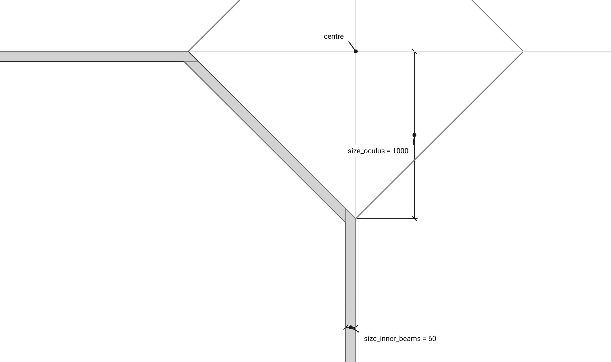

The column head in plan: the head, its chamfer, the wedges, the ribs and the t-sections.

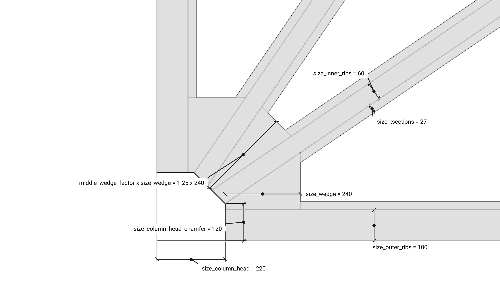

Outer rib 0 and column 0 in elevation: `bay_height`, `height`, `rise` and `column_head_depth`.

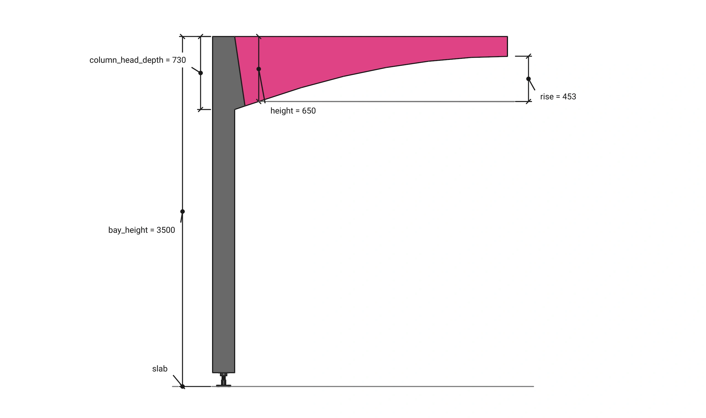

The two leaning planes seen edge-on: the middle wedge's fan plane and the oculus beam's bearing plane.

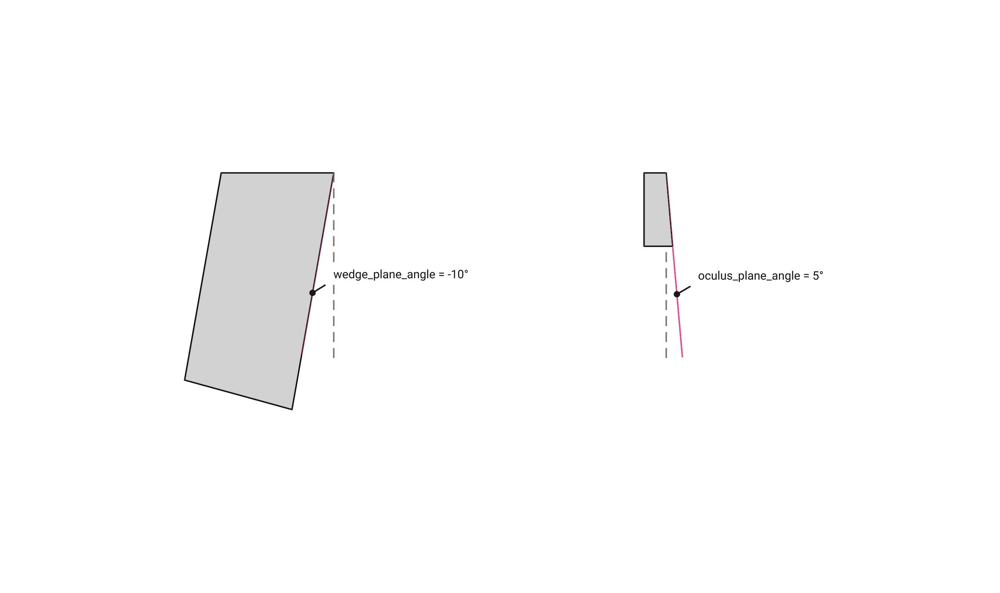

Every parameter is a constructor argument with its default, kept as a read-only field of `FloorGuide`. Sizes are in mm, angles in degrees.

| Parameter | Default | What it sets |
|---|---|---|
| `size_oculus` | 1000 | Distance of every oculus point from the centre along its seam |
| `size_column_head` | 220 | Side of the square column shaft and of the head polygon at the corner |
| `size_column_head_chamfer` | 120 | Where the chamfer points sit on the shaft faces; also the capitel width |
| `size_outer_ribs` | 100 | Outer rib thickness |
| `size_inner_ribs` | 60 | Inner rib thickness |
| `size_inner_beams` | 60 | Seam and oculus beam thickness; also the ring beam width at the datum |
| `size_wedge` | 240 | Side wedge block thickness |
| `middle_wedge_factor` | 1.25 | The middle wedge block in `size_wedge` thicknesses |
| `size_tsections` | 27 | Flange plane offset and bed layer thickness |
| `height` | 650 | Rib depth where the parabola starts |
| `rise` | 453 | Parabola rise from there to the seam; the seam depth `static_h()` is `height - rise` |
| `wedge_plane_angle` | -10 | How far the middle wedge's fan plane leans about its top edge |
| `oculus_plane_angle` | 5 | How far the oculus beam's bearing plane leans about its top edge |
| `column_head_depth` | 730 | Depth of the carved column head and of the capitel |
| `bay_height` | 3500 | The storey: floor top above the slab, the column top |

Code: [`FloorGuide` parameters](https://github.com/petrasvestartas/wood/blob/5f7f317df711a163eda3c416cb426e5cd8663dd6/src/templates/floor/floor_guide.h#L52-L66)

## Overview

Centre of the floor:

```cpp
    centre = Point::centroid({corners[0], corners[1], corners[2], corners[3]});
```

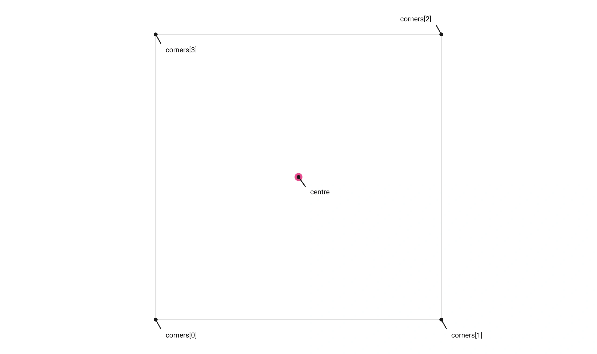

Oculus points:
```cpp
    for (size_t q = 0; q < 4; q++)
        oculus_points[q] = centre + (midpoint(q) - centre).normalized() * size_oculus;
```

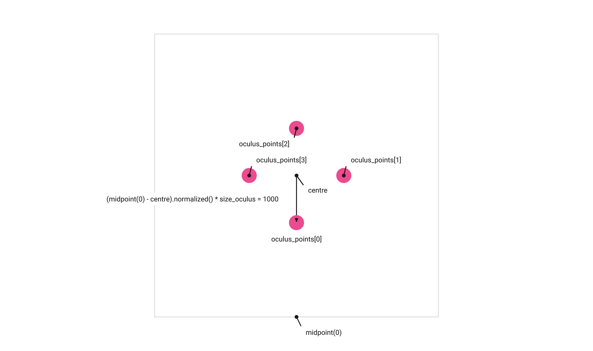

Construction planes, which are a class of pair of planes:
```cpp
    for (size_t q = 0; q < 4; q++) {
        const ConstructionPlanes planes = compute_construction_planes(q);
        _construction_planes[q] = planes;
    }
```

```cpp
    class ConstructionPlanes {
        std::array<std::array<Plane, 2>, 2> outer_ribs;   // 2 members
        std::array<std::array<Plane, 2>, 3> inner_beams;  // 3 members (2 seams, 1 oculus edge)
        std::array<std::array<Plane, 2>, 2> inner_ribs;   // 2 members
        std::array<std::array<Plane, 2>, 3> wedges;       // 3 members (column head fan)
        std::array<std::array<Plane, 2>, 6> tsections;    // 6 members
    };
```

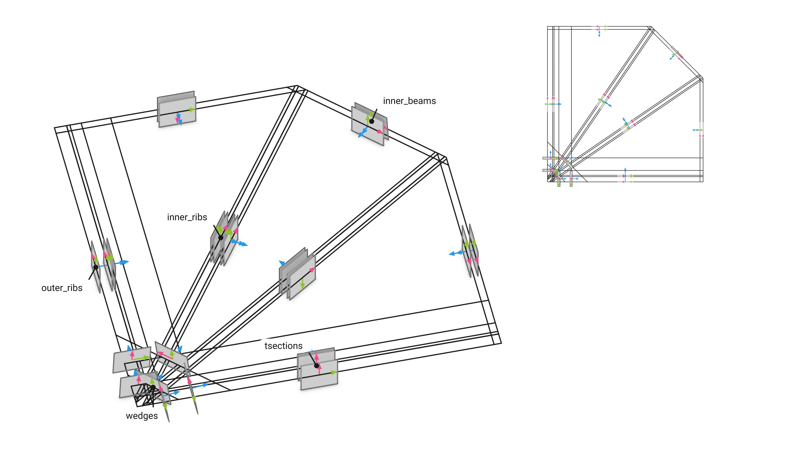

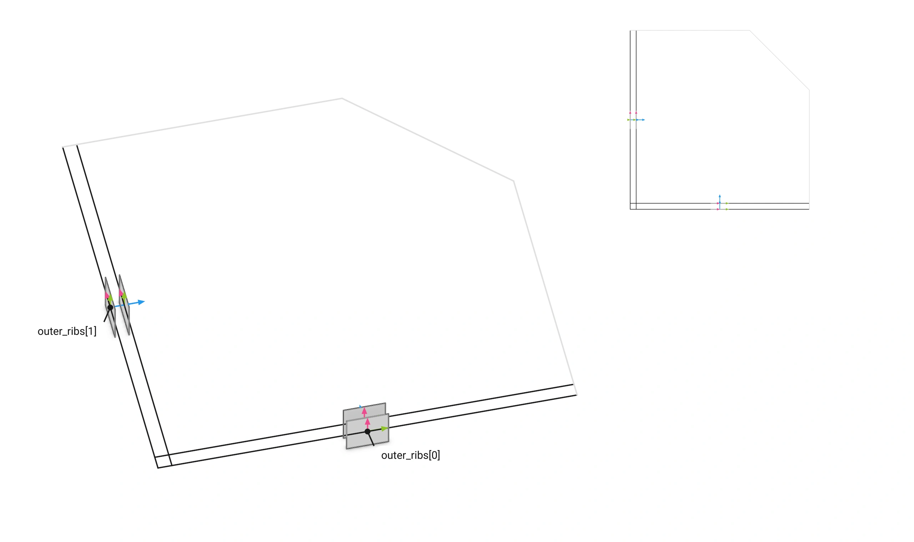
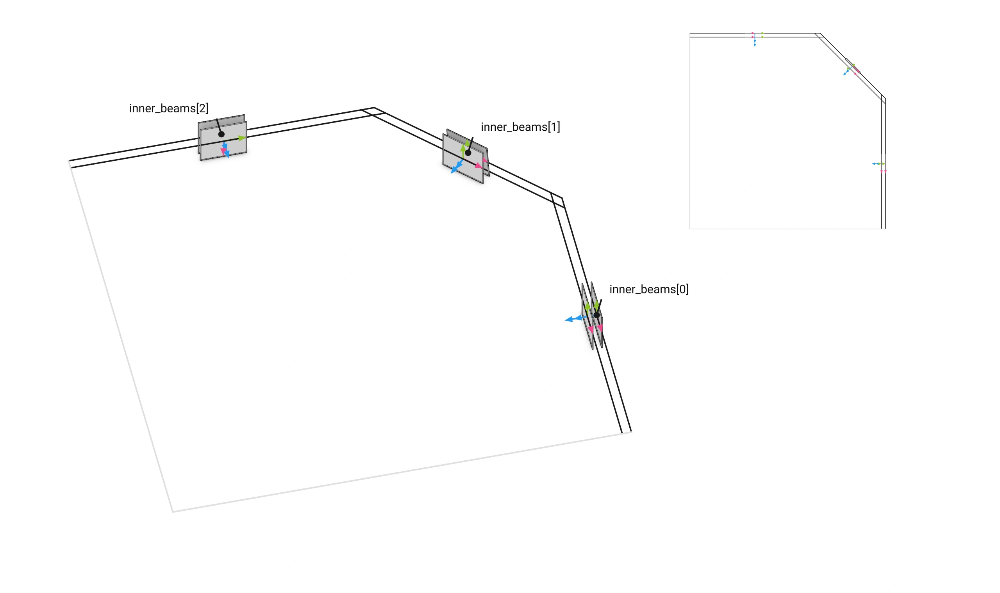
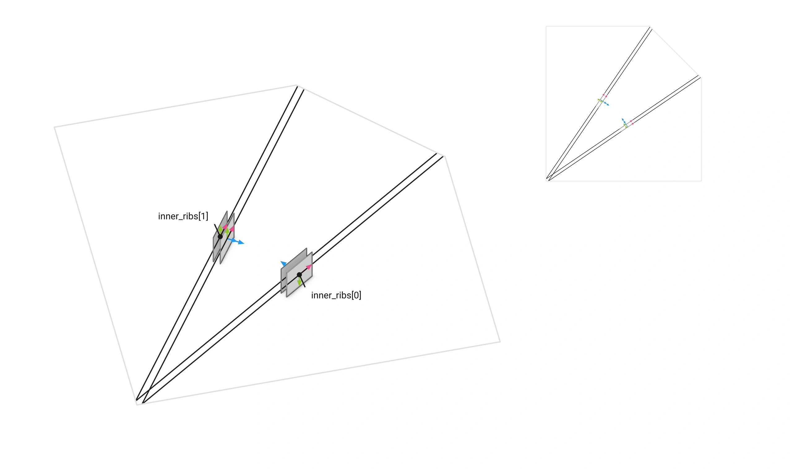
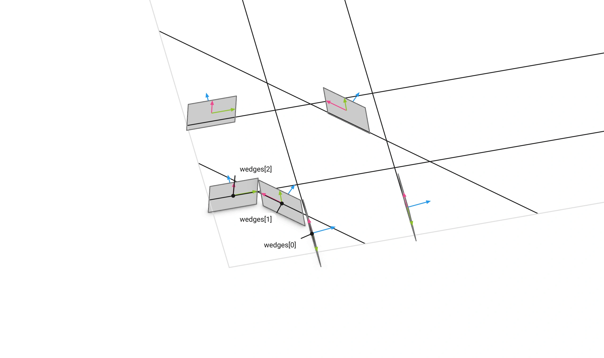
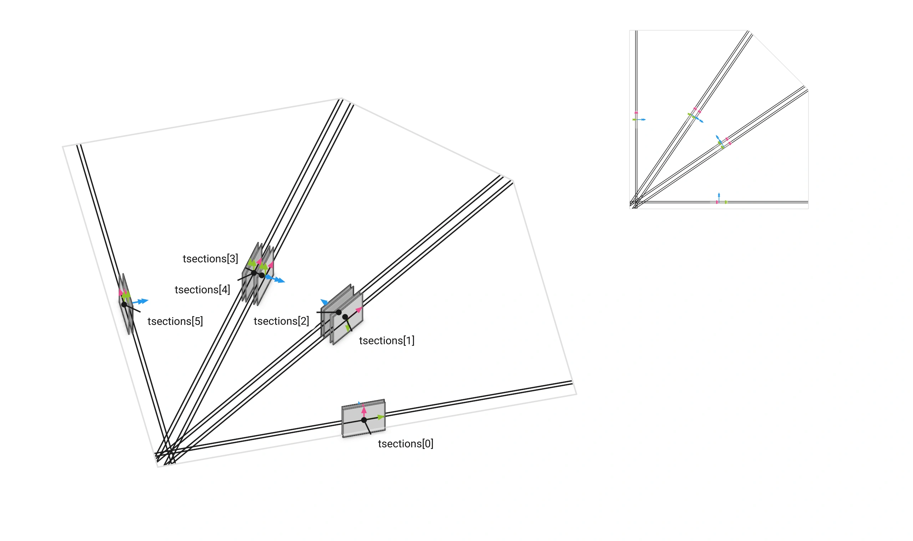

Rib starts, how far from the column each outer rib's parabola starts, chosen so both outer ribs of a column end at one depth:

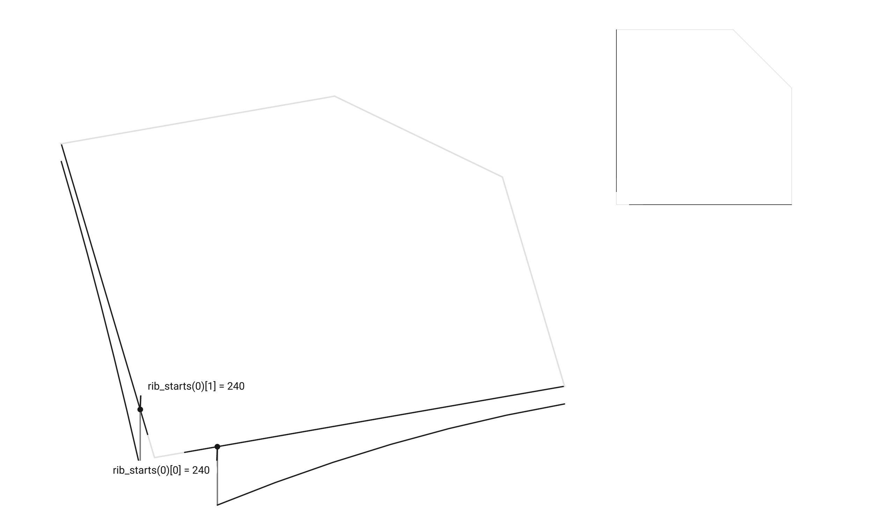

Column blocks, each side block as thick as its rib's start, the middle one middle_wedge_factor times their mean:

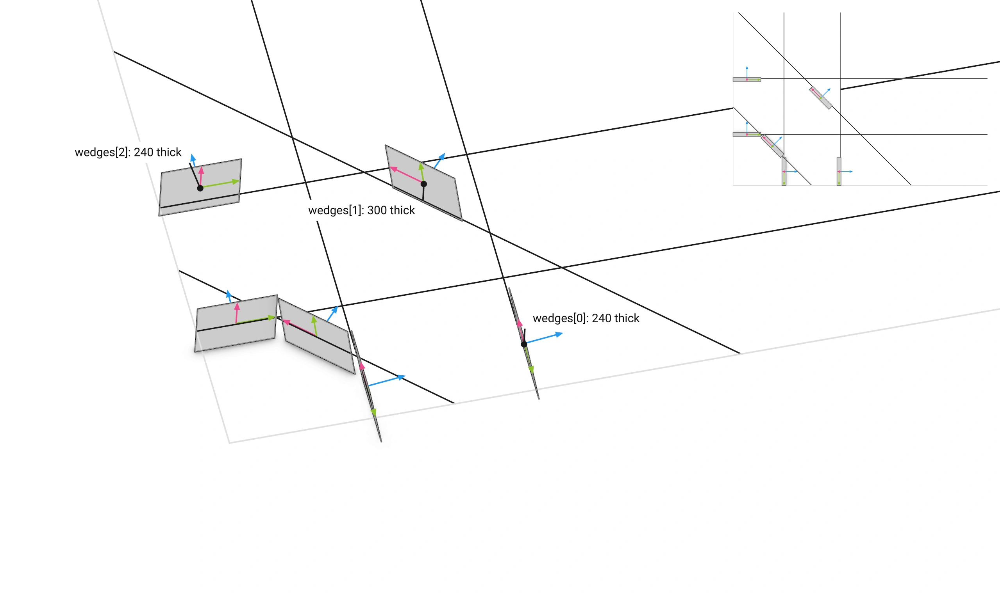

Construction quads, each member's footprint on the floor where four of its planes cross:
```cpp
    for (size_t q = 0; q < 4; q++) {
        const ConstructionQuads quads = compute_construction_quads(_construction_planes[q]);
        _construction_quads[q] = quads;
    }
```

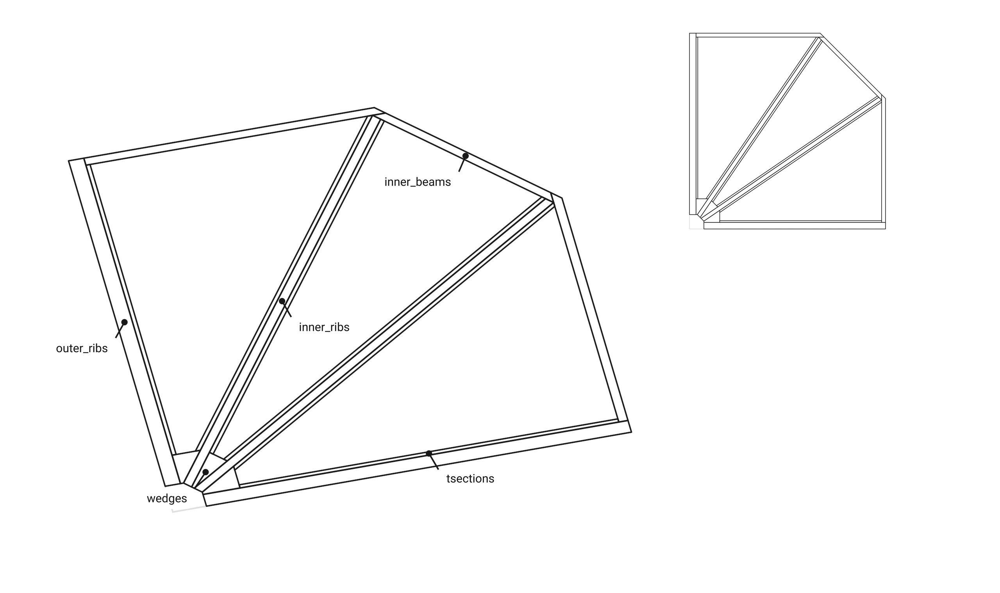

Boundary parabolas, the curved underside of each rib and its two layers 27 and 54 above:
```cpp
    for (size_t q = 0; q < 4; q++) {
        const std::array<std::array<Polyline, 3>, 4> parabolas = compute_boundary_parabolas(q);
        _boundary_parabolas[q] = parabolas;
    }
```

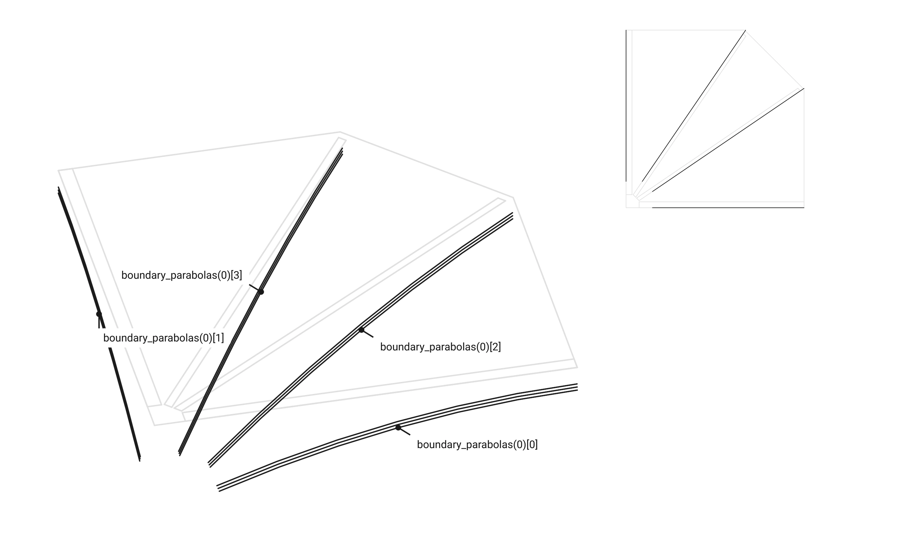

Central panel, the ruled surface between the two inner ribs and its traces on their faces:
```cpp
    for (size_t q = 0; q < 4; q++) {
        const CentralPanel panel = compute_central_panel(q);
        _central_panel[q] = panel;
    }
```

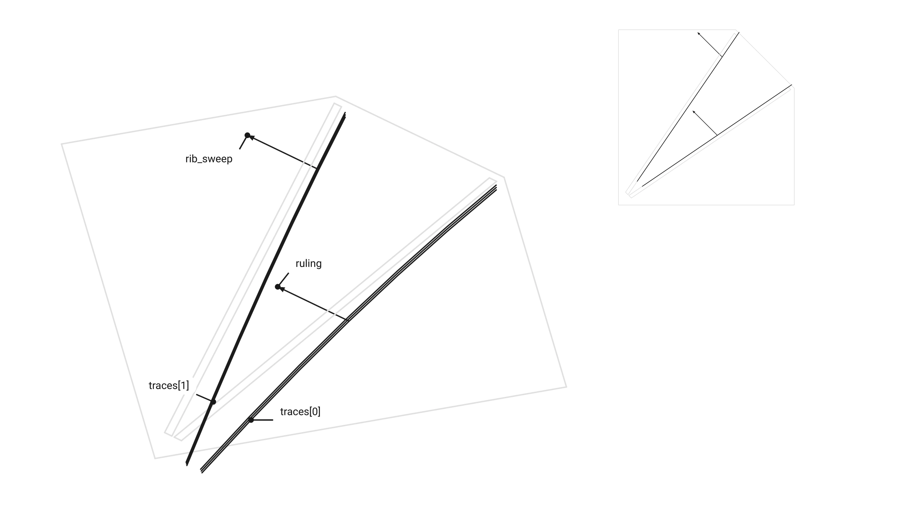

Bed top planes, the plane each row of beds sits on, beside rib 0, in the central panel and beside rib 1:
```cpp
    for (size_t q = 0; q < 4; q++) {
        const std::array<Plane, 3> bed_planes = compute_bed_top_planes(q);
        _bed_top_planes[q] = bed_planes;
    }
```

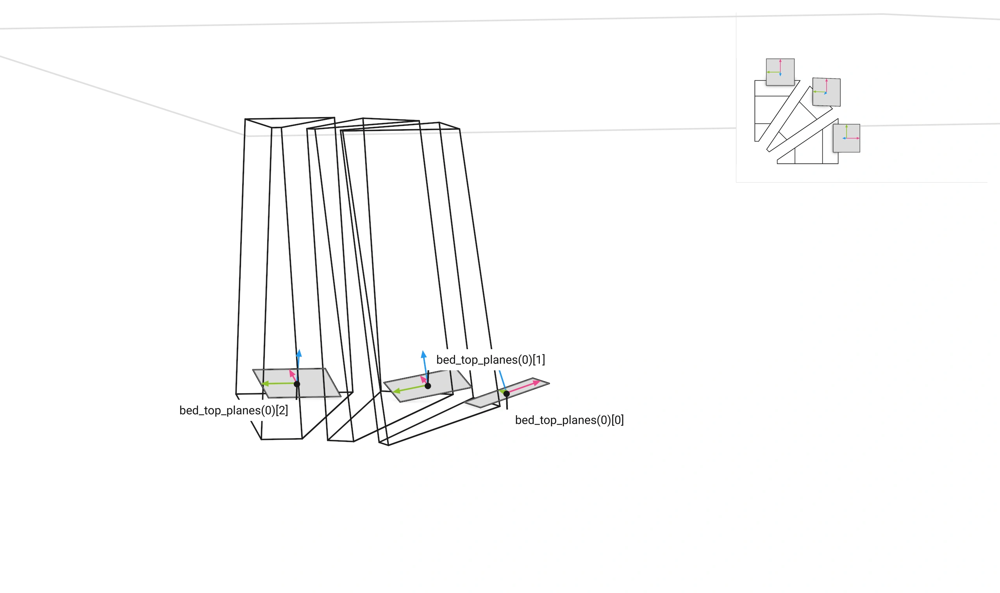

Column cutter level, one for every column: the deepest outer rib bottom corner at a column, where the column head cutters stop:
```cpp
    for (size_t q = 0; q < 4; q++)
        for (const std::array<Polyline, 2>& rib : outer_ribs(q))
            _rib_bottom = std::min({_rib_bottom, rib[0].get_point(2)[2], rib[1].get_point(2)[2]});
```

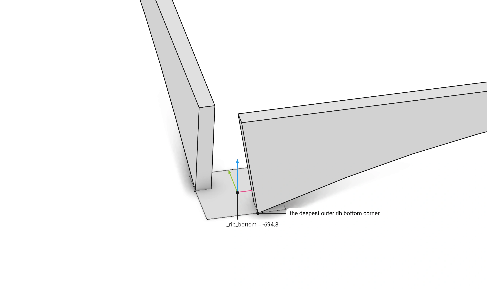

Soffit, the one level every inner and ring beam's underside sits at: the deepest rib end on a beam, so every rib meets its beam in full:
```cpp
    soffit = -static_h();

    for (size_t q = 0; q < 4; q++) {
        const std::vector<std::array<Polyline, 2>> outer = outer_ribs(q);
        const std::vector<std::array<Polyline, 2>> inner = inner_ribs(q);

        for (size_t k = 0; k < 2; k++)
            soffit = std::min({soffit, end_level(outer[k], rib_seam_ends(q)[k]), end_level(inner[k], _construction_planes[q].inner_beams[1][1])});
    }
```

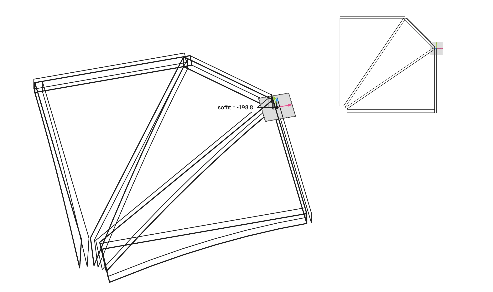


## Step by step

The math of each step, in the constructor's order. q is the quarter at `corners[q]`; every step is done for the four quarters, and the pictures show q = 0.

### Centre

The centre is the vertex average of the four corners, `(c0 + c1 + c2 + c3) / 4`. It is where the two bimedians cross, the lines joining opposite edge midpoints, so the four seams from it to `midpoint(k)` split the bay into four quarters whatever its shape.

### Oculus points

For each edge k the direction from the centre to its midpoint is normalized and walked `size_oculus` from the centre:

`oculus_points[k] = centre + normalize(midpoint(k) - centre) * size_oculus`

Every oculus point therefore lies on its seam, at the same distance from the centre; the four points are the corners of the hole. With them each quarter is the polygon `corners[q]`, `midpoint(q)`, `oculus_points[q]`, `oculus_points[q - 1]`, `midpoint(q - 1)` (`quarter_polygon(q)`): two bay edges, two seams and the oculus edge.

### Construction planes

Every member of a quarter is two planes, its two faces: `pair(plane, size)` returns `{plane, plane moved size along its normal}`. Most base planes are vertical walls standing on a line of the plan, `Plane::from_line(line, down)`: the line is the plane's x axis and its y axis points down. A quarter has 16 pairs: 2 outer ribs, 3 inner beams, 2 inner ribs, 3 wedges and 6 t-sections.

#### Outer ribs

The two bay edges at the corner, each as a wall, moved to the middle of its half edge; the pair's second face lies `size_outer_ribs` inside the bay.

#### Inner beams

Walls on the two seams (`midpoint(q)` to `oculus_points[q]`, `oculus_points[q - 1]` to `midpoint(q - 1)`), each `size_inner_beams` thick. The oculus edge's wall is turned `oculus_plane_angle` about the edge, so the ring beams later bear on a leaning face; its second face is the untilted wall moved by the thickness.

#### Inner ribs

Each inner rib runs from a chamfer point of the column head to an inner beam corner. The column head polygon (`quarter_column_polygon(q)`) is the square shaft `size_column_head` wide with its inner corner cut at `size_column_head_chamfer`, set in `column_frame(q)`: the edge directions at a right corner, the corner bisector turned ±45 degrees otherwise. The beam corners are where the second faces of two neighbouring inner beams cross the floor: `p0` = seam 0 with the oculus edge, `p1` = the oculus edge with seam 1. The ribs are the walls on `head[2]`-`p0` and `head[3]`-`p1`, `size_inner_ribs` thick.

#### Wedges and the rib starts

The three column blocks stand on the three sides of the column head: the chamfer side's plane is turned `wedge_plane_angle` about its top edge, and each side block's plane leans along the line where that chamfer plane meets the neighbouring inner rib, so the fan closes. Their far faces depend on the rib starts:

1. Each outer rib's axis is the line on the floor along its base face from the fan plane it starts on (`wedges[0][0]` or `wedges[2][0]`) to the seam plane it ends on (`outer_rib_axis`).
2. Its soffit is a parabola over that axis: depth `-height` at a distance `start` from the column, `-static_h()` (`height - rise`) at the seam, flat at the seam (`outer_parabola`).
3. Extended back to the fan plane, the parabola ends at some depth there (`fan_end`). With `start = size_wedge` for both ribs of the column, the shallower of the two ends is the column's `level`.
4. Each rib's start is then solved so its end lands exactly on `level` (`rib_start_at_level`): the secant method on `f(start) = fan_end(start) - level`, from `size_wedge` and `size_wedge + 1`, until `|f|` is within 1e-11 mm. The rib already at the level keeps `size_wedge`.
5. Each side block is as thick as its rib's start; the middle block `middle_wedge_factor` times their mean.

On the square bay both starts stay 240; on a 6000 x 4800 bay the short rib starts at 187.67, and the blocks are 240 / 267.29 / 187.67.

#### T-sections

Six flanges `size_tsections` thick beside the rib faces: one on the inner face of each outer rib, one on each face of each inner rib. Each is its rib face moved by the flange thickness, towards the bed it carries.

### Construction quads

Each member's footprint on the floor: the four planes that bound it, its two faces and the two planes it starts and ends on, crossed pairwise with the floor `z = 0` (`Polyline::from_planes`), which gives the quad's four corners. For example outer rib 0 is bounded by its two faces, the fan plane `wedges[0][0]` and the seam plane `inner_beams[0][0]`.

### Boundary parabolas

For each outer rib, the soffit parabola from its rib start (step "Wedges and the rib starts"), plus the same curve lifted `size_tsections` and twice that: the t-section top and the bed top. The inner ribs' curves are the outer ones projected sideways, along the outer rib's normal, onto the inner rib's outer face, so a bed between an outer and an inner rib meets both at the same height. Result: 4 ribs x 3 curves per quarter.

### Central panel

Between the two inner ribs the beds must stay flat quads. Rule A finds one horizontal direction `rib_sweep` r along which both inner ribs' outer-face soffits are swept onto their central faces (each moves `size_inner_ribs / (n . r)` along r), such that the two swept traces become parallel, the closure: the cross product of the start chord and the end chord between them is zero. The scan turns r in 0.5 degree steps within ±85 degrees of the difference of the two rib normals, skips sweeps grazing a rib face, and bisects every sign change; the root nearest the reference wins. The `ruling` u is then the horizontal direction from one swept trace's start to the other's; the panel's soffit and its two layers are traced on both central faces along u.

### Bed top planes

One plane per bed row, beside rib 0, in the central panel and beside rib 1, each the underside of that row's column block. The row's bed top curve on its two side faces is trimmed between the beam it ends on and the block it starts at; the two lowest points of each side, at the column end, give four points, and the plane through them (least squares) is turned to point up.

### Column cutter level

The column head is carved down to one level, the same at every column: the deepest of the outer ribs' bottom corners where they meet their fan planes, over all four columns (`column_levels(q)[1]`).

### Soffit

Every inner and ring beam's underside sits at one level: starting from the seam depth `-static_h()`, the deepest point where any rib ends on a beam, outer ribs on their seam beams and inner ribs on the oculus beam, over all four quarters. Every rib then meets its beam in full.

## Tables

### ConstructionPlanes

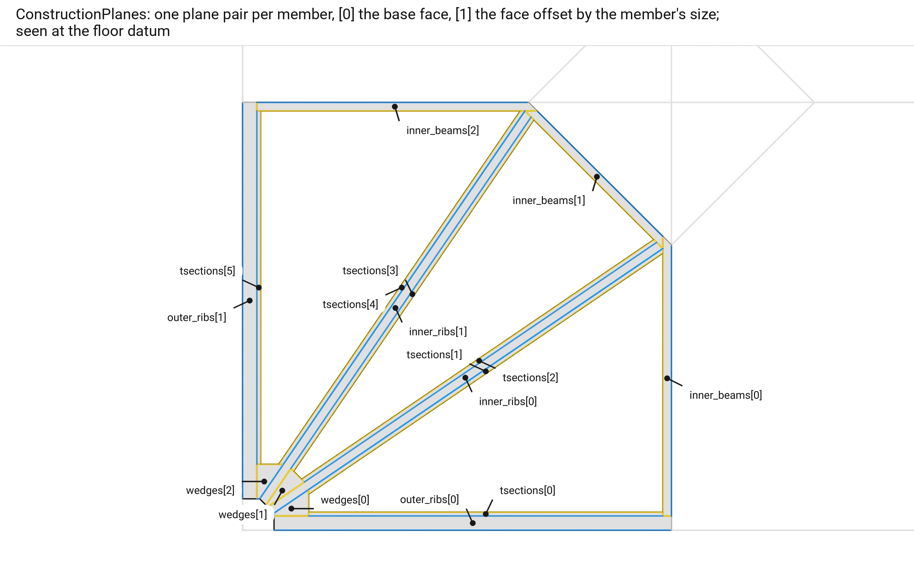

<span style="color:#2196EA">■ [0] base face</span> <span style="color:#F2CC0C">■ [1] offset face</span> <span style="color:#DADADA">■ the member between them</span>

One plane pair per member of a quarter, from `construction_planes(q)`: `[0]` is the member's base face, `[1]` the face offset from it by the member's size. The picture shows where each plane meets the floor datum.

| Field | Type | Members | Where |
|---|---|---|---|
| `outer_ribs` | `std::array<std::array<Plane, 2>, 2>` | 2 | Along the two bay edges, offset inwards by `size_outer_ribs` |
| `inner_beams` | `std::array<std::array<Plane, 2>, 3>` | 3 | Seam 0, the oculus edge (tilted by `oculus_plane_angle`), seam 1 |
| `inner_ribs` | `std::array<std::array<Plane, 2>, 2>` | 2 | From the column head chamfer to the inner beam corners |
| `wedges` | `std::array<std::array<Plane, 2>, 3>` | 3 | The column head fan: side 0, the middle one tilted by `wedge_plane_angle`, side 1 |
| `tsections` | `std::array<std::array<Plane, 2>, 6>` | 6 | Beside the ribs, `size_tsections` thick: outer rib 0, inner rib 0 outer and central face, inner rib 1 central and outer face, outer rib 1 |

Code: [`ConstructionPlanes`](https://github.com/petrasvestartas/wood/blob/5f7f317df711a163eda3c416cb426e5cd8663dd6/src/templates/floor/floor_guide.h#L13-L21)

### ConstructionQuads

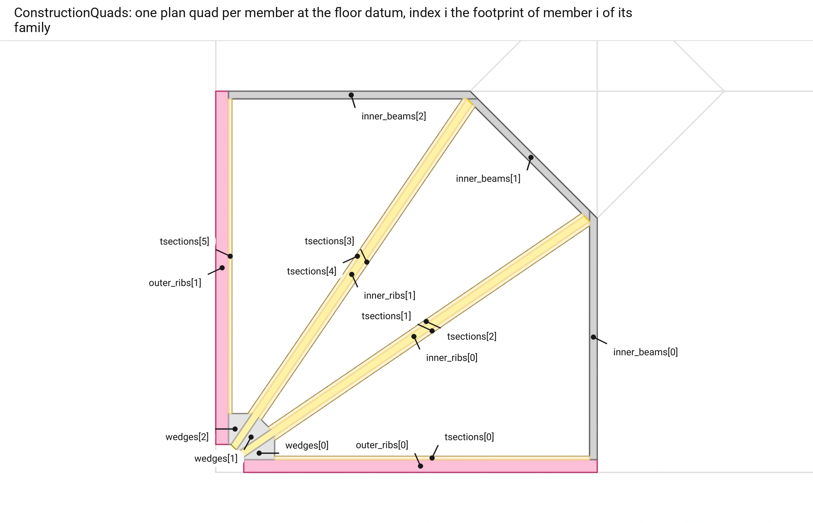

<span style="color:#E8478B">■ outer_ribs</span> <span style="color:#7C7C7C">■ inner_beams</span> <span style="color:#F2CC0C">■ inner_ribs</span> <span style="color:#A8A8A8">■ wedges</span> <span style="color:#F5D890">■ tsections</span>

One plan quad per member at the floor datum, from `construction_quads(q)`: index `i` is the footprint of member `i` of its family, bounded by its own plane pair and its neighbours' planes.

| Field | Type | Quads |
|---|---|---|
| `outer_ribs` | `std::array<Polyline, 2>` | 2 |
| `inner_beams` | `std::array<Polyline, 3>` | 3: seam 0, oculus edge, seam 1 |
| `inner_ribs` | `std::array<Polyline, 2>` | 2 |
| `wedges` | `std::array<Polyline, 3>` | 3 |
| `tsections` | `std::array<Polyline, 6>` | 6 |

Code: [`ConstructionQuads`](https://github.com/petrasvestartas/wood/blob/5f7f317df711a163eda3c416cb426e5cd8663dd6/src/templates/floor/floor_guide.h#L23-L31)

### CentralPanel

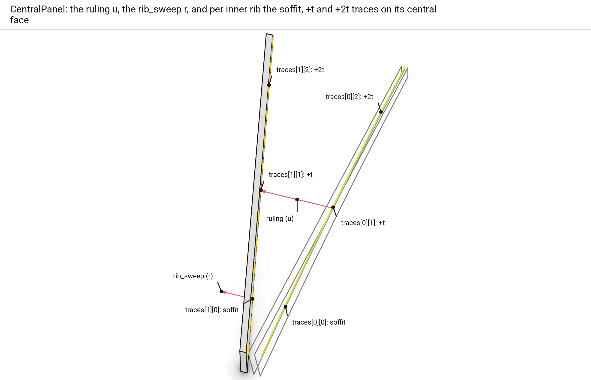

<span style="color:#2196EA">■ soffit traces</span> <span style="color:#F2CC0C">■ +t and +2t traces</span> <span style="color:#E8478B">■ ruling u and rib_sweep r</span> <span style="color:#737373">■ inner rib 0, as its loops</span>

The panel between a quarter's two inner ribs, from `central_panel(q)`, found by rule A: one horizontal ruling joins the two ribs and one sweep serves both, so the central beds stay flat quads.

| Field | Type | What it is |
|---|---|---|
| `ruling` | `Vector` | u: the panel's horizontal ruling, along which rib 0's central trace projects onto rib 1's |
| `rib_sweep` | `Vector` | r: the horizontal direction both inner ribs are swept along from their outer to their central face |
| `traces` | `std::array<std::array<Polyline, 3>, 2>` | Per inner rib `k`, on its central face: `traces[k][0]` the soffit, `[1]` +t and `[2]` +2t, t being `size_tsections` |

Code: [`CentralPanel`](https://github.com/petrasvestartas/wood/blob/5f7f317df711a163eda3c416cb426e5cd8663dd6/src/templates/floor/floor_guide.h#L33-L39)

### FloorGuide

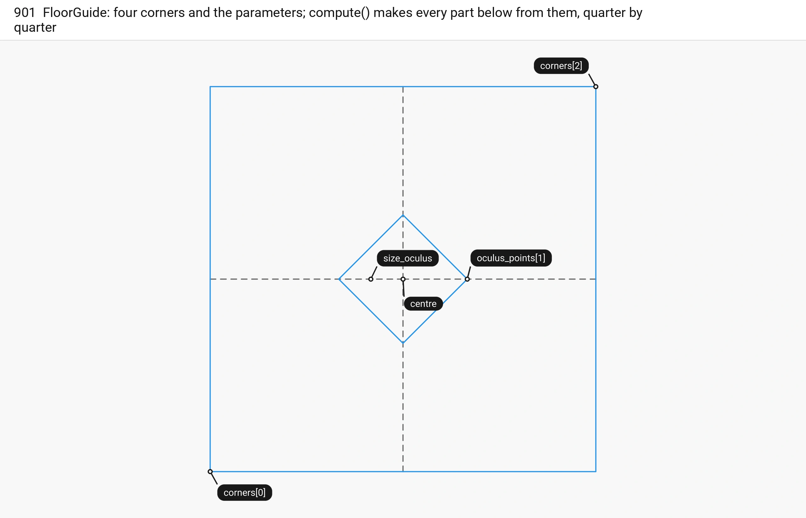

<span style="color:#2196EA">■ corners, oculus points</span> <span style="color:#737373">■ seams, dashed</span>

The guide is made from four corners and the parameters (`size_outer_ribs`, `size_wedge`, `height`, `rise` ...); the constructor runs every step for each quarter and draws the result.

Code: [`FloorGuide`](https://github.com/petrasvestartas/wood/blob/5f7f317df711a163eda3c416cb426e5cd8663dd6/src/templates/floor/floor_guide.h#L50)

### quarter_polygon

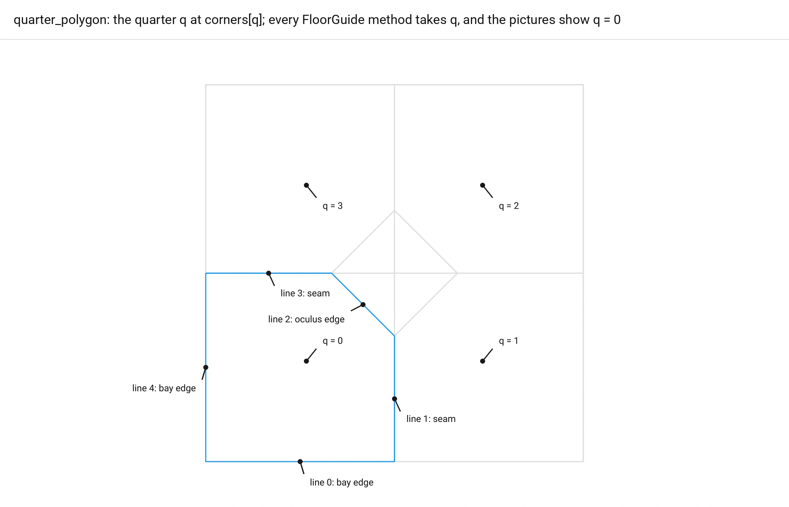

<span style="color:#2196EA">■ quarter 0</span> <span style="color:#A3A3A3">■ the other quarters</span>

The bay is split into four quarters; quarter q is the one at `corners[q]`. Every FloorGuide method takes q and computes that quarter alone, so a rectangular bay gets four different quarters; the pictures below show q = 0. The quarter's five lines carry all its planes: the bay edges, the two seams, the oculus edge.

Code: [`quarter_polygon`](https://github.com/petrasvestartas/wood/blob/5f7f317df711a163eda3c416cb426e5cd8663dd6/src/templates/floor/floor_guide.h#L96)

### quarter_column_polygon

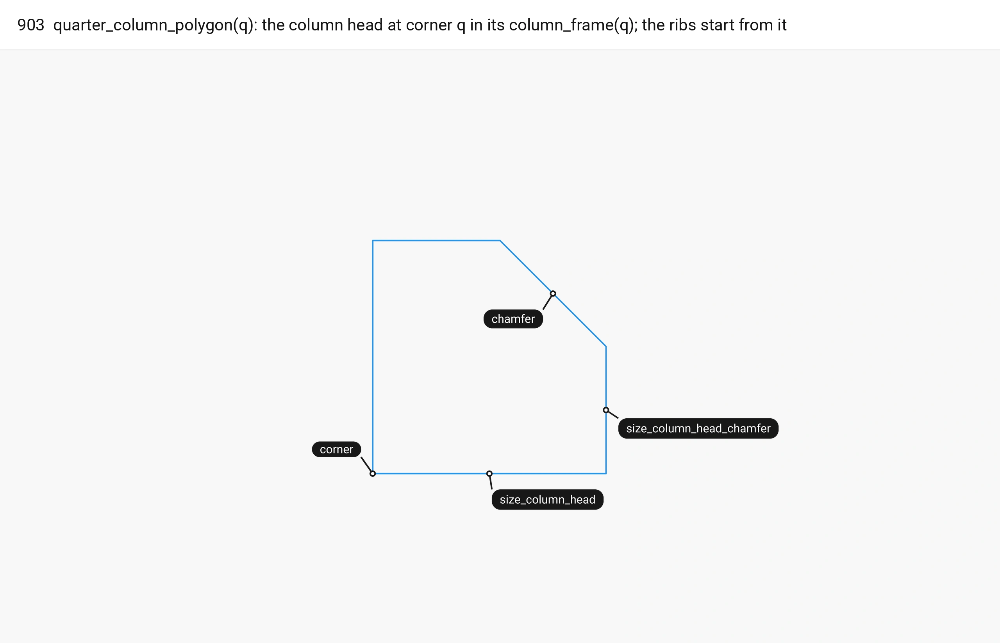

<span style="color:#2196EA">■ the column head</span> <span style="color:#737373">■ column_frame</span>

The column head at the quarter's corner, where the ribs start; `column_frame` gives its axes.

Code: [`quarter_column_polygon`](https://github.com/petrasvestartas/wood/blob/5f7f317df711a163eda3c416cb426e5cd8663dd6/src/templates/floor/floor_guide.h#L99)

### construction_planes

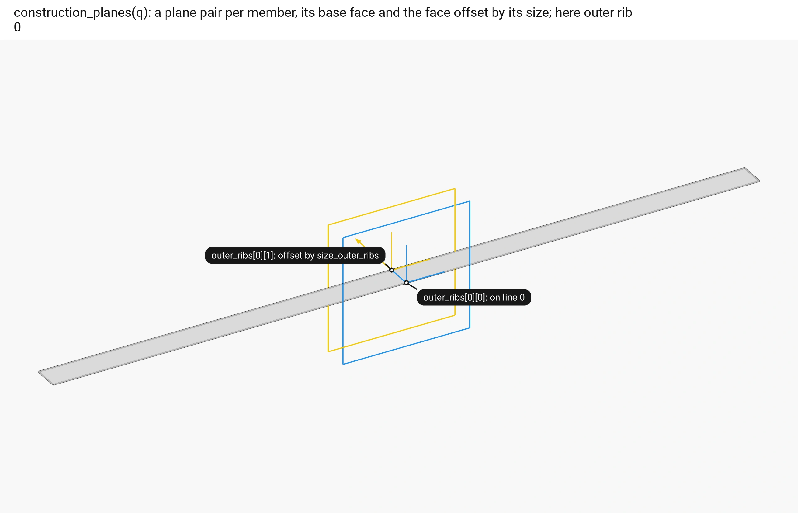

<span style="color:#2196EA">■ base face</span> <span style="color:#F2CC0C">■ offset face</span> <span style="color:#A3A3A3">■ the member's footprint</span>

A plane pair for every member: its base face on one of the polygon's lines, and the face offset by the member's size. Every member is cut from these planes.

Code: [`construction_planes`](https://github.com/petrasvestartas/wood/blob/5f7f317df711a163eda3c416cb426e5cd8663dd6/src/templates/floor/floor_guide.h#L112)

### construction_quads

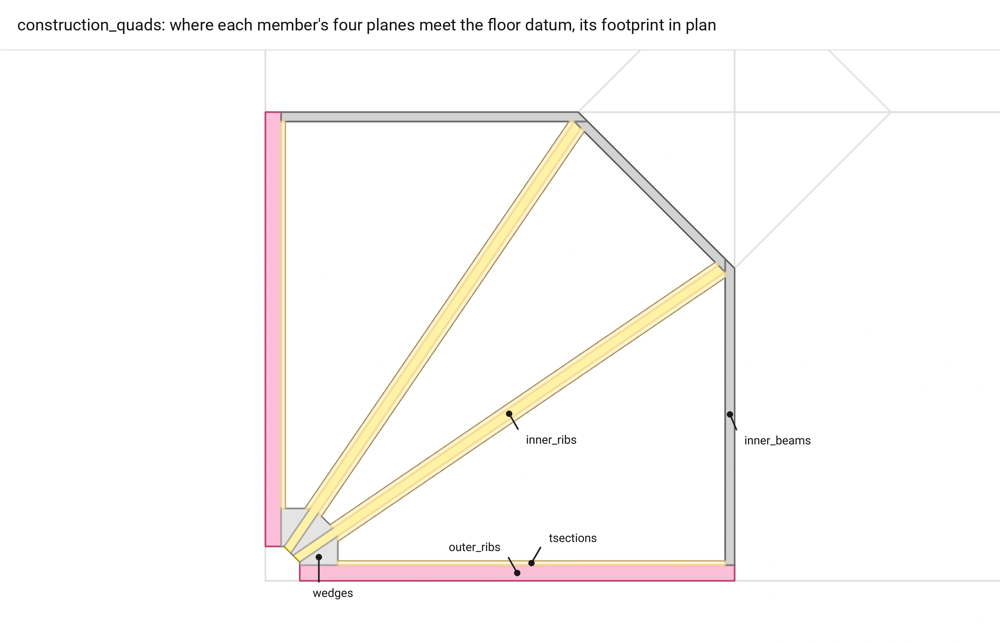

family colours

Where each member's four planes meet the floor datum: its footprint in plan.

Code: [`construction_quads`](https://github.com/petrasvestartas/wood/blob/5f7f317df711a163eda3c416cb426e5cd8663dd6/src/templates/floor/floor_guide.h#L115)

### boundary_parabolas

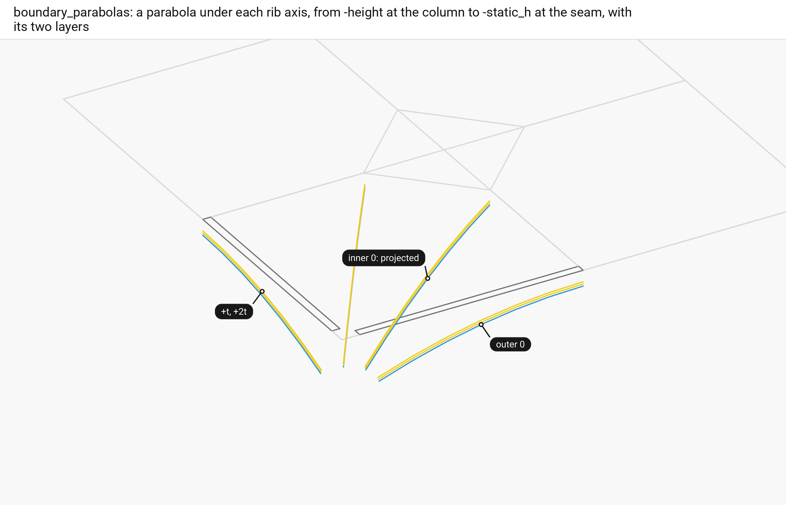

<span style="color:#2196EA">■ the parabolas</span> <span style="color:#F2CC0C">■ their +t and +2t layers</span> <span style="color:#737373">■ rib quads</span>

A parabola under each rib axis, from `-height` at the column to `-static_h` at the seam. The inner ones are the outer ones projected onto the inner ribs.

Code: [`boundary_parabolas`](https://github.com/petrasvestartas/wood/blob/5f7f317df711a163eda3c416cb426e5cd8663dd6/src/templates/floor/floor_guide.h#L125)

### central_panel

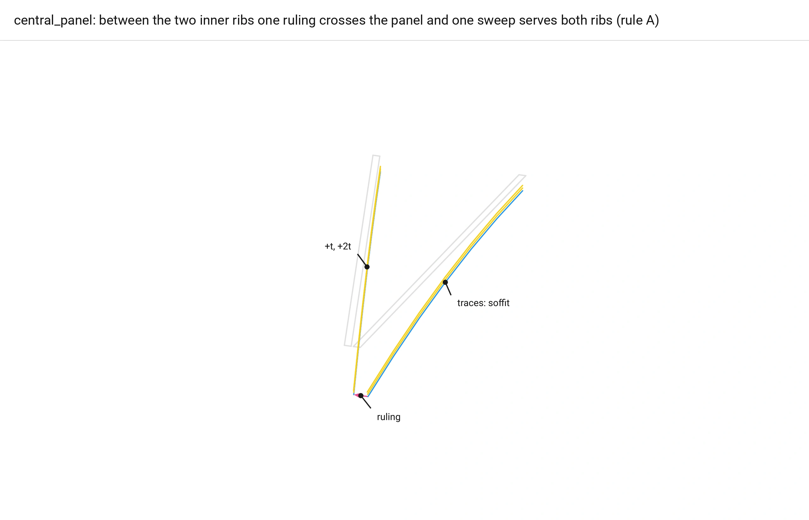

<span style="color:#2196EA">■ soffit traces</span> <span style="color:#F2CC0C">■ layers</span> <span style="color:#E8478B">■ ruling</span>

Between the two inner ribs, one ruling crosses the panel and one sweep serves both ribs (rule A), so the central beds stay flat quads.

Code: [`central_panel`](https://github.com/petrasvestartas/wood/blob/5f7f317df711a163eda3c416cb426e5cd8663dd6/src/templates/floor/floor_guide.h#L128)

### Two face loops

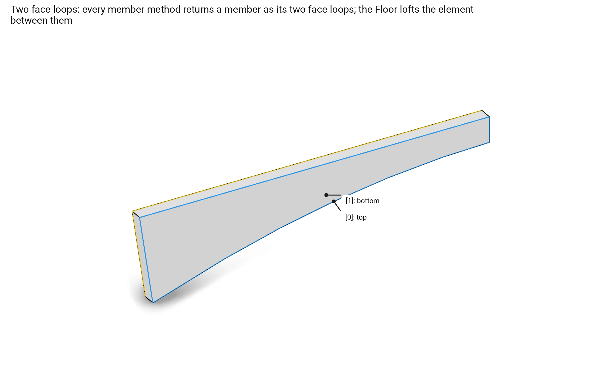

<span style="color:#2196EA">■ [0]: top</span> <span style="color:#F2CC0C">■ [1]: bottom</span>

Every member method below returns each member as `std::array<Polyline, 2>`: its two face loops, lofted by `loft`. The guide stops here; the Floor turns loops into elements.

Code: [`loft`](https://github.com/petrasvestartas/wood/blob/5f7f317df711a163eda3c416cb426e5cd8663dd6/src/templates/floor/floor_guide.h#L177)

### outer_ribs, inner_ribs

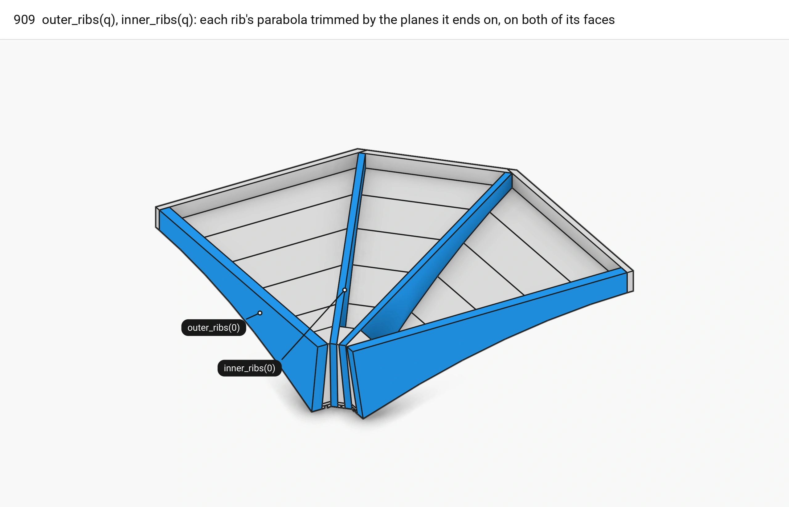

<span style="color:#2196EA">■ the ribs</span> <span style="color:#A3A3A3">■ the rest of the quarter</span>

Each rib's parabola trimmed by the planes it ends on, on both of its faces.

Code: [`outer_ribs`](https://github.com/petrasvestartas/wood/blob/5f7f317df711a163eda3c416cb426e5cd8663dd6/src/templates/floor/floor_guide.h#L153)

### tsections

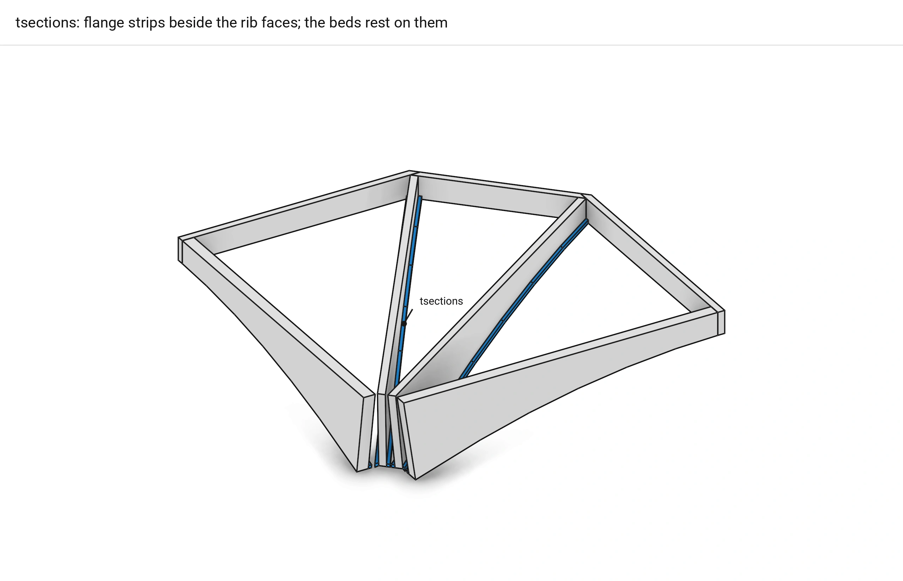

<span style="color:#2196EA">■ the t-sections</span> <span style="color:#A3A3A3">■ ribs and beams</span>

Flange strips beside the rib faces; the beds rest on them.

Code: [`tsections`](https://github.com/petrasvestartas/wood/blob/5f7f317df711a163eda3c416cb426e5cd8663dd6/src/templates/floor/floor_guide.h#L150)

### beds

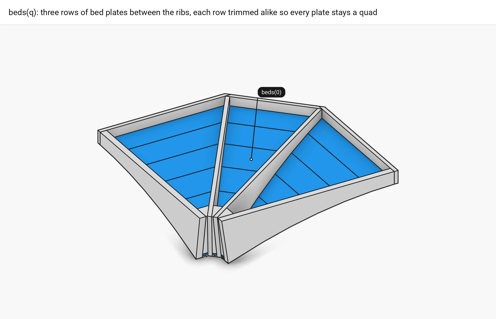

<span style="color:#2196EA">■ the beds</span>

Three rows of bed plates between the ribs, each row trimmed alike so every plate stays a quad.

Code: [`beds`](https://github.com/petrasvestartas/wood/blob/5f7f317df711a163eda3c416cb426e5cd8663dd6/src/templates/floor/floor_guide.h#L147)

### wedges, inner_beams

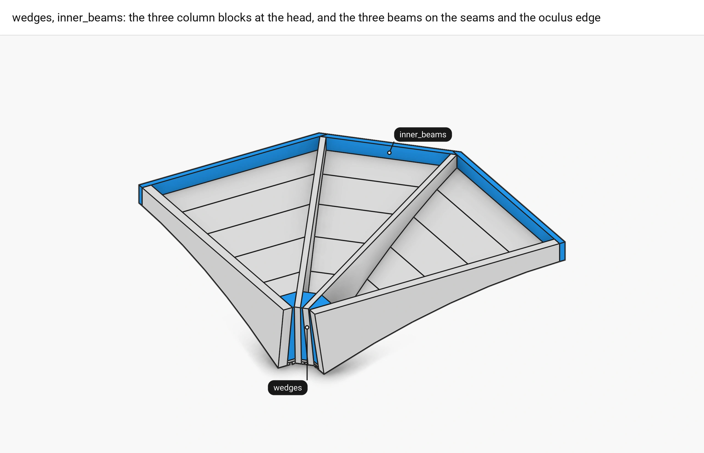

<span style="color:#2196EA">■ column blocks and inner beams</span>

The three column blocks at the head, and the three beams on the seams and the oculus edge.

Code: [`wedges`](https://github.com/petrasvestartas/wood/blob/5f7f317df711a163eda3c416cb426e5cd8663dd6/src/templates/floor/floor_guide.h#L159)

### oculus()

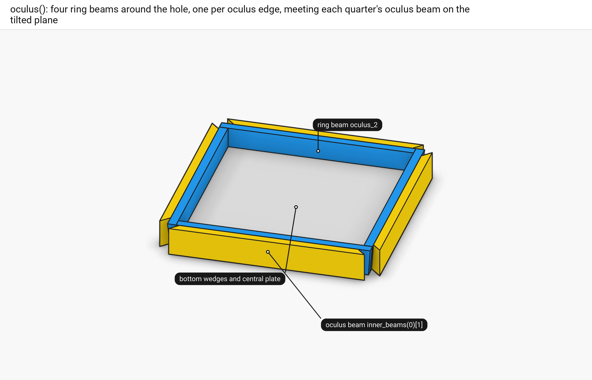

<span style="color:#2196EA">■ ring beams</span> <span style="color:#F2CC0C">■ the quarters' oculus beams</span> <span style="color:#A3A3A3">■ bottom wedges and central plate</span>

Four ring beams around the hole, one per oculus edge, each meeting its quarter's oculus beam on the tilted plane.

Code: [`oculus`](https://github.com/petrasvestartas/wood/blob/5f7f317df711a163eda3c416cb426e5cd8663dd6/src/templates/floor/floor_guide.h#L165)

### column_cutters

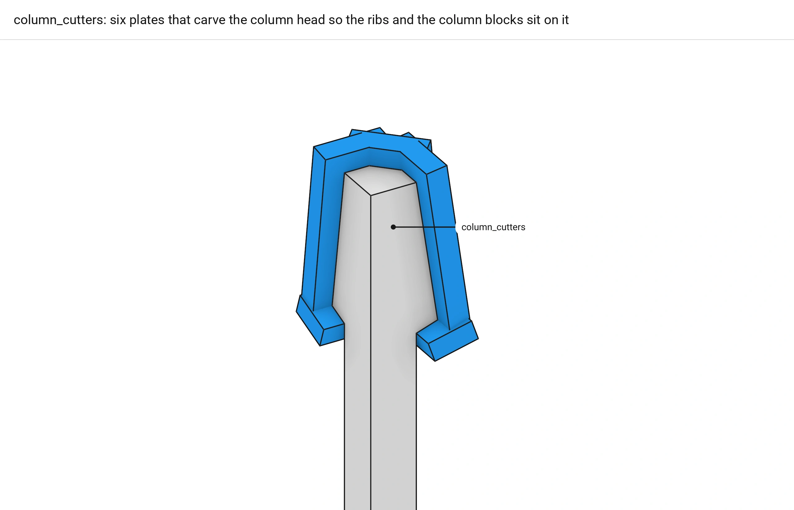

<span style="color:#2196EA">■ the cutters</span> <span style="color:#A3A3A3">■ the column</span>

Six plates that carve the column head so the ribs and the column blocks sit on it.

Code: [`column_cutters`](https://github.com/petrasvestartas/wood/blob/5f7f317df711a163eda3c416cb426e5cd8663dd6/src/templates/floor/floor_guide.h#L171)
