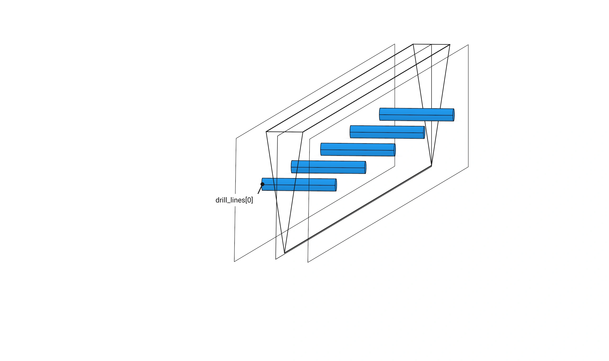
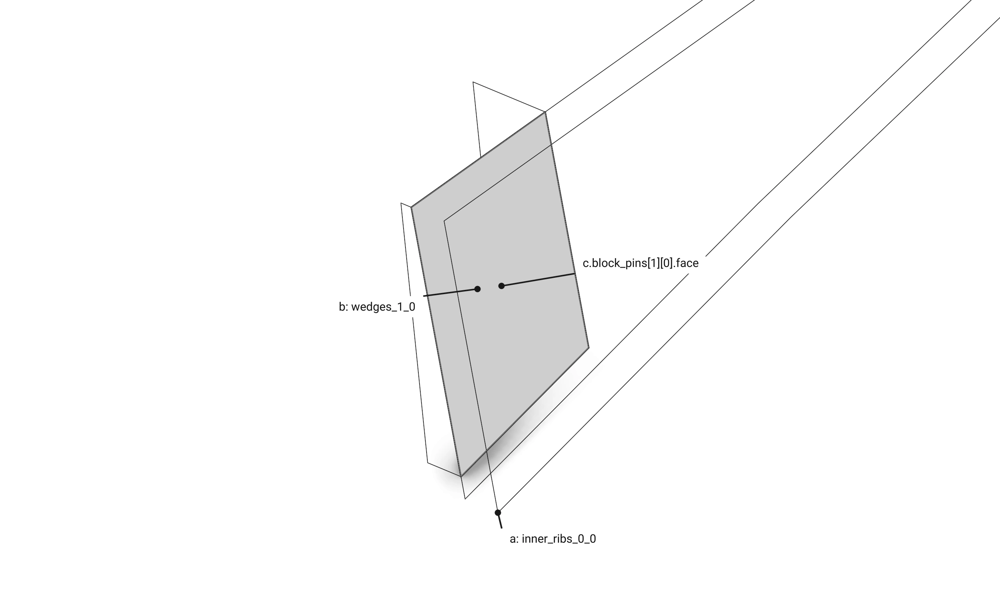
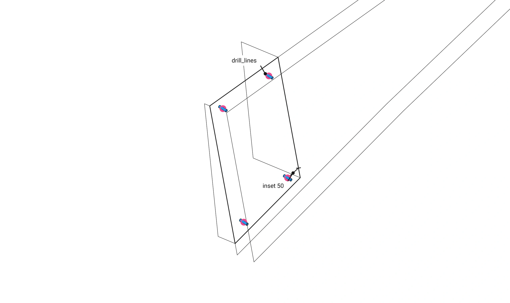

# Part 2. Floor: the model {#templates_floor_model}

[TOC]

Floor builds the timber members, their contacts, connectors and pins from a @ref templates_floor_guide "FloorGuide".


A guide makes a floor (`examples/templates_floor_7_contacts_cantilevers.cpp`):

```cpp
const wood_floor::FloorGuide guide({
    Point(-3000.0, -3000.0, 0.0),
    Point(3000.0, -3000.0, 0.0),
    Point(3000.0, 3000.0, 0.0),
    Point(-3000.0, 3000.0, 0.0),
});
wood_floor::Floor floor(guide);
```

The constructor is the whole computation, one block per step:

```cpp
    Floor::Floor(const FloorGuide& guide, const std::string& name = "floor")
        : WoodSession(name), guide(guide) {

        add_quarters();                                    // every quarter's members
        add_oculus();                                      // the ring around the hole
        add_columns();                                     // a column at every corner
        const auto contacts = add_contacts();              // where two members touch, per quarter
        const auto connectors = compute_connectors(contacts);
        add_connectors(connectors, contacts);              // a connector per contact, the pins among them
    }
```

<details>
<summary><b>Tables</b></summary>

Floor keeps only its guide; every element is in the session, grouped by the tree and found by name (`get_element_by_name`, `get_elements_numbered`).

```
floor
├── quarter_0                      quarter_1 .. quarter_3 alike
│   ├── beds_0
│   │   └── beds_<row>_0           Plate beds_<row>_<i>_0, three rows
│   ├── tsections_0                Plate tsections_<i>_0, six
│   ├── outer_ribs_0               BeamVariable outer_ribs_<i>_0, two
│   ├── inner_ribs_0               BeamVariable inner_ribs_<i>_0, two
│   ├── wedges_0                   Plate wedges_<i>_0, the three column blocks
│   ├── inner_beams_0              BeamVariable inner_beams_<i>_0: seam 0, the oculus edge, seam 1
│   ├── column_0                   Column column_0 on Support support_0
│   └── connectors_0               JointBeam connector_<contact name>, Plate column_plate_0_<k>,
│                                  JointPlate connector_cross_lap_0
└── oculus
    ├── ring_beams                 BeamVariable oculus_<q>, four
    ├── bottom_wedges              Plate oculus_<4 + q>, under ring beam q, four
    ├── central_plate              Plate oculus_8
    └── connectors                 JointBeam connector_oculus_wedge_<n>, four
```

Each quarter's contacts and connectors, its pins among them, are fixed arrays, so every count is in the type:

```cpp
/// A contact the floor's design puts between two members.
///
/// - `a`: the source member.
/// - `b`: the target member, which hosts the contact.
/// - `face`: the face they share, stored as their interaction.
struct Contact {
    std::shared_ptr<Element> a; // The source member.
    std::shared_ptr<Element> b; // The target member, which hosts the contact.
    std::shared_ptr<InteractionContactFace> face; // The face they share, stored as their interaction.
};

/// The contacts of one quarter, by the connector each gets.
///
/// - `seam_wedge`: seam beam 0 beside the next quarter's seam beam 2.
/// - `oculus_wedge`: the oculus beam on its ring beam.
/// - `column_plates[2]`: the column against outer rib k.
/// - `block_pins[3][2]`: column block b against the rib on its side 0 or 1.
/// - `outer_rib_seam_beam[2]`, `seam_beam_oculus_beam[2]`, `oculus_beam_inner_rib[2]`: the butt joints held by pins, through member first.
struct QuarterContacts {
    Contact seam_wedge; // Seam beam 0 beside the next quarter's seam beam 2: a wedge.
    Contact oculus_wedge; // The oculus beam's back face on its ring beam: a wedge.
    std::array<Contact, 2> column_plates; // The column against outer rib k: a rectangle plate.
    std::array<std::array<Contact, 2>, 3> block_pins; // Column block b against the rib either side: pins.
    std::array<Contact, 2> outer_rib_seam_beam; // Seam beam k against the outer rib ending on it: pins.
    std::array<Contact, 2> seam_beam_oculus_beam; // Seam beam k against the oculus beam: pins.
    std::array<Contact, 2> oculus_beam_inner_rib; // The oculus beam against inner rib k: pins.
};

/// The connectors of one quarter, every one built from its contact before any is added.
///
/// - `seam_wedge`, `oculus_wedge`: a wedge each.
/// - `column_plates[2]`, `column_plate_pins[2]`: a plate on outer rib k and the pocket and pins that let it in.
/// - `cross_lap`: the half lap where the two plates cross.
/// - `block_pins[3][2]`: pins per block and side.
/// - `outer_rib_seam_beam[2]`, `seam_beam_oculus_beam[2]`, `oculus_beam_inner_rib[2]`: two pins per butt joint.
struct QuarterConnectors {
    std::shared_ptr<JointBeam> seam_wedge; // connector_seam_wedge_<q>.
    std::shared_ptr<JointBeam> oculus_wedge; // connector_oculus_wedge_<q>.
    std::array<std::shared_ptr<Plate>, 2> column_plates; // column_plate_<q>_<k>, one per outer rib.
    std::array<std::shared_ptr<JointBeam>, 2> column_plate_pins; // connector_column_plate_<q>_<k>, its pocket in the column and the rib and its four pins.
    std::shared_ptr<JointPlate> cross_lap; // connector_cross_lap_<q>, the cr_c_ip half lap where the two column plates cross.
    std::array<std::array<std::shared_ptr<JointBeam>, 2>, 3> block_pins; // connector_block_pins_<q>_<b>_<side>, per block and side.
    std::array<std::shared_ptr<JointBeam>, 2> outer_rib_seam_beam; // connector_pins_outer_rib_<q>_<k>, seam beam k into the outer rib ending on it.
    std::array<std::shared_ptr<JointBeam>, 2> seam_beam_oculus_beam; // connector_pins_seam_beam_<q>_<k>, seam beam k into the oculus beam.
    std::array<std::shared_ptr<JointBeam>, 2> oculus_beam_inner_rib; // connector_pins_inner_rib_<q>_<k>, the oculus beam into inner rib k.
};
```

</details>

## Parameters

The guide carries every size (@ref templates_floor_guide); the floor adds the pin constants.

```cpp
/// The model of the guide as the session named name.
explicit Floor(const FloorGuide& guide, const std::string& name = "floor");
```

```cpp
static constexpr double PIN_LENGTH = 200.0; // mm, every assembly pin.
static constexpr double PIN_INSET = 20.0; // mm the pins stand in from the contact's edges.
static constexpr double PIN_SHIFT = 15.0; // mm the pins of the two quarters at a seam stand either side, so their heads stay apart.
static constexpr std::array<size_t, 2> SEAM_BEAMS = {0, 2}; // The inner beams on seam 0 and seam 1, k 0 and 1; between them inner beam 1, along the oculus edge, the oculus beam.
```

Pins stand `PIN_INSET` in from their contact's edges; the two quarters' pins at a seam stand `PIN_SHIFT` either side of its middle.


`compute_connectors`: a wedge stops `1.5 * size` short of its contact's top edge, `size` the thicker member.


The wedge end on: `WEDGE_PROFILE` between the two beams, a pocket `2 * size / 3` deep under each slanted face.


A column plate is a `Plate`; its four pins are `size_outer_ribs` long, through the rib. The two plates of a corner cross in a `cr_c_ip` half lap, `cross_lap`.


## The constructor, step by step

One section per constructor block, in order.

<details open>
<summary><b>Quarters</b></summary>

The guide's face loops of every quarter become elements at `bay_height`: ribs and inner beams variable beams, the rest plates.

```cpp
// quarters: every quarter's members, lifted to bay_height and grouped by family
add_quarters();
```


<details>
<summary>add_quarters()</summary>

```cpp
void Floor::add_quarters() {

    const Xform lift = Xform::translation(0.0, 0.0, guide.bay_height);

    for (size_t q = 0; q < 4; q++) {
        const std::shared_ptr<TreeNode> group = quarter_group(q);

        // beds: Plate, three rows of plates between the bed rails, beds_<row>_<i>_<q> under beds_<row>_<q>
        const std::shared_ptr<TreeNode> beds = add_group(fmt::format("beds_{}", q), group);
        const std::array<std::array<std::array<Polyline, 2>, 2>, 3>& rows = guide.bed_rails(q);

        for (size_t row = 0; row < rows.size(); row++) {
            const std::shared_ptr<TreeNode> node = add_group(fmt::format("beds_{}_{}", row, q), beds);
            const std::vector<std::shared_ptr<Plate>> plates = Plate::row_between(rows[row][0], rows[row][1]);

            for (size_t i = 0; i < plates.size(); i++) {
                plates[i]->name = fmt::format("beds_{}_{}_{}", row, i, q);
                plates[i]->place(lift);
                add(plates[i], node);
            }
        }

        // tsections: Plate, the flanges beside the ribs, tsections_<i>_<q>
        const std::shared_ptr<TreeNode> tsections = add_group(fmt::format("tsections_{}", q), group);
        const std::array<std::array<Polyline, 2>, 6>& tsection_loops = guide.tsections(q);

        for (size_t i = 0; i < tsection_loops.size(); i++) {
            const std::shared_ptr<Plate> tsection = std::make_shared<Plate>(tsection_loops[i][1], tsection_loops[i][0], fmt::format("tsections_{}_{}", i, q));
            tsection->place(lift);
            add(tsection, tsections);
        }

        // outer_ribs: BeamVariable, the two ribs along the bay edges, outer_ribs_<i>_<q>
        const std::shared_ptr<TreeNode> outer = add_group(fmt::format("outer_ribs_{}", q), group);
        const std::array<std::array<Polyline, 2>, 2>& outer_loops = guide.outer_ribs(q);

        for (size_t i = 0; i < outer_loops.size(); i++) {
            const std::shared_ptr<BeamVariable> outer_rib = rib(outer_loops[i], fmt::format("outer_ribs_{}_{}", i, q));
            outer_rib->place(lift);
            add(outer_rib, outer);
        }

        // inner_ribs: BeamVariable, the two ribs from the column head to the inner beam corners, inner_ribs_<i>_<q>
        const std::shared_ptr<TreeNode> inner = add_group(fmt::format("inner_ribs_{}", q), group);
        const std::array<std::array<Polyline, 2>, 2>& inner_loops = guide.inner_ribs(q);

        for (size_t i = 0; i < inner_loops.size(); i++) {
            const std::shared_ptr<BeamVariable> inner_rib = rib(inner_loops[i], fmt::format("inner_ribs_{}_{}", i, q));
            inner_rib->place(lift);
            add(inner_rib, inner);
        }

        // wedges: Plate, the three column blocks of the column head fan, wedges_<i>_<q>
        const std::shared_ptr<TreeNode> wedges = add_group(fmt::format("wedges_{}", q), group);
        const std::array<std::array<Polyline, 2>, 3>& block_loops = guide.wedges(q);

        for (size_t i = 0; i < block_loops.size(); i++) {
            const std::shared_ptr<Plate> block = std::make_shared<Plate>(block_loops[i][1], block_loops[i][0], fmt::format("wedges_{}_{}", i, q));
            block->place(lift);
            add(block, wedges);
        }

        // inner_beams: BeamVariable, seam beam 0, the beam along the oculus edge and seam beam 1, inner_beams_<i>_<q>
        const std::shared_ptr<TreeNode> beams = add_group(fmt::format("inner_beams_{}", q), group);
        const std::array<std::array<Polyline, 2>, 3>& beam_loops = guide.inner_beams(q);

        for (size_t i = 0; i < beam_loops.size(); i++) {
            const std::shared_ptr<BeamVariable> inner_beam = beam(
                beam_loops[i],
                {0, 3},
                {1, 2},
                fmt::format("inner_beams_{}_{}", i, q)
            );
            inner_beam->place(lift);
            add(inner_beam, beams);
        }
    }
}
```

</details>

<details>
<summary>rib: a variable beam, one section per soffit point</summary>

```cpp
std::shared_ptr<BeamVariable> Floor::rib(const std::array<Polyline, 2>& loops, const std::string& name) {

    const std::vector<Point> near = loops[0].get_points();
    const std::vector<Point> far = loops[1].get_points();
    const size_t stations = near.size() - 3;
    std::vector<Polyline> sections;

    for (size_t i = 0; i < stations; i++) {
        const Point& low = near[2 + i];
        const Point& far_low = far[2 + i];
        Point high(low[0], low[1], 0.0);
        Point far_high(far_low[0], far_low[1], 0.0);

        if (i == 0) {
            high = near[1];
            far_high = far[1];
        } else if (i + 1 == stations) {
            high = near[0];
            far_high = far[0];
        }

        sections.push_back(Polyline({low, high, far_high, far_low}).closed());
    }

    const Point start = Point::mid_point(near[1], far[1]);
    const Point end = Point::mid_point(near[0], far[0]);
    const Line axis = Line::from_points(start, end);

    return std::make_shared<BeamVariable>(axis, sections, name);
}
```

Each soffit point `low` and its `far_low` on the second loop, with their top corners, make one section; the end sections take the loops' own top corners, so they lie in the end planes.


</details>

<details>
<summary>beam: a variable beam between its end sections</summary>

```cpp
std::shared_ptr<BeamVariable> Floor::beam(
    const std::array<Polyline, 2>& loops,
    const std::array<size_t, 2>& start,
    const std::array<size_t, 2>& end,
    const std::string& name
) {

    const std::vector<Point> near = loops[0].get_points();
    const std::vector<Point> far = loops[1].get_points();
    const Polyline first = Polyline({near[start[0]], near[start[1]], far[start[1]], far[start[0]]}).closed();
    const Polyline last = Polyline({near[end[0]], near[end[1]], far[end[1]], far[end[0]]}).closed();

    return BeamVariable::between(first, last, name);
}
```

The section over corners `start` and over corners `end`, both loops; `BeamVariable::between` runs the axis between their centroids.


</details>

</details>

<details>
<summary><b>Oculus</b></summary>

The four ring beams, the four oculus beams on the oculus edges, the four bottom wedges and the central plate.

```cpp
// oculus: the four ring beams, the oculus beams, the bottom wedges and the central plate
add_oculus();
```


<details>
<summary>add_oculus()</summary>

```cpp
void Floor::add_oculus() {

    const Xform lift = Xform::translation(0.0, 0.0, guide.bay_height);
    const std::array<std::array<Polyline, 2>, 9>& loops = guide.oculus();
    const std::shared_ptr<TreeNode> group = group_named("oculus");

    // ring_beams: BeamVariable, the four ring beams, oculus_<q>
    const std::shared_ptr<TreeNode> ring_beams = add_group("ring_beams", group);

    for (size_t q = 0; q < 4; q++) {
        const std::shared_ptr<BeamVariable> ring_beam = beam(
            loops[q],
            {1, 0},
            {2, 3},
            fmt::format("oculus_{}", q)
        );
        ring_beam->place(lift);
        add(ring_beam, ring_beams);
    }

    // bottom_wedges: Plate, the plate under ring beam q, oculus_<4 + q>
    const std::shared_ptr<TreeNode> bottom_wedges = add_group("bottom_wedges", group);

    for (size_t q = 0; q < 4; q++) {
        const std::shared_ptr<Plate> bottom_wedge = std::make_shared<Plate>(loops[4 + q][1], loops[4 + q][0], fmt::format("oculus_{}", 4 + q));
        bottom_wedge->place(lift);
        add(bottom_wedge, bottom_wedges);
    }

    // central_plate: Plate, oculus_8
    const std::shared_ptr<TreeNode> central_plate = add_group("central_plate", group);
    const std::shared_ptr<Plate> plate = std::make_shared<Plate>(loops[8][1], loops[8][0], "oculus_8");
    plate->place(lift);
    add(plate, central_plate);
}
```

</details>

</details>

<details>
<summary><b>Columns</b></summary>

A column on its support at every corner, its head glued on and carved by the guide's six cutters.

```cpp
// columns: the column at every corner, its head carved by the guide's cutters
add_columns();
```


<details>
<summary>add_columns()</summary>

```cpp
void Floor::add_columns() {

    for (size_t q = 0; q < 4; q++)
        add_column(q);
}
```

</details>

<details>
<summary>add_column(corner): the column, its head, support and cutters</summary>

```cpp
void Floor::add_column(size_t corner) {

    const std::string name = fmt::format("column_{}", corner);
    const std::shared_ptr<TreeNode> group = group_named(name, quarter_group(corner));

    const std::shared_ptr<Support> support = std::make_shared<Support>(guide.support_plane(corner), "support");
    support->name = fmt::format("support_{}", corner);
    const Line axis = support->column_axis(guide.bay_height);
    const Plane frame = guide.column_frame(corner);
    const std::shared_ptr<Column> shaft = Column::square(
        axis,
        frame,
        guide.size_column_head,
        name
    );

    const std::array<std::array<Polyline, 2>, 6>& loops = guide.column_cutters(corner);
    std::vector<std::shared_ptr<Plate>> cutters;

    for (size_t i = 0; i < loops.size(); i++) {
        cutters.push_back(std::make_shared<Plate>(loops[i][1], loops[i][0], fmt::format("column_cutters_{}_{}", i, corner)));
        cutters.back()->place(Xform::translation(0.0, 0.0, guide.bay_height));
    }

    add(shaft, group);

    // the head: blocks glued on as wide as the chamfer reaches, as deep as the carved head
    const double head_width = guide.size_column_head + guide.size_column_head_chamfer;

    for (const std::shared_ptr<Block>& block : shaft->head_blocks(head_width, guide.column_head_depth)) {
        add(block, group);
        const std::shared_ptr<InteractionFeatureSolid> glue = std::make_shared<InteractionFeatureSolid>(block->element_geometry_mesh(), SolidOperation::add);
        add_interaction(block, shaft, glue);
    }

    // the support under it, its joint let into the column end and drilled
    add(support, group);
    const std::shared_ptr<Joint> seat = Joint::support(*support, *shaft);
    add(seat, group);
    add_interaction(seat, shaft, seat->interaction(0));

    // the six cutters, hidden, take the head's inclined faces away
    for (const std::shared_ptr<Plate>& cutter : cutters) {
        cutter->is_visible = false;
        add(cutter, group);
        const std::shared_ptr<InteractionFeatureSolid> cut = std::make_shared<InteractionFeatureSolid>(cutter->element_geometry_mesh(), SolidOperation::subtract);
        add_interaction(cutter, shaft, cut);
    }
}
```cpp
// contacts: per quarter an interaction between every two members that touch, named by its kind and place
const std::array<QuarterContacts, 4> contacts = add_contacts();
```


<details>
<summary>add_contacts()</summary>

```cpp
std::array<QuarterContacts, 4> Floor::add_contacts() {

    std::array<QuarterContacts, 4> contacts;

    for (size_t q = 0; q < 4; q++) {
        const size_t next = (q + 1) % 4;

        // seam: this quarter's seam beam 0 beside the next quarter's seam beam 1
        const Contact seam = add_contact(fmt::format("seam_wedge_{}", q), fmt::format("inner_beams_0_{}", q), fmt::format("inner_beams_2_{}", next));
        contacts[q].seam_wedge = seam;

        // oculus: the oculus beam's back face on its ring beam
        const Contact oculus = add_contact(fmt::format("oculus_wedge_{}", q), fmt::format("inner_beams_1_{}", q), fmt::format("oculus_{}", q));
        contacts[q].oculus_wedge = oculus;

        // column head: the column against each of its two outer ribs
        for (size_t k = 0; k < 2; k++) {
            const Contact plate = add_contact(fmt::format("column_plate_{}_{}", q, k), fmt::format("column_{}", q), fmt::format("outer_ribs_{}_{}", k, q));
            contacts[q].column_plates[k] = plate;
        }

        // column blocks: outer_rib 0 | block 0 | inner_rib 0 | block 1 | inner_rib 1 | block 2 | outer_rib 1, each block on the rib either side
        const std::array<std::string, 4> ribs = {fmt::format("outer_ribs_0_{}", q), fmt::format("inner_ribs_0_{}", q), fmt::format("inner_ribs_1_{}", q), fmt::format("outer_ribs_1_{}", q)};

        for (size_t b = 0; b < 3; b++)
            for (size_t side = 0; side < 2; side++) {
                const Contact pins = add_contact(fmt::format("block_pins_{}_{}_{}", q, b, side), ribs[b + side], fmt::format("wedges_{}_{}", b, q));
                contacts[q].block_pins[b][side] = pins;
            }

        // butt joints held by pins, the member the pins pass through first: the outer rib ending on its seam beam, the seam beam on the oculus beam, the oculus beam on the inner rib
        for (size_t k = 0; k < 2; k++) {
            const std::string seam_beam = fmt::format("inner_beams_{}_{}", SEAM_BEAMS[k], q);
            const std::string oculus_beam = fmt::format("inner_beams_1_{}", q);
            contacts[q].outer_rib_seam_beam[k] = add_contact(fmt::format("pins_outer_rib_{}_{}", q, k), seam_beam, fmt::format("outer_ribs_{}_{}", k, q));
            contacts[q].seam_beam_oculus_beam[k] = add_contact(fmt::format("pins_seam_beam_{}_{}", q, k), seam_beam, oculus_beam);
            contacts[q].oculus_beam_inner_rib[k] = add_contact(fmt::format("pins_inner_rib_{}_{}", q, k), oculus_beam, fmt::format("inner_ribs_{}_{}", k, q));
        }

        // ring corner: ring beam q against the next, at the oculus corner they share
        const Contact ring_corner = add_contact(fmt::format("pins_ring_corner_{}", q), fmt::format("oculus_{}", q), fmt::format("oculus_{}", (q + 1) % 4));
        contacts[q].ring_corner = ring_corner;
    }

    return contacts;
}
```

</details>

<details>
<summary>add_contact(name, a_name, b_name)</summary>

```cpp
Contact Floor::add_contact(const std::string& name, const std::string& a_name, const std::string& b_name) {

    const std::shared_ptr<Element> a = get_element_by_name<Element>(a_name);
    const std::shared_ptr<Element> b = get_element_by_name<Element>(b_name);
    const std::shared_ptr<InteractionContactFace> face = compute_face_contact(a, b);

    if (!face)
        throw std::runtime_error(fmt::format("no contact {} between {} and {}", name, a_name, b_name));

    face->name = name;
    add_interaction(a, b, face);

    return {a, b, face};
}
```

The face polygon `compute_face_contact` finds between the two seam beams, stored on their edge as `seam_wedge_0`.


</details>

</details>

<details>
<summary><b>Connectors</b></summary>

A connector is an element of its own, a `JointBeam`, built on one contact between two members, `a` and `b`. It holds three things: its own solids, the pockets it cuts into each member, and its pins.

```cpp
std::vector<std::array<Polyline, 2>> parts;                // its own solids, blue in the viewer
std::vector<std::vector<std::array<Polyline, 2>>> cutters; // per member, the pockets it cuts
std::vector<Line> drill_lines;                             // its pins, drilled through every member
```

`compute_connectors` builds every one from the contacts before any is added, so each sees uncut members. `add_connectors` then adds each and puts it on its two members, `add(connector, group)` and `add_interaction(connector, member, connector->interaction(i))`, which cuts the pockets and drills the holes.

```cpp
// connectors: per quarter its wedges, column plates with their cross lap, centred and headed pins, all built on uncut members
const std::array<QuarterConnectors, 4> connectors = compute_connectors(contacts);
```


<details>
<summary>Seam wedge: a wedge sunk into two beams side by side</summary>

```cpp
connectors[q].seam_wedge = JointBeam::wedge(*c.seam_wedge.a, *c.seam_wedge.b, *c.seam_wedge.face, 1.5 * beam, 2.0 * beam / 3.0, outer_face);
```

It starts from the contact: the face the two seam beams share. Seen along the seam from the oculus end.


The part: one solid along the contact's top edge, a V in section, half in each beam; it stops `1.5 * size` short of the oculus end.


At the bay's outer face it runs flush.


The pins: across the contact, through the wedge into both beams.



Added, it cuts its pocket, half into each beam, and drills a hole per pin.


</details>

<details>
<summary>Oculus wedge: the same between the oculus beam and its ring beam</summary>

```cpp
connectors[q].oculus_wedge = JointBeam::wedge(*c.oculus_wedge.a, *c.oculus_wedge.b, *c.oculus_wedge.face, 1.5 * thicker, 2.0 * thicker / 3.0);
```


No end plane, so it stops `1.5 * size` short at both ends; `size` is the thicker of the two beams.


</details>

<details>
<summary>Column plates: a plate from the column into each outer rib, crossing in the head</summary>

```cpp
// column plates: a plate on each outer rib, let into the column and the rib by a pocket and four pins through all three
for (size_t k = 0; k < 2; k++) {
    const Contact& column = quarter_contacts.column_plates[k];
    quarter_connectors.column_plates[k] = JointBeam::let_in_plate(*column.b, *column.face);
    quarter_connectors.column_plate_pins[k] = JointBeam::rectangle_plate(
        *column.a,
        *column.b,
        *quarter_connectors.column_plates[k],
        *column.face,
        guide.size_outer_ribs
    );
}

// cross lap: the half lap where the two column plates cross, a plate joint merged into both outlines
const std::array<std::shared_ptr<Plate>, 2>& plates = quarter_connectors.column_plates;
const std::shared_ptr<InteractionContactCross> crossing = compute_cross_contact(plates[0], plates[1]);

if (!crossing)
    throw std::runtime_error(fmt::format("quarter {}: the two column plates do not cross", q));

quarter_connectors.cross_lap = JointPlate::cr_c_ip_0();
quarter_connectors.cross_lap->orient(crossing, {plates[0], plates[1]});
quarter_connectors.cross_lap->name = fmt::format("connector_cross_lap_{}", q);
```

The contact between the column head and the outer rib.


`JointBeam::let_in_plate` makes the plate, a `Plate` named after its contact. `JointBeam::rectangle_plate` lets it into the column and the rib: a pocket in both and four pins as long as the rib is thick, bored through all three.


The rib after it: the plate's pocket and the pin holes.


The corner's two plates cross inside the head.


`compute_cross_contact` finds where they cross. `JointPlate::cr_c_ip_0` is the half lap there, merged into both plates' outlines when it is added.

</details>

<details>
<summary>Block pins: pins only, no part</summary>

```cpp
const std::shared_ptr<JointBeam> pins = JointBeam::centred_pins(*contact.a, *contact.b, *contact.face);
```

A column block against the rib beside it.



Four pins at the corners of the contact inset by 50, half into each.



</details>

<details>
<summary>compute_connectors(contacts)</summary>

```cpp
std::array<QuarterConnectors, 4> Floor::compute_connectors(const std::array<QuarterContacts, 4>& contacts) const {

    std::array<QuarterConnectors, 4> connectors;
    const Xform lift = Xform::translation(0.0, 0.0, guide.bay_height);

    for (size_t q = 0; q < 4; q++) {
        const QuarterContacts& quarter_contacts = contacts[q];
        QuarterConnectors& quarter_connectors = connectors[q];

        // seam wedge: sized by the inner beams, running on to the bay's outer face
        const Contact& seam = quarter_contacts.seam_wedge;
        const double beam = guide.size_inner_beams;
        const Plane outer_face = guide.construction_planes(q).outer_ribs[0][0].transformed(lift);
        quarter_connectors.seam_wedge = JointBeam::wedge(
            *seam.a,
            *seam.b,
            *seam.face,
            1.5 * beam,
            2.0 * beam / 3.0,
            outer_face
        );

        // oculus wedge: sized by the thicker of the oculus beam and its ring beam
        const Contact& oculus = quarter_contacts.oculus_wedge;
        const double oculus_beam = FloorGuide::thickness(guide.inner_beams(q)[1]);
        const double ring_beam = FloorGuide::thickness(guide.oculus()[q]);
        const double thicker = std::max(oculus_beam, ring_beam);
        quarter_connectors.oculus_wedge = JointBeam::wedge(
            *oculus.a,
            *oculus.b,
            *oculus.face,
            1.5 * thicker,
            2.0 * thicker / 3.0
        );

        // column plates: a plate on each outer rib, let into the column and the rib by a pocket and four pins through all three
        for (size_t k = 0; k < 2; k++) {
            const Contact& column = quarter_contacts.column_plates[k];
            quarter_connectors.column_plates[k] = JointBeam::let_in_plate(*column.b, *column.face);
            quarter_connectors.column_plate_pins[k] = JointBeam::rectangle_plate(
                *column.a,
                *column.b,
                *quarter_connectors.column_plates[k],
                *column.face,
                guide.size_outer_ribs
            );
        }

        // cross lap: the half lap where the two column plates cross, a plate joint merged into both outlines
        const std::array<std::shared_ptr<Plate>, 2>& plates = quarter_connectors.column_plates;
        const std::shared_ptr<InteractionContactCross> crossing = compute_cross_contact(plates[0], plates[1]);

        if (!crossing)
            throw std::runtime_error(fmt::format("quarter {}: the two column plates do not cross", q));

        quarter_connectors.cross_lap = JointPlate::cr_c_ip_0();
        quarter_connectors.cross_lap->orient(crossing, {plates[0], plates[1]});
        quarter_connectors.cross_lap->name = fmt::format("connector_cross_lap_{}", q);

        // block pins: pins between each column block and the rib either side
        for (size_t b = 0; b < 3; b++)
            for (size_t side = 0; side < 2; side++) {
                const Contact& contact = quarter_contacts.block_pins[b][side];
                const std::shared_ptr<JointBeam> pins = JointBeam::centred_pins(*contact.a, *contact.b, *contact.face);

                if (!pins)
                    throw std::runtime_error("the inset leaves no room for the pins of " + contact.face->name);

                quarter_connectors.block_pins[b][side] = pins;
            }

        // pins: two in a column across each butt joint, through the first member into the second; the two quarters' pins at a seam either side of its middle
        for (size_t k = 0; k < 2; k++) {
            const double shift = k == 0 ? -PIN_SHIFT : PIN_SHIFT;
            const Contact& outer = quarter_contacts.outer_rib_seam_beam[k];
            const Contact& seam = quarter_contacts.seam_beam_oculus_beam[k];
            const Contact& inner = quarter_contacts.oculus_beam_inner_rib[k];
            quarter_connectors.outer_rib_seam_beam[k] = JointBeam::headed_pins(
                *outer.a,
                *outer.b,
                *outer.face,
                PinLayout::vertical,
                2,
                PIN_INSET,
                shift
            );
            quarter_connectors.seam_beam_oculus_beam[k] = JointBeam::headed_pins(
                *seam.a,
                *seam.b,
                *seam.face,
                PinLayout::vertical,
                2,
                PIN_INSET,
                shift
            );
            quarter_connectors.oculus_beam_inner_rib[k] = JointBeam::headed_pins(
                *inner.a,
                *inner.b,
                *inner.face,
                PinLayout::vertical,
                2,
                PIN_INSET
            );

            if (!quarter_connectors.outer_rib_seam_beam[k] || !quarter_connectors.seam_beam_oculus_beam[k] || !quarter_connectors.oculus_beam_inner_rib[k])
                throw std::runtime_error(fmt::format("quarter {} side {}: a butt joint leaves no room for its pins, the bay is too narrow", q, k));
        }

        // ring corner pins: two in a column across the corner of ring beam q and the next
        const Contact& ring = quarter_contacts.ring_corner;
        quarter_connectors.ring_corner = JointBeam::headed_pins(
            *ring.a,
            *ring.b,
            *ring.face,
            PinLayout::vertical,
            2,
            PIN_INSET
        );

        if (!quarter_connectors.ring_corner)
            throw std::runtime_error("the inset leaves no room for the pins of " + ring.face->name);
    }

    return connectors;
}
```

</details>

<details>
<summary>add_connectors(connectors, contacts)</summary>

```cpp
void Floor::add_connectors(const std::array<QuarterConnectors, 4>& connectors, const std::array<QuarterContacts, 4>& contacts) {

    // seam wedges: each wedge added, then into the two seam beams it joins
    for (size_t q = 0; q < 4; q++) {
        const std::shared_ptr<JointBeam>& wedge = connectors[q].seam_wedge;
        const Contact& seam = contacts[q].seam_wedge;
        add(wedge, connectors_group(q));
        add_interaction(wedge, seam.a, wedge->interaction(0));
        add_interaction(wedge, seam.b, wedge->interaction(1));
    }

    // oculus wedges: into the oculus beam and its ring beam
    for (size_t q = 0; q < 4; q++) {
        const std::shared_ptr<JointBeam>& wedge = connectors[q].oculus_wedge;
        const Contact& oculus = contacts[q].oculus_wedge;
        add(wedge, group_named("connectors", group_named("oculus")));
        add_interaction(wedge, oculus.a, wedge->interaction(0));
        add_interaction(wedge, oculus.b, wedge->interaction(1));
    }

    // column plates: each plate added, then let into the column and the outer rib, the pins bored through it too
    for (size_t q = 0; q < 4; q++)
        for (size_t k = 0; k < 2; k++) {
            const std::shared_ptr<Plate>& plate = connectors[q].column_plates[k];
            const std::shared_ptr<JointBeam>& pins = connectors[q].column_plate_pins[k];
            const Contact& column = contacts[q].column_plates[k];
            add(plate, connectors_group(q));
            add(pins, connectors_group(q));
            add_interaction(pins, column.a, pins->interaction(0));
            add_interaction(pins, column.b, pins->interaction(1));
            add_interaction(pins, plate, pins->interaction(2));
        }

    // block pins: into the rib and the column block
    for (size_t q = 0; q < 4; q++)
        for (size_t b = 0; b < 3; b++)
            for (size_t side = 0; side < 2; side++) {
                const std::shared_ptr<JointBeam>& pins = connectors[q].block_pins[b][side];
                const Contact& block = contacts[q].block_pins[b][side];
                add(pins, connectors_group(q));
                add_interaction(pins, block.a, pins->interaction(0));
                add_interaction(pins, block.b, pins->interaction(1));
            }

    // pins: seam beam into the outer rib ending on it
    for (size_t q = 0; q < 4; q++)
        for (size_t k = 0; k < 2; k++) {
            const std::shared_ptr<JointBeam>& pins = connectors[q].outer_rib_seam_beam[k];
            const Contact& joint = contacts[q].outer_rib_seam_beam[k];
            add(pins, connectors_group(q));
            add_interaction(pins, joint.a, pins->interaction(0));
            add_interaction(pins, joint.b, pins->interaction(1));
        }

    // pins: seam beam into the oculus beam
    for (size_t q = 0; q < 4; q++)
        for (size_t k = 0; k < 2; k++) {
            const std::shared_ptr<JointBeam>& pins = connectors[q].seam_beam_oculus_beam[k];
            const Contact& joint = contacts[q].seam_beam_oculus_beam[k];
            add(pins, connectors_group(q));
            add_interaction(pins, joint.a, pins->interaction(0));
            add_interaction(pins, joint.b, pins->interaction(1));
        }

    // pins: oculus beam into the inner rib
    for (size_t q = 0; q < 4; q++)
        for (size_t k = 0; k < 2; k++) {
            const std::shared_ptr<JointBeam>& pins = connectors[q].oculus_beam_inner_rib[k];
            const Contact& joint = contacts[q].oculus_beam_inner_rib[k];
            add(pins, connectors_group(q));
            add_interaction(pins, joint.a, pins->interaction(0));
            add_interaction(pins, joint.b, pins->interaction(1));
        }

    // pins: ring beam q into the next at their corner
    for (size_t q = 0; q < 4; q++) {
        const std::shared_ptr<JointBeam>& pins = connectors[q].ring_corner;
        const Contact& joint = contacts[q].ring_corner;
        add(pins, group_named("connectors", group_named("oculus")));
        add_interaction(pins, joint.a, pins->interaction(0));
        add_interaction(pins, joint.b, pins->interaction(1));
    }

    // cross laps, last: the half lap merged into the outlines of the two column plates
    for (size_t q = 0; q < 4; q++) {
        const std::shared_ptr<JointPlate>& lap = connectors[q].cross_lap;
        const std::array<std::shared_ptr<Plate>, 2>& plates = connectors[q].column_plates;
        add(lap, connectors_group(q));
        add_interaction(lap, plates[0], lap->interaction(0));
        add_interaction(lap, plates[1], lap->interaction(1));
    }
}
```

</details>

</details>

<details>
<summary><b>Pins</b></summary>

Where one member butts into another, two 200 mm pins hold it, pre-drilled, nothing cut. Pins are connectors like the others: three butt joints per side of a quarter, each a contact, a `JointBeam::headed_pins` connector built in `compute_connectors` and added in `add_connectors`.


<details>
<summary>The contacts: the member the pins pass through first</summary>

`add_contacts` stores the three butt joints per side, `pins_outer_rib_q_k`, `pins_seam_beam_q_k` and `pins_inner_rib_q_k`.

```cpp
// butt joints held by pins, the member the pins pass through first: the outer rib ending on its seam beam, the seam beam on the oculus beam, the oculus beam on the inner rib
for (size_t k = 0; k < 2; k++) {
    const std::string seam_beam = fmt::format("inner_beams_{}_{}", SEAM_BEAMS[k], q);
    const std::string oculus_beam = fmt::format("inner_beams_1_{}", q);
    contacts[q].outer_rib_seam_beam[k] = add_contact(fmt::format("pins_outer_rib_{}_{}", q, k), seam_beam, fmt::format("outer_ribs_{}_{}", k, q));
    contacts[q].seam_beam_oculus_beam[k] = add_contact(fmt::format("pins_seam_beam_{}_{}", q, k), seam_beam, oculus_beam);
    contacts[q].oculus_beam_inner_rib[k] = add_contact(fmt::format("pins_inner_rib_{}_{}", q, k), oculus_beam, fmt::format("inner_ribs_{}_{}", k, q));
```

</details>

<details>
<summary>The connectors: two pins in a column across each contact</summary>

`compute_connectors` lays two pins on each contact with `PinLayout::vertical`, `PIN_INSET` in from its edges; the two quarters at a seam shift theirs `PIN_SHIFT` apart.

```cpp
// pins: two in a column across each butt joint, through the first member into the second; the two quarters' pins at a seam either side of its middle
for (size_t k = 0; k < 2; k++) {
    const double shift = k == 0 ? -PIN_SHIFT : PIN_SHIFT;
    const Contact& outer = quarter_contacts.outer_rib_seam_beam[k];
    const Contact& seam = quarter_contacts.seam_beam_oculus_beam[k];
    const Contact& inner = quarter_contacts.oculus_beam_inner_rib[k];
    quarter_connectors.outer_rib_seam_beam[k] = JointBeam::headed_pins(
        *outer.a,
        *outer.b,
        *outer.face,
        PinLayout::vertical,
        2,
        PIN_INSET,
        shift
    );
    quarter_connectors.seam_beam_oculus_beam[k] = JointBeam::headed_pins(
        *seam.a,
        *seam.b,
        *seam.face,
        PinLayout::vertical,
        2,
        PIN_INSET,
        shift
    );
    quarter_connectors.oculus_beam_inner_rib[k] = JointBeam::headed_pins(
        *inner.a,
        *inner.b,
        *inner.face,
        PinLayout::vertical,
        2,
        PIN_INSET
    );

    if (!quarter_connectors.outer_rib_seam_beam[k] || !quarter_connectors.seam_beam_oculus_beam[k] || !quarter_connectors.oculus_beam_inner_rib[k])
        throw std::runtime_error(fmt::format("quarter {} side {}: a butt joint leaves no room for its pins, the bay is too narrow", q, k));
```


</details>

<details>
<summary>JointBeam::headed_pins(a, b, contact, layout, ...)</summary>

The member that ends on the contact, its level axis the more square to it, takes the pins along that axis; the head sits where the line leaves the other member's stock, the pin 200 long from there. The stations lie on the contact inset by `offset`, x level and y up. Both members are targets and read the same drill lines.

```cpp
/// Where a pin line leaves the far face of the member it passes through: the start of the line's stretch inside it that ends at the contact.
static Point pin_head(
    const Element& through,
    const Point& station,
    const Vector& direction,
    double reach
) {

    const Line back = Line::from_points(station - direction * reach, station);
    const std::vector<std::array<double, 2>> inside = inside_stretches(through.element_geometry_mesh(), back);
    double start = reach;
    double end = -1.0;

    // the stretch that ends last, at the contact
    for (const std::array<double, 2>& stretch : inside)
        if (stretch[1] > end) {
            end = stretch[1];
            start = stretch[0];
        }

    return back.start() + direction * start;
}

/// A beam's axis made level and unit, empty for an element without an axis or a vertical one.
static std::optional<Vector> level_axis(const Element& element) {

    Vector axis;

    if (const BeamVariable* beam = dynamic_cast<const BeamVariable*>(&element))
        axis = beam->axis.to_vector();
    else if (const Beam* straight = dynamic_cast<const Beam*>(&element); straight && straight->axis.point_count() > 1)
        axis = straight->axis.get_point(straight->axis.point_count() - 1) - straight->axis.get_point(0);

    axis = Vector(axis[0], axis[1], 0.0);

    if (axis.magnitude() < 1e-9)
        return std::nullopt;

    return axis.normalized();
}

std::shared_ptr<JointBeam> JointBeam::headed_pins(
    const Element& a,
    const Element& b,
    const InteractionContactFace& contact,
    PinLayout layout,
    size_t count,
    double offset,
    double shift,
    double radius,
    double length,
    int sides
) {

    const std::vector<Point> points = merge_collinear(contact.polygon);
    const Point origin = Point::centroid(points);
    Vector normal = compute_newell(points).normalized();

    // the member that ends on the contact, its level axis the more square to it, takes the pins along that axis from the far face of the other; neither, a into b square to the contact
    const std::optional<Vector> axis_a = level_axis(a);
    const std::optional<Vector> axis_b = level_axis(b);
    const double end_a = axis_a ? std::abs(axis_a->dot(normal)) : 0.0;
    const double end_b = axis_b ? std::abs(axis_b->dot(normal)) : 0.0;
    const bool a_ends = end_a > end_b && end_a > 0.5;
    const Element& through = a_ends ? b : a;
    const Element& into = a_ends ? a : b;
    const double end = a_ends ? end_a : end_b;
    Vector direction = end > 0.5 ? (a_ends ? *axis_a : *axis_b) : normal;

    if ((into.model_geometry_mesh().centroid() - origin).dot(normal) < 0.0)
        normal = -normal;

    if (direction.dot(normal) < 0.0)
        direction = -direction;

    // x level in the contact and y up it, so a column stands across the height; a level contact takes its top edge
    const Vector level = Vector::z_axis().cross(normal);
    const Vector x = level.magnitude() > 1e-9 ? level.normalized() : top_edge(points).to_vector().normalized();
    const Vector y = normal.cross(x).normalized();
    const std::vector<std::array<double, 2>> ring = inset_polygon(
        points,
        origin,
        x,
        y,
        offset
    );

    if (ring.size() < 3)
        return nullptr;

    // the inset contact's extent along x and y
    double x_min = ring[0][0];
    double x_max = ring[0][0];
    double y_min = ring[0][1];
    double y_max = ring[0][1];

    for (const std::array<double, 2>& corner : ring) {
        x_min = std::min(x_min, corner[0]);
        x_max = std::max(x_max, corner[0]);
        y_min = std::min(y_min, corner[1]);
        y_max = std::max(y_max, corner[1]);
    }

    // the stations on the contact: its inset corners, a column across its height or a row along it, moved by shift
    std::vector<std::array<double, 2>> stations;

    if (layout == PinLayout::corners)
        stations = extreme_corners(ring);

    for (size_t i = 0; layout != PinLayout::corners && i < count; i++) {
        const double t = count == 1 ? 0.5 : static_cast<double>(i) / static_cast<double>(count - 1);

        if (layout == PinLayout::vertical)
            stations.push_back({shift, y_min + (y_max - y_min) * t});
        else
            stations.push_back({x_min + (x_max - x_min) * t, shift});
    }

    const std::shared_ptr<JointBeam> joint = std::make_shared<JointBeam>();
    joint->name = connector_name(contact, "pins");
    joint->is_visible = true;
    joint->pre_drill = true;
    joint->targets = {a.guid(), b.guid()};

    // each pin through its station on the contact, from its head on the far face of `through`, length long into `into`
    for (const std::array<double, 2>& station : stations) {
        const Point point = origin + x * station[0] + y * station[1];
        const Point head = pin_head(
            through,
            point,
            direction,
            length
        );
        joint->drill_lines.push_back(Line::from_points(head, head + direction * length));
    }

    joint->line_radius = radius;
    joint->chord_tolerance = sides_tolerance(radius, sides);

    return joint;
}
```


</details>

<details>
<summary>Added: three explicit blocks in add_connectors</summary>

Each pin connector is added, then pre-drilled into the two members of its contact, named `connector_pins_<n>` kind by kind.

```cpp
// pins: seam beam into the outer rib ending on it
for (size_t q = 0; q < 4; q++)
    for (size_t k = 0; k < 2; k++) {
        const std::shared_ptr<JointBeam>& pins = connectors[q].outer_rib_seam_beam[k];
        const Contact& joint = contacts[q].outer_rib_seam_beam[k];
        add(pins, connectors_group(q));
        add_interaction(pins, joint.a, pins->interaction(0));
        add_interaction(pins, joint.b, pins->interaction(1));
    }

// pins: seam beam into the oculus beam
for (size_t q = 0; q < 4; q++)
    for (size_t k = 0; k < 2; k++) {
        const std::shared_ptr<JointBeam>& pins = connectors[q].seam_beam_oculus_beam[k];
        const Contact& joint = contacts[q].seam_beam_oculus_beam[k];
        add(pins, connectors_group(q));
        add_interaction(pins, joint.a, pins->interaction(0));
        add_interaction(pins, joint.b, pins->interaction(1));
    }

// pins: oculus beam into the inner rib
for (size_t q = 0; q < 4; q++)
    for (size_t k = 0; k < 2; k++) {
        const std::shared_ptr<JointBeam>& pins = connectors[q].oculus_beam_inner_rib[k];
        const Contact& joint = contacts[q].oculus_beam_inner_rib[k];
        add(pins, connectors_group(q));
        add_interaction(pins, joint.a, pins->interaction(0));
        add_interaction(pins, joint.b, pins->interaction(1));
    }
```

</details>

</details>

## In detail

The chapters below take each step apart, one picture per sub-step.

- @subpage templates_floor_07_elements
- @subpage templates_floor_08_contacts
- @subpage templates_floor_09_connectors
- @subpage templates_floor_10_pins
- @subpage templates_floor_11_examples
