# Part 2. Floor: the model {#templates_floor_model}

[TOC]

Floor builds the timber members, their contacts, connectors and screws from a @ref templates_floor_guide "FloorGuide".

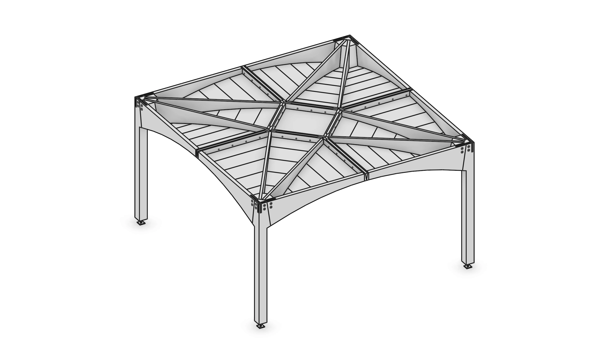

A guide makes a floor (`examples/templates_floor_7_contacts_cantilevers.cpp`):

```cpp
const wood_floor::FloorGuide guide({
    Point(-3000.0, -3000.0, 0.0),
    Point(3000.0, -3000.0, 0.0),
    Point(3000.0, 3000.0, 0.0),
    Point(-3000.0, 3000.0, 0.0),
});
wood_floor::Floor floor(guide);
```

The constructor is the whole computation, one block per step:

```cpp
    Floor::Floor(const FloorGuide& guide, const std::string& name = "floor")
        : WoodSession(name), guide(guide) {

        add_quarters();                                    // every quarter's members
        add_oculus();                                      // the ring around the hole
        add_columns();                                     // a column at every corner
        const auto contacts = add_contacts();              // where two members touch, per quarter
        const auto connectors = compute_connectors(contacts);
        add_connectors(connectors, contacts);              // a connector per contact
        const auto screws = compute_screws();
        add_screws(screws);                                // the assembly screws
    }
```

<details>
<summary><b>Tables</b></summary>

Floor keeps only its guide; every element is in the session, grouped by the tree and found by name (`get_element_by_name`, `get_elements_numbered`).

```
floor
├── quarter_0                      quarter_1 .. quarter_3 alike
│   ├── beds_0
│   │   └── beds_<row>_0           Plate beds_<row>_<i>_0, three rows
│   ├── tsections_0                Plate tsections_<i>_0, six
│   ├── outer_ribs_0               BeamVariable outer_ribs_<i>_0, two
│   ├── inner_ribs_0               BeamVariable inner_ribs_<i>_0, two
│   ├── wedges_0                   Plate wedges_<i>_0, the three column blocks
│   ├── inner_beams_0              BeamVariable inner_beams_<i>_0: seam 0, the oculus edge, seam 1
│   ├── column_0                   Column column_0 on Support support_0
│   └── connectors_0               JointBeam connector_<kind>_<n>, connector_cross_lap_<n>, connector_screws_<n>
└── oculus
    ├── ring_beams                 BeamVariable oculus_<q>, four
    ├── bottom_wedges              Plate oculus_<4 + q>, under ring beam q, four
    ├── central_plate              Plate oculus_8
    └── connectors                 JointBeam connector_oculus_wedge_<n>, four
```

Each quarter's contacts, connectors and screws are fixed arrays, so every count is in the type:

```cpp
/// A contact the floor's design puts between two members.
///
/// - `a`: the source member.
/// - `b`: the target member, which hosts the contact.
/// - `face`: the face they share, stored as their interaction.
struct Contact {
    std::shared_ptr<Element> a; // The source member.
    std::shared_ptr<Element> b; // The target member, which hosts the contact.
    std::shared_ptr<InteractionContactFace> face; // The face they share, stored as their interaction.
};

/// The contacts of one quarter, by the connector each gets.
///
/// - `seam_wedge`: seam beam 0 beside the next quarter's seam beam 1.
/// - `oculus_wedge`: the oculus beam on its ring beam.
/// - `column_plates[2]`: the column against outer rib k.
/// - `block_dowels[3][2]`: column block b against the rib on its side 0 or 1.
struct QuarterContacts {
    Contact seam_wedge; // Seam beam 0 beside the next quarter's seam beam 1: a wedge.
    Contact oculus_wedge; // The oculus beam's back face on its ring beam: a wedge.
    std::array<Contact, 2> column_plates; // The column against outer rib k: a rectangle plate.
    std::array<std::array<Contact, 2>, 3> block_dowels; // Column block b against the rib either side: dowels.
};

/// The connectors of one quarter, every one built from its contact before any is added.
///
/// - `seam_wedge`, `oculus_wedge`: a wedge each.
/// - `column_plates[2]`: a plate into outer rib k.
/// - `cross_lap`: the slots where the two plates cross.
/// - `block_dowels[3][2]`: dowels per block and side.
struct QuarterConnectors {
    std::shared_ptr<JointBeam> seam_wedge; // connector_seam_wedge_<n>.
    std::shared_ptr<JointBeam> oculus_wedge; // connector_oculus_wedge_<n>.
    std::array<std::shared_ptr<JointBeam>, 2> column_plates; // connector_column_plate_<n>, one per outer rib.
    std::shared_ptr<JointBeam> cross_lap; // connector_cross_lap_<n>, where the two column plates cross.
    std::array<std::array<std::shared_ptr<JointBeam>, 2>, 3> block_dowels; // connector_block_dowels_<n>, per block and side.
};

/// The assembly screws of one quarter, one screw connector per joint and side k = 0, 1, named by the member that butts, then the one it butts into.
///
/// - `outer_rib_seam_beam[2]`: outer rib k into the seam beam it ends on.
/// - `seam_beam_oculus_beam[2]`: seam beam k into the oculus beam.
/// - `oculus_beam_inner_rib[2]`: the oculus beam into inner rib k, through the seam beam when the screws pass it.
struct QuarterScrews {
    std::array<std::shared_ptr<JointBeam>, 2> outer_rib_seam_beam; // Each outer rib into the seam beam it ends on.
    std::array<std::shared_ptr<JointBeam>, 2> seam_beam_oculus_beam; // Each seam beam into the oculus beam ending on it.
    std::array<std::shared_ptr<JointBeam>, 2> oculus_beam_inner_rib; // The oculus beam into each inner rib, through the seam beam when the screws pass it.
};
```

</details>

## Parameters

The guide carries every size (@ref templates_floor_guide); the floor adds the screw and connector constants.

```cpp
/// The model of the guide, the session named name: the quarters, the oculus, the columns, their contacts, the connectors and the screws.
explicit Floor(const FloorGuide& guide, const std::string& name = "floor");
```

```cpp
static constexpr double SCREW_LENGTH = 200.0; // mm, every assembly screw.
static constexpr double SCREW_SPACING = 8.0; // mm, the closest two screw axes may come.
static constexpr double RIB_END_MARGIN = 20.0; // mm a seam screw sits below the rib's top and above its bottom at its end when the seam runs through the rib band.
static constexpr double SEAM_SCREW_OFFSET = 15.0; // mm the screws of the two ribs meeting at a seam sit either side of their axes, so their heads on the seam plane stay apart.
static constexpr double CORNER_LEVELS = 7.0; // An oculus corner's depth in sevenths: six levels, one per screw on each side of the corner.
static constexpr std::array<std::array<double, 2>, 2> SEAM_BEAM_OCULUS_BEAM_LEVELS = {{{2.0, 5.0}, {3.0, 6.0}}}; // Per side k, the levels of the two screws of the seam beam into the oculus beam; the two quarters' screws at a seam put their heads on the seam plane at one point, so their levels differ.
static constexpr std::array<double, 2> OCULUS_BEAM_INNER_RIB_LEVELS = {1.0, 4.0}; // The levels of the two screws of the oculus beam into an inner rib, apart from the seam beam's screws they cross at that corner.
static inline const Color CONNECTOR_COLOR = Color(33.0f / 255.0f, 150.0f / 255.0f, 234.0f / 255.0f, 1.0f, "brg_blue"); // Every connector node and every part and dowel node under it: the Block Research Group's primary blue.
```

At a seam, each rib's screws sit `SEAM_SCREW_OFFSET` off its axis, the two ribs on opposite sides, and run `SCREW_LENGTH` from the beam's seam face.

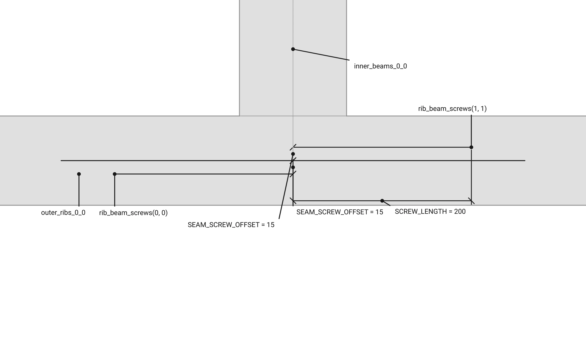

At the rib end, one screw `RIB_END_MARGIN` below the rib top and one above the end's bottom, `end_level`.

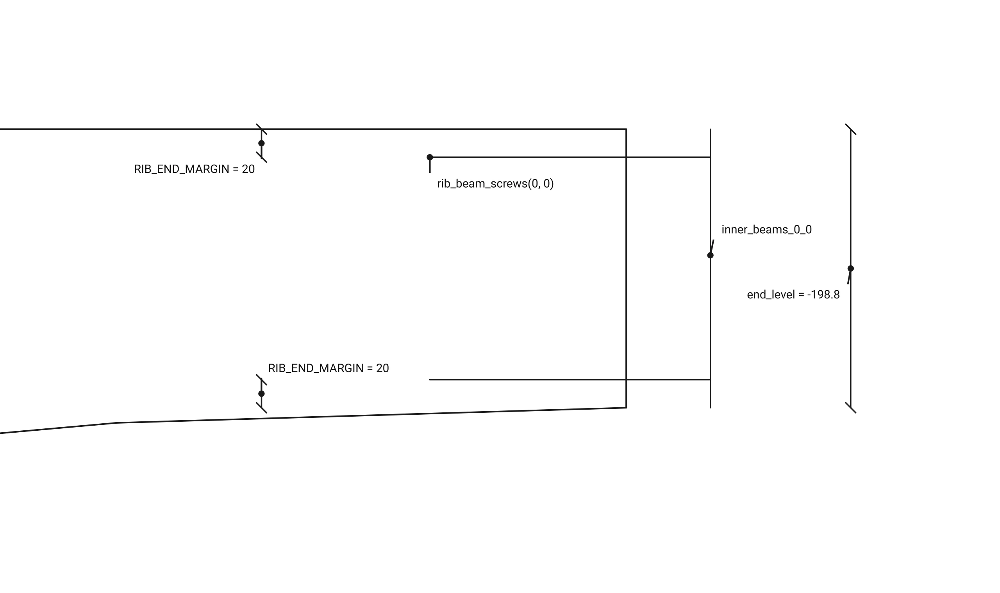

At an oculus corner, `static_h` in `CORNER_LEVELS` sevenths: `SEAM_BEAM_OCULUS_BEAM_LEVELS` and `OCULUS_BEAM_INNER_RIB_LEVELS` give every screw its own level.

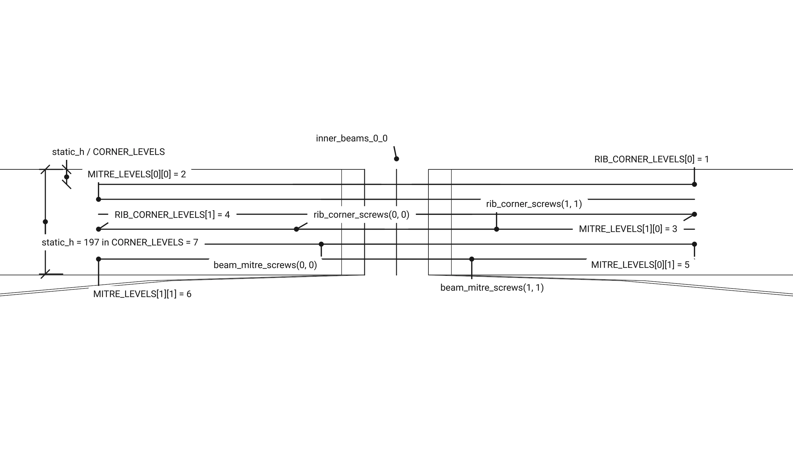

`compute_connectors`: a wedge stops `1.5 * size` short of its contact's top edge, `size` the thicker member.

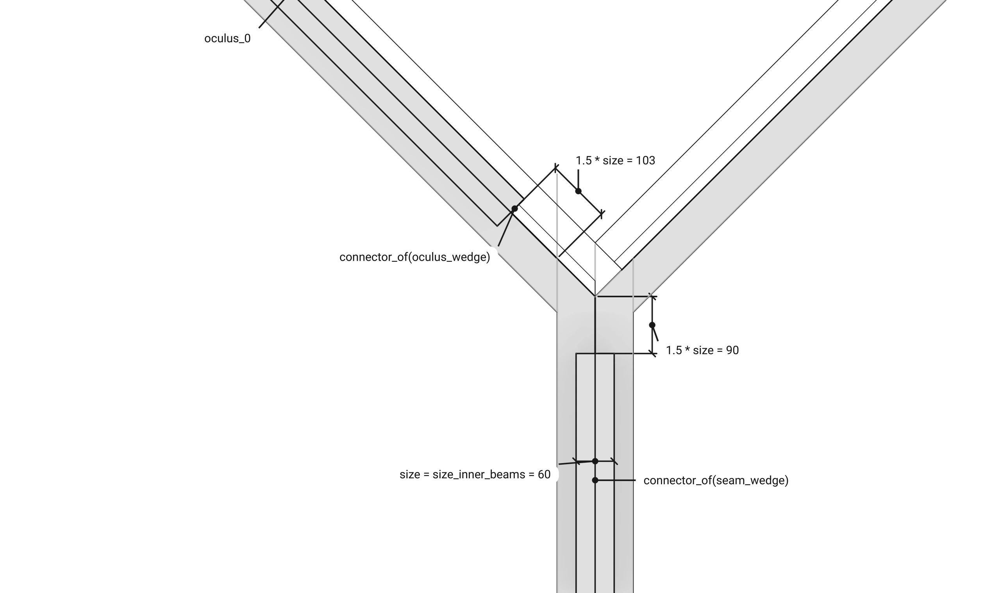

The wedge end on: `WEDGE_PROFILE` between the two beams, a pocket `2 * size / 3` deep under each slanted face.

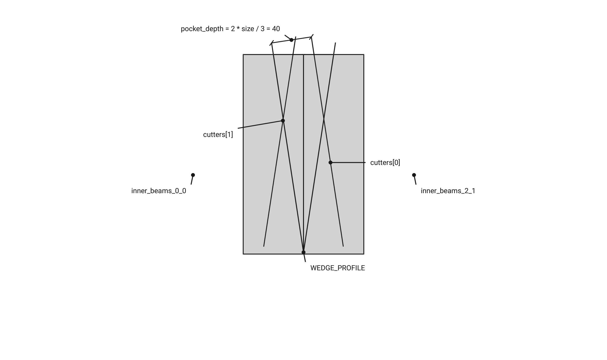

A column plate's dowels are `size_outer_ribs` long, through the rib; the two plates of a corner cross in their `cross_lap`.

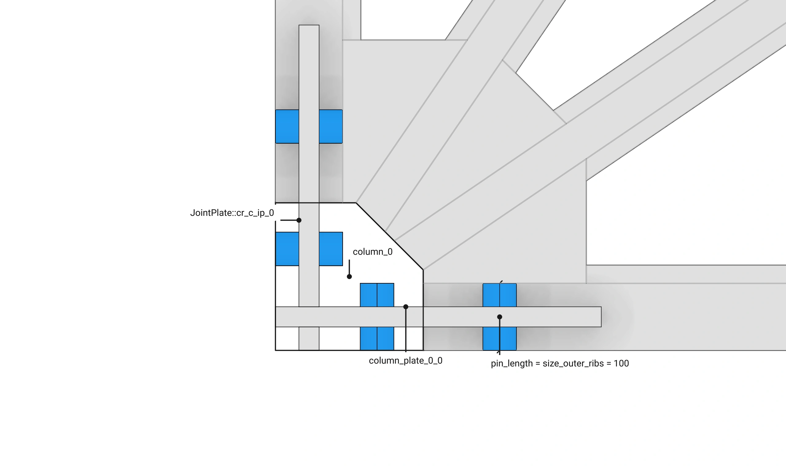

## The constructor, step by step

One section per constructor block, in order.

<details open>
<summary><b>Quarters</b></summary>

The guide's face loops of every quarter become elements at `bay_height`: ribs and inner beams variable beams, the rest plates.

```cpp
// quarters: every quarter's members, lifted to bay_height and grouped by family
add_quarters();
```

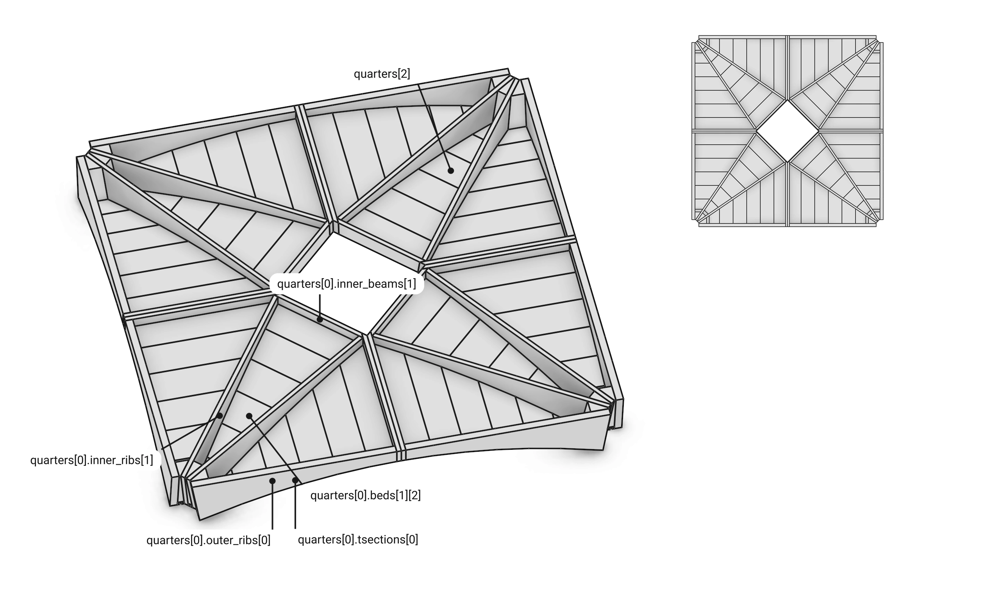

<details>
<summary>add_quarters()</summary>

```cpp
void Floor::add_quarters() {

    const Xform lift = Xform::translation(0.0, 0.0, guide.bay_height);

    for (size_t q = 0; q < 4; q++) {
        const std::shared_ptr<TreeNode> group = quarter_group(q);

        // beds: Plate, three rows of plates between the bed rails, beds_<row>_<i>_<q> under beds_<row>_<q>
        const std::shared_ptr<TreeNode> beds = add_group(fmt::format("beds_{}", q), group);
        const std::array<std::array<std::array<Polyline, 2>, 2>, 3>& rows = guide.bed_rails(q);

        for (size_t row = 0; row < rows.size(); row++) {
            const std::shared_ptr<TreeNode> node = add_group(fmt::format("beds_{}_{}", row, q), beds);
            const std::vector<std::shared_ptr<Plate>> plates = Plate::row_between(rows[row][0], rows[row][1]);

            for (size_t i = 0; i < plates.size(); i++) {
                plates[i]->name = fmt::format("beds_{}_{}_{}", row, i, q);
                plates[i]->place(lift);
                add(plates[i], node);
            }
        }

        // tsections: Plate, the flanges beside the ribs, tsections_<i>_<q>
        const std::shared_ptr<TreeNode> tsections = add_group(fmt::format("tsections_{}", q), group);
        const std::array<std::array<Polyline, 2>, 6>& tsection_loops = guide.tsections(q);

        for (size_t i = 0; i < tsection_loops.size(); i++) {
            const std::shared_ptr<Plate> tsection = std::make_shared<Plate>(tsection_loops[i][1], tsection_loops[i][0], fmt::format("tsections_{}_{}", i, q));
            tsection->place(lift);
            add(tsection, tsections);
        }

        // outer_ribs: BeamVariable, the two ribs along the bay edges, outer_ribs_<i>_<q>
        const std::shared_ptr<TreeNode> outer = add_group(fmt::format("outer_ribs_{}", q), group);
        const std::array<std::array<Polyline, 2>, 2>& outer_loops = guide.outer_ribs(q);

        for (size_t i = 0; i < outer_loops.size(); i++) {
            const std::shared_ptr<BeamVariable> outer_rib = rib(outer_loops[i], fmt::format("outer_ribs_{}_{}", i, q));
            outer_rib->place(lift);
            add(outer_rib, outer);
        }

        // inner_ribs: BeamVariable, the two ribs from the column head to the inner beam corners, inner_ribs_<i>_<q>
        const std::shared_ptr<TreeNode> inner = add_group(fmt::format("inner_ribs_{}", q), group);
        const std::array<std::array<Polyline, 2>, 2>& inner_loops = guide.inner_ribs(q);

        for (size_t i = 0; i < inner_loops.size(); i++) {
            const std::shared_ptr<BeamVariable> inner_rib = rib(inner_loops[i], fmt::format("inner_ribs_{}_{}", i, q));
            inner_rib->place(lift);
            add(inner_rib, inner);
        }

        // wedges: Plate, the three column blocks of the column head fan, wedges_<i>_<q>
        const std::shared_ptr<TreeNode> wedges = add_group(fmt::format("wedges_{}", q), group);
        const std::array<std::array<Polyline, 2>, 3>& block_loops = guide.wedges(q);

        for (size_t i = 0; i < block_loops.size(); i++) {
            const std::shared_ptr<Plate> block = std::make_shared<Plate>(block_loops[i][1], block_loops[i][0], fmt::format("wedges_{}_{}", i, q));
            block->place(lift);
            add(block, wedges);
        }

        // inner_beams: BeamVariable, seam beam 0, the beam along the oculus edge and seam beam 1, inner_beams_<i>_<q>
        const std::shared_ptr<TreeNode> beams = add_group(fmt::format("inner_beams_{}", q), group);
        const std::array<std::array<Polyline, 2>, 3>& beam_loops = guide.inner_beams(q);

        for (size_t i = 0; i < beam_loops.size(); i++) {
            const std::shared_ptr<BeamVariable> inner_beam = beam(
                beam_loops[i],
                {0, 3},
                {1, 2},
                fmt::format("inner_beams_{}_{}", i, q)
            );
            inner_beam->place(lift);
            add(inner_beam, beams);
        }
    }
}
```

</details>

<details>
<summary>rib: a variable beam, one section per soffit point</summary>

```cpp
std::shared_ptr<BeamVariable> Floor::rib(const std::array<Polyline, 2>& loops, const std::string& name) {

    const std::vector<Point> near = loops[0].get_points();
    const std::vector<Point> far = loops[1].get_points();
    const size_t stations = near.size() - 3;
    std::vector<Polyline> sections;

    for (size_t i = 0; i < stations; i++) {
        const Point& low = near[2 + i];
        const Point& far_low = far[2 + i];
        Point high(low[0], low[1], 0.0);
        Point far_high(far_low[0], far_low[1], 0.0);

        if (i == 0) {
            high = near[1];
            far_high = far[1];
        } else if (i + 1 == stations) {
            high = near[0];
            far_high = far[0];
        }

        sections.push_back(Polyline({low, high, far_high, far_low}).closed());
    }

    const Point start = Point::mid_point(near[1], far[1]);
    const Point end = Point::mid_point(near[0], far[0]);
    const Line axis = Line::from_points(start, end);

    return std::make_shared<BeamVariable>(axis, sections, name);
}
```

Each soffit point `low` and its `far_low` on the second loop, with their top corners, make one section; the end sections take the loops' own top corners, so they lie in the end planes.

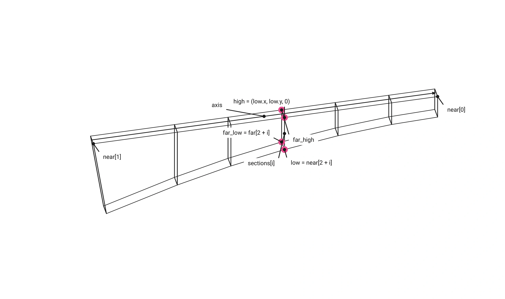

</details>

<details>
<summary>beam: a variable beam between its end sections</summary>

```cpp
std::shared_ptr<BeamVariable> Floor::beam(
    const std::array<Polyline, 2>& loops,
    const std::array<size_t, 2>& start,
    const std::array<size_t, 2>& end,
    const std::string& name
) {

    const std::vector<Point> near = loops[0].get_points();
    const std::vector<Point> far = loops[1].get_points();
    const Polyline first = Polyline({near[start[0]], near[start[1]], far[start[1]], far[start[0]]}).closed();
    const Polyline last = Polyline({near[end[0]], near[end[1]], far[end[1]], far[end[0]]}).closed();

    return BeamVariable::between(first, last, name);
}
```

The section over corners `start` and over corners `end`, both loops; `BeamVariable::between` runs the axis between their centroids.

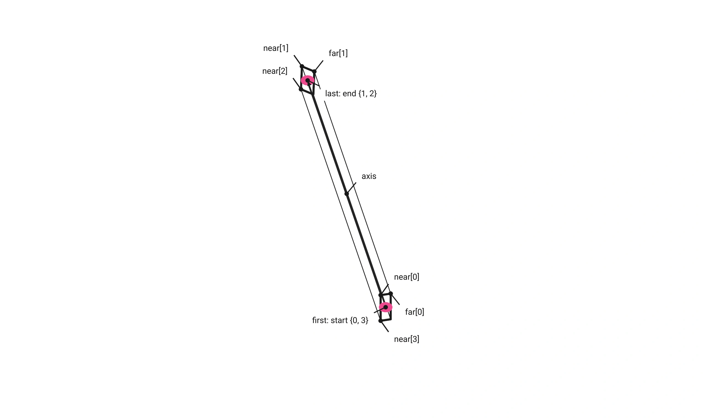

</details>

</details>

<details>
<summary><b>Oculus</b></summary>

The four ring beams, the four oculus beams on the oculus edges, the four bottom wedges and the central plate.

```cpp
// oculus: the four ring beams, the oculus beams, the bottom wedges and the central plate
add_oculus();
```

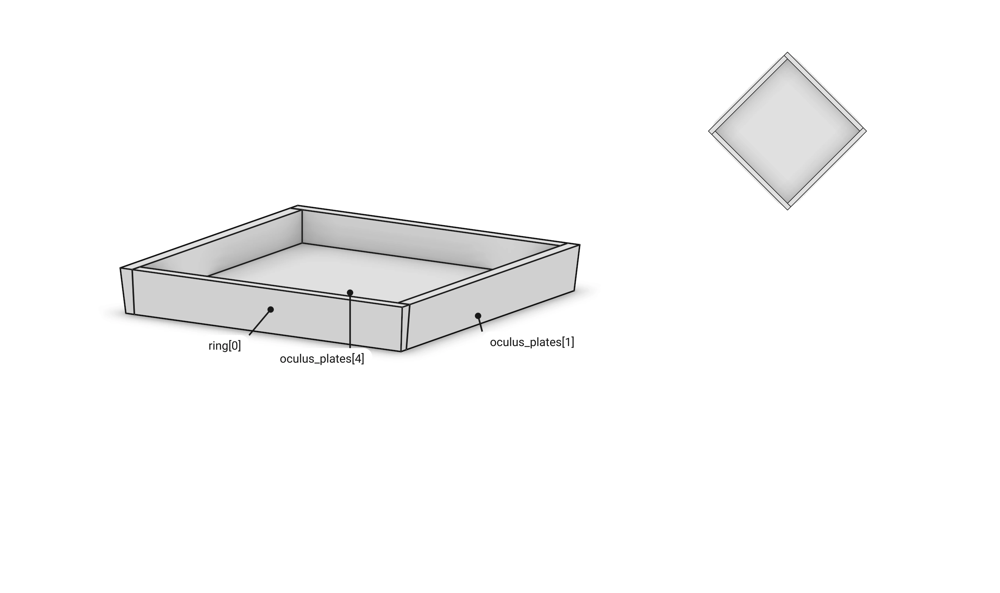

<details>
<summary>add_oculus()</summary>

```cpp
void Floor::add_oculus() {

    const Xform lift = Xform::translation(0.0, 0.0, guide.bay_height);
    const std::array<std::array<Polyline, 2>, 9>& loops = guide.oculus();
    const std::shared_ptr<TreeNode> group = group_named("oculus");

    // ring_beams: BeamVariable, the four ring beams, oculus_<q>
    const std::shared_ptr<TreeNode> ring_beams = add_group("ring_beams", group);

    for (size_t q = 0; q < 4; q++) {
        const std::shared_ptr<BeamVariable> ring_beam = beam(
            loops[q],
            {1, 0},
            {2, 3},
            fmt::format("oculus_{}", q)
        );
        ring_beam->place(lift);
        add(ring_beam, ring_beams);
    }

    // bottom_wedges: Plate, the plate under ring beam q, oculus_<4 + q>
    const std::shared_ptr<TreeNode> bottom_wedges = add_group("bottom_wedges", group);

    for (size_t q = 0; q < 4; q++) {
        const std::shared_ptr<Plate> bottom_wedge = std::make_shared<Plate>(loops[4 + q][1], loops[4 + q][0], fmt::format("oculus_{}", 4 + q));
        bottom_wedge->place(lift);
        add(bottom_wedge, bottom_wedges);
    }

    // central_plate: Plate, oculus_8
    const std::shared_ptr<TreeNode> central_plate = add_group("central_plate", group);
    const std::shared_ptr<Plate> plate = std::make_shared<Plate>(loops[8][1], loops[8][0], "oculus_8");
    plate->place(lift);
    add(plate, central_plate);
}
```

</details>

</details>

<details>
<summary><b>Columns</b></summary>

A column on its support at every corner, its head glued on and carved by the guide's six cutters.

```cpp
// columns: the column at every corner, its head carved by the guide's cutters
add_columns();
```

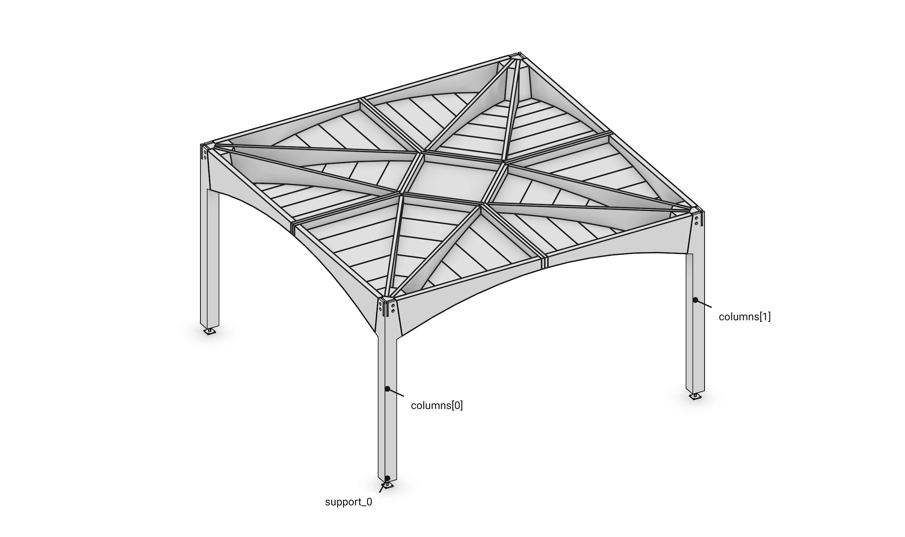

<details>
<summary>add_columns()</summary>

```cpp
void Floor::add_columns() {

    for (size_t q = 0; q < 4; q++)
        add_column(q);
}
```

</details>

<details>
<summary>add_column(corner)</summary>

```cpp
void Floor::add_column(size_t corner) {

    const size_t k = corner % 4;
    const std::shared_ptr<TreeNode> group = group_named(fmt::format("column_{}", k), quarter_group(k));
    graft(column(guide, k), group);
}
```

</details>

<details>
<summary>column(guide, q): the column session</summary>

```cpp
WoodSession column(const FloorGuide& guide, size_t q) {

    const size_t k = q % 4;
    const std::string name = fmt::format("column_{}", k);

    const std::shared_ptr<Support> support = std::make_shared<Support>(guide.support_plane(k), "support");
    support->name = fmt::format("support_{}", k);
    const Line axis = support->column_axis(guide.bay_height);
    const Plane frame = guide.column_frame(k);
    const std::shared_ptr<Column> shaft = Column::square(
        axis,
        frame,
        guide.size_column_head,
        name
    );

    const std::array<std::array<Polyline, 2>, 6>& loops = guide.column_cutters(k);
    std::vector<std::shared_ptr<Plate>> cutters;

    for (size_t i = 0; i < loops.size(); i++) {
        cutters.push_back(std::make_shared<Plate>(loops[i][1], loops[i][0], fmt::format("column_cutters_{}_{}", i, k)));
        cutters.back()->place(Xform::translation(0.0, 0.0, guide.bay_height));
    }

    WoodSession session(name);
    session.add(shaft);

    // the head: blocks glued on as wide as the chamfer reaches, as deep as the carved head
    const double head_width = guide.size_column_head + guide.size_column_head_chamfer;

    for (const std::shared_ptr<Block>& block : shaft->head_blocks(head_width, guide.column_head_depth)) {
        session.add(block);
        const std::shared_ptr<InteractionFeatureSolid> glue = std::make_shared<InteractionFeatureSolid>(block->element_geometry_mesh(), SolidOperation::add);
        session.add_interaction(block, shaft, glue);
    }

    // the support under it, its joint let into the column end and drilled
    session.add(support);
    const std::shared_ptr<Joint> seat = Joint::support(*support, *shaft);
    session.add(seat);
    session.add_interaction(seat, shaft, seat->interaction(0));

    // the six cutters, hidden, take the head's inclined faces away
    for (const std::shared_ptr<Plate>& cutter : cutters) {
        cutter->is_visible = false;
        session.add(cutter);
        const std::shared_ptr<InteractionFeatureSolid> cut = std::make_shared<InteractionFeatureSolid>(cutter->element_geometry_mesh(), SolidOperation::subtract);
        session.add_interaction(cutter, shaft, cut);
    }

    return session;
}
```

The square shaft on the support's axis, the two head blocks glued on to widen the head, and the six cutters that carve it.

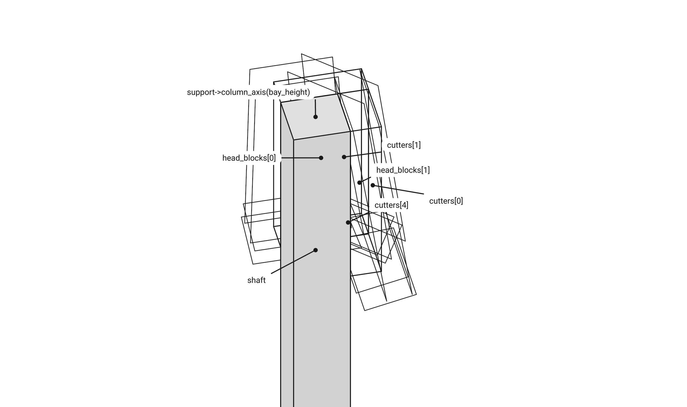

</details>

</details>

<details>
<summary><b>Contacts</b></summary>

The face every two members the design joins share, stored as a named contact interaction.

```cpp
// contacts: per quarter an interaction between every two members that touch, named by its kind and place
const std::array<QuarterContacts, 4> contacts = add_contacts();
```

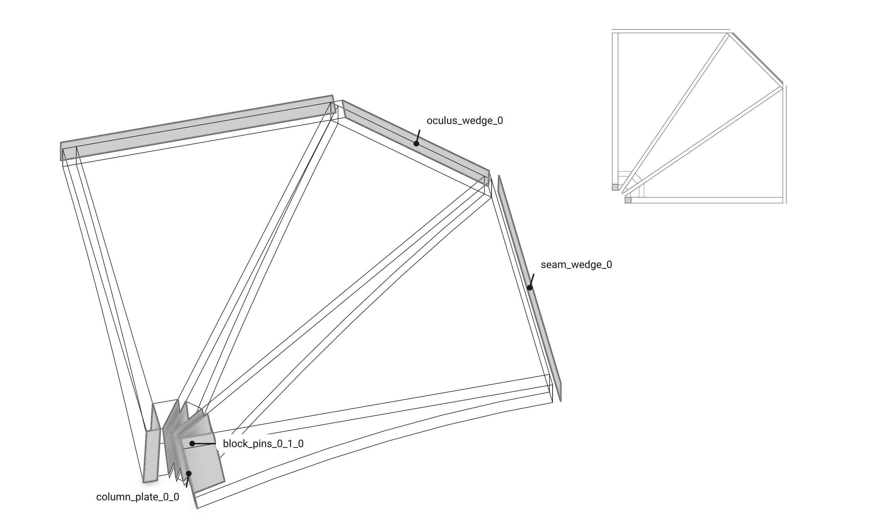

<details>
<summary>add_contacts()</summary>

```cpp
std::array<QuarterContacts, 4> Floor::add_contacts() {

    std::array<QuarterContacts, 4> contacts;

    for (size_t q = 0; q < 4; q++) {
        const size_t next = (q + 1) % 4;

        // seam: this quarter's seam beam 0 beside the next quarter's seam beam 1
        const Contact seam = add_contact(fmt::format("seam_wedge_{}", q), fmt::format("inner_beams_0_{}", q), fmt::format("inner_beams_2_{}", next));
        contacts[q].seam_wedge = seam;

        // oculus: the oculus beam's back face on its ring beam
        const Contact oculus = add_contact(fmt::format("oculus_wedge_{}", q), fmt::format("inner_beams_1_{}", q), fmt::format("oculus_{}", q));
        contacts[q].oculus_wedge = oculus;

        // column head: the column against each of its two outer ribs
        for (size_t k = 0; k < 2; k++) {
            const Contact plate = add_contact(fmt::format("column_plate_{}_{}", q, k), fmt::format("column_{}", q), fmt::format("outer_ribs_{}_{}", k, q));
            contacts[q].column_plates[k] = plate;
        }

        // column blocks: outer_rib 0 | block 0 | inner_rib 0 | block 1 | inner_rib 1 | block 2 | outer_rib 1, each block on the rib either side
        const std::array<std::string, 4> ribs = {fmt::format("outer_ribs_0_{}", q), fmt::format("inner_ribs_0_{}", q), fmt::format("inner_ribs_1_{}", q), fmt::format("outer_ribs_1_{}", q)};

        for (size_t b = 0; b < 3; b++)
            for (size_t side = 0; side < 2; side++) {
                const Contact dowels = add_contact(fmt::format("block_dowels_{}_{}_{}", q, b, side), ribs[b + side], fmt::format("wedges_{}_{}", b, q));
                contacts[q].block_dowels[b][side] = dowels;
            }
    }

    return contacts;
}
```

</details>

<details>
<summary>add_contact(name, a_name, b_name)</summary>

```cpp
Contact Floor::add_contact(const std::string& name, const std::string& a_name, const std::string& b_name) {

    const std::shared_ptr<Element> a = get_element_by_name<Element>(a_name);
    const std::shared_ptr<Element> b = get_element_by_name<Element>(b_name);
    const std::shared_ptr<InteractionContactFace> face = compute_face_contact(a, b);

    if (!face)
        throw std::runtime_error(fmt::format("no contact {} between {} and {}", name, a_name, b_name));

    face->name = name;
    add_interaction(a, b, face);

    return {a, b, face};
}
```

The face polygon `compute_face_contact` finds between the two seam beams, stored on their edge as `seam_wedge_0`.

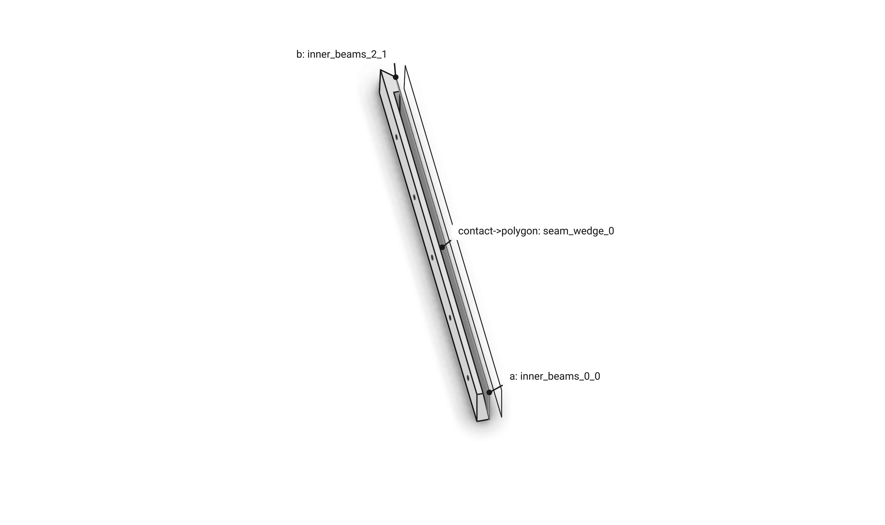

</details>

</details>

<details>
<summary><b>Connectors</b></summary>

A connector is an element of its own, a `JointBeam`, built on one contact between two members, `a` and `b`. It holds three things: its own solids, the pockets it cuts into each member, and its dowels.

```cpp
std::vector<std::array<Polyline, 2>> parts;                // its own solids, blue in the viewer
std::vector<std::vector<std::array<Polyline, 2>>> cutters; // per member, the pockets it cuts
std::vector<Line> drill_lines;                             // its dowels, drilled through every member
```

`compute_connectors` builds every one from the contacts before any is added, so each sees uncut members. `add_connectors` then adds each and puts it on its two members, `add(connector, group)` and `add_interaction(connector, member, connector->interaction(i))`, which cuts the pockets and drills the holes.

```cpp
// connectors: per quarter its wedges, column plates with their cross lap and dowels, all built on uncut members
const std::array<QuarterConnectors, 4> connectors = compute_connectors(contacts);
add_connectors(connectors, contacts);
```

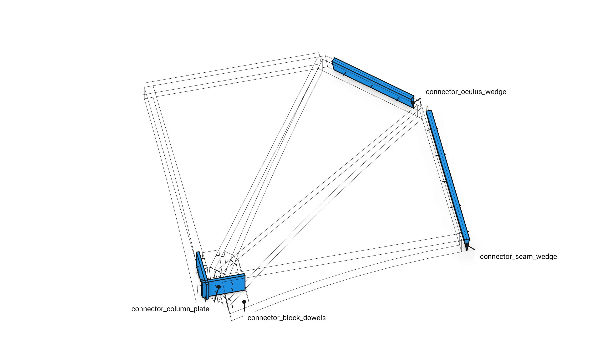

<details>
<summary>Seam wedge: a wedge sunk into two beams side by side</summary>

```cpp
connectors[q].seam_wedge = JointBeam::wedge(*c.seam_wedge.a, *c.seam_wedge.b, *c.seam_wedge.face, 1.5 * beam, 2.0 * beam / 3.0, outer_face);
```

It starts from the contact: the face the two seam beams share. Seen along the seam from the oculus end.

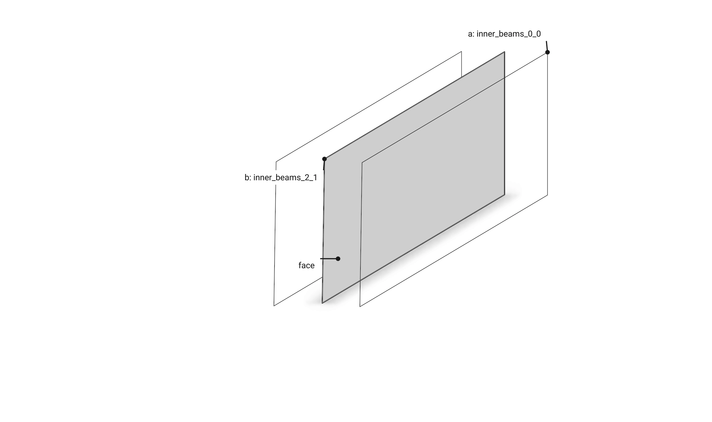

The part: one solid along the contact's top edge, a V in section, half in each beam; it stops `1.5 * size` short of the oculus end.

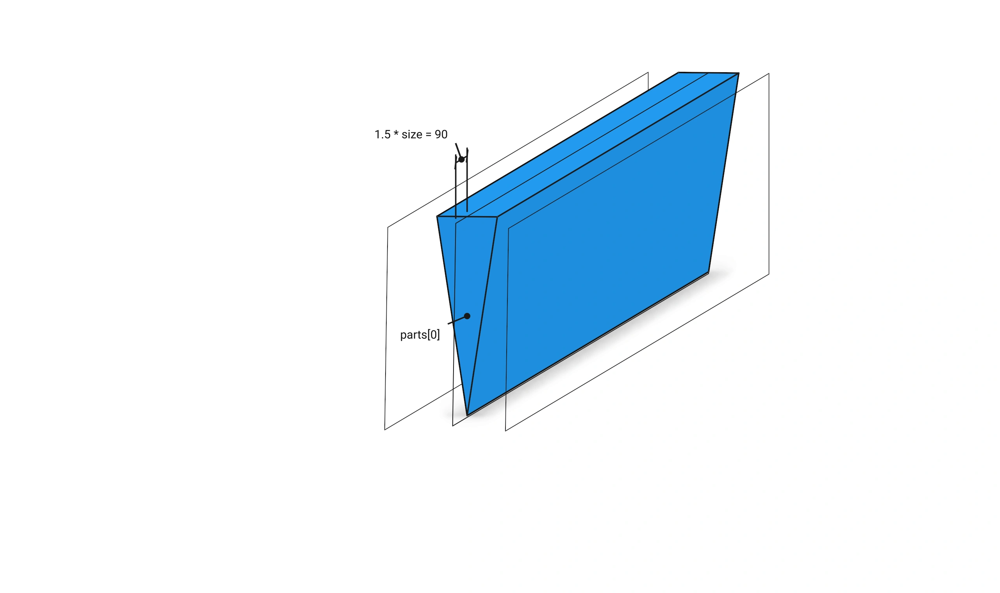

At the bay's outer face it runs flush.

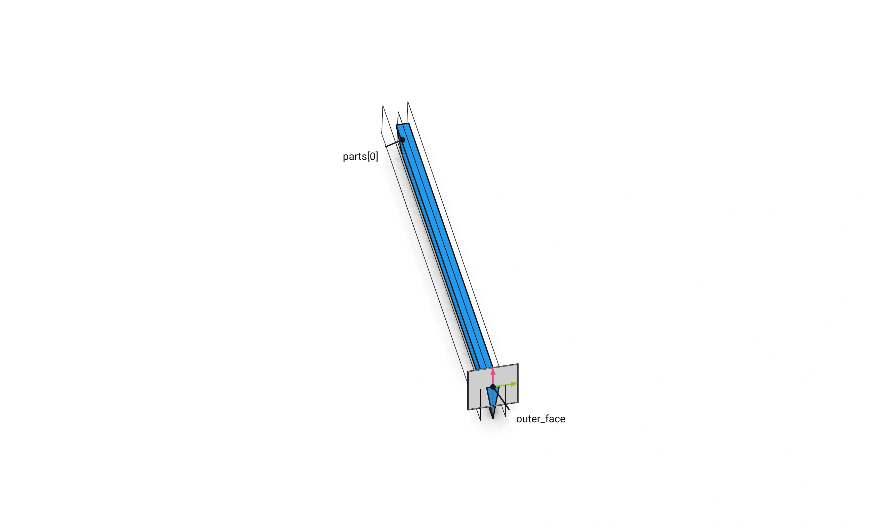

The dowels: across the contact, through the wedge into both beams.

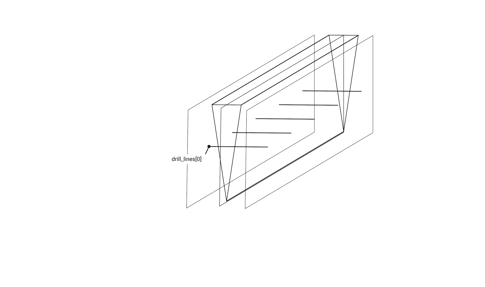

Added, it cuts its pocket, half into each beam, and drills a hole per dowel.

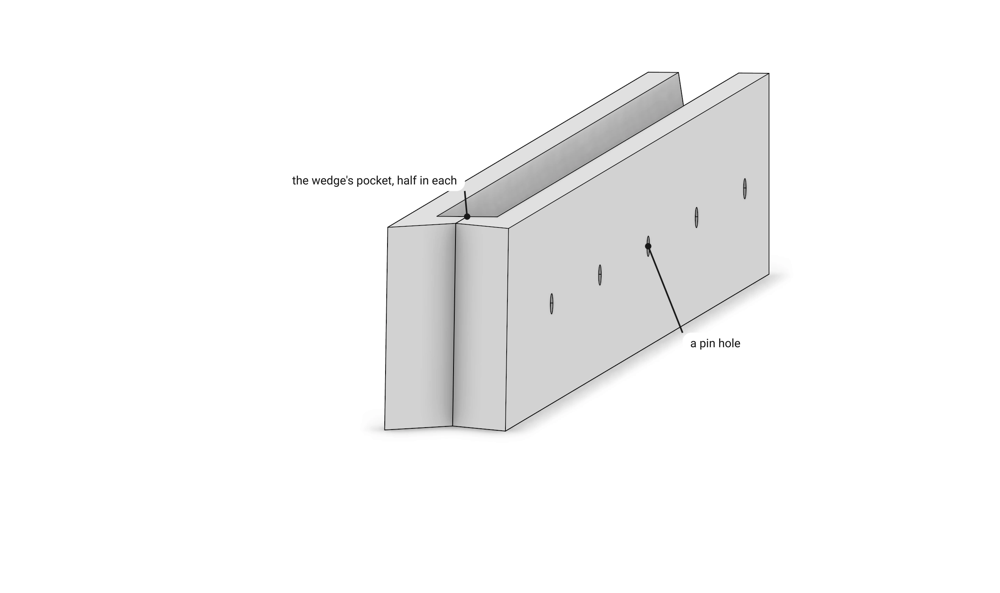

</details>

<details>
<summary>Oculus wedge: the same between the oculus beam and its ring beam</summary>

```cpp
connectors[q].oculus_wedge = JointBeam::wedge(*c.oculus_wedge.a, *c.oculus_wedge.b, *c.oculus_wedge.face, 1.5 * thicker, 2.0 * thicker / 3.0);
```

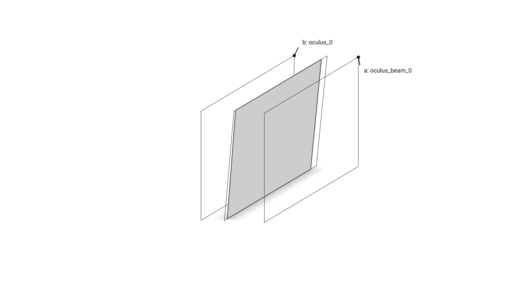

No end plane, so it stops `1.5 * size` short at both ends; `size` is the thicker of the two beams.

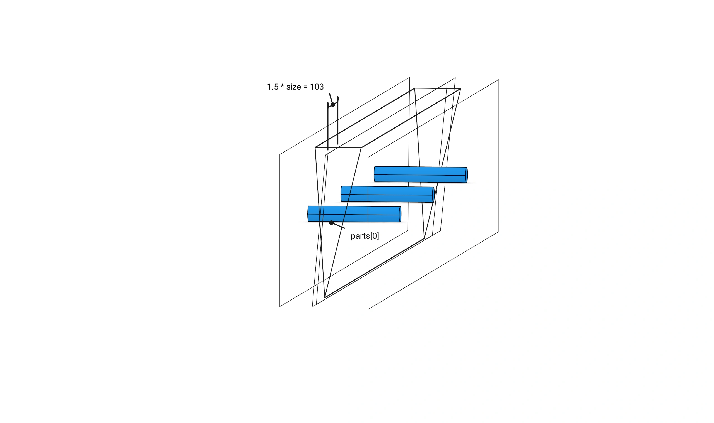

</details>

<details>
<summary>Column plates: a plate from the column into each outer rib, crossing in the head</summary>

```cpp
connectors[q].column_plates[k] = JointBeam::rectangle_plate(*c.column_plates[k].a, *c.column_plates[k].b, *c.column_plates[k].face, guide.size_outer_ribs);
connectors[q].cross_lap = JointBeam::cross_lap(*connectors[q].column_plates[0], *connectors[q].column_plates[1]);
```

The contact between the column head and the outer rib.

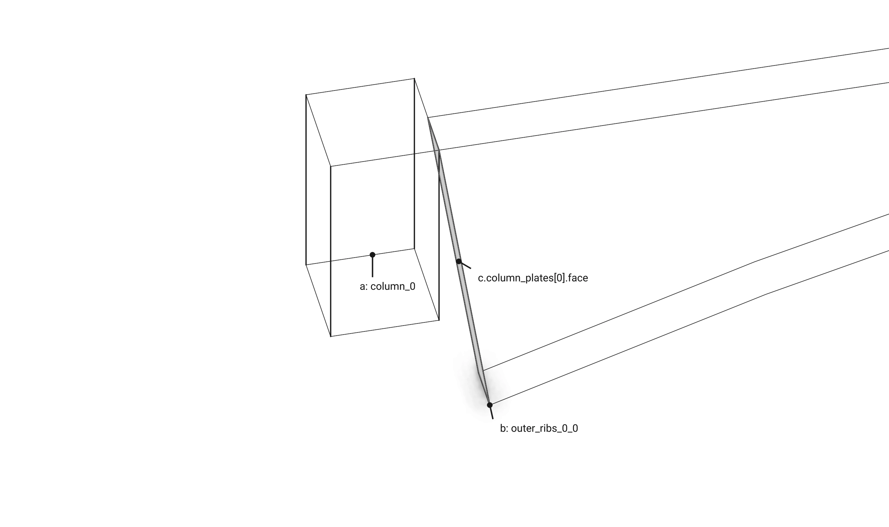

A plate along the contact's normal, into both, with four dowels as long as the rib is thick.

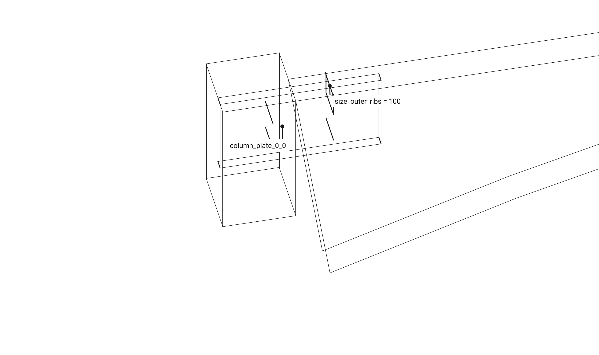

The rib after it: the plate's slot and the dowel holes.

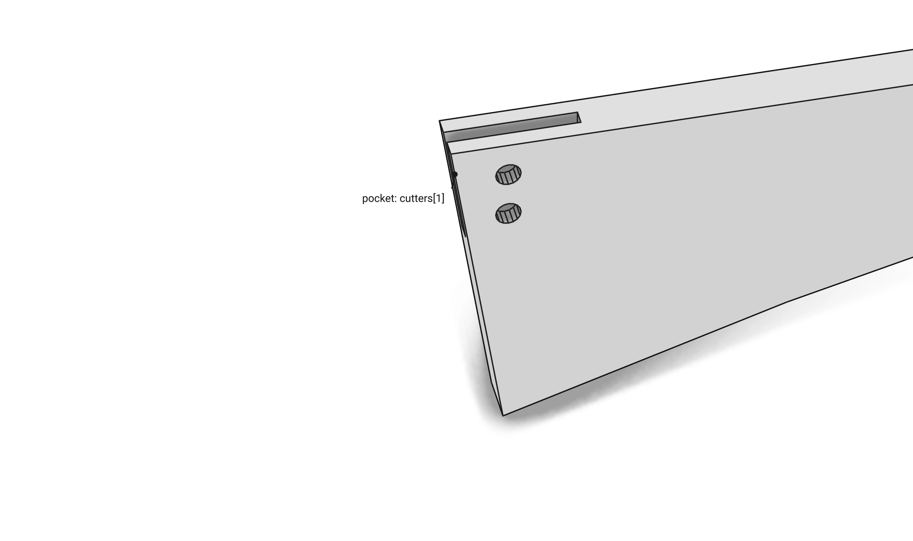

The corner's two plates cross inside the head.

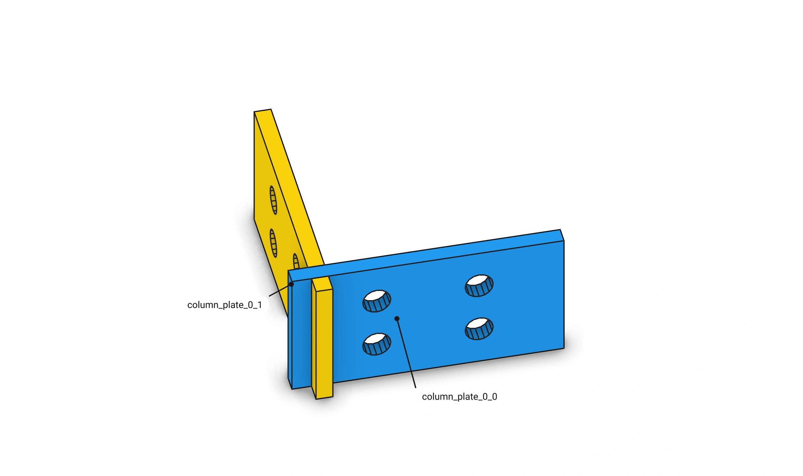

So `cross_lap` cuts a slot in each: the first from half their height up, the second from the bottom up to there.

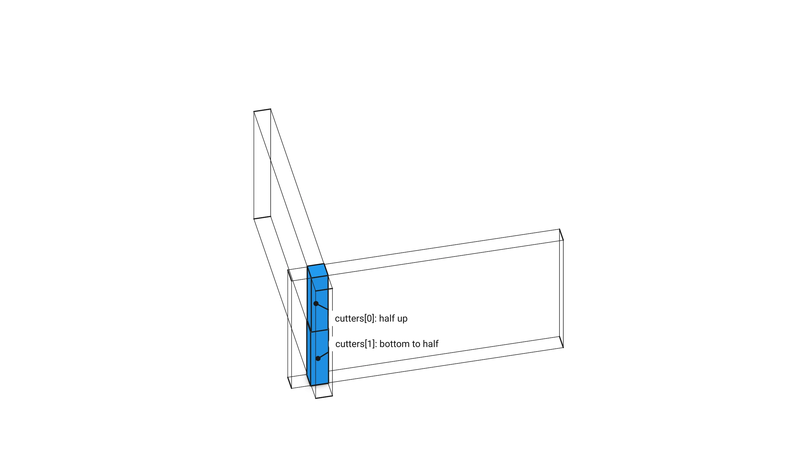

</details>

<details>
<summary>Block dowels: dowels only, no part</summary>

```cpp
const std::shared_ptr<JointBeam> dowels = JointBeam::dowels(*contact.a, *contact.b, *contact.face);
```

A column block against the rib beside it.

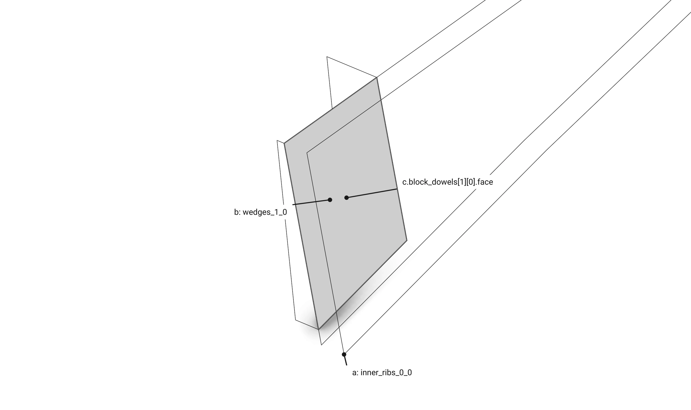

Four dowels at the corners of the contact inset by 50, half into each.

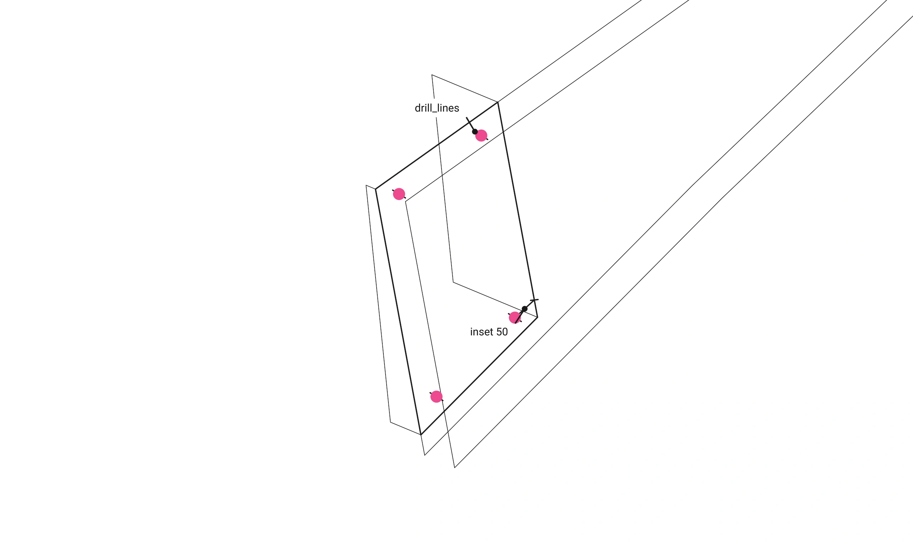

</details>

<details>
<summary>compute_connectors(contacts)</summary>

```cpp
std::array<QuarterConnectors, 4> Floor::compute_connectors(const std::array<QuarterContacts, 4>& contacts) const {

    std::array<QuarterConnectors, 4> connectors;
    const Xform lift = Xform::translation(0.0, 0.0, guide.bay_height);

    for (size_t q = 0; q < 4; q++) {
        const QuarterContacts& c = contacts[q];
        QuarterConnectors& made = connectors[q];

        // seam wedge: sized by the inner beams, running on to the bay's outer face
        const Contact& seam = c.seam_wedge;
        const double beam = guide.size_inner_beams;
        const Plane outer_face = guide.construction_planes(q).outer_ribs[0][0].transformed(lift);
        made.seam_wedge = JointBeam::wedge(
            *seam.a,
            *seam.b,
            *seam.face,
            1.5 * beam,
            2.0 * beam / 3.0,
            outer_face
        );

        // oculus wedge: sized by the thicker of the oculus beam and its ring beam
        const Contact& oculus = c.oculus_wedge;
        const double oculus_beam = FloorGuide::thickness(guide.inner_beams(q)[1]);
        const double ring_beam = FloorGuide::thickness(guide.oculus()[q]);
        const double thicker = std::max(oculus_beam, ring_beam);
        made.oculus_wedge = JointBeam::wedge(
            *oculus.a,
            *oculus.b,
            *oculus.face,
            1.5 * thicker,
            2.0 * thicker / 3.0
        );

        // column plates: a rectangle plate as wide as the outer rib on each, and the cross lap where the two cross
        for (size_t k = 0; k < 2; k++) {
            const Contact& plate = c.column_plates[k];
            made.column_plates[k] = JointBeam::rectangle_plate(
                *plate.a,
                *plate.b,
                *plate.face,
                guide.size_outer_ribs
            );
        }

        made.cross_lap = JointBeam::cross_lap(*made.column_plates[0], *made.column_plates[1]);

        // block dowels: dowels between each column block and the rib either side
        for (size_t b = 0; b < 3; b++)
            for (size_t side = 0; side < 2; side++) {
                const Contact& contact = c.block_dowels[b][side];
                const std::shared_ptr<JointBeam> dowels = JointBeam::dowels(*contact.a, *contact.b, *contact.face);

                if (!dowels)
                    throw std::runtime_error("the inset leaves no room for the dowels of " + contact.face->name);

                made.block_dowels[b][side] = dowels;
            }
    }

    // the names, numbered kind by kind, quarter by quarter, the order they are added in
    for (size_t q = 0; q < 4; q++) {
        QuarterConnectors& made = connectors[q];
        made.seam_wedge->name = fmt::format("connector_seam_wedge_{}", q);
        made.oculus_wedge->name = fmt::format("connector_oculus_wedge_{}", q);
        made.cross_lap->name = fmt::format("connector_cross_lap_{}", q);

        for (size_t k = 0; k < 2; k++)
            made.column_plates[k]->name = fmt::format("connector_column_plate_{}", 2 * q + k);

        for (size_t b = 0; b < 3; b++)
            for (size_t side = 0; side < 2; side++)
                made.block_dowels[b][side]->name = fmt::format("connector_block_dowels_{}", 6 * q + 2 * b + side);
    }

    return connectors;
}
```

</details>

<details>
<summary>add_connectors(connectors, contacts)</summary>

```cpp
void Floor::add_connectors(const std::array<QuarterConnectors, 4>& connectors, const std::array<QuarterContacts, 4>& contacts) {

    // seam wedges: each wedge added, then into the two seam beams it joins
    for (size_t q = 0; q < 4; q++) {
        const std::shared_ptr<JointBeam>& wedge = connectors[q].seam_wedge;
        const Contact& seam = contacts[q].seam_wedge;
        add(wedge, connectors_group(q));
        add_interaction(wedge, seam.a, wedge->interaction(0));
        add_interaction(wedge, seam.b, wedge->interaction(1));
    }

    // oculus wedges: into the oculus beam and its ring beam
    for (size_t q = 0; q < 4; q++) {
        const std::shared_ptr<JointBeam>& wedge = connectors[q].oculus_wedge;
        const Contact& oculus = contacts[q].oculus_wedge;
        add(wedge, group_named("connectors", group_named("oculus")));
        add_interaction(wedge, oculus.a, wedge->interaction(0));
        add_interaction(wedge, oculus.b, wedge->interaction(1));
    }

    // column plates: into the column and the outer rib
    for (size_t q = 0; q < 4; q++)
        for (size_t k = 0; k < 2; k++) {
            const std::shared_ptr<JointBeam>& plate = connectors[q].column_plates[k];
            const Contact& column = contacts[q].column_plates[k];
            add(plate, connectors_group(q));
            add_interaction(plate, column.a, plate->interaction(0));
            add_interaction(plate, column.b, plate->interaction(1));
        }

    // block dowels: into the rib and the column block
    for (size_t q = 0; q < 4; q++)
        for (size_t b = 0; b < 3; b++)
            for (size_t side = 0; side < 2; side++) {
                const std::shared_ptr<JointBeam>& dowels = connectors[q].block_dowels[b][side];
                const Contact& block = contacts[q].block_dowels[b][side];
                add(dowels, connectors_group(q));
                add_interaction(dowels, block.a, dowels->interaction(0));
                add_interaction(dowels, block.b, dowels->interaction(1));
            }

    // cross laps, last: a slot into each of the two column plates they join
    for (size_t q = 0; q < 4; q++) {
        const std::shared_ptr<JointBeam>& lap = connectors[q].cross_lap;
        const std::array<std::shared_ptr<JointBeam>, 2>& plates = connectors[q].column_plates;
        add(lap, connectors_group(q));
        add_interaction(lap, plates[0], lap->interaction(0));
        add_interaction(lap, plates[1], lap->interaction(1));
    }
}
```

</details>

</details>

<details>
<summary><b>Screws</b></summary>

Where one member butts into another, two 200 mm screws hold it: they run along the butting member, their heads on the face they start from. Three such joints per side of a quarter, so twelve screw pairs per quarter; each pair is one pre-drilled screw connector, nothing is cut.

```cpp
// screws: the assembly screws, after every other connector so nothing before them changes
const std::array<QuarterScrews, 4> screws = compute_screws();
add_screws(screws);
```

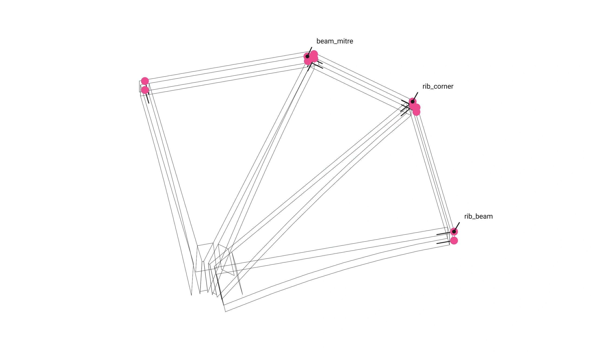

<details>
<summary>outer_rib_seam_beam: an outer rib ends on a seam beam</summary>

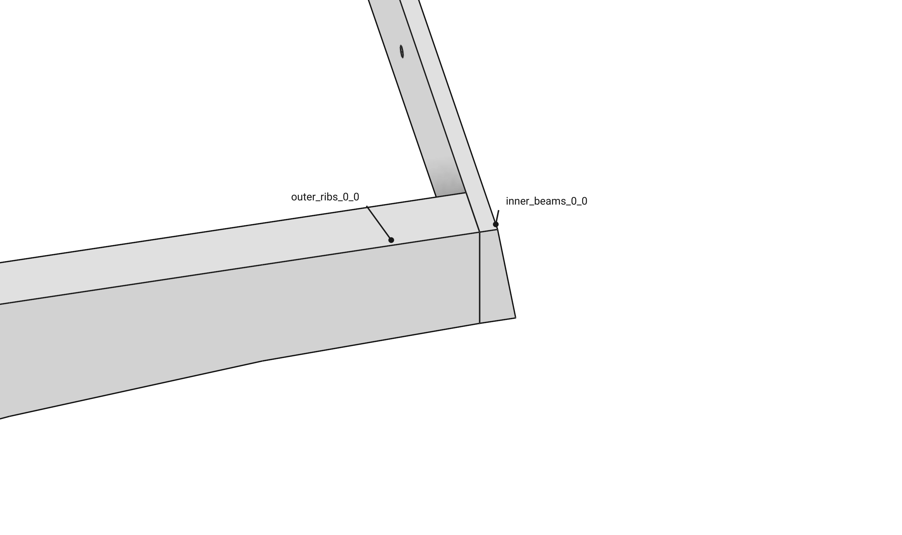

Two screws along the rib from the beam's seam face, 20 below the rib's top and 20 above its bottom, 15 off its axis; the next quarter's rib uses the other side, so the heads on the seam plane stay apart.

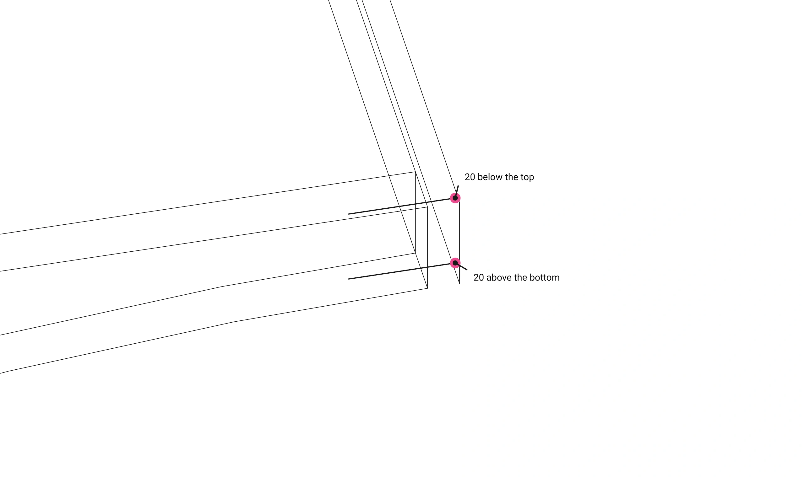

```cpp
std::vector<Line> Floor::outer_rib_seam_beam_screws(size_t q, size_t k) const {

    const ConstructionPlanes& cp = guide.construction_planes(q);
    const Plane& seam_face = cp.inner_beams[SEAM_BEAMS[k]][0];
    const std::array<Polyline, 2>& rib = guide.outer_ribs(q)[k];
    const Point body = FloorGuide::body(rib);
    // the two ribs of a seam on opposite sides of their axes, so the heads on the seam plane stay apart
    const double offset = k == 0 ? -SEAM_SCREW_OFFSET : SEAM_SCREW_OFFSET;
    const double bottom = FloorGuide::end_level(rib, guide.rib_seam_ends(q)[k]);

    return {
        screw(
            cp.outer_ribs[k],
            seam_face,
            body,
            -RIB_END_MARGIN,
            offset
        ),
        screw(
            cp.outer_ribs[k],
            seam_face,
            body,
            bottom + RIB_END_MARGIN,
            offset
        ),
    };
}
```

</details>

<details>
<summary>seam_beam_oculus_beam: a seam beam butts into the oculus beam</summary>

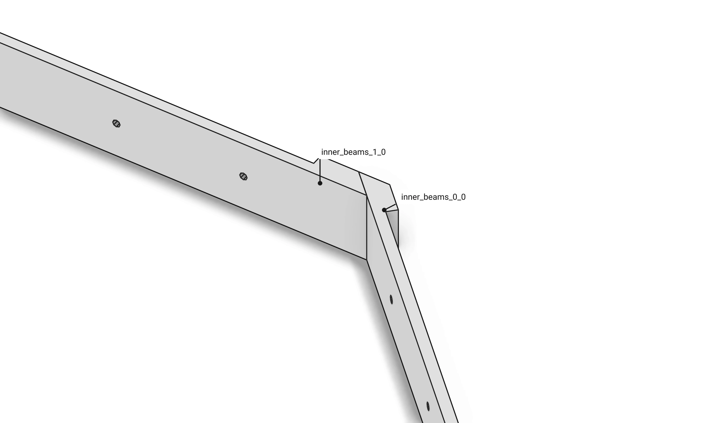

Two screws along the oculus beam, their heads on the seam plane; their levels differ from the next quarter's, `SEAM_BEAM_OCULUS_BEAM_LEVELS`, so the two quarters' screws never meet.

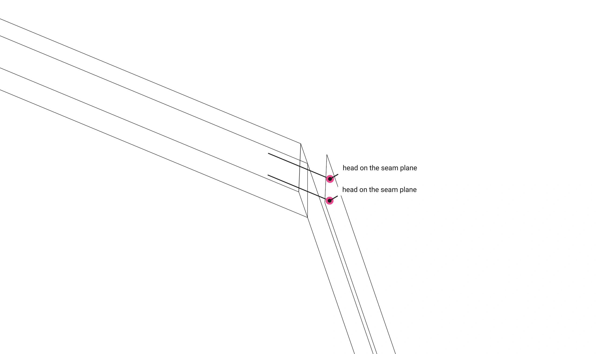

```cpp
std::vector<Line> Floor::seam_beam_oculus_beam_screws(size_t q, size_t k) const {

    const ConstructionPlanes& cp = guide.construction_planes(q);
    const Plane& seam_plane = cp.inner_beams[SEAM_BEAMS[k]][0];
    const Point body = FloorGuide::body(guide.inner_beams(q)[1]);

    return {
        screw(
            cp.inner_beams[1],
            seam_plane,
            body,
            corner_level(SEAM_BEAM_OCULUS_BEAM_LEVELS[k][0])
        ),
        screw(
            cp.inner_beams[1],
            seam_plane,
            body,
            corner_level(SEAM_BEAM_OCULUS_BEAM_LEVELS[k][1])
        ),
    };
}
```

</details>

<details>
<summary>oculus_beam_inner_rib: the oculus beam butts into an inner rib</summary>

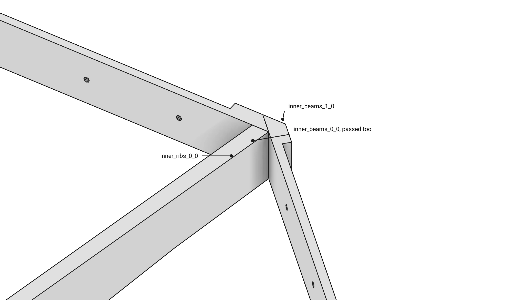

Two screws along the inner rib, their heads on the oculus beam's back face. Near the seam they run through the seam beam's end too, which then is a third member they hold, `passes_seam_beam`; a head closer than 4 mm to the seam plane throws, the bay too narrow.

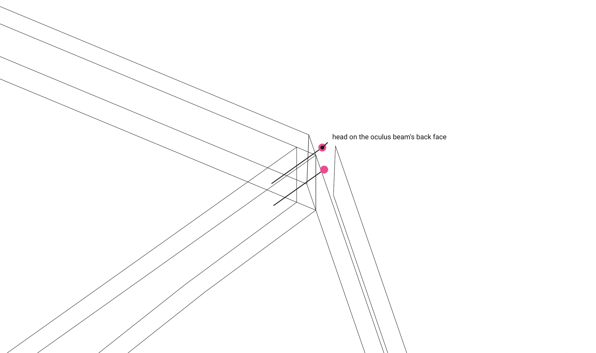

```cpp
std::vector<Line> Floor::oculus_beam_inner_rib_screws(size_t q, size_t k) const {

    const ConstructionPlanes& cp = guide.construction_planes(q);
    const Plane& back_face = cp.inner_beams[1][0];
    const Xform lift = Xform::translation(0.0, 0.0, guide.bay_height);
    const Plane seam_plane = cp.inner_beams[SEAM_BEAMS[k]][0].transformed(lift);
    const Point body = FloorGuide::body(guide.inner_ribs(q)[k]);
    std::vector<Line> screws;

    for (double levels : OCULUS_BEAM_INNER_RIB_LEVELS) {
        screws.push_back(
            screw(
                cp.inner_ribs[k],
                back_face,
                body,
                corner_level(levels)
            )
        );

        // the next quarter's screws meet the seam plane from the other side: a head closer than half the spacing would touch them
        const double from_seam = seam_plane.signed_distance(screws.back().start());

        if (from_seam < 0.5 * SCREW_SPACING)
            throw std::runtime_error(fmt::format("quarter {}'s inner rib {} screw starts {:.3f} mm from the seam plane, less than half the screw spacing, where the next quarter's meets it: the bay is too narrow for the corner screws", q, k, from_seam));
    }

    return screws;
}
```

```cpp
bool Floor::passes_seam_beam(size_t q, size_t k, const std::vector<Line>& screws) const {

    const Xform lift = Xform::translation(0.0, 0.0, guide.bay_height);
    const ConstructionPlanes& cp = guide.construction_planes(q);
    const Plane beam_end = cp.inner_beams[SEAM_BEAMS[k]][1].transformed(lift);
    const Point oculus_beam = FloorGuide::body(guide.inner_beams(q)[1]).transformed(lift);
    const double oculus_side = beam_end.signed_distance(oculus_beam) < 0.0 ? -1.0 : 1.0;

    for (const Line& screw : screws)
        if (oculus_side * beam_end.signed_distance(screw.start()) < 0.0)
            return true;

    return false;
}
```

</details>

<details>
<summary>screw: one screw along a member, from a face</summary>

The member's axis at level `z`, moved `offset` across; the head where it meets the face `from`, the screw `SCREW_LENGTH` on towards the member's body, at the floor.

```cpp
Line Floor::screw(
    const std::array<Plane, 2>& member,
    const Plane& from,
    const Point& toward,
    double z,
    double offset
) const {

    const Line line = axis(member, z) + member[0].z_axis() * offset;
    const Point head = Intersection::line_plane(line, from, false).value();
    Vector along = line.to_direction().normalized();

    if (along.dot(toward - head) < 0.0)
        along = -along;

    const Xform lift = Xform::translation(0.0, 0.0, guide.bay_height);
    const Line at_datum = Line::from_points(head, head + along * SCREW_LENGTH);

    return at_datum.transformed(lift);
}
```

```cpp
Line Floor::axis(const std::array<Plane, 2>& faces, double z) {

    const Line line0 = Intersection::plane_plane(Plane::xy_plane_at(z), faces[0]).value();
    const Line line1 = Intersection::plane_plane(Plane::xy_plane_at(z), faces[1]).value();
    const Point p0 = line0.start();
    const Point p1 = line1.closest_point(p0, false).second;
    const Point middle = Point::mid_point(p0, p1);

    return Line::from_points(middle, middle + line0.to_direction());
}
```

</details>

<details>
<summary>compute_screws() and add_screws(screws)</summary>

```cpp
std::array<QuarterScrews, 4> Floor::compute_screws() const {

    std::array<QuarterScrews, 4> screws;

    for (size_t q = 0; q < 4; q++) {
        // the members the screws join, by name: the seam beams either side, the oculus beam between them, the outer and inner ribs
        const auto member = [this, q](const std::string& family, size_t i) {
            return get_element_by_name<Element>(fmt::format("{}_{}_{}", family, i, q)).get();
        };
        const Element* oculus_beam = member("inner_beams", 1);

        for (size_t k = 0; k < 2; k++) {
            // outer_rib_seam_beam: the outer rib into the seam beam it ends on
            screws[q].outer_rib_seam_beam[k] = screws_of({member("outer_ribs", k), member("inner_beams", SEAM_BEAMS[k])}, outer_rib_seam_beam_screws(q, k));

            // seam_beam_oculus_beam: the seam beam into the oculus beam ending on it
            screws[q].seam_beam_oculus_beam[k] = screws_of({member("inner_beams", SEAM_BEAMS[k]), oculus_beam}, seam_beam_oculus_beam_screws(q, k));

            // oculus_beam_inner_rib: the oculus beam into the inner rib ending on its back face, through the seam beam too when the screws pass it
            const std::vector<Line> lines = oculus_beam_inner_rib_screws(q, k);
            std::vector<const Element*> passed = {oculus_beam, member("inner_ribs", k)};

            if (passes_seam_beam(q, k, lines))
                passed.push_back(member("inner_beams", SEAM_BEAMS[k]));

            screws[q].oculus_beam_inner_rib[k] = screws_of(passed, lines);
        }
    }

    // the names, six per quarter in the order they are added
    for (size_t q = 0; q < 4; q++)
        for (size_t k = 0; k < 2; k++) {
            screws[q].outer_rib_seam_beam[k]->name = fmt::format("connector_screws_{}", 6 * q + k);
            screws[q].seam_beam_oculus_beam[k]->name = fmt::format("connector_screws_{}", 6 * q + 2 + k);
            screws[q].oculus_beam_inner_rib[k]->name = fmt::format("connector_screws_{}", 6 * q + 4 + k);
        }

    return screws;
}
```

```cpp
void Floor::add_screws(const std::array<QuarterScrews, 4>& screws) {

    for (size_t q = 0; q < 4; q++)
        for (const std::array<std::shared_ptr<JointBeam>, 2>& pair : {screws[q].outer_rib_seam_beam, screws[q].seam_beam_oculus_beam, screws[q].oculus_beam_inner_rib})
            for (const std::shared_ptr<JointBeam>& screw : pair) {
                // added, then pre-drilled into every member it passes, two or three
                add(screw, connectors_group(q));
                const std::vector<std::string> members = screw->targets;

                for (size_t i = 0; i < members.size(); i++)
                    add_interaction(screw, get_element<Element>(members[i]), screw->interaction(i));
            }
}
```

```cpp
std::shared_ptr<JointBeam> Floor::screws_of(const std::vector<const Element*>& members, const std::vector<Line>& lines) const {

    return JointBeam::screws(
        members,
        lines,
        2.0,
        SCREW_LENGTH
    );
}
```

</details>

</details>

## In detail

The chapters below take each step apart, one picture per sub-step.

- @subpage templates_floor_07_elements
- @subpage templates_floor_08_contacts
- @subpage templates_floor_09_connectors
- @subpage templates_floor_10_screws
- @subpage templates_floor_11_examples
