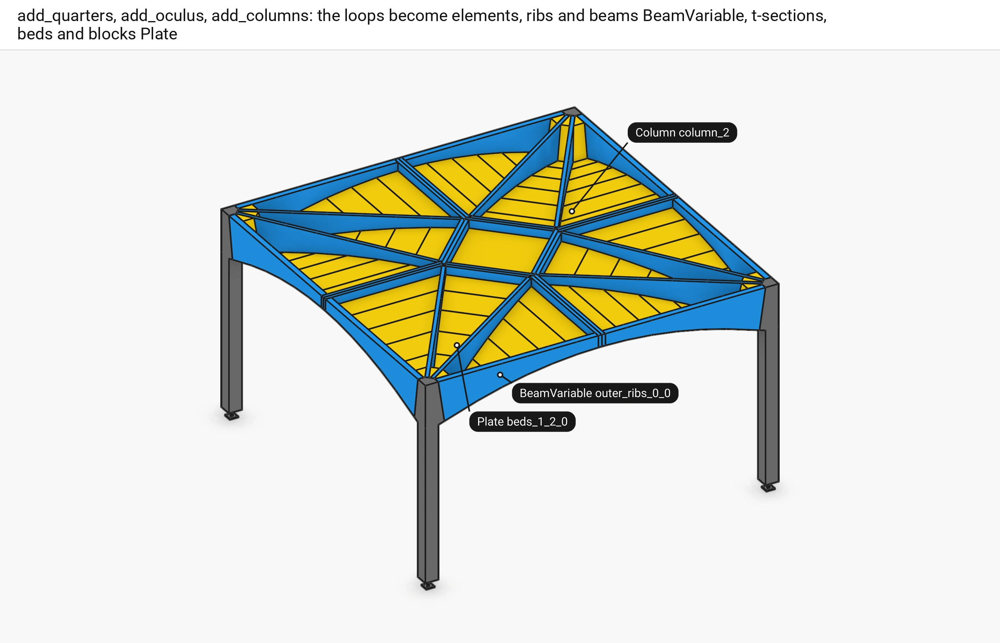
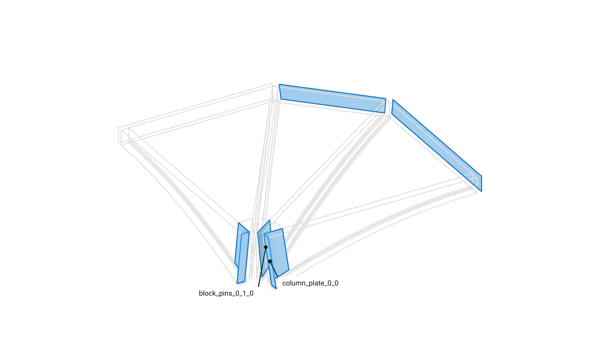
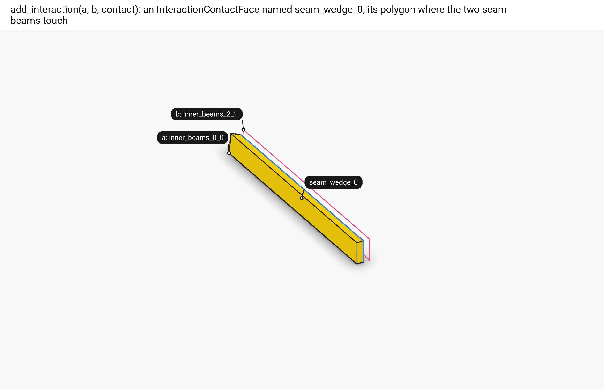
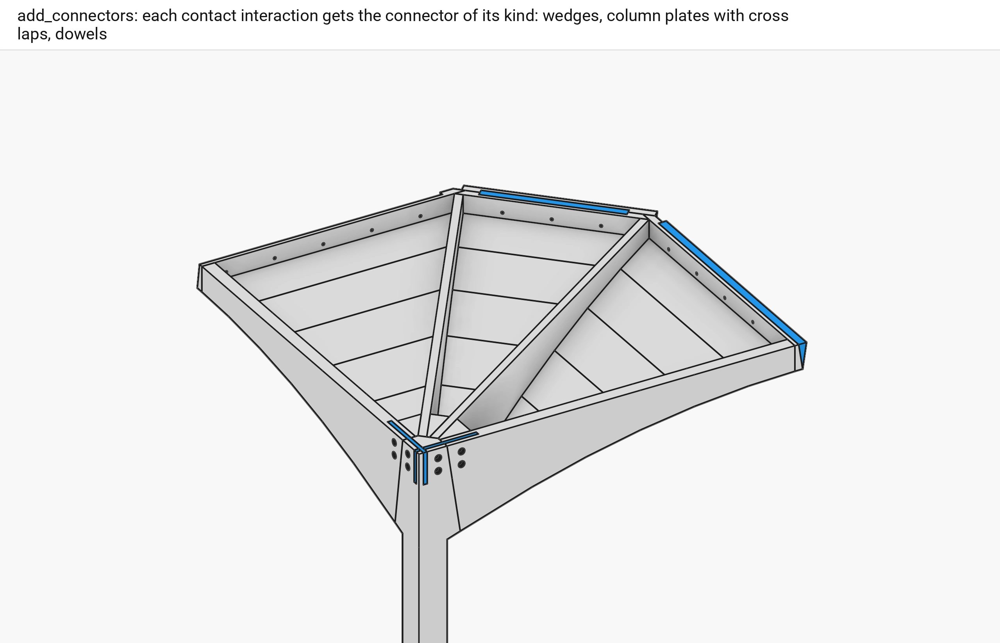
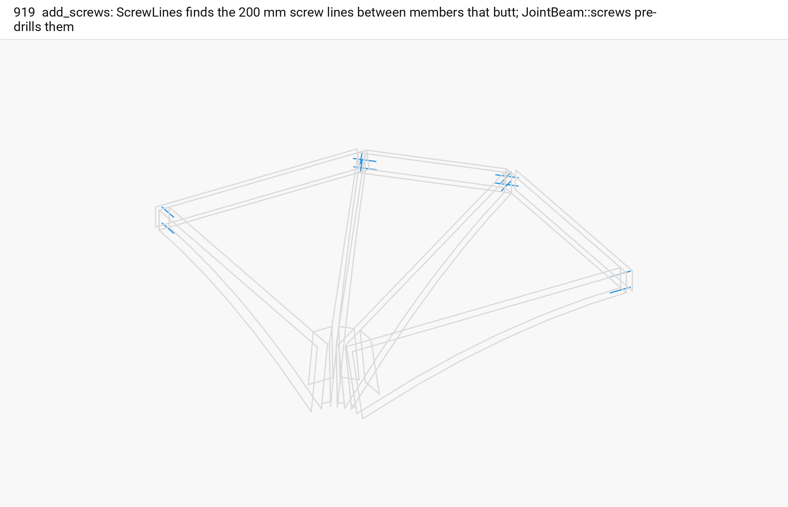
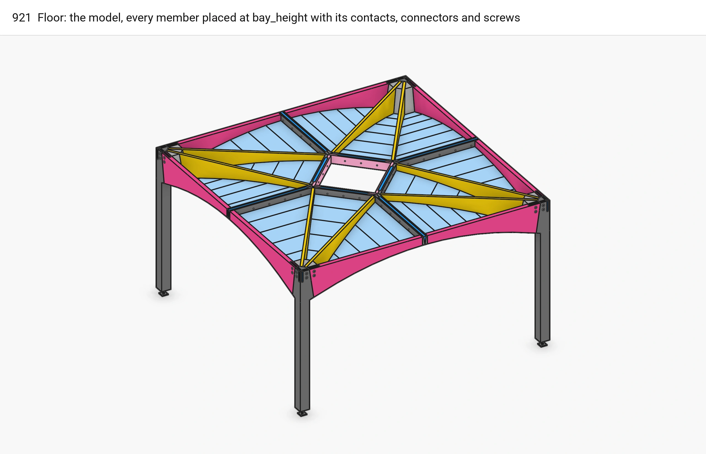

# Part 2. Floor: the model {#templates_floor_model}

[TOC]

`wood_floor::Floor` (`src/templates/floor/floor.h`) builds the model from a @ref templates_floor_guide "FloorGuide": the face loops become elements lifted to `bay_height`, every two members that touch get a contact interaction, and the connectors and screws are made from those.

## Steps

Each step is one chapter, one picture per sub-step, in code order, numbered on from the guide's six:

7. @subpage templates_floor_07_elements (add_quarters, add_oculus and add_columns: the guide's loops become ribs, beams and plates lifted to the floor, the ring around the oculus, and a column on its support with a glued and carved head)
8. @subpage templates_floor_08_contacts (add_contacts: the face every two members the design joins share, found by the session's search and stored as a named contact interaction)
9. @subpage templates_floor_09_connectors (add_connectors: a wedge, a rectangle plate with its cross lap or four dowels on every contact, and how each is cut into its members)
10. @subpage templates_floor_10_screws (add_screws: the three kinds of screw lines, their levels and aim, pre-drilled into every member they pass)
11. @subpage templates_floor_11_examples (compute_breps and the examples that build the floor a part at a time)

## Overview

One picture per method of the floor, in the order `add_members`, `add_contacts`, `add_connectors` and `add_screws` run.

### add_quarters(), add_oculus(), add_columns()

■ BeamVariable ■ Plate ■ Column, Support

The loops become elements: ribs, inner beams and ring beams are `BeamVariable`, t-sections, beds, blocks and the oculus plates `Plate`, and each column a `Column` on its `Support`, named `outer_ribs_<i>_<q>`, `beds_<row>_<i>_<q>` ...

Code: [`add_quarters`](https://github.com/petrasvestartas/wood/blob/5f7f317df711a163eda3c416cb426e5cd8663dd6/src/templates/floor/floor.h#L76)

### add_contacts()

■ contact polygons

For every two members the design joins, the session's contact search (`compute_face_contact`) finds the face they share, and `add_interaction` stores it on the session's edge between them as an `InteractionContactFace` named by its kind and place (`seam_wedge_0`, `column_plate_0_1`, `block_dowels_0_1_0` ...).

Code: [`add_contacts`](https://github.com/petrasvestartas/wood/blob/5f7f317df711a163eda3c416cb426e5cd8663dd6/src/templates/floor/floor.h#L88)

### add_interaction(a, b, contact)

■ member a ■ member b ■ the contact

One of them: the two seam beams of seam 0 and the face they share.

Code: [`add_interaction`](https://github.com/petrasvestartas/wood/blob/5f7f317df711a163eda3c416cb426e5cd8663dd6/src/joinery_solver/wood_session.h#L197)

### add_connectors()

■ connector parts ■ members

Each contact interaction gets the connector of its kind: seam and oculus wedges, column plates with their cross lap, dowels.

Code: [`add_connectors`](https://github.com/petrasvestartas/wood/blob/5f7f317df711a163eda3c416cb426e5cd8663dd6/src/templates/floor/floor.h#L91)

### add_screws()

■ screw lines ■ member loops

`rib_beam_screws`, `beam_mitre_screws` and `rib_corner_screws` find the 200 mm screw lines between members that butt; `JointBeam::screws` pre-drills them into both members.

Code: [`add_screws`](https://github.com/petrasvestartas/wood/blob/5f7f317df711a163eda3c416cb426e5cd8663dd6/src/templates/floor/floor.h#L94)

### Floor

family colours, connectors in blue

The finished model: every member at `bay_height`, its contacts, connectors and screws.

Code: [`Floor`](https://github.com/petrasvestartas/wood/blob/5f7f317df711a163eda3c416cb426e5cd8663dd6/src/templates/floor/floor.h#L42)
