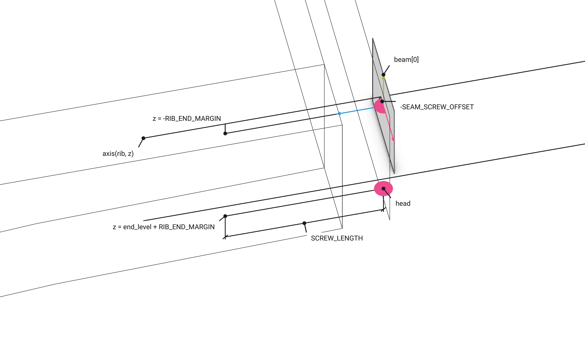
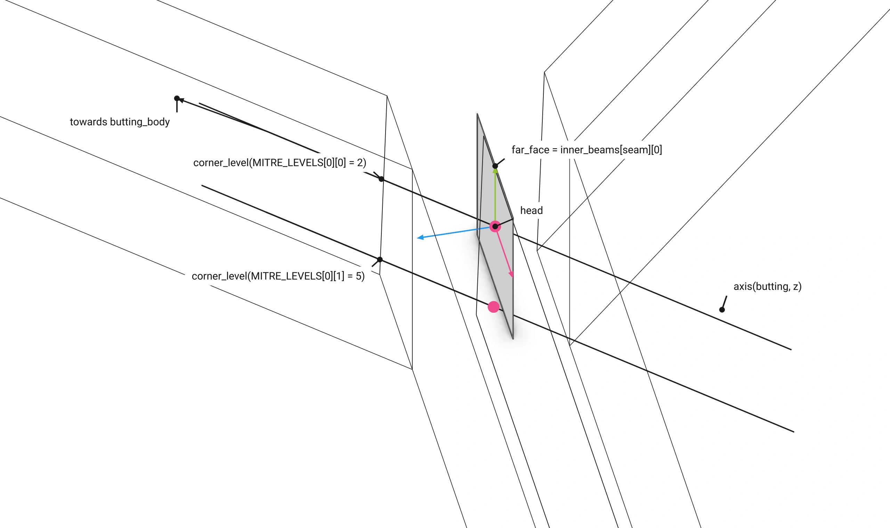
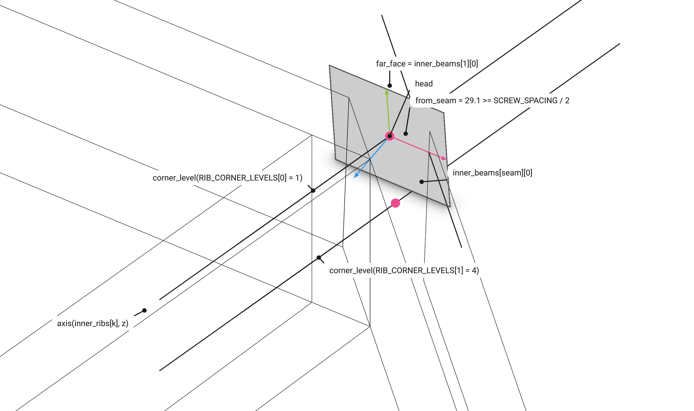
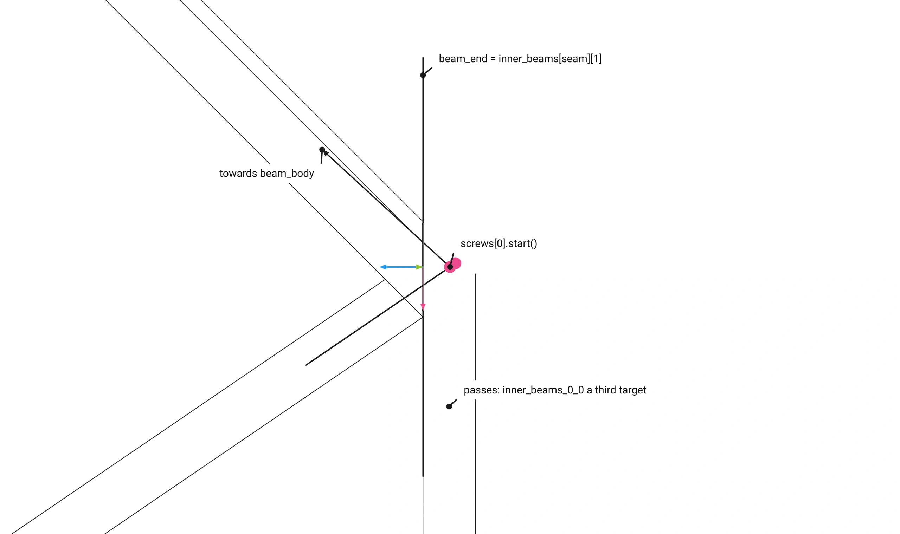
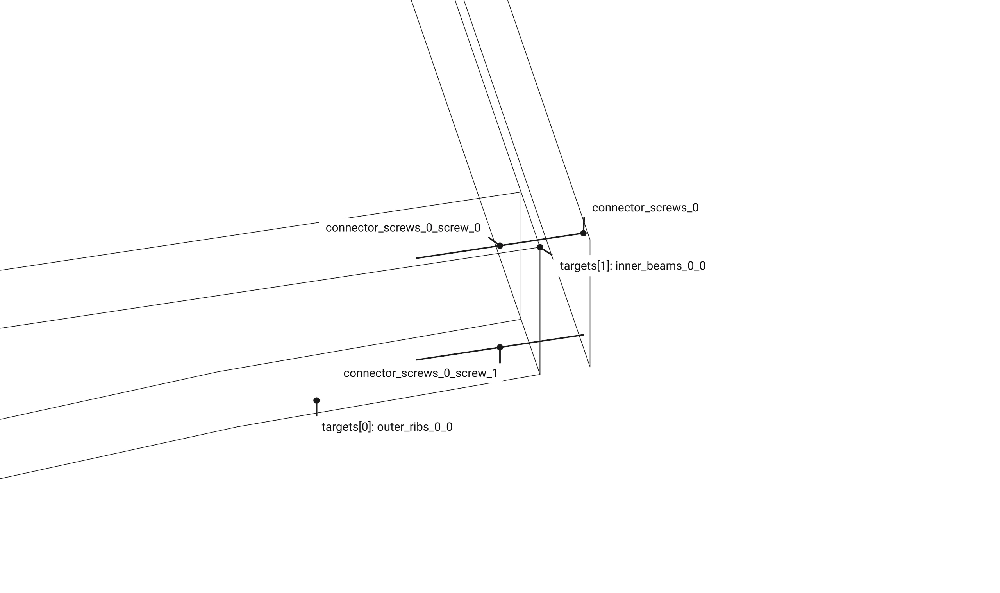

# Part 2. Floor: the model {#templates_floor_model}

[TOC]

Floor builds the timber members, their contacts, connectors and screws from a @ref templates_floor_guide "FloorGuide".


A guide makes a floor (`examples/templates_floor_7_contacts_cantilevers.cpp`):

```cpp
const wood_floor::FloorGuide guide({
    Point(-3000.0, -3000.0, 0.0),
    Point(3000.0, -3000.0, 0.0),
    Point(3000.0, 3000.0, 0.0),
    Point(-3000.0, 3000.0, 0.0),
});
wood_floor::Floor floor(guide);
```

The constructor is the whole computation, one block per step:

```cpp
    Floor::Floor(const FloorGuide& guide, const std::string& name = "floor")
        : WoodSession(name), guide(guide) {

        add_quarters();                                    // every quarter's members
        add_oculus();                                      // the ring around the hole
        add_columns();                                     // a column at every corner
        const auto contacts = add_contacts();              // where two members touch, per quarter
        const auto connectors = compute_connectors(contacts);
        add_connectors(connectors);                        // a connector per contact
        const auto screws = compute_screws();
        add_screws(screws);                                // the assembly screws
    }
```

<details>
<summary><b>Tables</b></summary>

Floor keeps only its guide; every element is in the session, grouped by the tree and found by name (`get_element_by_name`, `get_elements_numbered`).

```
floor
├── quarter_0                      quarter_1 .. quarter_3 alike
│   ├── beds_0
│   │   └── beds_<row>_0           Plate beds_<row>_<i>_0, three rows
│   ├── tsections_0                Plate tsections_<i>_0, six
│   ├── outer_ribs_0               BeamVariable outer_ribs_<i>_0, two
│   ├── inner_ribs_0               BeamVariable inner_ribs_<i>_0, two
│   ├── wedges_0                   Plate wedges_<i>_0, the three column blocks
│   ├── inner_beams_0              BeamVariable inner_beams_<i>_0, the two seam beams
│   ├── column_0                   Column column_0 on Support support_0
│   └── connectors_0               JointBeam connector_<kind>_<n>, connector_cross_lap_<n>, connector_screws_<n>
└── oculus
    ├── oculus_0                   BeamVariable oculus_0, the ring beam; BeamVariable oculus_beam_0, the inner beam on the oculus edge; Plate oculus_4, the bottom wedge; oculus_1 .. oculus_3 alike
    └── oculus_8                   Plate, the central plate
```

Each quarter's contacts, connectors and screws are fixed arrays, so every count is in the type:

```cpp
/// A contact the floor's design puts between two members: the two members, a the interaction's source, and the face they share.
struct Contact {
    std::shared_ptr<Element> a; // The source member.
    std::shared_ptr<Element> b; // The target member, which hosts the contact.
    std::shared_ptr<InteractionContactFace> face; // The face they share, stored as their interaction.
};

/// The contacts of one quarter, by the connector each gets.
struct QuarterContacts {
    Contact seam_wedge; // Seam beam 0 beside the next quarter's seam beam 2: a wedge.
    Contact oculus_wedge; // The oculus beam's back face on its ring beam: a wedge.
    std::array<Contact, 2> column_plates; // The column against outer rib k: a rectangle plate.
    std::array<std::array<Contact, 2>, 3> block_dowels; // Column block b against the rib either side: dowels.
};

/// The connectors of one quarter, every one built from its contact before any is added.
struct QuarterConnectors {
    std::shared_ptr<JointBeam> seam_wedge; // connector_seam_wedge_<n>.
    std::shared_ptr<JointBeam> oculus_wedge; // connector_oculus_wedge_<n>.
    std::array<std::shared_ptr<JointBeam>, 2> column_plates; // connector_column_plate_<n>, one per outer rib.
    std::shared_ptr<JointBeam> cross_lap; // connector_cross_lap_<n>, where the two column plates cross.
    std::array<std::array<std::shared_ptr<JointBeam>, 2>, 3> block_dowels; // connector_block_dowels_<n>, per block and side.
};

/// The assembly screws of one quarter, each pair along k = 0 and 1.
struct QuarterScrews {
    std::array<std::shared_ptr<JointBeam>, 2> rib_beam; // Each outer rib into the seam beam it ends on.
    std::array<std::shared_ptr<JointBeam>, 2> beam_mitre; // Each seam beam into the oculus beam ending on it.
    std::array<std::shared_ptr<JointBeam>, 2> rib_corner; // The oculus beam into each inner rib, through the seam beam when the screws pass it.
};
```

</details>

## Parameters

The guide carries every size (@ref templates_floor_guide); the floor adds the screw and connector constants.

```cpp
/// The model of the guide, the session named name: the quarters, the oculus, the columns, their contacts, the connectors and the screws.
explicit Floor(const FloorGuide& guide, const std::string& name = "floor");
```

```cpp
static constexpr double SCREW_LENGTH = 200.0; // mm, every assembly screw.
static constexpr double SCREW_SPACING = 8.0; // mm, the closest two screw axes may come.
static constexpr double RIB_END_MARGIN = 20.0; // mm a seam screw sits below the rib's top and above its bottom at its end when the seam runs through the rib band.
static constexpr double SEAM_SCREW_OFFSET = 15.0; // mm the screws of the two ribs meeting at a seam sit either side of their axes, so their heads on the seam plane stay apart.
static constexpr double CORNER_LEVELS = 7.0; // An oculus corner's depth in sevenths: six levels, one per screw on each side of the corner.
static constexpr std::array<std::array<double, 2>, 2> MITRE_LEVELS = {{{2.0, 5.0}, {3.0, 6.0}}}; // Per mitre k, the levels of its two screws; the two quarters' mitres at a seam put their heads on the seam plane at one point, so they differ.
static constexpr std::array<double, 2> RIB_CORNER_LEVELS = {1.0, 4.0}; // The inner rib end screws at both corners, apart from that corner's mitre and oculus screws they cross.
static inline const Color CONNECTOR_COLOR = Color(33.0f / 255.0f, 150.0f / 255.0f, 234.0f / 255.0f, 1.0f, "brg_blue"); // Every connector node and every part and dowel node under it: the Block Research Group's primary blue.
```

At a seam, each rib's screws sit `SEAM_SCREW_OFFSET` off its axis, the two ribs on opposite sides, and run `SCREW_LENGTH` from the beam's seam face.


At the rib end, one screw `RIB_END_MARGIN` below the rib top and one above the end's bottom, `end_level`.


At an oculus corner, `static_h` in `CORNER_LEVELS` sevenths: `MITRE_LEVELS` and `RIB_CORNER_LEVELS` give every screw its own level.


`compute_connectors`: a wedge stops `1.5 * size` short of its contact's top edge, `size` the thicker member.


The wedge end on: `WEDGE_PROFILE` between the two beams, a pocket `2 * size / 3` deep under each slanted face.


A column plate's dowels are `size_outer_ribs` long, through the rib; the two plates of a corner cross in their `cross_lap`.


## The constructor, step by step

One section per constructor block, in order.

<details open>
<summary><b>Quarters</b></summary>

The guide's face loops of every quarter become elements at `bay_height`: ribs and inner beams variable beams, the rest plates.

```cpp
// quarters: every quarter's members, lifted to bay_height and grouped by family
add_quarters();
```


<details>
<summary>add_quarters()</summary>

```cpp
void Floor::add_quarters() {

    const Xform lift = Xform::translation(0.0, 0.0, guide.bay_height);

    for (size_t q = 0; q < 4; q++) {
        const std::shared_ptr<TreeNode> group = quarter_group(q);

        // beds: Plate, three rows of plates between the bed rails, beds_<row>_<i>_<q> under beds_<row>_<q>
        const std::shared_ptr<TreeNode> beds = add_group(fmt::format("beds_{}", q), group);
        const std::array<std::array<std::array<Polyline, 2>, 2>, 3>& rows = guide.bed_rails(q);

        for (size_t row = 0; row < rows.size(); row++) {
            const std::shared_ptr<TreeNode> node = add_group(fmt::format("beds_{}_{}", row, q), beds);
            const std::vector<std::shared_ptr<Plate>> plates = Plate::row_between(rows[row][0], rows[row][1]);

            for (size_t i = 0; i < plates.size(); i++) {
                plates[i]->name = fmt::format("beds_{}_{}_{}", row, i, q);
                plates[i]->place(lift);
                add(plates[i], node);
            }
        }

        // tsections: Plate, the flanges beside the ribs, tsections_<i>_<q>
        const std::shared_ptr<TreeNode> tsections = add_group(fmt::format("tsections_{}", q), group);
        const std::array<std::array<Polyline, 2>, 6>& tsection_loops = guide.tsections(q);

        for (size_t i = 0; i < tsection_loops.size(); i++) {
            const std::shared_ptr<Plate> tsection = std::make_shared<Plate>(tsection_loops[i][1], tsection_loops[i][0], fmt::format("tsections_{}_{}", i, q));
            tsection->place(lift);
            add(tsection, tsections);
        }

        // outer_ribs: BeamVariable, the two ribs along the bay edges, outer_ribs_<i>_<q>
        const std::shared_ptr<TreeNode> outer = add_group(fmt::format("outer_ribs_{}", q), group);
        const std::array<std::array<Polyline, 2>, 2>& outer_loops = guide.outer_ribs(q);

        for (size_t i = 0; i < outer_loops.size(); i++) {
            const std::shared_ptr<BeamVariable> outer_rib = rib(outer_loops[i], fmt::format("outer_ribs_{}_{}", i, q));
            outer_rib->place(lift);
            add(outer_rib, outer);
        }

        // inner_ribs: BeamVariable, the two ribs from the column head to the inner beam corners, inner_ribs_<i>_<q>
        const std::shared_ptr<TreeNode> inner = add_group(fmt::format("inner_ribs_{}", q), group);
        const std::array<std::array<Polyline, 2>, 2>& inner_loops = guide.inner_ribs(q);

        for (size_t i = 0; i < inner_loops.size(); i++) {
            const std::shared_ptr<BeamVariable> inner_rib = rib(inner_loops[i], fmt::format("inner_ribs_{}_{}", i, q));
            inner_rib->place(lift);
            add(inner_rib, inner);
        }

        // wedges: Plate, the three column blocks of the column head fan, wedges_<i>_<q>
        const std::shared_ptr<TreeNode> wedges = add_group(fmt::format("wedges_{}", q), group);
        const std::array<std::array<Polyline, 2>, 3>& block_loops = guide.wedges(q);

        for (size_t i = 0; i < block_loops.size(); i++) {
            const std::shared_ptr<Plate> block = std::make_shared<Plate>(block_loops[i][1], block_loops[i][0], fmt::format("wedges_{}_{}", i, q));
            block->place(lift);
            add(block, wedges);
        }

        // inner_beams: BeamVariable, the two seam beams, inner_beams_<i>_<q>; the guide's oculus edge beam between them goes with the oculus
        const std::shared_ptr<TreeNode> beams = add_group(fmt::format("inner_beams_{}", q), group);
        const std::array<std::array<Polyline, 2>, 3>& beam_loops = guide.inner_beams(q);
        const std::array<size_t, 2> seams = {0, 2};

        for (size_t i = 0; i < seams.size(); i++) {
            const std::shared_ptr<BeamVariable> inner_beam = beam(beam_loops[seams[i]], {0, 3}, {1, 2}, fmt::format("inner_beams_{}_{}", i, q));
            inner_beam->place(lift);
            add(inner_beam, beams);
        }
    }
}
```

</details>

<details>
<summary>rib: a variable beam, one section per soffit point</summary>

```cpp
std::shared_ptr<BeamVariable> Floor::rib(const std::array<Polyline, 2>& loops, const std::string& name) {

    const std::vector<Point> near = loops[0].get_points();
    const std::vector<Point> far = loops[1].get_points();
    const size_t stations = near.size() - 3;
    std::vector<Polyline> sections;

    for (size_t i = 0; i < stations; i++) {
        const Point& low = near[2 + i];
        const Point& far_low = far[2 + i];
        Point high(low[0], low[1], 0.0);
        Point far_high(far_low[0], far_low[1], 0.0);

        if (i == 0) {
            high = near[1];
            far_high = far[1];
        } else if (i + 1 == stations) {
            high = near[0];
            far_high = far[0];
        }

        sections.push_back(Polyline({low, high, far_high, far_low}).closed());
    }

    const Line axis = Line::from_points(Point::mid_point(near[1], far[1]), Point::mid_point(near[0], far[0]));

    return std::make_shared<BeamVariable>(axis, sections, name);
}
```

Each soffit point `low` and its `far_low` on the second loop, with their top corners, make one section; the end sections take the loops' own top corners, so they lie in the end planes.


</details>

<details>
<summary>beam: a variable beam between its end sections</summary>

```cpp
std::shared_ptr<BeamVariable> Floor::beam(const std::array<Polyline, 2>& loops, const std::array<size_t, 2>& start, const std::array<size_t, 2>& end, const std::string& name) {

    const std::vector<Point> near = loops[0].get_points();
    const std::vector<Point> far = loops[1].get_points();
    const Polyline first = Polyline({near[start[0]], near[start[1]], far[start[1]], far[start[0]]}).closed();
    const Polyline last = Polyline({near[end[0]], near[end[1]], far[end[1]], far[end[0]]}).closed();

    return BeamVariable::between(first, last, name);
}
```

The section over corners `start` and over corners `end`, both loops; `BeamVariable::between` runs the axis between their centroids.


</details>

</details>

<details>
<summary><b>Oculus</b></summary>

The four ring beams, the four oculus beams on the oculus edges, the four bottom wedges and the central plate.

```cpp
// oculus: the four ring beams, the oculus beams, the bottom wedges and the central plate
add_oculus();
```


<details>
<summary>add_oculus()</summary>

```cpp
void Floor::add_oculus() {

    const Xform lift = Xform::translation(0.0, 0.0, guide.bay_height);
    const std::array<std::array<Polyline, 2>, 9>& loops = guide.oculus();

    const std::shared_ptr<TreeNode> oculus = group_named("oculus");

    // ring beams: BeamVariable, oculus_<q> in oculus_<q> of oculus
    for (size_t q = 0; q < 4; q++) {
        const std::shared_ptr<BeamVariable> ring_beam = beam(loops[q], {1, 0}, {2, 3}, fmt::format("oculus_{}", q));
        ring_beam->place(lift);
        add(ring_beam, group_named(fmt::format("oculus_{}", q), oculus));
    }

    // oculus beams: BeamVariable, the inner beam along oculus edge q, oculus_beam_<q> beside its ring beam
    for (size_t q = 0; q < 4; q++) {
        const std::shared_ptr<BeamVariable> oculus_beam = beam(guide.inner_beams(q)[1], {0, 3}, {1, 2}, fmt::format("oculus_beam_{}", q));
        oculus_beam->place(lift);
        add(oculus_beam, group_named(fmt::format("oculus_{}", q), oculus));
    }

    // bottom wedges: Plate, oculus_<4 + q> under ring beam q, in the same group
    for (size_t q = 0; q < 4; q++) {
        const std::shared_ptr<Plate> bottom_wedge = std::make_shared<Plate>(loops[4 + q][1], loops[4 + q][0], fmt::format("oculus_{}", 4 + q));
        bottom_wedge->place(lift);
        add(bottom_wedge, group_named(fmt::format("oculus_{}", q), oculus));
    }

    // central plate: Plate, oculus_8 in oculus
    const std::shared_ptr<Plate> plate = std::make_shared<Plate>(loops[8][1], loops[8][0], "oculus_8");
    plate->place(lift);
    add(plate, oculus);
}
```

</details>

</details>

<details>
<summary><b>Columns</b></summary>

A column on its support at every corner, its head glued on and carved by the guide's six cutters.

```cpp
// columns: the column at every corner, its head carved by the guide's cutters
add_columns();
```


<details>
<summary>add_columns()</summary>

```cpp
void Floor::add_columns() {

    for (size_t q = 0; q < 4; q++)
        add_column(q);
}
```

</details>

<details>
<summary>add_column(corner)</summary>

```cpp
void Floor::add_column(size_t corner) {

    const size_t k = corner % 4;
    const std::shared_ptr<TreeNode> group = group_named(fmt::format("column_{}", k), quarter_group(k));
    graft(column(guide, k), group);
}
```

</details>

<details>
<summary>column(guide, q): the column session</summary>

```cpp
WoodSession column(const FloorGuide& guide, size_t q) {

    const size_t k = q % 4;
    const std::string name = fmt::format("column_{}", k);

    const std::shared_ptr<Support> support = std::make_shared<Support>(guide.support_plane(k), "support");
    support->name = fmt::format("support_{}", k);
    const std::shared_ptr<Column> shaft = Column::square(support->column_axis(guide.bay_height), guide.column_frame(k), guide.size_column_head, name);

    const std::array<std::array<Polyline, 2>, 6>& loops = guide.column_cutters(k);
    std::vector<std::shared_ptr<Plate>> cutters;

    for (size_t i = 0; i < loops.size(); i++) {
        cutters.push_back(std::make_shared<Plate>(loops[i][1], loops[i][0], fmt::format("column_cutters_{}_{}", i, k)));
        cutters.back()->place(Xform::translation(0.0, 0.0, guide.bay_height));
    }

    WoodSession session(name);
    session.add_column(shaft, guide.size_column_head + guide.size_column_head_chamfer, guide.column_head_depth, support, cutters);
    return session;
}
```

The square shaft on the support's axis, the two head blocks glued on to widen the head, and the six cutters that carve it.


</details>

</details>

<details>
<summary><b>Contacts</b></summary>

The face every two members the design joins share, stored as a named contact interaction.

```cpp
// contacts: per quarter an interaction between every two members that touch, named by its kind and place
const std::array<QuarterContacts, 4> contacts = add_contacts();
```


<details>
<summary>add_contacts()</summary>

```cpp
std::array<QuarterContacts, 4> Floor::add_contacts() {

    std::array<QuarterContacts, 4> contacts;

    for (size_t q = 0; q < 4; q++) {
        const size_t next = (q + 1) % 4;

        // seam: this quarter's seam beam 0 beside the next quarter's seam beam 1
        const Contact seam = add_contact(fmt::format("seam_wedge_{}", q), fmt::format("inner_beams_0_{}", q), fmt::format("inner_beams_1_{}", next));
        contacts[q].seam_wedge = seam;

        // oculus: the oculus beam's back face on its ring beam
        const Contact oculus = add_contact(fmt::format("oculus_wedge_{}", q), fmt::format("oculus_beam_{}", q), fmt::format("oculus_{}", q));
        contacts[q].oculus_wedge = oculus;

        // column head: the column against each of its two outer ribs
        for (size_t k = 0; k < 2; k++) {
            const Contact plate = add_contact(fmt::format("column_plate_{}_{}", q, k), fmt::format("column_{}", q), fmt::format("outer_ribs_{}_{}", k, q));
            contacts[q].column_plates[k] = plate;
        }

        // column blocks: outer_rib 0 | block 0 | inner_rib 0 | block 1 | inner_rib 1 | block 2 | outer_rib 1, each block on the rib either side
        const std::array<std::string, 4> ribs = {fmt::format("outer_ribs_0_{}", q), fmt::format("inner_ribs_0_{}", q), fmt::format("inner_ribs_1_{}", q), fmt::format("outer_ribs_1_{}", q)};

        for (size_t b = 0; b < 3; b++)
            for (size_t side = 0; side < 2; side++) {
                const Contact dowels = add_contact(fmt::format("block_dowels_{}_{}_{}", q, b, side), ribs[b + side], fmt::format("wedges_{}_{}", b, q));
                contacts[q].block_dowels[b][side] = dowels;
            }
    }

    return contacts;
}
```

</details>

<details>
<summary>add_contact(name, a_name, b_name)</summary>

```cpp
Contact Floor::add_contact(const std::string& name, const std::string& a_name, const std::string& b_name) {

    const std::shared_ptr<Element> a = get_element_by_name<Element>(a_name);
    const std::shared_ptr<Element> b = get_element_by_name<Element>(b_name);
    const std::shared_ptr<InteractionContactFace> face = compute_face_contact(a, b);

    if (!face)
        throw std::runtime_error(fmt::format("no contact {} between {} and {}", name, a_name, b_name));

    face->name = name;
    add_interaction(a, b, face);

    return {a, b, face};
}
```

The face polygon `compute_face_contact` finds between the two seam beams, stored on their edge as `seam_wedge_0`.


</details>

</details>

<details>
<summary><b>Connectors</b></summary>

A connector is an element of its own, a `JointBeam`, built on one contact between two members, `a` and `b`. It holds three things: its own solids, the pockets it cuts into each member, and its dowels.

```cpp
std::vector<std::array<Polyline, 2>> parts;                // its own solids, blue in the viewer
std::vector<std::vector<std::array<Polyline, 2>>> cutters; // per member, the pockets it cuts
std::vector<Line> drill_lines;                             // its dowels, drilled through every member
```

`compute_connectors` builds every one from the contacts before any is added, so each sees uncut members; `add_connectors` then adds them, which cuts the pockets and drills the holes.

```cpp
// connectors: per quarter its wedges, column plates with their cross lap and dowels, all built on uncut members
const std::array<QuarterConnectors, 4> connectors = compute_connectors(contacts);
add_connectors(connectors);
```


<details>
<summary>Seam wedge: a wedge sunk into two beams side by side</summary>

```cpp
connectors[q].seam_wedge = JointBeam::wedge(*c.seam_wedge.a, *c.seam_wedge.b, *c.seam_wedge.face, 1.5 * beam, 2.0 * beam / 3.0, outer_face);
```

It starts from the contact: the face the two seam beams share. Seen along the seam from the oculus end.


The part: one solid along the contact's top edge, a V in section, half in each beam; it stops `1.5 * size` short of the oculus end.


At the bay's outer face it runs flush.


The dowels: across the contact, through the wedge into both beams.


Added, it cuts its pocket, half into each beam, and drills a hole per dowel.


</details>

<details>
<summary>Oculus wedge: the same between the oculus beam and its ring beam</summary>

```cpp
connectors[q].oculus_wedge = JointBeam::wedge(*c.oculus_wedge.a, *c.oculus_wedge.b, *c.oculus_wedge.face, 1.5 * thicker, 2.0 * thicker / 3.0);
```


No end plane, so it stops `1.5 * size` short at both ends; `size` is the thicker of the two beams.


</details>

<details>
<summary>Column plates: a plate from the column into each outer rib, crossing in the head</summary>

```cpp
connectors[q].column_plates[k] = JointBeam::rectangle_plate(*c.column_plates[k].a, *c.column_plates[k].b, *c.column_plates[k].face, guide.size_outer_ribs);
connectors[q].cross_lap = JointBeam::cross_lap(*connectors[q].column_plates[0], *connectors[q].column_plates[1]);
```

The contact between the column head and the outer rib.


A plate along the contact's normal, into both, with four dowels as long as the rib is thick.


The rib after it: the plate's slot and the dowel holes.


The corner's two plates cross inside the head.


So `cross_lap` cuts a slot in each: the first from half their height up, the second from the bottom up to there.


</details>

<details>
<summary>Block dowels: dowels only, no part</summary>

```cpp
const std::shared_ptr<JointBeam> dowels = JointBeam::dowels(*contact.a, *contact.b, *contact.face);
```

A column block against the rib beside it.


Four dowels at the corners of the contact inset by 50, half into each.


</details>

<details>
<summary>compute_connectors(contacts)</summary>

```cpp
std::array<QuarterConnectors, 4> Floor::compute_connectors(const std::array<QuarterContacts, 4>& contacts) const {

    std::array<QuarterConnectors, 4> connectors;

    for (size_t q = 0; q < 4; q++) {
        const QuarterContacts& c = contacts[q];

        // seam wedge: sized by the inner beams, running on to the bay's outer face
        const double beam = guide.size_inner_beams;
        const Plane outer_face = guide.construction_planes(q).outer_ribs[0][0].transformed(Xform::translation(0.0, 0.0, guide.bay_height));
        connectors[q].seam_wedge = JointBeam::wedge(*c.seam_wedge.a, *c.seam_wedge.b, *c.seam_wedge.face, 1.5 * beam, 2.0 * beam / 3.0, outer_face);

        // oculus wedge: sized by the thicker of the oculus beam and its ring beam
        const double thicker = std::max(FloorGuide::thickness(guide.inner_beams(q)[1]), FloorGuide::thickness(guide.oculus()[q]));
        connectors[q].oculus_wedge = JointBeam::wedge(*c.oculus_wedge.a, *c.oculus_wedge.b, *c.oculus_wedge.face, 1.5 * thicker, 2.0 * thicker / 3.0);

        // column plates: a rectangle plate as wide as the outer rib on each, and the cross lap where the two cross
        for (size_t k = 0; k < 2; k++)
            connectors[q].column_plates[k] = JointBeam::rectangle_plate(*c.column_plates[k].a, *c.column_plates[k].b, *c.column_plates[k].face, guide.size_outer_ribs);

        connectors[q].cross_lap = JointBeam::cross_lap(*connectors[q].column_plates[0], *connectors[q].column_plates[1]);

        // block dowels: dowels between each column block and the rib either side
        for (size_t b = 0; b < 3; b++)
            for (size_t side = 0; side < 2; side++) {
                const Contact& contact = c.block_dowels[b][side];
                const std::shared_ptr<JointBeam> dowels = JointBeam::dowels(*contact.a, *contact.b, *contact.face);

                if (!dowels)
                    throw std::runtime_error("the inset leaves no room for the dowels of " + contact.face->name);

                connectors[q].block_dowels[b][side] = dowels;
            }
    }

    return connectors;
}
```

</details>

<details>
<summary>add_connectors(connectors)</summary>

```cpp
void Floor::add_connectors(const std::array<QuarterConnectors, 4>& connectors) {

    // seam wedges
    for (size_t q = 0; q < 4; q++)
        add_named_connector(connectors[q].seam_wedge, "connector_seam_wedge", q);

    // oculus wedges
    for (size_t q = 0; q < 4; q++)
        add_named_connector(connectors[q].oculus_wedge, "connector_oculus_wedge", q);

    // column plates
    for (size_t q = 0; q < 4; q++)
        for (const std::shared_ptr<JointBeam>& plate : connectors[q].column_plates)
            add_named_connector(plate, "connector_column_plate", q);

    // block dowels
    for (size_t q = 0; q < 4; q++)
        for (const std::array<std::shared_ptr<JointBeam>, 2>& block : connectors[q].block_dowels)
            for (const std::shared_ptr<JointBeam>& dowels : block)
                add_named_connector(dowels, "connector_block_dowels", q);

    // cross laps, last, over the plates they join
    for (size_t q = 0; q < 4; q++)
        add_named_connector(connectors[q].cross_lap, "connector_cross_lap", q);
}
```

</details>

<details>
<summary>add_named_connector</summary>

```cpp
void Floor::add_named_connector(const std::shared_ptr<JointBeam>& connector, const std::string& prefix, size_t q) {

    connector->name = fmt::format("{}_{}", prefix, next_number(prefix));
    const std::shared_ptr<TreeNode> group = group_named(fmt::format("connectors_{}", q), quarter_group(q));
    set_node_color(add_connector(connector, group), CONNECTOR_COLOR, true);
}
```

</details>

</details>

<details>
<summary><b>Screws</b></summary>

Two 200 mm screws where an outer rib meets a seam beam, a seam beam the oculus beam, and an inner rib the oculus beam.

```cpp
// screws: the assembly screws, after every other connector so nothing before them changes
const std::array<QuarterScrews, 4> screws = compute_screws();
add_screws(screws);
```


<details>
<summary>compute_screws()</summary>

```cpp
std::array<QuarterScrews, 4> Floor::compute_screws() const {

    std::array<QuarterScrews, 4> screws;

    for (size_t q = 0; q < 4; q++) {
        // the members the screws join: the seam beams either side, the oculus beam between them, the outer and inner ribs
        const std::array<const Element*, 2> seam_beams = {get_element_by_name<Element>(fmt::format("inner_beams_0_{}", q)).get(), get_element_by_name<Element>(fmt::format("inner_beams_1_{}", q)).get()};
        const Element* oculus_beam = get_element_by_name<Element>(fmt::format("oculus_beam_{}", q)).get();
        const std::array<const Element*, 2> outer_ribs = {get_element_by_name<Element>(fmt::format("outer_ribs_0_{}", q)).get(), get_element_by_name<Element>(fmt::format("outer_ribs_1_{}", q)).get()};
        const std::array<const Element*, 2> inner_ribs = {get_element_by_name<Element>(fmt::format("inner_ribs_0_{}", q)).get(), get_element_by_name<Element>(fmt::format("inner_ribs_1_{}", q)).get()};

        for (size_t k = 0; k < 2; k++) {
            // rib_beam: the outer rib into the seam beam it ends on
            screws[q].rib_beam[k] = screws_of({outer_ribs[k], seam_beams[k]}, rib_beam_screws(q, k));

            // beam_mitre: the seam beam into the oculus beam ending on it
            screws[q].beam_mitre[k] = screws_of({seam_beams[k], oculus_beam}, beam_mitre_screws(q, k));

            // rib_corner: the oculus beam into the inner rib ending on its back face, through the seam beam too when the screws pass it
            const std::vector<Line> lines = rib_corner_screws(q, k);
            std::vector<const Element*> passed = {oculus_beam, inner_ribs[k]};

            if (passes_seam_beam(q, k, lines))
                passed.push_back(seam_beams[k]);

            screws[q].rib_corner[k] = screws_of(passed, lines);
        }
    }

    return screws;
}
```

</details>

<details>
<summary>add_screws(screws)</summary>

```cpp
void Floor::add_screws(const std::array<QuarterScrews, 4>& screws) {

    for (size_t q = 0; q < 4; q++)
        for (const std::array<std::shared_ptr<JointBeam>, 2>& pair : {screws[q].rib_beam, screws[q].beam_mitre, screws[q].rib_corner})
            for (const std::shared_ptr<JointBeam>& screw : pair)
                add_named_connector(screw, "connector_screws", q);
}
```

</details>

<details>
<summary>rib_beam_screws(q, k)</summary>

```cpp
std::vector<Line> Floor::rib_beam_screws(size_t q, size_t k) const {

    const ConstructionPlanes& cp = guide.construction_planes(q);
    const size_t beam = k == 0 ? 0 : 2;
    const std::array<Polyline, 2> rib = guide.outer_ribs(q)[k];
    std::vector<Line> screws;

    for (double level : {-RIB_END_MARGIN, FloorGuide::end_level(rib, guide.rib_seam_ends(q)[k]) + RIB_END_MARGIN})
        screws.push_back(from_seam_face(cp.outer_ribs[k], cp.inner_beams[beam], level, k == 0 ? -SEAM_SCREW_OFFSET : SEAM_SCREW_OFFSET));

    return lifted(screws);
}
```

`from_seam_face`: the rib's `axis` on each level, moved `SEAM_SCREW_OFFSET` across, the head where it meets the beam's seam face, `SCREW_LENGTH` along the rib.



</details>

<details>
<summary>beam_mitre_screws(q, k)</summary>

```cpp
std::vector<Line> Floor::beam_mitre_screws(size_t q, size_t k) const {

    const ConstructionPlanes& cp = guide.construction_planes(q);
    const size_t seam = k == 0 ? 0 : 2;
    const Point body = FloorGuide::body(guide.inner_beams(q)[1]);
    std::vector<Line> screws;

    for (double levels : MITRE_LEVELS[k])
        screws.push_back(along_axis(cp.inner_beams[1], cp.inner_beams[seam][0], body, corner_level(levels)));

    return lifted(screws);
}
```

`along_axis`: the oculus beam's `axis` on levels `MITRE_LEVELS[k]`, the head where it leaves the seam plane `far_face`, the screw on towards the beam's `body`.



</details>

<details>
<summary>rib_corner_screws(q, k)</summary>

```cpp
std::vector<Line> Floor::rib_corner_screws(size_t q, size_t k) const {

    const ConstructionPlanes& cp = guide.construction_planes(q);
    const Point body = FloorGuide::body(guide.inner_ribs(q)[k]);
    const size_t seam = k == 0 ? 0 : 2;
    std::vector<Line> screws;

    for (double levels : RIB_CORNER_LEVELS) {
        screws.push_back(along_axis(cp.inner_ribs[k], cp.inner_beams[1][0], body, corner_level(levels)));
        const double from_seam = cp.inner_beams[seam][0].signed_distance(screws.back().start());

        if (from_seam < 0.5 * SCREW_SPACING)
            throw std::runtime_error(fmt::format("quarter {}'s inner rib {} screw starts {:.3f} mm from the seam plane, less than half the screw spacing, where the next quarter's meets it: the bay is too narrow for the corner screws", q, k, from_seam));
    }

    return lifted(screws);
}
```

`along_axis`: the inner rib's `axis` on levels `RIB_CORNER_LEVELS`, the head where it leaves the oculus beam's back face; a head nearer the seam plane than `SCREW_SPACING / 2` throws.



</details>

<details>
<summary>passes_seam_beam(q, k, screws)</summary>

```cpp
bool Floor::passes_seam_beam(size_t q, size_t k, const std::vector<Line>& screws) const {

    const Plane beam_end = guide.construction_planes(q).inner_beams[k == 0 ? 0 : 2][1].transformed(Xform::translation(0.0, 0.0, guide.bay_height));
    const Point beam_body = FloorGuide::body(guide.inner_beams(q)[1]).transformed(Xform::translation(0.0, 0.0, guide.bay_height));
    const double beam_side = beam_end.signed_distance(beam_body) < 0.0 ? -1.0 : 1.0;

    for (const Line& screw : screws)
        if (beam_side * beam_end.signed_distance(screw.start()) < 0.0)
            return true;

    return false;
}
```

A head beyond `beam_end`, the seam beam's end plane, on the side away from `beam_body`: the screw runs through the seam beam, which becomes a third target.



</details>

<details>
<summary>screws_of(members, lines)</summary>

```cpp
std::shared_ptr<JointBeam> Floor::screws_of(const std::vector<const Element*>& members, const std::vector<Line>& lines) const {

    return JointBeam::screws(members, lines, 2.0, SCREW_LENGTH);
}
```

`JointBeam::screws`: a pre-drilled connector, one child `connector_screws_n_screw_i` per line, every member it passes a target.



</details>

</details>

## In detail

The chapters below take each step apart, one picture per sub-step.

- @subpage templates_floor_07_elements
- @subpage templates_floor_08_contacts
- @subpage templates_floor_09_connectors
- @subpage templates_floor_10_screws
- @subpage templates_floor_11_examples
