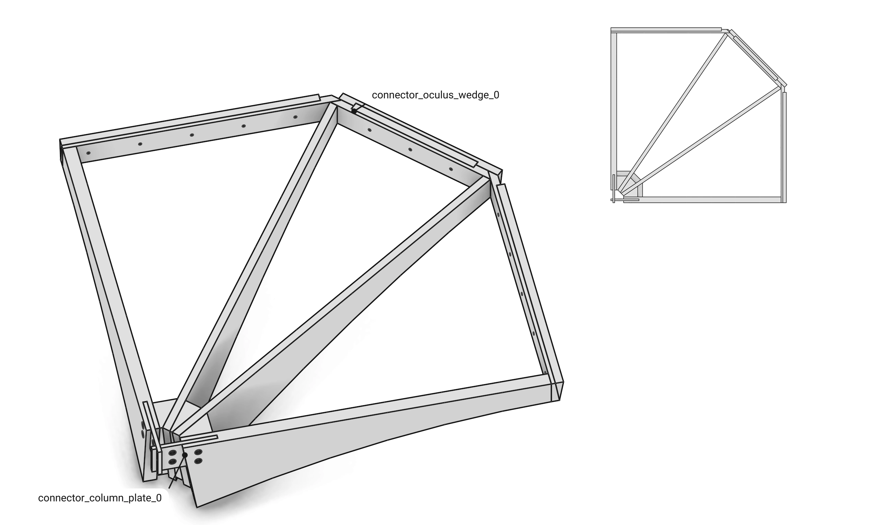
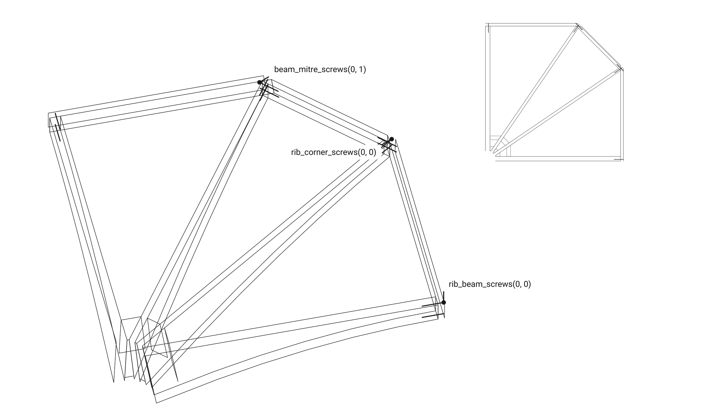

# Part 2. Floor: the model {#templates_floor_model}

[TOC]

Floor builds the timber members, their contacts, connectors and screws from a @ref templates_floor_guide "FloorGuide".


A guide makes a floor (`examples/templates_floor_7_contacts_cantilevers.cpp`):

```cpp
const wood_floor::FloorGuide guide({
    Point(-3000.0, -3000.0, 0.0),
    Point(3000.0, -3000.0, 0.0),
    Point(3000.0, 3000.0, 0.0),
    Point(-3000.0, 3000.0, 0.0),
});
wood_floor::Floor floor(guide);
```

The constructor is the whole computation, one block per step:

```cpp
    Floor::Floor(const FloorGuide& guide, const std::string& name = "floor")
        : WoodSession(name), guide(guide) {

        add_quarters();    // every quarter's members
        add_oculus();      // the ring around the hole
        add_columns();     // a column at every corner
        add_contacts();    // where two members touch
        add_connectors();  // a connector per contact
        add_screws();      // the assembly screws
    }
```

<details>
<summary><b>Tables</b></summary>

Floor keeps only its guide; every element is in the session, grouped by the tree and found by name (`get_element_by_name`, `get_elements_numbered`).

```
floor
├── quarter_0                      quarter_1 .. quarter_3 alike
│   ├── beds_0
│   │   └── beds_<row>_0           Plate beds_<row>_<i>_0, three rows
│   ├── tsections_0                Plate tsections_<i>_0, six
│   ├── outer_ribs_0               BeamVariable outer_ribs_<i>_0, two
│   ├── inner_ribs_0               BeamVariable inner_ribs_<i>_0, two
│   ├── wedges_0                   Plate wedges_<i>_0, the three column blocks
│   ├── inner_beams_0              BeamVariable inner_beams_<i>_0: seam 0, oculus edge, seam 1
│   ├── oculus_0                   BeamVariable oculus_0, the ring beam; Plate oculus_4, its bottom wedge
│   ├── column_0                   Column column_0 on Support support_0
│   └── connectors_0               JointBeam connector_<kind>_<n>, connector_cross_lap_<n>, connector_screws_<n>
└── oculus                         Plate oculus_8, the central plate
```

Each contact is named by its kind and place, and its connector by its kind:

```cpp
enum class ContactKind {
    seam_wedge, // The two seam beams either side of a seam: a wedge.
    oculus_wedge, // A quarter's oculus beam and its ring beam: a wedge.
    column_plate, // A column and an outer rib: a rectangle plate; the two plates of a corner get a cross lap.
    block_dowels, // A column block and a rib: dowels.
};
```

</details>

## Parameters

The guide carries every size (@ref templates_floor_guide); the floor adds the screw and connector constants.

```cpp
/// The model of the guide, the session named name: the quarters, the oculus, the columns, their contacts, the connectors and the screws.
explicit Floor(const FloorGuide& guide, const std::string& name = "floor");
```

```cpp
static inline const std::array<std::string, 4> CONTACT_NAMES = {"seam_wedge", "oculus_wedge", "column_plate", "block_dowels"}; // The interaction name of each kind, in ContactKind order.
static constexpr double SCREW_LENGTH = 200.0; // mm, every assembly screw.
static constexpr double SCREW_SPACING = 8.0; // mm, the closest two screw axes may come.
static constexpr double RIB_END_MARGIN = 20.0; // mm a seam screw sits below the rib's top and above its bottom at its end when the seam runs through the rib band.
static constexpr double SEAM_SCREW_OFFSET = 15.0; // mm the screws of the two ribs meeting at a seam sit either side of their axes, so their heads on the seam plane stay apart.
static constexpr double CORNER_LEVELS = 7.0; // An oculus corner's depth in sevenths: six levels, one per screw on each side of the corner.
static constexpr std::array<std::array<double, 2>, 2> MITRE_LEVELS = {{{2.0, 5.0}, {3.0, 6.0}}}; // Per mitre k, the levels of its two screws; the two quarters' mitres at a seam put their heads on the seam plane at one point, so they differ.
static constexpr std::array<double, 2> RIB_CORNER_LEVELS = {1.0, 4.0}; // The inner rib end screws at both corners, apart from that corner's mitre and oculus screws they cross.
static inline const Color CONNECTOR_COLOR = Color(33.0f / 255.0f, 150.0f / 255.0f, 234.0f / 255.0f, 1.0f, "brg_blue"); // Every connector node and every part and dowel node under it: the Block Research Group's primary blue.
```

## The constructor, step by step

One section per constructor block, in order.

<details open>
<summary><b>Quarters</b></summary>

The guide's face loops of every quarter become elements at `bay_height`: ribs and inner beams variable beams, the rest plates.

```cpp
// quarters: every quarter's members, lifted to bay_height and grouped by family
add_quarters();
```


<details>
<summary>add_quarters()</summary>

```cpp
void Floor::add_quarters() {

    const Xform lift = Xform::translation(0.0, 0.0, guide.bay_height);

    for (size_t q = 0; q < 4; q++) {
        const std::shared_ptr<TreeNode> group = quarter_group(q);

        // beds: Plate, three rows of plates between the bed rails, beds_<row>_<i>_<q> under beds_<row>_<q>
        const std::shared_ptr<TreeNode> beds = add_group(fmt::format("beds_{}", q), group);
        const std::array<std::array<std::array<Polyline, 2>, 2>, 3>& rows = guide.bed_rails(q);

        for (size_t row = 0; row < rows.size(); row++) {
            const std::shared_ptr<TreeNode> node = add_group(fmt::format("beds_{}_{}", row, q), beds);
            const std::vector<std::shared_ptr<Plate>> plates = Plate::row_between(rows[row][0], rows[row][1]);

            for (size_t i = 0; i < plates.size(); i++) {
                plates[i]->name = fmt::format("beds_{}_{}_{}", row, i, q);
                plates[i]->place(lift);
                add(plates[i], node);
            }
        }

        // tsections: Plate, the flanges beside the ribs, tsections_<i>_<q>
        const std::shared_ptr<TreeNode> tsections = add_group(fmt::format("tsections_{}", q), group);
        const std::array<std::array<Polyline, 2>, 6>& tsection_loops = guide.tsections(q);

        for (size_t i = 0; i < tsection_loops.size(); i++) {
            const std::shared_ptr<Plate> tsection = std::make_shared<Plate>(tsection_loops[i][1], tsection_loops[i][0], fmt::format("tsections_{}_{}", i, q));
            tsection->place(lift);
            add(tsection, tsections);
        }

        // outer_ribs: BeamVariable, the two ribs along the bay edges, outer_ribs_<i>_<q>
        const std::shared_ptr<TreeNode> outer = add_group(fmt::format("outer_ribs_{}", q), group);
        const std::array<std::array<Polyline, 2>, 2>& outer_loops = guide.outer_ribs(q);

        for (size_t i = 0; i < outer_loops.size(); i++) {
            const std::shared_ptr<BeamVariable> outer_rib = rib(outer_loops[i], fmt::format("outer_ribs_{}_{}", i, q));
            outer_rib->place(lift);
            add(outer_rib, outer);
        }

        // inner_ribs: BeamVariable, the two ribs from the column head to the inner beam corners, inner_ribs_<i>_<q>
        const std::shared_ptr<TreeNode> inner = add_group(fmt::format("inner_ribs_{}", q), group);
        const std::array<std::array<Polyline, 2>, 2>& inner_loops = guide.inner_ribs(q);

        for (size_t i = 0; i < inner_loops.size(); i++) {
            const std::shared_ptr<BeamVariable> inner_rib = rib(inner_loops[i], fmt::format("inner_ribs_{}_{}", i, q));
            inner_rib->place(lift);
            add(inner_rib, inner);
        }

        // wedges: Plate, the three column blocks of the column head fan, wedges_<i>_<q>
        const std::shared_ptr<TreeNode> wedges = add_group(fmt::format("wedges_{}", q), group);
        const std::array<std::array<Polyline, 2>, 3>& block_loops = guide.wedges(q);

        for (size_t i = 0; i < block_loops.size(); i++) {
            const std::shared_ptr<Plate> block = std::make_shared<Plate>(block_loops[i][1], block_loops[i][0], fmt::format("wedges_{}_{}", i, q));
            block->place(lift);
            add(block, wedges);
        }

        // inner_beams: BeamVariable, seam beam 0, the oculus beam and seam beam 1, inner_beams_<i>_<q>
        const std::shared_ptr<TreeNode> beams = add_group(fmt::format("inner_beams_{}", q), group);
        const std::array<std::array<Polyline, 2>, 3>& beam_loops = guide.inner_beams(q);

        for (size_t i = 0; i < beam_loops.size(); i++) {
            const std::shared_ptr<BeamVariable> inner_beam = beam(beam_loops[i], {0, 3}, {1, 2}, fmt::format("inner_beams_{}_{}", i, q));
            inner_beam->place(lift);
            add(inner_beam, beams);
        }
    }
}
```

</details>

<details>
<summary>rib: a variable beam, one section per soffit point</summary>

```cpp
std::shared_ptr<BeamVariable> Floor::rib(const std::array<Polyline, 2>& loops, const std::string& name) {

    const std::vector<Point> near = loops[0].get_points();
    const std::vector<Point> far = loops[1].get_points();
    const size_t stations = near.size() - 3;
    std::vector<Polyline> sections;

    for (size_t i = 0; i < stations; i++) {
        const Point& low = near[2 + i];
        const Point& far_low = far[2 + i];
        Point high(low[0], low[1], 0.0);
        Point far_high(far_low[0], far_low[1], 0.0);

        if (i == 0) {
            high = near[1];
            far_high = far[1];
        } else if (i + 1 == stations) {
            high = near[0];
            far_high = far[0];
        }

        sections.push_back(Polyline({low, high, far_high, far_low}).closed());
    }

    const Line axis = Line::from_points(Point::mid_point(near[1], far[1]), Point::mid_point(near[0], far[0]));

    return std::make_shared<BeamVariable>(axis, sections, name);
}
```

</details>

<details>
<summary>beam: a variable beam between its end sections</summary>

```cpp
std::shared_ptr<BeamVariable> Floor::beam(const std::array<Polyline, 2>& loops, const std::array<size_t, 2>& start, const std::array<size_t, 2>& end, const std::string& name) {

    const std::vector<Point> near = loops[0].get_points();
    const std::vector<Point> far = loops[1].get_points();
    const Polyline first = Polyline({near[start[0]], near[start[1]], far[start[1]], far[start[0]]}).closed();
    const Polyline last = Polyline({near[end[0]], near[end[1]], far[end[1]], far[end[0]]}).closed();

    return BeamVariable::between(first, last, name);
}
```

</details>

</details>

<details>
<summary><b>Oculus</b></summary>

The four ring beams, the four bottom wedges and the central plate.

```cpp
// oculus: the four ring beams, the bottom wedges and the central plate
add_oculus();
```


<details>
<summary>add_oculus()</summary>

```cpp
void Floor::add_oculus() {

    const Xform lift = Xform::translation(0.0, 0.0, guide.bay_height);
    const std::array<std::array<Polyline, 2>, 9>& loops = guide.oculus();

    // ring beams: BeamVariable, oculus_<q> in oculus_<q> of quarter q
    for (size_t q = 0; q < 4; q++) {
        const std::shared_ptr<BeamVariable> ring_beam = beam(loops[q], {1, 0}, {2, 3}, fmt::format("oculus_{}", q));
        ring_beam->place(lift);
        add(ring_beam, group_named(fmt::format("oculus_{}", q), quarter_group(q)));
    }

    // bottom wedges: Plate, oculus_<4 + q> under ring beam q, in the same group
    for (size_t q = 0; q < 4; q++) {
        const std::shared_ptr<Plate> bottom_wedge = std::make_shared<Plate>(loops[4 + q][1], loops[4 + q][0], fmt::format("oculus_{}", 4 + q));
        bottom_wedge->place(lift);
        add(bottom_wedge, group_named(fmt::format("oculus_{}", q), quarter_group(q)));
    }

    // central plate: Plate, oculus_8 in oculus
    const std::shared_ptr<Plate> plate = std::make_shared<Plate>(loops[8][1], loops[8][0], "oculus_8");
    plate->place(lift);
    add(plate, group_named("oculus"));
}
```

</details>

</details>

<details>
<summary><b>Columns</b></summary>

A column on its support at every corner, its head glued on and carved by the guide's six cutters.

```cpp
// columns: the column at every corner, its head carved by the guide's cutters
add_columns();
```


<details>
<summary>add_columns()</summary>

```cpp
void Floor::add_columns() {

    for (size_t q = 0; q < 4; q++)
        add_column(q);
}
```

</details>

<details>
<summary>add_column(corner)</summary>

```cpp
void Floor::add_column(size_t corner) {

    const size_t k = corner % 4;
    const std::shared_ptr<TreeNode> group = group_named(fmt::format("column_{}", k), quarter_group(k));
    graft(column(guide, k), group);
}
```

</details>

<details>
<summary>column(guide, q): the column session</summary>

```cpp
WoodSession column(const FloorGuide& guide, size_t q) {

    const size_t k = q % 4;
    const std::string name = fmt::format("column_{}", k);

    const std::shared_ptr<Support> support = std::make_shared<Support>(guide.support_plane(k), "support");
    support->name = fmt::format("support_{}", k);
    const std::shared_ptr<Column> shaft = Column::square(support->column_axis(guide.bay_height), guide.column_frame(k), guide.size_column_head, name);

    const std::array<std::array<Polyline, 2>, 6>& loops = guide.column_cutters(k);
    std::vector<std::shared_ptr<Plate>> cutters;

    for (size_t i = 0; i < loops.size(); i++) {
        cutters.push_back(std::make_shared<Plate>(loops[i][1], loops[i][0], fmt::format("column_cutters_{}_{}", i, k)));
        cutters.back()->place(Xform::translation(0.0, 0.0, guide.bay_height));
    }

    WoodSession session(name);
    session.add_column(shaft, guide.size_column_head + guide.size_column_head_chamfer, guide.column_head_depth, support, cutters);
    return session;
}
```

</details>

</details>

<details>
<summary><b>Contacts</b></summary>

The face every two members the design joins share, stored as a named contact interaction.

```cpp
// contacts: an interaction between every two members that touch, named by its kind and place
add_contacts();
```


<details>
<summary>add_contacts()</summary>

```cpp
void Floor::add_contacts() {

    for (size_t q = 0; q < 4; q++) {
        const std::string place = std::to_string(q);
        const auto named = [this, q](const std::string& family, size_t i) { return member<Element>(fmt::format("{}_{}_{}", family, i, q)); };

        add_contact(ContactKind::seam_wedge, place, named("inner_beams", 0), member<Element>(fmt::format("inner_beams_2_{}", (q + 1) % 4)));
        add_contact(ContactKind::oculus_wedge, place, named("inner_beams", 1), member<Element>(fmt::format("oculus_{}", q)));

        for (size_t k = 0; k < 2; k++)
            add_contact(ContactKind::column_plate, fmt::format("{}_{}", q, k), member<Element>(fmt::format("column_{}", q)), named("outer_ribs", k));

        // each column block on the two ribs either side of it
        add_contact(ContactKind::block_dowels, fmt::format("{}_0_0", q), named("outer_ribs", 0), named("wedges", 0));
        add_contact(ContactKind::block_dowels, fmt::format("{}_2_1", q), named("outer_ribs", 1), named("wedges", 2));
        add_contact(ContactKind::block_dowels, fmt::format("{}_0_1", q), named("inner_ribs", 0), named("wedges", 0));
        add_contact(ContactKind::block_dowels, fmt::format("{}_1_0", q), named("inner_ribs", 0), named("wedges", 1));
        add_contact(ContactKind::block_dowels, fmt::format("{}_1_1", q), named("inner_ribs", 1), named("wedges", 1));
        add_contact(ContactKind::block_dowels, fmt::format("{}_2_0", q), named("inner_ribs", 1), named("wedges", 2));
    }
}
```

</details>

<details>
<summary>add_contact(kind, place, a, b)</summary>

```cpp
void Floor::add_contact(ContactKind kind, const std::string& place, const std::shared_ptr<Element>& a, const std::shared_ptr<Element>& b) {

    const std::string name = CONTACT_NAMES[static_cast<size_t>(kind)] + "_" + place;
    const std::shared_ptr<InteractionContactFace> contact = compute_face_contact(a, b);

    if (!contact)
        throw std::runtime_error(fmt::format("no contact {} between {} and {}", name, a->name, b->name));

    contact->name = name;
    add_interaction(a, b, contact);
}
```

</details>

</details>

<details>
<summary><b>Connectors</b></summary>

One connector per contact: seam and oculus wedges, column plates with their cross lap, dowels.

```cpp
// connectors: one per contact, wedges, column plates with their cross laps, dowels
add_connectors();
```



<details>
<summary>add_connectors()</summary>

```cpp
void Floor::add_connectors() {

    // every contact interaction, read from the graph with its pair in the order it was added
    std::vector<std::tuple<ContactKind, std::string, std::shared_ptr<Element>, std::shared_ptr<Element>, std::shared_ptr<InteractionContactFace>>> found;

    for (const auto& [u, w] : graph.get_edges()) {
        const Edge& edge = graph.edges.at(u).at(w);
        const std::shared_ptr<Element> a = get_element<Element>(edge.v0);
        const std::shared_ptr<Element> b = get_element<Element>(edge.v1);

        if (!a || !b)
            continue;

        for (const std::shared_ptr<Interaction>& interaction : get_interaction(a, b)) {
            const std::shared_ptr<InteractionContactFace> contact = std::dynamic_pointer_cast<InteractionContactFace>(interaction);

            for (size_t k = 0; k < CONTACT_NAMES.size(); k++)
                if (contact && contact->name.starts_with(CONTACT_NAMES[k] + "_"))
                    found.push_back({static_cast<ContactKind>(k), contact->name, a, b, contact});
        }
    }

    std::sort(found.begin(), found.end(), [](const std::tuple<ContactKind, std::string, std::shared_ptr<Element>, std::shared_ptr<Element>, std::shared_ptr<InteractionContactFace>>& x, const std::tuple<ContactKind, std::string, std::shared_ptr<Element>, std::shared_ptr<Element>, std::shared_ptr<InteractionContactFace>>& y) { return std::make_pair(std::get<0>(x), std::get<1>(x)) < std::make_pair(std::get<0>(y), std::get<1>(y)); });

    // every connector first, so a failing one throws before anything is added or cut
    std::vector<std::tuple<std::string, size_t, std::shared_ptr<JointBeam>>> built;
    std::map<size_t, std::vector<std::shared_ptr<JointBeam>>> plates_of_corner;

    for (const auto& [kind, name, a, b, contact] : found) {
        // the place the name ends in: the quarter, then a rib or block index and a side
        std::vector<size_t> place;
        std::stringstream indices(name.substr(CONTACT_NAMES[static_cast<size_t>(kind)].size() + 1));

        for (std::string index; std::getline(indices, index, '_');)
            place.push_back(static_cast<size_t>(std::stoul(index)));

        built.push_back({connector_prefix(kind), place[0], connector_of(kind, place, *a, *b, *contact)});

        if (kind == ContactKind::column_plate)
            plates_of_corner[place[0]].push_back(std::get<2>(built.back()));
    }

    for (const auto& [corner, plates] : plates_of_corner)
        if (plates.size() == 2)
            built.push_back({"connector_cross_lap", corner, JointBeam::cross_lap(*plates[0], *plates[1])});

    std::map<std::string, size_t> numbers;

    for (const auto& [prefix, q, connector] : built)
        add_named_connector(connector, prefix, q, numbers);
}
```

</details>

<details>
<summary>connector_of(kind, place, a, b, contact)</summary>

```cpp
std::shared_ptr<JointBeam> Floor::connector_of(ContactKind kind, const std::vector<size_t>& place, const Element& a, const Element& b, const InteractionContactFace& contact) const {

    const size_t q = place[0];

    if (kind == ContactKind::seam_wedge) {
        const double size = guide.size_inner_beams;
        const Plane end = guide.construction_planes(q).outer_ribs[0][0].transformed(Xform::translation(0.0, 0.0, guide.bay_height)); // the bay's outer face the wedge runs on to
        return JointBeam::wedge(a, b, contact, 1.5 * size, 2.0 * size / 3.0, end);
    }

    if (kind == ContactKind::oculus_wedge) {
        const double size = std::max(FloorGuide::thickness(guide.inner_beams(q)[1]), FloorGuide::thickness(guide.oculus()[q]));
        return JointBeam::wedge(a, b, contact, 1.5 * size, 2.0 * size / 3.0);
    }

    if (kind == ContactKind::column_plate)
        return JointBeam::rectangle_plate(a, b, contact, guide.size_outer_ribs);

    const std::shared_ptr<JointBeam> dowels = JointBeam::dowels(a, b, contact);

    if (!dowels)
        throw std::runtime_error("the inset leaves no room for the dowels of " + contact.name);

    return dowels;
}
```

</details>

<details>
<summary>connector_prefix(kind)</summary>

```cpp
std::string Floor::connector_prefix(ContactKind kind) {
    return "connector_" + CONTACT_NAMES[static_cast<size_t>(kind)];
}
```

</details>

<details>
<summary>add_named_connector</summary>

```cpp
void Floor::add_named_connector(const std::shared_ptr<JointBeam>& connector, const std::string& prefix, size_t q, std::map<std::string, size_t>& numbers) {

    if (!numbers.count(prefix))
        numbers[prefix] = next_number(prefix);

    connector->name = fmt::format("{}_{}", prefix, numbers[prefix]++);
    const std::shared_ptr<TreeNode> group = group_named(fmt::format("connectors_{}", q), quarter_group(q));
    set_node_color(add_connector(connector, group), CONNECTOR_COLOR, true);
}
```

</details>

</details>

<details>
<summary><b>Screws</b></summary>

Two 200 mm screws where an outer rib meets a seam beam, a seam beam the oculus beam, and an inner rib the oculus beam.

```cpp
// screws: the assembly screws, after every other connector so nothing before them changes
add_screws();
```



<details>
<summary>add_screws()</summary>

```cpp
void Floor::add_screws() {

    std::vector<std::pair<size_t, std::shared_ptr<JointBeam>>> built;

    // every screw connector first, so a bay too narrow for them throws with nothing added
    for (size_t q = 0; q < 4; q++) {
        const auto named = [this, q](const std::string& family, size_t i) { return member<Element>(fmt::format("{}_{}_{}", family, i, q)).get(); };

        for (size_t k = 0; k < 2; k++)
            built.push_back({q, screws_of({named("outer_ribs", k), named("inner_beams", k == 0 ? 0 : 2)}, rib_beam_screws(q, k))});

        for (size_t k = 0; k < 2; k++)
            built.push_back({q, screws_of({named("inner_beams", k == 0 ? 0 : 2), named("inner_beams", 1)}, beam_mitre_screws(q, k))});

        for (size_t k = 0; k < 2; k++) {
            const std::vector<Line> screw_lines = rib_corner_screws(q, k);
            std::vector<const Element*> passed = {named("inner_beams", 1), named("inner_ribs", k)};

            if (passes_seam_beam(q, k, screw_lines))
                passed.push_back(named("inner_beams", k == 0 ? 0 : 2));

            built.push_back({q, screws_of(passed, screw_lines)});
        }
    }

    std::map<std::string, size_t> numbers;

    for (const auto& [q, connector] : built)
        add_named_connector(connector, "connector_screws", q, numbers);
}
```

</details>

<details>
<summary>rib_beam_screws(q, k)</summary>

```cpp
std::vector<Line> Floor::rib_beam_screws(size_t q, size_t k) const {

    const ConstructionPlanes& cp = guide.construction_planes(q);
    const size_t beam = k == 0 ? 0 : 2;
    const std::array<Polyline, 2> rib = guide.outer_ribs(q)[k];
    std::vector<Line> screws;

    for (double level : {-RIB_END_MARGIN, FloorGuide::end_level(rib, guide.rib_seam_ends(q)[k]) + RIB_END_MARGIN})
        screws.push_back(from_seam_face(cp.outer_ribs[k], cp.inner_beams[beam], level, k == 0 ? -SEAM_SCREW_OFFSET : SEAM_SCREW_OFFSET));

    return lifted(screws);
}
```

</details>

<details>
<summary>beam_mitre_screws(q, k)</summary>

```cpp
std::vector<Line> Floor::beam_mitre_screws(size_t q, size_t k) const {

    const ConstructionPlanes& cp = guide.construction_planes(q);
    const size_t seam = k == 0 ? 0 : 2;
    const Point body = FloorGuide::body(guide.inner_beams(q)[1]);
    std::vector<Line> screws;

    for (double levels : MITRE_LEVELS[k])
        screws.push_back(along_axis(cp.inner_beams[1], cp.inner_beams[seam][0], body, corner_level(levels)));

    return lifted(screws);
}
```

</details>

<details>
<summary>rib_corner_screws(q, k)</summary>

```cpp
std::vector<Line> Floor::rib_corner_screws(size_t q, size_t k) const {

    const ConstructionPlanes& cp = guide.construction_planes(q);
    const Point body = FloorGuide::body(guide.inner_ribs(q)[k]);
    const size_t seam = k == 0 ? 0 : 2;
    std::vector<Line> screws;

    for (double levels : RIB_CORNER_LEVELS) {
        screws.push_back(along_axis(cp.inner_ribs[k], cp.inner_beams[1][0], body, corner_level(levels)));
        const double from_seam = cp.inner_beams[seam][0].signed_distance(screws.back().start());

        if (from_seam < 0.5 * SCREW_SPACING)
            throw std::runtime_error(fmt::format("quarter {}'s inner rib {} screw starts {:.3f} mm from the seam plane, less than half the screw spacing, where the next quarter's meets it: the bay is too narrow for the corner screws", q, k, from_seam));
    }

    return lifted(screws);
}
```

</details>

<details>
<summary>passes_seam_beam(q, k, screws)</summary>

```cpp
bool Floor::passes_seam_beam(size_t q, size_t k, const std::vector<Line>& screws) const {

    const Plane beam_end = guide.construction_planes(q).inner_beams[k == 0 ? 0 : 2][1].transformed(Xform::translation(0.0, 0.0, guide.bay_height));
    const Point beam_body = FloorGuide::body(guide.inner_beams(q)[1]).transformed(Xform::translation(0.0, 0.0, guide.bay_height));
    const double beam_side = beam_end.signed_distance(beam_body) < 0.0 ? -1.0 : 1.0;

    for (const Line& screw : screws)
        if (beam_side * beam_end.signed_distance(screw.start()) < 0.0)
            return true;

    return false;
}
```

</details>

<details>
<summary>screws_of(members, lines)</summary>

```cpp
std::shared_ptr<JointBeam> Floor::screws_of(const std::vector<const Element*>& members, const std::vector<Line>& lines) const {

    return JointBeam::screws(members, lines, 2.0, SCREW_LENGTH);
}
```

</details>

</details>

## In detail

The chapters below take each step apart, one picture per sub-step.

- @subpage templates_floor_07_elements
- @subpage templates_floor_08_contacts
- @subpage templates_floor_09_connectors
- @subpage templates_floor_10_screws
- @subpage templates_floor_11_examples
