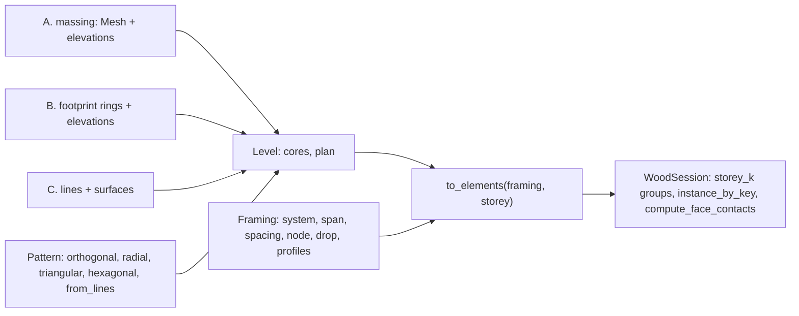

# Grid {#templates_grid}

`src/templates/grid/grid.h` builds a multistorey timber building from a rough shape in a few lines. Three structs a user meets, `wood_grid::Pattern`, `wood_grid::Framing` and `wood_grid::Building`, and the work behind them in three stages, one file each: `grid_levels.cpp` turns the input into level plans, `grid_joints.cpp` holds the joint rules, `grid.cpp` builds the elements; `grid_plan.h/.cpp` is the plan geometry and the records they share.

- `Pattern`: the plan lines a building is drawn on, in parallel families. `orthogonal(xs, ys, skew)`, `radial(radii, sectors, sweep)`, `triangular(side, nx, ny)`, `hexagonal(side, nx, ny)` and `from_lines(lines, families)`; `transformed(xform)` moves it under the building. `compute_bays(length, spacing)` lays Branch3D's whole bays plus a remainder over a length.
- `Framing`: how every level is framed and jointed. `system` 0 point supported, 1 post and beam, 2 purlin on girder; `span` the family the girders run on, -1 every line a beam; `spacing` of the purlin stations; `node` 0 head, 1 flush, 2 through; `drop` of the girder top; `deck`, `wall`, `head`, `reach`, `capital`, `panel`, `taper`, `facade`; and `Profiles`, a section per role (column, girder, beam, purlin, brace) from `wood_profile.h`: rectangle, round, W, HSS, double, slab band, T. A perimeter member is the girder, beam or purlin its line would carry inside.
- `Building`: the levels. `from_solid(massing, elevations, pattern, cores)` slices a closed mesh (workflow A; a BRep goes in as its `mesh()`), `from_footprint(rings, elevations, pattern, cores)` repeats a footprint at every level (workflow B), `from_lines(lines, surfaces)` reads drawn members and surfaces (workflow C). Every level holds its datum, its core rings and a `plan`, a kernel `Mesh::from_arrangement` of the pattern inside the section rings, whose faces are bays, edges member lines and vertices column points, with a double attribute per meaning a user may change before building. `to_elements(framing, storey)` gives the storey's elements in world space with their joints resolved, `to_session(session, framing)` adds every storey under a `storey_k` group.

Cores are never in the arrangement: a core ring makes pinwheel walls over the storey, a hole in every deck, no column inside it or within its wall band, and every member or purlin station crossing it is split at the wall's outer faces. A footprint ring, hole or courtyard must cross a pattern line to become a boundary of the plan.

The plan attributes a user may set before `to_elements`, all doubles; a face, edge or vertex without one takes the rule's value:

| On | Attribute | Meaning |
|---|---|---|
| face | `system`, `span` | the `Framing` field of that name for this bay |
| face | `floor` | 1 under a deck |
| edge | `role` | 0 none, 1 girder, 2 beam, 3 purlin, 4 brace |
| edge | `family`, `boundary`, `wall`, `line` | pattern family, 1 on the perimeter, 1 facade and 2 core wall, the source line id |
| vertex | `column` | 0 none, 1 a column, 2 a transfer nothing below carries |
| vertex | `boundary`, `line_a`, `line_b` | 1 on the perimeter; the two lines that made it, its identity across levels |

Joints are small rules in `grid_joints.cpp`, not per-case code. At every plan vertex the members are ranked (perimeter, girder, beam, purlin, brace); the highest runs through and the rest butt into its side, or into the column face under nodes 1 and 2; a member with anything straight across the node runs through it, so only a pure corner (an L of two perimeter members, a Y of three equal beams) is mitred on the bisector; a through member with nothing beyond it stops at the farthest corner of what butts into it, or over the column's far face under node 0. A member's height layer says whether a cut is made at all: girders drop by `drop`, a purlin over a stacked girder is not cut but rests on it. Decks are one Clipper difference per bay: the bay pushed out to the outer faces of the perimeter members and columns, minus the columns rising through it (node 2), the core walls, and the decks built before it, so a re-entrant corner belongs to one deck alone; `panel` splits a deck into strips across its span.

Column heads (`node` 0) take their shape from what they carry. Where members arrive the head is a convex pyramid exactly as deep as they are: one side per plan direction, the side under a member its sloped end face that the member rests on, every other side on the column face, and a sloped chamfer between every two neighbouring members, as compas_grid's column head. Under post and beam the deck sits in the bay between the members, its top flush with theirs and its corners cut by the heads. Where only the deck arrives (point supported) the head flares up to `reach`, by `Framing::capital`: 0 conical, a frustum from the column section; 1 stepped, a capital to halfway under a drop panel (a second element, `drop_panel`), cut back at the deck edge. Every head is cut back at a core wall. Every cut is a `Plane` in the element's `cuts`, applied by `Mesh::cut_by_plane` when the solid is built, so every element touches its neighbours face to face and none overlap; `templates_grid_5_framing` proves it by cutting every pair of overlapping elements against each other and failing on any volume left.

## 3_elements_tree

A two storey L of five bays - three by two with the far corner bay left open - with a beam on every grid line, so the heads meet every case: two beams at the outer corners, three on the edges, four inside and at the re-entrant corner. Each storey is a branch of the tree with a group per kind of element, and `compute_face_contacts(0)` pairs across the storeys, every column standing on the head below. `INSTANCES` keeps one definition each of column, head, beam and deck, placed by instances.

Example code: 3_elements_tree.cpp

\include{lineno} 3_elements_tree.cpp

## templates_grid_1_footprint

Workflow B, nine buildings side by side over three storeys, one group each: an L with uneven bays, purlins on girders and facade walls; a grid whose y lines lean 30 degrees with flush columns; a radial plan with girders on the rays; triangular and hexagonal cells with every line a beam mitred at the nodes; five hand-drawn axes clipped to a five-sided footprint; a courtyard ring with columns through the levels; Branch3D's pentagon with girders hung 8 in and purlins at 10 ft; its institutional U with two cores as pinwheel walls.

Example code: templates_grid_1_footprint.cpp

\include{lineno} templates_grid_1_footprint.cpp

## templates_grid_2_solid

Workflow A, six massings sliced at their levels: a box; a pentagonal prism whose diagonal side cuts every girder, purlin and deck obliquely; a tapered loft whose perimeter columns lean to follow the moving section within `taper`; a podium with a tower, the tower ring added to the roof plan so every tower column stands on a podium column or girder; a block with an atrium through every level; a cylinder whose facet corners fall on the sixteen rays.

Example code: templates_grid_2_solid.cpp

\include{lineno} templates_grid_2_solid.cpp

## templates_grid_3_lines

Workflow C, line by line: the crea dataset compas_grid ships, read from `data/crea/<INPUT>_input.pb`, every column, beam, floor, facade and core quad as drawn, the vertical quads as the walls compas_grid drops, every line a beam ending on the head tops and its neighbours' sides; and a braced frame drawn as lines and floor quads, every brace cut by the column faces, the deck top at its foot and the beam bottom at its head.

Example code: templates_grid_3_lines.cpp

\include{lineno} templates_grid_3_lines.cpp

## templates_grid_4_reference

The reference configurations side by side: Branch3D's 60 ft square in its three structural methods (plate on columns with stepped heads under CLT strips, post and beam, purlin on girder with the girders hung 8 in), its residential L with a core, and the four FAST+EPP timber bay variants with the datum at the framing top, so the members overlay the reference: columns flush with the datum, girders cut by the column faces, purlins cut by the girder sides, CLT strips over the outer column faces. FAST+EPP v3 draws no beam on its short sides; here they carry beams.

Example code: templates_grid_4_reference.cpp

\include{lineno} templates_grid_4_reference.cpp

## templates_grid_5_framing

The joints and sections, fifteen bays side by side: heads that are the column section where the girders run straight over them and conical at the corners, then conical and stepped under a point supported deck in strips; columns flush with the datum and running through the levels with the decks notched round them; purlins flush with, hung from and stacked over their girders; the seven profiles as girders with a matching column. The example ends with the clash check and fails on any overlap.

Example code: templates_grid_5_framing.cpp

\include{lineno} templates_grid_5_framing.cpp

