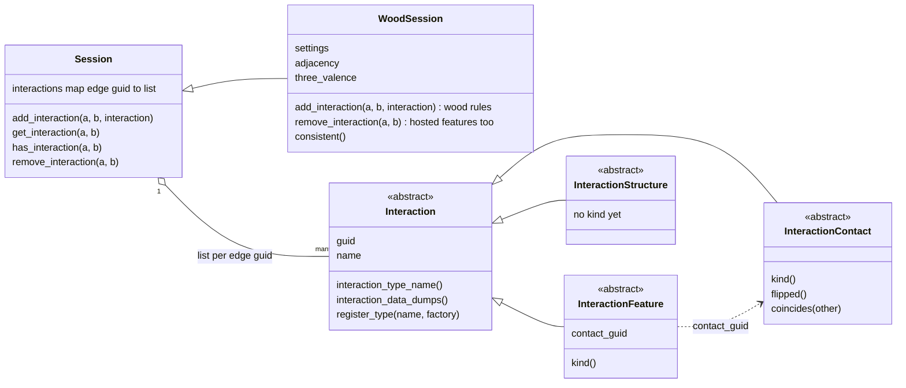
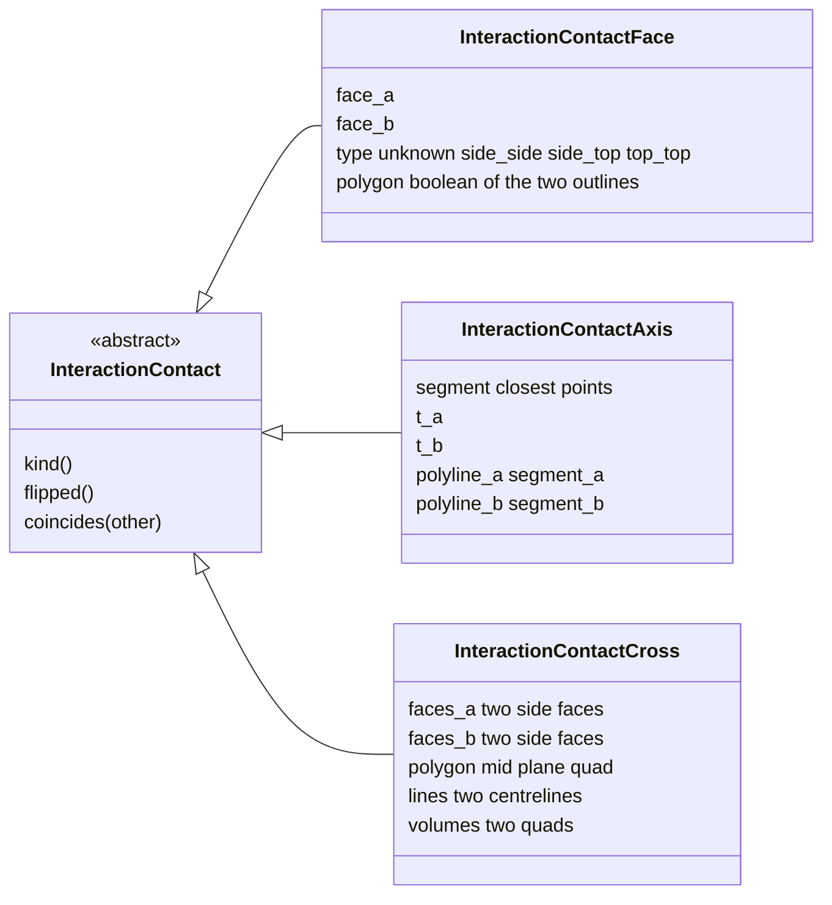
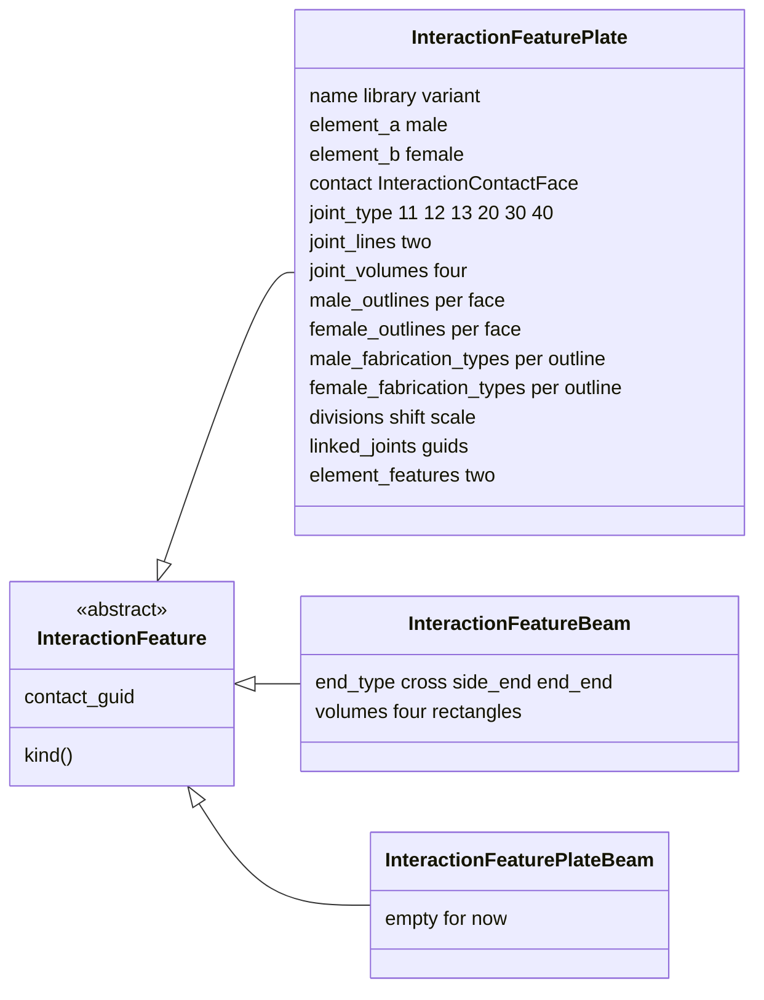
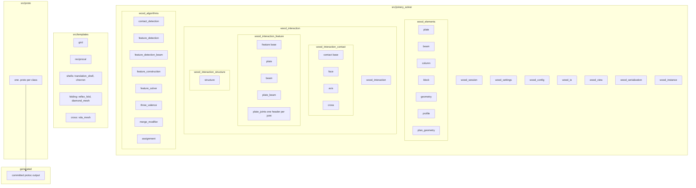
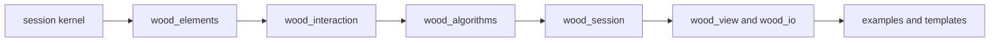
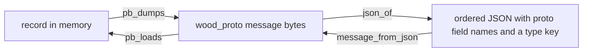
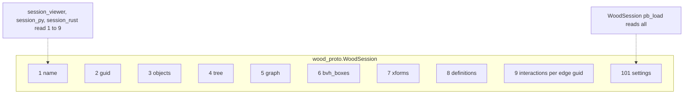
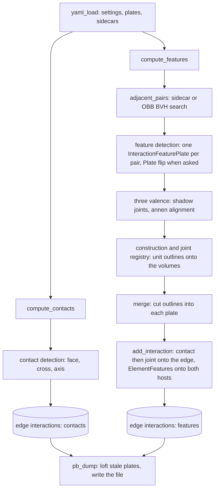
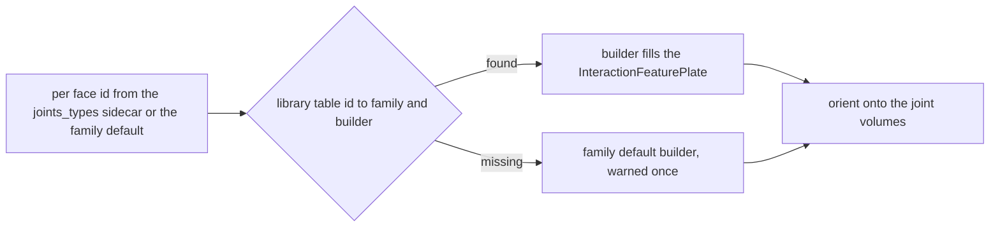
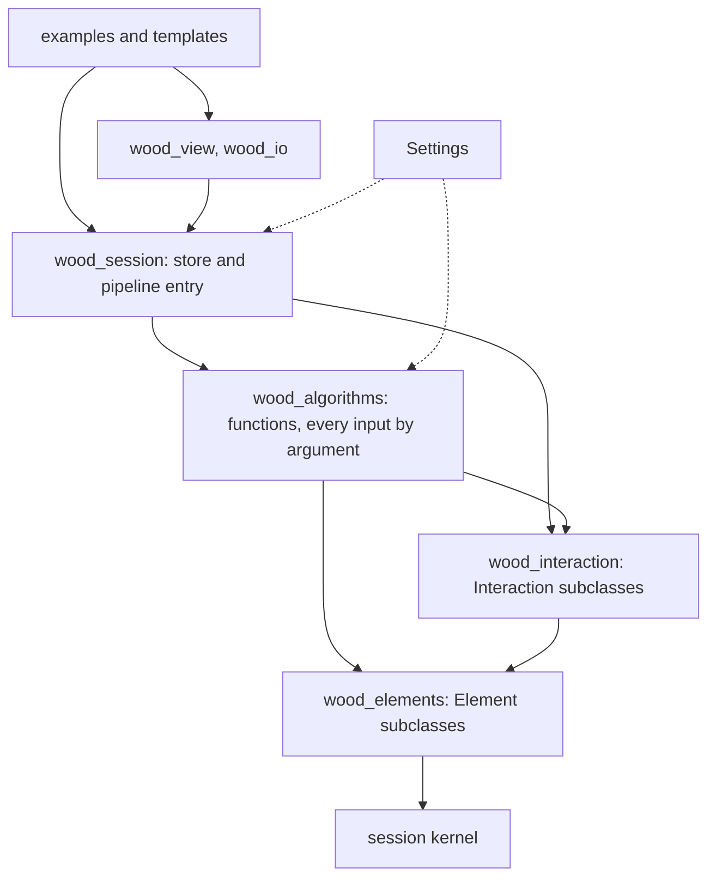

# Structure of Wood

## Connectivity

- The session stores a graph that says which elements are connected. A graph edge (a, b) carries no payload: its guid is the key into the kernel's `Session::interactions`, a map from edge guid to a list of `std::shared_ptr<Interaction>`. The edge is the only place the two element guids are stored; every record below refers to "the first element" (edge v0) and "the second element" (edge v1) and never repeats them.
- `Interaction` is the kernel's abstract base class: a guid, a name ("glue", or the joint library variant of a plate joint), and a registry. Only leaves are concrete: each overrides `interaction_type_name()`, `interaction_data_dumps()` (its own protobuf message) and `clone()`, and registers a factory that rebuilds it from that message, so a pb or JSON load restores the leaf; `WoodSession` registers all six. `InteractionContact`, `InteractionFeature` and `InteractionStructure` are abstract too.
- `InteractionContact` is where the two elements touch, one derived class per kind; it adds `kind()`, `flipped()` and `coincides()`.
    - `InteractionContactFace` stores the two face indices, the class (`ContactType`: unknown, side_side, side_top, top_top) and `polygon`, the Clipper boolean intersection of the two face outlines, closed, in the first face's plane.
    - `InteractionContactAxis` stores the closest segment between two polylines (beam axes, or plate outlines) and where its ends sit: the parameter and the polyline and segment index on each side.
    - `InteractionContactCross` stores what the cross detection computed: the two side faces of each element, the mid-plane polygon, its two centrelines and the two bounding quads.
- `InteractionFeature` is a joint cut between the two elements; it adds `contact_guid`, the guid of the contact on the same edge it was solved from, and `kind()`.
    - `InteractionFeaturePlate` is a plate-to-plate joint: the pair (male `element_a`, female `element_b`), the `InteractionContactFace` it was solved from, the variant name the joint library built (`ss_e_ip_2`, `tt_e_p_0`, ...) as its `name`, joint type, divisions, shift, scale, the two joint lines, the four volume rectangles, the cut outlines per element per face with a `FabricationType` per outline (`wood_interaction_feature_fabrication_type.h`: hole, drill, mill, conic, ...), and the two `session_cpp::ElementFeature` handed to the host elements. The solver builds it in place and the session stores it whole; there is no separate working joint class. The joint library stays one function per variant, one header each under `wood_interaction_feature_plate_joints/`; the variants differ by algorithm, not by data, so there is no subclass per joint.
    - `InteractionFeatureBeam` is a beam-to-beam joint: the end type (crossing, side to end, end to end) and the four volume rectangles.
    - `InteractionFeaturePlateBeam` is reserved, empty.
- `InteractionStructure` is abstract, with no concrete kind until the structural pass exists.
- `WoodSession::add_interaction` adds the wood rules and then calls the kernel's: a contact is oriented to the edge and one coinciding with a stored contact is not stored twice; contacts and joints go onto their elements as features. `remove_interaction` takes those features off again.

- Every element is a closed solid in the kernel's geometry slot, written by its `compute_geometry_mesh()` the first time anything reads the slot, the features or the dimensions: a plate the loft of its two outlines (with the joints cut in once solved), a beam the sweep of a square section per axis vertex, a column its section lofted along its axis, a block the capped loft between its bottom and top loops. What describes an element without being it sits beside the solid as `session_cpp::ElementFeature`s, told apart by `feature_type`: the geometry features `outline` (plate faces 0 and 1), `axis` and `section`, against the joinery features `joint`, `cut` and `joint_type_<n>`. `is_geometry_feature` in `wood_element_geometry` is the one place that split is written. Every feature carries the kernel's `visible` flag, on by default: the viewer draws every visible feature of an element, and `WoodSession::set_features_visible(type, bool)` switches one kind off.
- A beam, a column or a block also carries `cuts`, a list of planes: the model geometry is the parametric solid cut by every plane through the kernel's `Mesh::cut_by_plane` / `BRep::cut_by_plane`, each keeping the side its normal points to. A plate's cuts stay outlines. The grid template resolves every joint into such planes, so a member ends flush on the face it butts into and no two solids overlap.
- Repeated elements can be instances: `WoodSession::instance_by_key` replaces every element `element_key` finds a class and frame for by an instance of that class's definition, keeping its guid, name, tree node, edges and features, so every interaction stays found; `world_elements()` gives every element and instance as world geometry, which is what every pass reads, and `promote` puts a pass's result back. The examples keep `INSTANCES` off until the viewer draws instances.
- The dataset sidecars are not a class of their own: `WoodSession::load_sidecars` puts the adjacency and the three-valence groups on the scene (`adjacency`, `three_valence`) and the insertion vectors and joint types on each plate. Detection reads the elements themselves; there is no detection view class.

## Files

- `wood_settings`: `Settings`, every tunable the solver reads, filled from the dataset yml by `config::load_yaml`, held by the scene, passed by reference into every algorithm and joint builder, written with the scene. `wood_config` keeps only the dataset catalogue and the paths.
- `wood_elements/`: one element class per file, `wood_element_plate`, `wood_element_beam`, `wood_element_column`, `wood_element_block`; `wood_element_geometry` holds what they share: the geometry feature vocabulary, the polyline feature, the sweep through sections, the Newell face planes and the volume of a closed mesh. `wood_profile` is the section library (rectangle, round, W, HSS, double, slab band, T; a profile is loops in the section frame, loop 0 the outline, then holes). The plan geometry of the grid template (sections of a solid at a height, ring booleans, offsets and mitres, `compute_pieces`, `compute_crossings`, `compute_arrangement`, direction polygons at a node) lives in `templates/grid/grid_plan`.
- `wood_instance`: `element_key`, the class key and frame of a column, beam, block or plate, what `WoodSession::instance_by_key` dedups repeated elements by.
- `wood_interaction/`: the folders nest as the data does, one class per file, the file name spelling the path down the tree:
    - `wood_interaction.h` includes every class below
    - `wood_interaction_contact/`: `wood_interaction_contact` (the base), `wood_interaction_contact_face` (+ `_type`), `wood_interaction_contact_axis`, `wood_interaction_contact_cross`
    - `wood_interaction_feature/`: `wood_interaction_feature` (the base), `wood_interaction_feature_plate` (+ `_fabrication_type`), `wood_interaction_feature_beam`, `wood_interaction_feature_plate_beam` (empty for now), `wood_interaction_feature_plate_joints.h` and `wood_interaction_feature_plate_joints/` (one header per joint, plus `custom_outlines`, `tt_e_p_drills`, `cr_c_ip_core` and `ss_e_r_core` for code several joints share)
    - `wood_interaction_structure/`: `wood_interaction_structure` (empty for now)
- `wood_algorithms/`: the computations, kept apart from the data classes and named by what they produce, every input by argument: `wood_contact_detection` (face, cross and axis contacts), `wood_feature_detection` (one plate pair to one InteractionFeaturePlate), `wood_feature_detection_beam` (one beam pair to one InteractionFeatureBeam), `wood_feature_construction` (unit scale, orientation, linked joints, divisions), `wood_feature_solver` (the `compute_features` pipeline and the joint registry), `wood_three_valence`, `wood_merge_modifier`, `wood_assignment` (points and lines placed on plates into their feature types and insertion vectors). Functions, not classes, wherever a function is enough.
- `wood_session`: the scene, the store and the pipeline entry points, nothing else. `wood_view`: the viewer layout, the default grey on every element. `wood_io`: the sidecar and obj readers, `pb_path`, the parity dumps. `wood_serialization`: JSON from a proto message and back. `wood_datasets.h/.cpp`: the dataset runners.
- `proto/`: one protobuf message per class, same names without the `wood_` prefix; `generated/` holds the C++ protoc output, committed, regenerated by `tools/regen_proto.sh` with the protoc the kernel pins.
- `templates/`: the generators, one folder per family, one example each on the [Templates](@ref templates) page. `grid/` is the building template (`Pattern`, `Framing`, `Building`; five examples: one per workflow, the references, the joints with a clash check), `grid.h` and `grid_plan.h` over four `.cpp` files compiled into `wood_core`; `reciprocal/`, `shells/` (translation shell, chevron), `folding/` (reflex fold, diamond mesh) and `cross/` (vda mesh) are header-only and included by their example alone.

## Serialization

- Every leaf writes its own fields as its protobuf message (`wood_proto.InteractionContactFace`, `InteractionFeaturePlate`, ...) into the kernel's `interaction_data` and reads them back in `interaction_data_loads`; the kernel's `pb_dumps` / `jsondump` carry them, and its `pb_loads` / `jsonload` rebuild the leaf through the registry, the guid and the name set by the kernel. Field 100, where older files kept the interactions, is reserved and not read. Kernel geometry inside a message (polylines, lines, element features) is nested as the kernel's own message.
- The element payload the kernel carries opaquely in `element_data` is the class's protobuf message (`wood_proto.Plate`, `Beam`, `Column`, `Block`); a payload written in the kernel's JSON by older files is still read, the one hand-written JSON reader left.
- A scene file is a `wood_proto.WoodSession`: fields 1..9 are `session_proto.Session` field for field, the interactions at 9, then `settings` at 101. The viewer and the py/rust kernels open it as a plain Session, keep an interaction whose type they have no factory for as a kernel `InteractionUnknown` that writes its type and data back unchanged, and drop the settings as an unknown field; `WoodSession::pb_load` reads all of it.
- Interactions are written in edge-guid order as a repeated field, not a protobuf map, so the bytes are identical across languages.

## Pipeline

- `WoodSession::yaml_load` reads the dataset yml into the scene's `settings` and the dataset paths, the obj into plates, and the four sidecars onto the scene (`adjacency`, `three_valence`) and the plates (insertion vectors, feature types).
- `compute_contacts` runs `wood_contact_detection` over every element pair the OBB/BVH search returns and stores one `InteractionContactFace` per overlapping face pair on the pair's edge; `compute_cross_contacts`, `compute_line_contacts` and `compute_axis_contacts` add `InteractionContactCross` and `InteractionContactAxis` the same way.
- `compute_features` runs `wood_feature_solver`: `adjacent_pairs` (the sidecar or the search), `wood_feature_detection` on each pair (one `InteractionFeaturePlate` or nothing; when a joint wants the other face first the second plate is flipped through `Plate::flip`, which resets every cache), `wood_three_valence` (shadow joints, annen alignment), `wood_feature_construction` + the joint registry (unit-box outlines, oriented onto the volumes), `wood_merge_modifier` (the cut outlines stitched into each plate's `features`), then every joint's contact and the joint onto its pair's edge with `add_interaction`, and onto both hosts as `ElementFeature`s.
- `compute_beam_features` runs `wood_feature_detection_beam` on every axis contact between two beams: four volume rectangles per pair, one `InteractionFeatureBeam` each.
- `compute_contacts(level)` pairs elements under the same tree node at that depth, 0 the whole scene, 1 the root's branches: `1_elements_flat` and `1_elements_tree` show both.
- `pb_dump` writes the `wood_proto.WoodSession`, every stale element lofting itself, and cutting itself by its `cuts`, as it is serialized. Contacts and joints are already on their elements as features, put there when they were computed: a contact on its edge's first element, a joint on both hosts; the viewer draws the elements' geometry and every visible feature in the default grey, and the tree stays exactly as the caller built it.

## Architecture review

### What is right

- The data model reads top down and matches the wire: session, edge, interaction, contact or feature, kind. One class per file, folders nested as the data is, one protobuf message per class, the file a superset of the kernel Session. A newcomer can find any record from its name.
- Composition and variants instead of class hierarchies on the edge side; inheritance only where the kernel registry demands it. New kinds are one struct, one message, one `std::get_if` branch.
- Algorithms are functions in files named by what they produce, separated from the data they produce.
- The regression net is strong: 44 datasets with byte-compared outline dumps, plus a full session round trip that exercises every serializer and the kernel reader.

### What was wrong, and what was done about it (2026-09-20)

- **Global mutable configuration.** 39 globals in `wood_config.h` were the real inputs of every algorithm. Gone: `Settings` is a value the scene holds and every algorithm and builder takes by reference; `config` keeps the catalogue and the paths.
- **A dependency pointing the wrong way.** `Beam::joint_volumes` ran the solver from inside an element. Gone: `axis_contacts` and `beam_to_beam` live in the algorithms and `compute_axis_contacts` / `compute_beam_features` run on the scene's beams like the plate pipeline.
- **The solver mutating its inputs.** Detection swapped a plate's faces behind the kernel's cache. Removing the swap changes eight datasets, so it is a real step of the method, not a leak: `Plate::flip` owns it and resets every cache, and contact detection reads the kernel's cached outlines again.
- **The joint library dispatched by hand.** Seven switches over id ranges known only there. Gone: one table, id to family and builder, the family ranges and defaults beside it.
- **`InteractionFeaturePlate` carrying solver scratch.** Run indices and trace counters. Gone: joints link by guid, every feature has its own guid, the counters live in `DetectionTrace` for callers that ask. The pair and the contact are still stored on the joint as well as on the edge and as the contact it names, by choice; `WoodSession::consistent` checks they agree and the round trip asserts it.
- **Two hand-written serializers per class.** Gone: JSON is derived from the proto message; the one reader left is for element payloads of older files.
- **`WoodSession` doing too much.** Viewer layout, readers, assignment tools and the dataset runners moved out to `wood_view`, `wood_io`, `wood_assignment` and `wood_datasets.h`.
- **Vocabulary split between joint and feature.** Feature is the word for the record and the pipeline; joint stays in the library vocabulary (`joint_type`, `joint_lines`, the builder names).

### What remains

- **Kernel: an edge's guid.** `Graph::add_edge` copies an Edge into both directions before it has a guid; wood mints it and stamps the second copy. The kernel fix is to mint at `add_edge`, but Python already shares one object both ways and Rust copies like C++, so all three kernels must change together for the files to stay byte-identical.
- **The joint headers are still `static` functions included into one translation unit.** The registry makes the solver blind to that, but a proper library would make them ordinary functions with include guards in their own translation unit.
- **`compute_features` both stores and returns.** Callers that act on the return value after a second run read a stale copy; the return should go once nothing depends on it.
- **The shell templates are header-only.** `src/templates/reciprocal`, `shells`, `folding` and `cross` still hold their generators as headers compiled by the one main that includes each; `grid/` is already `.h` / `.cpp` pairs in `wood_core`, the pattern the rest should follow.

### The layering, as it stands

- `wood_elements` knows the kernel. `wood_interaction` knows elements. `wood_algorithms` knows both and takes every input by argument. `wood_session` orchestrates and stores; `wood_view` and `wood_io` sit beside it. Examples and templates sit on top. A grep of the includes shows no arrow pointing up.
